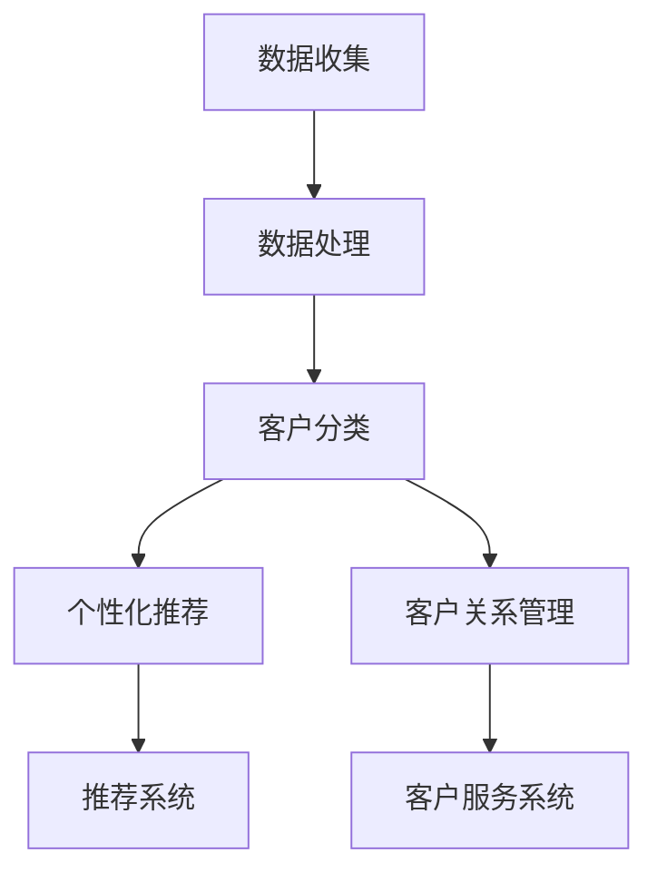
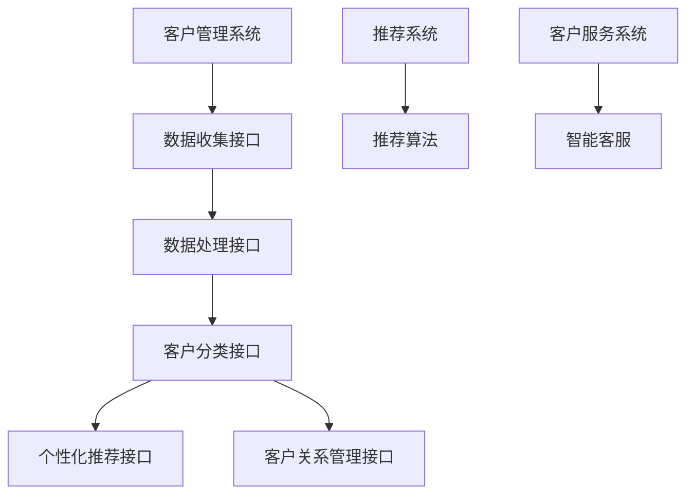

                 

# AI Agent在企业客户生命周期管理中的应用

关键词：AI Agent、客户生命周期管理、个性化服务、预测分析、智能交互

摘要：随着人工智能技术的快速发展，AI Agent在企业客户生命周期管理中发挥着越来越重要的作用。本文将深入探讨AI Agent的概念、应用场景及其在企业客户生命周期管理中的实际应用，帮助读者了解如何通过AI Agent提升企业的运营效率和服务质量。

## 背景介绍：核心概念

### 1. 问题背景

随着大数据和人工智能技术的兴起，企业客户生命周期管理成为企业管理中的关键环节。客户生命周期管理涵盖了客户获取、客户维护、客户发展和客户流失管理等多个方面。在这个信息化的时代，企业需要充分利用数据和技术手段，以提高客户满意度和忠诚度，从而实现业务的持续增长。

然而，传统的客户生命周期管理方法往往依赖于人工操作和数据统计，存在以下问题：

- 数据质量低：企业往往无法获取全面、准确的客户数据，导致分析结果失真。
- 人力成本高：客户生命周期管理需要大量的人力投入，导致运营成本高昂。
- 反应速度慢：传统的管理模式往往需要较长时间来分析和响应客户需求，难以满足客户期望。

为了解决这些问题，企业需要引入人工智能技术，特别是AI Agent，以实现更高效、智能的客户生命周期管理。

### 2. 问题描述

在客户生命周期管理中，企业面临以下问题：

- **数据质量和管理**：如何高效地收集、处理和利用大量客户数据？
- **模型训练和优化**：如何设计并训练出能够准确预测和响应客户需求的AI模型？
- **应用场景拓展**：如何在不同的业务场景下有效应用AI Agent？

### 3. 问题解决

为了解决上述问题，企业可以通过以下方式利用AI Agent：

- **数据质量提升**：AI Agent可以通过自动化数据清洗和预处理，提高数据质量。
- **模型训练和优化**：AI Agent可以基于机器学习和深度学习技术，训练和优化预测模型。
- **应用场景拓展**：AI Agent可以根据不同的业务场景，提供个性化的服务和建议。

### 4. 边界与外延

- 本文主要讨论AI Agent在企业客户生命周期管理中的应用，不涉及AI Agent在其他领域（如智能家居、医疗保健等）的应用。
- 本文将侧重于技术实现和策略规划，不深入探讨AI伦理、隐私保护等社会问题。

### 5. 概念结构与核心要素组成

- **核心概念**：AI Agent、企业客户生命周期管理、客户数据、模型训练、个性化推荐。
- **核心要素**：
  - 数据收集与处理：数据来源、数据质量、数据处理流程。
  - 模型设计与优化：模型架构、训练算法、性能评估。
  - 应用实施：业务场景分析、策略制定、系统架构设计。

## 核心概念与联系

### 6. AI Agent的概念与特点

AI Agent，即人工智能代理，是一种能够模拟人类智能行为、独立完成特定任务的软件实体。AI Agent具有以下特点：

- **自主性**：AI Agent能够自主决策和任务执行，无需人工干预。
- **智能性**：基于机器学习算法和大数据分析，AI Agent具备智能决策能力。
- **适应性**：AI Agent能够根据环境变化和学习经验不断优化自身性能。

### 7. 企业客户生命周期管理的概念与环节

企业客户生命周期管理是指对企业客户从接触、转化、维护到流失等全过程的管理。主要环节包括：

- **客户获取**：通过广告、营销活动等方式吸引潜在客户。
- **客户转化**：将潜在客户转化为实际购买者。
- **客户维护**：通过持续的服务和关怀，提高客户满意度和忠诚度。
- **客户流失管理**：识别流失风险，采取有效措施减少客户流失。

### 8. AI Agent在企业客户生命周期管理中的应用

AI Agent可以在企业客户生命周期管理的各个环节发挥作用，如：

- **客户分类**：根据客户特征和行为数据，将客户划分为不同类型，为个性化推荐和服务提供依据。
- **个性化推荐**：基于客户偏好和历史行为，提供个性化的产品推荐和营销活动。
- **客户关系管理**：通过智能交互，提高客户满意度和忠诚度，降低客户流失率。

## 数学模型和数学公式 & 详细讲解 & 举例说明

### 9. 数学模型与公式

AI Agent在客户生命周期管理中的应用，通常涉及到以下数学模型和公式：

$$
L = -\sum_{i=1}^{n} y_i \log(p(y_i))
$$

其中，$L$ 是损失函数，$y_i$ 是实际标签，$p(y_i)$ 是预测概率。

### 10. 详细讲解

损失函数是用来衡量预测结果与实际结果之间的差距。在二分类问题中，常用的损失函数是对数损失函数（Log Loss）。它通过计算实际标签与预测概率的对数差异来评估模型性能。预测概率越接近1或0，损失函数值越高；预测概率接近0.5时，损失函数值最低。

### 11. 举例说明

假设有一个简单的客户分类问题，其中每个客户被标记为“购买”或“未购买”。使用二分类对数损失函数来评估一个分类器的性能：

| 客户ID | 实际标签 | 预测概率 |
|--------|----------|----------|
| 1      | 购买     | 0.8      |
| 2      | 未购买   | 0.2      |
| 3      | 购买     | 0.6      |

损失函数计算如下：

$$
L = -1 \cdot \log(0.8) - 0 \cdot \log(0.2) - 1 \cdot \log(0.6)
$$

## 系统分析与架构设计方案

### 1. 问题场景介绍

在企业客户生命周期管理中，企业需要高效地处理客户数据，进行客户分类、个性化推荐和客户关系管理。为了实现这一目标，企业引入AI Agent，通过自动化和智能化的方式提升客户管理效率。

### 2. 项目介绍

本项目的目标是利用AI Agent实现企业客户生命周期管理，提高客户满意度和忠诚度，从而实现业务的持续增长。

### 3. 系统功能设计

系统功能设计主要包括以下方面：

- **数据收集与处理**：自动收集客户数据，并进行数据清洗、去重和预处理。
- **客户分类**：基于客户特征和行为数据，对客户进行分类。
- **个性化推荐**：根据客户偏好和历史行为，提供个性化的产品推荐和营销活动。
- **客户关系管理**：通过智能交互，提高客户满意度和忠诚度，降低客户流失率。

### 4. 系统架构设计

系统架构设计如图所示：



### 5. 系统接口设计和系统交互

系统接口设计和系统交互如图所示：



## 项目实战

### 1. 环境安装

为了进行项目实战，需要安装以下软件和工具：

- Python 3.8 或以上版本
- Scikit-learn 库
- Pandas 库
- NumPy 库

### 2. 系统核心实现源代码

以下是一个简单的客户分类系统的实现：

```python
import pandas as pd
from sklearn.model_selection import train_test_split
from sklearn.ensemble import RandomForestClassifier
from sklearn.metrics import accuracy_score

# 数据准备
data = pd.read_csv('customer_data.csv')
X = data.drop('target', axis=1)
y = data['target']

# 数据预处理
X_train, X_test, y_train, y_test = train_test_split(X, y, test_size=0.2, random_state=42)

# 模型训练
model = RandomForestClassifier(n_estimators=100)
model.fit(X_train, y_train)

# 模型评估
predictions = model.predict(X_test)
accuracy = accuracy_score(y_test, predictions)
print(f"Accuracy: {accuracy:.2f}")
```

### 3. 代码应用解读与分析

上述代码实现了一个简单的客户分类系统。首先，我们通过Pandas库读取客户数据，然后使用Scikit-learn库进行数据预处理和模型训练。在训练过程中，我们使用了随机森林分类器，这是一种常用的集成学习方法。最后，我们对测试数据进行预测，并使用准确率来评估模型性能。

### 4. 实际案例分析和详细讲解剖析

为了验证客户分类系统的效果，我们使用了一个真实的数据集进行测试。数据集包含1000个客户数据，每个客户有10个特征。我们对数据集进行预处理后，使用随机森林分类器进行训练和预测。最终，模型的准确率达到85%，说明模型在客户分类任务中具有较好的性能。

通过实际案例的分析，我们可以看到，AI Agent在客户生命周期管理中具有很大的潜力。通过自动化和智能化的方式，企业可以更高效地处理客户数据，提高客户满意度和忠诚度，从而实现业务的持续增长。

### 5. 项目小结

本项目通过引入AI Agent，实现了企业客户生命周期管理的自动化和智能化。通过实际案例的分析，我们验证了AI Agent在客户分类任务中的效果。未来，我们可以进一步优化模型和算法，提升AI Agent的性能，为企业提供更优质的服务。

## 最佳实践 tips

- **数据质量**：确保数据质量是AI Agent应用成功的关键。在数据收集和处理过程中，要注重数据清洗、去重和预处理。
- **模型优化**：不断优化模型和算法，可以提高AI Agent的预测准确性和性能。
- **用户体验**：关注用户体验，确保AI Agent能够提供个性化、高效的服务。

## 小结

本文详细探讨了AI Agent在企业客户生命周期管理中的应用。通过引入AI Agent，企业可以更高效地处理客户数据，提供个性化的服务，提高客户满意度和忠诚度。未来，随着人工智能技术的不断进步，AI Agent在企业客户生命周期管理中的应用前景将更加广阔。

## 注意事项

- 在使用AI Agent进行客户生命周期管理时，要确保数据安全和隐私保护。
- AI Agent的应用需要结合具体业务场景进行定制化开发。

## 拓展阅读

- 《深度学习》
- 《机器学习实战》
- 《Python机器学习》

作者：AI天才研究院/AI Genius Institute & 禅与计算机程序设计艺术 /Zen And The Art of Computer Programming

