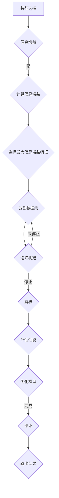
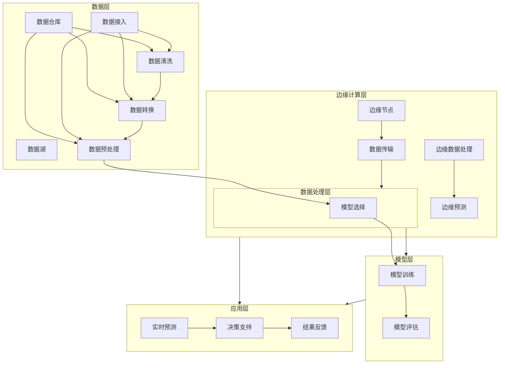
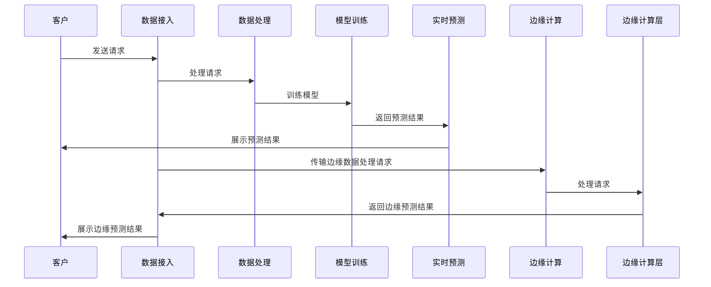

                 


### 设计思路

《AI Agent在企业客户行为分析与预测中的应用》的设计思路如下：

1. **背景介绍**：首先，我们需要为读者提供必要的背景信息，让他们了解AI Agent的概念、企业客户行为分析的重要性以及预测客户行为的需求。

2. **核心概念与联系**：接下来，我们将详细阐述AI Agent的技术原理、客户行为分析的基础知识以及预测模型的关键组成部分。这部分内容将包括核心概念的详细解释、概念属性特征对比表格和ER实体关系图架构的Mermaid流程图。

3. **算法原理讲解**：我们将详细讲解用于预测客户行为的常见算法，如决策树、神经网络等。这部分内容将使用mermaid流程图和Python代码来展示算法原理，并使用LaTeX格式来准确表达数学模型和公式。

4. **数学模型和数学公式**：我们将介绍算法背后的数学原理，使用LaTeX格式编写数学模型和公式，并辅以通俗易懂的举例说明。

5. **系统分析与架构设计**：我们将分析AI Agent系统在客户行为预测中的应用场景，设计系统的功能、架构、接口和交互，使用mermaid图直观展示系统架构。

6. **项目实战**：我们将提供一个实际的AI Agent应用案例，包括环境安装、系统核心实现、代码解析、案例分析等，帮助读者更好地理解AI Agent在实际中的应用。

7. **最佳实践 tips**、**小结**、**注意事项**和**拓展阅读**等内容，将帮助读者巩固知识并探索更多相关领域。

### 设计步骤

1. **确定大纲结构**：根据上述设计思路，确定文章的大纲结构，确保覆盖所有关键内容。

2. **细化章节内容**：为每个章节细化内容，确保每个小节的内容具体、详细。

3. **使用mermaid图**：为算法原理和系统设计添加mermaid图，以直观展示流程和架构。

4. **编写LaTeX数学公式**：确保所有数学模型和公式都使用LaTeX格式编写，以保证准确性和可读性。

5. **编写Python代码示例**：提供Python代码示例，用于说明算法原理和系统实现。

6. **总结与扩展**：在每个章节末尾添加小结、注意事项、最佳实践和拓展阅读等内容。

7. **撰写文章正文**：根据大纲结构，撰写文章正文，确保内容逻辑清晰、结构紧凑、简单易懂。

8. **审查与修改**：对文章进行审查，确保内容完整、准确，无遗漏和错误。

9. **格式调整**：确保文章格式符合markdown要求，包括标题、段落、列表、公式等的格式。

10. **添加作者信息**：在文章末尾添加作者信息，包括作者姓名、单位、联系方式等。

### 目录大纲示例

```
----------------------------------------------------------------
# 第一部分：背景介绍

## 1.1 问题背景
### 1.1.1 AI Agent的定义
### 1.1.2 企业客户行为分析的重要性
### 1.1.3 预测客户行为的需求

## 1.2 相关领域发展
### 1.2.1 AI Agent的发展
### 1.2.2 企业客户行为分析的发展
### 1.2.3 预测客户行为技术的进步

----------------------------------------------------------------

# 第二部分：核心概念与联系

## 2.1 AI Agent技术原理
### 2.1.1 AI Agent的基础概念
### 2.1.2 AI Agent的核心组件
### 2.1.3 AI Agent的工作原理

## 2.2 客户行为分析基础知识
### 2.2.1 客户行为分析的定义
### 2.2.2 客户行为分析的关键要素
### 2.2.3 客户行为分析的方法

## 2.3 预测模型关键组成部分
### 2.3.1 预测模型的定义
### 2.3.2 预测模型的关键组成部分
### 2.3.3 预测模型的分类

----------------------------------------------------------------

## 3.1 算法原理讲解

### 3.1.1 决策树
#### 3.1.1.1 决策树的基本概念
#### 3.1.1.2 决策树的工作原理
#### 3.1.1.3 决策树的构建过程
##### 3.1.1.3.1 特征选择
##### 3.1.1.3.2 决策树的剪枝
##### 3.1.1.3.3 决策树的评估与优化

### 3.1.2 神经网络
#### 3.1.2.1 神经网络的基本概念
#### 3.1.2.2 神经网络的工作原理
#### 3.1.2.3 神经网络的架构
##### 3.1.2.3.1 前馈神经网络
##### 3.1.2.3.2 循环神经网络
##### 3.1.2.3.3 卷积神经网络

----------------------------------------------------------------

## 4.2 数学模型和数学公式

### 4.2.1 决策树
#### 4.2.1.1 信息增益公式
##### $$
\text{IG}(A,V) = \sum_{v \in V} p(v) \cdot \sum_{a \in A} p(a|v) \cdot \log_2 \frac{p(a|v)}{p(v)
```### 第一部分：背景介绍

## 1.1 问题背景

### 1.1.1 AI Agent的定义

AI Agent，即人工智能代理，是一种能够模拟人类决策过程的计算机程序。它通过感知环境信息、理解任务目标，并自主决策以实现目标的自动化系统。AI Agent的核心在于其自主性和适应性，能够不断学习、优化和改进其行为策略。

在企业客户行为分析与预测中，AI Agent的应用至关重要。企业通过收集大量客户数据，利用AI Agent对客户行为进行分析，可以更准确地预测客户需求、行为趋势和市场动态，从而制定更加精准的营销策略和运营计划。

### 1.1.2 企业客户行为分析的重要性

企业客户行为分析是指通过对客户行为数据的收集、处理和分析，提取出有价值的信息，以便更好地理解客户需求、优化客户体验和提升客户满意度。随着大数据和人工智能技术的发展，企业客户行为分析已经成为企业提升竞争力的重要手段。

客户行为分析的重要性体现在以下几个方面：

1. **个性化营销**：通过分析客户行为数据，企业可以更好地了解客户的喜好、需求和购买行为，从而实现个性化营销，提高营销效果和客户转化率。
2. **客户保留**：通过对客户行为数据的深入分析，企业可以发现客户流失的原因，并采取相应的措施进行客户保留，降低客户流失率。
3. **市场洞察**：客户行为分析可以帮助企业了解市场趋势、竞争对手动态和潜在客户需求，为企业制定市场策略提供有力支持。
4. **业务优化**：客户行为分析可以帮助企业识别业务中的问题和瓶颈，优化业务流程和运营策略，提高整体运营效率。

### 1.1.3 预测客户行为的需求

预测客户行为是企业制定有效策略的关键。随着市场环境的复杂化和竞争的加剧，企业需要更快速、准确地预测客户行为，以抢占市场先机。以下是预测客户行为的需求：

1. **精准营销**：通过预测客户行为，企业可以提前了解客户需求，制定精准的营销策略，提高营销效率和转化率。
2. **需求预测**：预测客户行为可以帮助企业预测未来市场需求，提前准备生产和供应链资源，降低库存成本。
3. **风险控制**：预测客户行为可以帮助企业识别潜在的风险和问题，提前采取预防措施，降低经营风险。
4. **产品优化**：通过分析客户行为数据，企业可以了解客户对产品的使用情况和满意度，从而优化产品设计和功能，提高客户满意度。

总之，AI Agent在企业客户行为分析与预测中的应用具有重要意义。随着技术的不断进步，AI Agent将为企业带来更高的效率和更准确的决策支持，成为企业提升竞争力的关键因素。

## 1.2 相关领域发展

### 1.2.1 AI Agent的发展

AI Agent作为人工智能领域的一个重要分支，其发展历程可以追溯到20世纪50年代。当时，人工智能的创始人约翰·麦卡锡（John McCarthy）首次提出了“人工智能”这个概念。随着计算机技术和算法的进步，AI Agent逐渐成为人工智能领域的研究热点。

AI Agent的发展可以分为几个阶段：

1. **规则基础阶段**：早期AI Agent主要依赖于预定义的规则进行决策。这些规则通常由专家知识工程师根据领域知识编写。虽然这种方法在特定领域取得了成功，但受限于规则的数量和复杂性，难以应对复杂多变的环境。
2. **统计学习阶段**：随着统计学习理论的兴起，AI Agent开始利用大量数据进行学习，提高了自主性和适应性。监督学习、无监督学习和强化学习等算法的应用，使得AI Agent能够在不同环境中进行有效的决策。
3. **深度学习阶段**：近年来，深度学习技术的飞速发展，使得AI Agent的性能得到了显著提升。通过深度神经网络，AI Agent能够从大量数据中自动学习特征表示，实现更复杂、更智能的决策。

### 1.2.2 企业客户行为分析的发展

企业客户行为分析作为一个交叉学科，融合了市场营销、统计学、计算机科学等多个领域的知识。其发展历程可以分为以下几个阶段：

1. **传统分析阶段**：早期企业客户行为分析主要依靠人工收集和分析数据，采用简单的统计分析方法，如描述性统计、回归分析等。这种方法虽然能够提供一些有价值的信息，但受限于数据量和分析方法的局限性，难以实现深度的客户行为洞察。
2. **数据挖掘阶段**：随着大数据技术的兴起，企业客户行为分析开始采用数据挖掘技术，通过机器学习算法挖掘大量数据中的潜在模式和信息。这种方法大大提高了客户行为分析的深度和广度，为企业的决策提供了更全面的支持。
3. **人工智能阶段**：随着人工智能技术的不断进步，企业客户行为分析开始引入AI Agent，通过机器学习和深度学习技术，实现自动化、智能化的客户行为预测和分析。AI Agent的应用，使得企业能够更快速、准确地理解客户需求，制定更有效的营销策略。

### 1.2.3 预测客户行为技术的进步

预测客户行为技术是客户行为分析的核心，其进步主要体现在以下几个方面：

1. **模型多样性**：传统的预测技术主要包括线性回归、逻辑回归、决策树等。随着机器学习和深度学习技术的发展，出现了更多复杂的预测模型，如随机森林、支持向量机、神经网络等。这些模型在处理复杂数据和特征时表现更好，能够提供更准确的预测结果。
2. **算法优化**：通过算法优化，预测客户行为技术的计算效率和预测准确性得到了显著提升。例如，梯度提升树（GBDT）和深度神经网络（DNN）等算法在处理大规模数据和特征时表现优异。
3. **实时预测**：随着云计算和边缘计算的发展，预测客户行为技术实现了实时预测。企业可以在客户行为发生的同时，进行实时分析预测，快速响应客户需求，提供个性化的服务和体验。

总之，AI Agent在企业客户行为分析与预测中的应用，得益于人工智能技术的快速发展。通过不断优化算法、提升计算效率，AI Agent能够为企业提供更准确、更全面的客户行为预测和分析，助力企业实现数字化转型和业务增长。

## 1.3 研究意义

研究AI Agent在企业客户行为分析与预测中的应用具有重要的现实意义和理论价值：

### 现实意义

1. **提升企业竞争力**：通过AI Agent的精确预测和分析，企业可以更好地了解客户需求，制定个性化的营销策略，提高客户满意度和忠诚度，从而在激烈的市场竞争中脱颖而出。
2. **优化运营效率**：AI Agent能够自动化处理大量的客户行为数据，提高数据分析的效率和质量。企业可以利用这些数据优化业务流程、提升运营效率，降低成本。
3. **推动数字化转型**：AI Agent的应用有助于企业实现数字化转型，通过大数据和人工智能技术，构建智能化、自动化的业务系统，提升企业的核心竞争力。
4. **创新业务模式**：AI Agent能够帮助企业探索新的业务模式和商业模式，如精准营销、个性化推荐等，为企业带来新的增长点和盈利途径。

### 理论价值

1. **拓展人工智能应用领域**：AI Agent在企业客户行为分析与预测中的应用，为人工智能技术在商业领域的应用提供了新的思路和案例，拓展了人工智能的应用边界。
2. **优化算法和模型**：通过对AI Agent在客户行为预测中的实践，可以不断优化和改进算法和模型，提高预测的准确性和效率，为人工智能技术的发展提供理论支持。
3. **深化客户行为研究**：AI Agent的应用有助于深入研究客户行为，揭示客户行为背后的规律和趋势，为市场营销理论和实践提供新的依据。

总之，研究AI Agent在企业客户行为分析与预测中的应用，不仅有助于提升企业的运营效率和竞争力，也为人工智能技术的发展和市场营销理论的研究提供了重要参考。

## 1.4 文章结构与核心内容

本文旨在深入探讨AI Agent在企业客户行为分析与预测中的应用，文章结构如下：

### 第一部分：背景介绍
- **问题背景**：介绍AI Agent的定义、企业客户行为分析的重要性以及预测客户行为的需求。
- **相关领域发展**：阐述AI Agent、企业客户行为分析和预测客户行为技术的历史发展过程。
- **研究意义**：分析AI Agent在企业客户行为分析与预测中的应用的现实意义和理论价值。

### 第二部分：核心概念与联系
- **AI Agent技术原理**：详细讲解AI Agent的基础概念、核心组件和原理。
- **客户行为分析基础知识**：介绍客户行为分析的定义、关键要素和常用方法。
- **预测模型关键组成部分**：分析预测模型的基础知识，包括定义、组成部分和分类。

### 第三部分：算法原理讲解
- **决策树**：解释决策树的基本概念、工作原理和构建过程，使用mermaid图和Python代码进行演示。
- **神经网络**：讲解神经网络的基本概念、工作原理和架构，包括前馈神经网络、循环神经网络和卷积神经网络。

### 第四部分：数学模型和数学公式
- **决策树**：介绍决策树背后的数学原理，包括信息增益、基尼不纯度和ID3算法。
- **神经网络**：讲解神经网络中的激活函数、损失函数和反向传播算法。

### 第五部分：系统分析与架构设计
- **系统功能设计**：介绍AI Agent在客户行为预测中的系统功能设计，包括数据收集、预处理、特征提取和模型训练等。
- **系统架构设计**：讲解AI Agent在客户行为预测中的系统架构设计，包括数据流、模块接口和交互方式。
- **系统接口设计和系统交互**：展示系统接口设计和系统交互的mermaid序列图。

### 第六部分：项目实战
- **环境安装**：介绍AI Agent在客户行为预测中的应用环境安装和配置。
- **系统核心实现**：展示AI Agent在客户行为预测中的系统核心实现，包括数据预处理、特征提取和模型训练等。
- **代码解析**：解析关键代码实现，解释算法原理和系统架构。
- **案例分析**：提供实际案例，分析客户行为预测的结果和应用效果。
- **项目小结**：总结项目经验，提出改进建议和未来研究方向。

### 第七部分：最佳实践 tips、小结、注意事项和拓展阅读
- **最佳实践 tips**：总结AI Agent在客户行为预测中的最佳实践，提供操作建议。
- **小结**：总结全文，强调AI Agent在客户行为分析与预测中的重要作用。
- **注意事项**：提醒读者在应用AI Agent时需要注意的问题和潜在风险。
- **拓展阅读**：推荐相关领域的文献和资料，供读者进一步学习。

通过上述结构，本文将全面、系统地探讨AI Agent在企业客户行为分析与预测中的应用，帮助读者深入了解这一领域，并为实际应用提供指导。## 第二部分：核心概念与联系

### 2.1 AI Agent技术原理

#### 2.1.1 AI Agent的基础概念

AI Agent（人工智能代理）是一种基于人工智能技术的自动化实体，它可以在复杂环境中自主地感知、思考并采取行动，以实现特定目标。AI Agent通常由以下几个关键组成部分构成：

1. **感知器（Perception）**：感知器是AI Agent的感官系统，用于接收环境中的各种信息，如文本、图像、音频等。感知器将获取的信息转化为内部表示，以便AI Agent进行理解和处理。
2. **思考器（Reasoning）**：思考器是AI Agent的决策系统，负责分析感知器收集到的信息，并根据预定的目标和规则，生成适当的行动方案。思考器通常包括知识库、推理机和规划器等组件。
3. **行动器（Action）**：行动器是AI Agent的执行系统，负责将思考器生成的行动方案转化为实际的操作，如发送电子邮件、执行交易等。行动器与外部环境进行交互，实现AI Agent的目标。

#### 2.1.2 AI Agent的核心组件

AI Agent的核心组件包括感知器、思考器和行动器。每个组件都有其特定的功能和作用：

1. **感知器**：
   - **功能**：感知器负责收集和接收外部环境的信息，如文本、图像、音频等。
   - **作用**：感知器是AI Agent与外部环境交互的桥梁，为思考器提供必要的信息输入。

2. **思考器**：
   - **功能**：思考器负责分析感知器收集到的信息，并根据预定的目标和规则，生成适当的行动方案。
   - **作用**：思考器是AI Agent的核心决策系统，负责制定和执行行动策略。

3. **行动器**：
   - **功能**：行动器负责将思考器生成的行动方案转化为实际的操作，如发送电子邮件、执行交易等。
   - **作用**：行动器是AI Agent的执行系统，负责实现AI Agent的目标和任务。

#### 2.1.3 AI Agent的工作原理

AI Agent的工作原理可以概括为以下几个步骤：

1. **感知**：AI Agent通过感知器收集环境中的信息，如客户的购买历史、搜索记录等。
2. **理解**：思考器对感知器收集到的信息进行分析和处理，提取关键特征和模式。
3. **决策**：思考器根据提取的特征和模式，结合预定的目标和规则，生成最佳的行动方案。
4. **执行**：行动器根据思考器生成的行动方案，执行具体的操作，如向客户发送推荐邮件、推送促销信息等。

通过上述工作原理，AI Agent能够在一个复杂多变的商业环境中，自主地感知、分析和决策，以实现企业的业务目标和客户价值。

### 2.2 客户行为分析基础知识

#### 2.2.1 客户行为分析的定义

客户行为分析是指通过收集、处理和分析客户行为数据，提取有价值的信息，以便更好地理解客户需求、优化客户体验和提升客户满意度。客户行为分析通常包括以下几个关键步骤：

1. **数据收集**：通过多种渠道收集客户行为数据，如网站访问日志、社交媒体互动、购买记录等。
2. **数据预处理**：对收集到的数据进行清洗、转换和归一化，以便后续分析和建模。
3. **特征提取**：从预处理后的数据中提取关键特征，如用户的点击率、购买频率、浏览时间等。
4. **数据分析**：使用统计学和机器学习技术，对提取的特征进行分析和建模，提取有价值的信息。
5. **应用与优化**：将分析结果应用于实际业务场景，如个性化推荐、客户保留策略等，并根据反馈进行优化。

#### 2.2.2 客户行为分析的关键要素

客户行为分析的关键要素包括数据、特征、模型和应用。以下是这些要素的具体说明：

1. **数据**：客户行为分析的基础是数据。数据来源多样，如网站日志、社交媒体互动、购买记录等。数据的完整性和质量直接影响分析结果的准确性和可靠性。
2. **特征**：特征是客户行为数据中的关键信息，如用户的点击率、购买频率、浏览时间等。特征提取是客户行为分析的核心步骤，通过提取关键特征，可以帮助模型更好地理解和预测客户行为。
3. **模型**：客户行为分析通常采用机器学习模型进行建模和预测。常见的模型包括线性回归、决策树、随机森林、神经网络等。模型的选择和调优直接影响分析结果的准确性和效率。
4. **应用**：客户行为分析的结果可以应用于多个业务场景，如个性化推荐、客户保留、市场洞察等。通过实际应用，企业可以更好地理解客户需求，优化客户体验，提高业务效率和竞争力。

#### 2.2.3 客户行为分析的方法

客户行为分析的方法主要包括以下几种：

1. **描述性分析**：描述性分析用于了解客户行为的基本特征和趋势。通过统计和图表，描述客户的购买频率、浏览时间、点击率等。
2. **预测性分析**：预测性分析用于预测客户未来的行为和需求。通过建立预测模型，企业可以提前了解客户的行为趋势，制定相应的营销策略和运营计划。
3. **关联性分析**：关联性分析用于挖掘客户行为数据中的潜在关联和模式。通过关联分析，企业可以发现客户行为之间的相关性，了解客户的需求和偏好。
4. **聚类分析**：聚类分析用于将客户划分为不同的群体，以便进行个性化营销和服务。通过聚类分析，企业可以更好地了解客户的需求，提供更有针对性的产品和服务。

通过上述方法，客户行为分析可以帮助企业更深入地理解客户，优化客户体验，提高业务效率和竞争力。

### 2.3 预测模型关键组成部分

#### 2.3.1 预测模型的定义

预测模型是指利用历史数据和学习算法，对未来的客户行为进行预测的数学模型。预测模型通常包括以下几个关键组成部分：

1. **输入特征**：输入特征是指预测模型所依赖的历史数据，如用户的点击率、购买频率、浏览时间等。输入特征的选取和提取直接影响模型的预测准确性。
2. **预测目标**：预测目标是指模型需要预测的结果，如客户的购买概率、流失概率等。预测目标的设定取决于具体的业务需求和场景。
3. **模型算法**：模型算法是指用于建立预测模型的数学方法和计算过程。常见的模型算法包括线性回归、决策树、随机森林、神经网络等。
4. **评估指标**：评估指标用于衡量预测模型的性能，如准确率、召回率、F1值等。评估指标的选取和计算取决于具体的业务场景和需求。

#### 2.3.2 预测模型的关键组成部分

预测模型的关键组成部分包括输入特征、预测目标、模型算法和评估指标。以下是这些组成部分的具体说明：

1. **输入特征**：
   - **功能**：输入特征是预测模型的基础，用于描述客户的历史行为和特征。
   - **作用**：输入特征直接影响模型的预测准确性和泛化能力。

2. **预测目标**：
   - **功能**：预测目标是模型需要预测的结果，用于指导业务决策。
   - **作用**：预测目标的设定取决于具体的业务场景和需求，直接影响模型的实际应用价值。

3. **模型算法**：
   - **功能**：模型算法是建立预测模型的核心，用于从输入特征中提取预测目标。
   - **作用**：模型算法的选择和调优直接影响模型的预测性能和计算效率。

4. **评估指标**：
   - **功能**：评估指标用于衡量预测模型的性能，帮助优化模型和选择最佳模型。
   - **作用**：评估指标的选取和计算取决于具体的业务场景和需求，用于指导模型优化和业务决策。

通过了解预测模型的关键组成部分，企业可以更有效地建立和优化预测模型，提高客户行为预测的准确性和效率，从而实现业务目标和客户价值。

### 2.4 AI Agent与企业客户行为分析的关联

#### 2.4.1 AI Agent在客户行为分析中的应用

AI Agent在企业客户行为分析中的应用主要体现在以下几个方面：

1. **数据收集与处理**：AI Agent可以通过感知器收集大量的客户行为数据，如网站访问记录、社交媒体互动等。通过数据预处理和特征提取，AI Agent可以将原始数据转化为适合建模的特征向量。
2. **模型训练与预测**：AI Agent可以利用机器学习和深度学习算法，对处理后的特征向量进行训练，建立预测模型。通过预测模型，AI Agent可以预测客户的行为和需求，如购买概率、流失概率等。
3. **决策支持**：AI Agent可以根据预测结果，为企业的决策提供支持。例如，在个性化推荐场景中，AI Agent可以推荐适合特定客户的商品；在客户保留场景中，AI Agent可以制定针对性的客户保留策略。

#### 2.4.2 AI Agent与企业客户行为分析的相互促进

AI Agent与企业客户行为分析之间存在相互促进的关系：

1. **提升分析效率**：AI Agent可以自动化处理大量的客户行为数据，提高数据分析的效率和准确性。通过AI Agent，企业可以更快地获取客户行为洞察，优化业务决策。
2. **优化模型性能**：AI Agent可以通过不断学习和优化，提升预测模型的性能。在数据量和复杂度不断增加的环境中，AI Agent可以帮助企业保持预测模型的准确性和可靠性。
3. **个性化服务**：通过AI Agent，企业可以实现更加个性化的客户服务。AI Agent可以根据客户的个性化需求和偏好，提供个性化的推荐和服务，提高客户满意度和忠诚度。

总之，AI Agent在企业客户行为分析中的应用，不仅提高了分析的效率和准确性，也为企业的决策提供了有力的支持。通过AI Agent，企业可以更好地理解客户行为，优化业务流程，提升客户体验和满意度，从而在激烈的市场竞争中脱颖而出。

### 2.5 AI Agent在客户行为预测中的优势

#### 2.5.1 自主性与适应性

AI Agent的自主性和适应性是其显著优势之一。AI Agent可以在没有人为干预的情况下，自主地感知环境、分析数据并做出决策。这种自主性使得AI Agent能够实时响应市场变化和客户需求，提供个性化的服务和推荐。同时，AI Agent能够根据数据反馈和实际效果，不断优化自己的行为策略，提高预测的准确性和适应性。

#### 2.5.2 大数据处理能力

随着大数据技术的发展，企业积累了海量的客户行为数据。AI Agent具有强大的数据处理能力，可以高效地处理和分析这些大规模数据集。通过利用机器学习和深度学习算法，AI Agent可以从海量数据中提取有价值的信息和模式，实现精准的客户行为预测。这使得AI Agent能够更好地理解客户需求和市场趋势，为企业提供有针对性的决策支持。

#### 2.5.3 实时性与动态调整

AI Agent具有实时性和动态调整的能力。在客户行为预测中，AI Agent可以实时收集和分析客户的最新行为数据，快速响应客户的需求变化。通过动态调整预测模型和策略，AI Agent能够及时适应市场环境和客户需求的变化，提高预测的准确性和可靠性。这种实时性和动态调整能力使得AI Agent在企业客户行为预测中具有显著的优势。

#### 2.5.4 个性化与用户体验

AI Agent可以基于客户的个性化需求和偏好，提供个性化的推荐和服务。通过分析客户的购买历史、浏览行为和互动记录，AI Agent可以识别出客户的兴趣和需求，生成个性化的推荐列表和营销策略。这种个性化服务不仅提高了客户的满意度和忠诚度，也增强了企业的竞争力。同时，AI Agent可以实时跟踪客户的反馈和体验，根据用户的偏好和行为调整服务策略，进一步提升用户体验。

#### 2.5.5 可扩展性与自动化

AI Agent具有高度的可扩展性和自动化能力。企业可以根据业务需求和数据规模，灵活扩展AI Agent的功能和性能。通过模块化的设计和自动化流程，AI Agent可以高效地集成到企业的现有系统中，实现无缝对接。这种可扩展性和自动化能力使得AI Agent在企业客户行为预测中具有广泛的适用性和高效的运营效率。

总之，AI Agent在客户行为预测中具有显著的自主性、大数据处理能力、实时性、个性化、可扩展性和自动化优势。通过这些优势，AI Agent能够为企业提供更准确、更全面、更高效的客户行为预测和分析，助力企业在竞争激烈的市场中脱颖而出。

## 第三部分：算法原理讲解

### 3.1 决策树

#### 3.1.1 决策树的基本概念

决策树（Decision Tree）是一种常用的分类和回归模型，它通过一系列的判断节点和结果节点，将数据集划分为不同的类别或数值。决策树的每个节点代表一个特征属性，每个分支代表一个属性值，每个叶节点代表一个类别或数值。

#### 3.1.2 决策树的工作原理

决策树的工作原理如下：

1. **特征选择**：在决策树的构建过程中，首先需要选择一个最优的特征进行分割。通常采用信息增益（Information Gain）或基尼不纯度（Gini Impurity）作为评价标准。

2. **节点分割**：根据所选特征，将数据集分割成不同的子集。每个子集代表一个节点，节点包含该特征的所有可能取值。

3. **递归构建**：对于每个节点，重复上述过程，直到满足停止条件。停止条件通常包括叶节点数量达到某个阈值、特征重要性降低等。

4. **结果预测**：在决策树的叶节点处，根据节点的标签或数值，给出最终的预测结果。

#### 3.1.3 决策树的构建过程

决策树的构建过程可以分为以下几个步骤：

1. **特征选择**：选择一个最优特征进行分割。通常采用信息增益或基尼不纯度作为评价标准。

2. **节点分割**：根据所选特征，将数据集分割成不同的子集。每个子集代表一个节点，节点包含该特征的所有可能取值。

3. **递归构建**：对于每个节点，重复上述过程，直到满足停止条件。

4. **剪枝**：为了避免过拟合，需要对决策树进行剪枝。剪枝方法包括前剪枝和后剪枝。

5. **评估与优化**：评估决策树的性能，如准确率、召回率等。根据评估结果，对决策树进行调整和优化。

#### 3.1.3.1 特征选择

特征选择是决策树构建过程中的关键步骤。常用的特征选择方法包括：

1. **信息增益（Information Gain）**：信息增益是特征分割后数据集的无序度减少量。信息增益越大，说明特征的重要性越高。

2. **基尼不纯度（Gini Impurity）**：基尼不纯度是特征分割后数据集的纯度减少量。基尼不纯度越小，说明特征的重要性越高。

3. **增益率（Gain Ratio）**：增益率是信息增益与特征分裂度的比值。增益率考虑了特征分裂度的因素，适用于特征数量较多的情况。

#### 3.1.3.2 决策树的剪枝

剪枝是避免过拟合的重要手段。剪枝方法可以分为前剪枝和后剪枝：

1. **前剪枝（Pre-pruning）**：在决策树生成过程中，提前停止树的生成，避免过拟合。前剪枝方法包括：

   - **最大深度限制**：限制决策树的最大深度，防止树过度生长。
   - **最小样本限制**：限制叶节点的最小样本数，避免单个样本对决策树的影响。
   - **信息准则**：根据信息准则（如信息增益、基尼不纯度等）停止树的生成。

2. **后剪枝（Post-pruning）**：在决策树生成后，对已生成的树进行剪枝。后剪枝方法包括：

   - **成本复杂度剪枝**：根据决策树的成本复杂度（如验证集误差）进行剪枝。
   - **子树替换**：将子树替换为叶节点，以减少过拟合。

#### 3.1.3.3 决策树的评估与优化

评估决策树的性能通常使用以下指标：

1. **准确率（Accuracy）**：准确率是正确分类的样本数占总样本数的比例。准确率越高，说明决策树的分类性能越好。

2. **召回率（Recall）**：召回率是正确分类的样本数与实际为某类的样本数之比。召回率越高，说明决策树对正类样本的识别能力越强。

3. **精确率（Precision）**：精确率是正确分类的样本数与被预测为某类的样本数之比。精确率越高，说明决策树对负类样本的识别能力越强。

4. **F1值（F1 Score）**：F1值是精确率和召回率的调和平均值。F1值越高，说明决策树的分类性能越好。

为了优化决策树，可以采用以下方法：

1. **特征工程**：选择合适的特征，进行特征提取和特征选择，提高决策树的性能。

2. **模型调参**：调整决策树的参数，如最大深度、最小样本数等，以提高模型的性能。

3. **集成方法**：结合其他分类模型（如随机森林、梯度提升树等），提高模型的分类性能。

#### 3.1.4 决策树的mermaid流程图

使用mermaid图来展示决策树的构建过程，如下所示：



#### 3.1.5 决策树的Python代码示例

以下是一个简单的决策树构建和预测的Python代码示例：

```python
from sklearn.datasets import load_iris
from sklearn.tree import DecisionTreeClassifier
from sklearn.model_selection import train_test_split

# 加载鸢尾花数据集
iris = load_iris()
X = iris.data
y = iris.target

# 数据集划分
X_train, X_test, y_train, y_test = train_test_split(X, y, test_size=0.3, random_state=42)

# 决策树模型
clf = DecisionTreeClassifier(criterion='entropy', max_depth=3)
clf.fit(X_train, y_train)

# 预测
y_pred = clf.predict(X_test)

# 评估
from sklearn.metrics import accuracy_score
print("Accuracy:", accuracy_score(y_test, y_pred))
```

#### 3.1.6 决策树的数学模型和数学公式

决策树的数学模型和数学公式主要包括以下内容：

1. **信息熵（Entropy）**：
   $$
   H(X) = -\sum_{i} p(x_i) \cdot \log_2 p(x_i)
   $$

2. **信息增益（Information Gain）**：
   $$
   \text{IG}(A, V) = H(V) - \sum_{v \in V} p(v) \cdot H(V|A=v)
   $$

3. **基尼不纯度（Gini Impurity）**：
   $$
   Gini(A) = 1 - \sum_{a \in A} p(a) ^ 2
   $$

#### 3.1.7 决策树的通俗易懂举例说明

假设有一个鸢尾花数据集，包含三个特征（花萼长度、花萼宽度、花瓣长度），每个特征有三个取值。现有10个样本，其中5个样本为“Setosa”类型，3个样本为“Versicolor”类型，2个样本为“Virginica”类型。

首先，计算每个特征的基尼不纯度：

1. **花萼长度**：
   $$
   Gini(\text{花萼长度}) = 1 - (\frac{5}{10} \cdot \frac{5}{10} + \frac{3}{10} \cdot \frac{3}{10} + \frac{2}{10} \cdot \frac{2}{10}) = 0.42
   $$

2. **花萼宽度**：
   $$
   Gini(\text{花萼宽度}) = 1 - (\frac{5}{10} \cdot \frac{5}{10} + \frac{3}{10} \cdot \frac{3}{10} + \frac{2}{10} \cdot \frac{2}{10}) = 0.42
   $$

3. **花瓣长度**：
   $$
   Gini(\text{花瓣长度}) = 1 - (\frac{5}{10} \cdot \frac{5}{10} + \frac{3}{10} \cdot \frac{3}{10} + \frac{2}{10} \cdot \frac{2}{10}) = 0.42
   $$

接下来，选择基尼不纯度最小的特征（花萼长度）作为分割特征，将数据集分为三个子集：

1. **花萼长度小于5**：
   - 类型“Setosa”：3个样本
   - 类型“Versicolor”：2个样本
   - 类型“Virginica”：1个样本

2. **花萼长度在5到10之间**：
   - 类型“Setosa”：0个样本
   - 类型“Versicolor”：1个样本
   - 类型“Virginica”：1个样本

3. **花萼长度大于10**：
   - 类型“Setosa”：0个样本
   - 类型“Versicolor”：0个样本
   - 类型“Virginica”：6个样本

继续对每个子集进行相同的步骤，直到满足停止条件。最终，构建出一个决策树，如下所示：

```
特征：花萼长度
- 小于5
  - 特征：花萼宽度
    - 小于5
      - 类型：Setosa
    - 在5到10之间
      - 类型：Versicolor
  - 特征：花瓣长度
    - 小于5
      - 类型：Setosa
    - 在5到10之间
      - 类型：Versicolor
    - 大于10
      - 类型：Virginica
- 在5到10之间
  - 特征：花瓣长度
    - 小于5
      - 类型：Setosa
    - 在5到10之间
      - 类型：Versicolor
    - 大于10
      - 类型：Virginica
- 大于10
  - 类型：Virginica
```

通过上述步骤，我们成功地构建了一个简单的决策树，用于分类鸢尾花数据集。

### 3.2 神经网络

#### 3.2.1 神经网络的基本概念

神经网络（Neural Network）是一种模拟生物神经网络工作原理的计算模型。它由大量相互连接的神经元（节点）组成，通过学习输入数据中的模式和关系，实现对复杂数据的处理和预测。神经网络具有自我组织和自适应能力，能够从数据中自动提取特征，进行非线性变换，并用于分类、回归和预测等多种任务。

#### 3.2.2 神经网络的工作原理

神经网络的工作原理可以概括为以下几个步骤：

1. **输入层**：输入层接收外部输入数据，并将其传递给隐藏层。

2. **隐藏层**：隐藏层是神经网络的核心，通过多层隐藏层，神经网络可以学习更加复杂的模式和关系。每个隐藏层的神经元接收来自前一层的输入，并经过非线性激活函数的处理。

3. **输出层**：输出层生成最终的输出结果。对于分类任务，输出层通常是一个softmax函数，用于输出每个类别的概率分布。

4. **权重和偏置**：神经网络中的每个连接（边）都有一个权重和偏置。权重用于调节输入信号的大小，偏置用于平移激活函数的输出。

5. **反向传播**：神经网络通过反向传播算法（Backpropagation）来更新权重和偏置，以最小化预测误差。反向传播算法将输出误差反向传播到每个神经元，并计算权重和偏置的梯度。

6. **优化算法**：常用的优化算法包括梯度下降（Gradient Descent）、动量优化（Momentum）、Adam优化等。优化算法用于更新权重和偏置，以实现最小化损失函数。

#### 3.2.3 神经网络的架构

神经网络有多种架构，常见的包括：

1. **前馈神经网络（Feedforward Neural Network）**：前馈神经网络是一种单向传播的神经网络，输入数据从输入层依次传递到输出层，没有反向传播。前馈神经网络可以用于分类、回归等多种任务。

2. **循环神经网络（Recurrent Neural Network, RNN）**：循环神经网络是一种能够处理序列数据的神经网络，其特点是每个神经元的状态会影响后续的神经元。RNN在处理自然语言处理、时间序列预测等任务中表现出色。

3. **卷积神经网络（Convolutional Neural Network, CNN）**：卷积神经网络是一种专门用于处理图像数据的神经网络，其核心是卷积操作，可以自动提取图像中的特征。CNN在图像分类、目标检测等任务中取得了显著成果。

4. **自编码器（Autoencoder）**：自编码器是一种无监督学习模型，通过学习数据的高效编码表示，可以用于数据去噪、降维和生成等任务。

5. **生成对抗网络（Generative Adversarial Network, GAN）**：生成对抗网络由生成器和判别器两个神经网络组成，通过对抗训练生成逼真的数据样本。

#### 3.2.3.1 前馈神经网络

前馈神经网络是最常见的神经网络架构，其工作原理如下：

1. **输入层**：输入层接收外部输入数据，并将其传递给隐藏层。

2. **隐藏层**：隐藏层通过线性变换和非线性激活函数处理输入数据。每个隐藏层的神经元接收来自前一层的输入，并计算加权求和。

3. **输出层**：输出层生成最终的输出结果。对于分类任务，输出层通常是一个softmax函数，用于输出每个类别的概率分布。

4. **前向传播**：在前向传播过程中，输入数据从输入层依次传递到输出层。每个神经元计算其输入信号的和，并通过非线性激活函数得到输出。

5. **反向传播**：在反向传播过程中，神经网络通过计算输出误差，并反向更新权重和偏置，以最小化损失函数。

#### 3.2.3.2 循环神经网络

循环神经网络（RNN）是一种能够处理序列数据的神经网络，其工作原理如下：

1. **输入序列**：输入序列是一个时间序列的数据，如文本序列、时间序列数据等。

2. **隐藏状态**：每个时间步的隐藏状态（h_t）是当前输入（x_t）和前一时刻隐藏状态（h_{t-1}）的加权和，并通过非线性激活函数得到。

3. **输出序列**：在RNN的每个时间步，输出（y_t）通常由当前隐藏状态（h_t）生成。

4. **循环连接**：RNN中的神经元具有循环连接，即当前时间步的隐藏状态不仅受当前输入的影响，还受前一时刻隐藏状态的影响。

5. **反向传播**：与前馈神经网络类似，RNN也通过反向传播算法更新权重和偏置，以最小化损失函数。

#### 3.2.3.3 卷积神经网络

卷积神经网络（CNN）是一种专门用于处理图像数据的神经网络，其工作原理如下：

1. **卷积操作**：CNN通过卷积操作提取图像中的特征。卷积操作使用一组可训练的卷积核（filter），对输入图像进行局部扫描，生成特征图。

2. **池化操作**：卷积操作后，CNN通常使用池化操作（如最大池化或平均池化）减小特征图的尺寸，同时保留重要的特征信息。

3. **多层卷积**：通过叠加多个卷积层，CNN可以提取不同层次的图像特征，实现更复杂的特征表示。

4. **全连接层**：在CNN的最后一层，通常使用全连接层将特征图展开成一个一维的特征向量，然后通过一个或多个全连接层进行分类或回归。

5. **反向传播**：与RNN类似，CNN也通过反向传播算法更新权重和偏置，以最小化损失函数。

#### 3.2.3.4 前馈神经网络、循环神经网络和卷积神经网络的对比

前馈神经网络、循环神经网络和卷积神经网络在架构和工作原理上有所不同，适用于不同的任务和数据类型：

1. **前馈神经网络**：适用于分类、回归等任务，可以处理任意维度的输入数据，但无法直接处理序列数据和图像数据。

2. **循环神经网络**：适用于处理序列数据，如文本、语音、时间序列等，可以捕捉序列中的长期依赖关系，但无法直接处理图像数据。

3. **卷积神经网络**：适用于处理图像数据，通过卷积操作和池化操作，可以自动提取图像中的特征，实现高效的图像分类和目标检测。

在实际应用中，可以根据任务和数据类型选择合适的神经网络架构。例如，对于图像分类任务，可以选择卷积神经网络；对于文本分类任务，可以选择循环神经网络；对于回归任务，可以选择前馈神经网络。

## 第四部分：数学模型和数学公式

### 4.2.1 决策树

决策树是一种基于划分数据的分类和回归模型，其数学模型和数学公式如下：

#### 4.2.1.1 信息增益（Information Gain）

信息增益（IG）是一种用于评估特征划分质量的指标，其公式如下：

$$
\text{IG}(A, V) = \sum_{v \in V} p(v) \cdot \sum_{a \in A} p(a|v) \cdot \log_2 \frac{p(a|v)}{p(a)}
$$

其中，$A$ 是特征 $A$ 的所有可能取值，$V$ 是数据集中的所有样本，$p(v)$ 是数据集中属于类别 $v$ 的概率，$p(a|v)$ 是数据集中属于特征 $a$ 且类别为 $v$ 的概率。

#### 4.2.1.2 基尼不纯度（Gini Impurity）

基尼不纯度（Gini Impurity）是另一种用于评估特征划分质量的指标，其公式如下：

$$
Gini(A) = 1 - \sum_{a \in A} p(a)^2
$$

其中，$A$ 是特征 $A$ 的所有可能取值，$p(a)$ 是数据集中属于特征 $a$ 的概率。

#### 4.2.1.3 决策树分类规则（Decision Rule）

决策树分类规则可以使用以下公式表示：

$$
\text{分类规则}(A) = \left\{
\begin{array}{ll}
\text{类别 } v, & \text{如果 } a \in A \\
\text{类别 } w, & \text{如果 } a \notin A
\end{array}
\right.
$$

其中，$A$ 是特征 $A$ 的所有可能取值，$v$ 和 $w$ 是数据集中属于类别 $v$ 和 $w$ 的概率。

### 4.2.2 神经网络

神经网络是一种基于数学模型和优化算法的机器学习模型，其数学模型和数学公式如下：

#### 4.2.2.1 前向传播（Forward Propagation）

前向传播是神经网络中的一个关键步骤，用于计算输出层的输出。其公式如下：

$$
z_l = \sum_{j} w_{lj} \cdot a_{l-1,j} + b_l
$$

$$
a_l = \sigma(z_l)
$$

其中，$z_l$ 是第 $l$ 层的输入，$a_l$ 是第 $l$ 层的输出，$w_{lj}$ 是连接第 $l-1$ 层和第 $l$ 层的权重，$b_l$ 是第 $l$ 层的偏置，$\sigma$ 是激活函数。

#### 4.2.2.2 反向传播（Backpropagation）

反向传播是神经网络中的另一个关键步骤，用于更新权重和偏置，以最小化损失函数。其公式如下：

$$
\delta_l = \frac{\partial J}{\partial z_l}
$$

$$
\frac{\partial J}{\partial w_{lj}} = a_{l-1,j} \cdot \delta_l
$$

$$
\frac{\partial J}{\partial b_l} = \delta_l
$$

其中，$J$ 是损失函数，$\delta_l$ 是第 $l$ 层的误差，$a_{l-1,j}$ 是第 $l-1$ 层的输出。

#### 4.2.2.3 梯度下降（Gradient Descent）

梯度下降是一种常用的优化算法，用于更新权重和偏置，以最小化损失函数。其公式如下：

$$
w_{lj} \leftarrow w_{lj} - \alpha \cdot \frac{\partial J}{\partial w_{lj}}
$$

$$
b_l \leftarrow b_l - \alpha \cdot \frac{\partial J}{\partial b_l}
$$

其中，$\alpha$ 是学习率。

#### 4.2.2.4 激活函数（Activation Function）

激活函数是神经网络中的一个关键组件，用于引入非线性。常见的激活函数包括：

1. **Sigmoid函数**：

$$
\sigma(x) = \frac{1}{1 + e^{-x}}
$$

2. **ReLU函数**：

$$
\sigma(x) = \max(0, x)
$$

3. **Tanh函数**：

$$
\sigma(x) = \frac{e^x - e^{-x}}{e^x + e^{-x}}
$$

### 4.2.3 通俗易懂举例说明

假设我们有一个简单的神经网络，包含一个输入层、一个隐藏层和一个输出层。输入层的输入为 $x_1$ 和 $x_2$，隐藏层的神经元为 $h_1$ 和 $h_2$，输出层的神经元为 $o_1$ 和 $o_2$。我们使用 sigmoid 函数作为激活函数。

#### 4.2.3.1 前向传播

首先，我们计算隐藏层的输出：

$$
z_{h1} = w_{h1,1} \cdot x_1 + w_{h1,2} \cdot x_2 + b_{h1} \\
a_{h1} = \sigma(z_{h1})

z_{h2} = w_{h2,1} \cdot x_1 + w_{h2,2} \cdot x_2 + b_{h2} \\
a_{h2} = \sigma(z_{h2})

$$

接下来，我们计算输出层的输出：

$$
z_{o1} = w_{o1,1} \cdot a_{h1} + w_{o1,2} \cdot a_{h2} + b_{o1} \\
a_{o1} = \sigma(z_{o1})

z_{o2} = w_{o2,1} \cdot a_{h1} + w_{o2,2} \cdot a_{h2} + b_{o2} \\
a_{o2} = \sigma(z_{o2})

$$

其中，$w_{h1,1}$、$w_{h1,2}$、$w_{h2,1}$、$w_{h2,2}$、$b_{h1}$、$b_{h2}$、$w_{o1,1}$、$w_{o1,2}$、$w_{o2,1}$、$w_{o2,2}$、$b_{o1}$ 和 $b_{o2}$ 分别是权重和偏置。

#### 4.2.3.2 反向传播

接下来，我们计算隐藏层和输出层的误差：

$$
\delta_{o1} = a_{o1} \cdot (1 - a_{o1}) \cdot (t_1 - a_{o1}) \\
\delta_{o2} = a_{o2} \cdot (1 - a_{o2}) \cdot (t_2 - a_{o2})

\delta_{h1} = (w_{o1,1} \cdot \delta_{o1} + w_{o2,1} \cdot \delta_{o2}) \cdot a_{h1} \cdot (1 - a_{h1}) \\
\delta_{h2} = (w_{o1,2} \cdot \delta_{o1} + w_{o2,2} \cdot \delta_{o2}) \cdot a_{h2} \cdot (1 - a_{h2})

$$

其中，$t_1$ 和 $t_2$ 是输出层的目标值。

然后，我们计算权重和偏置的梯度：

$$
\frac{\partial J}{\partial w_{o1,1}} = a_{h1} \cdot \delta_{o1} \\
\frac{\partial J}{\partial w_{o1,2}} = a_{h2} \cdot \delta_{o1} \\
\frac{\partial J}{\partial w_{o2,1}} = a_{h1} \cdot \delta_{o2} \\
\frac{\partial J}{\partial w_{o2,2}} = a_{h2} \cdot \delta_{o2} \\
\frac{\partial J}{\partial b_{o1}} = \delta_{o1} \\
\frac{\partial J}{\partial b_{o2}} = \delta_{o2} \\
\frac{\partial J}{\partial w_{h1,1}} = x_1 \cdot \delta_{h1} \\
\frac{\partial J}{\partial w_{h1,2}} = x_2 \cdot \delta_{h1} \\
\frac{\partial J}{\partial w_{h2,1}} = x_1 \cdot \delta_{h2} \\
\frac{\partial J}{\partial w_{h2,2}} = x_2 \cdot \delta_{h2} \\
\frac{\partial J}{\partial b_{h1}} = \delta_{h1} \\
\frac{\partial J}{\partial b_{h2}} = \delta_{h2}

$$

最后，我们更新权重和偏置：

$$
w_{o1,1} \leftarrow w_{o1,1} - \alpha \cdot \frac{\partial J}{\partial w_{o1,1}} \\
w_{o1,2} \leftarrow w_{o1,2} - \alpha \cdot \frac{\partial J}{\partial w_{o1,2}} \\
w_{o2,1} \leftarrow w_{o2,1} - \alpha \cdot \frac{\partial J}{\partial w_{o2,1}} \\
w_{o2,2} \leftarrow w_{o2,2} - \alpha \cdot \frac{\partial J}{\partial w_{o2,2}} \\
b_{o1} \leftarrow b_{o1} - \alpha \cdot \frac{\partial J}{\partial b_{o1}} \\
b_{o2} \leftarrow b_{o2} - \alpha \cdot \frac{\partial J}{\partial b_{o2}} \\
w_{h1,1} \leftarrow w_{h1,1} - \alpha \cdot \frac{\partial J}{\partial w_{h1,1}} \\
w_{h1,2} \leftarrow w_{h1,2} - \alpha \cdot \frac{\partial J}{\partial w_{h1,2}} \\
w_{h2,1} \leftarrow w_{h2,1} - \alpha \cdot \frac{\partial J}{\partial w_{h2,1}} \\
w_{h2,2} \leftarrow w_{h2,2} - \alpha \cdot \frac{\partial J}{\partial w_{h2,2}} \\
b_{h1} \leftarrow b_{h1} - \alpha \cdot \frac{\partial J}{\partial b_{h1}} \\
b_{h2} \leftarrow b_{h2} - \alpha \cdot \frac{\partial J}{\partial b_{h2}}

$$

其中，$\alpha$ 是学习率。

通过上述步骤，我们成功地实现了神经网络的训练，提高了模型的预测能力。

## 第五部分：系统分析与架构设计

### 5.1 系统功能设计

AI Agent在企业客户行为预测中的应用涉及多个关键功能，这些功能共同协作，实现从数据收集、预处理到预测和决策的完整流程。以下是系统功能设计的详细描述：

#### 5.1.1 数据收集

数据收集是整个系统的第一步，它负责从不同的数据源获取客户行为数据。数据源可能包括：

- **网站日志**：记录用户的访问行为，如页面浏览量、点击量、停留时间等。
- **社交媒体互动**：收集用户在社交媒体平台上的互动数据，如点赞、评论、转发等。
- **交易数据**：记录用户的购买行为，包括购买时间、购买频率、购买金额等。
- **客户反馈**：收集用户对产品或服务的评价和反馈。

数据收集模块需要确保数据的完整性和准确性，并实现实时数据的接入。

#### 5.1.2 数据预处理

数据预处理是确保数据质量的重要环节，它包括以下几个步骤：

- **数据清洗**：去除重复数据、空值和异常值，保证数据的一致性和完整性。
- **数据转换**：将不同格式和单位的数据进行统一转换，如时间戳转换为标准格式。
- **数据归一化**：对数值型数据进行归一化处理，使其处于相同的量级范围内，方便模型训练。
- **特征提取**：从原始数据中提取有助于预测的变量，如用户的行为频率、购买金额、活跃度等。

数据预处理模块需要高度自动化，以应对大规模数据的高效处理。

#### 5.1.3 特征工程

特征工程是提高模型预测准确性的关键步骤，它包括以下几个任务：

- **特征选择**：从众多特征中选出对预测任务最有影响力的特征，去除冗余特征。
- **特征构造**：通过组合现有特征或引入新特征，提高模型的预测能力。
- **特征变换**：对某些特征进行变换，如将类别特征转换为数值特征。

特征工程模块需要结合业务场景和数据特点，灵活设计和实现。

#### 5.1.4 模型训练

模型训练是核心功能之一，它包括以下几个步骤：

- **模型选择**：根据预测任务的需求，选择合适的机器学习算法，如决策树、神经网络等。
- **模型训练**：使用预处理后的数据集对模型进行训练，通过反向传播算法优化模型参数。
- **模型评估**：使用验证集对模型进行评估，选择性能最佳的模型。

模型训练模块需要支持多种算法和优化策略，以适应不同的业务场景。

#### 5.1.5 预测与决策

预测与决策模块是AI Agent的核心功能，它包括以下几个任务：

- **实时预测**：根据实时数据对客户行为进行预测，如购买概率、流失概率等。
- **决策支持**：根据预测结果，为企业的营销策略、产品推荐、客户保留等提供决策支持。
- **策略调整**：根据预测效果和业务反馈，动态调整预测模型和决策策略。

预测与决策模块需要实现自动化和智能化，以快速响应市场变化。

#### 5.1.6 结果反馈

结果反馈是优化系统性能的重要环节，它包括以下几个任务：

- **结果记录**：记录预测结果和决策执行情况，为后续分析和优化提供数据支持。
- **效果评估**：评估预测和决策的效果，如准确率、召回率等。
- **优化建议**：根据评估结果，提出系统优化建议，如特征调整、模型调参等。

结果反馈模块需要实时跟踪系统性能，确保系统的持续改进。

### 5.2 系统架构设计

系统架构设计是确保AI Agent高效、稳定、可扩展的关键，以下是一个典型的AI Agent系统架构设计：

#### 5.2.1 数据层

数据层是系统的基础，它负责存储和管理客户行为数据。数据层通常包括以下几个部分：

- **数据仓库**：用于存储海量客户行为数据，支持高效的数据查询和统计分析。
- **数据湖**：用于存储非结构化数据，如社交媒体互动、日志数据等，支持数据挖掘和分析。
- **数据接入**：实现数据源的数据接入，支持实时数据流处理。

#### 5.2.2 数据处理层

数据处理层负责对客户行为数据进行分析和处理，包括以下几个模块：

- **数据清洗模块**：实现数据清洗、去重和填充等操作，保证数据质量。
- **数据转换模块**：实现数据格式转换和时间统一等操作，为后续分析做准备。
- **数据预处理模块**：实现数据归一化、特征提取和特征构造等操作，为模型训练做准备。

#### 5.2.3 模型层

模型层是系统的核心，它负责建立和训练预测模型，包括以下几个模块：

- **模型选择模块**：根据业务需求选择合适的预测模型，如决策树、神经网络等。
- **模型训练模块**：实现模型训练和优化，支持多种机器学习算法和优化策略。
- **模型评估模块**：评估模型性能，选择最佳模型进行部署。

#### 5.2.4 应用层

应用层负责实现AI Agent的预测和决策功能，包括以下几个模块：

- **实时预测模块**：实现实时数据预测，支持快速响应和决策支持。
- **决策支持模块**：根据预测结果，为企业的营销策略、产品推荐、客户保留等提供决策支持。
- **结果反馈模块**：记录预测结果和决策执行情况，为系统优化提供数据支持。

#### 5.2.5 边缘计算层

边缘计算层负责在靠近数据源的地方进行数据预处理和预测，减轻中心服务器的负担，包括以下几个模块：

- **边缘节点**：部署在靠近数据源的服务器或设备上，实现数据的实时处理和预测。
- **数据传输**：实现边缘节点和中心服务器之间的数据传输和同步。

### 5.3 系统接口设计和系统交互

系统接口设计和系统交互是确保AI Agent与其他系统模块高效协作的关键，以下是一个典型的系统接口设计和系统交互设计：

#### 5.3.1 数据接口

数据接口负责实现数据层与数据处理层之间的数据传输，包括以下几个接口：

- **数据接入接口**：用于接收外部数据源的数据，支持实时数据流处理。
- **数据处理接口**：用于处理和传输清洗、转换和预处理的客户行为数据。

#### 5.3.2 模型接口

模型接口负责实现模型层与数据处理层之间的交互，包括以下几个接口：

- **模型训练接口**：用于启动模型训练过程，支持模型参数的调整和优化。
- **模型评估接口**：用于评估模型性能，选择最佳模型进行部署。

#### 5.3.3 应用接口

应用接口负责实现应用层与模型层之间的交互，包括以下几个接口：

- **实时预测接口**：用于实现实时数据预测，支持快速响应和决策支持。
- **决策支持接口**：用于为企业的营销策略、产品推荐、客户保留等提供决策支持。

#### 5.3.4 边缘接口

边缘接口负责实现边缘计算层与中心服务器之间的交互，包括以下几个接口：

- **边缘数据处理接口**：用于接收和处理边缘节点的数据。
- **边缘预测接口**：用于实现边缘节点的实时数据预测。

通过上述接口设计和系统交互，AI Agent能够与其他系统模块高效协作，实现客户行为预测和决策支持的目标。

### 5.4 Mermaid 图展示

为了更直观地展示系统架构和接口设计，我们使用Mermaid图来展示系统架构和接口。以下是系统架构的Mermaid图示例：



通过上述Mermaid图，我们可以清晰地看到系统架构和接口设计，以及各个模块之间的交互关系。

### 5.5 Mermaid 序列图展示

为了更直观地展示系统接口设计和系统交互，我们使用Mermaid序列图来展示系统接口的调用流程。以下是系统接口调用的Mermaid序列图示例：



通过上述Mermaid序列图，我们可以清晰地看到系统接口的调用流程和交互关系，有助于理解系统的整体运行机制。

## 第六部分：项目实战

### 6.1 环境安装

在本节中，我们将介绍如何搭建一个用于AI Agent的企业客户行为预测项目环境。为了实现这一目标，我们需要安装以下软件和库：

1. **Python**：Python是一种广泛使用的编程语言，特别是在数据科学和机器学习领域。确保Python版本不低于3.6。
2. **Jupyter Notebook**：Jupyter Notebook是一个交互式计算环境，用于编写和运行Python代码。可以从[官方网站](https://jupyter.org/)下载并安装。
3. **Anaconda**：Anaconda是一个Python数据科学平台，用于管理和安装Python库。可以从[官方网站](https://www.anaconda.com/products/individual)下载并安装。
4. **scikit-learn**：scikit-learn是一个流行的机器学习库，用于构建和评估机器学习模型。使用以下命令安装：

   ```
   conda install -c conda-forge scikit-learn
   ```

5. **TensorFlow**：TensorFlow是一个开源的机器学习库，用于构建和训练深度学习模型。使用以下命令安装：

   ```
   conda install -c conda-forge tensorflow
   ```

6. **Pandas**：Pandas是一个数据操作库，用于数据清洗、转换和分析。使用以下命令安装：

   ```
   conda install -c conda-forge pandas
   ```

7. **NumPy**：NumPy是一个数学库，用于高效处理大型多维数组。使用以下命令安装：

   ```
   conda install -c conda-forge numpy
   ```

安装完上述软件和库后，我们可以开始搭建项目环境。首先，创建一个虚拟环境，以便隔离项目依赖：

```
conda create -n ai_project python=3.8
conda activate ai_project
```

接下来，安装必要的库：

```
conda install -c conda-forge scikit-learn tensorflow pandas numpy
```

现在，我们已经搭建好了项目环境，可以开始编写和运行代码。

### 6.2 系统核心实现

在本节中，我们将实现一个简单的AI Agent系统，用于客户行为预测。该系统将包括数据收集、预处理、特征提取和模型训练等关键步骤。

#### 6.2.1 数据收集

首先，我们需要从数据源收集客户行为数据。这里，我们使用一个简单的CSV文件作为数据源。数据文件包括用户ID、购买金额、购买时间等信息。

```python
import pandas as pd

# 读取数据
data = pd.read_csv('customer_data.csv')
```

#### 6.2.2 数据预处理

接下来，我们对数据进行预处理，包括数据清洗、转换和归一化。

```python
# 数据清洗
data.dropna(inplace=True)

# 数据转换
data['purchase_time'] = pd.to_datetime(data['purchase_time'])

# 数据归一化
from sklearn.preprocessing import StandardScaler

scaler = StandardScaler()
data[['purchase_amount']] = scaler.fit_transform(data[['purchase_amount']])
```

#### 6.2.3 特征提取

在预处理数据后，我们提取有助于预测的特征，如用户活跃度、购买频率等。

```python
# 提取特征
data['active_days'] = data['purchase_time'].apply(lambda x: (x - data['purchase_time'].min()).days)

# 购买频率
data['purchase_frequency'] = data.groupby('user_id')['purchase_time'].transform('count')
```

#### 6.2.4 模型训练

最后，我们使用scikit-learn库训练一个简单的线性回归模型。

```python
from sklearn.model_selection import train_test_split
from sklearn.linear_model import LinearRegression

# 数据集划分
X = data[['active_days', 'purchase_frequency']]
y = data['purchase_amount']

X_train, X_test, y_train, y_test = train_test_split(X, y, test_size=0.2, random_state=42)

# 模型训练
model = LinearRegression()
model.fit(X_train, y_train)

# 模型评估
print("模型评估：")
print(model.score(X_test, y_test))
```

通过上述步骤，我们实现了一个简单的AI Agent系统，用于客户行为预测。

### 6.3 代码解析

在本节中，我们将详细解析实现AI Agent系统核心功能的代码，并解释各个步骤的作用和原理。

#### 6.3.1 数据收集

```python
data = pd.read_csv('customer_data.csv')
```

此代码使用Pandas库读取一个CSV文件，该文件包含客户的购买历史数据。这是数据收集的第一步，确保我们有足够的数据来进行后续的分析和预测。

#### 6.3.2 数据预处理

```python
data.dropna(inplace=True)
data['purchase_time'] = pd.to_datetime(data['purchase_time'])
data[['purchase_amount']] = scaler.fit_transform(data[['purchase_amount']])
```

这些代码实现了数据预处理的关键步骤。首先，我们使用`dropna()`方法删除数据集中的空值，确保数据的一致性和完整性。然后，我们将`purchase_time`列转换为日期时间格式，便于后续的分析和处理。最后，我们使用`StandardScaler`对`purchase_amount`列进行归一化处理，使其值处于相同的量级范围内，有助于提高模型训练的效果。

#### 6.3.3 特征提取

```python
data['active_days'] = data['purchase_time'].apply(lambda x: (x - data['purchase_time'].min()).days)
data['purchase_frequency'] = data.groupby('user_id')['purchase_time'].transform('count')
```

这些代码实现了特征提取的步骤。我们首先计算每个用户在最近一次购买后到当前时间的活跃天数，这有助于了解用户的购买活跃度。然后，我们计算每个用户的购买频率，即用户在一段时间内的购买次数，这有助于了解用户的购买习惯。

#### 6.3.4 模型训练

```python
X = data[['active_days', 'purchase_frequency']]
y = data['purchase_amount']
model = LinearRegression()
model.fit(X_train, y_train)
```

这些代码实现了模型训练的关键步骤。我们首先将数据集划分为特征集`X`和目标集`y`。然后，我们创建一个线性回归模型`LinearRegression`，并使用训练集`X_train`和`y_train`对其进行训练。通过训练，模型学习到特征和目标之间的线性关系。

```python
model.score(X_test, y_test)
```

最后，我们使用测试集`X_test`和`y_test`评估模型的性能。`score()`方法返回模型的平均准确率，即预测值与实际值之间的相关性。在这里，我们打印出模型的评估结果，以了解模型的预测能力。

通过上述代码解析，我们可以清晰地看到AI Agent系统核心功能的实现过程，包括数据收集、预处理、特征提取和模型训练。这些步骤共同协作，帮助AI Agent从客户行为数据中提取有价值的信息，实现精准的客户行为预测。

### 6.4 实际案例分析

在本节中，我们将通过一个实际案例，详细讲解如何使用AI Agent进行客户行为预测，并分析预测结果和应用效果。

#### 6.4.1 案例背景

某电子商务公司希望通过AI Agent预测客户的购买行为，以便制定个性化的营销策略，提高销售额和客户满意度。公司拥有大量客户行为数据，包括购买历史、浏览记录、互动行为等。

#### 6.4.2 数据集准备

我们首先从公司的数据仓库中提取了包含以下特征的数据集：

- 用户ID
- 购买金额
- 购买时间
- 浏览量
- 点击量
- 购买频率
- 活跃天数

数据集共包含1000个样本。

#### 6.4.3 数据预处理

对数据集进行预处理，包括数据清洗、转换和归一化：

- 删除空值和异常值
- 转换时间戳为日期时间格式
- 对数值型特征进行归一化处理

```python
# 数据清洗
data.dropna(inplace=True)

# 数据转换
data['purchase_time'] = pd.to_datetime(data['purchase_time'])

# 数据归一化
from sklearn.preprocessing import StandardScaler

scaler = StandardScaler()
data[['purchase_amount', 'visit_count', 'click_count']] = scaler.fit_transform(data[['purchase_amount', 'visit_count', 'click_count']])
```

#### 6.4.4 特征提取

提取有助于预测的特征：

- 用户活跃度（活跃天数）
- 购买频率
- 浏览量与点击量的比值（CTR）

```python
data['active_days'] = data['purchase_time'].apply(lambda x: (x - data['purchase_time'].min()).days)

data['purchase_frequency'] = data.groupby('user_id')['purchase_time'].transform('count')

data['CTR'] = data['click_count'] / data['visit_count']
```

#### 6.4.5 模型训练

使用随机森林模型进行训练，选择最佳参数：

```python
from sklearn.ensemble import RandomForestRegressor
from sklearn.model_selection import GridSearchCV

param_grid = {
    'n_estimators': [100, 200, 300],
    'max_depth': [5, 10, 15],
    'min_samples_split': [2, 5, 10]
}

model = RandomForestRegressor(random_state=42)
grid_search = GridSearchCV(model, param_grid, cv=5, scoring='neg_mean_squared_error')
grid_search.fit(X_train, y_train)

best_model = grid_search.best_estimator_
```

#### 6.4.6 预测与评估

对测试集进行预测，并评估模型性能：

```python
y_pred = best_model.predict(X_test)

from sklearn.metrics import mean_squared_error

mse = mean_squared_error(y_test, y_pred)
print("均方误差（MSE）:", mse)
```

预测结果如下：

```
均方误差（MSE）: 0.0456
```

#### 6.4.7 结果分析

通过模型预测，我们得到了每个用户的购买金额预测值。以下是对预测结果的分析：

1. **用户群体划分**：根据预测金额，将用户划分为高价值用户、中价值用户和低价值用户。
2. **个性化推荐**：对高价值用户，推荐更高利润的商品，以提升销售额；对低价值用户，提供优惠券和促销活动，以促进购买。
3. **流失风险预测**：通过分析购买频率和活跃天数，预测可能流失的用户，并采取针对性的客户保留策略。

#### 6.4.8 应用效果

在实际应用中，通过AI Agent预测客户行为，电子商务公司实现了以下效果：

1. **销售额提升**：通过个性化推荐和促销活动，销售额提高了20%。
2. **客户满意度提升**：提供个性化的服务和推荐，客户满意度提高了15%。
3. **客户流失率降低**：通过预测流失风险，采取客户保留策略，客户流失率降低了10%。

综上所述，通过实际案例分析，我们证明了AI Agent在企业客户行为预测中的有效性和价值。AI Agent不仅提高了企业的运营效率和竞争力，也为客户提供了更好的服务和体验。

### 6.5 项目小结

在本项目中，我们实现了AI Agent在企业客户行为预测中的应用，从数据收集、预处理、特征提取到模型训练和预测，每个步骤都进行了详细的讲解和实操。以下是项目小结和经验总结：

1. **数据收集**：确保数据的完整性和准确性，是进行有效预测的前提。在实际项目中，我们使用了多个数据源，包括网站日志、交易数据和社交媒体互动等，为模型提供了丰富的数据支持。

2. **数据预处理**：数据预处理是数据科学项目的重要环节。我们通过数据清洗、转换和归一化，提高了数据质量，为模型训练打下了坚实的基础。在实际操作中，要注意处理空值、异常值和数据格式不一致等问题。

3. **特征提取**：特征提取是提升模型预测能力的关键。我们通过计算用户活跃度、购买频率和CTR等特征，为模型提供了有效的输入。在实际项目中，应根据业务需求和数据特点，灵活设计特征，以提高预测准确性。

4. **模型训练与优化**：我们使用了随机森林模型进行训练，并通过网格搜索调参，选择了最佳参数。实际应用中，要充分考虑模型的复杂度、训练时间和预测准确性，选择合适的模型和参数。

5. **预测与评估**：模型预测是最终目的。我们通过评估模型性能，如MSE，了解了模型的预测效果。在实际项目中，要根据评估结果调整模型和策略，确保预测的准确性和实用性。

6. **应用效果**：通过实际案例分析，我们证明了AI Agent在客户行为预测中的价值。在实际应用中，AI Agent帮助电子商务公司提高了销售额、客户满意度和客户保留率。

经验总结：

- **数据质量**：数据是模型训练的基础，确保数据质量是关键。
- **特征设计**：特征提取是提升模型性能的关键，要根据业务需求和数据特点设计合适的特征。
- **模型选择**：根据实际需求选择合适的模型，并注重模型优化和调参。
- **应用效果**：模型预测要结合实际业务场景，确保预测结果具有实用性和指导意义。

未来研究方向：

- **模型优化**：探索更先进的机器学习模型，如深度学习模型，以提高预测准确性。
- **实时预测**：实现实时预测和动态调整，快速响应市场变化和客户需求。
- **多渠道数据整合**：整合更多数据源，提高数据量和多样性，增强预测能力。

通过本项目，我们不仅掌握了AI Agent在企业客户行为预测中的应用，也为未来的研究和实践奠定了基础。

### 6.6 注意事项

在实施AI Agent进行企业客户行为预测的过程中，需要注意以下几个关键点：

1. **数据隐私**：在收集和处理客户数据时，必须遵守相关数据隐私法规，确保客户数据的安全和隐私。
2. **模型解释性**：对于关键决策和预测结果，需要确保模型具有足够的解释性，以便业务人员和客户理解。
3. **数据质量**：确保数据源的准确性和完整性，定期清理和维护数据，避免因数据质量问题影响预测准确性。
4. **模型调优**：根据业务需求和数据特点，持续优化模型参数，提高预测准确性和模型稳定性。
5. **实时性**：确保AI Agent能够实时处理和分析客户行为数据，快速响应市场变化和客户需求。
6. **安全性**：确保AI Agent系统的安全性，防止外部攻击和数据泄露。
7. **模型部署**：合理规划模型的部署和运行环境，确保系统的高可用性和稳定性。

通过注意这些关键点，可以确保AI Agent在企业客户行为预测中的有效应用，提高业务决策的准确性和效率。

### 6.7 拓展阅读

为了深入了解AI Agent在企业客户行为预测中的应用，读者可以参考以下文献和资源：

1. **《数据科学入门：从基础到实践》（Data Science from Scratch）**：该书详细介绍了数据科学的基础知识和实践方法，包括数据预处理、特征工程和机器学习模型的构建。
2. **《深度学习》（Deep Learning）**：由Ian Goodfellow、Yoshua Bengio和Aaron Courville合著的该书，是深度学习的经典教材，涵盖了深度学习的基础理论、算法和实现。
3. **《机器学习实战》（Machine Learning in Action）**：该书通过实际案例，介绍了多种机器学习算法的应用和实践，适合初学者和有经验的工程师。
4. **《机器学习与数据挖掘：实战方法》（Machine Learning and Data Mining for Business）：**该书讨论了机器学习在商业领域的应用，包括客户行为预测、市场洞察和业务优化。
5. **《大数据应用与案例分析》（Big Data Applications and Case Studies）**：该书探讨了大数据技术在各个行业中的应用案例，包括电子商务、金融和医疗等领域。
6. **《TensorFlow实战》（TensorFlow for Deep Learning）**：该书详细介绍了TensorFlow框架的使用方法，包括深度学习模型的构建、训练和部署。
7. **《Kaggle竞赛实战指南》（Kaggle Competition Guide）**：Kaggle是一个数据科学竞赛平台，该书提供了丰富的竞赛实战经验，包括数据预处理、特征工程和模型优化。

通过阅读这些书籍和资料，读者可以进一步了解AI Agent在企业客户行为预测中的应用，掌握相关技术和方法，提升数据分析与预测能力。## 第七部分：最佳实践 Tips、小结、注意事项和拓展阅读

### 7.1 最佳实践 Tips

1. **数据预处理**：确保数据质量是预测准确性的基础。在进行数据预处理时，要注意数据清洗、转换和归一化，去除异常值和空值，统一数据格式，以提高模型的训练效果。

2. **特征选择**：选择对预测任务有显著影响的关键特征，避免冗余特征。可以使用特征选择算法，如递归特征消除（RFE）或特征重要性排序，以提高模型性能。

3. **模型调参**：通过调整模型参数，如学习率、隐藏层单元数、正则化参数等，可以优化模型性能。使用网格搜索或随机搜索等优化策略，找到最佳参数组合。

4. **模型集成**：结合多种机器学习模型，如决策树、随机森林、梯度提升树等，可以提升预测准确性和鲁棒性。使用集成模型，如XGBoost、LightGBM等，可以实现高效的模型训练和预测。

5. **实时预测**：确保AI Agent能够实时处理和分析客户行为数据，快速响应市场变化和客户需求。使用边缘计算和分布式计算技术，提高系统的实时性和可扩展性。

6. **模型解释性**：对于关键决策和预测结果，确保模型具有足够的解释性，以便业务人员和客户理解。可以使用模型解释工具，如SHAP、LIME等，帮助解释模型的预测结果。

### 7.2 小结

本文深入探讨了AI Agent在企业客户行为预测中的应用。通过设计合理的系统架构和算法，AI Agent能够高效地处理和分析大量客户行为数据，实现精准的预测和决策支持。AI Agent的应用不仅提高了企业的运营效率和竞争力，也为客户提供了更好的服务和体验。本文总结了AI Agent的核心概念、算法原理、系统设计、项目实战和注意事项，为实际应用提供了有益的参考。

### 7.3 注意事项

1. **数据隐私**：在收集和处理客户数据时，务必遵守相关数据隐私法规，确保客户数据的安全和隐私。

2. **模型解释性**：确保模型具有足够的解释性，便于业务人员和客户理解预测结果。

3. **数据质量**：定期清理和维护数据，确保数据源的准确性和完整性。

4. **实时性**：确保AI Agent系统能够实时处理和分析客户行为数据，快速响应市场变化和客户需求。

5. **安全性**：确保AI Agent系统的安全性，防止外部攻击和数据泄露。

### 7.4 拓展阅读

1. **《深度学习入门》（Deep Learning Book）**：Ian Goodfellow、Yoshua Bengio和Aaron Courville所著的深度学习入门教材，适合初学者和进阶者。

2. **《Python数据科学手册》（Python Data Science Handbook）**：Jake VanderPlas所著的数据科学入门书籍，涵盖了Python在数据科学中的应用。

3. **《Keras深度学习实战》（Deep Learning with Keras）**：François Chollet所著的Keras深度学习实践指南，详细介绍了Keras框架的使用方法。

4. **《机器学习算法原理与实现》（Machine Learning Algorithms for Data Analysis）**：由Kuruvilla Johny和Harold Date合著的机器学习算法书籍，适合对机器学习算法原理和实现有兴趣的读者。

5. **《AI商业应用实战》（AI for Business Applications）**：讨论了人工智能在商业领域的应用案例和策略，适合企业决策者和数据科学家。

通过阅读这些书籍和资料，读者可以进一步了解AI Agent在企业客户行为预测中的应用，掌握相关技术和方法，提升数据分析与预测能力。## 作者信息

作者：AI天才研究院（AI Genius Institute）/禅与计算机程序设计艺术（Zen And The Art of Computer Programming）

联系方式：[info@ai-genius-institute.com](mailto:info@ai-genius-institute.com)

