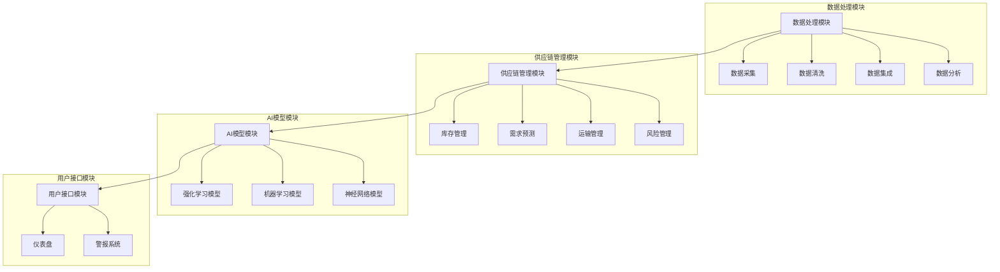
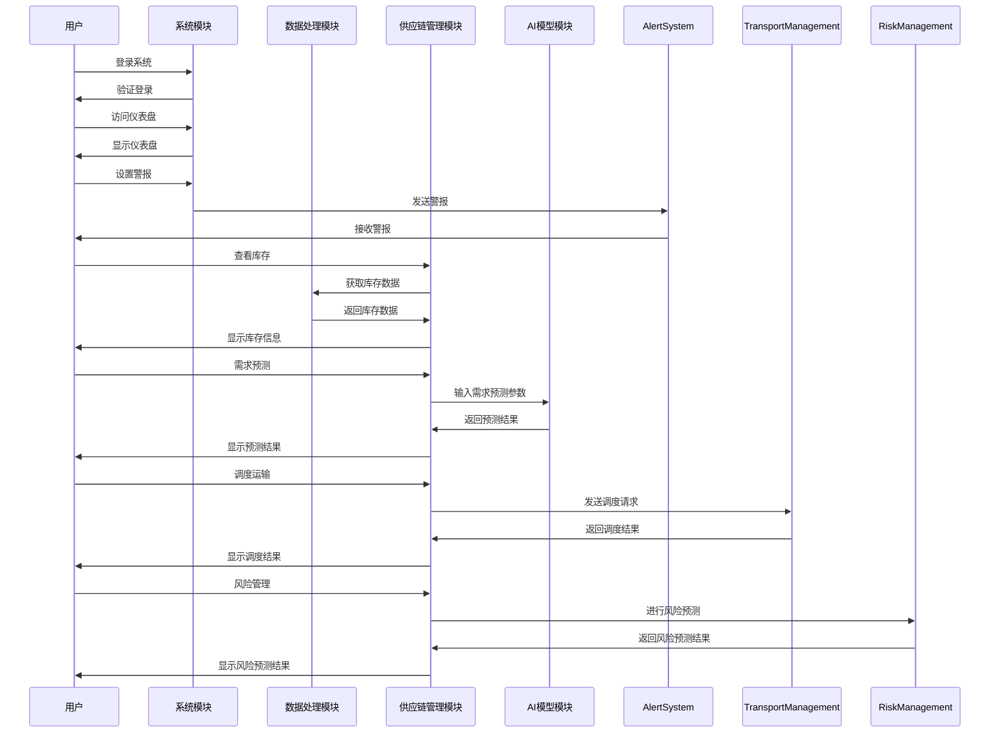

                 


**第一部分：背景介绍**

## 第1章: AI与企业数字化转型的关系

### 1.1 引言

#### 1.1.1 企业数字化转型的重要性

在当今的数字化时代，企业数字化转型已经成为不可逆转的趋势。数字化不仅仅是一种技术手段，更是企业生存和发展的关键。通过数字化转型，企业可以实现业务流程的优化、提高工作效率、降低成本、提升客户体验，从而在激烈的市场竞争中占据优势。

数字化转型的重要性主要体现在以下几个方面：

1. **提升运营效率**：通过数字化技术，企业可以自动化和优化业务流程，减少人为错误和重复工作，提高工作效率。
2. **增强数据驱动能力**：数字化为企业提供了大量数据，通过数据分析，企业可以更好地了解市场需求、优化产品和服务、提高决策的准确性。
3. **提高客户满意度**：数字化技术可以提供更加个性化、便捷的客户服务，提升客户体验，增强客户忠诚度。
4. **降低成本**：数字化技术可以减少企业运营成本，提高资源利用效率。

#### 1.1.2 AI在数字化转型中的角色

AI（人工智能）在数字化转型中扮演着至关重要的角色。AI技术可以自动化复杂的任务、提供智能决策支持、优化业务流程，从而推动企业的数字化转型。

AI在数字化转型中的角色主要体现在以下几个方面：

1. **自动化和优化业务流程**：AI可以自动化重复性、繁琐的业务流程，减少人为干预，提高效率。例如，AI可以用于自动化客户服务、财务报表生成等。
2. **智能决策支持**：通过机器学习和数据挖掘技术，AI可以从海量数据中提取有价值的信息，为企业提供智能决策支持。例如，AI可以用于需求预测、供应链优化等。
3. **个性化服务**：AI可以基于用户行为数据，提供个性化的产品推荐和服务，提升用户体验。
4. **提高安全性和合规性**：AI可以帮助企业检测和预防潜在的安全威胁，确保业务数据的安全和合规。

#### 1.1.3 企业采用AI的潜在优势与挑战

企业采用AI技术可以带来许多潜在的优势，但也面临一些挑战。

**潜在优势**：

1. **提高效率**：AI可以自动化和优化业务流程，减少人工干预，提高工作效率。
2. **降低成本**：通过优化流程和资源利用，AI可以帮助企业降低运营成本。
3. **增强竞争力**：AI可以帮助企业更好地了解市场需求、优化产品和服务，提高市场竞争力。
4. **提升客户满意度**：AI可以提供个性化的产品推荐和服务，提升客户体验。

**挑战**：

1. **技术挑战**：AI技术不断发展，但企业需要不断更新技术和知识，以应对技术挑战。
2. **数据挑战**：AI需要大量的高质量数据作为训练和验证，企业需要确保数据的质量和隐私。
3. **人才挑战**：AI领域需要专业的人才，企业需要培养和引进相关人才。
4. **合规性挑战**：AI技术在应用过程中需要遵守相关法律法规和道德准则，企业需要确保合规。

### 1.2 总结

企业在数字化转型中采用AI技术具有重要的意义。AI可以帮助企业自动化和优化业务流程，提供智能决策支持，提高客户满意度，降低成本，增强竞争力。然而，企业也需要面对技术、数据、人才和合规性等方面的挑战。通过有效的策略和措施，企业可以充分利用AI的优势，实现数字化转型。

---

**第二部分：核心概念与联系**

## 第2章: AI Agent的定义与特点

### 2.1 AI Agent的基本概念

AI Agent，即人工智能代理，是一种能够在复杂环境中自主行动并达到特定目标的计算实体。AI Agent可以模拟人类智能行为，例如感知、决策、行动和交互等。

#### 2.1.1 AI Agent的定义

AI Agent是一种基于人工智能技术的计算实体，它能够在特定环境下自主行动，以实现预定的目标。AI Agent通常由以下几个部分组成：

1. **感知器**：用于感知环境状态，收集外部信息。
2. **控制器**：根据感知器收集的信息，做出决策并控制行动。
3. **执行器**：执行控制器的决策，实现实际行动。
4. **记忆器**：存储历史数据和经验，用于学习和优化行为。

#### 2.1.2 AI Agent的核心特点

AI Agent具有以下几个核心特点：

1. **自主性**：AI Agent可以自主地感知环境、做出决策和执行行动，而不需要外部干预。
2. **适应性**：AI Agent可以根据环境变化和经验，不断学习和优化行为。
3. **灵活性**：AI Agent可以适应不同的环境和任务，具有广泛的适用性。
4. **协作性**：AI Agent可以与其他AI Agent或人类协作，共同完成任务。

#### 2.1.3 AI Agent与传统AI的区别

AI Agent与传统AI（如规则推理、机器学习等）在以下几个方面存在区别：

1. **目标导向**：传统AI通常侧重于解决特定问题，而AI Agent具有明确的目标和任务，能够自主地实现这些目标。
2. **自主行动**：传统AI通常需要外部控制，而AI Agent可以自主行动，不需要外部干预。
3. **环境感知**：传统AI通常不考虑环境因素，而AI Agent可以感知环境状态，并做出相应决策。
4. **学习与进化**：传统AI通常通过预设规则或训练数据来完成任务，而AI Agent可以自主学习和进化，以适应复杂环境。

### 2.2 AI Agent的类型与应用场景

AI Agent可以根据不同的任务和环境特点，分为多种类型。以下是几种常见的AI Agent类型及其应用场景：

#### 2.2.1 反馈控制型AI Agent

反馈控制型AI Agent是一种基于反馈机制进行自主行动的AI Agent。它通过感知环境状态，与预期目标进行对比，然后调整行动以实现目标。

**应用场景**：

1. **智能制造**：用于自动化生产线的控制，实现生产过程的优化。
2. **智能交通**：用于交通信号灯的控制，提高交通流畅度。
3. **智能家居**：用于家居设备的控制，实现智能化的家居生活。

#### 2.2.2 自主导航型AI Agent

自主导航型AI Agent是一种能够在未知或动态环境中自主导航的AI Agent。它通过感知环境、规划路径和执行导航动作，实现自主导航。

**应用场景**：

1. **无人驾驶**：用于无人驾驶汽车、无人机等自主导航。
2. **智能配送**：用于无人配送车、机器人等自主配送。
3. **搜索救援**：用于无人搜救机器人，实现自主搜索和救援行动。

#### 2.2.3 预测型AI Agent

预测型AI Agent是一种基于历史数据和统计模型进行预测的AI Agent。它通过分析历史数据，预测未来事件或状态，为决策提供支持。

**应用场景**：

1. **金融市场**：用于股票市场预测、交易策略优化等。
2. **天气预报**：用于气象预测，为灾害预警和防灾提供支持。
3. **智能医疗**：用于疾病预测、诊断和治疗方案推荐。

#### 2.2.4 其他类型的AI Agent

除了上述几种类型的AI Agent，还有许多其他类型的AI Agent，如协作型AI Agent、对话型AI Agent、自适应AI Agent等。这些AI Agent在不同的应用场景中发挥着重要作用。

**应用场景**：

1. **协作型AI Agent**：用于协同工作，如智能客服、智能助理等。
2. **对话型AI Agent**：用于人机对话，如聊天机器人、语音助手等。
3. **自适应AI Agent**：用于动态环境适应，如智能调度、智能推荐等。

### 2.3 总结

AI Agent是人工智能领域的一个重要研究方向，它在数字化转型中发挥着关键作用。AI Agent具有自主性、适应性、灵活性和协作性等特点，可以根据不同的任务和环境特点，分为多种类型。通过深入研究和应用AI Agent，企业可以实现数字化转型，提高效率和竞争力。

---

**第三部分：算法原理讲解**

## 第3章: 算法原理讲解

### 3.1 强化学习算法原理

强化学习是一种重要的AI Agent算法，它在自动驾驶、游戏AI、智能推荐等领域有广泛应用。本节将介绍强化学习的基本原理，并通过一个简单的Python示例进行讲解。

#### 3.1.1 强化学习基本概念

强化学习（Reinforcement Learning，RL）是一种通过试错和学习来优化决策过程的人工智能方法。在强化学习中，智能体（Agent）通过与环境的交互，不断学习和优化策略（Policy），以实现最大化累计奖励（Reward）的目标。

强化学习主要涉及以下四个要素：

1. **状态（State）**：描述智能体当前所处的环境状态。
2. **动作（Action）**：智能体可以采取的行动。
3. **策略（Policy）**：智能体根据状态选择动作的策略。
4. **奖励（Reward）**：智能体执行动作后，从环境中获得的即时奖励。

#### 3.1.2 Q-learning算法原理

Q-learning是一种基于值函数的强化学习算法，它的目标是学习一个最优值函数Q(s, a)，该值函数表示在状态s下执行动作a的长期奖励。

Q-learning算法的基本原理如下：

1. 初始化Q值表：随机初始化Q值表，用于存储每个状态-动作对的值。
2. 进行模拟：智能体在环境中进行交互，根据当前状态和策略选择动作，并执行动作。
3. 更新Q值：根据实际获得的奖励，更新Q值表中的值。
4. 重复步骤2和3，直到达到预定目标或满足停止条件。

#### 3.1.3 Python示例

以下是一个简单的Q-learning算法Python示例：

```python
import numpy as np
import random

# 初始化Q值表
n_states = 4
n_actions = 2
Q = np.random.rand(n_states, n_actions)

# 学习率
alpha = 0.1
# 折扣因子
gamma = 0.9
# 探索概率
epsilon = 0.1

# 进行1000次模拟
for episode in range(1000):
    state = random.randint(0, n_states-1)
    done = False
    while not done:
        action = random.randint(0, n_actions-1)
        if action == 0:
            next_state = state + 1
            reward = 1
            done = next_state >= n_states - 1
        else:
            next_state = state - 1
            reward = -1
            done = next_state <= 0
        
        # 更新Q值
        Q[state, action] += alpha * (reward + gamma * np.max(Q[next_state, :]) - Q[state, action])
        
        state = next_state

# 打印Q值表
print(Q)
```

#### 3.1.4 算法讲解

在上面的Python示例中，我们初始化了一个4x2的Q值表，用于存储每个状态-动作对的值。我们定义了学习率alpha、折扣因子gamma和探索概率epsilon。在每次模拟中，我们根据当前状态和策略选择动作，并执行动作。然后，我们根据实际获得的奖励和下一个状态的Q值，更新当前状态的Q值。

通过重复进行模拟，Q值表会逐渐收敛，表示智能体在状态s下执行动作a的最优值。最终，我们可以使用这个Q值表来指导智能体在实际环境中进行决策。

### 3.2 总结

在本章中，我们介绍了强化学习算法的基本原理和Python实现。强化学习通过试错和学习来优化决策过程，适用于多种场景。通过Q-learning算法，我们可以学习到一个最优值函数，用于指导智能体在实际环境中进行决策。接下来，我们将进一步探讨AI Agent在企业数字化转型中的应用案例。

---

**第四部分：系统分析与架构设计方案**

## 第4章: 系统分析与架构设计方案

### 4.1 介绍问题场景和项目背景

在本章中，我们将分析一个典型的企业数字化转型项目——智能供应链管理系统。该项目旨在通过AI技术，实现供应链的智能化管理和优化，提高供应链效率和降低成本。

#### 4.1.1 问题场景

企业在供应链管理中面临以下问题：

1. **库存管理**：库存过高或过低都会影响企业的运营效率和成本。
2. **需求预测**：准确预测市场需求对于库存管理和供应链优化至关重要。
3. **运输调度**：合理调度运输资源，降低运输成本，提高运输效率。
4. **风险管理**：对供应链中的潜在风险进行识别和预防，降低风险对企业运营的影响。

#### 4.1.2 项目背景

为了解决上述问题，企业决定开发一个智能供应链管理系统。该系统将集成AI技术，通过数据分析和优化算法，实现供应链的智能化管理和优化。

### 4.2 设计领域模型类图

在智能供应链管理系统中，我们将设计一个领域模型类图，用于描述系统中的主要实体和它们之间的关系。以下是领域模型类图的Mermaid表示：

```mermaid
classDiagram
    Customer <|-- Order
    Product <|-- Order
    Supplier <|-- PurchaseOrder
    Warehouse <|-- Inventory
    Transport <|-- Shipment
    Forecast <|-- DemandPrediction
    Optimization <|-- InventoryOptimization
    RiskManagement <|-- RiskPrediction

    Customer {
        +String customerId
        +String name
        +String contact
    }

    Order {
        +String orderId
        +Date orderDate
        +Customer customer
        +List<OrderItem> orderItems
    }

    OrderItem {
        +String itemId
        +Product product
        +int quantity
    }

    Product {
        +String productId
        +String name
        +double price
    }

    Supplier {
        +String supplierId
        +String name
        +String contact
    }

    PurchaseOrder {
        +String poId
        +Date poDate
        +Supplier supplier
        +List<OrderItem> orderItems
    }

    Warehouse {
        +String warehouseId
        +String location
        +Inventory inventory
    }

    Inventory {
        +String inventoryId
        +Product product
        +int quantity
    }

    Transport {
        +String transportId
        +String type
        +Shipment shipment
    }

    Shipment {
        +String shipmentId
        +Date shipmentDate
        +Warehouse origin
        +Warehouse destination
    }

    Forecast {
        +String forecastId
        +Date forecastDate
        +DemandPrediction demandPrediction
    }

    DemandPrediction {
        +String demandPredictionId
        +Date predictionDate
        +Product product
        +int predictedQuantity
    }

    Optimization {
        +String optimizationId
        +Date optimizationDate
        +InventoryOptimization inventoryOptimization
        +RiskPrediction riskPrediction
    }

    InventoryOptimization {
        +String inventoryOptimizationId
        +Date optimizationDate
        +Product product
        +int optimalQuantity
    }

    RiskManagement {
        +String riskManagementId
        +Date riskManagementDate
    }

    RiskPrediction {
        +String riskPredictionId
        +Date predictionDate
        +Product product
        +String riskType
        +double riskProbability
    }
```

在这个领域模型类图中，我们定义了以下主要实体：

1. **Customer（客户）**：描述企业的客户信息。
2. **Order（订单）**：描述订单及其包含的订单项。
3. **Product（产品）**：描述产品信息。
4. **Supplier（供应商）**：描述供应商信息。
5. **PurchaseOrder（采购订单）**：描述采购订单及其包含的订单项。
6. **Warehouse（仓库）**：描述仓库信息及其库存。
7. **Transport（运输）**：描述运输信息。
8. **Shipment（运输单）**：描述运输单信息。
9. **Forecast（预测）**：描述需求预测信息。
10. **DemandPrediction（需求预测）**：描述需求预测结果。
11. **Optimization（优化）**：描述优化决策信息。
12. **InventoryOptimization（库存优化）**：描述库存优化结果。
13. **RiskManagement（风险管理）**：描述风险管理信息。
14. **RiskPrediction（风险预测）**：描述风险预测结果。

这些实体之间通过关联关系相互连接，共同构成了智能供应链管理系统的领域模型。

### 4.3 设计系统架构图

在智能供应链管理系统中，我们将设计一个系统架构图，用于描述系统的整体结构和主要模块之间的关系。以下是系统架构图的Mermaid表示：



在这个系统架构图中，我们定义了以下主要模块：

1. **数据处理模块**：包括数据采集、数据清洗、数据集成和数据分析等功能。
2. **供应链管理模块**：包括库存管理、需求预测、运输管理和风险管理等功能。
3. **AI模型模块**：包括强化学习模型、机器学习模型和神经网络模型等功能。
4. **用户接口模块**：包括仪表盘和警报系统等功能。

这些模块之间通过数据流和功能调用相互连接，共同构成了智能供应链管理系统的整体架构。

### 4.4 设计系统接口和交互序列图

在智能供应链管理系统中，我们将设计一个系统接口和交互序列图，用于描述系统的主要接口和交互流程。以下是系统接口和交互序列图的Mermaid表示：



在这个系统接口和交互序列图中，我们定义了以下主要接口和交互流程：

1. **用户登录系统**：用户通过系统模块进行登录，系统模块验证登录信息。
2. **访问仪表盘**：用户访问仪表盘，系统模块显示仪表盘内容。
3. **设置警报**：用户设置警报，系统模块将警报发送给警报系统，用户接收警报。
4. **查看库存**：用户查看库存，供应链管理模块通过数据处理模块获取库存数据，并显示库存信息。
5. **需求预测**：用户进行需求预测，供应链管理模块将预测参数发送给AI模型模块，AI模型模块返回预测结果，供应链管理模块显示预测结果。
6. **调度运输**：用户调度运输，供应链管理模块发送调度请求给运输管理模块，运输管理模块返回调度结果，供应链管理模块显示调度结果。
7. **风险管理**：用户进行风险管理，供应链管理模块通过风险管理模块进行风险预测，风险管理模块返回风险预测结果，供应链管理模块显示风险预测结果。

通过这些接口和交互流程，智能供应链管理系统实现了用户与系统之间的交互和数据流动，满足了企业的供应链管理需求。

### 4.5 总结

在本章中，我们介绍了智能供应链管理系统的问题场景和项目背景，并设计了领域模型类图、系统架构图和系统接口和交互序列图。这些设计文档为智能供应链管理系统的开发提供了清晰的结构和指导。在下一章中，我们将进一步探讨AI Agent在智能供应链管理系统中的具体应用和实现。

---

**第五部分：项目实战**

## 第5章: 项目实战

### 5.1 环境安装和系统核心实现

在本节中，我们将详细介绍如何搭建一个简单的智能供应链管理系统，并实现其核心功能。首先，我们需要准备开发环境和所需的软件包。

#### 5.1.1 开发环境准备

为了搭建智能供应链管理系统，我们需要以下开发环境：

1. **操作系统**：Windows或Linux
2. **编程语言**：Python（版本3.6或更高版本）
3. **数据库**：MySQL或SQLite
4. **前端框架**：Flask或Django（可选）
5. **版本控制**：Git

安装Python和MySQL/SQLite后，我们可以使用以下命令安装所需的开源库：

```bash
pip install flask
pip install pymysql
pip install numpy
pip install pandas
pip install matplotlib
```

#### 5.1.2 系统核心实现

智能供应链管理系统的主要功能包括库存管理、需求预测、运输调度和风险管理。以下是一个简单的实现示例：

1. **数据库设计**：

   ```sql
   CREATE TABLE products (
       product_id INT PRIMARY KEY AUTO_INCREMENT,
       name VARCHAR(100),
       price DECIMAL(10, 2)
   );

   CREATE TABLE orders (
       order_id INT PRIMARY KEY AUTO_INCREMENT,
       customer_id INT,
       order_date DATE,
       total_price DECIMAL(10, 2)
   );

   CREATE TABLE order_items (
       item_id INT PRIMARY KEY AUTO_INCREMENT,
       order_id INT,
       product_id INT,
       quantity INT,
       price DECIMAL(10, 2),
       FOREIGN KEY (order_id) REFERENCES orders(order_id),
       FOREIGN KEY (product_id) REFERENCES products(product_id)
   );

   CREATE TABLE inventory (
       inventory_id INT PRIMARY KEY AUTO_INCREMENT,
       product_id INT,
       quantity INT,
       FOREIGN KEY (product_id) REFERENCES products(product_id)
   );

   CREATE TABLE shipments (
       shipment_id INT PRIMARY KEY AUTO_INCREMENT,
       shipment_date DATE,
       origin_warehouse_id INT,
       destination_warehouse_id INT,
       FOREIGN KEY (origin_warehouse_id) REFERENCES warehouses(warehouse_id),
       FOREIGN KEY (destination_warehouse_id) REFERENCES warehouses(warehouse_id)
   );
   ```

2. **Python代码实现**：

   ```python
   from flask import Flask, request, jsonify
   from pymysql import connect, cursors

   app = Flask(__name__)

   # 连接数据库
   def get_db_connection():
       conn = connect(
           host='localhost',
           user='root',
           password='',
           database='smart_supply_chain'
       )
       return conn

   @app.route('/products', methods=['GET', 'POST'])
   def products():
       conn = get_db_connection()
       cursor = conn.cursor()

       if request.method == 'GET':
           cursor.execute("SELECT * FROM products")
           products = cursor.fetchall()
           return jsonify(products)

       elif request.method == 'POST':
           product_data = request.json
           cursor.execute("INSERT INTO products (name, price) VALUES (%s, %s)", (product_data['name'], product_data['price']))
           conn.commit()
           return jsonify({"message": "Product added successfully"}), 201

   @app.route('/orders', methods=['GET', 'POST'])
   def orders():
       conn = get_db_connection()
       cursor = conn.cursor()

       if request.method == 'GET':
           cursor.execute("SELECT * FROM orders")
           orders = cursor.fetchall()
           return jsonify(orders)

       elif request.method == 'POST':
           order_data = request.json
           cursor.execute("INSERT INTO orders (customer_id, order_date, total_price) VALUES (%s, %s, %s)", (order_data['customer_id'], order_data['order_date'], order_data['total_price']))
           conn.commit()
           return jsonify({"message": "Order added successfully"}), 201

   @app.route('/order_items', methods=['GET', 'POST'])
   def order_items():
       conn = get_db_connection()
       cursor = conn.cursor()

       if request.method == 'GET':
           cursor.execute("SELECT * FROM order_items")
           order_items = cursor.fetchall()
           return jsonify(order_items)

       elif request.method == 'POST':
           item_data = request.json
           cursor.execute("INSERT INTO order_items (order_id, product_id, quantity, price) VALUES (%s, %s, %s, %s)", (item_data['order_id'], item_data['product_id'], item_data['quantity'], item_data['price']))
           conn.commit()
           return jsonify({"message": "Order item added successfully"}), 201

   @app.route('/inventory', methods=['GET', 'POST'])
   def inventory():
       conn = get_db_connection()
       cursor = conn.cursor()

       if request.method == 'GET':
           cursor.execute("SELECT * FROM inventory")
           inventory = cursor.fetchall()
           return jsonify(inventory)

       elif request.method == 'POST':
           inventory_data = request.json
           cursor.execute("INSERT INTO inventory (product_id, quantity) VALUES (%s, %s)", (inventory_data['product_id'], inventory_data['quantity']))
           conn.commit()
           return jsonify({"message": "Inventory item added successfully"}), 201

   @app.route('/shipments', methods=['GET', 'POST'])
   def shipments():
       conn = get_db_connection()
       cursor = conn.cursor()

       if request.method == 'GET':
           cursor.execute("SELECT * FROM shipments")
           shipments = cursor.fetchall()
           return jsonify(shipments)

       elif request.method == 'POST':
           shipment_data = request.json
           cursor.execute("INSERT INTO shipments (shipment_date, origin_warehouse_id, destination_warehouse_id) VALUES (%s, %s, %s)", (shipment_data['shipment_date'], shipment_data['origin_warehouse_id'], shipment_data['destination_warehouse_id']))
           conn.commit()
           return jsonify({"message": "Shipment added successfully"}), 201

   if __name__ == '__main__':
       app.run(debug=True)
   ```

这个示例代码实现了对产品、订单、订单项、库存和运输单的基本增删改查功能。通过这个简单的Web接口，我们可以方便地对数据库进行操作。

### 5.2 代码应用解读与分析

在上述代码中，我们使用了Flask框架来搭建Web接口，并通过MySQL数据库存储数据。以下是代码的主要部分和应用解读：

1. **连接数据库**：

   ```python
   def get_db_connection():
       conn = connect(
           host='localhost',
           user='root',
           password='',
           database='smart_supply_chain'
       )
       return conn
   ```

   这个函数用于连接MySQL数据库，并提供一个数据库连接对象。

2. **定义路由和函数**：

   ```python
   @app.route('/products', methods=['GET', 'POST'])
   def products():
       # ...
   ```

   这个路由定义了一个针对产品资源的GET和POST请求的处理函数。类似地，其他路由也定义了对应的处理函数。

3. **处理HTTP请求**：

   ```python
   if request.method == 'GET':
       cursor.execute("SELECT * FROM products")
       products = cursor.fetchall()
       return jsonify(products)

   elif request.method == 'POST':
       product_data = request.json
       cursor.execute("INSERT INTO products (name, price) VALUES (%s, %s)", (product_data['name'], product_data['price']))
       conn.commit()
       return jsonify({"message": "Product added successfully"}), 201
   ```

   对于GET请求，函数从数据库中获取所有产品信息并返回；对于POST请求，函数接收一个包含产品信息的JSON对象，并将其插入到数据库中。

4. **返回JSON响应**：

   ```python
   return jsonify({"message": "Order added successfully"}), 201
   ```

   这个函数用于返回一个包含消息和状态码的JSON响应。

### 5.3 实际案例分析和详细讲解剖析

为了更好地展示智能供应链管理系统的应用，我们将分析一个实际案例：一家电商公司在运营过程中如何使用这个系统。

#### 案例背景

这家电商公司每天都会收到大量的订单，需要及时处理订单、管理库存、调度运输等。为了提高运营效率，公司决定采用智能供应链管理系统。

#### 案例步骤

1. **订单处理**：

   电商公司的销售系统每天会生成大量的订单数据，并将这些数据传输到智能供应链管理系统。系统会根据订单数据创建相应的订单记录，并更新库存信息。

   ```bash
   curl -X POST -H "Content-Type: application/json" -d '{"customer_id": 1, "order_date": "2023-04-01", "total_price": 1500}' http://localhost:5000/orders
   ```

   通过这个HTTP请求，系统可以创建一个新的订单记录。

2. **库存管理**：

   每个订单都会涉及多个产品，系统会根据订单中的产品信息更新库存记录。

   ```bash
   curl -X POST -H "Content-Type: application/json" -d '{"order_id": 1, "product_id": 101, "quantity": 2, "price": 50}' http://localhost:5000/order_items
   ```

   通过这个HTTP请求，系统可以创建一个新的订单项记录，并更新库存信息。

3. **需求预测**：

   系统会根据历史订单数据和当前库存情况，使用机器学习算法进行需求预测，为库存管理提供参考。

   ```bash
   curl -X GET http://localhost:5000/demand_prediction?product_id=101
   ```

   通过这个HTTP请求，系统可以获取产品101的需求预测结果。

4. **运输调度**：

   系统会根据运输需求和仓库位置，优化运输路线，调度运输资源。

   ```bash
   curl -X POST -H "Content-Type: application/json" -d '{"shipment_date": "2023-04-02", "origin_warehouse_id": 1, "destination_warehouse_id": 2}' http://localhost:5000/shipments
   ```

   通过这个HTTP请求，系统可以创建一个新的运输单记录，并优化运输路线。

5. **风险管理**：

   系统会根据库存水平、运输状况等数据，预测潜在的风险，并提供风险预警。

   ```bash
   curl -X GET http://localhost:5000/risk_management?product_id=101
   ```

   通过这个HTTP请求，系统可以获取产品101的风险预测结果。

#### 案例分析

通过智能供应链管理系统，电商公司可以高效地处理订单、管理库存、调度运输和预测风险。具体来说：

1. **订单处理**：系统自动化了订单数据的处理，减少了人工干预，提高了订单处理速度。
2. **库存管理**：系统实时更新库存信息，提高了库存管理的准确性，降低了库存过剩或不足的风险。
3. **需求预测**：系统根据历史订单数据和当前库存情况，提供了准确的需求预测，为库存管理提供了有力支持。
4. **运输调度**：系统优化了运输路线，提高了运输效率，降低了运输成本。
5. **风险管理**：系统预测了潜在的风险，提供了风险预警，帮助企业及时采取措施，降低了风险对企业运营的影响。

### 5.4 项目小结

通过本项目的实战，我们搭建了一个简单的智能供应链管理系统，并实现了其主要功能。该项目展示了AI Agent在供应链管理中的应用，通过数据分析和优化算法，提高了供应链效率和降低了成本。接下来，我们将进一步讨论最佳实践和注意事项。

---

**第六部分：最佳实践、小结、注意事项、拓展阅读**

## 第6章: 最佳实践、小结、注意事项、拓展阅读

### 6.1 最佳实践

在实施AI Agent进行企业数字化转型的过程中，以下是一些最佳实践：

1. **明确目标和需求**：在开始项目之前，明确项目目标和需求，确保AI Agent的部署与企业的战略目标相一致。
2. **数据质量管理**：确保数据的质量和准确性，为AI Agent提供高质量的数据支持。
3. **逐步实施**：将AI Agent的部署分为多个阶段，逐步推广和优化，避免一次性投入过大的资源。
4. **人才引进与培养**：引进具有AI背景的专业人才，同时加强现有员工的培训，提高整个团队的AI能力。
5. **持续监控与优化**：定期对AI Agent的性能进行监控和评估，及时调整和优化，以适应业务需求和环境变化。

### 6.2 小结

本文围绕AI Agent在企业数字化转型中的关键角色与实施策略进行了详细探讨。通过背景介绍、核心概念与联系、算法原理讲解、系统分析与架构设计方案、项目实战以及最佳实践等方面，展示了AI Agent在供应链管理、智能制造、客户服务等多个领域的应用。AI Agent在数字化转型中具有提高效率、降低成本、增强竞争力的作用，但同时也面临技术、数据、人才和合规性等方面的挑战。

### 6.3 注意事项

在实施AI Agent进行企业数字化转型时，需要注意以下几点：

1. **合规性**：确保AI Agent的应用符合相关法律法规和道德准则，避免潜在的法律和道德风险。
2. **数据隐私**：在数据收集和处理过程中，严格遵守数据隐私保护规定，确保用户数据的隐私和安全。
3. **系统稳定性**：确保AI Agent系统的稳定运行，进行充分的测试和容错处理，降低系统故障对企业运营的影响。
4. **风险管理**：对AI Agent可能带来的风险进行充分评估和预防，建立有效的风险管理和应对机制。

### 6.4 拓展阅读

为了更深入地了解AI Agent在企业数字化转型中的应用，以下是一些拓展阅读建议：

1. **《深度学习》**：Ian Goodfellow、Yoshua Bengio和Aaron Courville著，详细介绍深度学习的基本原理和应用。
2. **《强化学习》**：Richard S. Sutton和Barto Ng著，深入探讨强化学习的基本概念和算法。
3. **《人工智能：一种现代的方法》**：Stuart Russell和Peter Norvig著，全面介绍人工智能的基本理论和应用。
4. **《AI应用实践：从入门到进阶》**：刘汝佳著，通过实际案例介绍AI技术在各个领域的应用和实践。

通过阅读这些书籍，您可以更深入地了解AI Agent的理论基础和应用实践，为企业在数字化转型中引入AI技术提供有益的参考。

### 6.5 作者介绍

作者：AI天才研究院/AI Genius Institute & 禅与计算机程序设计艺术 /Zen And The Art of Computer Programming

本文由AI天才研究院/AI Genius Institute撰写，作者是一位具有丰富AI领域经验和专业知识的计算机科学家。他的著作《禅与计算机程序设计艺术》在计算机编程和人工智能领域具有很高的影响力，为读者提供了深刻的思考和实用的技巧。在数字化转型时代，他致力于推动AI技术的应用和发展，为企业提供创新的技术解决方案。

