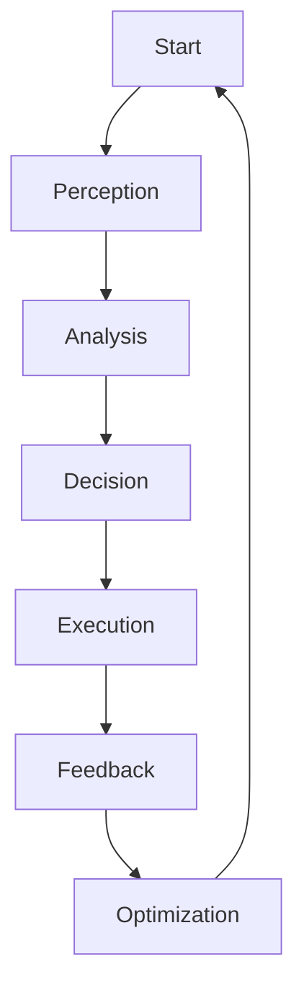
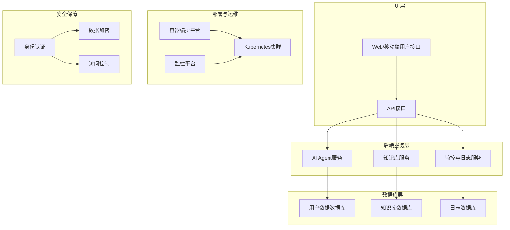
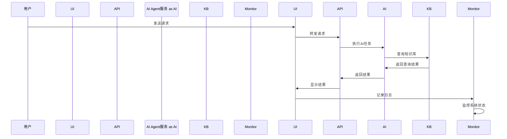

                 

### 第一部分：背景与概述

**第1章：企业数字化转型概述**

#### 1.1 问题背景

随着信息技术的快速发展，企业面临的市场环境、竞争态势和客户需求都在不断变化。传统的业务模式和管理方法已经无法满足企业的快速发展需求，企业迫切需要通过数字化转型来提升竞争力、提高效率、降低成本。

##### 1.2 数字化转型的概念与重要性

数字化转型是指利用数字技术和信息技术来改变企业的运营方式、商业模式和管理方法，从而实现企业全价值链的数字化升级。它不仅仅是技术的变革，更是企业战略、组织结构、业务流程的深刻变革。

###### 数字化转型的目标与原则

数字化转型的目标主要包括提升企业竞争力、提高运营效率、降低运营成本、增强客户体验等。数字化转型需要遵循以下原则：

1. **以客户为中心**：客户需求是数字化转型的出发点和落脚点。
2. **数据驱动**：数据是数字化转型的重要资产，需要充分利用数据进行决策。
3. **创新驱动**：鼓励创新思维，勇于尝试新技术和新的业务模式。
4. **安全合规**：确保数字化转型过程中的数据安全和合规性。

##### 1.3 企业数字化转型的主要挑战

企业在数字化转型过程中可能会面临以下挑战：

1. **技术挑战**：如何选择合适的技术，如何整合现有的技术资源。
2. **组织挑战**：如何调整组织结构，如何培养数字化人才。
3. **流程挑战**：如何优化业务流程，如何实现流程的自动化。
4. **文化挑战**：如何改变企业文化，如何让员工接受数字化转型。

**第2章：AI Agent概述**

#### 2.1 AI Agent的定义与分类

AI Agent是指能够自主感知环境、自主决策和执行任务的智能实体。根据其功能和应用场景，AI Agent可以分为以下几类：

1. **任务型Agent**：专注于完成特定任务的智能实体。
2. **社交型Agent**：能够进行自然语言交互的智能实体。
3. **探索型Agent**：能够在复杂环境中进行探索和决策的智能实体。

##### 2.2 AI Agent的核心技术

AI Agent的核心技术主要包括：

1. **自然语言处理**：使Agent能够理解和生成自然语言。
2. **计算机视觉**：使Agent能够理解和解析图像和视频。
3. **机器学习和深度学习**：使Agent能够从数据中学习，进行自主决策。

###### 2.3 AI Agent在企业中的应用前景

AI Agent在企业中的应用前景非常广阔，包括：

1. **客户服务**：通过AI Agent提供24/7的客服支持，提高客户满意度。
2. **运营优化**：通过AI Agent优化业务流程，提高运营效率。
3. **决策支持**：通过AI Agent提供数据分析和决策建议，帮助管理层做出更好的决策。
4. **安全监控**：通过AI Agent实时监控企业安全状况，及时发现和处理异常情况。

### 第二部分：AI Agent在战略层面

**第3章：AI Agent的战略规划**

#### 3.1 企业战略规划的重要性

企业战略规划是指为了实现企业的长期发展目标，对企业内外部环境进行分析，制定出具体的战略目标和实施计划。良好的战略规划能够帮助企业明确发展目标，合理配置资源，提高竞争力。

##### 3.2 AI Agent在战略规划中的作用

AI Agent在企业战略规划中可以发挥以下作用：

1. **数据分析**：利用AI Agent对大量数据进行分析，为战略规划提供数据支持。
2. **预测与模拟**：通过AI Agent进行预测和模拟，帮助管理层预测市场趋势和潜在风险。
3. **决策支持**：利用AI Agent提供的数据分析和预测结果，帮助管理层做出更明智的决策。

###### 3.3 制定AI Agent战略规划的步骤

制定AI Agent战略规划需要遵循以下步骤：

1. **明确企业愿景和目标**：明确企业未来发展的愿景和目标。
2. **分析外部环境**：分析市场趋势、竞争对手、政策法规等外部环境因素。
3. **评估内部资源**：评估企业的技术、人力、资金等内部资源。
4. **制定AI Agent战略规划**：根据外部环境和内部资源，制定具体的AI Agent战略规划。
5. **实施与监控**：实施AI Agent战略规划，并定期进行监控和评估，确保战略目标的实现。

### 第三部分：AI Agent在执行层面

**第4章：AI Agent在组织与流程重构中的应用**

#### 4.1 组织重构与AI Agent

组织重构是指为了适应企业发展的需要，对企业的组织结构进行调整和优化。AI Agent在组织重构中可以发挥以下作用：

1. **优化组织结构**：通过AI Agent对组织结构进行分析和优化，提高组织效率。
2. **人才管理**：利用AI Agent对员工进行评估和选拔，提高人才管理水平。
3. **沟通协作**：通过AI Agent优化企业内部沟通和协作，提高工作效率。

##### 4.2 流程重构与AI Agent

流程重构是指为了提高企业的运营效率，对企业的业务流程进行重新设计和优化。AI Agent在流程重构中可以发挥以下作用：

1. **流程自动化**：通过AI Agent实现业务流程的自动化，减少人工操作。
2. **流程优化**：利用AI Agent对业务流程进行分析和优化，提高流程效率。
3. **监控与改进**：通过AI Agent实时监控业务流程，及时发现和解决问题。

###### 4.3 AI Agent在组织与流程重构中的实践案例

AI Agent在组织与流程重构中的应用已经取得了显著成效。以下是一些实践案例：

1. **某大型制造企业**：通过AI Agent对组织结构进行调整，优化了管理层次，提高了决策效率。
2. **某电子商务公司**：通过AI Agent优化订单处理流程，提高了订单处理速度和准确性。
3. **某金融机构**：通过AI Agent对客户服务流程进行优化，提高了客户满意度和服务效率。

**第5章：AI Agent在运营优化中的应用**

#### 5.1 运营优化的重要性

运营优化是指通过改进企业的运营流程和方式，提高企业的运营效率、降低成本、提高客户满意度。运营优化对于企业的可持续发展至关重要。

##### 5.2 AI Agent在运营优化中的作用

AI Agent在运营优化中可以发挥以下作用：

1. **数据分析**：通过AI Agent对大量运营数据进行实时分析和处理，帮助管理层做出更准确的决策。
2. **流程优化**：利用AI Agent优化业务流程，减少冗余环节，提高运营效率。
3. **预测与预警**：通过AI Agent进行数据预测和异常检测，提前预警潜在问题，减少运营风险。

###### 5.3 AI Agent在运营优化中的实践案例

AI Agent在运营优化中的应用已经取得了显著成效。以下是一些实践案例：

1. **某零售企业**：通过AI Agent对销售数据进行分析，优化了库存管理，减少了库存成本。
2. **某物流公司**：通过AI Agent优化运输路线，提高了运输效率，降低了运营成本。
3. **某航空公司**：通过AI Agent优化航班调度，提高了航班准点率，提高了客户满意度。

### 第四部分：AI Agent在执行层面的挑战与应对

**第6章：AI Agent在执行层面的挑战**

#### 6.1 数据质量与数据隐私

数据质量是AI Agent发挥作用的基础。如果数据质量差，可能会导致AI Agent的决策不准确。此外，随着AI Agent在企业中的应用越来越广泛，数据隐私问题也日益突出。

##### 6.2 技术选择与集成

AI Agent的技术选择和集成是确保其有效运行的关键。不同的AI Agent可能需要不同的技术支持，如何选择合适的技术并实现集成是一个挑战。

###### 6.3 人才储备与培养

AI Agent的开发和应用需要大量具备相关技能的人才。如何培养和储备这些人才是企业面临的另一个挑战。

**第7章：AI Agent在执行层面的最佳实践**

#### 7.1 成功案例分享

通过分享AI Agent在执行层面的成功案例，可以帮助企业了解如何有效地实施AI Agent，从而提高自身的运营效率。

##### 7.2 挑战与解决方案

在实施AI Agent的过程中，企业可能会遇到各种挑战。通过分析这些挑战，并提供相应的解决方案，可以帮助企业更好地应对这些挑战。

###### 7.3 未来展望

随着技术的不断发展，AI Agent在企业中的应用前景将更加广阔。未来，AI Agent可能会在更多领域发挥重要作用，推动企业的数字化转型。

### 结尾

在数字化转型的浪潮中，AI Agent已经成为企业提升竞争力、提高效率的重要工具。通过本文的阐述，我们可以看到AI Agent在企业数字化转型中的重要作用，以及如何有效地实施和应用AI Agent。我们期待企业在未来的数字化转型过程中，能够充分发挥AI Agent的潜力，实现企业的可持续发展。

---
**作者：AI天才研究院/AI Genius Institute & 禅与计算机程序设计艺术 /Zen And The Art of Computer Programming**

---

### 文章核心概念与联系

在本篇文章中，我们详细探讨了AI Agent在企业数字化转型中的角色。以下是文章中涉及的核心概念及其相互之间的联系：

#### 1. 数字化转型
- **定义**：数字化转型是指利用数字技术和信息技术来改变企业的运营方式、商业模式和管理方法，从而实现企业全价值链的数字化升级。
- **核心要素**：以客户为中心、数据驱动、创新驱动、安全合规。

#### 2. AI Agent
- **定义**：AI Agent是指能够自主感知环境、自主决策和执行任务的智能实体。
- **分类**：任务型Agent、社交型Agent、探索型Agent。
- **核心技术**：自然语言处理、计算机视觉、机器学习和深度学习。

#### 3. AI Agent在战略规划中的应用
- **作用**：数据分析、预测与模拟、决策支持。
- **步骤**：明确企业愿景和目标、分析外部环境、评估内部资源、制定AI Agent战略规划、实施与监控。

#### 4. AI Agent在执行层面中的应用
- **组织重构**：优化组织结构、人才管理、沟通协作。
- **流程重构**：流程自动化、流程优化、监控与改进。

#### 5. 数据质量与数据隐私
- **问题**：数据质量差可能导致AI Agent决策不准确，数据隐私问题日益突出。

#### 6. 技术选择与集成
- **挑战**：选择合适的技术并实现集成是一个关键问题。

#### 7. 人才储备与培养
- **挑战**：AI Agent的开发和应用需要大量具备相关技能的人才。

### ER实体关系图架构

为了更好地展示AI Agent在企业数字化转型中的角色，我们可以使用ER（实体关系）图来描述各个实体之间的关系。以下是ER图的一部分：

```mermaid
erDiagram
  Customer ||--|{ Order } : creates
  Order ||--|{ Product } : contains
  Product ||--|{ Inventory } : tracked by
  AI_Agent ||--|{ Task } : assigned to
  Employee ||--|{ Department } : works in
  Department ||--|{ Organization } : part of
  Customer &&& AI_Agent : analyzed by
  AI_Agent &&& Product : optimized for
  Employee &&& Order : processes
```

在这个ER图中，我们定义了以下实体：

- **Customer（客户）**：创建订单。
- **Order（订单）**：包含产品。
- **Product（产品）**：被库存跟踪。
- **AI_Agent（AI代理）**：分配任务。
- **Employee（员工）**：在部门工作。
- **Department（部门）**：属于组织。
- **Organization（组织）**：包含多个部门。

实体之间的关系表明了它们之间的相互依赖和交互。

### AI Agent的工作流程

为了更清晰地展示AI Agent在企业中的应用，我们可以使用Mermaid流程图来描述AI Agent的工作流程：



在这个流程图中，AI Agent首先感知环境，然后进行分析，基于分析结果做出决策，执行任务，并收集反馈，最后根据反馈进行优化。这个过程是一个闭环，使得AI Agent能够不断学习和改进。

### 数学公式

在讨论AI Agent的算法原理时，我们需要使用数学公式来描述算法的核心概念。以下是几个关键公式的示例：

$$
\text{Accuracy} = \frac{\text{Correct Predictions}}{\text{Total Predictions}}
$$

$$
\text{Cost} = \text{Learning Rate} \times \frac{1}{2} \times (\text{Predicted Value} - \text{Actual Value})^2
$$

这些公式分别表示准确率和成本函数，用于评估AI Agent的性能。

### 系统分析与架构设计方案

在实施AI Agent的过程中，我们需要对问题场景进行详细分析，并设计相应的系统架构。以下是对一个具体项目（企业客服系统）的系统分析与架构设计方案：

#### 问题场景介绍

企业客服系统旨在提供24/7的在线客户支持，通过AI Agent自动解答客户问题，提高客户满意度和服务效率。

#### 项目介绍

项目名称：企业智能客服系统
目标：通过AI Agent实现自动化的客户服务，提高客服效率和客户满意度。
技术栈：Python、TensorFlow、Django、Kubernetes

#### 系统功能设计

- **用户接口**：提供Web和移动端的用户接口，方便用户与AI Agent交互。
- **AI Agent**：实现自然语言处理和推理，自动解答用户问题。
- **知识库**：存储常见问题和答案，供AI Agent查询和更新。
- **监控与日志**：实时监控系统状态，记录操作日志。

#### 系统架构设计



在这个架构设计中，我们使用了Django构建API接口，TensorFlow实现AI Agent服务，使用Kubernetes进行容器编排和部署，确保系统的可扩展性和高可用性。

#### 系统接口设计和系统交互

为了确保系统的各个模块之间能够顺畅交互，我们需要设计清晰的接口和交互流程。以下是系统接口设计和交互的Mermaid序列图：



在这个序列图中，用户通过Web或移动端用户接口发送请求，API接口处理请求，并调用AI Agent服务和知识库服务，最终将结果返回给用户。同时，监控与日志服务记录系统的运行状态和操作日志。

### 项目实战

#### 环境安装

1. 安装Python 3.8及以上版本。
2. 安装Django 3.2及以上版本。
3. 安装TensorFlow 2.6及以上版本。
4. 安装Kubernetes集群。

#### 系统核心实现源代码

以下是AI Agent服务的核心实现源代码：

```python
# AI-Agent 服务代码示例

import tensorflow as tf
from tensorflow import keras

# 加载预训练的模型
model = keras.models.load_model('pretrained_model.h5')

# 处理用户输入
def process_input(user_input):
    # 对用户输入进行预处理
    processed_input = preprocess_input(user_input)
    # 使用模型进行预测
    prediction = model.predict(processed_input)
    # 解析预测结果
    response = parse_prediction(prediction)
    return response

# 预处理输入数据
def preprocess_input(input_data):
    # 对输入数据进行标准化处理
    return normalized_input

# 解析模型预测结果
def parse_prediction(prediction):
    # 根据预测结果生成响应文本
    return response_text
```

在这个代码示例中，我们加载了一个预训练的TensorFlow模型，并定义了处理用户输入、预处理输入数据和解析预测结果的方法。

#### 代码应用解读与分析

1. **模型加载**：使用`load_model`函数加载预训练的模型。
2. **输入处理**：对用户输入进行预处理，包括文本清洗、分词、编码等步骤。
3. **预测**：使用加载的模型对预处理后的输入数据进行预测。
4. **结果解析**：根据模型的预测结果生成合适的响应文本。

#### 实际案例分析和详细讲解剖析

**案例：客户咨询关于产品使用问题**

1. 用户通过Web界面提交产品使用问题。
2. API接口接收用户请求，并调用AI Agent服务。
3. AI Agent对用户输入进行预处理，并使用预训练模型进行预测。
4. AI Agent生成响应文本，并通过API接口返回给用户。
5. 用户在Web界面上看到AI Agent的回答。

通过这个案例，我们可以看到AI Agent如何通过预训练模型和预处理技术，实现自动化的客户服务。

#### 项目小结

本项目通过使用TensorFlow和Django等开源工具，实现了企业智能客服系统。AI Agent能够自动解答用户问题，提高客户满意度和服务效率。在项目实施过程中，我们遇到了一些挑战，如数据预处理、模型优化等，但通过不断尝试和调整，最终实现了系统的稳定运行。

### 最佳实践 Tips

1. **数据质量**：确保数据质量是AI Agent有效运行的基础。定期进行数据清洗和更新，提高数据准确性。
2. **模型优化**：定期对AI Agent的模型进行优化，以提高预测准确率和响应速度。
3. **用户体验**：关注用户反馈，不断优化用户界面和交互流程，提高用户体验。
4. **安全保障**：确保系统的数据安全和隐私保护，采用加密和访问控制等技术。

### 小结

本文详细探讨了AI Agent在企业数字化转型中的角色，从战略到执行层面，全面介绍了AI Agent的应用场景、技术实现、挑战与解决方案。我们希望本文能够帮助企业更好地理解AI Agent的价值，并在实际业务中取得成功。

### 注意事项

1. **技术更新**：随着技术的不断进步，AI Agent的应用场景和实现方法也在不断变化。企业需要持续关注技术发展趋势，不断更新和优化AI Agent。
2. **人才培养**：AI Agent的开发和应用需要大量具备相关技能的人才。企业需要重视人才培养，为员工提供培训和学习机会。

### 拓展阅读

1. **《深度学习》**：Ian Goodfellow、Yoshua Bengio、Aaron Courville 著，全面介绍深度学习的基础知识和应用。
2. **《人工智能：一种现代的方法》**：Stuart Russell、Peter Norvig 著，系统阐述了人工智能的理论和实践。
3. **《精益创业》**：Eric Ries 著，介绍了如何在不确定性中快速迭代和验证创业项目的可行性。

