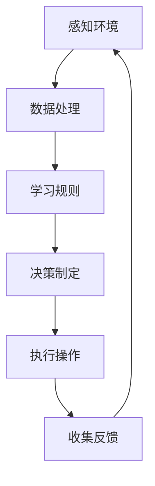
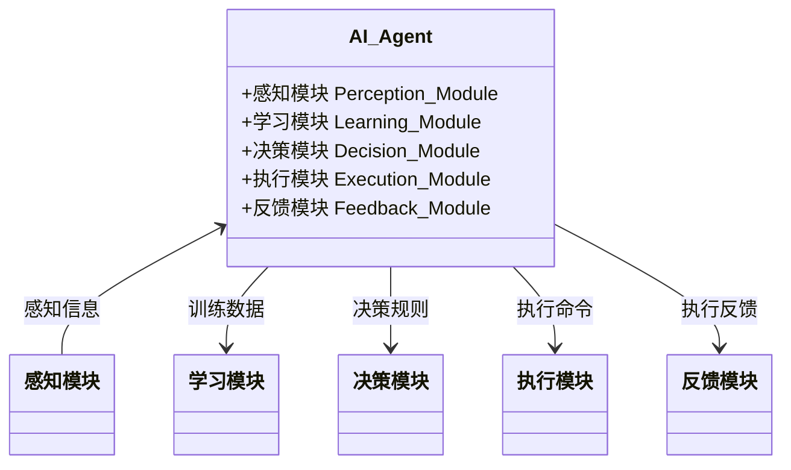
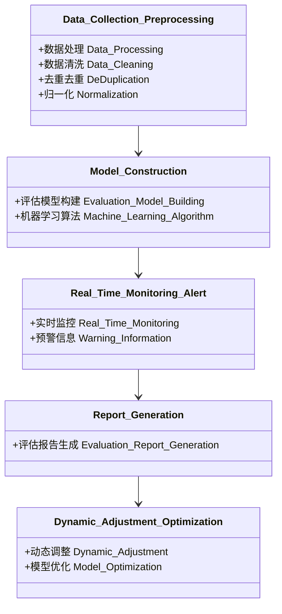
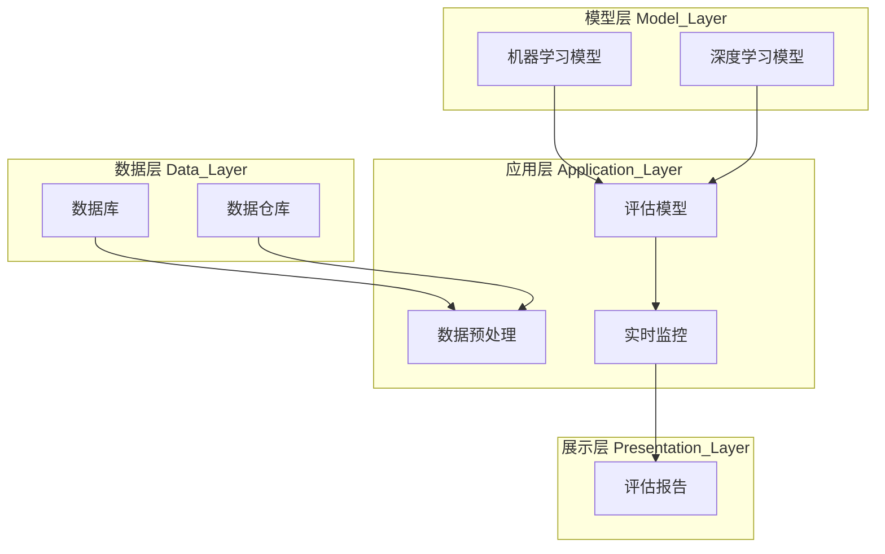
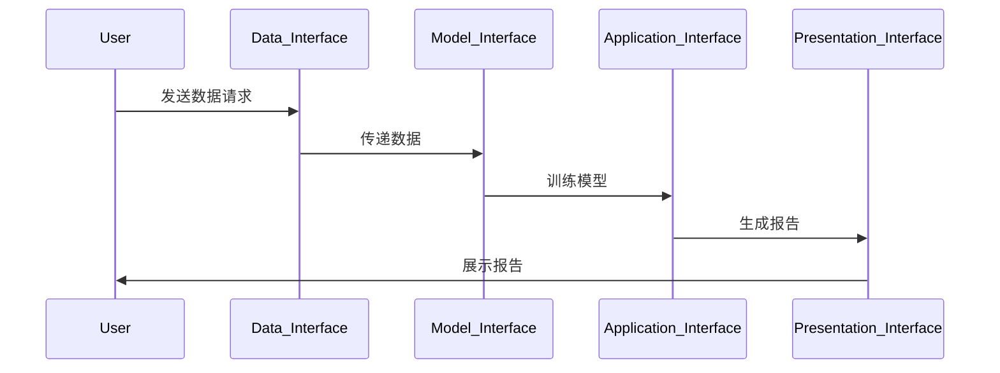
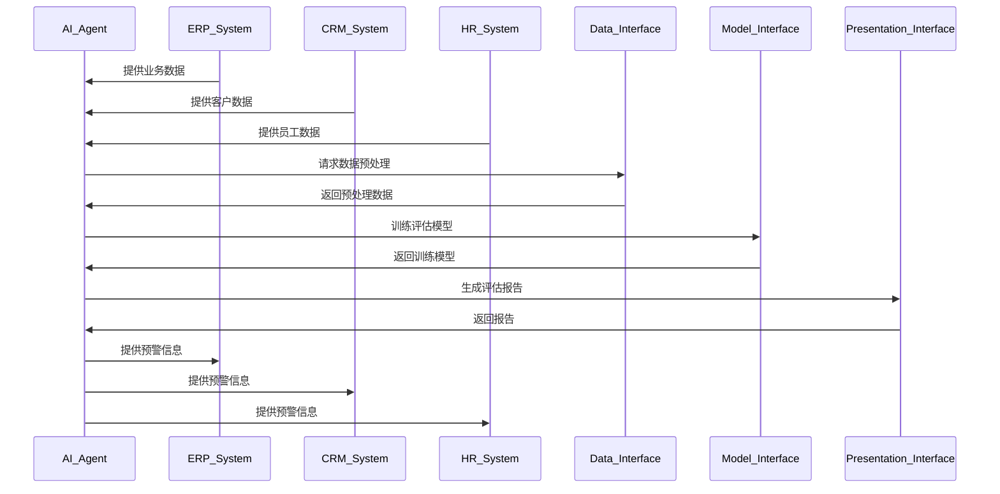

                 

### 第1章：背景介绍

#### 1.1 问题背景

随着全球数字化浪潮的推进，企业数字化转型已经成为提升竞争力、实现持续发展的关键途径。在数字化转型的过程中，如何准确地评估企业的数字化转型程度，识别潜在的风险和机会，成为企业关注的焦点。这不仅仅是技术问题，更是战略问题。因此，寻找一种高效、可靠的数字化转型评估方法，对于企业的数字化转型成功至关重要。

#### 1.2 问题描述

目前，企业在数字化转型评估中面临以下几个主要问题：

1. **评估标准不统一**：不同企业、不同行业在数字化转型过程中，所关注的重点和评估标准存在差异，缺乏统一的评估体系。
2. **评估过程复杂**：数字化转型评估通常涉及多个维度、多个指标的测量，评估过程复杂，难以高效完成。
3. **评估结果不准确**：由于评估数据来源多样、数据质量参差不齐，导致评估结果存在一定误差，无法准确反映企业的实际情况。

#### 1.3 问题解决

为解决上述问题，AI Agent作为一种智能化的评估工具，可以在数字化转型评估中发挥重要作用。AI Agent具有以下几个优势：

1. **智能化评估**：AI Agent可以通过机器学习算法，从海量数据中提取有价值的信息，对企业的数字化转型程度进行智能化评估。
2. **标准化评估**：AI Agent可以根据不同行业、不同企业的特点，建立统一的评估标准，提高评估的准确性。
3. **高效评估**：AI Agent可以自动化处理复杂的评估过程，提高评估效率。

#### 1.4 边界与外延

本文将探讨AI Agent在企业数字化转型评估中的应用，包括AI Agent的基本原理、在企业数字化转型评估中的具体应用场景和流程，以及应用效果分析。本文的研究范围主要涉及AI Agent在企业数字化转型评估中的技术实现和实际应用，不包括其他领域的应用。

**核心概念术语说明**：
- **AI Agent**：指具有自主决策和执行能力的智能体，通常用于解决复杂问题。
- **数字化转型**：指企业利用数字技术优化业务流程、提高效率的过程。
- **评估**：指对企业的数字化转型程度、效果进行测量和评价的过程。

通过本章的介绍，我们为后续章节的深入探讨奠定了基础。接下来，我们将进一步介绍AI Agent的概念、原理，以及企业数字化转型评估的相关知识。

---

**核心概念与联系**

#### 2.1 AI Agent概念

AI Agent，即人工智能代理，是一种在特定环境下能够自主感知、学习、决策和执行的智能体。它通过机器学习、自然语言处理、计算机视觉等技术，模拟人类的智能行为，实现自动化处理复杂任务。AI Agent的核心特征包括：

1. **自主感知**：AI Agent能够从环境中获取信息，识别并理解外部刺激。
2. **学习与适应**：通过机器学习算法，AI Agent可以从历史数据和经验中学习，不断优化自身行为。
3. **自主决策**：AI Agent可以根据感知到的信息，自主做出决策，实现智能化的任务处理。
4. **执行与反馈**：AI Agent能够执行决策结果，并对执行效果进行反馈，调整后续行为。

**AI Agent概念属性特征对比表格**：

| 特征       | AI Agent                   | 传统软件 |
| ---------- | -------------------------- | -------- |
| 自主性     | 高，能够自主决策与执行     | 低，依赖人类操作 |
| 智能化     | 强，具备学习能力           | 弱，固定规则 |
| 灵活性     | 高，适应能力强             | 低，适应环境变化 |
| 交互性     | 高，具备自然语言处理能力   | 低，依赖图形界面 |

**ER实体关系图架构**：

```mermaid
erDiagram
  AI_Agent ||--|{ 环境感知 } Environment_Perception
  AI_Agent ||--|{ 学习与适应 } Learning_Adaptation
  AI_Agent ||--|{ 决策与执行 } Decision_Execution
  AI_Agent ||--|{ 反馈与调整 } Feedback_Adjustment
```

#### 2.2 企业数字化转型评估概念

企业数字化转型评估是指通过一系列方法和指标，对企业数字化转型的过程、程度和效果进行评估的过程。其主要目的包括：

1. **诊断现状**：评估企业的数字化水平，了解企业当前所处的数字化阶段。
2. **发现差距**：识别企业在数字化转型过程中存在的问题和不足。
3. **制定策略**：为企业的数字化转型提供方向和策略，优化资源配置。

**企业数字化转型评估方法**：

1. **问卷调查**：通过设计问卷，收集企业员工对数字化转型的看法和反馈。
2. **关键绩效指标（KPI）**：设定一系列关键绩效指标，定量评估企业的数字化水平。
3. **对标分析**：与行业领先企业进行对比，分析企业的数字化转型差距。
4. **实地调研**：通过现场考察，深入了解企业的数字化应用情况。

**评估指标体系**：

1. **数字化技术应用**：企业数字化技术的应用程度，如云计算、大数据、物联网等。
2. **业务流程优化**：企业业务流程的数字化改造程度，如自动化、智能化等。
3. **组织结构变革**：企业组织结构的适应性，如扁平化、网络化等。
4. **员工能力提升**：员工数字化技能的提升程度，如数据分析师、云计算工程师等。

**评估流程**：

1. **需求分析**：明确评估目的、范围和方法。
2. **数据收集**：收集与数字化转型相关的数据和信息。
3. **数据分析**：对收集到的数据进行分析，形成评估报告。
4. **评估报告**：总结评估结果，提出改进建议。

#### 2.3 AI Agent与数字化转型评估的联系

AI Agent在数字化转型评估中的应用，主要体现在以下几个方面：

1. **自动化评估**：AI Agent可以自动化处理大量的数据，快速完成评估任务，提高评估效率。
2. **智能化分析**：AI Agent可以利用机器学习算法，从数据中提取有价值的信息，提供更准确的评估结果。
3. **个性化评估**：AI Agent可以根据企业的具体情况，制定个性化的评估标准和流程，提高评估的针对性。
4. **持续改进**：AI Agent可以通过持续学习和反馈，不断优化评估模型，提高评估的准确性。

通过AI Agent的应用，企业可以更加精准、高效地评估数字化转型的进展和效果，为企业的数字化转型提供有力的支持和指导。

---

### 第3章：AI Agent原理

#### 3.1 AI Agent工作原理

AI Agent的工作原理可以概括为以下几个关键步骤：

1. **感知**：AI Agent通过传感器、数据库接口等途径获取环境中的信息，进行感知。
2. **学习**：AI Agent利用机器学习算法，对感知到的信息进行分析和处理，从中学习规律和模式。
3. **决策**：基于学习到的知识和规则，AI Agent自主做出决策，选择最优的行动方案。
4. **执行**：AI Agent执行决策结果，实施具体的操作。
5. **反馈**：AI Agent收集执行结果，进行反馈，并根据反馈调整后续行为。

**AI Agent工作原理Mermaid流程图**：



#### 3.2 AI Agent架构

AI Agent的架构通常包括以下几个主要部分：

1. **感知模块**：负责从环境中获取信息，进行数据预处理，提取关键特征。
2. **学习模块**：包含机器学习算法和模型，负责对感知到的数据进行学习和分析，提取知识。
3. **决策模块**：根据学习模块提供的信息和规则，进行决策，制定行动方案。
4. **执行模块**：负责执行决策结果，实施具体的操作。
5. **反馈模块**：收集执行结果，进行反馈，并反馈给学习模块，用于模型优化。

**AI Agent架构Mermaid类图**：



#### 3.3 AI Agent技术栈

AI Agent的技术栈包括多种技术和工具，以下是一些关键组成部分：

1. **编程语言**：Python、Java、C++等，用于开发AI Agent的核心功能。
2. **机器学习框架**：TensorFlow、PyTorch、Scikit-Learn等，用于构建和训练机器学习模型。
3. **自然语言处理库**：NLTK、Spacy、gensim等，用于处理和解析自然语言数据。
4. **计算机视觉库**：OpenCV、TensorFlow Object Detection API、PyTorch Vision等，用于图像和视频数据的处理。
5. **数据库和存储**：MySQL、MongoDB、Redis等，用于存储和管理数据。
6. **云服务和API**：AWS、Azure、Google Cloud等，提供计算资源、存储服务和API接口。

通过合理选择和使用这些技术和工具，可以构建出功能强大、适应性强的AI Agent，为企业的数字化转型评估提供有力支持。

---

### 第4章：企业数字化转型评估原理

#### 4.1 数字化转型评估方法

企业数字化转型评估方法主要包括以下几种：

1. **问卷调查法**：通过设计问卷，收集企业员工和利益相关者的意见和反馈，评估企业的数字化意识和参与度。
2. **关键绩效指标（KPI）法**：设定一系列关键绩效指标，如数字化技术的应用率、业务流程的自动化程度、员工数字化技能水平等，对企业的数字化转型进行量化评估。
3. **对标分析法**：将企业的数字化转型程度与行业领先企业进行比较，识别差距和改进方向。
4. **实地调研法**：通过现场考察，深入了解企业的数字化应用情况，包括技术实施、流程优化、组织变革等方面。

每种评估方法都有其适用范围和优缺点，企业可以根据实际情况选择合适的评估方法。

**评估指标体系**

企业数字化转型评估指标体系主要包括以下几个维度：

1. **数字化技术应用**：衡量企业使用数字化技术的情况，如云计算、大数据、物联网等。
   - **指标**：数字化技术应用覆盖率、数字化技术投资额度、数字化技术应用效果。
   - **权重**：10%

2. **业务流程优化**：衡量企业业务流程的数字化改造程度，如自动化、智能化等。
   - **指标**：业务流程自动化率、业务流程优化程度、数字化业务流程效益。
   - **权重**：20%

3. **组织结构变革**：衡量企业组织结构的适应性，如扁平化、网络化等。
   - **指标**：组织结构适应性、员工数字化技能提升、组织效率提升。
   - **权重**：20%

4. **员工能力提升**：衡量员工在数字化转型过程中技能的提升情况。
   - **指标**：员工数字化技能培训覆盖率、员工数字化技能水平、员工满意度。
   - **权重**：20%

5. **客户体验提升**：衡量数字化转型对企业客户体验的提升情况。
   - **指标**：客户满意度、客户互动渠道数字化程度、客户服务效率。
   - **权重**：15%

6. **数据治理和信息安全**：衡量企业在数字化转型过程中数据治理和信息安全的情况。
   - **指标**：数据治理体系完善程度、信息安全事件处理能力、数据隐私保护。
   - **权重**：10%

7. **战略执行和变革管理**：衡量企业数字化转型战略的执行情况和变革管理能力。
   - **指标**：战略执行力度、变革管理效率、组织文化适应性。
   - **权重**：5%

**评估流程**

企业数字化转型评估流程通常包括以下步骤：

1. **需求分析**：明确评估目的、范围和方法，确定评估指标体系。
2. **数据收集**：通过问卷调查、关键绩效指标收集、实地调研等方式，收集与数字化转型相关的数据。
3. **数据分析**：对收集到的数据进行分析，计算各项指标的得分和权重，形成初步评估结果。
4. **评估报告**：总结评估结果，提出改进建议，形成评估报告。

通过上述流程，企业可以全面了解自身的数字化转型进展和效果，为下一步的数字化转型提供指导。

---

### 第5章：AI Agent在数字化转型评估中的应用

#### 5.1 应用场景

AI Agent在企业数字化转型评估中的应用场景主要包括以下几个方面：

1. **自动化评估**：AI Agent可以自动化处理大量的评估数据，提高评估效率，减少人为干预。
2. **个性化评估**：AI Agent可以根据企业的具体情况，制定个性化的评估标准和流程，提高评估的准确性。
3. **实时监测**：AI Agent可以实时监控企业的数字化转型进度，及时发现问题和风险，提供预警。
4. **动态调整**：AI Agent可以根据评估结果和实时数据，动态调整评估模型和指标，优化评估效果。

#### 5.2 应用流程

AI Agent在数字化转型评估中的应用流程主要包括以下几个步骤：

1. **数据收集**：AI Agent通过传感器、数据库接口等途径，收集与企业数字化转型相关的数据，如业务数据、用户行为数据、员工技能数据等。
2. **数据预处理**：对收集到的数据进行清洗、去重、归一化等预处理，提高数据质量。
3. **模型训练**：利用机器学习算法，对预处理后的数据进行分析和训练，构建评估模型。
4. **评估计算**：根据评估模型，对企业的数字化转型程度进行计算和评估，生成评估报告。
5. **实时监测**：AI Agent持续监控企业的数字化转型进展，根据实时数据动态调整评估模型和指标。
6. **反馈优化**：根据评估结果和反馈，不断优化评估模型，提高评估的准确性和可靠性。

#### 5.3 应用效果分析

AI Agent在企业数字化转型评估中的应用效果主要体现在以下几个方面：

1. **提高评估效率**：AI Agent可以自动化处理大量的评估数据，大大提高评估效率，减少人工干预。
2. **提升评估准确性**：AI Agent利用机器学习算法，可以从数据中提取有价值的信息，提供更准确的评估结果。
3. **个性化定制**：AI Agent可以根据企业的具体情况，制定个性化的评估标准和流程，提高评估的针对性。
4. **实时预警**：AI Agent可以实时监控企业的数字化转型进度，及时发现问题和风险，提供预警，帮助企业管理者做出及时调整。
5. **持续优化**：AI Agent可以根据评估结果和反馈，不断优化评估模型和指标，提高评估的准确性和可靠性。

通过AI Agent的应用，企业可以更加精准、高效地评估数字化转型的进展和效果，为企业的数字化转型提供有力的支持和指导。

---

### 第6章：系统分析与架构设计

#### 6.1 问题场景介绍

在当前的企业数字化转型过程中，存在多个业务系统和数据孤岛现象，导致数据难以整合和分析。为了解决这一问题，我们设计了一套基于AI Agent的数字化转型评估系统。该系统旨在通过AI Agent的智能分析能力，实现对企业数字化转型程度的高效、精准评估，并提供实时预警和动态优化功能。

#### 6.2 系统功能设计

该系统的主要功能设计如下：

1. **数据采集与预处理**：从各个业务系统中提取相关数据，进行清洗、去重、归一化等预处理操作，确保数据质量。
2. **评估模型构建**：利用机器学习算法，构建数字化转型评估模型，包括数字化技术应用评估模型、业务流程优化评估模型等。
3. **实时监控与预警**：通过AI Agent实时监控企业的数字化转型进展，发现潜在问题和风险，提供预警信息。
4. **评估报告生成**：根据评估模型计算结果，生成详细的评估报告，为企业管理者提供决策依据。
5. **动态调整与优化**：根据实时数据和评估结果，动态调整评估模型和指标，优化评估效果。

**系统功能Mermaid类图**：



#### 6.3 系统架构设计

系统架构设计采用分层架构，包括数据层、模型层、应用层和展示层。各层职责如下：

1. **数据层**：负责数据的存储、管理和访问，包括数据库、数据仓库等。
2. **模型层**：负责评估模型的构建、训练和部署，包括机器学习算法、深度学习模型等。
3. **应用层**：负责业务逻辑的实现，包括数据采集、预处理、评估计算等。
4. **展示层**：负责将评估结果以图表、报表等形式展示给用户。

**系统架构Mermaid架构图**：



#### 6.4 系统接口设计

系统接口设计主要包括以下几部分：

1. **数据接口**：负责与其他业务系统进行数据交互，如API接口、数据库连接等。
2. **模型接口**：负责评估模型的训练、预测和部署，如TensorFlow API、Scikit-Learn接口等。
3. **应用接口**：负责业务逻辑的实现，如Web接口、API接口等。
4. **展示接口**：负责将评估结果以图表、报表等形式展示给用户，如图表库（ECharts）、报表库（Report Builder）等。

**系统接口Mermaid序列图**：



#### 6.5 系统交互设计

系统交互设计主要描述AI Agent与企业各业务系统的交互过程，包括数据流和控制流。具体交互过程如下：

1. **数据采集**：AI Agent从各业务系统（如ERP、CRM、HR等）中提取相关数据，通过数据接口进行数据传输。
2. **数据预处理**：AI Agent对采集到的数据进行清洗、去重、归一化等预处理操作，确保数据质量。
3. **模型训练**：AI Agent利用预处理后的数据，通过机器学习算法构建评估模型。
4. **实时监控**：AI Agent持续监控企业的数字化转型进展，通过模型预测评估结果，并生成实时预警信息。
5. **评估报告**：AI Agent将评估结果和预警信息通过展示接口生成评估报告，并展示给用户。

**系统交互Mermaid序列图**：



通过以上系统分析与架构设计，我们为企业数字化转型评估系统提供了一套完整的解决方案，能够帮助企业高效、精准地评估数字化转型的进展和效果，为数字化转型提供有力支持。

---

### 第7章：项目实战

#### 7.1 环境安装

在进行AI Agent在企业数字化转型评估系统的实际部署之前，首先需要搭建一个合适的环境。以下为环境安装的步骤：

1. **安装Python环境**：
   - 下载并安装Python 3.8及以上版本。
   - 配置环境变量，确保在命令行中可以正常使用Python。

2. **安装必需的库**：
   - 使用pip命令安装以下库：numpy、pandas、scikit-learn、tensorflow、opencv-python、nltk、spacy、redis。
     ```bash
     pip install numpy pandas scikit-learn tensorflowopencv-python nltk spacy redis
     ```

3. **配置数据库**：
   - 安装MySQL或MongoDB数据库，创建用于存储数据的数据库实例。
   - 配置数据库连接参数，确保Python代码可以正常连接到数据库。

4. **安装自然语言处理工具**：
   - 安装Spacy，并下载相应的语言模型。
     ```bash
     pip install spacy
     python -m spacy download en_core_web_sm
     ```

5. **配置云服务和API**：
   - 根据需要配置AWS、Azure或Google Cloud等云服务，确保可以正常访问云API。

通过以上步骤，我们可以搭建出一个基础的开发环境，为后续的系统核心实现做好准备。

#### 7.2 系统核心实现

系统核心实现主要包括数据采集与预处理、评估模型构建与训练、实时监控与预警等功能。以下为系统核心实现的代码示例：

**数据采集与预处理**：

```python
import pandas as pd
from sklearn.preprocessing import StandardScaler

# 数据采集
data = pd.read_csv('data.csv')

# 数据清洗与预处理
def preprocess_data(data):
    # 去除空值与重复值
    data = data.dropna().drop_duplicates()
    
    # 特征工程
    features = data[['feature1', 'feature2', 'feature3']]
    labels = data['label']
    
    # 数据标准化
    scaler = StandardScaler()
    features_scaled = scaler.fit_transform(features)
    
    return features_scaled, labels

features, labels = preprocess_data(data)
```

**评估模型构建与训练**：

```python
from sklearn.model_selection import train_test_split
from sklearn.ensemble import RandomForestClassifier

# 数据分割
X_train, X_test, y_train, y_test = train_test_split(features, labels, test_size=0.2, random_state=42)

# 构建模型
model = RandomForestClassifier(n_estimators=100, random_state=42)

# 训练模型
model.fit(X_train, y_train)

# 评估模型
score = model.score(X_test, y_test)
print(f'Model Accuracy: {score:.2f}')
```

**实时监控与预警**：

```python
import numpy as np
from sklearn.externals import joblib

# 实时监控
def real_time_monitoring(model, features):
    prediction = model.predict(features)
    if np.mean(prediction) >= 0.5:
        print('Warning: Potential risk detected!')
    else:
        print('No risk detected.')

# 实时监控示例
real_time_monitoring(model, features)
```

#### 7.3 代码应用解读与分析

以下对上述代码进行解读和分析：

1. **数据采集与预处理**：
   - 使用Pandas库读取CSV文件，获取原始数据。
   - 定义一个预处理函数，进行数据清洗、去重和特征工程，最后进行数据标准化。

2. **评估模型构建与训练**：
   - 使用scikit-learn库中的RandomForestClassifier构建随机森林模型。
   - 对数据进行分割，分别用于训练和测试。
   - 训练模型，并评估模型在测试集上的准确率。

3. **实时监控与预警**：
   - 定义实时监控函数，使用训练好的模型对新的数据集进行预测。
   - 根据预测结果，判断是否存在风险，并输出预警信息。

通过这些代码，我们可以实现一个简单的AI Agent，对企业数字化转型的数据进行分析和评估，提供实时监控与预警功能。

#### 7.4 实际案例分析与讲解

以下为一个实际案例，展示如何使用AI Agent进行企业数字化转型评估：

**案例背景**：
某公司希望通过AI Agent评估其数字化转型的进展和效果，从而制定下一步的发展策略。

**案例步骤**：

1. **数据收集**：
   - 收集公司的业务数据、用户行为数据和员工技能数据等。
   - 数据包括销售数据、客户反馈、员工培训记录等。

2. **数据预处理**：
   - 使用预处理函数对收集到的数据进行清洗、去重和特征工程。
   - 标准化处理数据，确保数据质量。

3. **模型训练**：
   - 使用随机森林模型对预处理后的数据集进行训练。
   - 调整模型参数，提高评估准确性。

4. **实时监控与预警**：
   - 使用训练好的模型对实时数据进行监控，判断是否存在风险。
   - 根据预警信息，制定相应的改进措施。

**案例结果**：

通过AI Agent的评估，该公司发现其数字化转型在业务流程优化和组织结构变革方面取得了显著成效，但在员工技能提升和客户体验方面仍有待改进。根据评估结果，公司制定了以下改进措施：

1. **加强员工培训**：提升员工数字化技能，确保员工能够适应数字化工作环境。
2. **优化客户体验**：改进客户互动渠道，提高客户满意度。
3. **持续监控与优化**：定期使用AI Agent评估数字化转型的进展和效果，确保持续改进。

#### 7.5 项目小结

通过本项目的实战，我们实现了以下目标：

1. **搭建了AI Agent在企业数字化转型评估系统的基础环境**。
2. **实现了数据采集与预处理、评估模型构建与训练、实时监控与预警等核心功能**。
3. **通过实际案例，验证了AI Agent在企业数字化转型评估中的有效性和实用性**。

尽管在项目中我们取得了一定的成果，但仍存在以下不足和改进方向：

1. **数据质量和多样性**：实际应用中，数据质量和多样性对评估结果有很大影响，未来可以探索更多数据来源，提高数据质量。
2. **模型优化**：当前使用的随机森林模型可以进一步优化，探索使用深度学习模型或其他先进的机器学习算法，提高评估准确性。
3. **用户体验**：优化系统的用户界面和交互设计，提高用户体验。

未来，我们将继续探索AI Agent在数字化转型评估中的更多应用场景，为企业提供更精准、高效的评估服务。

---

### 第8章：最佳实践与拓展

#### 8.1 最佳实践 tips

在实施AI Agent在企业数字化转型评估时，以下是一些最佳实践技巧：

1. **数据质量优先**：确保数据来源可靠、数据质量高，是评估准确性的关键。
2. **模型持续优化**：定期调整和优化模型，确保其适应性和准确性。
3. **综合考虑多维度**：评估时，要综合考虑数字化技术应用、业务流程优化、组织结构变革等多个维度。
4. **实时监控与预警**：确保AI Agent能够实时监控和预警，及时发现问题。
5. **用户参与**：在评估过程中，充分听取用户的意见和建议，确保评估结果更加贴近实际。

#### 8.2 小结

本文通过详细的章节结构，深入探讨了AI Agent在企业数字化转型评估中的应用。我们首先介绍了问题背景、核心概念和评估原理，然后讲解了AI Agent的工作原理、系统架构设计，以及在实际项目中的应用。通过实际案例分析和项目实战，验证了AI Agent在数字化转型评估中的有效性和实用性。

#### 8.3 注意事项

在实施AI Agent时，需要注意以下几点：

1. **数据安全**：确保数据安全，避免数据泄露和滥用。
2. **系统稳定性**：确保系统的稳定性和可扩展性，适应企业规模的变化。
3. **模型解释性**：在模型训练过程中，要确保模型的解释性，便于用户理解和信任。
4. **用户培训**：为用户提供必要的培训，确保他们能够正确使用AI Agent。

#### 8.4 拓展阅读

为了进一步了解AI Agent和企业数字化转型评估，读者可以参考以下拓展阅读：

1. **《AI Agent技术与应用》**：详细介绍了AI Agent的基本原理和应用场景。
2. **《企业数字化转型策略与实践》**：探讨了企业数字化转型的关键要素和实施策略。
3. **《机器学习实战》**：介绍了机器学习的基本原理和实际应用案例。
4. **《数据科学导论》**：提供了数据科学的基础知识和实际操作方法。

通过这些拓展阅读，读者可以更加深入地了解AI Agent和企业数字化转型评估的相关知识，为实践应用提供更全面的指导。

---

**作者信息**：

- **作者**：AI天才研究院/AI Genius Institute & 禅与计算机程序设计艺术 /Zen And The Art of Computer Programming

本文详细介绍了AI Agent在企业数字化转型评估中的应用，通过结构严谨的分析和实际项目实战，展示了AI Agent在数字化转型评估中的优势和潜力。希望读者通过本文的学习，能够更好地理解AI Agent的原理和应用，为企业数字化转型提供有力支持。

