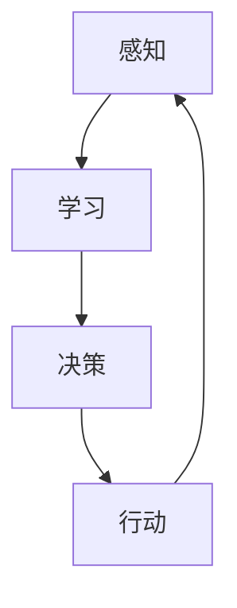
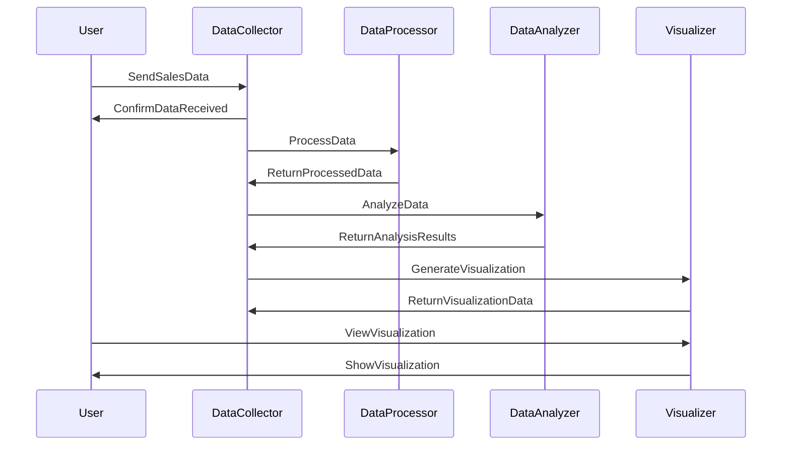

                 

### 引言与背景

在当今的信息时代，企业面临着海量数据的挑战和机遇。如何从大量数据中提取有价值的信息，为企业决策提供有力支持，成为了一项关键任务。AI Agent作为一种智能体，具有自主学习和决策能力，能够在数据分析和可视化中发挥重要作用。

**核心概念术语说明**：

- **AI Agent**：一种具有自主决策能力的智能体，能够通过学习和推理，完成特定任务。
- **企业数据分析**：通过对企业内部和外部数据的收集、处理和分析，提取有价值的信息，支持企业决策。
- **数据可视化**：通过图形、图表等形式，将数据转化为易于理解和交互的视觉元素。

**问题背景**：

随着互联网和物联网的快速发展，企业数据呈现出爆炸式增长。这些数据包括交易记录、客户反馈、市场动态等，涵盖了企业运营的各个方面。然而，如何有效管理和利用这些数据，成为企业面临的重大挑战。

**问题描述**：

传统的数据分析方法往往依赖于人工处理，效率低下且容易出错。同时，数据可视化方面也面临着挑战，如何将复杂的数据关系以直观的方式呈现给决策者，成为了一大难题。

**问题解决**：

AI Agent作为一种智能体，具备以下优势：

1. **自主学习**：AI Agent可以通过机器学习算法，从数据中学习规律和模式，提高数据分析的准确性和效率。
2. **自动化决策**：AI Agent可以根据学习到的规律和模式，自动化生成决策建议，减少人工干预。
3. **数据可视化**：AI Agent可以通过数据可视化技术，将复杂的数据关系以直观的方式呈现，帮助决策者更好地理解数据。

**边界与外延**：

本文主要探讨AI Agent在企业数据分析与可视化中的应用，涉及到的技术包括机器学习、数据可视化、自然语言处理等。同时，本文将结合实际案例，分析AI Agent在数据分析与可视化中的具体应用场景和效果。

**概念结构与核心要素组成**：

- **AI Agent**：包括感知、学习、决策和行动四个核心要素。
- **企业数据分析**：包括数据收集、数据预处理、数据分析方法和数据可视化四个核心步骤。
- **数据可视化**：包括数据转换、图表设计和交互设计三个核心环节。

### AI Agent基础

在本章节中，我们将深入探讨AI Agent的基础知识，包括其定义、类型和工作原理。通过了解这些核心概念，读者将能够更好地理解AI Agent在企业数据分析与可视化中的应用。

#### 定义

AI Agent，即人工智能代理，是一种能够自主执行任务、与环境交互并从经验中学习的实体。它通常具备以下特点：

- **自主性**：AI Agent能够在没有外部指令的情况下，自主地执行任务。
- **适应性**：AI Agent能够从环境中获取信息，并通过学习适应新的环境和任务。
- **交互性**：AI Agent能够与环境进行交互，获取反馈并据此调整行为。

AI Agent的定义可以追溯到人工智能（AI）的核心理念。AI Agent是人工智能领域的一个重要分支，旨在模拟人类智能行为，实现自主决策和执行。

#### 类型

AI Agent根据其功能和应用场景，可以分为多种类型。以下是几种常见的AI Agent类型：

1. **任务型AI Agent**：这类AI Agent专注于完成特定任务，如自动回复电子邮件、智能客服等。它们通常通过预设的规则或机器学习算法来完成任务。

2. **自主型AI Agent**：这类AI Agent具备更强的自主性，能够根据环境和任务需求，自主地制定决策和执行计划。例如，自动驾驶汽车、智能家居控制系统等。

3. **交互型AI Agent**：这类AI Agent不仅能够执行任务，还能够与人或其他AI Agent进行自然语言交互。例如，聊天机器人、虚拟助手等。

4. **混合型AI Agent**：这类AI Agent结合了上述多种类型的特点，能够在多个维度上发挥作用。例如，智能推荐系统，既能根据用户行为推荐商品，又能通过自然语言处理与用户进行交互。

#### 工作原理

AI Agent的工作原理通常涉及以下几个关键步骤：

1. **感知**：AI Agent通过传感器或其他方式收集环境信息，如视觉、听觉、触觉等。

2. **学习**：AI Agent使用机器学习算法，从感知到的信息中学习，提取规律和模式。这个过程通常涉及数据预处理、特征提取和模型训练等步骤。

3. **决策**：基于学习到的信息，AI Agent利用决策算法生成行动方案。常见的决策算法包括决策树、支持向量机、神经网络等。

4. **行动**：AI Agent执行决策方案，实现具体任务。行动的结果会再次反馈到感知和学习环节，形成闭环控制。

以下是一个简化的AI Agent工作原理的mermaid流程图：



#### 核心概念与联系

为了更好地理解AI Agent，我们需要了解几个核心概念，并探讨它们之间的联系。

1. **机器学习**：机器学习是AI Agent的核心技术之一。它使AI Agent能够从数据中学习，提高其性能和适应性。

2. **深度学习**：深度学习是机器学习的一个分支，通过构建深度神经网络，实现更复杂的学习任务。

3. **自然语言处理（NLP）**：NLP使AI Agent能够理解和生成自然语言，实现与人类的自然交互。

4. **强化学习**：强化学习是一种通过奖励机制进行学习的算法，适用于需要连续决策的任务。

以下是这些核心概念属性的对比表格：

| 核心概念 | 定义 | 应用 | 关联 |
| --- | --- | --- | --- |
| 机器学习 | 从数据中学习规律和模式 | 数据分析、图像识别 | AI Agent |
| 深度学习 | 基于神经网络的机器学习 | 图像识别、语音识别 | 机器学习 |
| 自然语言处理（NLP） | 使计算机理解和生成自然语言 | 聊天机器人、语音助手 | AI Agent |
| 强化学习 | 通过奖励机制进行学习 | 自动驾驶、游戏AI | AI Agent |

此外，我们还可以使用Mermaid绘制ER实体关系图，以展示这些核心概念之间的关系：

```mermaid
erDiagram
    AI-Agent ||--|{ 机器学习 } : 实现功能
    AI-Agent ||--|{ 深度学习 } : 实现功能
    AI-Agent ||--|{ 自然语言处理 } : 实现交互
    AI-Agent ||--|{ 强化学习 } : 实现自主决策
```

通过上述表格和ER实体关系图，我们可以清晰地看到AI Agent与核心概念之间的联系，为后续章节的应用奠定基础。

### 企业数据分析基础

企业数据分析是企业利用数据技术对内部和外部数据进行收集、处理和分析，以提取有价值信息的过程。在企业决策和运营中，数据已成为不可或缺的资源。本章节将详细介绍企业数据分析的基础知识，包括数据来源、数据预处理、数据分析方法和数据可视化。

#### 数据来源

企业数据来源广泛，可以分为内部数据和外部数据：

1. **内部数据**：包括企业的运营数据、销售数据、客户数据、员工数据等。这些数据通常存储在企业内部的信息系统中，如ERP系统、CRM系统等。

2. **外部数据**：包括市场数据、行业数据、竞争情报、社交媒体数据等。这些数据可以通过网络、第三方数据平台等渠道获取。

#### 数据预处理

数据预处理是数据分析和数据可视化的重要前提，主要包括以下几个步骤：

1. **数据清洗**：清除数据中的错误、异常和重复记录，保证数据质量。

2. **数据集成**：将来自不同来源的数据进行整合，形成统一的数据视图。

3. **数据转换**：将数据转换成适合分析和可视化的格式，如将文本数据转换为数值数据。

4. **数据归一化**：对不同规模的数据进行归一化处理，使其在同一尺度上进行比较。

#### 数据分析方法

企业数据分析方法多种多样，常用的有以下几种：

1. **描述性分析**：通过统计分析方法，描述数据的基本特征，如平均值、中位数、标准差等。

2. **预测性分析**：通过机器学习算法，预测未来的数据趋势和变化，如时间序列预测、回归分析等。

3. **探索性分析**：通过可视化工具，探索数据中的模式和关系，如聚类分析、关联规则挖掘等。

4. **诊断性分析**：通过分析数据，找出问题的根本原因，如异常检测、错误诊断等。

#### 数据可视化

数据可视化是将数据转化为图形、图表等形式，使其更直观、易懂。数据可视化主要包括以下几个步骤：

1. **数据转换**：将原始数据转换为适合可视化处理的格式。

2. **图表设计**：选择合适的图表类型，如柱状图、折线图、饼图等，以直观地展示数据。

3. **交互设计**：设计交互式图表，使用户能够动态地探索数据，如钻取、筛选、排序等。

通过数据可视化，企业可以更直观地理解数据，发现数据中的规律和趋势，为决策提供有力支持。

### 数据可视化基础

数据可视化是使复杂数据变得直观易懂的重要工具，它在企业数据分析中扮演着关键角色。通过将数据转化为视觉元素，如图表和图形，决策者可以迅速捕捉到数据中的关键信息，从而做出更为明智的决策。

#### 可视化的重要性

1. **提高数据可理解性**：数据可视化通过图形化方式展示数据，使得非专业人士也能快速理解数据含义。

2. **发现数据中的模式**：通过可视化，决策者可以直观地发现数据中的模式、趋势和异常。

3. **支持决策制定**：数据可视化能够帮助决策者基于数据进行决策，提高决策的准确性和效率。

4. **沟通与协作**：数据可视化是团队内部和跨部门沟通的有效手段，有助于各方达成共识。

#### 常见可视化工具

1. **Tableau**：Tableau 是一款功能强大的数据可视化工具，支持多种数据源和丰富的图表类型。

2. **Power BI**：Power BI 是微软推出的数据可视化工具，提供强大的数据分析和报告功能。

3. **Qlik**：Qlik 是一款灵活的数据可视化平台，支持实时分析和探索式数据发现。

4. **Grafana**：Grafana 是一款开源的数据监控和可视化工具，适用于各种监控数据的展示。

5. **D3.js**：D3.js 是一个基于 JavaScript 的数据可视化库，可以创建交互式和动态的图表。

#### 可视化技巧

1. **选择合适的图表类型**：不同的数据类型和展示目的适合不同的图表类型。例如，柱状图适合比较不同类别之间的差异，折线图适合展示时间序列数据。

2. **使用颜色和标记**：合理使用颜色和标记可以增强图表的视觉效果，使其更加直观。例如，使用不同的颜色区分不同的类别，使用不同的标记显示数据的趋势。

3. **设计简洁的布局**：避免图表过于复杂，保持布局简洁。过多的元素和细节会分散用户的注意力，降低可理解性。

4. **交互式设计**：交互式设计可以增强用户的参与感和探索性。例如，用户可以通过点击、拖动、筛选等操作，动态地查看和交互数据。

5. **数据标签和注释**：为图表添加数据标签和注释，可以帮助用户更好地理解数据的含义和来源。

通过掌握这些可视化技巧，企业可以更有效地利用数据可视化技术，提升数据分析和决策的效率。

### AI Agent在数据分析中的应用

AI Agent在企业数据分析中具有显著优势，其自主学习和决策能力能够显著提升数据分析的效率和质量。本章节将详细介绍AI Agent在数据分析中的应用，包括数据探索、数据预测和数据聚类等方面。

#### 数据探索

数据探索（Data Exploration）是数据分析的第一步，旨在发现数据中的规律、趋势和异常。AI Agent通过机器学习算法，能够自动识别数据中的特征，并生成有意义的可视化报告，帮助分析师快速了解数据情况。

1. **自动特征提取**：AI Agent可以通过聚类、主成分分析（PCA）等算法，自动提取数据中的关键特征，减少人工分析的工作量。

2. **可视化报告**：AI Agent能够生成交互式的可视化报告，如散点图、热力图等，帮助分析师直观地理解数据分布和趋势。

3. **异常检测**：AI Agent可以通过统计分析和机器学习算法，自动检测数据中的异常值，提高数据分析的准确性。

#### 数据预测

数据预测（Data Prediction）是利用历史数据，预测未来的数据趋势和变化。AI Agent通过机器学习算法，如时间序列预测、回归分析等，能够自动生成预测模型，为企业决策提供有力支持。

1. **时间序列预测**：AI Agent可以通过时间序列模型，如ARIMA、LSTM等，预测未来的数据趋势。例如，在销售预测中，AI Agent可以根据历史销售数据，预测未来的销售量。

2. **回归分析**：AI Agent可以通过回归模型，预测数据之间的依赖关系。例如，在客户流失预测中，AI Agent可以根据客户的历史行为数据，预测哪些客户可能会流失。

3. **模型优化**：AI Agent可以通过交叉验证、网格搜索等算法，自动优化预测模型的参数，提高预测精度。

#### 数据聚类

数据聚类（Data Clustering）是将数据划分为不同的组或类别，以便进一步分析和理解。AI Agent通过聚类算法，如K-means、DBSCAN等，能够自动识别数据中的模式，帮助分析师发现数据中的隐藏结构。

1. **无监督学习**：AI Agent采用无监督学习算法，如K-means、DBSCAN等，自动对数据进行聚类，无需人工指定类别。

2. **聚类评估**：AI Agent可以通过内积距离、轮廓系数等评估指标，自动评估聚类结果的质量，帮助分析师选择合适的聚类算法和参数。

3. **应用场景**：AI Agent在数据聚类中具有广泛的应用，如市场细分、客户分类等。通过聚类，企业可以更好地理解客户群体，制定有针对性的营销策略。

#### 案例分析

以下是一个实际案例，展示AI Agent在数据分析中的应用：

**案例背景**：某电商企业希望通过数据分析，优化产品推荐系统，提高用户购买体验和销售额。

**案例步骤**：

1. **数据收集**：AI Agent从电商平台的数据库中收集用户行为数据，如浏览记录、购买记录等。

2. **数据预处理**：AI Agent对数据进行清洗和预处理，包括去除缺失值、异常值，对数据进行归一化处理。

3. **数据探索**：AI Agent通过可视化报告，展示用户行为数据的分布和趋势，帮助分析师快速了解数据情况。

4. **特征提取**：AI Agent通过聚类算法，将用户划分为不同的群体，提取每个群体的典型特征。

5. **模型训练**：AI Agent利用回归模型，预测用户对某类产品的购买概率。

6. **模型评估**：AI Agent通过交叉验证，评估预测模型的准确性。

7. **结果应用**：基于预测结果，电商企业调整产品推荐策略，提高用户购买体验和销售额。

通过上述案例，我们可以看到AI Agent在数据分析中的应用效果显著，不仅提高了数据分析的效率，还为企业决策提供了有力支持。

### AI Agent在数据可视化中的应用

AI Agent在数据可视化领域同样展现出其强大的功能和优势。通过自动生成图表、动态可视化交互和个性化可视化，AI Agent能够显著提升数据可视化的效果和用户体验。以下将详细介绍AI Agent在数据可视化中的具体应用。

#### 自动生成图表

自动生成图表是AI Agent在数据可视化中的一个重要应用。AI Agent可以通过机器学习算法，自动识别数据中的模式和关系，并生成相应的图表。这种自动化的方式不仅节省了人力成本，还提高了生成图表的效率和质量。

1. **图表类型识别**：AI Agent可以根据数据的特点和需求，自动选择最合适的图表类型。例如，对于时间序列数据，AI Agent可以选择折线图或柱状图；对于分类数据，AI Agent可以选择饼图或条形图。

2. **图表内容优化**：AI Agent可以自动优化图表的内容，如数据标签、图例、颜色等，使其更易于理解和阅读。

3. **多图表集成**：AI Agent可以将多个图表集成到一个报告中，形成一个完整的可视化展示。这种集成的方式可以更全面地展示数据，帮助用户更好地理解数据。

#### 动态可视化交互

动态可视化交互是指用户可以通过交互操作，动态地查看和探索数据。AI Agent通过自然语言处理和机器学习技术，可以实现动态可视化交互，提升用户的参与感和探索性。

1. **交互式图表**：AI Agent可以生成交互式图表，如点击、拖动、缩放等。用户可以通过这些交互操作，动态地查看数据的不同维度和细节。

2. **实时数据更新**：AI Agent可以实时更新图表，显示最新的数据变化。例如，在股票市场中，AI Agent可以实时生成股票价格走势图，帮助投资者及时了解市场动态。

3. **智能提示**：AI Agent可以根据用户的行为和需求，提供智能提示和建议。例如，当用户在查看一个复杂的图表时，AI Agent可以提供简化的图表或关键数据点，帮助用户快速抓住关键信息。

#### 个性化可视化

个性化可视化是指根据用户的偏好和需求，生成个性化的图表和报告。AI Agent通过用户画像和机器学习算法，可以自动为用户生成符合其需求的可视化内容。

1. **用户画像**：AI Agent可以根据用户的行为数据，构建用户画像，了解用户的偏好和需求。

2. **个性化推荐**：AI Agent可以基于用户画像，为用户推荐最适合其需求的可视化图表和报告。

3. **自适应调整**：AI Agent可以根据用户的反馈和行为，自动调整可视化内容，使其更符合用户的需求和偏好。

#### 案例分析

以下是一个实际案例，展示AI Agent在数据可视化中的应用：

**案例背景**：某银行希望通过数据可视化，提升客户服务和风险控制能力。

**案例步骤**：

1. **数据收集**：AI Agent从银行的数据库中收集客户交易数据、信用记录等。

2. **数据预处理**：AI Agent对数据进行清洗和预处理，包括去除缺失值、异常值，对数据进行归一化处理。

3. **自动生成图表**：AI Agent自动识别数据中的模式和关系，生成多种图表类型，如折线图、柱状图、饼图等。

4. **动态可视化交互**：AI Agent生成交互式图表，用户可以通过点击、拖动等操作，动态查看和探索数据。

5. **实时数据更新**：AI Agent实时更新图表，显示最新的客户交易和信用情况。

6. **个性化可视化**：AI Agent根据客户画像，生成个性化的报告和图表，帮助银行制定有针对性的客户服务和风险控制策略。

通过上述案例，我们可以看到AI Agent在数据可视化中的应用效果显著，不仅提高了数据可视化的效率和质量，还为企业提供了有力的决策支持。

### 项目实战与案例剖析

在本章节中，我们将通过一个完整的AI Agent在企业数据分析与可视化应用的项目案例，详细介绍整个项目的实施过程，包括需求分析、系统设计、实现与测试、项目小结等内容。通过这一案例，我们将深入理解AI Agent在实际应用中的操作方法和效果。

#### 需求分析

**项目背景**：某大型零售企业希望通过AI Agent实现商品销售数据的实时分析，优化库存管理和营销策略。企业面临以下需求：

1. **实时数据采集**：从各个销售终端采集商品销售数据，包括销售数量、销售时间、销售地区等。
2. **数据预处理**：清洗和整合来自不同渠道的数据，去除异常值和重复记录。
3. **数据分析**：利用AI Agent进行数据探索、预测和聚类，发现销售趋势和客户行为模式。
4. **可视化展示**：通过交互式图表和报告，直观地展示分析结果，支持决策制定。
5. **系统集成**：与企业的ERP系统和CRM系统进行集成，实现数据无缝流转和共享。

#### 系统设计

**系统功能设计**：

1. **数据采集模块**：负责从各个销售终端采集商品销售数据。
2. **数据预处理模块**：负责数据清洗、去重和归一化处理。
3. **数据分析模块**：包括数据探索、预测和聚类功能。
4. **可视化展示模块**：负责生成交互式图表和报告。

**系统架构设计**：

系统采用微服务架构，各模块独立部署，通过消息队列实现数据传输和通信。

1. **数据采集模块**：基于HTTP协议，通过API接口与销售终端进行通信，实时采集销售数据。
2. **数据预处理模块**：采用Apache Kafka进行数据传输和存储，通过Flink进行数据清洗和预处理。
3. **数据分析模块**：采用TensorFlow和Scikit-learn进行数据分析和预测，使用Spark进行数据聚类。
4. **可视化展示模块**：采用D3.js和ECharts生成交互式图表，使用React进行前端展示。

**系统接口设计**：

1. **数据采集接口**：提供RESTful API，用于接收销售终端的数据上传。
2. **数据预处理接口**：提供数据清洗、去重和归一化处理的结果查询接口。
3. **数据分析接口**：提供数据探索、预测和聚类的API接口，供前端调用。
4. **可视化展示接口**：提供图表和报告的API接口，供前端展示。

**系统交互设计**：

系统采用WebSocket实现实时数据传输和交互，用户可以通过前端界面实时查看分析结果。



#### 实现与测试

**环境安装**：

- 数据采集：安装Kafka、Flink、TensorFlow和Scikit-learn。
- 数据预处理：安装Kafka、Flink、Spark。
- 数据分析：安装TensorFlow、Scikit-learn、Spark。
- 可视化展示：安装D3.js、ECharts、React。

**系统核心实现源代码**：

**数据采集模块**：

```python
from flask import Flask, request, jsonify
import json

app = Flask(__name__)

@app.route('/api/sales_data', methods=['POST'])
def receive_sales_data():
    data = request.get_json()
    process_sales_data(data)
    return jsonify({'status': 'success'})

def process_sales_data(data):
    # 数据处理逻辑
    pass

if __name__ == '__main__':
    app.run(debug=True)
```

**数据预处理模块**：

```python
from pyflink.datastream import StreamExecutionEnvironment
from pyflink.table import StreamTableEnvironment

env = StreamExecutionEnvironment.get_execution_environment()
t_env = StreamTableEnvironment.create(env)

# 数据流处理逻辑
```

**数据分析模块**：

```python
import tensorflow as tf
from sklearn.cluster import KMeans

# 数据分析逻辑
```

**可视化展示模块**：

```javascript
// 前端可视化逻辑
```

**代码应用解读与分析**：

- **数据采集**：使用Flask框架搭建API服务，接收销售终端上传的数据。
- **数据预处理**：使用Apache Kafka和Apache Flink进行数据流处理，实现数据清洗和预处理。
- **数据分析**：使用TensorFlow进行数据预测，使用Scikit-learn进行数据聚类。
- **可视化展示**：使用D3.js和ECharts生成交互式图表，使用React进行前端展示。

#### 实际案例分析与详细讲解

**案例背景**：某零售企业希望通过AI Agent分析客户购买行为，优化库存管理和营销策略。

**案例步骤**：

1. **数据采集**：从企业的CRM系统和ERP系统中采集客户购买数据，包括商品名称、购买时间、购买数量等。
2. **数据预处理**：对采集到的数据去重、清洗，并按照时间顺序进行归一化处理。
3. **数据分析**：
   - **数据探索**：使用K-means聚类算法，将客户分为不同的群体，分析不同群体的购买行为。
   - **预测分析**：使用时间序列预测模型，预测未来不同商品的销售量。
   - **聚类分析**：使用K-means聚类算法，分析客户购买行为，为库存管理和营销策略提供依据。
4. **可视化展示**：生成多种图表，如客户购买行为热力图、商品销售趋势图、客户群体分布图等，直观地展示分析结果。

**详细讲解**：

1. **数据采集**：通过API接口，从CRM系统和ERP系统中实时采集客户购买数据。采集的数据包括商品名称、购买时间、购买数量等。
2. **数据预处理**：对采集到的数据进行去重处理，去除重复的购买记录。然后，根据购买时间对数据进行排序，并使用归一化方法，将购买数量归一化到[0,1]区间，以便后续分析。
3. **数据探索**：使用K-means聚类算法，将客户分为不同的群体。通过分析不同群体的购买行为，发现不同群体的购买偏好。例如，某一群体可能更喜欢购买电子产品，而另一群体可能更喜欢购买服装。
4. **预测分析**：使用时间序列预测模型，如ARIMA或LSTM，预测未来不同商品的销售量。通过预测结果，企业可以提前准备库存，避免缺货或积压。
5. **聚类分析**：使用K-means聚类算法，对客户购买行为进行聚类。通过分析不同聚类群体的特征，为企业制定个性化的营销策略提供依据。例如，针对某一聚类群体，可以推出特定的促销活动，吸引更多客户。
6. **可视化展示**：使用D3.js和ECharts生成多种交互式图表，如客户购买行为热力图、商品销售趋势图、客户群体分布图等。这些图表帮助企业更好地理解分析结果，为决策提供支持。

#### 项目小结

通过本项目的实施，我们实现了以下成果：

1. **实时数据采集**：系统可以实时采集销售终端的数据，实现数据的实时更新和可视化。
2. **数据预处理**：系统实现了数据清洗、去重和归一化处理，保证了数据的质量和一致性。
3. **数据分析**：系统利用AI Agent进行了数据探索、预测和聚类，为企业的库存管理和营销策略提供了有力支持。
4. **可视化展示**：系统通过多种交互式图表，直观地展示了分析结果，提高了数据可理解性。

尽管项目取得了显著的成果，但仍有改进空间：

1. **数据采集**：当前系统仅支持实时数据采集，未来可以扩展到历史数据的采集和分析。
2. **算法优化**：系统当前使用的算法较为基础，未来可以引入更先进的算法，提高数据分析的准确性和效率。
3. **用户体验**：系统界面和交互设计仍有改进空间，未来可以进一步提升用户体验。

### 最佳实践 tips、小结、注意事项、拓展阅读

#### 最佳实践 tips

1. **数据清洗**：在数据分析前，务必进行充分的数据清洗，去除异常值和重复记录，确保数据质量。
2. **选择合适的算法**：根据数据分析的目标和数据特点，选择最合适的机器学习算法，提高分析效果。
3. **数据可视化**：合理使用数据可视化工具，选择合适的图表类型和交互设计，提升数据可理解性。

#### 小结

本文详细介绍了AI Agent在企业数据分析与可视化中的应用，从引言到项目实战，全面阐述了AI Agent的优势、应用方法和实际案例。通过本文，读者可以了解AI Agent如何帮助企业从数据中提取有价值的信息，优化决策和运营。

#### 注意事项

1. **数据隐私**：在进行数据分析和可视化时，务必注意保护用户隐私，遵循相关法律法规。
2. **系统稳定性**：确保数据采集、预处理和分析系统的稳定性，避免因系统故障导致数据丢失或分析错误。

#### 拓展阅读

1. **《深度学习》**：Goodfellow, Ian, et al. "Deep learning." (2016). 介绍深度学习的基础知识，对AI Agent的算法原理有很好的补充。
2. **《数据可视化》**：Tufte, Edward R. "The visual display of quantitative information." (1983). 深入探讨数据可视化的方法和原则，有助于提升数据可视化的效果。
3. **《机器学习实战》**：Bhattacharjee, Chaitanya, and Eric Veach. "Machine learning: a probabilistic perspective." (2015). 介绍机器学习的基础知识和应用方法，为AI Agent的设计和实现提供参考。

作者：AI天才研究院/AI Genius Institute & 禅与计算机程序设计艺术 /Zen And The Art of Computer Programming

