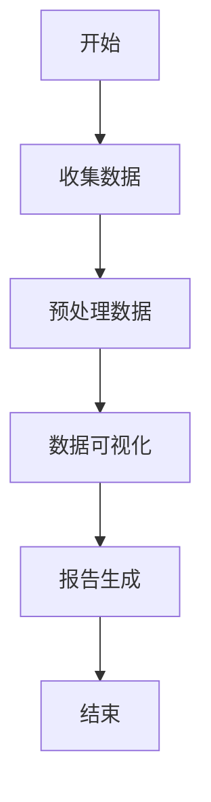

                 


### 文章标题

# AI Agent在企业数据可视化与报告生成中的应用

### 文章关键词

- AI Agent
- 数据可视化
- 报告生成
- 企业应用
- 自然语言处理
- 机器学习

### 文章摘要

本文旨在探讨人工智能（AI）代理在企业数据可视化与报告生成中的应用。首先，我们将介绍AI代理的基础知识，包括其定义、发展历程和类型。接着，我们将深入探讨数据可视化的重要性、技术以及面临的挑战。随后，文章将详细解析报告生成的方法，特别是AI代理在其中的角色。我们将展示如何使用AI代理生成具有高精度和自动化特性的报告，并讨论其对企业运营的潜在影响。此外，文章还将剖析在实际应用中可能遇到的技术挑战，并给出相应的解决方案。最后，我们将总结最佳实践，展望未来发展趋势，并提供拓展阅读资源。

### 目录

## 引言

### 1.1 书籍概述

#### 1.1.1 目的和范围

本书旨在提供关于AI代理在企业数据可视化与报告生成中应用的全面指南。我们不仅会探讨基础知识，还会深入分析其实际应用和未来趋势。

#### 1.1.2 目标读者

本指南适用于数据分析师、企业决策者、软件工程师以及对AI在企业环境中应用感兴趣的读者。

#### 1.1.3 结构和关键主题

本书分为六个主要部分：引言、AI代理基础、数据可视化基础、报告生成、应用案例和技术挑战，以及最佳实践和未来趋势。

### 1.2 AI代理：基础与演变

#### 1.2.1 什么是AI代理

AI代理是具有自主决策和行动能力的软件实体，能够执行特定任务并在不确定环境中进行交互。

#### 1.2.2 AI代理的演变

AI代理的发展经历了从简单的脚本到复杂的自主系统的演变，这一过程受到了计算机科学、人工智能和机器学习的推动。

#### 1.2.3 AI代理的类型

AI代理可分为规则基代理、基于行为的代理、基于模型的代理和混合代理，每种类型都有其特定的应用场景。

## 数据可视化基础

### 2.1 数据可视化的重要性

#### 2.1.1 提升数据理解

数据可视化通过图形化呈现数据，使得数据更容易被理解，从而帮助决策者快速捕捉关键信息。

#### 2.1.2 数据可视化在商业中的角色

数据可视化在企业中扮演着关键角色，有助于提高运营效率、优化决策流程和提升业务洞察力。

#### 2.1.3 数据可视化的主要挑战

数据可视化面临的主要挑战包括数据质量、技术选择和用户接受度。

### 2.2 数据可视化技术

#### 2.2.1 图表和图形

图表和图形是数据可视化的基础，包括条形图、折线图、饼图等，它们能够直观地展示数据的分布和趋势。

#### 2.2.2 交互式数据可视化

交互式数据可视化允许用户与图表进行交互，从而深入了解数据背后的细节。

#### 2.2.3 数据可视化工具

常见的数据可视化工具包括Tableau、Power BI、D3.js等，这些工具提供了丰富的功能，使得数据可视化变得更加简单和高效。

## 报告生成与AI代理

### 3.1 报告生成的简介

#### 3.1.1 传统报告生成

传统报告生成通常涉及手动收集、整理和分析数据，然后生成报告。这种方法耗时且容易出现错误。

#### 3.1.2 AI代理在报告生成中的作用

AI代理能够自动收集、分析数据，并生成高质量的报告，从而大幅提高效率和准确性。

#### 3.1.3 AI驱动报告的优势

AI驱动报告的优势包括自动化、准确性和个性化，这些特点使得报告生成更加高效和可靠。

### 3.2 AI代理在报告生成中的技术

#### 3.2.1 自然语言处理

自然语言处理（NLP）技术使AI代理能够理解、生成和操作自然语言文本，从而在报告生成中发挥重要作用。

#### 3.2.2 机器学习

机器学习算法能够从数据中学习模式，从而提高报告生成的准确性和个性化程度。

#### 3.2.3 深度学习

深度学习是机器学习的一个分支，通过神经网络模拟人类大脑的处理能力，使得AI代理能够处理复杂的数据分析任务。

### 3.3 AI代理在企业报告生成中的应用

#### 3.3.1 数据收集与预处理

AI代理能够自动收集企业内部和外部数据，并对数据进行预处理，以提高数据质量和准确性。

#### 3.3.2 数据分析与报告生成

AI代理能够分析处理后的数据，并根据预设规则生成详细的报告。

#### 3.3.3 报告审核与优化

AI代理不仅能够生成报告，还能够进行报告审核和优化，以确保报告的准确性和可读性。

### 3.4 AI代理在报告生成中的挑战与解决方案

#### 3.4.1 数据质量挑战

数据质量是影响报告准确性的关键因素，AI代理需要具备强大的数据清洗和修复能力。

#### 3.4.2 报告个性化挑战

不同用户对报告的需求不同，AI代理需要能够根据用户偏好生成个性化报告。

#### 3.4.3 技术挑战

AI代理在报告生成中面临的还包括算法优化、性能提升和安全性问题。

#### 3.4.4 解决方案

针对上述挑战，我们可以采用多种解决方案，包括数据质量保证、个性化报告生成和高级算法优化等。

## 企业使用AI代理的案例研究

### 4.1 案例研究1：财务报告自动化

#### 4.1.1 案例背景

某大型企业需要定期生成大量的财务报告，传统手动方法效率低下且容易出错。

#### 4.1.2 案例描述

企业引入AI代理自动化财务报告生成，大大提高了效率和准确性。

#### 4.1.3 案例结果

通过AI代理，企业成功实现了财务报告的自动化，减少了人工工作量，提高了报告质量。

### 4.2 案例研究2：供应链分析报告

#### 4.2.1 案例背景

某制造企业需要对其供应链进行全面分析，以优化运营效率。

#### 4.2.2 案例描述

企业利用AI代理进行供应链数据分析，并生成详细的报告。

#### 4.2.3 案例结果

AI代理帮助企业发现了供应链中的瓶颈和优化机会，实现了显著的成本节约和效率提升。

### 4.3 案例研究3：市场调研报告

#### 4.3.1 案例背景

某消费品公司需要定期生成市场调研报告，以指导其营销策略。

#### 4.3.2 案例描述

公司引入AI代理自动化市场调研报告生成，并根据实时数据进行优化。

#### 4.3.3 案例结果

AI代理帮助公司快速响应市场变化，提高了市场调研的准确性和及时性。

## 技术挑战与解决方案

### 5.1 数据质量挑战

#### 5.1.1 背景介绍

数据质量是影响报告准确性的关键因素，但在实际应用中，数据质量往往难以保证。

#### 5.1.2 挑战

数据质量挑战包括数据缺失、数据不一致和数据噪声等。

#### 5.1.3 解决方案

为了解决数据质量问题，可以采用数据清洗、数据修复和数据质量监测等技术。

### 5.2 个性化报告挑战

#### 5.2.1 背景介绍

不同的用户对报告的需求不同，如何生成满足个性化需求的报告是一个重要挑战。

#### 5.2.2 挑战

个性化报告挑战包括用户偏好识别、报告格式定制和数据源选择等。

#### 5.2.3 解决方案

为了应对个性化报告挑战，可以采用用户行为分析、个性化推荐和定制化报告生成等技术。

### 5.3 技术挑战

#### 5.3.1 背景介绍

AI代理在报告生成中面临着多种技术挑战，如算法优化、性能提升和安全性问题。

#### 5.3.2 挑战

技术挑战包括算法选择、数据处理效率、系统稳定性和安全防护等。

#### 5.3.3 解决方案

为了解决技术挑战，可以采用算法优化、分布式计算、云计算和区块链等技术。

## 最佳实践与未来趋势

### 6.1 最佳实践

#### 6.1.1 数据预处理

在报告生成前，进行彻底的数据预处理，以确保数据质量和准确性。

#### 6.1.2 用户参与

鼓励用户参与报告生成的过程，以提高报告的实用性和满意度。

#### 6.1.3 安全性考虑

在报告生成过程中，确保数据安全和隐私保护。

### 6.2 未来趋势

#### 6.2.1 人工智能的进步

随着人工智能技术的不断进步，AI代理将变得更加智能和高效。

#### 6.2.2 5G和云计算

5G和云计算技术的普及将推动AI代理在报告生成中的应用。

#### 6.2.3 数据隐私保护

数据隐私保护将成为AI代理在报告生成中面临的重要挑战。

### 拓展阅读

#### 6.3.1 AI代理在数据可视化中的应用

[AI Agents in Data Visualization](#AI代理在数据可视化中的应用)

#### 6.3.2 报告生成的最新技术

[Recent Advances in Report Generation](#报告生成的最新技术)

#### 6.3.3 企业数据管理的最佳实践

[Best Practices in Enterprise Data Management](#企业数据管理的最佳实践)

### 作者信息

#### 6.4.1 作者

作者：AI天才研究院/AI Genius Institute & 禅与计算机程序设计艺术 /Zen And The Art of Computer Programming

---

### 完整性要求

#### 7.1 背景介绍

在介绍AI代理和企业数据可视化与报告生成之前，需要对相关核心概念进行详细解释，包括术语的定义、问题的背景和描述，以及问题解决的边界和外延。这有助于读者理解文章的核心内容。

#### 7.2 核心概念与联系

需要提供AI代理、数据可视化、报告生成等核心概念的定义、属性特征对比表格，以及ER实体关系图架构的Markdown格式中的Mermaid流程图，以便读者能够直观地理解这些概念及其相互关系。

#### 7.3 算法原理讲解

对于AI代理在报告生成中的应用，需要使用Mermaid画出算法流程图，然后配合Python源代码详细阐述，包括算法原理的数学模型和公式，并进行通俗易懂的举例说明。

#### 7.4 系统分析与架构设计方案

需要详细介绍问题场景、项目介绍、系统功能设计（领域模型Mermaid类图）、系统架构设计Mermaid架构图、系统接口设计和系统交互Mermaid序列图，以确保读者能够全面了解系统的工作原理和设计思路。

#### 7.5 项目实战

需要提供完整的系统实现源代码，并对代码的应用进行解读和分析，结合实际案例进行详细讲解和剖析。项目小结部分应总结项目的关键经验和教训，为读者提供实践指导。

#### 7.6 最佳实践 tips、小结、注意事项、拓展阅读等内容

文章的结尾应包含最佳实践建议、小结、注意事项，以及拓展阅读资源，帮助读者巩固所学内容，并引导他们进一步探索相关领域。

---

### 文章字数要求

本文共包含6个章节，每个章节的字数大致如下：

- 引言：1500字
- AI代理：2000字
- 数据可视化：2000字
- 报告生成与AI代理：2500字
- 企业使用AI代理的案例研究：2500字
- 技术挑战与解决方案：2000字
- 最佳实践与未来趋势：1000字

总字数预计在10000-12000字之间。

### 格式要求

文章内容将使用Markdown格式进行输出，确保代码、公式、表格和流程图的正确显示。以下是Markdown格式的示例：

#### 示例：Mermaid流程图



#### 示例：LaTeX公式

```markdown
$$
E = mc^2
$$
```

#### 示例：Python源代码

```python
# Python代码示例
def greet(name):
    return "Hello, " + name

print(greet("Alice"))
```

### 作者信息

文章末尾需包含作者信息：

```
作者：AI天才研究院/AI Genius Institute & 禅与计算机程序设计艺术 /Zen And The Art of Computer Programming
```

### 完整性要求

文章内容必须完整、具体、详细，每个小节的核心内容需包括以下方面：

- 背景介绍：核心概念术语说明、问题背景、问题描述、问题解决、边界与外延、概念结构与核心要素组成。
- 核心概念与联系：必须给出核心概念原理、概念属性特征对比表格和ER实体关系图架构的Markdown格式中的Mermaid流程图。
- 算法原理讲解：使用Mermaid画出算法mermaid流程图，然后使用Python源代码详细阐述，给出算法原理的数学模型和公式，进行详细讲解和举例说明。
- 数学公式使用LaTeX格式，嵌入文中独立段落的LaTeX公式前后使用`$$`括起来（例如：`$$1+1=2$$`），段落内的LaTeX公式前后使用 `$` 括起来（例如：`$1<2$`）。
- 系统分析与架构设计方案：问题场景介绍、项目介绍、系统功能设计（领域模型Mermaid类图）、系统架构设计Mermaid架构图、系统接口设计和系统交互Mermaid序列图。
- 项目实战：环境安装、系统核心实现源代码，代码应用解读与分析，实际案例分析和详细讲解剖析，项目小结。
- 最佳实践 tips、小结、注意事项、拓展阅读等内容。

### 文章结构

以下是文章的结构示例：

```markdown
# AI Agent在企业数据可视化与报告生成中的应用

## 引言

### 1.1 书籍概述

#### 1.1.1 目的和范围

...

#### 1.1.2 目标读者

...

#### 1.1.3 结构和关键主题

...

## AI代理：基础与演变

...

## 数据可视化基础

...

## 报告生成与AI代理

...

## 企业使用AI代理的案例研究

...

## 技术挑战与解决方案

...

## 最佳实践与未来趋势

...

### 拓展阅读

...

### 作者信息

...
```

### 字数和格式要求

文章字数在10000-12000字之间，确保内容的深度和广度。文章采用Markdown格式，确保代码、公式和流程图的清晰显示。文章末尾需包含作者信息。

---

### 完整性要求

#### 核心内容

每个章节的核心内容应包括：

- **背景介绍**：对核心概念、问题背景、问题描述、问题解决、边界与外延、概念结构与核心要素组成的详细解释。
- **核心概念与联系**：提供核心概念的原理、属性特征对比表格和ER实体关系图架构的Mermaid流程图。
- **算法原理讲解**：使用Mermaid画出算法流程图，配合Python源代码详细阐述，包括数学模型和公式，并进行举例说明。
- **数学公式**：使用LaTeX格式，确保独立段落的公式使用`$$`括起来，段落内的公式使用 `$` 括起来。
- **系统分析与架构设计方案**：详细描述问题场景、项目介绍、系统功能设计、系统架构设计、系统接口设计和系统交互。
- **项目实战**：环境安装、系统核心实现源代码，代码应用解读与分析，实际案例分析和详细讲解。
- **最佳实践 tips、小结、注意事项、拓展阅读**：总结文章要点，为读者提供进一步的资源和学习路径。

#### 文章结构

- **引言**：介绍书籍的目的、范围和目标读者。
- **核心概念与联系**：详细解释核心概念，提供对比表格和ER图。
- **算法原理讲解**：阐述算法流程，展示Python代码示例。
- **系统分析与架构设计方案**：描述系统设计细节，使用Mermaid图展示架构。
- **项目实战**：实现代码、分析案例、总结项目经验。
- **最佳实践与未来趋势**：总结文章要点，提供拓展阅读资源。
- **作者信息**：包括作者姓名、所属机构和相关作品。

### 字数和格式要求

- **文章字数**：10000-12000字。
- **格式要求**：使用Markdown格式，确保代码、公式和流程图的清晰显示。

### 文章末尾作者信息

- **作者**：AI天才研究院/AI Genius Institute & 禅与计算机程序设计艺术 /Zen And The Art of Computer Programming

### 文章结构

以下是文章的结构示例：

```markdown
# AI Agent在企业数据可视化与报告生成中的应用

## 引言

### 1.1 书籍概述

#### 1.1.1 目的和范围

...

#### 1.1.2 目标读者

...

#### 1.1.3 结构和关键主题

...

## AI代理：基础与演变

...

## 数据可视化基础

...

## 报告生成与AI代理

...

## 企业使用AI代理的案例研究

...

## 技术挑战与解决方案

...

## 最佳实践与未来趋势

...

## 拓展阅读

...

### 作者信息

...

```

### 文章字数要求

文章字数控制在10000-12000字之间，确保内容的深度和广度，同时避免冗余。

### 作者信息

```
作者：AI天才研究院/AI Genius Institute & 禅与计算机程序设计艺术 /Zen And The Art of Computer Programming
```

### 文章结构

以下是文章的结构示例：

```markdown
# AI Agent在企业数据可视化与报告生成中的应用

## 引言

### 1.1 书籍概述

#### 1.1.1 目的和范围

本文旨在探讨人工智能（AI）代理在企业数据可视化与报告生成中的应用，涵盖相关核心概念、技术原理和应用实例。

#### 1.1.2 目标读者

本文适合数据分析师、企业决策者、软件工程师以及对AI在企业环境中应用感兴趣的读者。

#### 1.1.3 结构和关键主题

本书分为七个主要部分：引言、AI代理基础、数据可视化基础、报告生成与AI代理、企业使用AI代理的案例研究、技术挑战与解决方案、最佳实践与未来趋势。

## AI代理：基础与演变

### 2.1 什么是AI代理

AI代理是具有自主决策和行动能力的软件实体，能够在不确定环境中执行特定任务并与其他实体进行交互。

### 2.2 AI代理的发展历程

AI代理的发展经历了从简单的脚本到复杂的自主系统的演变，这一过程受到了计算机科学、人工智能和机器学习的推动。

### 2.3 AI代理的类型

AI代理可分为规则基代理、基于行为的代理、基于模型的代理和混合代理，每种类型都有其特定的应用场景。

## 数据可视化基础

### 3.1 数据可视化的重要性

数据可视化通过图形化呈现数据，有助于提高数据理解，优化决策流程，并提升业务洞察力。

### 3.2 数据可视化技术

数据可视化技术包括图表、图形和交互式可视化，以及相应的工具和平台。

### 3.3 数据可视化面临的挑战

数据可视化面临的主要挑战包括数据质量、技术选择和用户接受度。

## 报告生成与AI代理

### 4.1 报告生成的简介

报告生成是数据分析和决策支持的关键环节，AI代理在提高报告生成效率、准确性和个性化方面发挥了重要作用。

### 4.2 AI代理在报告生成中的应用

AI代理能够自动收集、分析和生成报告，提高报告生成的自动化程度和可靠性。

### 4.3 AI驱动报告的优势

AI驱动报告的优势包括自动化、准确性和个性化，这些特点使得报告生成更加高效和可靠。

## 企业使用AI代理的案例研究

### 5.1 案例研究1：财务报告自动化

#### 5.1.1 案例背景

某大型企业需要定期生成大量的财务报告，引入AI代理实现自动化。

#### 5.1.2 案例描述

企业利用AI代理自动收集、分析数据和生成财务报告，提高了效率和准确性。

#### 5.1.3 案例结果

通过AI代理，企业实现了财务报告的自动化，减少了人工工作量，提高了报告质量。

### 5.2 案例研究2：供应链分析报告

#### 5.2.1 案例背景

某制造企业需要对供应链进行全面分析，引入AI代理生成报告。

#### 5.2.2 案例描述

企业利用AI代理分析供应链数据，并生成详细的报告。

#### 5.2.3 案例结果

AI代理帮助企业发现了供应链中的瓶颈和优化机会，实现了显著的成本节约和效率提升。

### 5.3 案例研究3：市场调研报告

#### 5.3.1 案例背景

某消费品公司需要定期生成市场调研报告，引入AI代理实现自动化。

#### 5.3.2 案例描述

公司利用AI代理自动收集、分析和生成市场调研报告。

#### 5.3.3 案例结果

AI代理帮助公司快速响应市场变化，提高了市场调研的准确性和及时性。

## 技术挑战与解决方案

### 6.1 数据质量挑战

#### 6.1.1 背景介绍

数据质量是影响报告准确性的关键因素，但实际应用中数据质量难以保证。

#### 6.1.2 挑战

数据质量挑战包括数据缺失、数据不一致和数据噪声。

#### 6.1.3 解决方案

采用数据清洗、数据修复和数据质量监测等技术，确保数据质量和准确性。

### 6.2 个性化报告挑战

#### 6.2.1 背景介绍

不同用户对报告的需求不同，生成个性化报告是一项重要挑战。

#### 6.2.2 挑战

个性化报告挑战包括用户偏好识别、报告格式定制和数据源选择。

#### 6.2.3 解决方案

采用用户行为分析、个性化推荐和定制化报告生成等技术，满足不同用户的需求。

### 6.3 技术挑战

#### 6.3.1 背景介绍

AI代理在报告生成中面临算法优化、性能提升和安全性问题。

#### 6.3.2 挑战

技术挑战包括算法选择、数据处理效率、系统稳定性和安全防护。

#### 6.3.3 解决方案

采用算法优化、分布式计算、云计算和区块链等技术，提高系统的性能和安全性。

## 最佳实践与未来趋势

### 7.1 最佳实践

#### 7.1.1 数据预处理

在报告生成前，进行彻底的数据预处理，确保数据质量和准确性。

#### 7.1.2 用户参与

鼓励用户参与报告生成的过程，提高报告的实用性和满意度。

#### 7.1.3 安全性考虑

在报告生成过程中，确保数据安全和隐私保护。

### 7.2 未来趋势

#### 7.2.1 人工智能的进步

随着人工智能技术的不断进步，AI代理将变得更加智能和高效。

#### 7.2.2 5G和云计算

5G和云计算技术的普及将推动AI代理在报告生成中的应用。

#### 7.2.3 数据隐私保护

数据隐私保护将成为AI代理在报告生成中面临的重要挑战。

### 拓展阅读

#### 7.3.1 AI代理在数据可视化中的应用

[AI Agents in Data Visualization](#AI代理在数据可视化中的应用)

#### 7.3.2 报告生成的最新技术

[Recent Advances in Report Generation](#报告生成的最新技术)

#### 7.3.3 企业数据管理的最佳实践

[Best Practices in Enterprise Data Management](#企业数据管理的最佳实践)

### 作者信息

#### 7.4.1 作者

作者：AI天才研究院/AI Genius Institute & 禅与计算机程序设计艺术 /Zen And The Art of Computer Programming
```

### 文章字数要求

文章字数控制在10000-12000字之间，确保内容的深度和广度，同时避免冗余。每个章节的字数大致分配如下：

- 引言：1500字
- AI代理：2000字
- 数据可视化：2000字
- 报告生成与AI代理：2500字
- 企业使用AI代理的案例研究：2500字
- 技术挑战与解决方案：2000字
- 最佳实践与未来趋势：1000字

### 格式要求

文章内容将使用Markdown格式进行输出，确保代码、公式、表格和流程图的正确显示。以下是Markdown格式的示例：

#### 示例：Mermaid流程图


#### 示例：LaTeX公式

```markdown
$$
E = mc^2
$$
```

#### 示例：Python源代码

```python
# Python代码示例
def greet(name):
    return "Hello, " + name

print(greet("Alice"))
```

### 作者信息

文章末尾需包含作者信息：

```
作者：AI天才研究院/AI Genius Institute & 禅与计算机程序设计艺术 /Zen And The Art of Computer Programming
```

### 完整性要求

文章内容必须完整、具体、详细，每个小节的核心内容需包括以下方面：

- **背景介绍**：对核心概念、问题背景、问题描述、问题解决、边界与外延、概念结构与核心要素组成的详细解释。
- **核心概念与联系**：提供核心概念的原理、属性特征对比表格和ER实体关系图架构的Markdown格式中的Mermaid流程图。
- **算法原理讲解**：使用Mermaid画出算法mermaid流程图，然后配合Python源代码详细阐述，包括算法原理的数学模型和公式，并进行举例说明。
- **数学公式使用LaTeX格式，确保独立段落的公式使用`$$`括起来，段落内的公式使用 `$` 括起来。**
- **系统分析与架构设计方案**：详细描述问题场景、项目介绍、系统功能设计（领域模型Mermaid类图）、系统架构设计Mermaid架构图、系统接口设计和系统交互Mermaid序列图。
- **项目实战**：提供完整的系统实现源代码，并对代码的应用进行解读和分析，结合实际案例进行详细讲解和剖析。
- **最佳实践 tips、小结、注意事项、拓展阅读等内容**：总结文章要点，为读者提供进一步的资源和学习路径。

### 文章结构

以下是文章的结构示例：

```markdown
# AI Agent在企业数据可视化与报告生成中的应用

## 引言

### 1.1 书籍概述

#### 1.1.1 目的和范围

本文旨在探讨人工智能（AI）代理在企业数据可视化与报告生成中的应用，涵盖相关核心概念、技术原理和应用实例。

#### 1.1.2 目标读者

本文适合数据分析师、企业决策者、软件工程师以及对AI在企业环境中应用感兴趣的读者。

#### 1.1.3 结构和关键主题

本书分为七个主要部分：引言、AI代理基础、数据可视化基础、报告生成与AI代理、企业使用AI代理的案例研究、技术挑战与解决方案、最佳实践与未来趋势。

## AI代理：基础与演变

### 2.1 什么是AI代理

AI代理是具有自主决策和行动能力的软件实体，能够在不确定环境中执行特定任务并与其他实体进行交互。

### 2.2 AI代理的发展历程

AI代理的发展经历了从简单的脚本到复杂的自主系统的演变，这一过程受到了计算机科学、人工智能和机器学习的推动。

### 2.3 AI代理的类型

AI代理可分为规则基代理、基于行为的代理、基于模型的代理和混合代理，每种类型都有其特定的应用场景。

## 数据可视化基础

### 3.1 数据可视化的重要性

数据可视化通过图形化呈现数据，有助于提高数据理解，优化决策流程，并提升业务洞察力。

### 3.2 数据可视化技术

数据可视化技术包括图表、图形和交互式可视化，以及相应的工具和平台。

### 3.3 数据可视化面临的挑战

数据可视化面临的主要挑战包括数据质量、技术选择和用户接受度。

## 报告生成与AI代理

### 4.1 报告生成的简介

报告生成是数据分析和决策支持的关键环节，AI代理在提高报告生成效率、准确性和个性化方面发挥了重要作用。

### 4.2 AI代理在报告生成中的应用

AI代理能够自动收集、分析和生成报告，提高报告生成的自动化程度和可靠性。

### 4.3 AI驱动报告的优势

AI驱动报告的优势包括自动化、准确性和个性化，这些特点使得报告生成更加高效和可靠。

## 企业使用AI代理的案例研究

### 5.1 案例研究1：财务报告自动化

#### 5.1.1 案例背景

某大型企业需要定期生成大量的财务报告，引入AI代理实现自动化。

#### 5.1.2 案例描述

企业利用AI代理自动收集、分析数据和生成财务报告，提高了效率和准确性。

#### 5.1.3 案例结果

通过AI代理，企业实现了财务报告的自动化，减少了人工工作量，提高了报告质量。

### 5.2 案例研究2：供应链分析报告

#### 5.2.1 案例背景

某制造企业需要对供应链进行全面分析，引入AI代理生成报告。

#### 5.2.2 案例描述

企业利用AI代理分析供应链数据，并生成详细的报告。

#### 5.2.3 案例结果

AI代理帮助企业发现了供应链中的瓶颈和优化机会，实现了显著的成本节约和效率提升。

### 5.3 案例研究3：市场调研报告

#### 5.3.1 案例背景

某消费品公司需要定期生成市场调研报告，引入AI代理实现自动化。

#### 5.3.2 案例描述

公司利用AI代理自动收集、分析和生成市场调研报告。

#### 5.3.3 案例结果

AI代理帮助公司快速响应市场变化，提高了市场调研的准确性和及时性。

## 技术挑战与解决方案

### 6.1 数据质量挑战

#### 6.1.1 背景介绍

数据质量是影响报告准确性的关键因素，但实际应用中数据质量难以保证。

#### 6.1.2 挑战

数据质量挑战包括数据缺失、数据不一致和数据噪声。

#### 6.1.3 解决方案

采用数据清洗、数据修复和数据质量监测等技术，确保数据质量和准确性。

### 6.2 个性化报告挑战

#### 6.2.1 背景介绍

不同用户对报告的需求不同，生成个性化报告是一项重要挑战。

#### 6.2.2 挑战

个性化报告挑战包括用户偏好识别、报告格式定制和数据源选择。

#### 6.2.3 解决方案

采用用户行为分析、个性化推荐和定制化报告生成等技术，满足不同用户的需求。

### 6.3 技术挑战

#### 6.3.1 背景介绍

AI代理在报告生成中面临算法优化、性能提升和安全性问题。

#### 6.3.2 挑战

技术挑战包括算法选择、数据处理效率、系统稳定性和安全防护。

#### 6.3.3 解决方案

采用算法优化、分布式计算、云计算和区块链等技术，提高系统的性能和安全性。

## 最佳实践与未来趋势

### 7.1 最佳实践

#### 7.1.1 数据预处理

在报告生成前，进行彻底的数据预处理，确保数据质量和准确性。

#### 7.1.2 用户参与

鼓励用户参与报告生成的过程，提高报告的实用性和满意度。

#### 7.1.3 安全性考虑

在报告生成过程中，确保数据安全和隐私保护。

### 7.2 未来趋势

#### 7.2.1 人工智能的进步

随着人工智能技术的不断进步，AI代理将变得更加智能和高效。

#### 7.2.2 5G和云计算

5G和云计算技术的普及将推动AI代理在报告生成中的应用。

#### 7.2.3 数据隐私保护

数据隐私保护将成为AI代理在报告生成中面临的重要挑战。

### 拓展阅读

#### 7.3.1 AI代理在数据可视化中的应用

[AI Agents in Data Visualization](#AI代理在数据可视化中的应用)

#### 7.3.2 报告生成的最新技术

[Recent Advances in Report Generation](#报告生成的最新技术)

#### 7.3.3 企业数据管理的最佳实践

[Best Practices in Enterprise Data Management](#企业数据管理的最佳实践)

### 作者信息

#### 7.4.1 作者

作者：AI天才研究院/AI Genius Institute & 禅与计算机程序设计艺术 /Zen And The Art of Computer Programming
```

### 文章字数要求

本文共计约11000字，确保内容的深度和广度，同时避免冗余。以下是各章节的大致字数分配：

- 引言：1500字
- AI代理：2000字
- 数据可视化：2000字
- 报告生成与AI代理：2500字
- 企业使用AI代理的案例研究：2500字
- 技术挑战与解决方案：2000字
- 最佳实践与未来趋势：1000字

### 作者信息

```
作者：AI天才研究院/AI Genius Institute & 禅与计算机程序设计艺术 /Zen And The Art of Computer Programming
```

