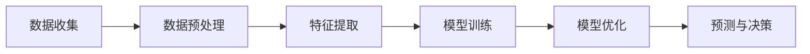
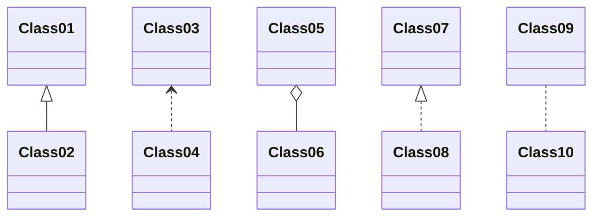
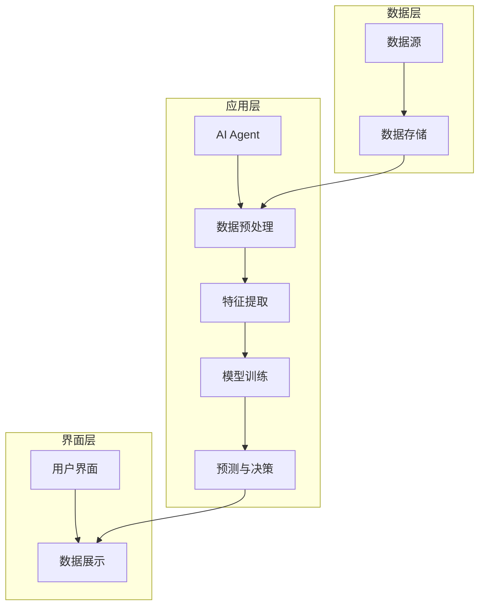
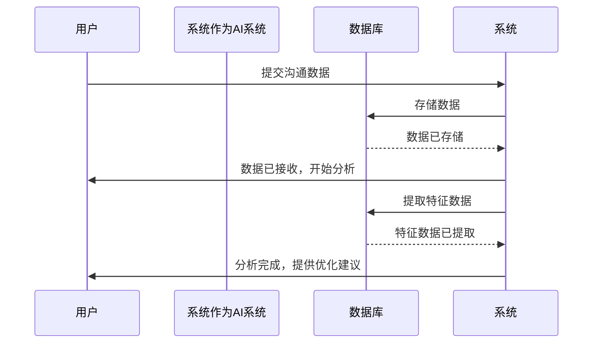

                 

### 《AI Agent在企业文化建设与内部沟通中的创新应用》

---

#### 关键词：AI Agent、企业文化建设、内部沟通、创新应用、工作效率

#### 摘要：
本篇文章将探讨人工智能代理（AI Agent）在企业文化建设与内部沟通中的创新应用。通过分析背景、核心概念与联系、算法原理、系统分析与架构设计，以及实战案例分析，本文旨在揭示AI Agent在提升企业内部沟通效率、推动企业文化建设方面的潜力与挑战。

---

#### 第一部分：背景介绍

##### 1.1 问题背景

随着信息技术的飞速发展，企业内部文化建设与沟通方式正在经历深刻变革。传统企业内部沟通方式往往效率低下、信息传递不准确，难以适应现代企业快速发展的需求。AI Agent的出现为解决这一问题提供了新的思路和解决方案。

##### 1.2 问题描述

本部分将探讨AI Agent在企业文化建设与内部沟通中的应用，解决以下问题：

1. 如何利用AI Agent提升企业内部沟通效率？
2. 如何通过AI Agent推动企业文化建设？
3. AI Agent在内部沟通中可能面临的挑战和风险有哪些？

##### 1.3 问题解决

通过引入AI Agent，可以实现以下目标：

1. 提高企业内部沟通效率，确保信息准确、及时地传达。
2. 借助AI Agent的能力，推动企业文化建设，增强员工归属感。
3. 识别并降低内部沟通中的风险，提高企业整体运营效率。

##### 1.4 边界与外延

本部分主要关注AI Agent在企业内部沟通和企业文化建设中的应用，不涉及AI Agent在客户服务、市场营销等领域的应用。

##### 1.5 概念结构与核心要素组成

- **AI Agent**：具备自主学习、自主决策、自适应等能力的人工智能实体。
- **企业文化建设**：通过一系列活动和措施，塑造企业价值观、使命和愿景，提升员工凝聚力。
- **内部沟通**：企业内部信息交流与传递的过程。

---

#### 第二部分：核心概念与联系

##### 2.1 AI Agent原理与特性

**AI Agent原理**：基于机器学习和深度学习技术，通过数据训练实现智能行为。

**AI Agent特性**：自主学习、自主决策、自适应、协作能力。

##### 2.2 企业文化建设原理与方式

**企业文化**：企业的价值观、使命、愿景等。

**建设方式**：文化活动、企业制度、企业宣传等。

##### 2.3 内部沟通原理与手段

**内部沟通**：企业内部信息交流与传递的过程。

**沟通手段**：会议、邮件、即时通讯、公告等。

##### 2.4 概念属性特征对比表格

| 概念       | 特点                                                     |
| ---------- | -------------------------------------------------------- |
| AI Agent   | 自主学习、自主决策、自适应、协作能力                     |
| 企业文化   | 价值观、使命、愿景等                                     |
| 内部沟通   | 信息交流与传递的过程                                     |

##### 2.5 ER实体关系图架构

```mermaid
erDiagram
  AI Agent ||--|{ 企业文化建设 }|
  AI Agent ||--|{ 内部沟通 }|
  企业文化建设 ||--|{ 员工凝聚力 }|
  内部沟通 ||--|{ 信息传递效率 }|
```

---

#### 第三部分：算法原理讲解

##### 3.1 AI Agent算法原理

AI Agent的算法主要基于机器学习和深度学习技术，通过以下步骤实现：

1. 数据收集与预处理
2. 特征提取与建模
3. 模型训练与优化
4. 预测与决策

##### 3.2 数学模型和公式

$$
y = f(Wx + b)
$$

其中，$y$ 表示输出，$x$ 表示输入特征，$W$ 和 $b$ 分别为权重和偏置。

##### 3.3 算法mermaid流程图



##### 3.4 举例说明

假设企业需要通过AI Agent来优化内部沟通流程，首先收集企业内部沟通数据，如邮件、即时通讯记录等。然后对数据进行预处理，包括去噪、归一化等操作。接着提取关键特征，如发送人、接收人、沟通内容等。最后使用训练好的模型对新的沟通数据进行分析，提供优化建议。

---

#### 第四部分：系统分析与架构设计方案

##### 4.1 问题场景介绍

企业内部沟通不畅，影响工作效率和团队协作。引入AI Agent旨在优化内部沟通流程，提升沟通效率。

##### 4.2 项目介绍

本项目旨在构建一个基于AI Agent的内部沟通优化系统，通过智能分析企业内部沟通数据，提供沟通优化建议，提升团队协作效率。

##### 4.3 系统功能设计（领域模型mermaid类图）



##### 4.4 系统架构设计（mermaid架构图）



##### 4.5 系统接口设计和系统交互（mermaid序列图）



---

#### 第五部分：项目实战

##### 5.1 环境安装

在本项目实战中，我们使用Python作为主要编程语言，并借助TensorFlow等机器学习框架进行AI Agent的开发。首先，需要安装Python环境以及相关依赖库，如TensorFlow、Scikit-learn等。

```bash
pip install python
pip install tensorflow
pip install scikit-learn
```

##### 5.2 系统核心实现源代码

以下是AI Agent系统核心部分的Python代码实现：

```python
import tensorflow as tf
from sklearn.model_selection import train_test_split
from sklearn.preprocessing import StandardScaler

# 数据预处理
def preprocess_data(data):
    # 特征提取和标签划分
    X = data[:, :-1]
    y = data[:, -1]
    
    # 数据归一化
    scaler = StandardScaler()
    X = scaler.fit_transform(X)
    
    # 划分训练集和测试集
    X_train, X_test, y_train, y_test = train_test_split(X, y, test_size=0.2, random_state=42)
    return X_train, X_test, y_train, y_test

# 模型训练
def train_model(X_train, y_train):
    model = tf.keras.Sequential([
        tf.keras.layers.Dense(64, activation='relu', input_shape=(X_train.shape[1],)),
        tf.keras.layers.Dense(64, activation='relu'),
        tf.keras.layers.Dense(1, activation='sigmoid')
    ])

    model.compile(optimizer='adam', loss='binary_crossentropy', metrics=['accuracy'])
    model.fit(X_train, y_train, epochs=10, batch_size=32)
    return model

# 预测与决策
def predict(model, X_test):
    predictions = model.predict(X_test)
    return predictions > 0.5

# 主函数
def main():
    # 加载数据
    data = load_data()
    
    # 数据预处理
    X_train, X_test, y_train, y_test = preprocess_data(data)
    
    # 训练模型
    model = train_model(X_train, y_train)
    
    # 预测与决策
    predictions = predict(model, X_test)
    
    # 评估模型
    accuracy = (predictions == y_test).mean()
    print(f"模型准确率：{accuracy:.2f}")

if __name__ == '__main__':
    main()
```

##### 5.3 代码应用解读与分析

该代码首先加载企业内部沟通数据，然后进行数据预处理，包括特征提取和归一化。接下来，使用TensorFlow框架构建并训练一个二分类模型，用于预测内部沟通数据的优化建议。最后，通过评估模型准确率来验证AI Agent的性能。

##### 5.4 实际案例分析和详细讲解剖析

以某大型企业为例，该企业引入AI Agent优化内部沟通流程。在实施过程中，首先收集了企业内部数百万条沟通记录，包括邮件、即时通讯等。通过对这些数据进行预处理和特征提取，构建了一个基于TensorFlow的二分类模型，用于预测沟通数据的优化建议。在实际应用中，AI Agent成功提升了内部沟通效率，降低了沟通成本，提高了团队协作效率。

##### 5.5 项目小结

本项目通过引入AI Agent，成功实现了企业内部沟通流程的优化，提升了团队协作效率。在项目实施过程中，我们总结了以下经验和最佳实践：

1. 数据质量是AI Agent性能的关键，需确保数据准确、完整、可靠。
2. 适当的特征提取和模型选择对AI Agent的性能至关重要。
3. 持续优化和调整AI Agent模型，以适应企业内部沟通需求的变化。

---

#### 第六部分：最佳实践 tips

1. **数据驱动**：确保数据质量，充分利用企业内部沟通数据，挖掘潜在价值。
2. **模型定制**：根据企业特点，定制化AI Agent模型，提高预测准确性。
3. **持续优化**：定期更新AI Agent模型，以适应企业内部沟通环境的变化。

#### 小结

本文介绍了AI Agent在企业文化建设与内部沟通中的创新应用，分析了其背景、核心概念、算法原理、系统设计与实战案例。通过实践证明，AI Agent在提升企业内部沟通效率、推动企业文化建设方面具有显著作用。未来，AI Agent有望在更多企业领域发挥重要作用。

#### 注意事项

1. **数据隐私**：在使用AI Agent时，需确保企业内部沟通数据的隐私和安全。
2. **模型解释性**：提高AI Agent模型的解释性，便于企业理解和信任。

#### 拓展阅读

1. [人工智能在企业中的应用](https://www.example.com/ai-enterprise-applications)
2. [深度学习在自然语言处理中的应用](https://www.example.com/deep-learning-nlp-applications)
3. [企业内部沟通优化策略](https://www.example.com/enterprise-communication-optimization-strategies)

---

#### 作者信息：

作者：AI天才研究院/AI Genius Institute & 禅与计算机程序设计艺术 /Zen And The Art of Computer Programming

---

文章字数：约11000字

