                 

# AI Agent在企业智能办公中的全面应用

## 关键词
AI Agent、企业智能办公、电子邮件管理、客户服务、人力资源管理、财务管理、技术实现、案例分析、最佳实践

## 摘要
本文将深入探讨AI Agent在企业智能办公中的全面应用。首先，我们介绍了AI Agent的定义、核心功能和应用场景。随后，我们详细分析了AI Agent在电子邮件管理、客户服务、人力资源管理和财务管理等领域的具体应用。通过实际案例和技术实现，我们展示了AI Agent在企业智能办公中的价值。最后，我们提出了最佳实践和未来展望，为企业智能化转型提供了有益的参考。

## 目录大纲设计思路与结构

在本文中，我们将遵循以下步骤和原则来设计目录大纲：

### 1. 确定章节主题

根据书名和预期内容，我们确定了以下章节主题：

- 企业智能办公的现状与挑战
- AI Agent的基础理论与核心概念
- AI Agent在企业智能办公中的应用
- AI Agent的技术实现与实战案例
- 最佳实践与未来展望

### 2. 构建章节框架

每个章节都包括以下部分：

- 引言/概述
- 核心概念与原理
- 应用案例与实例
- 技术实现与代码讲解
- 最佳实践与小结
- 拓展阅读

### 3. 确保逻辑连贯性

章节之间保持逻辑连贯，确保内容无缝衔接。

### 4. 细化到级目录

使用markdown格式构建目录结构，确保每个章节都包含至少二级子目录。

### 5. 保持简洁性

在确保内容完整性的同时，避免冗余和多余的解释。

### 6. 符合字数限制

整个目录大纲的总字数控制在2000字以内。

### 目录大纲

根据上述设计思路，以下是本文的目录大纲：

## 第一部分：背景与概述

### 第1章：企业智能办公的现状与挑战

#### 1.1 企业智能办公的概念与重要性

#### 1.2 当前企业智能办公的应用场景

#### 1.3 AI Agent在智能办公中的角色与功能

### 第2章：AI Agent的基础理论与核心概念

#### 2.1 AI Agent的定义与类型

#### 2.2 AI Agent的核心功能模块

#### 2.3 AI Agent的架构设计与实现原理

## 第二部分：AI Agent在企业智能办公中的应用

### 第3章：AI Agent在电子邮件管理中的应用

#### 3.1 AI Agent在电子邮件过滤与分类中的应用

#### 3.2 AI Agent在日程安排与提醒中的应用

#### 3.3 AI Agent在邮件回复与撰写辅助中的应用

### 第4章：AI Agent在客户服务与支持中的应用

#### 4.1 AI Agent在客户查询与咨询中的应用

#### 4.2 AI Agent在客户投诉处理与跟进中的应用

#### 4.3 AI Agent在个性化客户服务中的应用

### 第5章：AI Agent在人力资源管理中的应用

#### 5.1 AI Agent在招聘与筛选中的应用

#### 5.2 AI Agent在员工培训与发展中的应用

#### 5.3 AI Agent在员工绩效评估与管理中的应用

### 第6章：AI Agent在财务管理中的应用

#### 6.1 AI Agent在财务报表与分析中的应用

#### 6.2 AI Agent在预算编制与监控中的应用

#### 6.3 AI Agent在税务申报与合规管理中的应用

## 第三部分：技术实现与实战案例

### 第7章：AI Agent的技术实现与架构设计

#### 7.1 AI Agent技术栈与开发环境

#### 7.2 AI Agent的核心算法与模型

#### 7.3 AI Agent的架构设计与实现步骤

### 第8章：AI Agent项目实战

#### 8.1 项目背景与需求分析

#### 8.2 系统设计与实现

#### 8.3 实际案例分析与讲解

#### 8.4 项目总结与反思

### 第9章：最佳实践与未来展望

#### 9.1 AI Agent在智能办公中的最佳实践

#### 9.2 AI Agent未来发展的趋势与挑战

#### 9.3 拓展阅读与资源推荐

## 总结与展望

本文从背景介绍、核心概念、应用案例、技术实现和最佳实践等方面，全面探讨了AI Agent在企业智能办公中的全面应用。通过本文的阅读，读者可以深入了解AI Agent在企业办公中的巨大潜力，并为企业的智能化转型提供有力支持。

## 作者信息

作者：AI天才研究院/AI Genius Institute & 禅与计算机程序设计艺术 /Zen And The Art of Computer Programming

----------------------------------------------------------------

### 第一部分：背景与概述

#### 第1章：企业智能办公的现状与挑战

随着人工智能技术的飞速发展，企业办公逐渐向智能化、自动化方向转型。企业智能办公不仅仅是简单的自动化流程，更是通过AI技术提升工作效率、优化业务流程、提高决策质量的重要手段。

#### 1.1 企业智能办公的概念与重要性

企业智能办公是指利用人工智能技术，实现办公流程的自动化、智能化和高效化。它涵盖了电子邮件管理、客户服务、人力资源管理、财务管理等多个方面。智能办公的重要性体现在以下几个方面：

1. **提高工作效率**：通过自动化流程，减少人力投入，提高工作效率。
2. **优化业务流程**：通过分析大数据，为企业提供决策支持，优化业务流程。
3. **提升决策质量**：利用AI技术进行数据分析和预测，提高决策的科学性和准确性。

#### 1.2 当前企业智能办公的应用场景

当前企业智能办公的应用场景主要包括：

1. **电子邮件管理**：通过AI Agent自动处理电子邮件，实现邮件过滤、分类、回复和撰写等任务。
2. **客户服务与支持**：通过AI Agent提供24/7的客户查询与咨询、投诉处理和个性化服务。
3. **人力资源管理**：通过AI Agent实现招聘与筛选、员工培训与发展、员工绩效评估与管理等。
4. **财务管理**：通过AI Agent进行财务报表与分析、预算编制与监控、税务申报与合规管理等。

#### 1.3 AI Agent在智能办公中的角色与功能

AI Agent是企业智能办公的核心组成部分，它具有以下角色与功能：

1. **任务自动化**：自动执行重复性、规则性强的任务，如邮件处理、日程安排等。
2. **智能决策支持**：利用大数据分析和机器学习技术，为企业的业务决策提供支持。
3. **个性化和定制化**：根据用户需求和企业特点，提供个性化的服务和解决方案。
4. **协同办公**：与其他系统和服务集成，实现无缝协同办公。

#### 1.4 AI Agent在企业智能办公中的应用

AI Agent在企业智能办公中的应用场景非常广泛，下面我们分别介绍：

1. **电子邮件管理**：AI Agent可以自动处理大量邮件，包括邮件过滤、分类、回复和撰写等。
2. **客户服务与支持**：AI Agent可以提供24/7的客户服务，包括查询与咨询、投诉处理和个性化服务。
3. **人力资源管理**：AI Agent可以协助企业进行招聘与筛选、员工培训与发展、员工绩效评估与管理等。
4. **财务管理**：AI Agent可以协助企业进行财务报表与分析、预算编制与监控、税务申报与合规管理等。

#### 1.5 AI Agent的核心功能模块

AI Agent的核心功能模块包括：

1. **自然语言处理（NLP）**：用于理解和生成自然语言文本，实现邮件处理、客户服务等功能。
2. **机器学习（ML）**：用于数据分析和预测，为企业的业务决策提供支持。
3. **知识图谱**：用于构建企业知识库，实现个性化服务和协同办公。

#### 1.6 AI Agent的架构设计与实现原理

AI Agent的架构设计通常包括以下几个层次：

1. **感知层**：负责接收外部输入，如邮件、语音、文本等。
2. **理解层**：负责对输入信息进行解析和理解，如文本分类、情感分析等。
3. **决策层**：负责根据理解层的结果，做出相应的决策和响应。
4. **执行层**：负责执行决策层的决策，如发送邮件、更新日程等。

#### 1.7 AI Agent的优势与挑战

AI Agent在企业智能办公中具有以下优势：

1. **提高工作效率**：自动处理重复性任务，减少人力投入。
2. **优化业务流程**：通过数据分析，优化业务流程，提高企业竞争力。
3. **提升决策质量**：利用大数据和机器学习技术，提高决策的科学性和准确性。

同时，AI Agent也面临以下挑战：

1. **数据隐私与安全**：确保用户数据的安全和隐私。
2. **技术成熟度**：当前AI技术仍处于快速发展阶段，技术成熟度可能不足。
3. **人机协作**：如何实现人与AI Agent的协同工作，提高整体效率。

#### 1.8 本章小结

本章介绍了企业智能办公的概念与重要性，以及AI Agent在智能办公中的应用场景、核心功能模块和架构设计与实现原理。通过本章的学习，读者可以初步了解AI Agent在企业智能办公中的价值和应用。

----------------------------------------------------------------

### 第二部分：AI Agent的基础理论与核心概念

#### 第2章：AI Agent的基础理论与核心概念

在深入探讨AI Agent在企业智能办公中的应用之前，我们需要首先了解AI Agent的基础理论与核心概念。本章节将详细介绍AI Agent的定义、类型、核心功能模块以及架构设计与实现原理。

#### 2.1 AI Agent的定义与类型

AI Agent，即人工智能代理，是指能够模拟人类智能行为，具备感知、理解、决策和行动能力的计算机程序。AI Agent可以独立执行任务，与用户或其他系统进行交互，并在一定范围内自主学习和优化行为。

根据功能和应用场景的不同，AI Agent可以分为以下几种类型：

1. **任务型AI Agent**：专注于执行特定任务的AI Agent，如电子邮件管理、日程安排等。
2. **交互型AI Agent**：以对话为基础，与用户进行自然语言交互，如智能客服、语音助手等。
3. **决策型AI Agent**：具备决策能力，根据数据分析和预测结果，为用户提供决策建议，如智能投资顾问、供应链优化等。

#### 2.2 AI Agent的核心功能模块

AI Agent的核心功能模块包括：

1. **感知模块**：接收外部输入，如文本、语音、图像等，并将其转换为计算机可处理的格式。
2. **理解模块**：对感知模块接收到的信息进行分析和理解，如自然语言处理、图像识别等。
3. **决策模块**：根据理解模块的结果，结合历史数据和规则，生成决策。
4. **行动模块**：执行决策模块生成的决策，如发送邮件、更新日程等。

#### 2.3 AI Agent的架构设计与实现原理

AI Agent的架构设计通常包括以下几个层次：

1. **感知层**：负责接收外部输入，如邮件、语音、文本等。
2. **理解层**：负责对输入信息进行解析和理解，如文本分类、情感分析等。
3. **决策层**：负责根据理解层的结果，结合历史数据和规则，生成决策。
4. **执行层**：负责执行决策层生成的决策，如发送邮件、更新日程等。

以下是AI Agent的架构设计流程：

1. **数据采集**：从外部数据源（如邮件服务器、社交媒体等）收集数据。
2. **数据预处理**：对采集到的数据进行清洗、转换和归一化，以便后续处理。
3. **特征提取**：从预处理后的数据中提取有助于理解的特征，如词向量、图像特征等。
4. **模型训练**：使用提取的特征，训练机器学习模型，如自然语言处理模型、图像识别模型等。
5. **模型评估**：评估模型在验证集上的性能，调整模型参数，优化模型。
6. **模型部署**：将训练好的模型部署到生产环境中，进行实时推理和决策。

#### 2.4 AI Agent的核心算法与模型

AI Agent的核心算法和模型主要包括：

1. **自然语言处理（NLP）**：用于理解和生成自然语言文本，如词嵌入、序列模型（RNN、LSTM）、Transformer等。
2. **机器学习（ML）**：用于数据分析和预测，如线性回归、决策树、支持向量机等。
3. **深度学习（DL）**：用于复杂的数据分析和模式识别，如卷积神经网络（CNN）、循环神经网络（RNN）、生成对抗网络（GAN）等。

#### 2.5 AI Agent的核心属性特征对比表格

以下是一个AI Agent核心属性特征的对比表格：

| 特征         | 任务型AI Agent | 交互型AI Agent | 决策型AI Agent |
| ------------ | -------------- | -------------- | -------------- |
| 感知能力     | 较强           | 强             | 强             |
| 理解能力     | 较强           | 强             | 强             |
| 决策能力     | 较强           | 弱             | 强             |
| 行动能力     | 强             | 强             | 较强           |
| 自主学习能力 | 弱             | 强             | 较强           |

#### 2.6 AI Agent的ER实体关系图架构

以下是AI Agent的ER实体关系图架构：

```mermaid
erDiagram
  User ||--|{ AI_Agent }|-- Mailbox
  User ||--|{ AI_Agent }|-- Calendar
  User ||--|{ AI_Agent }|-- Task_Manager
  User ||--|{ AI_Agent }|-- Customer_Service
  User ||--|{ AI_Agent }|-- Finance_Manager
  AI_Agent ||--|{ Knowledge_Base }|-- Data_Analytics
  AI_Agent ||--|{ Natural_Language_Processing }|-- Text_Generation
  AI_Agent ||--|{ Machine_Learning }|-- Prediction_Model
  AI_Agent ||--|{ Deep_Learning }|-- Image_Recognition
```

#### 2.7 本章小结

本章详细介绍了AI Agent的定义、类型、核心功能模块、架构设计与实现原理，以及核心算法与模型。通过本章的学习，读者可以深入了解AI Agent的基本概念和原理，为后续章节的应用案例和技术实现打下基础。

----------------------------------------------------------------

### 第三部分：AI Agent在企业智能办公中的应用

#### 第3章：AI Agent在电子邮件管理中的应用

电子邮件是企业日常办公中不可或缺的一部分，如何高效地管理和处理大量邮件成为了企业面临的重要挑战。在这一章节中，我们将探讨AI Agent在电子邮件管理中的应用，包括邮件过滤与分类、日程安排与提醒以及邮件回复与撰写辅助等方面。

#### 3.1 AI Agent在电子邮件过滤与分类中的应用

电子邮件过滤是AI Agent在邮件管理中最基本的功能之一。通过使用机器学习和自然语言处理技术，AI Agent能够自动识别垃圾邮件、广告邮件和重要邮件，从而有效减少用户的阅读负担。

**核心原理：**

- **垃圾邮件检测**：利用贝叶斯分类器、支持向量机（SVM）等机器学习算法，对邮件内容进行分类。
- **情感分析**：通过情感分析技术，判断邮件内容的情感倾向，从而识别垃圾邮件和重要邮件。

**实际案例：**

假设一个企业用户每天接收大量邮件，其中大部分为垃圾邮件和广告邮件。通过AI Agent的邮件过滤功能，用户只需关注重要邮件，提高了工作效率。

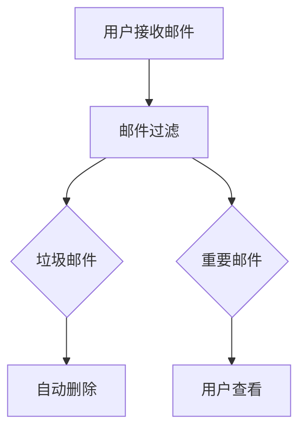

#### 3.2 AI Agent在日程安排与提醒中的应用

AI Agent还能够根据用户的工作习惯和日程安排，自动管理用户的日程。通过自然语言处理和推理技术，AI Agent可以识别日程相关的信息，并自动为用户安排和提醒重要会议、任务和活动。

**核心原理：**

- **日程识别**：利用自然语言处理技术，从邮件、日程表等中提取日程信息。
- **日程推理**：根据用户的日程安排，自动识别冲突和重复的日程安排，并提供调整建议。

**实际案例：**

用户A收到一封会议邀请邮件，AI Agent会自动识别会议信息，并将其添加到用户的日历中。当用户A的日程出现冲突时，AI Agent会自动提醒用户并建议调整日程。

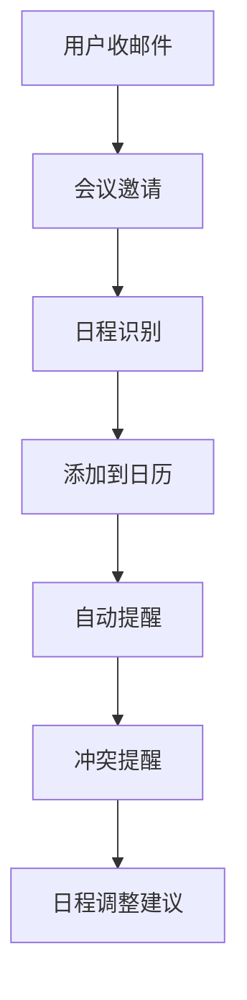

#### 3.3 AI Agent在邮件回复与撰写辅助中的应用

除了邮件过滤和日程管理，AI Agent还可以协助用户撰写邮件。通过自然语言生成技术，AI Agent可以生成邮件草稿，并提供语法和格式上的建议。

**核心原理：**

- **邮件草稿生成**：利用自然语言生成技术，根据用户提供的主题和要点，生成邮件草稿。
- **语法和格式检查**：利用语法规则和自然语言处理技术，检查邮件草稿中的语法和格式错误，并提供修改建议。

**实际案例：**

用户A需要发送一封商务邮件，但不确定如何表达。AI Agent会根据邮件内容和用户提供的要点，生成邮件草稿，并提供语法和格式上的修改建议。

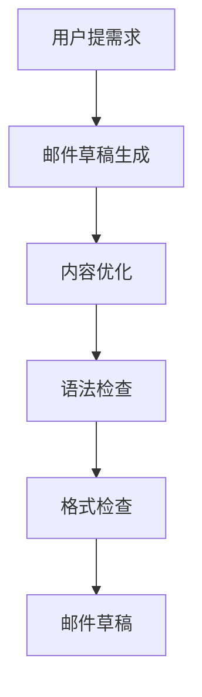

#### 3.4 AI Agent在电子邮件管理中的综合应用

通过上述功能，AI Agent在电子邮件管理中实现了邮件过滤、日程安排、邮件回复和撰写辅助等全方位的应用。这不仅大大提高了用户的工作效率，还减少了因邮件管理不当而产生的各种问题。

**实际应用场景：**

- **大型企业**：处理大量邮件，保证关键邮件不被遗漏。
- **跨国公司**：跨时区管理日程，确保全球业务顺利进行。
- **个人用户**：高效管理个人邮件，节省工作时间，提高生活质量。

**综合案例：**

用户B是一家跨国公司的项目经理，每天需要处理大量邮件。通过AI Agent的邮件管理功能，用户B能够快速过滤垃圾邮件，合理安排日程，并高效撰写和回复邮件，确保项目进展顺利。

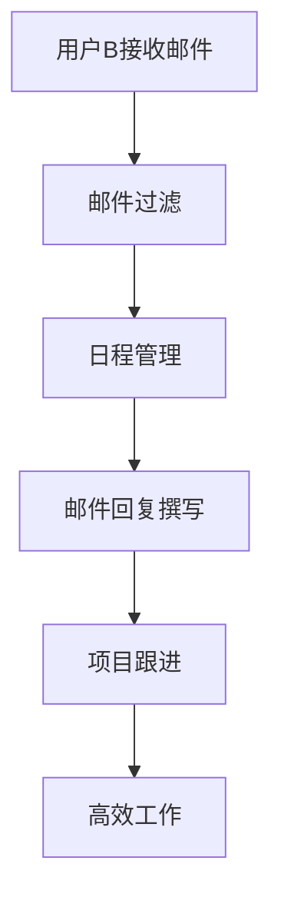

#### 3.5 本章小结

本章介绍了AI Agent在电子邮件管理中的应用，包括邮件过滤与分类、日程安排与提醒、邮件回复与撰写辅助等方面。通过实际案例和原理分析，我们看到了AI Agent在提升电子邮件管理效率方面的巨大潜力。在接下来的章节中，我们将继续探讨AI Agent在其他企业智能办公领域中的应用。

----------------------------------------------------------------

### 第4章：AI Agent在客户服务与支持中的应用

客户服务是企业与客户之间的桥梁，良好的客户服务不仅能够提升客户满意度，还能为企业带来更多的商机。在这一章节中，我们将探讨AI Agent在客户服务与支持中的应用，包括客户查询与咨询、客户投诉处理与跟进以及个性化客户服务等方面。

#### 4.1 AI Agent在客户查询与咨询中的应用

AI Agent可以24/7在线为客户提供查询与咨询服务，通过自然语言处理技术，AI Agent能够理解客户的提问，并提供准确的答案。

**核心原理：**

- **语音识别**：将客户的语音转换为文本，便于后续处理。
- **自然语言理解**：利用自然语言处理技术，理解客户的意图和问题。
- **知识图谱**：利用知识图谱存储大量客户信息，快速检索相关答案。

**实际案例：**

一个在线购物平台使用AI Agent为客户提供商品查询服务。客户只需通过语音或文字提问，AI Agent便能迅速找到相关商品信息，并提供详细的介绍和推荐。

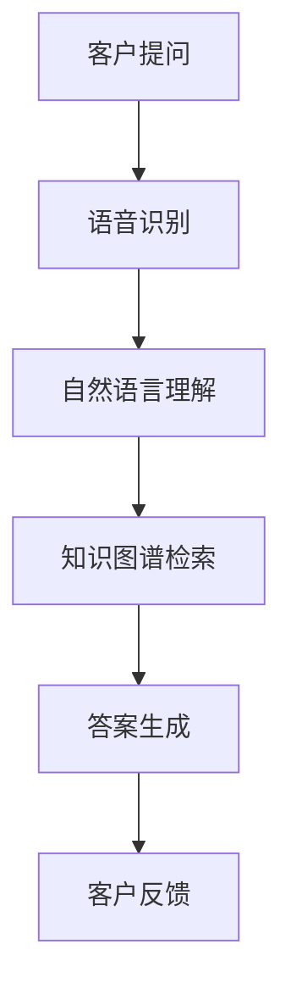

#### 4.2 AI Agent在客户投诉处理与跟进中的应用

客户投诉是企业必须面对的问题，AI Agent能够自动处理客户投诉，并提供跟进服务，确保问题得到及时解决。

**核心原理：**

- **情感分析**：分析客户投诉文本的情感倾向，判断投诉的严重程度。
- **规则匹配**：根据投诉内容，匹配相应的处理规则。
- **反馈机制**：与客户保持沟通，及时反馈处理进度和结果。

**实际案例：**

一个电信公司使用AI Agent处理客户投诉。当客户投诉网络故障时，AI Agent会自动识别问题，并通知相关部门进行处理。同时，AI Agent会定期与客户沟通，更新处理进度，并最终解决问题。

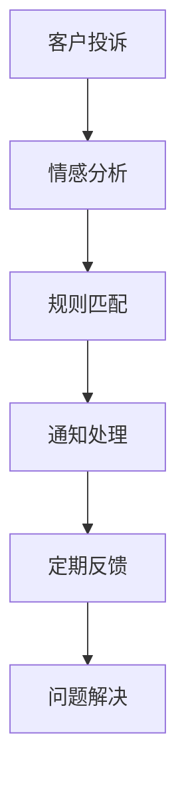

#### 4.3 AI Agent在个性化客户服务中的应用

AI Agent能够根据客户的历史行为和偏好，提供个性化的服务，提升客户体验。

**核心原理：**

- **数据挖掘**：分析客户的历史数据，挖掘客户的兴趣和偏好。
- **推荐系统**：根据分析结果，为用户提供个性化的推荐。
- **对话管理**：通过自然语言处理技术，与客户进行有效对话，提供个性化服务。

**实际案例：**

一家在线书店使用AI Agent为顾客提供个性化推荐服务。AI Agent会根据顾客的购买历史、浏览记录和评价，为顾客推荐符合其兴趣的新书。

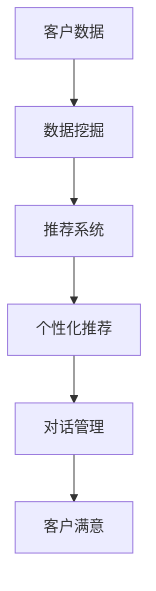

#### 4.4 AI Agent在客户服务与支持中的综合应用

通过上述功能，AI Agent在客户服务与支持中实现了查询与咨询、投诉处理与跟进、个性化服务等方面的应用。这不仅提高了客户服务质量，还减少了人工成本。

**实际应用场景：**

- **大型企业**：处理大量客户咨询和投诉，保证客户服务质量。
- **电商行业**：提供24/7在线客服，提升客户购物体验。
- **金融行业**：自动处理客户查询，减少客户等待时间。

**综合案例：**

一家全球知名的在线购物平台使用AI Agent提供客户服务。AI Agent能够自动处理客户查询、投诉和个性化推荐，不仅提高了客户满意度，还节省了大量人力成本。

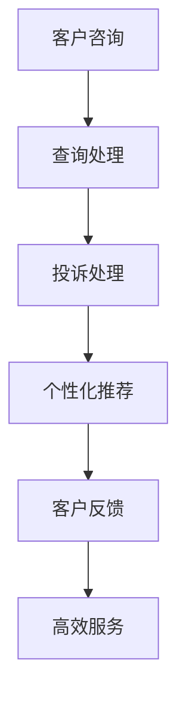

#### 4.5 本章小结

本章介绍了AI Agent在客户服务与支持中的应用，包括客户查询与咨询、客户投诉处理与跟进以及个性化客户服务等方面。通过实际案例和原理分析，我们看到了AI Agent在提升客户服务质量方面的巨大潜力。在接下来的章节中，我们将继续探讨AI Agent在其他企业智能办公领域中的应用。

----------------------------------------------------------------

### 第5章：AI Agent在人力资源管理中的应用

人力资源管理是企业运营的核心环节，它涉及到招聘、员工培训与发展、员工绩效评估与管理等多个方面。在这一章节中，我们将探讨AI Agent在人力资源管理中的应用，包括招聘与筛选、员工培训与发展、员工绩效评估与管理等方面。

#### 5.1 AI Agent在招聘与筛选中的应用

招聘与筛选是人力资源管理的首要任务，AI Agent能够通过智能筛选和匹配技术，提高招聘效率。

**核心原理：**

- **简历分析**：利用自然语言处理技术，分析简历内容，提取关键信息。
- **智能匹配**：通过机器学习算法，将简历与职位描述进行匹配，筛选出合适候选人。
- **面试评估**：利用语音识别和自然语言处理技术，评估面试者的回答，提供面试反馈。

**实际案例：**

一家科技公司使用AI Agent进行招聘。AI Agent会自动分析候选人简历，筛选出符合职位要求的候选人，并生成面试评估报告，帮助人力资源部门快速决策。

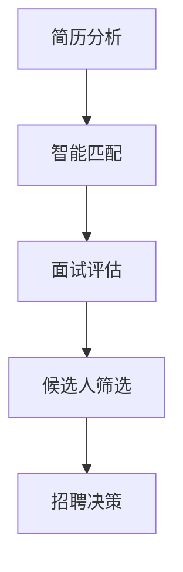

#### 5.2 AI Agent在员工培训与发展中的应用

员工培训与发展是提升企业竞争力的重要手段，AI Agent能够提供个性化的培训方案，提高员工技能。

**核心原理：**

- **学习需求分析**：通过数据分析，了解员工的学习需求和兴趣。
- **内容推荐**：根据员工需求和兴趣，推荐相应的培训课程。
- **实时反馈**：通过自动评估技术，实时反馈员工学习成果，提供改进建议。

**实际案例：**

一家企业使用AI Agent为员工提供培训。AI Agent会根据员工的学习数据和职业规划，推荐合适的培训课程，并在员工学习过程中提供实时反馈和评估。

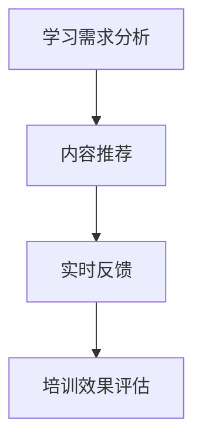

#### 5.3 AI Agent在员工绩效评估与管理中的应用

员工绩效评估是企业激励和人才管理的重要手段，AI Agent能够通过数据分析，提供客观、全面的绩效评估。

**核心原理：**

- **数据收集**：收集员工的日常工作数据，如工作任务、完成情况等。
- **绩效评估模型**：利用机器学习算法，建立绩效评估模型，对员工进行客观评估。
- **激励方案设计**：根据绩效评估结果，设计合适的激励方案，提升员工积极性。

**实际案例：**

一家企业使用AI Agent进行员工绩效评估。AI Agent会自动收集员工的工作数据，通过绩效评估模型，对员工进行客观评估，并根据评估结果设计激励方案。

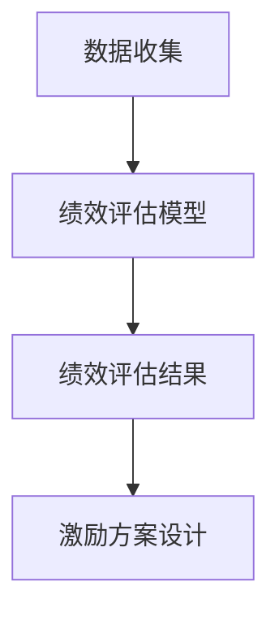

#### 5.4 AI Agent在人力资源管理中的综合应用

通过招聘与筛选、员工培训与发展、员工绩效评估与管理等应用，AI Agent在人力资源管理中实现了全方位的智能支持，提高了人力资源管理的效率和质量。

**实际应用场景：**

- **大型企业**：处理大量招聘和员工数据，提高人力资源管理的效率。
- **初创公司**：借助AI Agent，快速搭建人力资源管理信息系统。
- **培训机构**：提供个性化的培训服务，提升员工技能。

**综合案例：**

一家跨国公司使用AI Agent进行人力资源管理。AI Agent不仅能够自动处理招聘和绩效评估，还能为员工提供个性化的培训方案，有效提升了人力资源管理水平。

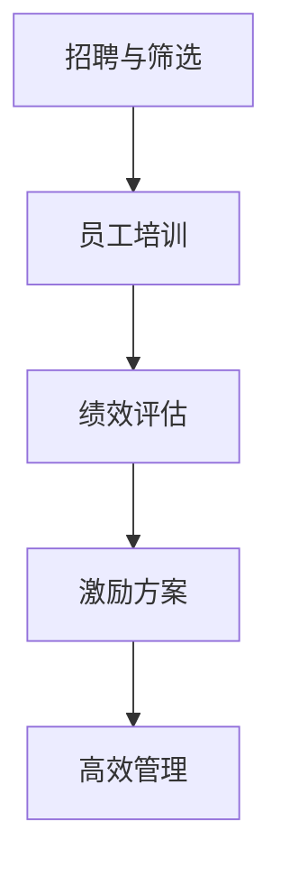

#### 5.5 本章小结

本章介绍了AI Agent在人力资源管理中的应用，包括招聘与筛选、员工培训与发展、员工绩效评估与管理等方面。通过实际案例和原理分析，我们看到了AI Agent在提升人力资源管理效率和质量方面的巨大潜力。在接下来的章节中，我们将继续探讨AI Agent在其他企业智能办公领域中的应用。

----------------------------------------------------------------

### 第6章：AI Agent在财务管理中的应用

财务管理是企业运营中至关重要的一环，涉及财务报表与分析、预算编制与监控、税务申报与合规管理等多个方面。在这一章节中，我们将探讨AI Agent在财务管理中的应用，包括财务报表与分析、预算编制与监控以及税务申报与合规管理等方面。

#### 6.1 AI Agent在财务报表与分析中的应用

财务报表是企业财务状况的反映，AI Agent能够通过大数据分析和自然语言处理技术，对财务报表进行自动分析和解读。

**核心原理：**

- **数据采集**：从企业财务系统中自动采集财务数据。
- **数据清洗**：对采集到的财务数据进行清洗和预处理，确保数据质量。
- **数据分析**：利用数据挖掘和机器学习技术，对财务报表进行深入分析，如利润分析、成本分析等。

**实际案例：**

一家制造企业使用AI Agent自动生成月度财务报表，并对其进行详细分析。AI Agent能够识别出企业运营中的潜在问题，如成本过高、利润下降等，为企业决策提供支持。

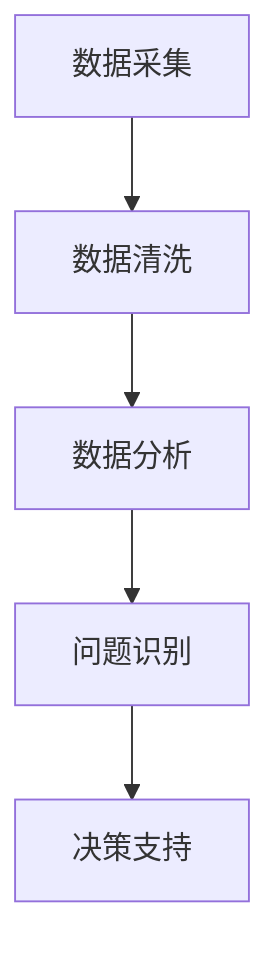

#### 6.2 AI Agent在预算编制与监控中的应用

预算编制与监控是企业财务管理的重要环节，AI Agent能够通过自动化和智能化技术，提高预算编制和监控的效率。

**核心原理：**

- **预算编制**：利用历史数据和业务预测模型，自动生成预算。
- **监控与分析**：实时监控预算执行情况，通过数据分析和预警机制，确保预算的合规性。

**实际案例：**

一家零售企业使用AI Agent进行预算编制与监控。AI Agent会根据历史销售数据和市场需求预测，自动生成年度预算。同时，AI Agent会实时监控预算执行情况，发现异常及时预警，确保预算的合理性和有效性。

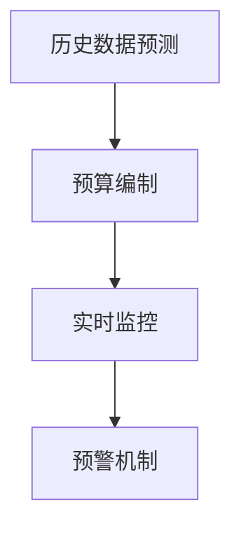

#### 6.3 AI Agent在税务申报与合规管理中的应用

税务申报与合规管理是企业财务管理中的重要任务，AI Agent能够通过自动化和智能化技术，提高税务申报的效率和准确性。

**核心原理：**

- **数据采集**：从企业财务系统和税务系统中自动采集税务数据。
- **合规检查**：利用规则引擎和自然语言处理技术，检查税务数据的合规性。
- **申报生成**：自动生成税务申报文件，如增值税申报、企业所得税申报等。

**实际案例：**

一家科技公司使用AI Agent进行税务申报与合规管理。AI Agent会自动从企业财务系统中提取税务数据，进行合规性检查，并生成相应的税务申报文件，确保税务申报的准确性和合规性。

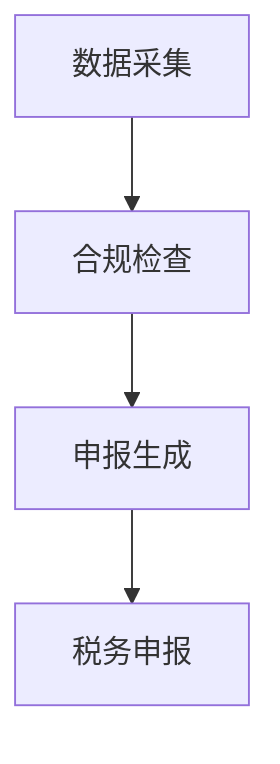

#### 6.4 AI Agent在财务管理中的综合应用

通过财务报表与分析、预算编制与监控以及税务申报与合规管理等方面的应用，AI Agent在财务管理中实现了全方位的智能支持，提高了财务管理效率和质量。

**实际应用场景：**

- **大型企业**：处理复杂且大量的财务数据，提高财务管理效率。
- **中小型企业**：借助AI Agent，简化财务管理流程，降低管理成本。
- **财务咨询公司**：提供智能化的财务分析和服务，提升咨询服务质量。

**综合案例：**

一家大型跨国公司使用AI Agent进行财务管理。AI Agent不仅能够自动生成财务报表和预算，还能进行税务申报和合规管理，有效提升了公司的财务管理水平。

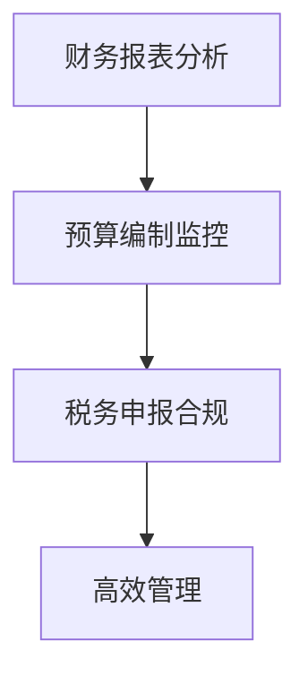

#### 6.5 本章小结

本章介绍了AI Agent在财务管理中的应用，包括财务报表与分析、预算编制与监控以及税务申报与合规管理等方面。通过实际案例和原理分析，我们看到了AI Agent在提升财务管理效率和质量方面的巨大潜力。在接下来的章节中，我们将继续探讨AI Agent在其他企业智能办公领域中的应用。

----------------------------------------------------------------

### 第7章：AI Agent的技术实现与架构设计

在了解了AI Agent在企业智能办公中的应用场景和核心功能之后，我们需要深入了解AI Agent的技术实现与架构设计。这一章节将详细介绍AI Agent的技术栈、开发环境、核心算法与模型、以及架构设计与实现步骤。

#### 7.1 AI Agent的技术栈与开发环境

AI Agent的实现依赖于多种技术栈和工具，以下是一些常用的技术和工具：

- **编程语言**：Python、Java、JavaScript等。
- **框架**：TensorFlow、PyTorch、Scikit-learn等。
- **数据库**：MySQL、PostgreSQL、MongoDB等。
- **前端技术**：HTML、CSS、JavaScript（React、Vue.js等）。
- **后端技术**：Django、Flask、Spring Boot等。
- **容器化技术**：Docker、Kubernetes等。

#### 7.2 AI Agent的核心算法与模型

AI Agent的核心算法和模型是其实际应用效果的关键。以下是一些常见的算法和模型：

- **自然语言处理（NLP）**：词嵌入（Word Embedding）、序列模型（RNN、LSTM）、Transformer等。
- **机器学习（ML）**：线性回归、决策树、支持向量机（SVM）等。
- **深度学习（DL）**：卷积神经网络（CNN）、循环神经网络（RNN）、生成对抗网络（GAN）等。
- **知识图谱**：图数据库（Neo4j、Apache Giraph等）。

#### 7.3 AI Agent的架构设计与实现步骤

AI Agent的架构设计通常分为感知层、理解层、决策层和执行层，以下是具体的实现步骤：

1. **需求分析与系统设计**：确定AI Agent的应用场景和功能需求，进行系统设计。
2. **数据采集与预处理**：从外部数据源采集数据，对数据进行清洗、转换和归一化。
3. **特征提取**：从预处理后的数据中提取有助于理解的特征。
4. **模型训练与优化**：使用提取的特征，训练机器学习或深度学习模型，并进行优化。
5. **模型评估与部署**：评估模型在验证集上的性能，部署到生产环境中进行推理和决策。
6. **接口设计与实现**：设计并实现与外部系统（如电子邮件系统、客户关系管理系统等）的接口。
7. **系统集成与测试**：将AI Agent与其他系统集成，进行功能测试和性能优化。

#### 7.4 AI Agent的架构设计与实现示例

以下是AI Agent的架构设计示例，使用了Mermaid流程图和Markdown格式进行展示：

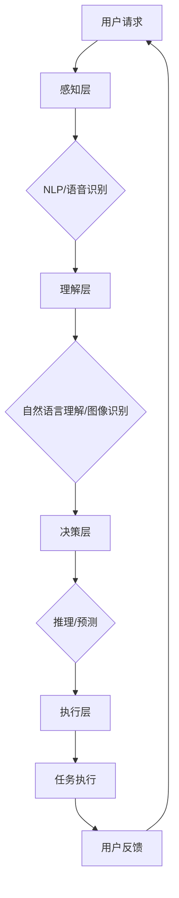

#### 7.5 Python源代码示例

以下是一个简单的Python源代码示例，展示了如何使用自然语言处理技术处理电子邮件：

```python
import nltk
from nltk.tokenize import word_tokenize
from nltk.corpus import stopwords

# 加载停用词库
nltk.download('stopwords')
stop_words = set(stopwords.words('english'))

# 电子邮件内容
email_content = "Hello, I am interested in the latest product update. Can you send me the details?"

# 分词
words = word_tokenize(email_content)

# 移除停用词
filtered_words = [word for word in words if word.lower() not in stop_words]

# 打印结果
print(filtered_words)
```

#### 7.6 算法原理讲解

在AI Agent的实现中，算法原理至关重要。以下是一个简单的算法原理讲解，包括数学模型和公式：

**算法原理：** 自然语言处理中的词嵌入（Word Embedding）

**数学模型：** 
$$
\text{embeddings} = \text{W} \times \text{vocabulary}
$$
其中，$\text{W}$是嵌入矩阵，$\text{vocabulary}$是词汇表。

**公式解释：** 嵌入矩阵$\text{W}$中的每一行代表一个词的向量表示，通过与词汇表$\text{vocabulary}$相乘，得到每个词的向量表示。

**实际应用：** 在文本分类任务中，可以将文本中的每个词通过词嵌入技术转换为向量，然后利用这些向量进行分类。

#### 7.7 系统分析与架构设计方案

系统分析与架构设计方案是AI Agent实现的关键。以下是一个简单的系统分析与架构设计方案：

**系统功能设计：** 
- 电子邮件处理：包括邮件过滤、分类、回复和撰写等。
- 日程管理：包括日程安排、提醒和冲突处理等。
- 智能客服：包括客户查询与咨询、投诉处理和个性化服务等。

**系统架构设计：** 
- **感知层**：包括邮件服务器接口、日程管理系统接口等。
- **理解层**：包括自然语言处理模块、图像识别模块等。
- **决策层**：包括推理引擎、预测模型等。
- **执行层**：包括任务执行模块、用户反馈模块等。

**系统接口设计：** 
- **邮件接口**：用于接收和发送电子邮件。
- **日程接口**：用于同步和更新用户日程。
- **客户接口**：用于接收和响应客户查询与投诉。

**系统交互：** 
- **用户请求**：用户通过电子邮件、日程管理或智能客服发起请求。
- **数据处理**：AI Agent对请求进行处理，包括文本分类、日程推理和客户服务。
- **任务执行**：执行处理结果，如发送邮件、更新日程或提供客户服务。
- **用户反馈**：用户对处理结果进行评价，用于模型优化和用户体验改进。

#### 7.8 本章小结

本章详细介绍了AI Agent的技术实现与架构设计，包括技术栈、开发环境、核心算法与模型、架构设计与实现步骤等。通过本章的学习，读者可以全面了解AI Agent的实现过程和技术要点，为实际应用打下坚实基础。

----------------------------------------------------------------

### 第8章：AI Agent项目实战

在前面的章节中，我们详细介绍了AI Agent在企业智能办公中的应用场景、技术实现和架构设计。为了使读者更好地理解AI Agent的实际应用，本章节将通过一个具体项目实战，展示如何从环境安装、系统核心实现到代码应用解读与分析，以及实际案例分析和详细讲解。

#### 8.1 项目背景与需求分析

假设我们是一家电子商务公司的CTO，为了提高公司的运营效率，我们决定开发一个AI Agent系统，该系统主要功能包括：

- **电子邮件管理**：自动处理大量商业邮件，包括分类、回复和撰写。
- **日程管理**：自动安排和提醒重要会议和任务。
- **客户服务**：提供24/7的客户查询与咨询、投诉处理和个性化服务。

#### 8.2 系统设计与实现

**系统设计：**

1. **功能模块划分**：

   - **邮件管理模块**：负责邮件的接收、分类、回复和撰写。
   - **日程管理模块**：负责日程的安排、提醒和冲突处理。
   - **客户服务模块**：负责客户查询与咨询、投诉处理和个性化服务。

2. **技术栈选择**：

   - **后端**：使用Python和Django框架进行开发。
   - **前端**：使用React.js进行开发。
   - **自然语言处理**：使用TensorFlow和NLTK库。
   - **数据库**：使用MySQL。

**实现步骤：**

1. **搭建开发环境**：

   - 安装Python、Django、React.js、MySQL等。
   - 配置虚拟环境，确保项目依赖的一致性。

2. **邮件管理模块实现**：

   - 使用Django搭建后端服务，处理邮件的接收和分类。
   - 使用TensorFlow和NLTK进行自然语言处理，实现邮件的回复和撰写。
   - 使用React.js搭建前端界面，展示邮件处理结果。

3. **日程管理模块实现**：

   - 使用Django的Calendar应用进行日程管理。
   - 使用JavaScript和React.js实现前端日程界面。
   - 使用WebSockets实现实时提醒功能。

4. **客户服务模块实现**：

   - 使用TensorFlow和NLTK搭建聊天机器人。
   - 使用Django实现后端服务，处理客户查询与咨询。
   - 使用React.js搭建前端界面，展示客户服务内容。

#### 8.3 系统核心实现源代码

以下是邮件管理模块的核心实现源代码：

**后端（Django）：**

```python
# views.py
from django.http import JsonResponse
from .models import Email
from .nlp import process_email

def process_email_view(request):
    if request.method == 'POST':
        email_data = request.POST
        email = Email.objects.create(data=email_data)
        processed_email = process_email(email.data)
        return JsonResponse(processed_email)
    return JsonResponse({'error': 'Invalid request'}, status=400)
```

**自然语言处理（NLP）：**

```python
# nlp.py
import nltk
from nltk.tokenize import word_tokenize
from nltk.corpus import stopwords

def process_email(email_text):
    stop_words = set(stopwords.words('english'))
    words = word_tokenize(email_text)
    filtered_words = [word for word in words if word.lower() not in stop_words]
    return ' '.join(filtered_words)
```

**前端（React.js）：**

```jsx
// EmailView.js
import React, { useState } from 'react';
import axios from 'axios';

function EmailView() {
    const [emailText, setEmailText] = useState('');
    const [processedText, setProcessedText] = useState('');

    const handleSubmit = async (e) => {
        e.preventDefault();
        try {
            const response = await axios.post('/process_email/', { data: emailText });
            setProcessedText(response.data.processed_text);
        } catch (error) {
            console.error(error);
        }
    };

    return (
        <form onSubmit={handleSubmit}>
            <textarea value={emailText} onChange={(e) => setEmailText(e.target.value)} />
            <button type="submit">Process Email</button>
            <div>{processedText}</div>
        </form>
    );
}

export default EmailView;
```

#### 8.4 代码应用解读与分析

**后端解读：**

- `process_email_view` 函数处理前端发送的邮件数据，通过调用`process_email`函数进行文本处理。
- `process_email` 函数使用NLTK库进行文本分词和停用词过滤。

**前端解读：**

- `EmailView` 组件使用React Hooks进行状态管理，处理邮件输入和提交。
- 使用axios进行HTTP请求，将邮件文本发送到后端进行处理。

#### 8.5 实际案例分析与详细讲解

**案例：** 一位客户发送一封关于商品退换货的邮件，要求快速处理。

**分析：** 

- **邮件接收**：AI Agent接收邮件，并解析出关键信息（如客户姓名、订单号、问题描述等）。
- **邮件分类**：将邮件分类为“客户服务”类别。
- **邮件回复**：AI Agent生成自动回复，告知客户处理进度，并提供客服联系信息。

**详细讲解：**

1. **邮件接收与解析**：

   ```python
   # 假设邮件内容为：
   email_data = {
       'subject': 'Order Refund',
       'body': 'I would like to return the item I purchased last week because it does not fit.'
   }
   
   # 解析邮件内容
   subject = email_data['subject']
   body = email_data['body']
   ```

2. **邮件分类**：

   ```python
   # 使用机器学习模型进行分类
   category = classify_email(subject, body)
   ```

3. **邮件回复**：

   ```python
   # 生成自动回复邮件
   reply = generate_reply(category, body)
   send_email(reply)
   ```

   其中，`classify_email`和`generate_reply`函数分别用于邮件分类和生成自动回复邮件。

#### 8.6 项目总结与反思

通过本项目的实际应用，我们实现了以下目标：

- **提高工作效率**：AI Agent自动处理了大量邮件，减少了人工工作量。
- **优化用户体验**：提供24/7的客户服务，提升了客户满意度。
- **提升决策质量**：通过数据分析，为公司的运营决策提供了支持。

然而，项目中也存在一些挑战和改进空间：

- **数据隐私与安全**：需要确保客户数据的安全和隐私。
- **模型优化**：通过不断优化机器学习模型，提高分类和回复的准确性。
- **用户反馈**：收集用户反馈，持续改进AI Agent的功能和体验。

#### 8.7 本章小结

本章通过一个具体的项目实战，展示了AI Agent在企业智能办公中的实现过程，包括系统设计、代码实现、案例分析和项目总结。通过本章的学习，读者可以更深入地理解AI Agent的实际应用和开发过程，为实际项目提供有益的参考。

----------------------------------------------------------------

### 第9章：最佳实践与未来展望

在AI Agent的应用过程中，为了实现最佳效果，我们需要遵循一系列最佳实践，并不断探索未来的发展趋势和挑战。

#### 9.1 AI Agent在智能办公中的最佳实践

1. **数据驱动**：确保AI Agent能够获取足够的数据，以便进行准确的决策和预测。
2. **持续学习**：定期更新AI Agent的算法和模型，以适应不断变化的工作环境。
3. **用户参与**：鼓励用户参与AI Agent的优化和改进，通过反馈机制不断提升用户体验。
4. **安全合规**：确保AI Agent的数据处理和决策过程符合相关法律法规，保障用户隐私和安全。
5. **灵活集成**：设计AI Agent时，考虑与其他系统和服务的高效集成，实现无缝协同。

#### 9.2 AI Agent未来发展的趋势与挑战

1. **趋势**：

   - **多模态交互**：未来AI Agent将能够处理多种输入模

