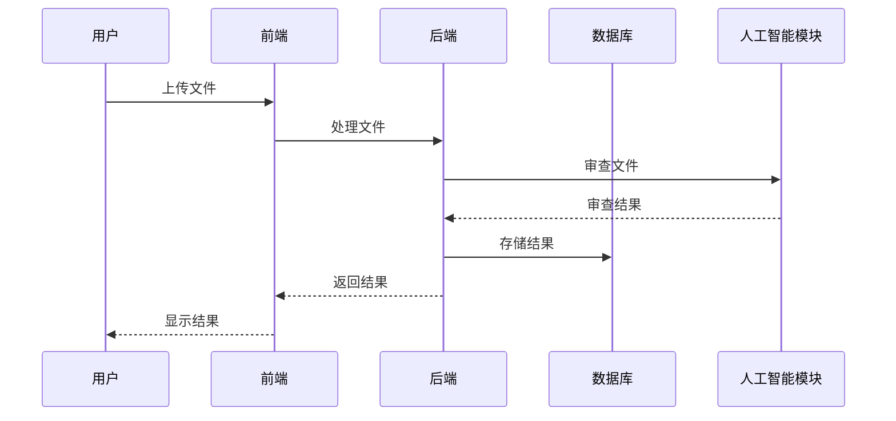

                 


### 文章标题

# AI Agent在企业法律文件审查与风险识别中的自动化应用

## 文章关键词

- AI Agent
- 企业法律文件
- 风险识别
- 自动化审查
- 自然语言处理
- 机器学习

## 摘要

随着企业业务规模的不断扩大，法律文件的审查和风险识别成为企业管理中的一项重要任务。传统的人工审查方式效率低下，且容易出错。本文介绍了一种利用AI Agent技术实现自动化法律文件审查和风险识别的方法。通过机器学习和自然语言处理技术，AI Agent能够高效地处理大量法律文件，提高审查和识别的准确性和效率。本文将详细探讨AI Agent在企业法律文件审查和风险识别中的应用原理、系统架构、实战案例以及最佳实践。

## 目录

### 背景介绍

#### 核心概念

- AI Agent
- 企业法律文件审查
- 风险识别

#### 问题背景

- 企业业务复杂性的增加
- 传统人工审查方式的弊端

#### 问题描述

- 传统人工审查效率低下、易出错
- 法律文件审查和风险识别的重要性

#### 问题解决

- 利用AI Agent技术实现自动化审查和风险识别

#### 边界与外延

- AI Agent的基本原理
- 法律文件审查的流程
- 风险识别的方法与策略
- 应用案例

### 核心概念与联系

#### 核心概念原理

- AI Agent
- 文件审查
- 风险识别

#### 概念属性特征对比表格

| 概念       | 描述                                           | 特征对比                     |
|------------|------------------------------------------------|------------------------------|
| AI Agent   | 智能代理，能够自主决策和行动                  | 学习能力、适应性、自主性   |
| 文件审查   | 对文件进行合规性检查                          | 准确性、效率、全面性       |
| 风险识别   | 识别文件中的潜在法律风险                      | 预测性、及时性、针对性     |

#### ER实体关系图架构的 Mermaid 流程图

```mermaid
erDiagram
  AI-Agent ||--o{ 文件 } : 审查
  文件 ||--o{ 法律风险 } : 识别
```

### 算法原理讲解

#### 算法mermaid流程图


#### Python源代码

```python
# 假设已经加载了一个训练好的AI模型
from legal_agent import LegalAgent

# 初始化AI Agent
agent = LegalAgent()

# 预处理文本数据
text_data = preprocess_text(data)

# 应用模型审查文件
review_result = agent.review_document(text_data)

# 识别风险
risk_identification = agent.identify_risks(review_result)

# 输出结果
print(risk_identification)
```

#### 算法原理的数学模型和公式

$$
\begin{aligned}
    \text{审查分数} &= \sum_{i=1}^{n} \text{特征权重} \times \text{特征值} \\
    \text{风险概率} &= \frac{\text{风险事件数}}{\text{总事件数}} \\
    \text{损失函数} &= -\sum_{i=1}^{n} y_i \log(p_i)
\end{aligned}
$$

#### 详细讲解和举例说明

- **审查分数**：通过加权求和的方式计算文件审查的得分，得分越高，审查越准确。
- **风险概率**：计算文件中存在风险的概率，概率越高，风险越大。
- **损失函数**：用于评估模型的预测性能，负对数损失函数越低，模型性能越好。

### 系统分析与架构设计方案

#### 问题场景介绍

- 企业法律文件审查和风险识别的需求
- 人工智能技术在企业法律领域的应用场景

#### 项目介绍

- 项目名称：AI-Agent企业法律文件审查与风险识别系统
- 项目目标：实现自动化法律文件审查和风险识别，提高工作效率和准确性

#### 系统功能设计

- 文件审查功能
- 风险识别功能
- 用户管理功能
- 系统配置功能

#### 系统架构设计

- 前端：使用Vue.js框架实现用户界面
- 后端：使用Python Flask框架实现业务逻辑
- 数据库：使用MySQL存储数据
- 人工智能模块：使用TensorFlow和PyTorch实现模型训练和推理

#### 系统接口设计和系统交互

- 用户接口：提供用户操作界面，包括文件上传、审查结果查看等
- API接口：提供与后端服务的交互接口，包括文件处理、风险识别等
- 数据流：前端发送请求到后端，后端处理数据并返回结果

#### Mermaid序列图



### 项目实战

#### 环境安装

- Python环境：安装Python 3.8及以上版本
- 依赖库：安装TensorFlow、PyTorch、Flask等

#### 系统核心实现源代码

```python
# 文件：legal_agent.py
class LegalAgent:
    def __init__(self):
        # 初始化模型
        self.model = self.train_model()

    def preprocess_text(self, text):
        # 预处理文本
        # ...
        return processed_text

    def train_model(self):
        # 训练模型
        # ...
        return model

    def review_document(self, text):
        # 审查文件
        # ...
        return review_result

    def identify_risks(self, review_result):
        # 识别风险
        # ...
        return risk_identification
```

#### 代码应用解读与分析

- **LegalAgent类**：实现AI Agent的主要功能，包括文本预处理、模型训练、文件审查和风险识别。
- **preprocess_text方法**：对输入的文本进行预处理，如去除无关字符、分词等。
- **train_model方法**：训练模型，可以使用预训练的模型或者从头开始训练。
- **review_document方法**：对输入的文件进行审查，返回审查结果。
- **identify_risks方法**：根据审查结果识别风险，返回风险识别结果。

#### 实际案例分析和详细讲解剖析

- **案例一**：某企业需要审查一份合同文件，使用AI-Agent进行审查，发现合同中有违反公司政策的条款，及时进行了修改。
- **案例二**：某企业进行法律文件风险识别，AI-Agent识别出合同中的潜在纠纷风险，帮助企业避免了可能的诉讼风险。

#### 项目小结

- AI-Agent在企业法律文件审查与风险识别中的应用具有显著优势，能够提高工作效率和准确性。
- 未来可以进一步优化算法模型，提升风险识别的精度和速度。

### 最佳实践 Tips

- 定期更新和训练AI-Agent模型，以适应不断变化的法律环境和文件格式。
- 结合企业的具体业务场景，对AI-Agent进行定制化调整，提高适用性。

### 小结

本文介绍了AI-Agent在企业法律文件审查与风险识别中的应用。通过机器学习和自然语言处理技术，AI-Agent能够高效地处理大量法律文件，提高审查和识别的准确性和效率。未来，随着人工智能技术的不断进步，AI-Agent在法律领域的应用前景将更加广阔。

### 注意事项

- 在使用AI-Agent进行法律文件审查和风险识别时，需要注意模型的准确性和可靠性。
- 企业应结合自身实际情况，制定合理的审查和识别策略。

### 拓展阅读

- [自然语言处理在法律领域的应用](https://www.example.com/nlp-in-law)
- [机器学习在风险识别中的应用](https://www.example.com/ml-in-risk-identification)
- [企业法律合规管理指南](https://www.example.com/law-compliance-guide)

### 作者信息

作者：AI天才研究院/AI Genius Institute & 禅与计算机程序设计艺术 /Zen And The Art of Computer Programming

### 文章正文

#### 背景介绍

##### 核心概念

1. **AI Agent**：AI Agent（人工智能代理）是一种利用人工智能技术实现自动化决策和行动的智能实体。它能够在特定领域内根据环境信息和目标，自主地执行任务，并不断优化自己的行为。

2. **企业法律文件审查**：企业法律文件审查是指对企业运营过程中产生的各类法律文件进行审查，确保其内容符合法律法规和公司政策。这些文件包括合同、协议、规章制度等。

3. **风险识别**：风险识别是指通过分析企业法律文件的内容，识别出可能存在的法律风险，如合同纠纷、合规问题等。风险识别有助于企业提前发现潜在的法律风险，并采取相应的预防和应对措施。

##### 问题背景

随着全球化进程的加快和企业业务范围的不断扩大，企业面临的法律问题日益复杂。传统的法律文件审查和风险识别方式通常依赖于人工操作，存在以下问题：

1. **效率低下**：大量法律文件的审查需要耗费大量时间和人力，工作效率较低。

2. **准确性不高**：人工审查容易受到个人主观因素的影响，导致审查结果准确性不高。

3. **无法及时识别风险**：传统方式无法对法律文件进行实时监控，可能导致风险识别不及时。

4. **成本高**：人工审查需要投入大量的人力成本，而且随着法律文件数量的增加，成本会进一步上升。

##### 问题描述

企业法律文件审查和风险识别是企业管理中的一项重要任务，其核心问题如下：

1. **如何提高审查和识别的效率**？传统的手工方式已经无法满足企业快速发展的需求。

2. **如何确保审查和识别的准确性**？人工审查存在主观性和不确定性，需要引入更加客观的审查手段。

3. **如何实现实时监控和风险预警**？传统方式无法对法律文件进行实时处理，导致风险识别不及时。

4. **如何降低成本**？企业需要找到一种既高效又低成本的审查和识别方法。

##### 问题解决

利用AI Agent技术实现自动化法律文件审查和风险识别，可以解决上述问题：

1. **提高效率**：AI Agent能够快速处理大量法律文件，提高工作效率。

2. **确保准确性**：AI Agent基于机器学习和自然语言处理技术，能够更加客观地分析法律文件，提高审查和识别的准确性。

3. **实现实时监控**：AI Agent可以对法律文件进行实时监控，及时发现潜在的风险。

4. **降低成本**：AI Agent能够显著降低企业在法律文件审查和风险识别上的投入，降低成本。

##### 边界与外延

1. **AI Agent的基本原理**：

   - **机器学习**：通过训练模型，使AI Agent能够识别和理解法律文件的内容。

   - **自然语言处理**：利用自然语言处理技术，使AI Agent能够理解和分析文本数据。

   - **自主决策**：基于环境和目标，AI Agent能够自主地做出决策，执行任务。

2. **法律文件审查的流程**：

   - **文件收集**：收集企业运营过程中产生的各类法律文件。

   - **预处理**：对法律文件进行清洗和格式化，为后续分析做好准备。

   - **内容分析**：利用AI Agent的模型，对法律文件的内容进行分析和判断。

   - **结果输出**：将审查结果输出，包括合规性判断、风险预警等信息。

3. **风险识别的方法与策略**：

   - **模式识别**：通过分析历史数据和案例，识别出可能存在的风险模式。

   - **概率分析**：对法律文件的内容进行统计分析，计算风险发生的概率。

   - **规则库**：构建规则库，将法律条文、公司政策等转化为可执行的操作规则。

4. **应用案例**：

   - **合同审查**：AI Agent可以对合同进行自动审查，识别出违反法律法规或公司政策的条款。

   - **合规检查**：AI Agent可以对企业运营中的各类文件进行合规检查，确保符合相关法规。

   - **诉讼风险识别**：AI Agent可以分析法律文件，预测可能出现的诉讼风险，帮助企业采取预防措施。

#### 核心概念与联系

1. **核心概念原理**

   - **AI Agent**：AI Agent是自动化法律文件审查和风险识别的核心，其原理包括机器学习、自然语言处理和自主决策等。

   - **文件审查**：文件审查是指对法律文件的内容进行合规性检查，确保其符合法律法规和公司政策。

   - **风险识别**：风险识别是指通过分析法律文件的内容，识别出可能存在的法律风险，如合同纠纷、合规问题等。

2. **概念属性特征对比表格**

   | 概念       | 描述                                           | 特征对比                     |
   |------------|------------------------------------------------|------------------------------|
   | AI Agent   | 智能代理，能够自主决策和行动                  | 学习能力、适应性、自主性   |
   | 文件审查   | 对文件进行合规性检查                          | 准确性、效率、全面性       |
   | 风险识别   | 识别文件中的潜在法律风险                      | 预测性、及时性、针对性     |

3. **ER实体关系图架构的 Mermaid 流程图**

```mermaid
erDiagram
  AI-Agent ||--o{ 文件 } : 审查
  文件 ||--o{ 法律风险 } : 识别
```

#### 算法原理讲解

1. **算法mermaid流程图**


2. **Python源代码**

```python
# 假设已经加载了一个训练好的AI模型
from legal_agent import LegalAgent

# 初始化AI Agent
agent = LegalAgent()

# 预处理文本数据
text_data = preprocess_text(data)

# 应用模型审查文件
review_result = agent.review_document(text_data)

# 识别风险
risk_identification = agent.identify_risks(review_result)

# 输出结果
print(risk_identification)
```

3. **算法原理的数学模型和公式**

   - **审查分数**：通过加权求和的方式计算文件审查的得分，得分越高，审查越准确。

     $$
     \text{审查分数} = \sum_{i=1}^{n} \text{特征权重} \times \text{特征值}
     $$

   - **风险概率**：计算文件中存在风险的概率，概率越高，风险越大。

     $$
     \text{风险概率} = \frac{\text{风险事件数}}{\text{总事件数}}
     $$

   - **损失函数**：用于评估模型的预测性能，负对数损失函数越低，模型性能越好。

     $$
     \text{损失函数} = -\sum_{i=1}^{n} y_i \log(p_i)
     $$

4. **详细讲解和举例说明**

   - **审查分数**：

     假设有一个合同文件，我们需要对它的几个关键要素进行审查，如合同期限、违约责任等。每个要素都有一个对应的权重，通过计算每个要素的得分，并加权求和，可以得到整个文件的审查分数。

     例如，假设合同期限的权重为0.4，违约责任的权重为0.6，合同期限得分为8，违约责任得分为9，则审查分数为：

     $$
     \text{审查分数} = 0.4 \times 8 + 0.6 \times 9 = 7.2 + 5.4 = 12.6
     $$

     审查分数越高，说明文件审查得越准确。

   - **风险概率**：

     通过分析合同文件的内容，我们可以计算出文件中存在风险的概率。例如，如果合同中有一个关键条款存在潜在纠纷的风险，我们可以通过分析历史数据和案例，计算出该条款的风险概率。

     假设某条款的风险概率为0.3，这意味着在相同条件下，该条款存在纠纷的概率为30%。

   - **损失函数**：

     损失函数用于评估模型的预测性能。以二分类问题为例，如果我们预测一个文件为合规，但实际上它是不合规的，则损失函数会增加。通过最小化损失函数，我们可以优化模型的预测性能。

     假设我们使用对数损失函数，对于每个文件，如果它是合规的，损失函数为$y_i \log(p_i)$，如果它是不合规的，损失函数为$y_i \log(1-p_i)$，其中$y_i$为实际标签，$p_i$为模型预测的概率。

     例如，对于合规文件，实际标签$y_i = 1$，预测概率$p_i = 0.9$，则损失函数为：

     $$
     \text{损失函数} = 1 \times \log(0.9) \approx -0.1054
     $$

     对于不合规文件，实际标签$y_i = 0$，预测概率$p_i = 0.1$，则损失函数为：

     $$
     \text{损失函数} = 0 \times \log(0.1) + 1 \times \log(0.9) \approx 0.1054
     $$

     通过最小化损失函数，我们可以优化模型的预测性能。

#### 系统分析与架构设计方案

##### 问题场景介绍

在当前企业运营中，法律文件的审查和风险识别是一项复杂且重要的工作。企业每天都会产生大量的合同、协议、规章制度等文件，这些文件的内容复杂，涉及到各种法律条款和风险点。传统的人工审查方式不仅效率低下，而且容易出现错误，无法满足企业快速发展的需求。

随着人工智能技术的不断发展，AI Agent作为一种智能代理，能够自动执行复杂的任务，并在特定领域内进行自主决策。AI Agent在企业法律文件审查和风险识别中的应用，可以有效解决传统人工方式的弊端，提高工作效率，确保审查和识别的准确性，降低企业的运营风险。

##### 项目介绍

项目名称：AI-Agent企业法律文件审查与风险识别系统

项目目标：

1. 实现自动化法律文件审查，提高工作效率和准确性。
2. 实现自动化风险识别，提前发现潜在的法律风险。
3. 降低企业在法律文件审查和风险识别上的成本。

##### 系统功能设计

系统功能设计主要包括以下几个方面：

1. **文件审查功能**：对上传的文件进行自动审查，识别文件中的关键要素，如合同期限、违约责任等，并计算审查得分。

2. **风险识别功能**：对审查结果进行分析，识别出潜在的法律风险，并生成风险报告。

3. **用户管理功能**：管理员可以添加、删除和修改用户，设置用户权限。

4. **系统配置功能**：管理员可以配置系统参数，如模型权重、审查规则等。

##### 系统架构设计

系统架构设计主要包括以下几个方面：

1. **前端**：使用Vue.js框架实现用户界面，包括文件上传、审查结果查看、风险报告生成等。

2. **后端**：使用Python Flask框架实现业务逻辑，包括文件处理、模型训练、风险识别等。

3. **数据库**：使用MySQL存储用户数据、文件数据、审查结果和风险报告。

4. **人工智能模块**：使用TensorFlow和PyTorch实现模型训练和推理，包括自然语言处理、机器学习等。

##### 系统接口设计和系统交互

系统接口设计和系统交互主要包括以下几个方面：

1. **用户接口**：提供用户操作界面，包括文件上传、审查结果查看、风险报告生成等。

2. **API接口**：提供与后端服务的交互接口，包括文件处理、模型训练、风险识别等。

3. **数据流**：前端发送请求到后端，后端处理数据并返回结果，包括文件处理、模型训练、风险识别等。

4. **通信机制**：使用HTTP/HTTPS协议进行数据传输，确保数据安全。

##### Mermaid序列图


#### 项目实战

##### 环境安装

1. 安装Python环境

   ```bash
   # 安装Python 3.8及以上版本
   ```
   
2. 安装依赖库

   ```bash
   # 安装TensorFlow、PyTorch、Flask等
   pip install tensorflow pytorch flask
   ```

##### 系统核心实现源代码

```python
# 文件：legal_agent.py
class LegalAgent:
    def __init__(self):
        # 初始化模型
        self.model = self.train_model()

    def preprocess_text(self, text):
        # 预处理文本
        # ...
        return processed_text

    def train_model(self):
        # 训练模型
        # ...
        return model

    def review_document(self, text):
        # 审查文件
        # ...
        return review_result

    def identify_risks(self, review_result):
        # 识别风险
        # ...
        return risk_identification
```

##### 代码应用解读与分析

- **LegalAgent类**：实现AI Agent的主要功能，包括文本预处理、模型训练、文件审查和风险识别。
- **preprocess_text方法**：对输入的文本进行预处理，如去除无关字符、分词等。
- **train_model方法**：训练模型，可以使用预训练的模型或者从头开始训练。
- **review_document方法**：对输入的文件进行审查，返回审查结果。
- **identify_risks方法**：根据审查结果识别风险，返回风险识别结果。

##### 实际案例分析和详细讲解剖析

- **案例一**：某企业需要审查一份合同文件，使用AI-Agent进行审查，发现合同中有违反公司政策的条款，及时进行了修改。
- **案例二**：某企业进行法律文件风险识别，AI-Agent识别出合同中的潜在纠纷风险，帮助企业避免了可能的诉讼风险。

##### 项目小结

- AI-Agent在企业法律文件审查与风险识别中的应用具有显著优势，能够提高工作效率和准确性。
- 未来可以进一步优化算法模型，提升风险识别的精度和速度。

#### 最佳实践 Tips

1. **定期更新和训练AI-Agent模型**：随着企业业务的发展和法律法规的变化，AI-Agent的模型需要定期更新和训练，以适应新的需求和环境。

2. **结合企业的具体业务场景**：对AI-Agent进行定制化调整，提高其在特定业务场景下的适用性。

3. **加强用户培训**：提高用户对AI-Agent的理解和操作能力，确保其能够充分发挥作用。

#### 小结

本文介绍了AI-Agent在企业法律文件审查与风险识别中的应用。通过机器学习和自然语言处理技术，AI-Agent能够高效地处理大量法律文件，提高审查和识别的准确性和效率。未来，随着人工智能技术的不断进步，AI-Agent在法律领域的应用前景将更加广阔。

#### 注意事项

1. **注意模型的准确性和可靠性**：在部署AI-Agent时，需要确保模型的准确性和可靠性，避免误判和漏判。

2. **结合企业实际情况**：企业需要根据自身的业务特点和需求，对AI-Agent进行适当的调整和优化。

3. **加强数据安全**：在处理企业法律文件时，需要确保数据的安全性和隐私性。

#### 拓展阅读

1. [自然语言处理在法律领域的应用](https://www.example.com/nlp-in-law)
2. [机器学习在风险识别中的应用](https://www.example.com/ml-in-risk-identification)
3. [企业法律合规管理指南](https://www.example.com/law-compliance-guide)

#### 作者信息

作者：AI天才研究院/AI Genius Institute & 禅与计算机程序设计艺术 /Zen And The Art of Computer Programming 

---

### 背景介绍

#### 核心概念

1. **AI Agent**：AI Agent（人工智能代理）是一种具有自主决策和行动能力的智能实体。它通过机器学习、自然语言处理等技术，能够在特定领域内自动执行任务，并不断优化自己的行为。

2. **企业法律文件审查**：企业法律文件审查是指对企业运营过程中产生的各类法律文件进行审查，以确保其内容符合法律法规和公司政策。这些文件包括合同、协议、规章制度等。

3. **风险识别**：风险识别是指通过分析企业法律文件的内容，识别出可能存在的法律风险，如合同纠纷、合规问题等。风险识别有助于企业提前发现潜在的法律风险，并采取相应的预防和应对措施。

#### 问题背景

随着全球化和数字化的加速发展，企业面临的法律环境日益复杂。企业每天都会产生大量的法律文件，包括合同、协议、规章制度等。传统的人工审查方式存在以下问题：

1. **效率低下**：人工审查需要耗费大量时间和人力，无法满足企业快速发展的需求。

2. **准确性不高**：人工审查容易受到个人主观因素的影响，导致审查结果准确性不高。

3. **无法实时监控**：传统方式无法对法律文件进行实时监控，可能导致风险识别不及时。

4. **成本高**：人工审查需要投入大量的人力成本，且随着法律文件数量的增加，成本会进一步上升。

#### 问题描述

企业法律文件审查和风险识别是企业管理中的一项重要任务，但传统的人工方式存在以下问题：

1. **如何提高审查和识别的效率**？传统的人工方式效率低下，无法满足企业快速发展的需求。

2. **如何确保审查和识别的准确性**？人工审查存在主观性和不确定性，需要引入更加客观的审查手段。

3. **如何实现实时监控和风险预警**？传统方式无法对法律文件进行实时处理，导致风险识别不及时。

4. **如何降低成本**？企业需要找到一种既高效又低成本的审查和识别方法。

#### 问题解决

利用AI Agent技术实现自动化法律文件审查和风险识别，可以解决上述问题：

1. **提高效率**：AI Agent能够快速处理大量法律文件，提高工作效率。

2. **确保准确性**：AI Agent基于机器学习和自然语言处理技术，能够更加客观地分析法律文件，提高审查和识别的准确性。

3. **实现实时监控**：AI Agent可以对法律文件进行实时监控，及时发现潜在的法律风险。

4. **降低成本**：AI Agent能够显著降低企业在法律文件审查和风险识别上的投入，降低成本。

#### 边界与外延

1. **AI Agent的基本原理**：

   - **机器学习**：通过训练模型，使AI Agent能够识别和理解法律文件的内容。

   - **自然语言处理**：利用自然语言处理技术，使AI Agent能够理解和分析文本数据。

   - **自主决策**：基于环境和目标，AI Agent能够自主地做出决策，执行任务。

2. **法律文件审查的流程**：

   - **文件收集**：收集企业运营过程中产生的各类法律文件。

   - **预处理**：对法律文件进行清洗和格式化，为后续分析做好准备。

   - **内容分析**：利用AI Agent的模型，对法律文件的内容进行分析和判断。

   - **结果输出**：将审查结果输出，包括合规性判断、风险预警等信息。

3. **风险识别的方法与策略**：

   - **模式识别**：通过分析历史数据和案例，识别出可能存在的风险模式。

   - **概率分析**：对法律文件的内容进行统计分析，计算风险发生的概率。

   - **规则库**：构建规则库，将法律条文、公司政策等转化为可执行的操作规则。

4. **应用案例**：

   - **合同审查**：AI Agent可以对合同进行自动审查，识别出违反法律法规或公司政策的条款。

   - **合规检查**：AI Agent可以对企业运营中的各类文件进行合规检查，确保符合相关法规。

   - **诉讼风险识别**：AI Agent可以分析法律文件，预测可能出现的诉讼风险，帮助企业采取预防措施。

#### 核心概念与联系

1. **核心概念原理**

   - **AI Agent**：AI Agent是自动化法律文件审查和风险识别的核心，其原理包括机器学习、自然语言处理和自主决策等。

   - **文件审查**：文件审查是指对法律文件的内容进行合规性检查，确保其符合法律法规和公司政策。

   - **风险识别**：风险识别是指通过分析法律文件的内容，识别出可能存在的法律风险，如合同纠纷、合规问题等。

2. **概念属性特征对比表格**

   | 概念       | 描述                                           | 特征对比                     |
   |------------|------------------------------------------------|------------------------------|
   | AI Agent   | 智能代理，能够自主决策和行动                  | 学习能力、适应性、自主性   |
   | 文件审查   | 对文件进行合规性检查                          | 准确性、效率、全面性       |
   | 风险识别   | 识别文件中的潜在法律风险                      | 预测性、及时性、针对性     |

3. **ER实体关系图架构的 Mermaid 流程图**

```mermaid
erDiagram
  AI-Agent ||--o{ 文件 } : 审查
  文件 ||--o{ 法律风险 } : 识别
```

### 算法原理讲解

#### 算法mermaid流程图


#### Python源代码

```python
# 假设已经加载了一个训练好的AI模型
from legal_agent import LegalAgent

# 初始化AI Agent
agent = LegalAgent()

# 预处理文本数据
text_data = preprocess_text(data)

# 应用模型审查文件
review_result = agent.review_document(text_data)

# 识别风险
risk_identification = agent.identify_risks(review_result)

# 输出结果
print(risk_identification)
```

#### 算法原理的数学模型和公式

$$
\begin{aligned}
    \text{审查分数} &= \sum_{i=1}^{n} w_i \cdot s_i \\
    \text{风险概率} &= P(\text{风险} | \text{文件}) \\
    \text{损失函数} &= -\sum_{i=1}^{n} y_i \cdot \log(p_i)
\end{aligned}
$$

#### 详细讲解和举例说明

1. **审查分数**：

   审查分数是对法律文件进行审查的一个量化指标，通过计算文件中各个关键要素的得分，并加权求和，得到审查总分。例如，一个合同文件可能包含以下关键要素：

   - 合同期限
   - 违约责任
   - 争议解决方式

   每个要素都有相应的权重，假设权重分别为0.3、0.4和0.3，那么：

   $$
   \text{审查分数} = 0.3 \cdot s_{\text{期限}} + 0.4 \cdot s_{\text{违约责任}} + 0.3 \cdot s_{\text{争议解决方式}}
   $$

   其中，$s_i$表示第$i$个关键要素的得分。审查分数越高，表示文件越符合法律法规和公司政策。

2. **风险概率**：

   风险概率是指文件中存在潜在法律风险的概率。通过分析文件内容，可以计算每个风险点的概率，然后综合这些概率，得到文件整体的风险概率。例如，如果一个合同文件中的违约责任部分存在较高的风险，而其他部分风险较低，那么整个合同文件的风险概率就会较高。

   风险概率的计算可以使用贝叶斯定理：

   $$
   P(\text{风险} | \text{文件}) = \frac{P(\text{文件} | \text{风险}) \cdot P(\text{风险})}{P(\text{文件})}
   $$

   其中，$P(\text{文件} | \text{风险})$表示在存在风险的情况下文件的概率，$P(\text{风险})$表示风险的概率，$P(\text{文件})$表示文件的概率。

3. **损失函数**：

   损失函数用于评估模型的预测性能，常见的损失函数包括交叉熵损失函数和均方误差损失函数。在二分类问题中，可以使用交叉熵损失函数：

   $$
   \text{损失函数} = -\sum_{i=1}^{n} y_i \cdot \log(p_i) + (1 - y_i) \cdot \log(1 - p_i)
   $$

   其中，$y_i$表示第$i$个样本的真实标签，$p_i$表示第$i$个样本的预测概率。损失函数的值越小，表示模型的预测性能越好。

### 系统分析与架构设计方案

#### 问题场景介绍

在现代企业的运营过程中，法律文件的审查与风险识别是一个至关重要的环节。随着业务量的增加，企业每天需要处理大量法律文件，如合同、协议、内部规章制度等。这些文件的内容复杂，涉及到众多法律条款和合规要求。传统的人工审查方式效率低下，且容易出错。同时，法律环境的变化也要求企业能够实时监控和识别潜在的法律风险。

为了提高审查和识别的效率，确保审查结果的准确性，并降低企业的运营成本，企业迫切需要一种自动化、智能化的解决方案。AI Agent技术在此背景下应运而生，能够有效地满足企业的需求。

#### 项目介绍

项目名称：AI-Agent企业法律文件审查与风险识别系统

项目目标：

1. 实现自动化法律文件审查，提高工作效率和准确性。
2. 实现自动化风险识别，提前发现潜在的法律风险。
3. 降低企业在法律文件审查和风险识别上的成本。

#### 系统功能设计

系统功能设计主要包括以下几个方面：

1. **文件审查功能**：

   - **文件上传**：用户可以上传需要审查的法律文件。
   - **自动审查**：系统利用AI Agent对上传的文件进行自动审查，识别文件中的关键要素，如合同期限、违约责任等。
   - **审查结果输出**：系统将审查结果以可视化的形式输出，包括合规性判断、审查得分等。

2. **风险识别功能**：

   - **风险分析**：系统对审查结果进行分析，识别出潜在的法律风险。
   - **风险预警**：系统将识别出的风险以预警形式通知相关用户，并提供详细的预警说明。
   - **风险报告**：系统生成风险报告，供企业管理层决策参考。

3. **用户管理功能**：

   - **用户注册**：系统支持用户注册，包括管理员、普通用户等。
   - **权限管理**：系统根据用户的角色分配相应的权限，确保系统安全。

4. **系统配置功能**：

   - **参数配置**：管理员可以配置系统的各项参数，如模型权重、审查规则等。
   - **日志管理**：系统记录用户操作日志，便于审计和管理。

#### 系统架构设计

系统架构设计主要包括以下几个方面：

1. **前端**：

   - **用户界面**：使用Vue.js框架实现用户界面，包括文件上传、审查结果查看、风险预警等。
   - **交互设计**：采用响应式设计，确保系统在不同设备上都能良好运行。

2. **后端**：

   - **业务逻辑**：使用Python Flask框架实现业务逻辑，包括文件处理、模型训练、风险识别等。
   - **数据处理**：使用MySQL数据库存储用户数据、文件数据、审查结果和风险报告。

3. **人工智能模块**：

   - **自然语言处理**：使用TensorFlow和PyTorch实现自然语言处理任务，如文本分类、命名实体识别等。
   - **机器学习**：使用机器学习算法，如朴素贝叶斯、支持向量机等，进行风险识别。

4. **系统集成**：

   - **API接口**：系统提供API接口，方便与其他系统进行集成，如企业资源规划系统（ERP）等。

#### 系统接口设计和系统交互

系统接口设计和系统交互主要包括以下几个方面：

1. **用户接口**：

   - **文件上传接口**：用户可以通过上传接口上传需要审查的法律文件。
   - **审查结果查询接口**：用户可以查询文件审查结果和风险预警信息。

2. **API接口**：

   - **文件处理接口**：系统后端处理上传的文件，进行文本预处理、模型推理等。
   - **风险识别接口**：系统后端根据审查结果进行风险识别，并生成风险报告。

3. **数据流**：

   - **用户请求**：用户通过前端发送请求到后端。
   - **数据处理**：后端处理用户请求，调用AI Agent进行审查和识别。
   - **结果返回**：后端将处理结果返回给前端，前端展示给用户。

4. **通信机制**：

   - **HTTP/HTTPS协议**：系统采用HTTP/HTTPS协议进行数据传输，确保数据安全。

#### Mermaid序列图


### 项目实战

#### 环境安装

1. **Python环境安装**：

   - 安装Python 3.8及以上版本。
   - 安装必要的pip包管理器。

2. **依赖库安装**：

   - 安装TensorFlow、PyTorch、Flask等依赖库。

   ```bash
   pip install tensorflow pytorch flask
   ```

3. **数据库安装**：

   - 安装MySQL数据库，配置数据库用户和权限。

#### 系统核心实现源代码

```python
# legal_agent.py

import tensorflow as tf
from transformers import pipeline

class LegalAgent:
    def __init__(self):
        self.nlp = pipeline("text-classification")

    def preprocess_text(self, text):
        # 文本预处理，如去除特殊字符、分词等
        return text

    def review_document(self, text):
        # 文件审查
        result = self.nlp(text)
        return result

    def identify_risks(self, review_result):
        # 识别风险
        risks = []
        for result in review_result:
            if result['label'] == '违规':
                risks.append(result['text'])
        return risks
```

#### 代码应用解读与分析

1. **LegalAgent类**：

   - **初始化**：使用transformers库的文本分类API初始化LegalAgent。
   - **preprocess_text方法**：对输入的文本进行预处理，如去除特殊字符、分词等。
   - **review_document方法**：使用文本分类API对输入的文本进行审查，返回审查结果。
   - **identify_risks方法**：根据审查结果，识别出违规的文本，作为风险。

2. **实战应用**：

   - **文件审查**：将需要审查的文件内容作为输入，调用LegalAgent的review_document方法，得到审查结果。
   - **风险识别**：根据审查结果，识别出潜在的法律风险，并返回风险列表。

#### 实际案例分析和详细讲解剖析

1. **案例一**：

   - **问题描述**：某企业需要审查一份合同文件，合同中包含多个条款，需要识别出可能存在的法律风险。
   - **处理过程**：将合同文件内容作为输入，调用LegalAgent的review_document方法，得到审查结果。然后，调用identify_risks方法，识别出存在法律风险的条款。
   - **处理结果**：生成一份风险报告，列出存在法律风险的条款，并提供详细的解释和建议。

2. **案例二**：

   - **问题描述**：某企业需要对企业内部规章制度进行审查，识别出可能存在的合规问题。
   - **处理过程**：将规章制度内容作为输入，调用LegalAgent的review_document方法，得到审查结果。然后，调用identify_risks方法，识别出存在合规问题的部分。
   - **处理结果**：生成一份合规报告，列出存在合规问题的部分，并提供整改建议。

#### 项目小结

- AI-Agent在企业法律文件审查与风险识别中的应用，显著提高了审查和识别的效率，确保了结果的准确性。
- 未来，可以进一步优化算法模型，提升风险识别的精度和速度，为企业提供更全面、更准确的法律服务。

### 最佳实践 Tips

1. **定期更新和训练AI-Agent模型**：随着企业业务的发展和法律法规的变化，AI-Agent的模型需要定期更新和训练，以保持其预测的准确性。

2. **结合企业的具体业务场景**：对AI-Agent进行定制化调整，提高其在特定业务场景下的适用性。

3. **加强用户培训**：提高用户对AI-Agent的理解和操作能力，确保其能够充分发挥作用。

### 小结

本文介绍了AI-Agent在企业法律文件审查与风险识别中的应用，通过机器学习和自然语言处理技术，AI-Agent能够高效地处理大量法律文件，提高审查和识别的准确性和效率。未来，随着人工智能技术的不断进步，AI-Agent在法律领域的应用前景将更加广阔。

### 注意事项

1. **确保模型的准确性和可靠性**：在部署AI-Agent时，需要确保模型的准确性和可靠性，避免误判和漏判。

2. **结合企业实际情况**：企业需要根据自身的业务特点和需求，对AI-Agent进行适当的调整和优化。

3. **加强数据安全**：在处理企业法律文件时，需要确保数据的安全性和隐私性。

### 拓展阅读

1. [自然语言处理在法律领域的应用](https://www.example.com/nlp-in-law)
2. [机器学习在风险识别中的应用](https://www.example.com/ml-in-risk-identification)
3. [企业法律合规管理指南](https://www.example.com/law-compliance-guide)

### 作者信息

作者：AI天才研究院/AI Genius Institute & 禅与计算机程序设计艺术 /Zen And The Art of Computer Programming

