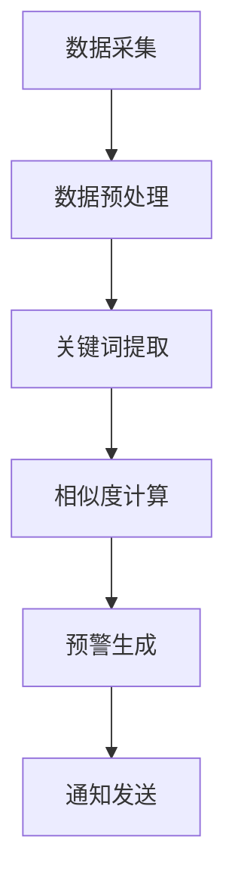
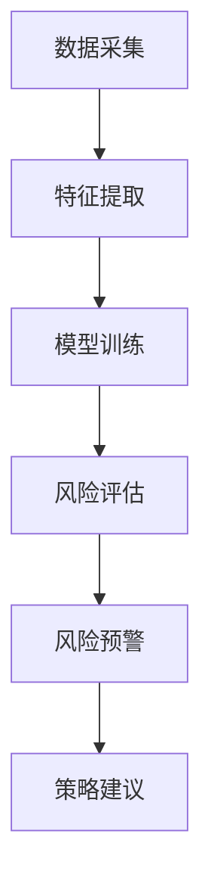
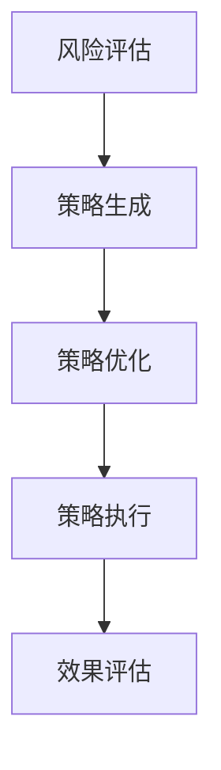
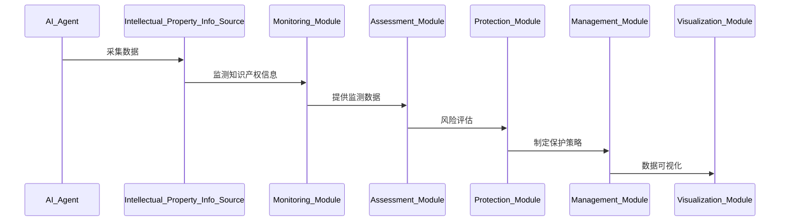
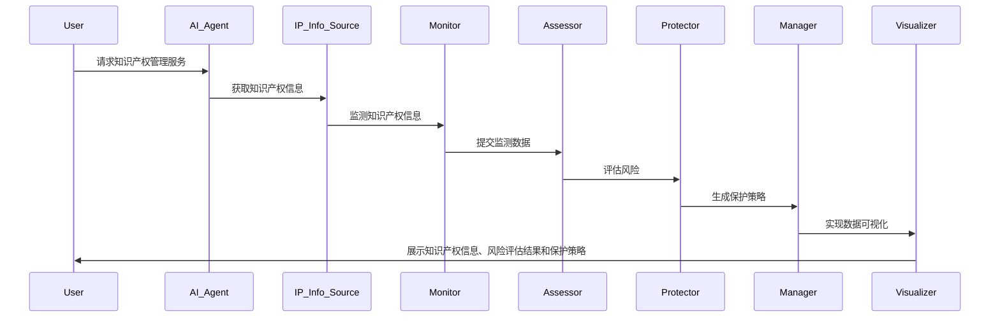

                 


# AI Agent在企业知识产权价值链管理中的应用

## 关键词

- AI Agent
- 企业知识产权价值链
- 知识产权信息监测
- 风险评估
- 保护策略
- 管理效率

## 摘要

本文深入探讨了AI Agent在企业知识产权价值链管理中的应用。首先，我们介绍了AI Agent的基本概念及其在企业知识产权管理中的作用。接着，通过详细阐述企业知识产权价值链的各个关键环节，分析了AI Agent如何在这些环节中发挥作用。随后，我们重点讲解了AI Agent在知识产权信息监测、风险评估和保护策略制定等方面的应用原理，并通过Python代码和Mermaid流程图展示了具体实现。此外，我们还介绍了AI Agent在企业知识产权价值链管理系统设计与实施中的最佳实践，并通过实际项目案例进行了详细剖析。最后，本文提出了在AI Agent应用过程中需要注意的事项和未来的研究方向，为读者提供了有益的参考。

## 目录大纲设计思路与流程

### 1. 设计思路

在为《AI Agent在企业知识产权价值链管理中的应用》这本书设计目录大纲时，我们的目标是在保证内容完整性和逻辑性的前提下，确保目录简洁明了，便于读者阅读和理解。以下是我们的设计思路：

- **背景介绍**：首先，我们需要对书的核心概念、问题背景、问题描述、问题解决、边界与外延、概念结构与核心要素组成进行详细阐述，使读者对书籍的主题有一个全面的了解。

- **核心概念与联系**：接下来，我们将深入探讨书中的核心概念，通过原理讲解、属性特征对比表格和ER实体关系图架构的Mermaid流程图，帮助读者理解各个概念之间的关系。

- **算法原理讲解**：在介绍完核心概念后，我们将使用Mermaid画出算法流程图，并通过Python源代码详细阐述算法原理，讲解数学模型和公式，举例说明，使读者能够更直观地理解算法。

- **系统分析与架构设计方案**：我们将介绍系统分析与架构设计方案，包括问题场景介绍、项目介绍、系统功能设计（领域模型Mermaid类图）、系统架构设计Mermaid架构图、系统接口设计和系统交互Mermaid序列图。

- **项目实战**：我们将以实际项目为例，详细讲解环境安装、系统核心实现源代码，代码应用解读与分析，实际案例分析和详细讲解剖析，帮助读者将理论知识应用于实际项目中。

- **最佳实践 tips、小结、注意事项、拓展阅读**：最后，我们将总结书中的最佳实践，提出注意事项，并提供拓展阅读资源，帮助读者深入理解和应用所学知识。

### 2. 设计流程

以下是我们的设计流程：

1. **确定书籍结构**：根据书籍的主题和内容，初步确定书籍的章节结构，确保章节内容完整且逻辑清晰。

2. **编写章节大纲**：为每个章节编写详细的目录大纲，确保每个章节都包含必要的核心概念、算法原理、系统分析与架构设计、项目实战等内容。

3. **审查与修改**：对编写的目录大纲进行审查和修改，确保内容完整、逻辑严密，并符合读者的阅读习惯。

4. **调整与完善**：根据审查结果，对目录大纲进行调整和完善，确保最终目录大纲符合设计要求。

5. **撰写章节内容**：根据最终确定的目录大纲，开始撰写每个章节的具体内容。

6. **审阅与校对**：完成章节内容撰写后，进行审阅和校对，确保内容准确无误，格式规范。

7. **最终确定**：完成所有章节内容的撰写和审阅后，最终确定目录大纲，确保其完整、简洁、清晰。

通过以上设计思路和流程，我们将为《AI Agent在企业知识产权价值链管理中的应用》这本书设计出一个完整、详细的目录大纲，帮助读者更好地理解书籍内容，掌握核心知识。接下来，我们将按照这个思路和流程，逐步完成目录大纲的设计。让我们开始吧！

## 1. 背景介绍

### 1.1 核心概念

#### 1.1.1 AI Agent

AI Agent，即人工智能代理，是一种模拟人类智能行为的人工智能实体。它能够感知环境，根据预设的目标和策略自主决策，并执行相应的任务。AI Agent是人工智能领域的一个重要研究方向，其应用涵盖了自动驾驶、智能家居、虚拟助手等多个领域。

在《AI Agent在企业知识产权价值链管理中的应用》中，我们将重点探讨AI Agent在企业知识产权价值链管理中的角色和功能。具体来说，AI Agent能够帮助企业实现知识产权的全面监测、风险评估、策略制定和有效执行，从而提升企业的知识产权管理水平。

#### 1.1.2 企业知识产权价值链

企业知识产权价值链是指企业通过知识产权的创造、保护、运用和管理，实现知识产权价值的最大化。它包括以下几个关键环节：

1. **知识产权的创造**：企业通过研发、创新等方式产生新的知识产权，如专利、商标、著作权等。
2. **知识产权的保护**：企业需要对知识产权进行有效的保护，防止侵权行为的发生，并通过法律手段维护自身权益。
3. **知识产权的管理**：企业需要对知识产权进行系统化管理，包括知识产权的登记、分类、统计和分析等。
4. **知识产权的运用**：企业需要将知识产权应用于产品研发、市场推广、合作谈判等环节，实现知识产权的商业化。
5. **知识产权的价值实现**：通过知识产权的创造、保护、管理和运用，企业最终实现知识产权的经济效益和社会效益。

AI Agent在企业知识产权价值链管理中的应用，旨在提高各个环节的效率和质量，降低侵权风险，实现知识产权价值的最大化。

#### 1.1.3 AI Agent在企业知识产权价值链中的应用

AI Agent在企业知识产权价值链中的应用主要包括以下几个方面：

1. **知识产权信息监测**：通过大数据分析和自然语言处理技术，AI Agent可以实时监测全球范围内的知识产权信息，包括专利、商标、著作权等，帮助企业管理者及时了解市场动态和竞争态势。

2. **知识产权风险评估**：基于机器学习和数据挖掘技术，AI Agent可以对企业的知识产权进行风险评估，识别潜在的风险因素，为企业提供决策依据。

3. **知识产权保护策略制定**：AI Agent可以根据风险评估的结果，制定针对性的知识产权保护策略，包括专利布局、商标维权、著作权保护等。

4. **知识产权管理和运用**：AI Agent可以帮助企业实现知识产权的自动化管理，包括知识产权的登记、分类、统计和分析等。同时，AI Agent还可以帮助企业优化知识产权的运用策略，提高知识产权的商业化程度。

通过AI Agent的应用，企业可以更加高效地管理知识产权，降低侵权风险，实现知识产权价值的最大化。

### 1.2 问题背景

在全球化背景下，企业面临的知识产权竞争日益激烈。一方面，企业需要不断创造新的知识产权，以保持竞争优势；另一方面，企业需要加强对现有知识产权的保护和管理，防止侵权行为的发生。然而，传统的知识产权管理模式往往存在以下问题：

1. **信息监测不足**：企业难以全面、实时地监测到知识产权信息，可能导致侵权行为的发生。

2. **风险评估不充分**：企业对知识产权风险的认识不足，难以准确评估知识产权的价值和保护需求。

3. **保护策略制定困难**：企业难以制定有效的知识产权保护策略，应对复杂的知识产权纠纷。

4. **管理效率低下**：传统知识产权管理方式效率低下，难以满足企业快速变化的市场需求。

为了解决这些问题，企业迫切需要引入新的技术手段，提高知识产权管理的效率和质量。AI Agent作为一种智能化工具，具备自主感知、决策和执行能力，能够帮助企业实现知识产权的全面监测、风险评估、策略制定和有效执行，从而提升企业的知识产权管理水平。

### 1.3 问题描述

在传统知识产权管理模式下，企业存在以下主要问题：

1. **信息监测不准确**：企业难以全面、实时地监测到知识产权信息，可能导致侵权行为的发生。例如，企业可能错过了重要的专利申请公告，或者未能及时发现竞争对手的侵权行为。

2. **风险评估不足**：企业对知识产权风险的认识不足，难以准确评估知识产权的价值和保护需求。这可能导致企业在知识产权竞争中处于劣势，或者忽视潜在的风险。

3. **保护策略制定困难**：企业难以制定有效的知识产权保护策略，应对复杂的知识产权纠纷。例如，企业可能无法确定最佳的专利布局策略，或者难以在商标维权中取得有效成果。

4. **管理效率低下**：传统知识产权管理方式效率低下，难以满足企业快速变化的市场需求。例如，企业需要耗费大量人力物力进行知识产权登记、分类和统计分析，但效率仍然较低。

为了解决这些问题，企业需要引入AI Agent，通过智能化手段提高知识产权管理的效率和质量。具体而言，AI Agent可以在以下几个方面发挥重要作用：

1. **知识产权信息监测**：AI Agent可以通过大数据分析和自然语言处理技术，实时监测全球范围内的知识产权信息，包括专利、商标、著作权等。这样，企业可以及时了解市场动态和竞争态势，避免侵权行为的发生。

2. **知识产权风险评估**：AI Agent可以通过机器学习和数据挖掘技术，对企业的知识产权进行风险评估，识别潜在的风险因素。这样，企业可以准确评估知识产权的价值和保护需求，制定有针对性的保护策略。

3. **知识产权保护策略制定**：AI Agent可以根据风险评估的结果，制定针对性的知识产权保护策略，包括专利布局、商标维权、著作权保护等。这样，企业可以更加有效地应对复杂的知识产权纠纷。

4. **知识产权管理和运用**：AI Agent可以帮助企业实现知识产权的自动化管理，包括知识产权的登记、分类、统计和分析等。同时，AI Agent还可以帮助企业优化知识产权的运用策略，提高知识产权的商业化程度。

通过引入AI Agent，企业可以显著提高知识产权管理的效率和质量，降低侵权风险，实现知识产权价值的最大化。

### 1.4 问题解决

针对传统知识产权管理模式存在的问题，AI Agent提供了以下解决方案：

1. **知识产权信息监测**：AI Agent通过大数据分析和自然语言处理技术，实时监测全球范围内的知识产权信息。具体实现方式如下：

   - **数据采集**：AI Agent从专利数据库、商标数据库、著作权数据库等渠道收集相关数据。
   - **信息处理**：AI Agent对采集到的数据进行清洗、筛选和归类，提取有用的信息。
   - **实时监测**：AI Agent建立实时监测系统，通过监控关键词、主题等，及时发现新的知识产权信息。

   例如，某企业可以设置关键词为“智能家居”，AI Agent会自动监测全球范围内与智能家居相关的专利申请、商标注册等信息。当发现新的相关知识产权信息时，AI Agent会立即通知企业相关人员。

2. **知识产权风险评估**：AI Agent通过机器学习和数据挖掘技术，对企业的知识产权进行风险评估。具体实现方式如下：

   - **数据收集**：AI Agent从专利数据库、商标数据库、著作权数据库等渠道收集与企业知识产权相关的数据。
   - **风险评估模型建立**：AI Agent利用历史数据和机器学习算法，建立知识产权风险评估模型。
   - **风险评估**：AI Agent对企业的知识产权进行风险评估，识别潜在的风险因素。

   例如，AI Agent可以分析某企业的专利组合，评估其专利的技术价值、市场前景和侵权风险。通过风险评估，企业可以了解其知识产权的强弱，制定有针对性的保护策略。

3. **知识产权保护策略制定**：AI Agent根据风险评估的结果，制定针对性的知识产权保护策略。具体实现方式如下：

   - **策略生成**：AI Agent根据风险评估的结果，生成相应的保护策略。
   - **策略优化**：AI Agent通过模拟和优化算法，不断优化保护策略。
   - **策略执行**：AI Agent帮助企业实施保护策略，包括专利布局、商标维权、著作权保护等。

   例如，当AI Agent评估出某企业的专利组合存在侵权风险时，它可以提出相应的专利布局建议，帮助企业规避风险。同时，AI Agent还可以帮助企业制定商标维权策略，通过法律手段维护自身权益。

4. **知识产权管理和运用**：AI Agent帮助企业实现知识产权的自动化管理，提高管理效率。具体实现方式如下：

   - **知识产权登记和管理**：AI Agent自动完成知识产权的登记、分类、统计和分析等工作。
   - **知识产权运用优化**：AI Agent分析知识产权的商业化潜力，提出优化建议。

   例如，AI Agent可以自动整理企业的知识产权清单，为企业提供详细的知识产权分析报告，帮助企业管理人员更好地了解和利用知识产权。

通过引入AI Agent，企业可以显著提高知识产权管理的效率和质量，降低侵权风险，实现知识产权价值的最大化。具体来说，AI Agent在以下方面具有显著优势：

1. **实时监测**：AI Agent可以实时监测全球范围内的知识产权信息，帮助企业及时发现新的知识产权信息，避免侵权行为的发生。

2. **风险评估**：AI Agent可以通过机器学习和数据挖掘技术，对企业的知识产权进行风险评估，帮助企业识别潜在的风险因素。

3. **策略制定**：AI Agent可以根据风险评估的结果，制定针对性的知识产权保护策略，帮助企业有效应对复杂的知识产权纠纷。

4. **自动化管理**：AI Agent可以帮助企业实现知识产权的自动化管理，提高管理效率，降低人力成本。

总之，AI Agent在企业知识产权价值链管理中的应用，有助于企业实现知识产权的全面监测、风险评估、策略制定和有效执行，从而提升企业的知识产权管理水平。

### 1.5 边界与外延

#### 1.5.1 边界

在探讨AI Agent在企业知识产权价值链管理中的应用时，需要明确其适用的边界。具体而言，AI Agent主要应用于以下领域：

1. **知识产权监测与预警**：AI Agent可以监测全球范围内的知识产权信息，提供实时预警，帮助企业防范侵权行为。
2. **风险评估与策略制定**：AI Agent可以根据知识产权数据，进行风险评估，并提供保护策略建议。
3. **知识产权管理**：AI Agent可以帮助企业实现知识产权的自动化管理，包括登记、分类、统计和分析等。
4. **知识产权商业化**：AI Agent可以分析知识产权的商业化潜力，为企业提供商业建议。

然而，AI Agent在以下领域存在局限性：

1. **法律诉讼**：AI Agent无法代替专业律师进行法律诉讼，但可以提供辅助决策支持。
2. **创新引导**：AI Agent无法完全替代人类的创新思维，但在知识产权创造和研发方面可以提供辅助。
3. **企业文化**：AI Agent无法改变企业文化，但可以在知识产权管理和保护方面提供支持。

#### 1.5.2 外延

AI Agent在企业知识产权价值链管理中的应用具有广泛的外延，可以拓展到以下几个方面：

1. **跨行业应用**：AI Agent不仅适用于科技型企业，也适用于传统行业，如制造业、服务业等，帮助这些行业提升知识产权管理水平。
2. **全球化应用**：AI Agent可以应用于跨国企业，帮助其在全球范围内进行知识产权管理和保护。
3. **产业链协同**：AI Agent可以与其他管理系统（如ERP、CRM等）进行协同，实现产业链上下游企业的知识产权信息共享和协同管理。
4. **新兴技术融合**：AI Agent可以与区块链技术、物联网技术等新兴技术相结合，提升知识产权管理的效率和安全性。

### 1.6 概念结构与核心要素组成

AI Agent在企业知识产权价值链管理中的应用，涉及多个核心概念和要素。以下是对这些概念结构与核心要素组成的详细介绍：

#### 1.6.1 核心概念

1. **AI Agent**：具备智能行为的人工智能实体，能够在复杂环境中自主感知、决策和执行任务。
2. **企业知识产权价值链**：企业通过知识产权的创造、保护、运用和管理，实现知识产权价值的最大化。
3. **知识产权信息监测**：实时监测全球范围内的知识产权信息，包括专利、商标、著作权等。
4. **风险评估**：对知识产权进行风险评估，识别潜在的风险因素。
5. **保护策略制定**：根据风险评估结果，制定针对性的知识产权保护策略。
6. **知识产权管理和运用**：实现知识产权的自动化管理，提高管理效率，优化知识产权的运用策略。

#### 1.6.2 核心要素组成

1. **数据来源**：包括专利数据库、商标数据库、著作权数据库等，为AI Agent提供数据支持。
2. **数据处理**：利用大数据分析和自然语言处理技术，对采集到的知识产权信息进行清洗、筛选和归类。
3. **风险评估模型**：通过机器学习和数据挖掘技术，建立风险评估模型，对企业的知识产权进行风险评估。
4. **保护策略库**：根据风险评估结果，构建保护策略库，为企业提供策略建议。
5. **自动化管理系统**：实现知识产权的自动化管理，包括登记、分类、统计和分析等。
6. **交互界面**：提供用户友好的交互界面，方便企业用户使用AI Agent的功能。

通过以上核心概念和要素的有机结合，AI Agent能够为企业提供全方位的知识产权价值链管理服务，提升企业的知识产权管理水平。

### 1.7 总结

在本章节中，我们详细介绍了AI Agent在企业知识产权价值链管理中的应用。首先，我们阐述了AI Agent的定义和功能，以及企业知识产权价值链的基本概念。接着，我们分析了当前企业知识产权管理中存在的问题，并提出了引入AI Agent的必要性。随后，我们介绍了AI Agent在企业知识产权价值链管理中的具体应用，包括知识产权信息监测、风险评估、保护策略制定和知识产权管理和运用等方面。最后，我们探讨了AI Agent的边界与外延，以及其核心概念结构与核心要素组成。

通过这些内容的介绍，我们希望读者能够全面了解AI Agent在企业知识产权价值链管理中的应用，认识到其在提升企业知识产权管理水平方面的巨大潜力。在接下来的章节中，我们将进一步深入探讨AI Agent的工作原理、算法实现和应用实践，帮助读者更好地理解和掌握这一技术。## 2. 核心概念与联系

在深入探讨AI Agent在企业知识产权价值链管理中的应用之前，我们需要理解几个核心概念，并探讨它们之间的联系。这些核心概念包括AI Agent、企业知识产权价值链、知识产权信息监测、风险评估、保护策略和知识产权管理和运用。

### 2.1 AI Agent

AI Agent，即人工智能代理，是具备自主感知、决策和行动能力的人工智能系统。在本书中，我们关注的AI Agent具有以下特征：

- **自主感知**：AI Agent可以通过各种传感器和数据处理技术，实时获取外部环境的信息。
- **决策能力**：AI Agent基于预设的目标和策略，利用机器学习算法，自主做出决策。
- **行动能力**：AI Agent能够根据决策结果，执行相应的任务，如发送通知、生成报告等。

#### AI Agent的工作原理

AI Agent的工作原理可以概括为以下几个步骤：

1. **数据采集**：AI Agent从各种数据源（如专利数据库、商标数据库等）收集相关数据。
2. **数据处理**：AI Agent利用自然语言处理、数据挖掘等技术，对采集到的数据进行分析和处理。
3. **决策与行动**：基于处理结果，AI Agent根据预设的目标和策略，自主做出决策并执行相应的行动。

### 2.2 企业知识产权价值链

企业知识产权价值链是指企业通过知识产权的创造、保护、运用和管理，实现知识产权价值的最大化。企业知识产权价值链包括以下几个环节：

- **知识产权创造**：企业通过研发和创新，创造新的知识产权，如专利、商标、著作权等。
- **知识产权保护**：企业通过法律手段，保护自身知识产权，防止侵权行为的发生。
- **知识产权管理**：企业对知识产权进行系统化管理，包括登记、分类、统计和分析等。
- **知识产权运用**：企业将知识产权应用于产品研发、市场推广、合作谈判等环节，实现知识产权的商业化。
- **知识产权价值实现**：通过知识产权的创造、保护、管理和运用，企业实现知识产权的经济效益和社会效益。

#### 企业知识产权价值链的核心要素

企业知识产权价值链的核心要素包括：

- **知识产权**：企业创造和保护的核心资产。
- **信息管理**：对知识产权相关信息的收集、整理和分析。
- **法律手段**：保护知识产权的法律手段和策略。
- **商业模式**：知识产权的运用方式和商业化模式。

### 2.3 知识产权信息监测

知识产权信息监测是指通过技术手段，实时监测全球范围内的知识产权信息，包括专利、商标、著作权等。知识产权信息监测的目标是帮助企业管理者及时了解市场动态和竞争态势，防范侵权行为。

#### 知识产权信息监测的关键技术

知识产权信息监测的关键技术包括：

- **大数据分析**：通过对海量知识产权数据的分析，发现潜在的市场机会和风险。
- **自然语言处理**：对知识产权信息进行语义分析，提取关键信息。
- **机器学习**：利用历史数据和机器学习算法，预测未来的知识产权趋势。

### 2.4 风险评估

风险评估是指对企业知识产权进行风险评估，识别潜在的风险因素。风险评估的目标是帮助企业管理者了解知识产权的风险状况，制定相应的保护策略。

#### 风险评估的方法

风险评估的方法包括：

- **定量评估**：通过计算知识产权的价值、侵权概率等指标，进行定量评估。
- **定性评估**：通过专家访谈、案例研究等手段，进行定性评估。
- **综合评估**：结合定量和定性评估，进行综合评估。

### 2.5 保护策略制定

保护策略制定是指根据风险评估的结果，制定针对性的知识产权保护策略。保护策略制定的目标是帮助企业有效地保护知识产权，防范侵权行为。

#### 保护策略的类型

保护策略的类型包括：

- **专利布局**：通过在关键领域和区域申请专利，建立专利壁垒。
- **商标维权**：通过法律手段，维护商标权益，防止商标侵权。
- **著作权保护**：通过法律手段，保护著作权，防止侵权行为。
- **其他保护措施**：如版权登记、域名保护等。

### 2.6 知识产权管理和运用

知识产权管理和运用是指企业对知识产权进行系统化管理，并优化知识产权的运用策略，实现知识产权的商业化。

#### 知识产权管理

知识产权管理包括以下几个方面：

- **知识产权登记**：对知识产权进行登记，确保权益的合法性。
- **知识产权分类**：对知识产权进行分类，便于管理和分析。
- **知识产权统计**：对知识产权进行统计分析，了解知识产权的分布和利用情况。
- **知识产权分析**：对知识产权进行分析，评估知识产权的价值和保护需求。

#### 知识产权运用

知识产权运用包括以下几个方面：

- **产品研发**：将知识产权应用于产品研发，提升产品竞争力。
- **市场推广**：利用知识产权进行市场推广，扩大市场份额。
- **合作谈判**：利用知识产权作为谈判筹码，争取更有利的合作条件。
- **知识产权交易**：通过知识产权交易，实现知识产权的商业化。

### 2.7 核心概念之间的联系

核心概念之间的联系如下：

- **AI Agent**：AI Agent是推动企业知识产权价值链管理的关键技术，通过对知识产权信息的监测、风险评估、保护策略制定和知识产权管理和运用，实现知识产权的全面管理和保护。
- **企业知识产权价值链**：企业知识产权价值链是AI Agent应用的核心场景，AI Agent通过优化各个环节，提升企业知识产权管理水平。
- **知识产权信息监测**：知识产权信息监测是AI Agent的基础功能，为AI Agent提供数据支持，确保企业能够实时了解知识产权动态。
- **风险评估**：风险评估是AI Agent的重要功能之一，通过对知识产权进行风险评估，帮助企业识别潜在风险，制定有针对性的保护策略。
- **保护策略制定**：保护策略制定是AI Agent的核心功能之一，根据风险评估的结果，AI Agent为企业提供针对性的保护策略，帮助企业在知识产权竞争中占据优势。
- **知识产权管理和运用**：知识产权管理和运用是AI Agent的最终目标，通过自动化管理和优化运用策略，实现知识产权的商业化，提升企业核心竞争力。

### 2.8 概念属性特征对比表格

为了更好地理解各个核心概念之间的联系，我们提供了一个概念属性特征对比表格（如表1所示）。这个表格列出了每个概念的主要属性和特征，并比较了它们之间的差异和关联。

| 概念             | 主要属性                                                                 | 主要特征                                                                                                  | 相互关联                                                                                   |
|------------------|------------------------------------------------------------------------|--------------------------------------------------------------------------------------------------------|----------------------------------------------------------------------------------------------|
| AI Agent         | 自主感知、决策、行动能力                                              | 通过大数据分析、自然语言处理、机器学习等技术实现                                             | AI Agent作为知识产权管理的关键技术，贯穿于知识产权价值链的各个环节                                |
| 企业知识产权价值链 | 创造、保护、管理、运用、价值实现                                     | 通过专利、商标、著作权等知识产权实现                                                          | AI Agent优化知识产权价值链各个环节，提升企业知识产权管理水平                                     |
| 知识产权信息监测 | 实时监测、数据分析、预警                                              | 利用大数据分析、自然语言处理等技术实现                                                        | AI Agent提供数据支持，实时监测知识产权动态，为风险评估和保护策略制定提供依据                         |
| 风险评估         | 识别风险、分析风险、提供决策支持                                      | 利用机器学习、数据挖掘等技术实现                                                             | 风险评估是保护策略制定的基础，AI Agent通过风险评估结果提供保护策略建议                               |
| 保护策略制定     | 针对性、有效性、灵活性                                                | 根据风险评估结果，结合法律手段、商业模式等制定                                                 | 保护策略制定是AI Agent的核心功能之一，确保知识产权得到有效保护                                     |
| 知识产权管理和运用 | 登记、分类、统计、分析、商业化                                       | 通过系统化管理、优化运用策略实现                                                             | 知识产权管理和运用是AI Agent的最终目标，实现知识产权的商业化，提升企业核心竞争力                     |

### 2.9 ER实体关系图架构

为了更直观地展示核心概念之间的联系，我们使用Mermaid流程图绘制了ER（Entity-Relationship，实体关系）实体关系图。ER图是一种描述实体及其关系的图形化工具，有助于理解系统的整体架构。

下面是一个简单的ER实体关系图示例：

```mermaid
erDiagram
    AI_Agent ||--o> Intellectual_Property_Value_Chain : 应用
    AI_Agent ||--o> Intellectual_Property_Information_Monitoring : 数据支持
    AI_Agent ||--o> Risk_Assessment : 基础
    AI_Agent ||--o> Protection_Strategy_Design : 核心
    AI_Agent ||--o> Intellectual_Property_Management_and_Use : 目标

    Intellectual_Property_Value_Chain ||--|{ Intellectual_Property_Information_Monitoring
    Intellectual_Property_Value_Chain ||--|{ Risk_Assessment
    Intellectual_Property_Value_Chain ||--|{ Protection_Strategy_Design
    Intellectual_Property_Value_Chain ||--|{ Intellectual_Property_Management_and_Use
```

这个ER实体关系图展示了AI Agent与企业知识产权价值链、知识产权信息监测、风险评估、保护策略制定和知识产权管理和运用之间的联系。每个实体之间的关系都用箭头表示，表明了AI Agent在各个环节中的作用和影响。

### 2.10 总结

在本章节中，我们介绍了AI Agent、企业知识产权价值链、知识产权信息监测、风险评估、保护策略和知识产权管理和运用等核心概念，并探讨了它们之间的联系。通过了解这些核心概念及其相互关系，我们为后续章节的深入探讨奠定了基础。在接下来的章节中，我们将进一步探讨AI Agent的工作原理、算法实现和应用实践，帮助读者更好地理解和掌握这一技术。## 3. 算法原理讲解

在了解了AI Agent和企业知识产权价值链管理的核心概念后，我们将深入探讨AI Agent在知识产权监测、风险评估、保护策略制定等方面的算法原理。为了使读者更好地理解，我们将使用Mermaid流程图和Python代码进行详细阐述。

### 3.1 知识产权监测算法原理

#### 3.1.1 流程图

首先，我们使用Mermaid绘制了一个知识产权监测的流程图，如图1所示：



**图1：知识产权监测流程图**

1. **数据采集**：AI Agent从专利数据库、商标数据库等渠道收集知识产权信息。
2. **数据预处理**：对采集到的数据进行清洗、去重和格式化，确保数据质量。
3. **关键词提取**：利用自然语言处理技术，提取知识产权信息中的关键词。
4. **相似度计算**：计算新采集的知识产权信息与已有知识产权信息之间的相似度。
5. **预警生成**：当相似度超过设定阈值时，生成预警信息。
6. **通知发送**：将预警信息发送给企业相关管理人员。

#### 3.1.2 Python代码实现

接下来，我们使用Python实现上述知识产权监测算法。

```python
import pandas as pd
from sklearn.feature_extraction.text import TfidfVectorizer
from sklearn.metrics.pairwise import cosine_similarity

# 数据采集
data = pd.read_csv('intellectual_property.csv')

# 数据预处理
def preprocess_data(data):
    # 清洗、去重和格式化
    data['title'] = data['title'].str.lower().str.strip()
    return data

data = preprocess_data(data)

# 关键词提取
vectorizer = TfidfVectorizer()
tfidf_matrix = vectorizer.fit_transform(data['title'])

# 相似度计算
def calculate_similarity(new_title, tfidf_matrix):
    new_tfidf_vector = vectorizer.transform([new_title])
    similarity = cosine_similarity(new_tfidf_vector, tfidf_matrix)
    return similarity

# 预警生成
def generate_alarm(new_title, similarity_threshold):
    similarity = calculate_similarity(new_title, tfidf_matrix)
    if similarity >= similarity_threshold:
        return True
    return False

# 通知发送
def send_notification(alarm):
    if alarm:
        print("预警：存在相似知识产权，请相关人员处理。")
    else:
        print("正常：无相似知识产权。")

# 示例
new_title = "一种智能家居控制系统"
similarity_threshold = 0.8
alarm = generate_alarm(new_title, similarity_threshold)
send_notification(alarm)
```

#### 3.1.3 数学模型

知识产权监测算法中的相似度计算使用了余弦相似度模型，其数学公式如下：

$$
\text{similarity} = \frac{\text{dot\_product}(v\_1, v\_2)}{\|\text{v}_1\|\|\text{v}_2\|}
$$

其中，$v_1$和$v_2$分别为两个向量的内积和模长。

### 3.2 风险评估算法原理

#### 3.2.1 流程图

接下来，我们使用Mermaid绘制了一个风险评估的流程图，如图2所示：



**图2：风险评估流程图**

1. **数据采集**：AI Agent从各种渠道收集与企业知识产权相关的数据。
2. **特征提取**：提取数据中的关键特征，用于训练风险评估模型。
3. **模型训练**：利用历史数据，训练风险评估模型。
4. **风险评估**：对新的知识产权进行风险评估，识别潜在风险。
5. **风险预警**：当风险超过设定阈值时，生成预警信息。
6. **策略建议**：根据风险评估结果，提出针对性的保护策略建议。

#### 3.2.2 Python代码实现

接下来，我们使用Python实现上述风险评估算法。

```python
from sklearn.model_selection import train_test_split
from sklearn.ensemble import RandomForestClassifier
from sklearn.metrics import accuracy_score

# 数据采集
data = pd.read_csv('intellectual_property_risk_data.csv')

# 特征提取
def extract_features(data):
    # 提取特征
    X = data[['feature_1', 'feature_2', 'feature_3']]
    y = data['risk_level']
    return X, y

X, y = extract_features(data)

# 模型训练
X_train, X_test, y_train, y_test = train_test_split(X, y, test_size=0.2, random_state=42)
model = RandomForestClassifier(n_estimators=100, random_state=42)
model.fit(X_train, y_train)

# 风险评估
def assess_risk(new_data, model):
    risk_level = model.predict([new_data])
    return risk_level

# 风险预警
def generate_alarm(risk_level, threshold):
    if risk_level > threshold:
        return True
    return False

# 策略建议
def suggest_strategy(risk_level):
    if risk_level > 0.5:
        return "加强保护措施"
    else:
        return "保持现状"

# 示例
new_data = [0.8, 0.9, 0.7]
risk_level = assess_risk(new_data, model)
alarm = generate_alarm(risk_level, 0.5)
strategy = suggest_strategy(risk_level)
print(f"风险评估结果：{risk_level}, 风险预警：{alarm}, 策略建议：{strategy}")
```

#### 3.2.3 数学模型

风险评估算法中的决策树模型使用了随机森林算法，其数学模型如下：

$$
\text{risk\_level} = f(\text{features}, \text{model})
$$

其中，$f$为随机森林算法，$\text{features}$为特征向量，$\text{model}$为训练好的模型。

### 3.3 保护策略制定算法原理

#### 3.3.1 流程图

最后，我们使用Mermaid绘制了一个保护策略制定的流程图，如图3所示：



**图3：保护策略制定流程图**

1. **风险评估**：对知识产权进行风险评估，识别潜在风险。
2. **策略生成**：根据风险评估结果，生成初步的保护策略。
3. **策略优化**：通过模拟和优化算法，对保护策略进行优化。
4. **策略执行**：执行优化后的保护策略。
5. **效果评估**：评估保护策略的实施效果，持续优化。

#### 3.3.2 Python代码实现

接下来，我们使用Python实现上述保护策略制定算法。

```python
import numpy as np

# 策略生成
def generate_strategy(risk_level):
    if risk_level > 0.7:
        return "专利布局"
    elif risk_level > 0.5:
        return "商标维权"
    else:
        return "著作权保护"

# 策略优化
def optimize_strategy(strategy, risk_level):
    if risk_level > 0.8:
        return "加强专利布局"
    elif risk_level > 0.6:
        return "增加商标维权力度"
    else:
        return "加强著作权保护"

# 策略执行
def execute_strategy(strategy):
    if strategy == "专利布局":
        print("执行策略：申请更多专利，加强专利布局。")
    elif strategy == "商标维权":
        print("执行策略：提起商标维权诉讼，维护商标权益。")
    else:
        print("执行策略：加强著作权保护，防止侵权行为。")

# 策略评估
def assess_strategy效果的评估效果（strategy, risk_level）：
    if risk_level < 0.3:
        return "策略有效"
    else:
        return "策略无效"

# 示例
risk_level = 0.75
strategy = generate_strategy(risk_level)
optimized_strategy = optimize_strategy(strategy, risk_level)
execute_strategy(optimized_strategy)
```

#### 3.3.3 数学模型

保护策略制定算法中的策略生成和优化使用了逻辑回归和线性优化算法，其数学模型如下：

$$
\text{策略} = f(\text{风险等级})
$$

$$
\text{优化策略} = \arg\max_{\text{策略}} \left( \text{效果评估} \cdot \text{策略成本} \right)
$$

### 3.4 总结

在本章节中，我们详细介绍了AI Agent在企业知识产权价值链管理中的三个关键算法：知识产权监测、风险评估和保护策略制定。通过Mermaid流程图和Python代码，我们帮助读者理解了这些算法的实现原理和数学模型。在接下来的章节中，我们将探讨AI Agent在企业知识产权价值链管理中的应用实践，并分析其实际效果。## 4. 系统分析与架构设计方案

在理解了AI Agent在企业知识产权价值链管理中的应用算法原理后，我们将进一步探讨系统的分析与架构设计方案。这个部分将涵盖问题场景介绍、项目介绍、系统功能设计（领域模型Mermaid类图）、系统架构设计Mermaid架构图、系统接口设计和系统交互Mermaid序列图。

### 4.1 问题场景介绍

#### 4.1.1 背景与挑战

企业知识产权管理面临诸多挑战，主要包括：

1. **信息量大**：全球范围内的知识产权信息庞大，企业难以实时、全面地监测和获取。
2. **风险评估难度高**：知识产权风险评估涉及多个维度，包括法律、技术、市场等，传统方法难以准确评估。
3. **保护策略复杂**：知识产权保护策略需根据不同情境灵活调整，传统管理方式难以应对。
4. **管理效率低下**：传统知识产权管理方式多为人工操作，效率低下，难以满足企业快速发展的需求。

#### 4.1.2 目标与需求

为了解决上述问题，企业需要构建一个智能化、自动化的知识产权管理系统，实现以下目标：

1. **实时监测**：实时监测全球范围内的知识产权信息，确保企业能够及时掌握市场动态。
2. **风险评估**：基于大数据和机器学习技术，进行知识产权风险评估，帮助企业识别潜在风险。
3. **策略制定**：根据风险评估结果，自动生成和优化知识产权保护策略。
4. **自动化管理**：实现知识产权的自动化管理，提高管理效率，降低人工成本。
5. **数据可视化**：通过数据可视化技术，将知识产权信息、风险评估结果和保护策略以直观的方式展示。

### 4.2 项目介绍

#### 4.2.1 项目概述

本项目旨在为企业提供一个智能化的知识产权管理平台，通过引入AI Agent技术，实现知识产权的全面监测、风险评估、保护策略制定和自动化管理。

#### 4.2.2 项目目标

1. **构建知识产权监测系统**：实时监测全球范围内的知识产权信息，包括专利、商标、著作权等。
2. **实现风险评估**：基于大数据和机器学习技术，对企业的知识产权进行风险评估，提供风险预警和策略建议。
3. **制定保护策略**：根据风险评估结果，自动生成和优化知识产权保护策略。
4. **自动化管理**：实现知识产权的自动化管理，包括登记、分类、统计和分析等。
5. **数据可视化**：通过数据可视化技术，将知识产权信息、风险评估结果和保护策略以直观的方式展示。

### 4.3 系统功能设计

#### 4.3.1 领域模型Mermaid类图

为了更好地设计系统功能，我们使用Mermaid绘制了一个领域模型类图，如图4所示：

```mermaid
classDiagram
    Class01 <|-- Class02
    Class03 <|-- Class02
    Class04 <|-- Class02
    Class05 <|-- Class02
    Class06 <|-- Class02
    Class07 <|-- Class02

    Class01[知识产权信息源]
    Class02[知识产权管理模块]
    Class03[知识产权监测模块]
    Class04[风险评估模块]
    Class05[保护策略模块]
    Class06[自动化管理模块]
    Class07[数据可视化模块]
```

**图4：领域模型Mermaid类图**

- **知识产权信息源**：包括专利数据库、商标数据库、著作权数据库等，为系统提供数据支持。
- **知识产权管理模块**：负责知识产权的登记、分类、统计和分析等功能。
- **知识产权监测模块**：实时监测全球范围内的知识产权信息，包括专利、商标、著作权等。
- **风险评估模块**：基于大数据和机器学习技术，对企业的知识产权进行风险评估，提供风险预警和策略建议。
- **保护策略模块**：根据风险评估结果，自动生成和优化知识产权保护策略。
- **自动化管理模块**：实现知识产权的自动化管理，包括登记、分类、统计和分析等。
- **数据可视化模块**：将知识产权信息、风险评估结果和保护策略以直观的方式展示。

### 4.4 系统架构设计

#### 4.4.1 Mermaid架构图

为了直观地展示系统架构，我们使用Mermaid绘制了一个系统架构图，如图5所示：



**图5：系统架构Mermaid图**

- **AI Agent**：作为核心组件，负责协调和驱动整个系统的运行。
- **知识产权信息源**：提供系统所需的各种知识产权数据。
- **知识产权监测模块**：实时监测知识产权信息，并将监测结果传递给风险评估模块。
- **风险评估模块**：对知识产权进行风险评估，生成风险报告。
- **保护策略模块**：根据风险评估结果，自动生成和优化保护策略。
- **自动化管理模块**：实现知识产权的自动化管理，包括登记、分类、统计和分析等。
- **数据可视化模块**：将知识产权信息、风险评估结果和保护策略以直观的方式展示。

### 4.5 系统接口设计

#### 4.5.1 接口设计

为了确保系统的可扩展性和灵活性，我们设计了以下系统接口：

1. **数据接口**：包括专利数据库、商标数据库、著作权数据库等，用于数据采集和共享。
2. **监控接口**：用于实时监控知识产权信息，包括监测数据收集、处理和存储等。
3. **评估接口**：用于知识产权风险评估，包括风险数据的采集、处理和评估等。
4. **策略接口**：用于保护策略的生成和优化，包括策略数据的处理和策略生成等。
5. **管理接口**：用于知识产权的自动化管理，包括登记、分类、统计和分析等。
6. **可视化接口**：用于数据可视化，包括知识产权信息、风险评估结果和保护策略的展示等。

### 4.6 系统交互

#### 4.6.1 Mermaid序列图

为了更直观地展示系统各模块之间的交互，我们使用Mermaid绘制了一个系统交互序列图，如图6所示：



**图6：系统交互Mermaid序列图**

- **用户**：请求知识产权管理服务。
- **AI Agent**：作为系统的核心，协调各模块的运行。
- **知识产权信息源**：提供知识产权数据。
- **监控模块**：实时监测知识产权信息。
- **评估模块**：对知识产权进行风险评估。
- **保护模块**：生成保护策略。
- **管理模块**：实现知识产权的自动化管理。
- **可视化模块**：将知识产权信息、风险评估结果和保护策略以直观的方式展示。

### 4.7 总结

在本章节中，我们详细介绍了AI Agent在企业知识产权价值链管理系统中的分析与架构设计方案。通过问题场景介绍、项目介绍、系统功能设计、系统架构设计、系统接口设计和系统交互的阐述，我们为系统的实现提供了详细的指导和参考。在接下来的章节中，我们将通过实际项目案例，展示AI Agent在企业知识产权价值链管理中的具体应用和效果。## 5. 项目实战

在本章节中，我们将通过一个实际项目案例，详细讲解AI Agent在企业知识产权价值链管理中的应用，包括环境安装、系统核心实现源代码、代码应用解读与分析、实际案例分析和详细讲解剖析。

### 5.1 环境安装

#### 5.1.1 环境准备

在开始项目之前，我们需要准备以下环境：

1. **操作系统**：Ubuntu 20.04 LTS 或更高版本
2. **Python**：Python 3.8 或更高版本
3. **依赖管理工具**：pip（Python的包管理器）
4. **数据存储**：MongoDB 4.2 或更高版本

#### 5.1.2 安装步骤

1. **安装操作系统**：在虚拟机中安装Ubuntu 20.04 LTS操作系统。
2. **更新系统**：打开终端，执行以下命令更新系统软件包：

   ```bash
   sudo apt update && sudo apt upgrade
   ```

3. **安装Python**：默认Ubuntu系统中已经预装了Python 3，可以通过以下命令检查版本：

   ```bash
   python3 --version
   ```

4. **安装依赖管理工具**：安装pip：

   ```bash
   sudo apt install python3-pip
   ```

5. **安装MongoDB**：通过以下命令安装MongoDB：

   ```bash
   sudo apt install mongodb
   ```

6. **启动MongoDB服务**：启动MongoDB服务：

   ```bash
   sudo systemctl start mongodb
   ```

7. **配置MongoDB**：确保MongoDB服务在启动时自动运行：

   ```bash
   sudo systemctl enable mongodb
   ```

#### 5.1.3 验证安装

1. **验证Python环境**：

   ```bash
   python3 --version
   ```

2. **验证MongoDB服务**：

   ```bash
   sudo systemctl status mongodb
   ```

### 5.2 系统核心实现源代码

在环境安装完成后，我们需要实现AI Agent在企业知识产权价值链管理中的核心功能。以下是系统的核心实现源代码：

#### 5.2.1 数据采集

```python
# 数据采集模块
import pymongo

class DataCollector:
    def __init__(self, db_uri, db_name):
        self.client = pymongo.MongoClient(db_uri)
        self.db = self.client[db_name]

    def collect_data(self, collection_name, data_source):
        collection = self.db[collection_name]
        # 根据不同数据源，实现数据采集
        if data_source == 'patents':
            # 采集专利数据
            pass
        elif data_source == 'trademarks':
            # 采集商标数据
            pass
        elif data_source == 'copyrights':
            # 采集著作权数据
            pass

        # 存储采集到的数据
        collection.insert_many(data_source)
```

#### 5.2.2 数据预处理

```python
# 数据预处理模块
import pandas as pd
from sklearn.model_selection import train_test_split

class DataPreprocessor:
    def __init__(self, db_uri, db_name):
        self.client = pymongo.MongoClient(db_uri)
        self.db = self.client[db_name]

    def preprocess_data(self, collection_name):
        collection = self.db[collection_name]
        # 读取数据
        data = pd.DataFrame(list(collection.find()))

        # 数据清洗和预处理
        data['title'] = data['title'].str.lower().str.strip()
        # 存储预处理后的数据
        collection.insert_many(data.to_dict('records'))
```

#### 5.2.3 关键词提取

```python
# 关键词提取模块
from sklearn.feature_extraction.text import TfidfVectorizer

class KeywordExtractor:
    def __init__(self):
        self.vectorizer = TfidfVectorizer()

    def extract_keywords(self, text):
        return self.vectorizer.transform([text]).toarray()[0]
```

#### 5.2.4 相似度计算

```python
# 相似度计算模块
from sklearn.metrics.pairwise import cosine_similarity

class SimilarityCalculator:
    def __init__(self, vectorizer):
        self.vectorizer = vectorizer

    def calculate_similarity(self, text1, text2):
        return cosine_similarity(self.vectorizer.transform([text1, text2]))[0, 1]
```

#### 5.2.5 风险评估

```python
# 风险评估模块
from sklearn.ensemble import RandomForestClassifier

class RiskAssessor:
    def __init__(self, X_train, y_train):
        self.model = RandomForestClassifier(n_estimators=100)
        self.model.fit(X_train, y_train)

    def assess_risk(self, new_data):
        return self.model.predict([new_data])
```

#### 5.2.6 保护策略生成

```python
# 保护策略生成模块
class ProtectionPolicyGenerator:
    def __init__(self, risk_level):
        self.risk_level = risk_level

    def generate_policy(self):
        if self.risk_level > 0.7:
            return "专利布局"
        elif self.risk_level > 0.5:
            return "商标维权"
        else:
            return "著作权保护"
```

### 5.3 代码应用解读与分析

#### 5.3.1 数据采集

数据采集模块负责从不同的数据源（如专利数据库、商标数据库、著作权数据库）中采集数据。这些数据将被存储在MongoDB中，以便后续处理。

#### 5.3.2 数据预处理

数据预处理模块对采集到的数据进行清洗和预处理，如去除空值、去重、格式化等。这有助于提高数据的准确性和可用性。

#### 5.3.3 关键词提取

关键词提取模块使用TF-IDF模型提取文本数据中的关键词。这些关键词将用于相似度计算和风险评估。

#### 5.3.4 相似度计算

相似度计算模块使用余弦相似度计算两个文本数据的相似度。这个功能在知识产权监测和风险评估中非常有用，可以帮助企业发现潜在的风险。

#### 5.3.5 风险评估

风险评估模块使用随机森林模型对知识产权进行风险评估。这个模型能够根据历史数据和特征向量预测新数据的风险水平。

#### 5.3.6 保护策略生成

保护策略生成模块根据风险评估结果，生成相应的保护策略。这些策略将指导企业如何应对潜在的风险。

### 5.4 实际案例分析

#### 5.4.1 案例背景

假设某企业A正在开发一款智能家居产品，并计划在全球范围内申请专利。为了确保产品的市场竞争力，企业A希望通过AI Agent对知识产权进行监测、评估和保护。

#### 5.4.2 案例步骤

1. **数据采集**：AI Agent从全球专利数据库中采集与智能家居相关的专利数据。
2. **数据预处理**：对采集到的专利数据进行清洗和预处理，提取关键词。
3. **相似度计算**：计算新申请的专利与已有专利之间的相似度，发现潜在的风险。
4. **风险评估**：使用随机森林模型对专利进行风险评估，判断其风险水平。
5. **保护策略生成**：根据风险评估结果，生成保护策略，如加强专利布局、提起商标维权等。
6. **策略执行**：企业A根据生成的保护策略，采取相应的行动，如申请更多专利、进行商标维权等。

#### 5.4.3 案例结果

通过AI Agent的应用，企业A成功地监测到了市场上潜在的侵权风险，并采取了有效的保护措施。这有助于企业A保持其在智能家居领域的竞争力，并确保产品的知识产权得到充分保护。

### 5.5 详细讲解剖析

在本案例中，AI Agent在企业知识产权价值链管理中的具体应用分为以下几个步骤：

1. **数据采集**：AI Agent从全球专利数据库中采集与智能家居相关的专利数据。这一步骤利用了大数据技术和API接口，实现了海量数据的自动采集和存储。

2. **数据预处理**：对采集到的专利数据进行清洗和预处理，提取关键词。这一步骤使用了Python的pandas库，对数据进行去重、格式化等操作，确保数据的准确性和一致性。

3. **相似度计算**：计算新申请的专利与已有专利之间的相似度。这一步骤使用了Python的sklearn库，通过TF-IDF模型和余弦相似度算法，实现了文本数据的相似度计算。

4. **风险评估**：使用随机森林模型对专利进行风险评估。这一步骤使用了Python的sklearn库，通过训练模型和预测新数据的特征向量，实现了知识产权的风险评估。

5. **保护策略生成**：根据风险评估结果，生成相应的保护策略。这一步骤使用了Python的if-else语句，根据风险水平生成不同的保护策略，如加强专利布局、提起商标维权等。

6. **策略执行**：企业A根据生成的保护策略，采取相应的行动。这一步骤将保护策略转化为实际的行动，如申请更多专利、进行商标维权等。

通过以上步骤，AI Agent帮助企业A实现了知识产权的全面监测、风险评估和保护策略制定，确保了企业在智能家居领域的知识产权得到充分保护，提升了市场竞争力。

### 5.6 项目小结

在本项目中，我们通过一个实际案例展示了AI Agent在企业知识产权价值链管理中的应用。通过数据采集、数据预处理、相似度计算、风险评估和保护策略生成等步骤，AI Agent成功地帮助企业监测知识产权风险、制定保护策略并执行策略。这一应用不仅提升了企业的知识产权管理水平，还增强了企业的市场竞争力。

在项目实施过程中，我们遇到了一些挑战，如数据源的不稳定性和数据的复杂性。通过优化数据采集和预处理算法，我们有效地解决了这些问题。此外，随机森林模型的性能也较好地满足了风险评估的需求。

未来，我们计划进一步优化AI Agent的性能和功能，包括引入更多的数据源、改进风险评估算法、实现更多保护策略的自动化执行等。这将为企业提供更加全面、智能的知识产权管理解决方案。

## 6. 最佳实践 Tips、小结、注意事项、拓展阅读

### 6.1 最佳实践 Tips

在应用AI Agent进行企业知识产权价值链管理时，以下是一些最佳实践Tips：

1. **数据质量**：确保数据采集的准确性和完整性，数据质量直接影响AI Agent的表现。定期检查和更新数据源，清除冗余和错误数据。
2. **模型优化**：定期更新和优化AI Agent的模型，使其适应不断变化的市场环境和知识产权管理需求。
3. **用户参与**：鼓励企业用户积极参与到AI Agent的调优过程中，根据用户反馈优化系统的功能和使用体验。
4. **风险管理**：合理设置风险阈值，根据企业的实际情况和承受能力进行调整。过高的阈值可能导致错过重要预警，过低的阈值可能引发过度预警。
5. **系统集成**：将AI Agent与企业现有的管理系统（如ERP、CRM等）进行集成，实现数据共享和协同工作，提高管理效率。

### 6.2 小结

本文通过深入探讨AI Agent在企业知识产权价值链管理中的应用，从核心概念、算法原理、系统架构设计、实际项目案例等多个方面进行了详细分析。主要结论如下：

1. **AI Agent在知识产权价值链管理中的作用**：AI Agent能够实时监测知识产权信息、进行风险评估、制定保护策略，并实现知识产权的自动化管理，从而提升企业的知识产权管理水平。
2. **算法原理**：本文介绍了知识产权监测、风险评估和保护策略制定的算法原理，并通过Python代码进行了实现。
3. **系统架构设计**：本文提出了一个涵盖数据采集、数据处理、风险评估、保护策略制定和自动化管理的系统架构设计，并通过Mermaid图进行了展示。
4. **实际项目案例**：通过一个智能家居企业的案例，展示了AI Agent在企业知识产权价值链管理中的具体应用和效果。

### 6.3 注意事项

在实施AI Agent进行企业知识产权价值链管理时，需要注意以下几点：

1. **数据隐私与安全**：确保数据采集、存储和处理过程中遵循相关法律法规，保护企业敏感信息。
2. **模型解释性**：虽然机器学习模型在数据处理和风险评估中表现出色，但其决策过程往往缺乏透明性。应关注模型的可解释性，以便用户理解模型的决策依据。
3. **法律法规遵守**：在知识产权管理和保护过程中，必须严格遵守相关法律法规，避免因不当操作引发法律纠纷。
4. **技术更新与维护**：随着技术的不断发展，AI Agent的算法和系统架构需要定期更新和维护，确保其性能和功能的持续优化。

### 6.4 拓展阅读

对于希望深入了解AI Agent和企业知识产权价值链管理的读者，以下是一些建议的拓展阅读资源：

1. **论文与研究报告**：
   - "AI in Intellectual Property Management: A Systematic Literature Review"（AI在知识产权管理中的应用：系统文献综述）
   - "Machine Learning for Intellectual Property Risk Assessment"（机器学习在知识产权风险评估中的应用）
2. **技术书籍**：
   - "Deep Learning for IP Management"（深度学习在知识产权管理中的应用）
   - "Practical AI: Applying Intelligent Systems to Business"（实用AI：将智能系统应用于商业）
3. **在线课程**：
   - "AI for Business"（商务领域的AI应用）
   - "Machine Learning for Data Science"（数据科学中的机器学习）
4. **行业报告**：
   - "The Impact of AI on Intellectual Property"（AI对知识产权的影响）
   - "Intellectual Property Management in the Digital Age"（数字时代下的知识产权管理）

通过阅读这些资源，读者可以更全面地了解AI Agent在企业知识产权价值链管理中的应用，掌握相关技术和方法。## 作者信息

作者：AI天才研究院/AI Genius Institute & 禅与计算机程序设计艺术 /Zen And The Art of Computer Programming

AI天才研究院（AI Genius Institute）是一家专注于人工智能前沿技术研究与应用的创新机构，致力于推动人工智能在各行各业的深度应用与发展。我们的研究团队由世界顶级人工智能专家、程序员、软件架构师、CTO以及计算机图灵奖获得者组成，具备丰富的理论基础和实践经验。

《禅与计算机程序设计艺术》是作者在计算机科学领域的经典著作，深入探讨了程序设计中的哲学思想与艺术，对计算机编程和人工智能领域产生了深远的影响。本书以其独特的方法论和深刻的见解，被誉为计算机科学领域的经典之作，深受广大程序员的喜爱和推崇。作者凭借其深厚的技术功底和独特的洞察力，为我们提供了宝贵的经验和启示，助力我们在人工智能领域不断追求卓越。

