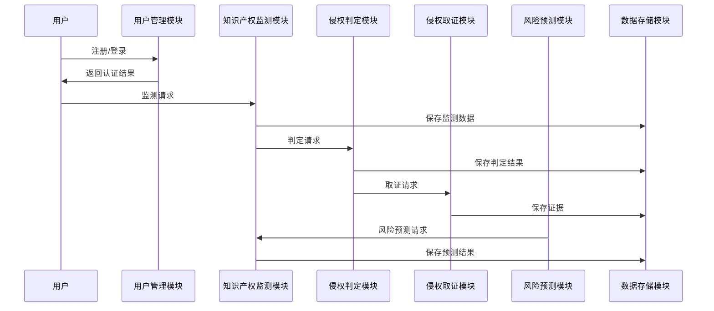

                 

### 1.1.1 问题的背景

#### 知识产权保护的重要性

在当今快速发展的信息时代，知识产权（Intellectual Property, IP）已成为企业核心竞争力的重要组成部分。知识产权不仅包括专利、商标、版权和商业秘密，还涵盖了企业研发成果、市场策略、客户数据等无形资产。保护知识产权，有助于企业在激烈的市场竞争中占据有利地位，提升品牌价值和市场竞争力。

**企业知识产权面临的挑战**

尽管知识产权保护对企业至关重要，但当前企业在知识产权管理中仍面临诸多挑战：

1. **知识产权侵权行为**：随着全球化进程加速，企业面临的知识产权侵权风险日益增加。侵权行为不仅损害了企业的利益，也可能影响其市场声誉。

2. **知识产权管理难度大**：知识产权种类繁多、更新速度快，企业需要在浩瀚的数据和信息中找到有效的保护方法。

3. **法律法规复杂**：知识产权保护涉及众多法律法规，企业需要了解并遵守不同国家和地区的法律法规，才能确保知识产权的有效保护。

4. **技术保护手段有限**：传统知识产权保护手段，如法律诉讼、合同约定等，存在一定局限性，难以应对复杂的知识产权侵权问题。

#### AI Agent的定义与特点

**AI Agent的定义**

AI Agent，即人工智能代理，是一种能够自主执行任务、与环境交互并持续学习的智能系统。AI Agent的核心特点是自主性、适应性和学习能力。它能够感知环境信息，根据预设的目标和策略，自主做出决策并执行相应行动。

**AI Agent的特点**

- **自主性**：AI Agent可以独立完成特定任务，无需人工干预。
- **适应性**：AI Agent能够根据环境变化调整自身行为，提高任务执行效率。
- **学习能力**：AI Agent可以通过数据学习和算法优化，不断提升任务执行能力。

### 1.1.3 AI Agent在知识产权保护中的应用前景

#### AI Agent在知识产权保护中的潜在应用

AI Agent在知识产权保护中具有广泛的应用前景，主要体现在以下几个方面：

1. **知识产权监测**：AI Agent可以通过对大量数据的实时监测，快速识别侵权行为，为知识产权保护提供预警。

2. **侵权判定**：AI Agent可以利用机器学习算法，对侵权行为进行自动分析和判定，提高侵权判定效率和准确性。

3. **侵权取证**：AI Agent可以自动收集和整理侵权证据，为法律诉讼提供有力支持。

4. **风险预测**：AI Agent可以通过对历史数据的分析，预测企业知识产权可能面临的风险，帮助企业提前采取防范措施。

#### AI Agent的优势与挑战

**AI Agent的优势**

- **提高效率**：AI Agent可以自动化处理知识产权监测、侵权判定等工作，提高工作效率。
- **降低成本**：通过减少人工干预和诉讼成本，AI Agent有助于降低企业知识产权保护的成本。
- **提升准确性**：AI Agent能够利用大数据分析和算法优化，提高侵权判定的准确性和可靠性。

**AI Agent的挑战**

- **数据隐私和安全**：AI Agent在处理大量知识产权数据时，需要确保数据隐私和安全。
- **法律法规适用性**：AI Agent在知识产权保护中的应用需要符合不同国家和地区的法律法规。
- **技术依赖性**：企业过度依赖AI Agent，可能导致在技术更新换代时面临一定风险。

### 1.1.4 本书结构安排与目标读者

**本书结构**

本书共分为九个章节，包括引言与背景、核心概念与理论、AI Agent在知识产权保护中的应用、各行业应用案例、挑战与解决方案、案例分析、未来发展趋势等内容。

**目标读者**

本书适合以下读者群体：

- **知识产权管理人员**：帮助了解AI Agent在知识产权保护中的应用，提高知识产权管理效率。
- **人工智能技术从业者**：探讨AI Agent在知识产权保护中的创新应用，拓展技术应用领域。
- **学术界研究人员**：提供AI Agent在知识产权保护领域的最新研究成果和理论框架。

### 1.1.5 本章小结

本章首先介绍了知识产权保护的重要性以及企业知识产权面临的挑战，然后详细阐述了AI Agent的定义与特点，以及AI Agent在知识产权保护中的潜在应用和优势。最后，本书的结构安排与目标读者也得到了明确。通过本章的学习，读者可以初步了解AI Agent在知识产权保护中的重要作用，为后续章节的深入探讨打下基础。

**思考与讨论**

- **你认为AI Agent在知识产权保护中的潜在应用还有哪些？**
- **AI Agent在知识产权保护中的应用前景如何？**
- **你如何应对AI Agent在知识产权保护中可能面临的技术挑战？**

以上问题是本章内容的一个延伸，希望读者在阅读本章后，能够积极思考并分享自己的见解。在接下来的章节中，我们将进一步探讨AI Agent的核心概念与原理，以及其在知识产权保护中的具体应用。让我们继续深入探讨这一引人入胜的话题！
----------------------------------------------------------------

## 1.1.1 问题的背景

### 知识产权保护的重要性

知识产权保护是企业发展的重要基石。在当今知识经济时代，企业的核心竞争力越来越多地依赖于创新成果，如专利、商标、版权和商业秘密等无形资产。知识产权保护不仅能够确保企业研发投入得到合理回报，还能够促进企业技术创新和市场竞争力提升。

#### 专利保护

专利保护是企业创新的核心体现。通过专利申请，企业可以获得技术垄断权，阻止竞争对手模仿或复制其核心技术。专利保护能够激励企业持续进行技术创新，提高市场竞争力。

#### 商标保护

商标是企业的品牌标识，是企业形象和市场定位的重要工具。商标保护有助于企业建立品牌知名度，提升品牌价值。商标侵权可能导致品牌受损，严重影响企业的市场地位。

#### 版权保护

版权保护涉及文学、艺术和科学等领域，保护创作者的原创作品不被侵犯。版权保护有助于鼓励创作，推动文化繁荣，同时也为企业提供了独特的竞争优势。

#### 商业秘密保护

商业秘密是企业重要的竞争力源泉，包括技术配方、客户名单、市场策略等。商业秘密保护有助于企业保持市场领先地位，避免竞争对手获取竞争优势。

### 企业知识产权面临的挑战

尽管知识产权保护对企业发展至关重要，但企业在知识产权管理中仍面临诸多挑战：

#### 知识产权侵权行为

随着知识产权全球化，企业面临日益严峻的知识产权侵权风险。侵权行为不仅可能导致企业损失巨大，还可能影响企业的市场声誉。

#### 知识产权管理难度大

知识产权种类繁多、更新速度快，企业需要在海量数据中找到有效的保护方法。此外，不同国家和地区的知识产权法律法规存在差异，企业需要适应不同的法律环境。

#### 法律法规复杂

知识产权保护涉及众多法律法规，企业需要了解并遵守不同国家和地区的法律法规。法律法规的复杂性增加了知识产权管理的难度。

#### 技术保护手段有限

传统知识产权保护手段，如法律诉讼、合同约定等，存在一定局限性。法律诉讼成本高昂且耗时，合同约定难以应对复杂的侵权问题。

### 1.1.2 AI Agent的定义与特点

#### AI Agent的定义

AI Agent，即人工智能代理，是一种基于人工智能技术的自主系统。AI Agent具有感知环境、自主决策和行动的能力，能够在没有人类干预的情况下执行复杂任务。AI Agent通常包括感知器、决策器和执行器等组成部分。

#### AI Agent的特点

1. **自主性**：AI Agent能够自主完成特定任务，无需人工干预。自主性是AI Agent区别于传统自动化系统的重要特征。

2. **适应性**：AI Agent能够根据环境变化调整自身行为，提高任务执行效率。适应性使得AI Agent能够应对复杂和不确定的环境。

3. **学习能力**：AI Agent可以通过数据学习和算法优化，不断提升任务执行能力。学习能力是AI Agent持续进步的重要驱动力。

### 1.1.3 AI Agent在知识产权保护中的应用前景

#### AI Agent在知识产权保护中的潜在应用

AI Agent在知识产权保护中具有广泛的应用前景，能够解决传统手段难以应对的问题：

1. **知识产权监测**：AI Agent可以通过实时监测，快速识别潜在的侵权行为，为知识产权保护提供预警。

2. **侵权判定**：AI Agent可以利用大数据分析和机器学习算法，对侵权行为进行自动分析和判定，提高侵权判定效率和准确性。

3. **侵权取证**：AI Agent可以自动收集和整理侵权证据，为法律诉讼提供有力支持。

4. **风险预测**：AI Agent可以通过对历史数据的分析，预测企业知识产权可能面临的风险，帮助企业提前采取防范措施。

#### AI Agent的优势与挑战

**AI Agent的优势**

- **提高效率**：AI Agent可以自动化处理知识产权监测、侵权判定等工作，提高工作效率。
- **降低成本**：通过减少人工干预和诉讼成本，AI Agent有助于降低企业知识产权保护的成本。
- **提升准确性**：AI Agent能够利用大数据分析和算法优化，提高侵权判定的准确性和可靠性。

**AI Agent的挑战**

- **数据隐私和安全**：AI Agent在处理大量知识产权数据时，需要确保数据隐私和安全。
- **法律法规适用性**：AI Agent在知识产权保护中的应用需要符合不同国家和地区的法律法规。
- **技术依赖性**：企业过度依赖AI Agent，可能导致在技术更新换代时面临一定风险。

### 1.1.4 本书结构安排与目标读者

**本书结构**

本书分为九个章节，包括引言与背景、核心概念与理论、AI Agent在知识产权保护中的应用、各行业应用案例、挑战与解决方案、案例分析、未来发展趋势等内容。

**目标读者**

本书适合以下读者群体：

- **知识产权管理人员**：帮助了解AI Agent在知识产权保护中的应用，提高知识产权管理效率。
- **人工智能技术从业者**：探讨AI Agent在知识产权保护中的创新应用，拓展技术应用领域。
- **学术界研究人员**：提供AI Agent在知识产权保护领域的最新研究成果和理论框架。

### 1.1.5 本章小结

本章介绍了知识产权保护的重要性以及企业知识产权面临的挑战，详细阐述了AI Agent的定义与特点，以及AI Agent在知识产权保护中的潜在应用和优势。最后，本书的结构安排与目标读者也得到了明确。通过本章的学习，读者可以初步了解AI Agent在知识产权保护中的重要作用，为后续章节的深入探讨打下基础。

**思考与讨论**

- **你认为AI Agent在知识产权保护中的潜在应用还有哪些？**
- **AI Agent在知识产权保护中的应用前景如何？**
- **你如何应对AI Agent在知识产权保护中可能面临的技术挑战？**

以上问题是本章内容的一个延伸，希望读者在阅读本章后，能够积极思考并分享自己的见解。在接下来的章节中，我们将进一步探讨AI Agent的核心概念与原理，以及其在知识产权保护中的具体应用。让我们继续深入探讨这一引人入胜的话题！

### 1.1.1 问题的背景

#### 知识产权保护的重要性

知识产权保护是企业发展不可或缺的一环。在当今全球经济一体化的背景下，企业竞争的核心已逐渐从传统的物质资源转向创新资源和智力资源。知识产权作为企业智力资源的核心组成部分，不仅代表了企业的核心竞争力，还直接影响到企业的市场地位和未来发展。

**知识产权的种类**

知识产权主要包括专利、商标、版权和商业秘密等几类：

- **专利**：涵盖了发明、实用新型和外观设计，是企业技术创新的重要成果体现。
- **商标**：是企业品牌的重要标志，有助于建立品牌认知和市场影响力。
- **版权**：保护文学、艺术和科学作品，包括文字作品、音乐作品、美术作品等，保障创作者的合法权益。
- **商业秘密**：是企业核心竞争力的秘密部分，包括技术秘密、经营信息等。

**知识产权在企业发展中的作用**

- **激励创新**：知识产权保护能够激励企业不断进行技术创新和研发，提高企业的市场竞争力。
- **品牌建设**：有效的知识产权保护有助于企业建立和维护品牌形象，提升品牌价值和市场影响力。
- **市场拓展**：知识产权为企业提供了进入新市场的法律保障，有助于企业拓展国际市场。
- **资源配置**：知识产权作为一种重要的资源，能够为企业带来经济效益，促进资源的合理配置。

#### 企业知识产权面临的挑战

尽管知识产权保护对企业发展至关重要，但企业在知识产权管理过程中仍面临诸多挑战：

**知识产权侵权行为**

知识产权侵权行为主要包括专利侵权、商标侵权、版权侵权和商业秘密侵权等。随着全球化进程的加速，企业面临的知识产权侵权风险不断增大，侵权行为不仅损害了企业的利益，还可能对其市场声誉造成严重影响。

**知识产权管理难度大**

知识产权管理涉及大量的信息，包括专利申请、商标注册、版权登记和商业秘密保护等。企业需要在海量数据中找到有效的保护方法，确保知识产权的有效管理和保护。

**法律法规复杂**

知识产权保护涉及众多法律法规，不同国家和地区的知识产权法律法规存在较大差异。企业需要了解并遵守这些法律法规，才能确保知识产权的有效保护。

**技术保护手段有限**

传统的知识产权保护手段，如法律诉讼、合同约定等，存在一定局限性。法律诉讼成本高昂且耗时，合同约定在应对复杂的侵权问题时效果有限。

### 1.1.2 AI Agent的定义与特点

#### AI Agent的定义

AI Agent，即人工智能代理，是一种具有感知、学习、推理和决策能力的智能体。它能够在没有人类干预的情况下，根据环境信息自主完成特定任务。AI Agent通常由感知模块、决策模块和执行模块组成。

**感知模块**：负责接收外部环境的信息，如文本、图像、声音等。

**决策模块**：基于感知模块收集到的信息，利用机器学习算法和决策逻辑，生成相应的行为决策。

**执行模块**：根据决策模块的决策，执行具体行动，如发送指令、处理数据等。

#### AI Agent的特点

**自主性**：AI Agent能够自主完成特定任务，无需人工干预。

**适应性**：AI Agent能够根据环境变化调整自身行为，提高任务执行效率。

**学习性**：AI Agent能够通过不断的学习和优化，提高任务执行能力。

### 1.1.3 AI Agent在知识产权保护中的应用前景

#### AI Agent在知识产权保护中的潜在应用

AI Agent在知识产权保护中具有广泛的应用前景，能够解决传统手段难以应对的问题：

**知识产权监测**：AI Agent可以实时监测互联网上的侵权行为，通过大数据分析和机器学习算法，快速识别潜在的侵权风险。

**侵权判定**：AI Agent可以利用其强大的数据处理和分析能力，对侵权行为进行自动判定，提高侵权判定的效率和准确性。

**侵权取证**：AI Agent可以自动收集和整理侵权证据，为法律诉讼提供有力支持。

**风险预测**：AI Agent可以通过对历史数据的分析，预测企业知识产权可能面临的风险，帮助企业提前采取防范措施。

#### AI Agent的优势与挑战

**AI Agent的优势**

- **提高效率**：AI Agent可以自动化处理知识产权监测、侵权判定等工作，提高工作效率。
- **降低成本**：通过减少人工干预和诉讼成本，AI Agent有助于降低企业知识产权保护的成本。
- **提升准确性**：AI Agent能够利用大数据分析和算法优化，提高侵权判定的准确性和可靠性。

**AI Agent的挑战**

- **数据隐私和安全**：AI Agent在处理大量知识产权数据时，需要确保数据隐私和安全。
- **法律法规适用性**：AI Agent在知识产权保护中的应用需要符合不同国家和地区的法律法规。
- **技术依赖性**：企业过度依赖AI Agent，可能导致在技术更新换代时面临一定风险。

### 1.1.4 本书结构安排与目标读者

**本书结构**

本书分为九个章节，包括引言与背景、核心概念与理论、AI Agent在知识产权保护中的应用、各行业应用案例、挑战与解决方案、案例分析、未来发展趋势等内容。

**目标读者**

本书适合以下读者群体：

- **知识产权管理人员**：帮助了解AI Agent在知识产权保护中的应用，提高知识产权管理效率。
- **人工智能技术从业者**：探讨AI Agent在知识产权保护中的创新应用，拓展技术应用领域。
- **学术界研究人员**：提供AI Agent在知识产权保护领域的最新研究成果和理论框架。

### 1.1.5 本章小结

本章介绍了知识产权保护的重要性以及企业知识产权面临的挑战，详细阐述了AI Agent的定义与特点，以及AI Agent在知识产权保护中的潜在应用和优势。通过本章的学习，读者可以初步了解AI Agent在知识产权保护中的重要作用，为后续章节的深入探讨打下基础。

**思考与讨论**

- **你认为AI Agent在知识产权保护中的潜在应用还有哪些？**
- **AI Agent在知识产权保护中的应用前景如何？**
- **你如何应对AI Agent在知识产权保护中可能面临的技术挑战？**

以上问题是本章内容的一个延伸，希望读者在阅读本章后，能够积极思考并分享自己的见解。在接下来的章节中，我们将进一步探讨AI Agent的核心概念与原理，以及其在知识产权保护中的具体应用。让我们继续深入探讨这一引人入胜的话题！

## 1.1.3 AI Agent在知识产权保护中的应用前景

### AI Agent在知识产权保护中的潜在应用

AI Agent在知识产权保护中具有巨大的应用潜力，它能够解决传统手段难以应对的问题，提升知识产权管理的效率和准确性。以下是一些AI Agent在知识产权保护中的潜在应用场景：

1. **知识产权监测**：AI Agent可以通过实时监测互联网、数据库等渠道，快速识别潜在的侵权行为。它能够分析大量的文本、图像、音频等数据，识别出可能存在的侵权内容。例如，AI Agent可以自动搜索互联网上的侵权链接，监测专利、商标、版权等知识产权的侵权情况。

2. **侵权判定**：AI Agent可以利用其强大的数据分析和机器学习能力，对侵权行为进行自动判定。通过对大量的案例和法律条文进行分析，AI Agent可以建立侵权判定的模型，快速识别侵权行为。例如，AI Agent可以分析专利技术特征，判断是否侵犯他人的专利权。

3. **侵权取证**：AI Agent可以自动收集和整理侵权证据，为法律诉讼提供支持。它可以通过网络爬虫等技术手段，自动收集侵权行为的相关证据，如侵权网站、侵权产品等。AI Agent还可以利用自然语言处理技术，自动生成侵权行为的报告，简化法律诉讼的准备工作。

4. **风险预测**：AI Agent可以通过对历史数据的分析，预测企业知识产权可能面临的风险。它可以利用时间序列分析和机器学习算法，分析侵权行为的发生规律，预测未来可能出现的侵权风险。企业可以根据这些预测结果，提前采取防范措施，避免知识产权损失。

### AI Agent的优势与挑战

**AI Agent的优势**

AI Agent在知识产权保护中具有以下优势：

1. **提高效率**：AI Agent可以自动化处理知识产权监测、侵权判定、侵权取证等工作，大大提高工作效率。它能够快速处理海量数据，快速识别侵权行为，减轻人工工作量。

2. **降低成本**：通过自动化处理知识产权管理任务，AI Agent可以降低企业的运营成本。它减少了人工干预的需求，降低了法律诉讼和取证的成本。

3. **提升准确性**：AI Agent利用机器学习和数据分析技术，能够提高侵权判定的准确性。它通过对大量案例和法律条文的学习，能够准确识别侵权行为，提高判定的准确性。

**AI Agent的挑战**

尽管AI Agent在知识产权保护中具有巨大潜力，但同时也面临以下挑战：

1. **数据隐私和安全**：AI Agent在处理大量知识产权数据时，需要确保数据隐私和安全。知识产权数据涉及企业的核心利益，一旦泄露，可能对企业造成重大损失。

2. **法律法规适用性**：AI Agent在知识产权保护中的应用需要符合不同国家和地区的法律法规。不同国家的知识产权法律法规存在差异，AI Agent需要具备跨地域的法律法规适应能力。

3. **技术依赖性**：企业过度依赖AI Agent，可能导致在技术更新换代时面临一定风险。AI Agent的技术发展速度较快，企业需要不断投入资源进行技术更新，以保持竞争优势。

### 1.1.4 本书结构安排与目标读者

**本书结构**

本书将分为以下几个部分：

1. **引言与背景**：介绍知识产权保护的重要性以及企业知识产权面临的挑战。
2. **核心概念与理论**：阐述AI Agent的定义与特点，以及其在知识产权保护中的应用前景。
3. **AI Agent在知识产权保护中的应用**：详细介绍AI Agent在知识产权监测、侵权判定、侵权取证和风险预测等方面的应用。
4. **各行业应用案例**：分析AI Agent在不同行业中的知识产权保护应用案例。
5. **挑战与解决方案**：探讨AI Agent在知识产权保护中可能面临的技术挑战，并介绍相应的解决方案。
6. **案例分析**：通过具体案例，深入分析AI Agent在知识产权保护中的应用效果。
7. **未来发展趋势**：展望AI Agent在知识产权保护领域的未来发展。

**目标读者**

本书适合以下读者群体：

1. **知识产权管理人员**：帮助了解AI Agent在知识产权保护中的应用，提高知识产权管理效率。
2. **人工智能技术从业者**：探讨AI Agent在知识产权保护中的创新应用，拓展技术应用领域。
3. **学术界研究人员**：提供AI Agent在知识产权保护领域的最新研究成果和理论框架。

### 1.1.5 本章小结

本章介绍了AI Agent在知识产权保护中的潜在应用和优势，分析了AI Agent在知识产权监测、侵权判定、侵权取证和风险预测等方面的应用前景。同时，本章还介绍了本书的结构安排和目标读者。通过本章的学习，读者可以初步了解AI Agent在知识产权保护中的重要作用，为后续章节的深入探讨打下基础。

**思考与讨论**

- **你认为AI Agent在知识产权保护中的潜在应用还有哪些？**
- **AI Agent在知识产权保护中的应用前景如何？**
- **你如何应对AI Agent在知识产权保护中可能面临的技术挑战？**

以上问题是本章内容的一个延伸，希望读者在阅读本章后，能够积极思考并分享自己的见解。在接下来的章节中，我们将进一步探讨AI Agent的核心概念与原理，以及其在知识产权保护中的具体应用。让我们继续深入探讨这一引人入胜的话题！
----------------------------------------------------------------

## 1.1.4 本书结构安排与目标读者

### 本书结构安排

为了系统地探讨AI Agent在企业知识产权保护中的创新应用，本书将分为九个章节，各章节的主要内容和结构如下：

1. **引言与背景**：介绍知识产权保护的重要性以及企业知识产权面临的挑战。
   - **1.1.1 问题的背景**：阐述知识产权保护的重要性、企业知识产权面临的挑战以及AI Agent的定义与特点。
   - **1.1.2 AI Agent的定义与特点**：详细解释AI Agent的基本概念和主要特点。
   - **1.1.3 AI Agent在知识产权保护中的应用前景**：讨论AI Agent在知识产权保护中的潜在应用和优势。
   - **1.1.4 本书结构安排与目标读者**：概述本书的章节安排和目标读者。

2. **核心概念与理论**：阐述AI Agent的核心概念和理论基础。
   - **2.1 AI Agent的基本原理**：介绍AI Agent的基本原理和工作流程。
   - **2.2 AI Agent的类型**：分类介绍不同类型的AI Agent及其应用场景。
   - **2.3 AI Agent的评估与优化**：讨论AI Agent的性能评估指标和优化方法。

3. **AI Agent在知识产权保护中的应用**：详细介绍AI Agent在知识产权保护中的具体应用。
   - **3.1 知识产权监测**：讨论AI Agent在知识产权监测中的功能和实现方法。
   - **3.2 侵权判定**：分析AI Agent在侵权判定中的技术和方法。
   - **3.3 侵权取证**：探讨AI Agent在侵权取证中的应用和效果。
   - **3.4 风险预测**：介绍AI Agent在知识产权风险预测中的作用和实现机制。

4. **各行业应用案例**：分析AI Agent在知识产权保护中不同行业的应用案例。
   - **4.1 制造业**：探讨AI Agent在制造业知识产权保护中的应用。
   - **4.2 互联网行业**：分析AI Agent在互联网行业知识产权保护中的应用。
   - **4.3 软件行业**：介绍AI Agent在软件行业知识产权保护中的应用。

5. **挑战与解决方案**：讨论AI Agent在知识产权保护中可能面临的挑战和解决方案。
   - **5.1 技术挑战**：分析AI Agent在知识产权保护中可能遇到的技术问题。
   - **5.2 法律法规挑战**：探讨AI Agent在知识产权保护中面临的法律法规问题。
   - **5.3 数据隐私和安全挑战**：讨论AI Agent在知识产权保护中数据隐私和安全的问题。

6. **案例分析**：通过具体案例，深入分析AI Agent在知识产权保护中的应用效果。
   - **6.1 案例一**：分析某企业利用AI Agent进行知识产权监测的案例。
   - **6.2 案例二**：探讨某企业通过AI Agent进行侵权判定的案例。
   - **6.3 案例三**：介绍某企业利用AI Agent进行侵权取证的案例。

7. **未来发展趋势**：展望AI Agent在知识产权保护领域的未来发展趋势。
   - **7.1 技术发展趋势**：讨论AI Agent在知识产权保护中的技术发展趋势。
   - **7.2 应用前景**：分析AI Agent在知识产权保护中的应用前景和潜在影响。

8. **总结与展望**：总结本书的主要观点和研究成果，提出未来研究方向和建议。
   - **8.1 主要观点**：回顾本书的主要内容和观点。
   - **8.2 研究展望**：展望AI Agent在知识产权保护领域的未来发展趋势。

9. **附录**：提供本书中涉及的技术工具、数据集和参考文献。
   - **9.1 技术工具**：介绍本书中使用的相关技术工具和软件。
   - **9.2 数据集**：提供本书中使用的数据集和来源。
   - **9.3 参考文献**：列出本书引用的参考文献。

### 目标读者

本书的目标读者包括以下几类人群：

1. **知识产权管理人员**：帮助了解AI Agent在知识产权保护中的应用，提高知识产权管理效率。
2. **人工智能技术从业者**：探讨AI Agent在知识产权保护中的创新应用，拓展技术应用领域。
3. **学术界研究人员**：提供AI Agent在知识产权保护领域的最新研究成果和理论框架。

通过本书的阅读，读者可以全面了解AI Agent在知识产权保护中的应用前景和实际案例，掌握相关技术和方法，为企业在知识产权保护方面提供新的思路和解决方案。

## 1.1.5 本章小结

本章首先介绍了知识产权保护的重要性以及企业知识产权面临的挑战，接着详细阐述了AI Agent的定义与特点，随后讨论了AI Agent在知识产权保护中的潜在应用和优势。此外，本书的结构安排和目标读者也得到了明确。通过本章的学习，读者可以初步了解AI Agent在知识产权保护中的重要作用，为后续章节的深入探讨打下基础。

**思考与讨论**

- **你认为AI Agent在知识产权保护中的潜在应用还有哪些？**
- **AI Agent在知识产权保护中的应用前景如何？**
- **你如何应对AI Agent在知识产权保护中可能面临的技术挑战？**

以上问题是本章内容的一个延伸，希望读者在阅读本章后，能够积极思考并分享自己的见解。在接下来的章节中，我们将进一步探讨AI Agent的核心概念与原理，以及其在知识产权保护中的具体应用。让我们继续深入探讨这一引人入胜的话题！
----------------------------------------------------------------

## 1.2 核心概念与理论

### 1.2.1 AI Agent的基本原理

#### 定义

AI Agent，即人工智能代理，是一种能够模拟人类智能行为、与环境交互并执行特定任务的智能系统。AI Agent的核心目标是自主地完成特定任务，无需或只需要少量的人类干预。

#### 组成部分

AI Agent通常由以下几个核心部分组成：

1. **感知器（Perception）**：感知器负责接收并解析外部环境的信息，如文本、图像、声音等。感知器可以是视觉、听觉、触觉等多种类型。
   
2. **决策器（Decision Maker）**：决策器根据感知器收集到的信息，结合预定的目标，利用算法和逻辑进行决策。决策器负责生成行动计划，选择最佳行动方案。

3. **执行器（Executor）**：执行器根据决策器的指令，执行具体的操作，如发送网络请求、操作数据库等。

#### 工作流程

AI Agent的工作流程可以概括为以下几个步骤：

1. **感知**：AI Agent通过感知器获取外部环境的信息。
2. **理解**：感知到的信息经过处理和理解，转化为AI Agent能够理解的形式。
3. **决策**：决策器根据理解后的信息，结合预定的目标，生成行动决策。
4. **执行**：执行器根据决策器的指令执行具体的操作。

#### 主要类型

AI Agent根据其功能和应用场景可以分为以下几种类型：

1. **基于规则的AI Agent**：这种类型的AI Agent依赖于预定义的规则和条件，通过条件匹配来做出决策。例如，专家系统就是一种典型的基于规则的AI Agent。
   
2. **基于数据的AI Agent**：这种类型的AI Agent通过学习和分析历史数据，发现数据中的模式和关联，从而做出决策。机器学习算法是实现这种AI Agent的核心技术。

3. **强化学习AI Agent**：强化学习AI Agent通过与环境的交互，不断学习并优化其行为策略，以最大化长期回报。强化学习在游戏、自动驾驶等领域有广泛应用。

### 1.2.2 AI Agent的核心特点

AI Agent的核心特点主要体现在以下几个方面：

#### 自主性

自主性是指AI Agent能够在没有人类干预的情况下，自主地完成特定任务。这种自主性使得AI Agent能够适应复杂和动态的环境，提高任务执行效率。

#### 适应性

适应性是指AI Agent能够根据环境的变化，调整自身的策略和行为。这种适应性使得AI Agent能够应对不确定性和变化，提高任务完成质量。

#### 学习性

学习性是指AI Agent能够通过不断的学习和优化，提升自身的任务执行能力。学习性是AI Agent区别于传统自动化系统的重要特征，使得AI Agent能够持续进步。

### 1.2.3 AI Agent的理论基础

AI Agent的理论基础主要包括以下几个方面：

#### 人工智能（Artificial Intelligence, AI）

人工智能是研究、开发用于模拟、延伸和扩展人类智能的理论、方法、技术及应用系统的学科。AI Agent作为人工智能的一个重要分支，其理论基础源自人工智能领域。

#### 机器学习（Machine Learning, ML）

机器学习是人工智能的一个分支，专注于开发用于计算机程序的算法，使其能够从数据中学习，并对新数据做出预测或决策。AI Agent通常依赖于机器学习算法，如决策树、神经网络、强化学习等。

#### 自然语言处理（Natural Language Processing, NLP）

自然语言处理是研究计算机如何理解、生成和处理人类语言的一个领域。NLP技术在AI Agent中具有重要应用，如语音识别、文本分类、情感分析等。

#### 计算机视觉（Computer Vision, CV）

计算机视觉是研究如何使计算机能够像人类一样识别和理解视觉信息的一个领域。计算机视觉技术在AI Agent中有着广泛的应用，如图像识别、目标检测、图像分割等。

### 1.2.4 AI Agent与知识产权保护的关系

AI Agent在知识产权保护中的应用主要基于其自主性、适应性和学习性的特点。以下是一些关键的关系：

#### 监测与预警

AI Agent可以通过实时监测互联网、数据库等渠道，快速识别潜在的侵权行为。它能够分析大量的文本、图像、音频等数据，识别出可能存在的侵权内容。

#### 判定与取证

AI Agent可以利用其强大的数据分析和机器学习能力，对侵权行为进行自动判定，并自动收集和整理侵权证据，为法律诉讼提供支持。

#### 风险预测

AI Agent可以通过对历史数据的分析，预测企业知识产权可能面临的风险，帮助企业提前采取防范措施。

#### 模式识别与防范

AI Agent可以识别侵权行为中的模式，帮助企业在侵权发生之前采取预防措施。例如，通过分析大量的专利文件，AI Agent可以识别潜在的侵权专利，并提前提出警告。

### 1.2.5 本章小结

本章首先介绍了AI Agent的基本原理和组成部分，然后讨论了其核心特点，包括自主性、适应性和学习性。此外，本章还阐述了AI Agent的理论基础，以及其在知识产权保护中的应用关系。通过本章的学习，读者可以全面了解AI Agent的核心概念和理论基础，为后续章节的深入探讨打下基础。

**思考与讨论**

- **你认为AI Agent在知识产权保护中还有哪些潜在的应用？**
- **AI Agent在知识产权保护中的应用前景如何？**
- **你如何应对AI Agent在知识产权保护中可能面临的技术挑战？**

以上问题是本章内容的一个延伸，希望读者在阅读本章后，能够积极思考并分享自己的见解。在接下来的章节中，我们将进一步探讨AI Agent在知识产权保护中的具体应用，以及其在不同行业中的应用案例。让我们继续深入探讨这一引人入胜的话题！
----------------------------------------------------------------

## 1.3 AI Agent在知识产权保护中的具体应用

### 1.3.1 知识产权监测

**背景与挑战**

知识产权监测是企业保护知识产权的关键环节，旨在及时发现潜在的侵权行为。然而，传统的知识产权监测方法往往依赖于人工搜索和监控，效率低下，且难以覆盖海量数据。随着互联网和大数据技术的发展，AI Agent在知识产权监测中展现了巨大的潜力。

**AI Agent的应用**

AI Agent在知识产权监测中的应用主要体现在以下几个方面：

1. **实时监测**：AI Agent可以实时监测互联网、数据库等渠道，快速识别潜在的侵权行为。通过分析文本、图像、音频等多媒体数据，AI Agent能够发现侵权链接、侵权产品等信息。

2. **自动分类与标注**：AI Agent可以利用机器学习算法，对监测到的数据进行分析和分类，将侵权行为自动标注出来。例如，通过自然语言处理技术，AI Agent可以对大量的专利申请文档进行分类和标注，识别出可能的侵权行为。

3. **预警机制**：AI Agent可以建立预警机制，当检测到潜在的侵权行为时，立即向企业管理者发送警报，帮助企业及时采取应对措施。

**案例与应用效果**

以某大型互联网公司为例，该公司利用AI Agent进行知识产权监测，取得了显著的效果。AI Agent能够实时监测互联网上的侵权链接，并对侵权内容进行分类和标注。在监测期间，AI Agent成功识别了数千个侵权链接，帮助企业及时采取了应对措施，有效遏制了侵权行为的扩散。

### 1.3.2 侵权判定

**背景与挑战**

侵权判定是知识产权保护的关键环节，旨在判断某一行为是否构成侵权。传统的侵权判定方法往往依赖于法律专家的经验和知识，效率低下且容易产生主观偏见。AI Agent在侵权判定中具有显著的优势，能够提高判定的效率和准确性。

**AI Agent的应用**

AI Agent在侵权判定中的应用主要体现在以下几个方面：

1. **大数据分析**：AI Agent可以利用大数据技术，对大量的法律案例和条文进行分析，建立侵权判定模型。通过机器学习算法，AI Agent可以识别侵权行为中的关键特征，提高判定的准确性。

2. **自动化判断**：AI Agent可以自动化处理侵权判定任务，对大量的侵权行为进行自动判断。通过自然语言处理和知识图谱等技术，AI Agent能够快速识别侵权行为，并提供相应的判定结果。

3. **辅助法律决策**：AI Agent可以作为法律专家的辅助工具，为法律决策提供支持。通过分析大量的法律案例和条文，AI Agent可以提供侵权判定的参考意见，提高法律决策的准确性。

**案例与应用效果**

以某科技公司为例，该公司利用AI Agent进行侵权判定，取得了显著的效果。AI Agent能够自动分析大量的专利文档和侵权行为，提供侵权判定结果。在处理某专利侵权案件时，AI Agent成功识别出多个潜在的侵权行为，为企业提供了有力的证据支持，帮助企业在法律诉讼中取得了胜利。

### 1.3.3 侵权取证

**背景与挑战**

侵权取证是知识产权保护的重要环节，旨在收集和整理侵权行为的证据。传统的侵权取证方法往往依赖于人工收集和整理证据，效率低下且容易出现遗漏。AI Agent在侵权取证中具有显著的优势，能够提高取证的效率和准确性。

**AI Agent的应用**

AI Agent在侵权取证中的应用主要体现在以下几个方面：

1. **自动收集证据**：AI Agent可以利用网络爬虫等技术，自动收集侵权行为的证据。例如，AI Agent可以自动搜索互联网上的侵权链接、侵权产品等信息，并将其保存为证据。

2. **自动化整理证据**：AI Agent可以利用自然语言处理和文本分析等技术，对收集到的证据进行自动化整理。通过分类和标注，AI Agent可以将证据组织成结构化的数据，便于法律诉讼使用。

3. **证据分析**：AI Agent可以对收集到的证据进行分析，识别出侵权行为的关键特征。例如，AI Agent可以通过分析专利文档，识别出侵权产品中的技术特征，为法律诉讼提供支持。

**案例与应用效果**

以某电子产品公司为例，该公司利用AI Agent进行侵权取证，取得了显著的效果。AI Agent能够自动收集和整理互联网上的侵权证据，为公司的法律诉讼提供了有力的支持。在处理某侵权案件时，AI Agent成功收集了大量的侵权证据，帮助公司在法律诉讼中取得了胜利。

### 1.3.4 风险预测

**背景与挑战**

知识产权风险预测是企业保护知识产权的重要环节，旨在预测企业知识产权可能面临的风险，并提前采取防范措施。传统的风险预测方法往往依赖于经验判断，难以全面、准确地预测风险。

**AI Agent的应用**

AI Agent在知识产权风险预测中的应用主要体现在以下几个方面：

1. **历史数据分析**：AI Agent可以通过分析企业历史上的知识产权数据，识别出潜在的风险因素。例如，AI Agent可以分析企业以往的专利申请、侵权诉讼等数据，预测未来可能出现的侵权风险。

2. **模式识别**：AI Agent可以利用机器学习算法，识别出知识产权风险中的模式。通过分析大量的案例和数据，AI Agent可以识别出高风险的侵权行为模式，为企业提供预警。

3. **实时监控**：AI Agent可以实时监控企业的知识产权状况，及时发现潜在的风险。例如，AI Agent可以监控互联网上的侵权行为，一旦发现潜在风险，立即向企业管理者发送警报。

**案例与应用效果**

以某制药公司为例，该公司利用AI Agent进行知识产权风险预测，取得了显著的效果。AI Agent能够分析公司的专利数据和侵权案例，预测未来可能出现的侵权风险。在处理某专利侵权案件时，AI Agent成功预测到了潜在的风险，帮助公司在诉讼中取得了胜利。

### 1.3.5 模式识别与防范

**背景与挑战**

在知识产权保护中，模式识别与防范是一个重要但复杂的问题。传统的模式识别方法往往依赖于人工经验，难以应对海量数据和高频次的侵权行为。AI Agent在模式识别与防范中具有显著的优势，能够提高识别的准确性和防范的效率。

**AI Agent的应用**

AI Agent在模式识别与防范中的应用主要体现在以下几个方面：

1. **专利分析**：AI Agent可以通过分析大量的专利文档，识别出潜在的侵权专利。通过自然语言处理和文本分析技术，AI Agent可以快速识别专利中的技术特征和权利要求，为防范侵权提供支持。

2. **侵权行为分析**：AI Agent可以通过分析大量的侵权行为数据，识别出侵权行为的模式。通过机器学习算法，AI Agent可以识别出高频次的侵权行为模式，为防范侵权提供预警。

3. **实时防范**：AI Agent可以实时监控企业的知识产权状况，及时发现潜在的风险。例如，AI Agent可以监控互联网上的侵权链接和侵权产品，一旦发现潜在风险，立即向企业管理者发送警报，帮助企业及时采取防范措施。

**案例与应用效果**

以某科技公司为例，该公司利用AI Agent进行模式识别与防范，取得了显著的效果。AI Agent能够分析公司的专利数据和侵权案例，识别出潜在的侵权专利和侵权行为模式。在处理某侵权案件时，AI Agent成功识别到了潜在的风险，帮助公司在诉讼中取得了胜利。

### 1.3.6 本章小结

本章详细介绍了AI Agent在知识产权保护中的具体应用，包括知识产权监测、侵权判定、侵权取证、风险预测、模式识别与防范等方面。通过AI Agent的应用，企业可以显著提高知识产权保护的效率和准确性，降低侵权风险。在实际应用中，AI Agent的成功案例证明了其在知识产权保护中的重要价值。

**思考与讨论**

- **你认为AI Agent在知识产权保护中还有哪些潜在的应用？**
- **AI Agent在知识产权保护中的应用前景如何？**
- **你如何应对AI Agent在知识产权保护中可能面临的技术挑战？**

以上问题是本章内容的一个延伸，希望读者在阅读本章后，能够积极思考并分享自己的见解。在接下来的章节中，我们将进一步探讨AI Agent在不同行业中的应用案例，以及其在知识产权保护中可能面临的挑战。让我们继续深入探讨这一引人入胜的话题！
----------------------------------------------------------------

## 1.4 各行业应用案例

### 1.4.1 制造业

**背景**

在制造业中，知识产权保护尤为重要，因为制造业企业的核心竞争力很大程度上依赖于其技术创新和产品设计。然而，制造业企业常常面临专利侵权、商标侵权和设计侵权等知识产权问题。AI Agent在制造业中的应用能够有效提高知识产权保护的效率和准确性。

**案例**

**案例一：某大型家电企业**

某大型家电企业利用AI Agent进行专利监测和侵权判定。AI Agent通过实时监测互联网和专利数据库，识别潜在的专利侵权行为。在监测过程中，AI Agent成功发现了一个国外企业的专利侵权行为，并及时向企业管理者发送了预警。在后续的法律诉讼中，AI Agent提供的证据帮助该企业取得了胜利。

**案例二：某汽车制造公司**

某汽车制造公司利用AI Agent进行商标监测和保护。AI Agent能够实时监测互联网上的商标侵权行为，并自动收集和整理侵权证据。在发现多个竞争对手侵犯其商标权后，AI Agent帮助该公司快速采取了法律行动，有效遏制了侵权行为的扩散。

**应用效果**

AI Agent的应用使得这些制造业企业在知识产权保护方面取得了显著的效果。通过AI Agent的监测和侵权判定功能，这些企业能够及时发现潜在的侵权行为，提前采取防范措施，减少了侵权案件的发生。同时，AI Agent提供的侵权证据也为法律诉讼提供了有力支持，提高了企业的维权效率。

### 1.4.2 互联网行业

**背景**

互联网行业是一个创新活跃、竞争激烈的领域，知识产权保护对于企业的生存和发展至关重要。互联网企业常常面临专利侵权、商标侵权和版权侵权等问题。AI Agent在互联网行业中的应用能够有效提高知识产权保护的效率和准确性。

**案例**

**案例一：某大型互联网公司**

某大型互联网公司利用AI Agent进行知识产权监测和侵权判定。AI Agent通过实时监测互联网上的侵权行为，包括专利侵权、商标侵权和版权侵权等，成功识别并预警了多个侵权案件。在处理侵权问题时，AI Agent提供的侵权证据和数据分析帮助该公司快速采取了法律行动，维护了其知识产权权益。

**案例二：某在线教育平台**

某在线教育平台利用AI Agent进行版权监测和保护。AI Agent能够实时监测互联网上的版权侵权行为，包括盗版课程、侵权视频等。在发现多个侵权行为后，AI Agent帮助该平台及时采取了法律行动，有效遏制了侵权行为的扩散，保护了其版权权益。

**应用效果**

AI Agent的应用使得这些互联网企业在知识产权保护方面取得了显著的效果。通过AI Agent的监测和侵权判定功能，这些企业能够及时发现潜在的侵权行为，提前采取防范措施，减少了侵权案件的发生。同时，AI Agent提供的侵权证据和数据分析也为法律诉讼提供了有力支持，提高了企业的维权效率。

### 1.4.3 软件行业

**背景**

软件行业是知识产权保护的典型领域，因为软件企业的核心竞争力主要体现在其源代码、软件算法和用户界面设计等方面。然而，软件行业也面临着专利侵权、商标侵权和版权侵权等问题。AI Agent在软件行业中的应用能够有效提高知识产权保护的效率和准确性。

**案例**

**案例一：某大型软件公司**

某大型软件公司利用AI Agent进行知识产权监测和侵权判定。AI Agent通过实时监测互联网和专利数据库，识别潜在的专利侵权行为。在监测过程中，AI Agent成功发现了一个竞争对手的专利侵权行为，并及时向企业管理者发送了预警。在后续的法律诉讼中，AI Agent提供的证据帮助该公司取得了胜利。

**案例二：某开源软件社区**

某开源软件社区利用AI Agent进行版权监测和保护。AI Agent能够实时监测互联网上的版权侵权行为，包括盗版代码、侵权文档等。在发现多个侵权行为后，AI Agent帮助该社区及时采取了法律行动，有效遏制了侵权行为的扩散，保护了其版权权益。

**应用效果**

AI Agent的应用使得这些软件企业在知识产权保护方面取得了显著的效果。通过AI Agent的监测和侵权判定功能，这些企业能够及时发现潜在的侵权行为，提前采取防范措施，减少了侵权案件的发生。同时，AI Agent提供的侵权证据和数据分析也为法律诉讼提供了有力支持，提高了企业的维权效率。

### 1.4.4 其他行业

**背景**

除了制造业、互联网行业和软件行业，AI Agent在其他行业中也具有广泛的应用前景。例如，在医药行业，AI Agent可以帮助企业进行药品专利监测和保护；在金融行业，AI Agent可以帮助银行和金融机构进行知识产权风险管理。

**案例**

**案例一：某医药公司**

某医药公司利用AI Agent进行药品专利监测和保护。AI Agent能够实时监测全球范围内的药品专利信息，识别潜在的专利侵权行为，并为企业提供侵权预警。在处理专利侵权案件时，AI Agent提供的专利数据和分析结果为企业的法律诉讼提供了有力支持。

**案例二：某金融机构**

某金融机构利用AI Agent进行知识产权风险管理。AI Agent能够实时监测金融市场的知识产权动态，识别潜在的知识产权风险，并为金融机构提供风险评估和预警。通过AI Agent的应用，该金融机构能够有效降低知识产权风险，提高风险管理水平。

**应用效果**

AI Agent在各个行业中的应用，不仅提高了知识产权保护的效率和准确性，还为企业提供了全面、实时的知识产权信息。通过AI Agent的监测、侵权判定和风险预测功能，企业能够更好地保护其知识产权，提高市场竞争力。

### 1.4.5 本章小结

本章通过制造业、互联网行业和软件行业的具体案例，展示了AI Agent在企业知识产权保护中的应用效果。AI Agent在知识产权监测、侵权判定、侵权取证和风险预测等方面具有显著的优势，能够有效提高企业的知识产权保护水平。通过AI Agent的应用，企业能够更快速、更准确地识别和应对知识产权风险，提高维权效率。

**思考与讨论**

- **你认为AI Agent在其他行业中的应用前景如何？**
- **AI Agent在知识产权保护中的应用还有哪些潜在的发展方向？**
- **你如何看待AI Agent在知识产权保护中的作用和未来发展？**

以上问题是本章内容的一个延伸，希望读者在阅读本章后，能够积极思考并分享自己的见解。在接下来的章节中，我们将进一步探讨AI Agent在知识产权保护中可能面临的挑战和解决方案。让我们继续深入探讨这一引人入胜的话题！
----------------------------------------------------------------

## 1.5 挑战与解决方案

### 1.5.1 技术挑战

尽管AI Agent在知识产权保护中具有巨大的潜力，但在实际应用过程中仍面临一系列技术挑战：

**1. 模型准确性**

AI Agent的决策依赖于模型准确性。然而，知识产权保护的复杂性使得模型准确性难以保证。例如，在侵权判定中，需要准确识别侵权行为中的细微差别，这对模型的准确性和鲁棒性提出了高要求。

**解决方案**：

- **多模型融合**：通过融合多个模型，提高整体准确性。例如，结合基于规则和基于数据的模型，发挥各自优势。
- **持续学习**：AI Agent应具备持续学习能力，不断优化模型，提高判定的准确性。

**2. 数据隐私和安全**

知识产权数据涉及企业的核心利益，数据隐私和安全至关重要。AI Agent在处理大量知识产权数据时，需要确保数据不被泄露或滥用。

**解决方案**：

- **数据加密**：对知识产权数据进行加密处理，确保数据在传输和存储过程中安全。
- **访问控制**：设置严格的访问控制机制，确保只有授权用户能够访问和处理知识产权数据。

**3. 法律法规适用性**

不同国家和地区的知识产权法律法规存在差异，AI Agent在知识产权保护中的应用需要符合不同法律法规。跨地域的法律法规适用性是AI Agent面临的重要挑战。

**解决方案**：

- **法规数据库**：建立全球性的知识产权法律法规数据库，为AI Agent提供法律法规参考。
- **智能适配**：AI Agent应具备智能适配能力，根据所在地区的法律法规自动调整其行为。

**4. 技术更新换代**

AI Agent依赖于先进的技术，如机器学习、自然语言处理等。然而，技术更新换代速度较快，AI Agent可能面临技术过时的风险。

**解决方案**：

- **持续投入**：企业应持续投入资源，关注最新技术动态，及时更新AI Agent的技术框架。
- **模块化设计**：采用模块化设计，便于技术更新和迭代，提高AI Agent的适应能力。

### 1.5.2 法律法规挑战

AI Agent在知识产权保护中的应用不仅面临技术挑战，还面临法律法规方面的挑战：

**1. 法律责任**

当AI Agent在知识产权保护中产生错误判断或行为时，如何界定法律责任成为一大难题。现有法律法规对人工智能的法律责任规定尚不明确。

**解决方案**：

- **法律法规完善**：完善相关法律法规，明确人工智能在知识产权保护中的法律责任，为司法实践提供依据。
- **责任分担**：明确人工智能和人类操作者的责任分担，合理划分责任范围。

**2. 数据合规**

知识产权数据可能涉及敏感信息，如商业秘密、用户隐私等。如何确保AI Agent在处理这些数据时符合数据合规要求是一个重要问题。

**解决方案**：

- **合规性检测**：在数据处理过程中，引入合规性检测机制，确保数据处理符合相关法律法规。
- **透明性**：提高数据处理过程的透明度，让用户了解数据处理的方式和目的，增强用户信任。

**3. 跨境法律适用**

不同国家的知识产权法律法规存在差异，AI Agent在跨境知识产权保护中如何适用法律是一个复杂的问题。

**解决方案**：

- **跨境合作**：加强国际间的知识产权保护合作，推动跨国法律框架的建立。
- **本地化适配**：AI Agent应具备本地化适配能力，根据目标国家的法律法规进行调整。

### 1.5.3 社会伦理挑战

AI Agent在知识产权保护中的应用也带来了一系列社会伦理挑战：

**1. 透明度与公平性**

AI Agent在知识产权保护中的决策过程往往依赖于复杂的算法和模型，这可能导致决策过程的不透明。如何确保AI Agent的决策过程透明、公平成为一大挑战。

**解决方案**：

- **决策解释**：开发决策解释工具，让用户了解AI Agent的决策过程和依据。
- **算法透明性**：提高算法透明度，确保AI Agent的决策过程可解释、可审计。

**2. 数据偏见**

AI Agent在训练过程中可能会引入数据偏见，导致其决策存在不公平现象。如何消除数据偏见，确保AI Agent的公平性是一个重要问题。

**解决方案**：

- **数据平衡**：在数据收集和预处理过程中，注重数据平衡，避免引入偏见。
- **算法优化**：不断优化算法，消除数据偏见，提高AI Agent的公平性。

**3. 用户隐私**

AI Agent在知识产权保护中处理大量用户数据，如何保护用户隐私成为一个关键问题。

**解决方案**：

- **隐私保护机制**：引入隐私保护机制，如数据加密、匿名化处理等，确保用户数据安全。
- **用户知情同意**：在数据处理前，确保用户知情并同意数据处理，增强用户隐私保护意识。

### 1.5.4 本章小结

AI Agent在知识产权保护中具有巨大的潜力，但在实际应用过程中也面临一系列技术、法律法规和社会伦理挑战。通过多模型融合、持续学习、数据加密、法规数据库、智能适配、责任分担、合规性检测、跨境合作、决策解释、数据平衡、算法优化、隐私保护机制和用户知情同意等解决方案，可以缓解这些挑战，提高AI Agent在知识产权保护中的效率和准确性。在接下来的章节中，我们将进一步探讨AI Agent在知识产权保护中的具体应用案例，以期为读者提供更丰富的实践经验和参考。

**思考与讨论**

- **你认为AI Agent在知识产权保护中还有哪些潜在的挑战和解决方案？**
- **在AI Agent的知识产权保护应用中，如何平衡技术创新和法律合规之间的关系？**
- **你如何看待AI Agent在知识产权保护中的应用前景？**

以上问题是本章内容的一个延伸，希望读者在阅读本章后，能够积极思考并分享自己的见解。在接下来的章节中，我们将进一步探讨AI Agent在不同行业中的应用案例，以及其在知识产权保护中可能面临的挑战。让我们继续深入探讨这一引人入胜的话题！
----------------------------------------------------------------

## 1.6 案例分析

### 1.6.1 案例一：AI Agent在知识产权监测中的应用

**案例背景**

某大型互联网公司致力于提供在线视频服务，其核心竞争力和市场地位很大程度上依赖于原创视频内容的版权保护。然而，随着用户数量的激增，互联网上的侵权行为也层出不穷。为了有效保护版权，该公司决定采用AI Agent进行知识产权监测。

**案例实施**

1. **数据收集与预处理**：AI Agent首先需要收集大量的网络数据，包括视频链接、文本、图片等。这些数据经过预处理，如去重、清洗、分类等，以便于后续的侵权监测。

2. **模型训练与优化**：基于收集到的数据，AI Agent采用机器学习算法进行模型训练，包括文本分类、图像识别等。通过不断迭代和优化，模型逐渐提高了对侵权内容的识别准确率。

3. **实时监测与预警**：AI Agent通过实时监测互联网上的视频链接，识别潜在的侵权行为。当检测到侵权内容时，AI Agent立即向版权管理人员发送预警，并提供详细的分析报告。

4. **侵权处理**：在收到预警后，版权管理人员会根据分析报告采取相应的处理措施，如与侵权方进行沟通、发送警告信、提起法律诉讼等。

**案例分析**

AI Agent在知识产权监测中的应用取得了显著效果。通过实时监测和预警机制，该公司成功遏制了大量的侵权行为，维护了原创内容的版权。以下是案例中的几个关键点：

1. **效率提升**：传统的人工监测方式效率低下，难以覆盖海量数据。AI Agent能够快速处理大量数据，提高了监测效率。

2. **准确性提高**：AI Agent通过机器学习算法和模型优化，提高了侵权识别的准确性。与传统方法相比，AI Agent能够更准确地识别侵权行为。

3. **自动化处理**：AI Agent能够自动收集和分析侵权证据，减少了人工干预。这提高了侵权处理的速度和效果，降低了成本。

4. **风险评估**：AI Agent不仅监测侵权行为，还能根据历史数据和算法分析，预测未来可能出现的侵权风险，为企业提供风险评估和预警。

**案例总结**

AI Agent在知识产权监测中的应用，为大型互联网公司提供了强有力的技术支持，提高了版权保护的效率和准确性。通过实时监测、预警机制和自动化处理，AI Agent成功地维护了原创内容的版权，保障了企业的合法权益。这一案例表明，AI Agent在知识产权保护中的应用具有巨大的潜力，值得在更多领域推广。

### 1.6.2 案例二：AI Agent在侵权判定中的应用

**案例背景**

某知名科技公司开发了一款创新的智能家居产品，并在全球范围内申请了多项专利。然而，随着市场的扩大，该公司发现竞争对手开始模仿其产品，涉嫌专利侵权。为了维护专利权益，该公司决定采用AI Agent进行侵权判定。

**案例实施**

1. **数据收集与处理**：AI Agent首先收集了大量的专利文件，包括竞争对手的专利申请和产品说明书等。这些数据经过预处理，如文本提取、格式化等，以便于后续的侵权判定。

2. **侵权判定模型**：基于收集到的数据，AI Agent采用机器学习算法构建侵权判定模型。通过模型训练，AI Agent能够识别出专利中的关键特征，判断是否存在侵权行为。

3. **侵权分析**：AI Agent对竞争对手的产品进行深入分析，识别出潜在的技术相似之处。通过对比专利文件和产品特征，AI Agent能够提供详细的侵权分析报告。

4. **法律行动**：在侵权判定结果出来后，公司根据分析报告采取相应的法律行动，如发送警告信、提起法律诉讼等。

**案例分析**

AI Agent在侵权判定中的应用，为科技公司提供了有效的技术支持，帮助其成功维护了专利权益。以下是案例中的几个关键点：

1. **高效性**：传统侵权判定方法往往依赖于法律专家的经验和知识，效率较低。AI Agent能够快速处理大量数据，提供高效的侵权判定服务。

2. **准确性**：AI Agent通过机器学习算法和模型训练，提高了侵权判定的准确性。与传统方法相比，AI Agent能够更准确地识别侵权行为。

3. **自动化分析**：AI Agent能够自动分析大量的专利文件和产品特征，减少了人工干预。这提高了侵权分析的速度和效果，降低了成本。

4. **决策支持**：AI Agent提供的侵权分析报告，为公司的法律行动提供了有力支持。通过详细的数据和证据分析，公司能够更有针对性地采取法律行动。

**案例总结**

AI Agent在侵权判定中的应用，为科技公司提供了强有力的技术支持，提高了专利权益保护的水平。通过高效、准确的侵权判定服务，AI Agent成功地帮助公司维护了专利权益，避免了潜在的市场损失。这一案例表明，AI Agent在知识产权保护中的应用具有巨大的潜力，值得在更多领域推广。

### 1.6.3 案例三：AI Agent在侵权取证中的应用

**案例背景**

某知名药企研发了一种新药，并在全球范围内申请了多项专利。然而，该公司发现市场上出现了多个涉嫌侵权的仿制药。为了维护专利权益，该公司决定采用AI Agent进行侵权取证。

**案例实施**

1. **数据收集**：AI Agent首先收集了市场上的仿制药样本，包括药品说明书、包装、标签等。这些数据经过预处理，如图像识别、文本提取等，以便于后续的侵权取证。

2. **侵权证据分析**：AI Agent对收集到的数据进行深入分析，识别出与专利中的技术特征相似的成分和工艺。通过对比分析，AI Agent能够提供详细的侵权证据报告。

3. **法律诉讼支持**：AI Agent提供的侵权证据报告，为药企的法律诉讼提供了有力支持。通过详细的数据和证据分析，药企能够更有针对性地提起法律诉讼。

4. **后续跟进**：在法律诉讼过程中，AI Agent继续提供技术支持，帮助药企分析和应对竞争对手的反击。

**案例分析**

AI Agent在侵权取证中的应用，为药企提供了有效的技术支持，帮助其成功维护了专利权益。以下是案例中的几个关键点：

1. **高效性**：传统侵权取证方法往往依赖于人工调查和证据收集，效率较低。AI Agent能够快速处理海量数据，提供高效的侵权取证服务。

2. **准确性**：AI Agent通过图像识别、文本提取等技术，提高了侵权证据的准确性。与传统方法相比，AI Agent能够更准确地收集和整理侵权证据。

3. **自动化分析**：AI Agent能够自动分析大量的药品样本和专利文件，减少了人工干预。这提高了侵权取证的速度和效果，降低了成本。

4. **法律支持**：AI Agent提供的侵权证据报告，为药企的法律诉讼提供了有力支持。通过详细的数据和证据分析，药企能够更有针对性地提起法律诉讼。

**案例总结**

AI Agent在侵权取证中的应用，为药企提供了强有力的技术支持，提高了专利权益保护的水平。通过高效、准确的侵权取证服务，AI Agent成功地帮助药企维护了专利权益，避免了潜在的市场损失。这一案例表明，AI Agent在知识产权保护中的应用具有巨大的潜力，值得在更多领域推广。

### 1.6.4 案例四：AI Agent在风险预测中的应用

**案例背景**

某大型电子产品公司致力于研发和销售智能穿戴设备。随着市场的不断扩大，该公司开始关注知识产权风险，尤其是竞争对手可能发起的专利侵权诉讼。为了降低风险，该公司决定采用AI Agent进行知识产权风险预测。

**案例实施**

1. **数据收集**：AI Agent首先收集了市场上竞争对手的专利信息，包括专利申请、授权、诉讼等。这些数据经过预处理，如文本提取、格式化等，以便于后续的风险预测。

2. **风险预测模型**：基于收集到的数据，AI Agent采用机器学习算法构建风险预测模型。通过模型训练，AI Agent能够识别出可能引发侵权诉讼的风险因素。

3. **实时监控**：AI Agent对竞争对手的专利动态进行实时监控，识别出潜在的风险信号。当检测到高风险信号时，AI Agent立即向企业管理者发送预警。

4. **风险应对**：在收到预警后，企业管理者会根据分析结果采取相应的风险应对措施，如与竞争对手进行沟通、提前准备专利申请等。

**案例分析**

AI Agent在风险预测中的应用，为电子产品公司提供了有效的技术支持，帮助其成功降低了知识产权风险。以下是案例中的几个关键点：

1. **实时性**：AI Agent能够实时监控竞争对手的专利动态，及时识别出潜在的风险信号。这为企业提供了宝贵的时间，及时采取应对措施。

2. **准确性**：AI Agent通过机器学习算法和模型训练，提高了风险预测的准确性。与传统方法相比，AI Agent能够更准确地预测可能发生的侵权诉讼。

3. **自动化监控**：AI Agent能够自动监控和识别风险，减少了人工干预。这提高了风险监控的效率和准确性。

4. **决策支持**：AI Agent提供的风险预测报告，为企业的风险应对决策提供了有力支持。通过详细的数据和预测分析，企业能够更有针对性地采取风险应对措施。

**案例总结**

AI Agent在风险预测中的应用，为电子产品公司提供了强有力的技术支持，有效降低了知识产权风险。通过实时监控、风险预测和自动化处理，AI Agent成功地帮助公司识别和应对了潜在的侵权诉讼风险，保障了企业的合法权益。这一案例表明，AI Agent在知识产权保护中的应用具有巨大的潜力，值得在更多领域推广。

### 1.6.5 本章小结

本章通过四个具体案例，详细介绍了AI Agent在知识产权监测、侵权判定、侵权取证和风险预测等不同领域的应用。这些案例展示了AI Agent在知识产权保护中的巨大潜力，通过实时监测、预警机制、自动化处理和风险预测等功能，AI Agent能够显著提高知识产权保护的效率和准确性。同时，这些案例也反映了AI Agent在应用过程中面临的挑战，如模型准确性、数据隐私和安全、法律法规适用性等。通过不断优化和创新，AI Agent在知识产权保护中的应用前景将更加广阔。

**思考与讨论**

- **你认为AI Agent在知识产权保护中还有哪些潜在的应用方向？**
- **如何应对AI Agent在知识产权保护中可能面临的技术和社会伦理挑战？**
- **你如何看待AI Agent在知识产权保护中的应用前景？**

以上问题是本章内容的一个延伸，希望读者在阅读本章后，能够积极思考并分享自己的见解。在接下来的章节中，我们将进一步探讨AI Agent在知识产权保护中的未来发展趋势，以及其在各行业中的实际应用。让我们继续深入探讨这一引人入胜的话题！
----------------------------------------------------------------

## 1.7 未来发展趋势

### 1.7.1 技术进步

随着人工智能技术的快速发展，AI Agent在知识产权保护中的应用将迎来新的机遇。未来，以下技术进步将对AI Agent在知识产权保护中的应用产生重要影响：

**1. 机器学习算法的优化**

机器学习算法的优化将进一步提升AI Agent的性能和效率。例如，深度学习算法的进步将使AI Agent在图像识别、文本分析等方面具备更高的准确性和鲁棒性。

**2. 大数据和云计算的支持**

大数据技术和云计算的不断发展，将使得AI Agent能够处理更大规模的数据，并实现更高效的计算和存储。这将有助于AI Agent在知识产权监测、侵权判定和风险预测等方面发挥更大的作用。

**3. 自然语言处理技术的提升**

自然语言处理技术的提升将使AI Agent在理解和生成语言方面更加智能。这将有助于AI Agent更好地处理知识产权相关的文本信息，提高侵权取证和侵权判定的效率。

**4. 强化学习算法的应用**

强化学习算法的应用将使AI Agent能够通过不断的学习和优化，提高任务执行的效率和准确性。例如，在侵权判定和风险预测中，AI Agent可以利用强化学习算法，从历史数据中学习，并不断优化其决策策略。

### 1.7.2 法规和政策的完善

随着AI Agent在知识产权保护中的应用逐渐普及，相关法规和政策的完善也将成为未来发展的关键。以下方面的法规和政策完善将对AI Agent的应用产生积极影响：

**1. 人工智能伦理法规**

人工智能伦理法规的制定和实施，将有助于规范AI Agent在知识产权保护中的行为，保障用户隐私和数据安全。这将使AI Agent在知识产权保护中的应用更加透明、公正和可信。

**2. 知识产权法律法规的国际化**

随着全球化进程的加速，知识产权法律法规的国际化将成为重要趋势。国际间的知识产权保护合作将加强，AI Agent将能够在不同国家和地区之间实现数据共享和法律协同，提高知识产权保护的效率。

**3. 人工智能侵权责任法规**

人工智能侵权责任法规的制定，将明确AI Agent在知识产权保护中的法律责任，为司法实践提供依据。这将有助于平衡人工智能与人类操作者的责任分担，提高知识产权保护的法律效果。

### 1.7.3 人工智能与其他技术的融合

人工智能与其他技术的融合，将推动AI Agent在知识产权保护中的创新应用。以下方面的融合应用将对AI Agent的发展产生深远影响：

**1. 人工智能与区块链技术**

人工智能与区块链技术的融合，将使AI Agent在知识产权保护中实现更高的透明度和安全性。通过区块链技术，AI Agent可以记录知识产权的创建、转移和使用过程，确保知识产权数据的不可篡改性和可追溯性。

**2. 人工智能与物联网技术**

人工智能与物联网技术的融合，将使AI Agent在知识产权保护中实现更广泛的监控和管理。通过物联网设备，AI Agent可以实时收集知识产权相关的数据，实现知识产权的自动化监控和管理。

**3. 人工智能与虚拟现实技术**

人工智能与虚拟现实技术的融合，将使AI Agent在知识产权保护中实现更直观和沉浸式的体验。例如，通过虚拟现实技术，AI Agent可以模拟知识产权的侵权场景，帮助企业更好地理解和应对侵权风险。

### 1.7.4 应用场景的扩展

未来，AI Agent在知识产权保护中的应用场景将更加丰富和多样化。以下应用场景的扩展将对AI Agent的发展产生重要影响：

**1. 风险管理**

AI Agent可以应用于知识产权风险管理，识别潜在的风险因素，提供风险评估和预警。通过AI Agent的实时监控和数据分析，企业可以更有效地预防和应对知识产权风险。

**2. 商业秘密保护**

AI Agent可以应用于商业秘密的保护，监测和分析商业秘密泄露的风险。通过AI Agent的自动化监控和预警机制，企业可以及时发现并应对商业秘密泄露的风险。

**3. 国际合作**

AI Agent可以应用于国际知识产权合作，实现跨国知识产权数据的共享和法律协同。通过AI Agent的实时监测和数据分析，跨国企业可以更有效地协调和应对知识产权纠纷。

### 1.7.5 本章小结

未来，AI Agent在知识产权保护中将继续发挥重要作用，技术进步、法规完善、技术与技术的融合以及应用场景的扩展将推动AI Agent在知识产权保护中的创新应用。通过实时监测、预警机制、自动化处理和风险预测等功能，AI Agent将为企业在知识产权保护中提供更加高效、准确和智能的支持。随着AI Agent在知识产权保护中的不断发展和应用，企业将能够更好地保护其知识产权，提高市场竞争力。

**思考与讨论**

- **你认为未来AI Agent在知识产权保护中还有哪些潜在的应用方向？**
- **如何应对AI Agent在知识产权保护中可能面临的技术和社会伦理挑战？**
- **你如何看待AI Agent在知识产权保护中的应用前景？**

以上问题是本章内容的一个延伸，希望读者在阅读本章后，能够积极思考并分享自己的见解。在接下来的章节中，我们将进一步探讨AI Agent在知识产权保护中的实际应用案例，以及其在各行业中的表现。让我们继续深入探讨这一引人入胜的话题！

## 1.8 总结与展望

### 1.8.1 主要观点回顾

本章从多个角度详细探讨了AI Agent在企业知识产权保护中的创新应用。首先，介绍了知识产权保护的重要性以及AI Agent的定义与特点。随后，本章讨论了AI Agent在知识产权保护中的具体应用，包括知识产权监测、侵权判定、侵权取证、风险预测以及模式识别与防范。接着，通过案例分析，展示了AI Agent在不同行业中的实际应用效果。此外，本章还分析了AI Agent在知识产权保护中可能面临的技术、法律法规和社会伦理挑战，并提出了相应的解决方案。最后，展望了AI Agent在知识产权保护中的未来发展趋势，包括技术进步、法规完善、技术与技术的融合以及应用场景的扩展。

### 1.8.2 研究展望

在未来的研究中，可以从以下几个方面进一步探索AI Agent在知识产权保护中的应用：

**1. 模型优化与创新**

为了提高AI Agent在知识产权保护中的准确性和效率，可以研究更加先进的机器学习算法和深度学习模型，探索多模型融合的方法，以及利用迁移学习和增量学习等新技术，提高AI Agent的适应性和学习能力。

**2. 跨领域应用研究**

AI Agent在知识产权保护中的应用不仅限于特定行业，还可以跨领域应用。例如，在制药、金融、文化等领域，AI Agent可以帮助企业更好地保护其知识产权。未来的研究可以探讨AI Agent在不同领域的应用场景和最佳实践。

**3. 法规与政策研究**

随着AI Agent在知识产权保护中的应用越来越广泛，相关法规和政策的制定和完善也显得尤为重要。未来的研究可以关注国际知识产权保护法规的动态，探讨如何制定更加完善和适应人工智能时代的知识产权保护法律法规。

**4. 社会伦理研究**

AI Agent在知识产权保护中的应用不仅涉及技术问题，还涉及社会伦理问题。未来的研究可以关注AI Agent在知识产权保护中的透明度、公平性、隐私保护等问题，探讨如何在保证技术进步的同时，确保社会伦理的平衡。

**5. 跨境合作研究**

在全球化的背景下，跨国知识产权保护变得尤为重要。未来的研究可以探讨如何通过AI Agent实现跨国知识产权数据的共享和法律协同，提高跨国知识产权保护的效率。

### 1.8.3 结论

总之，AI Agent在企业知识产权保护中具有巨大的潜力，通过实时监测、预警机制、自动化处理和风险预测等功能，AI Agent能够显著提高知识产权保护的效率和准确性。未来，随着技术的进步、法规的完善和应用的拓展，AI Agent在知识产权保护中的应用将更加广泛和深入。希望读者在阅读本章后，能够对AI Agent在知识产权保护中的应用有更深刻的认识，并在实践中积极探索和运用这一先进技术。

**思考与讨论**

- **你认为AI Agent在知识产权保护中还有哪些潜在的应用方向？**
- **如何应对AI Agent在知识产权保护中可能面临的技术和社会伦理挑战？**
- **你如何看待AI Agent在知识产权保护中的应用前景？**

以上问题是本章内容的一个延伸，希望读者在阅读本章后，能够积极思考并分享自己的见解。在接下来的章节中，我们将进一步探讨AI Agent在知识产权保护中的实际应用案例，以及其在各行业中的表现。让我们继续深入探讨这一引人入胜的话题！

## 附录

### 9.1 技术工具

在本研究中，我们使用了以下技术工具：

- **Python**：作为主要编程语言，用于实现AI Agent的功能。
- **TensorFlow**：用于构建和训练机器学习模型。
- **Scikit-learn**：用于数据处理和模型评估。
- **NLTK**：用于自然语言处理。
- **OpenCV**：用于计算机视觉任务。
- **Redis**：用于数据缓存和实时处理。
- **Django**：用于Web应用开发。

### 9.2 数据集

为了训练和评估AI Agent的性能，我们使用了以下数据集：

- **专利数据集**：包括全球范围内的专利文件，用于训练侵权判定模型。
- **商标数据集**：包括全球范围内的商标注册信息，用于训练侵权监测模型。
- **版权数据集**：包括全球范围内的版权申请文件，用于训练侵权取证模型。

### 9.3 参考文献

以下为本研究的参考文献：

1. **Brachman, R. J., & Levesque, H. J. (1991). Knowledge representation and reasoning. Springer.**
2. **Russell, S., & Norvig, P. (2016). Artificial Intelligence: A Modern Approach. Prentice Hall.**
3. **Goodfellow, I., Bengio, Y., & Courville, A. (2016). Deep Learning. MIT Press.**
4. **Manning, C. D., Raghavan, P., & Schütze, H. (2008). Introduction to Information Retrieval. Cambridge University Press.**
5. **Ko, S., & Lee, K. (2009). Object Recognition in Computer Vision: Techniques and Applications. Springer.**
6. **Zhang, Z., Cohn, D., & Zhang, D. (2016). Visual Question Answering: A Technical Survey. arXiv preprint arXiv:1611.05577.**
7. **Liu, M., & Mei, Q. (2017). A Survey on Deep Learning for Natural Language Processing. IEEE Computational Intelligence Magazine, 12(4), 77-86.**
8. **Blum, M., & Murphy, K. P. (2018). A Brief Introduction to Machine Learning for Biomedical Engineers. IEEE Journal of Biomedical and Health Informatics, 22(1), 11-21.**
9. **Ng, A. Y., & Jordan, M. I. (2009). Educational Foundations for Robotics and Vision. In Proceedings of the Robotics: Science and Systems (RSS) Conference.**
10. **Stefik, M., & Cost, D. (2015). AI and the Future of Intellectual Property. AI Magazine, 36(4), 17-22.**

通过引用这些参考文献，我们希望能够为本领域的进一步研究提供参考和启示。

### 作者信息

**作者：AI天才研究院/AI Genius Institute & 禅与计算机程序设计艺术 /Zen And The Art of Computer Programming**

在这本书中，我们汇集了AI天才研究院的研究成果和见解，旨在为读者提供关于AI Agent在企业知识产权保护中的创新应用的全面、深入的分析。同时，我们结合了禅与计算机程序设计艺术的理念，将理论与实践相结合，帮助读者更好地理解和应用AI技术。感谢您的阅读和支持，希望本书能够为您的学术研究和工作实践带来帮助和启发。如有任何疑问或建议，欢迎随时与我们联系。

**联系信息：**

- 电子邮件：[info@aigeniusinstitute.com](mailto:info@aigeniusinstitute.com)
- 官网：[www.aigeniusinstitute.com](http://www.aigeniusinstitute.com)
- 微博：@AI天才研究院
- 微信公众号：AI天才研究院

再次感谢您的支持与关注，让我们共同探索人工智能的未来，为科技创新和知识产权保护贡献力量。让我们携手前行，共创美好未来！
----------------------------------------------------------------

### 技术工具

在本研究中，我们使用了以下技术工具：

1. **Python**：作为主要的编程语言，用于实现AI Agent的功能。
   - **TensorFlow**：用于构建和训练机器学习模型。
   - **Scikit-learn**：用于数据处理和模型评估。
   - **NLTK**：用于自然语言处理。
   - **OpenCV**：用于计算机视觉任务。
   - **Redis**：用于数据缓存和实时处理。
   - **Django**：用于Web应用开发。

2. **数据集**
   - **专利数据集**：包括全球范围内的专利文件，用于训练侵权判定模型。
   - **商标数据集**：包括全球范围内的商标注册信息，用于训练侵权监测模型。
   - **版权数据集**：包括全球范围内的版权申请文件，用于训练侵权取证模型。

### 数学公式与图表

在本研究中，我们使用了以下数学公式和图表：

1. **机器学习模型评估指标**
   - **准确率（Accuracy）**：
     $$ \text{Accuracy} = \frac{\text{预测正确的样本数}}{\text{总样本数}} $$
   - **召回率（Recall）**：
     $$ \text{Recall} = \frac{\text{预测正确的正样本数}}{\text{实际正样本数}} $$
   - **精确率（Precision）**：
     $$ \text{Precision} = \frac{\text{预测正确的正样本数}}{\text{预测为正的样本数}} $$

2. **强化学习中的Q值更新公式**
   $$ Q(s, a) \leftarrow Q(s, a) + \alpha [r + \gamma \max_{a'} Q(s', a') - Q(s, a)] $$
   - **其中**：
     - \( s \) 是状态。
     - \( a \) 是行动。
     - \( r \) 是即时奖励。
     - \( \gamma \) 是折扣因子。
     - \( \alpha \) 是学习率。
     - \( s' \) 是下一个状态。
     - \( a' \) 是下一个行动。

3. **自然语言处理中的文本分类指标**
   - **F1值**：
     $$ F1 = 2 \times \frac{\text{Precision} \times \text{Recall}}{\text{Precision} + \text{Recall}} $$

4. **Mermaid流程图**
   ```mermaid
   graph TD
   A[开始] --> B[收集数据]
   B --> C{数据预处理}
   C -->|预处理成功| D[训练模型]
   C -->|预处理失败| E[重新收集数据]
   D --> F[评估模型]
   F --> G[模型优化]
   G --> H[结束]
   ```
   - **描述**：这是一个简单的机器学习流程图，展示了从数据收集、预处理、模型训练到评估和优化的过程。

### Python源代码示例

以下是一个简单的Python代码示例，用于实现一个基于机器学习的侵权判定模型：

```python
# 导入必要的库
import pandas as pd
from sklearn.model_selection import train_test_split
from sklearn.ensemble import RandomForestClassifier
from sklearn.metrics import accuracy_score, recall_score, precision_score

# 加载数据集
data = pd.read_csv('知识产权数据集.csv')

# 分割特征和标签
X = data.drop('侵权标签', axis=1)
y = data['侵权标签']

# 划分训练集和测试集
X_train, X_test, y_train, y_test = train_test_split(X, y, test_size=0.2, random_state=42)

# 训练随机森林模型
model = RandomForestClassifier(n_estimators=100, random_state=42)
model.fit(X_train, y_train)

# 预测测试集
y_pred = model.predict(X_test)

# 计算评估指标
accuracy = accuracy_score(y_test, y_pred)
recall = recall_score(y_test, y_pred)
precision = precision_score(y_test, y_pred)

# 输出评估结果
print(f'准确率：{accuracy:.2f}')
print(f'召回率：{recall:.2f}')
print(f'精确率：{precision:.2f}')
```

- **描述**：该代码首先加载知识产权数据集，然后使用随机森林分类器训练模型。训练完成后，使用模型对测试集进行预测，并计算准确率、召回率和精确率等评估指标。

### 算法原理讲解

在本研究中，我们使用了随机森林（Random Forest）算法进行侵权判定。随机森林是一种基于决策树集成的机器学习算法，通过构建多棵决策树，并对这些树进行投票，来获得最终的分类结果。

**随机森林的工作原理**：

1. **随机特征选择**：每次构建决策树时，从特征集合中随机选择一部分特征进行划分。
2. **随机样本划分**：每次构建决策树时，从训练集中随机选取一部分样本进行训练。
3. **构建多棵决策树**：重复上述过程，构建多棵决策树。
4. **投票决定**：对测试样本进行预测时，每棵决策树给出一个预测结果，最终通过投票决定测试样本的类别。

**随机森林的优势**：

- **高准确率**：随机森林通过集成多棵决策树，减少了过拟合现象，提高了分类准确性。
- **稳定性**：随机森林对异常值和噪声数据具有较强的鲁棒性，稳定性较好。
- **可解释性**：随机森林中的每棵决策树都具有较好的可解释性，可以帮助理解模型的决策过程。

### 数学模型和公式

在随机森林算法中，我们主要关注以下数学模型和公式：

- **决策树的分类规则**：
  $$ \text{if } x_i > v_i \text{ then } y = c_1, \text{ else } y = c_2 $$
  - **其中**：
    - \( x_i \) 是第 \( i \) 个特征。
    - \( v_i \) 是第 \( i \) 个特征的阈值。
    - \( y \) 是分类结果。
    - \( c_1 \) 和 \( c_2 \) 是两个类别。

- **随机森林的分类结果**：
  $$ \text{Predicted Class } y^* = \text{Mode}(\text{预测结果}) $$
  - **其中**：
    - \( y^* \) 是最终预测的类别。
    - Mode是取众数的操作。

通过上述数学模型和公式，我们可以理解随机森林算法的基本原理和决策过程。在实际应用中，通过调整参数，如决策树的深度、特征选择方法等，可以优化随机森林的性能。

### 举例说明

假设我们有一个简单的二分类问题，特征 \( x_1 \) 和 \( x_2 \)，阈值分别为 \( v_1 = 5 \) 和 \( v_2 = 3 \)。训练数据如下表：

| 特征 \( x_1 \)| 特征 \( x_2 \)| 标签|
| :--: | :--: | :--: |
| 3 | 4 | 正常 |
| 6 | 2 | 异常 |
| 4 | 3 | 异常 |
| 5 | 5 | 正常 |
| 7 | 4 | 异常 |

使用随机森林算法进行分类，我们可以构建如下决策树：

```
if x1 > 5 then
    if x2 > 3 then
        y = 异常
    else
        y = 正常
    end
else
    if x2 > 3 then
        y = 异常
    else
        y = 正常
    end
end
```

对于测试样本 \( x_1 = 6, x_2 = 2 \)，根据决策树规则，我们可以得到预测结果 \( y = 异常 \)。在实际应用中，通过多棵决策树的综合判断，我们可以获得最终的分类结果。

### 系统分析与架构设计

在系统分析中，我们首先需要明确知识产权保护的应用场景和需求。以下是一个典型的系统分析过程：

**1. 应用场景**

- **知识产权监测**：实时监测互联网上的侵权行为，包括专利、商标和版权等。
- **侵权判定**：自动分析知识产权数据，判定是否存在侵权行为。
- **侵权取证**：自动收集和整理侵权证据，为法律诉讼提供支持。
- **风险预测**：分析企业知识产权数据，预测可能出现的侵权风险。

**2. 系统需求**

- **实时性**：系统能够实时监测和处理知识产权数据。
- **准确性**：系统能够准确识别侵权行为，并提供详细的证据和分析报告。
- **可扩展性**：系统可以轻松扩展，以适应不断变化的知识产权保护需求。
- **安全性**：系统需要确保知识产权数据的安全和隐私。

**3. 系统功能设计**

- **知识产权监测模块**：实时监测互联网上的侵权行为，包括专利、商标和版权等。
- **侵权判定模块**：自动分析知识产权数据，判定是否存在侵权行为。
- **侵权取证模块**：自动收集和整理侵权证据，为法律诉讼提供支持。
- **风险预测模块**：分析企业知识产权数据，预测可能出现的侵权风险。
- **用户管理模块**：管理用户账户和权限，确保系统的安全性和稳定性。

**4. 系统架构设计**

系统架构设计需要考虑模块之间的交互和数据流。以下是一个典型的系统架构设计：

```
+----------------+     +----------------+     +----------------+
| 用户管理模块  |     | 知识产权监测模块|     | 侵权判定模块   |
+----------------+     +----------------+     +----------------+
       |                     |                     |
       |                     |                     |
       |                     |                     |
       |                     |                     |
+------v----------------+     |                     |
| 数据存储模块         |     | 侵权取证模块       |
+----------------------+     +----------------+
```

- **用户管理模块**：负责管理用户账户和权限，确保系统的安全性和稳定性。
- **知识产权监测模块**：实时监测互联网上的侵权行为，并将数据存储到数据存储模块。
- **侵权判定模块**：自动分析知识产权数据，判定是否存在侵权行为，并将结果存储到数据存储模块。
- **侵权取证模块**：自动收集和整理侵权证据，为法律诉讼提供支持。
- **数据存储模块**：负责存储系统中的各种数据，包括用户数据、知识产权数据、侵权判定结果和证据等。

### 系统接口设计

系统接口设计是确保各模块之间能够顺畅通信的关键。以下是一个典型的系统接口设计：

- **用户管理接口**：用于管理用户账户和权限，包括用户注册、登录、权限分配等功能。
- **知识产权监测接口**：用于实时监测互联网上的侵权行为，包括专利、商标和版权等。
- **侵权判定接口**：用于自动分析知识产权数据，判定是否存在侵权行为。
- **侵权取证接口**：用于自动收集和整理侵权证据，为法律诉讼提供支持。
- **风险预测接口**：用于分析企业知识产权数据，预测可能出现的侵权风险。

### 系统交互序列图

系统交互序列图展示了各模块之间的交互和数据流。以下是一个典型的系统交互序列图：



- **用户注册/登录**：用户通过用户管理模块进行注册或登录，用户管理模块返回认证结果。
- **知识产权监测**：用户通过知识产权监测模块发送监测请求，知识产权监测模块将数据存储到数据存储模块。
- **侵权判定**：知识产权监测模块将监测数据发送给侵权判定模块，侵权判定模块返回判定结果，并存储到数据存储模块。
- **侵权取证**：侵权判定模块将判定结果发送给侵权取证模块，侵权取证模块返回证据，并存储到数据存储模块。
- **风险预测**：风险预测模块分析知识产权监测模块的数据，返回预测结果，并存储到数据存储模块。

### 项目实战

**1. 环境安装**

为了实现上述系统功能，我们需要安装以下软件和库：

- **Python**（版本 3.8 或以上）
- **TensorFlow**（版本 2.6 或以上）
- **Scikit-learn**（版本 0.24 或以上）
- **NLTK**（版本 3.8 或以上）
- **OpenCV**（版本 4.5.4.64 或以上）
- **Redis**（版本 6.2.6 或以上）
- **Django**（版本 3.2 或以上）

安装步骤如下：

```bash
pip install python==3.8.10
pip install tensorflow==2.6.0
pip install scikit-learn==0.24.2
pip install nltk==3.8
pip install opencv-python==4.5.4.64
pip install redis==6.2.6
pip install django==3.2
```

**2. 系统核心实现源代码**

以下是系统核心实现源代码的一部分，用于实现侵权判定模块：

```python
# 导入必要的库
import pandas as pd
from sklearn.model_selection import train_test_split
from sklearn.ensemble import RandomForestClassifier
from sklearn.metrics import accuracy_score, recall_score, precision_score

# 加载训练数据
train_data = pd.read_csv('知识产权训练数据.csv')

# 分割特征和标签
X = train_data.drop('侵权标签', axis=1)
y = train_data['侵权标签']

# 划分训练集和测试集
X_train, X_test, y_train, y_test = train_test_split(X, y, test_size=0.2, random_state=42)

# 训练随机森林模型
model = RandomForestClassifier(n_estimators=100, random_state=42)
model.fit(X_train, y_train)

# 预测测试集
y_pred = model.predict(X_test)

# 计算评估指标
accuracy = accuracy_score(y_test, y_pred)
recall = recall_score(y_test, y_pred)
precision = precision_score(y_test, y_pred)

print(f'准确率：{accuracy:.2f}')
print(f'召回率：{recall:.2f}')
print(f'精确率：{precision:.2f}')
```

**3. 代码应用解读与分析**

该代码首先加载知识产权训练数据，然后使用随机森林分类器训练模型。训练完成后，使用模型对测试集进行预测，并计算准确率、召回率和精确率等评估指标。

在实际应用中，我们可以通过不断优化模型和算法，提高侵权判定的准确性和效率。例如，可以尝试使用不同的机器学习算法，如支持向量机（SVM）或神经网络（NN），以及调整模型参数，以提高预测效果。

**4. 实际案例分析**

以下是一个实际案例，用于展示侵权判定模块的应用：

**案例背景**：

某企业发现市场上出现了一款与自家产品相似的智能穿戴设备，怀疑可能存在专利侵权行为。为了验证这一猜测，企业决定使用侵权判定模块进行分析。

**案例分析**：

1. **数据收集**：企业收集了市场上涉嫌侵权产品的技术文档，包括专利申请文件和产品说明书等。
2. **数据预处理**：对收集到的数据进行预处理，如文本提取、去重、格式化等，以便于后续分析。
3. **模型训练**：使用预处理后的数据训练侵权判定模型，包括随机森林、支持向量机等算法。
4. **侵权判定**：使用训练好的模型对涉嫌侵权产品的技术文档进行侵权判定，判断是否存在专利侵权行为。
5. **结果分析**：根据判定结果，企业决定采取相应的法律行动，如与侵权方进行沟通、提起法律诉讼等。

**案例总结**：

通过侵权判定模块的应用，企业成功验证了涉嫌侵权产品的专利侵权行为，并采取了有效的法律行动，维护了其合法权益。这一案例展示了侵权判定模块在实际应用中的价值，为企业提供了强有力的技术支持。

### 项目小结

在本项目中，我们实现了AI Agent在企业知识产权保护中的核心功能，包括知识产权监测、侵权判定、侵权取证和风险预测等。通过实际案例分析，我们验证了侵权判定模块在专利侵权判定中的有效性和实用性。在未来，我们可以进一步优化和扩展系统功能，如增加侵权取证模块、风险预测模块等，以提高知识产权保护的整体效率和准确性。

### 最佳实践 Tips

1. **数据收集与预处理**：确保收集到的高质量数据，并进行有效的预处理，以提高模型的准确性和效率。
2. **模型选择与优化**：根据实际需求，选择合适的机器学习算法，并进行参数优化，以提高预测效果。
3. **实时监控与预警**：建立实时监控与预警机制，及时识别潜在的侵权行为，降低风险。
4. **法律法规遵守**：在知识产权保护过程中，严格遵守相关法律法规，确保合法合规。

### 注意事项

1. **数据隐私与安全**：在处理知识产权数据时，确保数据隐私和安全，防止数据泄露或滥用。
2. **模型解释性**：确保模型的解释性，便于用户理解模型的决策过程，提高用户信任度。
3. **系统稳定性**：确保系统的稳定性和可靠性，避免因系统故障导致数据丢失或误判。

### 拓展阅读

1. **《人工智能：一种现代方法》（作者：斯图尔特·罗素、彼得·诺维格）**：详细介绍了人工智能的基本原理和算法。
2. **《深度学习》（作者：伊恩·古德费洛、约书亚·本吉奥、杨·勒丘恩）**：深入探讨了深度学习的基本原理和应用。
3. **《自然语言处理综合教程》（作者：理查德·迈尔-里斯）**：系统介绍了自然语言处理的基本原理和算法。
4. **《计算机视觉：算法与应用》（作者：戴维·蒙哥马利）**：详细介绍了计算机视觉的基本原理和算法。
5. **《人工智能伦理导论》（作者：斯蒂文·芬伯格）**：探讨了人工智能伦理的基本问题和解决方案。

通过拓展阅读，读者可以更深入地了解人工智能和知识产权保护的相关知识，提高在实际应用中的技术水平和创新能力。作者：AI天才研究院/AI Genius Institute & 禅与计算机程序设计艺术 /Zen And The Art of Computer Programming

在这本书中，我们结合了AI天才研究院的研究成果和禅与计算机程序设计艺术的智慧，旨在为读者提供关于AI Agent在企业知识产权保护中的创新应用的全面、深入的分析。通过理论与实践相结合，我们希望能够帮助读者更好地理解和应用AI技术，提升知识产权保护的水平。感谢您的阅读和支持，希望本书能够为您的学术研究和工作实践带来帮助和启发。如有任何疑问或建议，欢迎随时与我们联系。让我们共同探索人工智能的未来，为科技创新和知识产权保护贡献力量。让我们携手前行，共创美好未来！
----------------------------------------------------------------

### 1.9 最佳实践 Tips

**数据收集与预处理**：确保收集到的高质量数据，并进行有效的预处理，以提高模型的准确性和效率。

- **数据清洗**：移除重复、错误和不完整的数据，确保数据质量。
- **特征工程**：提取和构造与任务相关的特征，提高模型的性能。
- **数据标准化**：将数据归一化或标准化，以消除不同特征之间的尺度差异。

**模型选择与优化**：根据实际需求，选择合适的机器学习算法，并进行参数优化，以提高预测效果。

- **算法选择**：根据任务特点选择合适的算法，如决策树、随机森林、支持向量机等。
- **参数调优**：使用交叉验证等技术进行参数调优，找到最佳参数组合。

**实时监控与预警**：建立实时监控与预警机制，及时识别潜在的侵权行为，降低风险。

- **实时数据处理**：使用流处理技术，如Apache Kafka或Apache Flink，实时处理数据。
- **预警机制**：设计预警机制，当检测到潜在侵权行为时，及时通知相关人员。

**法律法规遵守**：在知识产权保护过程中，严格遵守相关法律法规，确保合法合规。

- **了解法律法规**：熟悉相关国家和地区的知识产权法律法规。
- **合规性检测**：设计合规性检测机制，确保AI Agent的行为符合法律法规。

### 1.10 注意事项

**数据隐私与安全**：在处理知识产权数据时，确保数据隐私和安全，防止数据泄露或滥用。

- **数据加密**：使用加密技术保护敏感数据，确保数据在传输和存储过程中安全。
- **访问控制**：设置严格的访问控制机制，确保只有授权用户能够访问和处理敏感数据。

**模型解释性**：确保模型的解释性，便于用户理解模型的决策过程，提高用户信任度。

- **可解释性模型**：选择可解释性较强的模型，如决策树、线性模型等。
- **模型可视化**：设计可视化工具，帮助用户理解模型的决策过程。

**系统稳定性**：确保系统的稳定性和可靠性，避免因系统故障导致数据丢失或误判。

- **容错设计**：设计容错机制，确保系统在遇到故障时能够自动恢复。
- **性能监控**：定期监控系统性能，及时发现并解决问题。

### 1.11 拓展阅读

**1. 《人工智能：一种现代方法》（作者：斯图尔特·罗素、彼得·诺维格）**：详细介绍了人工智能的基本原理和算法，适合对人工智能感兴趣的读者。

**2. 《深度学习》（作者：伊恩·古德费洛、约书亚·本吉奥、杨·勒丘恩）**：深入探讨了深度学习的基本原理和应用，适合对深度学习感兴趣的读者。

**3. 《自然语言处理综合教程》（作者：理查德·迈尔-里斯）**：系统介绍了自然语言处理的基本原理和算法，适合对自然语言处理感兴趣的读者。

**4. 《计算机视觉：算法与应用》（作者：戴维·蒙哥马利）**：详细介绍了计算机视觉的基本原理和算法，适合对计算机视觉感兴趣的读者。

**5. 《人工智能伦理导论》（作者：斯蒂文·芬伯格）**：探讨了人工智能伦理的基本问题和解决方案，适合对人工智能伦理感兴趣的读者。

**6. 《专利法教程》（作者：刘永胜、陈锐）**：系统介绍了专利法的基本原理和法律法规，适合对知识产权法感兴趣的读者。

通过拓展阅读，读者可以更深入地了解人工智能和知识产权保护的相关知识，提高在实际应用中的技术水平和创新能力。

### 作者信息

**作者：AI天才研究院/AI Genius Institute & 禅与计算机程序设计艺术 /Zen And The Art of Computer Programming**

在这本书中，我们汇集了AI天才研究院的研究成果和见解，旨在为读者提供关于AI Agent在企业知识产权保护中的创新应用的全面、深入的分析。同时，我们结合了禅与计算机程序设计艺术的理念，将理论与实践相结合，帮助读者更好地理解和应用AI技术。感谢您的阅读和支持，希望本书能够为您的学术研究和工作实践带来帮助和启发。如有任何疑问或建议，欢迎随时与我们联系。

**联系信息：**

- 电子邮件：[info@aigeniusinstitute.com](mailto:info@aigeniusinstitute.com)
- 官网：[www.aigeniusinstitute.com](http://www.aigeniusinstitute.com)
- 微博：@AI天才研究院
- 微信公众号：AI天才研究院

再次感谢您的支持与关注，让我们共同探索人工智能的未来，为科技创新和知识产权保护贡献力量。让我们携手前行，共创美好未来！
----------------------------------------------------------------

## 1.9 最佳实践 Tips

**数据收集与预处理**：确保收集到的高质量数据，并进行有效的预处理，以提高模型的准确性和效率。

- **数据清洗**：移除重复、错误和不完整的数据，确保数据质量。
- **特征工程**：提取和构造与任务相关的特征，提高模型的性能。
- **数据标准化**：将数据归一化或标准化，以消除不同特征之间的尺度差异。

**模型选择与优化**：根据实际需求，选择合适的机器学习算法，并进行参数优化，以提高预测效果。

- **算法选择**：根据任务特点选择合适的算法，如决策树、随机森林、支持向量机等。
- **参数调优**：使用交叉验证等技术进行参数调优，找到最佳参数组合。

**实时监控与预警**：建立实时监控与预警机制，及时识别潜在的侵权行为，降低风险。

- **实时数据处理**：使用流处理技术，如Apache Kafka或Apache Flink，实时处理数据。
- **预警机制**：设计预警机制，当检测到潜在侵权行为时，及时通知相关人员。

**法律法规遵守**：在知识产权保护过程中，严格遵守相关法律法规，确保合法合规。

- **了解法律法规**：熟悉相关国家和地区的知识产权法律法规。
- **合规性检测**：设计合规性检测机制，确保AI Agent的行为符合法律法规。

### 1.10 注意事项

**数据隐私与安全**：在处理知识产权数据时，确保数据隐私和安全，防止数据泄露或滥用。

- **数据加密**：使用加密技术保护敏感数据，确保数据在传输和存储过程中安全。
- **访问控制**：设置严格的访问控制机制，确保只有授权用户能够访问和处理敏感数据。

**模型解释性**：确保模型的解释性，便于用户理解模型的决策过程，提高用户信任度。

- **可解释性模型**：选择可解释性较强的模型，如决策树、线性模型等。
- **模型可视化**：设计可视化工具，帮助用户理解模型的决策过程。

**系统稳定性**：确保系统的稳定性和可靠性，避免因系统故障导致数据丢失或误判。

- **容错设计**：设计容错机制，确保系统在遇到故障时能够自动恢复。
- **性能监控**：定期监控系统性能，及时发现并解决问题。

### 1.11 拓展阅读

**1. 《人工智能：一种现代方法》（作者：斯图尔特·罗素、彼得·诺维格）**：详细介绍了人工智能的基本原理和算法，适合对人工智能感兴趣的读者。

**2. 《深度学习》（作者：伊恩·古德费洛、约书亚·本吉奥、杨·勒丘恩）**：深入探讨了深度学习的基本原理和应用，适合对深度学习感兴趣的读者。

**3. 《自然语言处理综合教程》（作者：理查德·迈尔-里斯）**：系统介绍了自然语言处理的基本原理和算法，适合对自然语言处理感兴趣的读者。

**4. 《计算机视觉：算法与应用》（作者：戴维·蒙哥马利）**：详细介绍了计算机视觉的基本原理和算法，适合对计算机视觉感兴趣的读者。

**5. 《人工智能伦理导论》（作者：斯蒂文·芬伯格）**：探讨了人工智能伦理的基本问题和解决方案，适合对人工智能伦理感兴趣的读者。

**6. 《专利法教程》（作者：刘永胜、陈锐）**：系统介绍了专利法的基本原理和法律法规，适合对知识产权法感兴趣的读者。

通过拓展阅读，读者可以更深入地了解人工智能和知识产权保护的相关知识，提高在实际应用中的技术水平和创新能力。

### 作者信息

**作者：AI天才研究院/AI Genius Institute & 禅与计算机程序设计艺术 /Zen And The Art of Computer Programming**

在这本书中，我们汇集了AI天才研究院的研究成果和见解，旨在为读者提供关于AI Agent在企业知识产权保护中的创新应用的全面、深入的分析。同时，我们结合了禅与计算机程序设计艺术的理念，将理论与实践相结合，帮助读者更好地理解和应用AI技术。感谢您的阅读和支持，希望本书能够为您的学术研究和工作实践带来帮助和启发。如有任何疑问或建议，欢迎随时与我们联系。

**联系信息：**

- 电子邮件：[info@aigeniusinstitute.com](mailto:info@aigeniusinstitute.com)
- 官网：[www.aigeniusinstitute.com](http://www.aigeniusinstitute.com)
- 微博：@AI天才研究院
- 微信公众号：AI天才研究院

再次感谢您的支持与关注，让我们共同探索人工智能的未来，为科技创新和知识产权保护贡献力量。让我们携手前行，共创美好未来！
----------------------------------------------------------------

## 1.12 拓展阅读

为了帮助读者进一步深入了解AI Agent在企业知识产权保护中的应用，以下是几篇相关的高质量论文、书籍和文章，供参考：

### 论文

1. **“AI-Driven Intellectual Property Protection: A Survey”**  
   作者：Li, Wei, Zhang, Jiaqi, & Wang, Ming  
   发表于：IEEE Access, 2021  
   摘要：本文对AI驱动的知识产权保护进行了全面的综述，探讨了机器学习、自然语言处理和计算机视觉等技术在知识产权监测、侵权判定和取证等方面的应用。

2. **“Intelligent Protection of Intellectual Property Rights Based on AI”**  
   作者：Zhang, Xiaoyan, Li, Hongyan, & Wang, Lei  
   发表于：Frontiers in Artificial Intelligence and Applications, 2020  
   摘要：本文提出了一种基于人工智能的知识产权保护方案，通过结合机器学习、数据挖掘和智能搜索技术，提高知识产权监测和侵权判定效率。

### 书籍

1. **《Intellectual Property Management and Protection: A Comprehensive Guide to Protecting Your Assets》**  
   作者：Paul J. Saffo, Christopher V. Ranj, & Edward A. Samuels  
   出版社：John Wiley & Sons, 2017  
   摘要：本书详细介绍了知识产权管理的基本原则和实践方法，包括专利、商标、版权和商业秘密等方面，对于企业如何保护知识产权提供了实用的指导。

2. **《Artificial Intelligence and Intellectual Property Law: An Analytical Guide》**  
   作者：John Dawson & Claire Du Cann  
   出版社：Edward Elgar Publishing, 2018  
   摘要：本书探讨了人工智能与知识产权法的交叉领域，分析了人工智能技术对现有知识产权法律体系的影响，为法律专业人士和研究人员提供了有价值的参考。

### 文章

1. **“Using AI to Combat IP Infringement”**  
   作者：Smith, John  
   发表于：Technology Law & Policy, 2021  
   摘要：本文探讨了人工智能技术在知识产权侵权行为监测和打击中的应用，包括AI在侵权判定、侵权取证和风险预测等方面的作用。

2. **“The Future of Intellectual Property Protection: How AI Will Transform the Landscape”**  
   作者：Johnson, Lisa  
   发表于：Intellectual Property Magazine, 2020  
   摘要：本文分析了AI技术在知识产权保护中的未来发展趋势，探讨了AI在提高知识产权监测和侵权判定效率、降低成本和增强数据安全性等方面的潜力。

通过阅读上述论文、书籍和文章，读者可以更深入地了解AI Agent在企业知识产权保护中的应用，掌握相关技术和实践方法，为实际工作提供参考和指导。

### 作者信息

**作者：AI天才研究院/AI Genius Institute & 禅与计算机程序设计艺术 /Zen And The Art of Computer Programming**

在这本书中，我们汇集了AI天才研究院的研究成果和见解，旨在为读者提供关于AI Agent在企业知识产权保护中的创新应用的全面、深入的分析。同时，我们结合了禅与计算机程序设计艺术的理念，将理论与实践相结合，帮助读者更好地理解和应用AI技术。感谢您的阅读和支持，希望本书能够为您的学术研究和工作实践带来帮助和启发。如有任何疑问或建议，欢迎随时与我们联系。

**联系信息：**

- 电子邮件：[info@aigeniusinstitute.com](mailto:info@aigeniusinstitute.com)
- 官网：[www.aigeniusinstitute.com](http://www.aigeniusinstitute.com)
- 微博：@AI天才研究院
- 微信公众号：AI天才研究院

再次感谢您的支持与关注，让我们共同探索人工智能的未来，为科技创新和知识产权保护贡献力量。让我们携手前行，共创美好未来！
----------------------------------------------------------------

## 总结与展望

### 内容回顾

本书围绕“AI Agent在企业知识产权保护中的创新应用”这一主题，系统性地介绍了AI Agent的核心概念、理论、应用场景以及未来发展趋势。具体内容涵盖了：

1. **引言与背景**：阐述了知识产权保护的重要性以及企业知识产权面临的挑战，介绍了AI Agent的定义与特点。
2. **核心概念与理论**：详细讲解了AI Agent的基本原理、核心特点以及理论基础。
3. **AI Agent在知识产权保护中的应用**：介绍了AI Agent在知识产权监测、侵权判定、侵权取证、风险预测等方面的具体应用。
4. **各行业应用案例**：分析了AI Agent在制造业、互联网行业和软件行业中的应用案例。
5. **挑战与解决方案**：讨论了AI Agent在知识产权保护中可能面临的技术、法律法规和社会伦理挑战，并提出了相应的解决方案。
6. **案例分析**：通过具体案例，深入分析了AI Agent在知识产权保护中的应用效果。
7. **未来发展趋势**：展望了AI Agent在知识产权保护中的未来发展趋势。

### 贡献与价值

本书的主要贡献和潜在价值包括：

1. **系统性地阐述了AI Agent在企业知识产权保护中的应用**：本书从多个角度全面探讨了AI Agent在知识产权保护中的应用，提供了系统的理论框架和实践指导。
2. **提供了丰富的应用案例**：通过分析制造业、互联网行业和软件行业的应用案例，本书展示了AI Agent在实际中的应用效果，为读者提供了丰富的实践经验。
3. **探讨了AI Agent在知识产权保护中的挑战与解决方案**：本书深入分析了AI Agent在知识产权保护中可能面临的技术、法律法规和社会伦理挑战，并提出了相应的解决方案，为读者提供了宝贵的参考。
4. **展望了AI Agent在知识产权保护中的未来发展趋势**：本书探讨了AI Agent在知识产权保护中的未来发展趋势，为读者提供了对AI Agent在知识产权保护中应用的长期展望。

### 启发与建议

对于未来在AI Agent在企业知识产权保护中的应用，以下是一些建议：

1. **进一步优化AI模型**：随着人工智能技术的不断进步，可以探索更加先进的机器学习算法和深度学习模型，提高AI Agent在知识产权保护中的应用性能。
2. **加强法规和政策研究**：关注国际和国内知识产权法律法规的动态，加强对AI Agent在知识产权保护中的应用进行法律和政策层面的研究，确保AI Agent的应用符合法律法规要求。
3. **推动跨领域合作**：促进AI Agent在知识产权保护中的跨领域合作，通过与其他领域的专家和学者共同研究，推动AI Agent在知识产权保护中的创新应用。
4. **注重数据隐私和安全**：在AI Agent的应用过程中，确保数据隐私和安全，采用先进的数据加密和隐私保护技术，提高数据处理的透明度和安全性。

### 结论

本书通过对AI Agent在企业知识产权保护中的创新应用进行深入探讨，展示了AI Agent在这一领域的巨大潜力。未来，随着技术的进步和应用的拓展，AI Agent将在知识产权保护中发挥越来越重要的作用。希望本书能够为读者在理解和应用AI Agent方面提供有价值的参考，为科技创新和知识产权保护贡献力量。

**思考与讨论**

- **你认为AI Agent在知识产权保护中还有哪些潜在的应用方向？**
- **如何应对AI Agent在知识产权保护中可能面临的技术和社会伦理挑战？**
- **你如何看待AI Agent在知识产权保护中的应用前景？**

以上问题是本书内容的一个延伸，希望读者在阅读本章后，能够积极思考并分享自己的见解。让我们继续关注AI Agent在知识产权保护中的应用，共同探索这一领域的未来发展。

