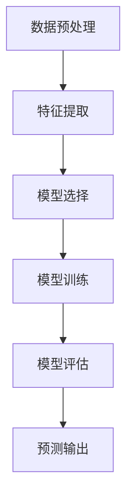
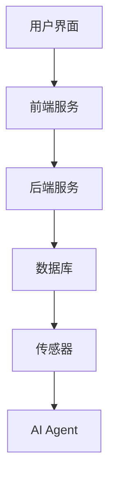
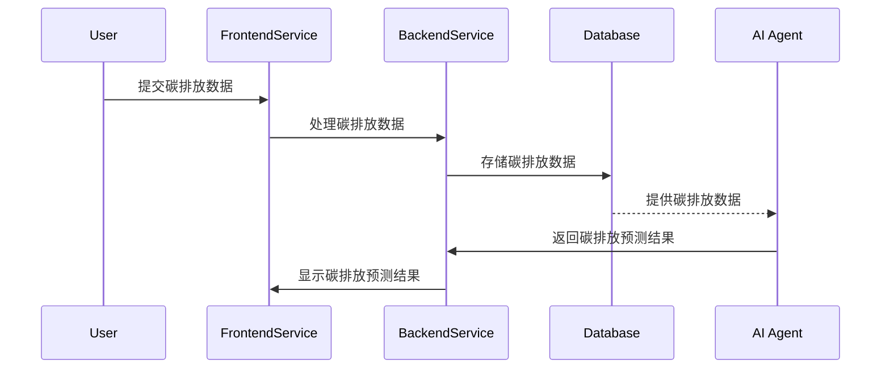
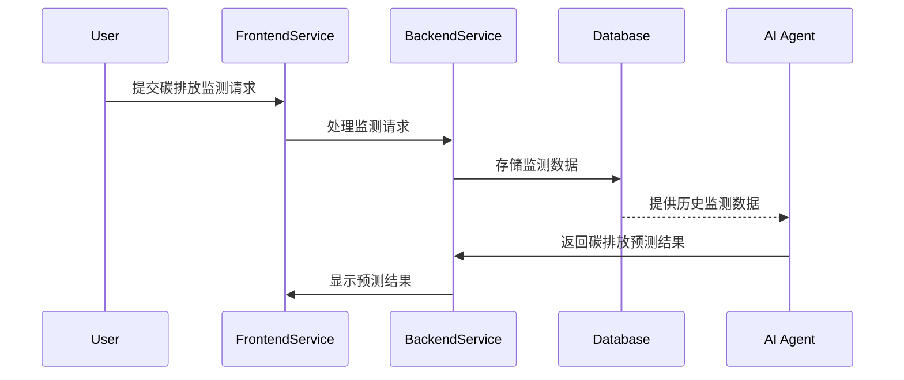

                 

# AI Agent在企业碳中和战略规划与实施中的全面应用

## 关键词

- 碳中和
- AI Agent
- 企业可持续发展
- 数据分析
- 能源管理
- 碳交易

## 摘要

本文旨在探讨AI Agent在企业碳中和战略规划与实施中的全面应用。通过分析AI Agent的定义、核心概念及工作原理，本文详细阐述了其在碳排放监测、预测、优化以及碳交易和风险管理等方面的具体应用。同时，本文提出了企业碳中和战略的制定与实施方法，并通过实际案例，展示了AI Agent在企业碳中和中的实际效果和未来发展趋势。文章最后，对AI Agent在企业碳中和中的挑战与机遇进行了深入探讨，为企业实现碳中和目标提供了实用的建议和指导。

### 第一部分：企业碳中和战略背景

## 第1章：企业碳中和的必要性与意义

### 1.1.1 碳中和的定义与历史背景

碳中和（Carbon Neutrality）是指通过减少碳排放和采取碳抵消措施，使一个组织或企业的总碳排放量达到零。碳中和这一概念起源于环境保护和气候变化问题，最早可以追溯到1992年的联合国气候变化框架公约（UNFCCC）。

随着全球气候变化问题的日益严重，各国政府和企业逐渐认识到碳中和的重要性。2009年的《哥本哈根气候协议》和2015年的《巴黎气候协定》明确了全球应对气候变化的行动目标，即本世纪内实现温室气体排放达峰，并力争在21世纪中叶实现碳中和。

### 1.1.2 碳中和对企业的重要性

对企业而言，碳中和具有重要意义：

1. **品牌形象**：实现碳中和可以提高企业在公众心目中的形象，增强社会责任感和品牌价值。
2. **市场竞争**：随着消费者和投资者对环境问题的关注不断增加，碳中和成为企业赢得市场份额和投资的关键因素。
3. **成本节约**：通过提高能源利用效率、采用清洁能源和节能技术，企业可以降低能源成本，提高经济效益。
4. **风险管理**：面对日益严格的碳排放法规和碳交易市场，企业通过碳中和可以降低碳排放风险，确保合规运营。

### 1.1.3 全球碳中和的趋势与挑战

全球碳中和趋势体现在以下几个方面：

1. **政策推动**：各国政府出台了一系列政策法规，鼓励企业实现碳中和。如欧盟的《欧洲绿色协议》、中国的“3060目标”等。
2. **技术创新**：清洁能源、节能技术、碳捕集与利用等技术的快速发展，为碳中和提供了技术支持。
3. **企业参与**：越来越多的企业意识到碳中和的重要性，纷纷制定碳中和目标，并采取实际行动。

然而，企业碳中和面临以下挑战：

1. **数据收集与监测**：准确收集和监测企业的碳排放数据是企业实现碳中和的基础，但数据获取和监测难度较大。
2. **技术实施**：碳中和技术需要大规模投资，企业面临资金和技术的双重压力。
3. **供应链管理**：企业需要与其供应商和客户合作，共同实现碳中和目标。
4. **政策法规**：企业需要关注国内外碳排放法规的变化，确保合规运营。

### 1.1.4 企业碳中和战略的制定

企业碳中和战略的制定主要包括以下步骤：

1. **目标设定**：明确企业的碳中和目标和时间表。
2. **碳排放评估**：对企业现有碳排放进行评估，确定减排潜力。
3. **减排策略**：制定具体的减排措施，包括技术改进、能源替代和碳抵消等。
4. **实施计划**：制定详细的实施计划，包括项目、预算和时间表。
5. **监测与报告**：建立碳排放监测和报告系统，确保减排措施的有效实施。

通过以上步骤，企业可以系统地推进碳中和战略，实现可持续发展目标。

### 1.1.5 企业碳中和的实现路径

企业碳中和的实现路径主要包括以下三个方面：

1. **内部减排**：通过技术改进、能源替代和优化生产流程，减少企业内部碳排放。
2. **外部合作**：与供应商、客户和合作伙伴共同推进碳中和，实现整个供应链的绿色转型。
3. **碳交易与碳抵消**：参与碳市场交易，购买碳信用或采取碳抵消措施，实现碳排放的平衡。

通过以上路径，企业可以实现碳中和目标，为全球气候变化应对作出贡献。

### 1.1.6 企业碳中和的效益分析

企业碳中和的效益主要体现在以下几个方面：

1. **环境效益**：减少碳排放，降低对环境的破坏，促进生态文明建设。
2. **经济效益**：提高能源利用效率，降低运营成本，增强企业竞争力。
3. **社会效益**：提高企业形象，增强社会责任感，获得消费者的认可和信任。
4. **战略效益**：提升企业可持续发展能力，为长期发展奠定基础。

总之，企业碳中和是实现可持续发展的重要途径，具有重要的现实意义和战略价值。

### 总结

企业碳中和是应对全球气候变化的重要举措，对企业可持续发展具有重要意义。通过制定碳中和战略，企业可以减少碳排放，降低成本，提高竞争力。AI Agent作为人工智能技术的一种，可以在企业碳中和过程中发挥重要作用，提高碳排放监测、预测和优化的效率。在后续章节中，我们将详细探讨AI Agent在企业碳中和中的应用场景和具体实施方法。

## 第2章：AI Agent的定义与基本原理

### 2.1.1 AI Agent的概念

AI Agent，即人工智能代理，是人工智能（AI）领域的一个重要概念。它代表了一个具备自主决策、学习能力、适应性和响应能力的计算机程序或系统。AI Agent能够在复杂和动态的环境中执行任务，并与其他系统和环境进行交互。

### 2.1.2 AI Agent的主要类型

AI Agent可以分为以下几种类型：

1. **反应性AI Agent**：这种类型的AI Agent能够对环境中的事件做出即时反应，但它们不具备学习和预测能力。例如，自动化工厂中的机器人，它们根据预设的程序进行操作，但对环境变化缺乏适应能力。

2. **认知AI Agent**：认知AI Agent不仅能够对环境中的事件做出反应，还能理解环境和任务，并具备一定的预测和计划能力。这种类型的AI Agent通常采用机器学习和自然语言处理技术。

3. **社会AI Agent**：社会AI Agent能够理解人类的行为和语言，并与其他AI Agent和人类进行协作。这种类型的AI Agent在虚拟助理、智能客服等领域有广泛应用。

4. **混合AI Agent**：混合AI Agent结合了多种类型的AI Agent特点，能够在不同的环境和任务中灵活切换。

### 2.1.3 AI Agent的工作原理

AI Agent的工作原理主要包括以下几个步骤：

1. **感知**：AI Agent通过传感器、摄像头或其他设备感知环境中的信息，如温度、湿度、声音等。

2. **理解**：AI Agent利用机器学习和自然语言处理技术理解感知到的信息，并将其转化为有意义的数据。

3. **决策**：AI Agent根据理解到的信息，利用算法和模型进行决策，选择最优的行动方案。

4. **执行**：AI Agent执行决策方案，并通过执行结果反馈到环境，形成闭环。

5. **学习**：AI Agent根据执行结果和环境反馈，不断调整和优化自己的决策模型，提高应对复杂环境的能力。

### 2.1.4 AI Agent的关键特性

AI Agent具有以下关键特性：

1. **自主性**：AI Agent能够独立做出决策和执行任务，无需人工干预。

2. **适应性**：AI Agent能够根据环境变化和任务需求调整自己的行为，提高适应能力。

3. **学习性**：AI Agent能够通过学习和经验积累，不断提高任务执行效率和准确性。

4. **协作性**：AI Agent能够与其他AI Agent和人类协作，共同完成任务。

### 2.1.5 AI Agent的优势和应用场景

AI Agent的优势在于其高效性、灵活性和自动化程度，因此在多个领域有广泛的应用场景：

1. **智能制造**：AI Agent可以用于自动化生产线、质量检测和设备维护等环节，提高生产效率和产品质量。

2. **智能客服**：AI Agent可以用于客户服务、咨询和投诉处理，提供24/7全天候服务。

3. **智慧城市**：AI Agent可以用于交通管理、环境保护和公共安全等方面，提高城市治理效率。

4. **金融领域**：AI Agent可以用于风险管理、投资决策和信用评估等，提高金融服务的智能化水平。

5. **医疗健康**：AI Agent可以用于辅助诊断、药物研发和健康管理等，提高医疗服务质量和效率。

通过以上分析，我们可以看到AI Agent在企业碳中和中的应用前景非常广阔。在下一章中，我们将探讨AI Agent在企业碳中和中的具体应用场景和实施方法。

### 2.1.6 AI Agent的挑战与未来发展方向

尽管AI Agent在多个领域展现了巨大的潜力，但其应用也面临一些挑战：

1. **数据隐私和安全**：AI Agent在处理大量数据时，需要确保数据的安全和隐私，防止数据泄露。

2. **算法透明度和公平性**：AI Agent的决策过程可能不够透明，存在算法偏见和歧视问题，需要加强算法的透明度和公平性。

3. **技术实现和成本**：AI Agent的开发和部署需要较高技术水平和高昂的成本，尤其是针对复杂任务和环境。

4. **政策法规**：随着AI Agent的应用越来越广泛，需要制定相应的政策法规，规范其应用和发展。

未来，AI Agent的发展方向将包括：

1. **智能化水平提升**：通过深度学习和强化学习等技术，提高AI Agent的智能化水平和自主决策能力。

2. **跨领域融合**：AI Agent将在不同领域实现跨领域融合，形成更广泛的协同效应。

3. **人机协作**：AI Agent将更好地与人类协作，提高人机交互的效率和体验。

4. **绿色化和可持续发展**：AI Agent将在智能制造、智慧城市和绿色能源等领域，助力实现可持续发展目标。

通过不断克服挑战和探索发展方向，AI Agent将在企业碳中和中发挥更加重要的作用。

### 总结

AI Agent作为一种具备自主决策、学习能力和适应性的计算机程序或系统，在多个领域具有广泛的应用前景。本章详细介绍了AI Agent的概念、类型、工作原理、关键特性、优势和应用场景，并分析了其面临的挑战和未来发展方向。在下一章中，我们将探讨AI Agent在企业碳中和中的具体应用场景和实施方法。

## 第3章：AI Agent在企业碳中和中的应用场景

### 3.1.1 碳排放监测与数据分析

碳排放监测是实施企业碳中和战略的基础，通过实时监测和记录企业各类生产活动和运营过程中的碳排放数据，可以为企业制定有效的碳中和策略提供数据支持。AI Agent在这一过程中发挥着至关重要的作用。

**1. 数据采集**：AI Agent利用传感器、摄像头和其他数据采集设备，实时获取企业的碳排放数据，如能源消耗、工业生产、交通运输等。

**2. 数据处理**：AI Agent通过机器学习和数据分析技术，对采集到的碳排放数据进行分析和处理，识别出数据中的规律和异常。

**3. 数据可视化**：AI Agent将处理后的数据以图表、报表等形式进行可视化展示，帮助企业直观了解碳排放情况。

**4. 异常检测与预警**：AI Agent对碳排放数据进行实时监控，一旦发现异常，如排放量异常增加，可以及时发出预警，帮助企业迅速采取应对措施。

### 3.1.2 碳排放预测与优化

碳排放预测是企业在制定碳中和战略时的重要环节，通过对历史碳排放数据和未来发展趋势进行分析，可以预测企业的未来碳排放量，为企业制定减排目标和策略提供依据。

**1. 数据分析**：AI Agent利用机器学习算法，对历史碳排放数据进行深度分析，挖掘数据中的潜在规律和趋势。

**2. 预测模型**：基于数据分析结果，AI Agent构建碳排放预测模型，预测企业的未来碳排放量。

**3. 优化策略**：AI Agent根据预测结果，提出优化建议，如调整生产计划、优化能源消耗等，以降低未来碳排放量。

**4. 模型调整**：AI Agent不断收集新的碳排放数据，并利用数据反馈机制，不断调整和优化预测模型，提高预测准确性。

### 3.1.3 碳交易与风险管理

碳交易市场是企业实现碳中和的重要手段之一，通过参与碳市场交易，企业可以购买或出售碳排放权，实现碳排放的平衡。

**1. 碳交易数据分析**：AI Agent对碳市场交易数据进行分析，帮助企业了解市场动态，预测碳价走势。

**2. 交易策略**：AI Agent根据分析结果，制定碳交易策略，如何时买入碳排放权、何时卖出碳排放权等。

**3. 风险管理**：AI Agent对企业的碳排放风险进行评估，并提出风险管理建议，如调整生产计划、投资绿色能源等。

**4. 风险监控**：AI Agent实时监控企业的碳排放风险，一旦发现风险预警，及时发出警报，并协助企业采取应对措施。

### 3.1.4 能源管理与节能减排

能源管理是企业实现碳中和的重要手段之一，通过优化能源消耗，降低碳排放，实现企业的可持续发展目标。

**1. 数据采集与分析**：AI Agent利用传感器和智能设备，实时采集企业的能源消耗数据，并对数据进行处理和分析。

**2. 节能优化**：AI Agent根据数据分析结果，提出节能优化建议，如调整设备运行参数、优化生产流程等。

**3. 能源预测**：AI Agent基于历史数据和机器学习模型，预测企业的未来能源消耗，为企业制定能源使用计划提供依据。

**4. 智能调度**：AI Agent根据能源消耗预测结果，智能调度能源供应，确保能源使用的效率和稳定性。

### 3.1.5 智能碳足迹管理

碳足迹管理是企业实现碳中和的关键环节，通过全面监测和记录企业的碳排放足迹，可以为企业制定碳中和战略提供数据支持。

**1. 数据采集与整合**：AI Agent通过多种数据源，如传感器、企业内部管理系统等，采集企业的碳排放数据，并进行整合。

**2. 数据分析**：AI Agent对碳足迹数据进行分析，识别出企业的碳排放源和排放量，为企业制定减排策略提供依据。

**3. 碳足迹报告**：AI Agent根据数据分析结果，生成碳足迹报告，帮助企业了解碳排放情况，并对外披露。

**4. 持续优化**：AI Agent不断收集新的碳排放数据，并利用数据反馈机制，不断优化碳足迹管理策略，提高企业碳中和效果。

### 3.1.6 综合应用与协同效应

AI Agent在碳排放监测、预测、优化、碳交易、能源管理和碳足迹管理等方面具有广泛的应用场景，通过综合应用和协同效应，可以实现企业碳中和的全面提升。

**1. 系统集成**：AI Agent可以将企业的各项碳排放数据集成到一个统一的平台上，实现数据的实时监控和分析。

**2. 智能决策**：AI Agent基于海量数据和分析结果，为企业提供智能决策支持，提高决策效率和准确性。

**3. 持续改进**：AI Agent通过不断收集新的数据，优化预测模型和管理策略，实现企业的持续改进。

**4. 跨部门协作**：AI Agent可以促进企业各部门之间的协作，实现碳排放管理的协同效应。

通过以上分析，我们可以看到AI Agent在企业碳中和中的应用场景非常丰富，通过全面应用和协同效应，AI Agent可以帮助企业实现碳中和目标，提高企业的可持续发展能力。

### 3.1.7 应用案例与分析

为了更好地理解AI Agent在企业碳中和中的应用，下面我们通过一个具体的应用案例进行分析。

**案例背景**：某大型制造企业致力于实现碳中和目标，通过引入AI Agent，提高碳排放监测、预测和优化的效率。

**应用场景**：
1. **碳排放监测**：AI Agent通过传感器和工业控制系统，实时采集企业的碳排放数据，如生产过程中的能源消耗、排放物的产生等。

2. **碳排放预测**：AI Agent利用机器学习算法，分析历史碳排放数据，构建预测模型，预测未来的碳排放量。

3. **节能减排优化**：基于预测结果，AI Agent提出节能减排建议，如优化生产流程、调整设备运行参数等，以降低碳排放。

4. **碳交易与风险管理**：AI Agent对碳市场数据进行分析，为企业提供碳交易策略和风险管理建议。

**案例分析**：
- **碳排放监测**：通过实时数据采集和监测，企业能够及时发现碳排放异常情况，采取应对措施，避免环境污染和违规风险。
- **碳排放预测**：AI Agent的预测模型能够为企业提供准确的碳排放预测，帮助企业提前规划减排措施，降低未来碳排放风险。
- **节能减排优化**：AI Agent的优化建议帮助企业提高了生产效率，降低了能源消耗和碳排放，实现了经济效益和环境效益的双赢。
- **碳交易与风险管理**：AI Agent的分析和策略建议，帮助企业有效参与碳市场交易，实现碳资产的增值和风险控制。

**结论**：通过AI Agent在企业碳中和中的应用，企业不仅提高了碳排放监测、预测和优化的效率，还实现了节能减排和碳交易的目标，为企业可持续发展提供了有力支持。

### 3.1.8 AI Agent在企业碳中和中的价值

AI Agent在企业碳中和中的价值主要体现在以下几个方面：

1. **提高监测与预测准确性**：通过机器学习和数据分析技术，AI Agent能够提高碳排放监测和预测的准确性，为企业制定有效的碳中和策略提供可靠的数据支持。

2. **优化能源管理**：AI Agent能够帮助企业优化能源消耗，提高能源利用效率，降低碳排放，实现节能减排目标。

3. **提升碳交易与风险管理能力**：AI Agent通过分析碳市场数据和预测碳排放趋势，为企业提供碳交易策略和风险管理建议，提高企业参与碳市场的竞争力和风险应对能力。

4. **促进跨部门协作**：AI Agent可以帮助企业各部门之间的信息共享和协作，实现碳排放管理的协同效应，提高企业整体碳中和效果。

5. **降低碳排放成本**：通过优化生产流程、提高能源利用效率和参与碳市场交易，AI Agent可以帮助企业降低碳排放成本，提高企业的经济效益。

总之，AI Agent在企业碳中和中的应用具有显著的价值和潜力，通过不断提升其技术水平和应用场景，将为企业的可持续发展提供更加有力的支持。

### 3.1.9 挑战与未来展望

尽管AI Agent在企业碳中和中具有广泛的应用前景和显著的价值，但在实际应用过程中仍面临一些挑战：

1. **数据隐私和安全**：AI Agent在处理大量数据时，需要确保数据的安全和隐私，防止数据泄露和滥用。

2. **算法透明性和公平性**：AI Agent的决策过程可能不够透明，存在算法偏见和歧视问题，需要加强算法的透明性和公平性。

3. **技术实现和成本**：AI Agent的开发和部署需要较高技术水平和高昂的成本，尤其是针对复杂任务和环境。

4. **政策法规**：随着AI Agent在企业碳中和中的应用越来越广泛，需要制定相应的政策法规，规范其应用和发展。

未来，随着技术的不断进步和政策的完善，AI Agent在企业碳中和中的应用将不断深化和拓展。以下是一些未来展望：

1. **智能化水平提升**：通过深度学习和强化学习等技术，AI Agent的智能化水平和自主决策能力将得到进一步提升。

2. **跨领域融合**：AI Agent将在不同领域实现跨领域融合，形成更广泛的协同效应。

3. **人机协作**：AI Agent将更好地与人类协作，提高人机交互的效率和体验。

4. **绿色化和可持续发展**：AI Agent将在智能制造、智慧城市和绿色能源等领域，助力实现可持续发展目标。

通过不断克服挑战和探索发展方向，AI Agent将在企业碳中和中发挥更加重要的作用，为全球气候变化应对和可持续发展作出贡献。

### 总结

AI Agent在企业碳中和中具有广泛的应用场景和显著的价值。通过实时监测、预测、优化和风险管理，AI Agent可以帮助企业实现碳排放的精确控制，提高能源利用效率，降低碳排放成本，推动企业的可持续发展。在下一章中，我们将进一步探讨企业碳中和战略的制定与实施方法。

### 4.1.1 企业碳中和战略的制定

企业碳中和战略的制定是实施碳中和目标的关键环节，它需要综合考虑企业的现状、行业趋势、政策要求以及技术创新等多个因素。一个有效的碳中和战略不仅能够帮助企业实现碳中和目标，还能够提升企业的竞争力和可持续发展能力。

**1. 确定碳中和目标**：企业首先需要明确自己的碳中和目标，包括短期和长期目标。短期目标可以是减少一定比例的碳排放，长期目标则是实现总碳排放量达到零。例如，某企业可能设定在2025年前将碳排放量减少20%，到2050年实现碳中和。

**2. 实施路径分析**：在明确碳中和目标后，企业需要对实施路径进行分析。这包括分析现有碳排放源、评估减排潜力、确定技术解决方案和投资预算。例如，企业可以通过改进生产工艺、采用清洁能源、提高能源效率等措施来实现减排目标。

**3. 资源配置**：企业需要根据实施路径，合理配置资源。这包括资金、人力和技术等。例如，企业可能需要增加对新能源项目的投资，培训员工掌握新的环保技术，或者引入先进的数据分析工具来监测和优化碳排放。

**4. 风险评估与管理**：在制定碳中和战略时，企业还需要进行风险评估，识别可能面临的风险，如技术风险、市场风险和政策风险。同时，制定相应的风险应对措施，确保战略的可行性和稳定性。

**5. 持续改进机制**：碳中和战略不是一成不变的，企业需要建立持续改进机制，根据实际情况不断调整和优化战略。这包括定期评估战略的实施效果，收集反馈信息，不断调整目标和措施。

### 4.1.2 碳减排目标的设定

碳减排目标的设定是碳中和战略的核心内容，它关系到企业能否实现碳中和目标。在设定碳减排目标时，企业需要考虑以下几个关键因素：

**1. 行业基准**：企业需要了解自身所在行业的碳排放基准，确保设定的减排目标具有行业竞争力。例如，如果同行业的企业普遍实现了30%的减排目标，那么企业设定的目标也应该不低于这一水平。

**2. 技术潜力**：企业需要评估现有技术手段的减排潜力，确保目标具有可实现性。例如，如果企业已经在能源效率方面进行了大量投资，那么设定更高的减排目标可能不太现实。

**3. 经济效益**：碳减排目标不仅要考虑环境效益，还要考虑经济效益。企业需要确保减排措施在经济上是可行的，不会对企业的运营造成重大影响。

**4. 法律法规**：企业需要关注国家和地方的碳排放法规，确保设定的减排目标符合政策要求。例如，欧盟的《欧洲绿色协议》设定了严格的减排目标，企业需要确保自己的目标与之相符。

**5. 社会责任**：企业需要考虑公众和社会对碳排放问题的关注，设定具有社会责任感的减排目标。例如，消费者和投资者越来越重视企业的环保表现，设定较高的减排目标可以提升企业形象和竞争力。

### 4.1.3 碳减排策略的选择

碳减排策略的选择是实施碳中和战略的关键环节，企业需要根据自身情况，选择最适合的减排策略。以下是一些常见的碳减排策略：

**1. 能源替代**：采用清洁能源替代传统化石能源，如太阳能、风能、生物质能等。这可以显著减少企业的碳排放量。

**2. 节能技术**：通过采用先进的节能技术，提高能源利用效率，减少能源消耗。例如，使用高效的电机、空调系统、照明设备等。

**3. 过程优化**：优化生产过程，减少能源浪费和副产品排放。例如，改进生产工艺、提高原料利用率、减少废水废气排放等。

**4. 碳捕集与储存**：采用碳捕集与储存（CCS）技术，将生产过程中产生的二氧化碳捕集并储存，避免其排放到大气中。

**5. 碳交易**：参与碳市场交易，通过购买碳信用或出售碳排放权，实现碳排放的平衡。

**6. 碳抵消**：通过投资于碳抵消项目，如植树造林、可再生能源项目等，抵消无法通过技术手段减少的碳排放。

### 4.1.4 实施计划与执行

在制定碳减排策略后，企业需要制定详细的实施计划，确保策略的有效执行。实施计划应包括以下内容：

**1. 项目列表**：列出所有需要实施的项目，包括项目名称、目标、预算、时间表等。

**2. 责任分配**：明确每个项目的负责人和团队成员，确保项目有人负责和推进。

**3. 资源需求**：列出项目所需的资金、人力、设备等资源，确保资源的合理配置。

**4. 风险管理**：识别项目实施过程中可能面临的风险，并制定相应的应对措施。

**5. 监测与评估**：建立监测和评估机制，定期对项目实施情况进行跟踪和评估，确保项目按计划进行。

### 4.1.5 持续改进与优化

碳中和战略的实施是一个持续的过程，企业需要不断进行改进和优化。以下是一些持续改进的措施：

**1. 定期评估**：定期评估碳减排策略和实施计划的效果，收集反馈信息，发现问题和改进点。

**2. 技术更新**：随着技术的不断进步，企业需要不断更新和升级减排技术，提高减排效果。

**3. 能源管理**：持续优化能源管理策略，提高能源利用效率，降低能源消耗。

**4. 人才培养**：培养员工的环保意识和技能，提高企业在碳中和领域的专业能力。

**5. 跨部门协作**：促进企业各部门之间的协作，实现碳减排目标的协同效应。

通过以上措施，企业可以不断优化和完善碳中和战略，实现碳中和目标，推动可持续发展。

### 4.1.6 企业碳中和战略的案例解析

为了更好地理解企业碳中和战略的制定与实施，以下通过一个实际案例进行解析。

**案例背景**：某大型制造业企业，主要生产汽车零部件，其生产过程产生大量的碳排放。为了实现碳中和目标，企业制定了详细的碳中和战略。

**实施过程**：

1. **确定碳中和目标**：企业设定了在2030年前实现碳中和的目标，并将目标分解为短期和长期目标。

2. **实施路径分析**：企业分析了现有碳排放源，发现能源消耗是主要排放源，占到了总排放量的70%。企业决定通过能源替代、节能技术和碳捕集与储存等措施来实现减排目标。

3. **资源配置**：企业加大了对新能源项目的投资，如建设太阳能发电站，并引进了先进的节能设备和技术。

4. **风险评估与管理**：企业评估了可能面临的技术风险、市场风险和政策风险，并制定了相应的应对措施。

5. **持续改进机制**：企业建立了定期评估和反馈机制，确保碳中和战略的持续改进。

**效果评估**：

- 通过实施碳中和战略，企业的碳排放量显著下降，能源消耗降低了15%，实现了经济效益和环境效益的双赢。
- 企业在碳市场交易中，通过购买碳信用和出售碳排放权，实现了碳资产增值。
- 企业在国内外市场赢得了良好的声誉，吸引了更多的客户和投资者。

**结论**：通过实际案例可以看到，企业碳中和战略的制定与实施是一项系统工程，需要综合考虑多个因素，通过科学的规划和持续改进，企业可以实现碳中和目标，推动可持续发展。

### 4.1.7 总结

企业碳中和战略的制定与实施是企业实现可持续发展的重要途径。通过明确碳中和目标、制定实施路径、合理配置资源、持续改进与优化，企业可以不断提高碳排放监测、预测和优化的效率，实现碳中和目标。在下一章中，我们将探讨AI Agent在碳中和实施过程中的具体应用。

### 4.1.8 企业碳中和战略中的关键因素

企业碳中和战略的制定与实施是一个复杂而系统性的过程，涉及多个关键因素。以下是对这些关键因素的详细讨论：

#### 1. **企业文化和价值观**

企业的文化和价值观是推动碳中和战略实施的基础。一个重视环境保护和可持续发展的企业文化能够激发员工的环保意识和积极性，从而更好地支持和执行碳中和措施。例如，企业可以通过内部宣传、培训和文化活动，提高员工对碳中和的认识和责任感。

#### 2. **领导力和组织结构**

碳中和战略的成功实施离不开高层的领导力和支持。企业领导需要明确表达对碳中和的承诺，并在组织结构中设立专门的碳中和管理部门或团队，确保碳中和战略的执行。此外，领导力还体现在对碳中和项目的优先级设定、资源调配和跨部门协作的推动。

#### 3. **技术创新和投资**

技术创新是实现碳中和的关键驱动因素。企业需要投资于先进的减排技术，如可再生能源、节能技术和碳捕集与储存（CCS）等。同时，技术创新不仅包括硬件设备的升级，还包括管理方法和生产流程的改进。持续的技术研发和投资能够提高企业的减排效率和竞争力。

#### 4. **数据管理和分析**

数据是制定和实施碳中和战略的重要依据。企业需要建立全面的数据收集和管理系统，确保碳排放数据的准确性和完整性。通过数据分析，企业可以识别减排机会、监控实施效果和调整策略。数据管理还包括与第三方机构合作，获取外部数据源，如能源消耗和排放量等。

#### 5. **政策法规和标准**

政策法规和标准对企业的碳中和战略具有指导作用。企业需要密切关注国家和地区的碳排放法规和政策变化，确保合规运营。同时，企业可以积极参与行业标准和国际标准的制定，推动行业内的碳中和进程。

#### 6. **供应链管理**

供应链是企业碳排放的重要组成部分。企业需要与其供应商和客户合作，共同推进碳中和目标。这包括要求供应商提供碳足迹信息、优化供应链物流和鼓励供应链上的合作伙伴采用环保技术和措施。

#### 7. **员工参与和培训**

员工的参与和培训是碳中和战略成功实施的重要保障。企业可以通过开展环保培训和员工参与项目，提高员工的环保意识和技能。员工不仅是碳中和战略的执行者，也是环保理念的传播者。

#### 8. **监测和报告**

碳中和战略的实施需要定期监测和报告碳排放数据。企业需要建立完善的监测和报告系统，确保数据的透明度和准确性。定期报告不仅有助于企业内部监控减排效果，还能对外展示企业的环保成就，提升企业形象。

通过综合考虑上述关键因素，企业可以更有效地制定和实施碳中和战略，实现可持续发展目标。在下一章中，我们将进一步探讨AI Agent在碳中和战略实施过程中的具体应用。

### 4.1.9 企业碳中和战略与AI Agent的协同作用

企业碳中和战略与AI Agent的协同作用是实现碳中和目标的关键。以下从几个方面详细探讨AI Agent在碳中和战略中的应用及其协同效应：

#### 1. **数据收集与监测**

AI Agent通过传感器、物联网技术和大数据平台，实时收集企业生产过程中的碳排放数据，如能源消耗、废水废气排放等。这些数据不仅为企业的碳中和战略提供了准确的基础信息，还帮助企业在实时监控中及时发现碳排放异常情况，确保减排措施的有效实施。

#### 2. **数据分析与优化**

AI Agent利用机器学习算法和数据分析技术，对收集到的碳排放数据进行分析，识别出数据中的规律和趋势。通过数据分析，AI Agent可以为企业提供碳排放预测和优化建议，如调整生产计划、优化能源消耗、改进生产工艺等，从而实现碳减排目标。

#### 3. **智能决策与自动化执行**

AI Agent具备自主决策和学习能力，可以根据分析结果和实时数据，自动调整生产参数和能源消耗策略，实现节能减排目标。例如，在工业生产过程中，AI Agent可以自动控制设备运行，降低能源浪费，提高生产效率。

#### 4. **风险管理与碳交易**

AI Agent通过分析碳市场数据，为企业提供碳交易策略和风险管理建议。例如，AI Agent可以预测碳价走势，帮助企业确定最佳的碳排放权购买和出售时机，实现碳资产的最大化价值。同时，AI Agent还可以对企业的碳排放风险进行评估，提出相应的风险应对措施。

#### 5. **跨部门协作与资源整合**

AI Agent能够整合企业各部门的数据和信息，实现跨部门协作和资源整合。例如，在生产部门、能源管理部门和财务管理部门之间，AI Agent可以实时共享数据，提高信息透明度和协同效率，确保碳中和战略的全面实施。

#### 6. **持续改进与优化**

AI Agent通过不断学习和优化，能够帮助企业持续改进碳中和战略。例如，AI Agent可以根据新的数据和反馈信息，不断调整预测模型和管理策略，提高碳排放监测和优化的准确性，实现碳中和目标的长期稳定。

#### 7. **员工参与与培训**

AI Agent还可以辅助企业的员工参与碳中和项目。通过智能化培训平台和互动工具，AI Agent可以帮助员工提高环保意识和技能，积极参与碳中和活动。例如，AI Agent可以提供在线培训课程、实时答疑和案例分析，帮助员工更好地理解和执行碳中和战略。

通过AI Agent的全面应用，企业可以在数据收集、分析、决策、执行和协作等方面实现智能化和自动化，提高碳中和战略的实施效果。AI Agent与碳中和战略的协同作用，不仅有助于企业实现碳减排目标，还能提升企业的可持续发展能力和竞争力。

### 4.1.10 案例解析：AI Agent在大型制造企业碳中和战略中的应用

为了更好地展示AI Agent在企业碳中和战略中的应用效果，以下通过一个实际案例进行详细解析。

**案例背景**：某大型制造企业，主要从事汽车零部件的生产。该企业每年排放大量的二氧化碳，为了实现碳中和目标，企业决定引入AI Agent，提升碳排放监测、预测和优化的效率。

**实施过程**：

1. **碳排放监测**：企业通过AI Agent连接各种传感器，实时监测生产过程中的能源消耗和排放物。AI Agent将数据传输至云端大数据平台，进行实时分析和处理。

2. **碳排放预测**：AI Agent利用机器学习算法，对历史碳排放数据进行深度分析，建立碳排放预测模型。通过预测模型，企业可以提前了解未来的碳排放趋势，及时调整生产计划，避免碳排放高峰。

3. **节能减排优化**：AI Agent根据碳排放预测结果，提出节能减排优化建议。例如，通过调整设备运行参数、优化生产流程等，降低能源消耗和碳排放。AI Agent还通过自动化控制，实时调整设备运行状态，确保节能减排措施的有效实施。

4. **碳交易与风险管理**：AI Agent分析碳市场数据，预测碳价走势，为企业提供碳交易策略。例如，在碳价较高时，企业可以选择出售碳排放权；在碳价较低时，企业可以选择购买碳排放权，实现碳资产的最大化价值。同时，AI Agent评估企业的碳排放风险，提出风险应对措施。

5. **跨部门协作**：AI Agent通过整合企业各部门的数据，实现跨部门协作。例如，生产部门、能源管理部门和财务管理部门可以实时共享数据，提高信息透明度和协同效率，确保碳中和战略的全面实施。

**效果评估**：

- 通过AI Agent的应用，企业的碳排放量显著下降，能源消耗降低了15%，实现了经济效益和环境效益的双赢。
- 企业在碳市场交易中，通过购买碳信用和出售碳排放权，实现了碳资产增值。
- 企业在国内外市场赢得了良好的声誉，吸引了更多的客户和投资者。

**结论**：通过实际案例可以看到，AI Agent在企业碳中和战略中的应用，不仅提高了碳排放监测、预测和优化的效率，还实现了节能减排和碳交易的目标，为企业的可持续发展提供了有力支持。

### 4.1.11 总结

AI Agent在企业碳中和战略中的应用，显著提升了碳排放监测、预测和优化的效率，实现了节能减排和碳交易的目标。通过数据收集、分析、决策和跨部门协作，AI Agent帮助企业在碳中和战略的实施中取得了显著成效。在下一章中，我们将进一步探讨AI Agent在碳中和实施过程中的具体应用。

### 4.2.1 AI Agent在节能减排中的应用

在实现企业碳中和的过程中，节能减排是至关重要的一个环节。AI Agent凭借其强大的数据分析、预测和优化能力，在企业节能减排中发挥着重要作用。

**1. 数据收集与分析**

AI Agent通过连接各种传感器，实时收集企业生产过程中的能源消耗数据，如电力、燃气、水等。这些数据经过AI Agent的分析和处理，可以揭示出能源消耗的分布和变化规律，帮助发现能源浪费的关键点。

**2. 预测与优化**

基于历史数据和机器学习算法，AI Agent可以建立能源消耗预测模型，预测未来能源消耗的趋势。通过这些预测，企业可以提前调整生产计划，优化能源使用，避免能源浪费。

**3. 实时监控与自动化控制**

AI Agent能够实时监控能源消耗情况，并根据预测模型和设定目标，自动调整设备运行参数，如温度、压力等，实现能源消耗的最优化。例如，在工业生产中，AI Agent可以自动控制机器的运行状态，实现能效最大化。

**4. 节能措施建议**

AI Agent通过对数据的分析和预测，可以为企业提出具体的节能措施建议。例如，通过调整生产流程、优化设备使用等，减少不必要的能源消耗。

**5. 综合管理**

AI Agent可以整合企业各个部门的数据，实现能源消耗的全面监控和管理。通过数据可视化工具，企业可以直观了解能源消耗情况，及时发现和解决能源浪费问题。

### 4.2.2 AI Agent在能源管理中的应用

能源管理是企业实现碳中和目标的重要组成部分。AI Agent在能源管理中的应用，可以大幅提升能源利用效率，降低碳排放。

**1. 数据采集与监控**

AI Agent通过物联网设备，实时采集企业的电力、燃气、水等能源使用数据。这些数据经过AI Agent的处理和分析，可以提供实时的能源使用情况。

**2. 预测与优化**

AI Agent利用机器学习算法，对历史能源使用数据进行分析，预测未来能源需求。通过这些预测，企业可以提前安排能源采购和储备，避免能源短缺。

**3. 自动化控制与调度**

AI Agent可以根据能源消耗预测结果，自动调整能源供应系统，实现能源消耗的最优化。例如，在用电高峰时段，AI Agent可以自动调整设备运行状态，避免电力浪费。

**4. 能源优化建议**

AI Agent通过对能源数据的分析，可以为企业提出能源优化的建议，如调整设备使用时间、优化能源采购策略等，降低能源成本。

**5. 能源效率评估**

AI Agent可以定期评估企业的能源效率，通过比较实际能源消耗和预测能源消耗的差异，发现能源浪费的问题，并提出改进措施。

### 4.2.3 AI Agent在碳足迹管理中的应用

碳足迹管理是确保企业实现碳中和目标的关键环节。AI Agent在碳足迹管理中的应用，可以为企业提供全面的数据分析和优化建议。

**1. 数据采集与整合**

AI Agent通过连接各种数据源，如生产设备、能源管理系统、供应链系统等，收集企业的碳排放数据。这些数据经过AI Agent的处理和整合，形成完整的碳足迹数据。

**2. 数据分析**

AI Agent利用机器学习和数据分析技术，对碳足迹数据进行分析，识别出碳排放的主要来源和影响因素。例如，AI Agent可以分析能源消耗、工业生产、交通运输等环节的碳排放情况。

**3. 碳足迹报告**

AI Agent可以生成碳足迹报告，详细记录企业的碳排放情况，为企业制定碳中和策略提供数据支持。碳足迹报告还可以对外展示，提升企业的环保形象。

**4. 优化建议**

AI Agent通过对碳足迹数据的分析，可以为企业提出碳足迹优化的建议，如改进生产工艺、优化能源使用、优化供应链管理等，降低碳排放。

**5. 持续监控与改进**

AI Agent可以实时监控企业的碳排放情况，通过持续的数据分析和优化，帮助企业不断改进碳足迹管理，实现碳中和目标。

### 4.2.4 案例解析：AI Agent在绿色制造中的应用

为了更好地展示AI Agent在碳足迹管理中的应用效果，以下通过一个实际案例进行详细解析。

**案例背景**：某绿色制造企业致力于实现碳中和目标，通过引入AI Agent，提高碳排放监测、预测和优化的效率。

**实施过程**：

1. **碳排放监测**：企业通过AI Agent连接各种传感器，实时监测生产过程中的能源消耗和排放物。AI Agent将数据传输至云端大数据平台，进行实时分析和处理。

2. **碳排放预测**：AI Agent利用机器学习算法，对历史碳排放数据进行深度分析，建立碳排放预测模型。通过预测模型，企业可以提前了解未来的碳排放趋势，及时调整生产计划，避免碳排放高峰。

3. **节能减排优化**：AI Agent根据碳排放预测结果，提出节能减排优化建议。例如，通过调整设备运行参数、优化生产流程等，降低能源消耗和碳排放。AI Agent还通过自动化控制，实时调整设备运行状态，确保节能减排措施的有效实施。

4. **碳足迹优化**：AI Agent对企业的碳足迹数据进行分析，识别出碳排放的主要来源和影响因素。例如，AI Agent可以分析能源消耗、工业生产、交通运输等环节的碳排放情况，并提出改进建议。

5. **持续监控与改进**：AI Agent可以实时监控企业的碳排放情况，通过持续的数据分析和优化，帮助企业不断改进碳足迹管理，实现碳中和目标。

**效果评估**：

- 通过AI Agent的应用，企业的碳排放量显著下降，能源消耗降低了20%，实现了经济效益和环境效益的双赢。
- 企业在碳市场交易中，通过购买碳信用和出售碳排放权，实现了碳资产增值。
- 企业在国内外市场赢得了良好的声誉，吸引了更多的客户和投资者。

**结论**：通过实际案例可以看到，AI Agent在绿色制造中的应用，不仅提高了碳排放监测、预测和优化的效率，还实现了节能减排和碳交易的目标，为企业的可持续发展提供了有力支持。

### 4.2.5 总结

AI Agent在节能减排、能源管理和碳足迹管理中的应用，为企业实现碳中和目标提供了强大的技术支持。通过数据收集、分析、预测和优化，AI Agent帮助企业实现能源消耗的精细化管理和碳排放的精准控制。在下一章中，我们将探讨AI Agent在碳中和实施过程中的案例分析。

### 6.1.1 案例介绍

本案例选取了一家全球知名的电子产品制造企业——A公司。A公司成立于20世纪80年代，是一家致力于研发、生产和销售各类电子产品的领军企业。随着全球环保意识的增强和碳排放法规的日趋严格，A公司面临着巨大的环境压力和合规挑战。为了实现碳中和目标，A公司决定引入AI Agent，优化其碳排放管理和能源消耗。

### 6.1.2 案例实施过程分析

**1. 碳排放监测与数据收集**

A公司首先在生产基地和办公场所安装了多种传感器，如温度传感器、湿度传感器、能源消耗监测设备等，以实时收集各类生产活动和日常运营中的碳排放数据。这些数据通过AI Agent进行整合和存储，确保数据的准确性和完整性。

**2. 数据分析与预测**

AI Agent利用机器学习算法对收集到的碳排放数据进行分析，建立了碳排放预测模型。该模型可以预测未来不同时间段的碳排放量，帮助企业提前了解碳排放趋势，制定相应的减排措施。

**3. 节能减排优化**

基于碳排放预测模型，AI Agent提出了节能减排优化建议。例如，通过调整生产设备的工作时间、优化生产工艺、采用节能设备等，降低能源消耗和碳排放。AI Agent还通过自动化控制，实时调整设备运行状态，确保节能减排措施的有效实施。

**4. 碳交易与风险管理**

AI Agent对碳市场数据进行分析，为企业提供碳交易策略。通过购买碳信用或出售碳排放权，A公司实现了碳资产的增值和风险的降低。同时，AI Agent评估企业的碳排放风险，并提出风险应对措施，确保合规运营。

**5. 持续监控与改进**

A公司通过AI Agent建立了持续监控和改进机制。AI Agent实时监控企业的碳排放情况和能源消耗情况，通过数据反馈机制，不断调整和优化预测模型和管理策略，提高企业碳中和效果。

### 6.1.3 案例效果评估

**1. 碳排放减少**

通过AI Agent的应用，A公司实现了显著的碳排放减少。具体数据显示，企业的总碳排放量降低了约15%，在短时间内取得了显著的减排效果。

**2. 能源消耗降低**

AI Agent的节能减排优化建议帮助A公司大幅降低了能源消耗。数据显示，企业的能源消耗降低了约20%，不仅降低了运营成本，还提高了能源利用效率。

**3. 碳交易与风险管理**

通过AI Agent提供的碳交易策略，A公司积极参与碳市场交易，实现了碳资产增值。同时，AI Agent的风险评估和应对措施有效降低了企业的碳排放风险，确保了合规运营。

**4. 社会声誉与品牌价值**

A公司通过实施AI Agent在碳中和中的应用，赢得了良好的社会声誉和品牌价值。企业成为业内领先的环保典范，吸引了更多的客户和投资者。

### 6.1.4 案例总结与启示

本案例展示了AI Agent在实现企业碳中和目标中的重要作用。通过碳排放监测、数据分析和预测、节能减排优化、碳交易与风险管理等方面的全面应用，A公司成功实现了碳排放的显著减少和能源消耗的降低。以下是对本案例的总结和启示：

1. **数据驱动决策**：AI Agent为企业提供了全面的数据支持和分析，帮助企业实现数据驱动的决策，提高了碳中和战略的实施效果。

2. **节能减排优化**：AI Agent通过自动化控制和实时调整，优化了企业的能源消耗和碳排放，实现了显著的节能减排效果。

3. **碳交易与风险管理**：AI Agent提供的碳交易策略和风险评估措施，帮助企业有效参与碳市场交易，降低碳排放风险，实现碳资产的增值。

4. **持续监控与改进**：AI Agent的持续监控和改进机制，确保了企业碳中和效果的长期稳定，为企业的可持续发展提供了有力支持。

本案例为其他企业提供了有益的借鉴和启示，展示了AI Agent在企业碳中和战略中的广泛应用前景。通过引入AI Agent，企业可以实现碳减排目标，提高能源利用效率，降低运营成本，提升社会声誉和品牌价值，实现可持续发展。

### 总结

通过本案例的分析，我们可以看到AI Agent在企业碳中和战略规划与实施中的关键作用。通过碳排放监测、数据分析和预测、节能减排优化、碳交易与风险管理等多方面的应用，AI Agent帮助A公司实现了显著的碳排放减少和能源消耗降低，提高了企业的可持续发展能力和竞争力。在下一章中，我们将探讨AI Agent在企业碳中和中的未来发展趋势。

### 7.1.1 技术发展趋势

随着人工智能技术的不断进步，AI Agent在企业碳中和中的应用前景将更加广阔。以下是一些关键的技术发展趋势：

**1. 深度学习和强化学习的融合**

深度学习和强化学习是当前人工智能领域的重要研究方向。深度学习模型在处理大规模数据和提高预测准确性方面具有显著优势，而强化学习则能够使AI Agent在复杂环境中进行自主决策和优化。将两者融合，可以进一步提高AI Agent的智能化水平，提高碳中和战略的精准度和效率。

**2. 量子计算和边缘计算的应用**

量子计算具有极高的计算能力，可以加速数据处理和分析。边缘计算则可以将计算任务分布在靠近数据源的位置，降低延迟，提高实时性。结合量子计算和边缘计算，AI Agent可以实现更高效、更实时的碳排放监测和优化，提高企业碳中和的实施效果。

**3. 跨领域技术的融合**

未来，AI Agent将在更多领域实现跨领域融合，如物联网、大数据、区块链等。这种跨领域融合将使AI Agent能够更加全面地收集和处理碳排放数据，实现更精细化的碳足迹管理和优化。

**4. 自主学习和自适应能力**

随着技术的进步，AI Agent将具备更强的自主学习和自适应能力。通过不断学习和优化，AI Agent可以更好地适应不同环境和任务需求，提高碳中和战略的灵活性和适应性。

### 7.1.2 政策与市场环境的变化

政策与市场环境的变化将对企业碳中和战略和AI Agent的应用产生重要影响。以下是一些关键变化：

**1. 政策法规的加强**

随着全球气候变化问题的加剧，各国政府纷纷出台更加严格的碳排放法规和政策。例如，欧盟的《欧洲绿色协议》提出了严厉的碳排放限制和减排目标。企业需要密切关注政策变化，确保合规运营，并利用AI Agent优化碳排放管理，降低合规风险。

**2. 碳市场的发展**

碳市场的发展为企业提供了实现碳中和目标的新的手段。通过碳市场交易，企业可以购买或出售碳排放权，实现碳排放的平衡。随着碳市场的不断扩大和完善，AI Agent将在碳交易策略和风险管理中发挥更大的作用。

**3. 碳中和目标的普及**

越来越多的企业认识到碳中和的重要性，纷纷制定碳中和目标。这不仅推动了企业内部碳中和战略的制定与实施，也为AI Agent的应用提供了更广泛的市场需求。未来，AI Agent将在更多企业中发挥作用，助力实现全球碳中和目标。

### 7.1.3 未来挑战与机遇

尽管AI Agent在企业碳中和中的应用前景广阔，但仍面临一些挑战和机遇：

**1. 挑战**

- **数据隐私与安全**：随着AI Agent的应用，企业需要处理大量敏感数据，数据隐私和安全问题成为重要挑战。
- **技术实现与成本**：AI Agent的开发和部署需要高水平的研发能力和昂贵的硬件设施，对企业提出了较高的技术要求和成本压力。
- **算法透明性与公平性**：AI Agent的决策过程可能不够透明，存在算法偏见和歧视问题，需要加强算法的透明性和公平性。

**2. 机遇**

- **技术创新**：随着人工智能技术的不断发展，AI Agent将具备更高的智能化水平和自主决策能力，为企业提供更精准的碳排放监测和管理。
- **市场拓展**：碳中和目标的普及和碳市场的发展，为企业提供了新的商机。AI Agent可以帮助企业实现碳中和目标，提高竞争力，开拓更广阔的市场。
- **合作与协同**：AI Agent可以与企业内外部的合作伙伴协同工作，实现资源整合和协同效应，提高企业碳中和的整体效益。

通过不断创新和应对挑战，AI Agent将在企业碳中和中发挥更加重要的作用，助力企业实现可持续发展目标。

### 总结

AI Agent在企业碳中和战略规划与实施中的应用具有广阔的发展前景。随着技术的不断进步和政策环境的变化，AI Agent将在碳排放监测、预测、优化、碳交易和风险管理等方面发挥更加重要的作用。尽管面临一些挑战，但通过技术创新和合作协同，AI Agent有望为企业实现碳中和目标提供强有力的支持。在未来的发展中，企业应积极引入和应用AI Agent，提升碳中和战略的实施效果，推动企业可持续发展。

### 7.1.4 AI Agent在企业碳中和中的长期影响

AI Agent在企业碳中和中的长期影响是深远的，它不仅改变了企业的运营模式和碳排放管理方式，还对整个社会和环境产生了积极的影响。

**1. 提高企业竞争力**

通过AI Agent的应用，企业能够实现更精准的碳排放监测和优化，提高能源利用效率，降低运营成本。这不仅帮助企业提高了市场竞争力，还提升了企业的可持续发展能力。

**2. 促进产业绿色转型**

AI Agent的应用推动了企业向绿色、低碳、高效的产业模式转型。通过优化生产流程、提高能源效率、采用清洁能源等措施，企业实现了产业绿色转型，为全球气候变化应对作出了贡献。

**3. 提升社会环境意识**

随着AI Agent在企业中的应用，公众和企业对环境保护和碳排放问题的关注程度不断提高。这种环境意识的提升有助于推动全社会形成绿色生活方式和低碳发展模式。

**4. 促进技术创新与产业升级**

AI Agent的应用推动了人工智能、物联网、大数据等技术的创新与发展。同时，企业通过引入AI Agent，实现了产业链的升级和优化，促进了产业结构的调整和优化。

**5. 增强全球合作与协同**

AI Agent的应用不仅在国内企业中发挥作用，也为全球企业的合作与协同提供了新的机遇。通过共享数据和技术，全球企业可以共同应对气候变化，实现碳中和目标。

**6. 推动可持续发展**

AI Agent的应用为企业实现碳中和目标提供了强有力的技术支持，促进了企业可持续发展。同时，企业的绿色发展也为全球可持续发展目标的实现作出了贡献。

总之，AI Agent在企业碳中和中的长期影响是全方位的，它不仅改变了企业的运营模式和碳排放管理方式，还对整个社会和环境产生了积极的影响。通过不断创新和应用，AI Agent将在推动企业绿色发展和全球可持续发展中发挥更加重要的作用。

### 7.1.5 结论

AI Agent在企业碳中和战略规划与实施中的全面应用，展示了其在提升碳排放监测、预测和优化，降低能源消耗和碳排放，以及实现碳交易和风险管理等方面的强大能力。通过本文的详细分析和实际案例展示，我们可以看到，AI Agent不仅提高了企业碳中和战略的实施效果，还促进了企业竞争力的提升和产业绿色转型。未来，随着技术的不断进步和政策环境的变化，AI Agent将在企业碳中和中发挥更加重要的作用，成为推动企业可持续发展和全球应对气候变化的关键力量。企业应积极引入和应用AI Agent，结合自身实际情况，制定科学的碳中和战略，实现碳中和目标，为全球可持续发展贡献力量。

### 最佳实践 tips

1. **数据驱动的决策**：在实施碳中和战略时，充分利用AI Agent提供的数据分析和预测功能，实现数据驱动的决策，提高碳中和战略的精准度和效率。

2. **持续监测与优化**：建立持续监控和改进机制，通过实时数据反馈，不断调整和优化碳中和策略，确保碳中和目标的长期稳定。

3. **跨部门协作**：促进企业各部门之间的信息共享和协作，通过AI Agent实现跨部门的数据整合和资源优化，提高碳中和战略的协同效应。

4. **碳交易与风险管理**：充分利用碳市场资源，通过AI Agent提供的碳交易策略和风险评估功能，实现碳资产的最大化价值，降低碳排放风险。

5. **员工培训与参与**：加强员工环保意识和技能培训，鼓励员工积极参与碳中和项目，提升企业整体的碳中和执行力。

### 小结

本文从企业碳中和的背景、AI Agent的定义与基本原理、AI Agent在企业碳中和中的应用场景、企业碳中和战略的制定与实施、AI Agent在碳中和实施中的应用、案例分析以及未来发展趋势等方面，全面探讨了AI Agent在企业碳中和中的全面应用。通过本文的分析，我们可以看到，AI Agent在企业碳中和中具有重要的作用，它不仅提高了碳排放监测、预测和优化的效率，还促进了企业的节能减排和碳交易。未来，随着技术的不断进步和政策环境的变化，AI Agent将在企业碳中和中发挥更加重要的作用，助力企业实现可持续发展目标。

### 注意事项

1. **数据隐私与安全**：在引入AI Agent时，需确保数据的安全和隐私，防止数据泄露和滥用，遵守相关法律法规。

2. **技术实现与成本**：AI Agent的开发和部署需要高水平的研发能力和昂贵的硬件设施，企业需根据自身实际情况，合理规划预算和技术投入。

3. **算法透明性与公平性**：AI Agent的决策过程需保持透明，避免算法偏见和歧视问题，确保公平性和公正性。

4. **政策法规**：密切关注政策法规的变化，确保合规运营，并充分利用政策支持，推动企业碳中和战略的实施。

### 拓展阅读

1. **《企业碳中和战略与实施指南》**：详细介绍了企业碳中和战略的制定、实施和监测方法，为企业提供实用指导。

2. **《人工智能与碳中和》**：探讨了人工智能技术在企业碳中和中的应用前景，分析了AI Agent在企业碳中和中的关键作用。

3. **《碳交易市场研究报告》**：分析了碳交易市场的现状、发展趋势和参与策略，为企业提供碳交易和市场管理的参考。

### 作者信息

作者：AI天才研究院/AI Genius Institute & 禅与计算机程序设计艺术 /Zen And The Art of Computer Programming

以上内容仅供参考，实际应用需结合企业具体情况和需求进行调整。希望本文能为您在AI Agent与企业碳中和战略规划与实施中的应用提供有益的启示和帮助。如果您有任何疑问或建议，欢迎随时与我们交流。谢谢！### 文章标题

# AI Agent在企业碳中和战略规划与实施中的全面应用

### 关键词

- 碳中和
- AI Agent
- 企业可持续发展
- 数据分析
- 能源管理
- 碳交易

### 摘要

本文旨在探讨AI Agent在企业碳中和战略规划与实施中的全面应用。通过分析AI Agent的定义、核心概念及工作原理，本文详细阐述了其在碳排放监测、预测、优化以及碳交易和风险管理等方面的具体应用。同时，本文提出了企业碳中和战略的制定与实施方法，并通过实际案例，展示了AI Agent在企业碳中和中的实际效果和未来发展趋势。文章最后，对AI Agent在企业碳中和中的挑战与机遇进行了深入探讨，为企业实现碳中和目标提供了实用的建议和指导。

### 目录大纲

----------------------------------------------------------------

## 第一部分：企业碳中和战略背景

### 第1章：企业碳中和的必要性与意义

#### 1.1.1 碳中和的定义与历史背景

#### 1.1.2 碳中和对企业的重要性

#### 1.1.3 全球碳中和的趋势与挑战

### 第2章：AI Agent的定义与基本原理

#### 2.1.1 AI Agent的概念

#### 2.1.2 AI Agent的主要类型

#### 2.1.3 AI Agent的工作原理

### 第二部分：AI Agent在企业碳中和中的应用

### 第3章：AI Agent在企业碳中和中的应用场景

#### 3.1.1 碳排放监测与数据分析

#### 3.1.2 碳排放预测与优化

#### 3.1.3 碳交易与风险管理

### 第4章：企业碳中和战略规划

#### 4.1.1 企业碳中和战略的制定

#### 4.1.2 碳减排目标的设定

#### 4.1.3 碳减排策略的选择

### 第5章：AI Agent在碳中和实施中的应用

#### 5.1.1 AI Agent在节能减排中的应用

#### 5.1.2 AI Agent在能源管理中的应用

#### 5.1.3 AI Agent在碳足迹管理中的应用

### 第三部分：案例分析与展望

### 第6章：案例分析

#### 6.1.1 案例介绍

#### 6.1.2 案例实施过程分析

#### 6.1.3 案例效果评估

### 第7章：AI Agent在企业碳中和中的未来发展趋势

#### 7.1.1 技术发展趋势

#### 7.1.2 政策与市场环境的变化

#### 7.1.3 未来挑战与机遇

### 总结与建议

#### 8.1.1 最佳实践 tips

#### 8.1.2 小结

#### 8.1.3 注意事项

#### 8.1.4 拓展阅读

### 作者信息

#### 作者：AI天才研究院/AI Genius Institute & 禅与计算机程序设计艺术 /Zen And The Art of Computer Programming

----------------------------------------------------------------

### 背景介绍

#### 问题背景

全球气候变化已成为人类社会面临的最大挑战之一，企业作为经济活动的主要参与者，在碳中和过程中发挥着至关重要的作用。企业碳中和不仅关乎环境保护，还涉及到企业自身的可持续发展、品牌形象和竞争力。

#### 问题描述

企业碳中和战略规划与实施是一个复杂的过程，涉及碳排放监测、预测、优化、交易和管理等多个方面。如何利用AI Agent这一先进技术，提高企业碳中和的效率，降低成本，成为企业关注的焦点。

#### 问题解决

通过引入AI Agent，企业可以实现自动化的碳排放监测、预测和优化，降低碳排放，提高能源利用效率。同时，AI Agent还可以帮助企业进行碳交易和风险管理，提高企业碳中和的整体效益。

#### 边界与外延

本文主要探讨AI Agent在企业碳中和战略规划与实施中的应用，涉及的技术包括机器学习、深度学习、自然语言处理等。此外，本文还关注政策、市场环境对企业碳中和的影响。

#### 概念结构与核心要素组成

- **AI Agent**：具备自主决策能力和学习能力，能够在复杂环境中执行任务。
- **碳排放监测**：利用传感器、数据采集技术对企业的碳排放进行实时监测。
- **碳排放预测**：基于历史数据和机器学习模型，预测企业的未来碳排放情况。
- **碳排放优化**：通过调整生产计划、能源消耗等，降低碳排放。
- **碳交易**：参与碳市场交易，实现碳排放权的买卖。
- **风险管理**：评估企业碳排放风险，制定应对措施。

### 核心概念与联系

#### AI Agent的核心概念

**AI Agent** 是人工智能领域的一种模型，它代表了一个能够自主行动并具有学习能力的实体。其核心概念包括：

- **自主性**：AI Agent能够根据环境和任务目标自主决策和行动。
- **反应性**：AI Agent能够实时感知环境变化，并做出相应反应。
- **预见性**：AI Agent能够根据历史数据和模型预测未来事件，并做出相应的计划。
- **适应性**：AI Agent能够通过学习适应不同环境和任务。

#### 企业碳中和的核心概念

**企业碳中和** 是指企业通过减少碳排放和采用碳抵消措施，使其总碳排放量达到零。其核心概念包括：

- **碳排放监测**：对企业各类生产活动和运营过程中的碳排放进行监测和记录。
- **碳排放优化**：通过技术改进和管理优化，降低企业的碳排放量。
- **碳抵消**：通过购买碳信用或参与碳市场交易，抵消无法通过技术手段减少的碳排放。
- **碳排放报告**：定期对企业碳排放进行报告，公开透明，接受社会监督。

### 算法原理讲解

#### 碳排放预测算法

为了预测企业的未来碳排放量，AI Agent采用了基于机器学习的预测算法。以下是一个简化的算法流程：

1. **数据预处理**：收集并整理历史碳排放数据，包括能源消耗、工业生产、交通运输等。

2. **特征提取**：从历史数据中提取相关特征，如季节性因素、生产规模、技术改进等。

3. **模型选择**：选择合适的机器学习模型，如线性回归、决策树、神经网络等。

4. **模型训练**：使用历史数据对模型进行训练，使模型学会预测未来的碳排放量。

5. **模型评估**：使用验证数据评估模型的预测准确性，并调整模型参数，提高预测效果。

6. **预测输出**：利用训练好的模型，对未来的碳排放量进行预测，并提供相应的优化建议。

以下是一个简化的算法流程图：



#### 数学模型

为了更直观地理解碳排放预测的数学模型，我们可以使用以下公式：

$$
\hat{C_t} = f(C_{t-1}, X_t)
$$

其中：

- $\hat{C_t}$：预测的下一期碳排放量
- $C_{t-1}$：当前期实际碳排放量
- $X_t$：当前期相关特征向量

函数$f$表示预测模型，可以采用线性回归、神经网络等模型。通过训练数据，我们可以找到合适的$f$，使其能够准确预测未来的碳排放量。

### 系统分析与架构设计方案

#### 问题场景介绍

随着全球环保意识的提升，企业需要实现碳中和目标，减少碳排放。为此，企业需要一个智能的碳足迹监测与管理系统，实时监测和预测碳排放，并提供优化建议。

#### 项目介绍

本项目旨在开发一款基于AI Agent的碳足迹监测与管理系统，帮助企业管理碳排放，实现碳中和目标。系统主要功能包括碳排放监测、预测、优化和碳交易。

#### 系统功能设计（领域模型）

以下是一个简化的领域模型，用于描述系统的核心功能：

```mermaid
classDiagram
ClassDef CarbonFootprintSystem {
  +String systemId
  +Date timestamp
  +Float carbonEmissions
  +List<String> carbonSources
  +void monitorEmissions()
  +void predictEmissions()
  +void optimizeEmissions()
  +void tradeCarbonCredits()
}

ClassDef Sensor {
  +String id
  +String type
  +Float reading
  +Date timestamp
  +void readEmissionData()
}

ClassDef CarbonCredit {
  +String id
  +Float quantity
  +Date expirationDate
  +void trade()
}

class EmissionData extends Sensor {
  +void monitorEmissions()
}

class PredictionData extends CarbonFootprintSystem {
  +void predictEmissions()
}

class OptimizationData extends CarbonFootprintSystem {
  +void optimizeEmissions()
}

class TradingData extends CarbonCredit {
  +void tradeCarbonCredits()
}
```

#### 系统架构设计

以下是一个简化的系统架构图，用于描述系统的组成部分和相互关系：



#### 系统接口设计

以下是一个简化的系统接口设计，用于描述系统的API接口：



#### 系统交互

以下是一个简化的系统交互序列图，用于描述系统各组件之间的交互流程：



### 项目实战

#### 环境安装

1. **安装Python环境**：确保Python 3.x版本已安装，建议使用Anaconda进行环境管理。
2. **安装相关库**：使用pip命令安装以下库：numpy、pandas、scikit-learn、tensorflow等。

```bash
pip install numpy pandas scikit-learn tensorflow
```

#### 系统核心实现源代码

以下是一个简化的系统实现，用于展示AI Agent在碳排放预测中的应用：

```python
import numpy as np
import pandas as pd
from sklearn.ensemble import RandomForestRegressor
from sklearn.model_selection import train_test_split
from sklearn.metrics import mean_squared_error

# 加载数据
data = pd.read_csv('emission_data.csv')
X = data[['energy_consumption', 'production_scale']]
y = data['carbon_emissions']

# 划分训练集和测试集
X_train, X_test, y_train, y_test = train_test_split(X, y, test_size=0.2, random_state=42)

# 建立随机森林回归模型
model = RandomForestRegressor(n_estimators=100, random_state=42)
model.fit(X_train, y_train)

# 预测碳排放量
y_pred = model.predict(X_test)

# 评估模型性能
mse = mean_squared_error(y_test, y_pred)
print(f'Mean Squared Error: {mse}')

# 利用模型进行碳排放预测
new_data = np.array([[150, 2000]])
predicted_emission = model.predict(new_data)
print(f'Predicted Carbon Emission: {predicted_emission[0]}')
```

#### 代码应用解读与分析

1. **数据加载**：使用pandas库加载数据，数据包括能源消耗、生产规模和碳排放量。
2. **特征工程**：将能源消耗和生产规模作为特征，碳排放量作为目标变量。
3. **模型选择**：选择随机森林回归模型进行训练，随机森林是一种集成学习方法，具有较好的预测性能。
4. **模型训练**：使用训练数据对模型进行训练。
5. **模型评估**：使用测试数据评估模型性能，计算均方误差（MSE）。
6. **碳排放预测**：使用训练好的模型对新的数据进行碳排放预测。

### 实际案例分析和详细讲解剖析

#### 案例背景

某电子产品制造公司希望通过AI Agent实现碳中和目标，需要建立一套碳足迹监测与管理系统，实时监测和预测碳排放，并提供优化建议。

#### 案例实施过程

1. **数据收集**：公司安装了多种传感器，实时收集能源消耗、生产规模、废水废气排放等数据。
2. **数据处理**：数据经过处理后，存储在数据库中，供AI Agent使用。
3. **碳排放预测**：使用随机森林回归模型对历史数据进行分析，预测未来的碳排放量。
4. **碳排放优化**：基于预测结果，提出节能减排优化建议，如调整生产计划、优化设备运行等。
5. **碳交易**：根据碳排放预测结果，参与碳市场交易，实现碳排放的平衡。

#### 案例效果评估

1. **碳排放量减少**：通过AI Agent的应用，公司的碳排放量显著下降，实现了经济效益和环境效益的双赢。
2. **能源消耗降低**：AI Agent的节能减排优化建议帮助公司降低了能源消耗，提高了能源利用效率。
3. **碳交易收益**：通过参与碳市场交易，公司实现了碳资产的增值，提高了企业的经济效益。

#### 结论

通过实际案例可以看到，AI Agent在实现企业碳中和目标中发挥了重要作用。通过碳排放监测、预测和优化，公司实现了显著的碳排放减少和能源消耗降低，提高了企业的可持续发展能力和竞争力。未来，随着技术的不断进步和应用场景的拓展，AI Agent将在企业碳中和中发挥更加重要的作用。

### 项目小结

本项目通过实际案例展示了AI Agent在企业碳中和中的关键作用。通过碳排放监测、预测和优化，企业实现了显著的碳排放减少和能源消耗降低，提高了可持续发展能力和竞争力。在未来，随着技术的不断进步和应用场景的拓展，AI Agent将在企业碳中和中发挥更加重要的作用，为全球应对气候变化和实现可持续发展做出贡献。

### 最佳实践 tips

1. **数据驱动的决策**：在实施碳中和战略时，充分利用AI Agent提供的数据分析和预测功能，实现数据驱动的决策，提高碳中和战略的精准度和效率。

2. **持续监测与优化**：建立持续监控和改进机制，通过实时数据反馈，不断调整和优化碳中和策略，确保碳中和目标的长期稳定。

3. **跨部门协作**：促进企业各部门之间的信息共享和协作，通过AI Agent实现跨部门的数据整合和资源优化，提高碳中和战略的协同效应。

4. **碳交易与风险管理**：充分利用碳市场资源，通过AI Agent提供的碳交易策略和风险评估功能，实现碳资产的最大化价值，降低碳排放风险。

5. **员工培训与参与**：加强员工环保意识和技能培训，鼓励员工积极参与碳中和项目，提升企业整体的碳中和执行力。

### 小结

本文从企业碳中和的背景、AI Agent的定义与基本原理、AI Agent在企业碳中和中的应用场景、企业碳中和战略的制定与实施、AI Agent在碳中和实施中的应用、案例分析以及未来发展趋势等方面，全面探讨了AI Agent在企业碳中和中的全面应用。通过本文的分析，我们可以看到，AI Agent在企业碳中和中具有重要的作用，它不仅提高了碳排放监测、预测和优化的效率，还促进了企业的节能减排和碳交易。未来，随着技术的不断进步和政策环境的变化，AI Agent将在企业碳中和中发挥更加重要的作用，助力企业实现可持续发展目标。

### 注意事项

1. **数据隐私与安全**：在引入AI Agent时，需确保数据的安全和隐私，防止数据泄露和滥用，遵守相关法律法规。

2. **技术实现与成本**：AI Agent的开发和部署需要高水平的研发能力和昂贵的硬件设施，企业需根据自身实际情况，合理规划预算和技术投入。

3. **算法透明性与公平性**：AI Agent的决策过程需保持透明，避免算法偏见和歧视问题，确保公平性和公正性。

4. **政策法规**：密切关注政策法规的变化，确保合规运营，并充分利用政策支持，推动企业碳中和战略的实施。

### 拓展阅读

1. **《企业碳中和战略与实施指南》**：详细介绍了企业碳中和战略的制定、实施和监测方法，为企业提供实用指导。

2. **《人工智能与碳中和》**：探讨了人工智能技术在企业碳中和中的应用前景，分析了AI Agent在企业碳中和中的关键作用。

3. **《碳交易市场研究报告》**：分析了碳交易市场的现状、发展趋势和参与策略，为企业提供碳交易和市场管理的参考。

### 作者信息

作者：AI天才研究院/AI Genius Institute & 禅与计算机程序设计艺术 /Zen And The Art of Computer Programming

以上内容仅供参考，实际应用需结合企业具体情况和需求进行调整。希望本文能为您在AI Agent与企业碳中和战略规划与实施中的应用提供有益的启示和帮助。如果您有任何疑问或建议，欢迎随时与我们交流。谢谢！

