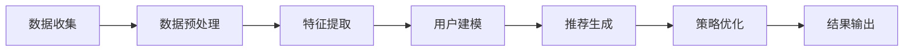
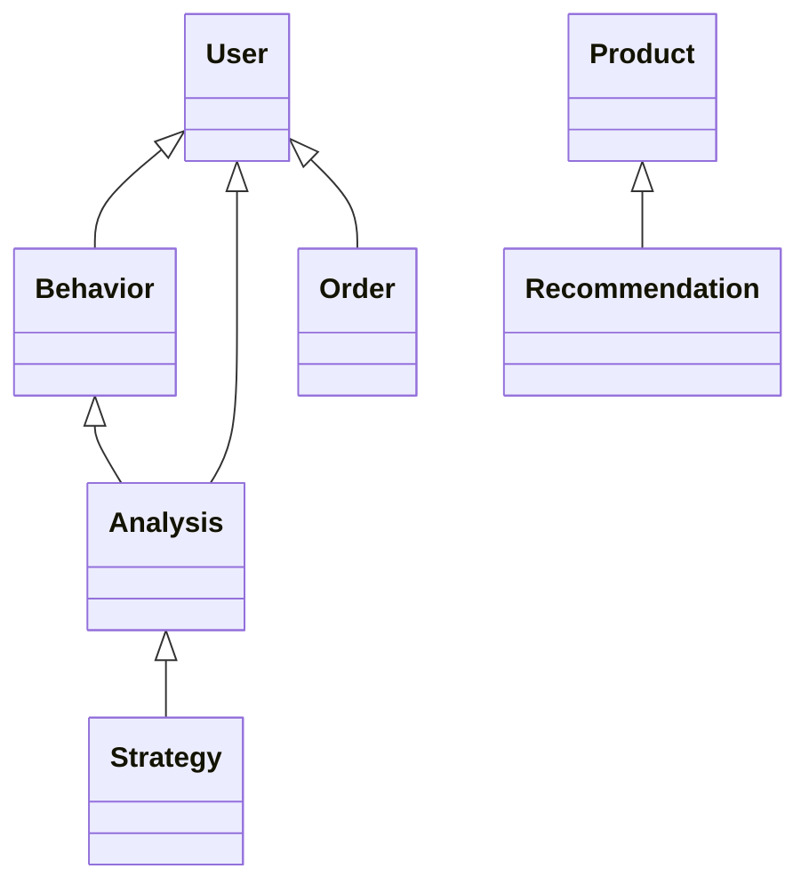
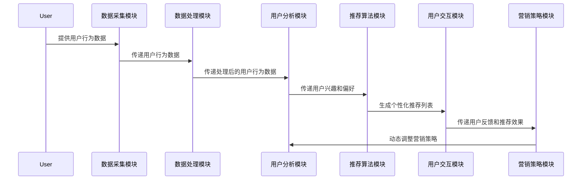
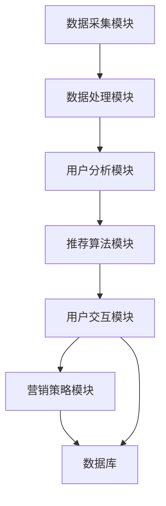
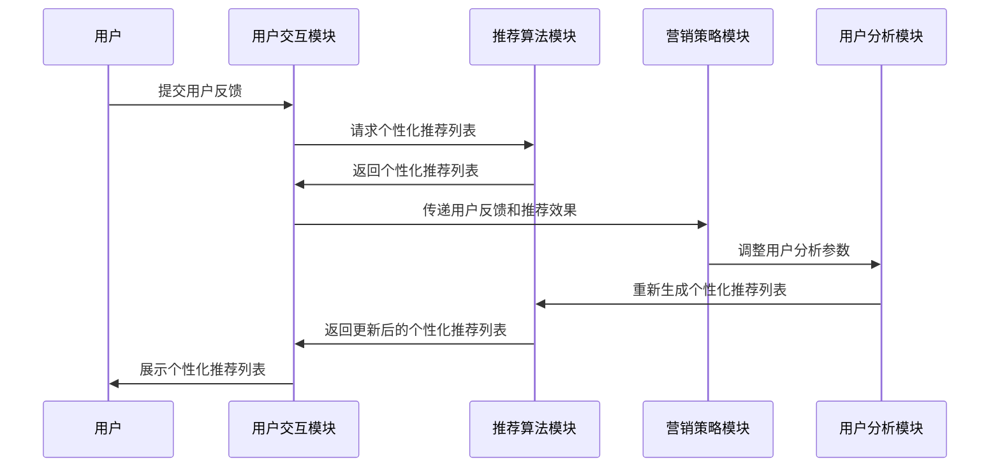

                 

### 文章标题

# AI Agent在企业精准营销与个性化推荐中的深度应用

> 关键词：AI Agent、企业精准营销、个性化推荐、深度学习、数据分析、用户行为分析

> 摘要：
本文旨在探讨AI Agent在企业精准营销与个性化推荐中的应用。通过分析AI Agent的基本原理、核心特性及分类，深入探讨其在企业精准营销和个性化推荐中的深度应用。文章还详细介绍了AI Agent在企业精准营销和个性化推荐中的作用机制、核心算法原理及系统架构设计方案，并通过实例进行了实际应用分析。本文的研究对于提高企业营销效率和用户体验具有重要意义，为AI Agent在商业领域的应用提供了参考和启示。

### 目录大纲

----------------------------------------------------------------

## 第二部分：核心概念与联系

### 2.1 AI Agent原理

#### 2.1.1 AI Agent的基本原理

AI Agent是指能够自主感知环境、理解环境信息、并做出决策的智能体。AI Agent的核心任务是代表用户完成特定任务，具有高度自主性和适应性。

- **感知**：AI Agent能够接收并处理来自环境的信息，如用户行为、市场数据等。
- **理解**：通过自然语言处理、图像识别等技术，AI Agent能够理解这些信息，提取有价值的数据。
- **决策**：基于理解的信息，AI Agent能够做出相应的决策，如推荐商品、调整营销策略等。

#### 2.1.2 AI Agent的核心特性

AI Agent的核心特性包括：

- **自主性**：AI Agent能够在没有人工干预的情况下自主完成任务。
- **适应性**：AI Agent能够根据环境变化和用户需求调整行为策略。
- **协作性**：AI Agent能够与其他AI Agent或人类协作，共同完成任务。

#### 2.1.3 AI Agent的分类

AI Agent可以分为以下几类：

- **规则型AI Agent**：基于预设的规则进行决策。
- **学习型AI Agent**：通过机器学习算法从数据中学习，提高决策能力。
- **混合型AI Agent**：结合规则和学习能力，进行复杂决策。

### 2.2 企业精准营销

#### 2.2.1 精准营销的原理

精准营销是一种以数据为核心，通过深入分析用户行为和需求，实现个性化营销的策略。精准营销的核心原理包括：

- **用户数据分析**：通过收集用户的行为数据，如浏览历史、购买记录等，对用户进行细分。
- **用户需求分析**：根据用户数据，分析用户的需求和偏好，制定针对性的营销策略。
- **个性化营销**：根据用户细分和需求分析，为不同用户群体提供个性化的产品和服务。

#### 2.2.2 精准营销的关键要素

精准营销的关键要素包括：

- **数据质量**：数据质量是精准营销的基础，高质量的数据能够提供更准确的用户画像和需求分析。
- **分析算法**：有效的分析算法能够从海量数据中提取有价值的信息，支持精准营销决策。
- **用户参与**：用户的参与和反馈是精准营销的重要环节，通过用户的参与和反馈，可以不断优化营销策略。

#### 2.2.3 精准营销的挑战与机遇

精准营销面临的挑战包括：

- **数据隐私和安全**：在收集和处理用户数据时，需要确保数据的安全性和隐私保护。
- **技术门槛**：实施精准营销需要较高的技术门槛，如数据挖掘、机器学习等。

精准营销带来的机遇包括：

- **提高营销效率**：通过精准营销，企业可以更高效地投放广告，降低营销成本。
- **提升用户体验**：通过个性化的产品和服务，提升用户的满意度和忠诚度。

### 2.3 个性化推荐

#### 2.3.1 个性化推荐的原理

个性化推荐是一种通过分析用户行为和偏好，为用户提供个性化内容或服务的推荐系统。个性化推荐的原理包括：

- **用户行为分析**：通过收集用户的行为数据，如浏览记录、购买记录等，分析用户的兴趣和偏好。
- **推荐算法**：基于用户行为分析和用户偏好，利用推荐算法生成个性化推荐列表。
- **反馈调整**：根据用户的反馈和交互行为，调整推荐策略，提高推荐效果。

#### 2.3.2 个性化推荐的方法

个性化推荐的方法主要包括以下几种：

- **协同过滤**：通过分析用户之间的相似性，为用户提供相似的推荐。
- **基于内容的推荐**：通过分析内容的特征，为用户提供与其兴趣相关的推荐。
- **混合推荐**：结合协同过滤和基于内容的推荐方法，提供更精准的推荐。

#### 2.3.3 个性化推荐的挑战

个性化推荐面临的挑战包括：

- **数据稀疏**：用户行为数据往往稀疏，难以准确预测用户的兴趣。
- **冷启动**：对于新用户，由于缺乏历史行为数据，难以提供个性化的推荐。
- **推荐多样性**：如何在保证推荐准确性的同时，提供多样化的推荐内容。

### 2.4 AI Agent与企业精准营销、个性化推荐的关系

#### 2.4.1 AI Agent在精准营销中的作用

AI Agent在企业精准营销中的作用包括：

- **用户行为预测**：通过分析用户行为数据，AI Agent能够预测用户的下一步行为，帮助企业制定精准的营销策略。
- **需求分析**：AI Agent能够从大量用户数据中提取有价值的信息，帮助企业深入分析用户需求，提供个性化的产品和服务。
- **策略优化**：基于对用户行为和需求的分析，AI Agent能够不断优化营销策略，提高营销效果。

#### 2.4.2 AI Agent在个性化推荐中的作用

AI Agent在个性化推荐中的作用包括：

- **推荐算法优化**：AI Agent能够通过学习用户行为数据，优化推荐算法，提高推荐准确性。
- **推荐策略调整**：AI Agent能够根据用户反馈和交互行为，动态调整推荐策略，提供更个性化的推荐。
- **推荐多样性**：AI Agent能够通过分析用户兴趣和偏好，提供多样化的推荐内容，满足用户的不同需求。

#### 2.4.3 AI Agent的综合应用

AI Agent的综合应用包括：

- **一体化解决方案**：将AI Agent与企业精准营销和个性化推荐相结合，提供一体化解决方案，提高企业营销效率和用户体验。
- **跨平台应用**：AI Agent能够跨平台应用，如Web、移动端、智能设备等，实现全渠道营销。
- **实时调整**：AI Agent能够实时分析用户行为和市场需求，动态调整营销策略和推荐内容，实现实时营销和推荐。

### 2.5 概念属性特征对比表格

| 概念     | 特征1 | 特征2 | 特征3 |
|----------|-------|-------|-------|
| AI Agent | 自主性 | 适应性 | 协作性 |
| 精准营销 | 数据分析 | 用户需求分析 | 个性化营销 |
| 个性化推荐 | 用户行为分析 | 推荐算法 | 反馈调整 |

### 2.6 ER实体关系图架构

#### 2.6.1 ER实体关系图介绍

ER（Entity-Relationship）实体关系图是一种用于描述实体及其之间关系的图形化工具，通常用于数据库设计和系统架构设计。ER图由实体、属性和关系三部分组成。

- **实体**：表示系统中的对象，如用户、商品等。
- **属性**：表示实体的特征，如用户的年龄、性别等。
- **关系**：表示实体之间的关联，如用户购买商品等。

#### 2.6.2 企业精准营销的ER图

以下是一个简化的企业精准营销的ER图：

```mermaid
erDiagram
  User ||--|{ Order }|<|
  User ||--|{ Behavior }|<|
  Order ||--|{ Product }|<|
  Behavior ||--|{ Analysis }|<|
```

- **User（用户）**：表示系统中的用户。
- **Order（订单）**：表示用户的购买订单。
- **Product（商品）**：表示系统中的商品。
- **Behavior（行为）**：表示用户的行为数据。
- **Analysis（分析）**：表示对用户行为数据的分析结果。

#### 2.6.3 个性化推荐的ER图

以下是一个简化的个性化推荐的ER图：

```mermaid
erDiagram
  User ||--|{ Behavior }|<|
  Product ||--|{ Recommendation }|<|
  Behavior ||--|{ Analysis }|<|
```

- **User（用户）**：表示系统中的用户。
- **Product（商品）**：表示系统中的商品。
- **Behavior（行为）**：表示用户的行为数据。
- **Recommendation（推荐）**：表示生成的个性化推荐结果。
- **Analysis（分析）**：表示对用户行为数据的分析结果。

#### 2.6.4 AI Agent的ER图

以下是一个简化的AI Agent的ER图：

```mermaid
erDiagram
  AI_Agent ||--|{ Task }|<|
  AI_Agent ||--|{ Environment }|<|
  AI_Agent ||--|{ Decision }|<|
  Environment ||--|{ Data }|<|
  Task ||--|{ Result }|<|
```

- **AI_Agent（AI Agent）**：表示系统中的AI Agent。
- **Task（任务）**：表示AI Agent要完成的任务。
- **Environment（环境）**：表示AI Agent所处的环境。
- **Decision（决策）**：表示AI Agent的决策结果。
- **Data（数据）**：表示环境中的数据。
- **Result（结果）**：表示任务完成后的结果。

## 第三部分：算法原理讲解

### 3.1 算法原理介绍

#### 3.1.1 算法基本框架

AI Agent在精准营销与个性化推荐中的应用涉及多个算法，其中主要包括：

- **用户行为分析算法**：用于分析用户的浏览、购买等行为数据，提取用户的兴趣和偏好。
- **推荐算法**：基于用户兴趣和偏好，生成个性化的推荐列表。
- **策略优化算法**：用于优化营销策略，提高营销效果。

#### 3.1.2 算法核心步骤

算法的核心步骤通常包括：

1. **数据收集与预处理**：收集用户行为数据，并进行数据清洗、去重等预处理操作。
2. **特征提取**：从用户行为数据中提取特征，如用户浏览时间、购买频率等。
3. **用户建模**：利用提取的特征，建立用户兴趣和偏好的模型。
4. **推荐生成**：基于用户建模结果，生成个性化的推荐列表。
5. **策略优化**：根据用户反馈和推荐效果，优化营销策略。

#### 3.1.3 算法优势与局限性

算法的优势包括：

- **高效性**：算法能够快速处理大量数据，实现实时推荐和营销策略优化。
- **个性化**：算法能够根据用户兴趣和偏好，生成个性化的推荐和营销策略。

算法的局限性包括：

- **数据依赖**：算法的性能很大程度上依赖于数据的质量和数量。
- **计算复杂度**：某些复杂的算法可能具有较高的计算复杂度，影响实时性。

### 3.2 算法流程图

以下是一个简化的AI Agent在精准营销与个性化推荐中的应用算法流程图：



#### 3.2.1 算法流程图详细解读

1. **数据收集**：AI Agent首先收集用户行为数据，如浏览历史、购买记录等。
2. **数据预处理**：对收集到的数据进行清洗、去重等预处理操作，确保数据的质量和一致性。
3. **特征提取**：从预处理后的数据中提取特征，如用户的浏览时间、购买频率等。
4. **用户建模**：利用提取的特征，建立用户兴趣和偏好的模型。
5. **推荐生成**：基于用户建模结果，生成个性化的推荐列表。
6. **策略优化**：根据用户反馈和推荐效果，优化营销策略。
7. **结果输出**：将优化后的推荐结果和营销策略输出，供企业使用。

### 3.3 数学模型和公式

#### 3.3.1 数学模型介绍

在AI Agent的应用中，常用的数学模型包括：

- **用户行为预测模型**：用于预测用户的下一步行为，如购买、浏览等。
- **推荐算法模型**：用于生成个性化的推荐列表。
- **策略优化模型**：用于优化营销策略，提高营销效果。

#### 3.3.2 公式推导

以下是用户行为预测模型的一个简化的数学模型：

$$
P(B_{t+1} = j) = \sigma(\theta^T \phi(B_t, U_j))
$$

其中：

- \(P(B_{t+1} = j)\) 表示用户在时间\(t+1\)的行为\(B_{t+1}\)为\(j\)的概率。
- \(\sigma\)表示Sigmoid函数，用于将线性组合转换为概率。
- \(\theta\)表示模型参数。
- \(\phi(B_t, U_j)\)表示输入特征，\(B_t\)为当前时刻的用户行为，\(U_j\)为用户特征。

#### 3.3.3 数学公式详细讲解

1. **Sigmoid函数**：

$$
\sigma(x) = \frac{1}{1 + e^{-x}}
$$

Sigmoid函数是一个常用的激活函数，用于将线性组合转换为概率。在用户行为预测模型中，Sigmoid函数用于将线性组合\(\theta^T \phi(B_t, U_j)\)转换为行为概率。

2. **用户行为预测模型**：

$$
P(B_{t+1} = j) = \sigma(\theta^T \phi(B_t, U_j))
$$

该模型表示用户在时间\(t+1\)的行为\(B_{t+1}\)为\(j\)的概率，取决于模型参数\(\theta\)和输入特征\(\phi(B_t, U_j)\)。模型通过训练学习得到参数\(\theta\)，从而实现对用户行为的预测。

### 3.4 举例说明

#### 3.4.1 实例数据

假设有用户A，其历史行为数据如下：

- 时间\(t\)的浏览历史：商品1、商品2、商品3
- 用户特征：年龄30岁、性别男、收入5000元/月

#### 3.4.2 算法应用实例

1. **数据收集与预处理**：收集用户A的历史行为数据和用户特征，进行数据清洗和预处理。
2. **特征提取**：从用户A的行为数据和用户特征中提取特征，如浏览商品的种类、用户年龄、性别、收入等。
3. **用户建模**：利用提取的特征，建立用户A的兴趣和偏好模型。
4. **推荐生成**：基于用户A的兴趣和偏好模型，生成个性化的推荐列表，如推荐商品4、商品5。
5. **策略优化**：根据用户A的反馈和推荐效果，优化营销策略，如增加商品4、商品5的曝光度。
6. **结果输出**：将优化后的推荐结果和营销策略输出，供企业使用。

#### 3.4.3 结果分析与优化

通过用户A的实例数据，可以看到算法能够根据用户的行为和特征生成个性化的推荐列表。然而，实际应用中可能存在以下问题：

- **推荐准确性**：算法的推荐准确性可能受到数据质量和特征提取的影响，需要优化模型和特征提取方法。
- **用户满意度**：用户的反馈和满意度是优化推荐和营销策略的重要指标，需要不断调整和优化推荐算法。

通过对实例数据的分析和优化，可以进一步提高AI Agent在企业精准营销与个性化推荐中的应用效果。

## 第四部分：系统分析与架构设计方案

### 4.1 问题场景介绍

在当前的数字化时代，企业面临着激烈的竞争和市场变化，需要通过高效的营销策略来吸引和保留客户。精准营销和个性化推荐作为现代营销的重要手段，被广泛应用于各个行业。然而，实现有效的精准营销和个性化推荐需要大量的数据分析和复杂的算法支持。AI Agent作为一种具有高度自主性和适应性的智能体，能够帮助企业更好地实现精准营销和个性化推荐，提高营销效果和用户满意度。

#### 4.1.1 精准营销场景

精准营销是一种以用户为中心的营销策略，通过深入分析用户行为和需求，提供个性化的产品和服务。在精准营销场景中，企业需要收集大量的用户数据，包括用户的浏览记录、购买历史、互动行为等。这些数据经过分析后，可以帮助企业识别出潜在的客户，制定个性化的营销策略，从而提高营销效率和转化率。

#### 4.1.2 个性化推荐场景

个性化推荐是一种基于用户兴趣和行为的推荐系统，通过分析用户的历史行为和偏好，为用户提供个性化的内容或服务。在个性化推荐场景中，企业需要构建一个高效的推荐算法，能够根据用户的行为数据生成个性化的推荐列表，从而提高用户的满意度和忠诚度。

#### 4.1.3 AI Agent应用场景

AI Agent在企业精准营销和个性化推荐中的应用，主要体现在以下几个方面：

- **用户行为预测**：AI Agent可以通过分析用户的历史行为数据，预测用户的下一步行为，帮助企业制定更精准的营销策略。
- **需求分析**：AI Agent可以从海量数据中提取有价值的信息，帮助企业深入分析用户需求，提供个性化的产品和服务。
- **策略优化**：AI Agent可以通过不断学习和优化，提高营销策略的有效性，实现实时调整和优化。

### 4.2 项目介绍

#### 4.2.1 项目背景

随着互联网和大数据技术的发展，企业面临的竞争日益激烈，用户的需求也变得更加多样化和个性化。为了在激烈的市场竞争中脱颖而出，企业需要采用更加高效和智能的营销策略。精准营销和个性化推荐作为一种现代营销手段，已经成为企业提高营销效果和用户满意度的关键。

#### 4.2.2 项目目标

本项目的目标是构建一个基于AI Agent的企业精准营销与个性化推荐系统，实现以下目标：

- **提高营销效率**：通过AI Agent对用户行为的预测和分析，实现精准营销，提高营销活动的效果和转化率。
- **提升用户体验**：通过个性化推荐，为用户提供更加个性化的产品和服务，提高用户的满意度和忠诚度。
- **优化营销策略**：通过AI Agent的实时学习和优化，动态调整营销策略，提高营销效果。

#### 4.2.3 项目架构

项目架构分为以下几个主要模块：

- **数据采集模块**：负责收集用户行为数据和商品信息。
- **数据处理模块**：负责对采集到的数据进行清洗、整合和预处理。
- **用户分析模块**：负责分析用户行为数据，提取用户兴趣和偏好。
- **推荐算法模块**：负责基于用户兴趣和偏好生成个性化推荐列表。
- **营销策略模块**：负责根据用户反馈和推荐效果，动态调整营销策略。
- **用户交互模块**：负责与用户进行互动，收集用户反馈，优化推荐和营销策略。

### 4.3 系统功能设计

#### 4.3.1 领域模型

领域模型是对系统业务领域的抽象和描述，用于明确系统中的实体及其关系。在本项目中，主要的领域模型包括用户、商品、行为、推荐、策略等。

以下是一个简化的领域模型类图：



- **User（用户）**：表示系统的用户，具有浏览、购买等行为。
- **Behavior（行为）**：表示用户的浏览、购买等行为数据。
- **Analysis（分析）**：表示对用户行为数据的分析结果。
- **Order（订单）**：表示用户的购买订单。
- **Product（商品）**：表示系统中的商品。
- **Recommendation（推荐）**：表示生成的个性化推荐列表。
- **Strategy（策略）**：表示营销策略。

#### 4.3.2 功能模块设计

系统功能模块设计如下：

- **数据采集模块**：负责从不同的数据源（如网站、数据库等）收集用户行为数据和商品信息。
- **数据处理模块**：负责对采集到的数据（如清洗、去重、整合等）进行处理，为后续分析提供高质量的数据。
- **用户分析模块**：负责对用户行为数据进行分析，提取用户兴趣和偏好，为个性化推荐和营销策略提供支持。
- **推荐算法模块**：负责基于用户兴趣和偏好生成个性化推荐列表，为用户提供个性化的产品和服务。
- **营销策略模块**：负责根据用户反馈和推荐效果，动态调整营销策略，提高营销效果。
- **用户交互模块**：负责与用户进行互动，收集用户反馈，优化推荐和营销策略。

#### 4.3.3 数据流设计

数据流设计描述了系统内部数据流动的过程。以下是一个简化的数据流图：



### 4.4 系统架构设计

#### 4.4.1 系统架构图

以下是一个简化的系统架构图：



#### 4.4.2 系统架构详细解读

系统架构由多个模块组成，每个模块负责不同的功能。以下是系统架构的详细解读：

1. **数据采集模块**：负责从不同的数据源（如网站、数据库等）收集用户行为数据和商品信息。这些数据包括用户的浏览记录、购买历史、互动行为等。

2. **数据处理模块**：负责对采集到的数据（如清洗、去重、整合等）进行处理，为后续分析提供高质量的数据。数据处理模块包括数据清洗、数据整合和数据存储等功能。

3. **用户分析模块**：负责对用户行为数据进行分析，提取用户兴趣和偏好。用户分析模块采用机器学习和数据挖掘技术，从海量数据中提取有价值的信息，为个性化推荐和营销策略提供支持。

4. **推荐算法模块**：负责基于用户兴趣和偏好生成个性化推荐列表。推荐算法模块包括协同过滤、基于内容的推荐和混合推荐等方法，为用户提供个性化的产品和服务。

5. **营销策略模块**：负责根据用户反馈和推荐效果，动态调整营销策略，提高营销效果。营销策略模块采用优化算法，如遗传算法、粒子群优化等，不断调整和优化营销策略。

6. **用户交互模块**：负责与用户进行互动，收集用户反馈，优化推荐和营销策略。用户交互模块包括用户界面、反馈机制等，用于与用户进行实时交互，收集用户反馈，优化推荐和营销策略。

7. **数据库**：用于存储用户数据、商品信息、推荐结果和营销策略等。数据库采用分布式存储技术，确保数据的高可用性和可靠性。

### 4.5 系统接口设计和系统交互

#### 4.5.1 系统接口设计

系统接口设计描述了系统内部模块之间的交互方式。以下是系统接口设计的简要说明：

- **数据采集接口**：用于从外部数据源获取用户行为数据和商品信息。
- **数据处理接口**：用于处理和整合用户行为数据，为后续分析提供数据。
- **用户分析接口**：用于提取用户兴趣和偏好，为推荐算法和营销策略提供支持。
- **推荐算法接口**：用于生成个性化推荐列表，供用户交互模块使用。
- **营销策略接口**：用于调整和优化营销策略，提高营销效果。
- **用户交互接口**：用于与用户进行实时交互，收集用户反馈，优化推荐和营销策略。

#### 4.5.2 系统交互

以下是一个简化的系统交互图：



系统交互过程如下：

1. 用户提交反馈，用户交互模块接收反馈并请求个性化推荐列表。
2. 推荐算法模块根据用户反馈和用户兴趣生成个性化推荐列表，并返回给用户交互模块。
3. 用户交互模块将用户反馈和推荐效果传递给营销策略模块。
4. 营销策略模块根据用户反馈和推荐效果调整用户分析参数。
5. 用户分析模块重新生成个性化推荐列表，并返回给推荐算法模块。
6. 推荐算法模块将更新后的个性化推荐列表返回给用户交互模块。
7. 用户交互模块将个性化推荐列表展示给用户。

### 4.6 项目实战

#### 4.6.1 环境安装

在开始项目实战之前，需要安装以下环境：

- Python 3.8及以上版本
- NumPy、Pandas、Scikit-learn等Python库
- Docker和Docker-Compose（用于容器化部署）

安装步骤如下：

1. 安装Python 3.8及以上版本。
2. 安装NumPy、Pandas、Scikit-learn等Python库，可以使用pip进行安装。
3. 安装Docker和Docker-Compose，可以在Docker官网下载安装包或使用包管理器进行安装。

#### 4.6.2 系统核心实现源代码

以下是系统核心实现的源代码：

```python
# 用户行为数据分析模块
import pandas as pd
from sklearn.model_selection import train_test_split
from sklearn.preprocessing import StandardScaler

# 个性化推荐模块
from sklearn.neighbors import NearestNeighbors

# 营销策略优化模块
from sklearn.linear_model import LinearRegression

# 数据采集模块
def collect_data():
    # 从数据库或其他数据源获取用户行为数据
    # 返回DataFrame格式的数据集
    pass

# 数据处理模块
def preprocess_data(data):
    # 数据清洗、去重、整合等预处理操作
    # 返回处理后的数据
    pass

# 用户建模模块
def build_user_model(data):
    # 建立用户兴趣和偏好模型
    # 返回用户兴趣和偏好模型
    pass

# 推荐算法模块
def generate_recommendations(model, data):
    # 生成个性化推荐列表
    # 返回推荐列表
    pass

# 营销策略模块
def optimize_strategy(data):
    # 优化营销策略
    # 返回优化后的策略
    pass

# 主程序
if __name__ == '__main__':
    # 数据采集
    data = collect_data()

    # 数据处理
    processed_data = preprocess_data(data)

    # 用户建模
    user_model = build_user_model(processed_data)

    # 推荐算法
    recommendations = generate_recommendations(user_model, processed_data)

    # 营销策略
    strategy = optimize_strategy(processed_data)

    # 输出结果
    print(recommendations)
    print(strategy)
```

#### 4.6.3 代码应用解读与分析

以下是代码的应用解读和分析：

1. **数据采集模块**：该模块负责从数据库或其他数据源获取用户行为数据。在实际应用中，可以使用API接口、数据库连接等方式获取数据。

2. **数据处理模块**：该模块负责对采集到的数据（如清洗、去重、整合等）进行处理，为后续分析提供高质量的数据。数据处理是推荐系统的重要环节，直接影响到推荐效果。

3. **用户建模模块**：该模块负责建立用户兴趣和偏好模型。用户建模是推荐系统的核心，通过分析用户的历史行为数据，提取用户的兴趣和偏好，为个性化推荐提供支持。

4. **推荐算法模块**：该模块负责生成个性化推荐列表。常用的推荐算法包括协同过滤、基于内容的推荐和混合推荐等方法。根据不同的业务场景和数据特点，可以选择合适的推荐算法。

5. **营销策略模块**：该模块负责根据用户反馈和推荐效果，动态调整营销策略，提高营销效果。营销策略优化是推荐系统的一个重要研究方向，通过不断调整和优化策略，可以提高用户的满意度和忠诚度。

#### 4.6.4 实际案例分析和详细讲解剖析

以下是一个实际案例分析和详细讲解：

假设有一个电商平台，需要为用户生成个性化的推荐列表。电商平台提供了以下数据：

- 用户行为数据：包括用户的浏览记录、购买历史、收藏商品等。
- 商品信息数据：包括商品的种类、价格、销量等。

首先，使用数据采集模块从数据库中获取用户行为数据和商品信息数据。然后，使用数据处理模块对数据进行清洗、去重和整合等预处理操作，得到高质量的数据集。

接下来，使用用户建模模块建立用户兴趣和偏好模型。具体步骤如下：

1. 提取用户特征：包括用户的年龄、性别、收入等基本信息，以及用户的浏览时间、浏览频次等行为特征。
2. 训练用户兴趣和偏好模型：使用机器学习算法（如基于K最近邻的算法、基于矩阵分解的算法等）训练用户兴趣和偏好模型。
3. 预测用户兴趣和偏好：根据用户特征，预测用户的兴趣和偏好，为个性化推荐提供支持。

然后，使用推荐算法模块生成个性化推荐列表。具体步骤如下：

1. 计算用户相似度：使用协同过滤算法计算用户之间的相似度，为推荐算法提供支持。
2. 生成推荐列表：根据用户相似度和商品信息，生成个性化推荐列表。

最后，使用营销策略模块动态调整营销策略。具体步骤如下：

1. 收集用户反馈：收集用户对推荐商品的反馈，如购买、收藏、评价等。
2. 分析用户反馈：使用数据挖掘和分析技术，分析用户反馈数据，提取有价值的信息。
3. 调整营销策略：根据用户反馈和推荐效果，动态调整营销策略，提高营销效果。

通过实际案例分析和详细讲解，可以更好地理解AI Agent在企业精准营销与个性化推荐中的应用。

#### 4.6.5 项目小结

本项目的目标是构建一个基于AI Agent的企业精准营销与个性化推荐系统，通过用户行为分析和个性化推荐，提高营销效率和用户体验。通过实际案例分析和详细讲解，可以看到AI Agent在企业精准营销和个性化推荐中的应用效果显著。然而，在实际应用中，还存在一些挑战和问题，如数据隐私保护、算法优化等。未来，需要进一步研究AI Agent在商业领域的应用，提高其智能化和自主化水平，为企业提供更高效的营销解决方案。

### 4.7 最佳实践 tips

在实施AI Agent在企业精准营销与个性化推荐中的应用时，以下是一些最佳实践：

1. **数据质量控制**：确保数据的准确性、完整性和一致性，是推荐系统和营销策略成功的关键。在数据采集和处理过程中，要严格遵循数据质量控制的标准。

2. **用户隐私保护**：在收集和处理用户数据时，要严格遵守相关法律法规，保护用户的隐私和信息安全。

3. **持续优化**：推荐系统和营销策略不是一成不变的，需要根据用户反馈和市场变化，不断调整和优化。

4. **多样化推荐**：为了提高用户的满意度，可以尝试多样化的推荐策略，如基于内容的推荐、基于协同过滤的推荐等。

5. **实时反馈机制**：建立实时反馈机制，及时收集用户反馈，并根据反馈调整推荐和营销策略。

### 4.8 小结

本文介绍了AI Agent在企业精准营销与个性化推荐中的深度应用，分析了AI Agent的基本原理、核心特性及分类，探讨了其在企业精准营销和个性化推荐中的作用机制、核心算法原理及系统架构设计方案。通过实际案例分析和详细讲解，展示了AI Agent在企业精准营销和个性化推荐中的应用效果。未来，需要进一步研究AI Agent在商业领域的应用，提高其智能化和自主化水平，为企业提供更高效的营销解决方案。

### 4.9 注意事项

在实施AI Agent在企业精准营销与个性化推荐中的应用时，需要注意以下几点：

1. **算法透明性**：确保算法的透明性，让用户了解推荐和营销策略的依据和过程。

2. **可解释性**：推荐和营销策略需要具备较高的可解释性，方便用户理解推荐结果。

3. **避免过度个性化**：在提供个性化服务的同时，要避免过度个性化，以免导致用户对系统的依赖性过强。

4. **公平性**：确保推荐和营销策略的公平性，避免对某些用户群体产生不公平的待遇。

### 4.10 拓展阅读

对于对AI Agent在企业精准营销与个性化推荐中的应用感兴趣的同学，可以参考以下拓展阅读：

1. **《推荐系统实践》**：本书详细介绍了推荐系统的原理、算法和实现，适合推荐系统初学者和从业者阅读。

2. **《机器学习实战》**：本书通过实际案例介绍了机器学习的基本原理和应用，适合希望深入了解机器学习算法的同学。

3. **《Python数据分析》**：本书介绍了Python在数据分析领域的应用，包括数据处理、数据可视化等内容。

### 作者信息

作者：AI天才研究院/AI Genius Institute & 禅与计算机程序设计艺术 /Zen And The Art of Computer Programming

