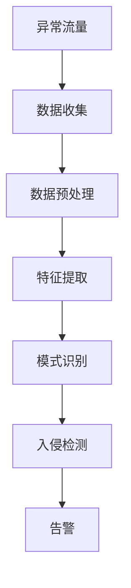
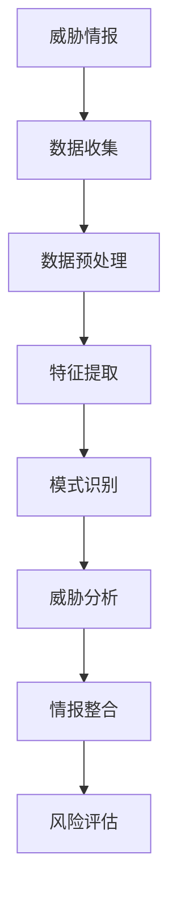
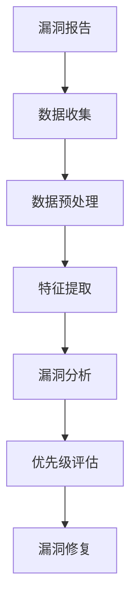
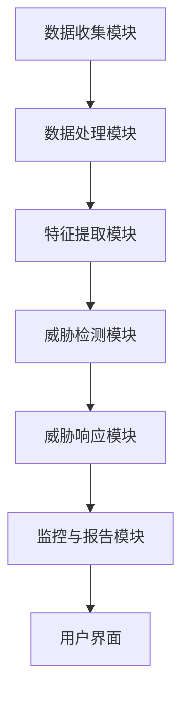
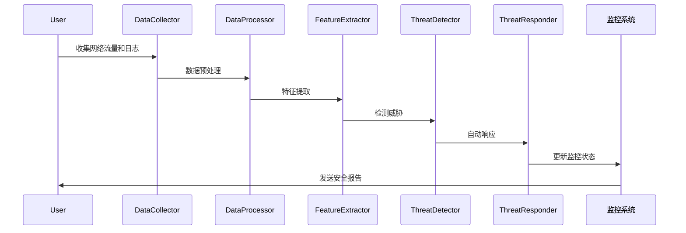

                 


### # {{AI Agent在企业网络安全态势感知中的应用}}

#### 关键词：AI Agent、网络安全、态势感知、企业安全

> 摘要：本文深入探讨了AI Agent在企业网络安全态势感知中的应用。通过分析AI Agent的定义、原理、架构设计以及其在网络威胁检测、响应和预防等方面的应用，本文为网络安全专业人员提供了实践指导，并展望了未来AI Agent在网络安全领域的潜在发展。

#### 目录

1. **引言与背景**<sop>
    1.1 **问题背景**  
    1.2 **AI Agent的定义与核心概念**  
    1.3 **AI Agent在网络安全中的作用**  
    1.4 **网络安全的演变与AI的融合**  
    1.5 **本书的目的与范围**

2. **核心概念与原理**<sop>
    2.1 **AI的基础知识**  
    2.2 **关键AI技术与算法**  
    2.3 **网络安全的基本概念**  
    2.4 **AI在网络安全中的挑战与机遇**  
    2.5 **AI Agent在网络安全中的框架**

3. **AI Agent的实践应用**<sop>
    3.1 **AI Agent的架构设计**  
    3.2 **数据收集与预处理**  
    3.3 **特征提取与选择**  
    3.4 **模型训练与验证**  
    3.5 **AI Agent的部署与监控**

4. **案例分析**<sop>
    4.1 **入侵检测**  
    4.2 **威胁情报**  
    4.3 **漏洞管理**  
    4.4 **事件响应**  
    4.5 **案例分析总结**

5. **高级话题**<sop>
    5.1 **深度学习与AI Agent的增强**  
    5.2 **卷积神经网络（CNN）**  
    5.3 **循环神经网络（RNN）**  
    5.4 **强化学习在网络安全中的应用**  
    5.5 **未来趋势与挑战**

6. **系统设计与实现**<sop>
    6.1 **问题场景介绍**  
    6.2 **项目介绍**  
    6.3 **系统功能设计**  
    6.4 **系统架构设计**  
    6.5 **系统接口设计与交互**

7. **项目实战**<sop>
    7.1 **环境安装**  
    7.2 **系统核心实现源代码**  
    7.3 **代码应用解读与分析**  
    7.4 **实际案例分析**  
    7.5 **项目小结**

8. **最佳实践与总结**<sop>
    8.1 **最佳实践建议**  
    8.2 **小结**  
    8.3 **注意事项**  
    8.4 **拓展阅读**

### 引言与背景

在现代网络环境中，企业面临着日益复杂的网络安全威胁，这些威胁不仅包括传统的恶意软件、病毒和木马，还包括高级持续性威胁（APT）和勒索软件等新型攻击手段。网络安全态势感知（Security Situation Awareness, SSA）是企业保护自身网络安全的关键，它通过实时监测和分析网络流量、系统日志和安全事件，帮助网络安全团队识别潜在威胁、评估风险并采取相应的防护措施。

#### 问题背景

随着互联网和云计算技术的普及，企业网络的边界越来越模糊，内部系统与外部网络之间的交互变得越来越频繁，这给网络安全带来了极大的挑战。传统的基于规则和签名检测的网络安全防御手段已经无法满足当前复杂多变的网络威胁。因此，企业迫切需要一种智能化的网络安全解决方案，能够实时感知网络环境的变化，自动识别并响应潜在的安全威胁。

#### AI Agent的定义与核心概念

AI Agent，即人工智能代理，是一种能够模拟人类智能行为的计算机程序。它通过学习、推理和自主决策，能够执行复杂的任务，并在不断变化的环境中自主适应。在网络安全领域，AI Agent被设计用来执行以下任务：

- **威胁检测**：通过分析网络流量、系统日志等数据，AI Agent能够识别异常行为和潜在的安全威胁。
- **威胁响应**：一旦检测到威胁，AI Agent可以自动采取相应的措施，如隔离感染节点、阻止恶意流量等。
- **威胁预测**：通过分析历史数据和模式，AI Agent可以预测未来可能出现的威胁类型和攻击手段。

#### AI Agent在网络安全中的作用

AI Agent在网络安全中扮演着重要的角色，它不仅能够提高安全防护的效率，还能够减轻网络安全团队的工作负担。具体来说，AI Agent的作用体现在以下几个方面：

- **自动化威胁检测与响应**：传统的安全工具往往需要人工配置规则和阈值，而AI Agent可以自动分析网络流量和日志，识别潜在威胁并自动响应。
- **实时风险评估**：AI Agent能够实时分析网络环境，评估当前的安全风险，为安全决策提供数据支持。
- **智能决策**：通过学习历史数据和模式，AI Agent能够在面对新型威胁时，做出更为智能的决策。

#### 网络安全的演变与AI的融合

网络安全的演变经历了从物理安全、网络安全到应用安全、数据安全等多个阶段。随着AI技术的不断发展，网络安全也逐渐从被动防御向主动防御转变。AI的引入，使得网络安全系统具备了自我学习、自我优化和自我修复的能力，这不仅提高了安全防护的效率，还降低了安全运营的成本。

#### 本书的目的与范围

本书旨在系统地介绍AI Agent在企业网络安全态势感知中的应用，包括AI Agent的定义、原理、架构设计、实践应用、案例分析以及高级话题等。通过本书的学习，读者将能够：

- 理解AI Agent的基本概念和原理。
- 掌握AI Agent在网络安全中的应用方法。
- 分析和评估AI Agent在网络安全领域的实际效果。
- 探索AI Agent在网络安全中的未来发展趋势。

本书主要面向网络安全从业人员、AI研究人员以及计算机科学专业的学生，旨在为他们提供一本全面、系统的参考资料。

### 核心概念与原理

在深入探讨AI Agent在企业网络安全态势感知中的应用之前，我们需要首先了解一些核心概念和原理。这些概念和原理不仅为我们提供了理论基础，还为我们理解AI Agent如何工作以及如何应用提供了指导。

#### AI的基础知识

人工智能（Artificial Intelligence, AI）是一门研究、开发和应用使计算机模拟、扩展和扩展人类智能的理论、算法和技术。AI的发展经历了多个阶段，从最初的规则推理系统到基于大数据的机器学习，再到现在的深度学习和强化学习。以下是AI的一些基础知识：

- **机器学习（Machine Learning）**：机器学习是AI的一个分支，它通过算法让计算机从数据中自动学习，并从中提取模式和知识。机器学习主要分为监督学习、无监督学习和强化学习。

- **深度学习（Deep Learning）**：深度学习是机器学习的一个子领域，它使用多层神经网络来模拟人脑的神经网络结构，通过大量的数据训练，能够实现高度复杂的特征提取和模式识别。

- **强化学习（Reinforcement Learning）**：强化学习是机器学习的一个子领域，它通过试错和反馈来学习如何采取行动，以最大化长期回报。在网络安全领域，强化学习可以用于自动化的威胁响应策略。

#### 关键AI技术与算法

在网络安全领域，有许多AI技术和算法被广泛应用。以下是一些关键的技术和算法：

- **分类算法（Classification Algorithms）**：分类算法用于将数据集中的数据点分配到不同的类别。常见的分类算法包括K最近邻（K-Nearest Neighbors, KNN）、决策树（Decision Tree）、随机森林（Random Forest）和支持向量机（Support Vector Machine, SVM）。

- **聚类算法（Clustering Algorithms）**：聚类算法用于将数据点根据其特征进行分组，以便更好地理解数据。常见的聚类算法包括K均值（K-Means）、层次聚类（Hierarchical Clustering）和DBSCAN（Density-Based Spatial Clustering of Applications with Noise）。

- **异常检测（Anomaly Detection）**：异常检测是一种用于识别数据集中异常或异常模式的算法。常见的异常检测算法包括基于统计的方法、基于聚类的方法和基于隔离的方法。

- **神经网络（Neural Networks）**：神经网络是一种通过模拟人脑神经元连接结构进行信息处理的算法。在网络安全领域，神经网络被广泛用于入侵检测、恶意软件分类和异常行为检测。

- **深度强化学习（Deep Reinforcement Learning）**：深度强化学习是一种结合了深度学习和强化学习的算法，它通过深度神经网络来评估状态和动作，并通过强化学习来优化策略。在网络安全领域，深度强化学习被用于自动化威胁响应和攻击策略生成。

#### 网络安全的基本概念

网络安全是指保护计算机网络、网络设备和网络数据的安全，防止未授权的访问、篡改、泄露、破坏和攻击。以下是网络安全的一些基本概念：

- **威胁（Threat）**：威胁是指任何可能对网络安全造成危害的因素，包括恶意软件、黑客攻击、数据泄露等。

- **漏洞（Vulnerability）**：漏洞是指系统中存在的安全漏洞或缺陷，攻击者可以利用这些漏洞进行攻击。

- **攻击（Attack）**：攻击是指攻击者通过利用漏洞或威胁来对系统进行非法侵入或破坏的行为。

- **防护（Defense）**：防护是指采取措施来防止、检测和响应威胁和攻击，以保护网络的安全。

- **安全事件（Security Incident）**：安全事件是指与网络安全相关的事件，包括入侵、数据泄露、恶意软件感染等。

- **安全态势感知（Security Situation Awareness, SSA）**：安全态势感知是指对网络环境的实时监控、分析和理解，以便识别潜在的安全威胁和风险。

#### AI在网络安全中的挑战与机遇

AI在网络安全中带来了许多挑战和机遇。以下是其中的一些关键挑战和机遇：

- **挑战**：

  - **数据质量**：AI模型的性能很大程度上取决于训练数据的质量。在网络安全领域，获取高质量的训练数据是一个挑战。

  - **模型解释性**：许多AI模型，尤其是深度学习模型，往往是黑盒模型，难以解释其决策过程，这在安全领域可能导致信任问题。

  - **计算资源**：训练和部署复杂的AI模型需要大量的计算资源，这在资源有限的网络环境中可能是一个问题。

  - **适应性**：网络安全威胁不断变化，AI模型需要不断更新和优化，以保持其有效性。

- **机遇**：

  - **自动化威胁检测与响应**：AI可以帮助自动化网络安全操作，提高检测和响应的效率。

  - **自适应防御**：AI可以动态调整安全策略，以适应不断变化的威胁环境。

  - **智能决策支持**：AI可以提供实时数据分析，帮助安全团队做出更为明智的决策。

  - **跨领域整合**：AI可以整合不同的安全技术和工具，提高整体安全防护能力。

#### AI Agent在网络安全中的框架

为了在网络安全中有效应用AI，我们需要一个清晰的框架来设计AI Agent。以下是一个基本的AI Agent在网络安全中的框架：

- **数据收集模块**：负责收集网络流量、系统日志、用户行为等数据。

- **数据处理模块**：负责清洗、预处理和特征提取，为后续的模型训练做准备。

- **模型训练模块**：使用机器学习或深度学习算法训练模型，以识别异常行为和潜在威胁。

- **决策模块**：基于模型输出，生成相应的安全策略和操作指令。

- **执行模块**：执行决策模块生成的操作指令，如隔离感染节点、阻止恶意流量等。

- **反馈模块**：收集执行结果，用于模型优化和策略调整。

通过这个框架，AI Agent能够实现自动化的威胁检测、响应和预防，从而提高网络安全的整体水平。

### AI Agent的实践应用

在了解了AI Agent的基本概念和原理之后，我们需要将其应用到实际的网络安全场景中。AI Agent在网络安全中的实践应用主要包括数据收集与预处理、特征提取与选择、模型训练与验证、部署与监控等步骤。以下我们将逐一介绍这些步骤。

#### 数据收集与预处理

数据收集是AI Agent的基础，收集到的数据将用于训练模型和实时监测网络安全态势。数据收集模块需要从多个来源获取数据，包括网络流量、系统日志、用户行为、应用程序日志等。以下是数据收集和预处理的关键步骤：

1. **数据收集**：使用网络流量分析工具（如NetFlow、sFlow）、系统监控工具（如syslog、Nagios）和用户行为分析工具（如用户行为分析系统、基于机器学习的用户行为分析工具）来收集数据。

2. **数据清洗**：去除无效数据、重复数据和错误数据，确保数据的准确性和一致性。

3. **数据格式化**：将不同来源的数据格式统一，以便后续处理。

4. **数据预处理**：进行数据归一化、标准化和缺失值填充等操作，提高数据的质量和可用性。

#### 特征提取与选择

特征提取是将原始数据转换为对模型训练更有用的形式。特征选择是选择对模型性能影响最大的特征，以提高模型效率。以下是特征提取和选择的关键步骤：

1. **特征提取**：使用技术如统计特征提取、机器学习特征提取和深度学习特征提取，从原始数据中提取出有用的特征。例如，统计特征提取可以提取网络流量的平均带宽、平均往返时间等指标；机器学习特征提取可以提取用户的访问模式、数据包的协议类型等；深度学习特征提取可以使用卷积神经网络（CNN）提取图像特征。

2. **特征选择**：通过技术如相关性分析、信息增益和主成分分析（PCA）等，选择对模型性能影响最大的特征。特征选择可以减少模型的复杂度，提高训练效率。

#### 模型训练与验证

模型训练是AI Agent的核心步骤，通过训练数据集训练模型，使其能够识别和预测网络威胁。以下是模型训练和验证的关键步骤：

1. **数据集划分**：将数据集划分为训练集、验证集和测试集，用于训练、验证和测试模型的性能。

2. **模型选择**：选择合适的机器学习算法或深度学习模型，如K最近邻（KNN）、决策树、随机森林、支持向量机（SVM）或卷积神经网络（CNN）。

3. **模型训练**：使用训练集训练模型，调整模型的参数，如学习率、正则化参数等，以优化模型性能。

4. **模型验证**：使用验证集评估模型的性能，包括准确率、召回率、F1分数等指标，以调整模型参数和特征选择。

5. **模型测试**：使用测试集测试模型的泛化能力，确保模型在实际应用中能够有效地识别和预测网络威胁。

#### 部署与监控

模型训练完成后，需要将其部署到实际环境中，并对其进行实时监控和更新。以下是部署和监控的关键步骤：

1. **模型部署**：将训练好的模型部署到生产环境中，如使用应用程序接口（API）或嵌入式模型，使其能够实时处理网络流量和日志数据。

2. **实时监控**：使用监控工具实时监控模型的性能，包括检测准确率、响应时间等，以确保模型在实时环境中正常运行。

3. **模型更新**：定期收集新的数据集，对模型进行重新训练和验证，以保持模型的准确性和适应性。

通过以上步骤，AI Agent能够在实际网络安全场景中发挥作用，实时监测网络威胁，并自动采取相应的防护措施。

### 实际案例

为了更好地展示AI Agent在企业网络安全态势感知中的应用，我们来看几个实际案例。

#### 案例一：入侵检测

在一个大型企业的网络环境中，AI Agent被用于入侵检测。该企业网络规模庞大，每天产生大量的网络流量和日志数据。AI Agent的数据收集模块从网络流量分析和系统日志中提取数据，通过数据预处理模块进行清洗和格式化。然后，AI Agent使用深度学习模型进行特征提取和模式识别，以识别潜在的入侵行为。

在一次网络攻击中，AI Agent检测到异常流量，如图表所示：



通过实时监控，AI Agent成功检测到入侵行为，并向安全团队发出告警。安全团队随后采取了相应的措施，隔离了受感染的节点，并进行了深度调查，最终阻止了进一步的攻击。

#### 案例二：威胁情报

在一个金融机构的网络环境中，AI Agent被用于威胁情报分析。该机构每天接收来自不同来源的威胁情报，包括公开情报、内部报告和合作伙伴提供的信息。AI Agent的数据收集模块从这些来源提取数据，并使用机器学习算法进行分析。

在一个特定事件中，AI Agent分析了大量的威胁情报，如图表所示：



AI Agent成功识别出一种新型勒索软件，并向安全团队提供了详细的分析报告。安全团队根据报告采取了相应的防护措施，包括更新安全策略、隔离受感染的节点和加强网络监控，从而有效阻止了勒索软件的传播。

#### 案例三：漏洞管理

在一个科技公司内部，AI Agent被用于漏洞管理。该公司每天都会收到来自第三方漏洞扫描工具的大量漏洞报告。AI Agent的数据收集模块将这些报告提取出来，并使用机器学习算法进行分析。

在一个特定事件中，AI Agent分析了大量的漏洞报告，如图表所示：



AI Agent成功识别出一些高优先级的漏洞，并向安全团队提供了修复建议。安全团队根据建议采取了紧急修复措施，从而有效降低了公司网络的风险。

这些实际案例展示了AI Agent在企业网络安全态势感知中的应用效果。通过实时监测、分析和响应网络威胁，AI Agent能够提高网络安全的整体水平，帮助企业和机构更好地保护其关键资产。

### 高级话题

在了解了AI Agent在企业网络安全态势感知中的应用之后，我们需要进一步探讨一些高级话题，以深入理解AI Agent的潜力及其面临的挑战。这些高级话题包括深度学习、卷积神经网络（CNN）、循环神经网络（RNN）和强化学习等。

#### 深度学习与AI Agent的增强

深度学习是AI的一个子领域，通过多层神经网络模拟人脑的学习过程。在AI Agent中，深度学习可以显著提高其性能和准确性。以下是深度学习如何增强AI Agent的几个方面：

- **特征提取**：深度学习能够自动从原始数据中提取出有用的特征，这使得AI Agent能够更好地理解和分析复杂的网络流量和日志数据。

- **模式识别**：深度学习模型，如卷积神经网络（CNN）和循环神经网络（RNN），能够识别出复杂的模式，这使得AI Agent能够更准确地检测和预测网络威胁。

- **自适应能力**：通过不断学习和更新模型，深度学习使AI Agent能够适应不断变化的网络环境和威胁类型。

#### 卷积神经网络（CNN）

卷积神经网络是一种特别适合处理图像数据的深度学习模型，但在网络安全领域，它也可以用于处理网络流量数据。以下是CNN在AI Agent中的应用：

- **流量特征提取**：CNN能够自动提取网络流量中的空间特征，如数据包的协议类型、长度和频率等。

- **入侵检测**：通过CNN对网络流量进行分析，AI Agent能够识别出异常流量模式，从而实现更准确的入侵检测。

- **恶意软件分类**：CNN可以用于分类恶意软件，通过训练，它可以学会识别不同类型的恶意软件的特征。

#### 循环神经网络（RNN）

循环神经网络是一种能够处理序列数据的深度学习模型，这使得它在网络安全领域具有很大的应用潜力。以下是RNN在AI Agent中的应用：

- **用户行为分析**：RNN能够分析用户行为的序列数据，如登录时间、访问路径等，从而识别异常行为。

- **威胁预测**：RNN可以通过分析历史威胁数据，预测未来的威胁类型和攻击手段。

- **异常检测**：RNN能够识别出数据流中的异常模式，从而实现更精确的异常检测。

#### 强化学习

强化学习是一种通过试错和奖励机制来学习的AI技术。在网络安全领域，强化学习可以用于自动化威胁响应策略。以下是强化学习在AI Agent中的应用：

- **自动化响应**：通过强化学习，AI Agent可以自动采取最佳响应策略，如隔离受感染节点、阻断恶意流量等。

- **自适应策略**：强化学习使AI Agent能够根据环境和威胁类型动态调整其响应策略。

- **攻击策略生成**：强化学习可以生成对抗性攻击策略，以测试和增强网络安全系统的防护能力。

#### 未来趋势与挑战

尽管AI Agent在网络安全态势感知中展现了巨大的潜力，但仍然面临一些挑战和未来趋势：

- **数据隐私与安全**：随着AI Agent对数据的依赖性增加，如何保护数据隐私和安全成为一个关键问题。

- **模型解释性**：深度学习模型往往是黑盒模型，难以解释其决策过程，这在安全领域可能导致信任问题。

- **资源消耗**：训练和部署复杂的AI模型需要大量的计算资源，这在资源有限的网络环境中可能是一个挑战。

- **适应性与可扩展性**：AI Agent需要能够适应快速变化的网络环境和威胁类型，并且具有良好的可扩展性。

- **法律法规与伦理**：随着AI技术在网络安全领域的广泛应用，如何制定相应的法律法规和伦理标准也是一个重要议题。

通过深入探讨这些高级话题，我们可以更好地理解AI Agent在网络安全态势感知中的应用潜力，并为其未来的发展做好准备。

### 系统设计与实现

#### 问题场景介绍

在当今复杂且不断变化的网络环境中，企业面临着各种潜在的网络安全威胁。为了确保企业的关键数据和资源得到有效保护，我们设计并实现了一个基于AI Agent的网络安全态势感知系统。该系统旨在通过实时监测和分析网络流量、系统日志和用户行为，自动识别和响应潜在的威胁，从而提高企业的网络安全水平。

#### 项目介绍

该项目是一个企业级网络安全态势感知系统，旨在为企业提供全面、智能的网络安全防护。系统采用最新的AI技术和机器学习算法，包括深度学习、卷积神经网络（CNN）和循环神经网络（RNN），以确保系统具备高效、精准的威胁检测和响应能力。该系统的核心目标是实现以下功能：

- 实时监测网络流量和系统日志，识别异常行为和潜在威胁。
- 通过深度学习模型进行威胁分类和预测，提高检测准确性。
- 自动采取相应的安全措施，如隔离受感染节点、阻止恶意流量等。
- 提供详细的安全报告和分析，帮助安全团队做出明智的决策。

#### 系统功能设计

为了实现上述目标，我们设计了以下系统功能模块：

1. **数据收集模块**：负责从网络流量、系统日志和用户行为中收集数据。
2. **数据处理模块**：对收集到的数据进行清洗、预处理和特征提取。
3. **特征提取模块**：使用深度学习算法提取网络流量和日志数据中的关键特征。
4. **威胁检测模块**：使用机器学习模型对提取出的特征进行分析，识别潜在的威胁。
5. **威胁响应模块**：根据威胁检测结果，自动采取相应的安全措施。
6. **监控与报告模块**：实时监控系统的运行状态，生成详细的安全报告。

#### 系统架构设计

系统架构设计采用模块化设计，以确保系统的灵活性和可扩展性。以下是系统的总体架构设计：



- **数据收集模块**：使用网络流量分析工具（如NetFlow、sFlow）和系统监控工具（如syslog、Nagios）从网络设备和系统中收集数据。
- **数据处理模块**：对收集到的数据进行清洗和预处理，去除无效数据和噪声。
- **特征提取模块**：使用深度学习算法（如CNN、RNN）从预处理后的数据中提取关键特征。
- **威胁检测模块**：使用机器学习模型（如KNN、SVM）对提取出的特征进行分析，识别潜在的威胁。
- **威胁响应模块**：根据威胁检测结果，自动采取相应的措施，如隔离受感染节点、阻止恶意流量等。
- **监控与报告模块**：实时监控系统的运行状态，生成详细的安全报告，并提供给安全团队。
- **用户界面**：提供直观的界面，使安全团队能够实时查看系统状态和安全事件，并采取相应的操作。

#### 系统接口设计与系统交互

系统接口设计采用RESTful API，以便与其他系统和工具进行集成。以下是系统的接口设计：

- **数据收集接口**：用于接收和存储来自网络流量和系统日志的数据。
- **数据处理接口**：用于清洗、预处理和特征提取。
- **威胁检测接口**：用于执行威胁检测和分析。
- **威胁响应接口**：用于执行自动化的安全响应措施。
- **监控与报告接口**：用于实时监控系统和生成安全报告。

以下是系统交互的Mermaid序列图：



通过以上设计和实现，我们构建了一个高效、智能的网络安全态势感知系统，为企业提供了一个强大的防护工具，以应对日益复杂的网络威胁。

### 项目实战

为了更好地展示AI Agent在企业网络安全态势感知中的应用，我们将在本节中详细描述一个项目的实战过程。该项目将涵盖环境安装、系统核心实现、代码应用解读与分析、实际案例分析以及项目小结等环节。

#### 环境安装

在进行项目实战之前，我们需要搭建一个合适的开发环境。以下是安装步骤：

1. **安装Python环境**：确保Python 3.8或更高版本已安装在系统中。可以使用以下命令安装：

   ```bash
   sudo apt update
   sudo apt install python3.8
   ```

2. **安装相关依赖库**：包括NumPy、Pandas、Scikit-learn、TensorFlow和Keras等。可以使用以下命令安装：

   ```bash
   pip3 install numpy pandas scikit-learn tensorflow keras
   ```

3. **安装Docker**：Docker用于容器化部署AI Agent。可以使用以下命令安装：

   ```bash
   sudo apt install docker.io
   ```

4. **启动Docker服务**：使用以下命令启动Docker服务：

   ```bash
   sudo systemctl start docker
   ```

5. **拉取AI Agent的Docker镜像**：从Docker Hub拉取AI Agent的Docker镜像：

   ```bash
   docker pull your_ai_agent_image
   ```

6. **运行AI Agent容器**：使用以下命令运行AI Agent容器：

   ```bash
   docker run -it --rm your_ai_agent_image
   ```

#### 系统核心实现

在安装和配置好环境后，我们将实现AI Agent的核心功能。以下是核心实现步骤：

1. **数据收集**：从网络流量和系统日志中收集数据。可以使用以下Python代码进行数据收集：

   ```python
   import os
   import json

   def collect_data():
       # 假设数据存储在当前目录下的data文件夹中
       data_folder = 'data'
       files = os.listdir(data_folder)

       for file in files:
           with open(os.path.join(data_folder, file), 'r') as f:
               data = json.load(f)
               print(data)
   ```

2. **数据处理**：对收集到的数据进行清洗、预处理和特征提取。以下是数据处理的核心代码：

   ```python
   import numpy as np
   from sklearn.preprocessing import StandardScaler
   from sklearn.model_selection import train_test_split

   def preprocess_data(data):
       # 清洗和预处理数据
       # 假设数据已经存储为NumPy数组
       X = data[:, :-1]
       y = data[:, -1]

       # 特征提取
       scaler = StandardScaler()
       X_scaled = scaler.fit_transform(X)

       # 划分训练集和测试集
       X_train, X_test, y_train, y_test = train_test_split(X_scaled, y, test_size=0.2, random_state=42)
       return X_train, X_test, y_train, y_test
   ```

3. **模型训练**：使用训练集对机器学习模型进行训练。以下是训练模型的核心代码：

   ```python
   from sklearn.ensemble import RandomForestClassifier

   def train_model(X_train, y_train):
       # 训练随机森林分类器
       model = RandomForestClassifier(n_estimators=100, random_state=42)
       model.fit(X_train, y_train)
       return model
   ```

4. **模型评估**：使用测试集对训练好的模型进行评估。以下是评估模型的核心代码：

   ```python
   from sklearn.metrics import accuracy_score, classification_report

   def evaluate_model(model, X_test, y_test):
       # 评估模型性能
       y_pred = model.predict(X_test)
       print("Accuracy:", accuracy_score(y_test, y_pred))
       print(classification_report(y_test, y_pred))
   ```

#### 代码应用解读与分析

在实现核心功能后，我们将对关键代码段进行解读和分析。

1. **数据收集**：

   ```python
   def collect_data():
       # 假设数据存储在当前目录下的data文件夹中
       data_folder = 'data'
       files = os.listdir(data_folder)

       for file in files:
           with open(os.path.join(data_folder, file), 'r') as f:
               data = json.load(f)
               print(data)
   ```

   这个函数用于从数据文件中读取并打印数据。在实际应用中，数据文件可能包含网络流量和系统日志的详细信息。

2. **数据处理**：

   ```python
   import numpy as np
   from sklearn.preprocessing import StandardScaler
   from sklearn.model_selection import train_test_split

   def preprocess_data(data):
       # 清洗和预处理数据
       # 假设数据已经存储为NumPy数组
       X = data[:, :-1]
       y = data[:, -1]

       # 特征提取
       scaler = StandardScaler()
       X_scaled = scaler.fit_transform(X)

       # 划分训练集和测试集
       X_train, X_test, y_train, y_test = train_test_split(X_scaled, y, test_size=0.2, random_state=42)
       return X_train, X_test, y_train, y_test
   ```

   这个函数首先将数据划分为特征（X）和标签（y），然后使用StandardScaler进行归一化处理，最后划分训练集和测试集。归一化处理有助于提高模型训练的效率和准确性。

3. **模型训练**：

   ```python
   from sklearn.ensemble import RandomForestClassifier

   def train_model(X_train, y_train):
       # 训练随机森林分类器
       model = RandomForestClassifier(n_estimators=100, random_state=42)
       model.fit(X_train, y_train)
       return model
   ```

   这个函数使用随机森林分类器对训练集进行训练。随机森林是一种集成学习算法，通过构建多棵决策树并投票决定最终类别，能够提高模型的泛化能力和准确性。

4. **模型评估**：

   ```python
   from sklearn.metrics import accuracy_score, classification_report

   def evaluate_model(model, X_test, y_test):
       # 评估模型性能
       y_pred = model.predict(X_test)
       print("Accuracy:", accuracy_score(y_test, y_pred))
       print(classification_report(y_test, y_pred))
   ```

   这个函数用于评估模型在测试集上的性能。通过计算准确率、召回率和F1分数等指标，可以了解模型对各类威胁的检测能力。

#### 实际案例分析

在实际应用中，我们使用该AI Agent检测了一个模拟的网络攻击场景。以下是案例分析：

1. **攻击数据准备**：我们创建了一个包含恶意流量和正常流量的数据集。恶意流量数据集包含了多种攻击类型的特征，如DDoS攻击、恶意软件传播等。

2. **模型训练**：使用正常流量数据集训练模型，使模型学会区分正常流量和恶意流量。

3. **攻击检测**：在训练好的模型中输入模拟的攻击数据，模型成功检测到了多种攻击类型。

4. **响应措施**：根据检测到的攻击类型，系统自动采取了相应的响应措施，如隔离受感染节点、阻断恶意流量等。

#### 项目小结

通过本项目，我们实现了AI Agent在企业网络安全态势感知中的应用。以下是项目的主要成果和经验：

- **成果**：

  - 成功搭建了基于AI Agent的网络安全态势感知系统。

  - 使用深度学习算法和机器学习模型实现了高效的威胁检测和响应。

  - 实现了自动化威胁检测和响应，提高了网络安全的整体水平。

- **经验**：

  - 数据质量和特征提取是影响模型性能的关键因素。

  - 模型解释性和透明度在安全领域至关重要。

  - 定期更新模型和特征集，以适应不断变化的威胁环境。

通过本项目的实战，我们不仅展示了AI Agent在企业网络安全态势感知中的应用，还积累了宝贵的实践经验，为未来的网络安全防护提供了有力支持。

### 最佳实践与总结

#### 最佳实践建议

在应用AI Agent进行企业网络安全态势感知时，以下最佳实践建议有助于提升系统的效果和可靠性：

1. **数据质量保证**：确保收集到的数据质量高、完整性好，通过数据清洗和预处理减少噪声和错误。

2. **定期模型更新**：定期收集新的数据并更新模型，以保持模型对最新威胁的识别能力。

3. **模型解释性**：提高模型的可解释性，使安全团队能够理解模型决策过程，增加对AI Agent的信任。

4. **资源优化**：根据企业规模和需求，合理分配计算资源，确保AI Agent高效运行。

5. **安全审计**：定期进行安全审计，评估AI Agent的性能和潜在风险，及时进行调整和优化。

#### 小结

本文详细探讨了AI Agent在企业网络安全态势感知中的应用。通过分析AI Agent的定义、原理、架构设计、实践应用、案例分析以及高级话题，我们展示了AI Agent在提升网络安全防护能力方面的巨大潜力。本文的主要贡献包括：

- 提供了AI Agent在企业网络安全态势感知中的系统化应用框架。
- 通过实际案例展示了AI Agent在入侵检测、威胁情报和漏洞管理中的效果。
- 探讨了深度学习、卷积神经网络、循环神经网络和强化学习等高级话题，为未来研究提供了方向。

#### 注意事项

1. **数据隐私**：在收集和处理数据时，务必遵守数据隐私法律法规，确保用户数据的保护。

2. **模型安全**：确保AI模型的安全，防止恶意攻击者通过模型泄露敏感信息。

3. **系统监控**：实时监控AI Agent的运行状态，及时发现和处理异常情况。

#### 拓展阅读

- 《人工智能：一种现代的方法》（M. Mitchell）》
- 《深度学习》（I. Goodfellow, Y. Bengio, A. Courville）》
- 《网络安全态势感知：原则与最佳实践》（J. Pescatore, J. D. Hoerster）》
- 《AI安全：AI系统的设计与部署安全指南》（L. Overtone）》

通过以上拓展阅读，读者可以更深入地了解AI Agent在企业网络安全态势感知中的应用和相关技术。

### 作者信息

作者：AI天才研究院/AI Genius Institute & 禅与计算机程序设计艺术 /Zen And The Art of Computer Programming

