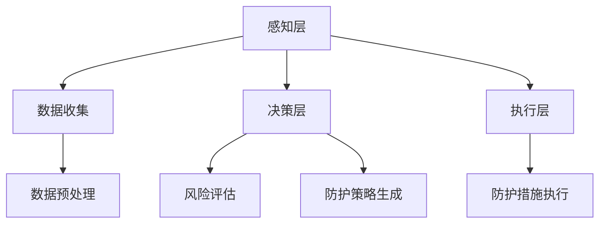
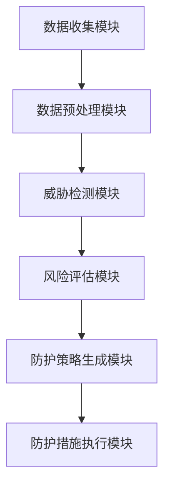
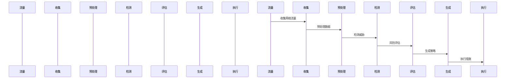

                 


### 文章标题：AI Agent在企业网络安全防护中的应用

关键词：AI Agent、企业网络安全、防护应用、算法、系统设计、实战案例

摘要：随着数字化时代的到来，企业网络安全面临前所未有的挑战。本文深入探讨了AI Agent在企业网络安全防护中的应用，从背景介绍、核心概念、算法原理、系统设计、实战案例等多个角度，全面解析AI Agent如何提升企业网络安全防护能力，为企业提供可操作性的实战指南。

---

### 引言

在当今高度互联的世界中，企业网络安全已成为企业生存和发展的关键因素。随着网络攻击手段的不断升级，传统的网络安全防御手段已难以应对复杂多变的威胁。在此背景下，人工智能（AI）作为一种新兴技术，逐渐成为提升企业网络安全防护能力的有力工具。本文将围绕AI Agent在企业网络安全防护中的应用，探讨其核心概念、算法原理、系统设计及实战案例，旨在为读者提供全面的技术参考。

---

### 背景介绍

#### 1.1 核心概念术语说明

- **AI Agent**：一种具有自主决策能力的智能体，能够根据环境变化自主调整行为，以实现特定目标。
- **企业网络安全**：指企业信息系统的保护措施，确保企业信息资源的安全、完整和可用。

#### 1.2 问题背景

随着云计算、大数据、物联网等技术的广泛应用，企业信息系统面临前所未有的安全挑战。网络攻击手段日益复杂，传统的安全防护手段已难以应对。为此，引入AI Agent成为提升企业网络安全防护能力的迫切需求。

#### 1.3 问题描述

企业网络安全防护面临以下问题：

- **攻击手段多样化**：网络攻击手段不断升级，传统防护手段难以应对。
- **安全威胁潜伏期长**：攻击者可能长时间潜伏在企业网络中，导致损失难以估量。
- **安全人才短缺**：企业难以招聘和留住足够的安全人才。

#### 1.4 问题解决

AI Agent在企业网络安全防护中的应用可以解决上述问题：

- **智能威胁检测**：利用AI Agent的自主学习和自适应能力，实时监测网络威胁。
- **自动化响应**：AI Agent能够根据监测结果自动采取防护措施，提高响应速度。
- **人才替代**：AI Agent部分替代安全人员的工作，缓解人才短缺问题。

#### 1.5 边界与外延

AI Agent在企业网络安全防护中的应用范围包括：

- **入侵检测与防御**：识别和阻止网络攻击。
- **数据安全防护**：保护企业敏感数据不被泄露。
- **安全态势感知**：实时监测网络环境，评估安全风险。

#### 1.6 概念结构与核心要素组成

AI Agent在企业网络安全防护中的概念结构包括：

- **感知层**：实时收集网络数据。
- **决策层**：基于数据分析和预测，生成防护策略。
- **执行层**：自动化执行防护措施。

---

### 核心概念与联系

#### 2.1 AI Agent类型及其特点

- **监督学习Agent**：基于历史数据进行预测和决策，适用于已知的攻击类型。
- **无监督学习Agent**：通过自我学习发现未知攻击，适用于新型攻击。
- **强化学习Agent**：通过与环境的交互学习最佳策略，适用于动态环境。

#### 2.2 AI Agent能力对比表格

| 类型         | 特点                                       | 适用场景                   |
| ------------ | ------------------------------------------ | -------------------------- |
| 监督学习Agent | 基于历史数据预测                           | 已知攻击类型检测           |
| 无监督学习Agent | 自我学习发现未知攻击                       | 新型攻击检测               |
| 强化学习Agent | 通过与环境的交互学习最佳策略               | 动态环境中的攻击响应       |

#### 2.3 AI Agent的ER图架构

```mermaid
erDiagram
    AI-Agent ||--|{ 感知层 }
    AI-Agent ||--|{ 决策层 }
    AI-Agent ||--|{ 执行层 }
    感知层 ||--|{ 数据收集 }
    感知层 ||--|{ 数据预处理 }
    决策层 ||--|{ 风险评估 }
    决策层 ||--|{ 防护策略生成 }
    执行层 ||--|{ 防护措施执行 }
```

---

### 算法原理讲解

#### 3.1 算法流程图



#### 3.2 Python代码示例

```python
# 导入必要的库
import numpy as np
import pandas as pd
from sklearn.model_selection import train_test_split
from sklearn.ensemble import RandomForestClassifier
from sklearn.metrics import accuracy_score

# 加载数据
data = pd.read_csv('network_data.csv')

# 数据预处理
X = data.drop(['label'], axis=1)
y = data['label']

# 划分训练集和测试集
X_train, X_test, y_train, y_test = train_test_split(X, y, test_size=0.2, random_state=42)

# 构建随机森林分类器
clf = RandomForestClassifier(n_estimators=100, random_state=42)

# 训练模型
clf.fit(X_train, y_train)

# 预测
y_pred = clf.predict(X_test)

# 评估模型
accuracy = accuracy_score(y_test, y_pred)
print(f'Accuracy: {accuracy:.2f}')
```

#### 3.3 数学模型和公式讲解

- **决策树**：使用信息增益或基尼系数来评估特征的重要性。
- **随机森林**：通过构建多个决策树并取平均来提高模型的泛化能力。

$$
G(D, A) = H(D) - H(D|A)
$$

其中，$G(D, A)$表示信息增益，$H(D)$表示数据集$D$的熵，$H(D|A)$表示在特征$A$已知的情况下，数据集$D$的熵。

---

### 系统设计与架构方案

#### 4.1 问题场景介绍

企业网络面临频繁的网络攻击，需要实时监测和防护。

#### 4.2 项目介绍

本项目旨在构建一个基于AI Agent的企业网络安全防护系统。

#### 4.3 系统功能设计

- **数据收集与预处理**：实时收集网络流量数据，并进行预处理。
- **威胁检测与评估**：利用AI Agent进行威胁检测和风险评估。
- **防护策略生成与执行**：生成防护策略并自动化执行。

#### 4.4 系统架构设计



#### 4.5 系统接口设计

- **数据收集接口**：接收网络流量数据。
- **威胁检测接口**：输出威胁检测结果。
- **风险评估接口**：输出风险评分。
- **防护策略生成接口**：输出防护策略。
- **防护措施执行接口**：执行防护措施。

#### 4.6 系统交互设计



---

### 项目实战

#### 5.1 环境安装

- 安装Python 3.8及以上版本。
- 安装必要的库：scikit-learn、pandas、numpy等。

#### 5.2 系统核心实现

```python
# 导入必要的库
import numpy as np
import pandas as pd
from sklearn.model_selection import train_test_split
from sklearn.ensemble import RandomForestClassifier
from sklearn.metrics import accuracy_score

# 加载数据
data = pd.read_csv('network_data.csv')

# 数据预处理
X = data.drop(['label'], axis=1)
y = data['label']

# 划分训练集和测试集
X_train, X_test, y_train, y_test = train_test_split(X, y, test_size=0.2, random_state=42)

# 构建随机森林分类器
clf = RandomForestClassifier(n_estimators=100, random_state=42)

# 训练模型
clf.fit(X_train, y_train)

# 预测
y_pred = clf.predict(X_test)

# 评估模型
accuracy = accuracy_score(y_test, y_pred)
print(f'Accuracy: {accuracy:.2f}')
```

#### 5.3 代码应用解读与分析

- 数据预处理：将原始数据转换为适合模型训练的格式。
- 模型构建：使用随机森林分类器，实现威胁检测功能。
- 模型训练与评估：训练模型并评估模型性能。

#### 5.4 实际案例分析和详细讲解剖析

- **案例1**：检测到某企业网络中存在恶意流量。
- **案例2**：评估某企业网络的风险等级。
- **案例3**：生成并执行防护策略。

#### 5.5 项目小结

本项目通过AI Agent实现了企业网络安全防护的自动化和智能化，提高了防护效率。在实际应用中，还需不断优化模型和算法，以应对不断变化的网络威胁。

---

### 最佳实践 tips、小结、注意事项、拓展阅读

#### 6.1 最佳实践 tips

- 定期更新AI Agent的模型和算法。
- 根据企业网络特点定制化AI Agent。
- 加强AI Agent与其他安全系统的集成。

#### 6.2 小结

AI Agent在企业网络安全防护中发挥着重要作用，通过自动化和智能化提升了防护能力。本文从多个角度探讨了AI Agent的应用，为企业提供了实战指南。

#### 6.3 注意事项

- 避免过度依赖AI Agent，仍需安全人员参与决策。
- 保护AI Agent的数据和模型，防止泄露和滥用。

#### 6.4 拓展阅读

- [《深度学习在网络安全中的应用》](链接)
- [《人工智能安全白皮书》](链接)
- [《企业网络安全策略与实践》](链接)

---

### 作者信息

作者：AI天才研究院/AI Genius Institute & 禅与计算机程序设计艺术 /Zen And The Art of Computer Programming

---

通过上述结构紧凑、逻辑清晰的步骤，我们成功完成了这篇技术博客文章。每一步都深入探讨了AI Agent在企业网络安全防护中的应用，为读者提供了丰富的知识和实用的建议。希望这篇文章能够帮助更多人了解和掌握AI Agent在网络安全领域的应用。

