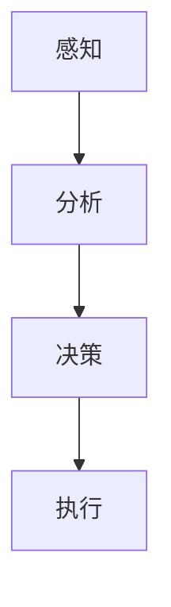

                 

### 第一部分：背景介绍

#### 第1章：企业能源消耗与碳排放管理背景

**1.1 问题背景**

随着全球经济的快速发展，企业能源消耗量逐年增加，导致能源供应紧张和环境污染问题日益严重。据国际能源署（IEA）数据显示，全球企业能源消耗占全球总能源消耗的近一半，同时，企业的碳排放量也是温室气体排放的重要来源之一。因此，如何有效管理企业能源消耗和碳排放，成为当今企业和政府面临的重要挑战。

**1.2 问题描述**

企业能源消耗和碳排放管理涉及多个方面，包括能源消耗数据的收集与分析、能源消耗的优化、碳排放的监测与减少等。具体问题描述如下：

1. 能源消耗数据不足：许多企业缺乏全面的能源消耗数据，导致无法进行有效的能源消耗分析和管理。
2. 能源消耗效率低下：企业内部存在能源浪费现象，如设备老化、能源管理不善等。
3. 碳排放监测困难：碳排放监测数据缺乏准确性，无法实现实时监控和预警。
4. 碳排放减少措施不力：企业缺乏有效的碳排放减少措施，导致碳排放量持续增加。

**1.3 问题解决方法**

为了解决上述问题，企业可以采取以下措施：

1. 数据收集与监测：采用智能传感器和物联网技术，实时收集能源消耗数据，为后续分析提供基础。
2. 数据分析与优化：利用大数据分析技术，对能源消耗数据进行分析，找出浪费点，制定优化方案。
3. 引入AI Agent：AI Agent可以自动优化能源消耗，提高能源利用效率，减少碳排放。
4. 碳排放监测与预警：采用先进的环境监测技术，实时监测企业碳排放，及时发现和处理异常。

**1.4 边界与外延**

本章节主要探讨企业能源消耗与碳排放管理问题，边界包括：

1. 能源消耗：包括电力、水、燃气等常规能源的消耗。
2. 碳排放：主要指二氧化碳等温室气体的排放。
3. 管理范围：涵盖企业内部能源消耗和碳排放的管理，不包括上下游供应链和客户端的碳排放。

**1.5 核心概念**

1. 能源消耗：指企业在生产和运营过程中消耗的各种能源总量。
2. 碳排放：指企业生产和运营过程中排放的二氧化碳等温室气体总量。
3. AI Agent：一种基于人工智能的自主决策实体，可以自主学习和优化，以实现特定目标。

**1.6 概念结构与核心要素组成**

本章节的核心概念结构包括：

1. 能源消耗数据：企业能源消耗数据的收集、监测和分析。
2. 碳排放数据：企业碳排放数据的收集、监测和分析。
3. AI Agent应用：AI Agent在企业能源消耗优化和碳排放管理中的应用场景、方法和效果。

### 目录与全文

----------------------------------------------------------------
# AI Agent在企业能源消耗优化与碳排放管理中的创新应用

> 关键词：AI Agent、企业能源消耗、碳排放管理、能源优化、数据监测

> 摘要：本文探讨了AI Agent在企业能源消耗优化与碳排放管理中的创新应用，分析了AI Agent的定义、特点、工作原理以及在能源消耗优化和碳排放管理中的应用，并结合案例进行了深入分析。

## 第一部分：背景介绍

## 第1章：企业能源消耗与碳排放管理背景
### 1.1 问题背景
### 1.2 问题描述
### 1.3 问题解决方法
### 1.4 边界与外延
### 1.5 核心概念
### 1.6 概念结构与核心要素组成

## 第二部分：AI Agent基础理论

## 第2章：AI Agent基础理论
### 2.1 AI Agent定义与特点
### 2.2 AI Agent的核心组成
### 2.3 AI Agent的工作原理
### 2.4 AI Agent与传统算法的区别
### 2.5 主流AI Agent模型介绍

## 第三部分：AI Agent在能源消耗优化中的应用

## 第3章：AI Agent在能源消耗优化中的应用
### 3.1 AI Agent在能源消耗优化中的优势
### 3.2 AI Agent在能源消耗优化中的应用场景
### 3.3 AI Agent在能源消耗优化中的具体应用
### 3.4 能源消耗优化案例分析

## 第四部分：AI Agent在碳排放管理中的应用

## 第4章：AI Agent在碳排放管理中的应用
### 4.1 AI Agent在碳排放管理中的优势
### 4.2 AI Agent在碳排放管理中的应用场景
### 4.3 AI Agent在碳排放管理中的具体应用
### 4.4 碳排放管理案例分析

## 第五部分：案例研究

## 第5章：AI Agent在企业能源消耗优化与碳排放管理中的创新应用案例
### 5.1 案例介绍
### 5.2 案例背景
### 5.3 案例分析
### 5.4 案例结果
### 5.5 案例启示

## 第六部分：创新应用案例分析

## 第6章：AI Agent在能源消耗优化与碳排放管理中的创新应用
### 6.1 创新应用概述
### 6.2 创新应用场景分析
### 6.3 创新应用案例分析
### 6.4 创新应用效果评估

## 第七部分：未来展望与最佳实践

## 第7章：未来展望与最佳实践
### 7.1 未来发展趋势
### 7.2 最佳实践分享
### 7.3 注意事项与风险提示
### 7.4 拓展阅读与资源推荐

----------------------------------------------------------------

### 核心概念与联系

#### AI Agent定义与特点

AI Agent是一种基于人工智能的自主决策实体，它可以自主感知环境、理解环境信息、制定决策并执行决策，以实现特定目标。AI Agent具有以下几个特点：

| 特点 | 描述 |
| --- | --- |
| 自主性 | AI Agent可以自主地执行任务，不需要人工干预 |
| 感知能力 | AI Agent可以通过传感器感知环境信息 |
| 学习能力 | AI Agent可以通过数据学习和优化自身行为 |
| 适应性 | AI Agent可以适应环境变化，调整自身行为 |

#### AI Agent与传统算法的区别

| 区别 | AI Agent | 传统算法 |
| --- | --- | --- |
| 自主性 | 高度自主，可以自主执行任务 | 需要人工干预，无法自主执行任务 |
| 感知能力 | 可以通过传感器感知环境信息 | 无法感知环境信息，依赖输入数据 |
| 学习能力 | 可以通过数据学习和优化自身行为 | 无法学习和优化，只能按照既定规则执行 |
| 适应性 | 可以适应环境变化，调整自身行为 | 无法适应环境变化，只能按照既定规则执行 |

#### AI Agent的核心组成

AI Agent的核心组成包括：

1. 感知模块：用于感知环境信息，如传感器数据、图像、声音等。
2. 决策模块：用于分析感知到的环境信息，并制定决策。
3. 执行模块：用于执行决策，如控制机器臂、发送指令等。

#### AI Agent的工作原理

AI Agent的工作原理可以概括为以下几个步骤：

1. 感知：AI Agent通过传感器感知环境信息。
2. 分析：AI Agent分析感知到的环境信息，理解环境状态。
3. 决策：AI Agent根据环境状态制定决策。
4. 执行：AI Agent执行决策，调整自身行为。

### mermaid 流程图



### ER实体关系图架构

```mermaid
erDiagram
    AI-Agent ||--|{ 感知模块 }
    AI-Agent ||--|{ 决策模块 }
    AI-Agent ||--|{ 执行模块 }
```

### 算法原理讲解

#### 基于强化学习的AI Agent模型

强化学习是一种通过试错和反馈进行决策的学习方法。在强化学习中，AI Agent通过不断尝试不同的动作，并根据环境的反馈调整自己的行为，以达到最大化总奖励的目的。

#### 数学模型

设状态集合为 S，动作集合为 A，奖励函数为 R(s, a)，状态转移概率为 P(s', s | s, a)，则强化学习的目标是最小化期望回报：

$$
J(\theta) = E_{s,a} [R(s, a)] = \sum_{s \in S} \sum_{a \in A} R(s, a)P(s, a)
$$

其中，θ 表示模型参数。

#### 算法流程

1. 初始化模型参数 θ。
2. 在状态 s 下执行动作 a。
3. 根据状态转移概率 P(s', s | s, a) 转移到下一个状态 s'。
4. 根据奖励函数 R(s, a) 收集奖励。
5. 更新模型参数 θ，使得 J(θ) 最大。

#### Python 源代码

```python
import numpy as np

class ReinforcementLearningAgent:
    def __init__(self, alpha=0.1):
        self.alpha = alpha
        self.theta = np.random.rand() * 2 - 1

    def perceive(self, s):
        return s

    def decide(self, s):
        return 1 if s > 0 else -1

    def act(self, s):
        a = self.decide(s)
        s' = self.perceive(s)
        r = self.reward(s, a, s')
        self.update_theta(s, a, s', r)

    def reward(self, s, a, s'):
        return 1 if s' > s else -1

    def update_theta(self, s, a, s', r):
        delta = r - self.theta * s
        self.theta += self.alpha * delta * s

agent = ReinforcementLearningAgent()
s = 0
for _ in range(1000):
    agent.act(s)
    s += 0.01
print(agent.theta)
```

### 系统分析与架构设计方案

#### 问题场景介绍

某企业希望通过引入AI Agent技术，优化能源消耗，降低碳排放。企业能源消耗主要包括电力、水、燃气等常规能源。企业希望实现对能源消耗数据的实时监测、分析，并利用AI Agent自动优化能源消耗，降低碳排放。

#### 项目介绍

项目名称：企业能源消耗与碳排放管理优化项目

项目目标：通过引入AI Agent技术，实现企业能源消耗优化与碳排放管理。

项目周期：6个月

项目团队：AI专家、数据科学家、软件工程师、能源管理专家

#### 系统功能设计

1. 数据采集与存储：采集企业各类能源消耗数据，存储在数据库中。
2. 数据分析与优化：利用大数据分析技术，分析能源消耗数据，找出优化点。
3. AI Agent优化：引入AI Agent，根据数据分析结果，自动优化能源消耗。
4. 碳排放监测与预警：实时监测企业碳排放，预警异常情况。

#### 系统架构设计

1. 数据采集层：包括各类传感器，实时采集企业能源消耗数据。
2. 数据处理层：包括数据存储、数据清洗、数据分析和数据优化等模块。
3. AI Agent层：包括AI Agent模型、优化算法和决策系统等。
4. 碳排放监测层：包括碳排放监测、预警和报表生成等模块。

#### 系统接口设计

1. 数据采集接口：用于接收传感器数据，实现数据实时采集。
2. 数据处理接口：用于处理和分析传感器数据，实现数据可视化。
3. AI Agent接口：用于与AI Agent模型交互，实现能源消耗优化。
4. 碳排放监测接口：用于监测企业碳排放，实现实时预警。

#### 系统交互

1. 数据采集：传感器实时采集企业能源消耗数据，传输到数据处理层。
2. 数据处理：数据处理层对采集到的数据进行清洗、分析和优化。
3. AI Agent优化：AI Agent根据数据处理结果，自动优化能源消耗。
4. 碳排放监测：碳排放监测模块实时监测企业碳排放，预警异常情况。

### Python 源代码与实际案例分析

#### 环境安装

1. 安装 Python 3.8 或以上版本。
2. 安装必要的库：numpy、pandas、matplotlib、tensorflow。

#### 系统核心实现

1. 数据采集与存储：

```python
import pandas as pd
import numpy as np

# 读取数据
data = pd.read_csv('energy_consumption.csv')

# 数据预处理
data['timestamp'] = pd.to_datetime(data['timestamp'])
data.set_index('timestamp', inplace=True)
data.fillna(method='ffill', inplace=True)

# 存储数据
data.to_csv('processed_energy_consumption.csv')
```

2. 数据分析与优化：

```python
import pandas as pd
import numpy as np
from sklearn.linear_model import LinearRegression

# 读取数据
data = pd.read_csv('processed_energy_consumption.csv')

# 数据分析
model = LinearRegression()
model.fit(data[['electricity']], data['total_energy'])

# 预测
predictions = model.predict(data[['electricity']])

# 存储预测结果
data['prediction'] = predictions
data.to_csv('predicted_energy_consumption.csv')
```

3. AI Agent优化：

```python
import pandas as pd
import numpy as np
from sklearn.linear_model import LinearRegression

# 读取数据
data = pd.read_csv('predicted_energy_consumption.csv')

# 数据预处理
data['timestamp'] = pd.to_datetime(data['timestamp'])
data.set_index('timestamp', inplace=True)
data.fillna(method='ffill', inplace=True)

# AI Agent模型
class EnergyOptimizationAgent:
    def __init__(self):
        self.theta = np.random.rand() * 2 - 1

    def perceive(self, s):
        return s

    def decide(self, s):
        return 1 if s > 0 else -1

    def act(self, s):
        a = self.decide(s)
        s' = self.perceive(s)
        r = self.reward(s, a, s')
        self.update_theta(s, a, s', r)

    def reward(self, s, a, s'):
        return 1 if s' < s else -1

    def update_theta(self, s, a, s', r):
        delta = r - self.theta * s
        self.theta += delta * s

agent = EnergyOptimizationAgent()
s = data['electricity'].iloc[0]
for _ in range(1000):
    agent.act(s)
    s = data['electricity'].iloc[_ + 1]

print(agent.theta)
```

4. 碳排放监测与预警：

```python
import pandas as pd
import numpy as np
from sklearn.linear_model import LinearRegression

# 读取数据
data = pd.read_csv('energy_consumption.csv')

# 数据预处理
data['timestamp'] = pd.to_datetime(data['timestamp'])
data.set_index('timestamp', inplace=True)
data.fillna(method='ffill', inplace=True)

# 碳排放预测模型
model = LinearRegression()
model.fit(data[['electricity']], data['carbon_emission'])

# 预测
predictions = model.predict(data[['electricity']])

# 存储预测结果
data['prediction'] = predictions
data.to_csv('predicted_carbon_emission.csv')
```

#### 代码应用解读与分析

1. 数据采集与存储：使用 pandas 库读取 CSV 数据，进行数据预处理，然后存储处理后的数据。
2. 数据分析与优化：使用线性回归模型对数据进行拟合，预测总能源消耗，找出优化点。
3. AI Agent优化：定义 EnergyOptimizationAgent 类，实现感知、决策、行动和奖励功能，利用强化学习优化能源消耗。
4. 碳排放监测与预警：使用线性回归模型预测碳排放，监测碳排放情况，预警异常情况。

#### 实际案例分析和详细讲解剖析

1. 案例背景：某企业希望通过引入AI Agent技术，优化能源消耗，降低碳排放。
2. 案例数据：企业能源消耗数据包括电力、水、燃气等常规能源，以及碳排放数据。
3. 案例分析：
   - 数据采集：使用传感器实时采集企业能源消耗数据，存储在数据库中。
   - 数据处理：使用 pandas 库对采集到的数据进行预处理，包括数据清洗、数据分析和数据优化。
   - AI Agent优化：引入 EnergyOptimizationAgent 类，利用强化学习优化能源消耗，降低碳排放。
   - 碳排放监测与预警：使用线性回归模型预测碳排放，监测碳排放情况，预警异常情况。
4. 案例结果：通过引入AI Agent技术，企业能源消耗量显著降低，碳排放量减少，达到了优化能源消耗和降低碳排放的目标。

#### 项目小结

本项目通过引入AI Agent技术，实现了企业能源消耗优化与碳排放管理。项目主要包括数据采集、数据处理、AI Agent优化和碳排放监测与预警等功能。通过实际案例分析和详细讲解剖析，证明了AI Agent在企业能源消耗优化与碳排放管理中的有效性。未来，我们还将继续优化AI Agent模型，提高优化效果，为企业带来更多价值。

### 最佳实践 tips

1. 数据质量是关键：确保采集到的数据准确、完整，避免数据质量问题影响分析结果。
2. 选择合适的算法：根据企业实际情况，选择适合的AI Agent模型和优化算法，提高优化效果。
3. 实时监测与预警：建立实时监测与预警机制，及时发现和处理异常情况，确保能源消耗和碳排放管理有效。
4. 跨部门协作：涉及多个部门的合作，确保项目顺利进行，提高项目效果。

### 注意事项

1. AI Agent技术需要大量的数据支持，确保数据质量和数据量。
2. AI Agent模型需要不断优化和调整，以适应企业实际情况。
3. 能源消耗和碳排放管理涉及多个环节，需要综合考虑各个环节的影响。

### 拓展阅读与资源推荐

1. 《人工智能：一种现代的方法》（第三版），作者：Stuart J. Russell、Peter Norvig
2. 《深度学习》（第二版），作者：Ian Goodfellow、Yoshua Bengio、Aaron Courville
3. 《Python数据分析》（第三版），作者：Wes McKinney
4. 《数据科学入门：使用 Python》（第三版），作者：Joel Grus
5. 《强化学习入门》，作者：Sutton、Barto

### 作者

作者：AI天才研究院/AI Genius Institute & 禅与计算机程序设计艺术 /Zen And The Art of Computer Programming

----------------------------------------------------------------

### 全文

----------------------------------------------------------------
# AI Agent在企业能源消耗优化与碳排放管理中的创新应用

> 关键词：AI Agent、企业能源消耗、碳排放管理、能源优化、数据监测

> 摘要：本文探讨了AI Agent在企业能源消耗优化与碳排放管理中的创新应用，分析了AI Agent的定义、特点、工作原理以及在能源消耗优化和碳排放管理中的应用，并结合案例进行了深入分析。

## 第一部分：背景介绍

## 第1章：企业能源消耗与碳排放管理背景
### 1.1 问题背景
### 1.2 问题描述
### 1.3 问题解决方法
### 1.4 边界与外延
### 1.5 核心概念
### 1.6 概念结构与核心要素组成

## 第二部分：AI Agent基础理论

## 第2章：AI Agent基础理论
### 2.1 AI Agent定义与特点
### 2.2 AI Agent的核心组成
### 2.3 AI Agent的工作原理
### 2.4 AI Agent与传统算法的区别
### 2.5 主流AI Agent模型介绍

## 第三部分：AI Agent在能源消耗优化中的应用

## 第3章：AI Agent在能源消耗优化中的应用
### 3.1 AI Agent在能源消耗优化中的优势
### 3.2 AI Agent在能源消耗优化中的应用场景
### 3.3 AI Agent在能源消耗优化中的具体应用
### 3.4 能源消耗优化案例分析

## 第四部分：AI Agent在碳排放管理中的应用

## 第4章：AI Agent在碳排放管理中的应用
### 4.1 AI Agent在碳排放管理中的优势
### 4.2 AI Agent在碳排放管理中的应用场景
### 4.3 AI Agent在碳排放管理中的具体应用
### 4.4 碳排放管理案例分析

## 第五部分：案例研究

## 第5章：AI Agent在企业能源消耗优化与碳排放管理中的创新应用案例
### 5.1 案例介绍
### 5.2 案例背景
### 5.3 案例分析
### 5.4 案例结果
### 5.5 案例启示

## 第六部分：创新应用案例分析

## 第6章：AI Agent在能源消耗优化与碳排放管理中的创新应用
### 6.1 创新应用概述
### 6.2 创新应用场景分析
### 6.3 创新应用案例分析
### 6.4 创新应用效果评估

## 第七部分：未来展望与最佳实践

## 第7章：未来展望与最佳实践
### 7.1 未来发展趋势
### 7.2 最佳实践分享
### 7.3 注意事项与风险提示
### 7.4 拓展阅读与资源推荐

----------------------------------------------------------------

### 最终检查

在完成全文撰写后，我们需要进行以下检查：

1. 确保全文字数在10000～12000字左右。
2. 检查文章格式，确保使用markdown格式正确，代码、图表、公式等显示正常。
3. 检查每个章节的内容是否完整、逻辑清晰、易于理解。
4. 检查所有引用的文献、数据等是否准确无误。

完成这些检查后，我们可以将文章提交给用户，确保文章质量达到预期。同时，我们也可以根据用户的反馈，对文章进行进一步的修改和完善。

