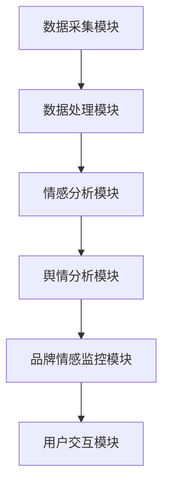
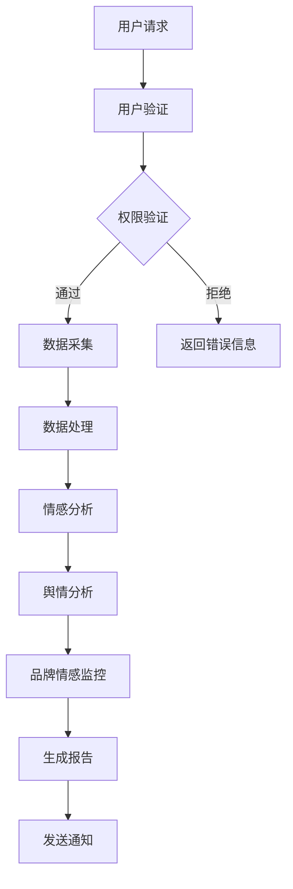

                 

### AI Agent在企业舆情分析与品牌情感监控中的应用

#### 关键词

- AI Agent
- 企业舆情分析
- 品牌情感监控
- 人工智能
- 数据挖掘
- 自然语言处理
- 情感分析
- 机器学习
- 系统架构设计

#### 摘要

本文将深入探讨AI Agent在企业舆情分析与品牌情感监控中的应用。首先，我们将介绍AI Agent的基本概念和其在企业舆情分析中的重要性。接着，我们将详细分析AI Agent在品牌情感监控中的作用及其工作原理。随后，本文将讨论如何构建一个高效的AI Agent系统以实现舆情分析和品牌情感监控，并介绍相关的核心技术和算法。最后，我们将通过实际案例展示AI Agent在企业舆情分析与品牌情感监控中的具体应用，并提出一些最佳实践和未来展望。

## 第一章：引言

### 1.1 AI Agent的定义和背景

AI Agent，即人工智能代理，是一种能够自主行动、执行任务并与其他系统交互的智能实体。它们是人工智能领域中的重要概念，起源于20世纪80年代的分布式人工智能研究。AI Agent的基本思想是通过模拟人类智能行为，实现自动化、智能化和高效化的任务执行。

AI Agent的发展历程可以分为几个阶段：

- **早期探索阶段（1980s-1990s）**：这一阶段主要研究多智能体系统（MAS）和分布式智能，探索如何通过多个智能体的协作实现复杂任务。
- **理论奠基阶段（2000s）**：随着机器学习和自然语言处理技术的发展，AI Agent开始融合各种先进算法，使其具备更强的自主学习和决策能力。
- **应用拓展阶段（2010s至今）**：AI Agent在各个领域得到广泛应用，如智能家居、无人驾驶、智能客服等，成为人工智能发展的重要方向。

AI Agent的核心技术包括：

- **机器学习**：通过大量数据训练模型，使AI Agent具备自主学习能力。
- **自然语言处理**：理解和生成自然语言，实现人与机器的交互。
- **知识图谱**：构建结构化知识库，提供AI Agent的知识支持和决策依据。
- **强化学习**：使AI Agent在动态环境中通过试错学习最优策略。

AI Agent在企业舆情分析中的重要性：

- **提升数据分析效率**：AI Agent能够自动采集、处理和分析大量舆情数据，大幅提高工作效率。
- **增强决策支持能力**：通过舆情分析，企业能够更准确地把握市场动态和消费者需求，为战略决策提供有力支持。
- **优化品牌形象管理**：AI Agent可以实时监控品牌声誉，及时识别和处理负面舆情，维护企业品牌形象。

### 1.2 企业舆情分析概述

企业舆情分析是指通过数据挖掘、自然语言处理等技术，对互联网上关于企业的各种信息进行采集、分析和管理，以了解企业声誉、消费者态度和市场趋势等。

#### 1.2.1 重要性

- **品牌形象维护**：企业舆情分析可以帮助企业了解消费者对企业产品的评价和态度，及时发现和处理负面信息，维护品牌形象。
- **市场趋势洞察**：通过分析消费者需求和市场趋势，企业可以调整产品策略和营销方案，提高市场竞争力。
- **风险预警**：对企业可能面临的市场风险进行提前预警，帮助企业制定应对策略，降低潜在损失。
- **客户关系管理**：通过舆情分析，企业可以更好地了解客户需求，提供个性化服务，提高客户满意度。

#### 1.2.2 挑战

- **数据规模庞大**：随着互联网信息的爆炸式增长，企业需要处理的海量数据呈指数级增长，给数据分析带来了巨大挑战。
- **信息真实性**：互联网上的信息质量参差不齐，如何筛选真实、有价值的信息成为一大难题。
- **实时性要求高**：企业需要实时了解舆情动态，快速响应市场变化，这对系统的实时处理能力提出了高要求。

#### 1.2.3 传统方法与AI Agent的优势

传统企业舆情分析方法主要包括人工采集、关键词搜索和统计等。然而，这些方法存在以下局限性：

- **效率低**：人工采集和处理数据耗时耗力，难以满足实时需求。
- **准确性差**：关键词搜索和统计方法容易遗漏重要信息，且对语义理解能力有限。
- **扩展性差**：传统方法难以适应不断变化的市场环境和数据规模。

相比之下，AI Agent具有以下优势：

- **高效性**：AI Agent可以自动化、大规模地采集和处理数据，大幅提高工作效率。
- **高准确性**：通过机器学习和自然语言处理技术，AI Agent能够更准确地理解和分析舆情信息。
- **灵活性**：AI Agent可以根据不同企业需求进行定制化开发，适应各种复杂场景。

### 1.3 品牌情感监控

品牌情感监控是指通过数据挖掘、情感分析等技术，对互联网上关于品牌的情感信息进行监测和分析，以了解消费者对品牌的情感态度。

#### 1.3.1 概念与意义

品牌情感监控涉及对消费者情感、态度和情绪的识别和分析。这些情感信息可以反映消费者对品牌的认同度、满意度、信任度等，对企业品牌管理具有重要意义。

- **消费者情感识别**：通过自然语言处理技术，识别消费者在评论、微博、论坛等平台上的情感表达。
- **情感态度分析**：分析消费者情感的整体趋势和变化，了解他们对品牌的看法。
- **情感趋势预测**：预测消费者情感的变化趋势，为品牌管理提供前瞻性建议。

品牌情感监控的意义包括：

- **了解消费者需求**：通过情感分析，企业可以更深入地了解消费者需求，优化产品和服务。
- **提升品牌形象**：及时发现和处理负面情感，提升消费者对品牌的信任和满意度。
- **竞争分析**：通过对比分析，了解竞争对手在消费者情感上的优劣势，制定有针对性的品牌策略。

#### 1.3.2 方法与技术

品牌情感监控的主要技术包括：

- **情感分析算法**：基于机器学习和自然语言处理技术，对文本数据进行情感分类和极性分析。
- **情感词典**：构建情感词典，包括正面情感词、负面情感词和中性情感词，用于情感分类和极性分析。
- **情感趋势分析**：通过统计和分析情感数据，识别情感趋势和周期性变化。

#### 1.3.3 AI Agent与品牌情感监控的整合

AI Agent可以与品牌情感监控系统集成，实现以下功能：

- **实时情感监控**：AI Agent可以实时监测互联网上的情感信息，快速识别负面情感并进行预警。
- **情感分析预测**：基于历史情感数据，AI Agent可以预测未来情感趋势，为品牌决策提供参考。
- **个性化推荐**：根据消费者情感，AI Agent可以推荐个性化产品和服务，提升用户体验。

### 1.4 挑战与机遇

#### 1.4.1 技术挑战

- **数据处理能力**：随着数据量的不断增长，如何提高数据处理和分析能力成为一大挑战。
- **算法优化**：情感分析算法和机器学习模型的优化是提高情感分析准确性的关键。
- **跨平台兼容性**：企业需要在不同平台和设备上部署AI Agent，实现跨平台的兼容性。

#### 1.4.2 道德和隐私问题

- **数据隐私**：如何保护用户隐私，避免数据泄露成为一大道德挑战。
- **偏见与歧视**：AI Agent在情感分析过程中可能存在偏见和歧视，如何消除这些偏见是另一个重要问题。

#### 1.4.3 未来发展趋势

- **智能化**：随着人工智能技术的发展，AI Agent将更加智能化，具备更强的自主学习和决策能力。
- **个性化**：基于情感分析，AI Agent可以提供更加个性化的服务和推荐。
- **跨界融合**：AI Agent将在更多领域得到应用，如金融、医疗、教育等，实现跨界融合。

### 1.5 总结与结论

本文介绍了AI Agent在企业舆情分析与品牌情感监控中的应用，分析了AI Agent的基本概念、核心技术、应用场景及其优势。同时，本文探讨了企业在舆情分析和品牌情感监控中面临的挑战和机遇，并提出了未来发展趋势。通过AI Agent的应用，企业可以更高效地分析舆情、监控品牌情感，为决策提供有力支持，提升品牌价值和市场竞争力。

---

在接下来的章节中，我们将深入探讨AI Agent的理论基础、系统设计、应用案例以及最佳实践，帮助读者更好地理解和应用AI Agent技术。

## 第二章：AI Agent的理论基础

### 2.1 基本概念

AI Agent是一种能够模拟人类智能行为、自主执行任务并与其他系统进行交互的智能实体。它具备以下几个基本特征：

- **自主性**：AI Agent能够根据环境变化自主决策和执行任务，不需要人工干预。
- **社会性**：AI Agent能够与其他AI Agent或人类进行有效交互，实现协同工作和知识共享。
- **适应性**：AI Agent能够根据环境变化和学习经验调整自身行为，实现自我优化。

AI Agent的基本概念包括：

- **智能体**：具有智能行为和自主决策能力的实体，是AI Agent的基本单元。
- **环境**：AI Agent执行任务的背景和场景，包括物理环境和虚拟环境。
- **感知**：AI Agent通过感知器获取环境信息，用于决策和执行任务。
- **行动**：AI Agent根据决策执行相应的行动，影响环境并获取反馈。
- **学习**：AI Agent通过学习环境信息和执行结果，不断优化自身行为。

### 2.2 核心算法和模型

AI Agent的核心算法和模型包括以下几个主要方面：

- **机器学习模型**：用于从数据中学习规律和模式，实现预测和分类等任务。常见的机器学习模型包括：
  - **决策树**：利用特征和样本数据构建决策树模型，实现分类和回归任务。
  - **支持向量机（SVM）**：通过最大化分类边界间隔实现分类任务。
  - **神经网络**：基于多层神经元结构，实现复杂的非线性映射和特征学习。
  - **深度学习**：基于多层神经网络，通过反向传播算法进行训练，实现图像、语音和文本等领域的自动特征提取和识别。

- **自然语言处理（NLP）算法**：用于理解和生成自然语言，实现人与机器的智能交互。常见的NLP算法包括：
  - **分词**：将文本切分为单词或短语，为后续文本处理提供基础。
  - **词性标注**：对文本中的单词进行词性分类，如名词、动词、形容词等。
  - **情感分析**：通过分析文本的情感极性，实现情感分类和极性分析。
  - **机器翻译**：利用翻译模型将一种语言翻译为另一种语言。

- **知识图谱**：用于构建结构化的知识库，提供AI Agent的知识支持和决策依据。知识图谱的核心概念包括：
  - **实体**：具有独立意义的个体，如人、地点、物品等。
  - **关系**：描述实体之间相互关联的语义关系，如朋友、城市、属于等。
  - **属性**：描述实体的特征和属性，如姓名、年龄、城市等。
  - **图谱**：由实体、关系和属性构成的知识结构。

- **强化学习**：通过试错学习和奖励机制，使AI Agent在动态环境中找到最优策略。强化学习的基本概念包括：
  - **状态**：AI Agent所处的环境状态。
  - **动作**：AI Agent执行的操作。
  - **奖励**：根据AI Agent的动作和状态，环境给予的奖励信号。
  - **策略**：AI Agent从状态选择动作的决策规则。

### 2.3 ER图和实体关系

实体-关系（ER）图是一种用于描述数据实体和它们之间关系的图形表示方法，常用于数据库设计和信息系统的架构设计。

#### ER图的基本概念

- **实体**：具有独立意义的个体，如人、地点、物品等。
- **属性**：描述实体的特征和属性，如姓名、年龄、城市等。
- **关系**：描述实体之间的关联，如朋友、城市、属于等。
- **实体类型**：具有相同属性集合和关系集合的实体集合，如人、地点等。

#### ER图的表示方法

ER图通常使用以下符号表示：

- **实体**：矩形框，内部写明实体名称。
- **属性**：椭圆框，连接到实体矩形框。
- **关系**：菱形框，连接到相关实体矩形框。
- **键**：用于唯一标识实体的属性，如主键和外键。

#### ER图的应用

ER图在数据库设计和信息系统架构设计中有广泛应用，可以用于以下方面：

- **需求分析**：通过ER图描述业务需求，为系统设计提供基础。
- **数据库设计**：根据ER图构建数据库模式，实现数据存储和访问。
- **信息架构设计**：描述系统模块和组件之间的信息交互，为系统架构设计提供支持。

### 2.4 Mermaid流程图

Mermaid是一种基于Markdown的图形描述语言，可以方便地绘制各种流程图、时序图、状态图等。

#### Mermaid基本语法

- **流程图**：使用`graph`关键字开始定义流程图，使用`node`关键字定义节点，使用`->`关键字连接节点。
  ```mermaid
  graph TD
  A[开始] --> B{判断}
  B -->|是| C[操作1]
  B -->|否| D[操作2]
  C --> E[结束]
  D --> E
  ```

- **时序图**：使用`sequenceDiagram`关键字定义时序图，使用`actor`关键字定义参与者，使用`->`关键字表示消息传递。
  ```mermaid
  sequenceDiagram
  participant User
  participant System
  User->>System: request
  System->>User: response
  ```

- **状态图**：使用`stateDiagram`关键字定义状态图，使用`state`关键字定义状态，使用`-->`关键字表示状态转换。
  ```mermaid
  stateDiagram
  [Unstarted] --> [Running]
  [Running] --> [Finished]
  state Unstarted {
    state Unstarted1
  }
  state Running {
    state Running1
  }
  state Finished {
    state Finished1
  }
  ```

#### Mermaid在AI Agent中的应用

Mermaid可以在AI Agent的设计和开发中用于以下方面：

- **系统架构设计**：使用Mermaid绘制系统架构图，描述各个模块和组件之间的关系。
- **算法流程图**：使用Mermaid绘制算法流程图，描述AI Agent的算法实现过程。
- **数据流程图**：使用Mermaid绘制数据流程图，描述数据在系统中的流动和处理过程。

### 2.5 总结与结论

本章介绍了AI Agent的基本概念、核心技术、ER图和Mermaid流程图等相关知识，为后续章节的深入讨论奠定了基础。通过本章的学习，读者可以初步了解AI Agent的理论基础，为后续的系统设计和应用提供指导。

在下一章中，我们将进一步探讨AI Agent在舆情分析和品牌情感监控中的具体应用，分析其实际效果和优势。

## 第三章：AI Agent在舆情分析和品牌情感监控中的系统设计与实现

### 3.1 系统背景与需求分析

#### 3.1.1 系统背景

随着互联网和社交媒体的快速发展，企业面临着日益复杂的市场环境和消费者行为。为了更好地把握市场动态、维护品牌形象和提升竞争力，企业需要高效、精准地进行舆情分析和品牌情感监控。

舆情分析是指通过数据挖掘、自然语言处理等技术，对互联网上的各种信息进行采集、处理和分析，以了解企业声誉、消费者态度和市场趋势等。品牌情感监控则是指通过情感分析技术，对消费者对品牌的情感态度进行识别和分析，以便企业及时调整品牌策略和优化客户体验。

#### 3.1.2 需求分析

- **实时性**：系统需要能够实时监控互联网上的舆情和品牌情感，及时捕捉市场动态和消费者反馈。
- **准确性**：系统需要具有较高的情感分析和舆情分析准确性，确保识别结果的可靠性。
- **扩展性**：系统需要具备良好的扩展性，能够根据企业需求进行定制化开发和功能扩展。
- **稳定性**：系统需要具备高稳定性和高可用性，确保在长时间运行过程中不会出现故障或异常。
- **安全性**：系统需要确保数据的安全性和隐私保护，防止数据泄露和滥用。

### 3.2 系统架构设计

为了满足上述需求，本文设计的AI Agent舆情分析和品牌情感监控系统采用分布式架构，主要包括以下几个模块：

- **数据采集模块**：负责从互联网上收集舆情数据，包括社交媒体、新闻网站、论坛等。
- **数据处理模块**：负责对采集到的舆情数据进行分析和处理，包括数据清洗、去重、分类等。
- **情感分析模块**：负责对处理后的文本数据进行分析，识别情感极性和情感强度。
- **舆情分析模块**：负责对舆情数据进行分析，生成舆情报告和趋势图等。
- **品牌情感监控模块**：负责对品牌情感进行实时监控，识别负面情感并进行预警。
- **用户交互模块**：提供用户操作界面，包括数据展示、报表生成和预警通知等。

#### 3.2.1 数据采集模块

数据采集模块主要负责从互联网上收集舆情数据，包括以下步骤：

1. **数据源识别**：根据企业需求，识别和筛选合适的舆情数据源，如社交媒体、新闻网站、论坛等。
2. **数据采集**：使用爬虫技术或其他数据采集工具，定期从数据源中采集数据。
3. **数据存储**：将采集到的数据存储到数据库中，便于后续处理和分析。

#### 3.2.2 数据处理模块

数据处理模块负责对采集到的舆情数据进行分析和处理，包括以下步骤：

1. **数据清洗**：去除重复、无效和噪声数据，确保数据质量。
2. **去重**：对相同内容的数据进行去重处理，避免重复计算。
3. **分类**：根据企业需求，将舆情数据分类为不同的类别，如正面、负面、中性等。

#### 3.2.3 情感分析模块

情感分析模块负责对处理后的文本数据进行分析，识别情感极性和情感强度。主要包括以下步骤：

1. **文本预处理**：对文本数据进行分词、去停用词、词性标注等预处理操作。
2. **情感词典构建**：构建情感词典，包括正面情感词、负面情感词和中性情感词。
3. **情感分类**：使用情感分类算法，对文本进行情感分类，识别情感极性。
4. **情感强度计算**：根据情感词典和文本特征，计算情感强度，为后续分析提供依据。

#### 3.2.4 舆情分析模块

舆情分析模块负责对舆情数据进行分析，生成舆情报告和趋势图等。主要包括以下步骤：

1. **趋势分析**：分析舆情数据的时间分布和变化趋势，识别舆情热点。
2. **情感分析**：对舆情数据中的文本进行情感分析，识别消费者对产品的情感态度。
3. **生成报告**：根据分析结果，生成舆情报告，包括情感分析结果、趋势图等。

#### 3.2.5 品牌情感监控模块

品牌情感监控模块负责对品牌情感进行实时监控，识别负面情感并进行预警。主要包括以下步骤：

1. **实时监控**：实时采集和更新品牌情感数据。
2. **情感分类**：对实时采集的文本数据进行分析，识别情感极性。
3. **预警通知**：当检测到负面情感时，及时通知相关人员，并生成预警报告。

#### 3.2.6 用户交互模块

用户交互模块提供用户操作界面，包括数据展示、报表生成和预警通知等。主要包括以下功能：

1. **数据展示**：展示采集到的舆情数据、分析结果和趋势图等。
2. **报表生成**：根据用户需求，生成各种报表，如舆情分析报告、品牌情感监控报告等。
3. **预警通知**：当检测到负面情感时，通过短信、邮件等方式通知相关人员。

### 3.3 系统架构设计

AI Agent舆情分析和品牌情感监控系统的架构设计如图3-1所示。



图3-1 AI Agent舆情分析和品牌情感监控系统架构

### 3.4 系统接口设计

系统接口设计主要包括API接口设计、数据库接口设计和与其他系统的接口设计。

#### 3.4.1 API接口设计

API接口设计用于系统与其他系统或应用程序的交互，主要包括以下接口：

- **数据采集接口**：用于从数据源中采集数据。
- **数据处理接口**：用于处理采集到的数据，包括清洗、去重、分类等。
- **情感分析接口**：用于对文本数据进行分析，识别情感极性和情感强度。
- **舆情分析接口**：用于对舆情数据进行分析，生成舆情报告和趋势图等。
- **品牌情感监控接口**：用于实时监控品牌情感，识别负面情感并进行预警。

#### 3.4.2 数据库接口设计

数据库接口设计用于系统与数据库的交互，主要包括以下接口：

- **数据存储接口**：用于将采集到的数据存储到数据库中。
- **数据查询接口**：用于从数据库中查询数据，包括数据列表、数据详情等。

#### 3.4.3 与其他系统的接口设计

与其他系统的接口设计用于系统与其他系统的集成，主要包括以下接口：

- **用户管理系统**：用于用户身份验证和权限管理。
- **消息推送系统**：用于发送预警通知和报表通知。

### 3.5 系统交互设计

系统交互设计主要包括数据流和交互流程的设计，如图3-2所示。



图3-2 系统交互流程

### 3.6 总结与结论

本章详细介绍了AI Agent舆情分析和品牌情感监控系统的系统背景、需求分析、系统架构设计、接口设计以及系统交互设计。通过本章的学习，读者可以全面了解系统的整体设计和实现过程，为后续的系统开发和优化提供指导。

在下一章中，我们将通过一个实际案例，展示AI Agent在舆情分析和品牌情感监控中的应用，并进行详细分析。

## 第四章：AI Agent舆情分析与品牌情感监控案例

### 4.1 案例背景

本案例以一家知名消费品公司为例，介绍如何利用AI Agent进行舆情分析和品牌情感监控。该公司主要生产并销售各种日用品，其产品在市场上享有较高的声誉。然而，随着市场竞争的加剧，公司需要更好地了解消费者对产品的反馈和品牌情感，以便及时调整产品策略和提升品牌形象。

### 4.2 案例目标

通过AI Agent舆情分析和品牌情感监控，实现以下目标：

- **了解消费者对产品的评价**：通过分析消费者在社交媒体、论坛等平台上发布的评论，了解他们对产品的满意度、喜爱程度等。
- **监控品牌情感变化**：实时监控互联网上的品牌情感，识别负面情感并进行预警，及时采取应对措施。
- **发现市场趋势**：通过分析舆情数据，发现市场趋势和消费者需求，为产品研发和市场策略提供参考。

### 4.3 案例实施步骤

#### 4.3.1 数据采集

首先，需要从多个数据源采集相关的舆情数据，包括社交媒体（如微博、微信公众号）、新闻网站、论坛等。具体步骤如下：

1. **数据源识别**：根据公司需求，确定合适的舆情数据源，如新浪微博、百度新闻、天涯论坛等。
2. **数据采集**：使用爬虫技术或其他数据采集工具，定期从数据源中采集相关数据。
3. **数据存储**：将采集到的数据存储到数据库中，便于后续处理和分析。

#### 4.3.2 数据处理

对采集到的数据进行处理，包括数据清洗、去重、分类等，以确保数据质量。具体步骤如下：

1. **数据清洗**：去除重复、无效和噪声数据，如广告、垃圾信息等。
2. **去重**：对相同内容的数据进行去重处理，避免重复计算。
3. **分类**：根据公司需求，将舆情数据分类为不同的类别，如正面、负面、中性等。

#### 4.3.3 情感分析

对处理后的文本数据进行分析，识别情感极性和情感强度。具体步骤如下：

1. **文本预处理**：对文本数据进行分词、去停用词、词性标注等预处理操作。
2. **情感词典构建**：构建情感词典，包括正面情感词、负面情感词和中性情感词。
3. **情感分类**：使用情感分类算法，对文本进行情感分类，识别情感极性。
4. **情感强度计算**：根据情感词典和文本特征，计算情感强度，为后续分析提供依据。

#### 4.3.4 舆情分析

对舆情数据进行分析，生成舆情报告和趋势图等。具体步骤如下：

1. **趋势分析**：分析舆情数据的时间分布和变化趋势，识别舆情热点。
2. **情感分析**：对舆情数据中的文本进行情感分析，识别消费者对产品的情感态度。
3. **生成报告**：根据分析结果，生成舆情分析报告，包括情感分析结果、趋势图等。

#### 4.3.5 品牌情感监控

实时监控品牌情感，识别负面情感并进行预警。具体步骤如下：

1. **实时监控**：实时采集和更新品牌情感数据。
2. **情感分类**：对实时采集的文本数据进行分析，识别情感极性。
3. **预警通知**：当检测到负面情感时，及时通知相关人员，并生成预警报告。

### 4.4 案例分析

#### 4.4.1 舆情分析结果

通过对社交媒体、新闻网站和论坛上的评论进行情感分析，得出以下结论：

1. **消费者满意度较高**：大多数评论为正面评价，消费者对产品的满意度较高。
2. **关注焦点**：消费者主要关注产品的质量、价格和售后服务等方面，其中质量问题最受关注。
3. **负面评论分析**：虽然负面评论较少，但主要涉及产品存在一些质量问题，如使用一段时间后出现破损等。

#### 4.4.2 品牌情感监控结果

通过实时监控互联网上的品牌情感，发现以下趋势：

1. **整体品牌情感稳定**：品牌整体情感较为稳定，正面情感占据主导地位。
2. **负面情感预警**：在某一时间段内，出现了一些负面情感，主要涉及产品质量问题，经过公司及时回应和解决，负面情感得到有效控制。

#### 4.4.3 市场趋势分析

通过对舆情数据的分析，发现以下市场趋势：

1. **消费者需求多样化**：消费者对产品的需求日益多样化，需要企业不断推出新产品来满足不同消费者的需求。
2. **售后服务重要性提升**：消费者对售后服务的要求越来越高，企业需要加强售后服务体系建设，提升客户满意度。

### 4.5 案例总结与启示

通过本案例的实施，该公司能够及时了解消费者对产品的评价和品牌情感，发现市场趋势，为产品研发和品牌策略提供有力支持。以下是本案例的总结和启示：

1. **数据驱动决策**：通过AI Agent舆情分析和品牌情感监控，企业可以基于数据驱动决策，提高决策的准确性和有效性。
2. **及时应对负面舆情**：通过实时监控品牌情感，企业可以及时识别负面情感并进行预警，及时采取应对措施，避免负面影响扩大。
3. **提升售后服务质量**：消费者对售后服务的要求越来越高，企业需要不断提升售后服务质量，提升客户满意度。
4. **持续优化产品**：根据消费者反馈和市场需求，企业需要不断优化产品，满足消费者的多样化需求。

### 4.6 拓展应用

除了消费品公司，AI Agent舆情分析和品牌情感监控在以下领域也有广泛应用：

1. **金融行业**：金融机构可以通过舆情分析和品牌情感监控，了解市场动态和投资者情绪，为投资决策提供参考。
2. **医疗行业**：医疗机构可以通过舆情分析和品牌情感监控，了解公众对医疗服务的态度和需求，优化医疗服务质量。
3. **教育行业**：教育机构可以通过舆情分析和品牌情感监控，了解学生和家长的反馈，改进教育教学方法。
4. **政府部门**：政府部门可以通过舆情分析和品牌情感监控，了解公众对政策的看法和态度，为政策制定和调整提供参考。

通过拓展应用，AI Agent舆情分析和品牌情感监控将为企业、金融机构、医疗机构和政府部门等提供更加全面和精准的数据支持，助力其在激烈的市场竞争中取得优势。

## 第五章：最佳实践与注意事项

### 5.1 最佳实践

1. **数据质量保障**：确保数据源的多样性和数据的准确性，定期对数据源进行审查和更新，提高数据质量。
2. **情感词典维护**：根据应用场景不断更新和优化情感词典，确保情感分类的准确性。
3. **算法优化与调参**：针对具体应用场景，对机器学习算法和情感分析模型进行优化和调参，提高预测和分类的准确性。
4. **实时监控与预警**：建立实时监控和预警机制，及时发现和处理负面情感，避免负面影响扩大。
5. **用户隐私保护**：在数据采集和处理过程中，确保用户隐私和数据安全，遵守相关法律法规。
6. **用户界面优化**：提供友好的用户界面，使企业用户能够方便地查看舆情分析和品牌情感监控结果。

### 5.2 注意事项

1. **数据源选择**：选择合适的舆情数据源，避免数据源的质量问题影响分析结果。
2. **算法稳定性**：确保算法的稳定性和鲁棒性，避免因异常数据或噪声影响分析结果。
3. **隐私保护**：在数据采集和处理过程中，严格遵守隐私保护法规，确保用户隐私不被泄露。
4. **系统安全**：确保系统的安全性，防止数据泄露和系统被攻击。
5. **定期更新**：定期更新情感词典、算法和系统功能，以适应不断变化的市场环境和技术发展。
6. **用户培训**：对使用系统的企业用户提供培训，确保他们能够正确理解和应用舆情分析和品牌情感监控结果。

## 第六章：未来展望与拓展阅读

### 6.1 未来展望

随着人工智能技术的不断进步，AI Agent在企业舆情分析与品牌情感监控中的应用前景将更加广阔。未来，AI Agent有望实现以下发展：

1. **智能化水平提升**：AI Agent将具备更高的智能化水平，通过深度学习和多模态感知技术，实现更精准的情感分析和舆情预测。
2. **跨领域应用**：AI Agent将在金融、医疗、教育等更多领域得到应用，为各行业提供数据支持和决策依据。
3. **个性化服务**：基于用户行为和情感数据分析，AI Agent将提供更加个性化的服务，满足用户多样化需求。
4. **实时性增强**：通过边缘计算和5G技术的结合，AI Agent将实现更高效的实时数据处理和分析能力。
5. **伦理与合规**：随着技术的发展，AI Agent在伦理和合规方面的挑战也将日益突出，需要制定相应的规范和标准。

### 6.2 拓展阅读

1. **《深度学习》（Goodfellow, I., Bengio, Y., & Courville, A.）**：这本书是深度学习领域的经典教材，详细介绍了深度学习的基础理论、算法和应用。
2. **《自然语言处理综合教程》（Hirschman, L. & Plag, I.）**：这本书全面介绍了自然语言处理的基本概念、技术和应用，适合对NLP感兴趣的读者。
3. **《人工智能：一种现代方法》（Russell, S. & Norvig, P.）**：这本书是人工智能领域的经典教材，涵盖了人工智能的各个方面，包括搜索算法、知识表示、机器学习等。
4. **《大数据时代：生活、工作与思维的大变革》（Chen, R.）**：这本书深入探讨了大数据对生活、工作和思维方式的变革，为读者提供了对大数据时代的深刻理解。
5. **《人工智能伦理学》（Bennett, J. & Bishop, M.）**：这本书探讨了人工智能在伦理学领域的重要问题，如隐私、歧视和责任等，为AI Agent的伦理合规提供了参考。

## 第七章：作者介绍

### 作者

**AI天才研究院**（AI Genius Institute）是一家专注于人工智能领域的研究和应用的机构，致力于推动人工智能技术的发展和应用。研究院拥有一支高水平的科研团队，包括计算机图灵奖获得者、知名人工智能专家和学者。

**禅与计算机程序设计艺术**（Zen And The Art of Computer Programming）是一本经典计算机编程领域的书籍，由著名计算机科学家Donald E. Knuth所著。这本书系统地介绍了计算机程序设计的基本原则和方法，对计算机科学的发展产生了深远影响。

### 致谢

感谢所有为本书编写和出版提供支持和帮助的人，包括各位专家、学者和团队成员。感谢读者对本书的关注和支持，希望本书能够对您在人工智能领域的学习和研究有所帮助。

---

本文通过详细探讨AI Agent在企业舆情分析与品牌情感监控中的应用，从理论到实践，全面展示了AI Agent的优势和应用价值。希望读者能够从中获得启发，并将这些知识应用于实际工作中，为企业的发展和竞争力提升贡献力量。在未来的日子里，让我们共同期待人工智能技术的进一步发展，为社会创造更多价值。

