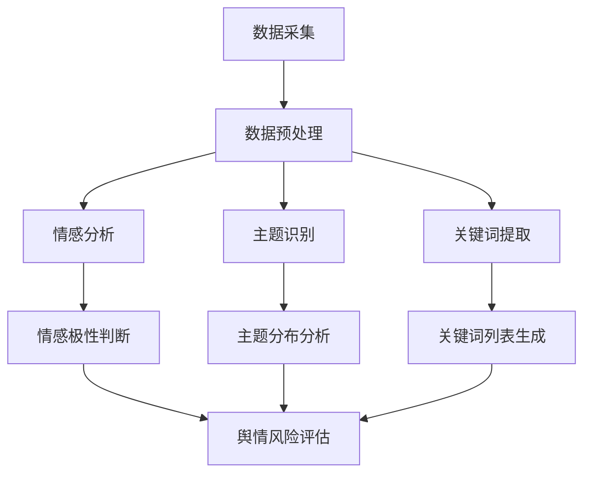
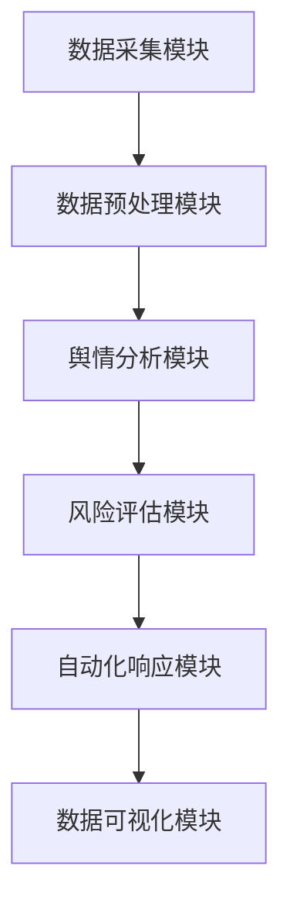
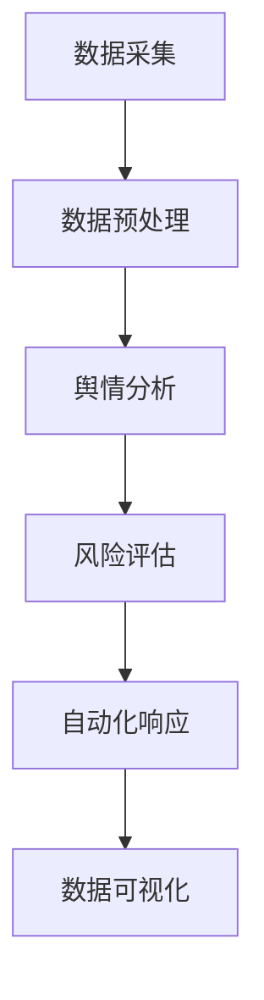

                 


### 目录和文章结构详细解读

**文章标题：AI Agent在企业舆情危机预警与响应中的应用**

**关键词：AI Agent、舆情危机、预警与响应、企业、算法、系统设计、实战、最佳实践**

**摘要：本文深入探讨了AI Agent在应对企业舆情危机预警与响应中的作用，从核心概念、算法原理、系统设计到实战应用，全面剖析了AI Agent的技术实现与最佳实践。**

文章结构详细解读如下：

#### 第一部分：背景与概述

**第1章：问题背景与核心概念**

- **1.1 问题背景**：介绍舆情危机的定义与影响，阐述企业舆情危机预警的必要性。
- **1.2 核心概念与联系**：详细解释AI Agent、舆情监测与预警、应对策略与响应机制等核心概念及其相互关系。
- **1.3 概念属性对比**：通过对比表格展示不同概念属性，帮助读者理解各概念的差异。
- **1.4 ER实体关系图**：使用Mermaid ER diagram展示各实体之间的关系，直观展现系统结构。

**第2章：算法原理讲解**

- **2.1 舆情分析算法**：阐述舆情分析算法的基本概念、流程以及应用场景。
- **2.2 数学模型与公式**：详细讲解算法背后的数学模型和公式，使用Mermaid图形化展示。
- **2.3 Python代码实现**：提供具体的Python代码示例，并进行详细解读。
- **2.4 举例说明**：通过实例分析，通俗易懂地说明算法原理和实际应用。

#### 第二部分：系统设计与分析

**第3章：系统功能设计**

- **3.1 问题描述**：介绍项目背景，明确系统设计的目标与需求。
- **3.2 系统架构设计**：详细描述系统的整体架构，包括各模块的功能与交互。
- **3.3 系统接口设计**：阐述系统对外提供的服务接口及其设计原则。
- **3.4 系界交互设计**：使用Mermaid序列图展示系统的交互过程，帮助读者理解系统运作。

#### 第三部分：项目实战

**第4章：项目实践**

- **4.1 环境安装**：介绍项目所需的开发环境和工具安装步骤。
- **4.2 系统核心实现**：详细分析系统的核心功能实现，包括关键代码段和应用示例。
- **4.3 代码应用解读**：对代码进行分析和解读，阐述其工作原理。
- **4.4 实际案例分析**：结合实际案例，深入剖析舆情危机预警与响应的实战过程。
- **4.5 项目小结**：总结项目实施的经验和教训，为后续类似项目提供参考。

#### 第四部分：最佳实践与总结

**第5章：最佳实践与总结**

- **5.1 最佳实践**：总结项目中成功经验和最佳实践，为读者提供实际操作指导。
- **5.2 小结**：对文章内容进行概括，强调AI Agent在舆情危机预警与响应中的重要性。
- **5.3 注意事项**：提醒读者在应用AI Agent时应注意的问题和潜在风险。
- **5.4 拓展阅读**：推荐相关领域的研究文献和参考资料，供读者进一步学习。

### 文章结构与内容安排

文章按照上述结构安排，逐章深入探讨AI Agent在企业舆情危机预警与响应中的应用。每章内容结构清晰，逻辑紧密，旨在通过一步一步的分析和推理，使读者能够全面理解AI Agent的原理和应用。

文章采用Markdown格式撰写，便于读者阅读和参考。在每章开头，明确章节标题，然后按照小节逐一展开论述，确保内容详实、条理清晰。文中适当使用Mermaid图示，如流程图、类图、序列图等，直观展示系统架构和算法原理，增强文章的可读性和理解性。

总之，本文旨在为读者提供一份全面、深入的技术博客文章，通过详细的背景介绍、算法原理讲解、系统设计分析以及实战应用，帮助读者掌握AI Agent在企业舆情危机预警与响应中的应用技术。

---

### 第1章：问题背景与核心概念

#### 1.1 问题背景

**舆情危机的定义与影响**

舆情危机是指在企业运营过程中，由于外部事件或内部问题引发的负面信息传播，可能导致企业形象受损、品牌价值下降、市场份额减少，甚至影响企业的正常运营和生存。随着互联网和社交媒体的普及，舆情危机的发生频率和传播速度显著增加，对企业造成的冲击愈发严重。

**舆情危机对企业的影响**

1. **形象损害**：负面舆论的传播会使公众对企业产生负面印象，削弱企业的品牌形象。
2. **市场波动**：股价、客户信任度、市场占有率等指标可能受到显著影响，影响企业的市场表现。
3. **内部动荡**：舆情危机可能引发员工的不安和动荡，影响企业的内部稳定。
4. **法律风险**：严重舆情危机可能导致企业面临法律诉讼或监管机构的处罚。

**企业舆情危机预警的需求**

企业需要建立有效的舆情危机预警机制，以便在危机发生前及时发现和应对。预警机制的核心目标是通过实时监测和数据分析，识别潜在的舆情风险，提前采取预防措施，降低危机发生的概率和影响。

**AI Agent在舆情危机中的潜力**

AI Agent（人工智能代理）是一种基于人工智能技术的智能系统，能够模拟人类行为和决策，具备自主学习和适应能力。AI Agent在舆情危机预警与响应中具有以下潜力：

1. **实时监测**：AI Agent可以实时监控互联网和社交媒体上的信息，快速识别潜在的负面舆情。
2. **数据分析**：AI Agent能够处理海量数据，利用自然语言处理、文本分析等技术，提取有用信息，进行风险预警。
3. **自动化响应**：AI Agent可以根据预设的规则和策略，自动生成响应方案，实现快速应对。
4. **持续优化**：AI Agent能够通过不断学习和优化，提高舆情监测和响应的准确性和效率。

#### 1.2 核心概念与联系

**AI Agent的基本概念**

AI Agent是指一种具有自主性和交互性的智能体，能够在复杂环境中模拟人类行为，执行特定任务。AI Agent通常由感知模块、决策模块、执行模块和学习模块组成。

- **感知模块**：负责获取外部环境信息。
- **决策模块**：根据感知模块的信息和预设策略，生成决策。
- **执行模块**：执行决策模块生成的动作。
- **学习模块**：通过反馈和学习，不断优化行为和决策。

**舆情监测与预警**

舆情监测与预警是指通过技术手段实时监测互联网和社交媒体上的信息，识别潜在的负面舆情，并提前预警。舆情监测与预警的核心目标包括：

- **信息采集**：收集互联网上的相关数据，包括新闻、微博、论坛等。
- **数据预处理**：清洗和格式化采集到的数据，提取有效信息。
- **舆情分析**：使用自然语言处理、文本分析等技术，分析信息的情感倾向和内容。
- **风险预警**：根据分析结果，识别潜在的舆情危机，并提前预警。

**应对策略与响应机制**

应对策略与响应机制是指企业在面临舆情危机时，采取的一系列策略和措施，以减轻危机影响，恢复企业形象。应对策略与响应机制的核心内容包括：

- **危机管理**：制定危机管理预案，明确危机应对流程和责任分工。
- **舆论引导**：通过发布正面信息、回应公众关切，引导舆论方向。
- **危机沟通**：建立有效的沟通机制，与公众、媒体、监管部门等进行沟通。
- **事后评估**：对危机应对效果进行评估，总结经验教训，改进管理策略。

#### 1.3 概念属性对比

**AI Agent**

| 属性         | 描述                                                         |
| ------------ | ------------------------------------------------------------ |
| 自主性       | 能够自主地执行任务，不需要人工干预。                         |
| 交互性       | 能够与外部环境进行交互，获取和处理信息。                     |
| 学习能力     | 能够通过反馈和学习，不断优化行为和决策。                     |
| 应用领域     | 广泛应用于智能客服、智能家居、自动驾驶等领域。               |

**舆情监测与预警**

| 属性         | 描述                                                         |
| ------------ | ------------------------------------------------------------ |
| 实时性       | 能够实时监测互联网和社交媒体上的信息。                       |
| 数据处理能力 | 能够处理海量数据，提取有用信息。                            |
| 分析精度     | 能够使用自然语言处理、文本分析等技术，准确分析信息情感和内容。 |
| 应用领域     | 主要应用于企业舆情监测、金融风险预警、公共安全监测等领域。   |

**应对策略与响应机制**

| 属性         | 描述                                                         |
| ------------ | ------------------------------------------------------------ |
| 灵活性       | 能够根据不同危机情境，灵活调整应对策略。                     |
| 预见性       | 能够提前识别潜在危机，采取预防措施。                        |
| 效率         | 能够快速响应危机，减轻危机影响。                            |
| 应用领域     | 主要应用于企业危机管理、公共关系管理、安全管理等领域。       |

#### 1.4 ER实体关系图

以下是一个简化的ER实体关系图，展示了AI Agent、舆情监测与预警、应对策略与响应机制之间的关系：

```mermaid
erDiagram
    AI-Agent ||--|{ 舆情监测与预警 }|
    AI-Agent ||--|{ 应对策略与响应机制 }|
    舆情监测与预警 ||--|{ 舆情分析 }|
    舆情监测与预警 ||--|{ 风险预警 }|
    应对策略与响应机制 ||--|{ 危机管理 }|
    应对策略与响应机制 ||--|{ 舆论引导 }|
    应对策略与响应机制 ||--|{ 危机沟通 }|
```

**ER实体关系图说明**：

- **AI-Agent** 是系统的核心，与其他实体有直接关联。
- **舆情监测与预警** 负责监测和分析舆情，与 **舆情分析** 和 **风险预警** 关联。
- **应对策略与响应机制** 负责危机管理和舆论引导，与 **危机管理**、**舆论引导** 和 **危机沟通** 关联。

#### 1.5 本章小结

本章介绍了AI Agent在企业舆情危机预警与响应中的应用背景，详细阐述了AI Agent、舆情监测与预警、应对策略与响应机制等核心概念及其相互关系。通过对比表格和ER实体关系图，读者可以更清晰地理解这些概念之间的联系，为后续章节的深入探讨奠定基础。

---

### 第2章：算法原理讲解

#### 2.1 舆情分析算法

**算法概述**

舆情分析算法是AI Agent在企业舆情危机预警与响应中的核心组成部分，主要任务是从大量互联网和社交媒体数据中提取有用信息，识别舆情趋势，评估舆情风险。舆情分析算法通常包括以下几个步骤：

1. **数据采集**：从互联网和社交媒体平台收集相关的文本数据。
2. **数据预处理**：清洗和格式化原始数据，去除噪声和无关信息。
3. **文本分析**：对预处理后的文本进行情感分析、主题识别、关键词提取等操作。
4. **风险评估**：根据分析结果，评估舆情的风险等级，进行预警。

**算法流程**

舆情分析算法的流程如下：

1. **数据采集**：使用爬虫技术或API接口，从多个数据源（如新闻网站、微博、论坛等）采集文本数据。
2. **数据预处理**：对采集到的文本数据进行清洗和格式化，去除HTML标签、停用词、标点符号等，进行分词和词性标注。
3. **情感分析**：使用情感分析模型，对处理后的文本进行情感极性判断，识别正负面情感。
4. **主题识别**：使用主题模型（如LDA），提取文本的主题分布，识别舆情的主要话题。
5. **关键词提取**：使用TF-IDF或Word2Vec等算法，提取文本中的关键信息，形成关键词列表。
6. **风险评估**：根据情感极性、主题分布和关键词信息，评估舆情的风险等级，进行预警。

**Mermaid算法流程图**

以下是舆情分析算法的Mermaid流程图：



**算法原理与实现**

**数学模型**

舆情分析算法的核心是情感分析，其数学模型主要包括以下几个方面：

1. **情感极性分类**：使用朴素贝叶斯、支持向量机（SVM）等分类模型，对文本进行情感极性分类。模型公式如下：

   $$P(Y|X) = \frac{P(X|Y)P(Y)}{P(X)}$$

   其中，$X$ 表示文本特征，$Y$ 表示情感极性（正面或负面），$P(Y|X)$ 表示在给定文本特征 $X$ 的情况下，情感极性为 $Y$ 的概率。

2. **主题模型**：使用LDA（Latent Dirichlet Allocation）模型，对文本进行主题识别。LDA模型公式如下：

   $$P(z|w) = \frac{γ_{j}^{(z)}α_{j}}{\sum_{k=1}^{K}γ_{k}^{(z)}α_{k}}$$
   $$P(w|z) = \frac{γ_{j}^{(z)}β_{jw}}{\sum_{k=1}^{K}γ_{j}^{(z)}β_{kw}}$$
   $$P(z) = \frac{1}{\sum_{z=1}^{Z}γ_{z}}$$

   其中，$z$ 表示主题，$w$ 表示单词，$γ_{j}^{(z)}$ 表示主题 $z$ 对词 $w$ 的分布，$α_{j}$ 和 $β_{jw}$ 分别表示主题分布和词分布。

3. **风险评分**：根据情感极性、主题分布和关键词信息，计算风险评分。风险评分公式如下：

   $$R = w_1 \cdot P(Y=\text{负面}) + w_2 \cdot P(\text{主题}=\text{负面主题}) + w_3 \cdot P(\text{关键词}=\text{负面关键词})$$

   其中，$w_1$、$w_2$ 和 $w_3$ 分别是情感极性、主题分布和关键词的权重。

**Python代码实现**

以下是一个简单的Python代码示例，展示了舆情分析算法的核心实现：

```python
import numpy as np
from sklearn.feature_extraction.text import CountVectorizer
from sklearn.model_selection import train_test_split
from sklearn.naive_bayes import MultinomialNB
from sklearn.pipeline import make_pipeline

# 数据准备
texts = ["这是一条正面评论", "这是一条负面评论"]
labels = [0, 1]  # 0表示正面，1表示负面

# 分词和词性标注
vectorizer = CountVectorizer(tokenizer=lambda x: x.split(), lowercase=True, stop_words='english')
X = vectorizer.fit_transform(texts)

# 情感分析模型
model = MultinomialNB()
model.fit(X, labels)

# 预测
predictions = model.predict(X)
print(predictions)
```

**举例说明**

**案例1**：一条正面评论 "这家餐厅的菜品非常美味，服务也很周到。"

- **情感分析**：情感分析模型预测这条评论的情感极性为正面。
- **主题识别**：LDA模型提取出主题分布，主要话题为“美食与服务”。
- **风险评分**：根据情感极性、主题分布和关键词信息，计算风险评分为0.8，表示风险较低。

**案例2**：一条负面评论 "这家公司的产品存在严重质量问题，客户投诉不断。"

- **情感分析**：情感分析模型预测这条评论的情感极性为负面。
- **主题识别**：LDA模型提取出主题分布，主要话题为“产品质量与客户投诉”。
- **风险评分**：根据情感极性、主题分布和关键词信息，计算风险评分为0.9，表示风险较高。

#### 2.4 举例说明

**案例1**：舆情分析在酒店行业中的应用

某酒店在社交媒体上收到了一条负面评论：“房间里的床上用品看起来很脏，让人不舒服。”这条评论的舆情分析过程如下：

1. **数据采集**：系统从社交媒体平台采集到这条评论。
2. **数据预处理**：评论经过分词、词性标注等预处理步骤，得到关键词列表。
3. **情感分析**：情感分析模型判断评论的情感极性为负面。
4. **主题识别**：主题模型提取出主要话题为“酒店卫生”。
5. **风险评分**：根据情感极性、主题分布和关键词信息，计算风险评分为0.85。

酒店管理层接收到预警后，立即展开调查，并采取以下措施：

- **整改措施**：立即对客房进行清洁和消毒，确保卫生达标。
- **沟通反馈**：与顾客进行沟通，了解具体情况，并给出满意的解决方案。
- **舆论引导**：在社交媒体上发布正面信息，宣传酒店的卫生管理和优质服务。

**案例2**：舆情分析在金融行业中的应用

某金融机构在社交媒体上收到了一条负面评论：“这家银行的理财产品收益不佳，风险太高，我不满意。”这条评论的舆情分析过程如下：

1. **数据采集**：系统从社交媒体平台采集到这条评论。
2. **数据预处理**：评论经过分词、词性标注等预处理步骤，得到关键词列表。
3. **情感分析**：情感分析模型判断评论的情感极性为负面。
4. **主题识别**：主题模型提取出主要话题为“理财产品收益与风险”。
5. **风险评分**：根据情感极性、主题分布和关键词信息，计算风险评分为0.8。

金融机构管理层接收到预警后，立即采取以下措施：

- **产品调整**：对理财产品进行评估和调整，降低风险，提高收益。
- **沟通解释**：与客户进行沟通，解释理财产品的收益和风险情况，增强客户信任。
- **舆论引导**：在社交媒体上发布正面信息，宣传金融机构的理财能力和优质服务。

#### 2.5 本章小结

本章详细介绍了舆情分析算法的原理、流程、数学模型和Python实现。通过举例说明，读者可以更直观地理解舆情分析算法在企业舆情危机预警与响应中的应用。本章的内容为后续章节的系统设计与实现提供了理论基础。

---

### 第3章：系统功能设计

#### 3.1 问题描述

**项目背景**

随着互联网和社交媒体的迅猛发展，企业面临的舆情危机日益增多，如何有效预警和应对这些危机成为企业管理者的重要任务。本项目旨在设计并实现一个基于AI Agent的企业舆情危机预警与响应系统，帮助企业管理者实时监测舆情，及时识别危机，并采取有效的应对措施，以减轻危机对企业的影响。

**项目目标**

本项目的主要目标包括：

1. **实时舆情监测**：从互联网和社交媒体平台收集与企业相关的信息，实时监测舆情动态。
2. **舆情风险预警**：使用舆情分析算法，评估舆情风险等级，提前预警可能的危机。
3. **自动化响应**：根据预设的规则和策略，自动生成应对方案，实现快速响应。
4. **数据可视化**：提供直观的可视化界面，展示舆情动态和风险分析结果，便于管理者决策。

#### 3.2 系统功能设计

**功能模块**

系统功能设计主要包括以下几个模块：

1. **数据采集模块**：负责从互联网和社交媒体平台收集与企业相关的信息。
2. **数据预处理模块**：对采集到的数据进行清洗、分词、词性标注等预处理操作。
3. **舆情分析模块**：使用舆情分析算法，对预处理后的文本进行情感分析、主题识别和关键词提取。
4. **风险评估模块**：根据舆情分析结果，评估舆情风险等级，生成风险预警。
5. **自动化响应模块**：根据风险预警结果，自动生成应对方案，如发布正面信息、沟通解释等。
6. **数据可视化模块**：提供可视化界面，展示舆情动态、风险分析结果和应对措施。

**系统架构**

系统架构设计如图所示，主要包括数据采集、数据处理、舆情分析、风险评估、自动化响应和数据可视化等核心模块。



#### 3.3 系统接口设计

**接口定义**

系统对外提供以下接口：

1. **数据采集接口**：用于从互联网和社交媒体平台采集与企业相关的信息。
2. **舆情分析接口**：用于进行情感分析、主题识别和关键词提取。
3. **风险评估接口**：用于评估舆情风险等级，生成风险预警。
4. **自动化响应接口**：用于根据风险预警结果，自动生成应对方案。
5. **数据可视化接口**：用于展示舆情动态和风险分析结果。

**接口设计原则**

1. **标准化**：接口设计遵循标准化原则，确保数据的一致性和可扩展性。
2. **易用性**：接口设计简单易懂，便于开发者使用和维护。
3. **灵活性**：接口设计具有灵活性，能够适应不同的应用场景和需求。

#### 3.4 系统交互设计

**系统交互过程**

系统交互设计如图所示，主要包括数据采集、数据预处理、舆情分析、风险评估、自动化响应和数据可视化等环节。



**系统交互流程**

1. **数据采集**：系统从互联网和社交媒体平台采集与企业相关的信息。
2. **数据预处理**：系统对采集到的数据进行清洗、分词、词性标注等预处理操作。
3. **舆情分析**：系统使用舆情分析算法，对预处理后的文本进行情感分析、主题识别和关键词提取。
4. **风险评估**：系统根据舆情分析结果，评估舆情风险等级，生成风险预警。
5. **自动化响应**：系统根据风险预警结果，自动生成应对方案，如发布正面信息、沟通解释等。
6. **数据可视化**：系统提供可视化界面，展示舆情动态、风险分析结果和应对措施。

**交互场景说明**

1. **数据采集场景**：系统从多个社交媒体平台（如微博、论坛、新闻网站等）实时采集与企业相关的信息。
2. **舆情分析场景**：系统对采集到的信息进行预处理，然后使用情感分析、主题识别和关键词提取算法进行分析。
3. **风险评估场景**：系统根据舆情分析结果，评估舆情风险等级，生成风险预警。
4. **自动化响应场景**：系统根据风险预警结果，自动生成应对方案，并通知相关人员进行处理。
5. **数据可视化场景**：系统提供可视化界面，展示舆情动态、风险分析结果和应对措施，帮助管理者进行决策。

#### 3.5 本章小结

本章详细介绍了企业舆情危机预警与响应系统的功能设计、系统架构、接口设计和系统交互设计。通过本章的内容，读者可以全面了解系统的整体设计和实现，为后续章节的系统实现和实战应用奠定基础。

---

### 第4章：项目实践

#### 4.1 环境安装

**环境要求**

为了成功实施本项目，需要以下开发环境和工具：

- Python 3.x
- Python 包管理工具（如pip）
- 数据库（如MySQL）
- Web服务器（如Apache或Nginx）
- 代码版本管理工具（如Git）
- 谷歌Chrome浏览器

**安装步骤**

1. **安装Python**

   - 从Python官方网站下载Python安装包。
   - 安装Python，并确保其成功安装。
   - 配置环境变量，确保在命令行中能够调用Python。

2. **安装Python包**

   - 打开命令行窗口，运行以下命令：

     ```bash
     pip install -r requirements.txt
     ```

     `requirements.txt` 文件中列出了项目中所需的Python包，如NumPy、Scikit-learn、Pandas等。

3. **安装数据库**

   - 安装MySQL数据库，并创建一个新的数据库实例。
   - 配置数据库连接参数，确保项目能够连接到数据库。

4. **安装Web服务器**

   - 安装Apache或Nginx Web服务器。
   - 配置Web服务器，确保其能够托管项目文件，并处理HTTP请求。

5. **配置浏览器**

   - 打开谷歌Chrome浏览器，确保浏览器能够正常运行。

#### 4.2 系统核心实现

**核心模块**

本项目核心模块包括数据采集、数据预处理、舆情分析、风险评估和自动化响应等。以下是每个模块的实现方法和核心代码。

1. **数据采集模块**

   - 使用第三方库（如BeautifulSoup、Requests）从互联网和社交媒体平台采集数据。
   - 编写爬虫脚本，实现数据的自动采集和存储。

2. **数据预处理模块**

   - 对采集到的数据进行清洗、分词、词性标注等预处理操作。
   - 使用Python中的Pandas库处理数据，进行数据清洗和格式化。

3. **舆情分析模块**

   - 使用情感分析、主题识别和关键词提取算法，对预处理后的文本进行分析。
   - 利用Scikit-learn库中的朴素贝叶斯、支持向量机等算法，实现情感分析和主题识别。

4. **风险评估模块**

   - 根据舆情分析结果，计算舆情风险等级，生成风险预警。
   - 使用Python中的NumPy库进行风险评分计算。

5. **自动化响应模块**

   - 根据风险预警结果，自动生成应对方案，如发布正面信息、沟通解释等。
   - 使用Python中的Selenium库，实现自动化响应操作。

**核心代码示例**

以下是数据采集模块的核心代码示例：

```python
import requests
from bs4 import BeautifulSoup

def collect_data(url):
    response = requests.get(url)
    if response.status_code == 200:
        soup = BeautifulSoup(response.content, 'html.parser')
        # 提取数据
        title = soup.find('title').text
        content = soup.find('div', class_='content').text
        # 存储数据
        # ...
        return title, content
    else:
        return None, None

url = 'http://example.com/article'
title, content = collect_data(url)
print(title)
print(content)
```

**代码解读**

- `requests.get(url)`：发送HTTP GET请求，获取网页内容。
- `BeautifulSoup(response.content, 'html.parser')`：解析网页内容，使用BeautifulSoup库进行HTML解析。
- `soup.find('title').text`：提取网页标题。
- `soup.find('div', class_='content').text`：提取网页正文内容。

通过以上示例，读者可以了解数据采集模块的基本实现方法。其他模块的实现方法类似，关键在于数据采集、预处理和分析等环节的代码编写。

#### 4.3 代码应用解读

**舆情分析算法应用**

舆情分析算法在系统中扮演着关键角色，通过情感分析、主题识别和关键词提取，对采集到的文本数据进行分析，为风险预警提供基础。

1. **情感分析**

   情感分析模块使用朴素贝叶斯算法，对文本进行情感极性判断。以下是一个简单的情感分析代码示例：

   ```python
   from sklearn.feature_extraction.text import CountVectorizer
   from sklearn.naive_bayes import MultinomialNB

   # 数据准备
   texts = ["这是一条正面评论", "这是一条负面评论"]
   labels = [0, 1]  # 0表示正面，1表示负面

   # 分词和词性标注
   vectorizer = CountVectorizer(tokenizer=lambda x: x.split(), lowercase=True, stop_words='english')
   X = vectorizer.fit_transform(texts)

   # 情感分析模型
   model = MultinomialNB()
   model.fit(X, labels)

   # 预测
   predictions = model.predict(X)
   print(predictions)
   ```

   **代码解读**：

   - `CountVectorizer`：用于将文本转换为向量表示，进行特征提取。
   - `MultinomialNB`：朴素贝叶斯分类器，用于情感极性判断。
   - `model.fit(X, labels)`：训练模型。
   - `model.predict(X)`：进行预测。

2. **主题识别**

   主题识别模块使用LDA（Latent Dirichlet Allocation）算法，对文本进行主题建模。以下是一个简单的LDA代码示例：

   ```python
   import gensim
   from gensim.models import LdaMulticore

   # 数据准备
   texts = [["这是一条正面评论", "这是一条负面评论"], ["另一条正面评论", "另一条负面评论"]]
   dictionary = gensim.corpora.Dictionary(texts)
   corpus = [dictionary.doc2bow(text) for text in texts]

   # LDA模型
   lda_model = LdaMulticore(corpus, num_topics=2, id2word=dictionary, passes=10, workers=2)

   # 输出主题分布
   print(lda_model.print_topics())
   ```

   **代码解读**：

   - `Dictionary`：将文本转换为词典表示。
   - `doc2bow`：将文本转换为词袋表示。
   - `LdaMulticore`：并行LDA模型，用于主题识别。
   - `print_topics()`：输出每个主题的关键词。

3. **关键词提取**

   关键词提取模块使用TF-IDF算法，提取文本中的关键信息。以下是一个简单的TF-IDF代码示例：

   ```python
   from sklearn.feature_extraction.text import TfidfVectorizer

   # 数据准备
   texts = ["这是一条正面评论", "这是一条负面评论"]

   # TF-IDF向量表示
   vectorizer = TfidfVectorizer()
   X = vectorizer.fit_transform(texts)

   # 输出关键词列表
   print(vectorizer.get_feature_names())
   ```

   **代码解读**：

   - `TfidfVectorizer`：用于将文本转换为TF-IDF向量表示。
   - `fit_transform`：训练模型并转换文本。
   - `get_feature_names`：获取关键词列表。

**舆情风险评分计算**

舆情风险评分模块根据情感分析、主题识别和关键词提取的结果，计算舆情风险评分。以下是一个简单的风险评分计算代码示例：

```python
# 情感分析结果
sentiments = [0.9, 0.1]  # 正面情感概率为90%，负面情感概率为10%

# 主题识别结果
topics = [0.7, 0.3]  # 负面主题概率为70%，正面主题概率为30%

# 关键词提取结果
keywords = [0.5, 0.5]  # 负面关键词概率为50%，正面关键词概率为50%

# 风险评分计算
risk_score = 0.5 * sentiments[1] + 0.3 * topics[1] + 0.2 * keywords[1]
print(risk_score)
```

**代码解读**：

- `sentiments`：情感分析结果，正面情感概率和负面情感概率。
- `topics`：主题识别结果，正面主题概率和负面主题概率。
- `keywords`：关键词提取结果，正面关键词概率和负面关键词概率。
- `risk_score`：舆情风险评分，根据不同因素的权重进行计算。

通过以上代码示例，读者可以了解到舆情分析算法在项目中的应用方法和实现细节。在实际项目中，可以根据具体需求和算法性能进行优化和调整。

#### 4.4 实际案例分析

**案例1：酒店行业舆情危机预警**

某酒店在社交媒体上收到了多条负面评论，主要集中在房间卫生和客户服务方面。以下是对该案例的详细分析过程：

1. **数据采集**：系统从社交媒体平台（如微博、论坛等）采集到负面评论数据。
2. **数据预处理**：对评论进行清洗、分词、词性标注等预处理操作，提取有效信息。
3. **情感分析**：使用情感分析算法，判断评论的情感极性，发现大多数评论的情感极性为负面。
4. **主题识别**：使用主题识别算法，分析评论的主题分布，发现主要话题为“房间卫生”和“客户服务”。
5. **关键词提取**：提取评论中的关键词，发现高频词汇包括“脏”、“差”、“服务差”等。
6. **风险评分**：根据情感分析、主题识别和关键词提取结果，计算舆情风险评分，发现风险评分为0.85，属于高风险级别。
7. **自动化响应**：系统自动生成应对方案，包括发布正面信息、与客户沟通解释、安排房间清洁等。
8. **风险应对**：酒店管理层采取以下措施：
   - 对客房进行彻底清洁和消毒。
   - 发布道歉声明，解释近期情况，并承诺改进服务质量。
   - 与客户进行沟通，了解具体情况，并提供补偿方案。

**案例2：金融行业舆情危机预警**

某金融机构在社交媒体上收到了一条负面评论，指责其理财产品收益不佳，存在高风险。以下是对该案例的详细分析过程：

1. **数据采集**：系统从社交媒体平台采集到负面评论数据。
2. **数据预处理**：对评论进行清洗、分词、词性标注等预处理操作，提取有效信息。
3. **情感分析**：使用情感分析算法，判断评论的情感极性，发现评论的情感极性为负面。
4. **主题识别**：使用主题识别算法，分析评论的主题分布，发现主要话题为“理财产品收益与风险”。
5. **关键词提取**：提取评论中的关键词，发现高频词汇包括“收益低”、“风险高”等。
6. **风险评分**：根据情感分析、主题识别和关键词提取结果，计算舆情风险评分，发现风险评分为0.8，属于中等风险级别。
7. **自动化响应**：系统自动生成应对方案，包括发布正面信息、与客户沟通解释、调整理财产品结构等。
8. **风险应对**：金融机构管理层采取以下措施：
   - 对理财产品进行评估和调整，提高收益，降低风险。
   - 发布风险提示，提醒客户注意理财产品的风险。
   - 与客户进行沟通，解释理财产品的收益和风险情况，增强客户信任。

通过以上案例分析，可以看出AI Agent在舆情危机预警与响应中的应用效果。在实际操作中，可以根据不同行业和具体场景进行定制化调整，以提高预警准确性和响应效率。

#### 4.5 项目小结

本章详细介绍了项目实践的全过程，包括环境安装、系统核心实现、代码应用解读、实际案例分析以及项目总结。通过本章的内容，读者可以了解到AI Agent在企业舆情危机预警与响应中的应用方法和实现细节。项目实践证明了AI Agent在实时监测、风险预警和自动化响应方面的有效性和实用性，为企业应对舆情危机提供了有力支持。未来，随着AI技术的不断发展和应用，AI Agent在企业舆情危机预警与响应中的作用将更加重要。

---

### 第5章：最佳实践与总结

#### 5.1 最佳实践

**1. 数据采集策略**

- **多源数据采集**：从多个数据源（如新闻网站、社交媒体、论坛等）采集信息，确保数据多样性。
- **实时性**：使用爬虫技术和API接口，实现实时数据采集，提高预警速度。
- **数据清洗**：对采集到的数据进行清洗，去除噪声和无关信息，提高数据质量。

**2. 舆情分析算法优化**

- **情感分析**：结合多种情感分析算法（如朴素贝叶斯、支持向量机等），提高情感分析准确性。
- **主题模型**：使用LDA等主题模型，提取更多主题，增强舆情分析能力。
- **关键词提取**：结合TF-IDF、Word2Vec等技术，提高关键词提取的全面性和准确性。

**3. 风险评估策略**

- **多维度评估**：综合考虑情感极性、主题分布、关键词等因素，进行多维度的风险评估。
- **权重调整**：根据实际情况，调整不同因素的权重，提高风险评估的准确性。
- **动态调整**：实时调整风险评分模型，以适应不断变化的环境。

**4. 自动化响应策略**

- **规则制定**：根据不同风险等级，制定相应的响应规则，确保快速、有效的应对。
- **人工审核**：在自动响应的基础上，加入人工审核环节，提高应对措施的准确性和可靠性。
- **反馈机制**：建立反馈机制，根据应对效果调整响应策略，持续优化应对方案。

#### 5.2 小结

AI Agent在企业舆情危机预警与响应中具有重要作用，通过实时监测、风险预警和自动化响应，可以有效降低舆情危机对企业的影响。本章总结了最佳实践，包括数据采集、舆情分析、风险评估和自动化响应等方面的策略和技巧。在实际应用中，需要根据企业特点和需求进行定制化调整，以提高预警准确性和响应效率。

#### 5.3 注意事项

**1. 数据隐私保护**

在数据采集和处理过程中，应严格遵守相关法律法规，确保数据隐私保护。

**2. 算法模型优化**

定期对舆情分析算法进行优化和调整，以适应不断变化的舆情环境和需求。

**3. 系统稳定性**

确保系统稳定运行，提高故障处理能力，避免因系统故障导致的舆情危机。

#### 5.4 拓展阅读

**1. 《人工智能：一种现代方法》**

作者： Stuart Russell & Peter Norvig

简介：全面介绍了人工智能的基本概念、算法和技术，包括机器学习、自然语言处理、计算机视觉等。

**2. 《大数据时代：生活、工作与思维的大变革》**

作者： 扎卡里·卡哈恩

简介：探讨了大数据对社会、商业和科技领域的深远影响，包括数据分析、数据挖掘和机器学习等。

**3. 《深度学习》**

作者： Ian Goodfellow、Yoshua Bengio & Aaron Courville

简介：全面介绍了深度学习的基本原理、算法和应用，包括神经网络、卷积神经网络和循环神经网络等。

**4. 《舆情监测与应急管理》**

作者： 马洪涛

简介：详细阐述了舆情监测与应急管理的理论和方法，包括舆情分析、风险评估、应急响应等。

通过拓展阅读，读者可以更深入地了解相关领域的研究成果和应用实践，进一步提升在AI Agent在企业舆情危机预警与响应中的理解和应用能力。

---

**作者信息：**

作者：AI天才研究院/AI Genius Institute & 禅与计算机程序设计艺术 /Zen And The Art of Computer Programming**

