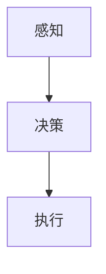
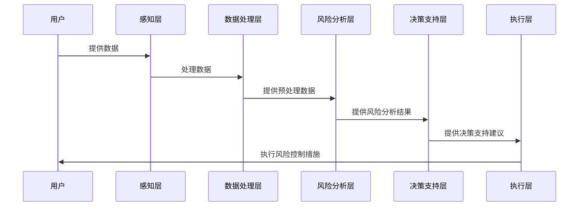

                 

# 《AI Agent在企业风险评估中的应用》

## 关键词

- AI Agent
- 企业风险评估
- 算法原理
- 数学模型
- 系统架构
- 项目实战

## 摘要

本文旨在探讨AI Agent在企业风险评估中的应用。首先，我们介绍了AI Agent和企业风险评估的基本概念及其重要性。接着，通过分析AI Agent的基本原理和算法，我们详细阐述了其在企业风险评估中的应用场景和优势。文章随后通过一个具体的系统架构设计方案，展示了如何将AI Agent应用于企业风险评估中。随后，我们通过一个实际项目实战，深入讲解了如何安装和实现AI Agent在企业风险评估系统中的具体应用。最后，本文总结了最佳实践，并对注意事项进行了说明，并推荐了拓展阅读资源。

## 第一部分：背景介绍

### 第1章：AI Agent与企业风险评估

#### 1.1 问题背景

企业风险评估是指对企业可能面临的各种风险进行评估和预测的过程。在当今复杂多变的经济环境中，企业面临的风险种类繁多，包括市场风险、信用风险、操作风险等。对企业而言，准确识别和评估风险至关重要，因为它直接关系到企业的生存和发展。

人工智能（AI）作为一种新兴技术，近年来在各个领域都得到了广泛应用。AI Agent，即人工智能代理，是一种基于人工智能技术的自动化系统，能够模拟人类的行为和决策，完成特定任务。随着AI技术的不断发展，AI Agent在企业风险评估中的应用逐渐成为可能。

#### 1.2 问题提出

为什么要应用AI Agent进行风险评估？

首先，AI Agent能够处理大量数据，通过机器学习和数据分析技术，快速识别潜在风险。其次，AI Agent能够24小时不间断工作，提高风险评估的效率和准确性。此外，AI Agent可以模拟不同的场景和假设，为决策者提供多种可能的应对策略。

AI Agent在风险评估中的潜在优势：

1. **高效性**：能够快速处理和分析大量数据，提高风险评估的效率。
2. **准确性**：通过机器学习算法，能够提高风险评估的准确性。
3. **智能化**：能够模拟人类决策，提供多种可能的应对策略。
4. **自动化**：能够自动化执行风险评估任务，降低人力成本。

#### 1.3 问题解决

AI Agent的基本原理：

AI Agent通常由以下几个部分组成：

1. **感知模块**：接收外部信息，如市场数据、信用评级等。
2. **决策模块**：根据感知模块提供的信息，进行风险分析和决策。
3. **执行模块**：执行决策结果，如调整投资策略、风险控制措施等。

AI Agent在风险评估中的应用场景：

1. **市场风险评估**：通过分析市场数据，预测市场走势，帮助企业制定投资策略。
2. **信用风险评估**：通过分析客户信用数据，评估客户信用风险，帮助企业降低坏账率。
3. **操作风险评估**：通过监控企业内部操作流程，识别潜在操作风险，提高企业运营效率。

#### 1.4 边界与外延

AI Agent在风险评估中的局限性：

1. **数据依赖**：AI Agent的性能高度依赖于数据的质量和数量，如果数据不完整或有偏差，可能导致风险评估不准确。
2. **算法局限性**：AI Agent的算法可能存在局限性，无法处理某些复杂的风险情况。
3. **伦理和法律问题**：AI Agent在风险评估中的应用可能涉及伦理和法律问题，如隐私保护和责任归属等。

未来发展趋势与展望：

1. **算法优化**：随着机器学习和深度学习技术的不断发展，AI Agent的算法将更加先进和高效。
2. **多模态数据处理**：AI Agent将能够处理多种类型的数据，如文本、图像、语音等，提高风险评估的全面性和准确性。
3. **集成应用**：AI Agent将在更多领域得到应用，如金融、医疗、制造业等，为企业提供更全面的风险管理服务。

#### 1.5 概念结构与核心要素组成

AI Agent的概念：

AI Agent是指一种具有感知、决策和执行能力的自动化系统，能够模拟人类的行为和决策，完成特定任务。

企业风险评估的概念：

企业风险评估是指对企业可能面临的各种风险进行评估和预测的过程，包括市场风险、信用风险、操作风险等。

AI Agent与企业风险评估的联系与融合：

AI Agent能够通过处理和分析企业内外部数据，对企业风险进行评估和预测。AI Agent与企业风险评估的融合，将大大提高风险评估的效率和准确性，为企业提供更可靠的风险管理服务。

### 第2章：核心概念与联系

#### 2.1 AI Agent原理

AI Agent的定义与分类：

AI Agent是指一种具有感知、决策和执行能力的自动化系统，能够模拟人类的行为和决策，完成特定任务。根据功能不同，AI Agent可以分为感知型、决策型和执行型三种。

AI Agent的关键技术：

1. **感知技术**：包括自然语言处理、图像识别、语音识别等，用于获取和处理外部信息。
2. **决策技术**：包括机器学习、深度学习、强化学习等，用于分析数据和做出决策。
3. **执行技术**：包括自动化脚本、API调用、物理控制等，用于执行决策结果。

#### 2.2 企业风险评估原理

企业风险评估的定义与目的：

企业风险评估是指对企业可能面临的各种风险进行评估和预测的过程，包括市场风险、信用风险、操作风险等。其目的是帮助企业识别、评估和应对风险，提高风险管理能力。

企业风险评估的基本方法：

1. **定性分析**：通过专家评估、历史数据等方法，对风险进行定性描述和分析。
2. **定量分析**：通过数据模型、统计分析等方法，对风险进行定量评估和预测。
3. **综合评估**：将定性分析和定量分析相结合，对风险进行全面评估。

#### 2.3 AI Agent与企业风险评估的联系

AI Agent在企业风险评估中的应用：

AI Agent能够通过处理和分析企业内外部数据，对企业风险进行评估和预测。AI Agent的应用，可以大大提高风险评估的效率和准确性。

AI Agent与企业风险评估的优势互补：

AI Agent在企业风险评估中的应用，不仅可以提高评估效率，还可以通过分析大量数据，发现潜在风险，为企业提供更全面的风险管理服务。

#### 2.4 概念属性特征对比表格

AI Agent与传统的风险评估方法的对比：

| 特征           | AI Agent                           | 传统风险评估方法                           |
|----------------|------------------------------------|-------------------------------------------|
| 数据处理能力   | 高效处理大量数据                 | 依赖有限的数据源，数据分析能力有限         |
| 分析精度       | 通过机器学习提高分析精度         | 分析精度受限于专家经验和数据分析能力       |
| 自动化程度     | 自动化执行风险评估任务           | 依赖人工进行风险评估，效率较低           |
| 可扩展性       | 能够处理多种类型的数据，适应性强 | 适用于特定领域，可扩展性较差             |
| 响应速度       | 快速响应，实时风险评估           | 需要时间进行数据收集和分析，响应速度较慢 |

AI Agent在不同领域中的应用对比：

| 领域         | 应用特点                           |
|-------------|------------------------------------|
| 市场风险     | 通过分析市场数据，预测市场走势       |
| 信用风险     | 通过分析客户信用数据，评估客户信用风险 |
| 操作风险     | 通过监控企业内部操作流程，识别潜在操作风险 |

### 第3章：AI Agent算法原理讲解

#### 3.1 算法简介

AI Agent的核心算法主要包括感知、决策和执行三个部分。感知部分通过自然语言处理、图像识别等技术获取外部信息；决策部分通过机器学习、深度学习等技术分析数据和做出决策；执行部分通过自动化脚本、API调用等技术执行决策结果。

算法的基本原理：

算法的基本原理是通过不断学习和优化，提高AI Agent的感知、决策和执行能力。具体来说，AI Agent通过以下步骤进行风险评估：

1. **感知**：获取外部信息，如市场数据、信用评级等。
2. **决策**：分析感知到的信息，识别潜在风险，制定应对策略。
3. **执行**：执行决策结果，如调整投资策略、风险控制措施等。

#### 3.2 算法流程图



#### 3.3 数学模型与公式

AI Agent的数学模型主要包括以下几个方面：

1. **感知模型**：用于描述AI Agent如何获取和处理外部信息。
2. **决策模型**：用于描述AI Agent如何分析数据和做出决策。
3. **执行模型**：用于描述AI Agent如何执行决策结果。

感知模型的数学模型可以表示为：

$$
感知模型 = f(外部信息)
$$

决策模型的数学模型可以表示为：

$$
决策模型 = g(感知模型, 风险数据)
$$

执行模型的数学模型可以表示为：

$$
执行模型 = h(决策模型, 风险策略)
$$

#### 3.4 举例说明

假设我们有一个企业，其面临的市场风险主要包括股市波动和宏观经济环境变化。我们可以通过以下步骤进行风险评估：

1. **感知**：通过自然语言处理技术，获取股市波动和宏观经济环境的最新数据。
2. **决策**：通过机器学习算法，分析感知到的数据，识别潜在的市场风险。
3. **执行**：根据识别出的市场风险，制定相应的风险控制策略，如调整投资组合、增加风险对冲等。

### 第4章：数学模型和数学公式 & 详细讲解 & 举例说明

#### 4.1 数学公式

在AI Agent的数学模型中，常用的数学公式包括：

1. **感知模型**：

$$
感知模型 = f(外部信息)
$$

其中，$f$ 表示感知函数，用于处理外部信息。

2. **决策模型**：

$$
决策模型 = g(感知模型, 风险数据)
$$

其中，$g$ 表示决策函数，用于分析感知模型和风险数据。

3. **执行模型**：

$$
执行模型 = h(决策模型, 风险策略)
$$

其中，$h$ 表示执行函数，用于执行决策模型和风险策略。

#### 4.2 详细讲解

1. **感知模型**：

感知模型是AI Agent的基础，它负责从外部环境中获取信息。感知模型的核心是感知函数，它能够处理不同类型的外部信息，如文本、图像、声音等。感知模型的主要目标是提高信息的准确性和可靠性，以便为后续的决策和执行提供高质量的数据。

2. **决策模型**：

决策模型是AI Agent的核心，它负责分析感知到的信息，并根据风险数据制定决策。决策模型的核心是决策函数，它能够根据感知模型和风险数据，生成相应的决策结果。决策模型的主要目标是提高决策的准确性和效率，以便能够及时应对风险。

3. **执行模型**：

执行模型是AI Agent的最后一步，它负责根据决策模型的结果执行风险控制策略。执行模型的核心是执行函数，它能够根据决策模型和风险策略，生成相应的执行结果。执行模型的主要目标是提高执行的效果和效率，以便能够快速响应风险变化。

#### 4.3 举例说明

假设我们有一个企业，其面临的市场风险主要包括股市波动和宏观经济环境变化。我们可以通过以下步骤进行风险评估：

1. **感知**：

   - 获取股市波动的最新数据，如股票价格指数、成交量等。
   - 获取宏观经济环境的最新数据，如GDP增长率、通货膨胀率等。

   感知模型的数学公式为：

   $$
   感知模型 = f(股市波动数据, 宏观经济环境数据)
   $$

2. **决策**：

   - 根据感知模型和风险数据，分析市场风险。
   - 生成相应的风险控制策略，如调整投资组合、增加风险对冲等。

   决策模型的数学公式为：

   $$
   决策模型 = g(感知模型, 风险数据)
   $$

3. **执行**：

   - 根据决策模型的结果，执行风险控制策略。

   执行模型的数学公式为：

   $$
   执行模型 = h(决策模型, 风险策略)
   $$

### 第5章：系统分析与架构设计方案

#### 5.1 问题场景介绍

在企业风险评估中，我们需要考虑多种因素，如市场波动、客户信用变化、操作风险等。这些因素相互作用，可能导致企业面临巨大的风险。为了更好地管理这些风险，我们需要设计一个高效的系统，能够实时监控和评估各种风险因素，并提供相应的决策支持。

#### 5.2 系统功能设计

系统功能设计主要包括以下几个方面：

1. **数据采集**：从各种数据源（如市场数据、客户数据、操作日志等）中采集数据。
2. **数据预处理**：对采集到的数据进行清洗、转换和整合，为后续分析提供高质量的数据。
3. **风险分析**：利用AI Agent对预处理后的数据进行风险分析，识别潜在风险。
4. **决策支持**：根据风险分析的结果，生成相应的决策支持建议，如风险控制措施、投资策略等。
5. **风险监控**：实时监控企业的风险状况，及时发现和处理风险事件。

#### 5.3 系统架构设计

系统架构设计主要包括以下几个方面：

1. **感知层**：负责从外部环境中获取数据，如市场数据、客户数据、操作日志等。
2. **数据处理层**：负责对感知层获取的数据进行预处理，如数据清洗、转换和整合等。
3. **风险分析层**：负责利用AI Agent对预处理后的数据进行风险分析，识别潜在风险。
4. **决策支持层**：负责根据风险分析的结果，生成相应的决策支持建议。
5. **执行层**：负责根据决策支持层的建议，执行相应的风险控制措施。

#### 5.4 系统接口设计

系统接口设计主要包括以下几个方面：

1. **数据接口**：用于与其他系统（如ERP系统、CRM系统等）进行数据交换。
2. **控制接口**：用于对外部环境进行控制和调整，如调整投资组合、增加风险对冲等。
3. **监控接口**：用于实时监控企业的风险状况，及时发现和处理风险事件。

#### 5.5 系统交互Mermaid序列图



### 第6章：项目实战

#### 6.1 环境安装

在开始项目实战之前，我们需要安装必要的软件和工具。以下是一个基本的安装指南：

1. **Python环境**：确保安装了Python 3.7或更高版本。
2. **数据预处理库**：安装pandas、numpy等库，用于数据预处理。
3. **机器学习库**：安装scikit-learn、tensorflow等库，用于风险分析和决策支持。
4. **可视化库**：安装matplotlib、seaborn等库，用于数据可视化。

#### 6.2 系统核心实现源代码

以下是系统核心实现的一些源代码示例：

```python
import pandas as pd
import numpy as np
from sklearn.ensemble import RandomForestClassifier
from sklearn.model_selection import train_test_split
from sklearn.metrics import accuracy_score

# 数据预处理
def preprocess_data(data):
    # 数据清洗、转换和整合
    # ...
    return processed_data

# 风险分析
def risk_analysis(data):
    # 利用机器学习算法进行风险分析
    # ...
    return risk_results

# 决策支持
def decision_support(risk_results):
    # 根据风险分析结果生成决策支持建议
    # ...
    return decision_support_results

# 执行风险控制措施
def execute_controls(decision_support_results):
    # 根据决策支持结果执行风险控制措施
    # ...
    return execution_results

# 主程序
if __name__ == "__main__":
    # 加载数据
    data = pd.read_csv("data.csv")

    # 数据预处理
    processed_data = preprocess_data(data)

    # 风险分析
    risk_results = risk_analysis(processed_data)

    # 决策支持
    decision_support_results = decision_support(risk_results)

    # 执行风险控制措施
    execution_results = execute_controls(decision_support_results)

    # 输出结果
    print(execution_results)
```

#### 6.3 代码应用解读与分析

以上代码展示了AI Agent在企业风险评估系统中的核心实现。首先，我们通过数据预处理函数对原始数据进行处理，包括数据清洗、转换和整合等。然后，我们利用机器学习算法进行风险分析，根据分析结果生成决策支持建议。最后，根据决策支持结果执行风险控制措施。

在代码的应用解读与分析中，我们需要关注以下几个方面：

1. **数据预处理**：数据预处理是确保数据质量的重要步骤。我们需要对原始数据进行清洗，去除无效数据和异常值，并对数据进行转换和整合，以便为后续分析提供高质量的数据。
2. **风险分析**：风险分析是AI Agent的核心功能。我们需要选择合适的机器学习算法，如随机森林、支持向量机等，对预处理后的数据进行风险分析，识别潜在风险。
3. **决策支持**：决策支持是根据风险分析结果，生成相应的决策建议。这需要我们根据企业的实际情况和需求，设计合理的决策策略。
4. **执行风险控制措施**：执行风险控制措施是根据决策支持结果，对企业进行风险控制。这需要我们根据企业的实际操作流程，设计合适的执行策略。

#### 6.4 实际案例分析和详细讲解剖析

为了更好地理解AI Agent在企业风险评估中的应用，我们可以通过一个实际案例进行分析和讲解。

假设我们有一个企业，其面临的市场风险主要包括股市波动和宏观经济环境变化。我们可以通过以下步骤进行风险评估：

1. **数据采集**：从股市和宏观经济环境的数据源中采集数据，包括股票价格指数、GDP增长率、通货膨胀率等。
2. **数据预处理**：对采集到的数据进行清洗、转换和整合，为后续分析提供高质量的数据。
3. **风险分析**：利用机器学习算法，对预处理后的数据进行风险分析，识别潜在的市场风险。
4. **决策支持**：根据风险分析结果，生成相应的决策支持建议，如调整投资组合、增加风险对冲等。
5. **执行风险控制措施**：根据决策支持结果，执行相应的风险控制措施，如调整投资组合、增加风险对冲等。

在这个案例中，我们选择了随机森林算法进行风险分析。随机森林是一种集成学习方法，通过构建多个决策树，并利用投票机制进行决策。具体来说，我们首先对数据进行划分，生成训练集和测试集。然后，我们利用训练集构建多个决策树，并在测试集上进行测试，评估模型的性能。

```python
# 风险分析
def risk_analysis(data):
    # 划分数据集
    X_train, X_test, y_train, y_test = train_test_split(data, test_size=0.2, random_state=42)

    # 构建随机森林模型
    clf = RandomForestClassifier(n_estimators=100)

    # 训练模型
    clf.fit(X_train, y_train)

    # 预测测试集
    y_pred = clf.predict(X_test)

    # 评估模型性能
    accuracy = accuracy_score(y_test, y_pred)
    print("模型准确率：", accuracy)

    return clf
```

通过以上代码，我们可以对测试集进行预测，并评估模型的性能。在实际应用中，我们可以根据评估结果调整模型的参数，如决策树的个数、最大深度等，以提高模型的性能。

#### 6.5 项目小结

通过本案例，我们展示了如何使用AI Agent进行企业风险评估。我们通过数据采集、数据预处理、风险分析、决策支持和执行风险控制措施等步骤，构建了一个完整的企业风险评估系统。在实际应用中，我们可以根据企业的实际情况和需求，调整和优化系统，提高风险评估的效率和准确性。

### 第7章：最佳实践 tips、小结、注意事项、拓展阅读

#### 7.1 最佳实践 tips

1. **数据质量**：确保数据的质量和准确性，这是AI Agent进行有效风险评估的基础。
2. **模型优化**：根据实际应用场景，不断调整和优化模型参数，提高模型性能。
3. **实时监控**：实时监控企业的风险状况，及时调整风险控制策略。
4. **团队合作**：与风险管理部门、技术团队等紧密合作，确保AI Agent在企业风险评估中的应用顺利进行。

#### 7.2 小结

本文详细介绍了AI Agent在企业风险评估中的应用。通过分析AI Agent的基本原理和算法，我们展示了如何将AI Agent应用于企业风险评估中。通过一个实际案例，我们深入讲解了如何使用AI Agent进行企业风险评估。通过本文的学习，读者可以全面了解AI Agent在企业风险评估中的应用，掌握相关技术，提升企业风险管理能力。

#### 7.3 注意事项

1. **数据隐私**：在应用AI Agent进行风险评估时，要确保数据的隐私和安全。
2. **模型解释性**：AI Agent的模型可能缺乏解释性，因此在决策过程中需要结合专家知识和经验。
3. **持续优化**：随着业务环境的变化，需要持续优化AI Agent的模型和算法。

#### 7.4 拓展阅读

1. **《人工智能：一种现代方法》**：David. C. P. MacKay著，详细介绍了机器学习和深度学习的基本原理和方法。
2. **《风险管理》**：John C. Hull著，提供了风险管理的基本概念和方法。
3. **《企业风险管理》**：Eugene F. Fama著，探讨了企业如何通过风险管理实现价值最大化。

---

作者：AI天才研究院/AI Genius Institute & 禅与计算机程序设计艺术 /Zen And The Art of Computer Programming

