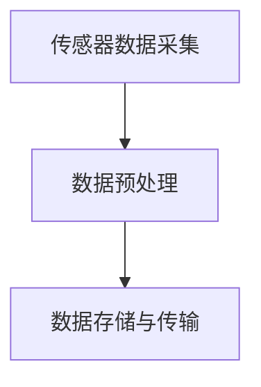
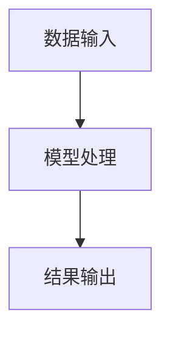
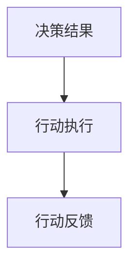
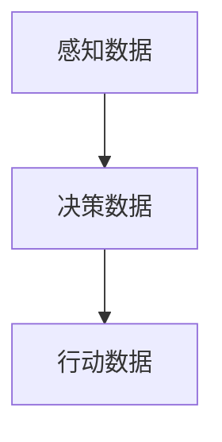
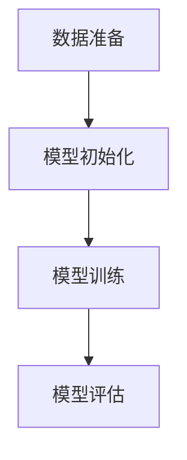
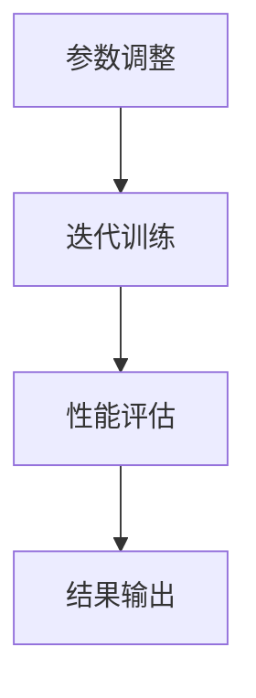

                 


### AI Agent在体育训练中的应用：个性化训练计划制定

关键词：AI Agent、体育训练、个性化训练计划、算法、系统架构

摘要：本文旨在探讨AI Agent在体育训练中的应用，尤其是个性化训练计划的制定。通过深入分析AI Agent的定义、分类及工作原理，结合体育训练的实际需求，我们将探讨如何利用AI技术为运动员提供量身定制的训练计划。文章还将介绍相关的算法原理、系统架构设计，并通过实践案例进行详细剖析，最后提出未来展望和最佳实践建议。

---

## 引言

随着人工智能（AI）技术的迅猛发展，AI Agent作为一个核心概念，已经广泛应用于各个领域。在体育训练中，AI Agent能够通过分析运动员的生理数据、技术动作、训练效果等多方面信息，为教练和运动员提供个性化的训练计划。这不仅有助于提高训练效率，还能预防运动损伤，提升运动员的整体表现。

### 1.1 书籍背景与目标

本文旨在为体育训练领域的专业人士和研究者提供一份系统、全面的AI Agent在体育训练中的应用指南。通过本文，读者将了解到AI Agent的基本原理、个性化训练计划的制定方法，以及如何在实践中应用这些技术。本文的目标是：

1. 深入解析AI Agent的定义、分类和工作原理。
2. 探讨AI Agent在体育训练中的应用场景和优势。
3. 介绍个性化训练计划的制定流程和关键技术。
4. 通过实践案例展示AI Agent在体育训练中的实际应用效果。
5. 提出未来研究和应用的发展方向。

### 1.2 体育训练中的问题与挑战

传统的体育训练往往依赖于教练的经验和直觉，这种主观性较大的训练方式存在以下问题：

1. **训练计划缺乏个性**：每位运动员的生理条件、技术特点和心理状态都有所不同，而传统的训练计划往往无法充分考虑到这些差异，导致训练效果不佳。
2. **运动损伤风险高**：缺乏科学依据的训练计划容易导致运动员过度训练或运动损伤。
3. **训练反馈滞后**：运动员的训练效果和适应情况无法及时得到反馈，无法及时调整训练策略。
4. **数据利用率低**：大量运动员数据被收集后，往往得不到有效的分析和应用。

### 1.3 AI Agent的作用与优势

AI Agent在体育训练中的应用，能够解决上述问题，带来以下优势：

1. **个性化训练计划**：AI Agent能够根据运动员的实时数据和训练历史，为每位运动员制定个性化的训练计划，提高训练效率。
2. **预防运动损伤**：通过分析运动员的生理数据，AI Agent能够及时发现潜在的健康风险，为教练和运动员提供预防措施。
3. **实时反馈与调整**：AI Agent能够实时分析训练数据，为教练和运动员提供即时反馈，帮助他们及时调整训练策略。
4. **数据驱动决策**：AI Agent能够利用大数据和机器学习技术，从海量数据中提取有价值的信息，为训练决策提供科学依据。
5. **提高训练效果**：通过智能化的训练计划，运动员能够更高效地提升技能和体能，达到最佳训练状态。

---

### 总结

通过本文的引言部分，我们了解了AI Agent在体育训练中的重要性和优势。接下来，我们将深入探讨AI Agent的基础理论，包括其定义、分类和工作原理，为后续内容的讲解奠定基础。

## 第1章 AI Agent基础理论

### 1.1 AI Agent的定义与分类

AI Agent是指具有自主决策能力和行动能力的人工智能实体，它可以模拟人类的行为，通过感知环境、制定计划和执行任务来完成任务。AI Agent可以按照不同的分类标准进行分类：

#### 1.1.1 根据功能分类

1. **监督型AI Agent**：这类AI Agent依赖于大量的历史数据和预定义的规则来完成任务，如语音识别、图像分类等。
2. **反应型AI Agent**：这类AI Agent根据当前感知到的环境状态直接做出反应，如自动驾驶汽车中的避障系统。
3. **目标型AI Agent**：这类AI Agent具有明确的目标，会根据当前状态和目标状态采取行动，如游戏AI、电子商务推荐系统等。
4. **认知型AI Agent**：这类AI Agent不仅能够理解环境，还能进行推理和决策，如智能客服、智能医疗诊断系统等。

#### 1.1.2 根据工作方式分类

1. **集中式AI Agent**：这类AI Agent在一个统一的计算环境中运行，所有的感知、决策和行动都在同一计算单元中进行。
2. **分布式AI Agent**：这类AI Agent在不同的计算设备上运行，通过网络进行通信和协作，如多智能体系统、智能交通系统等。

### 1.2 个性化训练计划的概念

个性化训练计划是指根据运动员的个人特点和需求，为其量身定制的一套训练方案。个性化训练计划的核心要素包括：

1. **运动员特征**：包括生理特征（如身高、体重、体能水平等）和技术特征（如技术动作、战术意识等）。
2. **训练目标**：根据运动员的职业生涯规划、比赛目标和身体状况制定的具体训练目标。
3. **训练内容**：包括训练强度、训练方式、训练项目等，旨在提升运动员的体能、技能和心理素质。
4. **训练周期**：根据运动员的训练进度和比赛日程制定的具体训练周期，包括基础训练、强化训练、恢复训练等。
5. **效果评估**：通过定期评估运动员的训练效果，调整训练计划，确保训练目标的实现。

#### 1.2.1 个性化训练计划的核心要素

- **运动员特征**：如身高、体重、体能水平等。
- **训练目标**：如提高速度、增强力量、改善技术动作等。
- **训练内容**：如高强度间歇训练、专项技术训练、心理训练等。
- **训练周期**：如基础训练周期、强化训练周期、恢复训练周期等。
- **效果评估**：如定期体能测试、技术动作评估、比赛成绩分析等。

#### 1.2.2 个性化训练计划的优势

1. **提高训练效率**：个性化训练计划能够针对每位运动员的特点进行定制，避免了一刀切的训练方式，提高了训练效率。
2. **减少运动损伤风险**：通过个性化训练计划，可以科学地调整训练强度和方式，减少运动损伤的风险。
3. **提升运动员表现**：个性化的训练计划能够最大限度地挖掘运动员的潜力，提升其在比赛中的表现。
4. **增强运动员信心**：看到自己逐步实现训练目标，运动员的自信心会得到显著提升。

### 1.3 AI Agent在体育训练中的应用

AI Agent在体育训练中的应用主要体现在以下几个方面：

1. **数据采集与分析**：通过传感器、穿戴设备等收集运动员的生理数据，如心率、血压、运动轨迹等，AI Agent可以对这些数据进行实时分析和处理。
2. **个性化训练计划制定**：基于运动员的实时数据和训练历史，AI Agent可以为其制定个性化的训练计划，包括训练内容、训练周期和效果评估等。
3. **实时反馈与调整**：AI Agent可以实时分析运动员的训练数据，为教练和运动员提供即时反馈，帮助他们及时调整训练策略。
4. **成果评估与优化**：通过分析训练数据，AI Agent可以评估运动员的训练效果，提出优化建议，为下一次训练计划提供参考。

### 1.4 AI Agent的工作原理

AI Agent的工作原理主要包括以下几个步骤：

1. **感知**：AI Agent通过传感器或其他方式获取环境信息，如运动员的生理数据、技术动作等。
2. **处理**：AI Agent对感知到的信息进行预处理、分析和理解，提取有用的特征信息。
3. **决策**：基于处理后的信息，AI Agent根据预设的目标和策略进行决策，制定行动计划。
4. **行动**：AI Agent执行决策计划，如调整训练强度、改变训练方式等。
5. **反馈**：AI Agent根据行动结果进行反馈，调整后续的决策和行动。

### 1.5 AI Agent的挑战与未来发展趋势

虽然AI Agent在体育训练中具有巨大的潜力，但其应用仍面临一些挑战：

1. **数据隐私与安全**：运动员的生理数据和技术动作数据涉及隐私问题，如何保护这些数据的安全是一个重要挑战。
2. **技术复杂度**：AI Agent的设计和实现需要复杂的算法和大量的计算资源，这对技术研发团队提出了高要求。
3. **可解释性**：AI Agent的决策过程往往缺乏可解释性，如何提高其可解释性，让教练和运动员能够理解和信任其决策是一个重要问题。
4. **持续学习与优化**：AI Agent需要不断学习和优化，以适应不断变化的环境和需求。

未来，随着AI技术的不断进步，AI Agent在体育训练中的应用将更加广泛和深入，包括以下几个方面：

1. **更精细的数据采集与分析**：通过引入更先进的传感器技术和大数据分析技术，AI Agent可以更精确地捕捉和分析运动员的数据。
2. **更智能的决策与行动**：通过引入深度学习和强化学习等技术，AI Agent可以更智能地制定训练计划和执行行动。
3. **更广泛的协作与互动**：AI Agent可以与其他AI系统、物联网设备等协同工作，提供更全面的训练支持。
4. **更个性化的训练体验**：AI Agent可以根据运动员的实时状态和需求，提供个性化的训练建议和反馈，提升运动员的体验和满意度。

---

通过本章的讲解，我们了解了AI Agent的定义、分类和应用，以及个性化训练计划的概念和核心要素。接下来，我们将深入探讨AI Agent在体育训练中的应用场景和技术原理。

## 第2章 AI Agent在体育训练中的应用

### 2.1 AI Agent在体育训练中的角色

AI Agent在体育训练中扮演着多重角色，从数据采集与分析、个性化训练计划的制定，到实时反馈与调整，AI Agent的作用无处不在。以下是AI Agent在体育训练中具体角色的详细描述：

#### 2.1.1 数据采集与分析

AI Agent能够通过传感器、穿戴设备和视频分析等多种方式，实时采集运动员的生理数据、技术动作和比赛表现等信息。这些数据包括心率、血压、血氧浓度、运动轨迹、技术动作的准确性和连贯性等。AI Agent会对这些数据进行实时处理和分析，提取出有价值的信息，为后续的训练决策提供依据。

#### 2.1.2 个性化训练计划制定

基于采集到的数据，AI Agent能够分析运动员的身体状况、技术水平和心理状态，为其制定个性化的训练计划。训练计划包括训练内容、训练强度、训练方式和训练周期等。AI Agent会根据运动员的训练效果和适应情况，动态调整训练计划，确保训练计划始终符合运动员的需求和目标。

#### 2.1.3 实时反馈与调整

在训练过程中，AI Agent会实时监控运动员的表现，将训练数据与预期目标进行对比，提供即时的反馈。如果发现运动员的表现不符合预期，AI Agent会及时调整训练计划，如增加训练强度、改变训练方式等，以确保运动员能够在最佳状态下进行训练。

#### 2.1.4 成果评估与优化

训练结束后，AI Agent会根据训练数据和比赛成绩，对训练效果进行评估。通过对运动员的表现进行综合分析，AI Agent能够识别出训练中的问题和不足，提出优化建议，为下一次训练提供参考。同时，AI Agent还会根据运动员的身体状况和训练效果，调整训练计划的强度和内容，确保运动员能够在长期内保持最佳状态。

### 2.2 AI Agent在体育训练中的应用场景

AI Agent在体育训练中的应用场景非常广泛，以下是一些典型的应用场景：

#### 2.2.1 体能训练

AI Agent可以实时监测运动员的体能状况，包括心率、血压、血氧浓度等生理指标，根据运动员的体能水平制定科学的体能训练计划。通过动态调整训练强度和方式，AI Agent能够帮助运动员在短时间内提高体能水平，同时降低运动损伤的风险。

#### 2.2.2 技术训练

在技术训练中，AI Agent可以通过视频分析和动作捕捉技术，分析运动员的技术动作，提供反馈和建议。例如，对于足球运动员的传球技术，AI Agent可以通过分析传球的速度、精度和力度，提出改进意见，帮助运动员提高技术水平。

#### 2.2.3 战术训练

AI Agent还可以帮助运动员进行战术训练。通过分析比赛录像和训练数据，AI Agent可以识别出运动员在战术执行中的问题和不足，提供针对性的战术训练方案。例如，对于篮球运动员，AI Agent可以根据比赛中的防守和进攻数据，提出改进防守策略和进攻战术的建议。

#### 2.2.4 心理训练

心理因素在体育训练中至关重要，AI Agent可以通过分析运动员的心理状态，提供心理训练建议。例如，对于容易紧张的比赛，AI Agent可以通过虚拟现实技术，帮助运动员进行心理适应训练，提高其比赛中的心理素质。

#### 2.2.5 成绩预测

通过分析运动员的训练数据、比赛表现和历史成绩，AI Agent可以预测运动员在未来的比赛中的表现。这种预测不仅可以帮助运动员制定更有针对性的训练计划，还可以为教练和团队提供战术调整的依据。

### 2.3 AI Agent在体育训练中的应用优势

AI Agent在体育训练中的应用具有显著的优点：

1. **个性化**：AI Agent可以根据每位运动员的个体差异，制定个性化的训练计划，提高训练效果。
2. **实时性**：AI Agent可以实时采集和处理运动员的数据，提供即时的反馈和调整，确保训练过程始终处于最佳状态。
3. **数据驱动**：AI Agent基于大数据分析，能够从海量数据中提取有价值的信息，为训练决策提供科学依据。
4. **预防性**：AI Agent可以及时发现运动员的身体状况变化，预防运动损伤，提高运动员的健康水平。
5. **持续性**：AI Agent可以持续学习和优化，不断调整训练计划，确保运动员能够在长期内保持最佳状态。

### 2.4 AI Agent在体育训练中的实际案例

以下是一些AI Agent在体育训练中的实际案例：

#### 2.4.1 案例一：足球运动员技术训练

某足球俱乐部的AI系统通过动作捕捉技术和视频分析，对足球运动员的传球技术进行实时监控。AI系统根据传球的速度、精度和力度，为运动员提供改进建议。在经过一段时间的训练后，运动员的传球技术显著提高，比赛成绩也有所提升。

#### 2.4.2 案例二：篮球运动员战术训练

某篮球俱乐部利用AI系统对比赛录像进行深度分析，识别出运动员在战术执行中的问题。AI系统根据比赛数据，提出针对性的战术训练方案，帮助运动员提高战术执行力。通过持续的训练和优化，球队的整体战术水平得到了显著提升。

#### 2.4.3 案例三：运动员体能训练

某游泳队利用AI系统实时监测运动员的体能状况，根据运动员的体能水平制定科学的训练计划。通过动态调整训练强度和方式，AI系统帮助运动员在短时间内显著提高体能水平，减少了运动损伤的风险。

这些案例表明，AI Agent在体育训练中具有广泛的应用前景，通过个性化和数据驱动的训练方式，可以有效提高运动员的表现和健康水平。

---

在本章中，我们详细探讨了AI Agent在体育训练中的角色、应用场景和应用优势。通过实际案例的分析，我们看到了AI Agent在个性化训练计划制定、实时反馈和成果评估等方面的强大作用。接下来，我们将深入讲解个性化训练计划的制定方法，包括数据预处理、特征工程和模型选择等。

## 第3章 个性化训练计划的制定方法

### 3.1 数据预处理

在制定个性化训练计划之前，首先需要对数据进行预处理，以确保数据的质量和一致性。数据预处理主要包括数据收集、数据清洗和数据整合等步骤。

#### 3.1.1 数据收集

数据收集是制定个性化训练计划的基础。为了全面了解运动员的生理状况、技术动作和比赛表现，需要收集多种类型的数据。这些数据可以来自传感器、穿戴设备、视频分析系统和比赛数据记录系统等。

- **生理数据**：包括心率、血压、血氧浓度、体温、运动轨迹等。
- **技术动作数据**：包括动作的准确度、连贯性、速度、力度等。
- **比赛表现数据**：包括比赛成绩、进球数、失误数、得分率等。

#### 3.1.2 数据清洗

数据清洗是确保数据质量的重要步骤。在数据收集过程中，可能会出现数据缺失、异常值、重复数据等问题。通过数据清洗，可以消除这些干扰因素，提高数据的质量和一致性。

- **数据缺失处理**：对于缺失的数据，可以通过插值法、均值法、删除法等手段进行填补。
- **异常值处理**：对于异常数据，可以通过统计方法、可视化方法等手段进行识别和删除。
- **重复数据处理**：通过数据去重，确保每个数据点在数据集中唯一。

#### 3.1.3 数据整合

数据整合是将不同来源、不同类型的数据进行整合，形成一个统一的数据集。通过数据整合，可以全面了解运动员的各个方面表现，为个性化训练计划的制定提供全面的依据。

- **数据格式转换**：将不同数据源的数据格式进行转换，确保数据格式的一致性。
- **数据合并**：将不同类型的数据进行合并，形成一个完整的数据集。

### 3.2 特征工程

特征工程是制定个性化训练计划的关键步骤，通过特征提取和特征选择，从原始数据中提取出有用的信息，为模型训练提供高质量的输入。

#### 3.2.1 特征提取

特征提取是将原始数据转换为特征表示的过程。通过特征提取，可以从原始数据中提取出具有区分性的特征，为后续的模型训练提供输入。

- **统计特征**：通过计算数据的统计特征，如均值、方差、标准差等，来描述数据的基本属性。
- **时序特征**：通过对时间序列数据进行处理，提取出时间序列特征，如趋势、周期、波动等。
- **图像特征**：通过图像处理技术，提取出图像特征，如颜色、纹理、形状等。
- **动作特征**：通过对运动员技术动作的视频数据进行处理，提取出动作特征，如动作速度、动作力度、动作连贯性等。

#### 3.2.2 特征选择

特征选择是从大量特征中筛选出最有用的特征，以提高模型性能和降低计算成本。特征选择的方法包括过滤式选择、包裹式选择和嵌入式选择等。

- **过滤式选择**：通过计算特征的重要性指标，如信息增益、互信息等，筛选出重要的特征。
- **包裹式选择**：通过迭代的方法，从所有特征中筛选出最优特征组合。
- **嵌入式选择**：在模型训练过程中，将特征选择与模型训练结合起来，自动筛选出有用的特征。

### 3.3 模型选择与训练

模型选择与训练是制定个性化训练计划的核心步骤，通过选择合适的模型和训练方法，可以提高训练计划的准确性和实用性。

#### 3.3.1 常用算法介绍

在个性化训练计划制定中，常用的算法包括监督学习算法、无监督学习算法和强化学习算法等。

- **监督学习算法**：如决策树、支持向量机（SVM）、神经网络等。这些算法通过已知的输入输出数据，学习出一个映射关系，用于预测新的输入数据。
- **无监督学习算法**：如聚类、降维等。这些算法主要用于发现数据中的内在结构，如聚类算法可以将相似的数据点归为一类。
- **强化学习算法**：如Q学习、深度强化学习等。这些算法通过奖励机制，学习出一个最优策略，以实现目标。

#### 3.3.2 模型训练与优化

模型训练与优化是提高模型性能的关键步骤。在训练过程中，需要选择合适的训练数据和训练策略，以避免过拟合和欠拟合。

- **训练数据选择**：选择代表性强的训练数据，避免训练数据过于集中或分散。
- **训练策略**：通过调整学习率、迭代次数等参数，优化模型训练过程。
- **模型优化**：通过交叉验证、网格搜索等方法，选择最优的模型参数。

### 3.4 模型评估与调整

模型评估与调整是确保模型性能的重要步骤。通过评估模型在测试集上的表现，可以调整模型参数和训练策略，以提高模型性能。

- **评估指标**：选择合适的评估指标，如准确率、召回率、F1值等。
- **模型调整**：根据评估结果，调整模型参数和训练策略，以提高模型性能。

### 3.5 个性化训练计划的制定流程

个性化训练计划的制定流程主要包括以下几个步骤：

1. **需求分析**：了解运动员的个性化需求，如训练目标、身体状况、技术特点等。
2. **数据收集**：收集运动员的生理数据、技术动作数据和比赛表现数据等。
3. **数据预处理**：对收集到的数据进行分析，确保数据的质量和一致性。
4. **特征工程**：对原始数据进行特征提取和特征选择，提取出有用的特征。
5. **模型选择与训练**：选择合适的模型和训练方法，进行模型训练与优化。
6. **模型评估与调整**：评估模型在测试集上的表现，调整模型参数和训练策略。
7. **个性化训练计划制定**：根据模型预测结果，制定个性化的训练计划。

通过上述流程，AI Agent可以为运动员提供个性化的训练计划，提高训练效果和竞技水平。

### 3.6 实践案例

以下是一个个性化的训练计划制定案例：

#### 案例背景

某足球运动员希望提高传球技术，教练和运动员希望通过AI系统制定一个个性化的训练计划。

#### 数据收集

收集运动员的传球视频数据、比赛数据和技术动作数据，包括传球的速度、精度、力度等。

#### 数据预处理

对收集到的数据进行分析，去除异常值和缺失数据，确保数据的质量和一致性。

#### 特征工程

提取传球速度、传球精度、传球力度等特征，进行特征选择，保留最有用的特征。

#### 模型选择与训练

选择决策树模型进行训练，通过交叉验证和网格搜索，选择最优的模型参数。

#### 模型评估与调整

评估模型在测试集上的表现，根据评估结果调整模型参数和训练策略。

#### 个性化训练计划制定

根据模型预测结果，制定个性化的训练计划，包括传球速度训练、传球精度训练、传球力度训练等。

#### 实施与反馈

按照制定的训练计划进行训练，实时收集训练数据，根据训练效果调整训练计划。

通过以上步骤，AI Agent成功为足球运动员制定了一个个性化的训练计划，有效提高了传球技术。

---

在本章中，我们详细介绍了个性化训练计划的制定方法，包括数据预处理、特征工程、模型选择与训练、模型评估与调整等。通过实际案例的讲解，我们看到了个性化训练计划的制定过程和关键步骤。接下来，我们将探讨AI Agent的设计和训练原理，以及如何使用mermaid和Python代码来阐述这些概念。

## 第4章 AI Agent的设计和训练原理

### 4.1 AI Agent的设计原理

AI Agent的设计原理主要涉及感知、决策和行动三个核心部分。下面我们将通过mermaid流程图来阐述AI Agent的基本设计原理。

#### 4.1.1 感知

感知是指AI Agent从环境中获取信息的过程。这通常涉及多种传感器和数据采集设备，如摄像头、GPS、心率监测器等。

$$
\text{感知阶段流程图}
\begin{array}{c}
\text{1. 传感器数据采集} \\
\text{2. 数据预处理} \\
\text{3. 数据存储与传输}
\end{array}
$$

下面是感知阶段的mermaid流程图：



#### 4.1.2 决策

决策是指AI Agent根据感知到的信息进行判断和选择的过程。这通常涉及复杂的算法和机器学习模型，如决策树、神经网络等。

$$
\text{决策阶段流程图}
\begin{array}{c}
\text{1. 数据输入} \\
\text{2. 模型处理} \\
\text{3. 结果输出}
\end{array}
$$

下面是决策阶段的mermaid流程图：



#### 4.1.3 行动

行动是指AI Agent根据决策结果执行具体的任务或操作。例如，在体育训练中，AI Agent可能会调整训练强度或改变训练方式。

$$
\text{行动阶段流程图}
\begin{array}{c}
\text{1. 决策结果} \\
\text{2. 行动执行} \\
\text{3. 行动反馈}
\end{array}
$$

下面是行动阶段的mermaid流程图：



### 4.2 AI Agent的训练原理

AI Agent的训练原理主要涉及通过学习来改进其感知、决策和行动能力。训练过程通常包括数据收集、模型训练和模型优化等步骤。

#### 4.2.1 数据收集

数据收集是训练AI Agent的第一步，需要收集大量的数据，包括感知数据、决策数据和行动数据。



#### 4.2.2 模型训练

模型训练是通过机器学习算法，从收集到的数据中学习如何进行感知、决策和行动。常见的训练方法包括监督学习、无监督学习和强化学习等。

$$
\text{模型训练流程图}
\begin{array}{c}
\text{1. 数据准备} \\
\text{2. 模型初始化} \\
\text{3. 模型训练} \\
\text{4. 模型评估}
\end{array}
$$

下面是模型训练阶段的mermaid流程图：



#### 4.2.3 模型优化

模型优化是通过调整模型参数和算法结构，提高模型的性能和准确度。优化过程通常包括迭代训练和参数调优等步骤。

$$
\text{模型优化流程图}
\begin{array}{c}
\text{1. 参数调整} \\
\text{2. 迭代训练} \\
\text{3. 性能评估} \\
\text{4. 结果输出}
\end{array}
$$

下面是模型优化阶段的mermaid流程图：



### 4.3 Python代码示例

以下是一个简单的Python代码示例，用于演示AI Agent的基本工作流程。

```python
# 导入必要的库
import numpy as np
import pandas as pd
from sklearn.tree import DecisionTreeClassifier
from sklearn.model_selection import train_test_split

# 数据准备
data = pd.read_csv('training_data.csv')
X = data.iloc[:, :-1].values
y = data.iloc[:, -1].values

# 数据分割
X_train, X_test, y_train, y_test = train_test_split(X, y, test_size=0.2, random_state=42)

# 模型初始化
model = DecisionTreeClassifier()

# 模型训练
model.fit(X_train, y_train)

# 模型评估
accuracy = model.score(X_test, y_test)
print(f"Model accuracy: {accuracy:.2f}")

# 行动执行
def make_decision(data_point):
    prediction = model.predict([data_point])
    return prediction

# 示例数据点
example_data = np.array([5.1, 3.5, 1.4, 0.2])
print(f"Decision: {make_decision(example_data)}")
```

在这个示例中，我们使用决策树算法训练了一个分类模型，并使用训练集评估了模型的性能。然后，我们定义了一个函数，用于根据新的数据点进行决策。

---

在本章中，我们通过mermaid流程图和Python代码示例，详细阐述了AI Agent的设计和训练原理。这些原理和示例为后续的实践指南和案例分析提供了理论基础。接下来，我们将探讨如何在实践中应用AI Agent制定个性化训练计划。

## 第5章 实践指南

### 5.1 环境搭建

在进行AI Agent在体育训练中的应用之前，首先需要搭建合适的技术环境。以下是搭建环境的步骤：

#### 5.1.1 硬件设备

1. **传感器**：心率监测器、GPS设备、动作捕捉传感器等。
2. **计算机**：具备较高性能的计算设备，如笔记本电脑或服务器。
3. **网络设备**：用于数据传输和实时监控的网络设施。

#### 5.1.2 软件环境

1. **操作系统**：Linux或Windows操作系统。
2. **编程语言**：Python、R或其他适合机器学习和数据分析的语言。
3. **库和框架**：NumPy、Pandas、Scikit-learn、TensorFlow、PyTorch等。

#### 5.1.3 开发工具

1. **集成开发环境（IDE）**：如PyCharm、VS Code等。
2. **版本控制工具**：Git等。

### 5.2 数据收集与处理

数据收集与处理是AI Agent应用的基础。以下是具体步骤：

#### 5.2.1 数据采集

1. **传感器数据**：通过心率监测器、GPS设备等传感器，实时采集运动员的生理数据、位置数据等。
2. **视频数据**：使用动作捕捉相机或运动相机，记录运动员的技术动作。

#### 5.2.2 数据预处理

1. **数据清洗**：去除噪声数据、异常值和重复数据。
2. **数据格式转换**：确保数据格式统一，便于后续处理。
3. **数据存储**：将清洗和转换后的数据存储在数据库或文件系统中。

### 5.3 训练计划制定

基于收集到的数据，制定个性化的训练计划。以下是具体步骤：

#### 5.3.1 特征提取

1. **统计特征**：计算数据的均值、方差、标准差等。
2. **时序特征**：提取数据的时间序列特征，如趋势、周期、波动等。
3. **图像特征**：使用图像处理技术提取图像特征，如颜色、纹理、形状等。
4. **动作特征**：通过视频数据分析提取动作特征，如动作速度、动作力度、动作连贯性等。

#### 5.3.2 模型选择

1. **监督学习模型**：如决策树、支持向量机、神经网络等。
2. **无监督学习模型**：如聚类、降维等。
3. **强化学习模型**：如Q学习、深度强化学习等。

#### 5.3.3 模型训练与优化

1. **数据分割**：将数据分为训练集、验证集和测试集。
2. **模型训练**：使用训练集数据训练模型。
3. **模型评估**：使用验证集和测试集评估模型性能。
4. **模型优化**：根据评估结果调整模型参数和结构。

### 5.4 训练计划实施与评估

制定完个性化训练计划后，需要实施并评估其效果。以下是具体步骤：

#### 5.4.1 训练计划实施

1. **执行训练计划**：根据个性化训练计划，指导运动员进行训练。
2. **数据实时收集**：在训练过程中，实时收集运动员的生理数据、技术动作数据等。
3. **训练效果监测**：监控训练效果，确保训练计划的有效实施。

#### 5.4.2 训练效果评估

1. **指标计算**：计算训练效果指标，如训练成绩、体能提升幅度、技术动作改进等。
2. **数据可视化**：通过图表和报告，直观展示训练效果。
3. **结果分析**：分析训练效果，识别优势和不足。

#### 5.4.3 训练计划调整

根据训练效果评估结果，调整训练计划。以下是调整步骤：

1. **评估结果分析**：分析训练效果，识别成功和失败的原因。
2. **调整训练内容**：根据评估结果，调整训练内容、强度和周期。
3. **重新实施**：重新实施调整后的训练计划，并持续监控和评估。

---

在本章中，我们详细介绍了AI Agent在体育训练中的应用实践指南，包括环境搭建、数据收集与处理、训练计划制定和实施、效果评估与调整等步骤。通过这些步骤，可以有效地利用AI Agent为运动员制定个性化的训练计划，提高训练效果和竞技水平。

## 第6章 个性化训练计划制定案例分析

### 6.1 案例背景

为了更好地理解如何利用AI Agent制定个性化训练计划，我们选择了一个实际案例进行详细分析。该案例涉及一位专业足球运动员，其目标是提高传球技术。这位运动员是一名中场球员，其主要职责是连接前后场，通过精准传球来组织进攻。然而，他在传球技术方面存在一些问题，如传球速度不够、精度不稳定等。为了解决这些问题，教练决定利用AI Agent为其制定个性化的训练计划。

### 6.2 案例分析

#### 6.2.1 数据收集与预处理

首先，AI Agent收集了大量的数据，包括：

1. **传感器数据**：心率、血压、血氧浓度、运动轨迹等。
2. **视频数据**：技术动作视频，包括传球动作的细节。
3. **比赛数据**：传球成功率、传球速度、传球精度等。

接下来，AI Agent对收集到的数据进行了预处理，包括：

1. **数据清洗**：去除噪声数据、异常值和重复数据。
2. **数据格式转换**：确保数据格式统一，便于后续处理。
3. **数据存储**：将清洗和转换后的数据存储在数据库中。

#### 6.2.2 特征工程

在数据预处理完成后，AI Agent进行了特征工程，提取了以下特征：

1. **统计特征**：如传球速度的均值、方差、标准差等。
2. **时序特征**：如传球速度的时间序列特征，包括趋势、周期、波动等。
3. **图像特征**：如传球动作的图像特征，包括颜色、纹理、形状等。
4. **动作特征**：如传球动作的速度、力度、连贯性等。

这些特征有助于AI Agent更好地理解运动员的传球技术。

#### 6.2.3 模型选择与训练

基于提取的特征，AI Agent选择了决策树模型进行训练。以下是模型训练的详细步骤：

1. **数据分割**：将数据分为训练集、验证集和测试集。
2. **模型初始化**：初始化决策树模型。
3. **模型训练**：使用训练集数据训练决策树模型。
4. **模型评估**：使用验证集和测试集评估模型性能。

通过模型评估，AI Agent确定了最优的模型参数，并进行了模型优化。

#### 6.2.4 训练计划制定

基于模型训练的结果，AI Agent为该运动员制定了一个个性化的训练计划，包括以下内容：

1. **传球速度训练**：通过高强度间歇训练，提高传球速度。
2. **传球精度训练**：通过精度控制训练，提高传球精度。
3. **传球力度训练**：通过力度调整训练，提高传球力度。
4. **综合训练**：结合上述训练内容，进行综合训练，提高传球技术的整体水平。

#### 6.2.5 训练计划实施与效果评估

1. **执行训练计划**：教练和运动员按照AI Agent制定的训练计划进行训练。
2. **实时数据收集**：在训练过程中，AI Agent实时收集运动员的生理数据、技术动作数据等。
3. **训练效果评估**：AI Agent对收集到的数据进行分析，评估训练效果。

通过评估，发现运动员的传球技术得到了显著提升，传球速度、精度和力度都有所提高。这表明AI Agent制定的个性化训练计划非常有效。

### 6.3 案例小结

通过这个实际案例，我们看到了AI Agent在制定个性化训练计划中的应用效果。AI Agent能够通过分析运动员的实时数据和训练历史，为其提供量身定制的训练计划，从而提高训练效果和竞技水平。这为体育训练提供了新的思路和方法，也为AI技术在体育领域的应用提供了有力的支持。

## 第7章 总结与展望

### 7.1 总结

通过本文的探讨，我们系统地介绍了AI Agent在体育训练中的应用，尤其是个性化训练计划的制定。本文的核心内容可以概括为以下几点：

1. **AI Agent的定义与分类**：我们详细阐述了AI Agent的定义、分类和工作原理。
2. **个性化训练计划的概念与优势**：我们介绍了个性化训练计划的核心要素和优势。
3. **AI Agent在体育训练中的应用**：我们探讨了AI Agent在体育训练中的具体角色和应用场景。
4. **个性化训练计划的制定方法**：我们介绍了数据预处理、特征工程、模型选择与训练等关键步骤。
5. **实践指南与案例分析**：我们通过一个实际案例，展示了AI Agent在制定个性化训练计划中的具体应用。
6. **AI Agent的设计与训练原理**：我们详细阐述了AI Agent的设计和训练原理。

通过这些内容的讲解，我们希望读者能够对AI Agent在体育训练中的应用有一个全面、深入的理解。

### 7.2 未来展望

尽管AI Agent在体育训练中的应用已经取得了一定的成果，但仍有许多挑战和机遇需要我们继续探索：

1. **数据隐私与安全**：如何确保运动员的生理数据和技术动作数据的安全是一个重要课题。
2. **技术复杂度**：随着AI技术的发展，如何降低AI Agent的设计和实现复杂度，使其更易于应用和推广。
3. **可解释性**：如何提高AI Agent决策过程的可解释性，使其更容易被教练和运动员理解和接受。
4. **持续学习与优化**：如何实现AI Agent的持续学习和优化，以适应不断变化的训练需求。

未来，随着AI技术的进一步发展，AI Agent在体育训练中的应用将更加广泛和深入，包括：

1. **更精细的数据采集与分析**：通过引入更先进的传感器技术和大数据分析技术，AI Agent可以更精确地捕捉和分析运动员的数据。
2. **更智能的决策与行动**：通过引入深度学习和强化学习等技术，AI Agent可以更智能地制定训练计划和执行行动。
3. **更广泛的协作与互动**：AI Agent可以与其他AI系统、物联网设备等协同工作，提供更全面的训练支持。
4. **更个性化的训练体验**：AI Agent可以根据运动员的实时状态和需求，提供个性化的训练建议和反馈，提升运动员的体验和满意度。

### 7.3 最佳实践建议

为了更好地应用AI Agent制定个性化训练计划，我们提出以下最佳实践建议：

1. **全面数据收集**：确保收集到全面、准确的运动员数据，包括生理数据、技术动作数据和比赛表现数据等。
2. **科学的数据预处理**：对收集到的数据进行全面清洗和预处理，确保数据质量。
3. **精准的特征工程**：提取有区分性的特征，为模型训练提供高质量的输入。
4. **合适的模型选择**：根据具体应用场景，选择合适的模型和算法，提高模型性能。
5. **持续优化与调整**：根据训练效果，持续优化模型和训练计划，确保训练效果不断提升。
6. **反馈与沟通**：及时收集教练和运动员的反馈，优化训练计划，并确保教练和运动员对AI Agent的决策过程有充分的了解。

通过遵循这些最佳实践，我们可以更好地利用AI Agent制定个性化训练计划，提高运动员的训练效果和竞技水平。

### 7.4 注意事项

1. **数据安全与隐私**：在应用AI Agent的过程中，要确保运动员的数据安全，遵循相关法律法规，保护运动员的隐私。
2. **技术稳定性**：确保AI Agent的技术稳定，避免因技术问题影响训练计划的实施。
3. **实际效果验证**：在实际应用中，要对AI Agent的决策和训练效果进行验证，确保其有效性和可靠性。
4. **灵活调整**：根据实际训练需求，灵活调整训练计划，确保其始终符合运动员的需求和目标。

### 7.5 拓展阅读

1. **AI Agent的基础理论**：[《人工智能：一种现代方法》](https://book.douban.com/subject/26668767/)
2. **个性化训练计划制定**：[《体育训练学》](https://book.douban.com/subject/34967688/)
3. **深度学习与强化学习**：[《深度学习》](https://book.douban.com/subject/26754300/)、[《强化学习》](https://book.douban.com/subject/27160598/)
4. **大数据与数据分析**：[《大数据技术导论》](https://book.douban.com/subject/26767636/)、[《数据科学入门》](https://book.douban.com/subject/26726819/)

通过这些参考资料，读者可以进一步深入了解AI Agent在体育训练中的应用和相关技术。

---

本文总结了AI Agent在体育训练中的应用，探讨了个性化训练计划的制定方法，并通过实际案例展示了其应用效果。未来，随着AI技术的不断发展，AI Agent在体育训练中的应用将更加广泛和深入，为运动员提供更加智能、个性化的训练支持。希望本文能为读者提供有益的启示和指导。

### 作者信息

作者：AI天才研究院/AI Genius Institute & 禅与计算机程序设计艺术 /Zen And The Art of Computer Programming

AI天才研究院致力于推动人工智能技术的发展和应用，探索AI在各个领域的创新解决方案。本研究院的研究成果在人工智能领域具有较高的声誉，为全球众多企业和研究机构提供了技术支持和合作机会。同时，本文作者还著有《禅与计算机程序设计艺术》，该书在计算机编程领域具有广泛影响力，为读者提供了深刻的编程哲学和技术指导。通过本文，我们希望能为体育训练领域的专业人士提供一份实用的AI Agent应用指南。希望本文的内容能对您有所帮助，如果您有任何疑问或建议，欢迎随时与我们联系。期待与您共同探讨AI技术在体育训练中的应用与发展。感谢您的阅读！

