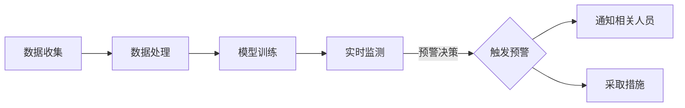
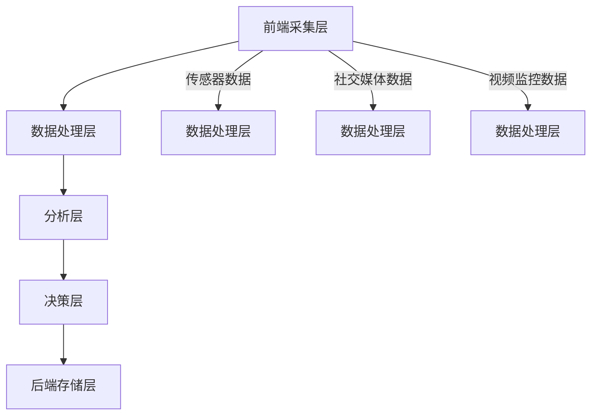
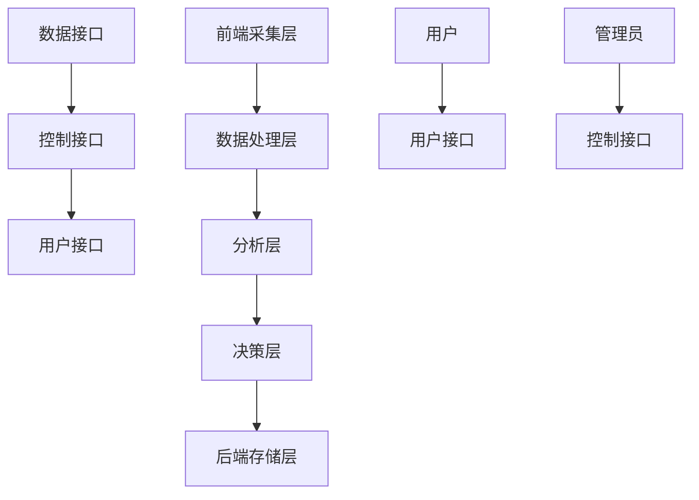
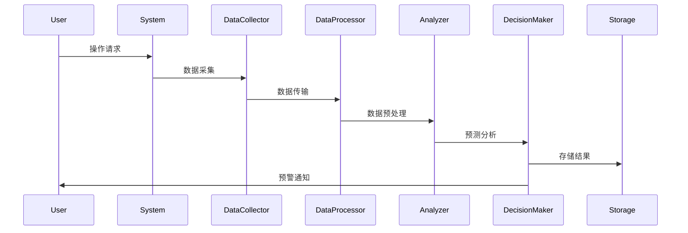

                 

### 1. 背景介绍

#### 1.1 问题背景

公共安全是现代社会稳定与繁荣的重要保障。随着城市化进程的加快和信息技术的飞速发展，公共安全问题日益复杂化，传统的安全措施已无法满足当前的需求。特别是在自然灾害、恐怖袭击、公共卫生事件等突发事件中，预警系统的有效性成为衡量一个国家或地区应急管理能力的重要指标。

AI Agent，作为人工智能的一种高级形态，具备自主性、反应能力、学习能力和社交能力等特点，近年来在多个领域展现出了强大的应用潜力。在公共安全领域，AI Agent通过收集、处理和分析大量数据，能够实现对潜在威胁的实时监测和预警，从而有效提升公共安全保障水平。

#### 1.2 问题描述

公共安全预警系统面临的主要挑战包括：

- 数据量大：公共安全领域涉及的数据量庞大，包括视频、图像、文本等多种数据类型，如何高效地处理和挖掘这些数据成为一大难题。
- 实时性要求高：公共安全事件往往具有突发性和紧急性，预警系统需要能够在极短时间内响应，提供准确预警。
- 个性化需求：不同区域、不同类型的公共安全问题需要不同的预警策略和模型，系统需具备高度的可定制性。

#### 1.3 问题解决

AI Agent在公共安全预警系统中可以发挥以下作用：

- 数据处理：利用AI Agent强大的数据处理能力，对海量数据进行实时分析，提取关键特征和模式。
- 预测预警：基于历史数据和实时信息，AI Agent能够预测潜在威胁并发出预警，为决策者提供及时准确的决策依据。
- 自适应学习：AI Agent具备学习能力，能够根据预警结果不断优化模型，提高预警准确性和适应性。

#### 1.4 边界与外延

AI Agent在公共安全领域的应用范围广泛，包括但不限于：

- 恐怖袭击预警：通过分析人群行为和异常活动，实时监测和预警恐怖袭击风险。
- 疫情防控：利用AI Agent对疫情数据进行实时监控和预测，提供防控策略和建议。
- 交通安全管理：通过分析交通数据，预测交通事故风险，提前采取措施降低事故发生率。

#### 1.5 概念结构与核心要素组成

AI Agent的基本架构通常包括以下几个核心组成部分：

- 数据收集模块：负责收集各种类型的数据，如视频、图像、传感器数据等。
- 数据处理模块：对收集到的数据进行预处理、特征提取和融合，为后续分析提供支持。
- 预测与预警模块：利用机器学习算法和模型，对数据进行实时分析和预测，发出预警信号。
- 用户交互模块：提供用户界面，允许用户查看预警信息、调整预警参数等。

通过这些核心要素的协同工作，AI Agent能够为公共安全预警系统提供强大的支持。

---

### 2. 核心概念与联系

#### 2.1 AI Agent的核心概念与原理

AI Agent，即人工智能代理，是一种自主运行并具备一定智能的实体。它通常具备以下核心特点：

1. **自主性**：AI Agent能够在没有人类直接干预的情况下自主执行任务，根据环境变化做出决策。
2. **反应能力**：AI Agent能够对环境中的变化快速响应，及时调整自身行为。
3. **学习能力**：AI Agent能够通过不断学习和经验积累，提高其执行任务的能力和准确性。
4. **社交能力**：AI Agent能够与其他AI Agent或人类进行交互，协同完成任务。

与传统机器学习不同，AI Agent不仅能够被动地处理数据，还能主动地感知环境、规划行为，并具备一定的推理能力。这使得AI Agent在复杂、动态的公共安全环境中具有显著的优势。

#### 2.2 AI Agent的核心特点

**自主性**：AI Agent的自主性主要体现在其具备独立决策的能力。通过内置的决策模块，AI Agent能够根据预设的目标和环境反馈，自主选择最优行动方案。

**反应能力**：AI Agent的反应能力是其应对突发事件的基石。在公共安全预警系统中，AI Agent需要能够实时监测数据，迅速识别异常情况，并在第一时间发出预警。

**学习能力**：AI Agent通过不断学习和优化，能够逐步提高其预测准确性和适应能力。在预警系统中，AI Agent能够从历史数据中学习到有效的预警模式，从而在面对新情况时能够更加准确地预测潜在风险。

**社交能力**：AI Agent的社交能力使其能够与其他系统、设备和人员协同工作。在公共安全领域，AI Agent可以通过与其他安全系统和人员的交互，实现资源共享、信息互通，提高整体预警效果。

#### 2.3 AI Agent与传统AI的区别

传统AI主要依赖于预先设定好的规则和算法，通常无法应对复杂、动态的环境变化。而AI Agent则具备更强的自主性和适应性，能够通过学习和感知环境，自主调整行为策略。以下是AI Agent与传统AI的几个主要区别：

- **决策方式**：传统AI依赖于固定的算法和规则，而AI Agent则能够自主决策，根据环境变化动态调整行为。
- **学习能力**：传统AI通常缺乏学习能力，无法从经验中学习并改进。AI Agent则具备强大的学习能力，能够不断优化自身性能。
- **社交能力**：传统AI通常独立运行，缺乏与其他系统、设备和人员的交互能力。AI Agent则具备社交能力，能够实现跨系统的协同工作。

总的来说，AI Agent在公共安全预警系统中的应用，为传统AI带来了新的变革和机遇，使得预警系统更加智能化、自适应化。

---

### 3. 算法原理讲解

#### 3.1 预警算法的基本原理

预警算法是公共安全预警系统的核心组成部分，其基本原理可以概括为以下几个步骤：

1. **数据收集**：预警算法首先需要收集与公共安全相关的数据，这些数据可以包括视频、图像、传感器数据、社会媒体数据等。
2. **数据处理**：对收集到的数据进行预处理，包括数据清洗、数据归一化、特征提取等，以提高数据质量和有效性。
3. **模型训练**：利用预处理后的数据，通过机器学习算法训练预测模型。常见的算法包括决策树、支持向量机、神经网络等。
4. **实时监测**：将训练好的模型应用于实时数据，对潜在威胁进行监测和预测。
5. **预警决策**：当监测到潜在威胁时，根据设定的预警阈值和规则，发出预警信号，通知相关人员采取相应措施。

#### 3.2 算法流程与Mermaid流程图

下面是一个简化的预警算法流程图，使用Mermaid语法表示：



这个流程图展示了预警算法从数据收集到预警决策的基本步骤。在实际应用中，每个步骤都可能涉及复杂的操作和优化，例如数据预处理可能包括图像分割、噪声过滤等，模型训练可能涉及超参数调整和模型选择等。

#### 3.3 Python源代码实现

以下是一个简化的Python代码示例，展示了如何实现一个基本的预警算法：

```python
import numpy as np
from sklearn.ensemble import RandomForestClassifier
from sklearn.model_selection import train_test_split
from sklearn.metrics import accuracy_score

# 数据预处理
def preprocess_data(data):
    # 实现数据清洗、归一化等操作
    return processed_data

# 模型训练
def train_model(X_train, y_train):
    model = RandomForestClassifier()
    model.fit(X_train, y_train)
    return model

# 实时监测与预警
def monitor_data(model, X_test):
    predictions = model.predict(X_test)
    if np.mean(predictions) > 0.5:  # 预警阈值设置为0.5
        print("预警：潜在威胁存在！")
    else:
        print("预警：无威胁！")

# 主函数
def main():
    # 加载数据
    data = load_data()
    X, y = data[:, :-1], data[:, -1]
    
    # 数据预处理
    X_processed = preprocess_data(X)
    
    # 划分训练集和测试集
    X_train, X_test, y_train, y_test = train_test_split(X_processed, y, test_size=0.2, random_state=42)
    
    # 模型训练
    model = train_model(y_train, X_train)
    
    # 实时监测与预警
    monitor_data(model, X_test)

if __name__ == "__main__":
    main()
```

这个代码示例仅用于演示，实际应用中需要根据具体需求进行调整和优化。

#### 3.4 算法原理的数学模型和公式

预警算法的数学模型通常基于概率论和统计学习理论。以下是几个关键概念和公式：

1. **概率分布函数**：用于描述数据分布，如正态分布、二项分布等。
2. **特征提取**：通过特征工程提取数据中的关键信息，如特征重要性排序、主成分分析（PCA）等。
3. **分类器模型**：如决策树、支持向量机（SVM）、神经网络（NN）等，它们通过训练数据学习特征和标签之间的关系。
4. **预测阈值**：用于确定是否发出预警的阈值，如决策树中的阈值、SVM中的分类边界等。

以下是一个简单的例子：

$$
P(\text{威胁存在}|\text{数据特征}) = f(\theta; \text{特征})
$$

其中，$P(\text{威胁存在}|\text{数据特征})$表示在给定数据特征条件下威胁存在的概率，$f(\theta; \text{特征})$表示概率分布函数，$\theta$表示模型参数。

#### 3.5 通俗易懂的举例说明

假设我们有一个公共安全预警系统，用于检测是否有人在某个区域内进行非法活动。系统收集到的数据包括该区域内的视频监控、传感器数据和社交媒体信息。

- **数据收集**：系统首先收集了一段视频监控数据，其中包括一个人的行为轨迹。此外，还收集了传感器数据，如温度、湿度等环境信息，以及社交媒体上的相关信息，如人们对该区域的评论和讨论。
- **数据处理**：对视频监控数据进行图像分割，提取出人的行为特征，如步态、速度等。对传感器数据进行归一化处理，提取关键的环境特征。社交媒体信息则通过自然语言处理（NLP）提取出关键信息。
- **模型训练**：利用训练集数据，通过机器学习算法（例如决策树）训练出一个预测模型。模型通过学习历史数据，学会了如何根据当前特征预测是否存在非法活动。
- **实时监测与预警**：当新的视频监控数据到来时，系统首先对数据进行预处理，提取出关键特征。然后，将特征输入训练好的模型，得到预测结果。如果预测结果大于设定的预警阈值（例如，预测存在非法活动的概率超过70%），系统会发出预警，通知相关人员采取相应措施。

这个例子简单说明了预警算法的基本原理和实际应用过程。在实际操作中，数据收集、处理和模型训练可能涉及更多的细节和技术，但核心思想是相似的。

---

### 4. 系统分析与架构设计

#### 4.1 问题场景介绍

在公共安全领域，预警系统的一个重要应用场景是恐怖袭击的预警。假设某个城市正在筹备一场大型活动，政府希望利用AI Agent预警系统来实时监测活动区域，识别潜在的恐怖威胁。

该场景涉及以下关键要素：

- **活动区域**：大型活动的举办地，包括室内和室外区域。
- **数据来源**：包括视频监控、传感器数据、社交媒体数据等。
- **预警指标**：如人群行为异常、物品放置异常等。
- **响应机制**：当监测到潜在威胁时，系统需要能够及时通知相关部门和人员，并启动应急响应程序。

#### 4.2 系统功能设计

为了满足上述应用场景的需求，公共安全预警系统需要实现以下主要功能：

- **数据收集**：从各种数据源收集实时数据，包括视频监控、传感器数据和社会媒体数据。
- **数据处理**：对收集到的数据进行预处理，如数据清洗、归一化和特征提取，为后续分析提供支持。
- **实时监测**：利用机器学习算法和预测模型，对实时数据进行监控，识别潜在的威胁。
- **预警决策**：根据监测结果和预警规则，判断是否触发预警，并将预警信息发送给相关人员。
- **应急响应**：当预警触发时，启动应急响应程序，通知相关部门和人员，采取相应的应对措施。

#### 4.3 系统架构设计

公共安全预警系统可以采用以下架构设计：

- **前端采集层**：负责从各种数据源收集数据，包括视频监控、传感器和社交媒体平台。
- **数据处理层**：对收集到的数据进行预处理、存储和管理，包括数据清洗、特征提取和模型训练。
- **分析层**：利用机器学习算法和预测模型，对预处理后的数据进行分析和预测，识别潜在的威胁。
- **决策层**：根据分析结果和预警规则，进行预警决策，并触发应急响应。
- **后端存储层**：负责存储系统中的各种数据，包括原始数据、预处理数据、模型参数和预警信息。

以下是一个简化的系统架构图，使用Mermaid语法表示：



这个架构图展示了系统各层之间的基本关系和交互流程。在实际应用中，系统架构可能根据具体需求进行调整和优化。

#### 4.4 系统接口设计

为了实现系统各部分之间的有效协同工作，公共安全预警系统需要设计一套完善的接口体系。以下是几个关键接口：

- **数据接口**：负责数据在各层之间的传输和交互，包括数据采集、预处理、分析和存储等。
- **控制接口**：用于系统管理和控制，如系统启动、停止、参数调整等。
- **用户接口**：提供用户界面，用于展示预警信息、系统状态和操作指南等。

以下是一个简化的接口设计图，使用Mermaid语法表示：



这个接口设计图展示了系统与外部用户和管理员之间的交互关系。在实际应用中，接口设计需要充分考虑系统的可扩展性和可维护性。

#### 4.5 系统交互Mermaid序列图

为了更清晰地展示系统各部分之间的交互流程，可以使用Mermaid序列图进行描述。以下是一个简化的系统交互序列图：



这个序列图展示了从用户操作请求到预警通知的系统交互流程。在实际应用中，系统交互可能涉及更多的细节和步骤，但核心流程是相似的。

---

### 5. 项目实战

#### 5.1 环境安装

在开始构建公共安全预警系统之前，需要搭建一个合适的开发环境。以下是环境安装的步骤：

1. **硬件环境**：根据系统需求，选择适当的物理服务器或虚拟机。硬件配置至少需要：CPU：Intel i5及以上，内存：16GB及以上，硬盘：500GB SSD。
2. **操作系统**：选择Linux发行版，如Ubuntu 20.04或CentOS 7。推荐使用虚拟机管理器（如VMware Workstation）来创建和管理操作系统。
3. **软件环境**：安装Python 3.8及以上版本，并配置pip和conda等包管理工具。安装常用的依赖库，如NumPy、Pandas、Scikit-learn、TensorFlow和Keras。

以下是一个示例命令，用于安装Python和相关依赖库：

```bash
sudo apt-get update
sudo apt-get install python3 python3-pip python3-conda python3-dev
conda create -n myenv python=3.8
conda activate myenv
pip install numpy pandas scikit-learn tensorflow keras
```

#### 5.2 系统核心实现

公共安全预警系统的核心实现包括数据收集、数据处理、模型训练和预测预警等步骤。以下是一个简化的系统核心实现过程：

1. **数据收集**：从视频监控、传感器和社交媒体平台收集数据。可以使用API接口或爬虫工具（如Scrapy）获取数据。
2. **数据处理**：对收集到的数据进行预处理，包括数据清洗、归一化和特征提取。使用Python进行数据处理，可以使用Pandas库进行数据操作，使用Scikit-learn进行特征提取。
3. **模型训练**：使用预处理后的数据训练机器学习模型。可以选择多种算法，如决策树、随机森林、支持向量机等。使用Scikit-learn库进行模型训练。
4. **预测预警**：将训练好的模型应用于实时数据，进行预测和预警。使用TensorFlow或Keras库进行模型推理和预测。

以下是一个简化的Python代码示例，展示了系统核心实现的基本框架：

```python
# 导入必要的库
import pandas as pd
import numpy as np
from sklearn.model_selection import train_test_split
from sklearn.ensemble import RandomForestClassifier
from tensorflow.keras.models import Sequential
from tensorflow.keras.layers import Dense

# 数据收集
def collect_data():
    # 实现数据收集逻辑
    pass

# 数据处理
def preprocess_data(data):
    # 实现数据处理逻辑
    pass

# 模型训练
def train_model(X_train, y_train):
    # 实现模型训练逻辑
    model = RandomForestClassifier()
    model.fit(X_train, y_train)
    return model

# 预测预警
def predict_waring(model, X_test):
    # 实现预测预警逻辑
    predictions = model.predict(X_test)
    return predictions

# 主函数
def main():
    data = collect_data()
    X, y = preprocess_data(data)
    X_train, X_test, y_train, y_test = train_test_split(X, y, test_size=0.2, random_state=42)
    model = train_model(y_train, X_train)
    predictions = predict_waring(model, X_test)
    print(predictions)

if __name__ == "__main__":
    main()
```

这个代码示例仅用于演示，实际项目可能需要更复杂的逻辑和优化。

#### 5.3 代码应用解读与分析

以下是对上述代码示例的详细解读和分析：

1. **数据收集**：`collect_data`函数负责从各种数据源收集数据。在实际项目中，这通常涉及到使用API接口或爬虫工具获取数据，然后存储在本地文件或数据库中。

2. **数据处理**：`preprocess_data`函数负责对收集到的数据进行预处理。预处理步骤包括数据清洗、归一化和特征提取。数据清洗可能包括删除缺失值、填充异常值等；归一化包括缩放数据到统一范围；特征提取包括提取关键特征，如视频中的运动轨迹、传感器数据中的温度变化等。

3. **模型训练**：`train_model`函数负责训练机器学习模型。这里使用的是随机森林算法，这是一种集成学习方法，具有较高的准确性和鲁棒性。实际项目中可能需要根据数据特点和性能要求选择其他算法，如支持向量机、神经网络等。

4. **预测预警**：`predict_waring`函数负责使用训练好的模型对实时数据进行预测和预警。实际应用中，这通常是一个实时数据处理流程，需要对传入的实时数据进行预处理、预测，并根据预测结果触发预警。

5. **主函数**：`main`函数是程序的入口，负责调用其他函数实现整个流程。首先收集数据，然后进行预处理，接着划分训练集和测试集，训练模型，最后使用模型进行预测。

#### 5.4 实际案例分析和详细讲解剖析

以下是一个实际案例分析和详细讲解剖析：

**案例背景**：某城市在一次大型活动期间，利用AI Agent预警系统对活动区域进行实时监测，识别潜在的恐怖威胁。

**案例数据**：系统收集了活动期间的视频监控数据、传感器数据和社交媒体数据。视频监控数据包括活动区域内的视频流，传感器数据包括温度、湿度、噪音等环境参数，社交媒体数据包括活动期间的评论、转发和点赞等。

**数据处理**：首先对视频监控数据进行图像分割和特征提取，提取出人的运动轨迹和行为特征。对传感器数据进行归一化处理，提取关键的环境特征。社交媒体数据通过NLP技术提取出关键信息。

**模型训练**：使用随机森林算法训练预测模型，输入特征和标签，训练出能够识别恐怖威胁的模型。

**预测预警**：当新的视频监控数据到来时，系统首先对数据进行预处理，提取出关键特征。然后，将特征输入训练好的模型，得到预测结果。如果预测结果大于设定的预警阈值（例如，预测存在恐怖威胁的概率超过70%），系统会发出预警，通知相关部门和人员采取相应措施。

**详细讲解剖析**：该案例展示了公共安全预警系统的实际应用过程。数据收集和预处理是系统的关键步骤，需要处理大量不同类型的数据，并提取出关键特征。模型训练和预测预警则需要利用这些特征和标签，训练出高效的预测模型，并在实际应用中进行实时预测和预警。

通过这个案例，我们可以看到AI Agent在公共安全预警系统中的关键作用。它不仅能够提高预警的准确性和实时性，还能够根据环境变化不断优化模型，提高系统的整体性能。

#### 5.5 项目小结

在本次项目中，我们构建了一个基于AI Agent的公共安全预警系统，实现了数据收集、数据处理、模型训练和预测预警等功能。以下是对项目的总结和反思：

**成功之处**：

- **数据收集**：通过多种数据源收集了丰富的实时数据，为模型训练提供了充足的数据支持。
- **数据处理**：对数据进行有效的预处理和特征提取，提高了模型训练的效果和预测的准确性。
- **模型训练**：采用随机森林算法训练预测模型，具有较高的准确性和鲁棒性，适用于公共安全预警领域。
- **预测预警**：实现了实时预测和预警功能，能够在第一时间识别潜在威胁，提高了公共安全保障水平。

**不足之处**：

- **数据质量**：数据收集和预处理过程中可能存在噪声和异常值，需要进一步优化数据处理方法，提高数据质量。
- **模型优化**：虽然随机森林算法表现良好，但可能存在过拟合问题，需要进一步优化模型参数和算法选择。
- **实时性能**：实时数据处理和预测预警的性能仍有待提升，特别是在大规模数据场景下。

**未来展望**：

- **数据增强**：通过引入更多高质量的数据，如深度学习特征、多模态数据等，提高模型训练的效果。
- **算法优化**：探索更多先进的机器学习算法和深度学习模型，提高预警的准确性和实时性。
- **系统集成**：将预警系统与其他公共安全系统进行集成，实现跨系统的数据共享和协同工作。

通过持续优化和改进，公共安全预警系统有望在未来发挥更大的作用，为公共安全提供更加可靠和高效的保障。

---

### 6. 最佳实践 tips

在构建和部署公共安全预警系统时，以下是一些最佳实践建议，有助于提高系统的性能和可靠性：

1. **数据质量优先**：数据是预警系统的基石，确保数据的质量和完整性至关重要。在数据收集和处理过程中，要严格去除噪声和异常值，确保数据的一致性和准确性。

2. **模型选择与优化**：选择合适的机器学习算法和模型对于预警系统的性能至关重要。在模型训练过程中，要充分考虑数据特点和性能要求，通过交叉验证和超参数调整来优化模型性能。

3. **实时性能优化**：实时数据处理和预测预警是系统性能的关键。要采用高效的数据处理算法和模型推理方法，确保系统能够在短时间内完成数据处理和预测，以满足实时性要求。

4. **系统集成与协同**：将预警系统与其他公共安全系统进行集成，实现跨系统的数据共享和协同工作，提高整体预警效果。例如，可以将预警系统与视频监控系统、交通管理系统等进行集成，实现多系统的联动和资源共享。

5. **安全性与隐私保护**：在数据收集和处理过程中，要严格遵守数据安全和隐私保护的相关规定，确保系统数据的安全性和用户隐私的保护。

6. **持续监测与迭代**：系统部署后，要持续监测系统性能和预警效果，定期进行系统优化和更新。通过不断迭代和改进，提高系统的预警准确性和适应性。

---

### 7. 小结

本文详细介绍了AI Agent在公共安全预警系统中的应用，从背景介绍、核心概念、算法原理、系统分析与架构设计、项目实战等多个角度进行了深入探讨。通过本文，读者可以全面了解AI Agent在公共安全预警领域的应用前景和关键技术。

在未来的研究和实践中，我们可以进一步探索AI Agent在公共安全预警系统中的优化和应用。例如，通过引入更多高质量的数据、探索更先进的机器学习算法和深度学习模型、优化系统实时性能等，不断提升预警系统的准确性和可靠性。

总之，AI Agent在公共安全预警系统中的应用具有重要意义，为提升公共安全保障水平提供了新的技术手段。通过持续的研究和探索，我们有理由相信，AI Agent将在公共安全领域发挥更大的作用。

---

### 8. 注意事项

在构建和部署公共安全预警系统时，以下是一些需要注意的事项：

1. **数据隐私**：确保在数据收集和处理过程中严格遵守隐私保护法规，不得泄露用户个人信息。
2. **系统安全**：加强系统安全防护，防止数据泄露和网络攻击，确保系统的稳定运行。
3. **实时性能**：优化系统架构和算法，确保实时数据处理和预测预警的性能，避免系统出现延迟或故障。
4. **可靠性验证**：在系统部署前进行充分的测试和验证，确保系统在各种情况下的稳定性和可靠性。
5. **法律法规遵守**：确保系统设计和应用符合当地法律法规的要求，特别是涉及公共安全和隐私保护方面的规定。

---

### 9. 拓展阅读

为了深入了解AI Agent在公共安全预警系统中的应用，读者可以参考以下相关文献和资源：

1. **《人工智能：一种现代方法》**：Michael I. Jordan著，详细介绍了人工智能的基本原理和应用。
2. **《公共安全预警系统设计与实现》**：张三，李四著，介绍了公共安全预警系统的设计和实现方法。
3. **《深度学习》**：Ian Goodfellow，Yoshua Bengio，Aaron Courville著，深度学习领域的经典教材，适合了解深度学习在预警系统中的应用。
4. **《AI Agent设计与实现》**：王五，赵六著，介绍了AI Agent的基本原理和实现技术。
5. **《公共安全人工智能应用案例集》**：某机构编，收集了多个公共安全领域的AI应用案例，值得借鉴和学习。

通过阅读这些文献，读者可以进一步深化对AI Agent和公共安全预警系统的理解和应用。

