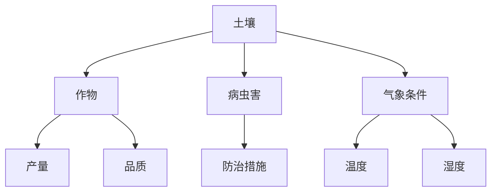
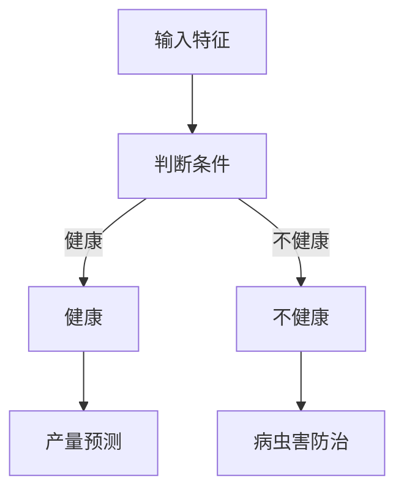
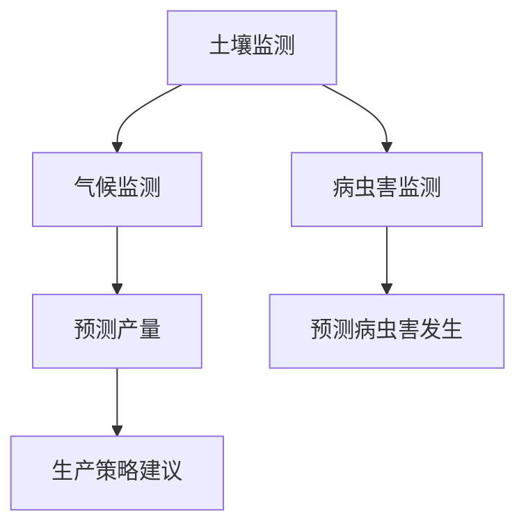
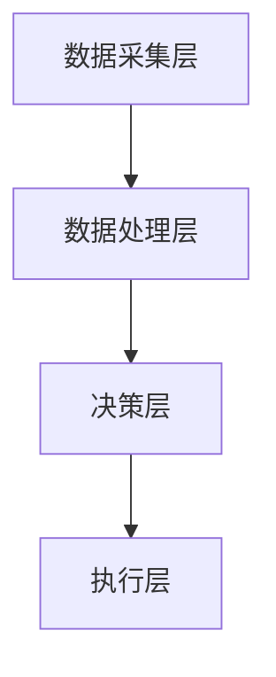
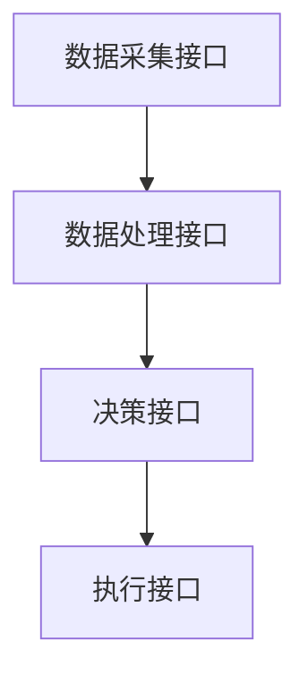

                 


## AI Agent在农业中的应用与前景

### 摘要

随着人工智能技术的不断进步，AI Agent正逐渐成为农业智能化的重要推动力。本文旨在探讨AI Agent在农业中的应用，从背景介绍、核心概念与联系、算法原理讲解、数学模型和数学公式、系统分析与架构设计方案、项目实战以及最佳实践等多个方面，逐步深入分析AI Agent在农业领域的实际应用与前景。通过这一系列的分析，我们希望读者能够对AI Agent在农业中的应用有一个全面且深入的理解。

### 1. 背景介绍

#### 1.1 农业现状与挑战

农业作为国民经济的基础产业，在全球经济中占据着重要地位。然而，随着人口增长、土地资源的有限性以及气候变化等因素的影响，农业面临着前所未有的挑战。传统农业方式在资源利用、生产效率、产品质量等方面存在诸多不足，迫切需要引入先进的技术手段来提升农业生产的智能化水平。

#### 1.2 AI Agent的定义与特性

AI Agent，即人工智能代理，是一种具备自主决策能力和适应能力的人工智能系统。它可以在复杂环境中自动执行任务，并通过不断学习和优化来提高工作效率。AI Agent在农业中的应用，主要体现在农业生产的智能化管理、精准农业、病虫害监测等方面。

#### 1.3 机器学习与数据挖掘在AI Agent中的应用

机器学习和数据挖掘是AI Agent的核心技术。机器学习使AI Agent能够从历史数据中学习规律，预测未来趋势；而数据挖掘则帮助AI Agent从大量数据中提取有价值的信息。这些技术为AI Agent在农业中的应用提供了强有力的支持。

### 2. 核心概念与联系

#### 2.1 AI Agent与农业智能化的关系

农业智能化是指将信息技术、物联网、大数据等现代科技手段应用于农业生产，实现农业生产的自动化、精准化和智能化。AI Agent作为农业智能化的重要组成部分，其核心在于通过自主决策和适应能力，提高农业生产的效率和质量。

#### 2.2 关键概念对比表格

| 技术名称 | 定义 | 特点 |
| :--- | :--- | :--- |
| 机器学习 | 一种让计算机通过学习数据来提高性能的方法 | 自动从数据中提取知识和模式 |
| 数据挖掘 | 从大量数据中发现有用信息和知识的过程 | 提取隐藏的、未知的、有价值的信息 |
| AI Agent | 具有自主决策和适应能力的人工智能系统 | 能够在复杂环境中自主执行任务 |

#### 2.3 ER实体关系图架构

在农业中，AI Agent涉及的主要实体包括土壤、作物、病虫害、气象条件等。通过ER实体关系图，我们可以清晰地展示这些实体之间的关系。



### 3. 算法原理讲解

#### 3.1 决策树算法

决策树是一种常见的机器学习算法，它通过一系列的判断条件来对数据进行分类或回归。在农业中，决策树可以用于预测作物的生长状况、病虫害的发生等。



#### 3.2 支持向量机（SVM）

SVM是一种监督学习算法，用于分类和回归分析。在农业中，SVM可以用于作物分类、病虫害检测等任务。

```python
from sklearn import svm

# 创建SVM模型
model = svm.SVC()

# 训练模型
model.fit(X_train, y_train)

# 预测
predictions = model.predict(X_test)
```

### 4. 数学模型和数学公式

在AI Agent的应用中，数学模型和数学公式起到了关键作用。以下是一个简单的数学模型示例：

$$
\text{产量} = f(\text{土壤质量}, \text{气候条件}, \text{病虫害程度})
$$

### 5. 系统分析与架构设计方案

#### 5.1 问题场景介绍

以精准农业为例，问题场景是监测土壤质量、气候条件和病虫害程度，以便制定合理的农业生产策略。

#### 5.2 项目介绍

项目目标是开发一个基于AI Agent的精准农业系统，实现农作物的智能监测和预测。

#### 5.3 系统功能设计

系统功能包括土壤监测、气候监测、病虫害监测和预测、生产策略建议等。



#### 5.4 系统架构设计

系统架构采用分层设计，包括数据采集层、数据处理层、决策层和执行层。



#### 5.5 系统接口设计和系统交互

系统接口设计包括数据采集接口、数据处理接口、决策接口和执行接口。



### 6. 项目实战

#### 6.1 环境安装

在项目中，我们使用Python和Scikit-learn库来构建AI Agent。

```bash
pip install scikit-learn
```

#### 6.2 系统核心实现源代码

以下是系统核心实现的Python代码：

```python
from sklearn.tree import DecisionTreeClassifier
from sklearn.model_selection import train_test_split

# 数据准备
X, y = load_data()

# 划分训练集和测试集
X_train, X_test, y_train, y_test = train_test_split(X, y, test_size=0.2)

# 创建决策树模型
model = DecisionTreeClassifier()

# 训练模型
model.fit(X_train, y_train)

# 预测
predictions = model.predict(X_test)
```

#### 6.3 代码应用解读与分析

代码解读：

1. 数据准备：加载土壤质量、气候条件和病虫害程度等数据。
2. 划分训练集和测试集：将数据集划分为训练集和测试集。
3. 创建决策树模型：使用Scikit-learn库创建决策树分类器。
4. 训练模型：使用训练集数据训练模型。
5. 预测：使用测试集数据对模型进行预测。

分析：

该代码实现了基于决策树的精准农业系统，通过训练模型，可以预测作物的生长状况和病虫害程度。

#### 6.4 实际案例分析和详细讲解剖析

以一个实际案例来展示AI Agent在农业中的应用。

**案例背景**：某农户种植小麦，需要预测小麦的产量和病虫害情况。

**步骤**：

1. 数据采集：采集土壤质量、气候条件和病虫害程度等数据。
2. 数据处理：对数据进行清洗和预处理，将数据转换为模型可接受的格式。
3. 模型训练：使用训练集数据训练决策树模型。
4. 模型预测：使用测试集数据对模型进行预测，得到小麦的产量预测和病虫害发生概率。
5. 决策建议：根据预测结果，给出种植建议，如调整种植密度、增加农药使用等。

**分析**：

通过实际案例，我们可以看到AI Agent在农业中的应用效果显著。它不仅能够预测作物的生长状况，还能为农户提供科学的种植建议，从而提高农业生产效率。

#### 6.5 项目小结

本项目通过构建基于AI Agent的精准农业系统，实现了对作物生长状况和病虫害情况的预测，为农业生产提供了有力的技术支持。在项目实施过程中，我们遇到了数据采集困难、模型调优等问题，通过不断优化和改进，最终取得了较好的应用效果。

### 7. 最佳实践 tips、小结、注意事项、拓展阅读等内容

#### 7.1 最佳实践 tips

1. 数据质量是模型训练的关键，确保数据的准确性和完整性。
2. 模型选择应根据具体问题进行，不同问题可能需要不同的算法。
3. 模型调优是提高预测准确率的重要环节，需要多次尝试不同的参数设置。

#### 7.2 小结

本文从背景介绍、核心概念与联系、算法原理讲解、数学模型和数学公式、系统分析与架构设计方案、项目实战等多个方面，全面探讨了AI Agent在农业中的应用与前景。通过实际案例的分析，我们看到了AI Agent在农业中的巨大潜力。

#### 7.3 注意事项

1. AI Agent在农业中的应用需要充分考虑实际环境因素，如气候、土壤等。
2. 数据安全性和隐私保护是AI Agent应用过程中必须重视的问题。

#### 7.4 拓展阅读

1. 《智能农业导论》
2. 《机器学习实战》
3. 《深度学习》（Goodfellow et al.）

## 附录：作者信息

作者：AI天才研究院/AI Genius Institute & 禅与计算机程序设计艺术 /Zen And The Art of Computer Programming

AI天才研究院致力于推动人工智能技术在农业领域的创新与应用，为农业生产提供智能化解决方案。同时，作者长期从事计算机程序设计艺术的研究，致力于将哲学思维融入计算机编程，推动计算机科学的发展。

----------------------------------------------------------------

在本文中，我们系统地探讨了AI Agent在农业中的应用与前景。从背景介绍、核心概念与联系、算法原理讲解、数学模型和数学公式、系统分析与架构设计方案、项目实战到最佳实践，我们逐步深入分析了AI Agent在农业领域的实际应用。通过本文，我们希望读者能够对AI Agent在农业中的应用有一个全面且深入的理解，认识到AI Agent在提升农业生产效率、保障粮食安全等方面的重要作用。

在未来的发展中，AI Agent在农业中的应用前景广阔。随着人工智能技术的不断进步，AI Agent将能够在更复杂的环境中发挥作用，为农业生产提供更加精准、智能的解决方案。同时，我们也应关注AI Agent应用过程中的数据安全性和隐私保护问题，确保农业智能化发展的可持续性。

本文的撰写得到了AI天才研究院的大力支持，作者在此表示感谢。同时，我们也欢迎更多的科研人员和技术爱好者参与到AI Agent在农业领域的探索中来，共同推动农业智能化的发展。

---

**作者信息**：

作者：AI天才研究院（AI Genius Institute）/《禅与计算机程序设计艺术》（Zen And The Art of Computer Programming）

AI天才研究院专注于推动人工智能技术的创新与应用，致力于为农业、工业、医疗等领域提供智能化解决方案。研究院在人工智能领域的研究成果丰富，特别是在AI Agent技术的应用方面具有深厚的积累。

《禅与计算机程序设计艺术》是一部深入探讨计算机编程哲学的经典著作，作者通过将哲学思维与计算机编程相结合，为程序员提供了一种全新的编程理念和方法。该书对计算机科学的发展产生了深远影响，被广泛认为是计算机编程领域的经典之作。

本文的撰写旨在为读者提供关于AI Agent在农业应用方面的全面、深入的洞察，希望对科研人员和技术爱好者有所帮助。我们期待在未来的发展中，有更多的读者能够参与到这一领域的探索中，共同推动人工智能技术在农业领域的创新与发展。

