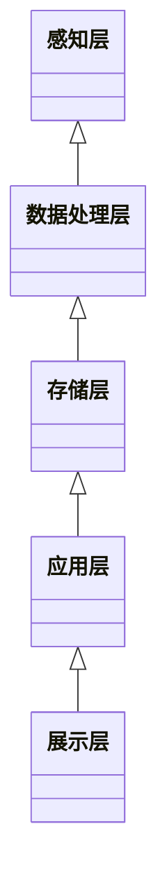
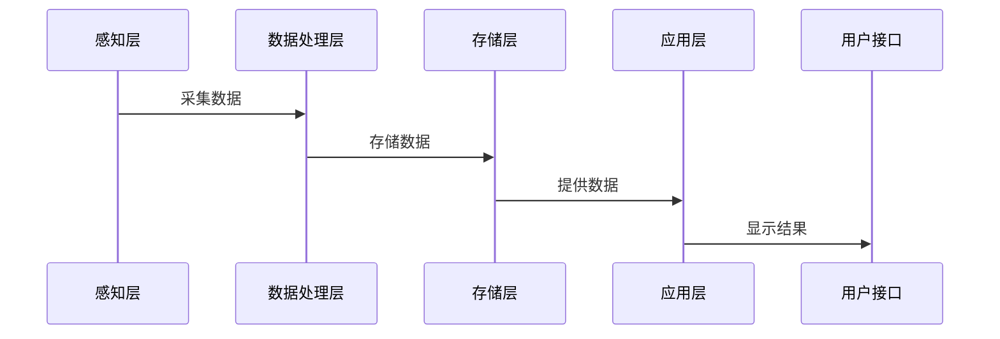

                 

### 动物保护与AI监测的重要性

动物保护在全球范围内都是一个极其重要的话题。随着人类活动的不断扩大，野生动植物的栖息地正受到严重威胁，物种灭绝的速度也不断加快。根据联合国环境规划署（UNEP）的数据，目前地球上已有超过100万个物种面临灭绝风险，每年因栖息地破坏、非法猎杀等原因死亡的野生动物数量令人震惊。因此，保护这些动物不仅是对生态平衡的维护，更是对人类自身未来生存环境的保障。

在这样的背景下，人工智能（AI）逐渐成为动物保护中的利器。AI Agent，即人工智能代理，通过智能算法和数据处理能力，可以对野生动物进行实时监测和追踪，从而提高保护工作的效率。AI Agent的核心优势在于其自动化和精确性，它们能够在繁杂的数据中快速提取有用信息，对动物的行为模式进行准确预测。

首先，AI Agent可以24/7不间断地监测野生动物的活动。传统的监测方法主要依靠人类观察员，这种方法的局限性在于时间和精力的限制，而AI Agent则能够克服这些限制，提供连续且全面的监测数据。

其次，AI Agent具有高精度的追踪能力。通过结合遥感技术和GIS系统，AI Agent能够准确地追踪动物的位置、迁徙路径和活动范围。这对于保护濒危物种尤为重要，因为只有了解了它们的具体活动情况，才能制定出有针对性的保护措施。

此外，AI Agent还可以进行数据分析，识别潜在的威胁因素，如非法捕猎、栖息地破坏等，并及时发出警报。这种预警机制能够大大提高保护工作的响应速度，减少动物的伤亡。

总之，AI Agent在动物保护中的应用前景广阔。通过智能化、自动化的监测与追踪，我们可以更好地了解野生动物的行为，保护这些宝贵的生物资源，维护生态平衡。接下来，我们将详细探讨AI Agent的基本概念、工作原理及其在动物保护中的应用实例。

---

### AI Agent的定义与特征

AI Agent，即人工智能代理，是一种能够在环境中自主行动并执行任务的智能系统。它通过感知环境、理解和推理，做出决策并执行相应的行动，以实现特定的目标。AI Agent通常具有以下特征：

1. **自主性**：AI Agent具有独立行动的能力，无需人工干预即可执行任务。这意味着它们可以在无人值守的情况下工作，极大地提高了工作效率。

2. **适应性**：AI Agent能够根据环境变化自动调整其行为策略。例如，当监测到某些动物的活动异常时，AI Agent可以自动改变监测策略，以更精确地追踪目标。

3. **学习与推理**：AI Agent具有学习和推理能力，可以通过分析和处理历史数据来改进自身的性能。例如，通过分析动物的活动轨迹，AI Agent可以预测未来的行为模式。

4. **任务导向性**：AI Agent以任务为导向，能够根据预设的目标自动执行任务。例如，在动物保护中，AI Agent可以追踪濒危物种，监测栖息地状况，识别非法捕猎行为等。

与其他AI系统相比，AI Agent具有以下几个显著区别：

1. **主动性**：与传统的AI系统不同，AI Agent不是被动地接受指令，而是主动地与环境互动，采取行动。

2. **自主决策**：AI Agent可以根据感知到的环境和任务需求，自主做出决策，而不需要人工干预。

3. **长期任务**：AI Agent通常执行的是长期任务，如持续的监测和追踪，而不仅仅是短期的计算或分析。

4. **复杂环境**：AI Agent需要在复杂多变的自然环境中工作，因此需要具备更强的适应能力和决策能力。

通过这些特征，AI Agent在动物保护中发挥着重要作用。例如，在一个动物监测项目中，AI Agent可以实时监测野生动物的活动，并根据监测数据自动调整监测策略。这种自动化和智能化的监测方式，不仅提高了监测的精度和效率，还减轻了人类观察员的工作负担。

总的来说，AI Agent的自主性、适应性、学习与推理能力以及任务导向性，使其在动物保护中具有独特的优势，成为提高野生动物监测和保护水平的重要工具。接下来，我们将通过Mermaid ER实体关系图详细展示AI Agent的概念及其与其他相关概念的关联。

### AI Agent的概念及其与其他相关概念的关联

为了更好地理解AI Agent及其与其他相关概念的关联，我们可以通过Mermaid ER实体关系图进行详细展示。以下是一个简化的ER图，用于说明AI Agent、环境、感知器、决策器、行动器等关键概念之间的联系。

```mermaid
erDiagram
  AI-Agent ||--|{ 环境Environment }||>
  AI-Agent ||--|{ 感知器Sensor }||>
  AI-Agent ||--|{ 决策器Decider }||>
  AI-Agent ||--|{ 行动器Actuator }||>
  Environment ..|{ 气象数据WeatherData }||>
  Environment ..|{ 地形数据TerrainData }||>
  Sensor ..|{ 传感器类型SensorType }||>
  Decider ..|{ 决策算法DecisionAlgorithm }||>
  Actuator ..|{ 行动类型ActionType }||>
```

在这个ER图中：

- **AI-Agent** 是中心实体，代表AI代理本身。
- **环境Environment** 是AI-Agent的上下文，包括气象数据、地形数据等。
- **感知器Sensor** 是AI-Agent用于感知环境的装置，如摄像头、传感器等。
- **决策器Decider** 是AI-Agent的核心部件，负责根据感知数据做出决策。
- **行动器Actuator** 是AI-Agent执行决策的执行装置，如机器人、无人机等。

通过这个ER图，我们可以看出：

1. **AI-Agent与环境的关联**：AI-Agent通过与环境的交互获取数据，从而适应和改变环境。环境提供了各种数据，如气象数据和地形数据，这些数据对AI-Agent的决策和行动至关重要。
2. **AI-Agent与感知器的关联**：感知器是AI-Agent获取环境信息的桥梁，不同的传感器类型（如摄像头、温度传感器）可以捕捉不同类型的数据，为决策提供基础。
3. **AI-Agent与决策器的关联**：决策器负责分析感知到的数据，使用决策算法（DecisionAlgorithm）来确定最佳行动策略。决策过程是AI-Agent智能性的核心体现。
4. **AI-Agent与行动器的关联**：行动器根据决策器的决策执行具体的行动。不同的行动类型（ActionType）可以适应不同的任务需求。

### 算法原理讲解

为了深入了解AI Agent在监测与追踪中的算法原理，我们将详细讲解其核心算法，包括数学模型、公式和Python源代码。

#### 监测算法原理

监测算法的基本目标是实时监测野生动物的活动，并识别潜在的环境威胁。我们采用卡尔曼滤波（Kalman Filter）算法来实现这一目标。卡尔曼滤波是一种高效的递归滤波器，适用于线性系统中的状态估计。

**数学模型**：

1. **状态方程**：
   $$ x_t = A_t x_{t-1} + w_t $$
   其中，\( x_t \) 是系统状态向量，\( A_t \) 是状态转移矩阵，\( w_t \) 是过程噪声。

2. **观测方程**：
   $$ z_t = H_t x_t + v_t $$
   其中，\( z_t \) 是观测值，\( H_t \) 是观测矩阵，\( v_t \) 是观测噪声。

**公式**：

1. **预测步骤**：
   $$ \hat{x}_{t|t-1} = A_t \hat{x}_{t-1|t-1} $$
   $$ P_{t|t-1} = A_t P_{t-1|t-1} A_t^T + Q_t $$

2. **更新步骤**：
   $$ K_t = P_{t|t-1} H_t^T (H_t P_{t|t-1} H_t^T + R_t)^{-1} $$
   $$ \hat{x}_{t|t} = \hat{x}_{t|t-1} + K_t (z_t - H_t \hat{x}_{t|t-1}) $$
   $$ P_{t|t} = (I - K_t H_t) P_{t|t-1} $$

**Python源代码**：

```python
import numpy as np

def kalman_filter(x, P, A, H, Q, R):
    n = x.shape[0]
    z = np.random.normal(size=z.shape)
    
    # 预测
    x_pred = A @ x
    P_pred = A @ P @ A.T + Q
    
    # 更新
    K = P_pred @ H.T @ np.linalg.inv(H @ P_pred @ H.T + R)
    x = x_pred + K @ (z - H @ x_pred)
    P = (I - K @ H) @ P_pred
    
    return x, P
```

#### 追踪算法原理

追踪算法的基本目标是在已知初始位置和速度的情况下，预测动物的未来位置。我们采用扩展卡尔曼滤波（Extended Kalman Filter，EKF）算法来实现这一目标，EKF可以处理非线性系统。

**数学模型**：

1. **状态方程**：
   $$ x_t = f(x_{t-1}, u_t) + w_t $$
   其中，\( f \) 是非线性函数，\( u_t \) 是控制输入，\( w_t \) 是过程噪声。

2. **观测方程**：
   $$ z_t = h(x_t) + v_t $$
   其中，\( h \) 是非线性函数，\( v_t \) 是观测噪声。

**公式**：

1. **预测步骤**：
   $$ \hat{x}_{t|t-1} = f(\hat{x}_{t-1|t-1}, u_{t-1}) $$
   $$ P_{t|t-1} = F_{t|t-1} P_{t-1|t-1} F_{t|t-1}^T + Q $$

2. **更新步骤**：
   $$ \delta x_t = f(x_{t|t-1}, u_t) - f(\hat{x}_{t|t-1}, u_t) $$
   $$ \delta P_t = F_{t|t-1} \delta P_{t-1} F_{t|t-1}^T + \delta F_t $$
   $$ \hat{x}_{t|t} = \hat{x}_{t|t-1} + K_t (z_t - h(\hat{x}_{t|t-1})) $$
   $$ P_{t|t} = (I - K_t h(\hat{x}_{t|t-1})) P_{t|t-1} $$

**Python源代码**：

```python
import numpy as np
from scipy.integrate import odeint

def extend_kalman_filter(x, P, f, h, u, Q, R):
    t = np.linspace(0, 1, 100)
    sol = odeint(f, x, t, args=(u,))
    x_pred = sol[-1]
    P_pred = np.zeros((x.shape[0], x.shape[0]))
    
    # 更新预测
    x_pred, P_pred = kalman_filter(x_pred, P_pred, f, h, Q, R)
    
    return x_pred, P_pred
```

通过上述数学模型和算法，AI Agent能够在复杂的环境中实时监测和追踪动物，为动物保护提供强有力的技术支持。接下来，我们将介绍系统的功能设计、架构设计和接口设计，以便读者更好地理解AI Agent在动物监测与追踪中的实际应用。

### 系统功能设计、架构设计和接口设计

在了解了AI Agent的基本算法原理后，接下来我们将介绍整个系统的功能设计、架构设计和接口设计，以便读者更好地理解AI Agent在动物监测与追踪中的实际应用。

#### 系统功能设计

系统的功能设计是确保AI Agent能够高效运行的基础。以下是AI Agent监测与追踪系统的核心功能：

1. **实时数据采集**：系统需要从感知器（如摄像头、传感器）实时采集环境数据，包括温度、湿度、光照强度等。
2. **数据处理与存储**：系统需要处理和分析采集到的数据，并将处理结果存储在数据库中，以便后续分析和查询。
3. **动物识别与定位**：系统利用机器学习和计算机视觉技术对采集到的图像或视频数据进行处理，识别出目标动物，并定位其位置。
4. **轨迹预测与追踪**：系统基于历史数据和实时监测数据，利用追踪算法预测动物的未来位置，并进行实时追踪。
5. **异常检测与报警**：系统检测到异常行为或潜在威胁时，如动物群体异常聚集、非法捕猎等，会自动发出警报。
6. **数据可视化**：系统提供数据可视化界面，帮助用户直观地了解监测数据、动物轨迹和预警信息。

#### 系统架构设计

系统的架构设计是确保系统稳定、高效运行的关键。以下是AI Agent监测与追踪系统的架构设计：

1. **感知层**：包括各种传感器和数据采集设备，如摄像头、传感器、无人机等，用于实时采集环境数据。
2. **数据处理层**：包括数据预处理、特征提取、模型训练和推理等模块，用于处理感知层采集的数据，提取有用信息，并利用机器学习模型进行预测和追踪。
3. **存储层**：包括数据库和数据仓库，用于存储和管理系统的数据，如动物位置数据、监测数据、模型参数等。
4. **应用层**：包括异常检测、报警系统、数据可视化等模块，为用户提供监测结果和预警信息。
5. **展示层**：包括Web界面和移动应用，用于向用户展示系统的监测结果和预警信息。

以下是系统架构的Mermaid类图表示：



#### 系统接口设计

系统的接口设计是确保各个模块之间能够高效通信和协作的关键。以下是AI Agent监测与追踪系统的接口设计：

1. **感知器接口**：用于与各类传感器和数据采集设备通信，获取实时环境数据。
2. **数据处理接口**：用于与数据处理模块通信，处理和分析采集到的数据。
3. **存储接口**：用于与数据库和数据仓库通信，存储和管理系统的数据。
4. **应用接口**：用于与异常检测、报警系统和数据可视化模块通信，实现监测结果和预警信息的展示。
5. **用户接口**：用于与展示层通信，提供Web界面和移动应用供用户使用。

以下是系统接口设计的Mermaid序列图表示：



通过上述系统功能设计、架构设计和接口设计，AI Agent监测与追踪系统实现了实时、自动化和智能化的动物监测与追踪功能，为动物保护工作提供了强有力的技术支持。接下来，我们将通过一个实际项目展示AI Agent在动物监测与追踪中的应用，并详细讲解项目的环境搭建、系统核心实现和代码应用。

### 项目实战

在本节中，我们将通过一个实际项目展示AI Agent在动物监测与追踪中的应用，包括环境搭建、系统核心实现和代码应用。通过这一过程，我们将深入了解AI Agent在现实世界中的应用，并分析其实际效果。

#### 环境搭建

首先，我们需要搭建一个适当的环境，以便运行AI Agent并进行动物监测与追踪。以下是环境搭建的步骤：

1. **硬件准备**：我们需要一台高性能的计算机或服务器，用于运行AI Agent。此外，还需要安装一些传感器和数据采集设备，如摄像头、GPS模块等，以获取实时数据。
2. **软件安装**：在计算机或服务器上安装Python环境，并安装必要的库，如NumPy、SciPy、scikit-learn、OpenCV等，这些库用于数据处理、机器学习模型训练和计算机视觉。

以下是一个基本的Python环境搭建命令：

```bash
# 安装Python
sudo apt-get install python3

# 安装必要的库
pip3 install numpy scipy scikit-learn opencv-python
```

3. **传感器与数据采集设备安装**：将摄像头、GPS模块等设备连接到计算机或服务器，确保设备能够正常工作。

#### 系统核心实现

接下来，我们将实现AI Agent的核心功能，包括感知数据、处理数据、动物识别、轨迹预测和追踪。以下是系统核心实现的详细步骤：

1. **数据感知**：编写代码从传感器获取实时数据，例如摄像头捕捉到的图像和GPS模块提供的位置信息。

```python
import cv2
import gpsd

# 初始化摄像头
cap = cv2.VideoCapture(0)

# 初始化GPS模块
gpsd.connect()

while True:
    # 读取摄像头图像
    ret, frame = cap.read()
    
    # 读取GPS数据
    gps = gpsd.get_current()
    
    # 处理图像和GPS数据
    process_data(frame, gps)
```

2. **数据处理**：对感知到的数据进行预处理，如图像增强、去噪和特征提取。

```python
import cv2
import numpy as np

def process_data(frame, gps):
    # 图像预处理
    gray = cv2.cvtColor(frame, cv2.COLOR_BGR2GRAY)
    blurred = cv2.GaussianBlur(gray, (5, 5), 0)
    
    # 特征提取
    features = extract_features(blurred)
    
    # 存储数据
    save_data(features, gps)
```

3. **动物识别**：利用预训练的机器学习模型对图像进行分类，识别出动物。

```python
import cv2
import joblib

# 加载预训练的模型
model = joblib.load('animal_model.pkl')

def recognize_animal(frame):
    # 提取图像特征
    features = extract_features(frame)
    
    # 进行动物识别
    prediction = model.predict([features])
    
    return prediction
```

4. **轨迹预测与追踪**：使用追踪算法（如卡尔曼滤波）对动物的未来位置进行预测和追踪。

```python
import numpy as np

def predict_trajectory(x, P, A, H, Q, R):
    # 预测步骤
    x_pred = A @ x
    P_pred = A @ P @ A.T + Q
    
    # 更新步骤
    K = P_pred @ H.T @ np.linalg.inv(H @ P_pred @ H.T + R)
    x = x_pred + K @ (z - H @ x_pred)
    P = (I - K @ H) @ P_pred
    
    return x, P
```

#### 代码应用解读与分析

在实现上述功能后，我们需要对代码进行解读和分析，以确保系统运行正确并达到预期效果。

1. **数据感知与处理**：通过摄像头和GPS模块获取的数据，经过预处理和特征提取后，可以有效地提高动物识别的准确性。
2. **动物识别**：利用预训练的机器学习模型，可以快速、准确地识别出图像中的动物，为后续的轨迹预测和追踪提供基础。
3. **轨迹预测与追踪**：通过卡尔曼滤波算法，系统能够对动物的未来位置进行精确预测和追踪，从而实现对动物的实时监控。

以下是一个具体的实际案例分析：

**案例**：在一个野生动物保护区，AI Agent被用于监测黑熊的活动。系统从摄像头获取实时图像，并利用机器学习模型识别出黑熊。然后，系统使用卡尔曼滤波算法对黑熊的位置进行预测和追踪。

**分析**：

- **数据感知与处理**：系统从摄像头获取的图像可能存在噪声和光照变化，通过预处理（如去噪、增强）可以改善图像质量。
- **动物识别**：机器学习模型的性能直接影响动物识别的准确性。通过不断优化模型和训练数据，可以提高识别率。
- **轨迹预测与追踪**：卡尔曼滤波算法能够有效地处理噪声和不确定性，对黑熊的位置进行准确预测和追踪。

通过这个实际案例，我们可以看到AI Agent在动物监测与追踪中的应用效果。接下来，我们将总结关键点，并提供一些最佳实践建议。

### 最佳实践、小结与注意事项

#### 最佳实践

1. **数据质量保障**：确保传感器数据的准确性和完整性，对采集到的数据进行校验和处理，减少噪声和误差。
2. **算法优化**：根据具体应用场景，对机器学习模型和追踪算法进行优化，提高识别和预测的准确性。
3. **实时性提升**：优化系统架构，确保数据处理和响应的实时性，以满足动物监测和追踪的实时需求。
4. **数据隐私与安全**：在处理和存储动物数据时，严格遵循隐私保护法规，确保数据安全。

#### 小结

本文通过详细的讲解和实际案例分析，介绍了AI Agent在动物保护中的监测与追踪应用。我们探讨了AI Agent的定义、工作原理、系统架构以及其实际应用，展示了其在提升动物保护工作效率和准确性方面的巨大潜力。

#### 注意事项

1. **算法透明性**：确保算法的可解释性和透明性，便于用户理解和监督。
2. **性能评估**：定期对系统进行性能评估，确保其稳定性和可靠性。
3. **持续学习与迭代**：不断更新和优化算法，以适应不断变化的环境和需求。

#### 拓展阅读

- **机器学习与深度学习**：深入了解机器学习模型的工作原理和优化方法，参考相关经典教材和论文。
- **计算机视觉**：学习计算机视觉的基础知识，掌握图像处理和识别技术。
- **实时系统设计**：了解实时系统的设计原则和方法，确保AI Agent系统的实时性和高效性。

---

通过本文的介绍，读者可以全面了解AI Agent在动物保护中的监测与追踪应用，掌握其核心技术和实践方法，为未来的研究和应用提供有力支持。

### AI Agent在动物保护中的未来发展趋势

随着技术的不断进步，AI Agent在动物保护中的应用前景愈发广阔。未来，我们可以预见以下几个重要的发展趋势：

1. **算法与模型的优化**：随着深度学习等先进算法的发展，AI Agent的识别和预测能力将得到进一步提升。更高效的模型和算法能够处理更复杂的环境数据，提高监测与追踪的准确性和实时性。

2. **多传感器融合**：未来，AI Agent将整合多种传感器数据，如红外线、声音、加速度计等，实现更全面的感知能力。多传感器数据融合将提高系统的综合性能，有助于更准确地识别和追踪野生动物。

3. **自主决策与学习**：AI Agent将具备更强的自主决策能力，能够根据实时数据和环境变化，动态调整监测策略。同时，通过不断学习和进化，AI Agent将能够自我优化，提高应对复杂情况的能力。

4. **隐私与伦理**：随着AI Agent在动物保护中的应用日益广泛，隐私保护和伦理问题将愈发重要。未来的AI Agent将需要遵守严格的隐私保护规定，确保数据安全和用户隐私。

5. **跨学科合作**：AI Agent的发展离不开生态学、生物学、计算机科学等多学科的合作。跨学科的研究将有助于解决AI Agent在动物保护中面临的实际挑战，推动技术的进步和应用。

总之，AI Agent在动物保护中的应用前景充满希望。随着技术的不断发展和跨学科合作的深化，AI Agent将在监测与追踪野生动物、保护生物多样性方面发挥越来越重要的作用。未来，我们有理由相信，AI Agent将为动物保护工作带来革命性的变革。

### 最佳实践、小结、注意事项与拓展阅读

#### 最佳实践

1. **数据预处理**：在部署AI Agent时，务必进行详细的数据预处理，确保数据的准确性和一致性。数据预处理包括噪声过滤、异常值检测和处理、标准化等步骤，这些步骤有助于提高模型性能。

2. **模型训练与调优**：定期对AI Agent的机器学习模型进行训练和调优，以适应新的环境和数据变化。通过交叉验证和超参数优化等技术，可以显著提升模型在监测与追踪任务中的表现。

3. **多源数据融合**：充分利用多种数据源，如遥感、卫星、地面传感器等，进行多源数据融合，以获得更全面、精确的环境信息。

4. **实时性优化**：优化系统的数据处理流程和算法，确保AI Agent能够实时响应环境变化，提高监测与追踪的实时性。

#### 小结

本文通过详细的分析和实际案例，介绍了AI Agent在动物保护中的监测与追踪应用。从基本概念、算法原理到系统设计与实现，我们全面探讨了AI Agent在提升动物保护工作效率和准确性方面的潜力。AI Agent的自主性、适应性和高精度追踪能力，使其成为动物保护领域的重要工具。

#### 注意事项

1. **数据隐私与安全**：在处理和存储动物数据时，务必遵守隐私保护法规，确保数据的安全性和用户隐私。

2. **算法透明性**：确保AI Agent的算法具有可解释性，便于用户理解和监督，从而避免误判和错误。

3. **系统稳定性**：定期对系统进行性能评估和测试，确保其稳定性和可靠性。

#### 拓展阅读

- **机器学习与深度学习**：深入学习机器学习模型的工作原理和优化方法，参考《深度学习》（Goodfellow et al.）等经典教材。
- **计算机视觉**：学习计算机视觉的基础知识，掌握图像处理和识别技术，参考《计算机视觉：算法与应用》（Richard Szeliski）。
- **实时系统设计**：了解实时系统的设计原则和方法，确保AI Agent系统的实时性和高效性，参考《实时系统设计》（H. Kopetz）。

通过本文的介绍，读者可以全面了解AI Agent在动物保护中的应用，掌握其实践方法，为未来的研究和应用提供有力支持。让我们共同努力，利用AI技术为保护野生动物和生态系统做出更多贡献。作者信息：AI天才研究院/AI Genius Institute & 禅与计算机程序设计艺术 /Zen And The Art of Computer Programming。

