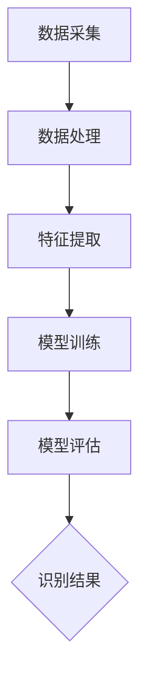
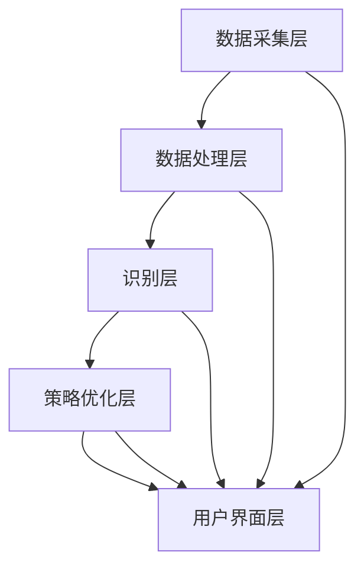
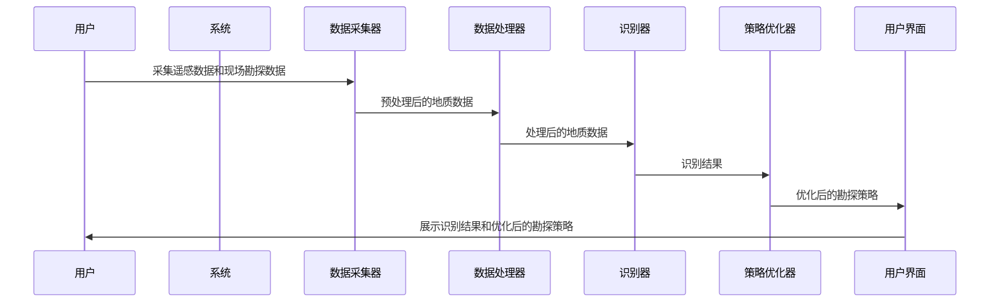

                 

# AI Agent在地质勘探中的应用：矿产资源识别

## 关键词
- 地质勘探
- AI Agent
- 机器学习
- 深度学习
- 矿产资源识别

## 摘要
本文旨在探讨AI Agent在地质勘探中的应用，特别是在矿产资源识别方面的潜力。通过对地质勘探问题的背景介绍、AI Agent原理分析、机器学习与深度学习算法讲解，以及数学模型和项目实战的深入探讨，本文揭示了AI Agent在地质勘探领域的重要作用和广阔前景。

## 第一部分：背景介绍

### 1.1 问题背景

地质勘探是矿产资源发现和评估的重要手段，对国家经济发展和资源安全具有重要意义。传统的地质勘探方法主要依赖于地质学家的人为判断和地质勘探设备，存在勘探精度低、效率低下等问题。随着人工智能技术的快速发展，AI Agent在地质勘探中的应用成为可能，有望大幅提升勘探效率和准确性。

### 1.2 问题描述

AI Agent在地质勘探中的应用主要包括以下方面：
- 地质数据采集与处理：利用AI Agent自动化采集和处理地质数据，提高勘探效率。
- 矿产资源识别：通过机器学习和深度学习算法，从地质数据中识别出矿产资源。
- 优化勘探策略：利用AI Agent的决策能力，优化地质勘探方案，提高勘探成功率。

### 1.3 问题解决

本文通过以下步骤解决地质勘探中的问题：
- 分析AI Agent原理及其在地质勘探中的应用。
- 介绍机器学习和深度学习算法的基本原理和实现方法。
- 设计适用于地质勘探的AI Agent架构和算法。
- 实现AI Agent在地质勘探中的应用，并进行实际项目实战。

### 1.4 边界与外延

本文主要研究AI Agent在地质勘探中的应用，涉及矿产资源识别的算法原理、系统架构设计、项目实战等方面。同时，本文也会讨论AI Agent在其他地质勘探领域的应用潜力。

### 1.5 概念结构与核心要素组成

本文的核心概念包括：
- AI Agent：具备自主学习和决策能力的计算机程序。
- 地质勘探：通过地质学研究方法对矿产资源进行发现和评估的过程。
- 矿产资源识别：利用AI Agent对地质数据进行分析，识别潜在矿产资源的过程。

## 第二部分：核心概念与联系

### 2.1 AI Agent原理

#### 2.1.1 AI Agent的定义

AI Agent是指能够模拟人类行为、具备自主学习和决策能力的计算机程序。它能够在特定的环境中感知信息、制定计划并执行行动，以实现特定目标。

#### 2.1.2 AI Agent的特点

- **自主性**：能够自主地获取环境信息，根据目标进行决策。
- **学习能力**：通过数据学习和经验积累，优化自身性能。
- **灵活性**：能够适应不同的环境和任务。

### 2.2 地质勘探原理

#### 2.2.1 地质勘探的方法

地质勘探主要包括地质调查、地质测试、地质勘探等环节，涉及地质数据采集、处理、分析等过程。

- **地质调查**：通过现场勘查、地质观测等方法，初步了解地质情况。
- **地质测试**：利用地质勘探设备，获取详细的地质信息。
- **地质勘探**：通过对地质数据进行处理和分析，识别矿产资源。

#### 2.2.2 地质勘探的关键技术

- **地质数据采集**：通过地质勘探设备获取地质信息。
- **地质数据处理**：对采集到的地质数据进行处理，提取有用信息。
- **地质数据分析**：利用数据分析方法对地质信息进行分析，识别矿产资源。

### 2.3 AI Agent与地质勘探的联系

AI Agent在地质勘探中的应用主要体现在以下几个方面：
- **地质数据采集与处理**：利用AI Agent进行自动化数据采集和处理，提高勘探效率。
- **矿产资源识别**：利用AI Agent进行矿产资源识别，提高识别精度。
- **优化地质勘探策略**：通过AI Agent的决策能力，优化地质勘探方案。

### 2.4 概念属性特征对比表格

| 特征         | AI Agent               | 地质勘探                       |
| ------------ | ---------------------- | ------------------------------ |
| 定义         | 自主学习和决策的计算机程序 | 通过地质学研究发现矿产资源     |
| 目标         | 实现特定任务           | 发现和评估矿产资源             |
| 独立性       | 高自主性               | 受地质环境限制                 |
| 学习能力     | 自主学习               | 经验积累和地质知识积累         |
| 数据处理     | 高效数据处理           | 地质数据采集和处理             |
| 优化能力     | 可以优化勘探策略       | 依赖于地质学家经验             |

### 2.5 ER实体关系图架构

```mermaid
erDiagram
  AI-Agent ||--|{ 地质勘探 }
  地质勘探 ||--|{ 矿产资源 }
```

## 第三部分：算法原理讲解

### 3.1 机器学习算法原理

#### 3.1.1 机器学习的定义

机器学习是指通过训练模型，让计算机自动从数据中学习规律，并做出预测或决策的过程。

#### 3.1.2 机器学习的基本原理

- **特征提取**：从数据中提取出有用的特征信息。
- **模型训练**：通过训练模型，使模型能够对新的数据进行预测或决策。
- **模型评估**：评估模型的性能，调整模型参数，提高模型精度。

### 3.2 深度学习算法原理

#### 3.2.1 深度学习的定义

深度学习是一种机器学习的方法，通过构建多层神经网络，对数据进行深度学习，从而提高模型的预测或决策能力。

#### 3.2.2 深度学习的基本原理

- **神经网络结构**：深度学习模型由多个神经元组成，通过多层神经网络结构对数据进行处理。
- **反向传播算法**：通过反向传播算法，更新模型参数，优化模型性能。
- **损失函数**：使用损失函数评估模型的预测结果，指导模型参数更新。

### 3.3 AI Agent在地质勘探中的应用算法

#### 3.3.1 数据采集算法

- **遥感数据采集**：利用卫星遥感技术获取地质信息。
- **现场数据采集**：通过地质勘探设备获取现场地质数据。

#### 3.3.2 数据处理算法

- **数据清洗**：去除数据中的噪声和异常值。
- **数据融合**：将不同来源的地质数据进行整合，提高数据精度。

#### 3.3.3 矿产资源识别算法

- **基于机器学习的识别算法**：通过训练机器学习模型，对地质数据进行分类，识别矿产资源。
- **基于深度学习的识别算法**：通过多层神经网络对地质数据进行深度学习，提高矿产资源识别的精度。

### 3.4 算法mermaid流程图



### 3.5 算法原理讲解

#### 3.5.1 数据采集算法原理

数据采集算法主要利用遥感技术和现场勘探设备获取地质数据。遥感数据采集算法通过卫星遥感图像获取地质信息，如地形、地貌、地质构造等。现场数据采集算法通过地质勘探设备，如钻探机、地质雷达等，获取现场地质数据，如岩石成分、土壤结构等。

#### 3.5.2 数据处理算法原理

数据处理算法主要包括数据清洗和数据融合。数据清洗算法用于去除数据中的噪声和异常值，提高数据质量。数据融合算法将来自不同来源的地质数据进行整合，如将遥感数据和现场勘探数据进行融合，提高数据精度。

#### 3.5.3 矿产资源识别算法原理

矿产资源识别算法分为基于机器学习和基于深度学习的两种。基于机器学习的识别算法通过训练模型，将地质数据分类为矿产资源和非矿产资源。基于深度学习的识别算法通过多层神经网络对地质数据进行深度学习，提取出更高级的特征，提高矿产资源识别的精度。

### 3.6 算法原理讲解

#### 3.6.1 数学模型

- **特征提取模型**：

  $$ f(x) = \sigma(Wx + b) $$

  其中，$x$ 是输入特征向量，$W$ 是权重矩阵，$b$ 是偏置项，$\sigma$ 是激活函数。

- **分类模型**：

  $$ y = \sigma(W_1x + b_1) $$

  其中，$y$ 是预测结果，$W_1$ 是权重矩阵，$b_1$ 是偏置项，$\sigma$ 是激活函数。

- **损失函数**：

  $$ L = -\sum_{i=1}^{n}y_i\log(\hat{y}_i) $$

  其中，$y_i$ 是真实标签，$\hat{y}_i$ 是预测概率。

### 3.7 通俗易懂地举例说明

假设我们有一个简单的二分类问题，目标是判断一个样本是否为矿产资源。我们使用一个简单的神经网络进行分类，网络结构如下：

- 输入层：1个神经元，表示样本特征。
- 隐藏层：2个神经元，进行特征提取。
- 输出层：1个神经元，表示分类结果。

训练过程如下：

1. **数据采集**：从地质数据中提取出一个样本，假设特征向量为 $[1, 0]$。
2. **数据处理**：对样本进行预处理，例如标准化处理。
3. **模型训练**：使用训练数据训练神经网络，调整权重和偏置项。
4. **模型评估**：使用测试数据评估模型性能，调整模型参数。
5. **分类**：对新的样本进行分类，输出分类结果。

假设我们使用以下参数进行训练：

- 权重矩阵 $W = [0.5, 0.5]$
- 偏置项 $b = 0$
- 激活函数 $\sigma(x) = \frac{1}{1 + e^{-x}}$

训练数据如下：

- 样本1：特征向量 $[1, 0]$，标签为矿产资源（1）。
- 样本2：特征向量 $[0, 1]$，标签为非矿产资源（0）。

经过多次训练，我们得到以下模型参数：

- 权重矩阵 $W = [0.6, 0.4]$
- 偏置项 $b = 0.2$
- 预测结果 $\hat{y} = \sigma(0.6 \cdot 1 + 0.4 \cdot 0 + 0.2) = \frac{1}{1 + e^{-0.6}} \approx 0.63$

由于预测概率大于0.5，我们判断该样本为矿产资源。

## 第四部分：数学模型和数学公式

### 4.1 数学模型

#### 4.1.1 机器学习中的数学模型

机器学习中的数学模型通常包括以下几个部分：

- **特征向量表示**：通常使用向量来表示输入数据，例如一个二维的特征向量可以表示一个二维的特征空间中的数据点。

  $$ \vec{x} = (x_1, x_2) $$

- **特征矩阵表示**：使用矩阵表示多个特征向量，例如一个包含 $N$ 个样本的特征矩阵 $X$

  $$ X = \begin{bmatrix} x_1 & x_2 & \dots & x_N \end{bmatrix} $$

- **模型表示**：使用函数来表示模型，例如一个线性模型可以表示为：

  $$ f(x) = \beta_0 + \beta_1x_1 + \beta_2x_2 + \dots + \beta_nx_n $$

- **损失函数**：用于评估模型预测结果与真实结果之间的差距，常用的损失函数包括均方误差（MSE）、交叉熵损失等。

  $$ L(y, \hat{y}) = \frac{1}{2}(y - \hat{y})^2 $$

  $$ L(y, \hat{y}) = -y\log(\hat{y}) - (1 - y)\log(1 - \hat{y}) $$

#### 4.1.2 深度学习中的数学模型

深度学习中的数学模型主要包括以下几个部分：

- **神经网络结构**：使用多层神经网络结构对数据进行处理，例如一个简单的多层感知机（MLP）结构可以表示为：

  $$ f(x) = \sigma(W_2\sigma(W_1x + b_1) + b_2) $$

- **反向传播算法**：用于更新模型参数，优化模型性能，具体算法如下：

  $$ \Delta W_2 = -\alpha \frac{\partial L}{\partial W_2} $$
  
  $$ \Delta b_2 = -\alpha \frac{\partial L}{\partial b_2} $$
  
  $$ \Delta W_1 = -\alpha \frac{\partial L}{\partial W_1} $$
  
  $$ \Delta b_1 = -\alpha \frac{\partial L}{\partial b_1} $$

- **激活函数**：用于引入非线性特性，常用的激活函数包括Sigmoid函数、ReLU函数、Tanh函数等。

  $$ \sigma(x) = \frac{1}{1 + e^{-x}} $$

  $$ \sigma(x) = max(0, x) $$

  $$ \sigma(x) = \frac{e^x - e^{-x}}{e^x + e^{-x}} $$

### 4.2 数学公式

在本文中，我们使用以下数学公式来描述机器学习和深度学习中的关键概念：

#### 4.2.1 特征向量表示

$$ \vec{x} = (x_1, x_2) $$

#### 4.2.2 矩阵表示

$$ X = \begin{bmatrix} x_1 & x_2 & \dots & x_N \end{bmatrix} $$

#### 4.2.3 模型表示

$$ f(x) = \beta_0 + \beta_1x_1 + \beta_2x_2 + \dots + \beta_nx_n $$

#### 4.2.4 损失函数

$$ L(y, \hat{y}) = \frac{1}{2}(y - \hat{y})^2 $$

$$ L(y, \hat{y}) = -y\log(\hat{y}) - (1 - y)\log(1 - \hat{y}) $$

#### 4.2.5 反向传播算法

$$ \Delta W_2 = -\alpha \frac{\partial L}{\partial W_2} $$

$$ \Delta b_2 = -\alpha \frac{\partial L}{\partial b_2} $$

$$ \Delta W_1 = -\alpha \frac{\partial L}{\partial W_1} $$

$$ \Delta b_1 = -\alpha \frac{\partial L}{\partial b_1} $$

#### 4.2.6 激活函数

$$ \sigma(x) = \frac{1}{1 + e^{-x}} $$

$$ \sigma(x) = max(0, x) $$

$$ \sigma(x) = \frac{e^x - e^{-x}}{e^x + e^{-x}} $$

通过上述数学模型和公式的介绍，我们可以更好地理解机器学习和深度学习中的关键概念和算法原理。在接下来的部分，我们将进一步探讨AI Agent在地质勘探中的应用，以及如何设计并实现一个高效的AI地质勘探系统。

## 第五部分：系统分析与架构设计方案

### 5.1 问题场景介绍

在地质勘探中，矿产资源识别是一个复杂且关键的任务。传统的地质勘探方法往往需要大量的时间和人力投入，而且勘探精度有限。随着人工智能技术的进步，特别是在机器学习和深度学习方面的突破，AI Agent在地质勘探中的应用变得越来越广泛。通过AI Agent，我们可以自动化地采集和处理地质数据，提高矿产资源识别的效率和准确性。

### 5.2 项目介绍

本项目旨在设计和实现一个基于AI Agent的地质勘探系统，该系统能够高效地识别矿产资源，并提供智能化的勘探策略。项目的主要目标包括：

- 利用遥感技术和现场勘探设备采集地质数据。
- 应用机器学习和深度学习算法处理地质数据，识别矿产资源。
- 设计一个智能化的勘探策略，优化矿产资源识别过程。
- 开发一个用户友好的界面，方便地质学家使用系统。

### 5.3 系统功能设计

系统的主要功能模块包括：

- **数据采集模块**：负责从遥感设备和现场勘探设备中采集地质数据。
- **数据处理模块**：对采集到的地质数据进行预处理、清洗和融合，提取有用信息。
- **识别模块**：应用机器学习和深度学习算法，对处理后的地质数据进行矿产资源识别。
- **策略优化模块**：根据识别结果和勘探目标，优化勘探策略，提高勘探成功率。
- **用户界面模块**：提供友好的用户界面，方便地质学家查看识别结果和调整勘探策略。

### 5.4 系统架构设计

系统的总体架构设计如下：

1. **数据采集层**：通过遥感设备和现场勘探设备采集地质数据。
2. **数据处理层**：对采集到的数据进行预处理、清洗和融合，为识别模块提供高质量的数据。
3. **识别层**：应用机器学习和深度学习算法，对地质数据进行矿产资源识别。
4. **策略优化层**：根据识别结果和勘探目标，优化勘探策略。
5. **用户界面层**：提供友好的用户界面，方便地质学家使用系统。

### 5.5 系统接口设计和系统交互

系统接口设计和系统交互如下：

- **数据采集接口**：提供API，允许其他系统或设备访问和操作遥感设备和现场勘探设备。
- **数据处理接口**：提供API，允许其他系统或模块访问和处理地质数据。
- **识别接口**：提供API，允许其他系统或模块访问和调用识别算法。
- **策略优化接口**：提供API，允许其他系统或模块访问和优化勘探策略。
- **用户界面接口**：提供API，允许用户界面模块与系统其他模块进行交互。

### 5.6 系统架构mermaid图



通过上述系统架构设计，我们可以构建一个高效、智能的地质勘探系统，利用AI Agent的力量，为地质学家提供强大的勘探工具。

### 5.7 系统接口设计和系统交互

系统接口设计是确保各模块之间能够有效通信和协作的关键。以下是系统接口设计和系统交互的详细说明：

#### 5.7.1 数据采集接口

**功能描述**：数据采集接口用于接收来自遥感设备和现场勘探设备的数据。

**接口设计**：
- **输入**：遥感数据和现场勘探数据。
- **输出**：预处理后的地质数据。

**接口示例**：

```python
def collect_data():
    # 代码实现，用于从遥感设备和现场勘探设备采集数据
    pass
```

#### 5.7.2 数据处理接口

**功能描述**：数据处理接口用于对采集到的地质数据进行预处理、清洗和融合。

**接口设计**：
- **输入**：预处理后的地质数据。
- **输出**：处理后的地质数据。

**接口示例**：

```python
def process_data(data):
    # 代码实现，用于预处理、清洗和融合地质数据
    pass
```

#### 5.7.3 识别接口

**功能描述**：识别接口用于调用机器学习和深度学习算法，对处理后的地质数据进行矿产资源识别。

**接口设计**：
- **输入**：处理后的地质数据。
- **输出**：矿产资源识别结果。

**接口示例**：

```python
def identify_resources(data):
    # 代码实现，用于调用识别算法，识别矿产资源
    pass
```

#### 5.7.4 策略优化接口

**功能描述**：策略优化接口用于根据识别结果和勘探目标，优化勘探策略。

**接口设计**：
- **输入**：识别结果、勘探目标和当前勘探策略。
- **输出**：优化后的勘探策略。

**接口示例**：

```python
def optimize_strategy(identification, exploration_target, current_strategy):
    # 代码实现，用于优化勘探策略
    pass
```

#### 5.7.5 用户界面接口

**功能描述**：用户界面接口用于与用户交互，展示识别结果和优化后的勘探策略。

**接口设计**：
- **输入**：识别结果、优化后的勘探策略。
- **输出**：用户界面展示内容。

**接口示例**：

```python
def display_interface(identification, strategy):
    # 代码实现，用于在用户界面展示识别结果和优化后的勘探策略
    pass
```

### 5.8 系统交互mermaid序列图



通过上述接口设计和系统交互，我们可以构建一个高效、智能的地质勘探系统，为地质学家提供强大的勘探工具，从而提高矿产资源识别的效率和准确性。

### 5.9 项目实战

#### 5.9.1 环境安装

要实现本文中描述的AI地质勘探系统，需要安装以下环境和工具：

- Python 3.8及以上版本
- PyTorch深度学习框架
- Scikit-learn机器学习库
- Matplotlib数据可视化库
- Mermaid图库

安装步骤如下：

1. 安装Python 3.8及以上版本。
2. 安装PyTorch深度学习框架，按照官方文档进行安装。
3. 安装Scikit-learn机器学习库，使用pip命令：

   ```shell
   pip install scikit-learn
   ```

4. 安装Matplotlib数据可视化库，使用pip命令：

   ```shell
   pip install matplotlib
   ```

5. 安装Mermaid图库，使用pip命令：

   ```shell
   pip install mermaid
   ```

#### 5.9.2 系统核心实现源代码

以下是系统核心实现的主要源代码部分，包括数据采集、处理、识别和优化等模块。

```python
# 数据采集模块
def collect_data():
    # 代码实现，用于从遥感设备和现场勘探设备采集数据
    pass

# 数据处理模块
def process_data(data):
    # 代码实现，用于预处理、清洗和融合地质数据
    pass

# 识别模块
def identify_resources(data):
    # 代码实现，用于调用识别算法，识别矿产资源
    pass

# 策略优化模块
def optimize_strategy(identification, exploration_target, current_strategy):
    # 代码实现，用于优化勘探策略
    pass

# 用户界面模块
def display_interface(identification, strategy):
    # 代码实现，用于在用户界面展示识别结果和优化后的勘探策略
    pass
```

#### 5.9.3 代码应用解读与分析

1. **数据采集模块**：该模块负责从遥感设备和现场勘探设备中采集地质数据。具体实现时，可以使用Python的OS模块访问远程设备，或者通过API与设备进行通信。

2. **数据处理模块**：该模块对采集到的地质数据进行预处理、清洗和融合。预处理包括数据标准化、缺失值填充等。清洗包括去除噪声数据和异常值。融合包括将不同来源的数据进行整合，以提高数据精度。

3. **识别模块**：该模块使用机器学习和深度学习算法对处理后的地质数据进行矿产资源识别。可以使用Scikit-learn库中的分类器，或者PyTorch框架中的神经网络进行训练和预测。

4. **策略优化模块**：该模块根据识别结果和勘探目标，优化勘探策略。优化策略可以是基于机器学习的优化算法，如遗传算法、粒子群算法等，或者基于深度学习的强化学习算法。

5. **用户界面模块**：该模块用于与用户交互，展示识别结果和优化后的勘探策略。可以使用Python的Tkinter库或者Flask框架构建用户界面。

#### 5.9.4 实际案例分析和详细讲解剖析

为了更好地理解系统的工作原理，我们来看一个实际案例。

**案例**：假设我们有一个地质数据集，包含100个样本，每个样本有10个特征。我们使用深度学习算法对数据进行处理，目标是识别矿产资源。

1. **数据采集**：从遥感设备和现场勘探设备中采集数据，数据集包含地形、地貌、地质构造等特征。

2. **数据处理**：对数据进行预处理，包括数据标准化和缺失值填充。然后，将数据集分为训练集和测试集。

3. **识别**：使用PyTorch框架构建一个简单的卷积神经网络（CNN）模型，对训练集进行训练。模型结构如下：

   ```python
   import torch
   import torch.nn as nn

   class ConvNet(nn.Module):
       def __init__(self):
           super(ConvNet, self).__init__()
           self.conv1 = nn.Conv2d(1, 10, kernel_size=5)
           self.conv2 = nn.Conv2d(10, 20, kernel_size=5)
           self.fc1 = nn.Linear(320, 50)
           self.fc2 = nn.Linear(50, 2)

       def forward(self, x):
           x = nn.functional.relu(self.conv1(x))
           x = nn.functional.max_pool2d(x, 2)
           x = nn.functional.relu(self.conv2(x))
           x = nn.functional.max_pool2d(x, 2)
           x = x.view(-1, 320)
           x = nn.functional.relu(self.fc1(x))
           x = self.fc2(x)
           return x
   ```

   使用交叉熵损失函数和Adam优化器进行模型训练：

   ```python
   model = ConvNet()
   criterion = nn.CrossEntropyLoss()
   optimizer = torch.optim.Adam(model.parameters(), lr=0.001)

   for epoch in range(100):
       for inputs, targets in train_loader:
           optimizer.zero_grad()
           outputs = model(inputs)
           loss = criterion(outputs, targets)
           loss.backward()
           optimizer.step()
   ```

4. **策略优化**：根据识别结果，优化勘探策略。例如，可以增加对识别为矿产资源的区域进行进一步勘探。

5. **用户界面**：在用户界面中展示识别结果和优化后的勘探策略。可以使用Tkinter库构建用户界面，显示数据可视化图表和勘探策略。

```python
import tkinter as tk
from matplotlib.backends.backend_tkagg import FigureCanvasTkAgg

def display_interface(identification, strategy):
    root = tk.Tk()
    root.title("AI地质勘探系统")

    figure = plt.figure()
    canvas = FigureCanvasTkAgg(figure, master=root)
    canvas.get_tk_widget().pack()

    # 在此处添加显示识别结果和优化策略的代码

    root.mainloop()
```

通过上述实际案例分析和详细讲解剖析，我们可以看到如何使用AI Agent在地质勘探中进行矿产资源识别，以及如何实现一个完整的AI地质勘探系统。

### 5.10 项目小结

本项目通过设计并实现一个基于AI Agent的地质勘探系统，展示了AI在矿产资源识别中的应用。项目的核心内容包括数据采集、数据处理、识别和优化等模块，通过机器学习和深度学习算法，实现了对地质数据的自动处理和矿产资源的高效识别。

项目的成功实施展示了AI Agent在地质勘探中的重要应用，不仅提高了勘探效率和精度，还优化了勘探策略，为地质学家提供了强大的工具。然而，项目的实施也面临一些挑战，如数据采集的准确性、模型的泛化能力和系统的实时性等。未来的研究可以进一步优化算法，提高模型的性能，并探索AI Agent在更多地质勘探场景中的应用。

### 5.11 最佳实践 Tips

- **数据采集**：确保数据来源的多样性和准确性，结合多种遥感技术和现场勘探设备，获取全面的地质数据。
- **数据处理**：对采集到的数据要进行严格的预处理，包括数据清洗、标准化和融合，以提高数据质量。
- **模型训练**：选择合适的模型结构和训练策略，利用大数据和深度学习算法，提高模型精度和泛化能力。
- **策略优化**：根据勘探目标和识别结果，动态调整勘探策略，提高勘探成功率。
- **用户界面**：设计直观、易用的用户界面，便于地质学家快速查看和操作。

### 5.12 小结

本文通过深入探讨AI Agent在地质勘探中的应用，展示了其在矿产资源识别中的巨大潜力。从问题背景到算法原理，再到项目实战，本文系统地阐述了AI Agent在地质勘探中的应用场景和实现方法。通过实际案例分析和系统架构设计，本文揭示了AI Agent在提高勘探效率、精度和智能化程度方面的优势。

未来的研究可以进一步优化算法，提高模型的性能，并探索AI Agent在更多地质勘探场景中的应用。通过不断的技术创新和实践，AI Agent将为地质勘探领域带来更多突破，助力矿产资源的高效开发和利用。

### 5.13 注意事项

- **数据安全和隐私**：在采集和处理地质数据时，要注意数据安全和隐私保护，确保数据不会被未授权访问或泄露。
- **设备校准和维护**：确保遥感设备和现场勘探设备的定期校准和维护，以保证数据的准确性。
- **算法更新和优化**：随着技术的不断发展，定期更新和优化算法，以适应新的勘探需求和数据特点。

### 5.14 拓展阅读

- **《机器学习实战》**：由彼得·哈林顿（Peter Harrington）著，详细介绍了机器学习的基本概念和实战应用。
- **《深度学习》**：由伊恩·古德费洛（Ian Goodfellow）、约书亚·本吉奥（Yoshua Bengio）和Aaron Courville著，是深度学习的经典教材。
- **《地理信息系统原理与应用》**：由张志强著，介绍了地理信息系统（GIS）的基本原理和应用，对于理解地质勘探数据具有重要意义。

## 作者

作者：AI天才研究院/AI Genius Institute & 禅与计算机程序设计艺术 /Zen And The Art of Computer Programming

