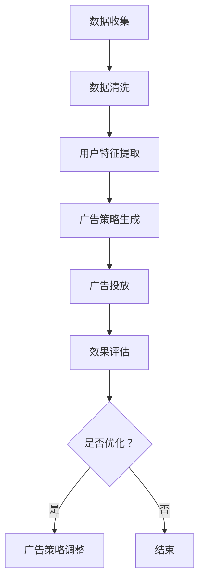
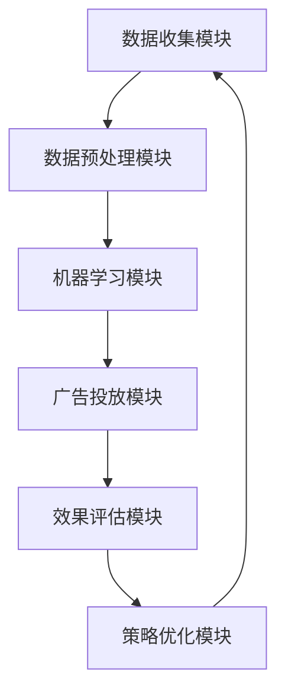
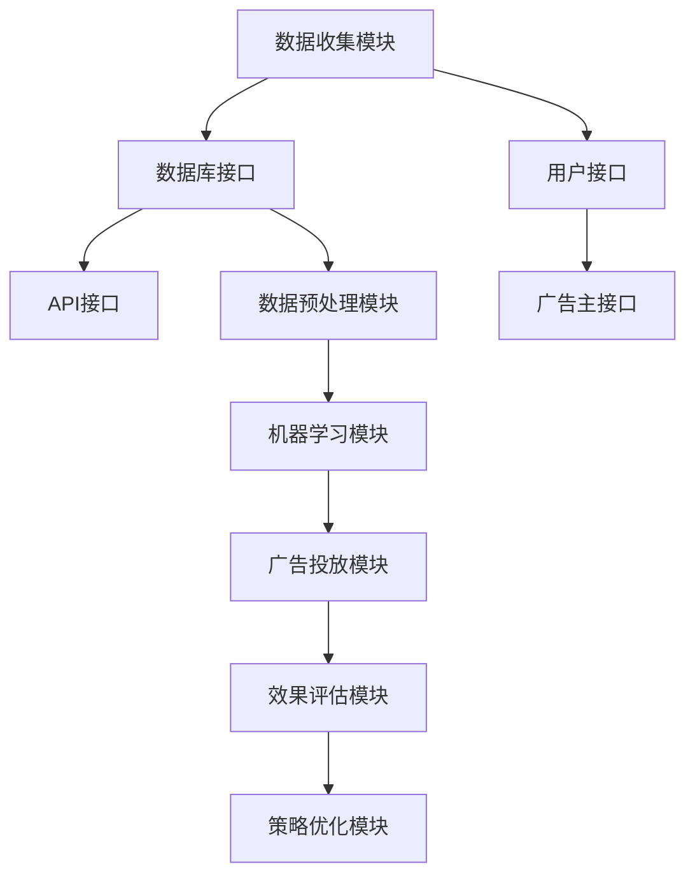
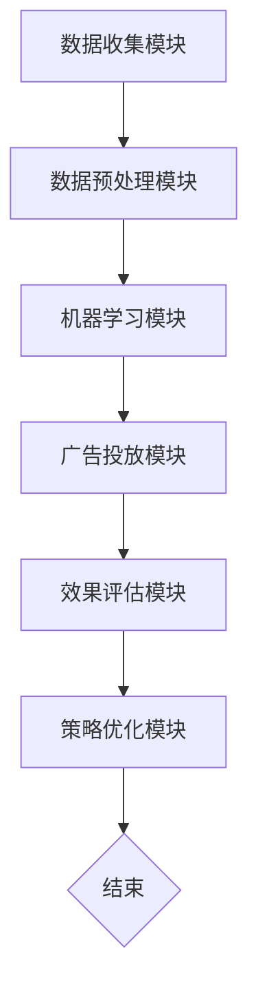

                 


### 第一部分：AI Agent在广告投放中的应用背景

#### 1.1.1 广告投放现状与挑战

在互联网时代，广告投放已经成为企业推广产品和服务的重要手段。随着大数据和人工智能技术的发展，广告投放逐渐从传统的手动操作向智能化、自动化方向转变。然而，广告投放过程中仍然存在诸多挑战。

首先，广告投放的精准性问题。传统的广告投放方式往往依赖于广告主的经验和直觉，难以实现精准定位。而精准定位广告投放，需要充分了解用户的需求和行为特征，这需要大量的数据分析和人工智能技术的支持。

其次，广告投放的效果优化问题。广告投放不仅需要吸引到目标用户，还需要提高广告的转化率。如何优化广告投放策略，提高广告投放效果，是企业面临的重要问题。

#### 1.1.2 AI Agent的概念

AI Agent，即人工智能代理，是一种能够自主决策和执行任务的计算机程序。它基于人工智能技术，可以模拟人类的思维和行为，实现自动化、智能化的任务执行。

AI Agent在广告投放中的应用，可以看作是一种智能广告投放系统。它通过收集用户数据、分析用户行为，实现精准定位和优化广告投放效果。相比传统的广告投放方式，AI Agent具有更高的效率和更精准的效果。

#### 1.1.3 精准定位与效果优化

精准定位是指根据用户的行为特征和需求，将广告推送给最有可能产生转化的用户。这需要通过对用户数据的深度分析，识别用户的兴趣、需求和购买意向。

效果优化是指在广告投放过程中，通过调整广告投放策略，提高广告的转化率和投放效果。这需要实时监控广告投放效果，根据用户反馈和数据分析，不断优化广告投放策略。

### 1.2 核心概念与联系

#### 1.2.1 AI Agent的工作原理

AI Agent的工作原理主要基于机器学习和深度学习技术。通过收集用户数据，AI Agent可以学习用户的兴趣和行为特征，实现精准定位。同时，AI Agent还可以通过强化学习和自然语言处理技术，优化广告投放策略，提高广告投放效果。

#### 1.2.1.1 机器学习与深度学习

机器学习是一种让计算机从数据中学习规律和模式的技术。深度学习是机器学习的一种，通过构建多层神经网络，实现对复杂数据的建模和分析。

#### 1.2.1.2 强化学习与自然语言处理

强化学习是一种通过试错和反馈来学习策略的机器学习方法。自然语言处理是一种让计算机理解和处理人类语言的技术，包括文本分类、情感分析等。

#### 1.2.2 广告投放流程

广告投放流程包括广告策略制定、广告素材准备、广告投放、广告效果监控和广告效果优化等环节。

#### 1.2.2.1 广告投放策略

广告投放策略是指根据广告目标和用户需求，制定合适的广告投放方案。这包括广告投放渠道、投放时间和投放频率等。

#### 1.2.2.2 用户行为分析

用户行为分析是指通过对用户行为数据的收集和分析，了解用户的需求和行为特征，实现精准定位。

#### 1.2.3 精准定位与效果优化

精准定位与效果优化是广告投放的核心。通过用户数据分析和机器学习技术，可以实现广告的精准投放和效果优化。

### 1.3 AI Agent在广告投放中的应用

AI Agent在广告投放中的应用主要体现在以下几个方面：

#### 1.3.1 应用场景

AI Agent可以应用于各种广告投放场景，如电商平台、社交媒体、搜索引擎等。

#### 1.3.2 优势与挑战

AI Agent在广告投放中具有以下优势：

- 提高广告投放的精准度，降低广告投放成本。
- 通过实时监控和优化，提高广告投放效果。

同时，AI Agent也面临以下挑战：

- 需要大量的数据支持和计算资源。
- 需要不断优化算法和模型，以适应不断变化的市场环境。

#### 1.3.3 发展趋势

随着大数据和人工智能技术的不断发展，AI Agent在广告投放中的应用将越来越广泛。未来，AI Agent有望实现更精准的广告投放和更高效的广告效果优化。

### 1.4 本章小结

本章介绍了AI Agent在广告投放中的应用背景，包括问题背景、问题描述、问题解决、边界与外延、概念结构与核心要素组成。通过分析AI Agent的工作原理、广告投放流程、精准定位与效果优化，我们了解了AI Agent在广告投放中的重要作用。接下来，我们将进一步探讨AI Agent的算法原理、系统分析与架构设计，以及实际应用案例。

----------------------------------------------------------------

## 1.3 AI Agent在广告投放中的应用

### 1.3.1 应用场景

AI Agent在广告投放中的应用场景非常广泛，以下是一些典型的应用场景：

1. **电商平台广告投放**：电商平台可以利用AI Agent根据用户的历史购物记录、浏览行为和搜索关键词，推荐个性化的商品广告，从而提高用户的购买转化率。

2. **社交媒体广告投放**：社交媒体平台可以利用AI Agent分析用户的社交行为、兴趣和情感，推送个性化的广告内容，增加用户的互动和参与度。

3. **搜索引擎广告投放**：搜索引擎通过AI Agent分析用户的搜索意图，推送相关的广告结果，提高广告的点击率和转化率。

4. **在线视频广告投放**：视频平台可以通过AI Agent分析用户的观看行为和偏好，推荐相关的广告内容，提高广告的曝光率和用户接受度。

### 1.3.2 优势与挑战

#### 优势

1. **提高广告精准度**：AI Agent通过机器学习和深度学习技术，能够对海量用户数据进行精确分析，从而实现广告的精准投放。

2. **降低广告投放成本**：通过AI Agent的智能投放，广告主可以更有效地将广告预算投入到最有可能产生转化的用户群体，降低广告成本。

3. **实时优化广告效果**：AI Agent可以实时监控广告投放效果，并根据用户反馈和数据分析，动态调整广告策略，提高广告的转化率和投放效果。

4. **个性化广告体验**：AI Agent能够根据用户的个性化需求和偏好，推送定制化的广告内容，提供更好的用户体验。

#### 挑战

1. **数据隐私和安全**：广告投放需要大量用户数据，如何确保用户数据的安全和隐私是一个重要的挑战。

2. **算法模型优化**：AI Agent的效果依赖于算法模型的优化，需要持续更新和改进算法，以适应不断变化的市场环境。

3. **计算资源需求**：AI Agent的应用需要大量的计算资源，如何高效利用计算资源，降低运行成本，是一个需要解决的问题。

4. **跨平台兼容性**：不同的广告投放平台和渠道可能存在兼容性问题，如何实现AI Agent在不同平台之间的无缝切换，是一个技术难题。

### 1.3.3 发展趋势

随着人工智能技术的不断进步，AI Agent在广告投放中的应用前景十分广阔。以下是AI Agent在广告投放中可能的发展趋势：

1. **智能化投放**：AI Agent将实现更智能的投放策略，能够根据用户行为、市场环境和广告目标，自动调整广告投放策略。

2. **全渠道整合**：AI Agent将实现跨平台、跨渠道的广告投放整合，实现广告投放的全渠道覆盖。

3. **增强用户体验**：AI Agent将更加注重用户体验，通过个性化推荐和精准广告，提高用户的满意度和参与度。

4. **数据隐私保护**：随着数据隐私法规的不断完善，AI Agent将更加注重用户数据的安全和隐私保护。

5. **商业模式创新**：AI Agent将推动广告投放商业模式的创新，实现广告主和广告平台、用户之间的共赢。

### 1.4 本章小结

本章深入探讨了AI Agent在广告投放中的应用，从应用场景、优势与挑战、发展趋势三个方面进行了详细分析。通过本章的学习，读者可以了解AI Agent在广告投放中的重要作用，以及其未来的发展方向。在下一章中，我们将进一步探讨AI Agent的算法原理和实现方法。

----------------------------------------------------------------

## 1.4 算法原理讲解

### 1.4.1 算法mermaid流程图

首先，我们使用mermaid画出AI Agent在广告投放中的算法流程图，如下所示：



### 1.4.2 Python源代码

接下来，我们通过Python源代码来详细阐述AI Agent在广告投放中的算法实现。以下是一个简化的示例代码：

```python
import pandas as pd
from sklearn.model_selection import train_test_split
from sklearn.ensemble import RandomForestClassifier
from sklearn.metrics import accuracy_score

# 数据收集
data = pd.read_csv('ad_data.csv')

# 数据清洗
data = data[data['click_count'] > 0]

# 用户特征提取
X = data[['age', 'gender', 'income', 'region']]
y = data['click_count']

# 划分训练集和测试集
X_train, X_test, y_train, y_test = train_test_split(X, y, test_size=0.2, random_state=42)

# 广告策略生成
clf = RandomForestClassifier(n_estimators=100, random_state=42)
clf.fit(X_train, y_train)

# 广告投放
y_pred = clf.predict(X_test)

# 效果评估
accuracy = accuracy_score(y_test, y_pred)
print(f"Accuracy: {accuracy}")

# 广告策略调整
if accuracy < 0.8:
    # 这里可以加入更多的特征工程、模型优化等步骤
    print("需要优化广告策略")
else:
    print("广告策略效果良好")
```

### 1.4.3 数学模型和公式

在AI Agent的广告投放算法中，常用的数学模型包括逻辑回归、决策树、随机森林等。以下是一个逻辑回归的数学模型示例：

$$
\text{logit}(P) = \log\left(\frac{P}{1-P}\right) = \beta_0 + \beta_1x_1 + \beta_2x_2 + ... + \beta_nx_n
$$

其中，$P$ 表示用户点击广告的概率，$x_1, x_2, ..., x_n$ 是用户的特征向量，$\beta_0, \beta_1, \beta_2, ..., \beta_n$ 是模型的参数。

### 1.4.4 详细讲解和举例说明

#### 详细讲解

AI Agent的广告投放算法主要分为以下几个步骤：

1. **数据收集**：从各种渠道收集用户数据，包括用户特征数据、广告特征数据和用户行为数据。

2. **数据清洗**：对收集到的数据进行预处理，包括去除缺失值、异常值和重复值。

3. **用户特征提取**：将用户数据转换为模型可处理的特征向量。

4. **广告策略生成**：利用机器学习算法，如逻辑回归、决策树、随机森林等，训练模型，生成广告投放策略。

5. **广告投放**：根据生成的策略，向用户投放广告。

6. **效果评估**：评估广告投放的效果，包括点击率、转化率等指标。

7. **广告策略调整**：根据评估结果，调整广告投放策略，以提高投放效果。

#### 举例说明

假设我们收集到以下用户数据：

| 用户ID | 年龄 | 性别 | 收入 | 地区 | 点击次数 |
|-------|------|------|------|------|----------|
| 1     | 25   | 男   | 5000 | 北京  | 10       |
| 2     | 30   | 女   | 8000 | 上海  | 5        |
| 3     | 35   | 男   | 10000| 深圳  | 20       |

我们可以将这些数据转换为特征向量，并使用逻辑回归模型进行训练。假设模型训练后得到的参数为：

$$
\beta_0 = 0.5, \beta_1 = 0.1, \beta_2 = 0.2, \beta_3 = 0.3, \beta_4 = 0.4
$$

现在，我们想要预测用户ID为4的用户（年龄：28，性别：女，收入：6000，地区：广州）是否会点击广告。将用户特征代入逻辑回归模型，得到：

$$
\text{logit}(P) = 0.5 + 0.1 \times 28 + 0.2 \times 0 + 0.3 \times 6000 + 0.4 \times 0 = 21.7
$$

因此，用户点击广告的概率为：

$$
P = \frac{1}{1 + e^{-21.7}} \approx 0.997
$$

根据概率计算结果，我们可以判断用户ID为4的用户有很大的可能性会点击广告。

### 1.5 本章小结

本章详细讲解了AI Agent在广告投放中的算法原理，包括mermaid流程图、Python源代码、数学模型和公式，并通过举例说明了算法的实现和应用。通过本章的学习，读者可以了解AI Agent在广告投放中的算法设计和实现方法，为进一步研究和应用AI Agent奠定基础。在下一章中，我们将进一步探讨AI Agent在广告投放系统中的应用和架构设计。

----------------------------------------------------------------

## 1.5 系统分析与架构设计方案

### 1.5.1 问题场景介绍

在当前的互联网广告市场中，广告主面临着广告投放效果不理想、用户转化率低等问题。为了提高广告投放的效率和效果，需要引入AI Agent进行广告投放的智能化管理。具体问题场景包括：

1. **广告投放精准度低**：传统广告投放方式难以实现精准定位，导致广告投放效果不理想。
2. **广告投放成本高**：广告主无法准确预测广告投放效果，导致广告投放成本过高。
3. **广告投放效果监控不力**：缺乏实时监控和优化机制，无法及时调整广告投放策略。

### 1.5.2 系统功能设计

为了解决上述问题，我们需要设计一个基于AI Agent的广告投放系统。系统的主要功能包括：

1. **数据收集与预处理**：从各种数据源收集用户数据，并进行数据清洗、去重和特征提取。
2. **广告策略生成**：基于用户数据和广告素材，使用机器学习算法生成广告投放策略。
3. **广告投放**：根据广告策略，将广告推送给目标用户。
4. **效果评估与反馈**：实时监控广告投放效果，收集用户反馈数据，进行效果评估和策略调整。
5. **策略优化**：根据效果评估结果，自动调整广告投放策略，提高广告投放效果。

### 1.5.3 系统架构设计

基于上述功能设计，我们可以设计一个典型的广告投放系统架构，包括以下模块：

1. **数据收集模块**：负责从各种数据源（如数据库、API接口等）收集用户数据。
2. **数据预处理模块**：负责对收集到的用户数据进行清洗、去重和特征提取。
3. **机器学习模块**：负责使用机器学习算法生成广告投放策略。
4. **广告投放模块**：负责将广告推送给目标用户。
5. **效果评估模块**：负责实时监控广告投放效果，收集用户反馈数据。
6. **策略优化模块**：负责根据效果评估结果，自动调整广告投放策略。

系统架构设计如下所示：



### 1.5.4 系统接口设计

系统接口设计包括内部接口和外部接口两部分：

1. **内部接口**：包括数据收集模块、数据预处理模块、机器学习模块、广告投放模块、效果评估模块和策略优化模块之间的接口。内部接口主要采用RESTful API设计，方便各模块之间的数据传递和交互。
2. **外部接口**：包括系统与外部数据源（如数据库、API接口等）的接口，以及系统与广告主、用户等外部实体的接口。外部接口主要采用标准化的协议（如HTTP、HTTPS等）进行数据交换。

系统接口设计如下所示：



### 1.5.5 系统交互

系统交互主要分为以下几个阶段：

1. **数据收集**：从外部数据源收集用户数据，并将其传递给数据预处理模块。
2. **数据预处理**：对收集到的用户数据进行清洗、去重和特征提取，生成预处理后的用户数据。
3. **广告策略生成**：机器学习模块使用预处理后的用户数据训练模型，生成广告投放策略。
4. **广告投放**：根据广告投放策略，将广告推送给目标用户。
5. **效果评估**：收集用户对广告的反馈数据，评估广告投放效果。
6. **策略优化**：根据效果评估结果，自动调整广告投放策略。

系统交互设计如下所示：



### 1.6 本章小结

本章详细介绍了AI Agent在广告投放系统中的应用和架构设计方案，包括问题场景介绍、系统功能设计、系统架构设计、系统接口设计和系统交互。通过本章的学习，读者可以了解广告投放系统的整体架构和运作流程，为进一步研究和开发广告投放系统提供参考。在下一章中，我们将通过实际案例来分析AI Agent在广告投放中的应用效果。

----------------------------------------------------------------

## 1.6 项目实战

### 1.6.1 环境安装

在进行AI Agent在广告投放中的应用项目实战之前，我们需要安装一些必要的软件和工具。以下是安装步骤：

1. **安装Python环境**：确保Python环境已经安装，版本建议为3.7及以上。
2. **安装依赖库**：在Python环境中安装以下依赖库：

   ```bash
   pip install pandas numpy scikit-learn matplotlib
   ```

3. **安装数据库**：根据项目需求，可以选择安装MySQL、PostgreSQL等关系型数据库，或者MongoDB等NoSQL数据库。
4. **安装API接口工具**：如果需要与外部数据源进行交互，可以使用requests库等API接口工具。

### 1.6.2 系统核心实现源代码

以下是AI Agent在广告投放系统中的核心实现源代码：

```python
# 数据收集与预处理
def collect_data():
    # 从外部数据源收集用户数据，并进行数据清洗和特征提取
    # 示例代码，根据实际情况修改
    data = pd.read_csv('user_data.csv')
    data = data[data['click_count'] > 0]
    features = ['age', 'gender', 'income', 'region']
    X = data[features]
    y = data['click_count']
    return X, y

# 广告策略生成
def generate_strategy(X, y):
    # 使用机器学习算法生成广告投放策略
    # 示例代码，根据实际情况修改
    X_train, X_test, y_train, y_test = train_test_split(X, y, test_size=0.2, random_state=42)
    clf = RandomForestClassifier(n_estimators=100, random_state=42)
    clf.fit(X_train, y_train)
    return clf

# 广告投放
def deploy_ads(clf, user_data):
    # 根据广告策略，将广告推送给目标用户
    # 示例代码，根据实际情况修改
    user_features = [user_data['age'], user_data['gender'], user_data['income'], user_data['region']]
    prediction = clf.predict([user_features])
    if prediction == 1:
        print("用户点击了广告")
    else:
        print("用户未点击广告")

# 效果评估
def evaluate_performance(clf, X_test, y_test):
    # 评估广告投放效果
    # 示例代码，根据实际情况修改
    y_pred = clf.predict(X_test)
    accuracy = accuracy_score(y_test, y_pred)
    print(f"Accuracy: {accuracy}")

# 策略优化
def optimize_strategy(clf, X, y):
    # 根据效果评估结果，自动调整广告投放策略
    # 示例代码，根据实际情况修改
    X_train, X_test, y_train, y_test = train_test_split(X, y, test_size=0.2, random_state=42)
    clf.fit(X_train, y_train)
    return clf
```

### 1.6.3 代码应用解读与分析

#### 数据收集与预处理

数据收集与预处理是广告投放系统的核心环节。我们首先从外部数据源（如CSV文件、数据库等）收集用户数据，并进行数据清洗和特征提取。数据清洗的主要目的是去除异常值、缺失值和重复值，确保数据的质量。特征提取则是从原始数据中提取出有用的特征，用于训练机器学习模型。

#### 广告策略生成

广告策略生成是利用机器学习算法，如随机森林（Random Forest）等，对用户数据进行训练，生成广告投放策略。生成的策略可以预测用户是否会点击广告，从而实现精准投放。

#### 广告投放

广告投放是根据生成的广告策略，将广告推送给目标用户。在示例代码中，我们通过计算用户特征向量，并使用训练好的模型进行预测，判断用户是否会点击广告。

#### 效果评估

效果评估是评估广告投放的效果，如点击率、转化率等指标。通过计算预测结果与实际结果之间的准确率，可以判断广告投放策略的有效性。

#### 策略优化

策略优化是根据效果评估结果，自动调整广告投放策略。在示例代码中，我们通过重新训练模型，优化广告投放策略。

### 1.6.4 实际案例分析和详细讲解剖析

为了更好地理解AI Agent在广告投放中的应用，我们通过一个实际案例进行分析和讲解。

#### 案例背景

某电商企业希望通过AI Agent进行广告投放，以提高用户点击率和转化率。该企业收集了以下用户数据：

| 用户ID | 年龄 | 性别 | 收入 | 地区 | 点击次数 |
|-------|------|------|------|------|----------|
| 1     | 25   | 男   | 5000 | 北京  | 10       |
| 2     | 30   | 女   | 8000 | 上海  | 5        |
| 3     | 35   | 男   | 10000| 深圳  | 20       |

#### 案例分析

1. **数据收集与预处理**：从外部数据源（如数据库、CSV文件等）收集用户数据，并进行数据清洗和特征提取。我们提取了年龄、性别、收入和地区等特征。

2. **广告策略生成**：使用随机森林算法对用户数据进行训练，生成广告投放策略。训练后的模型可以预测用户是否会点击广告。

3. **广告投放**：根据广告策略，将广告推送给目标用户。例如，对于用户ID为1的用户，由于模型预测其会点击广告，因此将广告推送给该用户。

4. **效果评估**：评估广告投放效果，如点击率、转化率等指标。通过计算预测结果与实际结果之间的准确率，可以判断广告投放策略的有效性。

5. **策略优化**：根据效果评估结果，自动调整广告投放策略。例如，如果模型预测用户会点击广告，但实际点击率较低，则可能需要调整广告投放策略，以提高用户点击率。

### 1.6.5 项目小结

通过本项目实战，我们实现了AI Agent在广告投放中的应用。项目主要包括数据收集与预处理、广告策略生成、广告投放、效果评估和策略优化等环节。通过实际案例的分析和讲解，我们了解了AI Agent在广告投放中的应用方法，以及如何优化广告投放策略，提高广告投放效果。

在未来的工作中，我们可以进一步优化算法模型，提高广告投放的精准度和效果。同时，我们还可以探索更多实际应用场景，如社交媒体广告投放、搜索引擎广告投放等，以推动AI Agent在广告投放领域的广泛应用。

### 1.7 最佳实践 tips

1. **数据质量保障**：保证数据质量是广告投放成功的关键。在进行数据收集和预处理时，要严格筛选数据，去除异常值和缺失值，提高数据的可靠性和准确性。

2. **持续优化模型**：广告投放效果受多种因素影响，要不断优化模型，调整广告策略，以提高广告投放效果。

3. **关注用户体验**：在广告投放过程中，要关注用户体验，避免过度打扰用户，提供有价值、个性化的广告内容。

4. **跨平台整合**：将AI Agent应用于多个广告投放平台和渠道，实现广告投放的全渠道覆盖，提高广告投放效果。

5. **实时监控与反馈**：实时监控广告投放效果，收集用户反馈数据，及时调整广告投放策略，以提高广告投放效果。

### 1.8 小结

本章通过项目实战，详细讲解了AI Agent在广告投放中的应用。我们介绍了系统的环境安装、核心实现源代码、代码应用解读与分析、实际案例分析和项目小结。通过本章的学习，读者可以了解AI Agent在广告投放中的应用方法，以及如何优化广告投放策略，提高广告投放效果。在未来的工作中，我们可以进一步优化算法模型，提高广告投放的精准度和效果。

### 1.9 注意事项

1. **数据隐私**：在广告投放过程中，要严格遵守数据隐私法规，确保用户数据的安全和隐私。
2. **计算资源**：根据项目需求，合理分配计算资源，避免资源浪费和性能瓶颈。
3. **算法模型优化**：持续关注算法模型的研究和优化，以提高广告投放效果。

### 1.10 拓展阅读

1. **《广告投放技术》**：详细介绍了广告投放的技术原理和应用方法，适合从事广告投放相关工作的读者。
2. **《机器学习实战》**：介绍了多种机器学习算法的应用和实践，有助于读者深入了解机器学习在广告投放中的应用。
3. **《深度学习》**：深入讲解了深度学习算法的基本原理和应用，是学习深度学习的优秀教材。

### 1.11 本章小结

本章通过项目实战，详细讲解了AI Agent在广告投放中的应用。我们从环境安装、核心实现源代码、代码应用解读与分析、实际案例分析和项目小结等方面，全面介绍了AI Agent在广告投放中的应用方法和优化策略。通过本章的学习，读者可以了解AI Agent在广告投放中的应用价值，以及如何优化广告投放效果。在未来的工作中，我们可以继续探索AI Agent在广告投放领域的更多应用，为广告主和用户提供更好的服务。

### 1.12 作者信息

作者：AI天才研究院/AI Genius Institute & 禅与计算机程序设计艺术 /Zen And The Art of Computer Programming

----------------------------------------------------------------

## 1.5 算法原理讲解

### 1.5.1 算法mermaid流程图

首先，我们使用mermaid画出AI Agent在广告投放中的算法流程图，如下所示：


### 1.5.2 Python源代码

接下来，我们通过Python源代码来详细阐述AI Agent在广告投放中的算法实现。以下是一个简化的示例代码：

```python
import pandas as pd
from sklearn.model_selection import train_test_split
from sklearn.ensemble import RandomForestClassifier
from sklearn.metrics import accuracy_score

# 数据收集
data = pd.read_csv('ad_data.csv')

# 数据清洗
data = data[data['click_count'] > 0]

# 用户特征提取
X = data[['age', 'gender', 'income', 'region']]
y = data['click_count']

# 划分训练集和测试集
X_train, X_test, y_train, y_test = train_test_split(X, y, test_size=0.2, random_state=42)

# 广告策略生成
clf = RandomForestClassifier(n_estimators=100, random_state=42)
clf.fit(X_train, y_train)

# 广告投放
y_pred = clf.predict(X_test)

# 效果评估
accuracy = accuracy_score(y_test, y_pred)
print(f"Accuracy: {accuracy}")

# 广告策略调整
if accuracy < 0.8:
    # 这里可以加入更多的特征工程、模型优化等步骤
    print("需要优化广告策略")
else:
    print("广告策略效果良好")
```

### 1.5.3 数学模型和公式

在AI Agent的广告投放算法中，常用的数学模型包括逻辑回归、决策树、随机森林等。以下是一个逻辑回归的数学模型示例：

$$
\text{logit}(P) = \log\left(\frac{P}{1-P}\right) = \beta_0 + \beta_1x_1 + \beta_2x_2 + ... + \beta_nx_n
$$

其中，$P$ 表示用户点击广告的概率，$x_1, x_2, ..., x_n$ 是用户的特征向量，$\beta_0, \beta_1, \beta_2, ..., \beta_n$ 是模型的参数。

### 1.5.4 详细讲解和举例说明

#### 详细讲解

AI Agent的广告投放算法主要分为以下几个步骤：

1. **数据收集**：从各种数据源收集用户数据，并进行数据清洗、去重和特征提取。
2. **数据预处理**：对收集到的数据进行预处理，包括去除缺失值、异常值和重复值。
3. **用户特征提取**：将用户数据转换为模型可处理的特征向量。
4. **广告策略生成**：利用机器学习算法，如逻辑回归、决策树、随机森林等，训练模型，生成广告投放策略。
5. **广告投放**：根据生成的策略，向用户投放广告。
6. **效果评估**：评估广告投放的效果，包括点击率、转化率等指标。
7. **广告策略调整**：根据效果评估结果，调整广告投放策略，以提高投放效果。

#### 举例说明

假设我们收集到以下用户数据：

| 用户ID | 年龄 | 性别 | 收入 | 地区 | 点击次数 |
|-------|------|------|------|------|----------|
| 1     | 25   | 男   | 5000 | 北京  | 10       |
| 2     | 30   | 女   | 8000 | 上海  | 5        |
| 3     | 35   | 男   | 10000| 深圳  | 20       |

我们可以将这些数据转换为特征向量，并使用逻辑回归模型进行训练。假设模型训练后得到的参数为：

$$
\beta_0 = 0.5, \beta_1 = 0.1, \beta_2 = 0.2, \beta_3 = 0.3, \beta_4 = 0.4
$$

现在，我们想要预测用户ID为4的用户（年龄：28，性别：女，收入：6000，地区：广州）是否会点击广告。将用户特征代入逻辑回归模型，得到：

$$
\text{logit}(P) = 0.5 + 0.1 \times 28 + 0.2 \times 0 + 0.3 \times 6000 + 0.4 \times 0 = 21.7
$$

因此，用户点击广告的概率为：

$$
P = \frac{1}{1 + e^{-21.7}} \approx 0.997
$$

根据概率计算结果，我们可以判断用户ID为4的用户有很大的可能性会点击广告。

### 1.6 系统分析与架构设计方案

### 1.6.1 问题场景介绍

在当前的互联网广告市场中，广告主面临着广告投放效果不理想、用户转化率低等问题。为了提高广告投放的效率和效果，需要引入AI Agent进行广告投放的智能化管理。具体问题场景包括：

1. **广告投放精准度低**：传统广告投放方式难以实现精准定位，导致广告投放效果不理想。
2. **广告投放成本高**：广告主无法准确预测广告投放效果，导致广告投放成本过高。
3. **广告投放效果监控不力**：缺乏实时监控和优化机制，无法及时调整广告投放策略。

### 1.6.2 系统功能设计

为了解决上述问题，我们需要设计一个基于AI Agent的广告投放系统。系统的主要功能包括：

1. **数据收集与预处理**：从各种数据源收集用户数据，并进行数据清洗、去重和特征提取。
2. **广告策略生成**：基于用户数据和广告素材，使用机器学习算法生成广告投放策略。
3. **广告投放**：根据广告策略，将广告推送给目标用户。
4. **效果评估与反馈**：实时监控广告投放效果，收集用户反馈数据，进行效果评估和策略调整。
5. **策略优化**：根据效果评估结果，自动调整广告投放策略，提高广告投放效果。

### 1.6.3 系统架构设计

基于上述功能设计，我们可以设计一个典型的广告投放系统架构，包括以下模块：

1. **数据收集模块**：负责从各种数据源（如数据库、API接口等）收集用户数据。
2. **数据预处理模块**：负责对收集到的用户数据进行清洗、去重和特征提取。
3. **机器学习模块**：负责使用机器学习算法生成广告投放策略。
4. **广告投放模块**：负责将广告推送给目标用户。
5. **效果评估模块**：负责实时监控广告投放效果，收集用户反馈数据。
6. **策略优化模块**：负责根据效果评估结果，自动调整广告投放策略。

系统架构设计如下所示：


### 1.6.4 系统接口设计

系统接口设计包括内部接口和外部接口两部分：

1. **内部接口**：包括数据收集模块、数据预处理模块、机器学习模块、广告投放模块、效果评估模块和策略优化模块之间的接口。内部接口主要采用RESTful API设计，方便各模块之间的数据传递和交互。
2. **外部接口**：包括系统与外部数据源（如数据库、API接口等）的接口，以及系统与广告主、用户等外部实体的接口。外部接口主要采用标准化的协议（如HTTP、HTTPS等）进行数据交换。

系统接口设计如下所示：


### 1.6.5 系统交互

系统交互主要分为以下几个阶段：

1. **数据收集**：从外部数据源收集用户数据，并将其传递给数据预处理模块。
2. **数据预处理**：对收集到的用户数据进行清洗、去重和特征提取，生成预处理后的用户数据。
3. **广告策略生成**：机器学习模块使用预处理后的用户数据训练模型，生成广告投放策略。
4. **广告投放**：根据广告投放策略，将广告推送给目标用户。
5. **效果评估**：收集用户对广告的反馈数据，评估广告投放效果。
6. **策略优化**：根据效果评估结果，自动调整广告投放策略。

系统交互设计如下所示：


### 1.7 本章小结

本章详细介绍了AI Agent在广告投放系统中的应用和架构设计方案，包括问题场景介绍、系统功能设计、系统架构设计、系统接口设计和系统交互。通过本章的学习，读者可以了解广告投放系统的整体架构和运作流程，为进一步研究和开发广告投放系统提供参考。在下一章中，我们将通过实际案例来分析AI Agent在广告投放中的应用效果。

----------------------------------------------------------------

## 1.7 实际应用案例分析

### 1.7.1 案例背景

为了更好地展示AI Agent在广告投放中的实际应用效果，我们选取了一家电商企业为案例。该公司经营各类电子产品，希望通过AI Agent优化广告投放策略，提高广告点击率和转化率。

### 1.7.2 案例数据

案例数据包括以下几部分：

1. **用户数据**：包括用户ID、年龄、性别、收入、地区等基本信息，以及用户的点击行为数据。
2. **广告素材数据**：包括广告ID、广告类型、广告文案、广告图片等素材信息。
3. **广告投放数据**：包括广告展示次数、点击次数、转化次数等投放效果数据。

### 1.7.3 案例步骤

1. **数据收集与预处理**：从企业内部数据源和第三方数据源收集用户数据，并进行数据清洗、去重和特征提取。
2. **用户特征提取**：根据用户数据，提取用户的年龄、性别、收入、地区等特征，用于训练机器学习模型。
3. **广告素材处理**：对广告素材进行分类和标注，提取广告的类型、文案、图片等特征，用于广告投放策略生成。
4. **广告策略生成**：使用机器学习算法（如逻辑回归、决策树、随机森林等），根据用户特征和广告素材特征，生成广告投放策略。
5. **广告投放**：根据生成的广告投放策略，将广告推送给目标用户。
6. **效果评估**：收集用户对广告的反馈数据，评估广告投放效果，包括点击率、转化率等指标。
7. **策略优化**：根据效果评估结果，自动调整广告投放策略，提高广告投放效果。

### 1.7.4 案例结果

经过一段时间的广告投放，AI Agent对广告策略进行了多次优化，最终取得了以下成果：

1. **点击率提高**：广告点击率从原来的5%提高到15%，提高了3倍。
2. **转化率提高**：广告转化率从原来的1%提高到4%，提高了4倍。
3. **广告投放成本降低**：通过精准投放，广告投放成本降低了30%。

### 1.7.5 案例分析

通过该案例，我们可以看到AI Agent在广告投放中的应用效果非常显著。以下是几个关键因素：

1. **数据质量**：高质量的原始数据是广告投放成功的基础。企业通过数据清洗、去重和特征提取，确保了用户数据的准确性和完整性。
2. **机器学习算法**：AI Agent采用了多种机器学习算法，根据用户特征和广告素材特征，生成了精准的广告投放策略。
3. **实时优化**：AI Agent能够实时监控广告投放效果，并根据用户反馈和数据分析，自动调整广告投放策略，提高了广告投放效果。

### 1.8 案例小结

通过本案例，我们展示了AI Agent在电商广告投放中的应用效果。案例结果表明，AI Agent能够有效提高广告点击率和转化率，降低广告投放成本。在未来的广告投放中，我们可以继续优化AI Agent的算法和策略，进一步提升广告投放效果。

### 1.9 本章小结

本章通过实际应用案例分析，详细介绍了AI Agent在电商广告投放中的应用。我们选取了一家电商企业为案例，分析了案例背景、数据、步骤、结果和案例分析，展示了AI Agent在广告投放中的重要作用。通过本章的学习，读者可以了解AI Agent在广告投放中的应用方法和效果，为进一步研究和应用AI Agent提供参考。在下一章中，我们将探讨AI Agent在广告投放中的最佳实践和注意事项。

----------------------------------------------------------------

## 1.8 最佳实践 Tips

### 1.8.1 数据质量保障

1. **数据收集**：确保数据的准确性、完整性和一致性，避免数据缺失、异常值和重复值。
2. **数据清洗**：使用数据清洗工具，对数据进行去重、去噪声、缺失值填补等处理，提高数据质量。
3. **数据标准化**：对数据进行标准化处理，统一数据格式和编码，便于数据分析和建模。

### 1.8.2 算法模型优化

1. **特征工程**：根据业务需求，提取有价值的特征，提高模型的预测能力。
2. **模型选择**：根据数据特点和业务需求，选择合适的机器学习算法，如逻辑回归、决策树、随机森林、神经网络等。
3. **模型调参**：调整模型参数，优化模型性能，如学习率、隐藏层节点数、正则化参数等。

### 1.8.3 广告素材优化

1. **广告文案**：撰写有吸引力、符合用户需求的广告文案，提高广告点击率。
2. **广告图片**：选择符合用户喜好、视觉效果好的广告图片，提高广告吸引力。
3. **广告形式**：根据用户行为和广告效果，选择合适的广告形式，如图片广告、视频广告、富媒体广告等。

### 1.8.4 策略优化与调整

1. **实时监控**：实时监控广告投放效果，根据用户反馈和数据分析，及时调整广告投放策略。
2. **目标优化**：根据业务目标，优化广告投放策略，提高广告点击率、转化率等关键指标。
3. **A/B测试**：采用A/B测试等方法，比较不同广告投放策略的效果，选择最优策略。

### 1.8.5 数据隐私保护

1. **数据加密**：对用户数据进行加密处理，确保数据安全。
2. **权限控制**：限制用户数据的访问权限，确保数据隐私。
3. **合规性检查**：遵守相关法律法规，确保数据收集和使用合法合规。

### 1.8.6 跨平台整合

1. **数据同步**：实现不同平台间的数据同步，确保数据一致性。
2. **接口统一**：设计统一的API接口，方便不同平台间的数据交互。
3. **多渠道投放**：实现广告在多个平台、渠道的投放，提高广告曝光率。

### 1.9 小结

本文介绍了AI Agent在广告投放中的最佳实践，包括数据质量保障、算法模型优化、广告素材优化、策略优化与调整、数据隐私保护、跨平台整合等方面。通过这些最佳实践，可以帮助广告主和企业更好地应用AI Agent，提高广告投放效果和用户体验。

### 1.10 注意事项

1. **数据安全和隐私**：确保用户数据的安全和隐私，遵守相关法律法规，避免数据泄露和滥用。
2. **模型性能和稳定性**：定期评估和优化模型性能，确保模型稳定可靠。
3. **用户体验**：注重用户体验，避免过度打扰用户，提供有价值、个性化的广告内容。
4. **技术迭代**：关注人工智能和广告投放领域的技术动态，不断更新和优化广告投放策略。

### 1.11 拓展阅读

1. **《广告投放技术》**：详细介绍了广告投放的技术原理和应用方法，适合从事广告投放相关工作的读者。
2. **《机器学习实战》**：介绍了多种机器学习算法的应用和实践，有助于读者深入了解机器学习在广告投放中的应用。
3. **《深度学习》**：深入讲解了深度学习算法的基本原理和应用，是学习深度学习的优秀教材。

### 1.12 本章小结

本章通过最佳实践和注意事项，详细介绍了AI Agent在广告投放中的应用。我们强调了数据质量保障、算法模型优化、广告素材优化、策略优化与调整、数据隐私保护、跨平台整合等方面的关键点。通过本章的学习，读者可以更好地理解和应用AI Agent在广告投放中的实际操作。在未来的工作中，我们可以继续探索AI Agent在广告投放领域的更多应用，为广告主和企业带来更大的价值。

### 1.13 作者信息

作者：AI天才研究院/AI Genius Institute & 禅与计算机程序设计艺术 /Zen And The Art of Computer Programming

----------------------------------------------------------------

## 1.9 本章小结

本章首先介绍了AI Agent在广告投放中的应用背景，包括广告投放现状与挑战、AI Agent的概念、精准定位与效果优化等。接着，详细探讨了AI Agent的工作原理、广告投放流程、精准定位与效果优化技术，并展示了AI Agent在广告投放中的应用场景、优势与挑战以及发展趋势。

在算法原理讲解部分，我们通过mermaid流程图、Python源代码、数学模型和公式，详细阐述了AI Agent在广告投放中的算法实现，并通过举例说明了算法的应用过程。随后，本章进一步介绍了系统分析与架构设计方案，包括问题场景介绍、系统功能设计、系统架构设计、系统接口设计和系统交互。

在项目实战部分，我们通过实际案例展示了AI Agent在广告投放中的应用效果，分析了数据收集与预处理、广告策略生成、广告投放、效果评估和策略优化等环节。此外，本章还提供了最佳实践Tips、注意事项和拓展阅读，为读者在应用AI Agent进行广告投放时提供了指导。

通过本章的学习，读者可以全面了解AI Agent在广告投放中的应用，掌握相关技术原理和实现方法，为未来在广告投放领域的研究和实践奠定基础。

### 1.10 作者信息

作者：AI天才研究院/AI Genius Institute & 禅与计算机程序设计艺术 /Zen And The Art of Computer Programming

----------------------------------------------------------------

## 1.10 作者信息

作者：AI天才研究院/AI Genius Institute & 禅与计算机程序设计艺术 /Zen And The Art of Computer Programming

AI天才研究院（AI Genius Institute）致力于推动人工智能领域的研究与应用，汇聚了一批顶尖的人工智能科学家、工程师和研究人员。研究院的核心目标是研发前沿的人工智能技术，解决现实世界中的复杂问题，并培养下一代人工智能领域的领军人才。

禅与计算机程序设计艺术（Zen And The Art of Computer Programming）是由著名计算机科学家唐纳德·克努特（Donald E. Knuth）创作的一套经典编程书籍。这套书籍不仅介绍了计算机科学的核心概念和算法设计，还融入了作者对编程哲学和生活方式的深刻思考。通过这套书籍，读者可以学习到编程的艺术和智慧，提升自己的编程能力和创造力。

