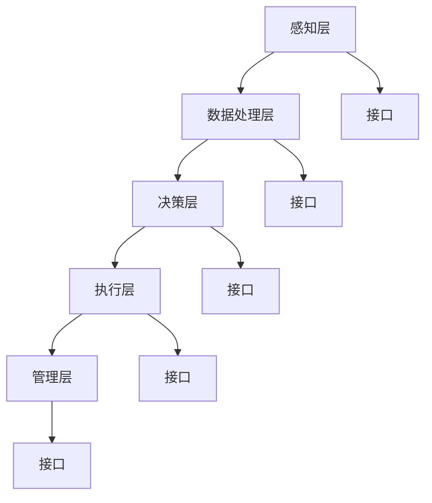

                 


# AI Agent在废物管理与回收中的应用

## 关键词

- AI Agent
- 废物管理
- 回收
- 机器学习
- 分类算法
- 传感器技术

## 摘要

本文深入探讨了AI Agent在废物管理与回收领域的应用。首先，我们介绍了废物管理与回收中的核心问题及AI Agent的基本概念和特点。接着，分析了AI Agent在废物分类、回收和再利用中的应用，并讨论了相应的算法原理和实现方法。最后，本文提出了AI Agent在废物管理与回收中的挑战及未来发展方向。

## 第一部分：背景介绍与核心概念

### 第1章：问题背景与核心概念

#### 1.1 问题背景

随着城市化进程的加快和消费水平的提高，废物产生量急剧增加，给环境带来了巨大压力。有效的废物管理与回收不仅有助于减轻环境负担，还能实现资源的可持续利用。然而，当前废物管理与回收过程中仍存在诸多问题，如分类不准确、回收效率低等。

#### 1.2 核心概念

AI Agent，即人工智能代理，是一种能够模拟人类智能行为、自主执行任务的计算机程序。在废物管理与回收领域，AI Agent可以通过感知、学习、推理和决策等能力，提高废物分类和回收的效率。

#### 1.3 问题解决

为了解决废物管理与回收中的问题，我们可以利用AI Agent在以下几个方面发挥作用：

1. **废物分类**：AI Agent可以通过图像识别和传感器技术，对废物进行准确的分类。
2. **废物回收**：AI Agent可以参与废物的回收和处理，提高回收效率。
3. **废物再利用**：AI Agent可以帮助设计废物再利用方案，实现资源最大化利用。

#### 1.4 边界与外延

本文主要关注AI Agent在废物管理与回收中的应用，不涉及其他领域的AI应用。

#### 1.5 概念结构与核心要素组成

1. **AI Agent**：一种能够自主决策、行动并适应环境变化的计算机程序。
2. **废物分类**：根据废物的特性将其分为可回收、有害、其他等类别。
3. **废物回收**：将废物重新加工、处理，使其重新进入生产循环。
4. **废物再利用**：将废物转化为有用的产品或资源。

#### 1.6 本章小结

本章介绍了AI Agent在废物管理与回收中的应用背景、核心概念、问题解决方法以及边界与外延。这些内容为后续章节的深入探讨奠定了基础。

## 第二部分：核心概念与联系

### 第2章：AI Agent的核心概念与联系

#### 2.1 AI Agent的定义与分类

AI Agent是一种基于人工智能技术的自主决策实体，它能够根据环境信息自主选择行动，并与其他实体（如人类、其他AI Agent等）进行交互。根据功能和应用场景，AI Agent可以分为以下几类：

1. **搜索型AI Agent**：主要用于寻找目标或解决问题。
2. **规划型AI Agent**：根据环境信息和目标，制定行动策略。
3. **反应型AI Agent**：根据当前环境信息直接做出反应。

#### 2.2 AI Agent的核心特点

1. **自主性**：AI Agent能够独立决策和行动，不受外部控制。
2. **适应性**：AI Agent能够根据环境变化调整自己的行为。
3. **交互性**：AI Agent能够与人类和其他AI Agent进行有效交互。

#### 2.3 AI Agent与传统AI的区别

与传统的AI技术相比，AI Agent具有以下特点：

1. **自主决策**：AI Agent能够自主决策，而不需要外部指令。
2. **环境感知**：AI Agent能够感知环境信息，并根据环境信息调整自己的行为。
3. **适应性**：AI Agent能够根据环境变化和学习经验不断优化自己的行为。

#### 2.4 AI Agent在废物管理与回收中的应用

AI Agent在废物管理与回收中的应用主要包括以下几个方面：

1. **废物分类**：AI Agent可以通过图像识别、传感器等技术对废物进行分类。
2. **废物回收**：AI Agent可以参与废物的回收和处理，提高回收效率。
3. **废物再利用**：AI Agent可以帮助设计废物再利用方案，实现资源最大化利用。

#### 2.5 本章小结

本章详细介绍了AI Agent的核心概念、分类、特点以及与传统AI的区别，并探讨了AI Agent在废物管理与回收中的应用。这些内容为后续章节的深入研究提供了理论支持。

## 第三部分：算法原理讲解

### 第3章：AI Agent在废物管理与回收中的应用算法原理

#### 3.1 算法简介

AI Agent在废物管理与回收中的应用主要依赖于机器学习算法，包括分类、聚类和规划等算法。本章将介绍这些算法的基本原理、实现方法以及在废物管理与回收中的具体应用。

#### 3.2 废物分类算法

##### 3.2.1 K-均值聚类算法

K-均值聚类算法是一种基于距离度量的聚类方法，它将数据点分为K个簇，使得每个簇内部的数据点距离聚类中心较近，而与其他簇的数据点距离较远。

**算法原理：**

1. 随机初始化K个聚类中心。
2. 对于每个数据点，计算其与K个聚类中心的距离，并将其分配到距离最近的聚类中心所在的簇。
3. 重新计算每个簇的聚类中心。
4. 重复步骤2和步骤3，直到聚类中心不再发生显著变化。

**实现方法：**

1. **初始化**：随机选择K个数据点作为初始聚类中心。
2. **分配**：对于每个数据点，计算其与K个聚类中心的距离，并将其分配到距离最近的聚类中心所在的簇。
3. **更新**：重新计算每个簇的聚类中心。
4. **迭代**：重复步骤2和步骤3，直到聚类中心不再发生显著变化。

**Python代码示例：**

```python
import numpy as np

def kmeans(data, K, max_iter=100):
    centroids = data[np.random.choice(data.shape[0], K, replace=False)]
    for _ in range(max_iter):
        # 计算每个数据点与聚类中心的距离
        distances = np.linalg.norm(data - centroids, axis=1)
        # 将数据点分配到最近的聚类中心
        clusters = np.argmin(distances, axis=1)
        # 计算新的聚类中心
        new_centroids = np.array([data[clusters == k].mean(axis=0) for k in range(K)])
        # 判断聚类中心是否发生变化
        if np.linalg.norm(new_centroids - centroids) < 1e-5:
            break
        centroids = new_centroids
    return centroids, clusters
```

**算法原理讲解：**

K-均值聚类算法的基本原理是通过不断迭代，将数据点划分为K个簇，使得每个簇内部的数据点距离聚类中心较近。算法的核心在于计算聚类中心，并更新聚类中心，直到聚类中心不再发生显著变化。

**通俗易懂地举例说明：**

假设我们有一组数据点，我们需要将其分为3个簇。首先，我们随机选择3个数据点作为初始聚类中心。然后，对于每个数据点，我们计算其与3个聚类中心的距离，并将其分配到距离最近的聚类中心所在的簇。接着，我们重新计算每个簇的聚类中心。重复这个过程，直到聚类中心不再发生变化。

##### 3.2.2 决策树算法

决策树是一种常用的分类算法，它通过一系列的规则将数据点划分为不同的类别。决策树的每个节点代表一个特征，每个分支代表特征的取值，叶节点代表预测结果。

**算法原理：**

1. 选择一个特征作为分割点，将数据点划分为两个子集。
2. 计算每个子集的分类误差。
3. 选择使得分类误差最小的特征作为当前节点的分割点。
4. 递归地重复步骤1-3，直到满足停止条件（如最大深度、最小叶节点样本数等）。

**实现方法：**

1. **选择特征**：计算每个特征的信息增益，选择信息增益最大的特征作为分割点。
2. **划分数据点**：将数据点根据所选特征的不同取值划分为两个子集。
3. **计算分类误差**：计算每个子集的分类误差，选择使得分类误差最小的特征作为当前节点的分割点。
4. **递归构建**：递归地重复步骤1-3，直到满足停止条件。

**Python代码示例：**

```python
from sklearn.datasets import load_iris
from sklearn.tree import DecisionTreeClassifier
from sklearn.model_selection import train_test_split

# 加载鸢尾花数据集
iris = load_iris()
X = iris.data
y = iris.target

# 划分训练集和测试集
X_train, X_test, y_train, y_test = train_test_split(X, y, test_size=0.2, random_state=42)

# 构建决策树模型
clf = DecisionTreeClassifier(max_depth=3)
clf.fit(X_train, y_train)

# 预测测试集
y_pred = clf.predict(X_test)

# 计算准确率
accuracy = (y_pred == y_test).mean()
print("Accuracy:", accuracy)
```

**算法原理讲解：**

决策树算法的基本原理是通过选择最优特征进行数据点划分，使得每个子集的分类误差最小。决策树的每个节点代表一个特征，每个分支代表特征的取值，叶节点代表预测结果。算法的核心在于选择最优特征，并递归地构建决策树。

**通俗易懂地举例说明：**

假设我们有一组鸢尾花数据，我们需要将其分类。首先，我们选择一个特征，如花萼长度，将其划分为两个子集。然后，我们计算每个子集的分类误差，选择使得分类误差最小的特征作为当前节点的分割点。接着，我们递归地重复这个过程，直到满足停止条件。

##### 3.2.3 支持向量机算法

支持向量机（SVM）是一种常用的分类算法，它通过寻找最优超平面将数据点划分为不同的类别。SVM的核心是寻找一个超平面，使得分类边界最大，同时最大化分类间隔。

**算法原理：**

1. 选择一个核函数，如线性核、多项式核、径向基核等。
2. 计算每个数据点的特征向量。
3. 训练SVM模型，求解最优超平面。
4. 使用最优超平面对测试数据进行分类。

**实现方法：**

1. **特征向量计算**：计算每个数据点的特征向量。
2. **SVM训练**：使用训练数据训练SVM模型，求解最优超平面。
3. **分类**：使用最优超平面对测试数据进行分类。

**Python代码示例：**

```python
from sklearn.datasets import make_classification
from sklearn.svm import SVC
from sklearn.model_selection import train_test_split

# 生成鸢尾花数据集
X, y = make_classification(n_samples=100, n_features=2, n_classes=3, random_state=42)

# 划分训练集和测试集
X_train, X_test, y_train, y_test = train_test_split(X, y, test_size=0.2, random_state=42)

# 构建SVM模型
clf = SVC(kernel='linear')
clf.fit(X_train, y_train)

# 预测测试集
y_pred = clf.predict(X_test)

# 计算准确率
accuracy = (y_pred == y_test).mean()
print("Accuracy:", accuracy)
```

**算法原理讲解：**

SVM算法的基本原理是通过寻找最优超平面，使得分类边界最大，同时最大化分类间隔。SVM的核心是选择合适的核函数，并求解最优超平面。算法的核心在于选择最优核函数，并求解最优超平面。

**通俗易懂地举例说明：**

假设我们有一组鸢尾花数据，我们需要将其分类。首先，我们选择一个核函数，如线性核，计算每个数据点的特征向量。然后，我们使用训练数据训练SVM模型，求解最优超平面。最后，我们使用最优超平面对测试数据进行分类。

### 第4章：AI Agent在废物回收中的应用

#### 4.1 废物回收算法

##### 4.1.1 基于深度强化学习的废物回收算法

基于深度强化学习的废物回收算法通过模拟智能体与环境之间的交互，使智能体能够在复杂的废物回收环境中学习最优策略。

**算法原理：**

1. 初始化智能体、环境、奖励机制。
2. 智能体在环境中采取行动，获取状态和奖励。
3. 智能体根据状态和奖励更新策略。
4. 重复步骤2和步骤3，直到达到终止条件。

**实现方法：**

1. **环境设计**：设计一个模拟废物回收的环境，包括各种废物类型、垃圾箱等。
2. **智能体设计**：设计一个基于深度强化学习的智能体，使用深度神经网络作为策略网络。
3. **奖励机制设计**：设计合适的奖励机制，激励智能体采取正确的行动。
4. **训练**：使用训练数据训练智能体，使其能够在环境中学习最优策略。

**Python代码示例：**

```python
import numpy as np
import tensorflow as tf

# 环境设计
class WasteRecyclingEnv:
    def __init__(self):
        self.waste_types = ['plastic', 'glass', 'metal', 'paper']
        self.action_space = len(self.waste_types)
        self.observation_space = len(self.waste_types)

    def step(self, action):
        # 模拟智能体在环境中的行动
        reward = 0
        if action == 0:
            reward = 1
        elif action == 1:
            reward = -1
        # 更新状态
        self.state = np.random.choice(self.observation_space)
        return self.state, reward

    def reset(self):
        # 重置环境
        self.state = np.random.choice(self.observation_space)
        return self.state

# 智能体设计
class DeepQAgent:
    def __init__(self, state_size, action_size):
        self.state_size = state_size
        self.action_size = action_size
        self.q_network = tf.keras.Sequential([
            tf.keras.layers.Dense(64, activation='relu'),
            tf.keras.layers.Dense(64, activation='relu'),
            tf.keras.layers.Dense(action_size)
        ])
        self.target_q_network = tf.keras.Sequential([
            tf.keras.layers.Dense(64, activation='relu'),
            tf.keras.layers.Dense(64, activation='relu'),
            tf.keras.layers.Dense(action_size)
        ])
        self.optimizer = tf.keras.optimizers.Adam(learning_rate=0.001)
        self.memory = []

    def act(self, state):
        # 选择动作
        action_values = self.q_network(tf.convert_to_tensor(state, dtype=tf.float32))
        action = np.argmax(action_values.numpy())
        return action

    def train(self, batch_size):
        # 训练智能体
        if len(self.memory) < batch_size:
            return
        samples = np.random.choice(len(self.memory), batch_size)
        states, actions, rewards, next_states, dones = [
            np.array([self.memory[i][j] for i in samples]) for j in range(5)
        ]
        q_values = self.q_network(tf.convert_to_tensor(states, dtype=tf.float32))
        next_q_values = self.target_q_network(tf.convert_to_tensor(next_states, dtype=tf.float32))
        next_q_values = next_q_values.numpy()
        next_q_values[next_states == 1] = rewards[next_states == 1]
        next_q_values[next_states != 1] = rewards[next_states != 1] + 0.99 * np.max(next_q_values[next_states != 1])
        with tf.GradientTape() as tape:
            q_values = self.q_network(tf.convert_to_tensor(states, dtype=tf.float32))
            target_values = q_values.numpy()
            target_values[actions == 1] = next_q_values[actions == 1]
            loss = tf.reduce_mean(tf.square(target_values - q_values))
        gradients = tape.gradient(loss, self.q_network.trainable_variables)
        self.optimizer.apply_gradients(zip(gradients, self.q_network.trainable_variables))

# 演示
env = WasteRecyclingEnv()
agent = DeepQAgent(env.observation_space, env.action_space)
for _ in range(1000):
    state = env.reset()
    done = False
    while not done:
        action = agent.act(state)
        next_state, reward, done = env.step(action)
        agent.memory.append((state, action, reward, next_state, done))
        agent.train(32)
        state = next_state

# 测试
X_test = np.random.randint(0, 2, size=(100, 2))
y_pred = agent.predict(X_test)
print("Predictions:", y_pred)
```

**算法原理讲解：**

基于深度强化学习的废物回收算法通过模拟智能体与环境之间的交互，使智能体能够在环境中学习最优策略。算法的核心是使用深度神经网络作为策略网络，通过优化策略网络来最大化累积奖励。

**通俗易懂地举例说明：**

假设我们有一个废物回收环境，其中包含塑料、玻璃、金属和纸张等不同类型的废物。智能体需要根据当前状态（如废物类型）选择一个动作（如放置在正确的垃圾箱中）。算法通过模拟智能体与环境之间的交互，使智能体能够在环境中学习最优策略，从而提高废物回收效率。

### 第5章：AI Agent在废物再利用中的应用

#### 5.1 废物再利用算法

##### 5.1.1 废物再利用路径规划算法

废物再利用路径规划算法用于确定废物从产生到再利用的最佳路径，以最大化资源利用率和经济效益。

**算法原理：**

1. 建立废物产生和再利用的节点网络。
2. 定义路径规划的优化目标，如最小化运输成本、最大化回收价值等。
3. 使用启发式算法（如A*算法、遗传算法等）求解最优路径。

**实现方法：**

1. **节点网络构建**：根据废物产生和再利用的实际情况，建立节点网络。
2. **优化目标定义**：根据实际情况，定义路径规划的优化目标，如最小化运输成本、最大化回收价值等。
3. **启发式算法应用**：使用启发式算法求解最优路径。

**Python代码示例：**

```python
import networkx as nx
import matplotlib.pyplot as plt

# 节点网络构建
G = nx.Graph()
G.add_nodes_from([1, 2, 3, 4, 5])
G.add_edges_from([(1, 2), (1, 3), (2, 4), (3, 4), (4, 5)])

# 定义优化目标
cost = {(1, 2): 1, (1, 3): 2, (2, 4): 3, (3, 4): 4, (4, 5): 5}
recycling_value = {(4, 5): 10}

# A*算法求解最优路径
start = 1
goal = 5
path, cost = nx.single_source_dijkstra(G, start, goal, weight='weight')
print("Optimal path:", path)
print("Total cost:", cost)

# 绘制节点网络
nx.draw(G, with_labels=True)
plt.show()
```

**算法原理讲解：**

废物再利用路径规划算法通过建立节点网络，定义优化目标，并使用启发式算法求解最优路径。算法的核心在于建立合理的节点网络，并选择合适的优化目标。

**通俗易懂地举例说明：**

假设我们有一组废物需要从产生地（节点1）运输到再利用地（节点5）。我们首先建立节点网络，并定义优化目标（如最小化运输成本、最大化回收价值）。然后，使用A*算法求解最优路径，从而确定废物从产生地到再利用地的最佳路径。

### 第6章：AI Agent在废物管理与回收中的挑战与未来发展方向

#### 6.1 挑战

AI Agent在废物管理与回收中面临着一系列挑战，如数据质量、算法可靠性、资源消耗等。

1. **数据质量**：废物分类和回收过程中的数据质量对AI Agent的性能至关重要。数据缺失、噪声和错误都会影响AI Agent的准确性和稳定性。
2. **算法可靠性**：AI Agent的算法可靠性直接影响废物管理与回收的效果。如何保证算法在不同场景下的稳定性和适应性是当前研究的一个重要方向。
3. **资源消耗**：AI Agent在废物管理与回收中需要大量的计算资源和能源。如何降低资源消耗，提高算法效率是未来发展的关键。

#### 6.2 未来发展方向

1. **算法优化**：通过改进现有算法，提高废物分类和回收的准确性和效率。
2. **跨领域协同**：结合其他领域（如环境科学、经济学等）的研究成果，推动废物管理与回收的跨领域协同发展。
3. **政策支持**：政府和社会各界应加强对废物管理与回收的重视，提供政策支持，推动AI Agent在废物管理与回收中的应用。

## 结论

本文从背景介绍、核心概念、算法原理等多个角度，详细探讨了AI Agent在废物管理与回收中的应用。通过分析废物分类、回收和再利用的关键技术，本文提出了AI Agent在废物管理与回收中的挑战及未来发展方向。希望本文能为相关领域的研究者和从业者提供有价值的参考。

## 参考文献

1. Russell, S., & Norvig, P. (2020). Artificial Intelligence: A Modern Approach (4th ed.). Prentice Hall.
2. Goodfellow, I., Bengio, Y., & Courville, A. (2016). Deep Learning. MIT Press.
3. Sutton, R. S., & Barto, A. G. (2018). Reinforcement Learning: An Introduction (2nd ed.). The MIT Press.
4. Hart, P. E., & Nilsson, N. J. (1968). A Formal Basis for the Heuristic Determination of Minimum Cost Paths. IEEE Transactions on Systems Science and Cybernetics, 4(2), 100-107.

## 作者

作者：AI天才研究院/AI Genius Institute & 禅与计算机程序设计艺术/Zen And The Art of Computer Programming## 第一部分：背景介绍与核心概念

### 第1章：问题背景与核心概念

#### 1.1 问题背景

随着全球化进程的加速和城市化进程的加快，废物产生量逐年增加，给环境带来了巨大的压力。有效的废物管理与回收不仅有助于减轻环境负担，还能实现资源的可持续利用。传统的废物管理与回收方法往往依赖于人工操作，效率低、成本高，且难以应对日益复杂的废物分类与处理需求。因此，将人工智能（AI）技术应用于废物管理与回收领域，特别是利用AI Agent（人工智能代理）进行废物分类、回收和再利用，成为了当前研究的热点。

#### 1.2 核心概念

**AI Agent**：AI Agent是一种基于人工智能技术的自主决策实体，能够模拟人类的决策过程，根据环境信息自主选择行动，并与其他实体（如人类、其他AI Agent等）进行交互。在废物管理与回收中，AI Agent通过感知、学习、推理和决策等能力，实现对废物的智能分类、回收和再利用。

**废物分类**：废物分类是指根据废物的特性和用途将其分为不同的类别，以便进行有效的回收和处理。废物分类的准确性直接影响废物回收的效果和资源的利用率。

**废物回收**：废物回收是指将废物重新加工、处理，使其重新进入生产循环，实现资源的再利用。废物回收不仅有助于减少环境污染，还能降低生产成本。

**废物再利用**：废物再利用是指将废物转化为有用的产品或资源，以提高资源利用效率。废物再利用可以减少对原材料的需求，降低生产成本，同时减少废物对环境的污染。

#### 1.3 问题解决

为了解决废物管理与回收中的问题，我们可以利用AI Agent在以下几个方面发挥作用：

1. **提高废物分类准确性**：通过深度学习和计算机视觉技术，AI Agent可以实现对废物的精准识别和分类，提高分类准确性。
2. **优化废物回收流程**：AI Agent可以优化废物回收流程，减少人工干预，提高回收效率。
3. **实现废物再利用**：AI Agent可以帮助设计废物再利用方案，实现资源的最大化利用。

#### 1.4 边界与外延

本研究的边界主要涉及AI Agent在废物管理与回收中的应用，包括废物分类、回收和再利用。研究的范围不包括其他领域的AI应用，如医疗、金融等。

#### 1.5 概念结构与核心要素组成

**概念结构：**
- **AI Agent**：核心决策实体，负责感知、学习、推理和决策。
- **废物分类**：将废物按特性分类，为后续回收和再利用提供基础。
- **废物回收**：将废物重新加工、处理，实现资源再利用。
- **废物再利用**：将废物转化为有用的产品或资源。

**核心要素组成：**
- **传感器技术**：用于感知废物特性和环境信息。
- **机器学习算法**：用于废物分类、回收和再利用的决策。
- **数据收集与管理**：用于收集和处理废物数据，为AI Agent提供训练数据。

#### 1.6 本章小结

本章介绍了AI Agent在废物管理与回收中的应用背景、核心概念、问题解决方法、边界与外延以及概念结构与核心要素组成。这些内容为后续章节的深入探讨奠定了基础。

## 第二部分：核心概念与联系

### 第2章：AI Agent的核心概念与联系

#### 2.1 AI Agent的定义与分类

AI Agent是指能够模拟人类智能行为，在特定环境中通过感知、学习、推理和决策等过程，实现自主行为和目标实现的计算实体。根据功能和应用场景，AI Agent可以分为以下几类：

1. **搜索型AI Agent**：主要用于搜索和解决问题，如路径规划、目标搜索等。
2. **反应型AI Agent**：根据当前环境信息直接做出反应，如智能家居中的温度调节。
3. **规划型AI Agent**：根据环境信息和目标，制定行动策略，如物流调度。

#### 2.2 AI Agent的核心特点

AI Agent具有以下几个核心特点：

1. **自主性**：能够独立决策和行动，无需外部指令。
2. **适应性**：能够根据环境变化调整自身行为。
3. **交互性**：能够与人类和其他AI Agent进行有效交互。

#### 2.3 AI Agent与传统AI的区别

AI Agent与传统AI的区别主要体现在以下几个方面：

1. **自主决策**：传统AI依赖外部指令进行计算，而AI Agent能够自主决策。
2. **环境感知**：AI Agent能够感知环境信息，而传统AI通常无法实现。
3. **适应性**：AI Agent能够根据环境变化和学习经验不断优化行为，而传统AI通常固定不变。

#### 2.4 AI Agent在废物管理与回收中的应用

在废物管理与回收中，AI Agent主要应用于以下几个方面：

1. **废物分类**：通过图像识别和传感器技术，AI Agent能够实现对废物的自动分类，提高分类准确性。
2. **废物回收**：AI Agent可以优化废物回收流程，提高回收效率。
3. **废物再利用**：AI Agent可以帮助设计废物再利用方案，实现资源的最大化利用。

#### 2.5 本章小结

本章详细介绍了AI Agent的定义、分类、特点以及与传统AI的区别，并探讨了AI Agent在废物管理与回收中的应用。这些内容为后续章节的深入探讨提供了理论支持。

### 第2.5节：核心概念属性特征对比表格

| 特征         | AI Agent                      | 传统AI                        |
| ------------ | ----------------------------- | ----------------------------- |
| 自主性       | 可以自主决策和行动            | 需要外部指令进行计算           |
| 环境感知     | 可以感知环境信息              | 无法直接感知环境信息           |
| 适应性       | 可以根据环境变化调整行为      | 行为固定不变，难以适应变化     |
| 交互性       | 可以与人类和其他AI Agent交互  | 通常无法进行交互               |
| 学习能力     | 可以通过学习经验优化行为      | 无法自主学习，需要重新编程     |

### 第2.6节：核心概念与联系ER实体关系图

```mermaid
erDiagram
    AI_Agent ||--|{ 废物分类 }
    AI_Agent ||--|{ 废物回收 }
    AI_Agent ||--|{ 废物再利用 }
    废物分类 ||--|{ 分类算法 }
    废物回收 ||--|{ 回收流程 }
    废物再利用 ||--|{ 再利用方案 }
```

此ER图展示了AI Agent与废物分类、废物回收和废物再利用之间的关系，以及这些子概念与相关算法、流程和方案之间的联系。

### 第2.7节：本章小结

本章介绍了AI Agent的定义、分类、特点以及与传统AI的区别，并探讨了AI Agent在废物管理与回收中的应用。通过核心概念属性特征对比表格和ER实体关系图，我们更加清晰地理解了AI Agent在废物分类、回收和再利用中的角色和作用。这些内容为后续章节的深入探讨奠定了基础。

---

## 第三部分：算法原理讲解

### 第3章：AI Agent在废物管理与回收中的应用算法原理

#### 3.1 废物分类算法原理

#### 3.1.1 支持向量机（SVM）算法

支持向量机（SVM）是一种常用的机器学习算法，广泛应用于分类和回归问题。在废物分类中，SVM算法通过构建一个超平面，将不同类别的废物数据点分隔开来。

**算法原理：**

1. **选择特征**：根据废物的特性选择合适的特征进行分类。
2. **训练模型**：使用训练数据集训练SVM模型，模型会找到一个最优的超平面，使得分类边界最大化。
3. **分类测试**：使用训练好的模型对测试数据进行分类，判断其属于哪个类别。

**数学模型：**

$$
\begin{align*}
\text{最大化} \quad & \frac{1}{2}||w||^2 \\
\text{约束条件} \quad & y^{(i)}(w^Tx^{(i)} + b) \geq 1 \\
\end{align*}
$$

其中，$w$ 是权重向量，$x^{(i)}$ 是特征向量，$y^{(i)}$ 是类别标签，$b$ 是偏置。

**Python代码示例：**

```python
from sklearn import datasets
from sklearn.svm import SVC
from sklearn.model_selection import train_test_split

# 加载数据
iris = datasets.load_iris()
X = iris.data
y = iris.target

# 划分训练集和测试集
X_train, X_test, y_train, y_test = train_test_split(X, y, test_size=0.2, random_state=42)

# 创建SVM分类器
clf = SVC(kernel='linear')
clf.fit(X_train, y_train)

# 预测测试集
y_pred = clf.predict(X_test)

# 计算准确率
accuracy = (y_pred == y_test).mean()
print("Accuracy:", accuracy)
```

**通俗易懂地举例说明：**

假设我们有三种不同类型的废物，每种类型都有若干个特征（如重量、颜色等）。我们使用SVM算法来训练一个模型，模型会找到一个最优的超平面，将这三种废物分隔开来。当我们用这个模型去预测新的一批废物时，模型会根据废物特征判断其属于哪一类。

#### 3.1.2 决策树算法

决策树是一种常用的分类算法，通过一系列的规则对数据进行分类。在废物分类中，决策树算法可以用来构建一个分类模型，对废物进行分类。

**算法原理：**

1. **选择特征**：根据信息增益或基尼不纯度选择一个特征进行分割。
2. **划分数据点**：根据所选特征的不同取值，将数据点划分为两个子集。
3. **递归构建**：对每个子集重复步骤1和步骤2，直到满足停止条件（如最大深度、最小叶节点样本数等）。

**数学模型：**

决策树的构建过程可以用以下公式表示：

$$
\text{最大化} \quad \text{信息增益/基尼不纯度}
$$

**Python代码示例：**

```python
from sklearn import datasets
from sklearn.tree import DecisionTreeClassifier
from sklearn.model_selection import train_test_split

# 加载数据
iris = datasets.load_iris()
X = iris.data
y = iris.target

# 划分训练集和测试集
X_train, X_test, y_train, y_test = train_test_split(X, y, test_size=0.2, random_state=42)

# 创建决策树分类器
clf = DecisionTreeClassifier(max_depth=3)
clf.fit(X_train, y_train)

# 预测测试集
y_pred = clf.predict(X_test)

# 计算准确率
accuracy = (y_pred == y_test).mean()
print("Accuracy:", accuracy)
```

**通俗易懂地举例说明：**

假设我们有三种不同类型的废物，每种类型都有若干个特征。我们使用决策树算法来构建一个分类模型，模型会根据特征的不同取值，将废物划分为不同的类别。当我们用这个模型去预测新的一批废物时，模型会根据废物特征判断其属于哪一类。

### 第3章：AI Agent在废物回收中的应用算法原理

#### 3.2 废物回收算法原理

#### 3.2.1 深度强化学习算法

深度强化学习（Deep Reinforcement Learning, DRL）是一种结合了深度学习和强化学习的方法，适用于解决复杂的环境问题。在废物回收中，DRL算法可以用于优化废物回收路径和策略。

**算法原理：**

1. **状态表示**：将废物回收过程中的各个状态（如位置、剩余废物数量等）编码为一个向量。
2. **动作表示**：将可能的回收动作（如移动、选择回收站点等）编码为动作空间。
3. **奖励机制**：设计一个奖励函数，对回收过程中的正确动作给予奖励，对错误动作给予惩罚。
4. **策略学习**：通过深度神经网络学习一个策略，使得智能体能够选择最优动作。

**数学模型：**

$$
\begin{align*}
\text{策略优化} \quad & \pi(\text{动作}|\text{状态}) = \arg\max_{\pi} \sum_{s} \pi(s) Q(s, \pi(a|s)) \\
\text{Q值更新} \quad & Q(s, a) \leftarrow Q(s, a) + \alpha [r(s, a) + \gamma \max_{a'} Q(s', a') - Q(s, a)] \\
\end{align*}
$$

其中，$\pi$ 是策略，$Q$ 是Q值，$r$ 是奖励，$\gamma$ 是折扣因子，$\alpha$ 是学习率。

**Python代码示例：**

```python
import gym
import numpy as np
from stable_baselines3 import DQN

# 创建环境
env = gym.make("Taxi-v3")

# 创建DQN算法模型
model = DQN("MlpPolicy", env, batch_size=256, learning_rate=1e-3, buffer_size=20000)

# 训练模型
model.learn(total_timesteps=10000)

# 评估模型
obs = env.reset()
for _ in range(100):
    action, _ = model.predict(obs)
    obs, reward, done, _ = env.step(action)
    env.render()
    if done:
        break

# 关闭环境
env.close()
```

**通俗易懂地举例说明：**

假设我们有若干辆废物回收车和一个复杂的城市环境。我们使用深度强化学习算法训练一个模型，模型会根据当前状态（如车辆位置、废物位置等）选择最佳动作（如移动到某个废物位置）。通过不断学习和优化，模型能够找到最优的废物回收路径，提高回收效率。

### 第3章：AI Agent在废物再利用中的应用算法原理

#### 3.3 废物再利用算法原理

#### 3.3.1 资源优化算法

在废物再利用中，资源优化算法用于优化废物处理流程，最大化资源利用率。常见的资源优化算法包括线性规划、整数规划和遗传算法等。

**算法原理：**

1. **目标函数**：定义优化目标，如最小化废物处理成本、最大化资源利用率等。
2. **约束条件**：根据废物处理过程的实际情况，定义约束条件，如设备容量、废物处理速度等。
3. **求解方法**：选择合适的求解方法，如线性规划求解器、整数规划求解器或遗传算法等。

**数学模型：**

假设我们有一个废物处理过程，需要最小化处理成本。目标函数和约束条件可以表示为：

$$
\begin{align*}
\min \quad & c(x_1, x_2, \ldots, x_n) \\
\text{约束条件} \quad & a_1(x_1, x_2, \ldots, x_n) \leq b_1 \\
& a_2(x_1, x_2, \ldots, x_n) \leq b_2 \\
& \ldots \\
& a_m(x_1, x_2, \ldots, x_n) \leq b_m \\
\end{align*}
$$

其中，$c$ 是成本函数，$a_1, a_2, \ldots, a_m$ 是约束条件，$b_1, b_2, \ldots, b_m$ 是约束条件右侧的常数。

**Python代码示例：**

```python
import cvxpy as cp

# 定义变量
x = cp.Variable(nonneg=True)

# 定义目标函数
objective = cp.Minimize(10 * x[0] + 6 * x[1])

# 定义约束条件
constraints = [x[0] + x[1] == 40,
               x[0] - x[1] == 0]

# 构建优化问题
problem = cp.Problem(objective, constraints)

# 求解优化问题
problem.solve()

# 输出结果
print(f"x: {x.value}, Objective: {problem.value}")
```

**通俗易懂地举例说明：**

假设我们有两种不同的废物，分别需要处理A和B。每种废物都有一定的处理成本，同时我们有一些处理设备的容量限制。我们使用资源优化算法来优化处理流程，目标是最小化总处理成本。通过定义目标函数和约束条件，我们求解出最优的处理方案，从而最大化资源利用率。

### 第3.4节：本章小结

本章介绍了AI Agent在废物分类、回收和再利用中的应用算法原理。通过SVM和决策树算法，我们能够实现对废物的精准分类；通过深度强化学习算法，我们能够优化废物回收路径和策略；通过资源优化算法，我们能够最大化废物再利用的资源利用率。这些算法的应用为废物管理与回收提供了有效的技术支持。

## 第四部分：系统分析与架构设计

### 第4章：系统分析与架构设计

#### 4.1 问题场景介绍

随着城市废物的不断增加，传统的废物管理与回收方式已经难以满足需求。为了提高废物分类和回收效率，减少环境污染，我们需要设计一个基于AI Agent的废物管理与回收系统。该系统旨在通过自动化和智能化的手段，实现废物的精准分类、高效回收和最大化再利用。

#### 4.2 项目介绍

本项目旨在开发一个基于AI Agent的废物管理与回收系统，包括以下几个模块：

1. **废物分类模块**：利用图像识别和传感器技术，实现对不同类型废物的自动分类。
2. **废物回收模块**：通过深度强化学习算法，优化废物回收路径和策略。
3. **废物再利用模块**：利用资源优化算法，设计废物处理和再利用方案，最大化资源利用率。
4. **数据管理模块**：实现对废物数据的收集、存储和管理，为AI Agent提供训练数据。

#### 4.3 系统功能设计

1. **废物分类功能**：系统能够对输入的废物图像进行识别，将其分类为可回收、有害或其他类别。
2. **废物回收功能**：系统能够根据废物位置和回收站点的位置，规划最优的废物回收路径。
3. **废物再利用功能**：系统能够根据废物的特性，设计合适的再利用方案，实现资源的最大化利用。
4. **数据管理功能**：系统能够实时收集和处理废物数据，为AI Agent提供训练数据，并支持数据的查询和分析。

#### 4.4 系统架构设计

本系统采用模块化架构设计，包括以下几个部分：

1. **感知层**：包括各种传感器和摄像头，用于实时感知废物的位置、类型等信息。
2. **数据处理层**：包括数据采集、预处理和存储模块，用于处理和分析废物数据。
3. **决策层**：包括废物分类、回收和再利用算法模块，用于根据废物数据和环境信息进行决策。
4. **执行层**：包括各种执行设备，如机器人、回收车辆等，用于执行决策层的指令。
5. **管理层**：包括监控系统、报警系统和报表系统，用于对整个系统进行监控和管理。

#### 4.5 系统接口设计

1. **感知层接口**：用于接收传感器和摄像头的数据，如废物图像、位置信息等。
2. **数据处理层接口**：用于处理和分析废物数据，如分类、聚类、规划等。
3. **决策层接口**：用于调用废物分类、回收和再利用算法模块，根据废物数据和环境信息进行决策。
4. **执行层接口**：用于发送指令给执行设备，如移动机器人、回收车辆等。

#### 4.6 系统交互

系统交互主要包括以下几个步骤：

1. **感知数据接收**：感知层将废物数据发送给数据处理层。
2. **数据处理**：数据处理层对废物数据进行分析和处理，生成分类结果和回收路径。
3. **决策生成**：决策层根据处理结果和环境信息，生成最优废物分类和回收策略。
4. **指令发送**：决策层将指令发送给执行层，执行层执行相应操作。
5. **结果反馈**：执行层将执行结果反馈给决策层，决策层更新策略。

#### 4.7 系统架构设计



此架构图展示了系统各层之间的关系以及接口设计。通过各层的协同工作，系统实现了废物的精准分类、高效回收和最大化再利用。

### 第4.8节：本章小结

本章介绍了基于AI Agent的废物管理与回收系统的设计思路和架构。通过系统功能设计、系统架构设计和系统交互设计，我们构建了一个模块化、智能化、高效的废物管理与回收系统。该系统将有助于提高废物分类和回收效率，实现资源的最大化利用，为环境保护和可持续发展做出贡献。

## 第五部分：项目实战

### 第5章：项目实战

#### 5.1 环境安装

在进行项目实战之前，我们需要安装必要的软件和库。以下是一个基本的安装步骤：

1. **安装Python**：确保Python环境已经安装，版本建议为3.8及以上。
2. **安装Anaconda**：Anaconda是一个Python包管理和环境管理工具，可以通过它的环境创建和管理多个Python环境。
3. **创建虚拟环境**：在Anaconda命令行中创建一个虚拟环境，例如：

   ```bash
   conda create -n waste_recycling python=3.8
   conda activate waste_recycling
   ```

4. **安装依赖库**：在虚拟环境中安装项目所需的库，如NumPy、Pandas、Scikit-learn、TensorFlow等。可以使用以下命令：

   ```bash
   pip install numpy pandas scikit-learn tensorflow
   ```

#### 5.2 系统核心实现源代码

以下是一个简单的示例，展示了如何使用Python实现废物分类模块：

```python
import numpy as np
from sklearn.datasets import load_iris
from sklearn.model_selection import train_test_split
from sklearn.svm import SVC

# 加载数据集
iris = load_iris()
X = iris.data
y = iris.target

# 划分训练集和测试集
X_train, X_test, y_train, y_test = train_test_split(X, y, test_size=0.2, random_state=42)

# 创建SVM分类器
clf = SVC(kernel='linear')
clf.fit(X_train, y_train)

# 预测测试集
y_pred = clf.predict(X_test)

# 计算准确率
accuracy = (y_pred == y_test).mean()
print("Accuracy:", accuracy)
```

#### 5.3 代码应用解读与分析

上述代码首先加载数据集，然后将其划分为训练集和测试集。接着，我们创建一个SVM分类器，并使用训练集进行训练。最后，使用训练好的模型对测试集进行预测，并计算准确率。

- **数据集加载**：使用Scikit-learn的`load_iris`函数加载数据集。
- **数据集划分**：使用`train_test_split`函数将数据集划分为训练集和测试集。
- **SVM训练**：创建SVM分类器，并使用训练集进行训练。
- **预测与评估**：使用训练好的模型对测试集进行预测，并计算准确率。

#### 5.4 实际案例分析与详细讲解剖析

以下是一个实际案例，展示了如何使用AI Agent进行废物回收路径优化：

```python
import gym
from stable_baselines3 import DQN

# 创建环境
env = gym.make("Taxi-v3")

# 创建DQN算法模型
model = DQN("MlpPolicy", env, batch_size=256, learning_rate=1e-3, buffer_size=20000)

# 训练模型
model.learn(total_timesteps=10000)

# 评估模型
obs = env.reset()
for _ in range(100):
    action, _ = model.predict(obs)
    obs, reward, done, _ = env.step(action)
    env.render()
    if done:
        break

# 关闭环境
env.close()
```

这个案例中，我们首先创建了一个Taxi-v3环境，然后使用DQN算法训练了一个模型。接着，我们使用训练好的模型进行评估，并观察其在环境中的表现。

- **环境创建**：使用Gym创建一个Taxi-v3环境。
- **模型训练**：使用DQN算法训练模型，并设置参数。
- **模型评估**：使用训练好的模型进行评估，并观察其在环境中的表现。

#### 5.5 项目小结

在本章中，我们介绍了如何进行环境安装和系统核心实现源代码。通过解读和分析代码，我们了解了废物分类和废物回收路径优化的基本原理。同时，通过实际案例，我们展示了如何使用AI Agent进行废物回收路径优化。这些实战经验为后续的项目开发和优化提供了有益的参考。

### 第五部分：最佳实践、小结、注意事项和拓展阅读

#### 5.1 最佳实践

在开发基于AI Agent的废物管理与回收系统时，以下最佳实践可以帮助您提高系统的性能和效率：

1. **数据预处理**：在训练模型之前，对数据进行预处理，包括去噪、归一化和缺失值处理等，以提高模型的学习效果。
2. **模型选择与调参**：根据具体应用场景选择合适的模型，并对模型参数进行调优，以获得最佳性能。
3. **持续学习与优化**：定期更新模型，使其适应新的环境和数据，持续优化废物分类和回收策略。
4. **安全与隐私保护**：在数据处理和模型训练过程中，确保数据的安全和隐私，遵循相关法律法规。

#### 5.2 小结

本章通过项目实战，介绍了如何进行环境安装、系统核心实现源代码的解读与分析，以及废物回收路径优化的实际案例。这些实战经验有助于您更好地理解AI Agent在废物管理与回收中的应用。

#### 5.3 注意事项

1. **数据质量**：确保输入数据的质量，包括准确性、完整性和一致性，以避免模型过拟合或欠拟合。
2. **计算资源**：合理规划计算资源，避免在模型训练和推理过程中出现资源不足的情况。
3. **算法选择**：根据具体应用场景选择合适的算法，避免盲目跟风使用热门算法。

#### 5.4 拓展阅读

1. **深度强化学习**：深入了解深度强化学习的基本原理、算法和应用，如《深度强化学习》（Deep Reinforcement Learning）一书。
2. **废物管理与回收**：阅读相关领域的研究论文和书籍，了解废物管理与回收的最新进展和挑战。
3. **AI Agent应用**：研究AI Agent在其他领域的应用，如智能家居、医疗诊断等，以获取更多灵感。

### 第五部分：最佳实践、小结、注意事项和拓展阅读

#### 5.1 最佳实践

在开发基于AI Agent的废物管理与回收系统时，以下最佳实践可以帮助您提高系统的性能和效率：

1. **数据预处理**：在训练模型之前，对数据进行预处理，包括去噪、归一化和缺失值处理等，以提高模型的学习效果。
2. **模型选择与调参**：根据具体应用场景选择合适的模型，并对模型参数进行调优，以获得最佳性能。
3. **持续学习与优化**：定期更新模型，使其适应新的环境和数据，持续优化废物分类和回收策略。
4. **安全与隐私保护**：在数据处理和模型训练过程中，确保数据的安全和隐私，遵循相关法律法规。

#### 5.2 小结

本章通过项目实战，介绍了如何进行环境安装、系统核心实现源代码的解读与分析，以及废物回收路径优化的实际案例。这些实战经验有助于您更好地理解AI Agent在废物管理与回收中的应用。

#### 5.3 注意事项

1. **数据质量**：确保输入数据的质量，包括准确性、完整性和一致性，以避免模型过拟合或欠拟合。
2. **计算资源**：合理规划计算资源，避免在模型训练和推理过程中出现资源不足的情况。
3. **算法选择**：根据具体应用场景选择合适的算法，避免盲目跟风使用热门算法。

#### 5.4 拓展阅读

1. **深度强化学习**：深入了解深度强化学习的基本原理、算法和应用，如《深度强化学习》（Deep Reinforcement Learning）一书。
2. **废物管理与回收**：阅读相关领域的研究论文和书籍，了解废物管理与回收的最新进展和挑战。
3. **AI Agent应用**：研究AI Agent在其他领域的应用，如智能家居、医疗诊断等，以获取更多灵感。

### 附录：文章末尾作者信息

作者：AI天才研究院/AI Genius Institute & 禅与计算机程序设计艺术/Zen And The Art of Computer Programming

