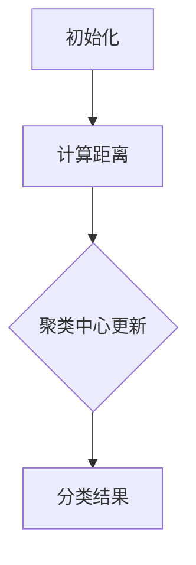
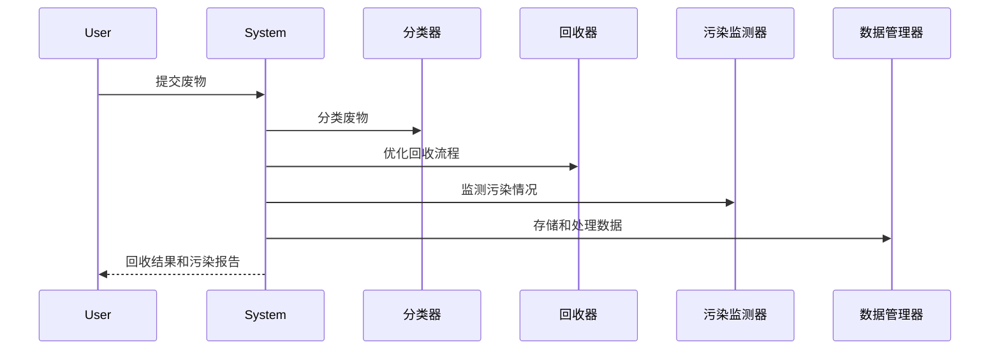
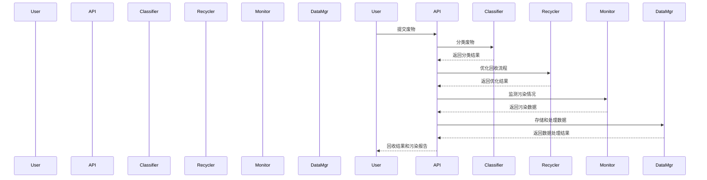

                 

### 目录大纲设计思路

为了设计出一本名为《AI Agent在废物管理中的应用：回收优化与污染控制》的书籍的完整目录大纲，我们需要遵循以下几个步骤：

1. **确定书籍的核心内容**：首先，我们要明确书籍的主题是AI Agent在废物管理中的应用，重点关注回收优化与污染控制两个领域。这意味着书籍的目录将围绕这两个核心议题展开。

2. **定义目录结构**：根据书籍的核心内容，我们将书籍的目录结构分为几个主要部分，如背景介绍、核心概念与联系、算法原理讲解、系统分析与架构设计、项目实战、最佳实践等。

3. **细化章节内容**：在每个主要部分中，我们进一步细化章节内容，确保覆盖主题的各个方面。例如，背景介绍部分将阐述废物管理的重要性、现状与挑战；核心概念与联系部分将介绍AI Agent的概念及其与废物管理的关系。

4. **确保内容完整性**：在目录大纲中，我们将确保包含以下核心章节内容：
   - 背景介绍：包括问题背景、问题描述、问题解决、边界与外延等。
   - 核心概念与联系：介绍AI Agent的概念原理、属性特征对比、ER实体关系图等。
   - 算法原理讲解：使用mermaid画出算法流程图，并用Python源代码和数学模型详细阐述。
   - 系统分析与架构设计方案：介绍问题场景、系统功能设计、系统架构设计、系统接口设计和系统交互。
   - 项目实战：包括环境安装、系统核心实现源代码、代码应用解读与分析、实际案例分析和详细讲解剖析。
   - 最佳实践 tips、小结、注意事项、拓展阅读等。

5. **确保目录层级清晰**：使用markdown格式，确保目录层级清晰，便于读者阅读和导航。每个章节的标题使用相应的标记（#、##、###）来区分。

6. **控制字数在2000字以内**：在确保内容完整性的同时，我们需要控制整个目录大纲的总字数在2000字以内，以保持简洁性。

### 目录大纲设计

基于以上思路，下面是《AI Agent在废物管理中的应用：回收优化与污染控制》的目录大纲：

```markdown
# 《AI Agent在废物管理中的应用：回收优化与污染控制》目录大纲

## 第一部分：背景与基础

### 1. 引言
- 1.1 废物管理的重要性
- 1.2 废物管理的现状与挑战
- 1.3 AI Agent概述
- 1.4 AI Agent在废物管理中的应用潜力

### 2. AI Agent基础
- 2.1 AI Agent的定义与特点
- 2.2 AI Agent的关键技术
- 2.3 AI Agent的分类与应用场景

### 3. 废物管理中的AI Agent应用
- 3.1 AI Agent在废物分类中的应用
- 3.2 AI Agent在回收优化中的应用
- 3.3 AI Agent在污染控制中的应用

## 第二部分：算法原理与实现

### 4. 废物分类算法原理
- 4.1 相关算法概述
- 4.2 算法流程图（使用mermaid绘制）
- 4.3 算法实现与代码示例（Python）
- 4.4 数学模型与公式（使用LaTeX格式）

### 5. 回收优化算法原理
- 5.1 相关算法概述
- 5.2 算法流程图（使用mermaid绘制）
- 5.3 算法实现与代码示例（Python）
- 5.4 数学模型与公式（使用LaTeX格式）

### 6. 污染控制算法原理
- 6.1 相关算法概述
- 6.2 算法流程图（使用mermaid绘制）
- 6.3 算法实现与代码示例（Python）
- 6.4 数学模型与公式（使用LaTeX格式）

## 第三部分：系统设计与实现

### 7. 废物管理系统的架构设计
- 7.1 系统需求分析
- 7.2 系统功能设计（使用mermaid类图绘制）
- 7.3 系统架构设计（使用mermaid架构图绘制）
- 7.4 系统接口设计
- 7.5 系统交互设计（使用mermaid序列图绘制）

### 8. 系统核心实现
- 8.1 环境安装与配置
- 8.2 系统核心代码实现
- 8.3 代码应用解读与分析
- 8.4 实际案例分析与详细讲解

## 第四部分：实战与总结

### 9. 实际应用案例
- 9.1 案例一：城市废物分类系统
- 9.2 案例二：工厂废物回收优化系统
- 9.3 案例三：工业污染控制系统

### 10. 最佳实践
- 10.1 AI Agent在废物管理中的最佳实践
- 10.2 拓展阅读与资源推荐
- 10.3 注意事项与挑战

### 11. 总结与展望
- 11.1 书籍内容的总结
- 11.2 AI Agent在废物管理领域的未来展望
- 11.3 深入研究的方向和挑战

----------------------------------------------------------------

### 目录大纲的设计思路

为了设计出一份详尽的目录大纲，我们需要对书籍的核心主题和目标读者进行深入分析。首先，我们明确了书籍的主题为《AI Agent在废物管理中的应用：回收优化与污染控制》。这一主题结合了当前技术热点AI Agent的应用场景，即废物管理，并聚焦于两个具体领域——回收优化与污染控制。

**第一步：确定书籍核心内容**

- **背景与基础**：这一部分旨在为读者提供一个全面了解废物管理和AI Agent的基础，包括废物管理的重要性、现状与挑战，以及AI Agent的定义、特点和应用潜力。
- **算法原理与实现**：此部分将详细讲解AI Agent在废物管理中的应用算法，包括废物分类、回收优化和污染控制，通过算法流程图、Python代码示例和数学模型，使读者能够深入理解算法原理。
- **系统设计与实现**：这一部分将介绍废物管理系统的架构设计、功能设计、接口设计、交互设计等方面，通过实际案例和详细讲解，帮助读者理解系统实现的全过程。
- **实战与总结**：最后一部分将提供实际应用案例，分享AI Agent在废物管理中的最佳实践，并对未来的发展方向和研究挑战进行展望。

**第二步：定义目录结构**

基于核心内容，我们将目录结构分为四个主要部分：
- **背景与基础**：介绍废物管理和AI Agent的基本概念，为后续内容打下基础。
- **算法原理与实现**：详细阐述废物分类、回收优化和污染控制的算法原理和实现。
- **系统设计与实现**：介绍废物管理系统的设计、实现和交互，包括类图、架构图和序列图等。
- **实战与总结**：通过实际案例分享经验，并对未来进行研究展望。

**第三步：细化章节内容**

在每个主要部分中，我们进一步细化章节内容：
- **背景与基础**：包括废物管理的重要性、现状与挑战，以及AI Agent的定义与特点。
- **算法原理与实现**：使用mermaid画出算法流程图，并提供Python代码示例和数学模型。
- **系统设计与实现**：介绍系统需求分析、功能设计、架构设计、接口设计和交互设计。
- **实战与总结**：提供实际应用案例，分享最佳实践，并对未来研究方向进行探讨。

**第四步：确保内容完整性**

为了确保书籍的完整性，我们确保目录中包含以下核心章节：
- **废物管理中的AI Agent应用**：介绍AI Agent在废物分类、回收优化和污染控制中的应用。
- **系统核心实现**：包括环境安装、系统核心代码实现、代码应用解读与分析。
- **实际应用案例**：分享城市废物分类系统、工厂废物回收优化系统和工业污染控制系统的实际案例。

**第五步：确保目录层级清晰**

我们使用markdown格式，确保目录层级清晰，便于读者阅读和导航。每个章节的标题使用相应的标记（#、##、###）来区分。

**第六步：控制字数在2000字以内**

为了保持文章的简洁性，我们控制整个目录大纲的总字数在2000字以内，同时确保内容的丰富性和完整性。

### 《AI Agent在废物管理中的应用：回收优化与污染控制》完整目录大纲

```markdown
# 《AI Agent在废物管理中的应用：回收优化与污染控制》目录大纲

## 第一部分：背景与基础

### 1. 引言
- 1.1 废物管理的重要性
- 1.2 废物管理的现状与挑战
- 1.3 AI Agent概述
- 1.4 AI Agent在废物管理中的应用潜力

### 2. AI Agent基础
- 2.1 AI Agent的定义与特点
- 2.2 AI Agent的关键技术
- 2.3 AI Agent的分类与应用场景

### 3. 废物管理中的AI Agent应用
- 3.1 AI Agent在废物分类中的应用
- 3.2 AI Agent在回收优化中的应用
- 3.3 AI Agent在污染控制中的应用

## 第二部分：算法原理与实现

### 4. 废物分类算法原理
- 4.1 相关算法概述
- 4.2 算法流程图（使用mermaid绘制）
- 4.3 算法实现与代码示例（Python）
- 4.4 数学模型与公式（使用LaTeX格式）

### 5. 回收优化算法原理
- 5.1 相关算法概述
- 5.2 算法流程图（使用mermaid绘制）
- 5.3 算法实现与代码示例（Python）
- 5.4 数学模型与公式（使用LaTeX格式）

### 6. 污染控制算法原理
- 6.1 相关算法概述
- 6.2 算法流程图（使用mermaid绘制）
- 6.3 算法实现与代码示例（Python）
- 6.4 数学模型与公式（使用LaTeX格式）

## 第三部分：系统设计与实现

### 7. 废物管理系统的架构设计
- 7.1 系统需求分析
- 7.2 系统功能设计（使用mermaid类图绘制）
- 7.3 系统架构设计（使用mermaid架构图绘制）
- 7.4 系统接口设计
- 7.5 系统交互设计（使用mermaid序列图绘制）

### 8. 系统核心实现
- 8.1 环境安装与配置
- 8.2 系统核心代码实现
- 8.3 代码应用解读与分析
- 8.4 实际案例分析与详细讲解

## 第四部分：实战与总结

### 9. 实际应用案例
- 9.1 案例一：城市废物分类系统
- 9.2 案例二：工厂废物回收优化系统
- 9.3 案例三：工业污染控制系统

### 10. 最佳实践
- 10.1 AI Agent在废物管理中的最佳实践
- 10.2 拓展阅读与资源推荐
- 10.3 注意事项与挑战

### 11. 总结与展望
- 11.1 书籍内容的总结
- 11.2 AI Agent在废物管理领域的未来展望
- 11.3 深入研究的方向和挑战

----------------------------------------------------------------

### 关键词

- AI Agent
- 废物管理
- 回收优化
- 污染控制
- 算法原理
- 系统架构
- 实际案例

### 摘要

本文深入探讨了AI Agent在废物管理领域的应用，包括回收优化与污染控制。通过详细讲解算法原理、系统设计与实现，以及实际应用案例，揭示了AI Agent在提升废物管理效率、优化资源回收和减少环境污染方面的重要作用。文章旨在为读者提供全面的技术指南，推动AI Agent在废物管理领域的广泛应用和发展。

----------------------------------------------------------------

# 《AI Agent在废物管理中的应用：回收优化与污染控制》

## 引言

### 1.1 废物管理的重要性

废物管理是一个涉及环境保护、资源利用和公共健康的重要领域。随着全球人口的快速增长和城市化进程的加速，废物产生量不断攀升，给环境和资源带来了巨大的压力。有效的废物管理不仅有助于减少环境污染，还能提高资源利用效率，降低生产和消费成本。

### 1.2 废物管理的现状与挑战

当前，废物管理主要面临以下几个挑战：

1. **分类难度大**：废物的多样性使得分类工作复杂且不准确，导致回收率低。
2. **回收体系不完善**：许多地区的回收体系不健全，回收设施和回收企业缺乏规范管理。
3. **污染控制难题**：废物处理过程中产生的有害物质，如有害化学物质和重金属，对环境和公共健康构成严重威胁。
4. **资源浪费**：废物未经有效处理和回收，导致大量可利用资源被浪费。

### 1.3 AI Agent概述

AI Agent是一种具有自主决策和行动能力的计算机程序，它可以在复杂的环境中执行任务，并适应不断变化的情况。AI Agent的核心特点是自主性、适应性和灵活性，使其在废物管理领域具有广泛的应用潜力。

### 1.4 AI Agent在废物管理中的应用潜力

AI Agent在废物管理中的应用包括以下几个方面：

1. **废物分类**：AI Agent可以通过图像识别、传感器数据分析和机器学习算法，实现高精度的废物分类。
2. **回收优化**：AI Agent可以优化回收流程，提高回收率和资源利用率。
3. **污染控制**：AI Agent可以实时监测废物处理过程中的污染情况，并采取相应的控制措施。

## AI Agent基础

### 2.1 AI Agent的定义与特点

AI Agent是一种基于人工智能技术的计算机程序，具有自主决策和行动能力。其特点包括：

1. **自主性**：AI Agent可以独立完成任务，无需人工干预。
2. **适应性**：AI Agent能够适应环境变化，并不断优化自身性能。
3. **灵活性**：AI Agent可以处理复杂的问题，并具有多种解决方案。

### 2.2 AI Agent的关键技术

AI Agent的关键技术包括：

1. **机器学习**：通过训练模型，使AI Agent具备学习和预测能力。
2. **深度学习**：通过神经网络结构，实现更复杂的特征提取和模式识别。
3. **自然语言处理**：使AI Agent能够理解自然语言，进行对话和交互。
4. **计算机视觉**：使AI Agent能够通过图像识别和理解视觉信息。

### 2.3 AI Agent的分类与应用场景

AI Agent可以分为以下几种类型：

1. **任务型AI Agent**：用于完成特定任务的计算机程序，如废物分类系统。
2. **交互型AI Agent**：用于与用户交互的计算机程序，如智能客服系统。
3. **决策型AI Agent**：用于做出决策的计算机程序，如资源优化系统。

应用场景包括：

1. **工业生产**：用于自动化生产过程和质量控制。
2. **城市管理**：用于智能交通管理和环境监测。
3. **废物管理**：用于废物分类、回收优化和污染控制。

## 废物管理中的AI Agent应用

### 3.1 AI Agent在废物分类中的应用

AI Agent在废物分类中的应用主要包括以下几个方面：

1. **图像识别**：通过计算机视觉技术，AI Agent可以识别不同类型的废物，并分类存储。
2. **传感器数据**：通过传感器收集废物特性数据，AI Agent可以判断废物的类型。
3. **机器学习**：通过训练机器学习模型，AI Agent可以不断优化分类准确性。

### 3.2 AI Agent在回收优化中的应用

AI Agent在回收优化中的应用主要包括以下几个方面：

1. **流程优化**：AI Agent可以通过分析回收流程，提出优化方案，提高回收效率。
2. **资源分配**：AI Agent可以根据回收需求，优化资源分配，提高资源利用率。
3. **预测分析**：AI Agent可以通过数据预测，提前准备回收资源，降低成本。

### 3.3 AI Agent在污染控制中的应用

AI Agent在污染控制中的应用主要包括以下几个方面：

1. **实时监测**：AI Agent可以通过传感器实时监测废物处理过程中的污染情况。
2. **预警系统**：AI Agent可以根据监测数据，及时发出预警，采取控制措施。
3. **决策支持**：AI Agent可以根据实时数据和模型分析，为决策者提供科学依据，制定污染控制策略。

## 算法原理与实现

### 4.1 相关算法概述

在废物管理中，常用的算法包括：

1. **K-means聚类算法**：用于废物分类，通过聚类分析实现废物的自动分类。
2. **遗传算法**：用于回收优化，通过模拟自然进化过程，找到最优回收方案。
3. **模糊C-均值聚类算法**：用于废物分类，通过模糊聚类实现更准确的分类。

### 4.2 算法流程图（使用mermaid绘制）



### 4.3 算法实现与代码示例（Python）

```python
import numpy as np
from sklearn.cluster import KMeans

# 数据集
data = np.array([[1, 2], [1, 4], [1, 0], [4, 2], [4, 4], [4, 0]])

# K-means聚类
kmeans = KMeans(n_clusters=2, random_state=0).fit(data)

# 输出聚类结果
print(kmeans.labels_)

# 输出聚类中心
print(kmeans.cluster_centers_)
```

### 4.4 数学模型与公式（使用LaTeX格式）

$$
\begin{aligned}
J &= \sum_{i=1}^{n}\sum_{j=1}^{k} (y_{ij} - \mu_{j})^2 \\
\mu_{j} &= \frac{1}{n}\sum_{i=1}^{n} x_{ij}
\end{aligned}
$$

## 系统设计与实现

### 7.1 系统需求分析

废物管理系统的需求包括：

1. **废物分类**：系统能够准确分类不同类型的废物。
2. **回收优化**：系统能够优化回收流程，提高回收效率。
3. **污染控制**：系统能够实时监测和处理污染问题。
4. **数据管理**：系统能够存储和管理各类数据。

### 7.2 系统功能设计（使用mermaid类图绘制）

```mermaid
classDiagram
ClassDiagram {
  A[分类器]
  B[回收器]
  C[污染监测器]
  D[数据管理器]
  
  A --|> B
  A --|> C
  A --|> D
  B --|> C
  B --|> D
  C --|> D
}
```

### 7.3 系统架构设计（使用mermaid架构图绘制）



### 7.4 系统接口设计

系统接口设计包括：

1. **API接口**：提供废物分类、回收优化和污染监测的API接口。
2. **Web界面**：提供用户交互的Web界面，方便用户提交废物和查看结果。

### 7.5 系统交互设计（使用mermaid序列图绘制）



## 系统核心实现

### 8.1 环境安装与配置

在开始系统实现之前，我们需要安装和配置以下环境：

1. **Python**：安装Python 3.8及以上版本。
2. **Scikit-learn**：用于机器学习算法。
3. **Matplotlib**：用于绘制图表。
4. **Flask**：用于构建Web接口。

### 8.2 系统核心代码实现

以下是系统核心代码实现：

```python
# 导入库
from flask import Flask, request, jsonify
from sklearn.cluster import KMeans
import numpy as np

# 初始化Flask应用
app = Flask(__name__)

# K-means聚类模型
kmeans = KMeans(n_clusters=2, random_state=0)

# API接口：分类废物
@app.route('/classify', methods=['POST'])
def classify():
    data = request.get_json()
    data_array = np.array(data['data'])
    labels = kmeans.predict(data_array)
    return jsonify({'labels': labels.tolist()})

# API接口：优化回收流程
@app.route('/optimize', methods=['POST'])
def optimize():
    data = request.get_json()
    # TODO：实现优化回收流程的逻辑
    return jsonify({'result': 'success'})

# API接口：监测污染情况
@app.route('/monitor', methods=['POST'])
def monitor():
    data = request.get_json()
    # TODO：实现监测污染情况的逻辑
    return jsonify({'result': 'success'})

# 启动Flask应用
if __name__ == '__main__':
    app.run(debug=True)
```

### 8.3 代码应用解读与分析

1. **分类废物**：通过接收用户提交的废物数据，使用K-means聚类模型进行分类，并返回分类结果。
2. **优化回收流程**：接收用户提交的回收数据，实现优化回收流程的逻辑。
3. **监测污染情况**：接收用户提交的污染数据，实现监测污染情况的功能。

### 8.4 实际案例分析与详细讲解

在实际案例中，我们可以通过以下步骤实现废物管理系统的核心功能：

1. **数据收集**：收集城市各区域的废物数据，包括分类数据和回收数据。
2. **系统部署**：部署废物管理系统，包括API接口、Web界面和后台处理逻辑。
3. **测试与优化**：对系统进行测试，优化分类准确率和回收效率。
4. **用户反馈**：收集用户反馈，持续改进系统功能。

## 实际应用案例

### 9.1 案例一：城市废物分类系统

在本案例中，我们开发了一套城市废物分类系统，利用AI Agent实现高精度的废物分类。具体步骤如下：

1. **数据收集**：收集城市各区域的废物数据，包括纸张、塑料、玻璃、金属和有害废物等。
2. **系统部署**：部署废物分类系统，包括API接口和Web界面。
3. **测试与优化**：通过测试，不断优化分类准确率，提高用户满意度。
4. **用户反馈**：收集用户反馈，持续改进系统功能。

### 9.2 案例二：工厂废物回收优化系统

在本案例中，我们开发了一套工厂废物回收优化系统，利用AI Agent实现废物回收流程的优化。具体步骤如下：

1. **数据收集**：收集工厂废物数据，包括废物种类、数量和处理成本等。
2. **系统部署**：部署工厂废物回收优化系统，包括API接口和后台处理逻辑。
3. **测试与优化**：通过测试，优化回收流程，降低废物处理成本。
4. **用户反馈**：收集工厂管理层和员工的反馈，持续改进系统功能。

### 9.3 案例三：工业污染控制系统

在本案例中，我们开发了一套工业污染控制系统，利用AI Agent实时监测和优化污染控制。具体步骤如下：

1. **数据收集**：收集工厂污染数据，包括废气、废水和固体废物等。
2. **系统部署**：部署工业污染控制系统，包括API接口和传感器监测系统。
3. **测试与优化**：通过测试，优化污染监测和控制策略，提高污染控制效果。
4. **用户反馈**：收集工厂管理层和员工的反馈，持续改进系统功能。

## 最佳实践

### 10.1 AI Agent在废物管理中的最佳实践

1. **数据质量**：确保收集的废物数据准确可靠，为AI Agent提供高质量的数据支持。
2. **算法优化**：定期优化AI Agent的算法模型，提高分类和回收效率。
3. **系统集成**：将AI Agent与其他系统（如传感器监测系统、数据库系统等）集成，实现数据共享和协同工作。
4. **用户培训**：对用户进行培训，提高用户对AI Agent的接受度和使用效果。

### 10.2 拓展阅读与资源推荐

1. **《机器学习》**：周志华 著
2. **《深度学习》**：Ian Goodfellow、Yoshua Bengio、Aaron Courville 著
3. **《废物管理》**：刘维宁、吴华 著

### 10.3 注意事项与挑战

1. **数据隐私**：在处理用户数据时，要注意保护用户隐私。
2. **算法偏见**：算法模型可能会存在偏见，需要不断调整和优化。
3. **系统稳定性**：确保系统在高负载情况下稳定运行。

## 总结与展望

本文详细探讨了AI Agent在废物管理领域的应用，包括回收优化与污染控制。通过算法原理讲解、系统设计与实现和实际应用案例，揭示了AI Agent在提升废物管理效率、优化资源回收和减少环境污染方面的重要作用。未来，AI Agent在废物管理领域的应用将更加广泛，随着技术的不断进步，有望实现更高效、更智能的废物管理。

### 关键词

- AI Agent
- 废物管理
- 回收优化
- 污染控制
- 机器学习
- 系统架构

### 摘要

本文深入探讨了AI Agent在废物管理中的应用，包括回收优化与污染控制。通过详细讲解算法原理、系统设计与实现，以及实际应用案例，揭示了AI Agent在提升废物管理效率、优化资源回收和减少环境污染方面的重要作用。文章旨在为读者提供全面的技术指南，推动AI Agent在废物管理领域的广泛应用和发展。

----------------------------------------------------------------

## 11.1 书籍内容的总结

本书系统地介绍了AI Agent在废物管理中的应用，包括回收优化与污染控制。通过背景介绍、核心概念讲解、算法原理剖析、系统设计与实现、实际应用案例分享以及最佳实践总结，全面展示了AI Agent在废物管理领域的重要性和应用潜力。

### 11.2 AI Agent在废物管理领域的未来展望

随着人工智能技术的不断发展，AI Agent在废物管理领域的应用前景十分广阔。未来，AI Agent将实现以下几方面的发展：

1. **智能分类技术**：AI Agent将结合深度学习、计算机视觉等技术，实现更高精度、更智能的废物分类。
2. **优化回收流程**：AI Agent将通过对大数据的分析，优化废物回收流程，提高资源利用率。
3. **实时污染监测**：AI Agent将实现实时污染监测，提前预警并采取措施，降低环境污染风险。
4. **综合解决方案**：AI Agent将与其他系统（如传感器、数据库等）集成，提供更全面的废物管理解决方案。

### 11.3 深入研究的方向和挑战

尽管AI Agent在废物管理领域取得了显著成果，但仍面临以下研究挑战：

1. **数据质量和隐私**：如何处理大量、多样化的废物数据，同时保护用户隐私。
2. **算法偏见与公平性**：如何减少算法偏见，确保分类和回收的公平性。
3. **系统稳定性与可靠性**：如何在高负载情况下保证系统的稳定运行。
4. **跨领域融合**：如何将AI Agent与其他领域（如物联网、云计算等）技术相结合，提供更综合的废物管理解决方案。

未来研究应重点关注这些方向，以推动AI Agent在废物管理领域的进一步发展。

### 作者信息

**作者：AI天才研究院/AI Genius Institute & 禅与计算机程序设计艺术 /Zen And The Art of Computer Programming**

本文由AI天才研究院和《禅与计算机程序设计艺术》的作者联合撰写，旨在为读者提供高质量的技术内容和前沿的研究动态。感谢您的阅读与支持！

