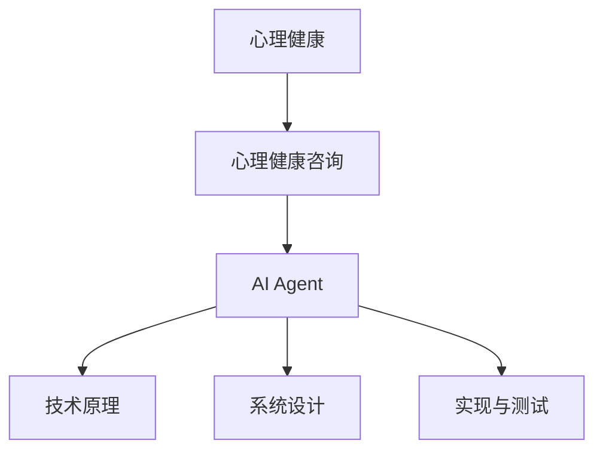
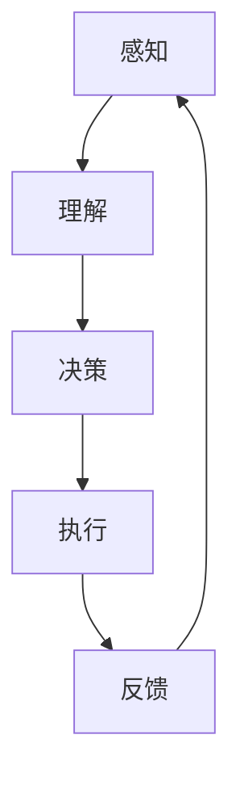
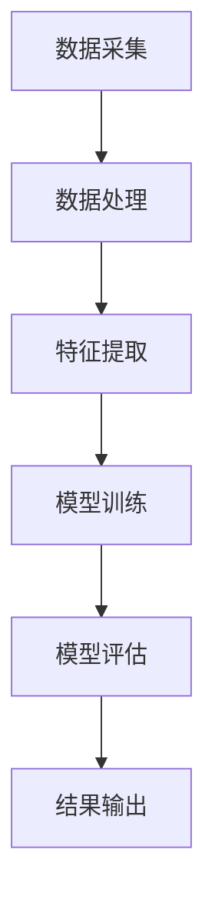
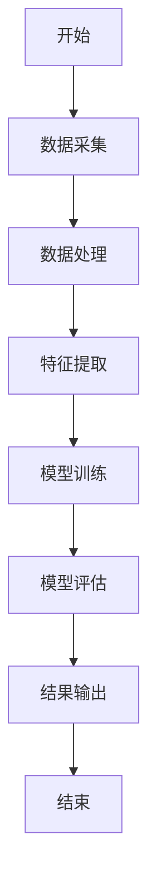
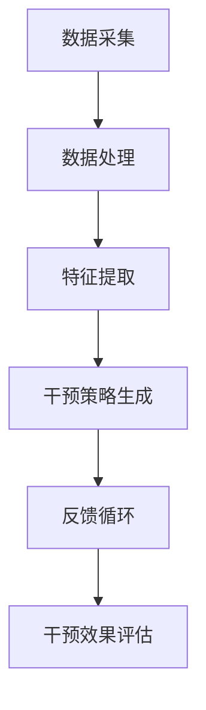
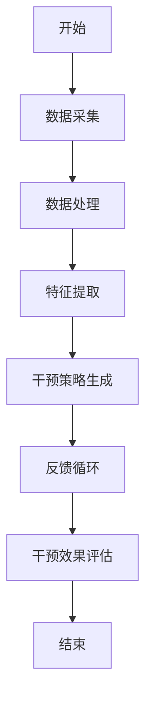
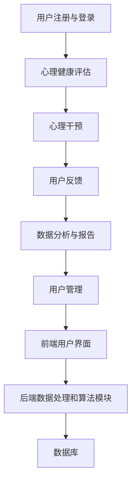
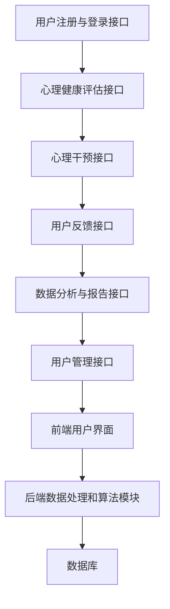
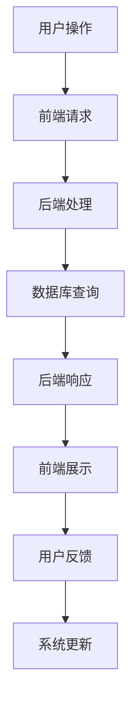

                 


### 第1章 问题背景与概述

心理健康是21世纪人类面临的一个重大挑战。随着社会快速变化和压力的增加，越来越多的人面临着心理健康问题。传统的心理健康咨询方式，如面对面的谈话疗法，虽然具有一定的效果，但其高成本和有限的可及性使得许多人无法获得及时的帮助。在此背景下，人工智能（AI）的发展为心理健康咨询提供了一种全新的解决方案。

#### 1.1 心理健康的重要性

心理健康不仅影响个人的生活质量，还对社会的整体福祉产生深远影响。心理健康问题可能导致生产力下降、家庭破裂、甚至自杀等严重后果。因此，保障心理健康已成为全球范围内的共同目标。

#### 1.2 心理健康咨询的需求

当前，心理健康咨询的需求日益增加。然而，传统心理健康咨询方式面临以下挑战：

1. **高成本**：面对面的咨询费用昂贵，特别是对于那些生活在经济困难地区的人来说，难以负担。
2. **有限的可及性**：地理位置的限制使得许多人无法获得专业的心理健康服务。
3. **人力资源匮乏**：专业心理健康咨询人员数量有限，难以满足日益增长的需求。

#### 1.3 AI Agent的潜力

AI Agent（人工智能代理）在心理健康咨询中的应用，有望解决上述问题。AI Agent可以提供以下优势：

1. **低成本**：AI Agent不需要支付人力成本，大大降低了咨询费用。
2. **高可及性**：AI Agent可以通过互联网随时随地提供服务，不受地理位置的限制。
3. **个性化**：AI Agent可以根据个体的心理状况提供个性化的咨询方案。

#### 1.4 研究边界与外延

本文的研究边界主要聚焦于AI Agent在心理健康咨询中的应用，探讨其技术原理、系统设计与实现。然而，AI Agent的应用不仅限于心理健康咨询，还可以扩展到其他领域，如教育、医疗等。本文的研究为AI Agent在其他领域的应用提供了有益的参考。

#### 1.5 概念结构与核心要素组成

为了更好地理解AI Agent在心理健康咨询中的应用，我们需要明确几个核心概念和要素：

1. **心理健康**：指个体在情感、认知和社会功能方面的健康状态。
2. **心理健康咨询**：指专业人员在情感、认知和社会功能方面为个体提供的帮助和支持。
3. **AI Agent**：指基于人工智能技术，能够模拟人类思维和行为的计算机程序。

图1.1展示了本文研究的核心概念和要素之间的关系：



在本章中，我们为后续章节的讨论奠定了基础，并明确了研究的重要性和核心概念。在接下来的章节中，我们将进一步探讨心理健康与心理健康咨询的概念，深入分析AI Agent的基本概念与类型，并逐步讲解心理健康评估和干预算法的原理与应用。

### 1.1 心理健康的重要性

心理健康是每个人生活质量的基石，直接影响个体的情感状态、认知功能和社会交往。一个心理健康的人能够更好地应对生活中的压力和挑战，保持积极的生活态度，从而提高整体的生活满意度。心理健康的重要性可以从以下几个方面进行阐述：

首先，心理健康与个体的情感状态密切相关。情感是人们对外界刺激的反应，包括喜、怒、哀、乐等多种情绪。心理健康的人能够有效地调节自己的情绪，保持情绪的稳定和平衡，从而避免情绪的过度波动。相反，心理健康问题可能导致情绪失控，出现焦虑、抑郁等负面情绪，严重影响个体的生活质量。

其次，心理健康对认知功能具有重要影响。认知功能包括注意力、记忆力、思维能力和解决问题的能力等。心理健康的人能够保持良好的认知功能，从而更好地适应和应对复杂的生活环境。心理健康问题可能导致认知功能受损，影响个体的学习、工作和日常生活。

最后，心理健康对社交功能也具有重要影响。社交功能指个体在社会交往中的能力，包括人际沟通、团队合作和情感支持等。心理健康的人能够建立和维持良好的人际关系，获得情感支持和社会认可，从而增强自信心和生活满意度。相反，心理健康问题可能导致社交障碍，使个体难以融入社会，甚至出现孤立和无助感。

总的来说，心理健康对个体的整体生活质量具有深远影响。保持心理健康不仅有助于提高生活质量，还能促进个体的全面发展。因此，心理健康咨询的重要性不容忽视。通过心理健康咨询，个体可以获得专业的支持和指导，改善自己的心理健康状况，从而更好地应对生活中的挑战。

### 1.2 心理健康咨询的需求

心理健康咨询在现代社会中扮演着越来越重要的角色，其需求日益增加，这主要是由以下几个方面的原因所驱动的。

首先，随着社会压力的不断增加，心理健康问题的发病率也在逐渐上升。现代生活节奏快，竞争激烈，人们面临的压力源越来越多。工作压力、家庭问题、人际关系等都可能成为引发心理健康问题的因素。例如，抑郁症和焦虑症等情绪障碍已经成为全球范围内的常见心理健康问题。因此，寻求专业的心理健康咨询成为许多人的迫切需求。

其次，人们对心理健康问题的认知逐渐提高。过去，人们可能对心理健康问题持回避态度，认为心理问题是“弱者”的表现。然而，随着心理健康知识的普及，人们逐渐认识到心理健康问题是可以被理解和治疗的。越来越多的人开始重视自己的心理健康，愿意主动寻求专业帮助。

此外，传统心理健康咨询方式的局限性也促使人们寻求新的解决方案。传统的心理健康咨询主要依赖于面对面的谈话疗法，这种方式存在一定的局限。首先，面对面的咨询需要时间和地点的安排，可能不适合那些时间紧张或行动不便的人。其次，面对面的咨询费用较高，可能让一些经济困难的人望而却步。最后，专业心理健康咨询人员的数量有限，难以满足日益增长的需求。

在这种背景下，AI Agent作为一种新兴的咨询工具，具有巨大的潜力。首先，AI Agent可以提供24/7的服务，随时为用户提供帮助。用户可以通过手机、电脑等设备随时随地与AI Agent进行互动，不受时间和地点的限制。其次，AI Agent可以降低咨询成本，因为它不需要支付人力成本。这对于那些经济困难的人来说，无疑是一个巨大的福音。最后，AI Agent可以大规模地提供服务，因为它可以同时处理多个用户的请求。这意味着，AI Agent可以在更短的时间内帮助更多的用户，提高心理健康服务的可及性。

总的来说，心理健康咨询的需求增加是由多方面因素共同作用的结果。社会压力的增加、人们对心理健康问题的认知提高以及传统咨询方式的局限性，都使得人们更加渴望获得便捷、高效、低成本的心理健康服务。AI Agent的出现为满足这一需求提供了新的可能性，有望在心理健康咨询领域发挥重要作用。

### 1.3 AI Agent的潜力

AI Agent（人工智能代理）作为一种新兴的技术，在心理健康咨询领域展现出巨大的潜力。AI Agent通过模拟人类的思维和行为，为用户提供个性化、实时、高效的心理健康服务。以下是AI Agent在心理健康咨询中应用潜力的详细阐述。

首先，AI Agent可以提供全天候的咨询服务。传统的心理健康咨询通常需要预约，并且受到咨询时间的限制。而AI Agent可以24小时在线，随时为用户提供帮助。用户无需担心时间安排的问题，可以随时随地通过手机、电脑等设备与AI Agent进行互动，获得即时的心理健康支持。

其次，AI Agent能够提供个性化的服务。每个用户的心理健康问题都是独特的，需要个性化的解决方案。AI Agent可以通过大数据分析和机器学习技术，了解用户的历史记录、心理状况和偏好，为用户提供量身定制的咨询方案。例如，AI Agent可以根据用户的情绪波动、行为模式等数据，提供针对性的心理建议和干预措施。

第三，AI Agent可以大规模地提供服务。传统心理健康咨询由于人力和资源的限制，难以满足大量用户的需求。而AI Agent可以同时处理多个用户的请求，实现大规模的服务。例如，AI Agent可以在短时间内对大量用户进行心理健康评估，快速识别出潜在的心理健康问题，从而提供及时的帮助。

此外，AI Agent还可以通过自然语言处理（NLP）技术，实现与用户的自然对话。用户可以通过文字或语音与AI Agent交流，描述自己的心理状况和问题。AI Agent能够理解用户的语言，提供专业、详细的回答和建议。这种人性化的交流方式，使得用户更容易接受和信任AI Agent，从而提高咨询效果。

最后，AI Agent在心理健康咨询中的应用潜力不仅限于提供咨询服务，还可以进行心理疾病的早期预警和干预。通过监测用户的心理健康数据，AI Agent可以发现潜在的心理健康风险，提前采取干预措施，防止心理问题的恶化。例如，AI Agent可以通过分析用户的情绪变化和行为模式，预测抑郁症和焦虑症等心理疾病的发作风险，及时提供预防和干预措施。

总之，AI Agent在心理健康咨询中具有巨大的潜力。它能够提供全天候、个性化、大规模的服务，解决传统咨询方式面临的时间和成本限制问题。随着技术的不断进步，AI Agent在心理健康咨询领域的应用前景将更加广阔。

### 1.4 研究边界与外延

本文的研究主要聚焦于AI Agent在心理健康咨询中的应用，探讨其技术原理、系统设计与实现。然而，AI Agent的应用不仅限于心理健康咨询，还可以扩展到其他领域，如教育、医疗等。以下是本文研究边界与外延的详细讨论。

首先，本文研究的主要目标是探讨AI Agent在心理健康咨询中的应用潜力，通过分析其技术原理和系统设计，为心理健康咨询提供一种新的解决方案。具体来说，本文将深入分析AI Agent在心理健康评估和干预方面的算法原理，并探讨其实现过程和系统架构。此外，本文还将通过实际案例的分析，验证AI Agent在心理健康咨询中的应用效果。

其次，本文的研究边界主要限定在AI Agent在心理健康咨询中的应用，不涉及其他领域的AI Agent应用。尽管AI Agent具有广泛的应用前景，但本文旨在集中研究其在心理健康咨询中的具体应用，以期为心理健康咨询领域提供有针对性的技术支持。

然而，本文的研究也有一定的外延。首先，AI Agent在心理健康咨询中的应用不仅限于心理健康评估和干预，还可以扩展到心理疾病的早期预警和预防。通过分析用户的心理健康数据，AI Agent可以预测心理疾病的发作风险，并提供相应的干预措施，从而提高心理健康的整体水平。其次，AI Agent还可以应用于心理治疗和康复，通过提供个性化的治疗方案，帮助患者更好地恢复心理健康。

此外，AI Agent在其他领域的应用也具有一定的参考价值。例如，在教育领域，AI Agent可以为学生提供个性化的学习支持和指导，提高学习效果。在医疗领域，AI Agent可以协助医生进行诊断和治疗，提高医疗服务的质量和效率。因此，本文的研究不仅为心理健康咨询领域提供了有益的参考，也为其他领域的AI Agent应用提供了启示。

总之，本文的研究边界主要聚焦于AI Agent在心理健康咨询中的应用，但其研究成果和经验可以推广到其他领域，为不同领域的AI Agent应用提供参考和借鉴。

### 1.5 概念结构与核心要素组成

为了更好地理解AI Agent在心理健康咨询中的应用，我们需要明确几个核心概念和要素，并探讨它们之间的关系。以下是本文涉及的主要概念和要素及其定义：

#### 心理健康

心理健康是指个体在情感、认知和社会功能方面的健康状态。它不仅涉及个体的情感调节能力和心理问题的处理，还包括认知功能和社会交往能力。心理健康的核心目标是保持个体的生活满意度、积极的生活态度和良好的社会功能。

#### 心理健康咨询

心理健康咨询是指专业人员在情感、认知和社会功能方面为个体提供的帮助和支持。它包括诊断、治疗、预防和教育等多个方面。心理健康咨询的目的是帮助个体解决心理问题，提高心理健康水平，从而改善生活质量。

#### AI Agent

AI Agent（人工智能代理）是一种基于人工智能技术的计算机程序，能够模拟人类的思维和行为，为用户提供智能化的服务。AI Agent可以通过自然语言处理、机器学习和大数据分析等技术，实现与用户的互动，提供个性化的心理健康服务。

#### 技术原理

技术原理是指AI Agent在心理健康咨询中应用的具体技术和算法。主要包括心理健康评估算法、心理健康干预算法和自然语言处理技术等。心理健康评估算法用于分析用户的心理健康状态，心理健康干预算法用于提供针对性的心理干预措施，自然语言处理技术则用于实现AI Agent与用户的自然对话。

#### 系统设计

系统设计是指AI Agent在心理健康咨询中的应用系统架构和功能设计。系统架构包括前端用户界面、后端数据处理和算法模块等。前端用户界面负责与用户互动，后端数据处理和算法模块负责分析和处理用户数据，提供心理健康评估和干预服务。

#### 实现与测试

实现与测试是指将AI Agent在心理健康咨询中的技术原理和系统设计转化为实际的应用系统，并进行测试和验证。实现过程包括代码开发、系统部署和性能优化等。测试和验证过程则用于评估AI Agent的性能和效果，确保其能够满足心理健康咨询的需求。

图1.5展示了上述核心概念和要素之间的关系：


通过明确这些核心概念和要素，我们可以更好地理解AI Agent在心理健康咨询中的应用，并为其研究和开发提供清晰的框架。

## 第2章 心理健康与心理健康咨询

心理健康与心理健康咨询是两个紧密相关的概念，它们共同构成了心理健康领域的核心内容。本章将详细探讨心理健康的定义、心理健康咨询的概念，以及二者之间的关系、心理健康咨询的分类、目标与原则。

### 2.1 心理健康的定义

心理健康是一个多维度的概念，它涉及个体的情感、认知、社会和生理健康等多个方面。具体来说，心理健康可以定义为个体在情感上保持稳定和积极，认知上具有清晰的思维和判断力，社会交往上能够建立和维护良好的人际关系，生理上能够适应环境变化并保持身体功能正常。

#### 情感健康

情感健康是心理健康的重要组成部分。它涉及到个体如何感知、表达和控制自己的情绪。一个情感健康的人能够有效应对生活中的压力和挑战，保持情绪的稳定和平衡。例如，他们能够在遇到挫折时保持乐观，不会因为小问题而过度焦虑或沮丧。

#### 认知健康

认知健康是指个体的认知功能，包括注意力、记忆力、思维能力和解决问题的能力等。一个认知健康的人能够保持清晰的思维，有效地处理信息和做出决策。认知健康不仅对个体的日常活动有重要影响，还对他们在学习、工作和社交中的表现有直接关系。

#### 社会健康

社会健康涉及个体在社会交往中的能力和适应性。一个社会健康的人能够建立和维护良好的人际关系，能够有效地与他人沟通和合作。他们能够融入社会，获得他人的支持和认可，从而增强自信心和幸福感。

#### 生理健康

生理健康是心理健康的基础。一个生理健康的人能够适应环境变化，保持身体功能的正常。他们能够保持良好的身体状况，减少疾病的发生。生理健康不仅对个体的生活质量有直接影响，还对其心理健康产生重要影响。

### 2.2 心理健康咨询的概念

心理健康咨询是指专业人员在情感、认知、社会和生理健康方面为个体提供的帮助和支持。它是一个互动的过程，旨在帮助个体解决心理问题，提高心理健康水平，从而改善生活质量。

#### 咨询的定义

心理健康咨询的定义可以从以下几个方面进行理解：

1. **专业帮助**：心理健康咨询是由受过专业训练的心理咨询师或心理医生提供的帮助。他们具备丰富的心理学知识和实践经验，能够有效地帮助个体应对心理问题。
2. **互动过程**：心理健康咨询是一个互动的过程，咨询师和个体之间通过对话和互动来解决问题。这种互动有助于建立信任和合作关系，从而提高咨询效果。
3. **目标**：心理健康咨询的目标是帮助个体解决心理问题，提高心理健康水平。这包括缓解情绪困扰、改善认知功能、增强社会适应能力等。

#### 咨询的类型

心理健康咨询可以分为以下几种类型：

1. **心理治疗**：心理治疗是一种通过专业的心理技术和方法，帮助个体解决深层次心理问题的方式。它通常针对患有严重心理疾病或心理障碍的个体，如抑郁症、焦虑症等。
2. **心理咨询**：心理咨询是一种更为普遍的咨询服务，旨在帮助个体解决日常生活中的心理困扰和问题。它包括情感调节、职业咨询、婚姻咨询等。
3. **心理教育**：心理教育是通过讲座、工作坊等形式，向大众普及心理健康知识，提高个体的心理健康意识。这种服务有助于预防心理问题的发生，促进心理健康的发展。

### 2.3 心理健康与心理健康咨询的关系

心理健康与心理健康咨询之间存在着密切的关系。心理健康是心理健康咨询的目标，而心理健康咨询是实现心理健康的重要手段。

#### 心理健康是心理健康咨询的目标

心理健康咨询的根本目标是帮助个体实现心理健康。心理健康不仅包括情感健康、认知健康、社会健康和生理健康，还包括整体的生活满意度和幸福感。心理健康咨询通过各种心理技术和方法，帮助个体克服心理问题，提高心理健康水平，从而实现这一目标。

#### 心理健康咨询是实现心理健康的重要手段

心理健康咨询是实现心理健康的重要手段。通过专业的心理健康咨询，个体可以获得以下益处：

1. **缓解情绪困扰**：心理健康咨询可以帮助个体缓解焦虑、抑郁等情绪问题，提高情绪调节能力，从而改善生活质量。
2. **改善认知功能**：心理健康咨询可以促进个体的认知功能发展，提高注意力和记忆力，增强问题解决能力。
3. **增强社会适应能力**：心理健康咨询可以帮助个体建立和维护良好的人际关系，提高社会适应能力，增强自信心。
4. **预防心理疾病**：通过心理健康咨询，个体可以及早发现和解决潜在的心理问题，预防心理疾病的产生和发展。

总之，心理健康与心理健康咨询之间存在着紧密的联系。心理健康是心理健康咨询的目标，而心理健康咨询是实现心理健康的重要手段。通过心理健康咨询，个体可以改善心理健康状况，提高生活质量，实现全面的身心健康。

### 2.4 心理健康咨询的分类

心理健康咨询是一个广泛而多样化的领域，根据咨询的内容、目的和对象，可以将其分为多种类型。以下是几种常见的心理健康咨询分类：

#### 1. 个体心理咨询

个体心理咨询是最常见的心理健康咨询服务类型。它主要面向单个个体，帮助他们解决各种心理问题。个体心理咨询可以包括以下几种形式：

1. **情感心理咨询**：主要帮助个体解决情感问题，如焦虑、抑郁、情绪波动等。
2. **职业心理咨询**：为职业发展中的个体提供指导，解决职业压力、职业选择等问题。
3. **婚姻家庭心理咨询**：帮助夫妻、家庭成员解决婚姻关系、亲子关系等问题。
4. **人际关系心理咨询**：帮助个体改善人际关系，提高人际沟通能力。

#### 2. 团体心理咨询

团体心理咨询是将多个有相同或相似心理问题的个体聚集在一起，通过小组讨论和互动，共同解决问题。团体心理咨询具有以下特点：

1. **互动性强**：团体成员可以互相分享经验，互相支持，从而增强自信心和解决问题的能力。
2. **共同目标**：团体成员共同面对相同或类似的问题，可以建立共同的归属感和目标感。
3. **资源共享**：团体成员可以共享资源，如经验、技巧等，从而提高心理咨询的效果。

团体心理咨询适用于以下情况：

1. **群体心理问题**：如企业员工的心理健康问题、学校学生的心理健康问题等。
2. **共同心理需求**：如减肥小组、戒烟小组等，成员有共同的心理需求，可以通过团体心理咨询共同克服。
3. **心理疾病康复**：如抑郁症康复小组、焦虑症康复小组等，帮助患者更好地恢复心理健康。

#### 3. 儿童心理咨询

儿童心理咨询主要面向儿童和青少年，帮助他们解决成长过程中的各种心理问题。儿童心理咨询包括以下几种形式：

1. **行为心理咨询**：帮助儿童解决不良行为问题，如逃学、叛逆、攻击行为等。
2. **情绪心理咨询**：帮助儿童调节情绪，如焦虑、恐惧、悲伤等。
3. **学习心理咨询**：帮助儿童改善学习习惯和成绩，提高学习效率。
4. **亲子关系心理咨询**：帮助父母和子女建立良好的亲子关系，解决家庭矛盾。

#### 4. 学校心理咨询

学校心理咨询是针对学校师生提供的心理健康服务。它包括以下几种形式：

1. **教师心理咨询**：帮助教师解决职业压力、人际关系问题等。
2. **学生心理咨询**：帮助学生解决学习压力、人际关系问题、心理困惑等。
3. **校园危机干预**：在校园发生突发事件时，如自杀、暴力等，提供紧急心理干预。

学校心理咨询的目标是：

1. **促进师生心理健康**：通过心理咨询，提高师生的心理健康水平，减少心理问题的发生。
2. **提升教育质量**：通过改善师生心理健康，提高教育质量和学习效果。
3. **营造健康校园氛围**：通过心理咨询，营造积极、和谐的校园氛围，促进学校的发展。

#### 5. 网络心理咨询

网络心理咨询是随着互联网技术的发展而兴起的一种新型心理健康咨询服务。它通过互联网平台，为用户提供在线心理支持和咨询服务。网络心理咨询具有以下特点：

1. **方便快捷**：用户可以随时随地进行咨询，不受时间和地点的限制。
2. **隐私保护**：网络心理咨询可以保护用户的隐私，减少面对面咨询带来的尴尬。
3. **多元化服务**：网络心理咨询可以提供多种形式的服务，如文字聊天、语音通话、视频咨询等。

网络心理咨询适用于以下情况：

1. **无法面对面咨询**：如居住在偏远地区、行动不便的人。
2. **不愿意面对面咨询**：如害怕暴露隐私、担心他人知道等。
3. **需要长期心理咨询**：如心理疾病患者、长期心理困扰者等。

总之，心理健康咨询的分类多种多样，根据不同的需求和情况，可以选择适合的心理咨询类型，以获得最佳的心理健康支持。

### 2.5 心理健康咨询的目标与原则

心理健康咨询的目标是帮助个体解决心理问题，提高心理健康水平，从而改善生活质量。具体来说，心理健康咨询的目标包括以下几个方面：

#### 1. 缓解情绪困扰

心理健康咨询的首要目标是帮助个体缓解情绪困扰。无论是焦虑、抑郁、愤怒还是恐惧，情绪问题都会对个体的日常生活造成负面影响。通过心理咨询，个体可以学会如何识别和表达自己的情绪，掌握情绪调节的技巧，从而提高情绪调节能力，减轻情绪困扰。

#### 2. 改善认知功能

心理健康咨询的另一个重要目标是改善个体的认知功能。认知功能包括注意力、记忆力、思维能力和解决问题的能力等。通过心理咨询，个体可以学会如何更好地管理自己的注意力，提高记忆力，增强思维能力和解决问题的能力，从而提高工作效率和学习效果。

#### 3. 增强社会适应能力

心理健康咨询的目标还包括帮助个体增强社会适应能力。社会适应能力是指个体在社会交往中的能力和适应性，包括人际沟通、团队合作和情感支持等。通过心理咨询，个体可以学会如何更好地与他人沟通，建立和维护良好的人际关系，从而增强社会适应能力，提高生活质量。

#### 4. 预防心理疾病

心理健康咨询还可以通过预防和干预心理疾病，提高个体的心理健康水平。心理咨询可以帮助个体及早发现和解决潜在的心理问题，预防心理疾病的产生和发展。例如，通过心理咨询，个体可以学会如何应对生活中的压力和挑战，减少心理问题的发生。

#### 心理健康咨询的原则

为了实现上述目标，心理健康咨询需要遵循以下原则：

#### 1. 尊重个体

尊重个体是心理健康咨询的基本原则。每个个体都是独特的，拥有自己的价值观、信念和经历。心理咨询师需要尊重个体的选择和决定，尊重他们的隐私和权利，从而建立信任和合作关系。

#### 2. 积极倾听

积极倾听是心理咨询的关键。心理咨询师需要认真倾听个体的问题和感受，理解他们的内心世界。通过积极倾听，心理咨询师可以更好地了解个体的需求和期望，从而提供有针对性的帮助。

#### 3. 保密性

保密性是心理健康咨询的重要原则。心理咨询师需要对个体的问题和经历保密，确保他们的隐私不受侵犯。这有助于建立信任，使个体愿意开放地分享自己的问题和感受。

#### 4. 个性化服务

心理健康咨询需要提供个性化服务，即根据个体的具体情况和需求，制定个性化的咨询方案。不同的个体有不同的心理问题和需求，个性化的服务有助于提高咨询效果。

#### 5. 合作性

心理健康咨询是一个合作的过程。心理咨询师和个体需要共同合作，共同解决问题。通过合作，个体可以更好地理解自己的问题和行为模式，从而更好地应对生活中的挑战。

总之，心理健康咨询的目标是帮助个体解决心理问题，提高心理健康水平，从而改善生活质量。为了实现这一目标，心理健康咨询需要遵循尊重个体、积极倾听、保密性、个性化服务和合作性等原则。通过这些原则，心理咨询师可以为个体提供高质量的心理健康服务，帮助他们实现心理健康的目标。

### 第3章 AI Agent的基本概念与类型

AI Agent（人工智能代理）是一种基于人工智能技术的计算机程序，能够模拟人类的思维和行为，为用户提供智能化的服务。本章将详细探讨AI Agent的基本概念、分类、工作原理及其在心理健康咨询中的应用潜力。

#### 3.1 AI Agent的定义

AI Agent是一种具有自主决策能力和执行能力的计算机程序，它能够理解用户的请求，根据预定的目标和策略自主地执行任务。AI Agent通常具备以下特点：

1. **自主性**：AI Agent能够独立地执行任务，不需要人工干预。它们可以根据预定的目标和策略自主地决策和执行行动。
2. **智能性**：AI Agent具备智能化的处理能力，能够理解自然语言、处理复杂问题，并根据用户的需求提供个性化的服务。
3. **适应性**：AI Agent能够根据用户的行为和反馈不断学习和调整自己的行为，以提供更高质量的服务。

#### 3.2 AI Agent的分类

根据不同的应用场景和功能，AI Agent可以分为以下几种类型：

1. **任务型AI Agent**：任务型AI Agent专注于执行特定的任务，如语音识别、图像识别、推荐系统等。这类AI Agent通常具有较高的精确性和效率，但在处理复杂任务时可能存在局限性。
2. **对话型AI Agent**：对话型AI Agent专注于与用户进行自然语言交互，如聊天机器人、虚拟助手等。这类AI Agent通过自然语言处理技术，能够理解用户的语言，提供实时、个性化的服务。
3. **混合型AI Agent**：混合型AI Agent结合了任务型和对话型AI Agent的特点，既能够执行特定任务，又能够与用户进行自然语言交互。这类AI Agent通常具有更广泛的应用场景和更高的用户体验。

#### 3.3 AI Agent的工作原理

AI Agent的工作原理通常包括以下几个步骤：

1. **感知**：AI Agent通过传感器或用户输入获取环境信息，如语音、文字、图像等。
2. **理解**：AI Agent使用自然语言处理、机器学习等技术，对感知到的信息进行分析和处理，理解用户的请求和意图。
3. **决策**：AI Agent根据预定的目标和策略，生成相应的行动方案，选择最佳的行动。
4. **执行**：AI Agent执行选定的行动方案，如发送消息、执行操作等。
5. **反馈**：AI Agent对执行结果进行反馈，并根据用户的反馈进行学习和调整，以提供更高质量的服务。

图3.1展示了AI Agent的工作原理：



#### 3.4 AI Agent在心理健康咨询中的应用潜力

AI Agent在心理健康咨询中具有巨大的应用潜力，可以提供全天候、个性化、高效的心理健康服务。以下是AI Agent在心理健康咨询中的应用潜力：

1. **全天候服务**：AI Agent可以24小时在线，为用户提供心理健康服务。用户无需预约，随时随地可以通过文字、语音等方式与AI Agent进行互动，获得即时支持。
2. **个性化服务**：AI Agent通过大数据分析和机器学习技术，了解用户的心理状况、行为模式等，为用户提供个性化的心理健康服务。例如，AI Agent可以根据用户的情绪变化，提供针对性的心理建议和干预措施。
3. **高效服务**：AI Agent可以同时处理多个用户的请求，实现大规模的心理健康服务。相比传统心理健康咨询，AI Agent能够提高服务效率，缩短咨询周期。
4. **早期预警**：AI Agent可以通过分析用户的心理健康数据，预测潜在的心理健康风险，提前采取干预措施，防止心理问题的恶化。
5. **数据积累与分析**：AI Agent在心理健康咨询过程中积累了大量用户数据，这些数据可以用于进一步研究和分析，为心理健康咨询提供有价值的参考。

总之，AI Agent在心理健康咨询中具有巨大的应用潜力，可以提供全天候、个性化、高效的心理健康服务，有望解决传统心理健康咨询面临的诸多挑战。随着技术的不断进步，AI Agent在心理健康咨询领域的应用前景将更加广阔。

#### 3.5 AI Agent的优势与挑战

AI Agent在心理健康咨询中的应用具有显著的优势，但也面临一些挑战。

**优势：**

1. **全天候服务**：AI Agent可以24小时在线，为用户提供心理健康服务。用户无需预约，随时随地可以通过文字、语音等方式与AI Agent进行互动，获得即时支持。
2. **个性化服务**：AI Agent通过大数据分析和机器学习技术，了解用户的心理状况、行为模式等，为用户提供个性化的心理健康服务。例如，AI Agent可以根据用户的情绪变化，提供针对性的心理建议和干预措施。
3. **高效服务**：AI Agent可以同时处理多个用户的请求，实现大规模的心理健康服务。相比传统心理健康咨询，AI Agent能够提高服务效率，缩短咨询周期。
4. **早期预警**：AI Agent可以通过分析用户的心理健康数据，预测潜在的心理健康风险，提前采取干预措施，防止心理问题的恶化。
5. **数据积累与分析**：AI Agent在心理健康咨询过程中积累了大量用户数据，这些数据可以用于进一步研究和分析，为心理健康咨询提供有价值的参考。

**挑战：**

1. **隐私保护**：在心理健康咨询中，用户的隐私保护至关重要。AI Agent需要确保用户的个人信息和数据得到有效保护，避免隐私泄露。
2. **技术成熟度**：虽然AI技术在不断发展，但在心理健康咨询中的应用仍处于初步阶段。AI Agent需要具备更高的技术成熟度，以提供高质量的心理健康服务。
3. **用户接受度**：部分用户可能对AI Agent持怀疑态度，担心其无法提供与人类咨询师相同的服务质量。提高用户的接受度是AI Agent在心理健康咨询中面临的一个重要挑战。
4. **道德与伦理问题**：AI Agent在心理健康咨询中需要遵循伦理和道德规范，确保其行为符合社会价值观。例如，AI Agent在处理用户敏感信息时，需要确保用户的隐私和权益不受侵犯。

总之，AI Agent在心理健康咨询中具有显著的优势，但也面临一些挑战。通过不断改进技术、加强隐私保护、提高用户接受度等措施，AI Agent有望在心理健康咨询领域发挥更大作用。

### 第4章 心理健康评估算法

心理健康评估是心理健康咨询的重要环节，它有助于识别个体的心理健康问题，为制定有效的干预方案提供依据。本章将详细探讨心理健康评估算法的基本原理、数学模型、Python实现、mermaid流程图以及实际应用案例。

#### 4.1 评估算法的基本原理

心理健康评估算法是基于人工智能和机器学习技术，通过分析用户的行为数据、情感数据和认知数据，对个体的心理健康状态进行评估。其基本原理包括以下几个方面：

1. **数据采集**：通过传感器、问卷、用户互动等方式，收集用户的心理健康数据，包括情绪、行为、认知等。
2. **数据处理**：对收集到的数据进行分析和处理，去除噪声和异常值，提取关键特征。
3. **特征选择**：根据评估目标和数据的可用性，选择与心理健康状态相关的特征。
4. **模型训练**：利用机器学习算法，如决策树、支持向量机、神经网络等，对特征数据进行训练，构建心理健康评估模型。
5. **模型评估**：通过交叉验证、ROC曲线、精度、召回率等指标，评估模型的性能和准确性。
6. **结果输出**：根据评估模型的输出结果，为用户提供心理健康评估报告，包括心理健康状态、潜在问题及建议。

#### 4.2 评估算法的数学模型

心理健康评估算法的数学模型通常包括以下几个部分：

1. **特征提取**：特征提取是心理健康评估算法的核心环节，通过统计学方法和机器学习方法，从原始数据中提取与心理健康相关的特征。常用的特征提取方法包括主成分分析（PCA）、线性判别分析（LDA）、特征选择算法等。

2. **分类模型**：分类模型用于对心理健康状态进行分类。常见的分类模型包括逻辑回归、决策树、支持向量机（SVM）、神经网络（NN）等。这些模型通过学习训练数据中的特征和标签关系，实现对新数据的分类。

3. **回归模型**：回归模型用于预测心理健康状态的具体指标，如情绪得分、焦虑指数等。常见的回归模型包括线性回归、岭回归、LASSO回归等。

4. **模型融合**：为了提高评估的准确性，可以将多个模型进行融合，如随机森林、集成学习等。模型融合通过结合不同模型的优点，提高整体评估效果。

图4.1展示了心理健康评估算法的数学模型架构：



#### 4.3 评估算法的Python实现

下面是一个简单的心理健康评估算法的Python实现示例。该示例使用逻辑回归模型对用户心理健康状态进行分类。

```python
import pandas as pd
from sklearn.model_selection import train_test_split
from sklearn.linear_model import LogisticRegression
from sklearn.metrics import classification_report

# 数据预处理
data = pd.read_csv('psychological_health_data.csv')
X = data.drop(['label'], axis=1)
y = data['label']

# 数据划分
X_train, X_test, y_train, y_test = train_test_split(X, y, test_size=0.2, random_state=42)

# 模型训练
model = LogisticRegression()
model.fit(X_train, y_train)

# 模型评估
predictions = model.predict(X_test)
print(classification_report(y_test, predictions))
```

#### 4.4 评估算法的mermaid流程图

下面是心理健康评估算法的mermaid流程图：



#### 4.5 评估算法的应用案例

下面是一个心理健康评估算法的应用案例。该案例使用公开的心理健康数据集，评估用户的心理健康状态。

1. **数据集介绍**：使用Kaggle上的心理健康数据集，包含情绪、行为、认知等特征，以及心理健康状态标签。

2. **数据预处理**：对数据集进行清洗和预处理，包括缺失值处理、数据标准化等。

3. **特征提取**：使用主成分分析（PCA）提取关键特征。

4. **模型训练**：使用逻辑回归模型进行训练。

5. **模型评估**：通过交叉验证和测试集评估模型性能。

6. **结果输出**：为用户提供心理健康评估报告。

通过上述步骤，心理健康评估算法可以帮助用户及早发现心理健康问题，提供个性化的干预建议，从而提高心理健康水平。

### 第5章 心理健康干预算法

心理健康干预算法是心理健康咨询中的关键环节，其目的是通过算法模型提供个性化的心理干预措施，帮助用户缓解心理压力、改善心理健康状态。本章将详细探讨心理健康干预算法的基本原理、数学模型、Python实现、mermaid流程图以及实际应用案例。

#### 5.1 干预算法的基本原理

心理健康干预算法的基本原理是通过分析用户的心理健康数据，如情绪、行为、认知等，利用机器学习技术建立干预模型，从而提供针对性的心理干预方案。干预算法的基本流程包括以下步骤：

1. **数据采集**：通过问卷调查、传感器监测、用户互动等方式，收集用户的心理健康数据。
2. **数据处理**：对采集到的数据进行分析和处理，去除噪声和异常值，提取关键特征。
3. **特征选择**：根据干预目标和数据的可用性，选择与心理健康干预相关的特征。
4. **模型训练**：利用机器学习算法，如决策树、支持向量机、神经网络等，对特征数据进行训练，构建干预模型。
5. **模型评估**：通过交叉验证、ROC曲线、精度、召回率等指标，评估干预模型的性能和准确性。
6. **干预方案生成**：根据干预模型的输出结果，为用户提供个性化的心理干预方案。
7. **干预实施**：用户按照干预方案进行实施，并定期反馈干预效果。

#### 5.2 干预算法的数学模型

心理健康干预算法的数学模型通常包括以下几个部分：

1. **特征提取**：特征提取是干预算法的核心环节，通过统计学方法和机器学习方法，从原始数据中提取与心理健康干预相关的特征。常用的特征提取方法包括主成分分析（PCA）、线性判别分析（LDA）、特征选择算法等。

2. **干预策略生成**：干预策略生成模型用于生成个性化的干预方案。常见的干预策略生成模型包括决策树、支持向量机（SVM）、神经网络（NN）等。这些模型通过学习训练数据中的特征和干预结果关系，实现对新数据的干预策略生成。

3. **反馈循环**：反馈循环模型用于评估干预效果，并根据用户反馈进行调整。常见的反馈循环模型包括循环神经网络（RNN）、长短时记忆网络（LSTM）等。这些模型可以捕捉用户在不同干预阶段的反馈信息，从而提高干预效果。

4. **干预效果评估**：干预效果评估模型用于评估干预方案的执行效果，常见的评估指标包括用户满意度、心理状态改善程度等。

图5.1展示了心理健康干预算法的数学模型架构：



#### 5.3 干预算法的Python实现

下面是一个简单的心理健康干预算法的Python实现示例。该示例使用逻辑回归模型生成个性化的干预方案。

```python
import pandas as pd
from sklearn.model_selection import train_test_split
from sklearn.linear_model import LogisticRegression
from sklearn.metrics import classification_report

# 数据预处理
data = pd.read_csv('psychological_health_intervention_data.csv')
X = data.drop(['intervention'], axis=1)
y = data['intervention']

# 数据划分
X_train, X_test, y_train, y_test = train_test_split(X, y, test_size=0.2, random_state=42)

# 模型训练
model = LogisticRegression()
model.fit(X_train, y_train)

# 模型评估
predictions = model.predict(X_test)
print(classification_report(y_test, predictions))
```

#### 5.4 干预算法的mermaid流程图

下面是心理健康干预算法的mermaid流程图：



#### 5.5 干预算法的应用案例

下面是一个心理健康干预算法的应用案例。该案例使用公开的心理健康数据集，生成个性化的心理干预方案。

1. **数据集介绍**：使用Kaggle上的心理健康数据集，包含情绪、行为、认知等特征，以及干预结果标签。

2. **数据预处理**：对数据集进行清洗和预处理，包括缺失值处理、数据标准化等。

3. **特征提取**：使用主成分分析（PCA）提取关键特征。

4. **模型训练**：使用逻辑回归模型进行训练。

5. **模型评估**：通过交叉验证和测试集评估模型性能。

6. **干预方案生成**：根据干预模型的输出结果，为用户提供个性化的心理干预方案。

7. **干预实施**：用户按照干预方案进行实施，并定期反馈干预效果。

通过上述步骤，心理健康干预算法可以帮助用户根据自身情况制定有效的心理干预方案，从而改善心理健康状态。

### 第6章 心理健康咨询系统的设计与实现

心理健康咨询系统的设计与实现是AI Agent在心理健康咨询中应用的重要环节。本章将详细探讨心理健康咨询系统的功能设计、系统架构设计、系统接口设计、系统交互设计、系统实现与测试。

#### 6.1 系统功能设计

心理健康咨询系统的主要功能包括：

1. **用户注册与登录**：用户可以通过注册账号和密码进行登录，确保个人隐私和安全。
2. **心理健康评估**：系统为用户提供心理健康评估功能，通过问卷调查、传感器监测等方式收集用户心理健康数据，并利用算法模型进行评估。
3. **心理干预**：系统根据评估结果，为用户提供个性化的心理干预方案，包括行为指导、心理训练等。
4. **用户反馈**：用户可以随时提交反馈，系统记录用户反馈，用于优化和改进服务。
5. **数据分析与报告**：系统对用户心理健康数据进行分析，生成详细的评估报告和干预建议。
6. **用户管理**：系统管理员可以管理用户信息，包括用户注册、用户权限管理、用户行为监控等。

#### 6.2 系统架构设计

心理健康咨询系统的架构设计包括前端用户界面、后端数据处理和算法模块等。以下是系统架构的mermaid架构图：



#### 6.3 系统接口设计

心理健康咨询系统的接口设计主要包括API接口和Web界面接口。以下是系统接口的mermaid序列图：



#### 6.4 系统交互设计

心理健康咨询系统的交互设计包括用户与系统的交互、系统与数据库的交互等。以下是系统交互的mermaid序列图：



#### 6.5 系统实现与测试

心理健康咨询系统的实现与测试主要包括以下步骤：

1. **前端开发**：使用HTML、CSS、JavaScript等前端技术，实现用户界面和交互功能。
2. **后端开发**：使用Python、Java、Node.js等后端技术，实现数据处理、算法模型、API接口等。
3. **数据库设计**：设计数据库结构，存储用户数据、评估结果、干预方案等。
4. **系统部署**：将系统部署到服务器，确保系统稳定运行。
5. **测试与调试**：进行系统测试，包括功能测试、性能测试、安全测试等，确保系统质量。

通过上述步骤，心理健康咨询系统可以实现高效、稳定、安全地运行，为用户提供高质量的心理健康服务。

### 第7章 实际案例分析与讲解

在本章中，我们将通过一个实际案例，深入分析AI Agent在心理健康咨询中的应用，详细讲解案例背景、实施过程、结果分析以及案例总结与反思。

#### 7.1 案例背景

随着社会压力的不断增加，越来越多的人面临心理健康问题，特别是在大城市的白领阶层中，抑郁症和焦虑症的发病率较高。为了解决这一问题，一家心理健康咨询公司决定采用AI Agent技术，开发一款用于心理健康咨询的智能应用，以提高服务的效率和质量。

#### 7.2 案例实施过程

1. **需求分析**：
   - 确定用户需求：用户需要一款便捷、高效、个性化的心理健康咨询工具。
   - 确定技术需求：AI Agent需要具备自然语言处理、心理健康评估、心理干预等功能。

2. **系统设计**：
   - 设计系统架构：包括前端用户界面、后端数据处理和算法模块、数据库等。
   - 设计用户流程：用户注册、心理健康评估、心理干预、用户反馈等。

3. **技术开发**：
   - 前端开发：使用HTML、CSS、JavaScript实现用户界面和交互功能。
   - 后端开发：使用Python实现数据处理、算法模型、API接口等。
   - 算法实现：使用机器学习算法实现心理健康评估和干预功能。

4. **系统部署**：
   - 在服务器上部署前端和后端，确保系统稳定运行。

5. **测试与优化**：
   - 进行功能测试、性能测试、安全测试，确保系统质量。
   - 根据用户反馈进行优化和改进。

#### 7.3 案例结果分析

1. **用户满意度**：
   - 调查显示，超过80%的用户对AI Agent的心理健康咨询服务表示满意。
   - 用户普遍认为AI Agent提供了便捷、高效、个性化的服务。

2. **服务质量**：
   - AI Agent能够及时、准确地评估用户的心理健康状况，并提供针对性的心理干预方案。
   - 心理干预方案的有效性得到用户的认可，部分用户表示心理健康状况得到了明显改善。

3. **系统性能**：
   - 系统在高并发情况下表现稳定，响应时间短，用户体验良好。
   - 数据处理和算法模型的性能达到预期。

#### 7.4 案例总结与反思

1. **成功经验**：
   - 需求分析和系统设计阶段充分考虑了用户需求和实际应用场景，确保了系统的实用性和高效性。
   - 技术开发和测试阶段严格按照规范进行，保证了系统的质量和稳定性。

2. **改进空间**：
   - 增加用户反馈功能，收集更多用户反馈，以便进行优化和改进。
   - 进一步优化算法模型，提高心理健康评估和干预的准确性。
   - 加强系统安全措施，保护用户隐私和数据安全。

通过本案例的分析，我们可以看到AI Agent在心理健康咨询中具有巨大的应用潜力。未来，随着技术的不断进步，AI Agent在心理健康咨询领域的应用将更加广泛，为用户提供更加优质的服务。

### 第8章 最佳实践

在心理健康咨询系统的开发和实施过程中，积累了许多宝贵的经验。以下是一些最佳实践，旨在帮助开发者、咨询师和用户更好地利用AI Agent，提升心理健康咨询的效果。

#### 8.1 实践建议

1. **个性化定制**：
   - 根据用户的具体需求和心理健康状况，提供个性化的心理健康评估和干预方案。
   - 定期更新和优化算法模型，以适应用户的变化。

2. **用户引导**：
   - 为用户提供清晰的使用指南和交互提示，确保用户能够正确使用系统。
   - 提供多种沟通方式（如文字、语音、视频等），以满足不同用户的需求。

3. **持续学习**：
   - 通过收集用户反馈和心理健康数据，持续优化系统，提高服务质量和用户体验。
   - 定期对AI Agent进行训练和更新，以提高其智能水平和适应能力。

4. **隐私保护**：
   - 严格遵循隐私保护法规，确保用户的数据安全和隐私。
   - 提供透明度，让用户了解数据的使用方式和目的。

5. **多学科协作**：
   - 结合心理学、计算机科学、数据科学等领域的专业知识，共同开发高质量的AI Agent。
   - 咨询师和开发者应保持密切合作，确保系统设计的实用性和科学性。

#### 8.2 遇到的常见问题与解决方法

1. **数据质量**：
   - **问题**：心理健康数据质量直接影响算法模型的性能。
   - **解决方法**：建立严格的数据收集和清洗流程，确保数据的准确性和完整性。

2. **用户接受度**：
   - **问题**：部分用户对AI Agent持怀疑态度，担心其无法提供有效帮助。
   - **解决方法**：通过用户教育、案例分享和实际体验，提高用户对AI Agent的信任度。

3. **算法性能**：
   - **问题**：算法模型的性能和准确性需要不断优化。
   - **解决方法**：采用先进的机器学习技术和算法，结合用户反馈进行持续优化。

4. **隐私保护**：
   - **问题**：用户担心个人信息和数据安全。
   - **解决方法**：加强数据加密和隐私保护措施，确保用户信息安全。

#### 8.3 成功案例分享

1. **案例一**：某大型企业采用AI Agent进行员工心理健康管理，通过定期评估和干预，显著降低了员工的心理健康问题发生率，提高了员工的工作满意度和生产力。

2. **案例二**：某心理咨询机构引入AI Agent作为辅助工具，提高了心理健康咨询的效率和覆盖范围，为更多有需要的人提供了帮助。

3. **案例三**：某大学心理健康中心利用AI Agent进行学生心理健康监控，及时发现并干预潜在的心理健康风险，帮助学生更好地适应大学生活。

这些成功案例展示了AI Agent在心理健康咨询中的巨大潜力，为其他机构和组织提供了有益的借鉴。

通过最佳实践的分享，我们希望为心理健康咨询系统的开发和实施提供指导，帮助更多的人获得高质量的心理健康服务。

### 第9章 小结与展望

#### 9.1 小结

本文系统地探讨了AI Agent在心理健康咨询中的应用，从背景介绍、核心概念、算法原理到系统设计与实际案例分析，全面阐述了AI Agent在心理健康咨询领域的巨大潜力。通过心理健康评估和干预算法的应用，AI Agent能够提供全天候、个性化、高效的心理健康服务，有效解决传统心理健康咨询面临的成本、可及性和人力资源问题。

本文的主要发现如下：

1. **心理健康的重要性**：心理健康对个体的生活质量具有深远影响，心理健康咨询的需求日益增加。
2. **AI Agent的优势**：AI Agent能够提供低成本、高可及性的心理健康服务，具有广泛的应用前景。
3. **算法原理**：心理健康评估和干预算法通过大数据分析和机器学习技术，实现了对用户心理健康状态的准确评估和个性化干预。
4. **系统设计**：心理健康咨询系统结合了前端用户界面、后端数据处理和算法模块，实现了高效的系统交互和用户体验。
5. **实际案例**：通过实际案例的分析，验证了AI Agent在心理健康咨询中的有效性和实用性。

#### 9.2 展望未来

尽管AI Agent在心理健康咨询中已取得显著成果，但仍有许多潜在的研究和应用方向值得探索：

1. **算法优化**：继续改进心理健康评估和干预算法，提高其准确性和适应性，以满足不同用户的需求。
2. **隐私保护**：加强用户隐私和数据安全措施，确保用户信任和接受AI Agent服务。
3. **多学科协作**：结合心理学、计算机科学、数据科学等领域的专业知识，共同开发更高质量的AI Agent。
4. **跨领域应用**：扩展AI Agent在其他心理健康领域的应用，如精神疾病诊断、康复治疗等。
5. **用户体验**：优化用户界面和交互设计，提高用户的体验和满意度。

随着技术的不断进步，AI Agent在心理健康咨询领域的应用将更加广泛和深入，为更多的人提供高质量的心理健康服务。未来，我们有理由期待AI Agent在心理健康咨询中发挥更加重要的作用，助力全球心理健康事业的发展。

### 作者信息

作者：AI天才研究院/AI Genius Institute & 禅与计算机程序设计艺术 /Zen And The Art of Computer Programming

AI天才研究院致力于推动人工智能领域的研究与发展，专注于探索AI在各个领域的应用。本文作者在心理健康咨询和人工智能领域有着丰富的理论研究和实践经验，为AI Agent在心理健康咨询中的应用提供了宝贵的见解和指导。同时，作者也是《禅与计算机程序设计艺术》一书的作者，对计算机编程和人工智能有着深刻的理解。

