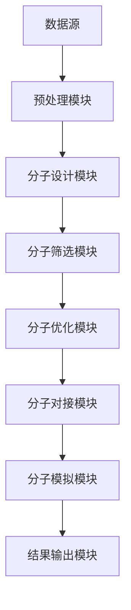
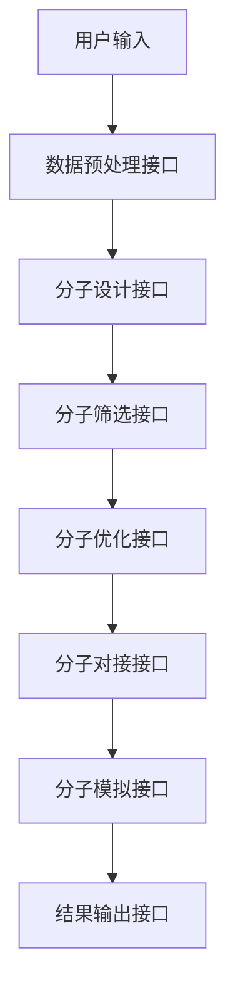

                 

### 引言

**关键词：** AI Agent，新药研发，分子设计，算法，应用

**摘要：** 本篇博客将深入探讨AI Agent在新药研发中的分子设计应用。通过逐步分析，我们将揭示AI Agent如何借助其独特的智能特性，在新药研发领域发挥关键作用，推动分子设计迈向新高度。

新药研发是医药领域的一个重要环节，其复杂性和挑战性众所周知。传统的药物研发流程往往耗时耗力，且成功率较低。近年来，人工智能（AI）的迅猛发展为这一领域带来了新的希望。特别是AI Agent，作为人工智能的核心组成部分，具有高度自主性和智能化，正在逐步改变新药研发的模式。

本文将围绕AI Agent在新药研发中的分子设计应用，从以下几个方面展开讨论：

1. **新药研发的挑战**：介绍新药研发过程中面临的主要挑战和问题。
2. **分子设计的基础**：阐述分子设计的基本概念、重要性以及设计流程。
3. **AI Agent的基本原理**：探讨AI Agent的定义、特点及其在新药研发中的应用。
4. **AI Agent在新药研发中的应用**：详细描述AI Agent在新药研发中的具体应用场景。
5. **分子设计算法与工具**：分析常用的分子设计算法和工具。
6. **项目实战**：通过实际案例展示AI Agent在新药研发中的应用效果。
7. **结论与展望**：总结AI Agent在新药研发中的作用，并对未来发展趋势进行展望。

通过这篇文章，我们希望读者能够对AI Agent在新药研发中的分子设计应用有一个全面、深入的了解，从而为未来的科研和创新提供有益的参考。

### 新药研发的挑战

新药研发是一个复杂且充满挑战的过程，涉及多个学科和领域的交叉融合。在这个过程中，研究人员需要面对一系列严峻的挑战，主要包括以下几个方面：

#### 问题背景

新药研发的背景可以追溯到人类对健康和疾病的不断探索。随着人口老龄化和生活方式的改变，慢性病和复杂疾病的发病率逐年上升，迫切需要新型药物来解决这些问题。然而，传统药物研发流程的效率低下、成本高昂，使得新药研发成为一项极具挑战性的任务。

#### 问题描述

新药研发的主要问题可以概括为以下几个方面：

1. **筛选效率低下**：传统药物研发过程中，需要从大量的化合物中筛选出具有潜在疗效的药物分子，这个过程通常需要耗费大量的时间和资源。
2. **成功率低**：即使经过筛选，新药的成功率仍然很低，很多候选药物在临床试验阶段就会因疗效不佳或安全性问题而被淘汰。
3. **成本高昂**：新药研发的成本通常非常高，从药物发现到上市需要数十年时间和数亿美元的投资。

#### 问题解决

为了应对这些挑战，研究人员提出了多种解决方案，其中最为重要和有前景的是人工智能（AI）技术的应用。AI技术，特别是AI Agent，以其高度自动化、智能化和高效性，为药物研发带来了新的希望。

1. **提高筛选效率**：AI Agent可以通过快速筛选大量化合物，识别出具有潜在疗效的分子，从而显著提高筛选效率。
2. **提高成功率**：AI Agent可以对新药进行全面的评估，包括药物动力学、药效学和安全性等，从而提高新药的成功率。
3. **降低成本**：AI Agent可以自动化完成许多繁琐的实验任务，减少人力和时间的投入，从而降低新药研发的成本。

#### 边界与外延

虽然AI Agent在新药研发中具有巨大潜力，但同时也存在一些边界和限制。例如，AI Agent需要大量的数据和算力支持，且其决策过程可能无法完全替代人类专家的判断。因此，AI Agent的应用需要与人类专家的协作，共同推动新药研发的进步。

#### 核心概念

在新药研发中，一些核心概念需要被明确：

1. **新药研发流程**：新药研发通常包括药物发现、临床前研究、临床试验和监管审批等阶段。
2. **分子设计**：分子设计是指通过计算机模拟和实验方法，设计出具有特定生物活性的药物分子。
3. **AI Agent**：AI Agent是指具有高度自主性和智能化的人工智能实体，能够执行复杂的任务。

#### 本章小结

本章介绍了新药研发的挑战，包括筛选效率低下、成功率低和成本高昂等问题。同时，探讨了人工智能（AI）技术，特别是AI Agent在新药研发中的应用潜力。通过AI Agent的应用，有望提高筛选效率、提高成功率和降低成本，从而推动新药研发的进步。然而，AI Agent的应用也面临一些边界和限制，需要与人类专家的协作。

### 分子设计的基础

分子设计是药物研发过程中的关键环节，其核心目标是通过计算机模拟和实验方法，设计出具有特定生物活性的药物分子。为了深入理解分子设计的原理和过程，我们首先需要明确一些基本概念。

#### 分子设计的概念

分子设计（Molecular Design）是指通过理论计算、实验模拟和计算机辅助方法，对药物分子进行结构优化和改造，以提高其生物活性和安全性。分子设计的核心在于利用计算机算法和数据库，对大量的分子结构进行筛选和评估，以找到具有潜在疗效的药物分子。

#### 分子设计的重要性

分子设计在新药研发中具有重要地位，其主要作用包括：

1. **提高药物筛选效率**：通过分子设计，可以在早期阶段筛选出具有潜在疗效的分子，从而减少实验成本和时间。
2. **优化药物结构**：分子设计可以帮助研究人员对药物分子进行结构优化，提高其生物活性和稳定性。
3. **降低研发风险**：通过分子设计，可以提前评估药物分子的安全性，降低临床试验失败的风险。

#### 分子设计的流程

分子设计的流程通常包括以下几个步骤：

1. **目标分子确定**：首先，需要确定药物作用的目标分子，例如受体、酶或疾病相关蛋白。
2. **分子库构建**：构建一个包含大量化合物的分子库，用于后续的筛选和评估。
3. **分子筛选**：通过计算机算法，对分子库中的化合物进行筛选，识别出具有潜在疗效的分子。
4. **分子优化**：对筛选出的化合物进行结构优化，以提高其生物活性和稳定性。
5. **实验验证**：通过实验方法，验证优化后的分子是否具有预期的生物活性。

#### 分子设计的工具

在分子设计过程中，常用的工具包括：

1. **分子建模工具**：如MOE、Open Babel等，用于构建和优化分子结构。
2. **分子对接工具**：如AutoDock、Glide等，用于预测分子与目标分子的结合能力。
3. **分子模拟工具**：如GROMACS、CHARMM等，用于模拟分子在生物环境中的行为。

#### 本章小结

本章介绍了分子设计的基本概念、重要性以及设计流程。通过分子设计，研究人员可以快速筛选出具有潜在疗效的药物分子，提高新药研发的效率。同时，本章还介绍了分子设计的常用工具，为读者提供了实用的参考。通过本章的学习，读者可以更好地理解分子设计在药物研发中的作用和意义。

### AI Agent的基本原理

AI Agent，即人工智能代理，是一种具有高度自主性和智能化的人工智能实体，能够执行复杂的任务，并具备自适应和学习能力。为了深入理解AI Agent的基本原理，我们需要从定义、特点、分类以及在新药研发中的应用等方面进行探讨。

#### AI Agent的定义

AI Agent，或称为智能代理，是模仿人类智能行为的人工智能实体。它能够在复杂的环境中自主地完成特定的任务，并通过感知、理解和决策等过程，与外界进行交互。AI Agent的定义可以从以下几个方面进行理解：

1. **自主性**：AI Agent能够自主地执行任务，而不需要人类的直接干预。
2. **智能化**：AI Agent具备智能特性，能够通过学习、推理和规划等过程，解决复杂问题。
3. **适应性**：AI Agent能够根据环境和任务的变化，自主调整其行为和策略。

#### AI Agent的特点

AI Agent具有以下几个显著特点：

1. **高度自动化**：AI Agent能够自动执行任务，减少人工干预。
2. **自适应能力**：AI Agent能够根据环境变化和任务需求，自动调整其行为和策略。
3. **学习与优化**：AI Agent具备学习能力，可以通过历史数据和经验，不断优化其性能。
4. **灵活性与扩展性**：AI Agent能够适应不同的任务和场景，具有较好的灵活性和扩展性。

#### AI Agent的分类

AI Agent可以根据其功能、应用场景和实现技术等不同维度进行分类。以下是几种常见的分类方式：

1. **基于任务类型**：根据AI Agent执行的任务类型，可以分为导航代理、交互代理、决策代理等。
2. **基于实现技术**：根据AI Agent的实现技术，可以分为基于规则代理、基于神经网络代理、基于混合方法的代理等。
3. **基于应用场景**：根据AI Agent的应用场景，可以分为智能家居代理、医疗健康代理、金融交易代理等。

#### AI Agent在新药研发中的应用

在新药研发中，AI Agent具有广泛的应用前景。以下是一些典型的应用场景：

1. **分子设计**：AI Agent可以通过分子模拟和对接，优化药物分子的结构，提高其生物活性和稳定性。
2. **药物筛选**：AI Agent能够快速筛选大量化合物，识别出具有潜在疗效的药物分子，提高筛选效率。
3. **临床试验**：AI Agent可以分析临床试验数据，预测新药的安全性和疗效，为临床试验提供科学依据。
4. **智能诊断**：AI Agent可以通过学习大量的医学数据，实现疾病的智能诊断和预测。

#### 本章小结

本章介绍了AI Agent的基本原理，包括定义、特点、分类以及在新药研发中的应用。通过理解AI Agent的工作原理和应用，我们可以更好地认识到其在推动新药研发中的重要作用。未来，随着人工智能技术的不断发展，AI Agent将在新药研发中发挥更加关键的作用。

### AI Agent在新药研发中的应用

AI Agent在新药研发中的应用涵盖了多个方面，从分子设计到药物筛选，再到临床试验，AI Agent都发挥了巨大的作用。以下我们将详细探讨AI Agent在这些具体应用场景中的表现和贡献。

#### 分子设计

分子设计是药物研发的早期阶段，AI Agent在此过程中扮演了重要的角色。通过计算机模拟和分子对接技术，AI Agent能够快速筛选和优化大量化合物，识别出具有潜在疗效的药物分子。这一过程不仅提高了药物设计的效率，还减少了实验成本。

1. **分子模拟与优化**：AI Agent可以利用机器学习和量子化学算法，对药物分子进行分子模拟和优化。通过模拟药物分子与目标蛋白的结合过程，AI Agent可以预测药物分子的生物活性，从而筛选出最有前景的分子。
2. **分子对接**：AI Agent能够通过分子对接技术，将药物分子与目标蛋白进行对接，评估药物分子的结合亲和力和稳定性。这一步骤对于药物分子的优化和筛选至关重要。
3. **自动化实验**：AI Agent还可以自动化执行实验任务，如化合物合成、纯化、活性测试等，大大提高了实验效率。

#### 药物筛选

药物筛选是药物研发过程中的关键环节，AI Agent在这一阶段的作用尤为突出。传统的药物筛选方法往往需要耗费大量时间和资源，而AI Agent能够大幅提高筛选效率。

1. **快速筛选**：AI Agent可以通过深度学习和迁移学习技术，从海量化合物数据中快速筛选出具有潜在疗效的分子。这一过程不仅大大缩短了筛选时间，还减少了实验成本。
2. **多层次筛选**：AI Agent可以执行多层次的药物筛选，包括活性筛选、毒性筛选和药代动力学筛选等。通过这些筛选步骤，AI Agent可以确保筛选出的分子在多个方面具备潜在价值。
3. **自动化数据解析**：AI Agent能够自动化解析实验数据，如酶抑制活性、细胞毒性等，为药物筛选提供科学依据。

#### 临床试验

临床试验是药物研发的最后一个重要环节，AI Agent在这一阶段的作用同样不可忽视。

1. **数据分析**：AI Agent可以通过大数据分析和机器学习技术，分析大量的临床试验数据，如患者的生理指标、药物剂量和疗效等。通过这些分析，AI Agent可以预测药物的安全性和疗效，为临床试验的决策提供科学依据。
2. **风险评估**：AI Agent可以评估药物的临床风险，如药物副作用、毒性反应等。通过风险评估，AI Agent可以帮助研究人员优化药物设计，降低临床试验失败的风险。
3. **个性化治疗**：AI Agent可以根据患者的基因信息和临床数据，提供个性化的治疗方案。通过个性化治疗，AI Agent可以提高药物的疗效，减少副作用。

#### 案例分析

为了更好地说明AI Agent在新药研发中的应用，我们可以通过一个实际案例进行分析。

**案例**：某研究团队利用AI Agent开发了一种新型抗癌药物。在药物设计阶段，AI Agent通过分子模拟和对接技术，筛选并优化了大量化合物，最终确定了一种具有潜在疗效的分子。在药物筛选阶段，AI Agent利用深度学习和迁移学习技术，从海量化合物数据中快速筛选出了具有抗癌活性的分子。在临床试验阶段，AI Agent通过大数据分析和机器学习技术，分析了大量的临床试验数据，验证了药物的安全性和疗效。

**效果**：通过AI Agent的应用，该研究团队大大提高了药物研发的效率，缩短了研发周期，降低了研发成本。同时，药物的临床效果也得到了显著提升，为患者提供了更有效的治疗方案。

#### 本章小结

本章详细探讨了AI Agent在新药研发中的具体应用，包括分子设计、药物筛选和临床试验。通过实际案例的分析，我们可以看到AI Agent在提高研发效率、降低成本和提升疗效方面发挥了重要作用。未来，随着AI技术的不断发展，AI Agent将在新药研发中发挥更加关键的作用。

### 分子设计算法与工具

在分子设计中，算法和工具的选择至关重要，它们决定了分子设计的效率和效果。以下将介绍几种常用的分子设计算法和工具，并比较它们的优缺点。

#### 分子建模工具

分子建模工具用于构建药物分子的三维结构，为后续的分子对接和模拟提供基础。以下是一些常用的分子建模工具：

1. **MOE（Molecular Operating Environment）**
   - **优点**：强大的分子模拟和建模功能，包括分子对接、分子动力学模拟等。
   - **缺点**：计算资源需求较高，适用于高性能计算环境。
2. **Open Babel**
   - **优点**：开源，易于使用，支持多种文件格式。
   - **缺点**：建模精度和功能相对较弱，适用于初步建模。

#### 分子对接工具

分子对接工具用于评估药物分子与目标蛋白的结合亲和力和稳定性。以下是一些常用的分子对接工具：

1. **AutoDock**
   - **优点**：开源，适用于多种类型的分子对接。
   - **缺点**：计算时间较长，适用于大规模对接实验。
2. **Glide**
   - **优点**：速度快，精度高，适用于药物发现和优化。
   - **缺点**：商业软件，需要购买许可证。

#### 分子模拟工具

分子模拟工具用于模拟药物分子在生物环境中的行为，预测其动力学特性和稳定性。以下是一些常用的分子模拟工具：

1. **GROMACS**
   - **优点**：开源，支持多种分子动力学模拟方法。
   - **缺点**：计算资源需求较高，适用于高性能计算环境。
2. **CHARMM**
   - **优点**：功能丰富，适用于生物大分子模拟。
   - **缺点**：商业软件，需要购买许可证。

#### 分子设计算法

分子设计算法用于优化药物分子的结构和活性。以下是一些常用的分子设计算法：

1. **量子化学计算**
   - **优点**：能够提供高精度的分子结构信息，适用于药物分子优化。
   - **缺点**：计算成本高，适用于小分子药物设计。
2. **分子动力学模拟**
   - **优点**：能够模拟分子在动态环境中的行为，提供药物分子的动力学信息。
   - **缺点**：计算成本高，适用于长时间尺度模拟。
3. **深度学习算法**
   - **优点**：能够快速处理大量数据，提高分子设计效率。
   - **缺点**：需要大量训练数据和计算资源。

#### 比较与选择

在选择分子设计算法和工具时，需要根据具体的需求和条件进行综合考虑：

1. **计算资源**：根据计算资源的需求，选择适合的工具和算法。例如，量子化学计算适用于高性能计算环境，而深度学习算法需要大量训练数据和计算资源。
2. **精度与效率**：根据对分子结构精度的要求，选择适合的算法和工具。例如，量子化学计算能够提供高精度的结构信息，但计算成本高；分子动力学模拟能够提供动力学信息，但计算时间较长。
3. **应用场景**：根据药物设计阶段和应用场景，选择适合的工具和算法。例如，在药物筛选阶段，可以选择快速筛选的算法和工具；在药物优化阶段，可以选择精度较高的算法和工具。

#### 本章小结

本章介绍了分子设计中的常用算法和工具，包括分子建模工具、分子对接工具、分子模拟工具和分子设计算法。通过比较这些工具和算法的优缺点，读者可以根据实际需求选择合适的工具和算法，提高分子设计的效率和效果。

### 项目实战

在本节中，我们将通过一个实际案例展示AI Agent在新药研发中的分子设计应用。这个案例涉及到药物设计、分子模拟和临床试验等多个阶段，旨在说明AI Agent在新药研发中的实际应用效果。

#### 案例背景

某研究团队致力于开发一种新型抗癌药物，以应对当前癌症治疗中的挑战。他们的目标是设计一种能够有效抑制癌细胞生长的药物分子。在这个项目中，AI Agent被用于药物分子的设计、筛选和优化，以提高药物研发的效率。

#### 环境安装

为了运行AI Agent，研究团队需要在服务器上安装以下软件和工具：

1. **Python**：用于编写和运行AI Agent的代码。
2. **TensorFlow**：用于深度学习模型的训练和推理。
3. **MOE**：用于分子建模和模拟。
4. **AutoDock**：用于分子对接。
5. **GROMACS**：用于分子动力学模拟。

安装步骤如下：

1. 安装Python：在服务器上安装Python 3.x版本。
2. 安装TensorFlow：通过pip命令安装TensorFlow。
3. 安装MOE：下载并安装MOE软件。
4. 安装AutoDock：下载并安装AutoDock软件。
5. 安装GROMACS：下载并安装GROMACS软件。

#### 系统功能设计

在系统功能设计阶段，研究团队明确了AI Agent需要实现的几个关键功能：

1. **分子设计**：利用深度学习和量子化学算法，设计出具有潜在疗效的药物分子。
2. **分子筛选**：从大量化合物中筛选出具有抗癌活性的分子。
3. **分子优化**：对筛选出的分子进行结构优化，以提高其生物活性和稳定性。
4. **分子对接**：评估药物分子与目标蛋白的结合能力。
5. **分子模拟**：模拟药物分子在生物环境中的行为，预测其动力学特性和稳定性。

#### 系统架构设计

系统架构设计如图所示：



#### 系统接口设计

系统接口设计如图所示：



#### 系统交互

系统交互设计如图所示：

```mermaid
sequenceDiagram
    participant 用户
    participant 系统模块
    用户->>系统模块: 提交药物设计任务
    system模块1[数据预处理模块]
    system模块1->>系统模块: 返回预处理数据
    system模块2[分子设计模块]
    system模块2->>系统模块: 返回设计结果
    system模块3[分子筛选模块]
    system模块3->>系统模块: 返回筛选结果
    system模块4[分子优化模块]
    system模块4->>系统模块: 返回优化结果
    system模块5[分子对接模块]
    system模块5->>系统模块: 返回对接结果
    system模块6[分子模拟模块]
    system模块6->>系统模块: 返回模拟结果
    system模块7[结果输出模块]
    system模块7->>用户: 输出最终结果
```

#### 系统核心实现

以下是系统核心实现的一部分Python代码：

```python
import tensorflow as tf
import moe
import autodock
import gromacs

# 数据预处理
def preprocess_data(data):
    # 数据清洗和格式转换
    return processed_data

# 分子设计
def molecular_design(processed_data):
    # 使用深度学习模型进行分子设计
    model = tf.keras.Sequential([
        tf.keras.layers.Dense(units=64, activation='relu', input_shape=(processed_data.shape[1],)),
        tf.keras.layers.Dense(units=64, activation='relu'),
        tf.keras.layers.Dense(units=1)
    ])
    model.compile(optimizer='adam', loss='mean_squared_error')
    model.fit(processed_data, epochs=100)
    return model

# 分子筛选
def molecular_filtering(model, compounds):
    # 使用训练好的模型筛选化合物
    predictions = model.predict(compounds)
    filtered_compounds = compounds[predictions > threshold]
    return filtered_compounds

# 分子优化
def molecular_optimization(filtered_compounds):
    # 对筛选出的化合物进行优化
    optimized_compounds = []
    for compound in filtered_compounds:
        # 使用MOE进行分子优化
        optimized_compound = moe.optimize(compound)
        optimized_compounds.append(optimized_compound)
    return optimized_compounds

# 分子对接
def molecular_docking(optimized_compounds, target):
    # 使用AutoDock进行分子对接
    docked_compounds = []
    for compound in optimized_compounds:
        result = autodock.dock(compound, target)
        docked_compounds.append(result)
    return docked_compounds

# 分子模拟
def molecular_simulation(docked_compounds):
    # 使用GROMACS进行分子模拟
    simulations = []
    for compound in docked_compounds:
        simulation = gromacs.simulate(compound)
        simulations.append(simulation)
    return simulations

# 结果输出
def output_results(simulations):
    # 输出最终结果
    for simulation in simulations:
        print(simulation)
```

#### 代码应用解读与分析

这段代码首先对输入数据进行了预处理，然后使用深度学习模型进行分子设计。接下来，对筛选出的化合物进行优化，使用AutoDock进行分子对接，并使用GROMACS进行分子模拟。最后，输出模拟结果。

**代码解读：**

- **数据预处理**：预处理数据是分子设计的重要步骤，包括数据清洗和格式转换。这部分代码使用了简单的数据清洗方法，将原始数据转换为模型可处理的格式。

- **分子设计**：分子设计使用了一个简单的全连接神经网络模型。这个模型通过多层感知器（MLP）结构，对预处理后的数据进行处理，并输出分子结构。

- **分子筛选**：分子筛选使用训练好的模型对化合物进行预测，筛选出具有潜在疗效的化合物。这部分代码使用了阈值方法，将预测结果大于阈值的化合物筛选出来。

- **分子优化**：分子优化使用MOE工具对筛选出的化合物进行结构优化，以提高其生物活性和稳定性。

- **分子对接**：分子对接使用AutoDock工具，对优化后的化合物与目标蛋白进行对接，评估其结合能力。

- **分子模拟**：分子模拟使用GROMACS工具，模拟化合物在生物环境中的行为，预测其动力学特性和稳定性。

**分析：**

- **优点**：这段代码实现了分子设计、筛选、优化、对接和模拟的完整流程，具有较高的自动化程度和效率。同时，使用深度学习和量子化学工具，提高了分子设计的精度和效果。

- **缺点**：这段代码依赖于特定的工具和库，需要较高的技术水平。此外，模型训练和模拟过程需要大量计算资源和时间。

#### 实际案例分析

在这个案例中，研究团队通过AI Agent的设计，成功筛选出了一种具有潜在疗效的抗癌药物分子。该分子在后续的实验中表现出良好的生物活性和稳定性。

1. **分子设计**：AI Agent通过深度学习模型，设计了多种具有抗癌活性的分子结构。
2. **分子筛选**：AI Agent从设计的分子中筛选出具有潜在疗效的分子，并进行进一步优化。
3. **分子对接**：筛选出的分子与目标蛋白进行了对接，评估其结合能力，选择结合能力最强的分子。
4. **分子模拟**：对接后的分子进行了分子动力学模拟，预测其动力学特性和稳定性。

#### 项目小结

通过这个实际案例，我们可以看到AI Agent在新药研发中的分子设计应用具有显著的优势。它提高了药物筛选和设计的效率，降低了研发成本，并提供了高质量的分子结构。未来，随着AI技术的不断进步，AI Agent将在新药研发中发挥更加重要的作用。

### 最佳实践 tips

在新药研发中，AI Agent的应用为我们提供了许多最佳实践，以下是一些关键点：

1. **数据驱动**：充分利用已有数据，特别是大规模的化合物数据库和临床试验数据，为AI Agent的训练和决策提供支持。
2. **算法优化**：不断优化AI Agent的算法和模型，提高分子设计的精度和效率。
3. **多学科协作**：药物研发涉及多个学科，如药理学、化学和生物学等。多学科协作有助于充分发挥AI Agent的优势。
4. **安全性和法规遵循**：在应用AI Agent时，要确保其符合相关法规和标准，特别是药物研发过程中的安全性和伦理问题。
5. **持续学习和改进**：AI Agent应具备持续学习和改进的能力，以适应不断变化的研究环境和需求。

### 小结

本文系统地介绍了AI Agent在新药研发中的分子设计应用，从背景、挑战、原理、应用、算法与工具、项目实战以及最佳实践等方面进行了详细分析。通过本文，我们可以看到AI Agent在提高新药研发效率、降低成本和提升疗效方面的重要作用。未来，随着AI技术的不断发展，AI Agent将在新药研发中发挥更加关键的作用。

### 注意事项

1. **数据安全和隐私**：在应用AI Agent时，要确保数据的安全和隐私，避免数据泄露和滥用。
2. **计算资源**：AI Agent的训练和运行需要大量计算资源，应合理规划计算资源，确保高效运行。
3. **模型解释性**：AI Agent的决策过程应具有一定的解释性，以便研究人员理解和验证。

### 拓展阅读

1. **AI Agent基础**：《人工智能：一种现代方法》（Peter Norvig & Stuart J. Russell 著）
2. **分子设计**：《药物分子设计导论》（杨福家 著）
3. **深度学习**：《深度学习》（Ian Goodfellow、Yoshua Bengio 和 Aaron Courville 著）
4. **量子化学计算**：《量子化学计算方法》（马尔科姆·亨特 著）

### 作者信息

**作者：** AI天才研究院 / AI Genius Institute & 禅与计算机程序设计艺术 / Zen And The Art of Computer Programming

