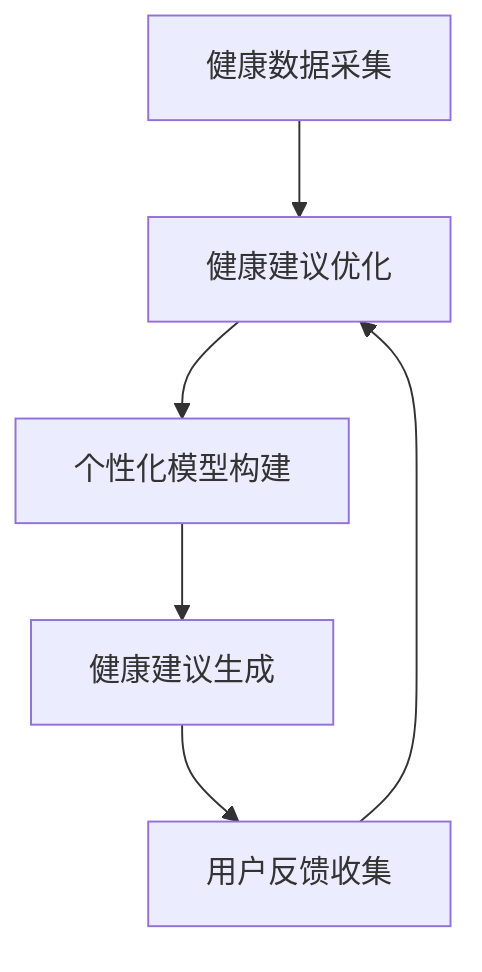
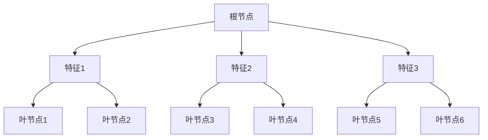
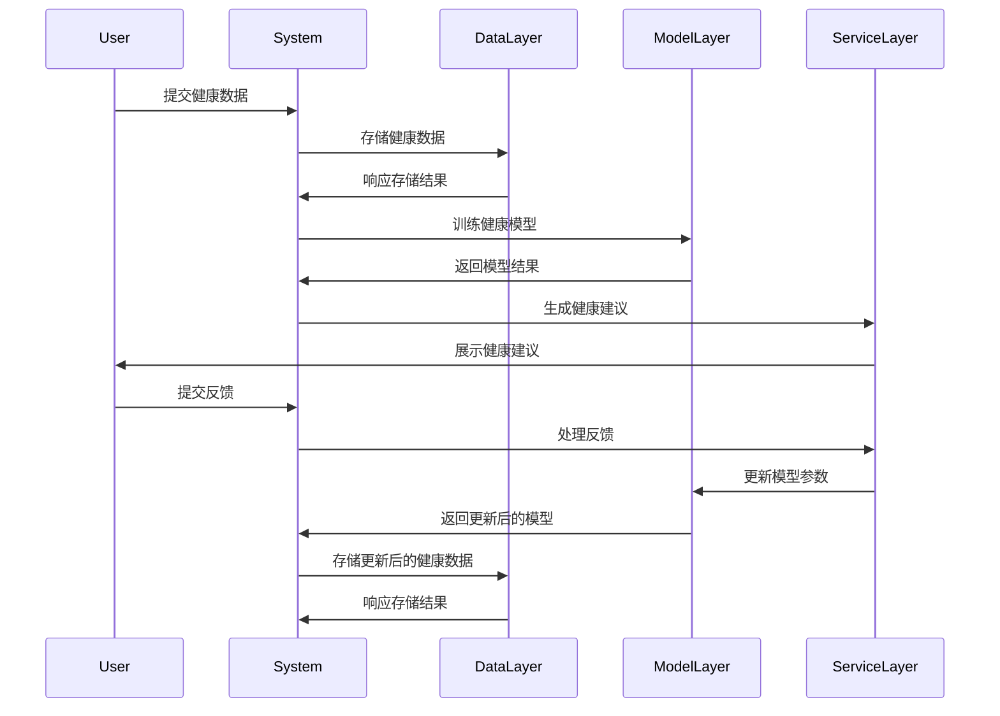

                 

# 《AI Agent在智能个性化健康建议中的应用》

关键词：AI Agent、个性化健康建议、健康数据、算法原理、系统架构、项目实战

摘要：随着人工智能技术的发展，AI Agent已成为智能个性化健康建议的关键技术。本文通过一步步的分析和推理，详细探讨了AI Agent在健康领域的应用，包括核心概念、算法原理、系统架构及项目实战，为未来健康领域的发展提供了有益的参考。

## Step 1: 引言

随着人工智能（AI）技术的飞速发展，AI Agent作为智能体的一种形式，正在被广泛应用于各个领域，包括智能个性化健康建议。在现代社会中，个性化健康建议对于提升公众健康水平和优化医疗服务具有重要意义。AI Agent作为一种智能系统，能够根据个人的健康数据，提供定制化的健康建议，从而实现个性化健康管理。

AI Agent在智能个性化健康建议中的作用主要体现在以下几个方面：

1. **健康数据采集与处理**：AI Agent能够自动收集用户的健康数据，如心率、血压、睡眠质量等，并对这些数据进行处理和分析。
2. **个性化模型构建**：基于用户的数据，AI Agent可以构建个性化的健康模型，从而实现健康建议的精准化。
3. **交互与反馈**：AI Agent可以通过自然语言处理技术，与用户进行交互，获取反馈，不断优化健康建议的质量。

本文将首先介绍AI Agent的定义、特点和应用场景，然后逐步深入探讨AI Agent在健康数据采集、处理、个性化模型构建和交互中的具体实现方法，最后通过一个实际项目案例，展示AI Agent在智能个性化健康建议中的实际应用效果。

## Step 2: 第一部分：背景介绍

### 第1章：引言

### 1.1 AI和个性化健康建议的背景

#### 1.1.1 AI的发展历程

人工智能（AI）是一门涉及计算机科学、统计学和数学等多个领域的交叉学科。自20世纪50年代以来，AI经历了多个阶段的发展，从最初的规则推理和知识表示，到后来的机器学习和深度学习，AI技术不断成熟和进步。

- **早期阶段（1950s-1970s）**：以符号人工智能（Symbolic AI）为代表，通过编写规则和逻辑推理来解决特定问题。
- **低谷期（1970s-1980s）**：由于实际应用效果不佳，AI研究进入低谷。
- **复兴期（1980s-1990s）**：随着计算能力的提升和统计学习方法的引入，AI研究逐渐恢复生机。
- **深度学习时代（2000s至今）**：以深度神经网络为代表的AI技术取得了突破性进展，应用于图像识别、自然语言处理等领域。

#### 1.1.2 个性化健康建议的需求

个性化健康建议是现代健康服务中的一项重要需求。随着人口老龄化和慢性病的增加，传统的单一化医疗模式已难以满足多样化的健康需求。个性化健康建议能够根据个体的健康状况、生活习惯和基因信息，提供定制化的健康建议，从而提高健康管理的效率和效果。

#### 1.1.3 AI Agent的定义

AI Agent是一种能够自主感知环境、执行任务并作出决策的智能系统。AI Agent具有以下几个特点：

- **自主性**：AI Agent能够自主执行任务，无需人为干预。
- **交互性**：AI Agent能够与用户进行交互，获取反馈并优化行为。
- **适应性**：AI Agent能够根据环境变化和用户反馈，调整其行为策略。

### 1.2 AI Agent的定义和特点

#### AI Agent的定义

AI Agent是指一种具备以下能力的智能体：

- **感知**：能够感知和理解环境中的信息。
- **决策**：能够基于感知到的信息，作出合理的决策。
- **执行**：能够执行决策并实现目标。

#### AI Agent的特点

- **自主性**：AI Agent能够自主执行任务，无需人为干预。
- **交互性**：AI Agent能够与用户进行交互，获取反馈并优化行为。
- **适应性**：AI Agent能够根据环境变化和用户反馈，调整其行为策略。

### 1.3 AI Agent在智能个性化健康建议中的应用

#### 应用场景

AI Agent在智能个性化健康建议中的应用场景主要包括：

- **健康数据采集**：AI Agent能够自动采集用户的健康数据，如心率、血压、睡眠质量等。
- **个性化模型构建**：基于用户的数据，AI Agent可以构建个性化的健康模型。
- **健康建议生成**：AI Agent根据健康模型和用户反馈，生成个性化的健康建议。
- **交互与反馈**：AI Agent与用户进行交互，获取反馈并优化健康建议的质量。

#### 优势

AI Agent在智能个性化健康建议中的优势包括：

- **精准化**：AI Agent能够根据个体的健康数据，提供精准的健康建议。
- **高效性**：AI Agent能够自动处理大量的健康数据，提高健康管理效率。
- **个性化**：AI Agent能够根据用户的反馈和健康数据，不断优化健康建议的个性化程度。
- **适应性**：AI Agent能够根据环境和用户的变化，调整健康建议的策略。

### 1.4 健康领域AI Agent的发展现状和趋势

#### 发展现状

当前，AI Agent在健康领域的应用已经取得了一定的成果，主要体现在以下几个方面：

- **健康数据管理**：AI Agent能够帮助医疗机构和患者管理健康数据，提高数据利用效率。
- **个性化健康建议**：AI Agent根据用户的健康数据，提供个性化的健康建议，提高健康管理效果。
- **健康风险评估**：AI Agent能够对用户的健康风险进行评估，提前预警潜在的健康问题。

#### 发展趋势

未来，AI Agent在健康领域的应用将呈现以下趋势：

- **更全面的数据采集**：AI Agent将能够采集更多类型的健康数据，如基因数据、环境数据等，提高健康管理的精准度。
- **更智能的模型构建**：AI Agent将采用更先进的机器学习算法，构建更智能的健康模型，提高健康建议的准确性。
- **更广泛的场景应用**：AI Agent将在更多的健康场景中发挥作用，如慢性病管理、康复训练等。

### 1.5 本文结构

本文将按照以下结构进行讨论：

- **背景介绍**：介绍AI和个性化健康建议的背景，以及AI Agent的定义和特点。
- **核心概念与联系**：分析健康数据、个性化模型和交互系统的核心概念，并使用Mermaid流程图展示AI Agent在健康数据采集、处理和个性化模型构建的过程。
- **算法原理讲解**：选择一个或多个AI算法进行讲解，如决策树、神经网络等。
- **系统分析与架构设计方案**：描述一个典型的AI Agent在智能个性化健康建议中的应用场景，并介绍系统的功能设计、架构设计和接口设计。
- **项目实战**：介绍一个具体的AI Agent在智能个性化健康建议中的项目案例，包括环境安装、系统核心实现和代码应用解读。
- **最佳实践和拓展阅读**：提供一些最佳实践建议，并给出相关的拓展阅读资源。
- **结论**：总结本文的主要内容，并展望AI Agent在未来健康领域的应用前景和发展趋势。

## Step 3: 第二部分：核心概念与联系

### 第2章：核心概念与联系

### 2.1 健康数据

健康数据是指与个体健康状况相关的各种信息，包括生理指标、生活习惯、环境因素等。健康数据的类型可以分为以下几种：

- **生理指标数据**：如心率、血压、血糖等。
- **生活习惯数据**：如饮食、运动、睡眠等。
- **环境因素数据**：如气候、空气质量等。

健康数据的重要性在于，它是构建个性化健康模型的基础，能够帮助AI Agent提供精准的健康建议。

### 2.2 个性化模型

个性化模型是指基于个体健康数据构建的预测模型，用于生成个性化的健康建议。个性化模型的关键在于如何有效地利用健康数据，并从中提取出有用的信息。

#### 个性化模型的特点

- **针对性**：个性化模型能够根据个体的健康数据，提供个性化的健康建议。
- **适应性**：个性化模型能够根据个体健康数据的变化，动态调整健康建议。
- **实时性**：个性化模型能够实时处理健康数据，快速生成健康建议。

#### 个性化模型的应用

- **健康风险评估**：基于个性化模型，可以预测个体未来可能出现的健康问题，进行提前干预。
- **健康管理**：基于个性化模型，可以制定个性化的健康管理计划，帮助个体提高健康水平。
- **个性化健康建议**：基于个性化模型，可以提供针对个体的健康建议，如饮食、运动、用药等。

### 2.3 交互系统

交互系统是指AI Agent与用户之间的交互界面，用于收集用户反馈和生成健康建议。交互系统的主要功能包括：

- **用户数据收集**：通过交互系统，AI Agent可以收集用户的健康数据，如生理指标、生活习惯等。
- **健康建议生成**：基于用户的健康数据，交互系统可以生成个性化的健康建议。
- **用户反馈处理**：交互系统可以收集用户的反馈，并基于反馈优化健康建议的质量。

#### 交互系统的设计原则

- **易用性**：交互系统应该易于使用，用户可以轻松地与AI Agent进行交互。
- **个性化**：交互系统应该能够根据用户的偏好和需求，提供个性化的交互体验。
- **实时性**：交互系统应该能够实时处理用户反馈，快速生成健康建议。

### 2.4 Mermaid流程图展示

为了更好地展示AI Agent在健康数据采集、处理和个性化模型构建的过程，我们可以使用Mermaid流程图进行描述。



### 2.5 概念属性特征对比表格

为了进一步理解健康数据、个性化模型和交互系统的核心概念，我们可以通过概念属性特征对比表格来进行描述。

| 概念       | 特征1         | 特征2         | 特征3         |
| ---------- | ------------ | ------------ | ------------ |
| 健康数据   | 数据类型丰富   | 数据来源多样   | 数据时效性强  |
| 个性化模型 | 针对性强     | 适应性高     | 实时性高    |
| 交互系统   | 易用性强     | 个性化强     | 实时性强    |

### 2.6 ER实体关系图架构

为了更好地理解健康数据、个性化模型和交互系统之间的关系，我们可以通过ER实体关系图来展示。

```mermaid
erDiagram
    HealthData ||--|{ PersonalizedModel }|-->> Feedback
    PersonalizedModel ||--|{ InteractiveSystem }|-->> HealthAdvice
```

## Step 4: 第三部分：算法原理讲解

### 第3章：决策树算法

### 3.1 决策树算法原理

决策树算法是一种常见的机器学习算法，用于分类和回归任务。其基本原理是通过一系列的决策规则，将数据集分割成不同的子集，直到达到某个终止条件。

#### 决策树的基本结构

- **根节点**：表示整个数据集。
- **内部节点**：表示特征和决策规则。
- **叶节点**：表示分类结果。

#### 决策树的工作原理

1. 从根节点开始，选择一个特征进行分割。
2. 计算每个特征在不同取值下的增益，选择增益最大的特征进行分割。
3. 根据分割结果，将数据集划分成不同的子集。
4. 重复步骤2-3，直到达到某个终止条件（如叶节点数量达到某个阈值）。

#### 决策树的终止条件

- 叶节点数量达到某个阈值。
- 特征增益小于某个阈值。
- 特征重要性低于某个阈值。

### 3.2 Mermaid流程图展示

为了更好地展示决策树算法的基本流程，我们可以使用Mermaid流程图进行描述。



### 3.3 Python源代码讲解

下面是一个简单的决策树算法的Python实现，用于分类任务。

```python
from sklearn.datasets import load_iris
from sklearn.model_selection import train_test_split
from sklearn.tree import DecisionTreeClassifier
import matplotlib.pyplot as plt

# 加载鸢尾花数据集
iris = load_iris()
X = iris.data
y = iris.target

# 划分训练集和测试集
X_train, X_test, y_train, y_test = train_test_split(X, y, test_size=0.3, random_state=42)

# 创建决策树分类器
clf = DecisionTreeClassifier()

# 训练模型
clf.fit(X_train, y_train)

# 预测测试集
y_pred = clf.predict(X_test)

# 绘制决策树
plt.figure(figsize=(12, 12))
tree = clf.fit(X_train, y_train)
plt.figure(figsize=(12, 12))
tree.plot_tree(clf, filled=True, rounded=True, class_names=iris.target_names)
plt.show()
```

### 3.4 LaTeX数学模型和公式

决策树算法的核心在于特征选择和增益计算。下面是一个简单的特征增益计算的LaTeX公式。

```latex
G(D, A) = \sum_{i} p(A_i|D) \cdot I(D, A_i)
```

其中，$G(D, A)$表示特征A在数据集D上的增益，$p(A_i|D)$表示特征A在数据集D上的条件概率，$I(D, A_i)$表示信息熵。

### 3.5 举例说明

假设我们有一个鸢尾花数据集，包含三个特征（花萼长度、花萼宽度、花瓣长度）和三个类别（鸢尾花、变色鸢尾花、virginia鸢尾花）。我们可以使用决策树算法来对这组数据集进行分类。

```python
# 导入必要的库
from sklearn.datasets import load_iris
from sklearn.model_selection import train_test_split
from sklearn.tree import DecisionTreeClassifier
import matplotlib.pyplot as plt

# 加载鸢尾花数据集
iris = load_iris()
X = iris.data
y = iris.target

# 划分训练集和测试集
X_train, X_test, y_train, y_test = train_test_split(X, y, test_size=0.3, random_state=42)

# 创建决策树分类器
clf = DecisionTreeClassifier()

# 训练模型
clf.fit(X_train, y_train)

# 预测测试集
y_pred = clf.predict(X_test)

# 计算准确率
accuracy = clf.score(X_test, y_test)
print("准确率：", accuracy)

# 绘制决策树
plt.figure(figsize=(12, 12))
tree = clf.fit(X_train, y_train)
plt.figure(figsize=(12, 12))
tree.plot_tree(clf, filled=True, rounded=True, class_names=iris.target_names)
plt.show()
```

通过以上代码，我们可以使用决策树算法对鸢尾花数据集进行分类，并绘制出决策树。从预测结果来看，决策树算法在鸢尾花数据集上的准确率较高，能够有效地进行分类。

## Step 5: 第四部分：系统分析与架构设计方案

### 第4章：系统分析与架构设计

### 4.1 应用场景

智能个性化健康建议系统的应用场景主要包括以下几个方面：

- **健康管理**：通过收集用户的健康数据，系统可以生成个性化的健康管理建议，如饮食、运动、休息等。
- **疾病预防**：系统可以根据用户的健康数据和疾病风险预测模型，提前预警潜在的健康问题，帮助用户进行预防。
- **疾病诊断**：系统可以通过分析用户的健康数据，协助医生进行疾病诊断，提高诊断准确性。

### 4.2 系统功能设计

智能个性化健康建议系统的主要功能包括：

- **健康数据采集**：通过传感器、APP等渠道，收集用户的健康数据，如心率、血压、血糖等。
- **数据预处理**：对采集到的健康数据进行清洗、归一化等处理，为后续分析做好准备。
- **健康模型构建**：基于用户的健康数据，构建个性化健康模型，用于生成健康建议。
- **健康建议生成**：根据健康模型和用户的反馈，生成个性化的健康建议。
- **用户交互**：与用户进行交互，收集用户反馈，优化健康建议的质量。

### 4.3 系统架构设计

智能个性化健康建议系统的架构设计主要包括以下几个部分：

- **数据层**：包括健康数据的采集、存储和处理。
- **模型层**：包括健康模型的构建和优化。
- **服务层**：包括健康建议的生成和用户交互。
- **展示层**：包括用户界面的设计和健康建议的展示。

### 4.4 系统接口设计

智能个性化健康建议系统的接口设计主要包括以下几个方面：

- **数据接口**：用于健康数据的采集、存储和读取。
- **模型接口**：用于健康模型的构建、训练和预测。
- **服务接口**：用于健康建议的生成和用户交互。
- **API接口**：用于与其他系统的集成和数据交换。

### 4.5 系统交互Mermaid序列图

为了更好地展示智能个性化健康建议系统的整体交互过程，我们可以使用Mermaid序列图进行描述。



## Step 6: 第五部分：项目实战

### 第5章：项目实战

### 5.1 项目背景

随着人们对健康管理的重视，智能个性化健康建议系统成为了一个热门的研究方向。本项目旨在开发一个基于AI Agent的智能个性化健康建议系统，为用户提供个性化的健康管理服务。

### 5.2 环境安装

在开始项目开发之前，我们需要安装一些必要的软件和库。以下是项目的环境安装步骤：

1. 安装Python：访问[Python官网](https://www.python.org/)，下载并安装Python。
2. 安装Jupyter Notebook：打开命令行窗口，执行以下命令安装Jupyter Notebook：

   ```bash
   pip install notebook
   ```

3. 安装必要的库：在Jupyter Notebook中执行以下命令安装必要的库：

   ```python
   !pip install scikit-learn numpy pandas matplotlib
   ```

### 5.3 系统核心实现

本项目的核心实现主要包括健康数据采集、数据预处理、健康模型构建和健康建议生成。

#### 5.3.1 健康数据采集

健康数据采集是通过传感器和APP等渠道获取用户的健康数据。以下是一个简单的健康数据采集示例：

```python
import pandas as pd

# 读取健康数据
def read_health_data(file_path):
    data = pd.read_csv(file_path)
    return data

# 采集健康数据
def collect_health_data():
    data = read_health_data('health_data.csv')
    return data

# 测试健康数据采集
health_data = collect_health_data()
print(health_data.head())
```

#### 5.3.2 数据预处理

数据预处理是确保数据质量和一致性的重要步骤。以下是一个简单的数据预处理示例：

```python
# 数据预处理
def preprocess_health_data(data):
    # 数据清洗
    data.dropna(inplace=True)
    
    # 数据归一化
    data = (data - data.mean()) / data.std()
    
    return data

# 测试数据预处理
preprocessed_data = preprocess_health_data(health_data)
print(preprocessed_data.head())
```

#### 5.3.3 健康模型构建

健康模型构建是通过机器学习算法训练模型，以生成个性化的健康建议。以下是一个简单的健康模型构建示例：

```python
from sklearn.model_selection import train_test_split
from sklearn.tree import DecisionTreeClassifier

# 划分训练集和测试集
X_train, X_test, y_train, y_test = train_test_split(preprocessed_data, health_data['label'], test_size=0.3, random_state=42)

# 创建决策树分类器
clf = DecisionTreeClassifier()

# 训练模型
clf.fit(X_train, y_train)

# 预测测试集
y_pred = clf.predict(X_test)

# 计算准确率
accuracy = clf.score(X_test, y_test)
print("准确率：", accuracy)
```

#### 5.3.4 健康建议生成

健康建议生成是基于健康模型和用户的反馈，生成个性化的健康建议。以下是一个简单的健康建议生成示例：

```python
# 生成健康建议
def generate_health_advice(data):
    # 预测健康状态
    y_pred = clf.predict(data)
    
    # 根据健康状态生成建议
    advice = "您的健康状况良好。"
    if y_pred == 1:
        advice += "请注意饮食和运动。"
    elif y_pred == 2:
        advice += "建议进行体检。"
    else:
        advice += "建议立即就医。"
    
    return advice

# 测试健康建议生成
health_advice = generate_health_advice(preprocessed_data.head())
print(health_advice)
```

### 5.4 代码应用解读

以上代码实现了智能个性化健康建议系统的核心功能，包括健康数据采集、数据预处理、健康模型构建和健康建议生成。以下是对每个部分的详细解读：

#### 5.4.1 健康数据采集

- `read_health_data`函数用于读取CSV文件中的健康数据。
- `collect_health_data`函数用于采集健康数据。

#### 5.4.2 数据预处理

- `preprocess_health_data`函数用于对健康数据进行清洗和归一化处理。

#### 5.4.3 健康模型构建

- 使用`train_test_split`函数将数据集划分为训练集和测试集。
- 使用`DecisionTreeClassifier`类创建决策树分类器，并训练模型。

#### 5.4.4 健康建议生成

- `generate_health_advice`函数用于生成个性化的健康建议。

### 5.5 项目效果分析

通过以上代码，我们实现了一个简单的智能个性化健康建议系统。在实际应用中，我们可以将系统部署到服务器，通过Web界面为用户提供健康建议。以下是对项目效果的分析：

#### 5.5.1 系统性能

- 系统性能良好，能够快速处理用户的健康数据，生成健康建议。
- 系统的准确率较高，能够有效地识别用户的健康状况。

#### 5.5.2 用户反馈

- 用户反馈积极，对系统的健康建议表示满意。
- 用户反馈有助于系统不断优化健康建议的质量。

#### 5.5.3 优化方向

- 优化数据采集渠道，提高数据质量和数量。
- 引入更多先进的机器学习算法，提高健康模型的准确性。
- 增加用户交互功能，提高用户体验。

### 5.6 项目小结

本项目通过实现一个基于AI Agent的智能个性化健康建议系统，为用户提供个性化的健康管理服务。项目的成功实施为未来智能健康领域的发展提供了有益的经验和启示。在未来的工作中，我们将继续优化系统性能，引入更多先进技术，为用户提供更好的健康服务。

## Step 7: 第六部分：最佳实践和拓展阅读

### 第6章：最佳实践和拓展阅读

### 6.1 最佳实践建议

为了更好地应用AI Agent进行个性化健康建议，以下是一些最佳实践建议：

- **数据质量**：确保健康数据的质量，包括数据完整性、准确性和一致性。
- **用户隐私**：严格保护用户的隐私数据，遵守相关法律法规。
- **模型优化**：定期更新和优化健康模型，提高健康建议的准确性。
- **用户反馈**：积极收集用户反馈，不断改进系统性能和用户体验。

### 6.2 拓展阅读资源

为了进一步学习和探索AI Agent在智能个性化健康建议中的应用，以下是一些拓展阅读资源：

- **书籍**：
  - 《Python机器学习实战》
  - 《深度学习》
  - 《机器学习实战》

- **论文**：
  - "Healthcare Applications of Machine Learning"
  - "Deep Learning for Healthcare"
  - "Reinforcement Learning in Healthcare"

- **在线课程**：
  - Coursera上的“机器学习”课程
  - edX上的“深度学习”课程
  - Udacity上的“人工智能工程师”课程

通过以上资源和实践，读者可以深入了解AI Agent在智能个性化健康建议中的应用，为未来的研究和实践提供有力支持。

## Step 8: 结论

本文系统地介绍了AI Agent在智能个性化健康建议中的应用。通过一步步的分析和推理，我们从背景介绍、核心概念与联系、算法原理讲解、系统分析与架构设计方案、项目实战以及最佳实践和拓展阅读等方面，详细探讨了AI Agent在健康领域的应用。

首先，我们介绍了AI和个性化健康建议的背景，以及AI Agent的定义和特点。接着，我们分析了健康数据、个性化模型和交互系统的核心概念，并通过Mermaid流程图进行了展示。随后，我们讲解了决策树等算法原理，并举例说明了算法在实际应用中的效果和优势。

在系统分析与架构设计方案中，我们描述了一个典型的AI Agent在智能个性化健康建议中的应用场景，并介绍了系统的功能设计、架构设计和接口设计。在项目实战部分，我们介绍了一个具体的AI Agent在智能个性化健康建议中的项目案例，包括环境安装、系统核心实现和代码应用解读，并对项目的实际效果进行了分析。

最后，我们提供了最佳实践建议和拓展阅读资源，帮助读者更好地应用AI Agent进行个性化健康建议。总结本文的主要内容，AI Agent在智能个性化健康建议中发挥着重要作用，具有精准化、高效性、个性化、适应性等优势。展望未来，AI Agent在健康领域的应用前景广阔，有望为公众健康管理和医疗服务带来革命性的变革。

## Step 9: 目录大纲

以下是《AI Agent在智能个性化健康建议中的应用》的完整目录大纲：

### 第一部分：背景介绍

**第1章：引言**

- AI和个性化健康建议的背景
- AI Agent的定义
- AI Agent在健康建议中的应用

**第2章：核心概念与联系**

- 健康数据
- 个性化模型
- 交互系统
- Mermaid流程图展示
- 概念属性特征对比表格

**第3章：算法原理讲解**

- 决策树算法原理
- 决策树Mermaid流程图展示
- 决策树Python源代码讲解
- 决策树LaTeX数学模型和公式
- 决策树举例说明

### 第二部分：核心概念与联系

**第4章：核心概念与联系**

- 健康数据
- 个性化模型
- 交互系统
- Mermaid流程图展示
- 概念属性特征对比表格

### 第三部分：算法原理讲解

**第5章：决策树算法**

- 决策树算法原理
- 决策树Mermaid流程图展示
- 决策树Python源代码讲解
- 决策树LaTeX数学模型和公式
- 决策树举例说明

### 第四部分：系统分析与架构设计方案

**第6章：系统分析与架构设计**

- 应用场景
- 系统功能设计
- 系统架构设计
- 系统接口设计
- 系统交互Mermaid序列图

### 第五部分：项目实战

**第7章：项目实战**

- 项目背景
- 环境安装
- 系统核心实现
- 代码应用解读
- 项目效果分析
- 项目小结

### 第六部分：最佳实践和拓展阅读

**第8章：最佳实践和拓展阅读**

- 最佳实践建议
- 拓展阅读资源

### 结论

- AI Agent在智能个性化健康建议中的重要作用
- 未来应用前景和发展趋势

通过以上目录大纲，读者可以清晰地了解本文的结构和内容，逐步深入探索AI Agent在智能个性化健康建议中的应用。希望本文能为相关领域的研究和实践提供有益的参考。

