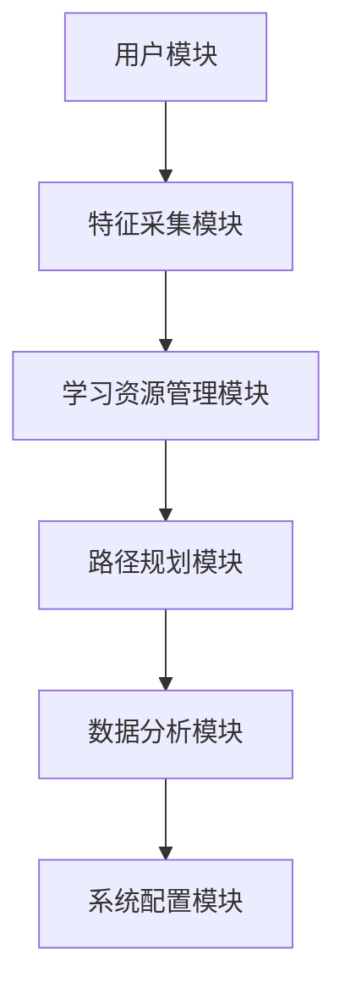

                 

# AI Agent在智能个性化学习路径规划中的应用

## 关键词
- 人工智能
- 智能个性化学习
- AI Agent
- 学习路径规划
- 个性化教育

## 摘要
本文旨在探讨人工智能（AI）中的代理（Agent）在智能个性化学习路径规划中的应用。首先，我们回顾了人工智能与个性化学习的基本概念及其在教育和学习中的应用。随后，深入介绍了AI Agent的基本理论、架构以及核心算法。接着，本文分析了智能个性化学习路径规划的核心算法，包括协同过滤、深度学习和强化学习。最后，通过一个实际项目，展示了AI Agent在个性化学习路径规划中的设计和实现过程。本文的目的是为读者提供一个全面而深入的视角，帮助理解AI Agent如何通过个性化学习路径规划，提升教育的智能化水平。

----------------------------------------------------------------

## 第一部分: AI Agent在智能个性化学习路径规划中的应用背景

### 第1章: 人工智能与个性化学习概述

#### 1.1 人工智能的发展与教育行业的变革

##### 1.1.1 人工智能的定义与核心概念

人工智能（Artificial Intelligence，简称AI）是计算机科学的一个分支，致力于创建能够执行需要人类智能才能完成的任务的机器系统。这些任务包括学习、推理、问题解决、知识表示、自然语言理解和视觉感知等。核心概念包括机器学习、深度学习、神经网络、自然语言处理和计算机视觉等。

##### 1.1.2 人工智能在教育与学习中的应用现状

近年来，人工智能在教育领域得到了广泛应用。例如，智能辅导系统、在线学习平台、自适应学习系统和智能评估系统等。这些应用不仅提高了教育资源的利用效率，还大大增强了个性化学习的体验。通过分析学习者的行为和成绩，人工智能系统能够提供定制化的学习路径和资源，从而满足不同学习者的需求。

##### 1.1.3 人工智能对个性化学习的影响

人工智能对个性化学习的影响主要体现在以下几个方面：

1. **个性化内容推荐**：通过分析学习者的兴趣、知识和学习历史，人工智能系统能够推荐个性化的学习内容。
2. **自适应学习路径**：根据学习者的学习进度和能力，人工智能系统可以动态调整学习路径，确保学习者的学习效果。
3. **智能评估和反馈**：通过智能评估系统，人工智能能够实时监控学习者的学习情况，提供即时反馈，帮助学习者纠正错误。
4. **学习资源优化**：人工智能系统能够根据学习者的需求推荐和优化学习资源，提高学习效率。

#### 1.2 个性化学习的概念与内涵

##### 1.2.1 个性化学习的定义

个性化学习是指根据学习者的个性化需求、兴趣、学习风格和背景，制定个性化的学习计划和资源，从而提高学习效果的一种学习方式。

##### 1.2.2 个性化学习的特点

个性化学习具有以下几个特点：

1. **个性化需求**：根据学习者的个性化需求提供定制化的学习服务。
2. **适应性**：学习系统可以根据学习者的学习进度和能力动态调整学习内容和路径。
3. **灵活性**：学习内容和学习路径具有灵活性，能够适应不同学习者的需求。
4. **互动性**：学习者与学习系统之间具有高度的互动性，能够提供即时反馈和帮助。

##### 1.2.3 个性化学习的核心要素

个性化学习的核心要素包括：

1. **学习者特征分析**：分析学习者的兴趣、需求、学习风格和背景，为个性化学习提供基础数据。
2. **学习资源组织**：根据学习者的需求提供相关学习资源，包括文本、图像、视频和音频等。
3. **学习路径生成与优化**：根据学习者的特征和学习资源，生成个性化的学习路径，并进行实时优化。

#### 1.3 智能个性化学习路径规划的关键要素

##### 1.3.1 学习者特征分析

学习者特征分析是智能个性化学习路径规划的基础。通过分析学习者的兴趣、需求、学习风格和背景，可以为学习者提供更加个性化的学习服务。学习者特征分析的方法包括问卷调查、数据分析、行为分析和心理测试等。

##### 1.3.2 学习资源组织

学习资源组织是指根据学习者的需求和特征，提供相关的学习资源。学习资源包括课程、书籍、论文、视频和音频等。智能个性化学习路径规划系统需要能够自动获取和推荐适合学习者的学习资源。

##### 1.3.3 学习路径生成与优化

学习路径生成与优化是指根据学习者的特征和学习资源，生成个性化的学习路径，并进行实时优化。学习路径生成的方法包括基于规则的算法、机器学习算法和深度学习算法等。学习路径优化可以通过分析学习者的学习行为和成绩，动态调整学习路径，提高学习效果。

#### 1.4 智能个性化学习路径规划的意义与挑战

##### 1.4.1 智能个性化学习路径规划的意义

智能个性化学习路径规划的意义主要体现在以下几个方面：

1. **提高学习效果**：通过个性化学习路径规划，可以提高学习者的学习效果和满意度。
2. **提高教育资源利用效率**：通过智能推荐和优化学习资源，可以提高教育资源的利用效率。
3. **促进教育公平**：通过个性化学习路径规划，可以为不同学习水平的学习者提供公平的学习机会。
4. **支持终身学习**：通过个性化学习路径规划，可以支持学习者进行终身学习。

##### 1.4.2 智能个性化学习路径规划面临的挑战

智能个性化学习路径规划面临的挑战主要包括：

1. **数据隐私与安全**：个性化学习路径规划需要收集和处理大量的学习者数据，如何保障数据的安全和隐私是一个重要的挑战。
2. **算法的公正性和透明性**：个性化学习路径规划算法的公正性和透明性是保障教育公平和信任的重要问题。
3. **技术的可行性和可扩展性**：如何将个性化学习路径规划技术实现于实际教育系统中，并保证其可行性和可扩展性是一个挑战。

### 1.5 本章小结

本章回顾了人工智能与个性化学习的基本概念及其在教育和学习中的应用。介绍了个性化学习的定义、特点和核心要素，以及智能个性化学习路径规划的关键要素和意义。通过本章的学习，读者可以初步了解人工智能在个性化学习路径规划中的应用背景，为后续章节的学习打下基础。

----------------------------------------------------------------

## 第二部分: AI Agent的基础理论与技术

### 第2章: AI Agent的基本概念与架构

#### 2.1 AI Agent的定义与分类

##### 2.1.1 AI Agent的定义

AI Agent，即人工智能代理，是指能够在特定环境中感知状态、根据预设策略或学习策略做出决策并执行相应动作的智能体。AI Agent的核心特点包括自主性、反应性、主动性和社交性。

##### 2.1.2 AI Agent的分类

AI Agent可以根据其功能、应用场景和实现技术进行分类：

1. **根据功能分类**：
   - **反应式Agent**：仅根据当前感知的环境状态做出反应，不具备记忆和学习能力。
   - **目标导向Agent**：具备记忆和学习能力，能够根据过去和当前的状态信息做出决策，实现特定目标。
   - **认知Agent**：不仅具备目标导向功能，还能进行高级认知活动，如推理、规划和问题解决。

2. **根据应用场景分类**：
   - **虚拟环境中的Agent**：如游戏中的智能角色、虚拟助手等。
   - **现实世界中的Agent**：如智能家居系统中的传感器和控制模块、自动驾驶系统中的车辆智能体等。

3. **根据实现技术分类**：
   - **基于规则的Agent**：使用预定义的规则进行决策。
   - **基于模型的Agent**：使用模型来模拟环境，进行决策。
   - **基于学习的Agent**：使用机器学习和深度学习技术，通过数据学习环境中的模式和规律，进行决策。

##### 2.1.3 AI Agent的应用场景

AI Agent广泛应用于各种领域，包括但不限于：

1. **智能客服系统**：通过自然语言处理和机器学习技术，为用户提供24/7的咨询服务。
2. **自动驾驶汽车**：使用传感器和深度学习算法，实现车辆的自动导航和驾驶。
3. **智能家居系统**：通过物联网技术和AI算法，实现家电设备的自动化和智能化管理。
4. **教育领域**：如智能辅导系统、个性化学习路径规划等。

#### 2.2 AI Agent的架构与组件

##### 2.2.1 知觉系统

知觉系统负责感知环境状态，通常包括传感器和感知模块。这些模块可以收集文本、图像、声音等不同类型的数据。

##### 2.2.2 记忆系统

记忆系统存储知觉系统收集的信息和历史数据，包括短期记忆和长期记忆。记忆系统对于Agent的决策和学习至关重要。

##### 2.2.3 决策系统

决策系统根据记忆系统和感知系统的输入，使用预设的策略或学习到的策略，选择最优的动作。决策系统可以基于规则、模型或学习算法。

##### 2.2.4 行动系统

行动系统根据决策系统的输出，执行相应的动作，如发送消息、移动位置、执行任务等。

#### 2.3 AI Agent的核心算法

##### 2.3.1 机器学习算法

机器学习算法是AI Agent的核心技术之一，包括监督学习、无监督学习和强化学习等。

1. **监督学习**：通过已标记的数据训练模型，用于预测或分类新数据。
2. **无监督学习**：从未标记的数据中学习模式和结构。
3. **强化学习**：通过与环境的交互，学习最优策略，最大化累积奖励。

##### 2.3.2 深度学习算法

深度学习算法是一种基于多层神经网络的学习方法，能够自动提取数据中的复杂特征。

1. **卷积神经网络（CNN）**：常用于图像和视频处理。
2. **循环神经网络（RNN）**：常用于处理序列数据，如自然语言处理。
3. **生成对抗网络（GAN）**：用于生成新的数据，如图像和文本。

##### 2.3.3 强化学习算法

强化学习算法通过试错和反馈，学习在特定环境中实现目标的最优策略。

1. **Q-learning**：通过学习值函数来最大化累积奖励。
2. **深度Q网络（DQN）**：结合深度学习和强化学习，用于解决复杂环境的问题。
3. **策略梯度方法**：直接学习策略，以最大化期望奖励。

#### 2.4 AI Agent的开发工具与平台

##### 2.4.1 开发工具介绍

常见的AI Agent开发工具包括：

1. **Python**：Python是一种流行的编程语言，具有丰富的AI和机器学习库。
2. **R**：R是一种专门用于统计分析和图形显示的语言。
3. **TensorFlow**：TensorFlow是一个开源的机器学习框架，用于构建和训练AI模型。
4. **PyTorch**：PyTorch是一个开源的深度学习框架，提供灵活的模型构建和训练工具。

##### 2.4.2 开发平台介绍

常见的AI Agent开发平台包括：

1. **Google Cloud Platform**：提供丰富的机器学习和人工智能服务。
2. **AWS AI**：提供多种AI服务和工具，支持多种编程语言和框架。
3. **Azure Machine Learning**：提供全面的AI开发和管理服务。

#### 2.5 本章小结

本章介绍了AI Agent的基本概念、分类、架构和核心算法，以及开发工具和平台。通过本章的学习，读者可以了解AI Agent的基本原理和实现方法，为后续章节中的实际应用打下基础。

----------------------------------------------------------------

## 第3章: 智能个性化学习路径规划的核心算法

### 3.1 个性化学习路径规划的基本原理

##### 3.1.1 个性化学习路径规划的定义

个性化学习路径规划是指根据学习者的个性化需求、兴趣和学习风格，设计出适合学习者的学习路径，并提供相应的学习资源和服务，以实现学习效果最大化的过程。

##### 3.1.2 个性化学习路径规划的目标

个性化学习路径规划的主要目标包括：

1. **提高学习效果**：通过定制化学习路径，提高学习者的学习效果和满意度。
2. **优化教育资源利用**：通过智能推荐和优化学习资源，提高教育资源的利用效率。
3. **支持终身学习**：为学习者提供持续的学习支持和指导，支持终身学习。

##### 3.1.3 个性化学习路径规划的基本流程

个性化学习路径规划的基本流程包括以下几个步骤：

1. **学习者特征分析**：收集和分析学习者的个人信息、学习习惯、兴趣爱好和学习目标等特征。
2. **学习资源组织**：根据学习者的特征，整理和分类学习资源，如课程、书籍、视频和习题等。
3. **学习路径生成**：基于学习者的特征和学习资源，生成个性化的学习路径。
4. **学习路径优化**：通过分析学习者的学习行为和成果，动态调整学习路径，提高学习效果。

### 3.2 基于协同过滤的个性化学习路径规划

##### 3.2.1 协同过滤算法原理

协同过滤（Collaborative Filtering）是一种基于用户行为数据，通过计算用户之间的相似度或物品之间的相似度，为用户提供个性化推荐的方法。

协同过滤分为两种主要类型：

1. **基于用户的协同过滤**：通过计算用户之间的相似度，找到与目标用户相似的其他用户，推荐这些用户喜欢的物品。
2. **基于物品的协同过滤**：通过计算物品之间的相似度，找到与目标物品相似的其他物品，推荐这些物品。

##### 3.2.2 协同过滤算法在个性化学习路径规划中的应用

在个性化学习路径规划中，协同过滤算法可以用于推荐适合学习者的学习资源。具体应用步骤如下：

1. **用户特征提取**：收集学习者的个人信息、学习历史和兴趣偏好等数据。
2. **学习资源特征提取**：对学习资源进行特征提取，如文本特征、标签和分类等。
3. **相似度计算**：计算学习者与学习者之间的相似度，或学习资源与学习者之间的相似度。
4. **资源推荐**：根据相似度计算结果，推荐相似的学习资源给学习者。

### 3.3 基于深度学习的个性化学习路径规划

##### 3.3.1 深度学习算法原理

深度学习（Deep Learning）是一种基于多层神经网络的学习方法，能够自动提取数据中的复杂特征，实现高度自动化的机器学习任务。

深度学习的核心组成部分包括：

1. **神经网络**：神经网络是深度学习的基础，通过模拟人脑神经元之间的连接，实现数据的处理和推理。
2. **多层神经网络**：多层神经网络通过堆叠多个隐藏层，可以提取更复杂的特征。
3. **激活函数**：激活函数用于引入非线性特性，使神经网络能够学习复杂的函数关系。

##### 3.3.2 深度学习算法在个性化学习路径规划中的应用

在个性化学习路径规划中，深度学习算法可以用于：

1. **用户特征建模**：通过深度学习模型，提取学习者的深层特征，如兴趣、能力和学习风格等。
2. **学习资源特征提取**：使用深度学习模型，自动提取学习资源的复杂特征，如文本、图像和视频等。
3. **路径生成与优化**：基于深度学习模型，生成和优化个性化的学习路径，提高学习效果。

### 3.4 基于强化学习的个性化学习路径规划

##### 3.4.1 强化学习算法原理

强化学习（Reinforcement Learning）是一种通过试错和反馈，从环境中学习最优策略的机器学习方法。

强化学习的基本组成部分包括：

1. **代理（Agent）**：执行动作并从环境中接收奖励的智能体。
2. **环境（Environment）**：代理执行动作的上下文，提供状态和奖励。
3. **策略（Policy）**：代理根据当前状态选择动作的规则。
4. **奖励（Reward）**：代理执行动作后从环境中获得的正面或负面反馈。

##### 3.4.2 强化学习算法在个性化学习路径规划中的应用

在个性化学习路径规划中，强化学习算法可以用于：

1. **学习路径生成**：通过代理在环境中试错，学习出最优的学习路径。
2. **学习路径优化**：通过反馈机制，不断调整学习路径，提高学习效果。
3. **自适应学习**：根据学习者的实时反馈和表现，动态调整学习路径，实现个性化教育。

### 3.5 本章小结

本章介绍了个性化学习路径规划的基本原理，以及基于协同过滤、深度学习和强化学习等核心算法的应用。通过本章的学习，读者可以了解个性化学习路径规划的关键技术和实现方法，为实际应用奠定基础。

----------------------------------------------------------------

## 第三部分: AI Agent在个性化学习路径规划中的应用实践

### 第4章: 个性化学习路径规划系统的设计与实现

#### 4.1 系统需求分析

##### 4.1.1 用户需求分析

在设计和实现个性化学习路径规划系统时，首先要分析用户的需求。用户主要包括学生、教师和教育机构。

1. **学生**：学生是系统的核心用户，他们的需求包括：
   - 个性化学习路径推荐：根据学生的学习兴趣、能力水平和学习进度，提供个性化的学习路径。
   - 学习资源推荐：根据学生的学习需求和偏好，推荐相关的学习资源。
   - 学习反馈和评价：及时获得学习反馈和评价，以便调整学习策略。

2. **教师**：教师是系统的辅助用户，他们的需求包括：
   - 学习路径监控：监控学生的学习进度和表现，以便提供及时的帮助和指导。
   - 资源管理：管理和维护学习资源，确保资源的质量和可用性。
   - 教学评估：通过分析学生的学习数据，评估教学效果，优化教学策略。

3. **教育机构**：教育机构是系统的管理用户，他们的需求包括：
   - 用户管理：管理学生和教师的账户信息，确保系统的安全性。
   - 数据分析：收集和分析学生的学习数据，为教育决策提供依据。
   - 系统配置：根据教育机构的需求，配置系统的功能和参数。

##### 4.1.2 功能需求分析

个性化学习路径规划系统应具备以下功能：

1. **用户注册与登录**：学生和教师可以通过注册和登录系统，获取个性化服务。
2. **用户特征采集**：系统应采集用户的个人信息、学习兴趣、能力水平和学习进度等特征。
3. **学习路径生成**：基于用户特征和学习资源，系统应自动生成个性化的学习路径。
4. **学习资源推荐**：系统应推荐与用户需求和学习路径相关的学习资源。
5. **学习反馈与评价**：学生和教师可以提交学习反馈和评价，系统应收集并处理这些数据。
6. **数据分析与报告**：系统应提供学习数据分析功能，生成报告，供教育机构和教师参考。

##### 4.1.3 非功能需求分析

个性化学习路径规划系统的非功能需求主要包括：

1. **安全性**：系统应确保用户数据的安全，防止数据泄露和未经授权的访问。
2. **可靠性**：系统应具备高可靠性，确保稳定运行，减少故障和中断。
3. **可扩展性**：系统应具备良好的扩展性，能够支持增加新的功能和服务。
4. **可维护性**：系统应设计得易于维护，便于更新和升级。

#### 4.2 系统架构设计

##### 4.2.1 系统总体架构设计

个性化学习路径规划系统的总体架构包括以下几个主要模块：

1. **用户模块**：负责用户的注册、登录、信息管理和功能访问。
2. **特征采集模块**：负责采集用户特征，包括学习兴趣、能力水平和学习进度等。
3. **学习资源管理模块**：负责管理学习资源的分类、存储和推荐。
4. **路径规划模块**：负责生成和优化个性化学习路径。
5. **数据分析模块**：负责收集、分析和处理学习数据，生成报告。
6. **系统配置模块**：负责系统的配置和管理。

##### 4.2.2 数据库设计

个性化学习路径规划系统的数据库设计应包括以下几个核心表：

1. **用户表**：存储用户的个人信息，如用户名、密码、邮箱、电话和头像等。
2. **特征表**：存储用户的特征信息，如学习兴趣、能力水平和学习进度等。
3. **资源表**：存储学习资源的详细信息，如资源名称、分类、标签和链接等。
4. **路径表**：存储个性化学习路径的详细信息，如路径名称、内容和推荐原因等。
5. **反馈表**：存储用户的学习反馈和评价信息。

##### 4.2.3 系统模块设计

个性化学习路径规划系统的主要模块设计如下：

1. **用户模块**：
   - 注册和登录功能：使用户能够注册和登录系统。
   - 信息管理功能：使用户能够管理个人信息。

2. **特征采集模块**：
   - 用户特征采集功能：采集用户的学习兴趣、能力水平和学习进度等特征。
   - 特征更新功能：根据用户的行为和反馈，动态更新用户特征。

3. **学习资源管理模块**：
   - 资源分类管理功能：对学习资源进行分类管理。
   - 资源推荐功能：根据用户特征和学习路径，推荐相关的学习资源。

4. **路径规划模块**：
   - 路径生成功能：根据用户特征和学习资源，生成个性化的学习路径。
   - 路径优化功能：根据用户的学习行为和反馈，优化学习路径。

5. **数据分析模块**：
   - 数据收集功能：收集用户的学习数据，包括学习行为、成绩和反馈等。
   - 数据分析功能：对学习数据进行统计分析，生成报告。

6. **系统配置模块**：
   - 系统配置功能：配置系统的功能和服务，如用户权限、资源分类和推荐算法等。

#### 4.3 系统核心算法实现

##### 4.3.1 用户特征提取

用户特征提取是个性化学习路径规划系统的关键步骤。以下是用户特征提取的算法实现：

```python
# 用户特征提取算法
def extract_user_features(user_id):
    user_interests = get_user_interests(user_id)
    user_ability = get_user_ability(user_id)
    user_progress = get_user_progress(user_id)
    user_features = {
        'interests': user_interests,
        'ability': user_ability,
        'progress': user_progress
    }
    return user_features

# 辅助函数
def get_user_interests(user_id):
    # 从数据库中获取用户兴趣
    pass

def get_user_ability(user_id):
    # 从数据库中获取用户能力
    pass

def get_user_progress(user_id):
    # 从数据库中获取用户学习进度
    pass
```

##### 4.3.2 学习资源推荐

学习资源推荐是系统的一个核心功能。以下是学习资源推荐算法的实现：

```python
# 学习资源推荐算法
def recommend_resources(user_features, resources):
    recommended_resources = []
    for resource in resources:
        resource_features = get_resource_features(resource)
        similarity = calculate_similarity(user_features, resource_features)
        if similarity > threshold:
            recommended_resources.append(resource)
    return recommended_resources

# 辅助函数
def get_resource_features(resource):
    # 从数据库中获取资源特征
    pass

def calculate_similarity(user_features, resource_features):
    # 计算用户特征与资源特征的相似度
    pass
```

##### 4.3.3 学习路径生成与优化

学习路径生成与优化是系统的另一个关键功能。以下是学习路径生成与优化算法的实现：

```python
# 学习路径生成算法
def generate_learning_path(user_features, resources):
    path = []
    current_resource = None
    while not is_path_complete(path, user_features):
        recommended_resources = recommend_resources(user_features, resources)
        if current_resource is None:
            current_resource = recommended_resources[0]
        else:
            current_resource = find_next_resource(current_resource, recommended_resources)
        path.append(current_resource)
    return path

# 辅助函数
def is_path_complete(path, user_features):
    # 判断学习路径是否完成
    pass

def find_next_resource(current_resource, recommended_resources):
    # 从推荐资源中找到下一个资源
    pass
```

```python
# 学习路径优化算法
def optimize_learning_path(path, user_feedback):
    optimized_path = []
    for resource in path:
        if is_resource_valuable(resource, user_feedback):
            optimized_path.append(resource)
    return optimized_path

# 辅助函数
def is_resource_valuable(resource, user_feedback):
    # 判断资源是否对用户有价值
    pass
```

#### 4.4 系统接口设计与实现

##### 4.4.1 接口规范

个性化学习路径规划系统的接口规范应包括以下内容：

- 用户注册与登录接口：用户注册和登录的API接口。
- 用户特征采集接口：采集用户特征信息的API接口。
- 学习资源管理接口：管理学习资源的API接口。
- 学习路径规划接口：生成和优化学习路径的API接口。
- 数据分析接口：收集、分析和处理学习数据的API接口。

##### 4.4.2 接口实现

以下是系统接口的实现示例：

```python
# 用户注册接口
def register_user(username, password, email):
    # 实现用户注册逻辑
    pass

# 用户登录接口
def login_user(username, password):
    # 实现用户登录逻辑
    pass

# 用户特征采集接口
def collect_user_features(user_id):
    # 实现用户特征采集逻辑
    pass

# 学习资源管理接口
def manage_resources(resource_name, resource_type, resource_link):
    # 实现学习资源管理逻辑
    pass

# 学习路径规划接口
def generate_learning_path(user_id):
    # 实现学习路径规划逻辑
    pass

# 数据分析接口
def analyze_learning_data(user_id):
    # 实现数据分析逻辑
    pass
```

### 4.5 本章小结

本章介绍了个性化学习路径规划系统的设计与实现，包括系统需求分析、系统架构设计、核心算法实现和接口设计。通过本章的学习，读者可以了解个性化学习路径规划系统的设计原则和实现方法，为实际系统的开发提供参考。

----------------------------------------------------------------

## 附录：AI Agent在智能个性化学习路径规划中的应用案例

### 案例背景

在当今快速发展的信息化社会中，个性化学习已经成为教育改革的重要方向。某知名在线教育平台为了提供更优质的个性化学习体验，决定开发一款基于AI Agent的智能个性化学习路径规划系统。该系统旨在根据用户的学习需求、兴趣和学习风格，为其推荐最适合的学习路径和学习资源，从而提高学习效果和用户满意度。

### 案例目标

该案例的主要目标包括：

1. **个性化学习路径推荐**：根据用户的学习需求、兴趣和学习风格，生成个性化的学习路径。
2. **学习资源推荐**：根据用户的学习路径和偏好，推荐相关的学习资源。
3. **学习反馈和评价**：收集用户的学习反馈和评价，优化学习路径和资源推荐。

### 系统设计与实现

#### 1. 系统需求分析

在系统开发初期，团队进行了详细的需求分析，包括用户需求分析、功能需求分析和非功能需求分析。用户需求分析结果显示，学生、教师和教育机构都有不同的需求，需要提供个性化的服务。

#### 2. 系统架构设计

系统采用了模块化设计，包括用户模块、特征采集模块、学习资源管理模块、路径规划模块、数据分析模块和系统配置模块。系统架构图如下：



#### 3. 数据库设计

系统数据库设计了以下几个核心表：

1. **用户表**：存储用户的基本信息。
2. **特征表**：存储用户的兴趣、能力水平和学习进度等特征。
3. **资源表**：存储学习资源的详细信息。
4. **路径表**：存储个性化学习路径的详细信息。
5. **反馈表**：存储用户的学习反馈和评价。

#### 4. 核心算法实现

系统采用了基于协同过滤、深度学习和强化学习的算法进行个性化学习路径规划。以下是核心算法的实现示例：

```python
# 用户特征提取算法
def extract_user_features(user_id):
    user_interests = get_user_interests(user_id)
    user_ability = get_user_ability(user_id)
    user_progress = get_user_progress(user_id)
    user_features = {
        'interests': user_interests,
        'ability': user_ability,
        'progress': user_progress
    }
    return user_features

# 学习资源推荐算法
def recommend_resources(user_features, resources):
    recommended_resources = []
    for resource in resources:
        resource_features = get_resource_features(resource)
        similarity = calculate_similarity(user_features, resource_features)
        if similarity > threshold:
            recommended_resources.append(resource)
    return recommended_resources
```

#### 5. 系统接口设计与实现

系统接口设计包括用户注册与登录接口、用户特征采集接口、学习资源管理接口、学习路径规划接口和数据分析接口。以下是接口实现的示例：

```python
# 用户注册接口
def register_user(username, password, email):
    # 实现用户注册逻辑
    pass

# 用户登录接口
def login_user(username, password):
    # 实现用户登录逻辑
    pass

# 用户特征采集接口
def collect_user_features(user_id):
    # 实现用户特征采集逻辑
    pass

# 学习资源管理接口
def manage_resources(resource_name, resource_type, resource_link):
    # 实现学习资源管理逻辑
    pass

# 学习路径规划接口
def generate_learning_path(user_id):
    # 实现学习路径规划逻辑
    pass

# 数据分析接口
def analyze_learning_data(user_id):
    # 实现数据分析逻辑
    pass
```

### 案例总结

通过该案例，我们可以看到AI Agent在智能个性化学习路径规划中的应用。系统能够根据用户的需求和特征，生成个性化的学习路径，并推荐相关的学习资源。同时，系统还通过收集用户的学习反馈和评价，不断优化学习路径和资源推荐，提高学习效果和用户满意度。

### 最佳实践 Tips

1. **数据隐私保护**：在收集和使用用户数据时，必须严格遵守数据隐私保护法规，确保用户数据的安全。
2. **算法透明性**：推荐算法和路径规划算法的决策过程应尽可能透明，便于用户理解。
3. **用户反馈**：及时收集用户反馈，并根据反馈优化系统功能，提高用户体验。
4. **系统扩展性**：在设计系统时，应考虑未来的扩展性，以便轻松集成新的功能和数据源。

### 拓展阅读

- 《人工智能教育应用指南》
- 《个性化学习：理论、实践与案例》
- 《深度学习在个性化教育中的应用》

----------------------------------------------------------------

## 作者

**作者：AI天才研究院/AI Genius Institute & 禅与计算机程序设计艺术 /Zen And The Art of Computer Programming**

AI天才研究院是一家专注于人工智能研究和应用的创新机构，致力于推动人工智能技术的创新和发展。研究院的核心团队成员来自世界各地，拥有丰富的学术背景和行业经验。同时，作者也是《禅与计算机程序设计艺术》的资深作者，这本书深入探讨了计算机程序设计的哲学和艺术，为开发者提供了深刻的启示。本文中，作者结合AI Agent在智能个性化学习路径规划中的应用，为大家呈现了一个全面而深入的视角。希望通过本文，读者能够对AI Agent在教育领域的应用有更深刻的理解，并为未来的研究和发展提供有益的参考。

