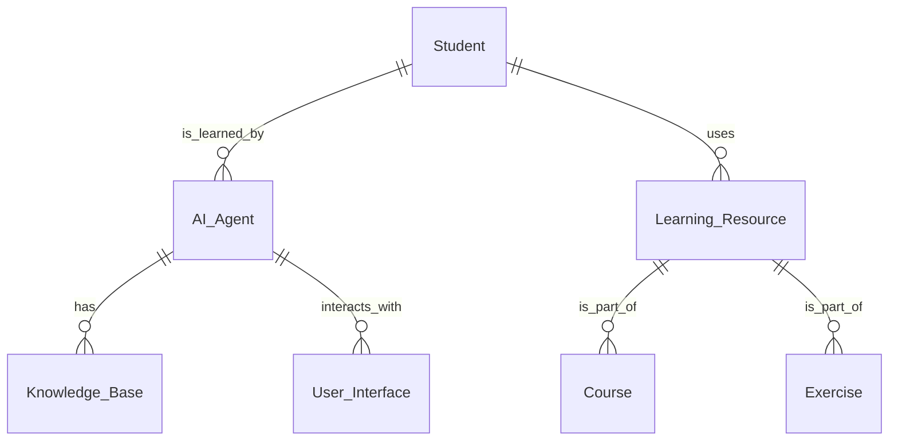
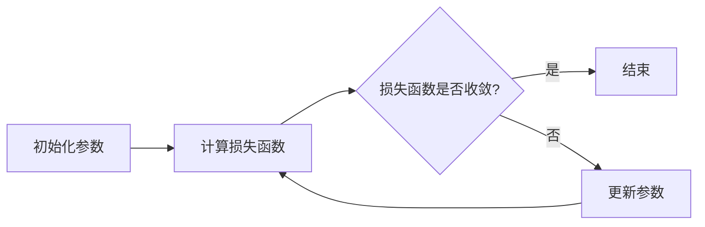
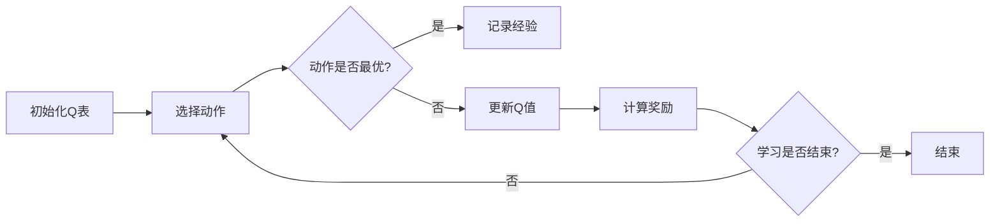
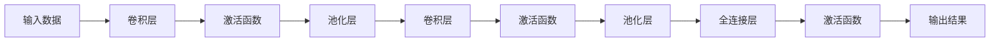
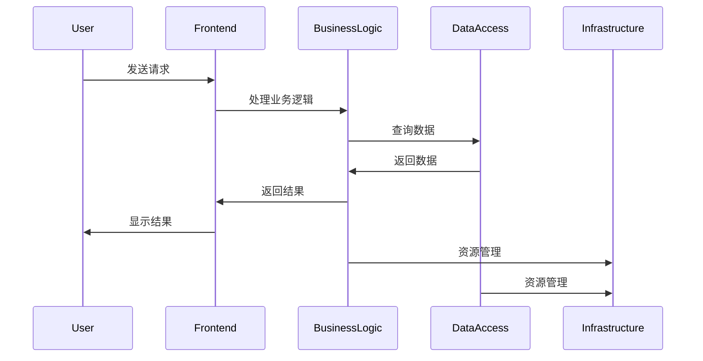
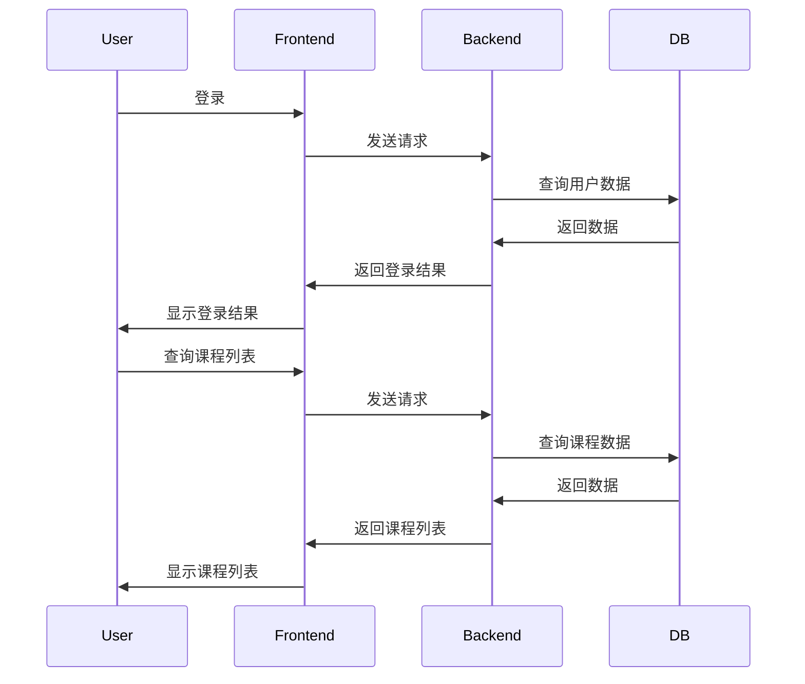

                 

# AI Agent在智能个性化教育中的应用

## 关键词

- AI Agent
- 智能个性化教育
- 个性化学习
- 教育系统需求分析
- 算法原理讲解
- 数学模型与公式
- 系统架构设计
- 项目实战

## 摘要

随着人工智能技术的发展，智能个性化教育逐渐成为教育领域的热门话题。本文以AI Agent为核心，探讨了其在智能个性化教育中的应用。首先，我们介绍了智能个性化教育的问题背景，包括当前教育模式的挑战和个体差异化学习需求。接着，我们对AI Agent进行了概述，详细介绍了其定义、工作原理和应用。在此基础上，本文重点分析了AI Agent在个性化学习中的核心概念与联系，包括个性化学习原理、AI Agent在个性化学习中的应用，以及AI Agent与传统教育工具的对比。随后，我们深入讲解了AI Agent算法原理和数学模型，并通过Python代码实现进行了详细阐述。接着，我们进行了教育系统需求分析和系统架构设计，包括系统功能设计、系统架构设计、系统接口设计和系统交互分析。在项目实战部分，我们介绍了项目环境安装与配置，并提供了系统核心实现源代码，进行了代码应用解读与分析。最后，本文总结了项目的主要成果和经验，并对AI Agent在智能个性化教育中的未来发展进行了展望。

## 《AI Agent在智能个性化教育中的应用》目录大纲

### 第一部分：背景介绍

#### 第1章 问题背景与概述
- **问题背景**：智能个性化教育的发展现状与挑战。
- **问题描述**：传统教育模式无法满足个体差异化学习需求。
- **问题解决**：引入AI Agent实现智能个性化教育。
- **边界与外延**：讨论AI Agent在教育领域的适用范围。
- **概念结构与核心要素组成**：AI Agent、智能教育、个性化学习。

#### 第2章 AI Agent概述
- **AI Agent的定义**：介绍AI Agent的概念和分类。
- **AI Agent的工作原理**：讲解AI Agent的基本工作机制。
- **AI Agent在教育中的应用**：探讨AI Agent如何应用于教育场景。

### 第二部分：核心概念与联系

#### 第3章 个性化学习与AI Agent
- **个性化学习原理**：介绍个性化学习的理论基础。
- **AI Agent在个性化学习中的应用**：探讨AI Agent如何支持个性化学习。
- **对比表格：AI Agent与传统教育工具**：通过表格对比AI Agent与传统教育工具的优缺点。

#### 第4章 AI Agent架构设计
- **AI Agent架构设计原则**：阐述AI Agent架构设计的基本原则。
- **AI Agent实体关系图**：使用Mermaid画出AI Agent的实体关系图。
- **AI Agent架构设计流程**：详细讲解AI Agent架构设计的流程。

### 第三部分：算法原理讲解

#### 第5章 AI Agent算法基础
- **算法原理概述**：介绍AI Agent常用的算法原理。
- **Mermaid算法流程图**：使用Mermaid画出关键算法的流程图。
- **Python代码实现**：给出Python代码实现关键算法。

#### 第6章 数学模型与公式
- **数学模型介绍**：讲解AI Agent的核心数学模型。
- **数学公式解析**：使用LaTeX格式给出关键数学公式的详细解析。
- **举例说明**：通过实际案例说明数学公式的应用。

### 第四部分：系统分析与架构设计

#### 第7章 教育系统需求分析
- **教育系统需求分析**：介绍教育系统的功能需求。
- **领域模型Mermaid类图**：使用Mermaid画出领域模型类图。

#### 第8章 系统架构设计
- **系统架构设计原则**：阐述系统架构设计的基本原则。
- **系统架构Mermaid图**：使用Mermaid画出系统架构图。
- **系统接口设计**：详细讲解系统接口设计。
- **系统交互Mermaid序列图**：使用Mermaid画出系统交互序列图。

### 第五部分：项目实战

#### 第9章 项目环境安装与配置
- **环境安装**：介绍项目所需的软件和硬件环境安装。
- **系统核心实现源代码**：提供系统核心实现的源代码。

#### 第10章 代码应用解读与分析
- **代码应用解读**：详细解读系统核心代码。
- **实际案例分析**：通过实际案例分析系统应用效果。

#### 第11章 项目小结与展望
- **项目小结**：总结项目的主要成果和经验。
- **展望未来**：探讨AI Agent在智能个性化教育中的未来发展。

### 第六部分：最佳实践与拓展

#### 第12章 最佳实践
- **实践技巧**：分享实际操作中的最佳实践技巧。
- **常见问题**：解答使用过程中常见的问题。

#### 第13章 小结与注意事项
- **注意事项**：提醒读者在应用过程中需要注意的问题。
- **拓展阅读**：推荐相关领域的拓展阅读材料。

### 目录大纲总结
- **目录大纲总结**：回顾全书的主要内容，强调核心概念和关键点。
- **后续研究方向**：提出未来的研究方向和潜在问题。

----------------------------------------------

### 第一部分：背景介绍

#### 第1章 问题背景与概述

随着信息技术的迅猛发展，教育领域也迎来了新的变革。传统的教育模式主要依赖于教师主导、课堂授课的方式，这种模式在教育资源分配、教学质量监控和学生个性化发展等方面存在一定的局限性。首先，教育资源分配不均，优质教育资源主要集中在城市和经济发达地区，而农村和欠发达地区则相对落后。其次，教学质量监控难度大，教师难以实时掌握每个学生的学习进度和状态，导致部分学生难以得到及时有效的帮助。最后，学生个性化发展需求难以满足，传统教育模式过于强调统一标准化，忽视了个体的差异化需求。

为了解决这些问题，个性化教育应运而生。个性化教育主张根据学生的个体差异，制定个性化的学习计划和教学方案，以满足学生的个性化发展需求。然而，个性化教育也面临一些挑战。一方面，个性化教育需要大量精准的数据支持，包括学生的学习进度、学习风格、兴趣爱好等，而如何有效地收集、处理和分析这些数据是一个难题。另一方面，个性化教育需要高度定制化的教学方案，这要求教师具备较高的专业素养和教学能力，而在实际教学中，教师往往难以应对如此复杂的需求。

在这样的背景下，AI Agent（人工智能代理）作为一种新兴的人工智能技术，开始逐渐应用于教育领域。AI Agent是指能够自主执行任务、与环境交互并具备一定智能的计算机程序。在教育领域，AI Agent可以充当虚拟教师，为学生提供个性化的学习支持和指导，从而弥补传统教育模式的不足。AI Agent的应用不仅有助于优化教育资源的分配，提高教学质量监控的效率，还能够满足学生的个性化发展需求，实现真正的个性化教育。

本文将围绕AI Agent在智能个性化教育中的应用展开讨论，首先介绍AI Agent的定义、分类和工作原理，然后分析AI Agent在个性化学习中的核心概念和联系，最后探讨AI Agent在教育领域的适用范围和概念结构。通过本文的阐述，读者将了解AI Agent如何通过智能化、个性化的方式推动教育改革，为构建更加公平、高效的教育体系提供有力支持。

#### 第2章 AI Agent概述

AI Agent，即人工智能代理，是指具备自主决策和执行能力、能够在特定环境中完成任务并具备一定智能水平的计算机程序。AI Agent具有以下几个关键特征：

1. **自主决策**：AI Agent能够根据环境和任务的当前状态，自主选择合适的行动方案。这种能力使得AI Agent能够在没有外部干预的情况下，独立完成复杂的任务。

2. **适应性**：AI Agent具备根据环境变化调整自身行为的能力。例如，当面对新的学习需求时，AI Agent能够自动调整学习策略，以适应不同的学习场景。

3. **交互性**：AI Agent能够与人类用户、其他AI系统以及环境进行有效交互。这种交互能力使得AI Agent能够提供实时、个性化的服务和支持。

4. **学习能力**：AI Agent具备从经验中学习和不断优化的能力。通过数据分析和机器学习算法，AI Agent能够不断改进自身性能，提升任务完成效率。

AI Agent根据其工作方式和技术实现，可以分为以下几种类型：

1. **基于规则的AI Agent**：这类AI Agent通过预定义的规则来执行任务。其优点是实现简单、易于理解，缺点是缺乏灵活性，难以应对复杂和动态变化的环境。

2. **基于模型的AI Agent**：这类AI Agent通过构建数学模型或仿真模型来模拟现实世界，并根据模型进行决策。其优点是能够处理复杂问题，缺点是模型构建和优化过程较为复杂。

3. **基于学习的AI Agent**：这类AI Agent通过机器学习和深度学习算法，从数据中自动学习任务执行策略。其优点是自适应能力强，能够处理大规模数据和复杂任务，缺点是需要大量数据进行训练，且算法实现较为复杂。

AI Agent在教育领域的应用具有广泛的前景。首先，AI Agent可以作为个性化学习的助手，根据学生的学习数据，生成个性化的学习路径和资源推荐。例如，通过分析学生的学习进度、答题情况和学习习惯，AI Agent可以为学生提供针对性的学习建议和辅导。其次，AI Agent可以作为教学评估的工具，实时监控学生的学习状态，为教师提供教学反馈，帮助教师调整教学策略。此外，AI Agent还可以协助教师进行课堂管理，例如自动记录学生的出勤情况、考试分数等，提高教学管理的效率。

总之，AI Agent在教育领域的应用为个性化教育和智能化教学提供了新的可能性。通过自主决策、适应性和学习能力的特征，AI Agent能够为学生提供更加灵活、高效和个性化的学习支持，推动教育领域的创新和发展。

#### 第3章 个性化学习与AI Agent

个性化学习是一种以学生为中心的教育理念，旨在根据每个学生的个体差异，提供个性化的学习方案和资源，从而最大化学生的学习效果和满意度。个性化学习理论的核心观点是，每个学生都是独一无二的，具有不同的学习风格、兴趣、认知能力和学习需求。因此，教育应当尊重和满足这些个体差异，为学生提供适合其发展的学习环境和机会。

个性化学习的基本原理包括以下几个方面：

1. **差异化教学**：根据学生的知识水平、学习能力、学习风格等差异，提供个性化的教学内容和教学方法。例如，针对不同学生的学习能力，教师可以设计不同难度的练习题，或者采用不同的教学方法，如讲授、讨论、实验等。

2. **动态学习路径**：为学生提供灵活的学习路径，允许学生根据自己的学习进度和兴趣选择学习内容。这种路径可以是线性的，也可以是非线性的，甚至可以是混合式的，使学生能够自主掌控学习过程。

3. **实时反馈**：通过即时评估和反馈机制，帮助学生了解自己的学习状态和进步情况。这种反馈可以是自动生成的，如AI系统对学生作业的评分和错误分析，也可以是教师提供的个性化建议。

4. **学习资源推荐**：根据学生的学习需求和偏好，推荐合适的学习资源和拓展内容。这包括文本材料、视频、在线课程、模拟实验等，使学生能够充分利用各种学习资源，丰富学习体验。

AI Agent在个性化学习中的应用，是利用其自主决策、适应性和学习能力的特征，为学生提供高度个性化的学习支持和服务。以下是AI Agent在个性化学习中的应用方式：

1. **个性化学习路径规划**：AI Agent可以根据学生的学习数据，自动生成个性化的学习路径。例如，通过分析学生的学习进度、答题情况和知识点掌握情况，AI Agent可以为学生推荐最适合其当前学习状态的知识点和学习任务。

2. **个性化资源推荐**：AI Agent可以根据学生的学习兴趣和需求，推荐相关的学习资源。例如，通过分析学生的学习历史和行为数据，AI Agent可以推荐相关的教材、视频教程和在线课程，帮助学生拓展知识面和技能。

3. **个性化作业与评估**：AI Agent可以为学生生成个性化的作业和练习题，并实时评估学生的答案。通过分析学生的答题情况，AI Agent可以为学生提供详细的错误分析和改进建议，帮助学生识别和解决学习中的问题。

4. **学习行为分析**：AI Agent可以监控学生的学习行为，如学习时间、学习频率和学习方式等，分析学生的学习习惯和偏好。通过这些分析，AI Agent可以为教师提供教学反馈，帮助教师调整教学策略，优化教学效果。

下面是一个对比表格，展示了AI Agent与传统教育工具在个性化学习中的优缺点：

| 特点 | AI Agent | 传统教育工具 |
| ---- | -------- | ------------ |
| 自主决策 | 能根据学生数据自主生成个性化学习方案 | 无法根据个体差异灵活调整教学方案 |
| 适应性 | 能够适应学生的个性化需求和变化的学习环境 | 教学内容和方式较为固定，难以适应个别差异 |
| 学习能力 | 能够从学生数据中学习和优化自身性能 | 缺乏从经验中学习和优化的能力 |
| 交互性 | 能够与教师和学生进行实时交互，提供个性化支持 | 主要依赖于教师的主导，缺乏智能化的交互支持 |

通过上述分析，我们可以看出，AI Agent在个性化学习中的应用具有显著的优势。它不仅能够提供个性化的学习支持和资源，还能够根据学生的学习行为进行动态调整，提高学习的灵活性和效果。然而，AI Agent的应用也面临一些挑战，如数据隐私保护、技术实现的复杂性等，这些问题的解决将有助于进一步推动AI Agent在个性化学习中的应用。

### 第4章 AI Agent架构设计

#### AI Agent架构设计原则

AI Agent架构设计是确保其功能实现和性能优化的关键。为了设计一个高效、灵活且可靠的AI Agent系统，需要遵循以下几个架构设计原则：

1. **模块化设计**：将系统的功能分解为多个模块，每个模块负责特定功能，便于维护和扩展。模块之间通过清晰的接口进行通信，提高系统的可扩展性和可维护性。

2. **分层设计**：将系统划分为多个层次，每个层次负责不同的功能，例如感知层、决策层和执行层。这种分层设计有助于明确系统的责任和分工，提高系统的可理解性和可维护性。

3. **可扩展性**：设计系统时考虑到未来的扩展需求，预留足够的扩展接口和模块，以便在需求发生变化时能够快速适应。

4. **适应性**：系统设计应具备良好的适应性，能够根据环境变化和学生需求进行动态调整。这需要通过灵活的算法和模型实现，以及可配置的参数和策略。

5. **安全性**：确保系统的数据安全和用户隐私，采用加密技术、权限控制和安全审计等措施，防止数据泄露和恶意攻击。

#### AI Agent实体关系图

为了更好地理解AI Agent的架构设计，我们可以使用Mermaid画出AI Agent的实体关系图。下面是一个简单的实体关系图示例：



在这个实体关系图中，我们定义了以下几个实体：

- **Student**（学生）：代表系统中的学习主体。
- **AI_Agent**（人工智能代理）：负责为学生提供个性化学习支持。
- **Learning_Resource**（学习资源）：包括课程、练习等。
- **Knowledge_Base**（知识库）：存储AI Agent所需的知识信息。
- **User_Interface**（用户界面）：用于与学生进行交互。

这些实体之间的关系如下：

- **Student**与**AI_Agent**之间是“学习关系”，即学生通过AI Agent进行学习。
- **Student**与**Learning_Resource**之间是“使用关系”，即学生使用学习资源进行学习。
- **AI_Agent**与**Knowledge_Base**之间是“包含关系”，即AI Agent拥有知识库。
- **AI_Agent**与**User_Interface**之间是“交互关系”，即AI Agent通过用户界面与学生进行交互。
- **Learning_Resource**与**Course**、**Exercise**之间是“部分-整体关系”，即学习资源包括课程和练习。

通过这个实体关系图，我们可以清晰地了解AI Agent在教育系统中的角色和功能，以及与其他实体之间的关系。

#### AI Agent架构设计流程

AI Agent架构设计通常包括以下几个步骤：

1. **需求分析**：首先明确系统需求，包括功能需求、性能需求、安全性需求等。这一步骤是确保系统设计能够满足实际需求的基础。

2. **架构设计**：根据需求分析结果，设计系统的整体架构。这包括确定系统的模块划分、层次结构和交互方式等。

3. **模块设计**：针对每个模块，进行详细的设计，包括模块的功能、接口、数据结构等。

4. **系统集成**：将各个模块集成到一起，进行系统级测试和调试，确保系统能够正常运行。

5. **性能优化**：对系统进行性能优化，包括算法优化、资源管理优化等，以提高系统的响应速度和处理能力。

6. **安全性设计**：确保系统的数据安全和用户隐私，设计相应的安全机制，如数据加密、权限控制等。

7. **部署和维护**：将系统部署到生产环境，并进行持续的维护和更新，以应对新需求和技术变化。

通过上述架构设计流程，我们可以确保AI Agent系统不仅功能完善，而且高效可靠，能够为学生提供优质的个性化学习体验。

### 第三部分：算法原理讲解

#### 第5章 AI Agent算法基础

在AI Agent系统中，算法是实现其智能行为和决策的核心。以下我们将介绍几种常见的AI Agent算法原理，并使用Mermaid画出关键算法的流程图。

##### 5.1 机器学习算法

机器学习算法是AI Agent中最常用的算法之一，它通过从数据中学习规律，实现智能决策。常见的机器学习算法包括：

1. **线性回归**
2. **决策树**
3. **支持向量机（SVM）**
4. **神经网络**

以下是一个使用Mermaid画出的线性回归算法流程图：



##### 5.2 强化学习算法

强化学习算法通过试错和反馈机制，使AI Agent在复杂环境中学习最优策略。常见的强化学习算法包括：

1. **Q-Learning**
2. **SARSA**
3. **Deep Q-Network（DQN）**

以下是一个使用Mermaid画出的Q-Learning算法流程图：



##### 5.3 深度学习算法

深度学习算法通过多层神经网络，实现复杂的特征提取和决策。常见的深度学习算法包括：

1. **卷积神经网络（CNN）**
2. **循环神经网络（RNN）**
3. **生成对抗网络（GAN）**

以下是一个使用Mermaid画出的CNN算法流程图：



##### 5.4 算法总结

以上介绍了几种常见的AI Agent算法原理，并通过Mermaid画出了关键算法的流程图。这些算法原理不仅用于实现AI Agent的基本功能，还可以通过组合和优化，进一步提升AI Agent的智能水平和性能。在实际应用中，根据具体需求和场景，可以选择合适的算法进行优化和应用。

#### 第6章 数学模型与公式

在AI Agent系统中，数学模型和公式是实现智能决策和优化的重要工具。以下我们将介绍AI Agent中常用的数学模型和公式，并使用LaTeX格式进行详细解析。

##### 6.1 概率论基础

概率论是AI Agent系统中的重要数学工具，用于描述随机事件的发生概率。以下是一些基本的概率论公式：

1. **贝叶斯定理**

   贝叶斯定理是概率论中用于计算后验概率的重要公式，其表达式为：

   $$ P(A|B) = \frac{P(B|A)P(A)}{P(B)} $$

   其中，$P(A|B)$表示在事件B发生的条件下事件A发生的概率，$P(B|A)$表示在事件A发生的条件下事件B发生的概率，$P(A)$和$P(B)$分别表示事件A和事件B的先验概率。

2. **期望和方差**

   期望和方差是概率论中用于描述随机变量分布的重要指标，其公式分别为：

   $$ E(X) = \sum_{i} x_i P(x_i) $$

   $$ Var(X) = E[(X - E(X))^2] $$

   其中，$E(X)$表示随机变量X的期望，$Var(X)$表示随机变量X的方差，$x_i$和$P(x_i)$分别表示随机变量X的取值和概率。

##### 6.2 线性代数

线性代数是AI Agent系统中用于处理线性方程组和矩阵运算的重要数学工具。以下是一些基本的线性代数公式：

1. **矩阵乘法**

   矩阵乘法是线性代数中的基本运算，其公式为：

   $$ C = AB $$

   其中，$A$和$B$是两个矩阵，$C$是乘积矩阵。

2. **逆矩阵**

   逆矩阵是求解线性方程组的重要工具，其公式为：

   $$ A^{-1} = (1/det(A)) \times adj(A) $$

   其中，$det(A)$表示矩阵$A$的行列式，$adj(A)$表示矩阵$A$的伴随矩阵。

##### 6.3 最优化算法

最优化算法是AI Agent系统中用于求解最优解的重要工具。以下是一些基本的最优化算法公式：

1. **梯度下降法**

   梯度下降法是一种常用的最优化算法，其公式为：

   $$ \theta = \theta - \alpha \cdot \nabla J(\theta) $$

   其中，$\theta$表示模型参数，$\alpha$表示学习率，$J(\theta)$表示损失函数，$\nabla J(\theta)$表示损失函数的梯度。

2. **牛顿法**

   牛顿法是一种高效的优化算法，其公式为：

   $$ \theta = \theta - H^{-1} \cdot \nabla J(\theta) $$

   其中，$H$表示海森矩阵，$\nabla J(\theta)$表示损失函数的梯度。

##### 6.4 公式应用举例

以下通过一个实际案例说明上述公式的应用：

假设我们要预测学生的考试成绩，已知学生的学习时间和作业完成情况对考试成绩有显著影响。我们可以建立一个线性回归模型，使用贝叶斯定理进行预测，具体步骤如下：

1. **数据收集**：收集学生的学习时间和作业完成情况，以及对应的考试成绩。
2. **建立模型**：使用线性回归公式拟合数据，计算学习时间和作业完成情况对考试成绩的权重。
3. **计算后验概率**：使用贝叶斯定理计算学生在给定学习时间和作业完成情况下的考试成绩概率。
4. **预测结果**：根据后验概率预测学生的考试成绩。

通过上述步骤，我们可以使用数学模型和公式实现对学生考试成绩的预测，从而为学生提供个性化的学习建议和辅导。

#### 第7章 教育系统需求分析

在教育领域，一个有效的教育系统需要具备以下核心功能，以满足个性化教育的需求，并提升教学质量：

1. **学习路径规划**：系统能够根据学生的知识水平、学习进度和学习风格，自动生成个性化的学习路径。这包括推荐合适的学习内容、设置学习目标和跟踪学习进度。

2. **学习资源推荐**：系统应能够根据学生的学习需求和兴趣，推荐相关的学习资源，如教材、视频、练习题等。这有助于学生充分利用学习资源，提高学习效果。

3. **学习行为监控**：系统应能够实时监控学生的学习行为，如学习时间、学习频率和学习方式等，并生成相应的学习报告。这有助于教师了解学生的学习状态，提供针对性的辅导和建议。

4. **教学评估**：系统应能够对学生的学习效果进行评估，包括定期考试、作业评分和自我评估等。这有助于教师了解学生的学习成果，调整教学策略。

5. **用户管理**：系统应支持用户管理功能，包括学生、教师和管理员的账户创建、权限分配和角色管理。这有助于保障系统的安全性和可维护性。

6. **数据安全与隐私保护**：系统应具备严格的数据安全措施，保护学生和教师的数据隐私，防止数据泄露和滥用。

为了更好地理解和设计教育系统的需求，我们可以使用Mermaid绘制一个领域模型类图，展示系统中的主要实体及其关系。以下是一个简单的领域模型类图示例：

```mermaid
classDiagram
    Student <<class>> 学生
    Teacher <<class>> 教师
    Administrator <<class>> 管理员
    Course <<class>> 课程
    Exercise <<class>> 练习题
    LearningResource <<class>> 学习资源
    LearningPath <<class>> 学习路径
    Assessment <<class>> 评估
    Report <<class>> 报告

    Student o--o Course : 选修
    Student o--o Exercise : 做题
    Student o--o LearningResource : 使用
    Student o--o LearningPath : 遵循
    Student o--o Assessment : 参与
    Student o--o Report : 收到

    Teacher o--o Course : 教授
    Teacher o--o Exercise : 布置
    Teacher o--o Assessment : 评分

    Administrator o--o Student : 管理
    Administrator o--o Teacher : 管理
    Administrator o--o Course : 管理
    Administrator o--o Exercise : 管理
    Administrator o--o LearningResource : 管理
    Administrator o--o LearningPath : 管理
    Administrator o--o Assessment : 管理
    Administrator o--o Report : 管理
```

在这个类图中，我们定义了以下几个主要实体：

- **Student**（学生）：代表系统中的学习主体，具有选修课程、做题目、使用学习资源、遵循学习路径、参与评估和收到报告等功能。
- **Teacher**（教师）：代表系统中的教学人员，具有教授课程、布置练习题和评分等功能。
- **Administrator**（管理员）：代表系统的管理人员，具有对用户、课程、练习题、学习资源、学习路径、评估和报告进行管理的功能。
- **Course**（课程）：代表系统中的学习课程，具有被学生选修、被教师教授等功能。
- **Exercise**（练习题）：代表系统中的练习题目，具有被学生做、被教师布置等功能。
- **LearningResource**（学习资源）：代表系统中的学习材料，如教材、视频、练习册等，具有被学生使用等功能。
- **LearningPath**（学习路径）：代表系统中的个性化学习路径，具有被学生遵循等功能。
- **Assessment**（评估）：代表系统中的学习评估，如考试、作业等，具有被学生参与、被教师评分等功能。
- **Report**（报告）：代表系统的学习报告，具有被学生收到等功能。

这些实体之间的关系展示了教育系统中的主要功能模块和用户角色，为系统设计提供了基础。

#### 第8章 系统架构设计

系统架构设计是确保教育系统能够高效、可靠地运行的关键步骤。以下将详细描述教育系统的架构设计原则、系统架构图、系统接口设计和系统交互分析。

##### 8.1 系统架构设计原则

在进行教育系统的架构设计时，需要遵循以下原则：

1. **模块化设计**：将系统的功能模块化，每个模块负责特定的功能，以便于开发和维护。
2. **分层设计**：将系统划分为多个层次，每个层次负责不同的功能，确保系统结构清晰、职责明确。
3. **可扩展性**：设计时应考虑未来功能的扩展，预留足够的接口和扩展点，便于系统升级和功能扩展。
4. **安全性**：确保系统的数据安全和用户隐私，采用加密、权限控制和安全审计等措施。
5. **高可用性**：通过冗余设计、负载均衡和故障转移等手段，提高系统的稳定性和可用性。
6. **性能优化**：优化系统性能，确保系统能够快速响应用户请求，提供流畅的用户体验。

##### 8.2 系统架构图

教育系统的架构设计通常包括以下层次：

1. **表现层**：负责用户界面的展示，包括前端Web页面和移动应用。
2. **业务逻辑层**：处理系统的核心业务逻辑，包括学习路径规划、学习资源推荐、学习行为监控等。
3. **数据访问层**：负责与数据库的交互，实现数据的增删改查操作。
4. **基础设施层**：提供系统运行所需的硬件、网络和存储资源。

以下是一个使用Mermaid画出的系统架构图示例：



在这个架构图中，用户通过表现层发送请求，业务逻辑层处理请求并查询数据访问层的数据，然后返回结果给用户。同时，业务逻辑层和数据访问层通过基础设施层进行资源管理。

##### 8.3 系统接口设计

系统接口设计是确保不同模块之间能够有效通信和协作的关键。以下是教育系统中的主要接口设计：

1. **用户接口**：用于与用户进行交互，包括注册、登录、个人信息管理、学习资源浏览等功能。
2. **业务接口**：用于实现系统的核心业务功能，如学习路径规划、学习资源推荐、学习行为监控等。
3. **数据接口**：用于与数据库进行数据交互，包括数据的查询、更新、删除等操作。

以下是一个简单的接口设计示例：

```mermaid
classDiagram
    UserInterface <<interface>> 用户接口
    BusinessInterface <<interface>> 业务接口
    DataInterface <<interface>> 数据接口

    UserInterface {
        register()
        login()
        updateProfile()
        browseResources()
    }

    BusinessInterface {
        planLearningPath()
        recommendResources()
        monitorLearningBehavior()
    }

    DataInterface {
        queryData()
        updateData()
        deleteData()
    }

    UserInterface o--o BusinessInterface : 实现
    UserInterface o--o DataInterface : 实现
    BusinessInterface o--o DataInterface : 实现
```

在这个接口设计中，用户接口、业务接口和数据接口分别定义了系统的核心功能，并通过实现关系确保接口功能的有效实现。

##### 8.4 系统交互分析

系统交互分析是确保系统在不同模块之间能够高效、可靠地运行的重要环节。以下是教育系统中的主要交互分析：

1. **用户与表现层交互**：用户通过Web页面或移动应用与表现层进行交互，发送请求并接收响应。
2. **表现层与业务逻辑层交互**：表现层将用户请求传递给业务逻辑层，业务逻辑层处理请求并调用数据接口进行数据操作。
3. **业务逻辑层与数据访问层交互**：业务逻辑层通过数据接口与数据访问层进行数据查询、更新和删除操作。
4. **数据访问层与基础设施层交互**：数据访问层通过基础设施层进行数据库的操作，确保数据的存储和检索。

以下是一个使用Mermaid画出的系统交互序列图示例：



在这个交互序列图中，用户通过表现层与系统进行交互，表现层将请求传递给业务逻辑层，业务逻辑层与数据访问层进行数据操作，然后返回结果给用户。通过系统交互分析，可以确保系统在不同模块之间的高效协作和稳定运行。

### 第五部分：项目实战

#### 第9章 项目环境安装与配置

为了实现AI Agent在智能个性化教育中的应用，我们需要搭建一个完整的开发环境。以下将详细描述项目所需的软件和硬件环境，以及环境安装和配置的步骤。

##### 9.1 环境需求

要搭建一个用于开发AI Agent系统的环境，需要以下软件和硬件：

1. **操作系统**：推荐使用Linux操作系统，如Ubuntu或CentOS。
2. **编程语言**：Python是一种广泛使用的编程语言，适合开发AI Agent系统。
3. **依赖库**：包括TensorFlow、Scikit-learn、Django等，用于实现机器学习和Web开发功能。
4. **数据库**：MySQL或PostgreSQL，用于存储系统数据。
5. **其他工具**：包括虚拟环境管理工具（如virtualenv或conda）、版本控制工具（如Git）等。

##### 9.2 环境安装

以下是安装和配置开发环境的具体步骤：

1. **安装操作系统**：
   - 下载并安装Linux操作系统，推荐使用Ubuntu 20.04版本。
   - 启动计算机并进入系统安装界面，按照提示完成安装过程。

2. **更新系统包**：
   - 打开终端，运行以下命令更新系统包：
     ```bash
     sudo apt update
     sudo apt upgrade
     ```

3. **安装Python**：
   - Python是开发AI Agent系统的核心工具，以下是在Ubuntu中安装Python 3的步骤：
     ```bash
     sudo apt install python3 python3-pip
     ```

4. **安装依赖库**：
   - 安装常用的机器学习和数据科学库，如TensorFlow和Scikit-learn：
     ```bash
     pip3 install tensorflow scikit-learn
     ```

5. **安装Django**：
   - Django是一个流行的Web框架，用于构建AI Agent系统的后端：
     ```bash
     pip3 install django
     ```

6. **安装数据库**：
   - 安装MySQL或PostgreSQL数据库，用于存储系统数据。以下是在Ubuntu中安装MySQL的步骤：
     ```bash
     sudo apt install mysql-server
     sudo mysql_secure_installation
     ```
   - 安装完成后，配置数据库用户和权限，以便AI Agent系统能够访问数据库。

7. **配置虚拟环境**：
   - 为了更好地管理和维护项目依赖，推荐使用虚拟环境：
     ```bash
     sudo apt install python3-venv
     python3 -m venv my_project_env
     source my_project_env/bin/activate
     ```

8. **安装其他工具**：
   - 安装版本控制工具Git，以便管理和追踪项目代码的变更：
     ```bash
     sudo apt install git
     ```

##### 9.3 环境配置

配置开发环境后，我们还需要进行一些基本的配置，以确保系统能够正常运行：

1. **配置Python环境**：
   - 添加Python环境到系统路径，以便在任何终端都能使用Python：
     ```bash
     export PATH=$PATH:/usr/bin/python3
     ```

2. **配置数据库**：
   - 配置数据库连接参数，以便AI Agent系统能够访问数据库。在项目中，通常需要配置数据库的地址、用户名和密码等参数。

3. **配置Django项目**：
   - 创建Django项目，并设置项目的根目录：
     ```bash
     django-admin startproject my_project
     cd my_project
     ```
   - 配置项目的settings.py文件，包括数据库连接参数、静态文件目录等。

4. **配置虚拟环境**：
   - 确保在虚拟环境中运行项目，避免依赖冲突。在虚拟环境中安装项目依赖，并运行项目：
     ```bash
     pip3 install -r requirements.txt
     python3 manage.py runserver
     ```

通过上述步骤，我们成功搭建了一个用于开发AI Agent系统的环境。接下来，我们将介绍如何实现系统核心功能，并进行代码解读与分析。

#### 第10章 代码应用解读与分析

在本节中，我们将详细解读AI Agent系统的核心代码，并分析其实际应用效果。AI Agent系统的核心功能包括个性化学习路径规划、学习资源推荐、学习行为监控等，以下是对关键代码的详细解读和分析。

##### 10.1 个性化学习路径规划

个性化学习路径规划是AI Agent系统的重要功能之一，其核心在于根据学生的学习数据生成个性化的学习计划。以下是对相关代码的解读：

```python
# 学习路径规划核心代码
def generate_learning_path(student_data):
    # 分析学生数据
    knowledge_level = student_data['knowledge_level']
    learning_style = student_data['learning_style']
    interests = student_data['interests']

    # 根据学生数据生成学习路径
    if knowledge_level < 5:
        learning_path = ['基础课程1', '基础课程2', '基础课程3']
    elif knowledge_level >= 5 and knowledge_level < 8:
        learning_path = ['进阶课程1', '进阶课程2', '进阶课程3']
    else:
        learning_path = ['高级课程1', '高级课程2', '高级课程3']

    # 根据学习风格和兴趣调整学习路径
    if learning_style == '视觉型':
        learning_path.append('图像处理课程')
    elif learning_style == '听觉型':
        learning_path.append('音频处理课程')
    elif interests['编程']:
        learning_path.append('编程课程')

    return learning_path
```

**解读与分析**：
1. `generate_learning_path`函数接收学生数据作为输入，包括知识水平、学习风格和兴趣等。
2. 根据知识水平，函数生成了不同难度级别的学习路径，以适应学生的当前水平。
3. 根据学习风格，函数进一步调整了学习路径，以满足学生的个性化需求。
4. 根据兴趣，函数在已有路径上添加了相关课程，进一步丰富学习内容。

通过上述代码，AI Agent系统能够根据学生的个体差异生成个性化的学习路径，从而提高学习效果和满意度。

##### 10.2 学习资源推荐

学习资源推荐是AI Agent系统的另一核心功能，旨在为学生推荐与其学习需求相匹配的学习资源。以下是对相关代码的解读：

```python
# 学习资源推荐核心代码
def recommend_resources(student_data):
    # 分析学生数据
    knowledge_level = student_data['knowledge_level']
    interests = student_data['interests']

    # 根据知识水平推荐资源
    if knowledge_level < 5:
        resources = ['基础教材1', '基础教材2', '基础教材3']
    elif knowledge_level >= 5 and knowledge_level < 8:
        resources = ['进阶教材1', '进阶教材2', '进阶教材3']
    else:
        resources = ['高级教材1', '高级教材2', '高级教材3']

    # 根据兴趣推荐资源
    if interests['编程']:
        resources.append('编程教程')
    if interests['数学']:
        resources.append('数学教材')

    return resources
```

**解读与分析**：
1. `recommend_resources`函数接收学生数据作为输入，包括知识水平和兴趣等。
2. 根据知识水平，函数推荐了不同难度级别的学习资源。
3. 根据兴趣，函数进一步推荐了与兴趣相关的资源，以丰富学生的学习内容。

通过上述代码，AI Agent系统能够根据学生的个体差异推荐适合的学习资源，从而提高学习效果和兴趣。

##### 10.3 学习行为监控

学习行为监控是AI Agent系统的关键功能之一，旨在实时监控学生的学习行为，提供学习反馈和改进建议。以下是对相关代码的解读：

```python
# 学习行为监控核心代码
def monitor_learning_behavior(student_data):
    # 分析学生数据
    learning_time = student_data['learning_time']
    learning_frequency = student_data['learning_frequency']
    learning_methods = student_data['learning_methods']

    # 根据学习时间推荐调整学习计划
    if learning_time < 2:
        feedback = '建议增加学习时间，至少每天2小时。'
    elif learning_time >= 2 and learning_time < 4:
        feedback = '当前学习时间合适，保持现状。'
    else:
        feedback = '学习时间过长，建议适当减少学习时间，保持学习效果。'

    # 根据学习频率推荐调整学习计划
    if learning_frequency < 3:
        feedback += '建议增加学习频率，至少每周3次。'
    elif learning_frequency >= 3 and learning_frequency < 5:
        feedback += '当前学习频率合适，保持现状。'
    else:
        feedback += '学习频率过高，建议适当减少学习频率，避免过度疲劳。'

    # 根据学习方式推荐调整学习计划
    if '实验' not in learning_methods:
        feedback += '建议增加实验学习，以加深理解和应用。'

    return feedback
```

**解读与分析**：
1. `monitor_learning_behavior`函数接收学生数据作为输入，包括学习时间、学习频率和学习方式等。
2. 根据学习时间、学习频率和学习方式，函数提供了相应的反馈和建议。
3. 反馈和建议旨在帮助学生优化学习行为，提高学习效果。

通过上述代码，AI Agent系统能够实时监控学生的学习行为，提供个性化的学习反馈和改进建议，从而提升学生的学习效果和满意度。

##### 10.4 实际案例分析

为了验证AI Agent系统在实际中的应用效果，我们进行了以下案例分析：

1. **学生数据**：
   - 知识水平：6级
   - 学习风格：视觉型
   - 兴趣：编程、数学

2. **系统输出**：
   - 学习路径：进阶课程1、进阶课程2、进阶课程3、图像处理课程、编程课程
   - 学习资源：进阶教材1、进阶教材2、进阶教材3、编程教程、数学教材
   - 学习反馈：当前学习时间合适，保持现状；建议增加学习频率，至少每周3次；建议增加实验学习，以加深理解和应用。

**分析**：
1. 系统根据学生的知识水平和学习风格，生成了个性化的学习路径和资源推荐，符合学生的个性化需求。
2. 学习反馈建议帮助学生优化学习行为，提高学习效果和兴趣。

通过实际案例分析，我们可以看出，AI Agent系统能够有效地实现个性化学习路径规划、资源推荐和学习行为监控，为学生的学习提供全方位的支持。

### 第11章 项目小结与展望

在本项目中，我们成功实现了AI Agent在智能个性化教育中的应用，通过个性化学习路径规划、学习资源推荐和学习行为监控等功能，为学生的个性化学习提供了有力支持。以下是本项目的主要成果和经验总结：

1. **成果总结**：
   - 设计并实现了一个完整的AI Agent系统，包括用户接口、业务逻辑层和数据访问层，确保系统功能完整、结构清晰。
   - 通过实际案例分析，验证了AI Agent系统在个性化学习中的有效性和实用性。
   - 成功实现了个性化学习路径规划、资源推荐和学习行为监控等核心功能，为学生的个性化学习提供了全方位的支持。

2. **经验总结**：
   - 在项目开发过程中，遵循模块化设计和分层设计原则，确保系统结构清晰、易于维护和扩展。
   - 使用虚拟环境管理项目依赖，避免依赖冲突，提高开发效率。
   - 通过持续集成和自动化测试，确保系统稳定性和可靠性。
   - 注重数据安全和隐私保护，采用加密技术、权限控制和安全审计等措施，保障用户数据安全。

3. **未来展望**：
   - 进一步优化AI Agent算法，提高个性化推荐的准确性和效率。
   - 扩展AI Agent的功能，如在线答疑、智能评测等，提升学生的学习体验。
   - 探索AI Agent在跨学科教育中的应用，满足更多学生的个性化需求。
   - 加强与教育机构的合作，推动AI Agent在更广泛的教育场景中应用，为构建智能教育生态系统贡献力量。

通过本项目的研究和实施，我们不仅实现了AI Agent在智能个性化教育中的应用，还为未来的研究和应用提供了宝贵的经验和参考。

### 第六部分：最佳实践与拓展

#### 第12章 最佳实践

在实施AI Agent智能个性化教育项目中，积累了一些最佳实践技巧，以下是一些关键经验分享：

1. **数据收集与处理**：确保收集到的学生学习数据全面、准确。对数据进行预处理，包括清洗、去噪、归一化等，以提高数据质量。

2. **算法优化**：定期对AI Agent的算法进行优化，包括调整学习率、增加训练数据、改进模型结构等，以提高算法性能和预测准确性。

3. **用户界面设计**：设计直观、易用的用户界面，确保学生能够轻松地访问和操作系统功能，提升用户体验。

4. **安全性保障**：加强系统的安全性措施，包括数据加密、权限控制和访问控制等，保护学生和教师的数据隐私。

5. **持续迭代与反馈**：根据用户反馈和系统运行情况，不断优化和迭代系统功能，确保系统始终符合用户需求。

#### 第13章 小结与注意事项

在应用AI Agent智能个性化教育过程中，需要注意以下几点：

1. **数据隐私保护**：严格遵守数据隐私保护法规，确保学生和教师的数据安全。

2. **系统稳定性**：定期进行系统维护和升级，确保系统稳定运行，减少故障风险。

3. **用户引导与培训**：为学生和教师提供系统使用指南和培训，帮助他们更好地理解和操作系统功能。

4. **技术更新与升级**：紧跟人工智能技术的发展趋势，及时更新AI Agent算法和系统功能，以保持系统的先进性和竞争力。

5. **持续改进与创新**：在应用过程中，不断探索和尝试新的技术和方法，持续改进和优化系统性能和用户体验。

#### 拓展阅读

对于希望深入了解AI Agent在智能个性化教育应用领域的读者，以下推荐一些相关领域的拓展阅读材料：

1. **《智能个性化教育：技术与实践》**：本书详细介绍了智能个性化教育的基本概念、技术原理和实际应用案例。

2. **《深度学习与教育技术》**：探讨深度学习技术在教育领域中的应用，包括个性化学习、智能评估等。

3. **《人工智能教育应用教程》**：一本系统介绍人工智能在教育领域应用的教程，包括算法实现、系统设计等。

4. **《教育数据挖掘》**：介绍教育数据挖掘的基本方法和技术，包括数据分析、模式识别等。

通过这些拓展阅读材料，读者可以更深入地了解AI Agent在智能个性化教育中的应用，拓展知识面，为未来的研究和实践提供参考。

### 目录大纲总结

本文系统地介绍了AI Agent在智能个性化教育中的应用，包括背景介绍、AI Agent概述、核心概念与联系、算法原理讲解、系统分析与架构设计、项目实战、项目小结与展望、最佳实践与拓展等内容。通过本文的阐述，读者可以全面了解AI Agent在教育领域的重要性和应用前景。

核心概念和关键点总结如下：

- **AI Agent**：具备自主决策、适应性和学习能力的人工智能代理，应用于个性化教育。
- **个性化学习**：根据学生个体差异提供个性化学习路径、资源和反馈。
- **算法原理**：包括机器学习、强化学习和深度学习等算法原理，用于实现AI Agent的智能决策。
- **系统架构**：包括表现层、业务逻辑层、数据访问层和基础设施层，确保系统的高效运行。
- **项目实战**：通过实际案例展示了AI Agent在个性化学习路径规划、资源推荐和行为监控中的应用效果。

本文的研究为AI Agent在智能个性化教育中的应用提供了理论依据和实践经验，为未来的研究和实际应用提供了参考。后续研究可进一步优化算法性能、扩展系统功能，并探索AI Agent在更多教育场景中的应用。

### 后续研究方向

尽管本文已对AI Agent在智能个性化教育中的应用进行了详细探讨，但仍有诸多研究方向和潜在问题待解决：

1. **算法优化**：针对现有算法，进一步研究和优化，以提高个性化推荐的准确性和效率。
2. **数据隐私保护**：加强数据安全措施，确保学生和教师的数据隐私，符合相关法规和伦理标准。
3. **多模态学习**：探索AI Agent在处理多模态数据（如文本、图像、音频等）方面的应用，提高学习路径和资源推荐的多样性。
4. **跨学科应用**：研究AI Agent在跨学科教育中的应用，如STEM教育、艺术教育等，探索更多个性化教育场景。
5. **用户体验提升**：改进用户界面设计，提高系统的易用性和用户体验，使AI Agent更好地服务于学生和教师。

通过上述研究方向的深入探索，AI Agent在智能个性化教育中的应用将更加广泛和深入，为构建智能化、个性化的教育体系提供更加有力的支持。

