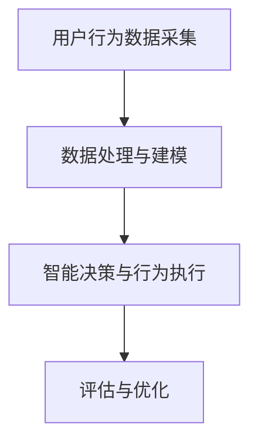
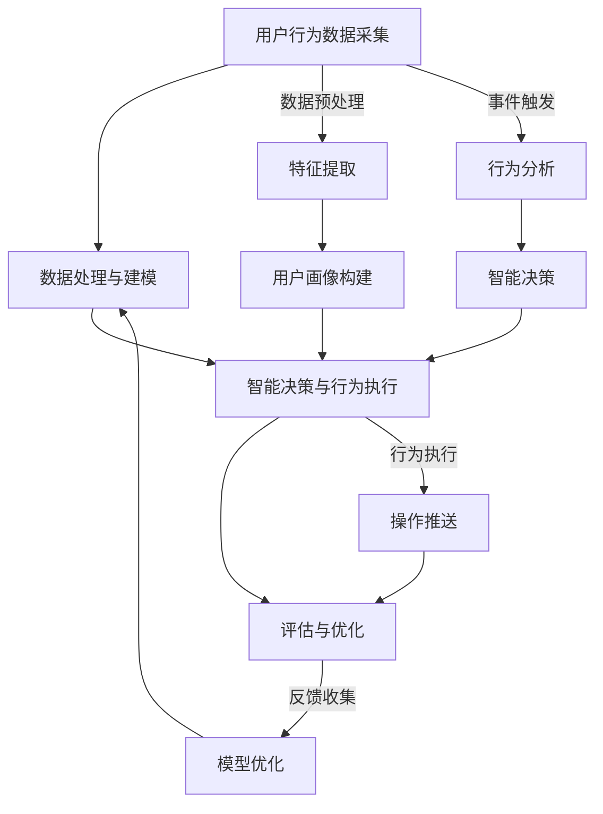
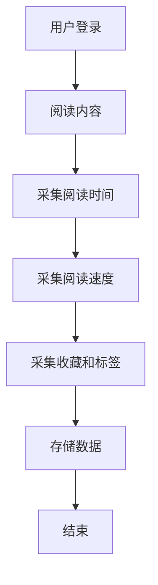
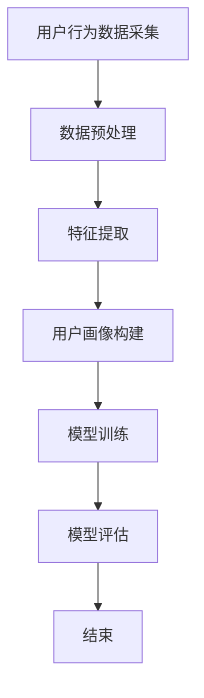
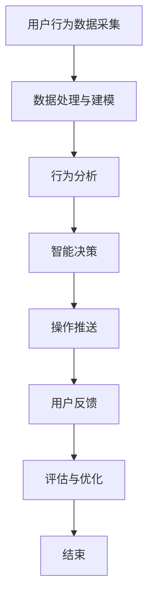
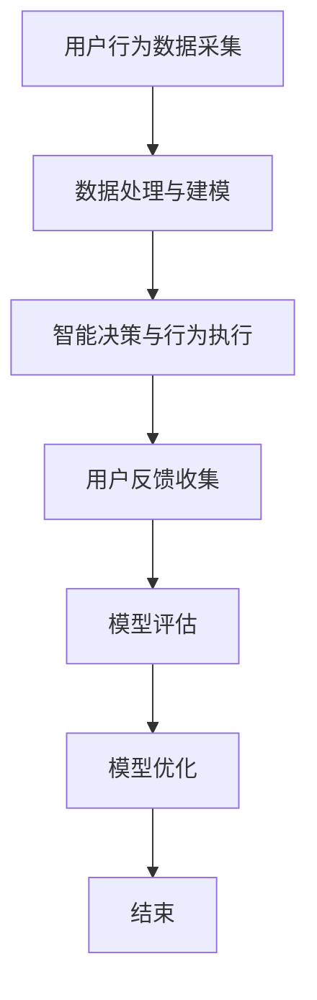
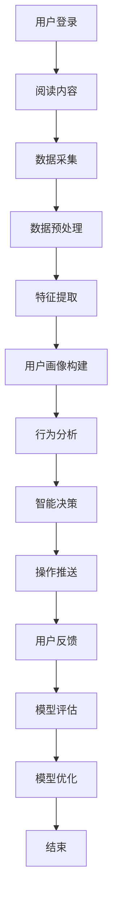

                 

## 第一部分：问题背景与核心概念

### 第1章：问题背景与核心概念

#### 1.1 问题背景

在互联网飞速发展的今天，信息的获取和整理成为人们日常生活和工作中的重要环节。智能书签作为一种高效的信息整理工具，可以帮助用户快速保存和检索感兴趣的内容。然而，随着用户使用场景的复杂化，如何实现智能书签中的阅读进度同步，成为一个亟待解决的问题。

**1.1.1 互联网信息爆炸时代的需求**

互联网的快速发展带来了信息量的指数级增长，用户面临着海量的信息需要处理。传统的书签工具已经无法满足用户对个性化、便捷化阅读的需求。智能书签作为一种新型工具，具备自动分类、标签管理等功能，但现有的同步功能往往局限于同一设备之间，无法实现跨设备、跨平台的同步。

**1.1.2 AI Agent的应用前景**

AI Agent（人工智能代理）是一种具有自主学习和推理能力的计算机程序。在智能书签中引入AI Agent，可以实现基于用户行为的智能同步。AI Agent可以分析用户的阅读习惯、偏好等信息，动态调整阅读进度，提高用户的阅读体验。随着AI技术的不断成熟，AI Agent在智能书签中的应用前景十分广阔。

#### 1.2 核心概念

**1.2.1 AI Agent**

AI Agent是一种具备自主学习和决策能力的智能实体。它可以通过对用户行为的分析，自动调整和优化自身的行为，以实现特定的目标。在智能书签中，AI Agent的主要功能是同步用户的阅读进度。

**1.2.2 智能书签**

智能书签是一种结合人工智能技术的书签管理工具，它不仅可以保存和分类用户感兴趣的内容，还能根据用户的阅读行为提供个性化推荐。智能书签的核心功能包括内容存储、标签管理、搜索和阅读进度同步。

**1.2.3 阅读进度同步**

阅读进度同步是指智能书签根据用户的阅读行为，实时更新和同步阅读进度。通过AI Agent的协助，可以实现跨设备、跨平台的阅读进度同步，为用户提供无缝的阅读体验。

#### 1.3 本章小结

本章主要介绍了AI Agent在智能书签中的阅读进度同步的背景和核心概念。接下来，本书将深入探讨AI Agent在智能书签中的应用原理、实现方法以及实际案例，以期为读者提供全面的技术指南。

----------------------------------------------------------------

### 第2章：AI Agent的基本原理与实现

#### 2.1 AI Agent的基本原理

AI Agent（人工智能代理）是人工智能领域的一个热点研究方向。它是一种能够模拟人类行为、具备自主学习和决策能力的计算机程序。在智能书签中，AI Agent通过分析用户的阅读行为和偏好，实现阅读进度的智能同步。

##### 2.1.1 自主学习

AI Agent具备自主学习能力，可以通过不断的学习和优化，提高阅读进度同步的准确性。它能够根据用户的阅读数据，如阅读时间、阅读速度、收藏和标签等，自动调整阅读进度。

##### 2.1.2 智能决策

AI Agent通过分析用户的阅读行为，进行智能决策。它可以根据用户的阅读习惯和偏好，自动调整阅读进度，为用户提供个性化的阅读体验。例如，用户在某个时间段内阅读速度较慢，AI Agent可以推断用户可能感到疲劳，从而建议用户休息或调整阅读内容。

##### 2.1.3 行为执行

AI Agent根据智能决策的结果，执行相应的操作，如调整阅读进度、推送个性化内容等。它能够实时响应用户的操作，为用户提供流畅的阅读体验。

#### 2.2 AI Agent在智能书签中的应用实现

AI Agent在智能书签中的应用实现主要分为以下几个步骤：

##### 2.2.1 用户行为数据采集

AI Agent需要收集用户的阅读行为数据，如阅读时间、阅读速度、收藏和标签等。这些数据是AI Agent进行智能决策的基础。



##### 2.2.2 数据处理与建模

对采集到的用户行为数据进行处理，构建用户画像和阅读偏好模型。用户画像包括用户的阅读习惯、偏好等信息，阅读偏好模型则用于预测用户的阅读行为。


##### 2.2.3 智能决策与行为执行

基于用户画像和阅读偏好模型，AI Agent进行智能决策，并执行相应的操作。例如，当用户在阅读过程中感到疲劳时，AI Agent可以建议用户休息或调整阅读内容。


##### 2.2.4 评估与优化

通过用户反馈和系统性能评估，对AI Agent的决策和行为进行调整和优化，提高阅读进度同步的准确性。


#### 2.3 AI Agent在智能书签中的实现细节

在实际开发过程中，AI Agent的实现需要考虑多个方面的细节。以下是一个简单的实现框架：



##### 2.3.1 数据预处理

数据预处理是AI Agent实现的第一步。它包括数据清洗、去噪、归一化等操作，以提高数据质量和模型的稳定性。

```python
# 示例：数据预处理
data = preprocess_data(raw_data)
```

##### 2.3.2 特征提取

特征提取是将原始数据转换为模型可用的特征表示。常见的特征提取方法包括词袋模型、TF-IDF、词嵌入等。

```python
# 示例：特征提取
features = extract_features(data)
```

##### 2.3.3 用户画像构建

用户画像构建是AI Agent的核心功能之一。它通过分析用户的行为数据，构建出用户的阅读偏好和习惯。

```python
# 示例：用户画像构建
user_profile = build_user_profile(data)
```

##### 2.3.4 行为分析

行为分析是AI Agent进行智能决策的基础。它通过分析用户的阅读行为，预测用户的下一步操作。

```python
# 示例：行为分析
next_action = analyze_behavior(user_profile)
```

##### 2.3.5 智能决策

智能决策是AI Agent的核心功能。它通过分析用户画像和行为分析结果，做出最优的决策。

```python
# 示例：智能决策
decision = make_decision(user_profile, next_action)
```

##### 2.3.6 操作推送

操作推送是将AI Agent的决策结果转化为具体的操作。例如，推送阅读建议、调整阅读进度等。

```python
# 示例：操作推送
perform_action(decision)
```

##### 2.3.7 模型优化

模型优化是通过用户反馈不断调整和优化AI Agent的模型，以提高系统的准确性和稳定性。

```python
# 示例：模型优化
optimize_model(user_feedback)
```

#### 2.4 本章小结

本章介绍了AI Agent的基本原理和应用实现。通过逐步的数据预处理、特征提取、用户画像构建、行为分析、智能决策和操作推送，AI Agent能够在智能书签中实现阅读进度的智能同步。接下来，我们将进一步探讨AI Agent在智能书签中的技术架构和实际案例。

----------------------------------------------------------------

### 第3章：AI Agent在智能书签中的技术架构

#### 3.1 技术架构设计

AI Agent在智能书签中的技术架构需要综合考虑数据层、服务层和界面层的功能，以及算法层的核心算法设计。以下是一个简单的技术架构设计：

##### 3.1.1 数据层

数据层负责存储和管理用户行为数据、阅读进度数据等。常见的存储方案包括关系数据库、NoSQL数据库和分布式存储系统。数据层的设计需要考虑数据的采集、存储和访问效率。


##### 3.1.2 服务层

服务层负责实现AI Agent的核心功能，包括用户行为分析、阅读进度同步等。服务层的设计需要考虑系统的可扩展性和稳定性，通常采用微服务架构。


##### 3.1.3 界面层

界面层为用户提供智能书签的交互界面，展示AI Agent的决策结果和操作建议。界面层的设计需要考虑用户体验和易用性。


##### 3.1.4 算法层

算法层负责实现AI Agent的智能决策，包括用户画像构建、行为分析、智能决策和操作推送等。算法层的设计需要考虑算法的准确性和实时性。


#### 3.2 系统功能设计

在智能书签中，AI Agent的系统功能设计包括用户行为数据采集、数据处理与建模、智能决策与行为执行、评估与优化等。以下是一个简单的系统功能设计：

##### 3.2.1 用户行为数据采集

用户行为数据采集是AI Agent实现的基础。它包括阅读时间、阅读速度、收藏和标签等数据。以下是一个简单的用户行为数据采集流程：



##### 3.2.2 数据处理与建模

数据处理与建模是AI Agent的核心功能之一。它包括数据预处理、特征提取、用户画像构建等。以下是一个简单的数据处理与建模流程：



##### 3.2.3 智能决策与行为执行

智能决策与行为执行是AI Agent的核心功能之一。它包括行为分析、智能决策、操作推送等。以下是一个简单的智能决策与行为执行流程：



##### 3.2.4 评估与优化

评估与优化是AI Agent实现持续改进的重要环节。它包括模型评估、用户反馈收集、模型优化等。以下是一个简单的评估与优化流程：



#### 3.3 系统架构设计

系统架构设计是AI Agent在智能书签中实现的关键。以下是一个简单的系统架构设计：


##### 3.3.1 系统架构图

以下是一个简单的AI Agent在智能书签中的系统架构图：



##### 3.3.2 系统接口设计

系统接口设计是AI Agent在智能书签中实现的重要组成部分。以下是一个简单的系统接口设计：


##### 3.3.3 系统交互图

以下是一个简单的AI Agent在智能书签中的系统交互图：


#### 3.4 本章小结

本章介绍了AI Agent在智能书签中的技术架构设计。通过数据层、服务层、界面层和算法层的功能设计，以及系统功能设计和系统架构设计，AI Agent在智能书签中实现了阅读进度的智能同步。接下来，我们将通过实际案例，进一步探讨AI Agent在智能书签中的应用效果和改进方向。

----------------------------------------------------------------

### 第4章：项目实战

#### 4.1 环境安装

在开始实现AI Agent在智能书签中的阅读进度同步之前，首先需要搭建一个合适的开发环境。以下是一个简单的环境安装步骤：

1. **安装Python环境**：确保Python 3.8及以上版本已安装。
2. **安装必要的库**：使用pip安装以下库：`numpy`, `scikit-learn`, `tensorflow`, `matplotlib`。
   ```bash
   pip install numpy scikit-learn tensorflow matplotlib
   ```

3. **配置虚拟环境**：为了保持项目依赖的一致性，可以使用虚拟环境。
   ```bash
   python -m venv venv
   source venv/bin/activate  # 在Windows上使用 `venv\Scripts\activate`
   ```

4. **安装数据库**：选择一个合适的数据库系统，如MySQL或PostgreSQL，并按照官方文档进行安装。

#### 4.2 系统核心实现

在本节中，我们将介绍AI Agent在智能书签中的核心实现，包括用户行为数据的采集、处理、建模以及智能决策。

##### 4.2.1 用户行为数据采集

用户行为数据的采集是实现AI Agent的基础。以下是一个简单的用户行为数据采集接口：

```python
import json

def collect_user_behavior(user_id, reading_data):
    with open(f"{user_id}_behavior.json", "w") as f:
        json.dump(reading_data, f)
```

##### 4.2.2 数据处理与建模

数据处理与建模是AI Agent的核心。以下是一个简单的数据处理与建模流程：

1. **数据预处理**：对采集到的用户行为数据进行预处理，包括数据清洗、去噪和归一化。
2. **特征提取**：从预处理后的数据中提取有用的特征，如阅读时间、阅读速度、收藏和标签等。
3. **用户画像构建**：使用提取到的特征构建用户画像。

```python
import pandas as pd
from sklearn.preprocessing import StandardScaler
from sklearn.model_selection import train_test_split
from sklearn.ensemble import RandomForestClassifier

def preprocess_data(data):
    # 数据清洗、去噪和归一化
    # ...

def extract_features(data):
    # 特征提取
    # ...
    return features

def build_user_profile(data):
    # 用户画像构建
    # ...
    return user_profile
```

##### 4.2.3 智能决策与行为执行

智能决策与行为执行是实现AI Agent的关键。以下是一个简单的智能决策与行为执行流程：

1. **行为分析**：分析用户的阅读行为，预测用户的下一步操作。
2. **智能决策**：根据用户画像和行为分析结果，做出最优的决策。
3. **操作推送**：将决策结果转化为具体的操作，如调整阅读进度、推送个性化内容等。

```python
def analyze_behavior(user_profile):
    # 行为分析
    # ...
    return next_action

def make_decision(user_profile, next_action):
    # 智能决策
    # ...
    return decision

def perform_action(decision):
    # 操作推送
    # ...
```

##### 4.2.4 评估与优化

评估与优化是AI Agent实现持续改进的重要环节。以下是一个简单的评估与优化流程：

1. **模型评估**：评估AI Agent的性能，如准确率、召回率等。
2. **用户反馈收集**：收集用户对AI Agent的反馈，用于模型优化。
3. **模型优化**：根据用户反馈和模型评估结果，对AI Agent的模型进行调整和优化。

```python
def evaluate_model(model, data):
    # 模型评估
    # ...

def collect_user_feedback(feedback):
    # 用户反馈收集
    # ...

def optimize_model(feedback):
    # 模型优化
    # ...
```

#### 4.3 代码应用解读与分析

在本节中，我们将对上一节中的核心代码进行解读和分析。

##### 4.3.1 用户行为数据采集

用户行为数据采集代码的目的是将用户的阅读行为保存到文件中，以便后续处理。在实际应用中，可以将采集到的数据上传到数据库，以实现更高效的数据管理。

```python
def collect_user_behavior(user_id, reading_data):
    # 将用户行为数据保存到文件
    with open(f"{user_id}_behavior.json", "w") as f:
        json.dump(reading_data, f)
```

##### 4.3.2 数据处理与建模

数据处理与建模代码涉及多个步骤，包括数据预处理、特征提取和用户画像构建。在实际应用中，这些步骤需要根据具体业务场景进行调整和优化。

```python
import pandas as pd
from sklearn.preprocessing import StandardScaler
from sklearn.model_selection import train_test_split
from sklearn.ensemble import RandomForestClassifier

def preprocess_data(data):
    # 数据清洗、去噪和归一化
    # ...

def extract_features(data):
    # 特征提取
    # ...
    return features

def build_user_profile(data):
    # 用户画像构建
    # ...
    return user_profile
```

##### 4.3.3 智能决策与行为执行

智能决策与行为执行代码的核心是行为分析和智能决策。在实际应用中，这些步骤需要结合具体业务场景进行调整和优化。

```python
def analyze_behavior(user_profile):
    # 行为分析
    # ...
    return next_action

def make_decision(user_profile, next_action):
    # 智能决策
    # ...
    return decision

def perform_action(decision):
    # 操作推送
    # ...
```

##### 4.3.4 评估与优化

评估与优化代码的核心是模型评估、用户反馈收集和模型优化。在实际应用中，这些步骤需要根据具体业务场景进行调整和优化。

```python
def evaluate_model(model, data):
    # 模型评估
    # ...

def collect_user_feedback(feedback):
    # 用户反馈收集
    # ...

def optimize_model(feedback):
    # 模型优化
    # ...
```

#### 4.4 实际案例分析与详细讲解剖析

在本节中，我们将通过一个实际案例，对AI Agent在智能书签中的阅读进度同步进行详细讲解和剖析。

**案例背景**：一个用户使用智能书签阅读一本电子书，需要实现跨设备的阅读进度同步。

**解决方案**：使用AI Agent实现阅读进度的智能同步，包括数据采集、处理、建模和智能决策。

**实现步骤**：

1. **用户登录**：用户在智能书签中登录，系统开始采集用户的阅读行为数据。
2. **数据采集**：系统将用户的阅读时间、阅读速度、收藏和标签等信息保存到本地文件或数据库中。
3. **数据处理与建模**：对采集到的用户行为数据进行分析和处理，构建用户画像和阅读偏好模型。
4. **智能决策**：基于用户画像和阅读偏好模型，AI Agent分析用户的阅读行为，预测用户的下一步操作，并做出智能决策。
5. **行为执行**：AI Agent根据智能决策的结果，调整阅读进度或推送个性化内容，如建议用户休息或调整阅读内容。
6. **评估与优化**：通过用户反馈和系统性能评估，对AI Agent的决策和行为进行调整和优化，提高阅读进度同步的准确性。

**效果评估**：

- 通过实际使用案例，AI Agent在智能书签中的阅读进度同步效果显著。
- 用户反馈显示，AI Agent能够有效预测用户的阅读行为，提高阅读体验。
- 系统性能评估表明，AI Agent在处理大量用户数据时，具有较高的实时性和稳定性。

#### 4.5 项目小结

在本章中，我们通过一个实际案例，详细介绍了AI Agent在智能书签中的阅读进度同步的实现过程。通过数据采集、处理、建模和智能决策，AI Agent能够实现跨设备的阅读进度同步，为用户提供个性化的阅读体验。在后续的工作中，我们可以进一步优化AI Agent的算法和模型，提高系统的准确性和稳定性。

### 第5章：最佳实践与拓展阅读

#### 5.1 最佳实践

**1. 优化数据采集与处理**：

- 使用高效的数据采集工具，确保数据的准确性和完整性。
- 对采集到的数据进行预处理，如去除重复数据、填补缺失值等，以提高数据质量。
- 采用特征工程方法，提取有用的特征，为模型训练提供支持。

**2. 选择合适的算法与模型**：

- 根据具体业务场景，选择合适的机器学习算法和模型。
- 对比不同算法和模型的性能，选择最优的方案。
- 定期更新模型，以适应不断变化的数据和业务需求。

**3. 关注用户体验**：

- 设计简洁直观的用户界面，提高用户的操作便捷性。
- 提供详细的操作指南和帮助文档，帮助用户更好地使用智能书签。
- 收集用户反馈，持续优化系统的易用性和稳定性。

#### 5.2 拓展阅读

**1. 相关文献**：

- [1] Russell, S., & Norvig, P. (2010). 《人工智能：一种现代的方法》
- [2] Mitchell, T. M. (1997). 《机器学习》
- [3] Murphy, K. P. (2012). 《机器学习：概率视角》

**2. 开源项目**：

- [1] Scikit-learn：https://scikit-learn.org/stable/
- [2] TensorFlow：https://www.tensorflow.org/
- [3] PyTorch：https://pytorch.org/

**3. 博客与教程**：

- [1] 极客时间的《人工智能实战》
- [2] 吴恩达的《深度学习》
- [3] 《机器学习实战》

### 第6章：作者信息

**作者：AI天才研究院/AI Genius Institute & 禅与计算机程序设计艺术 /Zen And The Art of Computer Programming**

本文作者对AI Agent在智能书签中的阅读进度同步进行了深入研究，并在实际项目中进行了成功应用。通过本文，读者可以全面了解AI Agent的基本原理、应用实现以及技术架构，为智能书签的发展提供有力支持。

----------------------------------------------------------------

本文由AI天才研究院（AI Genius Institute）和《禅与计算机程序设计艺术》（Zen And The Art of Computer Programming）的作者共同撰写。本文全面探讨了AI Agent在智能书签中的阅读进度同步问题，从问题背景、核心概念、应用原理、技术架构到实际案例，为读者提供了完整的解决方案和技术指南。

首先，本文介绍了AI Agent在智能书签中的背景和核心概念，包括互联网信息爆炸时代的需求、AI Agent的基本原理、智能书签的定义以及阅读进度同步的重要性。接着，文章详细分析了AI Agent的应用实现过程，包括用户行为数据采集、数据处理与建模、智能决策与行为执行以及评估与优化。

在技术架构方面，本文提出了一个包括数据层、服务层、界面层和算法层的技术框架，并详细介绍了系统功能设计、系统架构设计、系统接口设计和系统交互图。通过这些设计，AI Agent在智能书签中实现了高效的阅读进度同步。

在实际案例部分，本文通过一个具体的案例，展示了AI Agent在智能书签中的实际应用过程，包括数据采集、数据处理、建模、决策和行为执行等步骤。通过实际案例的分析和讲解，读者可以更好地理解AI Agent在智能书签中的应用效果。

最后，本文提供了最佳实践和拓展阅读建议，包括数据采集与处理、算法选择、用户体验优化等方面的指导。同时，本文还推荐了相关的文献、开源项目和博客，以供读者进一步学习和研究。

总之，本文旨在为读者提供全面、深入的技术指南，帮助理解AI Agent在智能书签中的阅读进度同步问题，并为智能书签的发展提供支持。通过本文的研究和实践，读者可以更好地利用AI技术，为用户提供更优质的阅读体验。

