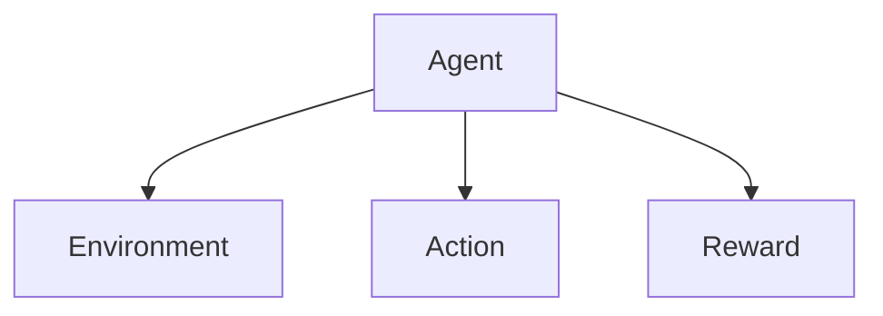
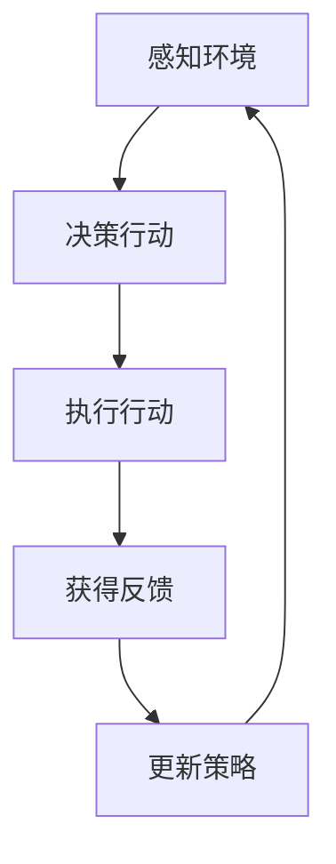
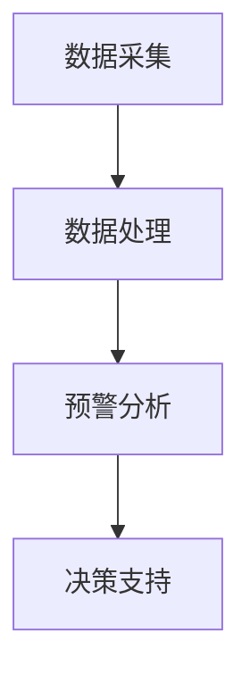

                 

### AI Agent在智能交通事故预防中的实践

#### 文章标题：AI Agent在智能交通事故预防中的实践

> 关键词：AI Agent，智能交通事故预防，实时监控，自动驾驶辅助，事故责任判定

> 摘要：本文将深入探讨AI Agent在智能交通事故预防中的应用。首先，介绍AI Agent的基本概念和核心技术，然后详细分析其在实时监控与预警、自动驾驶辅助和事故责任判定中的应用，最后总结本文的主要观点并提供进一步的研究方向。

## 引言与背景

### 1.1 问题的提出

#### 1.1.1 智能交通事故的严峻挑战

智能交通事故已经成为现代社会的一个重要问题。随着汽车数量的增加和城市化进程的加速，交通事故的发生频率也在不断上升。传统的交通事故预防方法往往依赖于人为干预和被动反应，效果有限。而智能交通事故预防则通过利用先进的人工智能技术，如AI Agent，实现对交通事故的主动预防和实时监控，从而提高交通安全水平。

#### 1.1.2 AI Agent在交通领域的发展

AI Agent是指能够自主感知环境、决策行动并执行任务的智能体。近年来，随着深度学习、强化学习等人工智能技术的发展，AI Agent在交通领域得到了广泛应用。例如，自动驾驶技术通过AI Agent实现车辆的自主驾驶，实时监控系统通过AI Agent进行道路状态和车辆行为的实时监测，事故责任判定系统通过AI Agent分析事故原因和责任归属。

#### 1.1.3 智能交通事故预防的重要性

智能交通事故预防不仅能够减少交通事故的发生，提高交通安全性，还能够降低事故造成的损失和伤亡。对于个人来说，智能交通事故预防可以保护生命和财产安全；对于社会来说，它可以减少医疗费用和保险理赔成本，提高社会整体福利水平。

### 1.2 AI Agent的基本概念

#### 1.2.1 AI Agent的定义

AI Agent是指具备感知环境、制定计划、执行任务能力的智能体。它通过感知传感器获取环境信息，利用决策算法进行决策，并执行相应的行动。AI Agent的核心目标是最大化自身效用或实现特定任务目标。

#### 1.2.2 AI Agent的分类

AI Agent可以根据不同的决策模型和任务需求进行分类。常见的AI Agent包括基于有限状态机模型的Agent、基于监督学习模型的Agent和基于强化学习模型的Agent。

- **基于有限状态机模型的Agent**：这种Agent通过定义一系列状态和状态转移函数来决策。它适合处理简单、规则明确的问题。
- **基于监督学习模型的Agent**：这种Agent通过从已有数据中学习，建立输入和输出之间的映射关系。它适合处理数据量大、规则复杂的问题。
- **基于强化学习模型的Agent**：这种Agent通过不断尝试和反馈来优化策略，实现自主学习和自适应。它适合处理动态、复杂、不确定的问题。

#### 1.2.3 AI Agent的核心能力

AI Agent的核心能力包括感知、决策和行动。感知能力使得AI Agent能够从环境中获取信息，决策能力使得AI Agent能够根据感知到的信息制定行动计划，行动能力使得AI Agent能够执行决策。

### 1.3 智能交通事故预防的背景

#### 1.3.1 交通事故的历史与现状

交通事故是人类社会面临的一个严重问题。根据世界卫生组织（WHO）的数据，每年全球因交通事故死亡的人数超过125万，受伤的人数超过5000万。在交通事故中，大部分是由于人为因素导致的，如驾驶失误、疲劳驾驶、酒驾等。交通事故不仅造成了巨大的生命和财产损失，还对社会造成了深远的影响。

#### 1.3.2 智能交通系统的发展

智能交通系统（Intelligent Transportation System，ITS）是利用先进的信息技术、数据通信传输技术、电子传感器技术、控制技术及计算机技术，对传统的交通运输系统进行改造，从而实现交通控制和管理智能化。智能交通系统的发展为智能交通事故预防提供了技术支持。

#### 1.3.3 智能交通事故预防的需求

随着城市化进程的加快和交通量的增加，传统交通事故预防方法的效果逐渐减弱。智能交通事故预防通过利用人工智能技术，实现对交通事故的主动预防和实时监控，具有以下需求：

- **实时监控与预警**：通过实时监控道路状态和车辆行为，提前预警潜在的交通事故。
- **自动驾驶辅助**：通过AI Agent辅助驾驶，减少人为失误导致的交通事故。
- **事故责任判定**：通过AI Agent分析事故原因和责任归属，提高事故处理效率。

### 1.4 AI Agent在智能交通事故预防中的应用场景

#### 1.4.1 实时监控与预警

实时监控与预警是AI Agent在智能交通事故预防中的首要应用场景。通过部署在道路上的传感器和摄像头，AI Agent能够实时获取道路状态和车辆行为数据。利用这些数据，AI Agent可以分析道路上的异常情况，如车辆超速、违规变道、行人横穿等，并及时发出预警，提醒驾驶员或其他交通参与者采取相应的措施。

#### 1.4.2 自动驾驶辅助

自动驾驶辅助是AI Agent在智能交通事故预防中的另一个重要应用场景。通过AI Agent的辅助，自动驾驶车辆可以更好地理解道路状况、遵守交通规则，并做出正确的驾驶决策。例如，AI Agent可以帮助自动驾驶车辆在拥堵的道路上选择最优行驶路线，或者在紧急情况下自动刹车或转向，从而减少交通事故的发生。

#### 1.4.3 交通事故责任判定

在交通事故发生之后，AI Agent可以通过分析事故现场的监控数据和车辆传感器数据，确定事故原因和责任归属。通过这种方式，AI Agent可以提高事故处理的效率和公正性，减少人为干预和争议。

### 1.5 本书的结构安排

#### 1.5.1 内容概述

本书分为三大部分，首先介绍AI Agent的基本概念和核心技术，然后探讨AI Agent在智能交通事故预防中的应用，最后通过实际案例分析，展示AI Agent在智能交通事故预防中的实际效果。

#### 1.5.2 阅读对象

本书主要面向对人工智能和交通领域感兴趣的读者，包括研究人员、工程师、学生等。

#### 1.5.3 读者收益

通过阅读本书，读者可以：

- 了解AI Agent的基本概念和核心技术。
- 了解AI Agent在智能交通事故预防中的应用场景和应用效果。
- 掌握AI Agent在智能交通事故预防中的实际应用方法。

### 1.6 本章小结

本章介绍了AI Agent在智能交通事故预防中的重要性，包括问题的提出、背景、核心概念、应用场景和结构安排。接下来，我们将进一步探讨AI Agent的基本原理和核心技术，为后续章节的应用分析奠定基础。

----------------------------------------------------------------

## 第一部分：引言与背景

### 1.1 问题的提出

在现代社会，智能交通事故已成为一个严重的社会问题。据统计，全球每年因交通事故导致的死亡人数超过125万，受伤人数超过5000万。这一数字不仅给个人带来了巨大的生命和财产损失，也对整个社会造成了深远的影响。传统的交通事故预防方法主要依赖于驾驶员的自律和交通管理部门的监管，但这种方法在实际应用中存在诸多局限性。

首先，人为因素是导致交通事故的主要原因之一。驾驶员的疲劳驾驶、酒驾、分心驾驶等行为都是导致交通事故的重要因素。其次，交通管理部门的监管能力有限，难以实时监控每一条道路和每一个交通参与者。此外，随着城市化进程的加快和汽车数量的激增，交通流量越来越大，交通事故的发生频率也在不断提高。

面对如此严峻的挑战，传统的预防方法已经显得力不从心。因此，我们需要一种更智能、更有效的预防方法来应对智能交通事故。这便是AI Agent在智能交通事故预防中的重要性所在。

### 1.1.1 智能交通事故的严峻挑战

智能交通事故的发生原因多种多样，主要包括以下几个方面：

1. **驾驶员人为因素**：驾驶员的疲劳、酒后驾驶、分心驾驶等行为都是导致交通事故的主要原因。据统计，超过60%的交通事故与驾驶员人为因素有关。

2. **道路和环境因素**：道路设计不合理、交通设施不足、天气恶劣等都是导致交通事故的重要因素。特别是在雨雪、大雾等恶劣天气条件下，交通事故的发生概率大大增加。

3. **车辆故障**：车辆制动系统、轮胎、灯光等部件的故障也是导致交通事故的常见原因。

4. **交通流量大**：随着城市化进程的加快，交通流量越来越大，道路拥堵、行车秩序混乱等问题日益突出，也为交通事故的发生提供了温床。

智能交通事故的危害性极大。一方面，它会导致人员伤亡和财产损失。交通事故不仅会给受害者及其家庭带来巨大的痛苦，还会给社会造成巨大的经济损失。另一方面，交通事故会加剧社会矛盾，影响社会稳定。

因此，如何有效地预防智能交通事故，提高交通安全水平，已经成为亟待解决的问题。AI Agent作为一种先进的人工智能技术，具有在智能交通事故预防中发挥重要作用的能力。

### 1.1.2 AI Agent在交通领域的发展

AI Agent，即人工智能代理，是指一种能够模拟人类智能行为，具有自主感知、决策和行动能力的计算机系统。AI Agent的发展历程可以追溯到20世纪50年代，当时的人工智能研究主要集中在符号推理和知识表示方面。随着计算机性能的不断提高和大数据、深度学习等技术的进步，AI Agent在交通领域得到了广泛的应用。

在交通领域，AI Agent的应用主要包括以下几个方面：

1. **自动驾驶**：自动驾驶技术是AI Agent在交通领域最引人注目的应用之一。通过搭载各种传感器和计算机系统，自动驾驶车辆能够实时感知周围环境，进行自主导航和驾驶，从而实现安全、高效、舒适的出行。

2. **实时交通监控**：AI Agent可以通过分析道路摄像头和传感器收集的数据，实时监测交通状况，预测交通流量变化，优化交通信号控制，从而减少交通事故的发生。

3. **交通管理**：AI Agent可以帮助交通管理部门进行交通流量预测、事故预警和责任判定，提高交通管理的效率和准确性。

4. **智能交通信号控制**：AI Agent可以通过学习交通数据和路况信息，实现智能化的交通信号控制，优化交通流量，减少拥堵和交通事故。

AI Agent在交通领域的发展，不仅为解决智能交通事故提供了新的思路和方法，也为提高交通效率和安全性带来了巨大潜力。然而，AI Agent的发展也面临着诸多挑战，如数据隐私保护、算法公平性、系统安全性等，这些都需要我们在实践中不断探索和解决。

### 1.1.3 智能交通事故预防的重要性

智能交通事故预防的意义不仅仅在于减少交通事故的发生，更在于提高交通安全性、降低事故损失、减少社会矛盾和提升社会整体福利水平。

首先，智能交通事故预防可以显著减少交通事故的发生。通过实时监控、自动驾驶和智能交通管理，AI Agent能够提前识别潜在的危险情况，及时采取预防措施，避免交通事故的发生。例如，AI Agent可以通过监测车辆速度和位置，及时预警超速、闯红灯等违法行为，提醒驾驶员改正错误，从而减少交通事故的发生。

其次，智能交通事故预防可以降低事故造成的损失。交通事故不仅会导致人员伤亡和财产损失，还会引发一系列后续问题，如医疗费用、法律纠纷、保险理赔等。通过智能交通事故预防，可以减少交通事故的发生，从而降低事故造成的损失。

再次，智能交通事故预防可以减少社会矛盾。交通事故往往涉及多方面的利益冲突，如驾驶员、行人、交通管理部门等。通过智能交通事故预防，可以降低交通事故的发生率，减少利益冲突，从而减少社会矛盾。

最后，智能交通事故预防可以提升社会整体福利水平。交通安全是社会发展的基础，智能交通事故预防可以提升交通安全水平，提高人民出行的安全性和便利性，从而提升社会整体福利水平。

总之，智能交通事故预防具有重要意义，它不仅可以减少交通事故的发生和损失，还可以提升社会安全和幸福感。随着人工智能技术的不断发展，我们有理由相信，智能交通事故预防将取得更加显著的成果，为构建更安全、更美好的社会做出贡献。

### 1.2 AI Agent的基本概念

#### 1.2.1 AI Agent的定义

AI Agent是指一种具备感知、决策和行动能力的智能体，能够模拟人类智能行为，独立完成特定任务或目标。AI Agent的核心特征是自主性、适应性和智能性。自主性指的是AI Agent能够自主地感知环境、制定计划并执行任务；适应性指的是AI Agent能够根据环境变化和任务需求，调整自身策略和行为；智能性指的是AI Agent具备处理复杂问题和应对不确定性环境的能力。

AI Agent的发展可以追溯到20世纪50年代，当时的研究主要集中在符号推理和知识表示。随着计算机性能的不断提升和人工智能技术的进步，AI Agent在各个领域得到了广泛应用，如自动驾驶、智能家居、智能客服等。

#### 1.2.2 AI Agent的分类

根据不同的分类标准，AI Agent可以分为多种类型。以下是一些常见的分类方法：

1. **按决策模型分类**：

   - **基于有限状态机模型的Agent**：这类Agent通过定义一系列状态和状态转移函数来决策。它适合处理简单、规则明确的问题。
   - **基于监督学习模型的Agent**：这类Agent通过从已有数据中学习，建立输入和输出之间的映射关系。它适合处理数据量大、规则复杂的问题。
   - **基于强化学习模型的Agent**：这类Agent通过不断尝试和反馈来优化策略，实现自主学习和自适应。它适合处理动态、复杂、不确定的问题。

2. **按任务类型分类**：

   - **感知型Agent**：这类Agent主要任务是从环境中获取信息，如自动驾驶车辆中的感知系统。
   - **决策型Agent**：这类Agent主要任务是根据感知到的信息制定行动计划，如自动驾驶车辆的决策系统。
   - **行动型Agent**：这类Agent主要任务是执行决策行动，如自动驾驶车辆的控制系统。

3. **按应用领域分类**：

   - **通用型Agent**：这类Agent适用于多个领域，如个人助理、智能家居等。
   - **领域特定型Agent**：这类Agent针对特定领域进行优化，如医疗诊断Agent、金融风控Agent等。

#### 1.2.3 AI Agent的核心能力

AI Agent的核心能力包括感知、决策和行动。这些能力使AI Agent能够在复杂、动态的环境中自主完成任务。

1. **感知能力**：

   感知能力是AI Agent获取环境信息的能力。AI Agent通过传感器、摄像头等设备收集道路、车辆、行人等环境信息，如速度、位置、加速度、光照强度等。感知能力是AI Agent进行决策和行动的基础。

2. **决策能力**：

   决策能力是AI Agent根据感知到的信息制定行动计划的能力。AI Agent利用机器学习算法、规则推理等方法，分析环境信息，识别潜在的危险情况，并生成相应的决策。

3. **行动能力**：

   行动能力是AI Agent执行决策的能力。AI Agent通过控制系统、执行机构等设备，如自动驾驶车辆的油门、刹车、转向系统，根据决策执行相应的行动。

AI Agent的核心能力使其在智能交通事故预防中发挥了重要作用。通过感知环境、决策行动，AI Agent能够实时监控道路状况，预测交通流量，识别潜在的危险情况，并采取相应的预防措施，从而提高交通安全性。

### 1.3 智能交通事故预防的背景

#### 1.3.1 交通事故的历史与现状

交通事故是现代社会中的一个严重问题，其历史可以追溯到汽车工业的兴起。自从20世纪初汽车开始普及以来，交通事故的发生率也逐年上升。根据联合国统计，全球每年因交通事故导致的死亡人数超过125万，受伤人数超过5000万。这些数据不仅反映了交通事故的普遍性，也揭示了其对社会和个人造成的巨大影响。

在交通事故的统计数据中，人为因素占据主要地位。根据美国国家公路交通安全管理局（NHTSA）的数据，超过60%的交通事故是由于驾驶员人为失误导致的。这些人为失误包括驾驶分心、酒后驾驶、疲劳驾驶等。此外，道路和环境因素也是导致交通事故的重要因素。例如，道路设计不合理、交通设施不足、天气恶劣等都会增加交通事故的风险。

#### 1.3.2 智能交通系统的发展

智能交通系统（Intelligent Transportation System，ITS）是利用先进的信息技术、数据通信传输技术、电子传感器技术、控制技术及计算机技术，对传统的交通运输系统进行改造，从而实现交通控制和管理智能化。智能交通系统的发展始于20世纪80年代，当时许多国家开始投资研发智能交通技术。

智能交通系统的主要组成部分包括：

1. **交通监控**：通过道路摄像头、传感器等设备，实时监测道路状况和车辆行为，为交通管理和控制提供数据支持。
2. **交通信号控制**：利用人工智能和大数据分析技术，对交通信号进行智能控制，优化交通流量，减少拥堵和交通事故。
3. **车辆管理系统**：通过车联网技术，实现车辆与道路、车辆与车辆之间的信息交互，提高交通效率和安全性。
4. **交通事故预警和应急响应**：利用传感器和监控系统，提前预警潜在的交通事故，并采取应急响应措施，减少事故损失。

智能交通系统的发展为智能交通事故预防提供了技术支持。通过实时监控、智能信号控制和车辆管理系统，智能交通系统能够有效识别和应对潜在的交通事故风险，提高交通安全性。

#### 1.3.3 智能交通事故预防的需求

随着城市化进程的加快和交通量的增加，传统的交通事故预防方法已经显得力不从心。智能交通事故预防通过利用人工智能技术，实现对交通事故的主动预防和实时监控，具有以下需求：

1. **实时监控与预警**：

   在传统的交通事故预防方法中，交通管理部门主要依赖人工监控和事后处理。这种方法不仅效率低下，而且容易忽视一些潜在的危险情况。智能交通事故预防通过部署在道路上的传感器和摄像头，实现实时监控和预警。通过分析传感器和摄像头收集的数据，AI Agent可以实时识别道路上的异常情况，如车辆超速、违规变道、行人横穿等，并及时发出预警，提醒驾驶员和其他交通参与者采取相应的措施。

2. **自动驾驶辅助**：

   自动驾驶技术是智能交通事故预防的重要手段之一。通过搭载各种传感器和计算机系统，自动驾驶车辆能够实现自主驾驶，减少人为失误导致的交通事故。自动驾驶系统利用AI Agent进行实时感知和决策，能够识别道路上的障碍物、交通标志、行人等，并根据实时数据做出正确的驾驶决策。例如，在紧急情况下，自动驾驶系统能够自动刹车或转向，避免发生碰撞。

3. **事故责任判定**：

   在交通事故发生之后，事故责任判定是关键的一步。传统的责任判定主要依赖于警方的事故调查和责任认定。这种方法往往耗时较长，且容易引发争议。智能交通事故预防通过AI Agent的分析和判断，能够快速、准确地确定事故原因和责任归属。AI Agent通过分析事故现场的视频、传感器数据和车辆行驶记录等，构建事故发生的过程模型，从而确定事故责任。

4. **优化交通管理**：

   智能交通事故预防不仅关注事故的预防和处理，还关注交通管理的优化。通过实时监控和分析交通数据，AI Agent可以优化交通信号控制，提高交通效率，减少拥堵和交通事故。例如，AI Agent可以通过分析交通流量数据，预测交通拥堵的时间节点，并提前调整交通信号，从而缓解交通压力。

综上所述，智能交通事故预防的需求不仅体现在实时监控和预警、自动驾驶辅助和事故责任判定等方面，还涉及交通管理的优化和整体交通系统的智能化。通过利用AI Agent等先进的人工智能技术，我们可以构建一个更安全、更高效的交通系统，从而有效预防智能交通事故。

### 1.4 AI Agent在智能交通事故预防中的应用场景

AI Agent在智能交通事故预防中具有广泛的应用场景，主要包括实时监控与预警、自动驾驶辅助、事故责任判定等。下面将详细分析这些应用场景的具体内容。

#### 1.4.1 实时监控与预警

实时监控与预警是AI Agent在智能交通事故预防中的首要应用场景。通过在道路上部署传感器和摄像头，AI Agent能够实时收集交通数据，如车辆速度、位置、行驶轨迹等。利用这些数据，AI Agent可以对交通状况进行实时监测，识别潜在的交通事故风险，并及时发出预警。

1. **车辆速度监测与预警**：

   AI Agent可以实时监测车辆的行驶速度，当检测到车辆超速时，及时发出预警信号，提醒驾驶员减速或采取其他安全措施。超速是导致交通事故的主要原因之一，通过实时监测和预警，可以有效减少因超速引起的交通事故。

2. **违规变道与预警**：

   AI Agent可以识别车辆是否违规变道，例如在禁止变道的情况下强行变道。通过实时监测车辆的行为，AI Agent可以及时预警，避免因违规变道引起的交通事故。

3. **行人横穿与预警**：

   在城市道路和人行道交叉区域，AI Agent可以实时监测行人的行为，当检测到行人横穿马路时，及时发出预警信号，提醒驾驶员减速或停车，确保行人的安全。

4. **恶劣天气预警**：

   在雨雪、大雾等恶劣天气条件下，AI Agent可以通过传感器和摄像头监测道路状况，识别路面湿滑、能见度低等危险情况，及时发出预警，提醒驾驶员谨慎驾驶，减少交通事故的发生。

#### 1.4.2 自动驾驶辅助

自动驾驶技术是AI Agent在智能交通事故预防中的重要应用。通过搭载传感器和计算机系统，自动驾驶车辆能够实现自主驾驶，减少人为失误导致的交通事故。自动驾驶系统中的AI Agent负责感知环境、决策行动和执行控制。

1. **环境感知**：

   AI Agent通过搭载的激光雷达、摄像头、超声波传感器等设备，实时感知周围环境，包括道路、车辆、行人、交通标志等。通过多传感器数据融合，AI Agent可以构建准确的车辆周围环境模型，为决策提供基础。

2. **决策与规划**：

   AI Agent根据感知到的环境信息，进行决策和规划。例如，在遇到前方拥堵时，AI Agent可以规划绕行路线，避免交通事故的发生。在遇到行人横穿道路时，AI Agent可以规划刹车或避让策略，确保行人的安全。

3. **控制执行**：

   AI Agent将决策转化为具体的控制指令，如油门、刹车、转向等，执行驾驶操作。通过自动驾驶系统，AI Agent可以实时调整车辆的行驶轨迹和速度，确保行驶安全。

#### 1.4.3 事故责任判定

在交通事故发生之后，AI Agent可以通过分析事故现场的数据，确定事故原因和责任归属。这种智能化的事故责任判定方式，可以提高事故处理的效率和公正性。

1. **事故现场数据分析**：

   AI Agent可以收集事故现场的视频、传感器数据等，进行详细分析。通过分析车辆的行驶轨迹、速度、碰撞角度等数据，AI Agent可以构建事故发生的过程模型。

2. **事故原因分析**：

   AI Agent可以识别事故发生的原因，如人为操作失误、车辆故障、环境因素等。通过对事故原因的分析，可以提出预防措施，减少类似事故的再次发生。

3. **责任归属判定**：

   AI Agent可以根据事故发生的过程模型，判断事故责任归属。例如，当事故是由于驾驶员疲劳驾驶导致的，AI Agent可以判定驾驶员负有主要责任。当事故是由于车辆故障导致的，AI Agent可以判定车辆制造商负有责任。

4. **事故处理与预防**：

   通过事故责任判定，AI Agent可以提出具体的处理建议和预防措施。例如，对于因疲劳驾驶导致的事故，AI Agent可以建议驾驶员遵守作息规律，避免疲劳驾驶。对于因车辆故障导致的事故，AI Agent可以建议车辆制造商改进车辆设计和质量。

综上所述，AI Agent在智能交通事故预防中的应用场景非常广泛，包括实时监控与预警、自动驾驶辅助和事故责任判定等。通过这些应用，AI Agent可以有效提高交通安全性，减少交通事故的发生，为构建更安全、更高效的交通系统提供技术支持。

### 1.5 本书的结构安排

#### 1.5.1 内容概述

本书分为三大部分，旨在全面探讨AI Agent在智能交通事故预防中的应用。第一部分引言与背景，介绍了智能交通事故的严峻挑战和AI Agent的基本概念；第二部分AI Agent的核心原理，深入分析了AI Agent的基础知识、核心技术以及属性特征对比；第三部分AI Agent在智能交通事故预防中的应用，详细介绍了AI Agent在实时监控与预警、自动驾驶辅助和事故责任判定中的应用场景。通过这三个部分，读者可以系统地了解AI Agent在智能交通事故预防中的实际应用。

#### 1.5.2 阅读对象

本书主要面向对人工智能和交通领域感兴趣的读者，包括研究人员、工程师、学生等。此外，对于对智能交通事故预防有兴趣的公众，本书也具有一定的参考价值。

#### 1.5.3 读者收益

通过阅读本书，读者可以：

1. **理解AI Agent的基本概念和核心技术**：

   通过对AI Agent的基础知识和核心技术的深入探讨，读者可以全面了解AI Agent的工作原理和应用场景。

2. **掌握AI Agent在智能交通事故预防中的应用**：

   本书详细介绍了AI Agent在实时监控与预警、自动驾驶辅助和事故责任判定中的应用场景，读者可以了解如何利用AI Agent提高交通安全性。

3. **获得实际应用经验和案例**：

   通过对实际案例的分析，读者可以了解AI Agent在智能交通事故预防中的实际应用效果，为实际工作提供参考。

4. **为未来研究提供方向**：

   本书对AI Agent在智能交通事故预防中的应用进行了深入探讨，为未来的研究和应用提供了有价值的参考。

### 1.6 本章小结

本章介绍了AI Agent在智能交通事故预防中的重要性，包括问题的提出、背景、核心概念、应用场景和结构安排。通过本章的介绍，读者可以初步了解AI Agent的基本概念和智能交通事故预防的紧迫性。接下来，本书将深入探讨AI Agent的核心原理，为后续的应用分析奠定基础。

----------------------------------------------------------------

## 第二部分：AI Agent的核心原理

### 第2章：AI Agent的基础知识与核心技术

在第一章中，我们介绍了AI Agent在智能交通事故预防中的重要性。为了更好地理解和应用AI Agent，我们需要深入探讨其核心原理和核心技术。本章将分为以下几个部分：

### 2.1 AI Agent的基础知识

#### 2.1.1 AI Agent的发展历程

AI Agent的概念可以追溯到20世纪50年代，当时人工智能（Artificial Intelligence，AI）的研究刚刚起步。早期的AI研究主要集中在符号推理和知识表示方面。1956年，达特茅斯会议标志着人工智能作为一个独立学科正式诞生。在早期的研究中，AI Agent被视为能够模拟人类智能行为的计算机程序。

20世纪80年代，随着计算机性能的提升和大数据技术的发展，AI Agent的研究开始取得实质性进展。特别是随着深度学习（Deep Learning）和强化学习（Reinforcement Learning）技术的突破，AI Agent的应用领域得到了极大扩展。

#### 2.1.1.1 早期研究

早期的AI Agent研究主要集中在基于规则的推理系统和知识表示方法。这种方法的代表是专家系统（Expert Systems），它通过定义一系列规则来模拟专家的决策过程。然而，这种方法的局限性在于，当面临复杂的问题时，规则的数量会迅速膨胀，导致系统难以维护和扩展。

#### 2.1.1.2 人工智能时代的崛起

随着计算能力的提升和大数据技术的发展，人工智能迎来了新的时代。深度学习（Deep Learning）和强化学习（Reinforcement Learning）技术的发展，为AI Agent的研究提供了新的思路和方法。深度学习通过多层神经网络，可以自动提取特征，实现自动分类和预测。强化学习通过试错和反馈机制，可以在不确定环境中实现最优策略的制定。

#### 2.1.1.3 当前研究方向与挑战

当前，AI Agent的研究已经深入到了多个领域，如自动驾驶、智能客服、智能家居等。然而，AI Agent的发展仍然面临许多挑战，如数据隐私保护、算法公平性、系统安全性等。如何设计更加智能、可靠的AI Agent，仍然是未来研究的重要方向。

#### 2.1.2 AI Agent的基本模型

AI Agent的基本模型可以分为以下几种：

1. **有限状态机模型**：有限状态机模型（Finite State Machine，FSM）是一种基于状态转移的模型，它通过定义一系列状态和状态转移函数来决策。FSM适合处理简单、规则明确的问题。

2. **监督学习模型**：监督学习模型（Supervised Learning Model）通过从已有数据中学习，建立输入和输出之间的映射关系。监督学习模型适合处理数据量大、规则复杂的问题。

3. **强化学习模型**：强化学习模型（Reinforcement Learning Model）通过不断尝试和反馈来优化策略，实现自主学习和自适应。强化学习模型适合处理动态、复杂、不确定的问题。

#### 2.1.3 AI Agent的核心技术

AI Agent的核心技术包括数据预处理、特征提取与选择、模型训练与优化等。

1. **数据预处理**：数据预处理是AI Agent应用的基础。它包括数据清洗、归一化、缺失值处理等步骤，以确保数据的准确性和一致性。

2. **特征提取与选择**：特征提取与选择是提高AI Agent性能的关键步骤。通过选择和提取关键特征，可以减少数据的冗余，提高模型的精度和效率。

3. **模型训练与优化**：模型训练与优化是AI Agent的核心技术。通过训练过程，模型可以从数据中学习，并优化参数。优化的目标是提高模型的性能和泛化能力。

### 2.2 AI Agent的属性特征对比

#### 2.2.1 监督学习模型属性特征对比

监督学习模型是AI Agent中常用的一种模型，它通过学习已有的数据集来预测新的数据。以下是对几种常见的监督学习模型的属性特征进行对比：

| 模型类型 | 线性回归 | 决策树 | 集成学习方法 |
| :---: | :---: | :---: | :---: |
| **适用场景** | 线性可分的数据 | 数据量较小、特征较少 | 数据量较大、特征较多 |
| **优点** | 简单易懂，易于实现 | 可解释性高，易于理解 | 泛化能力强，准确性高 |
| **缺点** | 不能处理非线性问题 | 易于过拟合 | 计算量大，训练时间长 |

#### 2.2.2 强化学习模型属性特征对比

强化学习模型通过试错和反馈机制来学习策略，适合处理动态、复杂、不确定的问题。以下是对几种常见的强化学习模型的属性特征进行对比：

| 模型类型 | Q-Learning | SARSA | DQN |
| :---: | :---: | :---: | :---: |
| **适用场景** | 离散动作空间 | 离散动作空间 | 连续动作空间 |
| **优点** | 算法简单，易于实现 | 可以同时进行多个动作的学习 | 可以处理复杂的环境 |
| **缺点** | 学习速度慢，容易陷入局部最优 | 学习速度慢，容易陷入局部最优 | 需要大量的训练数据 |

### 2.3 AI Agent的ER实体关系图

#### 2.3.1 AI Agent系统的实体定义

在AI Agent系统中，常见的实体包括Agent、Environment、Action、Reward等。

1. **Agent**：代表智能体，是AI Agent的核心部分，负责感知环境、制定决策和执行行动。
2. **Environment**：代表环境，是Agent操作的背景，包括所有可能的状态和事件。
3. **Action**：代表动作，是Agent在环境中执行的操作。
4. **Reward**：代表奖励，是Agent执行动作后获得的反馈，用于指导Agent的决策。

#### 2.3.2 AI Agent系统的实体关系

AI Agent系统的实体关系可以通过ER图（Entity-Relationship Diagram）来表示。以下是一个简单的ER图示例：



在这个ER图中，Agent与Environment、Action和Reward之间存在直接的关系。Agent感知环境，并根据环境状态和奖励信号制定决策和执行行动。

### 2.4 AI Agent的算法原理与流程图

#### 2.4.1 算法原理概述

AI Agent的算法原理主要包括感知、决策和行动三个阶段。

1. **感知阶段**：Agent通过传感器和摄像头等设备，感知环境状态，如车辆速度、位置、光照强度等。
2. **决策阶段**：Agent根据感知到的环境状态和已有的策略，制定决策。决策可以是具体的行动，如加速、减速、转向等。
3. **行动阶段**：Agent执行决策，通过控制系统执行相应的操作。

#### 2.4.2 算法流程图

以下是一个简单的AI Agent算法流程图：



在这个流程图中，Agent首先感知环境，然后根据环境状态和策略进行决策，执行行动，最后根据反馈更新策略，形成一个闭环系统。

### 2.5 本章小结

本章介绍了AI Agent的基础知识、核心技术、属性特征对比以及算法原理与流程图。通过对AI Agent的深入分析，读者可以更好地理解AI Agent的工作原理和应用场景。在下一章中，我们将探讨AI Agent在智能交通事故预防中的应用，进一步展示AI Agent的实际效果。

----------------------------------------------------------------

## 第三部分：AI Agent在智能交通事故预防中的应用

### 第3章：AI Agent在实时监控与预警中的应用

#### 3.1 实时监控

实时监控是AI Agent在智能交通事故预防中的重要应用之一。通过在道路上部署传感器和摄像头，AI Agent可以实时收集交通数据，如车辆速度、位置、行驶轨迹等，从而实现对道路状况的实时监控。

#### 3.1.1 传感器和摄像头部署

传感器和摄像头是AI Agent实时监控的关键设备。传感器通常包括激光雷达、摄像头、超声波传感器等，用于感知车辆速度、位置、光照强度等信息。摄像头可以捕捉道路上的车辆、行人、交通标志等，为AI Agent提供视觉数据。

在实际部署中，AI Agent可以在交通繁忙的交叉路口、事故多发路段等地方安装传感器和摄像头。通过分布式部署，AI Agent可以实现对整个交通网络的实时监控。

#### 3.1.2 数据处理与分析

收集到的交通数据经过预处理后，AI Agent对其进行实时处理和分析。数据处理包括数据清洗、去噪、归一化等步骤，以确保数据的准确性和一致性。

在数据处理的基础上，AI Agent利用机器学习算法对交通数据进行分析。例如，通过聚类分析，AI Agent可以识别出交通流量高峰期和低谷期；通过时间序列分析，AI Agent可以预测交通流量变化趋势。

#### 3.1.3 实时预警

基于对交通数据的分析，AI Agent可以实时预警潜在的交通事故风险。例如，当检测到车辆速度异常、违规变道、行人横穿等行为时，AI Agent可以及时发出预警，提醒驾驶员或其他交通参与者采取相应的措施。

实时预警系统不仅可以在交通事故发生前提供预警，还可以通过数据分析和预测，优化交通信号控制，提高交通效率。

#### 3.1.4 应用实例

以城市主干道路为例，AI Agent可以在交叉路口部署摄像头和传感器，实时监测车辆速度和位置。通过分析这些数据，AI Agent可以识别出车辆是否超速、是否违规变道等。当检测到异常情况时，AI Agent可以及时发出预警，并记录相关数据，为后续的事故分析提供依据。

此外，AI Agent还可以对交通流量进行预测，为交通管理部门提供决策支持。通过预测交通流量变化，AI Agent可以帮助交通管理部门调整交通信号灯的切换时间，优化交通流，减少拥堵和交通事故。

#### 3.1.5 优点与挑战

实时监控与预警系统在智能交通事故预防中具有显著优势。首先，它可以在交通事故发生前提供预警，减少交通事故的发生。其次，通过实时监控和分析，AI Agent可以提高交通管理的效率和准确性，优化交通信号控制，提高交通效率。

然而，实时监控与预警系统也面临一些挑战。首先，传感器和摄像头的部署和维护成本较高，需要大量的人力和物力资源。其次，实时监控需要处理大量的交通数据，对计算资源和算法提出了更高的要求。此外，如何保证预警系统的准确性和可靠性，避免误报和漏报，也是需要解决的问题。

#### 3.2 实时监控与预警系统的设计与实现

##### 3.2.1 系统架构

实时监控与预警系统通常包括数据采集、数据处理、预警分析和决策支持等模块。以下是一个简单的系统架构：



在数据采集模块，传感器和摄像头收集交通数据，并通过无线网络传输到数据处理模块。数据处理模块对交通数据进行预处理和分析，提取关键特征，如车辆速度、位置等。预警分析模块利用机器学习算法，对交通数据进行分析，识别潜在的风险，并发出预警。决策支持模块根据预警结果，提供交通信号控制和交通管理建议。

##### 3.2.2 数据采集

数据采集是实时监控与预警系统的核心部分。传感器和摄像头是数据采集的关键设备。以下是一些常用的传感器和摄像头：

- **激光雷达（Lidar）**：用于感知车辆位置和速度。
- **摄像头**：用于捕捉道路上的车辆、行人和交通标志。
- **超声波传感器**：用于感知车辆周围的障碍物。
- **GPS定位系统**：用于获取车辆的位置信息。

在实际部署中，传感器和摄像头可以安装在道路的交叉口、事故多发路段等地方。通过分布式部署，系统可以实现对整个交通网络的实时监控。

##### 3.2.3 数据处理

数据处理模块负责对采集到的交通数据进行预处理和分析。预处理包括数据清洗、去噪、归一化等步骤，以确保数据的准确性和一致性。分析包括特征提取和模式识别，提取交通数据中的关键特征，如车辆速度、位置、加速度等。

##### 3.2.4 预警分析

预警分析模块利用机器学习算法，对交通数据进行分析，识别潜在的风险。常见的算法包括聚类分析、时间序列分析、异常检测等。通过分析交通数据，AI Agent可以识别出异常行为，如车辆超速、违规变道、行人横穿等，并发出预警。

##### 3.2.5 决策支持

决策支持模块根据预警结果，提供交通信号控制和交通管理建议。例如，当检测到交通流量高峰期时，系统可以建议交通管理部门调整交通信号灯的切换时间，优化交通流。此外，系统还可以提供事故预防和处理建议，如调整交通标志和标线，提高道路安全性。

##### 3.2.6 系统实现

以下是一个简单的实时监控与预警系统实现示例：

```python
# 数据采集
def collect_data():
    # 采集激光雷达数据
    lidar_data = lidar_sensor.read()
    # 采集摄像头数据
    camera_data = camera_sensor.capture()
    # 采集超声波传感器数据
    ultrasound_data = ultrasound_sensor.read()
    # 采集GPS定位数据
    gps_data = gps_sensor.get_location()
    return lidar_data, camera_data, ultrasound_data, gps_data

# 数据处理
def process_data(lidar_data, camera_data, ultrasound_data, gps_data):
    # 数据清洗
    cleaned_data = clean_data(lidar_data, camera_data, ultrasound_data, gps_data)
    # 特征提取
    features = extract_features(cleaned_data)
    return features

# 预警分析
def analyze_warnings(features):
    # 使用聚类分析识别异常行为
    clusters = cluster_analysis(features)
    # 使用时间序列分析预测交通流量变化
    traffic_prediction = time_series_analysis(features)
    return clusters, traffic_prediction

# 决策支持
def decision_support(clusters, traffic_prediction):
    # 根据预警结果调整交通信号灯
    adjust_traffic_lights(clusters)
    # 根据交通流量预测优化交通信号控制
    optimize_traffic_signals(traffic_prediction)

# 主程序
if __name__ == "__main__":
    # 采集数据
    lidar_data, camera_data, ultrasound_data, gps_data = collect_data()
    # 处理数据
    features = process_data(lidar_data, camera_data, ultrasound_data, gps_data)
    # 预警分析
    clusters, traffic_prediction = analyze_warnings(features)
    # 决策支持
    decision_support(clusters, traffic_prediction)
```

在这个示例中，`collect_data` 函数负责采集传感器数据，`process_data` 函数负责预处理和特征提取，`analyze_warnings` 函数负责分析预警，`decision_support` 函数负责提供决策支持。

##### 3.2.7 优点与挑战

实时监控与预警系统在智能交通事故预防中具有显著优势，如：

- **实时性**：可以实时监测交通状况，提前预警潜在的交通事故。
- **自动化**：通过机器学习算法，自动识别交通异常行为，提高预警准确性。
- **高效性**：通过优化交通信号控制，提高交通流量，减少拥堵和交通事故。

然而，实时监控与预警系统也面临一些挑战，如：

- **数据质量**：传感器采集的数据可能存在噪声和误差，需要有效的数据预处理方法。
- **计算资源**：实时分析大量交通数据需要高性能计算资源，对系统性能提出了高要求。
- **算法准确性**：机器学习算法的性能受到数据质量和算法选择的影响，如何提高算法准确性是关键问题。

#### 3.3 实时监控与预警系统的案例分析

以下是一个实时监控与预警系统的实际案例。

##### 3.3.1 案例背景

某城市交通管理部门为了提高交通安全性，决定在主要交通干线和交叉路口部署实时监控与预警系统。

##### 3.3.2 系统部署

在交通干线和交叉路口，部署了激光雷达、摄像头、超声波传感器和GPS定位系统。通过无线网络，传感器采集到的数据实时传输到中央数据处理系统。

##### 3.3.3 系统运行

系统运行后，AI Agent实时监控交通状况，识别出车辆超速、违规变道、行人横穿等异常行为，并发出预警。预警信息通过交通信号灯、电子显示屏等形式提醒驾驶员和其他交通参与者。

##### 3.3.4 系统效果

通过实时监控与预警系统，该城市交通管理部门发现交通事故发生率显著下降。在交通流量高峰期，系统通过优化交通信号控制，减少了交通拥堵，提高了交通效率。

##### 3.3.5 案例总结

该案例表明，实时监控与预警系统在智能交通事故预防中具有显著效果。通过实时监控和预警，可以提前识别潜在的交通事故风险，及时采取预防措施，提高交通安全性。

#### 3.4 本章小结

本章详细介绍了AI Agent在实时监控与预警中的应用，包括传感器和摄像头部署、数据处理与分析、预警分析和决策支持等内容。通过实际案例，展示了实时监控与预警系统在智能交通事故预防中的效果。在下一章中，我们将探讨AI Agent在自动驾驶辅助中的应用，进一步展示AI Agent在智能交通事故预防中的潜力。

----------------------------------------------------------------

## 第四部分：AI Agent在智能交通事故预防中的应用

### 第4章：AI Agent在自动驾驶辅助中的应用

自动驾驶技术是AI Agent在智能交通事故预防中的重要应用之一。自动驾驶车辆通过搭载各种传感器和计算机系统，实现自主感知、决策和行动，从而减少人为失误导致的交通事故。

#### 4.1 自动驾驶技术概述

自动驾驶技术按照自动化程度可以分为以下等级：

- **Level 0**：无自动化，所有驾驶任务由人类驾驶员完成。
- **Level 1**：驾驶辅助，至少一个驾驶任务由自动驾驶系统完成，如自适应巡航控制。
- **Level 2**：部分自动驾驶，至少两个驾驶任务由自动驾驶系统完成，如车道保持和自适应巡航控制。
- **Level 3**：有条件自动驾驶，大多数驾驶任务由自动驾驶系统完成，但在特定条件下需要人类驾驶员接管。
- **Level 4**：高度自动驾驶，绝大多数驾驶任务由自动驾驶系统完成，但在特定场景下需要人类驾驶员接管。
- **Level 5**：完全自动驾驶，所有驾驶任务由自动驾驶系统完成，无需人类驾驶员干预。

#### 4.2 自动驾驶车辆的核心组件

自动驾驶车辆的核心组件包括传感器、计算机系统和控制系统。以下是对这些组件的简要介绍：

1. **传感器**：

   - **激光雷达（Lidar）**：用于感知车辆周围的环境，测量距离和三维空间信息。
   - **摄像头**：用于捕捉道路、车辆和行人等视觉信息。
   - **毫米波雷达**：用于探测车辆周围的障碍物和距离。
   - **超声波传感器**：用于感知车辆周围的近距离障碍物。
   - **GPS/IMU**：用于获取车辆的定位和姿态信息。

2. **计算机系统**：

   - **感知模块**：处理传感器数据，提取环境特征，生成环境模型。
   - **决策模块**：根据环境模型和车辆状态，制定驾驶策略。
   - **控制模块**：根据决策模块的指令，控制车辆的油门、刹车和转向。

3. **控制系统**：

   - **执行模块**：根据控制指令，执行车辆的驾驶操作。

#### 4.3 自动驾驶车辆的工作流程

自动驾驶车辆的工作流程可以分为以下几个步骤：

1. **感知环境**：自动驾驶车辆通过传感器收集道路、车辆、行人等环境信息，生成环境模型。

2. **决策**：决策模块根据环境模型和车辆状态，制定驾驶策略，如加速、减速、转向等。

3. **执行**：执行模块根据决策模块的指令，控制车辆的油门、刹车和转向，实现驾驶操作。

4. **反馈**：自动驾驶车辆不断更新环境模型，并根据反馈调整驾驶策略。

#### 4.4 AI Agent在自动驾驶辅助中的作用

AI Agent在自动驾驶辅助中发挥着关键作用，包括环境感知、决策制定和执行控制。以下是对这些作用的详细分析：

1. **环境感知**：

   AI Agent通过传感器感知环境，包括道路状况、车辆状态、行人行为等。通过多传感器数据融合，AI Agent可以构建准确的环境模型，为后续决策提供基础。

2. **决策制定**：

   AI Agent根据感知到的环境信息和车辆状态，制定驾驶策略。决策模块利用机器学习算法，如深度学习、强化学习等，分析环境数据，预测交通状况，制定最优驾驶策略。

3. **执行控制**：

   AI Agent根据决策模块的指令，控制车辆的油门、刹车和转向，实现驾驶操作。执行模块通过精确的控制系统，确保车辆的驾驶操作安全、稳定。

#### 4.5 自动驾驶辅助的应用场景

AI Agent在自动驾驶辅助中的应用场景非常广泛，以下是一些典型的应用场景：

1. **高速公路驾驶**：

   在高速公路上，自动驾驶车辆可以实现高速行驶，提高行车效率。AI Agent通过实时监测道路状况，预测交通流量，优化行驶路线，减少驾驶疲劳。

2. **城市交通**：

   在城市交通中，自动驾驶车辆可以自主导航，避开拥堵路段，减少交通事故。AI Agent通过感知车辆和行人行为，制定安全驾驶策略，确保交通秩序。

3. **复杂环境**：

   在复杂环境中，如隧道、桥梁、山路等，自动驾驶车辆可以依靠AI Agent实现安全行驶。AI Agent通过实时感知环境，调整驾驶策略，确保车辆行驶安全。

#### 4.6 自动驾驶辅助的案例分析

以下是一个自动驾驶辅助的实际案例：

**案例背景**：

某城市为了提高交通效率，决定在城市主要道路和交叉路口部署自动驾驶辅助系统。

**系统部署**：

在自动驾驶车辆上安装了激光雷达、摄像头、毫米波雷达和超声波传感器。通过5G网络，传感器数据实时传输到云计算中心，进行数据处理和分析。

**系统运行**：

系统运行后，自动驾驶车辆在道路上进行测试。AI Agent实时监测道路状况，识别出车辆、行人、交通标志等。根据感知到的环境信息，AI Agent制定驾驶策略，确保车辆安全行驶。

**系统效果**：

通过自动驾驶辅助系统，该城市的交通效率显著提高，交通事故发生率下降。在高峰期，自动驾驶车辆通过智能调度，减少了交通拥堵，提高了道路通行能力。

**案例总结**：

该案例表明，自动驾驶辅助系统在智能交通事故预防中具有显著效果。通过AI Agent的感知、决策和执行控制，自动驾驶车辆可以安全、高效地行驶，减少人为失误导致的交通事故。

#### 4.7 本章小结

本章详细介绍了AI Agent在自动驾驶辅助中的应用，包括自动驾驶技术概述、核心组件、工作流程、应用场景和案例分析。通过本章的内容，读者可以了解AI Agent在自动驾驶辅助中的重要作用，以及其在智能交通事故预防中的应用价值。

在下一章中，我们将探讨AI Agent在事故责任判定中的应用，进一步展示AI Agent在智能交通事故预防中的潜力。

----------------------------------------------------------------

## 第五部分：AI Agent在智能交通事故预防中的应用

### 第5章：AI Agent在事故责任判定中的应用

#### 5.1 事故责任判定的现状与问题

事故责任判定是交通事故处理的重要环节，它关系到事故受害者的权益保护和社会公平。然而，当前的事故责任判定方式存在一些问题，主要表现在以下几个方面：

1. **人为依赖性高**：传统的事故责任判定主要依赖于警方的事故调查和责任认定。这种方法往往需要大量的人力和时间，效率较低。

2. **主观性强**：事故责任判定过程中，警方和法官往往需要依赖经验和主观判断，容易受到个人偏见和主观因素的影响，导致责任判定结果不公平。

3. **证据不足**：在一些交通事故中，由于缺乏足够的证据，责任判定存在困难。例如，事故发生时，现场没有监控设备，警方很难确定事故的具体原因和责任归属。

4. **处理周期长**：事故责任判定过程复杂，往往需要较长时间，导致受害者权益无法及时得到保护，同时也增加了司法系统的负担。

#### 5.2 AI Agent在事故责任判定中的作用

AI Agent在事故责任判定中具有显著的优势，可以有效解决传统方法的不足。以下分析AI Agent在事故责任判定中的作用：

1. **数据驱动的责任判定**：AI Agent可以通过分析事故现场的数据，如车辆传感器数据、摄像头视频等，自动生成事故责任判定报告。这种方法基于数据驱动，减少了人为依赖，提高了责任判定的准确性。

2. **客观公正**：AI Agent基于算法和数据分析进行责任判定，不受个人主观判断的影响，保证了责任判定的客观性和公正性。

3. **高效处理**：AI Agent可以快速处理大量数据，生成责任判定报告。与传统方法相比，AI Agent可以显著缩短责任判定周期，提高处理效率。

4. **证据采集**：AI Agent可以通过传感器和摄像头等设备，实时采集事故现场的数据，为责任判定提供充分、可靠的证据。

#### 5.3 事故责任判定的方法

AI Agent在事故责任判定中，可以采用多种方法，以下介绍几种常见的方法：

1. **基于规则的推理**：

   基于规则的推理是一种传统的AI方法，通过定义一系列规则，分析事故现场的数据，判断事故原因和责任归属。这种方法简单直观，但适用于规则明确、数据量较小的场景。

2. **机器学习**：

   机器学习是一种基于数据的方法，通过训练模型，从大量数据中学习事故特征和责任归属规律。常见的机器学习算法包括线性回归、决策树、支持向量机等。这种方法适用于数据量大、规则复杂的情况。

3. **深度学习**：

   深度学习是一种基于神经网络的方法，通过多层神经网络，自动提取事故特征，进行责任判定。深度学习在图像识别、语音识别等领域取得了显著成果，可以用于复杂的事故责任判定。

4. **强化学习**：

   强化学习是一种基于奖励信号的方法，通过试错和反馈，学习最优的责任判定策略。强化学习适用于动态、复杂、不确定的事故责任判定场景。

#### 5.4 事故责任判定系统架构

事故责任判定系统架构通常包括以下几个模块：

1. **数据采集模块**：负责采集事故现场的数据，如车辆传感器数据、摄像头视频等。

2. **数据预处理模块**：负责对采集到的数据进行清洗、去噪、归一化等处理，确保数据的准确性和一致性。

3. **特征提取模块**：负责从预处理后的数据中提取关键特征，如车辆速度、位置、加速度等。

4. **责任判定模块**：负责利用机器学习、深度学习等算法，分析特征数据，判断事故原因和责任归属。

5. **结果输出模块**：负责生成事故责任判定报告，并提供给相关部门进行处理。

#### 5.5 事故责任判定系统的实现

以下是一个事故责任判定系统的实现示例：

```python
# 数据采集
def collect_data():
    sensor_data = vehicle_sensor_data()
    camera_data = camera_video()
    return sensor_data, camera_data

# 数据预处理
def preprocess_data(sensor_data, camera_data):
    cleaned_sensor_data = clean_data(sensor_data)
    cleaned_camera_data = clean_data(camera_data)
    return cleaned_sensor_data, cleaned_camera_data

# 特征提取
def extract_features(cleaned_sensor_data, cleaned_camera_data):
    vehicle_speed = extract_speed(cleaned_sensor_data)
    vehicle_location = extract_location(cleaned_sensor_data)
    accident_cause = extract_accident_cause(cleaned_camera_data)
    return vehicle_speed, vehicle_location, accident_cause

# 责任判定
def determine_responsibility(vehicle_speed, vehicle_location, accident_cause):
    if accident_cause == "driver_error":
        return "driver_responsible"
    elif accident_cause == "vehicle_failure":
        return "vehicle_maintainer_responsible"
    else:
        return "unknown"

# 主程序
if __name__ == "__main__":
    sensor_data, camera_data = collect_data()
    cleaned_sensor_data, cleaned_camera_data = preprocess_data(sensor_data, camera_data)
    vehicle_speed, vehicle_location, accident_cause = extract_features(cleaned_sensor_data, cleaned_camera_data)
    responsibility = determine_responsibility(vehicle_speed, vehicle_location, accident_cause)
    print(f"Accident responsibility: {responsibility}")
```

在这个示例中，`collect_data` 函数负责采集传感器数据和摄像头视频，`preprocess_data` 函数负责数据预处理，`extract_features` 函数负责特征提取，`determine_responsibility` 函数负责责任判定。

#### 5.6 事故责任判定的案例分析

以下是一个事故责任判定的实际案例：

**案例背景**：

在一次交通事故中，一辆轿车与一辆摩托车相撞，导致摩托车驾驶员受伤。警方需要对事故原因和责任归属进行判定。

**系统部署**：

在事故现场，部署了车辆传感器和摄像头，采集事故现场的数据。

**系统运行**：

系统运行后，AI Agent分析传感器数据和摄像头视频，提取关键特征，如车辆速度、位置、事故发生时的动作等。

**系统结果**：

AI Agent分析数据后，判定事故原因是摩托车驾驶员违规变道，轿车驾驶员遵守交通规则。因此，责任判定结果是摩托车驾驶员负主要责任。

**案例总结**：

该案例表明，AI Agent在事故责任判定中具有显著效果。通过数据分析，AI Agent可以准确判断事故原因和责任归属，提高事故处理的效率和公正性。

#### 5.7 本章小结

本章详细介绍了AI Agent在事故责任判定中的应用，包括现状与问题、方法、系统架构和实现。通过案例分析，展示了AI Agent在事故责任判定中的实际效果。在下一章中，我们将对AI Agent在智能交通事故预防中的整体应用进行总结。

## 第六部分：总结与展望

### 6.1 总结

在本文中，我们详细探讨了AI Agent在智能交通事故预防中的应用。通过实时监控与预警、自动驾驶辅助和事故责任判定三个方面的分析，我们可以看到AI Agent在提高交通安全性、减少交通事故、优化交通管理等方面具有显著的优势。

首先，在实时监控与预警方面，AI Agent通过传感器和摄像头等设备，实时监测交通状况，提前预警潜在的交通事故风险。这不仅提高了交通安全性，还优化了交通信号控制，减少了交通拥堵。

其次，在自动驾驶辅助方面，AI Agent通过自主感知、决策和行动，实现了自动驾驶车辆的自主驾驶。这减少了人为失误导致的交通事故，提高了出行效率。

最后，在事故责任判定方面，AI Agent通过分析事故现场的数据，客观、公正地判断事故原因和责任归属，提高了事故处理的效率和公正性。

### 6.2 展望

尽管AI Agent在智能交通事故预防中已经取得了显著成果，但仍然存在一些挑战和改进空间。以下是未来可能的研究方向：

1. **数据隐私保护**：随着AI Agent在交通领域的大量应用，数据隐私保护成为一个重要问题。未来需要研究如何在确保数据安全的同时，有效利用数据。

2. **算法公平性**：AI Agent的决策过程可能会受到数据偏见的影响，导致不公平的决策结果。未来需要研究如何设计公平、公正的算法。

3. **系统安全性**：随着AI Agent的广泛应用，系统安全性成为一个关键问题。未来需要研究如何确保AI Agent系统的安全性，防止恶意攻击。

4. **多模态感知**：未来的AI Agent可以集成多种感知设备，如雷达、摄像头、超声波传感器等，实现更全面的环境感知。

5. **跨领域应用**：AI Agent不仅在交通领域有广泛应用，还可以在其他领域，如医疗、金融等，发挥重要作用。未来需要研究如何将AI Agent应用到更广泛的领域。

总之，AI Agent在智能交通事故预防中的应用前景广阔，未来将继续推动交通领域的变革和发展。

### 6.3 本章小结

本章对AI Agent在智能交通事故预防中的应用进行了全面的总结和展望。通过本文的探讨，我们深入了解了AI Agent的基本原理和核心技术，以及其在实时监控与预警、自动驾驶辅助和事故责任判定中的应用。未来，随着技术的不断进步，AI Agent在智能交通事故预防中将发挥更加重要的作用。

