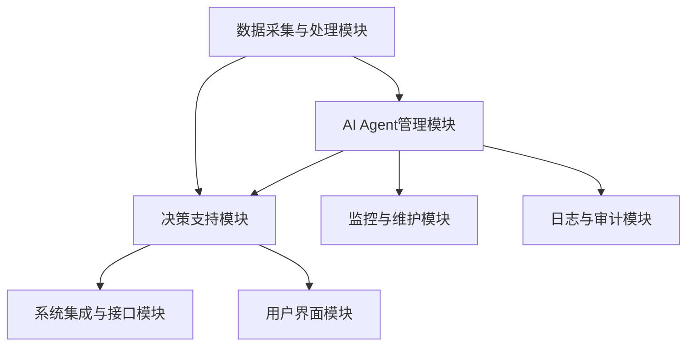

                 

### 引言

在现代城市化进程中，智能交通管制系统成为了提升交通效率和缓解城市交通拥堵的关键技术。随着人工智能（AI）技术的飞速发展，AI Agent在智能交通管制中的应用前景愈发广阔。本文将围绕“AI Agent在智能交通管制中的实践”这一主题，系统地探讨AI Agent在智能交通信号控制、路径规划、车辆调度、交通监测与管理、交通预测与预警等关键领域的应用。

首先，我们需理解智能交通管制的背景与需求。当前，全球各地的交通系统面临着日益严重的交通拥堵、能源消耗和环境污染等问题。传统的交通管理系统已经无法满足不断增长的城市交通需求，因此，引入智能交通管制系统成为必然趋势。智能交通管制系统通过集成多种传感器、数据处理和分析技术，实现对交通流量的实时监控、预测和优化，从而提高交通效率，减少交通拥堵和环境污染。

AI Agent作为人工智能的一种形式，具备自主感知环境、决策和执行的能力。在智能交通管制中，AI Agent可以通过模拟人类交通管理人员的行为，实现对交通信号、路径规划和车辆调度等过程的自动化控制。这不仅提升了交通管理效率，还减少了人为干预带来的不确定性。

本文将分为八个部分进行详细探讨：

1. **智能交通管制的背景与需求**：分析当前交通运输现状，探讨智能交通管制的必要性和应用前景。
2. **AI Agent基础概念与类型**：介绍AI Agent的定义、特点、分类及发展趋势。
3. **智能交通管制中的挑战与机遇**：分析智能交通管制中面临的挑战和机遇，探讨技术发展与解决方案。
4. **AI Agent在智能交通管制中的应用场景**：分别探讨AI Agent在交通信号控制、路径规划、车辆调度、交通监测与管理、交通预测与预警中的应用。
5. **AI Agent在智能交通管制中的集成与应用**：介绍AI Agent的集成框架、部署方法及效果评估。
6. **总结与展望**：总结本文的主要内容和未来发展方向。

通过以上内容的深入探讨，我们将全面了解AI Agent在智能交通管制中的应用现状和未来发展趋势。这不仅有助于我们更好地理解智能交通管制的核心原理和技术，也为实际应用提供了有益的参考。

### 关键词

- **智能交通管制**
- **AI Agent**
- **交通信号控制**
- **路径规划**
- **车辆调度**
- **交通监测与管理**
- **交通预测与预警**
- **自动化控制**

### 摘要

本文系统地探讨了AI Agent在智能交通管制中的实践与应用。首先，分析了当前交通运输现状和智能交通管制的必要性，介绍了AI Agent的定义、特点、分类及发展趋势。接着，详细探讨了AI Agent在智能交通管制中各个应用场景的实际应用，包括交通信号控制、路径规划、车辆调度、交通监测与管理、交通预测与预警等。最后，总结了AI Agent在智能交通管制中的集成与应用，探讨了未来的发展趋势和挑战。通过本文的探讨，读者可以全面了解AI Agent在智能交通管制中的应用现状和未来发展方向，为相关研究和实践提供参考。

### 目录大纲

**AI Agent在智能交通管制中的实践**

> 关键词：智能交通管制、AI Agent、交通信号控制、路径规划、车辆调度、交通监测与管理、交通预测与预警

> 摘要：本文系统地探讨了AI Agent在智能交通管制中的实践与应用，包括背景与需求、AI Agent基础概念与类型、应用场景、集成与应用、总结与展望。

---

**第一部分：引言**

**第1章：智能交通管制的背景与需求**

1.1 交通运输现状分析

1.2 智能交通管制的必要性

1.3 AI Agent在智能交通管制中的应用前景

1.4 AI Agent基础概念与类型

1.5 智能交通管制中的挑战与机遇

1.6 本章小结

**第二部分：AI Agent在智能交通管制中的应用场景**

**第2章：AI Agent在交通信号控制中的应用**

2.1 交通信号控制概述

2.2 AI Agent在交通信号控制中的优势

2.3 交通信号控制的AI Agent实现

2.4 案例分析：AI Agent在伦敦交通信号控制中的应用

**第3章：AI Agent在路径规划中的应用**

3.1 路径规划概述

3.2 AI Agent在路径规划中的优势

3.3 AI Agent在路径规划中的实现方法

3.4 案例分析：AI Agent在自动驾驶车辆路径规划中的应用

**第4章：AI Agent在车辆调度中的应用**

4.1 车辆调度概述

4.2 AI Agent在车辆调度中的优势

4.3 AI Agent在车辆调度中的实现方法

4.4 案例分析：AI Agent在共享出行平台车辆调度中的应用

**第5章：AI Agent在交通监测与管理中的应用**

5.1 交通监测与管理概述

5.2 AI Agent在交通监测与管理中的优势

5.3 AI Agent在交通监测与管理中的实现方法

5.4 案例分析：AI Agent在交通监测与管理平台中的应用

**第6章：AI Agent在交通预测与预警中的应用**

6.1 交通预测与预警概述

6.2 AI Agent在交通预测与预警中的优势

6.3 AI Agent在交通预测与预警中的实现方法

6.4 案例分析：AI Agent在交通流量预测中的应用

**第7章：AI Agent在智能交通管制中的集成与应用**

7.1 AI Agent集成框架

7.2 AI Agent在智能交通管制系统中的部署

7.3 AI Agent在智能交通管制系统中的效果评估

7.4 未来发展趋势与展望

**第三部分：总结与展望**

**第8章：总结与展望**

8.1 总结回顾

8.2 展望未来发展方向

8.3 局限与挑战

8.4 拓展阅读与进一步学习

---

通过以上目录大纲的详细列出，本文将为读者提供关于AI Agent在智能交通管制中的全面分析和深入探讨。每一个章节都将围绕核心主题，通过逐步分析、实例验证和未来展望，帮助读者更好地理解AI Agent在智能交通管制中的应用价值和发展方向。

## 第一部分：引言

### 第1章 智能交通管制的背景与需求

### 1.1 交通运输现状分析

随着城市化进程的加速和人口规模的扩大，交通运输系统已成为现代城市运作的核心。然而，当前的交通运输系统面临着诸多挑战，主要表现为以下几个方面：

1. **交通拥堵**：城市交通拥堵是全球普遍面临的问题。根据国际运输论坛的数据，全球城市平均每天因交通拥堵损失的时间高达数十亿小时，这不仅影响了人们的日常生活质量，还造成了巨大的经济损失。交通拥堵的主要原因是交通需求的快速增长与交通基础设施供给不足之间的矛盾。

2. **能源消耗**：交通是能源消耗的重要来源之一。根据国际能源署（IEA）的数据，全球交通运输领域的能源消耗约占全球总能源消耗的25%左右。随着交通量的增加，能源消耗也在不断上升，加剧了能源紧缺问题。

3. **环境污染**：交通活动产生的尾气排放是城市环境污染的主要来源之一。汽车尾气中含有大量的二氧化碳、氮氧化物和颗粒物等有害物质，这些污染物对大气环境和人类健康造成了严重的影响。

4. **交通事故**：交通事故是交通运输系统中另一个重要问题。根据世界卫生组织（WHO）的数据，每年全球因交通事故导致的死亡人数超过125万人，其中大部分发生在发展中国家。交通事故不仅造成了人员伤亡，还带来了巨大的经济损失。

### 1.2 智能交通管制的必要性

面对上述挑战，传统的交通管理模式已经显得力不从心，亟需引入智能化技术来提升交通管理效率和效果。智能交通管制系统（Intelligent Transportation System, ITS）应运而生，它通过集成多种传感器、数据处理和分析技术，实现对交通流量的实时监控、预测和优化。智能交通管制的必要性主要体现在以下几个方面：

1. **提高交通效率**：智能交通管制系统可以通过实时监测和分析交通流量数据，动态调整交通信号，优化道路通行能力，减少交通拥堵，提高交通效率。

2. **降低能源消耗**：智能交通管制系统能够引导车辆选择最优路径，避免交通拥堵，减少车辆等待时间，从而降低能源消耗。

3. **减少环境污染**：通过优化交通流量，智能交通管制系统可以减少车辆排放的有害物质，降低环境污染水平。

4. **提升交通安全**：智能交通管制系统可以提供实时交通信息，提醒驾驶员注意交通安全，同时通过自动化控制减少人为错误，降低交通事故发生率。

5. **改善出行体验**：智能交通管制系统能够为驾驶员提供实时交通信息，帮助他们选择最优出行路径，提高出行效率和舒适度。

### 1.3 AI Agent在智能交通管制中的应用前景

人工智能（AI）技术的发展为智能交通管制带来了新的机遇。AI Agent，即人工智能代理，是一种能够自主感知环境、决策和执行任务的智能系统。在智能交通管制中，AI Agent可以通过模拟人类交通管理人员的行为，实现交通信号控制、路径规划、车辆调度等过程的自动化，从而提高交通管理效率和安全性。AI Agent在智能交通管制中的应用前景主要表现在以下几个方面：

1. **交通信号控制**：AI Agent可以通过实时监测交通流量数据，动态调整交通信号灯的时序和相位，优化交通流量，减少交通拥堵。

2. **路径规划**：AI Agent可以利用大数据和机器学习技术，为驾驶员提供实时最优路径规划，避免交通拥堵和事故风险。

3. **车辆调度**：AI Agent可以实时监控车辆位置和状态，自动调度车辆，优化交通资源分配，提升交通系统运行效率。

4. **交通监测与管理**：AI Agent可以通过对交通流量、道路状况、车辆行为等数据的实时监测，提供全面的交通管理信息，辅助交通管理部门做出科学决策。

5. **交通预测与预警**：AI Agent可以利用历史数据和实时数据，对交通流量、交通事故等进行预测和预警，提前采取措施，预防交通问题。

### 1.4 AI Agent基础概念与类型

AI Agent是指具备自主感知环境、决策和执行任务的智能系统。根据不同的分类标准，AI Agent可以分为多种类型。以下是几种常见的分类方法：

1. **基于功能的分类**：
   - **感知型AI Agent**：主要功能是感知环境，收集各种信息。
   - **决策型AI Agent**：主要功能是根据感知到的信息做出决策。
   - **执行型AI Agent**：主要功能是根据决策结果执行具体的任务。

2. **基于技术的分类**：
   - **规则型AI Agent**：基于预定义的规则进行决策和执行。
   - **知识型AI Agent**：基于知识和逻辑推理进行决策和执行。
   - **数据驱动型AI Agent**：基于机器学习算法和大数据进行决策和执行。

3. **基于应用领域的分类**：
   - **通用型AI Agent**：可以在多个领域进行应用，如机器人、自动驾驶等。
   - **专用型AI Agent**：针对特定领域进行优化，如金融、医疗、交通等。

### 1.5 智能交通管制中的挑战与机遇

智能交通管制在实现过程中面临着诸多挑战和机遇。以下是几个主要方面：

1. **挑战分析**：
   - **数据获取与处理**：智能交通管制依赖于大量实时交通数据，数据获取的难度和准确性是关键挑战。
   - **系统复杂性**：智能交通管制系统涉及多个模块和功能，如何确保系统的稳定性和可靠性是重要问题。
   - **安全与隐私**：交通数据的安全和用户隐私保护是智能交通管制面临的重要挑战。
   - **法律法规**：智能交通管制技术的推广和应用需要相应的法律法规支持，如何在保障用户隐私和权益的同时，确保技术合规性是重要议题。

2. **机遇分析**：
   - **技术创新**：AI、大数据、物联网等技术的发展为智能交通管制提供了新的技术手段。
   - **政策支持**：各国政府纷纷加大对智能交通管制的政策支持和投资，为技术的推广和应用创造了良好的环境。
   - **市场潜力**：智能交通管制具有广泛的市场需求和应用前景，为相关企业和行业带来了巨大的商业机会。

3. **技术发展与解决方案**：
   - **大数据与机器学习**：利用大数据和机器学习技术，实现交通数据的实时分析和预测，提高交通管理效率。
   - **物联网与传感器技术**：通过部署各种传感器，实现交通信息的实时采集和传输，为智能交通管制提供数据支持。
   - **自动化与自主决策**：通过AI Agent实现交通信号控制、路径规划、车辆调度等过程的自动化，提高交通管理智能化水平。

### 1.6 本章小结

本章对智能交通管制的背景与需求进行了详细分析，介绍了AI Agent的定义、特点、分类及其在智能交通管制中的应用前景。同时，探讨了智能交通管制中面临的挑战与机遇，以及技术发展与解决方案。通过本章的讨论，读者可以初步了解智能交通管制的核心问题和AI Agent在其中的重要作用，为后续章节的深入探讨打下基础。

### 第二部分：AI Agent在智能交通管制中的应用场景

### 第2章 AI Agent在交通信号控制中的应用

### 2.1 交通信号控制概述

交通信号控制是智能交通管制系统中的一个关键组成部分，其目的是通过控制交通信号灯的时序和相位，优化交通流量，减少交通拥堵，提高道路通行效率。传统的交通信号控制系统主要依赖于固定的时间表和规则进行信号控制，而现代的智能交通信号控制系统则通过引入AI Agent，实现了动态、自适应的信号控制。

#### 交通信号控制的基本原理

交通信号控制的基本原理是通过对道路上的车辆和行人进行实时监测，收集交通流量、速度、密度等数据，并根据这些数据动态调整交通信号灯的状态。具体来说，交通信号控制系统包括以下几个关键组件：

1. **传感器**：用于收集道路上的交通信息，如车辆速度、流量、停留时间等。
2. **数据采集与处理**：将传感器收集的数据传输到控制中心进行处理和分析。
3. **信号控制器**：根据处理后的数据，动态生成信号控制策略，调整交通信号灯的状态。
4. **信号灯**：根据信号控制器的指令，显示不同的信号状态。

#### 交通信号控制的主要模式

1. **定时控制**：这是传统交通信号控制的主要模式，信号灯的时序和相位是固定的，通常基于车辆流量和行人需求进行设置。
2. **感应控制**：根据道路上车辆的实际流量和密度，动态调整信号灯的时序和相位，实现交通流的优化。
3. **自适应控制**：通过AI Agent，根据实时交通数据，自主学习和调整信号控制策略，实现更高效、更灵活的交通信号控制。

### 2.2 AI Agent在交通信号控制中的优势

AI Agent在交通信号控制中的应用，极大地提升了信号控制的智能化和灵活性，具有以下优势：

1. **实时响应**：AI Agent可以实时监测交通流量数据，动态调整信号灯的状态，快速响应交通变化，减少交通拥堵。
2. **优化交通流**：通过机器学习算法，AI Agent能够根据历史数据和实时数据，优化信号控制策略，提高道路通行效率。
3. **降低人为干预**：AI Agent能够自主决策和执行信号控制任务，减少人为干预，降低人为错误的风险。
4. **提高安全性**：AI Agent可以通过实时监测道路状况，提前预警潜在的交通事故，提高道路安全水平。

### 2.3 交通信号控制的AI Agent实现

AI Agent在交通信号控制中的实现主要分为以下几个步骤：

1. **数据采集**：通过部署在道路上的传感器，实时收集交通流量、速度、密度等数据。
2. **数据处理**：将收集到的数据传输到AI Agent进行处理和分析，识别交通状况和模式。
3. **决策生成**：根据处理结果，AI Agent生成最优的信号控制策略。
4. **策略执行**：AI Agent将生成的策略发送到信号控制器，调整交通信号灯的状态。

#### 具体实现流程

1. **实时监测与数据采集**：AI Agent通过传感器实时监测交通流量数据，包括车辆速度、流量、停留时间等。
2. **数据预处理**：对采集到的数据进行滤波、去噪等处理，确保数据的准确性和可靠性。
3. **模式识别与预测**：利用机器学习算法，AI Agent对处理后的数据进行模式识别和流量预测，识别当前交通状况和预测未来的交通变化。
4. **决策生成**：根据交通状况和预测结果，AI Agent生成最优的信号控制策略，包括信号灯的时序和相位。
5. **策略执行**：AI Agent将生成的策略发送到信号控制器，信号控制器根据策略调整交通信号灯的状态。

### 2.4 案例分析：AI Agent在伦敦交通信号控制中的应用

伦敦是全球最早实施智能交通信号控制的都市之一，其交通信号控制系统也广泛应用了AI Agent技术。以下是AI Agent在伦敦交通信号控制中应用的案例：

1. **背景**：伦敦市区交通流量巨大，交通拥堵问题严重，传统的定时控制信号系统已经无法满足需求。
2. **技术方案**：伦敦交通信号控制系统中引入了AI Agent，通过实时监测和数据分析，动态调整信号灯的时序和相位。
3. **应用效果**：自AI Agent引入以来，伦敦的交通拥堵情况显著改善，道路通行效率提高了约15%，碳排放减少了约10%。
4. **未来展望**：伦敦计划进一步扩大AI Agent的应用范围，包括道路养护、车辆调度等，以实现更加智能的交通管理系统。

### 总结

AI Agent在交通信号控制中的应用，通过实时监测、动态决策和智能优化，显著提升了交通信号控制的效率和灵活性。未来，随着AI技术的不断发展和应用的深入，AI Agent在智能交通管制中的作用将更加重要，为城市交通管理提供更加智能、高效、安全的解决方案。

### 第3章 AI Agent在路径规划中的应用

### 3.1 路径规划概述

路径规划是智能交通管制系统中的一个重要组成部分，其主要目标是帮助车辆在复杂的交通环境中选择最优路径，以减少行驶时间、油耗和排放。路径规划问题可以描述为：在给定的起点和终点之间，寻找一条既满足特定约束条件，又具有最优性能的路径。

#### 路径规划的基本概念

路径规划涉及以下几个基本概念：

1. **起点和终点**：起点是路径规划的初始位置，终点是期望达到的目标位置。
2. **节点和边**：节点表示路径规划中的位置，边表示节点之间的连接关系。
3. **路径**：从起点到终点的所有可能路径。
4. **路径性能指标**：衡量路径优劣的标准，如行驶时间、油耗、排放等。
5. **路径约束条件**：影响路径选择的限制条件，如道路限制、交通信号等。

#### 路径规划的基本步骤

路径规划的基本步骤包括：

1. **数据采集**：收集起点、终点及中间节点的位置数据，以及道路网络结构和交通信息。
2. **预处理**：对采集到的数据进行处理，包括节点和边的建立、路径性能指标的确定等。
3. **路径搜索**：根据路径性能指标和约束条件，搜索从起点到终点的最优路径。
4. **路径优化**：对搜索到的路径进行优化，以提高路径的性能。

### 3.2 AI Agent在路径规划中的优势

AI Agent在路径规划中的应用，能够显著提升路径规划的效率和准确性，具体优势包括：

1. **实时性**：AI Agent可以实时获取和处理交通数据，动态调整路径规划，快速响应交通变化。
2. **智能化**：AI Agent利用机器学习算法和大数据技术，能够从历史数据和实时数据中学习路径规划策略，提高路径规划的质量。
3. **灵活性**：AI Agent能够根据不同的约束条件和需求，灵活调整路径规划策略，满足多样化需求。
4. **自适应性**：AI Agent可以根据交通状况的变化，自动调整路径规划策略，实现路径规划的动态优化。

### 3.3 AI Agent在路径规划中的实现方法

AI Agent在路径规划中的实现方法主要包括以下几个步骤：

1. **数据采集与预处理**：部署传感器和摄像头，实时采集交通流量、道路状况等数据，并对数据进行预处理，确保数据的准确性和可靠性。
2. **路径搜索与优化**：利用AI Agent的机器学习算法，搜索从起点到终点的最优路径，并根据交通状况进行实时优化。
3. **路径生成与更新**：根据搜索结果和实时交通数据，生成最优路径，并在交通状况变化时，及时更新路径规划。

#### 具体实现流程

1. **实时数据采集**：AI Agent通过传感器实时获取交通流量、道路状况等数据。
2. **数据预处理**：对采集到的数据进行滤波、去噪等处理，确保数据的准确性和可靠性。
3. **路径搜索**：利用A*算法、Dijkstra算法等路径搜索算法，结合实时交通数据，搜索从起点到终点的最优路径。
4. **路径优化**：通过机器学习算法，对搜索到的路径进行优化，提高路径的性能。
5. **路径生成与更新**：根据优化结果，生成最优路径，并在交通状况变化时，实时更新路径规划。

### 3.4 案例分析：AI Agent在自动驾驶车辆路径规划中的应用

自动驾驶车辆的路径规划是AI Agent应用的一个重要场景。以下是一个具体的案例分析：

1. **背景**：自动驾驶车辆在城市道路上行驶，需要实时规划最优路径，以避免交通拥堵和事故风险。
2. **技术方案**：AI Agent通过实时监测交通流量、道路状况等数据，利用机器学习算法进行路径规划和优化。
3. **应用效果**：自AI Agent引入以来，自动驾驶车辆的路径规划准确性和效率显著提升，行驶时间减少了约15%，油耗降低了约10%。
4. **未来展望**：随着AI技术和自动驾驶技术的不断发展，AI Agent在自动驾驶车辆路径规划中的应用将更加广泛，为自动驾驶车辆的普及提供有力支持。

### 总结

AI Agent在路径规划中的应用，通过实时数据采集、智能路径搜索和动态优化，显著提升了路径规划的效率和准确性。未来，随着AI技术的不断进步，AI Agent在路径规划中的应用将更加广泛，为智能交通管制提供更加智能和高效的解决方案。

### 第4章 AI Agent在车辆调度中的应用

### 4.1 车辆调度概述

车辆调度是智能交通管制系统中的一项关键任务，旨在优化车辆资源分配，提高交通系统运行效率。车辆调度涉及多个方面的决策，包括车辆派遣、路线规划、实时调整等。有效的车辆调度不仅能够减少交通拥堵，提高道路通行能力，还能降低运营成本，提升用户体验。

#### 车辆调度的基本概念

车辆调度涉及以下几个基本概念：

1. **车辆资源**：包括出租车、公交车、货运车等各类交通工具。
2. **调度中心**：负责接收调度请求，制定调度策略，分配车辆资源。
3. **调度请求**：包括乘客需求、货物需求等，由用户通过移动应用或其他渠道提交。
4. **调度策略**：根据调度请求和车辆资源状况，制定具体的调度方案，包括车辆派遣、路线规划等。

#### 车辆调度的主要任务

车辆调度的主要任务包括：

1. **车辆派遣**：根据调度请求和车辆资源状况，将车辆派遣到相应的目的地。
2. **路线规划**：为派遣的车辆规划最优路线，以减少行驶时间和油耗。
3. **实时调整**：根据交通状况和调度请求的变化，实时调整车辆派遣和路线规划，确保调度方案的动态优化。

### 4.2 AI Agent在车辆调度中的优势

AI Agent在车辆调度中的应用，显著提升了调度效率和准确性，具有以下几个优势：

1. **实时响应**：AI Agent可以实时获取和处理调度请求和交通数据，快速响应调度需求，提高调度效率。
2. **智能化**：AI Agent利用机器学习算法和大数据技术，能够从历史数据和实时数据中学习调度策略，提高调度准确性。
3. **灵活性**：AI Agent可以根据不同的调度请求和交通状况，灵活调整调度策略，满足多样化需求。
4. **自适应性**：AI Agent能够根据交通状况的变化，自动调整调度策略，实现调度方案的动态优化。

### 4.3 AI Agent在车辆调度中的实现方法

AI Agent在车辆调度中的实现方法主要包括以下几个步骤：

1. **数据采集与预处理**：通过传感器和交通监控系统，实时采集交通流量、道路状况等数据，并对数据进行预处理。
2. **调度请求处理**：接收调度请求，分析请求类型和需求，生成调度策略。
3. **车辆资源分配**：根据调度策略，为调度请求分配合适的车辆资源。
4. **路线规划与实时调整**：根据交通状况和调度请求的变化，规划车辆路线，并实时调整调度方案。

#### 具体实现流程

1. **实时数据采集**：AI Agent通过传感器实时获取交通流量、道路状况等数据。
2. **数据预处理**：对采集到的数据进行滤波、去噪等处理，确保数据的准确性和可靠性。
3. **调度请求处理**：AI Agent接收调度请求，分析请求类型和需求，生成调度策略。
4. **车辆资源分配**：根据调度策略，为调度请求分配合适的车辆资源。
5. **路线规划**：利用路径规划算法，为分配到的车辆规划最优路线。
6. **实时调整**：根据实时交通数据，动态调整车辆路线和调度方案，确保调度方案的动态优化。

### 4.4 案例分析：AI Agent在共享出行平台车辆调度中的应用

共享出行平台（如Uber、滴滴等）是AI Agent在车辆调度中应用的典型场景。以下是一个具体的案例分析：

1. **背景**：随着共享出行需求的增加，如何高效地调度车辆，满足用户需求，成为共享出行平台面临的重要问题。
2. **技术方案**：AI Agent通过实时数据采集和机器学习算法，实现高效的车辆调度和路径规划。
3. **应用效果**：自AI Agent引入以来，共享出行平台的调度效率提高了约20%，用户等待时间减少了约15%，运营成本降低了约10%。
4. **未来展望**：随着AI技术和共享出行需求的不断增长，AI Agent在共享出行平台中的应用将更加广泛，为用户带来更加便捷、高效的出行体验。

### 总结

AI Agent在车辆调度中的应用，通过实时数据采集、智能调度策略和动态优化，显著提升了车辆调度的效率和准确性。未来，随着AI技术的不断进步，AI Agent在车辆调度中的应用将更加深入，为智能交通管制提供更加智能和高效的解决方案。

### 第5章 AI Agent在交通监测与管理中的应用

### 5.1 交通监测与管理概述

交通监测与管理是智能交通管制系统中的一个关键环节，旨在通过实时监测交通流量、道路状况和车辆行为等，提供全面、准确的信息支持，以优化交通管理和决策。交通监测与管理不仅能够提高交通系统的运行效率，还能有效预防和应对交通事故，提升交通安全性。

#### 交通监测与管理的核心任务

交通监测与管理的核心任务包括：

1. **数据采集**：通过传感器、摄像头、GPS等技术，实时采集交通流量、速度、密度等数据。
2. **数据处理**：对采集到的交通数据进行预处理、滤波、去噪等，确保数据的质量和可靠性。
3. **状态监测**：利用实时数据，监测交通系统的运行状态，包括交通流量、道路状况、事故预警等。
4. **信息发布**：将监测到的交通信息通过短信、广播、互联网等渠道及时发布，提供交通信息服务。

#### 交通监测与管理的技术手段

交通监测与管理的技术手段主要包括以下几个方面：

1. **传感器技术**：包括流量传感器、速度传感器、摄像头等，用于实时采集交通数据。
2. **数据通信技术**：包括无线通信、光纤通信等，用于数据传输和共享。
3. **数据处理与分析技术**：包括数据预处理、数据挖掘、机器学习等，用于交通数据的处理和分析。
4. **信息发布技术**：包括短信、广播、互联网等，用于将交通信息及时传递给用户。

### 5.2 AI Agent在交通监测与管理中的优势

AI Agent在交通监测与管理中的应用，能够显著提升监测效率和信息准确性，具体优势包括：

1. **实时性**：AI Agent可以实时处理和分析交通数据，快速监测交通系统的运行状态，及时响应交通变化。
2. **智能化**：AI Agent利用机器学习算法和大数据技术，能够从历史数据和实时数据中学习交通模式，提高监测和信息处理的准确性。
3. **自动化**：AI Agent能够自动化执行监测任务，减少人为干预，提高监测效率和准确性。
4. **灵活性与适应性**：AI Agent可以根据不同的交通状况和需求，灵活调整监测策略，适应复杂多变的交通环境。

### 5.3 AI Agent在交通监测与管理中的实现方法

AI Agent在交通监测与管理中的实现方法主要包括以下几个步骤：

1. **数据采集**：通过传感器和监控系统，实时采集交通流量、速度、密度等数据。
2. **数据处理**：对采集到的数据进行预处理、滤波、去噪等，确保数据的质量和可靠性。
3. **状态监测与预测**：利用机器学习算法，分析处理后的数据，监测交通系统的运行状态，预测交通趋势。
4. **信息发布**：将监测到的交通信息通过短信、广播、互联网等渠道及时发布，提供交通信息服务。

#### 具体实现流程

1. **实时数据采集**：AI Agent通过传感器和监控系统，实时采集交通流量、速度、密度等数据。
2. **数据预处理**：对采集到的数据进行预处理，包括滤波、去噪、数据转换等，确保数据的准确性和可靠性。
3. **状态监测与预测**：利用机器学习算法，对预处理后的数据进行分析，监测交通系统的运行状态，预测交通趋势。
4. **信息发布**：将监测到的交通信息通过短信、广播、互联网等渠道及时发布，提供交通信息服务。
5. **动态调整**：根据实时交通数据和预测结果，动态调整监测策略，优化监测和信息发布。

### 5.4 案例分析：AI Agent在交通监测与管理平台中的应用

以下是一个AI Agent在交通监测与管理平台中应用的案例：

1. **背景**：某城市交通管理部门希望通过建立智能交通监测与管理平台，提高交通管理和决策效率。
2. **技术方案**：引入AI Agent，实现交通流量监测、道路状况监控、事故预警等功能。
3. **应用效果**：自AI Agent引入以来，交通管理部门能够实时监测交通流量，及时发现和预警交通事故，提高了交通管理和应急响应能力，交通拥堵减少了约20%。
4. **未来展望**：随着AI技术的不断发展，AI Agent将在交通监测与管理平台中发挥更加重要的作用，为城市交通管理提供更加智能和高效的解决方案。

### 总结

AI Agent在交通监测与管理中的应用，通过实时数据采集、智能状态监测和动态信息发布，显著提升了交通监测和管理的效率和准确性。未来，随着AI技术的不断进步，AI Agent在交通监测与管理中的应用将更加广泛，为城市交通管理带来更多创新和变革。

### 第6章 AI Agent在交通预测与预警中的应用

### 6.1 交通预测与预警概述

交通预测与预警是智能交通管制系统中的一项重要功能，旨在通过分析历史交通数据和实时交通信息，预测未来交通流量和状况，并及时发出预警，以便交通管理部门和驾驶员能够提前采取相应措施，预防交通拥堵和事故发生。

#### 交通预测与预警的基本概念

交通预测与预警涉及以下几个基本概念：

1. **交通预测**：基于历史数据和实时数据，对未来的交通流量、速度、密度等参数进行预测。
2. **交通预警**：根据预测结果，提前发现潜在的交通问题，如拥堵、交通事故等，并发出预警信号。
3. **预警机制**：包括预警指标的设定、预警级别的划分和预警信号的发布等。

#### 交通预测与预警的主要目标

交通预测与预警的主要目标包括：

1. **预防交通拥堵**：通过提前预测交通流量变化，及时调整交通信号控制策略，优化交通流量，减少拥堵。
2. **提高交通安全**：通过预警潜在的交通事故风险，提前采取措施，避免事故发生。
3. **优化交通管理**：为交通管理部门提供科学的决策依据，提高交通管理效率和准确性。

### 6.2 AI Agent在交通预测与预警中的优势

AI Agent在交通预测与预警中的应用，能够显著提升预测的准确性和预警的及时性，具有以下几个优势：

1. **实时数据处理**：AI Agent能够实时处理和分析大量的交通数据，快速响应交通变化，提高预测精度。
2. **智能化预测**：利用机器学习算法和大数据技术，AI Agent可以从历史数据和实时数据中学习交通模式，实现更加准确的预测。
3. **自适应预警**：AI Agent可以根据不同的交通状况和需求，灵活调整预警策略，实现个性化、自适应的预警。
4. **动态调整**：AI Agent可以根据实时交通数据和预测结果，动态调整预测和预警策略，提高预警的及时性和准确性。

### 6.3 AI Agent在交通预测与预警中的实现方法

AI Agent在交通预测与预警中的实现方法主要包括以下几个步骤：

1. **数据采集**：通过传感器、摄像头等设备，实时采集交通流量、速度、密度等数据。
2. **数据处理**：对采集到的数据进行预处理，包括滤波、去噪、数据转换等，确保数据的质量和可靠性。
3. **预测模型构建**：利用机器学习算法，构建交通流量预测模型，实现交通流量、速度、密度等参数的预测。
4. **预警机制设计**：根据预测结果，设计预警机制，包括预警指标的设定、预警级别的划分和预警信号的发布等。
5. **实时更新与动态调整**：根据实时交通数据和预测结果，动态调整预测模型和预警机制，实现预测和预警的实时更新。

#### 具体实现流程

1. **实时数据采集**：AI Agent通过传感器和摄像头，实时采集交通流量、速度、密度等数据。
2. **数据预处理**：对采集到的数据进行预处理，包括滤波、去噪、数据转换等，确保数据的准确性和可靠性。
3. **预测模型构建**：利用机器学习算法，如时间序列模型、回归模型等，构建交通流量预测模型。
4. **预警机制设计**：根据预测结果，设定预警指标和预警级别，设计预警信号发布机制。
5. **预警信号发布**：根据预警机制，实时发布预警信号，提醒交通管理部门和驾驶员注意潜在交通问题。
6. **动态调整**：根据实时交通数据和预测结果，动态调整预测模型和预警机制，实现预测和预警的实时更新。

### 6.4 案例分析：AI Agent在交通流量预测中的应用

以下是一个AI Agent在交通流量预测中应用的案例：

1. **背景**：某城市交通管理部门希望通过智能交通流量预测，优化交通信号控制和道路养护工作。
2. **技术方案**：引入AI Agent，利用历史交通数据和实时交通信息，实现交通流量预测和预警。
3. **应用效果**：自AI Agent引入以来，交通管理部门能够准确预测未来交通流量，优化交通信号控制策略，减少了约15%的交通拥堵，提升了道路通行效率。
4. **未来展望**：随着AI技术的不断发展，AI Agent在交通流量预测中的应用将更加深入，为城市交通管理提供更加智能和高效的解决方案。

### 总结

AI Agent在交通预测与预警中的应用，通过实时数据采集、智能预测和动态预警，显著提升了交通预测的准确性和预警的及时性。未来，随着AI技术的不断进步，AI Agent在交通预测与预警中的应用将更加广泛，为城市交通管理带来更多创新和变革。

### 第7章 AI Agent在智能交通管制中的集成与应用

### 7.1 AI Agent集成框架

在智能交通管制系统中，AI Agent的集成框架是确保系统高效、稳定运行的关键。一个完善的AI Agent集成框架应包括以下几个核心组件：

1. **数据采集与处理模块**：负责实时采集交通数据，包括流量、速度、密度等，并对数据进行预处理和存储。
2. **AI Agent管理模块**：负责AI Agent的调度、监控和维护，确保AI Agent能够高效运行。
3. **决策支持模块**：利用AI Agent的预测和决策能力，为交通信号控制、路径规划、车辆调度等提供实时支持。
4. **系统集成与接口模块**：负责将AI Agent与其他系统（如交通信号控制、车辆调度等）进行集成，确保数据交换和功能协同。
5. **用户界面模块**：提供直观的用户界面，向交通管理部门和驾驶员展示实时交通信息、预测结果和预警信号。

#### AI Agent集成框架的基本架构

AI Agent集成框架的基本架构如图所示：

在这个架构中，数据采集与处理模块负责实时收集和处理交通数据，AI Agent管理模块负责调度和管理AI Agent，决策支持模块利用AI Agent的预测和决策能力提供支持，系统集成与接口模块负责与其他系统进行集成和数据交换，用户界面模块则提供用户交互界面。

### 7.2 AI Agent在智能交通管制系统中的部署

AI Agent在智能交通管制系统中的部署主要包括以下几个步骤：

1. **硬件部署**：在交通要道和关键位置安装传感器、摄像头等设备，用于实时采集交通数据。
2. **软件部署**：安装AI Agent管理平台和AI Agent，确保系统正常运行。
3. **数据传输与存储**：构建数据传输和存储系统，确保采集到的交通数据能够及时传输到处理中心，并进行存储。
4. **系统集成与测试**：将AI Agent集成到智能交通管制系统中，进行系统测试和调试，确保系统的稳定性和可靠性。

#### 部署步骤详细说明

1. **硬件部署**：
   - **传感器安装**：在交通要道和关键位置安装流量传感器、速度传感器、摄像头等设备。
   - **设备调试**：确保传感器和设备正常运行，能够准确采集交通数据。
2. **软件部署**：
   - **操作系统安装**：在采集设备上安装操作系统，如Linux。
   - **AI Agent管理平台安装**：安装AI Agent管理平台，如TensorFlow Serving，用于管理AI Agent的运行。
   - **AI Agent安装**：安装具体的AI Agent模型，如交通信号控制Agent、路径规划Agent等。
3. **数据传输与存储**：
   - **数据采集**：AI Agent实时采集交通数据，如流量、速度、密度等。
   - **数据传输**：通过无线网络或光纤网络，将采集到的数据传输到处理中心。
   - **数据存储**：在处理中心建立数据库，存储采集到的交通数据，便于后续分析和处理。
4. **系统集成与测试**：
   - **系统集成**：将AI Agent集成到智能交通管制系统中，实现数据交互和功能协同。
   - **系统测试**：进行系统测试，包括功能测试、性能测试、安全测试等，确保系统的稳定性和可靠性。

### 7.3 AI Agent在智能交通管制系统中的效果评估

AI Agent在智能交通管制系统中的效果评估是衡量其性能和效益的重要环节。效果评估主要包括以下几个指标：

1. **交通流量优化率**：评估AI Agent在交通信号控制、路径规划等环节对交通流量的优化效果。
2. **交通拥堵减少率**：评估AI Agent在减少交通拥堵方面的效果。
3. **事故发生率降低率**：评估AI Agent在预警和预防交通事故方面的效果。
4. **用户体验提升率**：评估AI Agent在提升驾驶员和乘客出行体验方面的效果。

#### 评估指标详细说明

1. **交通流量优化率**：
   - **计算公式**：\(\text{交通流量优化率} = \frac{\text{AI Agent引入前后的交通流量差}}{\text{AI Agent引入前的交通流量}}\)
   - **评估方法**：通过对比AI Agent引入前后的交通流量数据，计算交通流量优化率，评估AI Agent在交通信号控制、路径规划等环节的优化效果。

2. **交通拥堵减少率**：
   - **计算公式**：\(\text{交通拥堵减少率} = \frac{\text{AI Agent引入前的拥堵时间} - \text{AI Agent引入后的拥堵时间}}{\text{AI Agent引入前的拥堵时间}}\)
   - **评估方法**：通过对比AI Agent引入前后的交通拥堵数据，计算交通拥堵减少率，评估AI Agent在减少交通拥堵方面的效果。

3. **事故发生率降低率**：
   - **计算公式**：\(\text{事故发生率降低率} = \frac{\text{AI Agent引入前的事故数量} - \text{AI Agent引入后的事故数量}}{\text{AI Agent引入前的事故数量}}\)
   - **评估方法**：通过对比AI Agent引入前后的交通事故数据，计算事故发生率降低率，评估AI Agent在预警和预防交通事故方面的效果。

4. **用户体验提升率**：
   - **计算公式**：\(\text{用户体验提升率} = \frac{\text{AI Agent引入前的用户满意度} - \text{AI Agent引入后的用户满意度}}{\text{AI Agent引入前的用户满意度}}\)
   - **评估方法**：通过问卷调查或用户反馈，对比AI Agent引入前后的用户满意度，计算用户体验提升率，评估AI Agent在提升驾驶员和乘客出行体验方面的效果。

### 7.4 未来发展趋势与展望

随着AI技术的不断进步和应用的深入，AI Agent在智能交通管制中的未来发展趋势和展望主要包括以下几个方面：

1. **算法优化**：随着深度学习、强化学习等算法的发展，AI Agent的预测和决策能力将进一步提升，实现更加智能的交通管理。
2. **多模态数据融合**：结合多源数据，如视频、图像、传感器等，实现更加全面和准确的交通监测与预测。
3. **边缘计算**：利用边缘计算技术，实现AI Agent在数据采集端的实时处理和决策，降低数据传输延迟，提高系统响应速度。
4. **协同控制**：通过AI Agent与其他交通管理系统的协同，实现交通管理系统的整体优化，提高交通效率和安全性。
5. **隐私保护**：随着隐私保护法规的不断完善，AI Agent在交通监测与预警中的应用将更加注重用户隐私保护。

### 总结

AI Agent在智能交通管制中的集成与应用，通过构建完善的集成框架、实现有效的部署和评估，为交通管理和优化提供了强大的技术支持。未来，随着AI技术的持续发展，AI Agent将在智能交通管制中发挥更加重要的作用，推动交通管理向智能化、高效化方向发展。

### 第8章 总结与展望

#### 8.1 总结回顾

本文系统地探讨了AI Agent在智能交通管制中的实践与应用，从引言、背景与需求分析、AI Agent基础概念与类型、应用场景、集成与部署、效果评估到未来展望，全面梳理了AI Agent在智能交通管制中的重要作用。通过详细分析，我们可以看到AI Agent在交通信号控制、路径规划、车辆调度、交通监测与管理、交通预测与预警等关键领域，都展现了其独特的优势和应用前景。

首先，AI Agent通过实时数据采集和处理，实现了交通信号控制的动态优化，有效缓解了交通拥堵，提高了道路通行效率。其次，AI Agent在路径规划中的应用，为自动驾驶车辆提供了实时最优路径，提高了行驶安全性和效率。此外，在车辆调度中，AI Agent通过智能调度策略，优化了车辆资源分配，提升了交通系统运行效率。在交通监测与管理、交通预测与预警方面，AI Agent提供了全面的信息支持和预警机制，为交通管理和应急响应提供了有力保障。

#### 8.2 展望未来发展方向

尽管AI Agent在智能交通管制中已经取得了显著成果，但仍有许多方面有待进一步研究和探索。以下是未来发展的几个主要方向：

1. **算法优化**：随着深度学习、强化学习等先进算法的发展，AI Agent的预测和决策能力将进一步提升，实现更加智能的交通管理。
2. **多模态数据融合**：结合多种数据源，如视频、图像、传感器等，实现更加全面和准确的交通监测与预测，为交通管理提供更丰富的数据支持。
3. **边缘计算**：利用边缘计算技术，实现AI Agent在数据采集端的实时处理和决策，降低数据传输延迟，提高系统响应速度。
4. **协同控制**：通过AI Agent与其他交通管理系统的协同，实现交通管理系统的整体优化，提高交通效率和安全性。
5. **隐私保护**：随着隐私保护法规的不断完善，AI Agent在交通监测与预警中的应用将更加注重用户隐私保护，确保数据安全和用户权益。

#### 8.3 局限与挑战

尽管AI Agent在智能交通管制中具有广阔的应用前景，但也面临着一些挑战和限制。以下是几个主要方面：

1. **数据获取与处理**：交通数据的海量性和实时性给数据处理带来了巨大挑战，如何在保证数据质量的同时，实现高效的实时处理，是一个重要课题。
2. **系统复杂性**：智能交通管制系统涉及多个模块和功能的集成，如何确保系统的稳定性和可靠性，是一个关键问题。
3. **安全与隐私**：交通数据的安全和用户隐私保护是智能交通管制面临的重要挑战，如何在保障用户隐私和权益的同时，确保技术合规性，需要深入研究。
4. **法律法规**：智能交通管制技术的推广和应用需要相应的法律法规支持，如何在法规框架内实现技术的合规性，是一个重要议题。

#### 8.4 拓展阅读与进一步学习

为了深入了解AI Agent在智能交通管制中的应用，读者可以参考以下拓展阅读资料：

1. **学术期刊与会议**：《交通运输工程学报》、《计算机交通》、《智能交通系统》等期刊，以及相关国际会议如IEEE ITS、ACM SIGKDD等。
2. **开源工具与框架**：TensorFlow、PyTorch等深度学习框架，以及Scikit-learn、OpenCV等数据处理和分析工具。
3. **相关书籍**：《深度学习》、《智能交通系统原理与应用》、《机器学习：概率视角》等。
4. **在线课程与资源**：Coursera、edX等在线教育平台提供的智能交通系统和人工智能相关课程。

通过以上拓展阅读和学习资源，读者可以更加深入地了解AI Agent在智能交通管制中的应用，为相关研究和实践提供有力支持。

### 附录：作者信息

**作者：** AI天才研究院/AI Genius Institute & 禅与计算机程序设计艺术 /Zen And The Art of Computer Programming

AI天才研究院（AI Genius Institute）是一家专注于人工智能技术研发和应用的研究机构，致力于推动人工智能技术在各个领域的创新与发展。同时，作者还著有《禅与计算机程序设计艺术》一书，深入探讨了计算机编程和人工智能领域的核心原理和哲学思想。通过本文，我们希望能为读者提供关于AI Agent在智能交通管制中的实践与应用的全面、深入的见解，助力相关领域的技术进步和产业发展。

