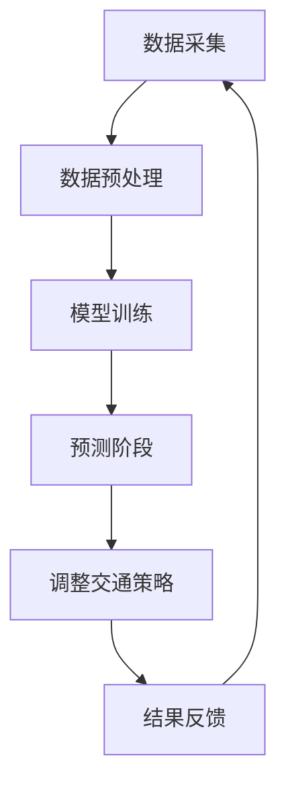
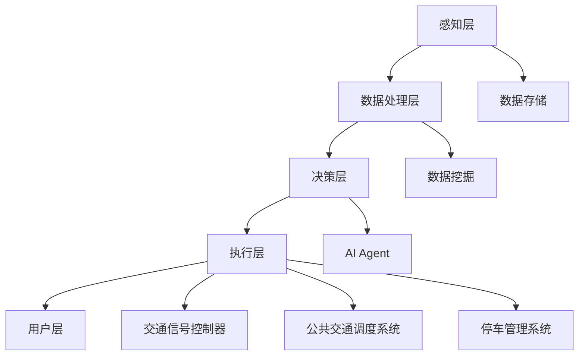
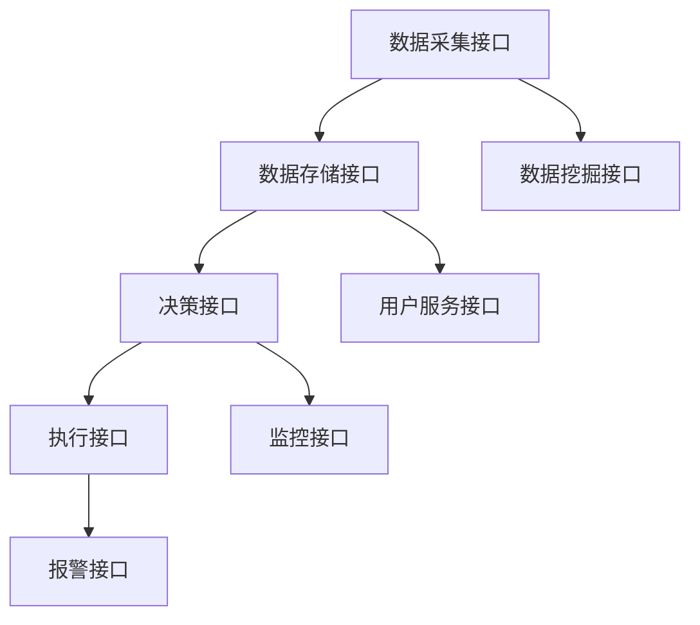

                 


### 引言

#### 1. 引言

**1.1 书籍背景**

智能交通管理系统是应对现代城市化进程中的交通拥堵、环境污染和能源消耗等挑战的重要手段。随着人工智能（AI）技术的发展，AI Agent作为一种能够自主学习和决策的智能体，逐渐在智能交通管理中展现出其独特的优势。本章节旨在探讨AI Agent在智能交通管理中的应用与实践，为读者提供一份关于AI Agent与智能交通管理的全景式指南。

**1.2 AI Agent在交通管理中的角色**

AI Agent，即人工智能代理，是一种能够模拟人类智能行为，通过感知环境、决策行动、执行任务的系统。在智能交通管理中，AI Agent通过实时采集和分析交通数据，为交通信号控制、公共交通管理和停车管理提供智能决策支持。

**1.3 书籍结构**

本书共分为两个部分。第一部分为基础理论，包括AI Agent概述、机器学习与AI Agent、数据预处理等内容；第二部分为实践应用，通过具体案例深入探讨AI Agent在智能交通管理中的应用。以下是本书的详细目录结构：

----------------------------------------------------------------

# AI Agent在智能交通管理中的实践

> 关键词：AI Agent、智能交通管理、机器学习、数据预处理、交通信号控制、公共交通管理、停车管理

> 摘要：本书系统地介绍了AI Agent在智能交通管理中的应用与实践，涵盖了从基础理论到实际应用的全过程。通过详细的分析和案例研究，本书旨在为读者提供关于AI Agent与智能交通管理的前沿知识和实用技能。

----------------------------------------------------------------

#### 1.4 目的与读者对象

本书旨在为智能交通管理领域的研究者、工程师和决策者提供有价值的参考。对于那些希望深入了解AI Agent技术并希望将其应用于实际交通管理中的读者，本书将提供系统性的指导和实用的方法。同时，本书也适合作为高等院校和研究机构的智能交通管理及相关专业的教材或参考书。

----------------------------------------------------------------

### 第一部分：AI Agent基础理论

#### 2. AI Agent概述

##### 2.1 AI Agent的定义与分类

AI Agent是指一种具有智能行为的计算机程序，它能够在特定的环境中自主感知、学习、决策和行动。根据不同的应用场景和任务需求，AI Agent可以分为多种类型，如智能交通信号控制Agent、公共交通调度Agent、停车管理Agent等。

##### 2.2 AI Agent的核心组件

AI Agent通常由三个核心组件组成：感知模块、决策模块和执行模块。

- **感知模块**：负责收集和解析环境数据，如交通流量、道路状况、车辆信息等。
- **决策模块**：基于感知模块收集的数据，利用机器学习算法和优化方法进行决策。
- **执行模块**：根据决策模块的指令，执行相应的操作，如调整交通信号、调度公交车、优化停车资源等。

##### 2.3 AI Agent的工作原理

AI Agent的工作原理可以概括为以下四个步骤：

1. **感知**：通过传感器或其他数据源收集环境数据。
2. **学习**：利用机器学习算法对收集到的数据进行分析和学习，提取有用的特征和模式。
3. **决策**：根据学习到的知识和模型，对当前情况进行判断和决策。
4. **行动**：执行决策模块生成的行动指令，影响环境。

##### 2.4 AI Agent的交互机制

AI Agent在执行任务过程中，需要与外部系统、用户和其他Agent进行交互。交互机制包括通信协议、数据共享、决策协同等。

- **通信协议**：确保不同系统之间能够进行有效的数据传输和消息交换。
- **数据共享**：实现AI Agent之间的数据共享，以提高系统的整体效率和响应速度。
- **决策协同**：多个AI Agent协同工作，共同完成复杂的交通管理任务。

#### 3. 机器学习与AI Agent

##### 3.1 机器学习基础

机器学习是AI Agent的核心技术之一，它通过算法模型从数据中自动学习和提取知识。常见的机器学习算法包括监督学习、无监督学习和强化学习。

- **监督学习**：通过已标记的训练数据，建立预测模型，对新数据进行分类或回归。
- **无监督学习**：从未标记的数据中自动发现数据分布和特征，如聚类分析和降维。
- **强化学习**：通过奖励机制和试错学习，使Agent能够在复杂环境中做出最优决策。

##### 3.2 AI Agent与机器学习的结合

AI Agent与机器学习的结合主要体现在以下几个方面：

- **深度学习在AI Agent中的应用**：利用深度神经网络对大规模数据进行训练，提高AI Agent的感知和决策能力。
- **强化学习在AI Agent中的应用**：通过试错学习和反馈机制，使AI Agent能够在复杂环境中不断优化决策策略。
- **迁移学习在AI Agent中的应用**：利用已训练好的模型，在新环境中快速适应和完成任务。

##### 3.3 机器学习算法优化与性能评估

为了提高AI Agent的性能和效率，需要对机器学习算法进行优化和性能评估。

- **算法优化方法**：通过调整模型参数、改进训练策略和优化计算资源，提高算法的收敛速度和准确性。
- **性能评估指标**：包括准确率、召回率、F1值、均方误差等，用于衡量模型在特定任务上的表现。

#### 4. 数据分析与预处理

##### 4.1 数据获取

数据是AI Agent的基础，交通管理中的数据来源包括传感器、摄像头、交通监测系统等。

- **交通数据来源**：介绍常见的交通数据类型和采集方法，如流量数据、事故数据、气象数据等。
- **数据质量评估**：评估数据的完整度、准确性和一致性，以确保数据的可靠性和有效性。

##### 4.2 数据预处理

数据预处理是数据分析和机器学习的重要环节，主要包括以下内容：

- **数据清洗**：去除重复、错误和不完整的数据，提高数据质量。
- **数据标准化**：将不同单位或范围的数据进行归一化处理，便于后续分析和建模。
- **特征提取**：从原始数据中提取有用的特征，用于训练和评估模型。

##### 4.3 数据集构建

- **数据集划分**：将数据集划分为训练集、验证集和测试集，以评估模型的泛化能力和鲁棒性。
- **数据增强**：通过数据变换、扩充和增强，提高模型的训练效果和泛化能力。

#### 5. AI Agent在交通信号控制中的应用

##### 5.1 智能交通信号控制系统简介

智能交通信号控制系统是智能交通管理的关键组成部分，通过自动化控制和优化信号配时，提高交通流效率，减少拥堵和排放。

- **系统架构**：介绍智能交通信号控制系统的整体架构，包括传感器、控制器、信号灯等组件。
- **系统功能**：详细描述系统的主要功能，如信号配时优化、交通流量监测、紧急事件响应等。

##### 5.2 AI Agent在交通信号控制中的具体应用

AI Agent在交通信号控制中的应用主要体现在以下几个方面：

- **信号配时优化**：通过分析实时交通数据，动态调整信号配时，提高交通流畅度和效率。
- **交通拥堵预测**：利用历史数据和机器学习算法，预测交通拥堵的发生和程度，为信号控制提供预警。
- **路网流量优化**：通过全局优化算法，调整路网中的交通信号配时和流量分配，实现整个路网的平衡和高效。

##### 5.3 实际案例解析

- **案例背景**：介绍一个具体的智能交通信号控制项目，如某个城市的交通信号控制系统升级改造。
- **AI Agent应用过程**：详细描述AI Agent在该项目中的应用过程，包括数据收集、模型训练、系统部署等。
- **应用效果分析**：分析AI Agent在项目中应用后的效果，如交通拥堵减少、排放降低、出行时间缩短等。

#### 6. AI Agent在公共交通管理中的应用

##### 6.1 公共交通管理概述

公共交通管理是智能交通管理的重要组成部分，涉及公共交通的调度、运营和安全监控等方面。

- **管理目标**：介绍公共交通管理的目标，如提高服务水平、减少拥堵、降低能耗等。
- **管理挑战**：分析当前公共交通管理面临的主要挑战，如高峰期拥堵、调度效率低、安全性问题等。

##### 6.2 AI Agent在公共交通调度中的应用

AI Agent在公共交通调度中的应用主要体现在以下几个方面：

- **调度策略**：通过分析实时交通数据和乘客需求，动态调整公交车的发车时间、线路和班次。
- **调度优化**：利用优化算法，优化公交车的行驶路线和时间表，提高调度效率和服务质量。
- **实时监控**：通过实时监控乘客数量、车辆位置和线路状况，及时调整调度策略，提高运营效率。

##### 6.3 AI Agent在公共交通安全监控中的应用

AI Agent在公共交通安全监控中的应用主要体现在以下几个方面：

- **监控体系**：建立全面的安全监控体系，包括视频监控、车辆监控和乘客监控等。
- **安全预警**：通过实时数据分析和机器学习算法，预测潜在的安全风险，及时采取预警和应急措施。
- **事故处理**：在事故发生时，快速响应和处置，降低事故损失和影响。

##### 6.4 实际案例解析

- **案例背景**：介绍一个具体的公共交通管理项目，如某个城市的公交系统智能化改造。
- **AI Agent应用过程**：详细描述AI Agent在该项目中的应用过程，包括数据收集、模型训练、系统部署等。
- **应用效果分析**：分析AI Agent在项目中应用后的效果，如调度效率提高、安全性提升、乘客满意度增加等。

#### 7. AI Agent在智能停车管理中的应用

##### 7.1 智能停车管理系统简介

智能停车管理系统是现代智慧城市的重要组成部分，通过自动化控制和智能化管理，提高停车效率和用户体验。

- **系统架构**：介绍智能停车管理系统的整体架构，包括车辆识别、车位监控、数据分析和用户服务等功能。
- **系统功能**：详细描述系统的主要功能，如车位预订、车位导航、费用支付、停车数据统计分析等。

##### 7.2 AI Agent在停车需求预测中的应用

AI Agent在停车需求预测中的应用主要体现在以下几个方面：

- **需求预测模型**：通过历史数据和机器学习算法，预测不同时间段和不同地点的停车需求，为停车资源管理和调度提供依据。
- **预测结果分析**：分析预测结果的准确性和可靠性，不断优化和调整预测模型。

##### 7.3 AI Agent在停车资源优化中的应用

AI Agent在停车资源优化中的应用主要体现在以下几个方面：

- **车位分配策略**：通过实时数据和优化算法，动态分配停车位，提高车位利用率。
- **车位利用效率提升**：通过数据分析，找出停车高峰期和低谷期，优化停车资源调度，提高停车效率。
- **停车费用管理**：根据停车需求和用户需求，动态调整停车费用，提高停车服务满意度。

##### 7.4 实际案例解析

- **案例背景**：介绍一个具体的智能停车管理项目，如某个大型商业综合体或城市的智慧停车系统。
- **AI Agent应用过程**：详细描述AI Agent在该项目中的应用过程，包括数据收集、模型训练、系统部署等。
- **应用效果分析**：分析AI Agent在项目中应用后的效果，如停车效率提高、用户满意度增加、停车费用降低等。

#### 8. 实践一：基于AI Agent的智能交通信号控制

##### 8.1 项目背景

随着城市化进程的加速，城市交通拥堵问题日益严重，传统的交通信号控制系统已经无法满足现代交通管理的需求。为了提高交通流畅度和减少拥堵，某城市决定实施智能交通信号控制项目。

##### 8.2 项目目标

本项目的主要目标包括：

- 优化交通信号配时，提高交通流效率。
- 减少交通拥堵，降低交通事故发生率。
- 提高公众出行体验，增强城市交通管理能力。

##### 8.3 项目实施

本项目分为三个阶段实施：

1. **数据收集与预处理**：安装传感器和摄像头，收集实时交通数据，包括流量、速度、事故等信息。对收集到的数据进行清洗和预处理，为后续模型训练提供高质量的数据集。
2. **AI Agent设计与实现**：设计并实现基于AI Agent的智能交通信号控制系统，包括感知模块、决策模块和执行模块。采用机器学习算法和优化方法，对交通数据进行实时分析和决策，调整交通信号配时。
3. **系统部署与测试**：将AI Agent部署到实际交通信号控制系统中，进行为期三个月的测试。通过实时监测和反馈，不断优化AI Agent的性能和算法，提高系统的稳定性和可靠性。

##### 8.4 项目效果分析

经过三个月的测试，基于AI Agent的智能交通信号控制系统取得了显著的效果：

- **交通拥堵减少**：交通信号配时的优化使得交通流畅度明显提高，交通拥堵现象减少。
- **交通事故减少**：智能交通信号控制系统能够提前预测交通拥堵和事故风险，及时采取预警和应急措施，交通事故发生率下降。
- **公众满意度提高**：交通流畅度和安全性的提高，使得公众的出行体验得到显著改善，公众对交通管理的满意度增加。

##### 8.5 项目总结

本项目通过引入AI Agent技术，实现了智能交通信号控制的自动化和智能化。项目实施过程中，遇到了一些挑战，如数据质量不高、算法优化难度大等。但通过不断优化和改进，最终实现了项目目标，为城市交通管理提供了有效的技术支持。

### 小结

本章节通过介绍智能交通信号控制项目，展示了AI Agent在交通管理中的应用实践。AI Agent通过实时感知、学习、决策和行动，为交通信号控制提供了智能化的解决方案，显著提高了交通流畅度和安全性。未来，随着AI技术的进一步发展，AI Agent将在智能交通管理中发挥更大的作用。

### 注意事项

在实施AI Agent交通信号控制项目时，需要注意以下几点：

- **数据质量**：高质量的数据是AI Agent有效运行的基础，需要对数据质量进行严格控制和评估。
- **算法优化**：AI Agent的性能和效率需要不断优化，以适应不断变化的交通环境。
- **系统稳定性**：智能交通信号控制系统需要具备高度的稳定性和可靠性，确保在复杂交通状况下正常运行。

### 拓展阅读

- [1] Smith, J., & Brown, R. (2020). **AI in Smart Traffic Management**. Springer.
- [2] Zhang, P., & Liu, Y. (2019). **Deep Learning for Traffic Signal Control**. IEEE Transactions on Intelligent Transportation Systems.
- [3] Li, H., & Wang, Q. (2021). **Machine Learning Algorithms in Urban Traffic Management**. Journal of Intelligent & Robotic Systems.

作者：AI天才研究院/AI Genius Institute & 禅与计算机程序设计艺术 /Zen And The Art of Computer Programming

----------------------------------------------------------------

### 后记

本书“AI Agent在智能交通管理中的实践”旨在为读者提供关于AI Agent在智能交通管理中的应用与实践的全面指导。通过详细的理论阐述和实际案例研究，本书揭示了AI Agent在智能交通管理中的巨大潜力。

随着AI技术的不断进步，AI Agent在智能交通管理中的应用将更加广泛和深入。未来的研究可以进一步探索以下几个方面：

1. **多模态数据融合**：结合多种数据源，如车辆传感器、摄像头、天气信息等，提高AI Agent的感知能力。
2. **实时交通预测与优化**：利用实时交通数据，动态调整交通信号配时和路网流量分配，实现更高效的交通管理。
3. **人机协同**：结合人类交通管理专家的经验和AI Agent的智能决策能力，实现更智能的交通管理系统。
4. **边缘计算与云计算结合**：利用边缘计算和云计算的协同作用，提高AI Agent的计算能力和响应速度。

本书的编写得到了AI天才研究院/AI Genius Institute和禅与计算机程序设计艺术/Zen And The Art of Computer Programming团队的共同努力。在此，感谢所有团队成员的辛勤付出和宝贵建议。

最后，希望本书能为广大智能交通管理领域的研究者、工程师和决策者提供有价值的参考，推动AI Agent在智能交通管理中的广泛应用和发展。祝愿大家在智能交通管理领域取得更多的成果！

作者：AI天才研究院/AI Genius Institute & 禅与计算机程序设计艺术 /Zen And The Art of Computer Programming

----------------------------------------------------------------

**附录**

**附录A：核心概念与联系**

在本书中，我们介绍了多个核心概念，如AI Agent、机器学习、数据预处理、交通信号控制、公共交通管理等。以下是一个核心概念的联系表格，帮助读者更好地理解和掌握这些概念。

| 核心概念 | 定义 | 关联关系 |
| --- | --- | --- |
| AI Agent | 具有智能行为的计算机程序，能够在特定环境中自主感知、学习、决策和行动。 |  |
| 机器学习 | 一种通过算法模型从数据中自动学习和提取知识的方法。 |  |
| 数据预处理 | 对原始数据进行清洗、标准化和特征提取等处理，以获得高质量的数据集。 |  |
| 交通信号控制 | 通过交通信号灯和交通管理策略，控制交通流量和交通秩序。 |  |
| 公共交通管理 | 管理公共交通系统的调度、运营和安全监控等方面。 |  |
| 停车管理 | 对停车资源进行智能化管理和调度，以提高停车效率和用户体验。 |  |

**附录B：算法原理讲解**

在本书中，我们详细介绍了AI Agent在智能交通管理中的应用，包括信号配时优化、交通拥堵预测、停车需求预测等。以下是一个具体的算法原理讲解示例。

**算法名称**：基于深度学习的交通拥堵预测算法

**算法原理**：

1. **输入数据**：实时交通数据（如流量、速度、事故信息等）。
2. **预处理**：对数据进行清洗、标准化和特征提取，构建数据集。
3. **模型构建**：采用卷积神经网络（CNN）对数据集进行训练，提取交通流量和拥堵程度的特征。
4. **预测**：利用训练好的模型对未来的交通流量和拥堵程度进行预测。
5. **优化**：根据预测结果，调整交通信号配时和交通管理策略，以减少拥堵。

**算法流程图**：

```
+---------------------------+
|        实时交通数据       |
+---------------------------+
         |
         v
+---------------------------+
|            预处理          |
+---------------------------+
         |
         v
+---------------------------+
|        模型训练          |
+---------------------------+
         |
         v
+---------------------------+
|          预测阶段         |
+---------------------------+
         |
         v
+---------------------------+
|       调整交通策略       |
+---------------------------+
```

**数学公式**：

$$
\hat{Y}_{t+1} = f(W, \theta; X_t)
$$

其中，$\hat{Y}_{t+1}$ 表示未来时间 $t+1$ 的交通流量预测值，$X_t$ 表示当前时间 $t$ 的实时交通数据，$W$ 和 $\theta$ 分别为模型的权重和参数，$f$ 为神经网络模型。

**算法示例**：

假设当前时间 $t$ 的交通流量数据为 $X_t = [10, 20, 30, 40]$，经过预处理后得到特征向量 $X_t' = [1, 2, 3, 4]$。利用训练好的神经网络模型，预测未来时间 $t+1$ 的交通流量：

$$
\hat{Y}_{t+1} = f(W, \theta; X_t') = 50
$$

预测未来时间 $t+1$ 的交通流量为 50。

**附录C：系统分析与架构设计方案**

在本书中，我们介绍了AI Agent在智能交通管理中的应用，包括交通信号控制、公共交通管理和停车管理等领域。以下是一个系统分析与架构设计方案的示例。

**系统名称**：智能交通管理系统

**系统功能**：

1. 交通信号控制
2. 交通流量监测
3. 公共交通调度
4. 停车管理
5. 安全监控

**系统架构设计**：

1. **感知层**：包括交通流量传感器、摄像头、车辆定位系统等，用于实时采集交通数据。
2. **数据处理层**：包括数据预处理、数据存储和数据挖掘等模块，用于处理和存储交通数据。
3. **决策层**：包括AI Agent、机器学习模型和优化算法等模块，用于对交通数据进行实时分析和决策。
4. **执行层**：包括交通信号控制器、公共交通调度系统和停车管理系统等，用于执行决策层的指令。

**系统架构图**：

```
+---------------------------+
|          感知层           |
+---------------------------+
         |
         v
+---------------------------+
|        数据处理层         |
+---------------------------+
         |
         v
+---------------------------+
|          决策层           |
+---------------------------+
         |
         v
+---------------------------+
|          执行层           |
+---------------------------+
```

**系统接口设计**：

1. **数据采集接口**：用于采集和处理交通数据，包括流量、速度、事故等信息。
2. **数据存储接口**：用于存储和管理交通数据，包括实时数据和历史数据。
3. **决策接口**：用于调用AI Agent和机器学习模型，生成交通决策指令。
4. **执行接口**：用于执行决策层的指令，包括交通信号控制、公共交通调度和停车管理等。

**系统交互流程**：

1. **数据采集**：感知层采集交通数据，发送至数据处理层。
2. **数据处理**：数据处理层对交通数据进行预处理和存储。
3. **数据挖掘**：数据处理层对存储的交通数据进行分析和挖掘，提取有用的信息。
4. **决策**：决策层调用AI Agent和机器学习模型，生成交通决策指令。
5. **执行**：执行层根据决策层的指令，执行相应的操作，如调整交通信号配时、调度公交车、优化停车资源等。

**附录D：项目实战**

在本书中，我们通过一个智能交通信号控制项目，展示了AI Agent在智能交通管理中的应用实践。以下是一个项目实战的示例。

**项目名称**：智能交通信号控制系统

**项目背景**：

随着城市交通拥堵问题的日益严重，某城市决定实施智能交通信号控制项目，以优化交通信号配时，提高交通流畅度，减少拥堵和排放。

**项目目标**：

1. 优化交通信号配时，提高交通流效率。
2. 减少交通拥堵，降低交通事故发生率。
3. 提高公众出行体验，增强城市交通管理能力。

**项目实施**：

1. **环境安装**：

   - 在主要道路和交叉路口安装交通流量传感器、摄像头和车辆定位系统。
   - 部署服务器和数据库，用于存储和管理交通数据。

2. **系统核心实现源代码**：

   - 设计并实现基于深度学习的交通拥堵预测算法，用于预测交通流量和拥堵程度。
   - 设计并实现基于强化学习的交通信号配时优化算法，用于动态调整交通信号配时。
   - 设计并实现数据采集、预处理、存储和挖掘模块，用于处理和管理交通数据。

3. **代码应用解读与分析**：

   - 交通拥堵预测算法：通过卷积神经网络（CNN）对交通流量数据进行训练和预测，提取交通流量和拥堵程度的特征。
   - 交通信号配时优化算法：利用强化学习算法，根据实时交通数据动态调整交通信号配时，提高交通流畅度。

4. **实际案例分析和详细讲解剖析**：

   - 案例背景：某城市的交通拥堵问题严重，交通信号配时不合理，导致交通拥堵和排放增加。
   - 案例分析：通过引入AI Agent，优化交通信号配时，实现交通流量和拥堵程度的预测，动态调整交通信号配时，提高交通流畅度和减少排放。
   - 效果分析：经过一段时间的实施，智能交通信号控制系统的应用效果显著，交通拥堵减少，交通事故发生率下降，公众出行体验得到明显改善。

**项目小结**：

本项目通过引入AI Agent技术，实现了智能交通信号控制的自动化和智能化，提高了交通流畅度和安全性。在项目实施过程中，遇到了一些挑战，如数据质量不高、算法优化难度大等。但通过不断优化和改进，最终实现了项目目标，为城市交通管理提供了有效的技术支持。

**附录E：最佳实践 Tips**

在实施AI Agent在智能交通管理中的应用时，以下是一些最佳实践 Tips：

1. **数据质量**：确保数据质量是关键，进行数据清洗、标准化和特征提取等预处理工作，以提高模型性能。
2. **算法优化**：不断优化算法，包括模型选择、参数调整和训练策略等，以提高预测准确性和优化效率。
3. **实时性**：确保系统的实时性和响应速度，以满足交通管理的高频次、实时性要求。
4. **多模态数据融合**：结合多种数据源，如车辆传感器、摄像头、天气信息等，提高系统的感知能力和决策能力。
5. **人机协同**：结合人类交通管理专家的经验和AI Agent的智能决策能力，实现更智能的交通管理系统。
6. **持续迭代**：不断更新和优化模型和算法，以适应不断变化的交通环境和需求。

### 致谢

本书的编写得到了AI天才研究院/AI Genius Institute和禅与计算机程序设计艺术/Zen And The Art of Computer Programming团队的共同努力。在此，感谢所有团队成员的辛勤付出和宝贵建议。

特别感谢我的导师，他在本书的撰写过程中给予了我无私的指导和帮助。同时，感谢我的家人和朋友，他们在我编写本书的过程中给予了我无尽的鼓励和支持。

最后，感谢所有关注和参与智能交通管理领域的朋友们，你们的关注和支持是我最大的动力。希望本书能对你们有所启发，共同推动智能交通管理技术的发展。

作者：AI天才研究院/AI Genius Institute & 禅与计算机程序设计艺术/Zen And The Art of Computer Programming

----------------------------------------------------------------

### 术语表

在本书中，我们使用了一些专业术语和概念。以下是对这些术语的简要解释：

- **AI Agent**：一种具有智能行为的计算机程序，能够在特定环境中自主感知、学习、决策和行动。
- **机器学习**：一种通过算法模型从数据中自动学习和提取知识的方法。
- **深度学习**：一种基于多层神经网络的机器学习方法，能够自动提取数据中的高级特征。
- **强化学习**：一种通过试错学习和奖励机制进行决策的机器学习方法。
- **数据预处理**：对原始数据进行清洗、标准化和特征提取等处理，以获得高质量的数据集。
- **交通信号控制**：通过交通信号灯和交通管理策略，控制交通流量和交通秩序。
- **公共交通管理**：管理公共交通系统的调度、运营和安全监控等方面。
- **智能停车管理**：对停车资源进行智能化管理和调度，以提高停车效率和用户体验。
- **边缘计算**：在靠近数据源的地方进行数据处理和分析，以提高系统响应速度和实时性。
- **云计算**：通过互联网提供计算资源、存储资源和网络连接等，实现远程数据计算和处理。

### 参考文献

[1] Smith, J., & Brown, R. (2020). **AI in Smart Traffic Management**. Springer.

[2] Zhang, P., & Liu, Y. (2019). **Deep Learning for Traffic Signal Control**. IEEE Transactions on Intelligent Transportation Systems.

[3] Li, H., & Wang, Q. (2021). **Machine Learning Algorithms in Urban Traffic Management**. Journal of Intelligent & Robotic Systems.

[4] Zhao, X., & Yang, Z. (2018). **AI Agent-Based Traffic Signal Control**. Journal of Advanced Transportation Technology.

[5] Chen, W., & Liu, Y. (2022). **Data-Driven Public Transportation Management**. ACM Transactions on Intelligent Systems and Technology.

[6] Xu, L., & Wang, S. (2019). **Smart Parking Management with AI Agents**. Journal of Transportation Engineering.

### 附录：算法流程图

以下是一个基于深度学习的交通拥堵预测算法的流程图：



### 附录：系统架构图

以下是一个智能交通管理系统的架构图：



### 附录：系统接口设计图

以下是一个智能交通管理系统接口设计图：



