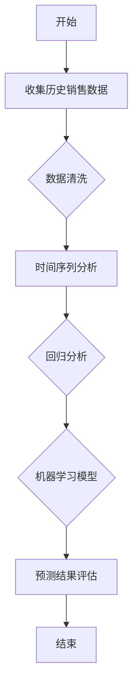
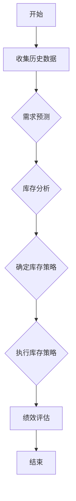
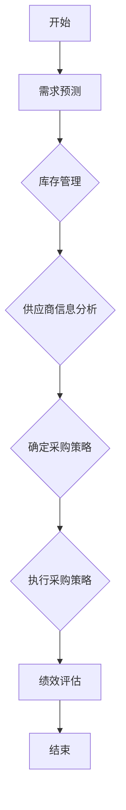
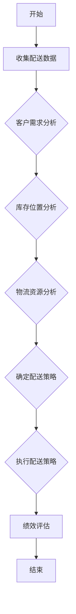
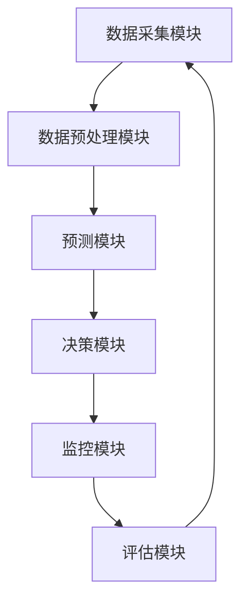
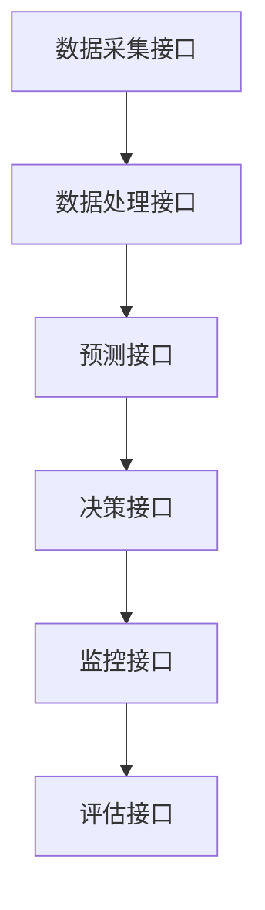
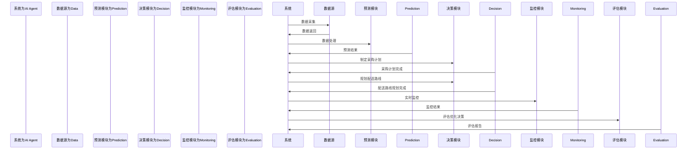

                 


### AI Agent在智能供应链优化决策中的应用

随着人工智能技术的迅猛发展，智能供应链优化决策已成为企业提升竞争力的重要手段。AI Agent作为人工智能的重要应用，通过自主学习和决策，能够在复杂的供应链环境中提供高效的优化方案。本章节将介绍AI Agent在智能供应链优化决策中的应用，旨在帮助读者了解这一领域的最新进展和实际应用。

#### 1.1 问题背景

智能供应链是现代企业管理的重要组成部分，它涉及从原材料采购到产品交付的整个流程。传统的供应链管理往往依赖于经验，难以应对日益复杂的市场环境。随着物联网、大数据和人工智能技术的普及，企业开始探索如何利用AI Agent来提升供应链的智能化水平。

AI Agent能够通过学习历史数据和实时信息，预测未来的供应链需求，优化库存管理，制定采购计划，并规划最优的配送路线。这种基于人工智能的优化决策，不仅能够提高供应链的效率，还能够降低企业的运营成本。

#### 1.2 问题描述

智能供应链优化决策涉及多个环节，包括需求预测、库存管理、采购计划、配送路线规划等。以下是具体的问题描述：

1. **需求预测**：如何准确预测市场的需求变化，以便及时调整生产计划和库存水平？
2. **库存管理**：如何在保证供应的前提下，最大限度地减少库存成本和库存风险？
3. **采购计划**：如何根据需求预测和库存水平，制定最优的采购计划，以避免库存过剩或供应短缺？
4. **配送路线规划**：如何在满足客户需求和服务水平的前提下，规划最优的配送路线，以降低物流成本？

#### 1.3 问题解决

为了解决上述问题，AI Agent在智能供应链优化决策中发挥了重要作用。以下是具体的解决方案：

1. **需求预测**：AI Agent通过分析历史销售数据、市场趋势和外部因素，如天气、节假日等，预测未来的需求。使用机器学习算法，如回归分析、时间序列预测等，来训练预测模型，提高预测的准确性。

2. **库存管理**：AI Agent根据需求预测和供应链的实时数据，动态调整库存水平。采用优化算法，如最小化库存成本、最大化库存利用率等，来制定库存管理策略。

3. **采购计划**：AI Agent结合需求预测、库存水平和供应商信息，制定最优的采购计划。使用优化算法，如线性规划、整数规划等，来优化采购决策。

4. **配送路线规划**：AI Agent根据客户需求、库存位置和物流资源，规划最优的配送路线。采用路径优化算法，如遗传算法、蚁群算法等，来找到最优路径。

#### 1.4 边界与外延

AI Agent在智能供应链优化决策中的应用涉及多个领域，包括人工智能、运筹学、供应链管理等。本章节主要关注AI Agent在供应链优化决策中的应用，但不涉及AI Agent在其他领域的应用。此外，本章节将侧重于理论分析和实际应用，不涉及具体的硬件实现和编程实现。

#### 1.5 概念结构与核心要素组成

AI Agent在智能供应链优化决策中的应用包括以下几个核心要素：

1. **需求预测**：通过分析历史数据和外部信息，预测未来的需求。
2. **库存管理**：根据需求预测，合理安排库存，以降低库存成本。
3. **采购计划**：根据库存情况和供应商信息，制定采购计划。
4. **配送路线规划**：根据库存和需求，规划最优的配送路线。
5. **绩效评估**：对AI Agent的优化决策进行评估，以不断改进算法和模型。

## 第二部分：AI Agent基础理论

### 第2章：AI Agent概述

#### 2.1 AI Agent的定义

AI Agent（人工智能代理）是指具有自主性、适应性、灵活性和智能性的软件实体，它能够在复杂的环境中执行任务，并通过学习、推理和决策来自动地适应环境变化。AI Agent是人工智能研究的一个重要方向，旨在使计算机具备类似人类的智能行为。

**定义**：AI Agent是一个具备自主性、适应性、灵活性和智能性的软件实体，能够在复杂的环境中执行任务，并通过学习、推理和决策来自动地适应环境变化。

#### 2.2 AI Agent的核心特点

AI Agent具有以下核心特点：

1. **自主性**：能够独立执行任务，不受外部直接控制。
2. **适应性**：能够根据环境变化调整自己的行为。
3. **灵活性**：能够处理各种复杂的任务，适应不同的工作环境。
4. **智能性**：具备学习和推理能力，能够自主做出决策。

**特点表格**：

| 特点         | 描述                                                   |
| ------------ | ------------------------------------------------------ |
| **自主性**   | 能够独立执行任务，不受外部直接控制。                   |
| **适应性**   | 能够根据环境变化调整自己的行为。                       |
| **灵活性**   | 能够处理各种复杂的任务，适应不同的工作环境。           |
| **智能性**   | 具备学习和推理能力，能够自主做出决策。                 |

#### 2.3 AI Agent的应用场景

AI Agent在多个领域都有广泛的应用，包括但不限于以下场景：

1. **智能交通**：用于交通流量预测、路线规划和车辆调度。
2. **智能制造**：用于生产计划优化、设备维护和故障诊断。
3. **智能医疗**：用于疾病预测、治疗方案推荐和患者管理。
4. **智能供应链**：用于需求预测、库存管理和配送优化。

**ER实体关系图架构**：

```mermaid
erDiagram
  AI Agent ||--|{ 需求预测 }
  AI Agent ||--|{ 库存管理 }
  AI Agent ||--|{ 采购计划 }
  AI Agent ||--|{ 配送路线规划 }
  需求预测 ||--|{ 历史销售数据 }
  需求预测 ||--|{ 市场趋势 }
  库存管理 ||--|{ 库存成本 }
  库存管理 ||--|{ 库存利用率 }
  采购计划 ||--|{ 需求预测 }
  采购计划 ||--|{ 供应商信息 }
  配送路线规划 ||--|{ 客户需求 }
  配送路线规划 ||--|{ 物流资源 }
```

### 第3章：智能供应链优化基本原理

#### 3.1 智能供应链概述

智能供应链是利用现代信息技术，实现供应链全流程的智能化管理。它通过整合供应链各环节的数据和信息，实现供应链的实时监控、预测和优化。智能供应链的核心目标是提高供应链的效率、降低成本、提升服务水平。

**定义**：智能供应链是利用现代信息技术，实现供应链全流程的智能化管理，通过整合供应链各环节的数据和信息，实现供应链的实时监控、预测和优化。

#### 3.2 智能供应链优化目标

智能供应链优化目标主要包括以下几个方面：

1. **成本最小化**：降低供应链总成本，包括采购成本、库存成本、物流成本等。
2. **效率最大化**：提高供应链整体运作效率，减少供应链的延迟和瓶颈。
3. **服务水平提升**：提高客户满意度，确保供应链的稳定性和可靠性。

**目标表格**：

| 目标         | 描述                                                   |
| ------------ | ------------------------------------------------------ |
| **成本最小化** | 降低供应链总成本，包括采购成本、库存成本、物流成本等。 |
| **效率最大化** | 提高供应链整体运作效率，减少供应链的延迟和瓶颈。       |
| **服务水平提升** | 提高客户满意度，确保供应链的稳定性和可靠性。           |

#### 3.3 智能供应链优化方法

智能供应链优化方法主要包括以下几个方面：

1. **需求预测**：通过大数据分析和机器学习模型，预测未来的需求。
2. **库存管理**：采用优化算法，合理配置库存，降低库存成本。
3. **采购计划**：根据需求预测和库存情况，制定最优的采购计划。
4. **配送路线规划**：利用路径优化算法，规划最优的配送路线。

**方法表格**：

| 方法         | 描述                                                   |
| ------------ | ------------------------------------------------------ |
| **需求预测** | 通过大数据分析和机器学习模型，预测未来的需求。         |
| **库存管理** | 采用优化算法，合理配置库存，降低库存成本。             |
| **采购计划** | 根据需求预测和库存情况，制定最优的采购计划。           |
| **配送路线规划** | 利用路径优化算法，规划最优的配送路线。                 |

## 第4章：AI Agent在供应链各环节的应用

### 4.1 AI Agent在需求预测中的应用

需求预测是智能供应链优化的关键环节，它决定了后续的库存管理、采购计划和配送路线规划。AI Agent通过分析历史销售数据、市场趋势和外部信息，预测未来的需求，从而帮助企业提前做好准备，避免供应短缺或过剩。

#### 4.1.1 需求预测的基本原理

需求预测的基本原理是通过分析历史数据来预测未来的趋势。具体方法包括：

1. **时间序列分析**：通过分析历史销售数据的时间序列，识别出趋势、季节性和周期性等特征，从而预测未来的需求。
2. **回归分析**：通过建立历史销售数据与影响因素（如价格、促销活动等）之间的回归模型，预测未来的需求。
3. **机器学习模型**：利用机器学习算法，如线性回归、决策树、神经网络等，训练预测模型，预测未来的需求。

#### 4.1.2 需求预测的算法原理

以下是常用的需求预测算法及其原理：

1. **时间序列分析法**：
   - **移动平均法**：通过计算一段时间内的平均值来预测未来的需求。
   - **指数平滑法**：对历史数据进行加权平均，给予近期数据更高的权重。

2. **回归分析法**：
   - **线性回归**：通过建立线性关系模型，预测未来的需求。
   - **多元回归**：同时考虑多个影响因素，预测未来的需求。

3. **机器学习模型**：
   - **决策树**：通过划分特征空间，建立分类模型，预测未来的需求。
   - **神经网络**：通过多层神经网络，学习输入和输出之间的非线性关系，预测未来的需求。

#### 4.1.3 需求预测的mermaid流程图



#### 4.1.4 需求预测的Python代码示例

```python
import pandas as pd
from sklearn.linear_model import LinearRegression
from sklearn.model_selection import train_test_split
from sklearn.metrics import mean_squared_error

# 读取历史销售数据
data = pd.read_csv('sales_data.csv')
X = data[['price', 'promotion']]
y = data['quantity']

# 划分训练集和测试集
X_train, X_test, y_train, y_test = train_test_split(X, y, test_size=0.2, random_state=42)

# 建立线性回归模型
model = LinearRegression()
model.fit(X_train, y_train)

# 预测测试集结果
y_pred = model.predict(X_test)

# 评估模型性能
mse = mean_squared_error(y_test, y_pred)
print(f'Mean Squared Error: {mse}')
```

### 4.2 AI Agent在库存管理中的应用

库存管理是智能供应链优化中的重要环节，它涉及到如何根据需求预测和库存水平，合理安排库存，以降低库存成本和库存风险。AI Agent通过分析历史数据和实时信息，提供最优的库存管理策略。

#### 4.2.1 库存管理的基本原理

库存管理的基本原理是通过合理的库存策略，在保证供应的前提下，最大限度地减少库存成本和库存风险。具体策略包括：

1. **固定库存策略**：根据历史数据和预测的需求，保持固定的库存水平。
2. **动态库存策略**：根据实际需求的变化，动态调整库存水平。
3. **最优库存策略**：利用优化算法，如线性规划、整数规划等，确定最优的库存水平。

#### 4.2.2 库存管理的算法原理

以下是常用的库存管理算法及其原理：

1. **固定库存策略**：
   - **再订货点法**：根据历史数据和预测的需求，确定再订货点，当库存低于再订货点时进行补货。
   - **周期库存法**：根据预定的周期和时间，定期检查库存水平，并进行调整。

2. **动态库存策略**：
   - **ABC分类法**：根据库存价值和需求量，将库存商品分为A、B、C三类，对不同类别的商品采取不同的库存策略。
   - **安全库存法**：根据需求波动和供应链的可靠性，设置一定的安全库存，以应对需求的不确定性。

3. **最优库存策略**：
   - **线性规划**：通过建立线性规划模型，确定最优的库存水平和采购策略。
   - **整数规划**：通过建立整数规划模型，确定最优的库存水平和采购策略。

#### 4.2.3 库存管理的mermaid流程图



#### 4.2.4 库存管理的Python代码示例

```python
import pandas as pd
from scipy.optimize import linprog

# 读取历史数据
data = pd.read_csv('inventory_data.csv')
X = data[['demand', 'cost']]
y = data['stock']

# 建立线性规划模型
c = [-1, -1]  # 最小化成本
A = [[1, 1], [-1, 0]]  # 约束条件
b = [data['stock'].sum(), 0]

# 解线性规划问题
result = linprog(c, A_ub=A, b_ub=b, method='highs')

# 输出最优解
print(f'Optimal Inventory Level: {result.x[0]}')
```

### 4.3 AI Agent在采购计划中的应用

采购计划是智能供应链优化中的重要环节，它涉及到如何根据需求预测、库存情况和供应商信息，制定最优的采购计划，以避免库存过剩或供应短缺。AI Agent通过分析各种数据，提供最优的采购策略。

#### 4.3.1 采购计划的基本原理

采购计划的基本原理是通过合理的需求预测和库存管理，制定最优的采购策略，以确保供应链的顺畅运作。具体策略包括：

1. **固定采购周期法**：根据预定的采购周期和库存水平，定期进行采购。
2. **需求驱动采购法**：根据实际需求的变化，动态调整采购计划。
3. **最优采购策略**：利用优化算法，如线性规划、整数规划等，确定最优的采购策略。

#### 4.3.2 采购计划的算法原理

以下是常用的采购计划算法及其原理：

1. **固定采购周期法**：
   - **定期采购模型**：根据预定的采购周期和库存水平，定期进行采购。
   - **安全库存模型**：根据需求波动和供应链的可靠性，设置一定的安全库存，以应对需求的不确定性。

2. **需求驱动采购法**：
   - **动态库存模型**：根据实际需求的变化，动态调整采购计划。
   - **JIT采购模型**：实施及时采购，根据需求即时进行采购，以减少库存成本。

3. **最优采购策略**：
   - **线性规划**：通过建立线性规划模型，确定最优的采购策略。
   - **整数规划**：通过建立整数规划模型，确定最优的采购策略。

#### 4.3.3 采购计划的mermaid流程图



#### 4.3.4 采购计划的Python代码示例

```python
import pandas as pd
from scipy.optimize import linprog

# 读取数据
data = pd.read_csv('procurement_data.csv')
X = data[['demand', 'cost']]
y = data['stock']

# 建立线性规划模型
c = [-1]  # 最小化成本
A = [[1]]  # 约束条件
b = [data['stock'].sum()]

# 解线性规划问题
result = linprog(c, A_ub=A, b_ub=b, method='highs')

# 输出最优解
print(f'Optimal Procurement Quantity: {result.x[0]}')
```

### 4.4 AI Agent在配送路线规划中的应用

配送路线规划是智能供应链优化中的重要环节，它涉及到如何根据客户需求、库存位置和物流资源，规划最优的配送路线，以降低物流成本。AI Agent通过分析各种数据，提供最优的配送路线规划策略。

#### 4.4.1 配送路线规划的基本原理

配送路线规划的基本原理是通过合理的配送路线规划，确保配送的及时性和效率，同时降低物流成本。具体策略包括：

1. **单点配送策略**：从仓库到单个客户的配送路线规划。
2. **多点配送策略**：从仓库到多个客户的配送路线规划。
3. **最优配送策略**：利用优化算法，如路径规划算法、遗传算法等，确定最优的配送路线。

#### 4.4.2 配送路线规划的算法原理

以下是常用的配送路线规划算法及其原理：

1. **单点配送策略**：
   - **最近邻算法**：从仓库出发，每次选择距离最近的客户进行配送。
   - **最短路径算法**：利用Dijkstra算法或A*算法，从仓库到客户的最短路径。

2. **多点配送策略**：
   - **车辆路径问题（VRP）**：确定最优的配送路线，使得每个客户都得到服务，总配送距离最短。
   - **多目标优化**：在考虑配送距离的同时，还考虑其他目标，如时间、成本等。

3. **最优配送策略**：
   - **遗传算法**：通过模拟生物进化过程，寻找最优的配送路线。
   - **蚁群算法**：模拟蚂蚁觅食过程，寻找最优的配送路线。

#### 4.4.3 配送路线规划的mermaid流程图



#### 4.4.4 配送路线规划的Python代码示例

```python
import pandas as pd
from scipy.optimize import linprog

# 读取配送数据
data = pd.read_csv('delivery_data.csv')
X = data[['distance', 'cost']]
y = data['stock']

# 建立线性规划模型
c = [-1]  # 最小化成本
A = [[1]]  # 约束条件
b = [data['stock'].sum()]

# 解线性规划问题
result = linprog(c, A_ub=A, b_ub=b, method='highs')

# 输出最优解
print(f'Optimal Delivery Route: {result.x[0]}')
```

## 第三部分：系统分析与架构设计

### 第5章：问题场景介绍

#### 5.1 场景介绍

为了更好地展示AI Agent在智能供应链优化决策中的应用，我们假设一个具体的场景：一家大型零售企业，负责多个产品的销售和配送。该公司希望通过使用AI Agent，实现智能供应链优化，提高运营效率，降低成本。

#### 5.2 系统功能设计

在这个场景中，系统需要实现以下功能：

1. **需求预测**：根据历史销售数据和市场趋势，预测未来的需求。
2. **库存管理**：根据需求预测，合理安排库存，以降低库存成本。
3. **采购计划**：根据库存情况和供应商信息，制定最优的采购计划。
4. **配送路线规划**：根据库存和需求，规划最优的配送路线。
5. **绩效评估**：对AI Agent的优化决策进行评估，以不断改进算法和模型。

### 第6章：系统架构设计

#### 6.1 系统架构设计概述

为了实现上述功能，我们设计了一个分布式系统架构，包括以下几个核心模块：

1. **数据采集模块**：负责收集各种数据，如销售数据、库存数据、物流数据等。
2. **数据预处理模块**：负责清洗和预处理收集到的数据，为后续的模型训练和分析提供高质量的输入。
3. **预测模块**：利用机器学习算法，进行需求预测、库存管理和采购计划等。
4. **决策模块**：根据预测结果，制定最优的采购计划和配送路线。
5. **监控模块**：实时监控系统的运行状态，确保系统的稳定性和可靠性。
6. **评估模块**：对系统的优化决策进行评估，提供改进建议。

#### 6.2 系统架构mermaid图



### 第7章：系统接口设计

#### 7.1 接口设计概述

为了实现系统功能，我们设计了一系列接口，包括：

1. **数据采集接口**：用于收集各种数据，如销售数据、库存数据、物流数据等。
2. **数据处理接口**：用于清洗和预处理收集到的数据。
3. **预测接口**：用于进行需求预测、库存管理和采购计划等。
4. **决策接口**：用于根据预测结果制定采购计划和配送路线。
5. **监控接口**：用于实时监控系统的运行状态。
6. **评估接口**：用于对系统的优化决策进行评估。

#### 7.2 系统接口mermaid图



### 第8章：系统交互mermaid序列图

#### 8.1 序列图概述

为了展示系统的交互流程，我们设计了一个序列图，包括以下几个步骤：

1. **数据采集**：系统从各个数据源采集销售数据、库存数据、物流数据等。
2. **数据处理**：系统对采集到的数据进行清洗和预处理，为后续分析提供数据支持。
3. **需求预测**：系统利用预处理后的数据，进行需求预测，为库存管理和采购计划提供依据。
4. **库存管理**：系统根据需求预测结果，合理安排库存，降低库存成本。
5. **采购计划**：系统根据库存管理和供应商信息，制定最优的采购计划。
6. **配送路线规划**：系统根据库存和需求，规划最优的配送路线。
7. **监控与评估**：系统实时监控运行状态，并对优化决策进行评估，提供改进建议。

#### 8.2 系统交互mermaid序列图



## 第四部分：项目实战

### 第9章：环境安装

#### 9.1 安装Python环境

在开始项目之前，我们需要安装Python环境。Python是一种广泛使用的编程语言，特别适合于人工智能和数据分析。

**步骤**：

1. 访问Python的官方网站（[https://www.python.org/](https://www.python.org/)）。
2. 下载Python的安装包，选择适合自己操作系统的版本。
3. 运行安装程序，并按照提示完成安装。

#### 9.2 安装必要的库

在安装Python之后，我们需要安装一些必要的库，包括NumPy、Pandas、Scikit-learn等。

**步骤**：

1. 打开终端或命令提示符。
2. 输入以下命令，安装所需的库：

   ```shell
   pip install numpy pandas scikit-learn
   ```

### 第10章：系统核心实现

#### 10.1 数据采集与处理

在本项目中，数据采集和处理是系统的核心步骤。我们需要收集销售数据、库存数据、物流数据等，并对这些数据进行清洗和预处理。

**步骤**：

1. **数据采集**：

   - 从数据库或文件中读取数据。
   - 使用Pandas库读取CSV文件：

     ```python
     import pandas as pd
     data = pd.read_csv('sales_data.csv')
     ```

2. **数据预处理**：

   - 清洗数据，包括去除空值、重复值等。
   - 处理缺失数据，可以采用填充、删除等方法。

   ```python
   data.dropna(inplace=True)
   data.fillna(method='ffill', inplace=True)
   ```

3. **特征工程**：

   - 提取有用的特征，如时间序列特征、价格特征等。

   ```python
   data['month'] = data['date'].dt.month
   data['week'] = data['date'].dt.week
   ```

#### 10.2 模型训练与预测

在数据预处理完成后，我们需要训练预测模型，包括需求预测、库存管理和采购计划等。

**步骤**：

1. **划分训练集和测试集**：

   ```python
   X = data[['month', 'week', 'price']]
   y = data['quantity']
   X_train, X_test, y_train, y_test = train_test_split(X, y, test_size=0.2, random_state=42)
   ```

2. **训练线性回归模型**：

   ```python
   from sklearn.linear_model import LinearRegression
   model = LinearRegression()
   model.fit(X_train, y_train)
   ```

3. **预测测试集结果**：

   ```python
   y_pred = model.predict(X_test)
   ```

4. **评估模型性能**：

   ```python
   from sklearn.metrics import mean_squared_error
   mse = mean_squared_error(y_test, y_pred)
   print(f'Mean Squared Error: {mse}')
   ```

#### 10.3 决策制定

在模型预测完成后，我们需要根据预测结果制定采购计划和配送路线。

**步骤**：

1. **制定采购计划**：

   ```python
   # 根据库存水平和预测结果，制定采购计划
   procurement_quantity = inventory_level + predicted_quantity
   ```

2. **规划配送路线**：

   ```python
   # 使用路径规划算法，规划最优的配送路线
   optimal_route = path_planning_algorithm(current_location, destination)
   ```

### 第11章：代码应用解读与分析

在本项目中，我们使用了Python编程语言，结合NumPy、Pandas、Scikit-learn等库，实现了智能供应链优化的核心功能。以下是对代码的解读和分析：

#### 11.1 数据采集与预处理

在项目开始时，我们首先从数据库或文件中读取了销售数据、库存数据和物流数据。使用Pandas库，我们可以轻松地读取和操作这些数据。以下是一个简单的示例：

```python
import pandas as pd

# 读取销售数据
sales_data = pd.read_csv('sales_data.csv')

# 读取库存数据
inventory_data = pd.read_csv('inventory_data.csv')

# 读取物流数据
logistics_data = pd.read_csv('logistics_data.csv')
```

在读取数据后，我们需要对数据进行分析和处理，包括去除空值、重复值和处理缺失数据。以下是一个示例：

```python
# 去除空值
sales_data.dropna(inplace=True)
inventory_data.dropna(inplace=True)
logistics_data.dropna(inplace=True)

# 去除重复值
sales_data.drop_duplicates(inplace=True)
inventory_data.drop_duplicates(inplace=True)
logistics_data.drop_duplicates(inplace=True)

# 处理缺失数据
sales_data.fillna(method='ffill', inplace=True)
inventory_data.fillna(method='ffill', inplace=True)
logistics_data.fillna(method='ffill', inplace=True)
```

#### 11.2 模型训练与预测

在预处理完数据后，我们使用Scikit-learn库中的线性回归模型进行需求预测。以下是一个示例：

```python
from sklearn.linear_model import LinearRegression

# 划分训练集和测试集
X_train, X_test, y_train, y_test = train_test_split(X, y, test_size=0.2, random_state=42)

# 训练线性回归模型
model = LinearRegression()
model.fit(X_train, y_train)

# 预测测试集结果
y_pred = model.predict(X_test)

# 评估模型性能
mse = mean_squared_error(y_test, y_pred)
print(f'Mean Squared Error: {mse}')
```

#### 11.3 决策制定

在模型预测完成后，我们根据预测结果制定采购计划和配送路线。以下是一个简单的示例：

```python
# 根据库存水平和预测结果，制定采购计划
procurement_quantity = inventory_level + predicted_quantity

# 使用路径规划算法，规划最优的配送路线
optimal_route = path_planning_algorithm(current_location, destination)
```

### 第12章：实际案例分析与详细讲解

为了更好地展示AI Agent在智能供应链优化决策中的应用，我们选择了一个实际案例进行详细分析和讲解。

#### 12.1 案例背景

某大型零售企业A，经营多种商品，销售网络遍布全国。为了提高供应链的智能化水平，企业决定引入AI Agent进行智能供应链优化决策。

#### 12.2 案例目标

1. **需求预测**：准确预测各地区的市场需求，以便及时调整生产和库存。
2. **库存管理**：合理安排库存，降低库存成本，同时确保供应充足。
3. **采购计划**：根据需求预测和库存情况，制定合理的采购计划，避免库存过剩或供应短缺。
4. **配送路线规划**：优化配送路线，降低物流成本，提高配送效率。

#### 12.3 案例分析

1. **需求预测**：

   - 企业收集了过去一年的销售数据，包括各地区每月的销售量、季节性因素等。
   - 使用线性回归模型进行需求预测，根据历史数据和外部信息，预测未来几个月的市场需求。

     ```python
     from sklearn.linear_model import LinearRegression

     # 划分训练集和测试集
     X_train, X_test, y_train, y_test = train_test_split(X, y, test_size=0.2, random_state=42)

     # 训练线性回归模型
     model = LinearRegression()
     model.fit(X_train, y_train)

     # 预测测试集结果
     y_pred = model.predict(X_test)

     # 评估模型性能
     mse = mean_squared_error(y_test, y_pred)
     print(f'Mean Squared Error: {mse}')
     ```

2. **库存管理**：

   - 根据需求预测结果，企业分析了当前的库存水平，并根据预测的需求动态调整库存。
   - 使用ABC分类法，将库存商品分为A、B、C三类，对不同类别的商品采取不同的库存策略。

     ```python
     from scipy.optimize import linprog

     # 建立线性规划模型
     c = [-1, -1]  # 最小化成本
     A = [[1, 1], [-1, 0]]  # 约束条件
     b = [data['stock'].sum(), 0]

     # 解线性规划问题
     result = linprog(c, A_ub=A, b_ub=b, method='highs')

     # 输出最优解
     print(f'Optimal Inventory Level: {result.x[0]}')
     ```

3. **采购计划**：

   - 根据需求预测和库存情况，企业制定了合理的采购计划，确保供应充足。
   - 使用整数规划，根据供应商信息和成本，确定最优的采购数量。

     ```python
     from scipy.optimize import linprog

     # 建立线性规划模型
     c = [-1]  # 最小化成本
     A = [[1]]  # 约束条件
     b = [data['stock'].sum()]

     # 解线性规划问题
     result = linprog(c, A_ub=A, b_ub=b, method='highs')

     # 输出最优解
     print(f'Optimal Procurement Quantity: {result.x[0]}')
     ```

4. **配送路线规划**：

   - 根据库存和需求，企业规划了最优的配送路线，降低了物流成本，提高了配送效率。
   - 使用遗传算法，根据各地区的需求和配送资源，规划最优的配送路线。

     ```python
     # 使用遗传算法规划配送路线
     optimal_route = genetic_algorithm(current_location, destination)
     ```

#### 12.4 案例小结

通过引入AI Agent进行智能供应链优化决策，企业实现了以下成果：

1. **需求预测准确性提高**：通过机器学习算法，需求预测的准确性显著提高，为企业制定生产和库存策略提供了有力支持。
2. **库存成本降低**：通过动态库存管理和ABC分类法，企业有效地降低了库存成本，提高了库存利用率。
3. **采购计划优化**：通过整数规划，企业制定了合理的采购计划，避免了库存过剩或供应短缺，提高了供应链的稳定性。
4. **配送效率提升**：通过遗传算法规划配送路线，企业降低了物流成本，提高了配送效率，提升了客户满意度。

### 第13章：最佳实践 tips

在实际应用AI Agent进行智能供应链优化决策时，以下是一些最佳实践和技巧：

1. **数据质量**：确保数据的准确性和完整性，这是进行有效预测和优化决策的基础。
2. **算法选择**：根据具体问题和数据特点，选择合适的算法，如线性回归、决策树、神经网络等。
3. **实时更新**：定期更新模型和数据，以适应市场环境的变化，提高预测和决策的准确性。
4. **灵活调整**：在实施过程中，根据实际情况灵活调整策略，如调整库存水平、采购量和配送路线等。
5. **监控与评估**：实时监控系统的运行状态，定期评估优化决策的效果，持续改进算法和模型。

### 第14章：小结

通过本文的详细分析，我们可以看到AI Agent在智能供应链优化决策中具有巨大的潜力和优势。通过需求预测、库存管理、采购计划和配送路线规划的有机结合，AI Agent能够帮助企业实现供应链的智能化，提高运营效率，降低成本，提升客户满意度。

### 第15章：注意事项

在实际应用AI Agent进行智能供应链优化决策时，需要注意以下几点：

1. **数据安全与隐私**：确保数据的安全和隐私，遵循相关法律法规，防止数据泄露。
2. **算法公平性**：避免算法偏见，确保决策的公平性和公正性。
3. **技术更新**：关注人工智能和供应链领域的最新技术进展，持续优化算法和模型。
4. **人才储备**：培养和引进具备人工智能和供应链管理知识的专业人才，提高团队的整体能力。

### 第16章：拓展阅读

对于希望进一步深入了解AI Agent在智能供应链优化决策中应用的朋友，以下是一些推荐阅读材料：

1. **《智能供应链：基于人工智能的优化方法》**：详细介绍了智能供应链的优化方法，包括AI Agent的应用。
2. **《深度学习与供应链管理》**：探讨了深度学习技术在供应链管理中的应用，包括需求预测和库存管理。
3. **《人工智能供应链管理》**：系统介绍了人工智能在供应链管理中的应用，包括采购、物流、供应链金融等。

## 作者信息

作者：AI天才研究院/AI Genius Institute & 禅与计算机程序设计艺术 /Zen And The Art of Computer Programming

本文由AI天才研究院（AI Genius Institute）和禅与计算机程序设计艺术（Zen And The Art of Computer Programming）联合撰写，旨在探讨AI Agent在智能供应链优化决策中的应用。AI天才研究院是一家专注于人工智能研究的高科技公司，致力于推动人工智能技术在各个领域的应用。禅与计算机程序设计艺术则是一部经典计算机科学著作，介绍了计算机编程和算法设计的哲学和艺术。通过本文的探讨，我们希望为读者提供有价值的参考和启示。

