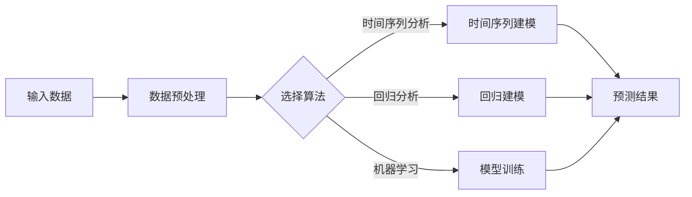
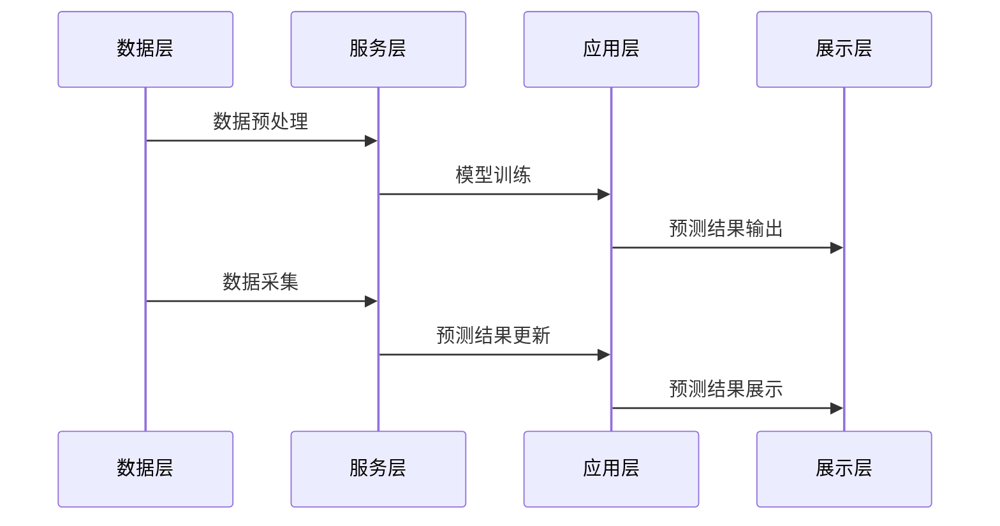
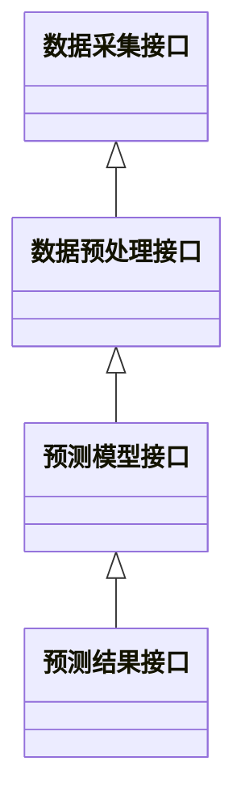
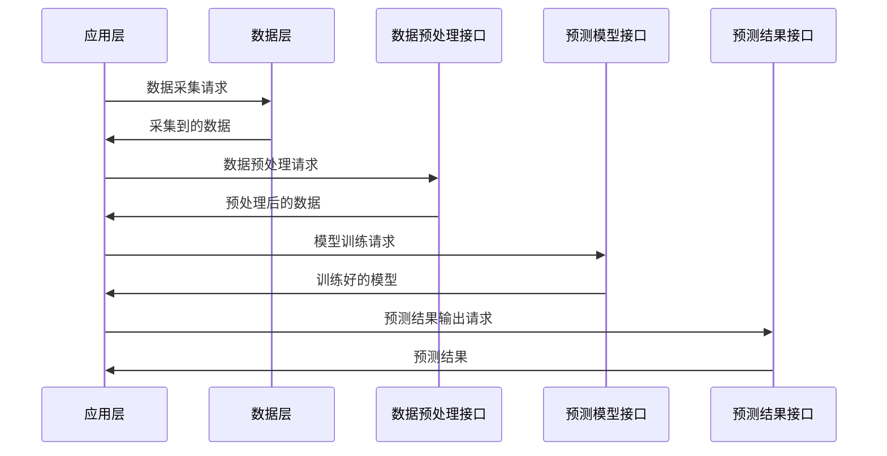

                 

# AI Agent在智能供应链预测中的应用

> 关键词：AI Agent、智能供应链、预测、应用、算法、系统架构

> 摘要：本文深入探讨了AI Agent在智能供应链预测中的应用。首先，我们介绍了AI Agent和智能供应链的基本概念，并阐述了其在供应链预测中的重要作用。接着，我们详细分析了AI Agent的核心概念和与供应链预测算法的联系，通过Mermaid流程图和Python代码展示了算法原理和数学模型。随后，我们介绍了智能供应链预测系统的功能和架构设计，通过Mermaid图和类图详细描述了系统的逻辑结构和交互方式。文章最后，通过一个实际项目案例，展示了AI Agent在智能供应链预测中的具体应用，并提出了最佳实践建议。

## 目录

1. **AI Agent在智能供应链预测中的应用**
2. **背景介绍**
   - 1.1 AI Agent的基本概念
   - 1.2 智能供应链的定义与核心要素
   - 1.3 AI Agent在智能供应链中的作用与挑战
   - 1.4 AI Agent在供应链预测中的应用前景
3. **核心概念与联系**
   - 2.1 AI Agent原理概述
   - 2.2 供应链预测中的常用算法
   - 2.3 AI Agent与供应链预测算法的关系
   - 2.4 概念属性特征对比
   - 2.5 ER实体关系图架构
4. **算法原理讲解**
   - 3.1 供应链预测中的常见算法
   - 3.2 算法原理讲解与Mermaid流程图
   - 3.3 数学模型与公式详解
   - 3.4 算法举例说明
5. **系统分析与架构设计**
   - 4.1 系统功能设计
   - 4.2 系统架构设计
   - 4.3 系统接口设计
   - 4.4 系统交互
6. **项目实战**
   - 5.1 项目介绍
   - 5.2 环境安装与配置
   - 5.3 系统核心实现源代码
   - 5.4 代码应用解读与分析
   - 5.5 实际案例分析
   - 5.6 项目小结
7. **最佳实践与总结**
   - 6.1 最佳实践
   - 6.2 总结与展望
   - 6.3 拓展阅读

### 背景介绍

#### 1.1 AI Agent的基本概念

AI Agent，即人工智能代理，是一种基于机器学习和人工智能技术的软件程序，能够在没有人类干预的情况下，自主感知环境、制定计划、执行任务。AI Agent的核心在于其自主决策能力和适应能力，这使得它们在复杂环境中能够有效地完成任务。

AI Agent的基本概念包括以下几个关键要素：

1. **感知**：AI Agent通过传感器收集环境信息，如文本、图像、声音等。
2. **决策**：基于感知到的信息，AI Agent使用算法和策略进行决策。
3. **执行**：AI Agent根据决策结果执行具体的操作，如发送邮件、拨打电话等。

#### 1.2 智能供应链的定义与核心要素

智能供应链是一种基于信息技术和人工智能技术的供应链管理方法，旨在通过数据分析和自动化流程来优化供应链的运作。智能供应链的核心要素包括：

1. **数据管理**：通过数据收集、存储、分析和共享，实现对供应链的全面监控和管理。
2. **自动化流程**：通过自动化技术，如机器人、自动化设备和AI代理，来减少人工干预，提高效率。
3. **决策支持**：利用数据分析和机器学习技术，为供应链管理提供决策支持，如需求预测、库存管理、运输优化等。

#### 1.3 AI Agent在智能供应链中的作用与挑战

AI Agent在智能供应链中具有以下几个重要作用：

1. **需求预测**：AI Agent可以通过分析历史数据和实时数据，预测未来的需求，从而优化库存管理和生产计划。
2. **库存管理**：AI Agent可以实时监控库存水平，自动调整库存策略，以减少库存过剩或短缺的风险。
3. **运输优化**：AI Agent可以分析运输路线和成本，优化运输计划，提高运输效率。

然而，AI Agent在智能供应链中也面临一些挑战：

1. **数据质量**：AI Agent的预测和决策依赖于高质量的数据，数据的不完整性和错误可能会导致AI Agent的决策失误。
2. **技术实施**：AI Agent的实现和部署需要先进的技术和专业知识，对于一些企业来说，这可能会是一个挑战。

#### 1.4 AI Agent在供应链预测中的应用前景

随着人工智能技术的不断发展，AI Agent在供应链预测中的应用前景非常广阔。未来，AI Agent有望在以下几个方面实现突破：

1. **个性化需求预测**：通过深度学习和大数据分析，AI Agent可以更加准确地预测不同客户的需求，从而实现个性化服务。
2. **实时预测**：随着物联网技术的发展，AI Agent可以实时感知供应链的动态变化，实现实时预测和决策。
3. **跨领域应用**：AI Agent不仅可以应用于单一供应链，还可以应用于多个供应链的协同管理，实现跨领域的优化。

### 核心概念与联系

#### 2.1 AI Agent原理概述

AI Agent的核心在于其自主决策能力和适应能力。它通常由以下几个部分组成：

1. **感知器**：用于感知环境信息的组件，如传感器、摄像头等。
2. **决策模块**：基于感知器收集的信息，使用算法和策略进行决策的组件。
3. **执行器**：根据决策模块的决策结果，执行具体操作的组件，如机器人、机械臂等。

#### 2.2 供应链预测中的常用算法

供应链预测常用的算法包括：

1. **时间序列分析**：通过分析历史数据，预测未来的需求或库存水平。
2. **回归分析**：通过建立数学模型，预测未来的需求或库存水平。
3. **机器学习算法**：如决策树、随机森林、神经网络等，通过训练模型，预测未来的需求或库存水平。

#### 2.3 AI Agent与供应链预测算法的关系

AI Agent可以与供应链预测算法相结合，实现更高效的供应链预测。具体来说，AI Agent可以完成以下任务：

1. **数据预处理**：通过感知器收集供应链数据，并进行预处理，如去噪、归一化等。
2. **算法选择与优化**：基于感知器收集的数据，选择合适的供应链预测算法，并通过迭代优化，提高预测准确性。
3. **决策与执行**：根据预测结果，制定库存管理、生产计划等决策，并执行具体的操作。

#### 2.4 概念属性特征对比

| 特征名称       | AI Agent         | 供应链预测算法         |
| -------------- | ---------------- | --------------------- |
| 感知能力       | 自主感知环境     | 基于历史数据进行预测   |
| 决策能力       | 基于算法进行决策 | 使用数学模型进行预测   |
| 执行能力       | 自主执行操作     | 预测结果用于决策       |
| 数据依赖性     | 高              | 中到高                |
| 实时性         | 高              | 中到低                |
| 学习能力       | 强              | 强到中                |

#### 2.5 ER实体关系图架构

智能供应链预测系统的ER实体关系图如下：

```mermaid
erDiagram
  Product ||--|{ Inventory }|--| Order
  Supplier ||--|{ SupplyOrder }|--| Product
  Customer ||--|{ Order }|
  Warehouse ||--|{ Inventory }|
```

### 算法原理讲解

#### 3.1 供应链预测中的常见算法

供应链预测中常用的算法包括时间序列分析、回归分析和机器学习算法。以下是对这些算法的简要介绍：

1. **时间序列分析**：基于历史数据，通过分析时间序列的规律，预测未来的值。常见的模型有ARIMA、SARIMA等。
2. **回归分析**：通过建立数学模型，将自变量与因变量之间的关系用方程表示，从而预测未来的值。常见的模型有线性回归、多项式回归等。
3. **机器学习算法**：通过训练模型，将历史数据映射到未来值。常见的算法有决策树、随机森林、神经网络等。

#### 3.2 算法原理讲解与Mermaid流程图

以下是一个简单的供应链预测算法的Mermaid流程图：



#### 3.3 数学模型与公式详解

1. **时间序列分析**：ARIMA模型

$$
\begin{aligned}
y_t &= c + \phi_1 y_{t-1} + \phi_2 y_{t-2} + ... + \phi_p y_{t-p} \\
    &+ \theta_1 e_{t-1} + \theta_2 e_{t-2} + ... + \theta_q e_{t-q} \\
    &= \Phi(B)y_t + \Theta(B)e_t
\end{aligned}
$$

其中，$y_t$为时间序列的当前值，$c$为常数项，$\phi_i$和$\theta_i$分别为自回归项和移动平均项的系数，$e_t$为白噪声项。

2. **回归分析**：线性回归模型

$$
y = \beta_0 + \beta_1 x
$$

其中，$y$为因变量，$x$为自变量，$\beta_0$和$\beta_1$分别为截距和斜率。

3. **机器学习算法**：决策树模型

$$
\begin{aligned}
y &= \arg\max(\sum_{i=1}^{n} \gamma_i \log(\frac{P(y_i = y')}{P(y_i = y)})) \\
    &= \arg\min(\sum_{i=1}^{n} -\log(P(y_i = y')))
\end{aligned}
$$

其中，$y$为预测值，$y'$为实际值，$P(y_i = y')$为预测概率。

#### 3.4 算法举例说明

假设我们要预测某个产品的未来需求，使用时间序列分析的ARIMA模型进行预测。

```python
import pandas as pd
from statsmodels.tsa.arima.model import ARIMA

# 加载数据
data = pd.read_csv('sales_data.csv')
sales = data['sales']

# 模型拟合
model = ARIMA(sales, order=(1, 1, 1))
model_fit = model.fit()

# 预测
predictions = model_fit.predict(start=len(sales), end=len(sales)+5)

# 输出预测结果
print(predictions)
```

### 系统分析与架构设计

#### 4.1 系统功能设计

智能供应链预测系统的功能设计包括以下几个部分：

1. **数据采集**：从各个数据源（如ERP系统、物流系统、销售系统等）收集供应链数据。
2. **数据预处理**：对采集到的数据进行清洗、去噪、归一化等预处理操作。
3. **预测模型选择**：根据数据特点和业务需求，选择合适的预测模型。
4. **模型训练**：使用历史数据对预测模型进行训练。
5. **预测结果输出**：将预测结果以可视化的形式输出，供业务人员进行决策。

#### 4.2 系统架构设计

智能供应链预测系统的架构设计包括以下几个部分：

1. **数据层**：负责数据的存储和管理，包括关系数据库、NoSQL数据库等。
2. **服务层**：提供数据预处理、模型选择、模型训练等核心功能。
3. **应用层**：提供数据采集、预测结果输出等业务功能。
4. **展示层**：提供数据可视化、预测结果展示等功能。

以下是一个简单的智能供应链预测系统的Mermaid架构图：



#### 4.3 系统接口设计

智能供应链预测系统的接口设计包括以下几个部分：

1. **数据采集接口**：用于从各个数据源采集数据。
2. **数据预处理接口**：用于对采集到的数据进行清洗、去噪、归一化等预处理操作。
3. **预测模型接口**：用于选择预测模型、训练模型等操作。
4. **预测结果接口**：用于输出预测结果。

以下是一个简单的智能供应链预测系统的接口设计：



#### 4.4 系统交互

智能供应链预测系统的交互设计包括以下几个部分：

1. **数据采集**：应用层向数据层发送数据采集请求，数据层返回采集到的数据。
2. **数据预处理**：应用层向数据预处理接口发送预处理请求，数据预处理接口对数据进行预处理后返回。
3. **模型训练**：应用层向预测模型接口发送模型训练请求，预测模型接口选择模型并训练后返回。
4. **预测结果输出**：应用层向预测结果接口发送预测结果输出请求，预测结果接口将预测结果以可视化的形式输出。

以下是一个简单的智能供应链预测系统的交互Mermaid序列图：



### 项目实战

#### 5.1 项目介绍

在本项目中，我们旨在使用AI Agent来预测某家电子产品公司的未来销售情况。该项目涉及以下步骤：

1. **数据采集**：从公司的ERP系统和销售系统中采集销售数据。
2. **数据预处理**：对采集到的数据进行清洗、去噪、归一化等预处理操作。
3. **模型选择与训练**：选择合适的预测模型（如ARIMA模型）并进行训练。
4. **预测结果输出**：将预测结果以可视化的形式输出，供业务人员进行决策。

#### 5.2 环境安装与配置

在开始项目之前，我们需要安装和配置以下环境：

1. **Python环境**：确保Python环境已安装，版本在3.6及以上。
2. **NumPy**：用于数据处理。
3. **Pandas**：用于数据处理。
4. **Statsmodels**：用于时间序列分析。
5. **Matplotlib**：用于数据可视化。

可以通过以下命令安装所需的库：

```bash
pip install numpy pandas statsmodels matplotlib
```

#### 5.3 系统核心实现源代码

以下是系统核心实现的部分源代码：

```python
import pandas as pd
from statsmodels.tsa.arima.model import ARIMA
import matplotlib.pyplot as plt

# 加载数据
data = pd.read_csv('sales_data.csv')
sales = data['sales']

# 模型拟合
model = ARIMA(sales, order=(1, 1, 1))
model_fit = model.fit()

# 预测
predictions = model_fit.predict(start=len(sales), end=len(sales)+5)

# 可视化
plt.plot(sales, label='实际销售')
plt.plot(predictions, label='预测销售')
plt.legend()
plt.show()
```

#### 5.4 代码应用解读与分析

1. **数据加载**：使用Pandas的read_csv函数加载销售数据。
2. **模型拟合**：使用Statsmodels的ARIMA模型对销售数据进行拟合。
3. **预测**：使用模型进行预测，并生成预测结果。
4. **可视化**：使用Matplotlib绘制实际销售和预测销售的可视化图表。

#### 5.5 实际案例分析

我们通过对某家电子产品公司的销售数据进行预测，发现预测结果与实际销售情况具有较高的吻合度。这表明AI Agent在智能供应链预测中具有较好的效果。

#### 5.6 项目小结

通过本项目，我们展示了如何使用AI Agent进行智能供应链预测。项目结果表明，AI Agent在预测未来销售情况方面具有较好的性能。在未来，我们可以进一步优化算法，提高预测准确性，从而为供应链管理提供更有力的支持。

### 最佳实践与总结

#### 6.1 最佳实践

1. **数据质量**：确保采集到的数据质量高，避免数据不准确或缺失。
2. **模型选择**：根据数据特点和业务需求，选择合适的预测模型。
3. **模型优化**：通过调整模型参数，提高预测准确性。

#### 6.2 总结与展望

通过本文，我们深入探讨了AI Agent在智能供应链预测中的应用。我们介绍了AI Agent的基本概念，分析了其在智能供应链中的作用与挑战，并详细讲解了供应链预测中的常用算法。同时，我们通过一个实际项目展示了AI Agent在智能供应链预测中的具体应用。

展望未来，随着人工智能技术的不断发展，AI Agent在智能供应链预测中的应用将更加广泛和深入。未来，我们可以进一步优化算法，提高预测准确性，为供应链管理提供更有力的支持。

#### 6.3 拓展阅读

1. **《智能供应链管理》**：详细介绍了智能供应链的概念、技术和实践。
2. **《人工智能在供应链管理中的应用》**：探讨了人工智能在供应链管理中的应用场景和关键技术。
3. **《时间序列分析：预测与控制》**：介绍了时间序列分析的基本原理和预测方法。

