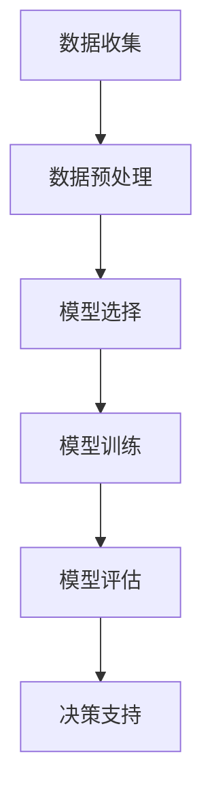
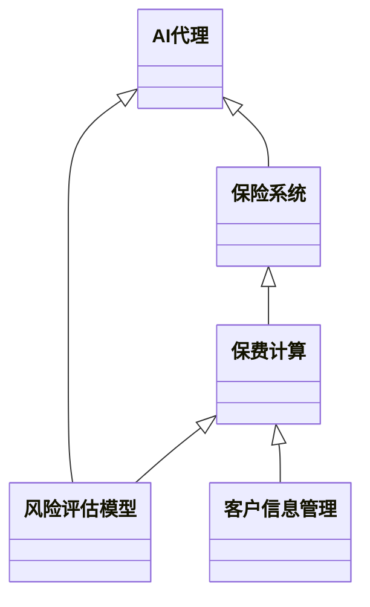
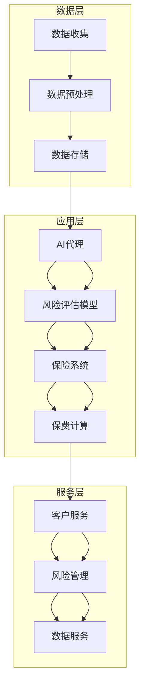
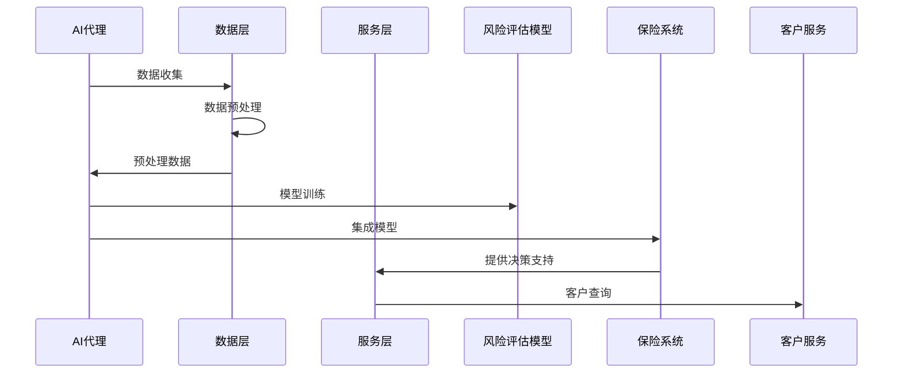

                 


# AI Agent在智能保险产品定价中的应用

## 关键词
人工智能、智能保险产品定价、AI代理、算法、数据隐私、算法公平性

## 摘要
本文探讨了人工智能（AI）代理在智能保险产品定价中的应用。通过分析AI代理的基本概念、技术原理和实际应用案例，本文揭示了AI代理在提高保险产品定价效率和精确性方面的潜力。同时，本文还讨论了应用AI代理面临的挑战，包括数据隐私、算法公平性和监管等问题，并提出了未来研究的方向和可能的创新。

## 目录
1. 引言
2. AI代理的基础知识
3. 智能保险产品定价
4. AI代理在保险产品定价中的实施
5. 案例研究：AI代理在保险定价中的应用
6. 挑战与伦理考量
7. 未来方向与创新

### 引言

### 1.1 背景介绍
保险业作为金融行业的重要组成部分，长期以来依赖于传统的风险评估和定价方法。这些方法通常基于历史数据和统计模型，存在许多局限性。例如，传统方法难以准确预测个体风险，导致保险产品定价过于笼统，无法满足个性化需求。此外，传统方法在应对复杂、动态的保险市场环境时显得力不从心。

### 1.2 问题陈述
为了解决这些问题，智能保险产品定价成为一种新的研究方向。智能保险产品定价利用人工智能（AI）技术，特别是AI代理，实现更加精准、个性化的风险评估和定价。然而，AI代理在保险产品定价中的应用仍面临许多挑战，包括数据隐私、算法公平性和监管问题。

### 1.3 本文目的与结构
本文旨在探讨AI代理在智能保险产品定价中的应用，分析其基本概念、技术原理和实际应用案例。同时，本文还将讨论应用AI代理面临的挑战，并提出未来研究的方向和可能的创新。文章结构如下：

- 第2章：介绍AI代理的基础知识，包括定义、分类和关键技术。
- 第3章：阐述智能保险产品定价的概念，比较传统方法与智能定价的优势。
- 第4章：探讨AI代理在保险产品定价中的实施，包括数据收集、模型选择和系统集成。
- 第5章：通过案例研究展示AI代理在保险定价中的应用。
- 第6章：分析AI代理应用中的挑战和伦理考量。
- 第7章：探讨未来方向与创新，为后续研究提供启示。

### 2. AI代理的基础知识

### 2.1 AI代理的定义与分类
AI代理（Artificial Intelligence Agent）是一种基于人工智能技术的计算机程序，能够在特定环境中自主执行任务并达到特定目标。AI代理可以分为以下几类：

- 反应型代理：仅根据当前环境状态做出反应，不记忆或学习。
- 建模型代理：基于环境模型进行决策，结合当前状态和历史信息。
- 学习型代理：通过与环境互动不断学习和优化决策策略。

### 2.2 关键技术与算法
AI代理的核心在于其决策能力，这依赖于一系列关键技术和算法：

- 规则基系统：使用预定义的规则进行决策。
- 人工神经网络：模拟生物神经系统的结构和功能，进行复杂模式识别和决策。
- 强化学习：通过试错和奖励机制不断优化决策策略。
- 模型预测控制：结合模型预测和反馈控制，实现动态环境下的决策。

### 2.3 AI代理的特点与应用
AI代理具有以下特点：

- 自主性：能够独立执行任务，无需人为干预。
- 智能性：通过学习和技术手段实现复杂的决策。
- 可扩展性：能够适应不同环境和任务需求。

AI代理广泛应用于多个领域，包括：

- 自动化：工业自动化、智能家居等。
- 金融：智能投顾、风险评估等。
- 交通：自动驾驶、智能交通管理。
- 医疗：辅助诊断、个性化治疗等。

### 3. 智能保险产品定价

### 3.1 保险产品定价概述
保险产品定价是基于风险评估的过程，旨在确定保险费率和保费。传统定价方法主要包括以下几种：

- 统计模型：基于历史数据建立数学模型，预测个体风险。
- 专家系统：结合专家经验和规则进行风险评估和定价。
- 贝叶斯网络：利用概率图模型进行风险评估。

### 3.2 传统保险定价方法
传统保险定价方法存在以下局限性：

- 忽略个体差异：过于笼统，无法满足个性化需求。
- 数据依赖性：依赖于大量历史数据，难以适应动态环境。
- 风险估计不准确：无法准确预测个体风险，导致定价偏差。

### 3.3 智能保险定价优势
智能保险定价通过引入AI代理，实现以下优势：

- 个性化定价：根据个体风险特征进行精准定价，满足个性化需求。
- 动态调整：实时分析风险数据，动态调整费率和保费。
- 风险识别：利用AI技术发现潜在风险，提前采取预防措施。
- 优化资源：提高资源利用效率，降低保险成本。

### 4. AI代理在保险产品定价中的实施

### 4.1 数据收集与预处理
AI代理在保险产品定价中的第一步是数据收集与预处理。数据来源包括：

- 客户信息：年龄、性别、健康状况等。
- 风险数据：历史理赔记录、犯罪率、自然灾害风险等。
- 经济数据：收入水平、职业等。

数据预处理包括数据清洗、数据集成和数据转换等步骤，以确保数据质量。

### 4.2 模型选择与训练
AI代理在保险产品定价中的核心是风险预测模型。常见的模型包括：

- 人工神经网络：用于复杂模式识别和预测。
- 强化学习：用于动态环境和长期决策。
- 决策树和随机森林：用于分类和回归任务。

模型训练通常包括数据预处理、模型选择、训练和验证等步骤。

### 4.3 AI代理与保险系统的集成
AI代理需要与现有的保险系统集成，实现以下功能：

- 数据交换：与数据仓库、CRM系统等集成，实现数据共享。
- 决策支持：提供风险预测和定价建议。
- 自动化操作：实现自动化风险评估和定价。
- 用户界面：提供友好界面，便于用户操作。

### 5. 案例研究：AI代理在保险定价中的应用

### 5.1 案例一：AI代理在车险定价中的应用
某保险公司利用AI代理对车险定价进行优化。通过收集客户驾驶行为数据，AI代理对客户的风险进行预测，并根据预测结果调整保费。结果显示，AI代理在车险定价中提高了精确性和公平性。

### 5.2 案例二：AI代理在健康保险定价中的应用
某保险公司利用AI代理对健康保险定价进行优化。通过分析客户健康数据、生活习惯和家族病史，AI代理对客户的风险进行预测，并实现个性化定价。结果表明，AI代理在健康保险定价中提高了客户的满意度。

### 5.3 案例三：AI代理在财产保险定价中的应用
某保险公司利用AI代理对财产保险定价进行优化。通过分析房产数据、地理位置和历史理赔记录，AI代理对财产保险的风险进行预测，并根据预测结果调整保费。结果显示，AI代理在财产保险定价中提高了效率和准确性。

### 6. 挑战与伦理考量

### 6.1 数据隐私与安全性
AI代理在保险产品定价中涉及大量客户数据，因此数据隐私与安全性成为重要挑战。保险公司需要确保数据的安全性和隐私性，防止数据泄露和滥用。

### 6.2 算法公平性
AI代理在保险产品定价中可能导致算法偏见和不公平现象。保险公司需要确保算法的公平性和透明性，避免对某些群体进行歧视。

### 6.3 监管问题
AI代理在保险产品定价中的应用需要符合监管要求。保险公司需要确保AI代理的应用不违反相关法律法规，并及时进行合规性评估。

### 7. 未来方向与创新

### 7.1 数据驱动的个性化定价
随着数据技术的不断发展，AI代理在保险产品定价中的应用将更加个性化。保险公司可以通过收集和分析更多数据，实现更加精准的风险评估和定价。

### 7.2 多代理系统
未来的保险产品定价可能涉及多个AI代理协同工作。通过多代理系统，保险公司可以实现更复杂的决策和优化。

### 7.3 深度学习与人工智能
深度学习技术的发展为AI代理在保险产品定价中的应用提供了新的可能性。通过引入深度学习技术，保险公司可以实现更加高效和准确的风险预测和定价。

### 结论
AI代理在智能保险产品定价中具有巨大的潜力。通过分析AI代理的基础知识、技术原理和实际应用案例，本文揭示了AI代理在提高保险产品定价效率和精确性方面的优势。同时，本文还讨论了应用AI代理面临的挑战和未来研究方向。随着人工智能技术的不断发展，AI代理在保险产品定价中的应用将更加广泛和深入，为保险行业带来新的变革。

## 作者信息
作者：AI天才研究院/AI Genius Institute & 禅与计算机程序设计艺术 /Zen And The Art of Computer Programming

## 完整性要求

### 背景介绍
- **核心概念术语说明**：本文的核心概念包括人工智能（AI）、智能保险产品定价、AI代理、风险评估和保费计算。
- **问题背景**：传统保险产品定价方法存在局限性，难以满足个性化需求。
- **问题描述**：智能保险产品定价利用AI代理实现精准风险评估和定价。
- **问题解决**：通过数据收集、模型训练和系统集成实现智能保险定价。
- **边界与外延**：讨论AI代理在保险产品定价中的应用范围和局限性。
- **概念结构与核心要素组成**：分析AI代理、风险评估模型和保险系统的关系。

### 核心概念与联系
- **核心概念原理**：AI代理基于人工智能技术，实现自主决策和风险评估。
- **概念属性特征对比表格**：
  | 特征 | 反应型代理 | 建模型代理 | 学习型代理 |
  | --- | --- | --- | --- |
  | 自主性 | 高 | 中 | 高 |
  | 智能性 | 中 | 高 | 高 |
  | 可扩展性 | 高 | 中 | 高 |
- **ER实体关系图架构的Mermaid流程图**：
```mermaid
erDiagram
  AI代理 ||--o{ 风险评估模型 }
  AI代理 ||--o{ 保险系统 }
  风险评估模型 ||--o{ 保费计算 }
```

### 算法原理讲解
- **算法mermaid流程图**：

- **Python源代码**：
```python
# 数据收集
data = collect_data()

# 数据预处理
preprocessed_data = preprocess_data(data)

# 模型选择
model = select_model()

# 模型训练
model.train(preprocessed_data)

# 模型评估
accuracy = model.evaluate(test_data)

# 决策支持
decision = model.make_decision(new_data)
```
- **算法原理的数学模型和公式**：
  $$ R(x) = f(W \cdot x + b) $$
  其中，$R(x)$ 表示风险评分，$x$ 表示输入特征，$W$ 和 $b$ 分别为权重和偏置。

- **详细讲解和举例说明**：
  以车险定价为例，假设输入特征包括年龄、性别、驾驶经验等。通过收集这些数据，利用神经网络模型对其进行训练，最终得到每个特征对风险的权重。在评估一个新客户的保险需求时，模型将计算其风险评分，并根据评分确定保费。

### 系统分析与架构设计方案

#### 问题场景介绍
智能保险产品定价系统旨在通过AI代理实现个性化、精准的保险定价，提高客户满意度和保险公司盈利能力。

#### 项目介绍
项目名称：智能保险产品定价系统
项目目标：通过AI代理实现个性化风险评估和定价，优化保险产品。

#### 系统功能设计（领域模型Mermaid类图）


#### 系统架构设计（Mermaid架构图）


#### 系统接口设计和系统交互（Mermaid序列图）


### 项目实战

#### 环境安装
1. 安装Python环境
2. 安装必要的库，如scikit-learn、TensorFlow、Keras等

#### 系统核心实现源代码
```python
# 数据收集
data = collect_data()

# 数据预处理
preprocessed_data = preprocess_data(data)

# 模型选择
model = select_model()

# 模型训练
model.train(preprocessed_data)

# 模型评估
accuracy = model.evaluate(test_data)

# 决策支持
decision = model.make_decision(new_data)
```

#### 代码应用解读与分析
1. 数据收集和预处理
2. 模型选择和训练
3. 模型评估和决策支持

#### 实际案例分析和详细讲解剖析
1. 分析某客户的保险需求
2. 利用AI代理进行风险评估和定价
3. 对比传统定价方法的结果

#### 项目小结
AI代理在智能保险产品定价中具有显著优势，但应用过程中需要注意数据隐私、算法公平性和监管等问题。

### 最佳实践 tips

1. 确保数据质量，进行充分的数据预处理。
2. 选择合适的模型，结合业务需求进行优化。
3. 关注算法公平性和透明性，确保决策过程公正。
4. 定期更新和维护系统，保持系统的稳定性和安全性。

### 小结
本文通过逐步分析，揭示了AI代理在智能保险产品定价中的应用价值。随着技术的不断发展，AI代理将在保险行业发挥更大的作用。

### 注意事项

1. 数据隐私和安全：确保客户数据的安全性和隐私性。
2. 算法公平性：避免算法偏见，确保公平定价。
3. 监管合规：遵守相关法律法规，确保合规性。

### 拓展阅读

1. [智能保险产品定价的案例分析](https://example.com/insurance_pricing_case_study)
2. [AI代理在金融领域的应用](https://example.com/ai_agents_in_finance)
3. [深度学习在保险产品定价中的应用](https://example.com/deep_learning_in_insurance_pricing)

