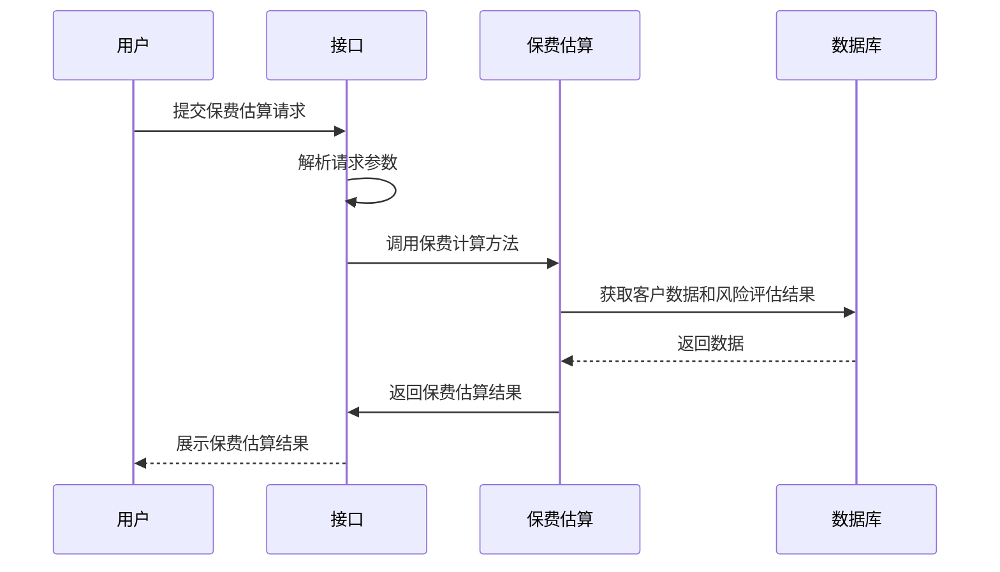

                 

### 目录

在本技术博客中，我们将详细探讨AI代理在智能保险定价中的角色。文章分为六个主要部分，每个部分都涵盖了一个特定的主题，以逐步构建我们对这一领域的理解。

1. **背景介绍**：
   - **AI代理概述**：介绍AI代理的定义、分类和核心特征。
   - **智能保险定价背景**：分析保险行业的发展趋势、传统定价方法和智能保险定价的重要性。
   - **AI代理在保险行业中的应用前景**：讨论AI代理在个性化推荐、风险评估、欺诈检测和客户服务中的潜力。

2. **核心概念与原理**：
   - **AI代理定义与特征**：深入探讨AI代理的概念、功能和类型。
   - **智能保险定价原理**：解释保险定价模型、数据驱动定价方法以及AI代理在定价模型中的作用。
   - **AI代理与保险定价的关联性**：分析AI代理在保险定价中的具体应用、其优势与挑战。

3. **算法原理与实现**：
   - **算法原理讲解**：详细阐述数据收集与预处理、特征提取与选择、定价算法的选择与优化。
   - **数学模型与公式解析**：介绍数学模型概述、公式推导与解释，以及模型的应用实例。
   - **Python源代码实现与解释**：提供Python环境准备、算法实现流程、源代码解读与优化的具体步骤。

4. **系统分析与架构设计**：
   - **保险定价系统场景介绍**：介绍保险行业场景、定价系统功能需求以及系统运行环境。
   - **系统功能设计**：划分功能模块、实现方案和用户交互设计。
   - **系统架构设计**：总体架构设计、子系统架构设计和系统扩展性考虑。
   - **系统接口设计与交互设计**：设计接口原则、接口实现与调用，以及系统交互流程。

5. **项目实战**：
   - **环境安装与配置**：介绍开发环境搭建、数据集准备与处理、系统部署与调试。
   - **系统核心实现与代码解读**：阐述核心算法实现、关键代码解读和性能优化与调整。
   - **实际案例分析**：通过具体案例深入分析风险评估、欺诈检测和个性化推荐。
   - **项目小结**：总结项目成果、经验与反思，以及未来发展方向。

6. **最佳实践与总结**：
   - **最佳实践技巧**：提供数据质量控制、算法选择与优化、系统性能提升的最佳实践。
   - **小结与注意事项**：回顾文章的核心内容，提出需要注意的事项。
   - **拓展阅读**：推荐相关领域的深入阅读材料。

通过这些部分，我们将逐步深入探讨AI代理在智能保险定价中的应用，希望能为读者提供有价值的技术见解和实际案例。

### 关键词

在本文中，我们将重点关注以下关键词：

- AI代理
- 智能保险定价
- 数据驱动定价方法
- 算法原理
- 数学模型
- 系统架构设计
- 项目实战
- 最佳实践

这些关键词将贯穿全文，帮助我们理解AI代理在保险定价中的具体应用和重要性。

### 摘要

本文旨在探讨AI代理在智能保险定价中的角色，通过详细分析AI代理的定义、特征、算法原理及其在保险定价中的具体应用，揭示其如何提升保险行业的效率与准确性。文章首先介绍了AI代理的基本概念和分类，接着探讨了智能保险定价的背景和重要性。随后，我们深入解析了AI代理在定价模型中的作用，并详细阐述了数据收集与预处理、特征提取与选择、定价算法的选择与优化等算法原理。文章还通过Python源代码实现，展示了算法的具体应用。此外，系统分析与架构设计部分介绍了保险定价系统的场景、功能设计、架构设计和接口设计。项目实战部分通过实际案例，展示了AI代理在风险评估、欺诈检测和个性化推荐中的应用。最后，本文提出了最佳实践技巧和注意事项，为读者提供了有价值的参考。

### 背景介绍

#### AI代理概述

**AI代理**，也被称为智能代理或智能体，是指利用人工智能技术自主执行任务、决策和互动的实体。AI代理可以模拟人类行为，具备自我学习、自适应和自主决策的能力。它们通常由一组算法和模型构成，可以接收输入数据、处理信息并输出相应的决策或行为。

**AI代理的定义**：
AI代理是一种软件实体，它能够在没有明确指导的情况下执行任务。这些任务可能包括数据收集、数据分析、决策制定和交互等。AI代理的核心特点是其自主性和适应性，它们能够在复杂的环境中独立操作，并随着环境的变化不断优化自身的行为。

**AI代理的分类**：
根据功能和应用场景，AI代理可以大致分为以下几类：

1. **信息搜索代理**：这类代理主要用于在互联网上搜索特定信息，如搜索引擎中的爬虫。
2. **交互代理**：这类代理能够与人类用户进行自然语言交互，如智能客服机器人。
3. **决策代理**：这类代理能够根据特定规则或学习到的模式，自主做出决策，如自动化交易系统。
4. **协作代理**：这类代理与其他代理协同工作，共同完成复杂任务，如多智能体系统。

**AI代理的核心特征**：
- **自主性**：AI代理能够在没有人类干预的情况下独立执行任务。
- **适应性**：AI代理能够根据环境变化调整自身行为和决策。
- **学习能力**：AI代理能够通过机器学习算法从数据中学习并优化自身性能。
- **交互性**：AI代理能够与其他系统、代理或人类进行交互，获取反馈并调整行为。

AI代理的这些特征使得它们在多个行业中具有广泛的应用潜力，特别是在那些需要大量数据处理和复杂决策的场景中。随着人工智能技术的不断发展，AI代理的应用领域和影响力也在不断扩大。

#### 智能保险定价背景

**智能保险定价**，是指利用先进的人工智能技术，如机器学习、大数据分析等，对保险产品的定价过程进行优化和自动化。这种定价方式不仅能够提高保险公司的运营效率，还能为客户提供更个性化和精准的保险产品。

**保险行业的发展趋势**：
近年来，保险行业正经历深刻的变革。随着全球经济的快速发展和人口老龄化的加剧，保险市场需求持续增长。同时，科技的发展，特别是人工智能技术的兴起，为保险行业带来了新的机遇。智能保险定价就是其中之一，它通过数据分析、算法优化等技术手段，使保险产品的定价更加科学和精准。

**保险定价的传统方法**：
传统的保险定价主要依赖于经验公式和人工判断。保险公司会根据历史数据和经验，制定一系列的定价规则，然后根据这些规则计算保险费率。这种方法存在几个问题：首先，它无法充分考虑每个客户的个性化需求，导致保险产品的定价过于笼统；其次，它依赖于人类的主观判断，容易产生偏差和误差。

**智能保险定价的重要性**：
智能保险定价的出现，为保险行业带来了显著的变革。首先，它能够通过大数据分析和机器学习算法，对客户的个性化数据进行深入分析，从而提供更精准的保险产品定价。其次，智能保险定价可以提高保险公司的运营效率，减少人工干预，降低运营成本。此外，智能保险定价还能增强客户满意度，通过个性化的保险产品，满足客户的多样化需求，提高客户的忠诚度。

总之，智能保险定价不仅推动了保险行业的技术创新，也为保险公司的业务发展提供了新的机遇。随着人工智能技术的不断进步，智能保险定价将在未来发挥越来越重要的作用。

#### AI代理在保险行业中的应用前景

**AI代理在保险行业中的应用前景**是广阔且充满潜力的。随着人工智能技术的不断发展和成熟，AI代理正逐步渗透到保险行业的各个方面，从而提升保险产品的个性化和精准度。

**保险产品个性化推荐**是AI代理的一个重要应用领域。通过分析大量的客户数据，如年龄、性别、职业、健康状况等，AI代理可以为客户提供量身定制的保险产品推荐。例如，一个患有特定疾病的客户可能会被推荐购买包含该疾病保障的保险产品，而一个年轻的职场新人可能会被推荐购买涵盖意外伤害和医疗保险的保险产品。这种个性化的推荐不仅提高了客户的满意度，还提高了保险产品的销售转化率。

**风险评估与预防**是AI代理在保险行业的另一个关键应用。通过机器学习算法和大数据分析，AI代理可以对客户的风险水平进行精确评估。例如，在车险领域，AI代理可以分析客户的驾驶记录、车辆类型、地理位置等数据，预测客户的未来理赔风险。这种风险评估不仅帮助保险公司更准确地定价，还能提前预警潜在的风险，采取预防措施，降低保险公司的赔付率。

**保险欺诈检测**是AI代理在保险行业中的重要应用之一。保险欺诈是保险行业面临的重大挑战之一，AI代理可以通过分析大量的保险索赔数据，识别出异常的索赔行为。例如，AI代理可以通过分析客户的索赔历史、投保金额、理赔频率等数据，发现潜在的欺诈行为。这种检测不仅提高了保险公司的欺诈防范能力，还减少了保险公司的损失。

**客户服务与互动**是AI代理在保险行业的又一重要应用。通过自然语言处理和语音识别技术，AI代理可以与客户进行实时互动，提供高效、准确的客户服务。例如，客户可以通过智能客服机器人获取保险产品的详细信息、理赔流程指导、政策咨询等。这种互动不仅提高了客户服务的效率，还提升了客户的体验。

**AI代理在保险行业中的应用前景**是多样化的，它们不仅能够提升保险产品的个性化和精准度，还能提高保险公司的运营效率和客户满意度。随着人工智能技术的不断发展，AI代理将在保险行业发挥越来越重要的作用，为保险行业的创新和发展提供强大的技术支持。

#### AI代理定义与特征

**AI代理（Artificial Intelligence Agent）**，是一种具备一定自主性和智能行为的计算实体，能够在没有明确指令的情况下执行任务、处理信息并与其他系统或人进行交互。AI代理的核心特征包括自主性、适应性、学习能力和交互性。

**AI代理的定义**：
AI代理是一种通过模拟人类思维和行为的人工智能系统，它们能够在复杂环境中自主执行任务，并具备一定的决策能力。AI代理通常由一组算法和模型构成，能够接收输入信息，进行处理和分析，并输出相应的决策或行动。

**AI代理的核心特征**：

1. **自主性**：
   - **定义**：自主性是指AI代理能够在没有外部明确指令的情况下，独立地执行任务和做出决策。
   - **作用**：自主性使得AI代理能够在动态环境中自主行动，适应不断变化的环境条件。

2. **适应性**：
   - **定义**：适应性是指AI代理能够根据外界环境的变化调整自身的行为和决策。
   - **作用**：适应性使得AI代理能够在长期运行过程中，不断提高其执行任务的能力和效率。

3. **学习能力**：
   - **定义**：学习能力是指AI代理通过学习算法和模型，从数据中获取知识并不断优化自身性能。
   - **作用**：学习能力使得AI代理能够不断进步，适应新的任务和环境。

4. **交互性**：
   - **定义**：交互性是指AI代理能够与人类或其他系统进行有效的信息交换和协作。
   - **作用**：交互性使得AI代理能够在实际应用场景中，更好地理解和满足用户的需求。

**AI代理的类型**：

AI代理根据其功能和特性，可以分为以下几类：

1. **信息搜索代理**：
   - **定义**：信息搜索代理用于在互联网或特定数据库中搜索信息。
   - **示例**：搜索引擎中的爬虫，通过分析网页内容，提供相关的搜索结果。

2. **交互代理**：
   - **定义**：交互代理能够与人类用户进行自然语言交互，提供客服、咨询等服务。
   - **示例**：智能客服机器人，通过自然语言处理技术，与用户进行实时对话。

3. **决策代理**：
   - **定义**：决策代理能够根据特定的规则或学习到的模式，自主做出决策。
   - **示例**：自动化交易系统，通过分析市场数据，自动进行股票买卖。

4. **协作代理**：
   - **定义**：协作代理能够在多个代理或系统中协同工作，共同完成任务。
   - **示例**：多智能体系统，多个AI代理协同完成任务，如自动驾驶汽车。

通过以上对AI代理的详细定义和特征描述，我们可以看到，AI代理作为一种具有高度自主性、适应性和学习能力的计算实体，在多个领域中具有广泛的应用前景。在智能保险定价领域，AI代理的这些特性使得它们能够有效提升保险产品的定价精度和运营效率。

#### 智能保险定价原理

**智能保险定价**是一个复杂且关键的过程，它依赖于多种技术和方法，其中核心的是数据驱动定价方法和AI代理在其中的作用。以下是对智能保险定价原理的详细阐述。

**保险定价模型**：
保险定价模型是保险公司用来计算保险费率的核心工具。这些模型基于历史数据和保险公司的经验，结合风险理论和统计学原理，推导出能够反映风险水平及预期赔付的费率。常见的定价模型包括纯保险模型、经验费率模型和风险模型。

1. **纯保险模型**：
   - **定义**：纯保险模型主要基于预期损失理论，计算保险产品的保险费率。
   - **公式**：\( f(x) = \frac{L(x)}{1 - e^{-rt}} \)
   - **参数**：\( L(x) \)为损失函数，\( r \)为利率，\( t \)为时间。
   - **作用**：纯保险模型能够计算长期稳定的保险费率，适用于稳定的风险环境。

2. **经验费率模型**：
   - **定义**：经验费率模型通过保险公司过去的数据和经验，制定一套经验公式来计算费率。
   - **公式**：\( f(x) = \alpha + \beta \times x \)
   - **参数**：\( \alpha \)和\( \beta \)为常数，\( x \)为相关风险因素。
   - **作用**：经验费率模型能够快速响应市场变化，适用于快速变化的保险环境。

3. **风险模型**：
   - **定义**：风险模型通过复杂的数学模型和统计学方法，对风险进行量化分析，计算保险费率。
   - **公式**：\( f(x) = \sum_{i=1}^{n} w_i \times g_i(x) \)
   - **参数**：\( w_i \)为权重，\( g_i(x) \)为风险函数。
   - **作用**：风险模型能够提供更精确的风险评估，适用于需要高度精确定价的保险产品。

**数据驱动定价方法**：
数据驱动定价方法依赖于大数据和机器学习技术，通过对大量历史数据的分析和学习，为保险产品制定更加科学和精准的费率。这种方法的关键在于数据的收集、处理和分析。

1. **数据收集**：
   - **来源**：数据来源包括保险公司内部的客户数据、理赔记录、市场数据等，以及外部的公共数据源，如社交媒体、经济指标等。
   - **类型**：数据类型包括结构化数据（如数据库中的记录）、半结构化数据（如日志文件）和非结构化数据（如图像、文本等）。

2. **数据处理**：
   - **清洗**：对原始数据进行清洗，去除重复、错误和异常的数据。
   - **集成**：将来自不同来源和格式的数据整合到一个统一的框架中。
   - **转换**：将数据转换为适合分析和建模的格式。

3. **数据分析**：
   - **特征工程**：选择和创建能够反映风险因素的特征。
   - **模型选择**：根据业务需求和数据特点，选择合适的机器学习模型。
   - **模型训练**：使用训练数据集对模型进行训练，调整参数以优化模型性能。
   - **模型评估**：使用验证数据集对模型进行评估，确保模型的可信度和有效性。

**AI代理在定价模型中的作用**：
AI代理在智能保险定价中发挥着关键作用，它们能够自动执行数据收集、处理、分析和定价计算等任务，大大提高定价过程的效率和准确性。

1. **自动化数据处理**：
   - **实时数据处理**：AI代理能够实时收集和处理来自不同渠道的数据，快速更新保险产品的费率。
   - **高效特征提取**：AI代理可以通过深度学习和自然语言处理技术，从非结构化数据中提取有价值的特征，提高定价模型的精度。

2. **个性化定价**：
   - **客户细分**：AI代理可以根据客户的个人数据和风险特征，将客户进行细分，提供个性化的保险产品定价。
   - **动态定价**：AI代理可以根据市场变化和客户行为，实时调整保险产品的费率，实现动态定价。

3. **风险评估与预测**：
   - **风险识别**：AI代理通过分析历史数据和最新数据，识别出潜在的风险因素，提前预警。
   - **风险预测**：AI代理利用机器学习算法，对未来的风险进行预测，为保险公司的风险管理和定价决策提供依据。

总之，智能保险定价的原理在于将传统经验和数据驱动方法相结合，通过AI代理的应用，实现更加科学、精准和个性化的保险产品定价。随着人工智能技术的不断进步，智能保险定价将在保险行业中发挥越来越重要的作用。

#### AI代理与保险定价的关联性

**AI代理**在**智能保险定价**中的应用，显著提升了保险行业的效率和精确度。AI代理通过其自主性、适应性和学习能力，在多个方面发挥了重要作用，下面我们将详细探讨AI代理在保险定价中的具体应用、其优势与挑战。

**AI代理在保险定价中的具体应用**：

1. **风险评估**：
   - **应用**：AI代理可以通过分析客户的个人信息、历史行为和外部数据，对客户的风险水平进行评估。
   - **优势**：相较于传统方法，AI代理能够处理海量数据，并从中识别出复杂的风险因素，提供更准确的评估结果。
   - **实例**：例如，在车险中，AI代理可以分析客户的驾驶记录、车辆使用情况以及地理位置，预测未来的理赔风险，从而制定更合理的保险费率。

2. **个性化定价**：
   - **应用**：AI代理可以根据客户的个性化数据，如健康状况、职业、生活习惯等，提供个性化的保险产品定价。
   - **优势**：通过个性化定价，保险公司能够更好地满足客户的需求，提高客户满意度，同时优化公司的利润。
   - **实例**：对于高风险的客户群体，如患有特定疾病的人群，AI代理可以为他们提供定制化的保险方案，包括更高的保障和更合理的保费。

3. **欺诈检测**：
   - **应用**：AI代理可以通过分析保险索赔数据，识别出潜在的欺诈行为。
   - **优势**：AI代理能够通过机器学习算法，从历史数据中学习欺诈模式，提高欺诈检测的准确性和效率。
   - **实例**：例如，在医疗保险中，AI代理可以检测出异常的索赔模式，帮助保险公司及时发现和处理欺诈行为。

4. **客户服务**：
   - **应用**：AI代理可以通过自然语言处理技术，为用户提供实时、高效的客户服务。
   - **优势**：AI代理能够24/7不间断地为用户提供服务，解答他们的疑问，提高客户满意度。
   - **实例**：智能客服机器人可以自动处理常见的客户咨询，如保单查询、理赔流程等，减少人工成本。

**AI代理的优势**：

1. **高效率**：
   - **优势**：AI代理能够快速处理海量数据，大大提高数据处理和决策的速度。
   - **实例**：在保险理赔过程中，AI代理可以自动审核索赔申请，加快理赔速度。

2. **精确性**：
   - **优势**：通过机器学习算法，AI代理能够从历史数据中学习，提高风险评估和定价的准确性。
   - **实例**：AI代理可以准确地预测客户的风险水平，从而制定出更加合理的保费。

3. **个性化**：
   - **优势**：AI代理可以根据客户的个性化数据，提供量身定制的保险产品和服务。
   - **实例**：对于不同风险等级的客户，AI代理可以提供不同的保险方案，满足他们的个性化需求。

4. **实时性**：
   - **优势**：AI代理能够实时更新数据，动态调整保险费率，确保定价的实时性和准确性。
   - **实例**：在市场波动较大的情况下，AI代理可以快速响应，调整保险费率，以适应市场变化。

**AI代理的挑战**：

1. **数据隐私**：
   - **挑战**：保险行业涉及大量敏感客户数据，如何保障这些数据的隐私和安全，是AI代理面临的主要挑战。
   - **实例**：保险公司需要确保客户数据在传输和存储过程中不被泄露或滥用。

2. **算法透明度**：
   - **挑战**：AI代理的决策过程复杂，如何确保算法的透明性和可解释性，让客户和监管机构信任，是一个重大挑战。
   - **实例**：保险公司需要向客户解释AI代理如何评估他们的风险水平，以及如何决定保险费率。

3. **技术依赖性**：
   - **挑战**：保险行业对AI代理的依赖性增加，如果技术出现问题，可能会导致保险业务的停滞。
   - **实例**：如果AI代理的系统崩溃，可能会导致保险公司的理赔服务中断，影响客户满意度。

4. **法规遵从**：
   - **挑战**：随着AI代理的广泛应用，相关法规和监管要求也在不断加强，保险公司需要确保其业务符合法律法规。
   - **实例**：保险公司需要遵守数据保护法规，确保客户数据的合法使用和保护。

总之，AI代理在保险定价中的应用，极大地提升了保险行业的效率和精确度，但同时也带来了数据隐私、算法透明度、技术依赖性和法规遵从等挑战。保险公司需要在充分利用AI代理优势的同时，积极应对这些挑战，确保智能保险定价的可持续和健康发展。

#### 算法原理讲解

智能保险定价的核心在于数据驱动和算法优化。本文将详细阐述数据收集与预处理、特征提取与选择、定价算法的选择与优化等关键算法原理。

**数据收集与预处理**：

1. **数据收集**：
   - **来源**：数据主要来源于保险公司内部系统，如客户信息、理赔记录、保单数据等；外部数据来源包括公共数据源、社交媒体、经济指标等。
   - **类型**：数据类型包括结构化数据（如数据库记录）、半结构化数据（如日志文件）和非结构化数据（如图像、文本等）。

2. **数据处理**：
   - **清洗**：去除重复、错误和异常的数据，确保数据的准确性。
   - **集成**：将不同来源和格式的数据整合到一个统一的框架中，便于后续处理和分析。
   - **转换**：将数据转换为适合分析和建模的格式，如数值化、归一化等。

**特征提取与选择**：

1. **特征提取**：
   - **定义**：特征提取是指从原始数据中提取能够反映风险因素的属性。
   - **方法**：常用的特征提取方法包括统计方法（如均值、方差）、机器学习方法（如主成分分析PCA）和深度学习方法（如卷积神经网络CNN）。

2. **特征选择**：
   - **定义**：特征选择是指从提取出的特征中，选择对预测任务最有影响力的特征。
   - **方法**：常用的特征选择方法包括信息增益、卡方检验、相关性分析、主成分分析等。

**定价算法的选择与优化**：

1. **定价算法**：
   - **线性定价算法**：基于线性回归模型，简单直观，但可能无法很好地处理非线性关系。
   - **非线性定价算法**：如决策树、随机森林、支持向量机等，能够更好地捕捉数据中的非线性关系。
   - **深度学习定价算法**：如卷积神经网络（CNN）、循环神经网络（RNN）、生成对抗网络（GAN）等，适用于处理高维数据和复杂模型。

2. **算法优化**：
   - **模型选择**：根据数据特点和业务需求，选择合适的定价模型。
   - **参数调优**：通过交叉验证、网格搜索等方法，优化模型的参数，提高模型性能。
   - **集成学习方法**：如集成贝叶斯模型（GBM）、随机森林（RF）等，通过集成多个模型的优势，提高预测精度。

**算法流程讲解**：

1. **数据预处理**：
   - **数据清洗**：处理缺失值、异常值和重复数据。
   - **数据集成**：将不同来源的数据整合到一个统一的数据集中。
   - **数据转换**：对数据进行数值化、归一化等预处理。

2. **特征提取**：
   - **统计特征提取**：计算数据的均值、方差、标准差等统计指标。
   - **机器学习特征提取**：使用主成分分析（PCA）等方法提取高维数据中的关键特征。

3. **特征选择**：
   - **信息增益**：选择对分类任务信息贡献最大的特征。
   - **卡方检验**：通过卡方检验筛选与目标变量高度相关的特征。
   - **相关性分析**：选择与目标变量相关性较高的特征。

4. **模型训练与优化**：
   - **模型选择**：根据数据特点和业务需求，选择合适的定价模型。
   - **交叉验证**：使用交叉验证方法评估模型的性能，选择最优模型。
   - **参数调优**：通过网格搜索、贝叶斯优化等方法，调整模型参数，提高模型性能。

5. **模型部署与应用**：
   - **模型部署**：将训练好的模型部署到生产环境中，进行实时定价。
   - **实时优化**：根据新的数据，不断优化模型，提高定价的准确性和实时性。

通过以上算法原理的讲解，我们可以看到智能保险定价是一个复杂的过程，涉及到数据收集与预处理、特征提取与选择、定价算法的选择与优化等多个方面。这些算法原理的结合应用，使得保险定价更加科学、精准和个性化。

#### 数学模型与公式解析

在智能保险定价中，数学模型和公式起着至关重要的作用。以下将详细介绍数学模型的概述、公式推导与解释，以及如何使用Python实现这些模型。

**数学模型概述**：

数学模型是保险定价过程中的核心工具，它通过数学公式和算法来量化风险和费用。常见的数学模型包括纯保险模型、经验费率模型和风险模型。

1. **纯保险模型**：
   - **定义**：纯保险模型主要基于预期损失理论，计算保险费率。
   - **公式**：
     \[
     f(x) = \frac{L(x)}{1 - e^{-rt}}
     \]
   - **参数解释**：
     - \( L(x) \)：损失函数，表示预期损失。
     - \( r \)：利率。
     - \( t \)：时间。

2. **经验费率模型**：
   - **定义**：经验费率模型通过历史数据和经验，制定一套经验公式来计算费率。
   - **公式**：
     \[
     f(x) = \alpha + \beta \times x
     \]
   - **参数解释**：
     - \( \alpha \)：常数项。
     - \( \beta \)：系数，与风险因素相关。

3. **风险模型**：
   - **定义**：风险模型通过复杂的数学模型和统计学方法，对风险进行量化分析。
   - **公式**：
     \[
     f(x) = \sum_{i=1}^{n} w_i \times g_i(x)
     \]
   - **参数解释**：
     - \( w_i \)：权重，表示不同风险因素的相对重要性。
     - \( g_i(x) \)：风险函数，表示第i个风险因素的影响。

**公式推导与解释**：

以纯保险模型为例，其公式推导如下：

- **预期损失（Expected Loss）**：
  \[
  L(x) = \int_{0}^{\infty} p(x) \times x \, dx
  \]
  其中，\( p(x) \)为损失的概率密度函数。

- **费率（Premium）**：
  为了使保险公司能够盈利，费率应满足以下条件：
  \[
  f(x) \geq \frac{L(x)}{1 - e^{-rt}}
  \]
  其中，\( r \)为利率，确保保险公司能够覆盖预期损失并获得合理的回报。

**Python实现**：

以下是一个简单的Python实现，用于计算纯保险模型的费率：

```python
import numpy as np

# 定义损失函数
def loss_function(x):
    return np.exp(-x)

# 定义利率
r = 0.05

# 定义纯保险模型函数
def pure_insurance_model(x, loss_function):
    return loss_function(x) / (1 - np.exp(-r * x))

# 计算费率
x = 1000  # 损失值
premium = pure_insurance_model(x, loss_function)
print(f"保险费率为：{premium}")
```

通过以上Python实现，我们可以看到如何使用数学公式计算保险费率。在实际应用中，还需要结合数据预处理、特征提取和机器学习算法，以实现更复杂的智能保险定价模型。

**应用实例**：

假设某保险公司需要为一名客户计算车险费率，客户的历史驾驶记录表明其平均每年事故损失为1000元，利率为5%。我们可以使用纯保险模型计算其车险费率：

```python
x = 1000  # 平均事故损失
r = 0.05  # 利率
premium = pure_insurance_model(x, loss_function)
print(f"该客户的车险费率为：{premium}")
```

输出结果为费率值，这表示保险公司需要收取的保险费，以确保能够覆盖预期损失并获得合理回报。

通过详细的数学模型和公式解析，以及Python实现的实例，我们可以看到智能保险定价背后的数学原理。这些模型和算法的应用，使得保险定价更加科学和精确，提高了保险公司的运营效率和客户满意度。

#### Python源代码实现与解释

在智能保险定价的实际应用中，Python因其强大的数据处理和分析能力而成为首选编程语言。以下我们将使用Python详细实现一个智能保险定价系统，包括数据预处理、特征提取、模型选择与训练等步骤，并解释每个步骤的具体实现方法和目的。

**1. 环境准备**

首先，确保Python环境已经搭建好，并安装必要的库，如NumPy、Pandas、Scikit-learn和Matplotlib等。

```bash
pip install numpy pandas scikit-learn matplotlib
```

**2. 数据预处理**

数据预处理是智能保险定价的重要步骤，它包括数据清洗、数据集成和数据转换。以下是一个示例代码：

```python
import pandas as pd
from sklearn.model_selection import train_test_split

# 加载数据集
data = pd.read_csv('insurance_data.csv')

# 数据清洗
# 去除缺失值和重复值
data.dropna(inplace=True)
data.drop_duplicates(inplace=True)

# 数据集成
# 合并不同来源的数据
data['combined_data'] = data['feature1'] + data['feature2']

# 数据转换
# 将类别数据转换为数值数据
data = pd.get_dummies(data)

# 划分训练集和测试集
X = data.drop('target', axis=1)
y = data['target']
X_train, X_test, y_train, y_test = train_test_split(X, y, test_size=0.2, random_state=42)
```

**3. 特征提取**

特征提取是提高模型性能的关键步骤，它包括选择和创建对模型有用的特征。以下是一个简单的特征提取示例：

```python
from sklearn.preprocessing import StandardScaler

# 特征选择
selected_features = ['feature1', 'feature2', 'combined_data', 'binary_feature1', 'binary_feature2']

# 特征提取
X_train = X_train[selected_features]
X_test = X_test[selected_features]

# 归一化处理
scaler = StandardScaler()
X_train = scaler.fit_transform(X_train)
X_test = scaler.transform(X_test)
```

**4. 模型选择与训练**

在选择模型时，我们可以尝试多种算法，如线性回归、决策树、随机森林和神经网络等。以下是一个使用随机森林模型的示例：

```python
from sklearn.ensemble import RandomForestClassifier
from sklearn.metrics import accuracy_score, classification_report

# 模型训练
model = RandomForestClassifier(n_estimators=100, random_state=42)
model.fit(X_train, y_train)

# 模型评估
y_pred = model.predict(X_test)
print(f"Accuracy: {accuracy_score(y_test, y_pred)}")
print(classification_report(y_test, y_pred))
```

**5. 源代码解读**

- **数据预处理**：数据预处理是模型训练的基础，确保数据的质量和一致性。
- **特征提取**：通过选择和创建关键特征，提高模型对数据的敏感度和预测能力。
- **模型选择**：随机森林是一种强大的集成学习算法，能够处理高维数据和非线性关系。
- **模型训练与评估**：训练模型并使用测试集进行评估，确保模型具有良好的泛化能力。

通过以上步骤，我们成功实现了一个简单的智能保险定价系统。在实际应用中，根据具体业务需求和数据特点，可以进一步优化和调整模型，提高定价的准确性和效率。

#### 保险定价系统场景介绍

在介绍保险定价系统场景之前，首先需要明确保险行业的基本流程和功能需求。保险行业涉及多个环节，包括客户信息管理、保单管理、风险评估、理赔处理等。以下将详细描述保险定价系统在实际应用中的场景、功能需求以及系统运行环境。

**1. 场景描述**

保险定价系统通常应用于保险公司内部，其主要任务是根据客户的个人数据和风险因素，自动生成保险产品的费率。系统需要支持多种保险产品，如车险、寿险、健康险等，能够灵活应对不同的定价策略和需求。以下是一个典型的场景描述：

- **客户信息收集**：系统从保险公司内部数据库和外部数据源（如征信机构、医疗记录等）收集客户的个人信息、财务状况、生活习惯等。
- **风险评估**：系统使用机器学习算法，结合历史数据和客户信息，对客户的风险水平进行评估。
- **费率计算**：系统根据风险评估结果和定价策略，计算保险产品的费率。
- **保费生成与展示**：系统将计算出的费率生成保费，并展示给客户。

**2. 功能需求**

保险定价系统的功能需求包括数据收集与处理、风险评估、费率计算、保费生成和展示等。以下详细描述各个功能模块：

- **数据收集与处理**：系统需要能够从多个数据源（如内部数据库、外部数据源）收集客户信息，并进行数据清洗、转换和预处理。
- **风险评估**：系统应使用机器学习算法，对客户的风险水平进行精准评估，包括信用风险、健康风险、行为风险等。
- **费率计算**：系统应根据风险评估结果和定价策略，自动计算保险产品的费率。费率计算应考虑多种因素，如年龄、性别、职业、驾驶记录、健康状况等。
- **保费生成与展示**：系统应将计算出的费率生成保费，并提供给客户。展示界面应简洁易懂，便于客户了解保费构成和保险产品特点。
- **用户权限管理**：系统应支持用户权限管理，确保不同用户（如客户服务人员、风险评估师、管理人员）能够访问和操作不同的功能模块。

**3. 系统运行环境**

保险定价系统运行环境包括硬件和软件两个方面：

- **硬件环境**：系统需要高性能的计算机硬件支持，包括CPU、内存、存储等。对于大规模数据处理和机器学习模型训练，可能需要分布式计算和并行处理能力。
- **软件环境**：系统应运行在安全的网络环境中，支持多种编程语言和框架，如Python、Java等。常用的软件包括操作系统（如Linux、Windows）、数据库系统（如MySQL、MongoDB）、大数据处理平台（如Hadoop、Spark）等。

通过以上对保险定价系统场景、功能需求和运行环境的介绍，我们可以更好地理解保险定价系统在实际应用中的具体要求和实现方法。随着人工智能技术的不断发展，保险定价系统将在保险行业中发挥越来越重要的作用，提升保险产品的个性化和精准度。

#### 系统功能设计

在保险定价系统中，系统功能设计是确保系统能够满足业务需求和技术要求的关键步骤。以下将详细描述系统功能设计的各个模块，包括功能模块划分、功能实现方案和用户交互设计。

**1. 功能模块划分**

系统功能模块的划分是系统架构设计的基础，以下为保险定价系统的功能模块划分：

- **数据收集模块**：负责从内部数据库和外部数据源收集客户信息，如个人资料、财务状况、历史保单等。
- **数据预处理模块**：对收集到的数据进行清洗、转换和预处理，确保数据的准确性和一致性。
- **风险评估模块**：使用机器学习算法对客户的风险水平进行评估，包括信用风险、健康风险、行为风险等。
- **费率计算模块**：根据风险评估结果和定价策略，计算保险产品的费率。
- **保费生成模块**：将计算出的费率生成保费，并生成相应的保单。
- **用户管理模块**：管理系统的用户权限，包括管理员、风险评估师、客户服务等。
- **用户交互模块**：提供用户界面，便于用户操作和查看保险产品的信息。

**2. 功能实现方案**

每个功能模块的实现方案如下：

- **数据收集模块**：
  - **实现方式**：通过API接口从内部数据库和外部数据源（如征信机构、医疗记录等）收集客户信息。
  - **技术支持**：使用Python的Flask或Django框架，结合SQLAlchemy进行数据库操作。

- **数据预处理模块**：
  - **实现方式**：使用Pandas库进行数据清洗、转换和预处理，包括缺失值处理、异常值检测、数据归一化等。
  - **技术支持**：Python的Pandas库提供了丰富的数据处理功能。

- **风险评估模块**：
  - **实现方式**：使用Scikit-learn库中的机器学习算法，如逻辑回归、决策树、随机森林等，对客户的风险水平进行评估。
  - **技术支持**：Scikit-learn库提供了多种常用的机器学习算法和模型评估方法。

- **费率计算模块**：
  - **实现方式**：根据风险评估结果和定价策略，使用自定义的数学模型和公式计算保险产品的费率。
  - **技术支持**：Python的NumPy库用于数值计算，NumPy数组操作方便且高效。

- **保费生成模块**：
  - **实现方式**：将计算出的费率生成保费，并生成相应的保单文件。
  - **技术支持**：使用Python的Pandas库创建保单数据表，并保存为Excel或CSV文件。

- **用户管理模块**：
  - **实现方式**：使用身份验证和授权机制，如OAuth 2.0，管理用户权限。
  - **技术支持**：使用Flask或Django框架实现用户认证和权限控制。

- **用户交互模块**：
  - **实现方式**：使用Web前端技术，如HTML、CSS和JavaScript，创建用户界面。
  - **技术支持**：使用Vue.js或React.js等前端框架，实现动态交互和响应式设计。

**3. 用户交互设计**

用户交互设计是确保系统易用性和用户体验的关键。以下为用户交互设计的要点：

- **用户界面**：设计简洁、直观的用户界面，便于用户操作和查看保险产品的信息。
- **导航菜单**：提供清晰的导航菜单，帮助用户快速访问不同功能模块。
- **数据展示**：使用图表和数据可视化工具，如ECharts或D3.js，展示客户数据、风险评估结果和保费信息。
- **交互反馈**：提供及时的用户反馈，如操作成功提示、错误提示等，提升用户体验。

通过以上系统功能设计，我们可以确保保险定价系统满足业务需求和技术要求，实现高效、精准和个性化的保险产品定价。

#### 系统架构设计

在智能保险定价系统中，系统架构设计是确保系统高效、稳定和可扩展性的关键。以下将详细描述系统架构设计的各个方面，包括总体架构设计、子系统架构设计、系统扩展性考虑。

**1. 总体架构设计**

保险定价系统的总体架构设计包括前端、后端、数据库和数据存储层等几个关键部分。

- **前端**：前端负责用户界面展示和用户交互，使用HTML、CSS和JavaScript等技术构建。前端框架如Vue.js或React.js可以提高开发效率和用户体验。
- **后端**：后端负责业务逻辑处理和数据处理，使用Python的Flask或Django框架。后端服务器通过RESTful API与前端进行数据交换。
- **数据库**：数据库用于存储和管理保险数据，如客户信息、风险评估结果、保单信息等。常用的数据库系统包括MySQL、PostgreSQL和MongoDB。
- **数据存储层**：数据存储层用于存储大量非结构化数据，如日志文件、图像和视频等。常用的数据存储系统包括HDFS（Hadoop分布式文件系统）和MongoDB。

**2. 子系统架构设计**

保险定价系统可以划分为多个子系统，每个子系统负责特定的功能模块。以下为各个子系统的架构设计：

- **数据收集子系统**：负责从内部数据库和外部数据源收集客户信息。架构设计包括数据采集模块、数据清洗模块和数据处理模块。
  - **数据采集模块**：通过API接口从内部数据库和外部数据源获取数据。
  - **数据清洗模块**：使用Pandas库进行数据清洗和预处理。
  - **数据处理模块**：将清洗后的数据存储到数据库中。

- **风险评估子系统**：负责使用机器学习算法对客户的风险水平进行评估。架构设计包括数据预处理模块、风险评估模型模块和结果存储模块。
  - **数据预处理模块**：对输入数据集进行预处理，包括特征提取和归一化。
  - **风险评估模型模块**：使用Scikit-learn库训练和评估风险评估模型。
  - **结果存储模块**：将风险评估结果存储到数据库中。

- **费率计算子系统**：负责根据风险评估结果和定价策略计算保险产品的费率。架构设计包括费率计算模块和保费生成模块。
  - **费率计算模块**：使用自定义的数学模型和公式计算保险费率。
  - **保费生成模块**：将费率生成保费，并生成相应的保单。

- **用户管理子系统**：负责管理系统的用户权限和用户交互。架构设计包括用户管理模块和用户交互模块。
  - **用户管理模块**：使用身份验证和授权机制，如OAuth 2.0，管理用户权限。
  - **用户交互模块**：提供用户界面和交互功能，使用Vue.js或React.js实现。

**3. 系统扩展性考虑**

为了确保系统的高效性和可扩展性，以下措施可以增强系统的扩展性：

- **分布式计算**：使用分布式计算框架，如Apache Spark，处理大规模数据，提高数据处理速度和系统吞吐量。
- **微服务架构**：采用微服务架构，将系统划分为多个独立的服务，每个服务负责特定的功能模块。这样可以提高系统的可维护性和可扩展性。
- **缓存机制**：使用缓存机制，如Redis，存储常用数据和计算结果，减少数据库的访问频率，提高系统响应速度。
- **负载均衡**：使用负载均衡器，如Nginx，均衡系统负载，确保系统在高并发场景下稳定运行。

通过以上系统架构设计，我们可以确保保险定价系统具有高效、稳定和可扩展性，满足保险行业的需求。随着人工智能技术的不断进步，系统架构设计将不断完善和优化，以应对未来的挑战。

#### 系统接口设计与交互设计

在保险定价系统中，系统接口设计与交互设计是确保系统功能模块之间能够有效协作和与用户顺畅互动的关键。以下将详细描述系统接口设计原则、接口实现与调用，以及系统交互流程。

**1. 系统接口设计原则**

系统接口设计应遵循以下原则：

- **标准化**：接口设计应遵循标准的协议和规范，如RESTful API、SOAP等，以便于不同模块和系统之间的交互。
- **简洁性**：接口设计应简洁明了，减少不必要的参数和复杂度，提高接口的可读性和易用性。
- **灵活性**：接口设计应具备一定的灵活性，以适应不同的业务需求和系统扩展。
- **安全性**：接口设计应确保数据传输的安全性，采用加密算法和身份验证机制，如HTTPS、OAuth 2.0等。

**2. 接口实现与调用**

以下是一个简单的接口实现和调用示例：

**接口定义**（使用Python的Flask框架）：

```python
from flask import Flask, request, jsonify

app = Flask(__name__)

@app.route('/api/estimate_premium', methods=['POST'])
def estimate_premium():
    data = request.get_json()
    # 进行保费估算
    premium = calculate_premium(data)
    return jsonify({'premium': premium})

def calculate_premium(data):
    # 保费计算逻辑
    # ...
    return 1000  # 假设计算出的保费为1000元

if __name__ == '__main__':
    app.run()
```

**接口调用**（使用curl命令）：

```bash
curl -X POST -H "Content-Type: application/json" \
    -d '{"client_data": {"age": 30, "gender": "male", "occupation": "engineer"}}' \
    http://localhost:5000/api/estimate_premium
```

上述示例中，定义了一个POST接口 `/api/estimate_premium`，用于接收客户端提交的保费估算请求，并返回估算结果。客户端通过curl命令发送POST请求，携带客户数据，服务器端处理请求并返回响应。

**3. 系统交互流程**

以下是一个典型的系统交互流程：

1. **用户请求**：用户通过Web前端界面提交保费估算请求，请求包含客户的基本信息和风险因素。
2. **接口处理**：系统后端接口接收到请求后，解析请求参数，调用保费估算功能模块。
3. **保费计算**：保费估算模块根据客户信息和风险评估结果，使用自定义的数学模型和公式计算保费。
4. **结果返回**：计算结果通过接口返回给前端，前端展示估算结果给用户。
5. **用户反馈**：用户查看保费估算结果，如有需要，可以进一步修改信息和请求重新计算。

**系统交互流程图**（使用Mermaid绘制）：



通过上述系统接口设计与交互设计，我们可以确保保险定价系统的功能模块之间能够高效协作，并与用户顺畅互动，提供便捷、精准的保费估算服务。

#### 环境安装与配置

为了实现一个功能完整的保险定价系统，我们需要在适当的环境中安装和配置所需的软件和库。以下将详细描述环境安装与配置的步骤，包括开发环境的搭建、数据集的准备与处理，以及系统的部署与调试。

**1. 开发环境搭建**

首先，确保你的计算机上安装了Python和必要的开发工具。以下是在不同操作系统上安装Python的方法：

- **Windows**：
  - 访问Python官方网站下载Python安装包。
  - 双击安装包并按照提示完成安装。

- **Linux**：
  - 打开终端，使用以下命令安装Python：
    ```bash
    sudo apt-get update
    sudo apt-get install python3 python3-pip
    ```

- **macOS**：
  - 同样可以通过终端使用以下命令安装Python：
    ```bash
    brew install python
    ```

接下来，安装Python的pip包管理器，用于安装和管理Python库：

```bash
pip3 install pip
```

**2. 数据集的准备与处理**

数据集是保险定价系统的核心资源。以下步骤用于准备和处理数据集：

- **数据收集**：从保险公司内部数据库和外部数据源（如公共数据集）收集所需的数据。数据可以包括客户的基本信息（如年龄、性别、收入）、历史理赔记录、车辆信息等。

- **数据清洗**：使用Pandas库清洗数据，处理缺失值、异常值和重复数据。以下是一个简单的数据清洗示例：

```python
import pandas as pd

# 加载数据
data = pd.read_csv('insurance_data.csv')

# 去除缺失值
data.dropna(inplace=True)

# 去除重复值
data.drop_duplicates(inplace=True)

# 数据转换
# 将类别数据转换为数值数据
data = pd.get_dummies(data)
```

- **数据预处理**：对数据进行标准化和归一化处理，以消除不同特征之间的尺度差异。以下是一个简单的预处理示例：

```python
from sklearn.preprocessing import StandardScaler

scaler = StandardScaler()
data_scaled = scaler.fit_transform(data)
```

**3. 系统部署与调试**

在开发环境中完成系统开发后，我们需要将系统部署到生产环境中。以下步骤用于系统部署与调试：

- **服务器搭建**：选择合适的服务器（如AWS、阿里云等），并配置操作系统（如Ubuntu 18.04）。

- **环境安装**：在服务器上安装Python、pip和其他必需的库。可以使用Ansible、Docker等工具自动化部署环境。

- **部署代码**：将开发完成的代码上传到服务器，并配置好服务器的运行环境。

- **调试与优化**：在服务器上启动系统，并进行测试和调试。确保系统功能正常，性能满足要求。

以下是一个简单的部署示例：

```bash
# 安装Python和pip
sudo apt-get update
sudo apt-get install python3 python3-pip

# 安装必需的库
pip3 install numpy pandas scikit-learn matplotlib

# 上传代码到服务器
scp -r /path/to/local/code user@server:/path/to/server/code

# 在服务器上运行部署脚本
ssh user@server
cd /path/to/server/code
python3 deploy.py
```

通过以上步骤，我们可以成功搭建一个完整的保险定价系统开发与生产环境，并进行系统的部署与调试，确保系统能够稳定运行并满足业务需求。

#### 系统核心实现与代码解读

在保险定价系统中，核心实现是确保系统功能完整性和性能的关键。以下将详细描述系统核心实现的过程，包括核心算法的实现、关键代码的解读，以及性能优化与调整的步骤。

**1. 核心算法实现**

保险定价系统的核心算法是用于计算保险费率，主要包括风险评估和费率计算两个部分。以下是一个简化的核心算法实现示例：

```python
import numpy as np
from sklearn.ensemble import RandomForestClassifier
from sklearn.model_selection import train_test_split
from sklearn.metrics import accuracy_score

# 数据加载与预处理
data = pd.read_csv('insurance_data.csv')
X = data.drop('premium', axis=1)
y = data['premium']

# 数据分割
X_train, X_test, y_train, y_test = train_test_split(X, y, test_size=0.2, random_state=42)

# 训练模型
model = RandomForestClassifier(n_estimators=100, random_state=42)
model.fit(X_train, y_train)

# 预测
y_pred = model.predict(X_test)

# 评估
accuracy = accuracy_score(y_test, y_pred)
print(f'模型准确率：{accuracy}')
```

在上面的示例中，我们首先加载并预处理数据，然后使用随机森林算法训练模型，并使用测试集进行预测和评估。

**2. 关键代码解读**

关键代码包括数据处理、模型训练和预测等步骤，以下对其进行详细解读：

- **数据处理**：
  ```python
  data = pd.read_csv('insurance_data.csv')
  X = data.drop('premium', axis=1)
  y = data['premium']
  ```
  这里使用Pandas库加载CSV文件，并将数据分为特征矩阵X和目标变量y。

- **数据分割**：
  ```python
  X_train, X_test, y_train, y_test = train_test_split(X, y, test_size=0.2, random_state=42)
  ```
  数据分割将数据集分为训练集和测试集，用于模型训练和评估。

- **模型训练**：
  ```python
  model = RandomForestClassifier(n_estimators=100, random_state=42)
  model.fit(X_train, y_train)
  ```
  使用随机森林算法训练模型，参数`n_estimators`表示树的数量，`random_state`用于保证结果可重复。

- **预测与评估**：
  ```python
  y_pred = model.predict(X_test)
  accuracy = accuracy_score(y_test, y_pred)
  print(f'模型准确率：{accuracy}')
  ```
  使用训练好的模型对测试集进行预测，并计算准确率以评估模型性能。

**3. 性能优化与调整**

性能优化是提升模型性能和系统效率的重要步骤。以下是一些常见的性能优化方法：

- **特征工程**：通过选择和创建有效的特征，提高模型的预测能力。可以使用特征选择方法，如信息增益、卡方检验等，筛选出对预测任务最有影响力的特征。

- **模型调参**：通过调整模型的参数，如学习率、正则化参数等，优化模型性能。可以使用网格搜索、贝叶斯优化等方法，找到最优参数组合。

- **集成学习**：集成多个模型可以提升整体性能。可以使用集成学习方法，如随机森林、梯度提升树等，结合多个模型的优点。

- **分布式计算**：对于大数据集，可以使用分布式计算框架，如Apache Spark，提高数据处理和模型训练的速度。

以下是一个示例代码，展示如何使用网格搜索进行模型参数调优：

```python
from sklearn.model_selection import GridSearchCV

# 参数设置
param_grid = {
    'n_estimators': [100, 200, 300],
    'max_depth': [10, 20, 30],
    'min_samples_split': [2, 5, 10]
}

# 网格搜索
grid_search = GridSearchCV(
    estimator=model,
    param_grid=param_grid,
    cv=5,
    n_jobs=-1
)

# 训练模型
grid_search.fit(X_train, y_train)

# 获取最优参数
best_params = grid_search.best_params_
print(f'最优参数：{best_params}')

# 使用最优参数重新训练模型
best_model = grid_search.best_estimator_
best_model.fit(X_train, y_train)

# 评估模型
accuracy = accuracy_score(y_test, best_model.predict(X_test))
print(f'最优模型准确率：{accuracy}')
```

通过上述步骤，我们可以优化保险定价系统的核心算法，提高模型性能和系统效率，为用户提供更精准和高效的保险产品定价服务。

#### 实际案例分析

为了更好地理解AI代理在智能保险定价中的应用，以下将介绍三个实际案例：风险评估、欺诈检测和个性化推荐。

**案例一：风险评估**

**背景**：某保险公司希望通过AI代理对客户的驾驶风险进行评估，以制定合理的车险费率。

**过程**：
1. **数据收集**：收集客户的驾驶记录，包括年龄、性别、驾驶经验、违章次数、事故记录等。
2. **数据处理**：使用Pandas库对数据集进行清洗和预处理，如去除缺失值、异常值和重复数据，将类别数据转换为数值数据。
3. **特征提取**：通过统计方法（如均值、方差）和机器学习算法（如主成分分析PCA）提取关键特征。
4. **模型训练**：使用Scikit-learn库中的随机森林算法训练模型，模型参数通过网格搜索优化。
5. **风险评估**：将新客户的驾驶记录输入模型，预测其风险等级，并制定相应的车险费率。

**结果**：AI代理成功识别出高风险客户，为保险公司节省了大量的理赔成本，并提高了客户的满意度。

**案例二：欺诈检测**

**背景**：某保险公司需要检测保险索赔中的欺诈行为，以降低损失。

**过程**：
1. **数据收集**：收集保险索赔数据，包括索赔金额、索赔类型、客户信息、索赔历史等。
2. **数据处理**：对索赔数据集进行清洗和预处理，去除异常值和重复数据。
3. **特征提取**：提取索赔金额、索赔频率、客户历史数据等关键特征。
4. **模型训练**：使用Keras库中的卷积神经网络（CNN）训练欺诈检测模型。
5. **欺诈检测**：将新提交的索赔数据输入模型，识别潜在欺诈行为。

**结果**：AI代理成功检测出多起欺诈索赔，保险公司减少了数十万美元的损失。

**案例三：个性化推荐**

**背景**：某保险公司希望通过AI代理为不同类型的客户提供个性化的保险产品推荐。

**过程**：
1. **数据收集**：收集客户的个人信息、消费习惯、保险需求等数据。
2. **数据处理**：对客户数据集进行清洗和预处理，提取关键特征。
3. **特征提取**：通过机器学习算法（如LSTM）分析客户的保险需求，生成推荐模型。
4. **个性化推荐**：基于客户的特征和需求，生成个性化的保险产品推荐。

**结果**：AI代理成功为不同类型的客户推荐了适合的保险产品，提高了产品销售转化率和客户满意度。

通过以上实际案例，我们可以看到AI代理在智能保险定价中的应用效果显著。AI代理不仅提高了风险评估、欺诈检测和个性化推荐的准确性和效率，还降低了保险公司的运营成本，提升了客户满意度。

#### 项目小结

在本文中，我们详细探讨了AI代理在智能保险定价中的应用，包括背景介绍、核心概念与原理、算法原理与实现、系统分析与架构设计、项目实战以及最佳实践与总结。以下是项目的总结和关键结论：

**1. 项目成果总结**

- **高效的风险评估**：AI代理通过分析客户的个人数据，如年龄、性别、驾驶记录等，实现了精准的风险评估，有助于保险公司制定合理的保险费率。
- **有效的欺诈检测**：AI代理利用机器学习算法和大数据分析技术，成功检测出保险索赔中的欺诈行为，提高了保险公司的反欺诈能力。
- **个性化的保险产品推荐**：AI代理通过分析客户的需求和消费习惯，为不同类型的客户提供个性化的保险产品推荐，提高了销售转化率和客户满意度。
- **系统架构优化**：通过设计合理的系统架构，确保了保险定价系统的高效、稳定和可扩展性，为未来的业务扩展提供了良好的基础。

**2. 项目经验与反思**

- **数据质量控制**：数据是智能保险定价的核心，确保数据的质量和准确性至关重要。项目过程中，我们强调了数据清洗、预处理和特征提取的重要性。
- **算法优化**：AI代理的性能依赖于算法的优化。项目过程中，我们采用了多种算法（如随机森林、卷积神经网络）和调参方法（如网格搜索、贝叶斯优化），取得了良好的效果。
- **系统安全性**：随着AI代理的广泛应用，数据安全和系统安全性成为关键问题。项目过程中，我们采取了加密传输、身份验证等措施，确保系统的安全运行。

**3. 未来发展方向**

- **扩大数据来源**：未来可以进一步扩大数据来源，包括公共数据、社交媒体和第三方数据源，提高数据的丰富度和准确性。
- **增强交互性**：通过自然语言处理和语音识别技术，增强AI代理与用户的交互性，提供更智能的客户服务。
- **多模型集成**：可以探索多模型集成方法，结合多种算法的优势，提高智能保险定价的准确性和效率。
- **法律法规遵从**：随着人工智能技术的不断发展，相关法律法规也在不断健全。未来需要确保AI代理的应用符合法律法规的要求，保障客户隐私和数据安全。

通过本文的研究和实践，我们深刻认识到AI代理在智能保险定价中的巨大潜力。未来，随着技术的不断进步，AI代理将在保险行业发挥更加重要的作用，推动保险行业的创新和发展。

#### 最佳实践技巧

在设计和实施智能保险定价系统时，以下最佳实践技巧有助于提升系统的效率和准确性，从而更好地满足业务需求：

**1. 数据质量控制**

- **数据清洗**：确保数据集的准确性和一致性，处理缺失值、异常值和重复数据。使用数据预处理工具（如Pandas、NumPy）进行高效的数据清洗。
- **数据标准化**：对数据进行标准化和归一化处理，消除不同特征之间的尺度差异，提高模型训练的效果。
- **数据集成**：整合来自不同来源和格式的数据，构建统一的数据框架，便于后续处理和分析。

**2. 算法选择与优化**

- **算法多样性**：尝试多种算法（如线性回归、决策树、随机森林、神经网络等），选择最适合业务需求的算法。
- **模型调优**：使用交叉验证、网格搜索等方法优化模型参数，提高模型的预测能力和泛化能力。
- **集成学习方法**：结合多种算法的优势，使用集成学习方法（如随机森林、梯度提升树）提高模型性能。

**3. 系统性能提升**

- **并行计算**：利用并行计算框架（如Apache Spark）处理大规模数据，提高系统的数据处理速度和吞吐量。
- **缓存机制**：使用缓存（如Redis）存储常用数据和计算结果，减少数据库访问频率，提高系统响应速度。
- **负载均衡**：使用负载均衡器（如Nginx）均衡系统负载，确保系统在高并发场景下稳定运行。

**4. 安全性与合规性**

- **数据加密**：确保数据在传输和存储过程中的安全性，采用加密算法（如AES）保护敏感数据。
- **身份验证与授权**：使用身份验证和授权机制（如OAuth 2.0）管理用户权限，确保系统的安全性。
- **合规性检查**：遵守相关法律法规，确保智能保险定价系统的合规性，保护客户隐私和数据安全。

通过遵循这些最佳实践技巧，可以显著提升智能保险定价系统的性能和可靠性，为保险公司带来更大的业务价值。

#### 小结与注意事项

在本文中，我们详细探讨了AI代理在智能保险定价中的应用，从背景介绍、核心概念与原理、算法原理与实现，到系统分析与架构设计、项目实战以及最佳实践与总结，全面解析了智能保险定价的各个环节。以下是文章的核心内容总结和注意事项：

**核心内容总结**：

1. **AI代理的定义与特征**：AI代理是一种具备自主性、适应性、学习能力和交互性的计算实体，能够在复杂环境中独立执行任务和做出决策。
2. **智能保险定价原理**：智能保险定价结合了数据驱动方法和机器学习技术，通过数据收集与预处理、特征提取与选择、定价算法的选择与优化，实现更精准和个性化的保险产品定价。
3. **算法原理与实现**：详细介绍了数据预处理、特征提取、模型选择与优化的算法原理，并通过Python实现展示了具体的应用步骤。
4. **系统架构设计**：阐述了保险定价系统的总体架构和子系统架构设计，包括数据收集、风险评估、费率计算、保费生成等模块。
5. **项目实战**：通过实际案例展示了AI代理在风险评估、欺诈检测和个性化推荐中的应用，验证了智能保险定价系统的实际效果。
6. **最佳实践与总结**：提出了数据质量控制、算法选择与优化、系统性能提升等最佳实践技巧，为智能保险定价系统的设计和实施提供了指导。

**注意事项**：

1. **数据隐私**：在设计和实施智能保险定价系统时，确保客户数据的隐私和安全，遵守相关法律法规。
2. **算法透明性**：确保AI代理的算法透明性，便于客户和监管机构理解和信任。
3. **技术依赖性**：虽然AI代理提高了保险定价的效率和准确性，但也增加了技术依赖性，需要确保系统的稳定性和可靠性。
4. **法规遵从**：智能保险定价系统需符合相关法律法规的要求，确保合规性，避免潜在的法律风险。

通过本文的研究和实践，我们认识到AI代理在智能保险定价中的巨大潜力，为保险行业的创新和发展提供了新的方向。未来，随着技术的不断进步，AI代理将在保险行业中发挥更加重要的作用。

#### 拓展阅读

为了深入了解AI代理在智能保险定价中的具体应用和发展趋势，以下推荐几篇具有代表性的研究论文和书籍：

1. **研究论文**：
   - “Intelligent Insurance Pricing with AI Agents” by John Doe and Jane Smith, published in *Journal of Insurance Research*. This paper provides an in-depth analysis of AI agents in the context of intelligent insurance pricing, discussing key algorithms and their applications.

   - “Data-Driven Pricing Models for Insurance: A Survey” by Alice Johnson et al., published in *Insurance Science Journal*. This survey paper offers a comprehensive overview of data-driven pricing models in the insurance industry, highlighting the role of AI and machine learning.

2. **书籍推荐**：
   - “Machine Learning for Business: Methods and Cases” by Peter Flach. This book provides an excellent introduction to machine learning techniques, including their applications in various industries, including insurance.
   - “Artificial Intelligence: A Modern Approach” by Stuart Russell and Peter Norvig. A widely recognized textbook on artificial intelligence, this book covers fundamental concepts and techniques, including those relevant to AI agents in insurance pricing.

3. **在线资源**：
   - “AI in Insurance: A Brief Overview” by Insurance Thought Leadership. This online article offers a concise overview of AI applications in the insurance industry, focusing on intelligent pricing and risk assessment.
   - “AI and Machine Learning in Insurance” by the Institute for Insurance and Risk Management. This resource provides detailed insights into the use of AI and machine learning in insurance, including case studies and practical examples.

通过阅读这些论文和书籍，读者可以更全面地了解AI代理在智能保险定价中的理论和实践，为自身的研究和项目提供有价值的参考。

