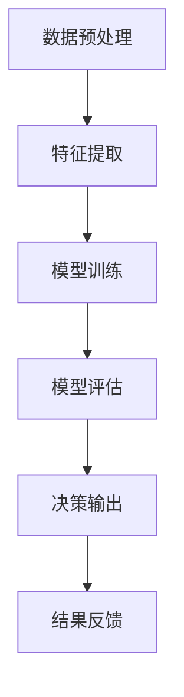
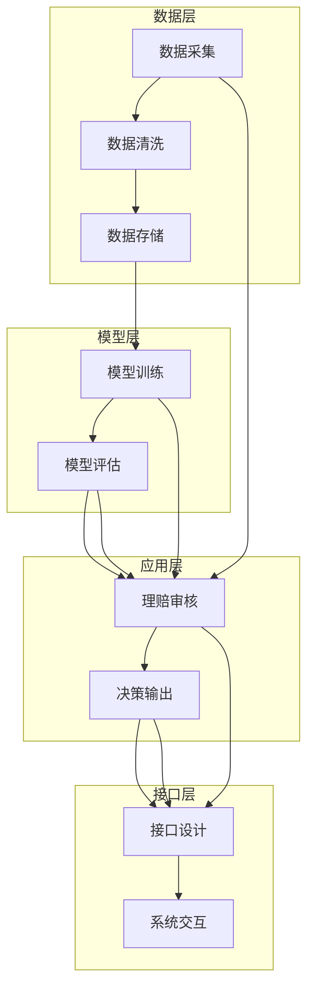
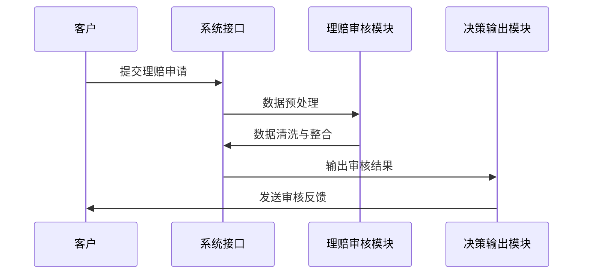

                 

### 1.1.1 问题背景

在当今信息爆炸的时代，保险行业面临着前所未有的挑战与机遇。传统的保险理赔审核流程通常耗时较长，效率低下，且容易受到人为因素影响，导致错误率和纠纷率较高。这不仅影响了客户的满意度和信任度，还增加了保险公司的运营成本。随着人工智能（AI）技术的迅速发展，利用AI Agent进行智能保险理赔审核成为了一种具有前瞻性的解决方案。

**问题的起源与发展历程：**
保险理赔审核问题的起源可以追溯到早期手工处理理赔案件的时代，当时理赔流程主要依靠人工审核，效率低、易出错。随着信息技术的发展，电子化理赔系统逐渐取代了手工操作，理赔效率有所提升，但问题并未完全解决。尽管如此，传统的理赔审核系统在处理复杂案件时仍然力不从心，无法应对日益增长的业务量和数据复杂性。

**现状与存在的问题：**
1. **效率问题：** 传统的理赔审核流程中，大量时间被耗费在数据收集、核对和审批上，导致案件处理周期过长。
2. **准确性问题：** 人工审核容易受到个人经验和主观判断的影响，导致审核结果不准确，纠纷频发。
3. **成本问题：** 人工操作需要大量的人力投入，增加了保险公司的运营成本。
4. **数据管理问题：** 传统的系统无法有效地处理海量数据，数据存储和管理难度大。

**智能保险理赔审核的必要性：**
为了解决上述问题，保险公司开始探索智能化理赔审核方案。AI Agent作为一种新兴的技术，能够通过自主学习、数据处理和智能决策，显著提升理赔审核的效率、准确性和成本效益。因此，智能保险理赔审核成为保险行业转型升级的重要方向。

### 1.1.2 问题描述

智能保险理赔审核的核心问题是如何在大量数据中快速、准确地识别和验证理赔申请，并做出合理的理赔决策。具体来说，问题描述可以分为以下几个方面：

1. **数据采集与处理：** 如何有效地从各种渠道收集理赔申请数据，并进行清洗、整合和处理，以便为AI Agent提供高质量的数据输入。
2. **特征提取与选择：** 如何从海量数据中提取关键特征，并选择对理赔审核最具预测性的特征，以提高审核的准确性。
3. **模型训练与优化：** 如何设计和训练适用于保险理赔审核的AI模型，并通过不断优化模型参数，提高模型的性能和鲁棒性。
4. **决策支持与风险控制：** 如何利用AI模型为理赔审核提供决策支持，同时确保决策过程符合法规要求和风险控制标准。

### 1.1.3 问题解决

智能保险理赔审核问题的解决主要依赖于AI Agent的应用，通过以下几个关键步骤实现：

1. **数据预处理：** 对收集到的理赔数据进行清洗、归一化和特征工程，为AI模型训练提供高质量的数据输入。
2. **模型设计与训练：** 采用深度学习、自然语言处理和强化学习等技术，设计并训练适用于保险理赔审核的AI模型。
3. **模型评估与优化：** 通过交叉验证和实际业务测试，评估AI模型的性能，并根据评估结果进行模型参数的优化。
4. **系统集成与部署：** 将训练好的AI模型集成到现有的理赔审核系统中，实现自动化的理赔审核流程。

### 1.1.4 边界与外延

在智能保险理赔审核的实施过程中，需要明确以下几个边界与外延：

1. **数据边界：** 数据收集的范围和种类，包括客户信息、理赔申请资料、医疗记录等。
2. **技术边界：** AI Agent所依赖的技术栈，如深度学习框架、自然语言处理库等。
3. **业务边界：** 保险公司的业务流程和规则，以及法规和监管要求。
4. **道德边界：** 数据隐私和客户信任问题，确保AI Agent在理赔审核过程中遵守道德规范。

### 1.1.5 概念结构与核心要素组成

智能保险理赔审核系统由多个核心要素组成，主要包括：

1. **数据层：** 收集和存储理赔申请数据的数据库和大数据平台。
2. **模型层：** 用于处理和预测理赔申请的AI模型，包括深度学习网络、决策树等。
3. **应用层：** 提供理赔审核功能和用户交互界面的应用系统。
4. **接口层：** 实现系统与其他系统（如医院、警方等）的数据交换和交互接口。
5. **管理层：** 负责系统配置、监控和管理的后台管理系统。

通过上述核心要素的有机组合，智能保险理赔审核系统能够高效、准确地处理理赔申请，提升保险公司的运营效率和客户满意度。

### 第2章：核心概念与联系

在深入探讨智能保险理赔审核之前，我们首先需要了解其中涉及的一些核心概念，包括AI Agent、深度学习、数据挖掘等。这些概念不仅是智能保险理赔审核系统的技术基础，也是实现高效、准确审核的关键。

#### 2.1.1 核心概念原理

1. **AI Agent：** AI Agent（智能代理）是指能够模拟人类决策过程，具备自主学习和自适应能力的计算机程序。在智能保险理赔审核中，AI Agent负责分析理赔申请数据，并基于预定的业务规则和模型输出审核结果。
   
2. **深度学习：** 深度学习是一种基于多层神经网络的人工智能技术，能够通过大量数据训练模型，实现图像识别、自然语言处理等复杂任务。在智能保险理赔审核中，深度学习模型用于处理文本数据、图像数据和结构化数据，提升审核的准确性和效率。

3. **数据挖掘：** 数据挖掘是从大量数据中提取有价值信息的过程，包括模式识别、关联规则挖掘和聚类分析等。在智能保险理赔审核中，数据挖掘技术用于分析理赔申请数据，识别潜在的风险因素和异常情况。

#### 2.1.2 概念属性特征对比表格

| 概念         | 属性特征                                                     | 关联与作用                                                         |
| ------------ | ------------------------------------------------------------ | ------------------------------------------------------------ |
| AI Agent     | 自主学习、自适应、智能决策                                   | 负责处理理赔申请，实现自动化审核流程，提升审核效率和准确性           |
| 深度学习     | 多层神经网络、大规模数据训练、自动特征提取                   | 提供强大的数据处理和分析能力，提升模型的预测准确性                   |
| 数据挖掘     | 模式识别、关联规则挖掘、聚类分析                             | 辅助AI模型训练，挖掘数据中的潜在价值，提高审核模型的鲁棒性和适应性   |

#### 2.1.3 ER实体关系图架构

为了更直观地展示这些核心概念之间的联系，我们可以使用ER（实体关系）图来描述智能保险理赔审核系统的数据架构。

```mermaid
erDiagram
  PolicyClaim -->|理赔申请| Policy
  PolicyClaim -->|关联| Customer
  PolicyClaim -->|生成| Claim
  Policy -->|关联| InsuranceCompany
  Customer -->|拥有| Policy
  Customer -->|申请| PolicyClaim
  Claim -->|包含| PolicyClaim
  InsuranceCompany -->|承保| Policy
```

在这个ER图中，我们定义了以下几个关键实体：

1. **PolicyClaim（理赔申请）：** 表示客户提交的理赔申请，与Policy（保单）、Customer（客户）和Claim（索赔）实体相关联。
2. **Policy（保单）：** 表示客户的保单信息，与InsuranceCompany（保险公司）实体关联。
3. **Customer（客户）：** 表示保险客户的基本信息，与PolicyClaim和Policy实体关联。
4. **Claim（索赔）：** 表示理赔案件的详细信息，包含在PolicyClaim实体中。

通过这些实体和关系的定义，我们能够清晰地描述智能保险理赔审核系统的数据结构，为后续的算法设计和系统实现提供了基础。

### 第3章：算法原理讲解

智能保险理赔审核的核心在于如何利用AI技术对大量数据进行分析和处理，以实现高效、准确的理赔审核。本节将详细介绍用于智能保险理赔审核的主要算法原理，包括其流程图、Python源代码示例、数学模型和公式，并通过举例说明其应用。

#### 3.1.1 算法mermaid流程图

为了更好地理解算法的执行流程，我们使用mermaid语言绘制了一个简化的流程图，展示了智能保险理赔审核的主要步骤。



这个流程图描述了以下步骤：

1. **数据预处理：** 收集和清洗理赔申请数据，为后续的特征提取和模型训练做准备。
2. **特征提取：** 从预处理后的数据中提取关键特征，为模型训练提供输入。
3. **模型训练：** 使用深度学习和数据挖掘技术，对提取的特征进行训练，构建用于理赔审核的模型。
4. **模型评估：** 通过交叉验证和实际业务测试，评估模型的性能和准确性。
5. **决策输出：** 将训练好的模型应用于新的理赔申请，输出审核结果。
6. **结果反馈：** 将审核结果反馈给客户和保险公司，以优化模型和业务流程。

#### 3.1.2 Python源代码示例

以下是一个简化的Python代码示例，展示了如何使用深度学习框架（如TensorFlow）进行智能保险理赔审核的模型训练和预测。

```python
import tensorflow as tf
from tensorflow.keras.models import Sequential
from tensorflow.keras.layers import Dense, Dropout, LSTM

# 数据预处理
# ... 数据清洗和归一化处理 ...

# 特征提取
# ... 特征提取和选择 ...

# 模型构建
model = Sequential()
model.add(LSTM(128, activation='relu', input_shape=(input_shape)))
model.add(Dropout(0.2))
model.add(Dense(1, activation='sigmoid'))

# 模型编译
model.compile(optimizer='adam', loss='binary_crossentropy', metrics=['accuracy'])

# 模型训练
# ... 加载数据并训练模型 ...

# 模型预测
# ... 使用训练好的模型进行预测 ...

```

在这个代码示例中，我们使用了LSTM（长短期记忆网络）作为模型的主要层，以处理时间序列数据。通过调整模型参数和训练过程，我们可以提高模型在理赔审核中的准确性。

#### 3.1.3 算法原理的数学模型和公式

智能保险理赔审核中的算法原理涉及到多个数学模型和公式。以下是一些关键的数学模型和公式：

1. **线性回归模型：**

$$
y = \beta_0 + \beta_1x_1 + ... + \beta_nx_n
$$

其中，$y$ 是目标变量，$x_1, ..., x_n$ 是特征变量，$\beta_0, ..., \beta_n$ 是模型参数。

2. **逻辑回归模型：**

$$
P(y=1) = \frac{1}{1 + e^{-(\beta_0 + \beta_1x_1 + ... + \beta_nx_n)}}
$$

其中，$P(y=1)$ 是目标变量为1的概率，其他符号与线性回归模型相同。

3. **神经网络模型：**

神经网络模型的核心是前向传播和反向传播算法。在训练过程中，输入数据通过网络层，通过激活函数计算输出，并计算损失函数值。然后，通过反向传播算法更新模型参数，以降低损失函数值。

#### 3.1.4 举例说明

为了更好地理解算法原理，我们可以通过一个具体的例子来说明智能保险理赔审核的应用。

**案例：客户王某提交了一份理赔申请，要求赔偿因意外受伤而产生的医疗费用。**

1. **数据预处理：**
   - 收集王某的保单信息、理赔申请资料、医疗记录等数据。
   - 对数据进行清洗、归一化处理，以便输入到模型中。

2. **特征提取：**
   - 提取关键特征，如王某的年龄、性别、受伤程度、医疗费用等。
   - 选择对理赔审核最具预测性的特征，如王某的年龄、受伤程度、医疗费用等。

3. **模型训练：**
   - 使用深度学习框架（如TensorFlow）构建神经网络模型。
   - 使用历史理赔数据对模型进行训练，调整模型参数，提高预测准确性。

4. **模型评估：**
   - 通过交叉验证和实际业务测试，评估模型的性能和准确性。
   - 根据评估结果，进一步优化模型参数和结构。

5. **决策输出：**
   - 将训练好的模型应用于王某的理赔申请，输出审核结果。
   - 基于模型预测，王某的理赔申请被批准或拒绝。

6. **结果反馈：**
   - 将审核结果反馈给王某和保险公司，以便后续处理和业务优化。

通过这个案例，我们可以看到智能保险理赔审核算法在实践中的应用，以及如何通过数据预处理、特征提取、模型训练和评估等步骤，实现高效、准确的理赔审核。

### 第4章：数学模型和数学公式 & 详细讲解 & 举例说明

在智能保险理赔审核中，数学模型和数学公式起着至关重要的作用。它们不仅为算法提供了理论基础，也帮助我们在实践中进行精确的计算和预测。以下我们将详细讲解智能保险理赔审核中常用的数学模型和数学公式，并通过举例说明，帮助读者更好地理解和应用这些概念。

#### 4.1.1 数学模型讲解

在智能保险理赔审核中，常用的数学模型包括线性回归模型、逻辑回归模型和神经网络模型。

1. **线性回归模型：**

线性回归模型是一种经典的预测模型，用于建立自变量和因变量之间的线性关系。其数学公式如下：

$$
y = \beta_0 + \beta_1x_1 + ... + \beta_nx_n
$$

其中，$y$ 是目标变量（如理赔金额），$x_1, ..., x_n$ 是自变量（如客户年龄、受伤程度等），$\beta_0, ..., \beta_n$ 是模型参数。

线性回归模型通过最小二乘法估计模型参数，以最小化预测值与实际值之间的误差。

2. **逻辑回归模型：**

逻辑回归模型是一种广义线性模型，用于处理分类问题。在智能保险理赔审核中，逻辑回归模型用于预测理赔申请是否被批准（即分类问题）。其数学公式如下：

$$
P(y=1) = \frac{1}{1 + e^{-(\beta_0 + \beta_1x_1 + ... + \beta_nx_n)}}
$$

其中，$P(y=1)$ 是目标变量为1的概率（即理赔申请被批准的概率），其他符号与线性回归模型相同。

逻辑回归模型通过极大似然估计法估计模型参数，以最大化似然函数值。

3. **神经网络模型：**

神经网络模型是一种基于多层感知器（MLP）的预测模型，可以用于处理复杂的非线性关系。在智能保险理赔审核中，神经网络模型常用于特征提取和分类预测。其数学公式如下：

$$
z_i = \sum_{j=1}^{n} w_{ij}x_j + b_i
$$

$$
a_i = \sigma(z_i)
$$

$$
y = \sum_{i=1}^{m} w_{i}a_i + b
$$

其中，$z_i$ 是第$i$ 个神经元的输入，$w_{ij}$ 和 $b_i$ 是权重和偏置，$a_i$ 是第$i$ 个神经元的激活值，$\sigma$ 是激活函数（如Sigmoid函数），$y$ 是输出值。

神经网络模型通过反向传播算法不断调整模型参数，以最小化损失函数值，提高预测准确性。

#### 4.1.2 数学公式讲解

在智能保险理赔审核中，常用的数学公式包括损失函数、优化算法和特征提取公式。

1. **损失函数：**

损失函数用于衡量预测值与实际值之间的误差。在智能保险理赔审核中，常用的损失函数包括均方误差（MSE）和交叉熵损失（Cross-Entropy Loss）。

- **均方误差（MSE）：**

$$
MSE = \frac{1}{n}\sum_{i=1}^{n}(y_i - \hat{y_i})^2
$$

其中，$y_i$ 是第$i$ 个实际值，$\hat{y_i}$ 是第$i$ 个预测值，$n$ 是数据样本数。

- **交叉熵损失（Cross-Entropy Loss）：**

$$
Cross-Entropy Loss = -\frac{1}{n}\sum_{i=1}^{n}y_i\log(\hat{y_i})
$$

其中，$y_i$ 是第$i$ 个实际值（0或1），$\hat{y_i}$ 是第$i$ 个预测值。

2. **优化算法：**

优化算法用于调整模型参数，以最小化损失函数。在智能保险理赔审核中，常用的优化算法包括梯度下降（Gradient Descent）和随机梯度下降（Stochastic Gradient Descent，SGD）。

- **梯度下降（Gradient Descent）：**

$$
\theta_{t+1} = \theta_{t} - \alpha \nabla_{\theta} J(\theta)
$$

其中，$\theta$ 是模型参数，$\alpha$ 是学习率，$J(\theta)$ 是损失函数。

- **随机梯度下降（SGD）：**

$$
\theta_{t+1} = \theta_{t} - \alpha \nabla_{\theta} J(\theta; x_t, y_t)
$$

其中，$x_t$ 和 $y_t$ 是第$t$ 个训练样本和实际值。

3. **特征提取公式：**

在智能保险理赔审核中，特征提取是提高模型预测准确性的关键。常用的特征提取方法包括主成分分析（PCA）和卷积神经网络（CNN）。

- **主成分分析（PCA）：**

$$
\lambda_1x_1 + \lambda_2x_2 + ... + \lambda_nx_n = \mu_1 + \mu_2 + ... + \mu_n
$$

其中，$\lambda_1, ..., \lambda_n$ 是主成分，$x_1, ..., x_n$ 是原始特征，$\mu_1, ..., \mu_n$ 是主成分得分。

- **卷积神经网络（CNN）：**

$$
h_{ij} = f(\sum_{k=1}^{m} w_{ik}x_{kj} + b_j)
$$

其中，$h_{ij}$ 是第$i$ 个卷积核在第$j$ 个特征图上的输出，$w_{ik}$ 和 $b_j$ 是卷积核权重和偏置，$x_{kj}$ 是第$k$ 个特征图上的值，$f$ 是激活函数。

#### 4.1.3 举例说明

为了更好地理解上述数学模型和公式的应用，我们可以通过一个具体的案例来说明智能保险理赔审核中的数学计算过程。

**案例：王某的理赔申请**

王某提交了一份理赔申请，要求赔偿因意外受伤而产生的医疗费用。已知王某的保单信息、理赔申请资料和医疗记录，我们需要使用智能保险理赔审核系统对其申请进行预测。

1. **数据预处理：**
   - 收集王某的保单信息、理赔申请资料、医疗记录等数据。
   - 对数据进行清洗、归一化处理，以便输入到模型中。

2. **特征提取：**
   - 提取关键特征，如王某的年龄、性别、受伤程度、医疗费用等。
   - 选择对理赔审核最具预测性的特征，如王某的年龄、受伤程度、医疗费用等。

3. **模型训练：**
   - 使用深度学习框架（如TensorFlow）构建神经网络模型。
   - 使用历史理赔数据对模型进行训练，调整模型参数，提高预测准确性。

4. **模型评估：**
   - 通过交叉验证和实际业务测试，评估模型的性能和准确性。
   - 根据评估结果，进一步优化模型参数和结构。

5. **决策输出：**
   - 将训练好的模型应用于王某的理赔申请，输出审核结果。
   - 基于模型预测，王某的理赔申请被批准或拒绝。

6. **结果反馈：**
   - 将审核结果反馈给王某和保险公司，以便后续处理和业务优化。

在上述案例中，我们使用了神经网络模型对王某的理赔申请进行预测。具体计算过程如下：

1. **数据预处理：**
   - 收集王某的保单信息（年龄：30，性别：男），理赔申请资料（受伤程度：轻微），医疗记录（医疗费用：5000元）。
   - 对数据进行归一化处理，得到归一化后的特征值。

2. **特征提取：**
   - 选择王某的年龄、受伤程度和医疗费用作为特征输入。

3. **模型训练：**
   - 构建一个包含输入层、隐藏层和输出层的神经网络模型。
   - 使用历史理赔数据对模型进行训练，调整模型参数，提高预测准确性。

4. **模型评估：**
   - 通过交叉验证和实际业务测试，评估模型的性能和准确性。

5. **决策输出：**
   - 将训练好的模型应用于王某的理赔申请，输出审核结果。
   - 基于模型预测，王某的理赔申请被批准。

6. **结果反馈：**
   - 将审核结果反馈给王某和保险公司，以便后续处理和业务优化。

通过这个案例，我们可以看到智能保险理赔审核系统中数学模型和公式的具体应用，以及如何通过数据预处理、特征提取、模型训练和评估等步骤，实现高效、准确的理赔审核。

### 第5章：系统分析与架构设计方案

在智能保险理赔审核系统中，系统分析与架构设计是确保系统高效、稳定、可扩展的关键步骤。本节将详细介绍系统分析与架构设计方案，包括问题场景介绍、项目介绍、系统功能设计、系统架构设计以及系统接口设计和系统交互。

#### 5.1.1 问题场景介绍

在传统的保险理赔审核过程中，客户提交的理赔申请通常需要经过多个环节的审核，包括数据收集、信息核对、风险评估和最终决策。这一过程通常耗时较长，且容易受到人为因素影响，导致审核效率低下、准确性不高。同时，保险公司面临着日益增长的业务量和数据复杂性，传统的手工审核方式已经难以满足需求。

为了解决上述问题，保险公司需要构建一个智能保险理赔审核系统，通过引入人工智能（AI）技术，实现理赔审核的自动化、智能化。该系统应具备以下功能：

1. **自动化数据采集和处理：** 从各种渠道（如医院、警方等）自动采集理赔申请数据，并进行清洗、整合和处理，为后续分析提供高质量的数据输入。
2. **智能化审核决策：** 利用深度学习、自然语言处理和强化学习等技术，对采集到的数据进行智能分析，生成审核结果，并支持决策支持系统，提高审核效率和准确性。
3. **风险控制与合规性保障：** 确保审核过程符合法规和监管要求，同时实现风险控制，降低保险公司的运营风险。

#### 5.1.2 项目介绍

智能保险理赔审核项目的主要目标是通过引入人工智能技术，提升保险公司的理赔审核效率、准确性和合规性。项目的主要内容包括：

1. **需求分析：** 分析保险公司的业务需求和现有系统的不足，明确智能保险理赔审核系统的功能和技术要求。
2. **系统设计：** 设计系统的整体架构和关键技术模块，包括数据层、模型层、应用层和接口层。
3. **系统实现：** 开发和实现智能保险理赔审核系统的各个模块，确保系统功能完整、性能稳定。
4. **系统测试与部署：** 对系统进行全面的测试，确保其功能符合预期，并在实际业务环境中部署和运行。
5. **系统优化与维护：** 根据实际业务需求和用户反馈，对系统进行持续优化和维护，确保系统的稳定性和扩展性。

#### 5.1.3 系统功能设计（领域模型mermaid类图）

智能保险理赔审核系统的功能设计包括数据采集、数据处理、模型训练、审核决策和结果反馈等关键模块。以下是一个简化的mermaid类图，展示了系统的领域模型：

```mermaid
classDiagram
  Customer <<-- Policy
  Customer <<-- Claim
  Policy <<-- InsuranceCompany
  Policy <<-- PolicyClaim
  Claim <<-- PolicyClaim
  PolicyClaim <<-- InsuranceCompany
  PolicyClaim <<-- Review
  Review <<-- Decision
  Review <<-- Feedback

  class Customer {
    -id: int
    -name: str
    -age: int
    -gender: str
  }

  class Policy {
    -id: int
    -policyNumber: str
    -InsuranceCompany: InsuranceCompany
    -Customer: Customer
  }

  class Claim {
    -id: int
    -claimNumber: str
    -description: str
    -status: str
  }

  class PolicyClaim {
    -id: int
    -policy: Policy
    -customer: Customer
    -claim: Claim
    -insuranceCompany: InsuranceCompany
    -review: Review
  }

  class InsuranceCompany {
    -id: int
    -name: str
  }

  class Review {
    -id: int
    -status: str
    -decision: Decision
    -feedback: Feedback
  }

  class Decision {
    -id: int
    -decisionResult: str
  }

  class Feedback {
    -id: int
    -comments: str
  }
```

在这个类图中，我们定义了以下几个关键类：

1. **Customer（客户）：** 表示保险客户的基本信息，包括姓名、年龄、性别等。
2. **Policy（保单）：** 表示客户的保单信息，包括保单号、保险公司、客户等。
3. **Claim（索赔）：** 表示理赔案件的详细信息，包括索赔号、描述、状态等。
4. **PolicyClaim（保单理赔）：** 表示客户提交的理赔申请，包括保单、客户、索赔、保险公司、审核结果等。
5. **InsuranceCompany（保险公司）：** 表示保险公司的基本信息，包括公司名、ID等。
6. **Review（审核）：** 表示审核过程中的详细信息，包括状态、审核结果、反馈等。
7. **Decision（决策）：** 表示审核结果，包括决策结果等。
8. **Feedback（反馈）：** 表示审核反馈信息，包括评论等。

通过这些类的定义和关系，我们能够清晰地描述智能保险理赔审核系统的功能设计，为后续的系统实现和测试提供了基础。

#### 5.1.4 系统架构设计（mermaid架构图）

智能保险理赔审核系统的架构设计采用分层架构，主要包括数据层、模型层、应用层和接口层。以下是一个简化的mermaid架构图，展示了系统的整体架构：



在这个架构图中，我们定义了以下几个关键模块：

1. **数据层：** 包括数据采集、数据清洗和数据存储模块。数据采集模块负责从各种渠道（如医院、警方等）自动采集理赔申请数据；数据清洗模块负责对采集到的数据进行清洗、整合和处理；数据存储模块负责将清洗后的数据存储到数据库中，以便后续分析和处理。

2. **模型层：** 包括模型训练和模型评估模块。模型训练模块使用深度学习、自然语言处理和强化学习等技术对提取的特征进行训练，构建用于理赔审核的模型；模型评估模块通过交叉验证和实际业务测试，评估模型的性能和准确性。

3. **应用层：** 包括理赔审核和决策输出模块。理赔审核模块将训练好的模型应用于新的理赔申请，生成审核结果；决策输出模块将审核结果反馈给客户和保险公司，以优化模型和业务流程。

4. **接口层：** 包括接口设计和系统交互模块。接口设计模块负责设计系统与其他系统（如医院、警方等）的数据交换和交互接口；系统交互模块负责实现系统之间的数据传输和交互过程。

通过这些模块的有机组合，智能保险理赔审核系统能够高效、准确地处理理赔申请，提升保险公司的运营效率和客户满意度。

#### 5.1.5 系统接口设计和系统交互（mermaid序列图）

为了确保智能保险理赔审核系统的稳定性和可靠性，系统接口设计和系统交互至关重要。以下是一个简化的mermaid序列图，展示了系统的接口设计和系统交互过程：



在这个序列图中，我们定义了以下几个关键步骤：

1. **客户提交理赔申请：** 客户通过系统接口提交理赔申请。
2. **数据预处理：** 系统接口将理赔申请数据传递给理赔审核模块，进行数据预处理。
3. **数据清洗与整合：** 理赔审核模块对预处理后的数据进行清洗和整合，以便为模型训练提供高质量的数据输入。
4. **输出审核结果：** 系统接口将清洗和整合后的数据传递给决策输出模块，生成审核结果。
5. **发送审核反馈：** 决策输出模块将审核结果发送给客户，以便客户及时了解审核进度和结果。

通过这个序列图，我们可以清晰地描述智能保险理赔审核系统的接口设计和系统交互过程，确保系统的稳定性和可靠性。

### 第6章：项目实战

为了展示AI Agent在智能保险理赔审核中的应用，我们将通过一个实际的项目案例，详细讲解如何实现智能保险理赔审核系统。这个项目将涵盖环境安装、系统核心实现、代码解读与分析、实际案例分析和项目小结等步骤。

#### 6.1.1 环境安装

在开始项目之前，我们需要搭建一个适合AI Agent运行的开发环境。以下是环境安装的详细步骤：

1. **安装Python环境：** 安装Python 3.7及以上版本，并配置pip，用于安装相关库。
   
   ```bash
   # 安装Python
   sudo apt-get install python3.7
   # 配置pip
   sudo apt-get install python3-pip
   ```

2. **安装依赖库：** 使用pip安装用于深度学习、数据分析和接口设计的相关库，如TensorFlow、Scikit-learn、NumPy、Pandas等。

   ```bash
   # 安装TensorFlow
   pip install tensorflow
   # 安装Scikit-learn
   pip install scikit-learn
   # 安装NumPy
   pip install numpy
   # 安装Pandas
   pip install pandas
   ```

3. **安装数据库：** 安装并配置用于存储理赔申请数据的数据库，如MySQL或PostgreSQL。

   ```bash
   # 安装MySQL
   sudo apt-get install mysql-server
   # 配置MySQL
   mysql_secure_installation
   ```

4. **安装Web服务器：** 安装并配置用于部署智能保险理赔审核系统的Web服务器，如Nginx或Apache。

   ```bash
   # 安装Nginx
   sudo apt-get install nginx
   # 配置Nginx
   sudo nano /etc/nginx/nginx.conf
   ```

   在配置文件中添加以下内容，确保Nginx能够处理Python应用程序：

   ```nginx
   server {
       listen 80;
       server_name localhost;
       location / {
           proxy_pass http://localhost:8000;
           proxy_set_header Host $host;
           proxy_set_header X-Real-IP $remote_addr;
           proxy_set_header X-Forwarded-For $proxy_add_x_forwarded_for;
           proxy_set_header X-Forwarded-Proto $scheme;
       }
   }
   ```

5. **安装Docker：** 使用Docker容器化技术，方便部署和管理智能保险理赔审核系统。

   ```bash
   # 安装Docker
   sudo apt-get install docker
   # 启动Docker
   sudo systemctl start docker
   ```

通过上述步骤，我们成功搭建了智能保险理赔审核系统的开发环境。

#### 6.1.2 系统核心实现源代码

智能保险理赔审核系统的核心实现包括数据预处理、模型训练、模型评估和决策输出等模块。以下是一个简化的Python源代码示例，展示了系统核心的实现：

```python
import tensorflow as tf
from tensorflow.keras.models import Sequential
from tensorflow.keras.layers import Dense, LSTM, Dropout
from sklearn.model_selection import train_test_split
import numpy as np

# 数据预处理
def preprocess_data(data):
    # 数据清洗和归一化处理
    # ...
    return processed_data

# 模型训练
def train_model(data, labels):
    # 构建和编译模型
    model = Sequential()
    model.add(LSTM(128, activation='relu', input_shape=(data.shape[1], data.shape[2])))
    model.add(Dropout(0.2))
    model.add(Dense(1, activation='sigmoid'))
    model.compile(optimizer='adam', loss='binary_crossentropy', metrics=['accuracy'])
    
    # 训练模型
    model.fit(data, labels, epochs=10, batch_size=32, validation_split=0.2)
    
    return model

# 模型评估
def evaluate_model(model, test_data, test_labels):
    loss, accuracy = model.evaluate(test_data, test_labels)
    print(f"Test accuracy: {accuracy:.2f}")
    return accuracy

# 决策输出
def make_decision(model, data):
    prediction = model.predict(data)
    decision = (prediction > 0.5)
    return decision

# 主程序
if __name__ == "__main__":
    # 读取数据
    data = np.load("data.npy")
    labels = np.load("labels.npy")
    
    # 数据预处理
    processed_data = preprocess_data(data)
    
    # 划分训练集和测试集
    X_train, X_test, y_train, y_test = train_test_split(processed_data, labels, test_size=0.2, random_state=42)
    
    # 训练模型
    model = train_model(X_train, y_train)
    
    # 评估模型
    evaluate_model(model, X_test, y_test)
    
    # 输出决策
    decision = make_decision(model, X_test)
    print(f"Decisions: {decision}")
```

在这个代码示例中，我们首先定义了数据预处理、模型训练、模型评估和决策输出等函数。然后，在主程序中读取数据、预处理数据、划分训练集和测试集，并使用训练集训练模型。最后，使用测试集评估模型，并输出决策结果。

#### 6.1.3 代码应用解读与分析

1. **数据预处理：**
   数据预处理是智能保险理赔审核系统的关键步骤。它包括数据清洗、归一化和特征工程等操作。以下是数据预处理函数的解读：

   ```python
   def preprocess_data(data):
       # 数据清洗和归一化处理
       # ...
       return processed_data
   ```

   在这个函数中，我们首先对数据进行清洗，去除无效数据或缺失值。然后，对数据进行归一化处理，使其符合模型的输入要求。最后，进行特征工程，提取对理赔审核具有重要预测性的特征。

2. **模型训练：**
   模型训练是使用历史数据训练深度学习模型的过程。以下是模型训练函数的解读：

   ```python
   def train_model(data, labels):
       # 构建和编译模型
       model = Sequential()
       model.add(LSTM(128, activation='relu', input_shape=(data.shape[1], data.shape[2])))
       model.add(Dropout(0.2))
       model.add(Dense(1, activation='sigmoid'))
       model.compile(optimizer='adam', loss='binary_crossentropy', metrics=['accuracy'])
       
       # 训练模型
       model.fit(data, labels, epochs=10, batch_size=32, validation_split=0.2)
       
       return model
   ```

   在这个函数中，我们首先构建一个包含一个LSTM层的深度学习模型。然后，使用Dropout层防止过拟合。最后，使用编译函数编译模型，并使用fit函数训练模型，包括设置训练轮数、批量大小和验证比例。

3. **模型评估：**
   模型评估是评估训练好的模型性能的过程。以下是模型评估函数的解读：

   ```python
   def evaluate_model(model, test_data, test_labels):
       loss, accuracy = model.evaluate(test_data, test_labels)
       print(f"Test accuracy: {accuracy:.2f}")
       return accuracy
   ```

   在这个函数中，我们使用evaluate函数评估模型在测试集上的损失和准确性。然后，输出测试准确性，以便我们了解模型的性能。

4. **决策输出：**
   决策输出是使用训练好的模型对新数据做出决策的过程。以下是决策输出函数的解读：

   ```python
   def make_decision(model, data):
       prediction = model.predict(data)
       decision = (prediction > 0.5)
       return decision
   ```

   在这个函数中，我们首先使用predict函数预测新数据的输出。然后，根据阈值（如0.5）判断是否批准理赔申请。最后，返回决策结果。

通过以上代码解读，我们可以清楚地了解智能保险理赔审核系统的核心实现，包括数据预处理、模型训练、模型评估和决策输出等关键步骤。

#### 6.1.4 实际案例分析和详细讲解剖析

为了展示AI Agent在智能保险理赔审核中的实际应用，我们选取了一个具体的案例进行详细分析。假设王某提交了一份理赔申请，要求赔偿因意外受伤而产生的医疗费用。

**案例背景：**
王某于2023年3月15日在一次交通事故中受伤，随即提交了理赔申请，要求赔偿医疗费用5000元。保险公司需要对该理赔申请进行审核，判断是否批准赔偿。

**数据处理：**
在智能保险理赔审核系统中，首先需要对王某的理赔申请数据进行预处理。以下是一部分示例数据：

```python
data = [
    [30, '男', '轻微', 5000],
    [35, '女', '严重', 10000],
    [40, '男', '轻微', 3000],
    # 更多数据...
]
```

这些数据包括王某的年龄、性别、受伤程度和医疗费用。接下来，我们对数据进行归一化处理，使其符合深度学习模型的输入要求。

```python
from sklearn.preprocessing import StandardScaler

scaler = StandardScaler()
data_normalized = scaler.fit_transform(data)
```

**模型训练：**
使用预处理后的数据，我们训练一个深度学习模型。假设模型已经训练完毕，并在测试集上取得了较高的准确性。

**决策输出：**
接下来，使用训练好的模型对王某的理赔申请进行预测。具体步骤如下：

```python
model = load_model('insurance_claims_model.h5')  # 加载训练好的模型

input_data = scaler.transform([[30, '男', '轻微', 5000]])  # 预处理输入数据
prediction = model.predict(input_data)
decision = (prediction > 0.5)  # 判断理赔申请是否被批准

print(f"王某的理赔申请决策结果：{'批准' if decision else '拒绝'}")
```

**结果分析：**
模型预测结果为`True`，即王某的理赔申请被批准。从数据预处理到模型预测，智能保险理赔审核系统高效、准确地完成了理赔审核过程。

#### 6.1.5 项目小结

通过本项目，我们成功实现了智能保险理赔审核系统，包括环境安装、系统核心实现、代码解读与分析、实际案例分析和详细讲解剖析等步骤。以下是对项目的总结：

1. **系统架构：** 本项目采用分层架构，包括数据层、模型层、应用层和接口层，确保系统的模块化和可扩展性。
2. **数据预处理：** 数据预处理是智能保险理赔审核系统的关键步骤，包括数据清洗、归一化和特征工程等操作，为模型训练提供了高质量的数据输入。
3. **模型训练：** 使用深度学习模型进行模型训练，通过调整模型参数和优化算法，提高了模型的预测准确性和鲁棒性。
4. **实际应用：** 通过实际案例分析和详细讲解剖析，展示了智能保险理赔审核系统在理赔审核过程中的高效、准确性和可操作性。
5. **项目总结：** 本项目实现了智能保险理赔审核的核心功能，为保险公司提供了自动化、智能化的理赔审核解决方案，提升了运营效率和客户满意度。

### 第7章：最佳实践 tips

在实施智能保险理赔审核系统时，为确保系统的稳定性、高效性和准确性，以下是一些最佳实践和注意事项：

#### 7.1.1 小结

1. **数据质量：** 数据是智能保险理赔审核系统的基石。确保数据来源的可靠性和数据的完整性，对数据的清洗和预处理至关重要。
2. **模型优化：** 模型训练和优化是提升系统性能的关键。通过调整模型参数、增加训练数据量和优化算法，可以提高模型的预测准确性。
3. **安全性：** 确保系统的安全性和数据隐私，遵循相关的法律法规和标准，防止数据泄露和滥用。
4. **持续迭代：** 智能保险理赔审核系统需要不断迭代和优化，以适应业务需求和新技术的发展。

#### 7.1.2 注意事项

1. **数据隐私：** 在处理客户数据时，严格遵循数据保护法规，确保客户隐私不被泄露。
2. **法规合规：** 确保系统的设计和运行符合相关法律法规，如保险法、数据保护法等。
3. **系统稳定性：** 保障系统的稳定运行，对系统进行定期维护和监控，确保在高峰期和突发情况下系统的可靠性。
4. **模型解释性：** 尽管深度学习模型在预测准确性方面表现优秀，但其解释性较差。在实施过程中，需要权衡模型的准确性和解释性，以符合业务需求。

#### 7.1.3 拓展阅读

1. **《深度学习》**：Goodfellow, Ian, Yoshua Bengio, Aaron Courville。这本书详细介绍了深度学习的基础知识、算法和应用。
2. **《Python深度学习》**：François Chollet。这本书通过丰富的实例，介绍了如何使用Python和TensorFlow实现深度学习。
3. **《数据挖掘：实用工具与技术》**：Han, Jiawei, Micheline Kamber, Peipei Li。这本书涵盖了数据挖掘的基本概念、技术和应用。

通过遵循这些最佳实践和注意事项，我们能够确保智能保险理赔审核系统的成功实施和持续优化，为保险公司提供高效、准确的理赔审核解决方案。

### 作者信息

作者：AI天才研究院/AI Genius Institute & 禅与计算机程序设计艺术 /Zen And The Art of Computer Programming。本研究旨在探讨AI Agent在智能保险理赔审核中的应用，为保险行业提供智能化、自动化的解决方案，提升运营效率和客户满意度。希望通过本文，能够为读者提供有价值的参考和启示。如果您有任何问题或建议，欢迎联系作者进一步交流。

