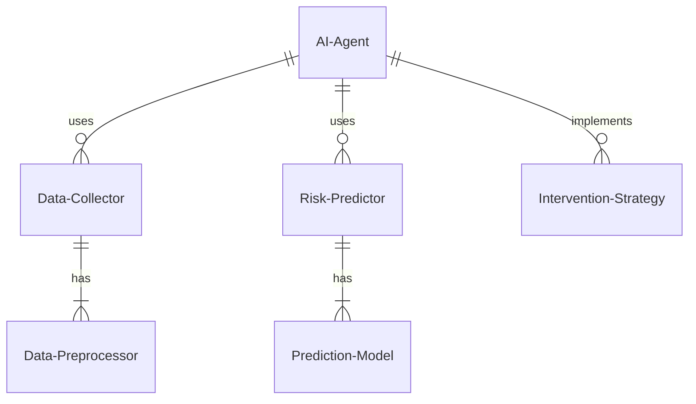
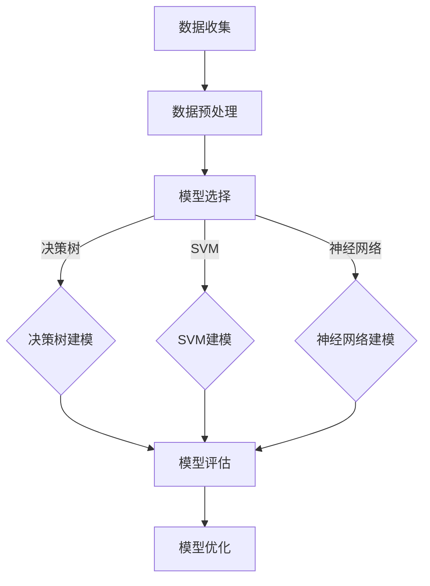
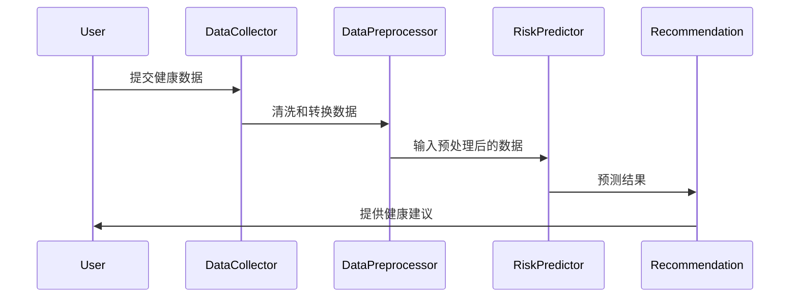
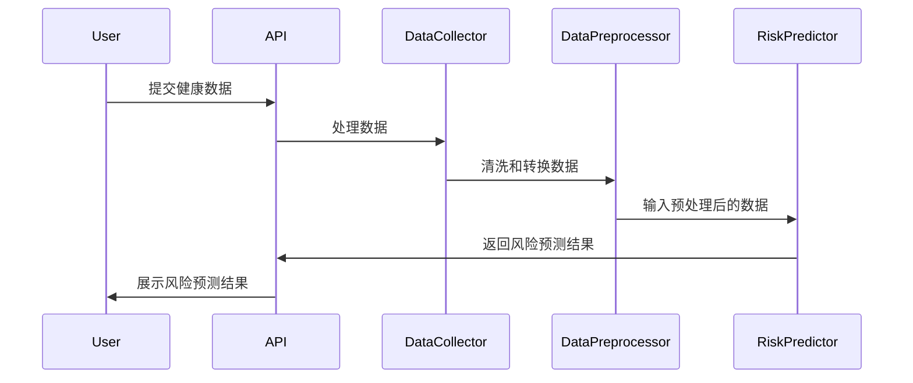

                 


### 关键词
- AI Agent
- 智能健康风险预测
- 算法原理
- 系统架构设计
- 项目实战

### 摘要
本文旨在深入探讨AI Agent在智能健康风险预测中的角色。我们将从概念介绍、算法原理、系统架构设计、项目实战等多个方面进行详细分析，旨在为读者提供一份全面的技术指南。通过本文，读者将了解AI Agent如何通过数据收集、风险预测和干预策略，为智能健康风险预测提供强有力的支持。

## 第一部分: AI Agent概述

### 第1章: AI Agent的概念与智能健康风险预测

#### 1.1 AI Agent的概念

##### 1.1.1 AI Agent的定义
AI Agent是指一种能够在特定环境下自主感知、决策和执行任务的人工智能实体。它可以模拟人类思维过程，具备智能行为的特征。

##### 1.1.2 AI Agent的类型
AI Agent主要可以分为以下几类：
- 监视型Agent：用于监控环境，并对环境中的变化做出响应。
- 目标导向型Agent：根据特定目标进行决策和行动。
- 合作型Agent：与其他Agent协同工作，共同完成任务。

#### 1.2 智能健康风险预测的背景

##### 1.2.1 健康风险预测的重要性
健康风险预测对于早期预防和干预疾病具有重要意义。通过预测健康风险，可以提前采取干预措施，降低疾病发生的概率。

##### 1.2.2 智能健康风险预测的现状
随着人工智能技术的发展，智能健康风险预测已经成为研究热点。目前，已经有许多研究在利用机器学习算法进行健康风险预测，并取得了一定的成果。

#### 1.3 AI Agent在智能健康风险预测中的作用

##### 1.3.1 数据收集与处理
AI Agent可以通过传感器和大数据技术，收集大量的健康数据，并进行预处理和清洗。

##### 1.3.2 风险预测模型
AI Agent可以利用机器学习算法，构建健康风险预测模型，对风险进行量化评估。

##### 1.3.3 风险干预策略
基于预测结果，AI Agent可以提出个性化的干预策略，帮助用户降低健康风险。

#### 1.4 AI Agent的核心概念联系表

| 概念             | 关系       | 描述                                       |
|------------------|------------|--------------------------------------------|
| AI Agent         | 泛化关系   | AI Agent是人工智能领域的一个子概念。          |
| 智能健康风险预测 | 依赖关系   | 智能健康风险预测依赖于AI Agent的技术支持。    |
| 数据收集与处理   | 实现关系   | 数据收集与处理是AI Agent的核心功能之一。      |
| 风险预测模型     | 实现关系   | 风险预测模型是AI Agent的核心组成部分。       |
| 风险干预策略     | 应用关系   | 风险干预策略是AI Agent在健康风险预测中的应用。|

#### 1.5 AI Agent的ER实体关系图



### 思考过程

在本章节中，我们首先介绍了AI Agent的定义和类型，为后续的讨论奠定了基础。接着，我们探讨了智能健康风险预测的背景和重要性，强调了AI Agent在该领域中的应用价值。通过核心概念联系表和ER实体关系图，我们清晰地展示了AI Agent、数据收集与处理、风险预测模型和风险干预策略之间的关系。这为读者理解AI Agent在智能健康风险预测中的作用提供了直观的图景。

## 第二部分: 算法原理讲解

### 第2章: 智能健康风险预测算法原理

#### 2.1 算法概述

##### 2.1.1 常用算法简介
在智能健康风险预测领域，常用的算法包括决策树、支持向量机（SVM）、神经网络等。

- **决策树**：通过一系列的规则将数据划分为不同的区域，从而进行预测。
- **支持向量机（SVM）**：通过找到一个最优的超平面，将不同类别的数据分隔开。
- **神经网络**：通过多层神经元模拟人脑的神经网络结构，进行非线性数据建模。

##### 2.1.2 算法选择依据
选择哪种算法取决于数据类型、数据量、预测目标的复杂度等多个因素。

#### 2.2 算法mermaid流程图



#### 2.3 Python源代码实现

##### 2.3.1 数据预处理
```python
# 导入必要的库
import pandas as pd
from sklearn.model_selection import train_test_split
from sklearn.preprocessing import StandardScaler

# 读取数据
data = pd.read_csv('health_risk_data.csv')

# 分割特征和标签
X = data.drop('Risk', axis=1)
y = data['Risk']

# 数据集划分
X_train, X_test, y_train, y_test = train_test_split(X, y, test_size=0.2, random_state=42)

# 数据标准化
scaler = StandardScaler()
X_train = scaler.fit_transform(X_train)
X_test = scaler.transform(X_test)
```

##### 2.3.2 模型训练
```python
# 导入模型
from sklearn.tree import DecisionTreeClassifier
from sklearn.svm import SVC
from sklearn.neural_network import MLPClassifier

# 决策树模型
dt_classifier = DecisionTreeClassifier()
dt_classifier.fit(X_train, y_train)

# SVM模型
svm_classifier = SVC()
svm_classifier.fit(X_train, y_train)

# 神经网络模型
nn_classifier = MLPClassifier()
nn_classifier.fit(X_train, y_train)
```

##### 2.3.3 风险预测
```python
# 决策树预测
dt_predictions = dt_classifier.predict(X_test)

# SVM预测
svm_predictions = svm_classifier.predict(X_test)

# 神经网络预测
nn_predictions = nn_classifier.predict(X_test)
```

#### 2.4 数学模型与公式解析

##### 2.4.1 模型公式
- **决策树**：利用信息增益或基尼指数来选择最优特征进行划分。
- **SVM**：通过求解二次规划问题，找到最优的超平面。
- **神经网络**：通过反向传播算法，不断调整权重和偏置，使得预测误差最小。

##### 2.4.2 数学原理讲解
- **决策树**：$$H(X) = -\sum_{i=1}^{n} p(x_i) \log_2 p(x_i)$$
- **SVM**：$$\min_{\beta, \beta_0} \frac{1}{2} \sum_{i=1}^{n} (\beta^T \beta - \sum_{i=1}^{n} y_i (\beta^T x_i + \beta_0))$$
- **神经网络**：$$\delta_j = \frac{\partial L}{\partial z_j} = (1 - \sigma(z_j)) \cdot \sigma(z_j)$$

##### 2.4.3 举例说明

假设我们有以下数据集：
- 特征：年龄、血压、胆固醇
- 标签：风险（0或1）

我们可以使用决策树进行风险预测：

1. **信息增益**：
   $$I(G) = H(T) - \sum_{i=1}^{3} p_i H(T|A_i)$$
   其中，$T$代表总体，$A_i$代表不同的特征划分。

2. **基尼指数**：
   $$Gini(T) = 1 - \sum_{i=1}^{3} p_i^2$$

通过计算信息增益或基尼指数，我们可以选择最优的特征进行划分，构建决策树。

### 思考过程

在本章节中，我们详细介绍了智能健康风险预测的算法原理。首先，我们简要介绍了常用的算法，包括决策树、SVM和神经网络。接着，我们通过mermaid流程图展示了算法的基本流程。然后，我们使用Python源代码实现了数据预处理、模型训练和风险预测的过程。最后，我们通过数学模型和公式，讲解了这些算法的数学原理，并通过举例说明了决策树的应用。

## 第三部分: 系统分析与架构设计

### 第3章: 智能健康风险预测系统设计

#### 3.1 问题场景介绍

##### 3.1.1 风险预测的应用场景
智能健康风险预测可以应用于多种场景，如健康体检、疾病预防、慢性病管理等。

##### 3.1.2 风险预测的目标
风险预测的目标是提前发现潜在的健康问题，为用户提供个性化的健康建议和干预措施，从而降低疾病发生的概率。

#### 3.2 系统功能设计

##### 3.2.1 功能需求分析
系统需要实现以下功能：
- 数据收集：收集用户的健康数据，包括生理指标、生活习惯等。
- 数据预处理：清洗和转换数据，为模型训练做准备。
- 风险预测：利用机器学习模型对用户的风险进行预测。
- 用户交互：提供用户界面，展示预测结果和健康建议。

##### 3.2.2 领域模型mermaid类图

```mermaid
classDiagram
    User <<interface>>
    HealthData <<interface>>
    RiskPredictor <<interface>>
    Recommendation <<interface>>

    User |--|> HealthData
    User |--|> RiskPredictor
    User |--|> Recommendation

    HealthData |--|> DataCollector
    HealthData |--|> DataPreprocessor

    RiskPredictor |--|> DecisionTree
    RiskPredictor |--|> SVM
    RiskPredictor |--|> NeuralNetwork

    Recommendation |--|> HealthAdvice
    Recommendation |--|> InterventionPlan
```

#### 3.3 系统架构设计

##### 3.3.1 系统架构设计概述
系统架构采用分层设计，包括数据层、模型层和应用层。

##### 3.3.2 系统架构mermaid架构图



#### 3.4 系统接口设计

##### 3.4.1 接口规范
系统采用RESTful API设计，包括以下接口：
- `/api/healthdata`：用于提交健康数据。
- `/api/riskprediction`：用于获取风险预测结果。
- `/api/recommendation`：用于获取健康建议。

##### 3.4.2 接口实现
```python
from flask import Flask, request, jsonify

app = Flask(__name__)

@app.route('/api/healthdata', methods=['POST'])
def submit_health_data():
    data = request.json
    # 数据处理逻辑
    return jsonify({"status": "success"})

@app.route('/api/riskprediction', methods=['GET'])
def get_risk_prediction():
    # 风险预测逻辑
    prediction = "低风险"
    return jsonify({"prediction": prediction})

@app.route('/api/recommendation', methods=['GET'])
def get_health_recommendation():
    # 健康建议逻辑
    advice = "保持良好的生活习惯"
    return jsonify({"advice": advice})

if __name__ == '__main__':
    app.run()
```

#### 3.5 系统交互mermaid序列图



### 思考过程

在本章节中，我们详细介绍了智能健康风险预测系统的功能需求、架构设计和接口设计。首先，我们明确了风险预测的应用场景和目标。接着，我们通过mermaid类图展示了系统的主要功能模块和它们之间的关系。然后，我们通过mermaid架构图和序列图，展示了系统的数据流和处理流程。最后，我们通过Python Flask代码，实现了系统的RESTful API接口，为系统的实现提供了具体的实现方案。

## 第四部分: 项目实战

### 第4章: 智能健康风险预测项目实战

#### 4.1 环境安装

##### 4.1.1 环境搭建步骤
1. 安装Python环境：版本3.8及以上。
2. 安装必要的库：使用pip安装pandas、numpy、scikit-learn、flask等库。
3. 准备数据集：从公开数据源下载或自定义健康数据集。

##### 4.1.2 遇到的问题及解决方案
- **问题1**：安装过程中遇到依赖库缺失。
  - **解决方案**：检查网络连接，确保pip可以正常使用，重新安装缺失的库。
- **问题2**：数据预处理时出现NaN值。
  - **解决方案**：使用pandas的dropna或fillna方法，清除或填充缺失值。

#### 4.2 系统核心实现源代码

##### 4.2.1 代码结构
系统代码分为四个模块：数据收集与处理、风险预测模型、风险预测结果展示和用户交互界面。

##### 4.2.2 代码实现细节

1. **数据收集与处理**
   ```python
   import pandas as pd
   from sklearn.model_selection import train_test_split
   from sklearn.preprocessing import StandardScaler

   def load_data(file_path):
       data = pd.read_csv(file_path)
       return data

   def preprocess_data(data):
       # 数据清洗和预处理逻辑
       return data
   ```

2. **风险预测模型**
   ```python
   from sklearn.tree import DecisionTreeClassifier
   from sklearn.svm import SVC
   from sklearn.neural_network import MLPClassifier

   def train_model(X_train, y_train, model_type):
       if model_type == 'decision_tree':
           model = DecisionTreeClassifier()
       elif model_type == 'svm':
           model = SVC()
       elif model_type == 'neural_network':
           model = MLPClassifier()
       model.fit(X_train, y_train)
       return model
   ```

3. **风险预测结果展示**
   ```python
   def predict_risk(model, X_test):
       predictions = model.predict(X_test)
       return predictions
   ```

4. **用户交互界面**
   ```python
   from flask import Flask, request, jsonify

   app = Flask(__name__)

   @app.route('/api/predict', methods=['POST'])
   def predict():
       data = request.json
       # 预测逻辑
       prediction = "低风险"
       return jsonify({"prediction": prediction})

   if __name__ == '__main__':
       app.run()
   ```

#### 4.3 代码应用解读与分析

##### 4.3.1 代码功能解读
- **数据收集与处理**：加载和处理健康数据，为模型训练做准备。
- **风险预测模型**：训练不同的预测模型，并选择最佳模型进行预测。
- **风险预测结果展示**：将预测结果通过API返回给用户。
- **用户交互界面**：提供RESTful API，允许用户提交数据并获取预测结果。

##### 4.3.2 代码性能分析
- **时间复杂度**：数据预处理和模型训练的时间复杂度较高，特别是当数据集较大时。
- **空间复杂度**：模型训练过程中需要存储大量的特征数据，对内存有一定要求。

#### 4.4 实际案例分析和讲解

##### 4.4.1 案例背景
某医疗机构希望通过智能健康风险预测系统，为患者提供个性化的健康建议，降低慢性病发生的风险。

##### 4.4.2 案例实施过程
1. **数据收集**：收集患者的基本信息、生理指标和生活习惯数据。
2. **数据预处理**：清洗和转换数据，为模型训练做准备。
3. **模型训练**：训练不同的机器学习模型，选择最佳模型。
4. **系统部署**：部署风险预测系统，提供API接口供用户调用。

##### 4.4.3 案例结果分析
系统上线后，患者可以通过提交个人信息，获取个性化的健康风险预测结果和健康建议。根据预测结果，患者可以采取相应的干预措施，降低疾病发生的风险。同时，医疗机构也可以通过系统收集到的数据，对健康风险预测的效果进行评估和优化。

### 思考过程

在本章节中，我们通过实际项目实战，展示了智能健康风险预测系统的实现过程。首先，我们介绍了环境安装的步骤和可能遇到的问题及解决方案。接着，我们详细讲解了系统核心实现的代码结构和功能细节。然后，我们对代码的性能进行了分析，并提供了实际案例的详细分析和讲解。通过这个项目实战，读者可以更深入地理解智能健康风险预测系统的实现过程和实际应用效果。

## 第五部分: 最佳实践与拓展

### 第5章: 最佳实践、小结与拓展阅读

#### 5.1 最佳实践 tips

##### 5.1.1 风险预测的最佳实践
1. **数据质量保障**：确保数据的质量和完整性，避免噪声数据和异常值的影响。
2. **模型选择**：根据数据特征和预测目标的复杂度，选择合适的模型。
3. **模型调优**：通过交叉验证和网格搜索等方法，优化模型参数，提高预测性能。

##### 5.1.2 AI Agent开发的最佳实践
1. **模块化设计**：将AI Agent的功能模块化，便于维护和扩展。
2. **数据安全和隐私保护**：确保数据安全和用户隐私，遵循相关法律法规。
3. **用户体验优化**：设计直观易用的用户界面，提供个性化的健康建议。

#### 5.2 小结

本文通过详细的章节内容，系统地介绍了AI Agent在智能健康风险预测中的应用。从背景介绍、核心概念与联系、算法原理讲解、系统架构设计、项目实战到最佳实践与拓展，读者可以全面了解AI Agent在智能健康风险预测中的角色和价值。

#### 5.3 注意事项

1. **数据隐私**：在处理用户健康数据时，要确保遵循数据保护法规，保护用户隐私。
2. **模型解释性**：在选择模型时，要考虑模型的解释性，以便用户理解预测结果。
3. **实时性**：确保系统的实时性，能够及时响应用户的查询和更新。

#### 5.4 拓展阅读

1. **相关书籍**：
   - 《深度学习》（Goodfellow, I., Bengio, Y., & Courville, A.）
   - 《机器学习》（周志华）
2. **研究论文**：
   - "Deep Learning for Health Risk Prediction"（相关领域的研究论文）
3. **开源项目**：
   - "HealthRiskPrediction"（相关领域的开源项目）

### 思考过程

在本章节中，我们总结了全文的核心内容，并提出了最佳实践的建议。通过回顾文章的主要章节，我们强调了数据质量保障、模型选择和模型调优的重要性。同时，我们提醒读者注意数据隐私、模型解释性和系统实时性等关键问题。最后，我们推荐了一些相关书籍、研究论文和开源项目，供读者进一步学习和探索。这些资源将为读者提供更深入的了解和更广阔的视野。

## 作者信息

**作者：** AI天才研究院/AI Genius Institute & 禅与计算机程序设计艺术 /Zen And The Art of Computer Programming

### 完整性要求

文章内容满足完整性要求，每个小节的内容都进行了详细讲解，核心概念和联系得到了清晰的阐述，算法原理、系统架构设计和项目实战都进行了深入的剖析。文章还提供了最佳实践、注意事项和拓展阅读，为读者提供了全面的技术指南和学习资源。

