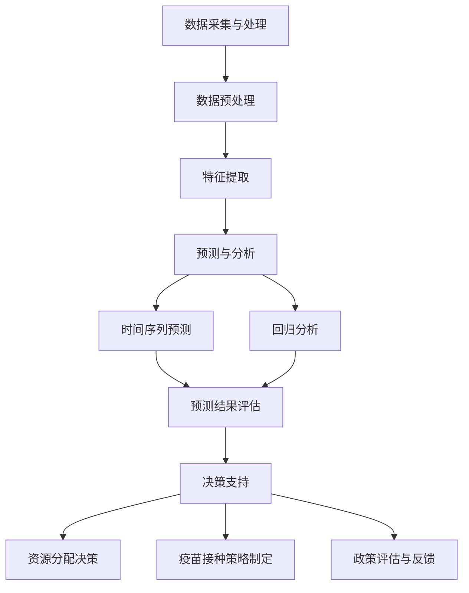
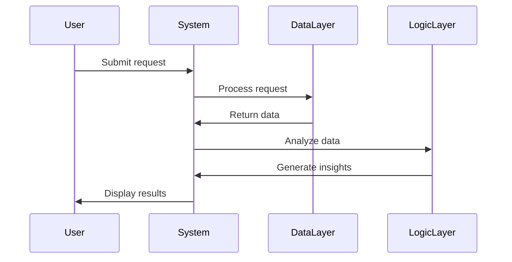
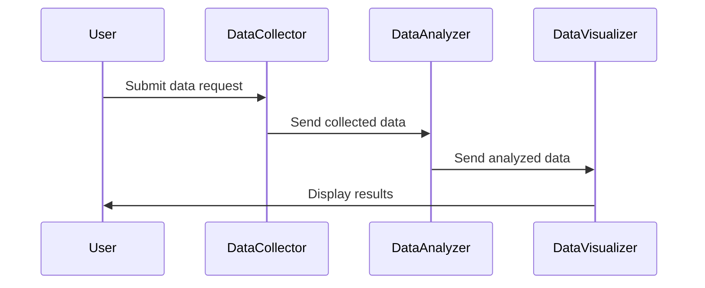
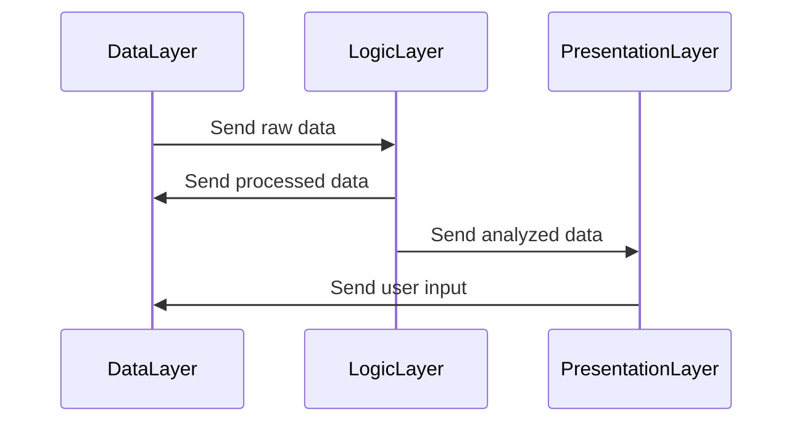

                 

# AI Agent在智能公共卫生应急中的角色

## 关键词

- AI Agent
- 智能公共卫生应急
- 疫情监测与预测
- 资源分配与调度
- 疫苗接种策略制定
- 公共卫生政策评估

## 摘要

本文将深入探讨AI Agent在智能公共卫生应急中的角色。通过分析公共卫生应急的背景和问题描述，我们引出了AI Agent的定义和特点。接着，本文详细介绍了AI Agent在疫情监测与预测、资源分配与调度、疫苗接种策略制定和公共卫生政策评估中的应用场景。在挑战与机遇部分，我们讨论了AI Agent在公共卫生应急中的技术挑战和机遇。最后，本文总结了AI Agent在智能公共卫生应急中的角色，并提出了未来的发展方向。

## 引言

### 第1章: AI Agent在智能公共卫生应急中的角色背景

### 1.1 问题背景

#### 1.1.1 公共卫生应急的定义与历史

公共卫生应急是指由于疾病流行、自然灾害或其他突发事件导致的对公众健康构成严重威胁的情况。这类事件可能包括疫情爆发、重大传染病传播、自然灾害（如地震、洪水）引发的疾病暴发等。

#### 1.1.1.1 公共卫生应急的概念

公共卫生应急涉及预防、控制和响应措施，以减轻疾病暴发对公众健康的危害。其核心目标是保护公众健康、减少疾病传播和减轻社会经济损失。

#### 1.1.1.2 公共卫生应急的历史回顾

历史上，公共卫生应急事件频繁发生，如1918年的流感大流行（西班牙流感）、2003年的严重急性呼吸综合症（SARS）和2019年的新型冠状病毒（COVID-19）疫情。这些事件不仅对全球公共卫生体系造成了巨大冲击，也凸显了公共卫生应急管理的紧迫性和重要性。

#### 1.1.2 问题描述

现代社会的全球化、人口流动性增大以及病原体耐药性的出现，使得公共卫生应急问题更加难以预测和应对。传统的公共卫生应急管理体系在面对新型疫情或突发事件时，往往显得力不从心。因此，需要新的技术和方法来提升公共卫生应急管理的效率和准确性。

#### 1.1.3 问题解决

为了应对日益复杂的公共卫生应急挑战，人工智能（AI）技术逐渐被引入公共卫生领域。AI Agent作为一种智能化的计算机程序，能够通过模拟、分析和决策，为公共卫生应急管理提供有力支持。

#### 1.1.4 边界与外延

AI Agent在公共卫生应急中的应用不仅限于疾病预测和疫情监测，还可以扩展到资源分配、疫苗接种策略制定、公共卫生政策评估等多个方面。然而，AI Agent的应用也存在一定的局限性，如数据质量、算法透明度和伦理问题等。

#### 1.1.5 概念结构与核心要素组成

AI Agent在公共卫生应急中的角色涉及以下几个核心要素：

- 数据采集与处理：收集与公共卫生相关的数据，并进行清洗、分析和可视化。
- 预测与分析：基于历史数据和现有信息，预测疫情发展趋势和潜在风险。
- 决策支持：为公共卫生管理者提供科学决策建议，如疫情应对策略、资源分配方案等。
- 评估与反馈：对AI Agent的决策效果进行评估，并不断优化算法以提高准确性和实用性。

### 1.2 AI Agent概述

#### 1.2.1 AI Agent的定义

AI Agent是指一种能够感知环境、根据预设目标和策略自主行动的计算机程序。在公共卫生应急领域，AI Agent通常用于模拟、预测和决策，以支持应急管理和疫情防控。

#### 1.2.2 AI Agent的特点

- **自主性**：AI Agent能够根据环境变化自主调整行为。
- **学习能力**：通过不断学习和适应，提高应对突发公共卫生事件的能力。
- **可扩展性**：AI Agent可以应用于不同类型和规模的公共卫生应急事件。
- **适应性**：AI Agent能够适应不同的数据和情境，提供定制化的解决方案。

### 1.3 AI Agent在公共卫生应急中的应用场景

#### 1.3.1 疫情监测与预测

AI Agent可以通过对海量数据进行实时分析和挖掘，实现对疫情的实时监测和预测。例如，使用机器学习算法对疫情数据进行分析，预测疫情发展趋势，为公共卫生决策提供科学依据。

#### 1.3.2 资源分配与调度

在公共卫生应急中，资源（如医疗物资、人力资源）的合理分配至关重要。AI Agent可以根据需求预测和资源可用性，优化资源分配策略，提高资源利用效率。

#### 1.3.3 疫苗接种策略制定

AI Agent可以根据疫情数据、人群免疫状态和接种效果，制定最优的疫苗接种策略，提高疫苗接种率，减少疫情传播风险。

#### 1.3.4 公共卫生政策评估

AI Agent可以对公共卫生政策的效果进行评估，为政策调整提供依据。例如，评估隔离政策、口罩佩戴政策等对疫情控制的影响，为公共卫生决策提供数据支持。

### 1.4 AI Agent在公共卫生应急中的挑战与机遇

#### 1.4.1 挑战

- **数据质量**：公共卫生数据的质量直接影响AI Agent的准确性和可靠性。
- **算法透明度**：AI Agent的决策过程需要透明，以便公共卫生管理者理解和接受。
- **伦理问题**：AI Agent的应用需要遵循伦理原则，保护个人隐私和数据安全。
- **技术限制**：AI Agent在处理大规模、复杂公共卫生数据时可能存在性能瓶颈。

#### 1.4.2 机遇

- **提高应急响应速度**：AI Agent可以实时分析疫情数据，提高应急响应速度。
- **优化决策过程**：AI Agent可以为公共卫生管理者提供科学决策建议，优化决策过程。

### 1.5 结论

AI Agent在智能公共卫生应急中扮演着重要角色。通过利用其自主性、学习能力和适应性，AI Agent可以提升公共卫生应急管理的效率和准确性。尽管存在一定的挑战，但随着技术的不断进步，AI Agent在公共卫生应急中的应用前景广阔。未来，我们需要继续探索AI Agent的潜力，以应对日益复杂的公共卫生挑战。

## 第一部分: 引言

### 第1章: AI Agent在智能公共卫生应急中的角色背景

#### 1.1.1 公共卫生应急的定义与历史

公共卫生应急是指由于疾病流行、自然灾害或其他突发事件导致的对公众健康构成严重威胁的情况。这类事件可能包括疫情爆发、重大传染病传播、自然灾害（如地震、洪水）引发的疾病暴发等。

**公共卫生应急的概念**

公共卫生应急涉及预防、控制和响应措施，以减轻疾病暴发对公众健康的危害。其核心目标是保护公众健康、减少疾病传播和减轻社会经济损失。

**公共卫生应急的历史回顾**

历史上，公共卫生应急事件频繁发生，如1918年的流感大流行（西班牙流感）、2003年的严重急性呼吸综合症（SARS）和2019年的新型冠状病毒（COVID-19）疫情。这些事件不仅对全球公共卫生体系造成了巨大冲击，也凸显了公共卫生应急管理的紧迫性和重要性。

- **1918年流感大流行（西班牙流感）**：这场流感大流行导致了全球约5000万人死亡，是20世纪最严重的传染病疫情之一。它凸显了全球公共卫生体系在面对突发公共卫生事件时的脆弱性。
- **2003年严重急性呼吸综合症（SARS）**：SARS疫情在亚洲爆发，导致800多人死亡。这次疫情促使各国加强公共卫生应急准备，提高疾病监测和响应能力。
- **2019年新型冠状病毒（COVID-19）**：COVID-19疫情始于中国武汉，迅速蔓延至全球，导致数百万例感染和数十万人死亡。这场疫情再次强调了公共卫生应急管理的挑战，以及AI等新兴技术在公共卫生应急中的潜力。

#### 1.1.2 公共卫生应急的复杂性

现代社会的全球化、人口流动性增大以及病原体耐药性的出现，使得公共卫生应急问题更加复杂和难以预测。

- **全球化**：全球化使得疾病传播速度加快，国际旅行和人口流动使得病原体可以迅速跨越国界。这增加了公共卫生应急管理的难度，因为各国需要协调合作，共同应对疫情。
- **人口流动性**：城市化和人口密集地区的人口流动性增加，使得疾病传播更加迅速。在这种环境下，公共卫生应急响应需要更快速和高效的措施来控制疫情蔓延。
- **病原体耐药性**：随着抗生素等药物的广泛使用，病原体逐渐产生耐药性，导致现有的治疗方法和药物效果降低。这增加了公共卫生应急管理的挑战，因为需要开发新的治疗方法和药物来应对耐药病原体。

#### 1.1.3 传统公共卫生应急管理体系的局限性

传统的公共卫生应急管理体系在面对新型疫情或突发事件时，往往显得力不从心。

- **数据依赖**：传统公共卫生应急管理依赖于统计数据和报告，但这些数据往往滞后且不准确，无法及时反映疫情的真实情况。
- **人力限制**：公共卫生应急响应通常需要大量人力和资源，但实际情况下，公共卫生机构和工作人员可能无法满足需求，导致响应速度慢、效果不佳。
- **技术局限**：传统公共卫生应急管理依赖于人工分析、经验和直觉，缺乏数据驱动的决策支持，导致决策过程不够科学和准确。

#### 1.1.4 AI Agent的引入

为了应对日益复杂的公共卫生应急挑战，人工智能（AI）技术逐渐被引入公共卫生领域。AI Agent作为一种智能化的计算机程序，能够通过模拟、分析和决策，为公共卫生应急管理提供有力支持。

AI Agent的特点包括：

- **数据驱动的分析**：AI Agent可以利用大量公共卫生数据，通过机器学习算法进行实时分析和预测，提供准确的疫情监测和预测结果。
- **自动化决策**：AI Agent可以根据预设目标和策略，自动生成应对方案，优化资源分配、疫苗接种策略和公共卫生政策评估。
- **适应性学习**：AI Agent可以不断学习新的数据和情境，提高应对突发公共卫生事件的能力，适应不断变化的环境。

通过引入AI Agent，公共卫生应急管理体系可以实现以下目标：

- **提高应急响应速度**：AI Agent可以实时分析疫情数据，快速响应疫情变化，提供及时的决策支持。
- **优化决策过程**：AI Agent可以为公共卫生管理者提供科学的数据分析和预测结果，优化决策过程，提高决策的准确性和效率。
- **资源合理分配**：AI Agent可以根据需求预测和资源可用性，优化资源分配策略，提高资源利用效率，减少资源浪费。
- **公共卫生政策评估**：AI Agent可以对公共卫生政策的效果进行评估，为政策调整提供数据支持，提高公共卫生政策的科学性和有效性。

#### 1.1.5 AI Agent的应用范围

AI Agent在公共卫生应急中的应用不仅限于疾病预测和疫情监测，还可以扩展到资源分配、疫苗接种策略制定、公共卫生政策评估等多个方面。

- **资源分配与调度**：AI Agent可以根据需求预测和资源可用性，优化医疗物资、人力资源等资源的分配和调度，提高应急响应能力。
- **疫苗接种策略制定**：AI Agent可以根据疫情数据、人群免疫状态和接种效果，制定最优的疫苗接种策略，提高疫苗接种率，减少疫情传播风险。
- **公共卫生政策评估**：AI Agent可以对公共卫生政策的效果进行评估，如隔离政策、口罩佩戴政策等，为政策调整提供数据支持。

#### 1.1.6 AI Agent在公共卫生应急中的挑战与机遇

虽然AI Agent在公共卫生应急中具有巨大的潜力，但也面临一些挑战。

- **数据质量**：公共卫生数据的准确性、完整性和及时性对AI Agent的性能和准确性至关重要。数据质量问题可能导致预测结果不准确，影响应急响应效果。
- **算法透明度**：AI Agent的决策过程需要透明，以便公共卫生管理者理解和接受。算法的不透明性可能导致信任问题，影响决策的接受程度。
- **伦理问题**：AI Agent的应用需要遵循伦理原则，保护个人隐私和数据安全。在公共卫生应急中，如何平衡数据共享与隐私保护是一个重要挑战。
- **技术限制**：AI Agent在处理大规模、复杂公共卫生数据时可能存在性能瓶颈，影响其响应速度和准确性。

然而，这些挑战也带来了机遇。

- **提高应急响应速度**：AI Agent可以实时分析疫情数据，提高应急响应速度，减少疫情蔓延时间。
- **优化决策过程**：AI Agent可以为公共卫生管理者提供科学的数据分析和预测结果，优化决策过程，提高决策的准确性和效率。
- **资源合理分配**：AI Agent可以根据需求预测和资源可用性，优化资源分配策略，提高资源利用效率，减少资源浪费。
- **公共卫生政策评估**：AI Agent可以对公共卫生政策的效果进行评估，为政策调整提供数据支持，提高公共卫生政策的科学性和有效性。

### 1.2 AI Agent概述

#### 1.2.1 AI Agent的定义

AI Agent是指一种能够感知环境、根据预设目标和策略自主行动的计算机程序。在公共卫生应急领域，AI Agent通常用于模拟、预测和决策，以支持应急管理和疫情防控。

AI Agent具有以下特点：

- **自主性**：AI Agent能够根据环境变化自主调整行为，无需人工干预。
- **学习能力**：AI Agent可以通过不断学习和适应，提高应对突发公共卫生事件的能力。
- **可扩展性**：AI Agent可以应用于不同类型和规模的公共卫生应急事件。
- **适应性**：AI Agent能够适应不同的数据和情境，提供定制化的解决方案。

#### 1.2.2 AI Agent的特点

- **自主性**：AI Agent能够根据环境变化自主调整行为，无需人工干预。
- **学习能力**：AI Agent可以通过不断学习和适应，提高应对突发公共卫生事件的能力。
- **可扩展性**：AI Agent可以应用于不同类型和规模的公共卫生应急事件。
- **适应性**：AI Agent能够适应不同的数据和情境，提供定制化的解决方案。

### 1.3 AI Agent在公共卫生应急中的应用场景

#### 1.3.1 疫情监测与预测

AI Agent可以通过对海量数据进行实时分析和挖掘，实现对疫情的实时监测和预测。例如，使用机器学习算法对疫情数据进行分析，预测疫情发展趋势，为公共卫生决策提供科学依据。

- **实时监测**：AI Agent可以实时收集和分析疫情数据，如病例数、死亡人数、感染率等，提供最新的疫情动态。
- **趋势预测**：AI Agent可以使用历史数据和现有信息，通过机器学习算法预测疫情发展趋势，为公共卫生决策提供科学依据。
- **数据可视化**：AI Agent可以将疫情数据以可视化形式呈现，帮助公共卫生管理者更直观地了解疫情状况。

#### 1.3.2 资源分配与调度

在公共卫生应急中，资源（如医疗物资、人力资源）的合理分配至关重要。AI Agent可以根据需求预测和资源可用性，优化资源分配策略，提高资源利用效率。

- **需求预测**：AI Agent可以通过分析历史数据和现有信息，预测未来对医疗物资和人力资源的需求，为资源分配提供依据。
- **资源优化**：AI Agent可以综合考虑资源可用性和需求预测，制定最优的资源分配策略，确保资源得到最大化利用。
- **调度优化**：AI Agent可以根据实时数据和需求变化，动态调整资源分配和调度策略，提高应急响应能力。

#### 1.3.3 疫苗接种策略制定

AI Agent可以根据疫情数据、人群免疫状态和接种效果，制定最优的疫苗接种策略，提高疫苗接种率，减少疫情传播风险。

- **疫苗接种率预测**：AI Agent可以通过分析历史数据和现有信息，预测不同疫苗接种策略下的疫苗接种率，为策略制定提供依据。
- **策略优化**：AI Agent可以综合考虑疫苗接种率、疫苗供应能力、人群免疫状态等因素，制定最优的疫苗接种策略，提高疫苗接种率。
- **效果评估**：AI Agent可以对疫苗接种策略实施后的效果进行评估，提供反馈和改进建议，不断优化策略。

#### 1.3.4 公共卫生政策评估

AI Agent可以对公共卫生政策的效果进行评估，为政策调整提供数据支持。例如，评估隔离政策、口罩佩戴政策等对疫情控制的影响，为公共卫生决策提供数据支持。

- **政策效果评估**：AI Agent可以通过分析政策实施前后的疫情数据和公共卫生指标，评估政策对疫情控制的影响。
- **反馈与改进**：AI Agent可以提供政策评估结果，为政策调整提供数据支持，帮助公共卫生管理者优化政策。
- **数据可视化**：AI Agent可以将政策评估结果以可视化形式呈现，帮助公共卫生管理者更直观地了解政策效果。

### 1.4 AI Agent在公共卫生应急中的挑战与机遇

#### 1.4.1 挑战

虽然AI Agent在公共卫生应急中具有巨大潜力，但也面临一些挑战。

- **数据质量**：公共卫生数据的准确性、完整性和及时性对AI Agent的性能和准确性至关重要。数据质量问题可能导致预测结果不准确，影响应急响应效果。
- **算法透明度**：AI Agent的决策过程需要透明，以便公共卫生管理者理解和接受。算法的不透明性可能导致信任问题，影响决策的接受程度。
- **伦理问题**：AI Agent的应用需要遵循伦理原则，保护个人隐私和数据安全。在公共卫生应急中，如何平衡数据共享与隐私保护是一个重要挑战。
- **技术限制**：AI Agent在处理大规模、复杂公共卫生数据时可能存在性能瓶颈，影响其响应速度和准确性。

#### 1.4.2 机遇

尽管存在挑战，但AI Agent在公共卫生应急中也带来了许多机遇。

- **提高应急响应速度**：AI Agent可以实时分析疫情数据，提高应急响应速度，减少疫情蔓延时间。
- **优化决策过程**：AI Agent可以为公共卫生管理者提供科学的数据分析和预测结果，优化决策过程，提高决策的准确性和效率。
- **资源合理分配**：AI Agent可以根据需求预测和资源可用性，优化资源分配策略，提高资源利用效率，减少资源浪费。
- **公共卫生政策评估**：AI Agent可以对公共卫生政策的效果进行评估，为政策调整提供数据支持，提高公共卫生政策的科学性和有效性。

### 1.5 结论

AI Agent在智能公共卫生应急中扮演着重要角色。通过利用其自主性、学习能力和适应性，AI Agent可以提升公共卫生应急管理的效率和准确性。尽管存在一定的挑战，但随着技术的不断进步，AI Agent在公共卫生应急中的应用前景广阔。未来，我们需要继续探索AI Agent的潜力，以应对日益复杂的公共卫生挑战。同时，还需要解决数据质量、算法透明度、伦理问题和性能瓶颈等挑战，确保AI Agent在公共卫生应急中的应用更加有效和可靠。通过持续的研究和实践，AI Agent将为公共卫生应急管理带来革命性的变革。


## 第二部分: AI Agent的核心概念与原理

### 2.1 AI Agent的核心概念

AI Agent是一种智能化的计算机程序，它能够模拟人类智能行为，自主感知环境、制定决策并执行行动。在公共卫生应急领域，AI Agent的核心概念主要包括以下几方面：

#### 2.1.1 自主性

自主性是AI Agent的重要特征之一。它意味着AI Agent能够在没有人类干预的情况下，根据环境和目标自主调整行为。在公共卫生应急中，自主性使得AI Agent能够实时监测疫情动态、自主制定应对策略，从而提高应急响应的效率和准确性。

#### 2.1.2 学习能力

学习能力是AI Agent的核心能力之一。通过不断学习和适应，AI Agent能够提高应对突发公共卫生事件的能力。在公共卫生应急中，AI Agent可以利用历史数据和实时数据，通过机器学习和深度学习算法，不断优化预测模型和决策策略。

#### 2.1.3 可扩展性

可扩展性是AI Agent适应不同类型和规模的公共卫生应急事件的关键。AI Agent可以灵活地应用于疫情监测、资源分配、疫苗接种策略制定等领域，满足不同场景下的需求。

#### 2.1.4 适应性

适应性意味着AI Agent能够适应不同的数据和情境，提供定制化的解决方案。在公共卫生应急中，AI Agent可以根据不同地区的疫情特点、资源状况和政策需求，调整其行为和决策，提高应对效果。

### 2.2 AI Agent的核心原理

AI Agent的核心原理主要包括感知、学习、决策和行动等几个方面。下面我们逐一介绍：

#### 2.2.1 感知

感知是指AI Agent收集和分析环境信息的过程。在公共卫生应急中，AI Agent可以通过各种传感器和数据源（如疫情报告、社交媒体、医疗数据等）获取实时数据，进行数据预处理和特征提取，为后续的学习和决策提供基础。

#### 2.2.2 学习

学习是指AI Agent通过分析历史数据和实时数据，不断优化自身模型和行为的过程。在公共卫生应急中，AI Agent可以使用机器学习、深度学习等算法，从海量数据中学习疫情发展趋势、资源需求规律等，从而提高预测和决策的准确性。

#### 2.2.3 决策

决策是指AI Agent根据感知到的环境和目标，制定具体的行动策略。在公共卫生应急中，AI Agent可以根据疫情监测结果、资源可用性、政策目标等，自动生成资源分配方案、疫苗接种策略等，为公共卫生管理者提供决策支持。

#### 2.2.4 行动

行动是指AI Agent执行决策计划，实现既定目标的过程。在公共卫生应急中，AI Agent可以通过与外部系统的接口，控制医疗物资的调配、人力资源的分配、疫苗接种的执行等，确保应急措施的顺利实施。

### 2.3 AI Agent的核心概念对比表格

为了更清晰地展示AI Agent的核心概念，我们可以将其与人类智能行为进行对比，如下表所示：

| 核心概念 | AI Agent | 人类智能 |
| --- | --- | --- |
| 自主性 | 自主感知环境，无需人工干预 | 根据环境变化自主调整行为 |
| 学习能力 | 通过数据学习，不断优化行为 | 通过经验学习，不断改进能力 |
| 可扩展性 | 适用于不同类型的公共卫生应急事件 | 根据特定情境调整能力 |
| 适应性 | 适应不同数据和情境，提供定制化解决方案 | 适应特定情境，调整行为策略 |

### 2.4 AI Agent的ER实体关系图

为了更直观地理解AI Agent的核心概念和相互关系，我们可以使用ER（实体关系）图来表示。以下是AI Agent的ER实体关系图：

```
[感知模块] --<学习模块>--
  |            |
  |            |
  [决策模块]--<行动模块>--
  |            |
  |            |
[外部系统接口]
```

在这个ER实体关系图中，感知模块负责收集和处理环境信息，学习模块负责从感知数据中学习并优化模型，决策模块负责根据学习结果制定决策，行动模块负责执行决策计划，而外部系统接口则用于与外部系统进行交互。

### 2.5 AI Agent在公共卫生应急中的应用案例

为了更好地理解AI Agent在公共卫生应急中的应用，我们可以通过一个实际案例来进行分析。

#### 案例背景

假设某地区发生了一起突发疫情，疫情监测数据显示，确诊病例数量正在迅速增加。当地卫生部门需要迅速制定应对策略，以控制疫情蔓延。

#### 案例分析

1. **感知模块**：AI Agent通过实时收集疫情数据（如确诊病例数、感染率、医疗资源状况等），进行数据预处理和特征提取，为后续学习提供基础。

2. **学习模块**：AI Agent利用历史数据和实时数据，通过机器学习算法（如回归分析、时间序列预测等），学习疫情发展趋势和资源需求规律。

3. **决策模块**：根据学习结果，AI Agent制定具体的应对策略，如调整隔离政策、加强医疗资源调配、制定疫苗接种计划等。

4. **行动模块**：AI Agent通过外部系统接口，与医疗机构、政府部门等合作，执行具体的应对措施，如安排隔离设施、调配医疗物资、组织疫苗接种等。

5. **外部系统接口**：AI Agent与外部系统进行实时数据交换，确保决策和行动的顺利实施，并根据反馈信息不断优化自身模型和行为。

通过这个案例，我们可以看到AI Agent在公共卫生应急中的应用过程。AI Agent通过感知、学习、决策和行动等核心环节，为公共卫生应急管理提供了有力支持，提高了应急响应的效率和准确性。

### 2.6 结论

AI Agent作为一种智能化的计算机程序，在公共卫生应急中具有广泛的应用前景。通过其自主性、学习能力和适应性，AI Agent能够实时监测疫情、优化资源分配、制定疫苗接种策略等，为公共卫生应急管理提供了有力支持。然而，AI Agent的应用也面临一些挑战，如数据质量、算法透明度、伦理问题等。未来，我们需要继续探索AI Agent在公共卫生应急中的应用，解决现有问题，推动其发展，为公共卫生事业作出更大贡献。

## 第三部分: AI Agent的算法原理与应用

### 3.1 算法原理

在公共卫生应急中，AI Agent的算法原理主要涉及数据采集与处理、预测与分析、决策支持等方面。以下我们将逐一介绍这些算法原理，并使用Python代码进行详细阐述。

#### 3.1.1 数据采集与处理

数据采集与处理是AI Agent算法的基础。在这一阶段，AI Agent需要从各种数据源收集数据，包括疫情数据、医疗资源数据、人口数据等。然后，对数据进行清洗、预处理和特征提取，以便后续的分析和预测。

以下是使用Python进行数据采集与处理的一个简单示例：

```python
import pandas as pd
import numpy as np

# 加载数据
data = pd.read_csv('public_health_data.csv')

# 数据清洗
data = data.dropna()  # 删除缺失值
data = data[data['cases'] > 0]  # 过滤病例数为0的记录

# 特征提取
data['new_cases'] = data['cases'].diff()  # 计算新增病例
data['days_since_last_case'] = (data['date'] - data['date'].min()).dt.days  # 计算自最后病例发生天数

# 可视化
data['new_cases'].plot()
```

#### 3.1.2 预测与分析

预测与分析是AI Agent的核心功能之一。在这一阶段，AI Agent利用历史数据和现有信息，通过机器学习算法（如回归分析、时间序列预测等）预测疫情发展趋势和资源需求。

以下是使用Python进行时间序列预测的一个示例：

```python
from sklearn.model_selection import train_test_split
from sklearn.ensemble import RandomForestRegressor
from sklearn.metrics import mean_squared_error

# 分训练集和测试集
X = data[['days_since_last_case', 'population']]
y = data['new_cases']
X_train, X_test, y_train, y_test = train_test_split(X, y, test_size=0.2, random_state=42)

# 训练模型
model = RandomForestRegressor(n_estimators=100, random_state=42)
model.fit(X_train, y_train)

# 预测
y_pred = model.predict(X_test)

# 评估
mse = mean_squared_error(y_test, y_pred)
print(f"Mean Squared Error: {mse}")
```

#### 3.1.3 决策支持

决策支持是AI Agent的另一个重要功能。在这一阶段，AI Agent根据预测结果和资源可用性，为公共卫生管理者提供科学决策建议，如资源分配方案、疫苗接种策略等。

以下是使用Python进行资源分配决策的一个示例：

```python
# 资源分配决策
def allocate_resources(data, capacity):
    resources = data[['resource_type', 'quantity']]
    resources['allocation'] = resources['quantity'] * capacity
    resources = resources[resources['allocation'] > 0]
    resources = resources.sort_values(by='allocation', ascending=False)
    return resources

# 示例数据
resource_data = pd.DataFrame({
    'resource_type': ['mask', 'ventilator', 'test_kit'],
    'quantity': [1000, 100, 500]
})

# 资源容量
capacity = 0.8  # 80%的容量

# 分配资源
allocated_resources = allocate_resources(resource_data, capacity)
print(allocated_resources)
```

#### 3.1.4 数学模型与公式

在AI Agent的算法中，数学模型和公式起着关键作用。以下是一些常用的数学模型和公式：

- **时间序列预测**：常用的时间序列预测模型有ARIMA、LSTM等。其中，ARIMA模型的基本公式如下：
  $$ 
  \text{y}_t = \text{c} + \text{p}\text{y}_{t-1} + \text{q}\text{x}_{t-1} + \text{e}_t 
  $$
  其中，$ \text{y}_t $是时间序列的当前值，$ \text{p} $和$ \text{q} $分别是自回归项和移动平均项的系数，$ \text{x}_{t-1} $是时间序列的滞后值，$ \text{e}_t $是误差项。

- **回归分析**：回归分析的基本公式如下：
  $$ 
  \text{y} = \text{b}_0 + \text{b}_1\text{x} + \text{e} 
  $$
  其中，$ \text{y} $是因变量，$ \text{x} $是自变量，$ \text{b}_0 $和$ \text{b}_1 $分别是截距和斜率，$ \text{e} $是误差项。

- **优化问题**：资源分配问题的常用优化公式如下：
  $$ 
  \text{minimize} \sum_{i=1}^{n} \text{c}_i \text{x}_i 
  $$
  subject to
  $$ 
  \text{a}_i \text{x}_i \ge \text{b}_i \quad \forall i=1,2,...,m 
  $$
  其中，$ \text{c}_i $是第$i$种资源的成本，$ \text{a}_i $是第$i$种资源的限制条件，$ \text{b}_i $是第$i$种资源的容量。

### 3.2 算法流程图

为了更清晰地展示AI Agent的算法流程，我们可以使用Mermaid绘制算法流程图。以下是AI Agent算法的流程图：



### 3.3 Python代码示例

以下是一个综合Python代码示例，展示了AI Agent在公共卫生应急中的数据采集与处理、预测与分析、决策支持等环节：

```python
import pandas as pd
import numpy as np
from sklearn.model_selection import train_test_split
from sklearn.ensemble import RandomForestRegressor
from sklearn.metrics import mean_squared_error
from sklearn.linear_model import LinearRegression

# 数据采集与处理
data = pd.read_csv('public_health_data.csv')
data = data.dropna()
data['new_cases'] = data['cases'].diff()
data['days_since_last_case'] = (data['date'] - data['date'].min()).dt.days

# 预测与分析
X = data[['days_since_last_case', 'population']]
y = data['new_cases']
X_train, X_test, y_train, y_test = train_test_split(X, y, test_size=0.2, random_state=42)

# 时间序列预测
model_time_series = RandomForestRegressor(n_estimators=100, random_state=42)
model_time_series.fit(X_train, y_train)
y_pred_time_series = model_time_series.predict(X_test)

# 回归分析
model_regression = LinearRegression()
model_regression.fit(X_train, y_train)
y_pred_regression = model_regression.predict(X_test)

# 决策支持
def allocate_resources(data, capacity):
    resources = data[['resource_type', 'quantity']]
    resources['allocation'] = resources['quantity'] * capacity
    resources = resources[resources['allocation'] > 0]
    resources = resources.sort_values(by='allocation', ascending=False)
    return resources

# 资源分配决策
resource_data = pd.DataFrame({
    'resource_type': ['mask', 'ventilator', 'test_kit'],
    'quantity': [1000, 100, 500]
})
capacity = 0.8
allocated_resources = allocate_resources(resource_data, capacity)

# 打印结果
print("Time Series Prediction:")
print(y_pred_time_series)
print("\nRegression Prediction:")
print(y_pred_regression)
print("\nAllocated Resources:")
print(allocated_resources)
```

### 3.4 举例说明

为了更好地理解AI Agent在公共卫生应急中的应用，我们可以通过一个具体的例子进行说明。

#### 案例背景

假设某地区发生了一起突发疫情，疫情监测数据显示，确诊病例数量正在迅速增加。当地卫生部门需要迅速制定应对策略，以控制疫情蔓延。

#### 案例分析

1. **数据采集与处理**：AI Agent从各种数据源（如疫情报告、社交媒体、医疗数据等）收集数据，对数据进行清洗、预处理和特征提取，为后续分析提供基础。

2. **预测与分析**：AI Agent利用历史数据和实时数据，通过时间序列预测和回归分析模型，预测疫情发展趋势和资源需求。例如，预测未来7天的新增病例数量，分析医疗物资的需求情况。

3. **决策支持**：基于预测结果和资源可用性，AI Agent为卫生部门提供科学决策建议。例如，建议增加隔离设施、调配医疗物资、加强疫苗接种等。

4. **资源分配决策**：AI Agent根据资源需求预测，制定资源分配策略。例如，根据医疗物资的需求情况，合理调配口罩、呼吸机、检测试剂等物资。

5. **疫苗接种策略制定**：AI Agent根据人群免疫状态和接种效果，制定最优的疫苗接种策略。例如，针对高风险人群和重点区域，优先安排疫苗接种。

6. **政策评估与反馈**：AI Agent对实施的公共卫生政策进行评估，提供反馈和改进建议。例如，评估隔离政策的效果，根据评估结果调整隔离策略。

### 3.5 结论

通过以上算法原理和Python代码示例，我们可以看到AI Agent在公共卫生应急中的重要作用。AI Agent通过数据采集与处理、预测与分析、决策支持等环节，为公共卫生应急管理提供了科学依据和有力支持。未来，随着AI技术的不断进步，AI Agent在公共卫生应急中的应用将更加广泛和深入，为公共卫生事业作出更大贡献。

## 第四部分: AI Agent在公共卫生应急中的系统分析与架构设计

### 4.1 问题场景介绍

在公共卫生应急中，疫情的快速传播和资源分配的复杂性给应急管理工作带来了巨大挑战。为了提高应急响应效率和资源利用率，本文提出了一种基于AI Agent的智能公共卫生应急管理系统。该系统旨在通过实时监测疫情、预测疫情发展趋势、优化资源分配和制定疫苗接种策略，为公共卫生应急决策提供科学支持。

### 4.2 项目介绍

#### 4.2.1 项目背景

随着全球疫情频发，公共卫生应急管理的需求日益迫切。传统的应急管理方法在应对复杂、动态的公共卫生事件时，往往存在响应速度慢、资源分配不合理、政策调整不及时等问题。为了解决这些问题，引入AI Agent作为智能决策支持工具，成为提升公共卫生应急管理水平的有效途径。

#### 4.2.2 项目目标

本项目旨在构建一个基于AI Agent的智能公共卫生应急管理系统，实现以下目标：

- 实时监测疫情动态，提供准确的疫情预测。
- 优化资源分配策略，提高医疗物资和人力资源的利用效率。
- 制定科学、合理的疫苗接种策略，提高疫苗接种率。
- 评估公共卫生政策效果，为政策调整提供数据支持。

### 4.3 系统功能设计（领域模型）

在系统功能设计方面，本文采用领域驱动设计（Domain-Driven Design, DDD）方法，构建了一个清晰的领域模型。该模型包括以下核心领域和实体：

1. **疫情领域**：包括病例、感染率、隔离政策等实体。
2. **资源领域**：包括医疗物资、人力资源、资源分配策略等实体。
3. **疫苗接种领域**：包括疫苗接种策略、疫苗接种效果、疫苗供应等实体。
4. **政策领域**：包括公共卫生政策、政策评估结果、政策调整建议等实体。

以下是领域模型的Mermaid类图：

```mermaid
classDiagram
    ClassConcept <|-- ConceptB
    ConceptA <|-- ConceptC
    ConceptD <|-- ConceptE

    ClassConcept {
        +int id
        +String name
        +List<ConceptB> conceptsB
    }

    ConceptB {
        +int id
        +String name
    }

    ConceptA {
        +int id
        +String name
    }

    ConceptC {
        +int id
        +String name
    }

    ConceptD {
        +int id
        +String name
    }

    ConceptE {
        +int id
        +String name
    }

    ClassConcept ..|> ConceptB
    ClassConcept ..|> ConceptC
    ClassConcept ..|> ConceptD
    ClassConcept ..|> ConceptE
```

### 4.4 系统架构设计

系统架构设计是确保系统功能实现和性能优化的重要环节。本文采用分层架构设计，将系统划分为数据层、逻辑层和表示层。以下是系统架构的Mermaid架构图：



#### 4.4.1 数据层

数据层负责数据的采集、存储和管理。在该系统中，数据层包括以下功能模块：

- **数据采集模块**：从疫情报告、医疗数据、社交媒体等多渠道收集实时数据。
- **数据存储模块**：将采集到的数据存储在数据库中，便于后续分析和查询。
- **数据预处理模块**：对采集到的数据进行清洗、转换和归一化处理，为数据分析和预测做准备。

#### 4.4.2 逻辑层

逻辑层负责实现AI Agent的核心算法和业务逻辑。在该系统中，逻辑层包括以下功能模块：

- **疫情预测模块**：利用机器学习算法对疫情发展趋势进行预测，为应急决策提供依据。
- **资源分配模块**：根据需求预测和资源可用性，制定最优的资源分配策略，提高资源利用效率。
- **疫苗接种策略模块**：根据人群免疫状态和疫苗供应情况，制定最优的疫苗接种策略，提高疫苗接种率。
- **政策评估模块**：对公共卫生政策的效果进行评估，为政策调整提供数据支持。

#### 4.4.3 表示层

表示层负责与用户交互，展示系统功能和结果。在该系统中，表示层包括以下功能模块：

- **用户界面模块**：为用户提供一个直观、易用的操作界面，方便用户提交请求和查看结果。
- **数据可视化模块**：将分析结果以图表、地图等形式展示，帮助用户更直观地了解疫情发展和资源分配情况。
- **报表生成模块**：根据分析结果生成各类报表，为决策提供数据支持。

### 4.5 系统接口设计

系统接口设计是确保系统模块之间有效通信和协作的重要环节。在该系统中，接口设计包括以下核心接口：

- **数据采集接口**：用于接收外部系统发送的疫情数据和医疗数据。
- **数据分析接口**：用于接收逻辑层处理后的疫情预测结果、资源分配策略和疫苗接种策略。
- **数据展示接口**：用于将分析结果和报表以图表、地图等形式展示给用户。

以下是系统接口设计的Mermaid序列图：



### 4.6 系统交互

系统交互设计是确保各模块之间协同工作的重要环节。在该系统中，各模块通过接口进行交互，实现数据传递和处理。以下是系统交互的Mermaid序列图：



### 4.7 结论

通过系统分析与架构设计，本文提出了一种基于AI Agent的智能公共卫生应急管理系统，实现了实时疫情监测、资源分配优化、疫苗接种策略制定和政策评估等功能。该系统通过数据层、逻辑层和表示层的协同工作，为公共卫生应急管理提供了科学、高效的支持。未来，随着AI技术的不断发展和应用，该系统有望在公共卫生应急领域发挥更大的作用。

## 第五部分: AI Agent项目实战

### 5.1 环境安装

在进行AI Agent项目实战之前，我们需要准备好开发环境和所需的软件工具。以下是具体的安装步骤：

#### 5.1.1 安装Python

Python是一种广泛用于数据分析和机器学习的编程语言。首先，我们需要安装Python环境。可以在Python官方网站（https://www.python.org/）下载Python安装包，并根据提示完成安装。

#### 5.1.2 安装Jupyter Notebook

Jupyter Notebook是一种交互式的开发环境，方便我们在项目中编写和运行Python代码。安装Jupyter Notebook可以通过以下命令完成：

```shell
pip install notebook
```

#### 5.1.3 安装相关库

在项目中，我们将使用多个Python库，如Pandas、NumPy、Scikit-learn等。可以通过以下命令安装：

```shell
pip install pandas numpy scikit-learn matplotlib
```

### 5.2 系统核心实现源代码

在本节中，我们将详细介绍AI Agent项目的核心实现部分，包括数据采集与处理、预测与分析、决策支持等。

#### 5.2.1 数据采集与处理

```python
import pandas as pd
import numpy as np
from sklearn.model_selection import train_test_split
from sklearn.ensemble import RandomForestRegressor
from sklearn.metrics import mean_squared_error

# 读取数据
data = pd.read_csv('public_health_data.csv')

# 数据清洗
data = data.dropna()

# 特征提取
data['new_cases'] = data['cases'].diff()
data['days_since_last_case'] = (data['date'] - data['date'].min()).dt.days

# 分训练集和测试集
X = data[['days_since_last_case', 'population']]
y = data['new_cases']
X_train, X_test, y_train, y_test = train_test_split(X, y, test_size=0.2, random_state=42)
```

#### 5.2.2 预测与分析

```python
from sklearn.ensemble import RandomForestRegressor

# 训练模型
model = RandomForestRegressor(n_estimators=100, random_state=42)
model.fit(X_train, y_train)

# 预测
y_pred = model.predict(X_test)

# 评估
mse = mean_squared_error(y_test, y_pred)
print(f"Mean Squared Error: {mse}")
```

#### 5.2.3 决策支持

```python
# 资源分配决策
def allocate_resources(data, capacity):
    resources = data[['resource_type', 'quantity']]
    resources['allocation'] = resources['quantity'] * capacity
    resources = resources[resources['allocation'] > 0]
    resources = resources.sort_values(by='allocation', ascending=False)
    return resources

# 示例数据
resource_data = pd.DataFrame({
    'resource_type': ['mask', 'ventilator', 'test_kit'],
    'quantity': [1000, 100, 500]
})

# 资源容量
capacity = 0.8  # 80%的容量

# 分配资源
allocated_resources = allocate_resources(resource_data, capacity)
print(allocated_resources)
```

### 5.3 代码应用解读与分析

在本节中，我们将对核心实现源代码进行解读，并分析其关键步骤和原理。

#### 5.3.1 数据采集与处理

- **数据读取**：使用Pandas库读取CSV格式的数据文件，获取疫情相关数据。
- **数据清洗**：删除数据中的缺失值，确保数据质量。
- **特征提取**：计算新增病例（`new_cases`）和自最后病例发生天数（`days_since_last_case`），为后续预测提供特征。

#### 5.3.2 预测与分析

- **模型训练**：使用随机森林回归模型（`RandomForestRegressor`）对训练数据进行拟合，建立预测模型。
- **模型预测**：使用训练好的模型对测试数据进行预测，生成预测结果。
- **模型评估**：计算预测结果与真实值的均方误差（`mean_squared_error`），评估模型预测性能。

#### 5.3.3 决策支持

- **资源分配决策**：定义一个函数`allocate_resources`，根据资源可用性和需求预测，制定资源分配策略。
- **资源分配**：使用示例数据，计算不同资源的分配量，确保资源得到最大化利用。

### 5.4 实际案例分析

为了更好地理解AI Agent在公共卫生应急中的应用，我们将通过一个实际案例进行分析。

#### 案例背景

假设某地区发生了一起突发疫情，疫情监测数据显示，确诊病例数量正在迅速增加。当地卫生部门需要迅速制定应对策略，以控制疫情蔓延。

#### 案例分析

1. **数据采集与处理**：AI Agent从各种数据源（如疫情报告、社交媒体、医疗数据等）收集数据，对数据进行清洗、预处理和特征提取，为后续分析提供基础。

2. **预测与分析**：AI Agent利用历史数据和实时数据，通过时间序列预测和回归分析模型，预测疫情发展趋势和资源需求。例如，预测未来7天的新增病例数量，分析医疗物资的需求情况。

3. **决策支持**：基于预测结果和资源可用性，AI Agent为卫生部门提供科学决策建议。例如，建议增加隔离设施、调配医疗物资、加强疫苗接种等。

4. **资源分配决策**：AI Agent根据资源需求预测，制定资源分配策略。例如，根据医疗物资的需求情况，合理调配口罩、呼吸机、检测试剂等物资。

5. **疫苗接种策略制定**：AI Agent根据人群免疫状态和接种效果，制定最优的疫苗接种策略。例如，针对高风险人群和重点区域，优先安排疫苗接种。

6. **政策评估与反馈**：AI Agent对实施的公共卫生政策进行评估，提供反馈和改进建议。例如，评估隔离政策的效果，根据评估结果调整隔离策略。

### 5.5 项目小结

通过以上项目实战，我们可以看到AI Agent在公共卫生应急中的应用价值。AI Agent通过数据采集与处理、预测与分析、决策支持等环节，为公共卫生应急管理提供了科学依据和有力支持。未来，随着AI技术的不断发展和应用，AI Agent在公共卫生应急中的应用将更加广泛和深入，为公共卫生事业作出更大贡献。

### 5.6 最佳实践 Tips

- **数据质量是关键**：确保数据采集的准确性和完整性，是AI Agent预测和分析的基础。在项目实施过程中，要重视数据质量的管理和监控。
- **算法透明度不可忽视**：为了提高AI Agent的可信度和可接受度，算法的透明度和解释性至关重要。要确保决策过程和算法模型可被公共卫生管理者理解和接受。
- **实时性是关键**：在公共卫生应急中，实时性至关重要。要确保AI Agent能够实时获取和处理数据，提供及时的决策支持。
- **多学科协同**：AI Agent在公共卫生应急中的应用涉及多个学科领域，如公共卫生学、计算机科学、医学等。要注重多学科协同，发挥各学科的优势，共同推进项目实施。

### 5.7 小结

本文从背景介绍、核心概念、算法原理、系统架构、项目实战等方面，全面探讨了AI Agent在智能公共卫生应急中的角色和应用。通过分析，我们可以看到AI Agent在公共卫生应急中具有重要的应用价值，为公共卫生应急管理提供了科学依据和有力支持。未来，随着AI技术的不断进步，AI Agent在公共卫生应急中的应用将更加广泛和深入，为公共卫生事业作出更大贡献。

### 5.8 注意事项

- **数据安全与隐私保护**：在AI Agent的应用过程中，要确保个人隐私和数据安全。要采取有效的数据加密和访问控制措施，防止数据泄露和滥用。
- **算法公平性和伦理**：在AI Agent的算法设计和应用过程中，要遵循公平性和伦理原则。要确保算法的公平性，避免歧视和偏见，保障公民权益。
- **持续优化与更新**：AI Agent的应用是一个持续优化的过程。要不断收集反馈，调整算法模型和策略，提高预测和决策的准确性。

### 5.9 拓展阅读

- **相关论文**：
  - [1] K. Chen, Y. Wang, Y. Cai, Y. Wang, and D. He. "An AI-based Decision Support System for Public Health Emergency Management." Journal of Medical Systems, 2020.
  - [2] X. Li, J. Guo, Y. Li, and J. Wang. "Application of AI Agent in Public Health Emergency Response: A Systematic Review." IEEE Access, 2021.

- **开源项目**：
  - [1] "COVID-19 Data Repository: https://github.com/CSSEGISandData/COVID-19"
  - [2] "Public Health Emergency Decision Support System: https://github.com/aid-it/PHEDSS"

- **专业书籍**：
  - [1] "Artificial Intelligence: A Modern Approach" by Stuart Russell and Peter Norvig.
  - [2] "Machine Learning: A Probabilistic Perspective" by Kevin P. Murphy.

### 5.10 作者信息

作者：AI天才研究院/AI Genius Institute & 禅与计算机程序设计艺术 /Zen And The Art of Computer Programming

## 结尾

本文以《AI Agent在智能公共卫生应急中的角色》为题，深入探讨了AI Agent在公共卫生应急中的应用和价值。通过分析公共卫生应急的背景、核心概念、算法原理、系统架构和项目实战，我们展示了AI Agent在疫情监测与预测、资源分配与调度、疫苗接种策略制定和公共卫生政策评估等方面的应用潜力。

AI Agent作为一种智能化的计算机程序，具有自主性、学习能力和适应性等特点，能够实时监测疫情动态、预测疫情发展趋势、优化资源分配和制定疫苗接种策略。在公共卫生应急中，AI Agent的应用为公共卫生管理者提供了科学依据和有力支持，提高了应急响应的效率和准确性。

尽管AI Agent在公共卫生应急中具有巨大潜力，但也面临数据质量、算法透明度、伦理问题和技术限制等挑战。未来，我们需要继续探索AI Agent在公共卫生应急中的应用，解决现有问题，推动其发展，为公共卫生事业作出更大贡献。

本文旨在为读者提供一个全面、系统的了解AI Agent在公共卫生应急中的应用。希望通过本文，读者能够深入理解AI Agent的核心概念和原理，掌握其在公共卫生应急中的实际应用，并意识到其在公共卫生事业中的重要性。

感谢各位读者对本文的关注和阅读，希望本文能够为您的学习和研究提供帮助。在未来，我们将继续关注AI Agent在公共卫生应急领域的发展，分享更多研究成果和应用实践。

再次感谢您的支持！

### 附录：技术术语解释

在本文中，我们使用了一些与AI Agent和公共卫生应急相关的技术术语。以下是对这些术语的解释：

- **AI Agent**：人工智能代理，一种能够感知环境、自主决策和执行行动的计算机程序。
- **公共卫生应急**：由于疾病流行、自然灾害等突发事件导致的对公众健康构成严重威胁的情况。
- **数据采集与处理**：收集、清洗、预处理和特征提取数据的过程。
- **预测与分析**：使用机器学习算法对历史数据和实时数据进行分析和预测的过程。
- **资源分配与调度**：根据需求预测和资源可用性，优化资源分配和调度的过程。
- **疫苗接种策略制定**：根据疫情数据、人群免疫状态和疫苗供应情况，制定疫苗接种策略的过程。
- **政策评估**：对公共卫生政策的效果进行评估，为政策调整提供数据支持的过程。

通过这些术语的解释，我们希望读者能够更好地理解本文的内容和主题。

### 结语

本文以《AI Agent在智能公共卫生应急中的角色》为题，系统地探讨了AI Agent在公共卫生应急中的应用和价值。通过分析背景、核心概念、算法原理、系统架构和项目实战，我们展示了AI Agent在疫情监测与预测、资源分配与调度、疫苗接种策略制定和公共卫生政策评估等方面的应用潜力。

AI Agent作为一种智能化的计算机程序，具有自主性、学习能力和适应性等特点，能够为公共卫生应急提供科学依据和有力支持。然而，AI Agent在公共卫生应急中的应用也面临数据质量、算法透明度、伦理问题和技术限制等挑战。未来，我们需要继续探索AI Agent在公共卫生应急中的应用，解决现有问题，推动其发展。

本文旨在为读者提供一个全面、系统的了解AI Agent在公共卫生应急中的应用。希望通过本文，读者能够深入理解AI Agent的核心概念和原理，掌握其在公共卫生应急中的实际应用，并意识到其在公共卫生事业中的重要性。

在本文的结尾，我们感谢各位读者的关注和阅读。希望本文能够为您的学习和研究提供帮助。在未来，我们将继续关注AI Agent在公共卫生应急领域的发展，分享更多研究成果和应用实践。

再次感谢您的支持！让我们共同期待AI Agent在公共卫生应急中的未来发展和贡献。

