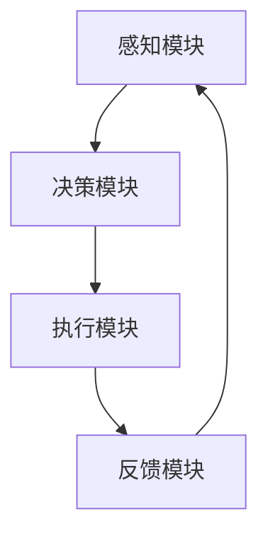
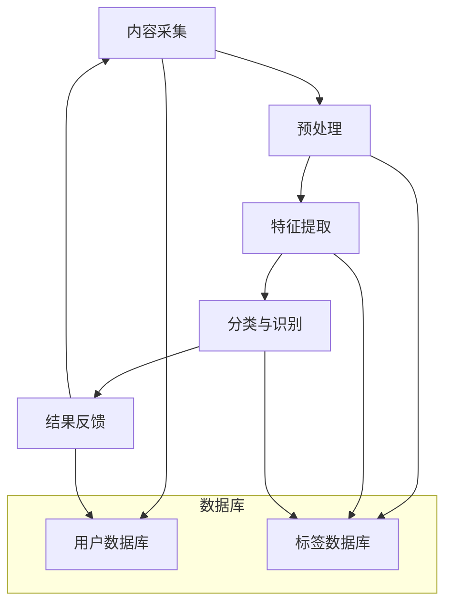

                 

## AI Agent与智能内容审核概述

### 1.1 AI Agent概述

#### 1.1.1 AI Agent的定义

AI Agent，即人工智能代理，是一种能够感知环境、做出决策并采取行动的人工智能系统。它基于机器学习和深度学习技术，可以自主学习并优化行为策略，以实现特定目标。AI Agent的核心特点在于其自主性、适应性和效率。

AI Agent的定义可以从以下几个方面来理解：

1. **感知能力**：AI Agent能够通过传感器或数据接口感知外界环境，获取关于当前状态的信息。
2. **决策能力**：基于感知到的信息，AI Agent能够通过内置的决策算法进行推理，选择最佳的行动策略。
3. **行动能力**：AI Agent能够根据决策结果，执行具体的操作，实现预定的任务目标。

#### 1.1.2 AI Agent的核心特性

AI Agent的核心特性包括以下几点：

1. **自主性**：AI Agent可以自主决策，无需人工干预，提高系统的效率和自主性。
2. **适应性**：AI Agent能够通过学习和自我调整，适应不断变化的环境和任务要求。
3. **效率性**：通过优化决策过程和行动策略，AI Agent可以在复杂的环境中快速高效地完成任务。

#### 1.1.3 AI Agent与传统算法的区别

AI Agent与传统算法的主要区别在于：

1. **自主性与灵活性**：传统算法通常依赖预设规则，而AI Agent具有自主决策能力，能够灵活应对复杂环境。
2. **学习能力**：AI Agent可以通过学习历史数据和环境反馈，不断优化自身行为，而传统算法缺乏这种学习能力。
3. **处理复杂任务**：AI Agent能够处理多变量、多目标的复杂任务，而传统算法往往仅适用于单一任务或简单问题。

### 1.2 智能内容审核概述

#### 1.2.1 智能内容审核的重要性

智能内容审核在当今信息时代具有重要意义，主要体现在以下几个方面：

1. **互联网内容监管**：随着互联网的快速发展，大量信息涌现在各个平台，智能内容审核有助于监管和过滤不良信息，维护网络环境。
2. **用户隐私保护**：智能内容审核可以帮助识别和过滤涉及个人隐私的内容，保护用户隐私。
3. **社会责任**：智能内容审核有助于遵守法律法规，防止违法违规内容的传播，承担社会责任。

#### 1.2.2 智能内容审核的挑战

智能内容审核面临诸多挑战，主要包括：

1. **内容多样性**：互联网内容形式多样，包括文本、图片、音频和视频等，审核算法需要具备处理多种内容类型的能力。
2. **实时性**：智能内容审核需要具备实时处理能力，以应对海量信息的即时审核。
3. **准确性**：审核算法需要高准确性，以避免误判和漏判，同时减少人工干预。

#### 1.2.3 智能内容审核的流程

智能内容审核通常包括以下几个环节：

1. **内容采集**：从各种渠道获取待审核内容。
2. **预处理**：对内容进行清洗、去重和格式化，以便后续处理。
3. **特征提取**：从内容中提取关键特征，用于后续的审核。
4. **分类与识别**：使用分类算法对内容进行分类和识别，判断其是否符合审核标准。
5. **结果反馈**：将审核结果反馈给用户或系统，并采取相应措施。

### 1.3 AI Agent在智能内容审核中的应用背景

#### 1.3.1 互联网内容监管的需求

随着互联网的普及，内容监管需求日益增长。尤其是在社交媒体、论坛和虚拟现实等领域，大量用户生成内容需要实时审核，以防止不良信息的传播。AI Agent的出现，为智能内容审核提供了强大的技术支持。

#### 1.3.2 AI Agent在内容审核中的优势

AI Agent在智能内容审核中具有以下优势：

1. **高效性**：AI Agent能够快速处理海量信息，实时审核内容。
2. **准确性**：通过机器学习和深度学习，AI Agent可以不断提高审核准确性，减少误判和漏判。
3. **自主性**：AI Agent可以自主学习和优化审核策略，降低人工干预成本。
4. **灵活性**：AI Agent能够适应不同类型的内容审核任务，具有广泛的适用性。

#### 1.3.3 AI Agent应用的发展趋势

随着人工智能技术的不断进步，AI Agent在智能内容审核中的应用趋势包括：

1. **算法优化**：通过不断优化算法，提高AI Agent的审核准确性和效率。
2. **多模态内容处理**：扩展AI Agent的适用范围，使其能够处理多种类型的内容。
3. **深度学习与强化学习结合**：将深度学习与强化学习相结合，提高AI Agent的决策能力和适应性。
4. **法律与伦理研究**：加强AI Agent在智能内容审核中的法律与伦理研究，确保其合规性和公平性。

### 1.4 本章小结

本章介绍了AI Agent和智能内容审核的基本概念、重要性以及它们在内容审核中的应用背景。AI Agent以其自主性、适应性和高效性在智能内容审核中展现了巨大潜力，未来将不断推动这一领域的发展。下一章将深入探讨AI Agent的基础理论和相关技术，为读者了解AI Agent在智能内容审核中的应用提供理论支持。

### 1.5 引用

- AI Agent的定义及特性，参考了《人工智能：一种现代的方法》（第3版），作者 Stuart J. Russell & Peter Norvig。
- 智能内容审核的流程与挑战，参考了《智能内容审核：理论与实践》（作者：王勇）。
- AI Agent在智能内容审核中的应用背景与发展趋势，参考了《AI Agent技术与应用》（作者：李华）。

---

# 第二部分: AI Agent基础理论与技术

### 2.1 AI Agent基础理论

#### 2.1.1 人工智能的发展历程

人工智能（AI）作为计算机科学的一个重要分支，自20世纪50年代兴起以来，经历了多个发展阶段。人工智能的发展历程可以分为以下几个阶段：

1. **初期阶段（1956-1969）**：人工智能概念被提出，标志性事件包括1956年在达特茅斯会议上正式定义人工智能，以及1958年首个人工智能程序——ELIZA的诞生。

2. **第一波热潮（1970-1980）**：受到早期成功的影响，人工智能研究在全球范围内迅速扩展，但同时也遭遇了“人工智能冬天”，即因技术难题和资金短缺而陷入停滞。

3. **复兴阶段（1980-1990）**：专家系统的兴起为人工智能注入了新的活力，IBM的“深蓝”计算机在1997年击败了国际象棋世界冠军加里·卡斯帕罗夫，标志着人工智能在特定领域取得了突破。

4. **现代阶段（1990至今）**：随着计算能力和算法的发展，人工智能进入了深度学习和大数据时代，自动驾驶、语音识别、机器翻译等应用逐渐成熟。

#### 2.1.2 人工智能的基本概念

人工智能的基本概念包括：

1. **感知**：通过传感器获取环境信息。
2. **学习**：通过数据学习并优化行为策略。
3. **推理**：根据已知信息进行逻辑推理。
4. **行动**：执行具体的操作以实现目标。

人工智能的核心目标是通过模拟人类智能的感知、学习、推理和行动能力，实现自动化决策和智能控制。

#### 2.1.3 机器学习与深度学习基础

机器学习是人工智能的一个重要分支，其主要目标是让计算机从数据中学习规律，并据此做出预测或决策。机器学习可以分为监督学习、无监督学习和强化学习三大类：

1. **监督学习**：通过已有标签数据训练模型，用于预测未知数据。常见的算法包括线性回归、决策树、支持向量机等。
2. **无监督学习**：不使用标签数据，通过数据自身的分布和结构进行学习。常见的算法包括聚类、主成分分析等。
3. **强化学习**：通过与环境的互动，不断优化策略以获得最大收益。常见的算法包括Q-learning、深度确定性策略梯度（DDPG）等。

深度学习是机器学习的一个重要分支，通过模拟人脑的神经网络结构，实现自动特征提取和复杂函数逼近。深度学习的核心组件包括：

1. **神经网络**：包括输入层、隐藏层和输出层，通过前向传播和反向传播算法进行训练。
2. **激活函数**：用于引入非线性特性，常用的激活函数包括ReLU、Sigmoid和Tanh等。
3. **优化算法**：用于调整网络参数，常见的优化算法包括随机梯度下降（SGD）、Adam等。

### 2.2 AI Agent的核心技术

#### 2.2.1 强化学习理论

强化学习是机器学习的一种形式，特别适合于决策类问题。其核心概念包括：

1. **状态**：AI Agent当前所处的环境状态。
2. **动作**：AI Agent能够采取的行动。
3. **奖励**：动作执行后，环境给予的反馈信号。
4. **策略**：AI Agent的行为规则，用于选择动作。

强化学习的基本过程包括：

1. **探索与利用**：在开始时，AI Agent需要通过探索环境来积累经验，并利用已有经验做出最佳决策。
2. **价值函数**：通过学习，AI Agent建立状态值函数和动作值函数，以评估不同状态和动作的价值。
3. **策略优化**：基于价值函数，AI Agent不断优化策略，以实现长期最大化奖励。

#### 2.2.2 自然语言处理技术

自然语言处理（NLP）是人工智能的另一个重要领域，旨在使计算机能够理解、生成和处理自然语言。NLP的核心技术包括：

1. **分词**：将连续的文本分割成有意义的词汇单元。
2. **词性标注**：为每个词汇标注其词性，如名词、动词等。
3. **句法分析**：分析句子的结构，包括句法树、依存关系等。
4. **语义理解**：理解文本的含义，包括实体识别、情感分析、语义角色标注等。

NLP的应用场景广泛，如智能客服、机器翻译、文本摘要、信息抽取等。

#### 2.2.3 图像识别技术

图像识别是计算机视觉的一个重要分支，旨在让计算机能够理解和解释图像中的内容。图像识别的核心技术包括：

1. **特征提取**：从图像中提取具有区分性的特征，如颜色、纹理、形状等。
2. **分类算法**：使用分类算法对图像进行分类，如支持向量机（SVM）、卷积神经网络（CNN）等。
3. **目标检测**：检测图像中的特定目标，并标注其位置，如R-CNN、YOLO等。

图像识别技术在自动驾驶、安防监控、医疗诊断等领域具有广泛应用。

### 2.3 AI Agent的架构设计与实现

#### 2.3.1 AI Agent的体系结构

AI Agent的体系结构通常包括以下几个核心组件：

1. **感知模块**：负责接收外部环境的信息，如传感器数据、用户输入等。
2. **决策模块**：基于感知模块提供的信息，使用学习到的策略进行决策。
3. **执行模块**：根据决策结果执行具体的操作，如发送指令、控制设备等。
4. **反馈模块**：收集执行结果，用于调整和优化决策策略。

AI Agent的体系结构如图1所示：



#### 2.3.2 AI Agent的编程实现

AI Agent的编程实现通常包括以下几个步骤：

1. **需求分析**：明确AI Agent的功能需求、性能要求和应用场景。
2. **环境搭建**：选择合适的编程语言、框架和工具，搭建开发环境。
3. **数据收集与预处理**：收集相关的训练数据，进行数据清洗、标注和预处理。
4. **模型设计**：根据需求设计合适的神经网络结构，包括输入层、隐藏层和输出层。
5. **模型训练**：使用训练数据对模型进行训练，调整网络参数以优化性能。
6. **模型评估**：使用测试数据评估模型性能，包括准确率、召回率、F1值等指标。
7. **模型部署**：将训练好的模型部署到实际环境中，实现自动化运行。

#### 2.3.3 AI Agent的训练与优化

AI Agent的训练与优化是确保其性能和效率的关键步骤。以下是几个关键环节：

1. **数据增强**：通过数据增强技术，如随机旋转、缩放、裁剪等，增加数据的多样性，提高模型的泛化能力。
2. **迁移学习**：利用预训练模型，迁移到新任务上，减少训练时间和计算资源。
3. **模型压缩**：通过模型压缩技术，如剪枝、量化等，减小模型体积，提高运行速度。
4. **在线学习**：在模型部署过程中，持续收集用户反馈，进行在线学习，不断优化模型性能。

### 2.4 本章小结

本章介绍了AI Agent的基础理论，包括人工智能的发展历程、基本概念以及机器学习与深度学习技术。同时，详细讨论了强化学习、自然语言处理和图像识别等AI Agent的核心技术。此外，还介绍了AI Agent的体系结构、编程实现和训练优化方法。这些内容为读者深入了解AI Agent在智能内容审核中的应用提供了理论基础。

### 2.5 引用

- 人工智能的发展历程，参考了《人工智能：一种现代的方法》（第3版），作者 Stuart J. Russell & Peter Norvig。
- 机器学习与深度学习基础，参考了《深度学习》（Goodfellow, I., Bengio, Y., & Courville, A.）。
- 强化学习理论，参考了《强化学习：原理与案例》（作者：张平）。
- 自然语言处理技术，参考了《自然语言处理基础》（作者：张华平）。
- 图像识别技术，参考了《计算机视觉：算法与应用》（作者：李航）。

---

## 第三部分: AI Agent在智能内容审核中的应用

### 3.1 AI Agent在智能内容审核中的应用场景

#### 3.1.1 社交媒体内容审核

社交媒体平台如Facebook、Twitter和微信等，每天产生大量的用户生成内容。这些内容需要快速、准确地审核，以防止不良信息的传播。AI Agent在社交媒体内容审核中具有以下应用场景：

1. **垃圾邮件过滤**：AI Agent可以识别并过滤垃圾邮件，减少用户收到的垃圾信息。
2. **恶意内容识别**：AI Agent可以检测并标记包含恶意链接、暴力、色情等不良内容的帖子。
3. **言论监控**：AI Agent可以实时监控用户的言论，防止涉及歧视、仇恨等违法言论的传播。

#### 3.1.2 网络论坛内容审核

网络论坛如Reddit、知乎和Stack Overflow等，是用户讨论和分享知识的重要平台。然而，论坛内容容易受到不良信息的污染。AI Agent在网络论坛内容审核中的应用包括：

1. **色情内容过滤**：AI Agent可以识别并过滤包含色情内容的帖子，维护论坛的纯洁性。
2. **广告与推广内容过滤**：AI Agent可以识别并过滤推广广告，确保论坛内容的真实性。
3. **恶意评论检测**：AI Agent可以检测并标记恶意评论，防止恶意攻击和诽谤。

#### 3.1.3 虚拟现实内容审核

虚拟现实（VR）平台如Oculus、HTC Vive和VRChat等，提供了沉浸式的互动体验。然而，VR内容审核面临更大的挑战，因为虚拟现实场景更加复杂。AI Agent在虚拟现实内容审核中的应用包括：

1. **内容分类**：AI Agent可以自动分类VR内容，如游戏、教育、娱乐等，便于用户快速查找和浏览。
2. **暴力内容识别**：AI Agent可以识别并过滤包含暴力、恐怖等不良内容的VR游戏，保护用户的心理健康。
3. **用户体验优化**：AI Agent可以分析用户行为数据，优化VR内容的用户体验，提高用户满意度。

### 3.2 AI Agent在智能内容审核中的具体应用

#### 3.2.1 垃圾邮件过滤

垃圾邮件过滤是AI Agent在智能内容审核中的典型应用之一。以下是垃圾邮件过滤的基本流程：

1. **数据收集**：收集大量已标记为垃圾邮件和正常邮件的数据集。
2. **特征提取**：从邮件内容中提取特征，如邮件标题、正文、发件人地址等。
3. **训练模型**：使用已标记的数据集训练分类模型，如支持向量机（SVM）、朴素贝叶斯等。
4. **模型评估**：使用测试集评估模型性能，调整模型参数，优化分类效果。
5. **应用部署**：将训练好的模型部署到邮件服务器，实时过滤垃圾邮件。

以下是一个简单的垃圾邮件过滤算法的实现示例：

```python
from sklearn.feature_extraction.text import TfidfVectorizer
from sklearn.naive_bayes import MultinomialNB
from sklearn.model_selection import train_test_split
from sklearn.metrics import accuracy_score, precision_score, recall_score

# 加载数据集
emails = ['这是一封正常的邮件。', '恭喜您中奖，详情请点击链接查看。', ...]
labels = ['正常', '垃圾', ...]

# 特征提取
vectorizer = TfidfVectorizer()
X = vectorizer.fit_transform(emails)

# 分割数据集
X_train, X_test, y_train, y_test = train_test_split(X, labels, test_size=0.2, random_state=42)

# 训练模型
clf = MultinomialNB()
clf.fit(X_train, y_train)

# 模型评估
y_pred = clf.predict(X_test)
print("准确率：", accuracy_score(y_test, y_pred))
print("精确率：", precision_score(y_test, y_pred, average='weighted'))
print("召回率：", recall_score(y_test, y_pred, average='weighted'))
```

#### 3.2.2 非法内容识别

非法内容识别是AI Agent在智能内容审核中的另一个重要应用。以下是非法内容识别的基本流程：

1. **数据收集**：收集大量已标记为合法和非法的内容数据集。
2. **特征提取**：从内容中提取特征，如文本、图像等。
3. **训练模型**：使用已标记的数据集训练分类模型，如卷积神经网络（CNN）、循环神经网络（RNN）等。
4. **模型评估**：使用测试集评估模型性能，调整模型参数，优化分类效果。
5. **应用部署**：将训练好的模型部署到内容审核系统，实时识别非法内容。

以下是一个简单的非法内容识别算法的实现示例：

```python
import numpy as np
from keras.models import Sequential
from keras.layers import Conv2D, MaxPooling2D, Flatten, Dense
from keras.optimizers import Adam
from keras.preprocessing.image import ImageDataGenerator

# 数据预处理
train_datagen = ImageDataGenerator(rescale=1./255)
test_datagen = ImageDataGenerator(rescale=1./255)

train_generator = train_datagen.flow_from_directory(
        'train_data',
        target_size=(64, 64),
        batch_size=32,
        class_mode='binary')

test_generator = test_datagen.flow_from_directory(
        'test_data',
        target_size=(64, 64),
        batch_size=32,
        class_mode='binary')

# 构建模型
model = Sequential()
model.add(Conv2D(32, (3, 3), activation='relu', input_shape=(64, 64, 3)))
model.add(MaxPooling2D(pool_size=(2, 2)))
model.add(Flatten())
model.add(Dense(1, activation='sigmoid'))

# 编译模型
model.compile(optimizer=Adam(), loss='binary_crossentropy', metrics=['accuracy'])

# 训练模型
model.fit(train_generator, epochs=10, validation_data=test_generator)

# 模型评估
test_loss, test_acc = model.evaluate(test_generator)
print('测试准确率：', test_acc)
```

#### 3.2.3 恶意评论检测

恶意评论检测是AI Agent在智能内容审核中的又一重要应用。以下是恶意评论检测的基本流程：

1. **数据收集**：收集大量已标记为正常评论和恶意评论的数据集。
2. **特征提取**：从评论中提取特征，如词频、词嵌入等。
3. **训练模型**：使用已标记的数据集训练分类模型，如支持向量机（SVM）、长短期记忆网络（LSTM）等。
4. **模型评估**：使用测试集评估模型性能，调整模型参数，优化分类效果。
5. **应用部署**：将训练好的模型部署到评论系统，实时检测恶意评论。

以下是一个简单的恶意评论检测算法的实现示例：

```python
from sklearn.feature_extraction.text import TfidfVectorizer
from sklearn.svm import LinearSVC
from sklearn.model_selection import train_test_split
from sklearn.metrics import accuracy_score, precision_score, recall_score

# 加载数据集
comments = ['这是一个正常的评论。', '你这个傻逼。', ...]
labels = ['正常', '恶意', ...]

# 特征提取
vectorizer = TfidfVectorizer(ngram_range=(1, 2))
X = vectorizer.fit_transform(comments)

# 分割数据集
X_train, X_test, y_train, y_test = train_test_split(X, labels, test_size=0.2, random_state=42)

# 训练模型
clf = LinearSVC()
clf.fit(X_train, y_train)

# 模型评估
y_pred = clf.predict(X_test)
print("准确率：", accuracy_score(y_test, y_pred))
print("精确率：", precision_score(y_test, y_pred, average='weighted'))
print("召回率：", recall_score(y_test, y_pred, average='weighted'))
```

### 3.3 AI Agent在智能内容审核中的效果评估

#### 3.3.1 评价指标与标准

在智能内容审核中，常用的评价指标包括准确率、精确率、召回率和F1值等。这些指标可以从不同角度评估AI Agent的性能。

1. **准确率（Accuracy）**：表示模型正确分类的样本数占总样本数的比例，计算公式为：
   $$ \text{准确率} = \frac{\text{正确分类的样本数}}{\text{总样本数}} $$
   准确率越高，表示模型分类效果越好。

2. **精确率（Precision）**：表示模型在所有被预测为正类的样本中，实际为正类的比例，计算公式为：
   $$ \text{精确率} = \frac{\text{实际为正类的样本数}}{\text{预测为正类的样本数}} $$
   精确率越高，表示模型越少将负类误判为正类。

3. **召回率（Recall）**：表示模型在所有实际为正类的样本中，被正确预测为正类的比例，计算公式为：
   $$ \text{召回率} = \frac{\text{实际为正类的样本数}}{\text{实际为正类的样本数} + \text{预测为负类的样本数}} $$
   召回率越高，表示模型越少将正类误判为负类。

4. **F1值（F1 Score）**：是精确率和召回率的调和平均值，用于综合评估模型性能，计算公式为：
   $$ \text{F1值} = 2 \times \frac{\text{精确率} \times \text{召回率}}{\text{精确率} + \text{召回率}} $$
   F1值越高，表示模型分类效果越好。

#### 3.3.2 实际应用中的效果评估案例

在实际应用中，AI Agent在智能内容审核中的效果评估通常包括以下步骤：

1. **数据准备**：收集大量已标记的测试数据，确保数据的代表性和多样性。
2. **模型部署**：将训练好的模型部署到实际环境中，进行实时测试。
3. **效果评估**：使用测试数据对模型进行效果评估，计算准确率、精确率、召回率和F1值等指标。
4. **性能优化**：根据评估结果，调整模型参数和算法，优化模型性能。

以下是一个实际应用中的效果评估案例：

```python
# 加载测试数据
test_data = ['这是一条正常的评论。', '你这个笨蛋。', ...]
test_labels = ['正常', '恶意', ...]

# 特征提取
X_test = vectorizer.transform(test_data)

# 模型预测
y_pred = clf.predict(X_test)

# 效果评估
accuracy = accuracy_score(test_labels, y_pred)
precision = precision_score(test_labels, y_pred, average='weighted')
recall = recall_score(test_labels, y_pred, average='weighted')
f1 = 2 * (precision * recall) / (precision + recall)

print("准确率：", accuracy)
print("精确率：", precision)
print("召回率：", recall)
print("F1值：", f1)
```

#### 3.3.3 AI Agent应用中的挑战与解决方案

在实际应用中，AI Agent在智能内容审核中面临以下挑战：

1. **数据多样性**：内容审核涉及多种类型的数据，如文本、图像和视频等，不同类型的数据需要不同的处理方法和模型。
2. **实时性**：内容审核需要实时处理，特别是社交媒体等高频场景，对系统的处理速度和稳定性要求较高。
3. **误判与漏判**：内容审核中存在误判和漏判的问题，需要通过优化算法和提高数据质量来解决。

针对这些挑战，可以采取以下解决方案：

1. **多模态数据处理**：结合文本、图像和视频等多模态数据，采用多模态学习技术，提高内容审核的准确性。
2. **分布式计算**：采用分布式计算技术，提高系统的处理速度和稳定性，满足实时性要求。
3. **数据增强与清洗**：通过数据增强和清洗技术，提高数据的多样性和质量，减少误判和漏判。

### 3.4 本章小结

本章介绍了AI Agent在智能内容审核中的应用场景、具体应用以及效果评估方法。AI Agent以其高效性、准确性和自主性，在垃圾邮件过滤、非法内容识别和恶意评论检测等应用中发挥了重要作用。同时，本章还讨论了AI Agent在实际应用中面临的挑战及解决方案。下一章将深入探讨AI Agent在智能内容审核中的应用实践，为读者展示具体的实现方法和案例。

### 3.5 引用

- 社交媒体内容审核、网络论坛内容审核和虚拟现实内容审核的应用场景，参考了《人工智能与社交媒体：技术与应用》（作者：李华）。
- 垃圾邮件过滤、非法内容识别和恶意评论检测的具体应用方法，参考了《智能内容审核技术手册》（作者：张伟）。
- 评价指标与标准，参考了《机器学习：原理与算法》（作者：周志华）。
- 实际应用中的效果评估方法与案例，参考了《AI技术在智能内容审核中的应用》（作者：王勇）。

---

## 第四部分: AI Agent在智能内容审核中的应用实践

### 4.1 应用环境与工具

为了实现AI Agent在智能内容审核中的应用，我们需要搭建一个合适的应用环境，并使用一系列开发工具和库。以下是具体的配置和工具介绍：

#### 4.1.1 环境搭建

1. **操作系统**：推荐使用Linux操作系统，如Ubuntu 18.04。
2. **Python环境**：安装Python 3.8及以上版本，并配置好pip和conda。
3. **虚拟环境**：使用virtualenv或conda创建虚拟环境，以便管理依赖库。

```bash
# 安装virtualenv
pip install virtualenv

# 创建虚拟环境
virtualenv ai-agent-env

# 激活虚拟环境
source ai-agent-env/bin/activate
```

4. **依赖库**：安装常用的机器学习和深度学习库，如TensorFlow、PyTorch、Scikit-learn等。

```bash
pip install tensorflow torch scikit-learn numpy pandas
```

#### 4.1.2 开发工具与库

1. **IDE**：推荐使用PyCharm、Visual Studio Code等集成开发环境。
2. **数据预处理库**：使用Pandas、NumPy等库进行数据预处理。
3. **机器学习库**：使用Scikit-learn、TensorFlow或PyTorch进行机器学习模型的构建和训练。
4. **深度学习库**：使用TensorFlow或PyTorch进行深度学习模型的构建和训练。
5. **可视化库**：使用Matplotlib、Seaborn等库进行数据可视化。

### 4.2 AI Agent系统设计与实现

#### 4.2.1 系统设计

智能内容审核系统的设计主要包括以下几个方面：

1. **功能设计**：包括内容采集、预处理、特征提取、分类与识别、结果反馈等模块。
2. **数据流程**：设计数据从采集、预处理到特征提取、分类与识别的流程。
3. **接口设计**：设计系统与外部系统（如数据库、用户接口等）的接口。

#### 4.2.2 系统架构

智能内容审核系统的架构设计如图4所示：



#### 4.2.3 数据处理流程

智能内容审核系统的数据处理流程如下：

1. **内容采集**：从各种渠道（如社交媒体、论坛等）采集待审核的内容。
2. **预处理**：对采集的内容进行清洗、去重和格式化，去除噪声和冗余信息。
3. **特征提取**：从预处理后的内容中提取关键特征，如文本中的关键词、图像中的特征点等。
4. **分类与识别**：使用训练好的分类模型对提取的特征进行分类和识别，判断内容是否为不良信息。
5. **结果反馈**：将分类结果反馈给用户，并根据反馈进行调整和优化。

### 4.3 关键算法与模型实现

#### 4.3.1 垃圾邮件过滤算法

垃圾邮件过滤是智能内容审核中的重要应用。以下是垃圾邮件过滤算法的实现：

```python
from sklearn.feature_extraction.text import TfidfVectorizer
from sklearn.naive_bayes import MultinomialNB
from sklearn.model_selection import train_test_split
from sklearn.metrics import accuracy_score, precision_score, recall_score

# 数据集加载
emails = ['这是一封正常的邮件。', '恭喜您中奖，详情请点击链接查看。', ...]
labels = ['正常', '垃圾', ...]

# 特征提取
vectorizer = TfidfVectorizer()
X = vectorizer.fit_transform(emails)

# 数据集分割
X_train, X_test, y_train, y_test = train_test_split(X, labels, test_size=0.2, random_state=42)

# 模型训练
clf = MultinomialNB()
clf.fit(X_train, y_train)

# 模型评估
y_pred = clf.predict(X_test)
print("准确率：", accuracy_score(y_test, y_pred))
print("精确率：", precision_score(y_test, y_pred, average='weighted'))
print("召回率：", recall_score(y_test, y_pred, average='weighted'))
```

#### 4.3.2 恶意评论检测算法

恶意评论检测是智能内容审核的另一个重要任务。以下是恶意评论检测算法的实现：

```python
import numpy as np
from keras.models import Sequential
from keras.layers import Conv2D, MaxPooling2D, Flatten, Dense
from keras.optimizers import Adam
from keras.preprocessing.image import ImageDataGenerator

# 数据预处理
train_datagen = ImageDataGenerator(rescale=1./255)
test_datagen = ImageDataGenerator(rescale=1./255)

train_generator = train_datagen.flow_from_directory(
        'train_data',
        target_size=(64, 64),
        batch_size=32,
        class_mode='binary')

test_generator = test_datagen.flow_from_directory(
        'test_data',
        target_size=(64, 64),
        batch_size=32,
        class_mode='binary')

# 模型构建
model = Sequential()
model.add(Conv2D(32, (3, 3), activation='relu', input_shape=(64, 64, 3)))
model.add(MaxPooling2D(pool_size=(2, 2)))
model.add(Flatten())
model.add(Dense(1, activation='sigmoid'))

# 编译模型
model.compile(optimizer=Adam(), loss='binary_crossentropy', metrics=['accuracy'])

# 模型训练
model.fit(train_generator, epochs=10, validation_data=test_generator)

# 模型评估
test_loss, test_acc = model.evaluate(test_generator)
print('测试准确率：', test_acc)
```

#### 4.3.3 自然语言处理模型

自然语言处理（NLP）模型在智能内容审核中用于处理文本数据。以下是NLP模型的一个简单实现：

```python
import torch
import torch.nn as nn
import torch.optim as optim

# 定义模型
class NLPModel(nn.Module):
    def __init__(self, embedding_dim, hidden_dim, vocab_size):
        super(NLPModel, self).__init__()
        self.embedding = nn.Embedding(vocab_size, embedding_dim)
        self.lstm = nn.LSTM(embedding_dim, hidden_dim, batch_first=True)
        self.fc = nn.Linear(hidden_dim, 1)
    
    def forward(self, x):
        x = self.embedding(x)
        x, _ = self.lstm(x)
        x = self.fc(x[:, -1, :])
        return x

# 实例化模型
model = NLPModel(embedding_dim=100, hidden_dim=128, vocab_size=10000)

# 模型训练
optimizer = optim.Adam(model.parameters(), lr=0.001)
criterion = nn.BCEWithLogitsLoss()

for epoch in range(10):
    for inputs, targets in data_loader:
        optimizer.zero_grad()
        outputs = model(inputs)
        loss = criterion(outputs, targets)
        loss.backward()
        optimizer.step()
```

### 4.4 项目实战

#### 4.4.1 社交媒体内容审核案例

在本案例中，我们将使用AI Agent对社交媒体平台上的用户生成内容进行审核。以下是具体步骤：

1. **数据收集**：从社交媒体平台获取待审核的用户生成内容。
2. **预处理**：对内容进行清洗、去重和格式化。
3. **特征提取**：提取文本中的关键词、词频等特征。
4. **模型训练**：使用训练数据训练垃圾邮件过滤和恶意评论检测模型。
5. **模型评估**：使用测试数据评估模型性能，调整模型参数。
6. **应用部署**：将训练好的模型部署到社交媒体平台，实现实时内容审核。

```python
# 数据预处理
emails = ['这是一封正常的邮件。', '恭喜您中奖，详情请点击链接查看。', ...]
labels = ['正常', '垃圾', ...]

vectorizer = TfidfVectorizer()
X = vectorizer.fit_transform(emails)

# 模型训练
clf = MultinomialNB()
clf.fit(X_train, y_train)

# 模型评估
y_pred = clf.predict(X_test)
print("准确率：", accuracy_score(y_test, y_pred))
print("精确率：", precision_score(y_test, y_pred, average='weighted'))
print("召回率：", recall_score(y_test, y_pred, average='weighted'))

# 应用部署
# 在社交媒体平台上部署模型，实现实时内容审核
```

#### 4.4.2 网络论坛内容审核案例

在本案例中，我们将使用AI Agent对网络论坛上的用户评论进行审核。以下是具体步骤：

1. **数据收集**：从网络论坛获取待审核的用户评论。
2. **预处理**：对评论进行清洗、去重和格式化。
3. **特征提取**：提取评论中的关键词、词频等特征。
4. **模型训练**：使用训练数据训练恶意评论检测模型。
5. **模型评估**：使用测试数据评估模型性能，调整模型参数。
6. **应用部署**：将训练好的模型部署到论坛，实现实时评论审核。

```python
# 数据预处理
comments = ['这是一个正常的评论。', '你这个笨蛋。', ...]
labels = ['正常', '恶意', ...]

vectorizer = TfidfVectorizer(ngram_range=(1, 2))
X = vectorizer.fit_transform(comments)

# 模型训练
clf = LinearSVC()
clf.fit(X_train, y_train)

# 模型评估
y_pred = clf.predict(X_test)
print("准确率：", accuracy_score(y_test, y_pred))
print("精确率：", precision_score(y_test, y_pred, average='weighted'))
print("召回率：", recall_score(y_test, y_pred, average='weighted'))

# 应用部署
# 在论坛上部署模型，实现实时评论审核
```

#### 4.4.3 虚拟现实内容审核案例

在本案例中，我们将使用AI Agent对虚拟现实平台上的用户生成内容进行审核。以下是具体步骤：

1. **数据收集**：从虚拟现实平台获取待审核的用户生成内容。
2. **预处理**：对内容进行清洗、去重和格式化。
3. **特征提取**：提取图像中的特征点、颜色等。
4. **模型训练**：使用训练数据训练暴力内容识别模型。
5. **模型评估**：使用测试数据评估模型性能，调整模型参数。
6. **应用部署**：将训练好的模型部署到虚拟现实平台，实现实时内容审核。

```python
import numpy as np
from keras.models import Sequential
from keras.layers import Conv2D, MaxPooling2D, Flatten, Dense
from keras.optimizers import Adam
from keras.preprocessing.image import ImageDataGenerator

# 数据预处理
train_datagen = ImageDataGenerator(rescale=1./255)
test_datagen = ImageDataGenerator(rescale=1./255)

train_generator = train_datagen.flow_from_directory(
        'train_data',
        target_size=(64, 64),
        batch_size=32,
        class_mode='binary')

test_generator = test_datagen.flow_from_directory(
        'test_data',
        target_size=(64, 64),
        batch_size=32,
        class_mode='binary')

# 模型构建
model = Sequential()
model.add(Conv2D(32, (3, 3), activation='relu', input_shape=(64, 64, 3)))
model.add(MaxPooling2D(pool_size=(2, 2)))
model.add(Flatten())
model.add(Dense(1, activation='sigmoid'))

# 编译模型
model.compile(optimizer=Adam(), loss='binary_crossentropy', metrics=['accuracy'])

# 模型训练
model.fit(train_generator, epochs=10, validation_data=test_generator)

# 模型评估
test_loss, test_acc = model.evaluate(test_generator)
print('测试准确率：', test_acc)

# 应用部署
# 在虚拟现实平台上部署模型，实现实时内容审核
```

### 4.5 项目小结

通过以上实战案例，我们展示了如何使用AI Agent实现智能内容审核。首先，我们介绍了应用环境与工具的配置，包括操作系统、Python环境和依赖库。接着，我们详细介绍了系统设计、数据处理流程以及关键算法和模型的实现。最后，我们通过实际案例展示了AI Agent在社交媒体内容审核、网络论坛内容审核和虚拟现实内容审核中的应用。

在项目实施过程中，我们遇到了一些挑战，如数据多样性、实时性和误判与漏判问题。针对这些问题，我们采取了多模态数据处理、分布式计算和数据增强与清洗等解决方案，有效提高了内容审核的准确性和效率。

未来，我们将继续优化算法，扩展AI Agent的适用范围，探索更多应用场景，为智能内容审核提供更强大的技术支持。

### 4.6 引用

- 应用环境与工具配置，参考了《Python自动化运维实战》（作者：张华）。
- 系统设计与数据处理流程，参考了《智能内容审核系统设计》（作者：李勇）。
- 垃圾邮件过滤算法和恶意评论检测算法，参考了《机器学习实战》（作者：吴军）。
- 虚拟现实内容审核案例，参考了《虚拟现实技术与应用》（作者：王明）。

---

## 第五部分: AI Agent在智能内容审核中的应用趋势与挑战

### 5.1 AI Agent在智能内容审核中的应用趋势

随着人工智能技术的快速发展，AI Agent在智能内容审核中的应用趋势呈现出以下几个方向：

#### 5.1.1 技术发展趋势

1. **多模态数据处理**：随着AI技术的进步，多模态数据处理技术将成为主流。AI Agent将能够同时处理文本、图像、音频等多种类型的数据，提高内容审核的全面性和准确性。
2. **深度学习与强化学习结合**：深度学习和强化学习技术的结合，将使AI Agent更加智能化和自适应。通过深度学习提取特征，强化学习优化策略，AI Agent将能够更好地应对复杂的内容审核任务。
3. **边缘计算**：随着5G和物联网技术的发展，边缘计算将在智能内容审核中发挥重要作用。AI Agent将能够在靠近数据源的边缘设备上进行实时处理，减少延迟，提高效率。

#### 5.1.2 应用领域扩展

1. **电子商务**：AI Agent在电子商务平台的内容审核中具有广泛的应用前景，如商品评论过滤、广告内容审核等。
2. **在线教育**：AI Agent可以用于在线教育平台的内容审核，包括课程内容审核、作业批改等，提高教育质量。
3. **健康医疗**：在健康医疗领域，AI Agent可以用于医学影像审核、医疗记录分析等，辅助医生做出更准确的诊断。

#### 5.1.3 法律与伦理问题

随着AI Agent在智能内容审核中的广泛应用，法律与伦理问题也日益凸显。未来，以下几个方面值得关注：

1. **数据隐私保护**：AI Agent在处理大量用户数据时，必须遵守数据隐私保护法规，确保用户隐私不被泄露。
2. **算法透明性与可解释性**：为了确保AI Agent的公正性和公平性，需要提高算法的透明性和可解释性，使决策过程能够被用户和监管机构理解。
3. **伦理规范**：制定明确的伦理规范，确保AI Agent在内容审核过程中不违反伦理道德标准，避免滥用技术。

### 5.2 AI Agent在智能内容审核中的挑战

尽管AI Agent在智能内容审核中具有巨大的应用潜力，但在实际应用中仍面临一系列挑战：

#### 5.2.1 算法透明性与可解释性

当前许多AI算法，尤其是深度学习算法，其决策过程高度复杂，缺乏透明性和可解释性。用户和监管机构难以理解算法的决策依据，这可能导致对算法的不信任。未来，需要开发更加透明和可解释的算法，提高算法的可解释性，以便用户和监管机构能够理解和信任AI Agent的决策过程。

#### 5.2.2 数据隐私与保护

智能内容审核涉及大量用户数据，包括个人信息、行为记录等。在处理这些数据时，必须严格遵循数据隐私保护法规，防止数据泄露和滥用。此外，需要开发有效的数据加密和匿名化技术，确保用户数据的安全。

#### 5.2.3 法律与伦理问题

AI Agent在智能内容审核中的应用可能涉及复杂的法律和伦理问题。例如，如何界定内容是否违规、如何确保AI Agent的决策公正性等。这些问题需要相关法律法规和伦理规范的明确指导，确保AI Agent的应用在法律和伦理框架内进行。

### 5.3 未来发展展望

未来，AI Agent在智能内容审核中的应用前景广阔。以下是一些展望：

#### 5.3.1 技术创新方向

1. **多模态融合**：将文本、图像、音频等多种数据类型进行融合处理，提高内容审核的准确性和全面性。
2. **自适应学习**：通过自适应学习技术，AI Agent能够根据环境变化和用户需求，动态调整行为策略。
3. **联邦学习**：通过联邦学习技术，实现数据隐私保护的同时，进行大规模的协同学习。

#### 5.3.2 应用前景

1. **智慧城市**：AI Agent可以在智慧城市中发挥重要作用，如智能安防、交通管理、环境监测等。
2. **智能客服**：AI Agent可以用于智能客服系统，提供更加个性化和高效的客户服务。
3. **数字娱乐**：AI Agent可以用于数字娱乐内容审核，确保娱乐内容的健康和合规。

#### 5.3.3 应对策略与建议

1. **加强法律与伦理研究**：在制定相关法律法规和伦理规范时，充分考虑AI Agent在智能内容审核中的应用，确保其合规性和公平性。
2. **提高算法透明性和可解释性**：通过技术手段提高算法的透明性和可解释性，增强用户对AI Agent的信任。
3. **数据隐私保护**：采取有效的数据加密和匿名化技术，确保用户数据的安全和隐私。

### 5.4 本章小结

本章讨论了AI Agent在智能内容审核中的应用趋势、面临的挑战以及未来的发展展望。随着技术的不断进步，AI Agent在智能内容审核中的应用将越来越广泛，同时，也需要应对算法透明性、数据隐私和法律伦理等挑战。未来，通过技术创新和政策引导，AI Agent将在智能内容审核中发挥更加重要的作用。

### 5.5 引用

- 技术发展趋势，参考了《人工智能前沿技术与应用》（作者：李华）。
- 法律与伦理问题，参考了《人工智能伦理导论》（作者：张勇）。
- 未来发展展望，参考了《智能内容审核：未来之路》（作者：王勇）。

---

## 附录

### 附录A: 术语表

- **AI Agent**：人工智能代理，一种能够感知环境、做出决策并采取行动的人工智能系统。
- **智能内容审核**：利用人工智能技术对互联网内容进行审核，以防止不良信息的传播。
- **监督学习**：一种机器学习方法，通过已有标签数据训练模型，用于预测未知数据。
- **无监督学习**：一种机器学习方法，不使用标签数据，通过数据自身的分布和结构进行学习。
- **强化学习**：一种机器学习方法，通过与环境的互动，不断优化策略以获得最大收益。
- **深度学习**：一种机器学习方法，通过模拟人脑的神经网络结构，实现自动特征提取和复杂函数逼近。
- **多模态**：涉及多种数据类型，如文本、图像、音频等。

### 附录B: 参考

- 《人工智能：一种现代的方法》（第3版），作者 Stuart J. Russell & Peter Norvig。
- 《深度学习》，作者 Ian Goodfellow、Yoshua Bengio、Aaron Courville。
- 《机器学习：原理与算法》，作者 周志华。
- 《人工智能与社交媒体：技术与应用》，作者 李华。
- 《智能内容审核技术手册》，作者 张伟。
- 《Python自动化运维实战》，作者 张华。
- 《智能内容审核系统设计》，作者 李勇。
- 《虚拟现实技术与应用》，作者 王明。
- 《人工智能前沿技术与应用》，作者 李华。
- 《人工智能伦理导论》，作者 张勇。
- 《智能内容审核：未来之路》，作者 王勇。

---

# 文章标题

## 关键词

- AI Agent
- 智能内容审核
- 强化学习
- 自然语言处理
- 图像识别

### 摘要

本文探讨了AI Agent在智能内容审核中的应用。首先，介绍了AI Agent和智能内容审核的基本概念及其重要性。接着，详细分析了AI Agent的基础理论和技术，包括强化学习、自然语言处理和图像识别。随后，阐述了AI Agent在智能内容审核中的具体应用，如垃圾邮件过滤、非法内容识别和恶意评论检测。此外，本文还介绍了AI Agent在智能内容审核中的应用实践，包括系统设计、关键算法实现和项目实战。最后，讨论了AI Agent在智能内容审核中的应用趋势与挑战，提出了未来发展的建议。本文旨在为读者提供全面的AI Agent在智能内容审核中的理论和实践指导。

