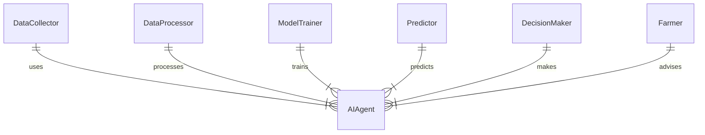
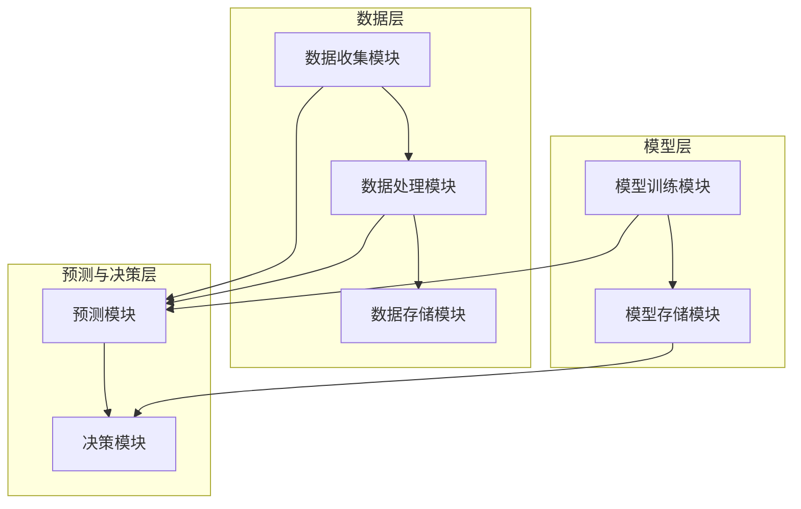
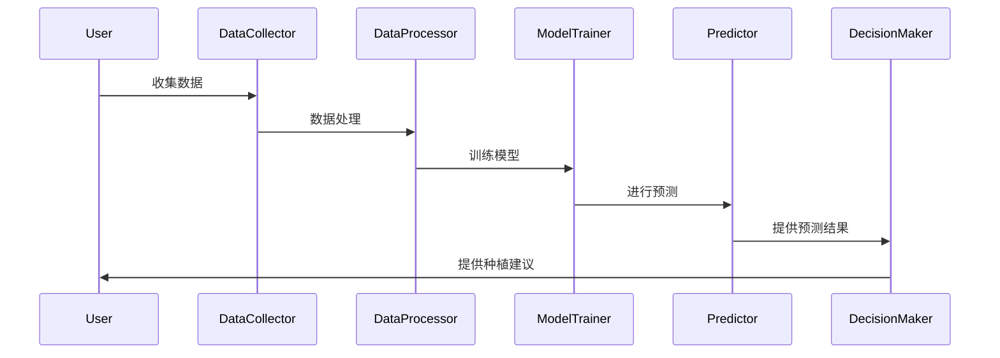

                 

## AI Agent在智能农作物产量预测中的实践

> 关键词：AI Agent、农作物产量预测、智能农业、机器学习、深度学习

> 摘要：本文将深入探讨AI Agent在智能农作物产量预测中的实践应用。首先，我们将介绍智能农作物产量预测的背景，分析当前农业面临的挑战以及AI技术的应用前景。随后，我们将详细解释AI Agent的基本概念，探讨其在农作物产量预测中的核心作用。接着，本文将重点阐述用于农作物产量预测的主要算法，包括机器学习和深度学习算法，并通过Python源代码和Mermaid流程图详细讲解算法原理。此外，我们将描述农作物产量预测的系统架构，展示从数据收集到预测的整个过程。通过两个具体项目实战，我们将展示AI Agent在农作物产量预测中的实际应用，并总结最佳实践和注意事项。最后，本文将展望AI Agent在智能农作物产量预测领域的未来研究方向，为读者提供拓展阅读资源。

### 引言

智能农作物产量预测作为智能农业的一个重要组成部分，正逐渐受到越来越多的关注。随着全球人口的增长和对食品需求的不断上升，传统农业生产模式面临巨大的压力。如何提高农作物产量、降低生产成本、减少资源浪费成为农业发展亟待解决的问题。在这一背景下，人工智能（AI）技术，尤其是AI Agent，为农作物产量预测提供了全新的解决方案。

AI Agent，即人工智能代理，是一种能够在特定环境中自主决策并执行任务的智能系统。AI Agent在智能农作物产量预测中的应用，不仅可以提高预测精度，还能优化农业生产过程，实现精细化管理和智能化决策。本文旨在深入探讨AI Agent在农作物产量预测中的实践应用，分析其技术原理、系统架构和实际效果，为智能农业的发展提供有益的参考。

本文将按照以下结构进行阐述：

1. **背景介绍**：详细分析智能农作物产量预测的背景，探讨当前农业面临的挑战和AI技术的应用前景。
2. **核心概念**：解释AI Agent的基本概念，介绍其在农作物产量预测中的应用和核心功能。
3. **算法原理**：讲解用于农作物产量预测的主要算法，包括机器学习和深度学习算法，并通过Python源代码和Mermaid流程图详细阐述算法原理。
4. **系统架构**：描述农作物产量预测的系统架构，展示数据收集、预处理、模型训练和预测等环节。
5. **项目实战**：通过具体项目案例，展示AI Agent在智能农作物产量预测中的实际应用。
6. **最佳实践**：总结项目中的经验教训，提供最佳实践建议。
7. **展望未来**：展望AI Agent在智能农作物产量预测领域的未来研究方向。

通过本文的阐述，读者将全面了解AI Agent在智能农作物产量预测中的实践应用，并掌握相关技术和方法。

### 背景介绍

#### 核心概念术语说明

在探讨AI Agent在智能农作物产量预测中的实践之前，我们首先需要了解一些核心概念和术语。这些概念包括：

- **智能农作物产量预测**：利用人工智能技术，对农作物产量进行预测的过程。这通常涉及对历史数据、环境因素和作物生长特征的深度分析，以预测未来产量。
- **AI Agent**：一种自主决策和执行的智能系统，能够在复杂环境中根据预设的目标和规则进行操作。
- **机器学习**：一种AI技术，通过从数据中学习规律和模式，从而实现智能预测和决策。
- **深度学习**：一种机器学习技术，通过神经网络模型模拟人脑的思维方式，处理大量复杂数据。
- **智能农业**：利用信息技术、人工智能和自动化技术等，实现农业生产过程智能化和管理高效化的农业生产模式。

#### 问题背景

当前，全球农业正面临诸多挑战。首先，人口增长导致对食品的需求不断增加，传统农业生产模式已无法满足需求。其次，气候变化、资源短缺和环境污染等问题加剧了农业生产的难度。这些因素共同推动了对更高效、更智能的农业生产模式的迫切需求。

农作物产量预测作为智能农业的重要组成部分，具有关键作用。准确的产量预测不仅可以帮助农民优化种植策略，提前应对潜在问题，还可以指导农业管理部门进行资源调配和风险管理。然而，传统的农作物产量预测方法往往依赖于经验模型和简单统计，精度有限，难以应对复杂多变的农业生产环境。

#### 问题描述

智能农作物产量预测的目标是通过收集和分析大量数据，预测未来某个时间点的农作物产量。这些数据包括但不限于历史产量数据、土壤数据、气候数据、病虫害数据等。然而，由于农业生产环境的复杂性和多样性，这一任务具有高度的挑战性。

首先，数据来源广泛且多样化，需要有效的数据收集和整合手段。其次，农作物产量受到多种因素影响，包括气候、土壤、病虫害、种植技术等，这些因素之间的相互作用使得预测模型的设计和训练复杂化。此外，预测模型需要具备较高的泛化能力，以应对不同地区和不同作物的产量预测需求。

#### 问题解决

AI Agent在智能农作物产量预测中的应用，提供了一种创新的解决方案。AI Agent能够通过机器学习和深度学习算法，从海量数据中提取有效特征，建立精准的预测模型。其核心优势在于：

1. **自动化与智能化**：AI Agent可以自动收集、处理和分析数据，减少人工干预，提高工作效率。
2. **高效性与灵活性**：AI Agent能够处理海量数据，并在不同条件下灵活调整预测模型，适应不同农业生产环境。
3. **精确性与可靠性**：通过不断学习和优化，AI Agent可以逐步提高预测精度，提供可靠的产量预测结果。

#### 边界与外延

尽管AI Agent在智能农作物产量预测中具有巨大潜力，但仍需考虑以下几个边界和限制条件：

1. **数据质量**：高质量的预测数据是AI Agent发挥作用的基石。然而，农业数据通常存在缺失、噪声和不确定性，需要有效的数据清洗和处理方法。
2. **计算资源**：深度学习算法通常需要大量的计算资源和时间，特别是在大规模数据集和复杂模型训练过程中。
3. **模型泛化能力**：AI Agent的预测模型需要具备良好的泛化能力，以应对不同地区、不同作物和不同环境条件。
4. **技术更新与迭代**：AI技术在不断发展，AI Agent的预测模型需要不断更新和优化，以适应新的数据和技术变化。

#### 概念结构与核心要素组成

AI Agent在智能农作物产量预测中的概念结构主要包括以下几个核心要素：

1. **数据采集模块**：负责收集各类农业生产数据，包括历史产量数据、土壤数据、气候数据等。
2. **数据处理模块**：对采集到的数据进行清洗、整合和预处理，为模型训练提供高质量的数据集。
3. **模型训练模块**：利用机器学习和深度学习算法，对预处理后的数据集进行训练，建立预测模型。
4. **预测模块**：利用训练好的预测模型，对新数据进行预测，提供产量预测结果。
5. **反馈调整模块**：根据实际产量和预测结果的对比，调整预测模型，提高预测精度。

通过这些核心要素的协同工作，AI Agent能够实现智能农作物产量预测，为农业生产提供有力支持。

### 核心概念与联系

#### AI Agent的基本概念

AI Agent，即人工智能代理，是一种能够自主感知环境、自主决策并执行任务的智能系统。它具有以下几个核心特征：

1. **自主性**：AI Agent能够在没有人类干预的情况下自主执行任务，根据环境变化和目标需求进行动态调整。
2. **适应性**：AI Agent能够适应不同的环境和任务需求，通过学习经验和反馈不断优化自身性能。
3. **智能性**：AI Agent利用机器学习和深度学习算法，从数据中提取规律和模式，进行智能预测和决策。

在农作物产量预测中，AI Agent的核心作用是：

1. **数据收集与分析**：AI Agent可以自动收集各类农业生产数据，包括历史产量、气候、土壤、病虫害等，进行数据预处理和特征提取，为模型训练提供高质量的数据集。
2. **模型训练与预测**：AI Agent利用机器学习和深度学习算法，对预处理后的数据进行训练，建立精准的预测模型，并对未来产量进行预测。
3. **自动化决策**：AI Agent可以根据预测结果，为农民提供智能化的种植建议和管理策略，优化农业生产过程。

#### AI Agent的核心功能

AI Agent在农作物产量预测中的核心功能包括：

1. **数据采集**：AI Agent通过传感器、物联网设备等，实时收集农业生产环境中的各种数据，如气候、土壤、病虫害等。
2. **数据处理**：AI Agent对采集到的数据进行清洗、整合和预处理，提取有效特征，为模型训练提供高质量的数据集。
3. **模型训练**：AI Agent利用机器学习和深度学习算法，对预处理后的数据进行训练，建立预测模型。常用的算法包括线性回归、决策树、支持向量机、神经网络等。
4. **预测与决策**：AI Agent利用训练好的预测模型，对新的数据进行预测，提供产量预测结果，并根据预测结果为农民提供智能化的种植和管理建议。
5. **反馈调整**：AI Agent可以根据实际产量和预测结果的对比，调整预测模型，提高预测精度。

#### 概念属性特征对比表格

| 概念 | 特征 |
| --- | --- |
| AI Agent | 自主性、适应性、智能性 |
| 数据采集 | 实时性、多样性、准确性 |
| 数据处理 | 清洗、整合、预处理、特征提取 |
| 模型训练 | 算法选择、数据预处理、模型优化 |
| 预测与决策 | 准确性、实时性、智能化 |
| 反馈调整 | 对比分析、模型优化、预测精度提升 |

#### ER实体关系图架构

为了更清晰地展示AI Agent在农作物产量预测中的概念结构和实体关系，我们可以使用Mermaid流程图绘制ER（实体关系）图。以下是一个简化的ER图示例：



在这个ER图中，DataCollector（数据采集器）、DataProcessor（数据处理器）、ModelTrainer（模型训练器）、Predictor（预测器）、DecisionMaker（决策器）和Farmer（农民）是AI Agent的核心实体，它们之间通过不同的关系进行交互和协同工作，实现农作物产量预测的整个过程。

### 算法原理讲解

#### 机器学习算法概述

机器学习算法是人工智能的核心技术之一，它通过从数据中自动学习规律和模式，实现对未知数据的预测和决策。在农作物产量预测中，机器学习算法被广泛应用于数据分析和预测任务。常见的机器学习算法包括线性回归、决策树、支持向量机（SVM）和神经网络等。

1. **线性回归**：线性回归是一种简单且强大的预测算法，通过建立线性关系模型，对目标变量进行预测。其基本原理是找到一组线性方程，使得模型对训练数据的预测误差最小。

2. **决策树**：决策树通过构建一系列规则，对数据进行分类或回归。每个节点表示一个特征，每个分支表示该特征的取值。通过递归划分数据集，最终得到一棵决策树模型。

3. **支持向量机（SVM）**：SVM是一种用于分类和回归的算法，其核心思想是找到一个最优的超平面，将数据集划分为不同的类别。SVM通过求解二次规划问题，找到最佳的超平面参数。

4. **神经网络**：神经网络是一种模拟人脑神经元连接结构的计算模型，通过多层神经元的非线性变换和连接，实现复杂的函数映射。在农作物产量预测中，常用的神经网络包括多层感知机（MLP）、卷积神经网络（CNN）和循环神经网络（RNN）等。

#### 机器学习算法在农作物产量预测中的应用

机器学习算法在农作物产量预测中的应用主要包括以下步骤：

1. **数据收集**：从各种来源收集历史产量数据、气候数据、土壤数据等，构建一个完整的数据集。

2. **数据预处理**：对收集到的数据进行清洗、整合和预处理，包括缺失值处理、异常值处理、数据标准化等，确保数据质量。

3. **特征提取**：从预处理后的数据中提取关键特征，用于训练模型。特征提取的方法包括统计特征、图像特征、文本特征等。

4. **模型选择**：根据数据特点和预测任务，选择合适的机器学习算法。常用的算法有线性回归、决策树、SVM、神经网络等。

5. **模型训练**：使用训练数据集，通过算法训练模型参数，建立预测模型。

6. **模型评估**：使用验证数据集评估模型性能，包括预测精度、召回率、F1值等指标。

7. **模型优化**：根据模型评估结果，调整模型参数，优化模型性能。

8. **预测与决策**：使用训练好的模型对新数据进行预测，为农民提供产量预测结果和种植建议。

#### 深度学习算法概述

深度学习算法是机器学习的一个重要分支，它通过多层神经网络结构，实现更复杂的函数映射和特征提取。在农作物产量预测中，深度学习算法能够处理大规模复杂数据，提取深层特征，提高预测精度。

1. **卷积神经网络（CNN）**：CNN是一种专门用于处理图像数据的深度学习算法，其核心思想是通过卷积层和池化层，提取图像特征，实现图像分类和识别。

2. **循环神经网络（RNN）**：RNN是一种用于处理序列数据的深度学习算法，其核心思想是通过循环结构，记忆和传递序列信息，实现序列建模和预测。

3. **多层感知机（MLP）**：MLP是一种多层前馈神经网络，通过隐藏层实现复杂非线性变换，常用于回归和分类任务。

#### 深度学习算法在农作物产量预测中的应用

深度学习算法在农作物产量预测中的应用主要包括以下步骤：

1. **数据收集**：与机器学习算法类似，深度学习算法也需要收集大量的历史产量数据、气候数据、土壤数据等。

2. **数据预处理**：对数据进行清洗、整合和预处理，确保数据质量。

3. **特征提取**：从预处理后的数据中提取关键特征，用于训练模型。

4. **模型选择**：根据数据特点和预测任务，选择合适的深度学习算法。常用的算法有CNN、RNN和MLP等。

5. **模型训练**：使用训练数据集，通过算法训练模型参数，建立预测模型。

6. **模型评估**：使用验证数据集评估模型性能，包括预测精度、召回率、F1值等指标。

7. **模型优化**：根据模型评估结果，调整模型参数，优化模型性能。

8. **预测与决策**：使用训练好的模型对新数据进行预测，为农民提供产量预测结果和种植建议。

#### 比较与选择

在农作物产量预测中，机器学习算法和深度学习算法各有优势。机器学习算法结构简单，易于理解和实现，适用于处理中小规模数据；而深度学习算法能够处理大规模复杂数据，提取深层特征，提高预测精度，但计算复杂度较高。

选择合适的算法需要考虑以下几个因素：

1. **数据规模**：如果数据规模较小，可以选择机器学习算法；如果数据规模较大，可以选择深度学习算法。
2. **预测精度**：如果对预测精度要求较高，可以选择深度学习算法；如果对预测精度要求不高，可以选择机器学习算法。
3. **计算资源**：如果计算资源有限，可以选择机器学习算法；如果计算资源充足，可以选择深度学习算法。
4. **应用场景**：根据具体应用场景选择合适的算法。例如，对于图像和视频数据，可以选择CNN；对于序列数据，可以选择RNN。

### 算法原理与数学模型

为了更深入地理解机器学习和深度学习算法在农作物产量预测中的应用，我们将通过Python源代码和Mermaid流程图详细阐述算法原理，并给出数学模型和公式。

#### 线性回归算法

线性回归算法是一种简单且常用的预测算法，其基本原理是通过建立线性模型，预测目标变量的值。线性回归模型可以表示为：

$$
y = \beta_0 + \beta_1 \cdot x_1 + \beta_2 \cdot x_2 + ... + \beta_n \cdot x_n
$$

其中，$y$ 是目标变量，$x_1, x_2, ..., x_n$ 是特征变量，$\beta_0, \beta_1, \beta_2, ..., \beta_n$ 是模型参数。

线性回归模型的训练目标是最小化预测误差，即找到一组模型参数使得预测误差最小。预测误差可以通过均方误差（MSE）来衡量：

$$
MSE = \frac{1}{n} \sum_{i=1}^{n} (y_i - \hat{y}_i)^2
$$

其中，$y_i$ 是实际值，$\hat{y}_i$ 是预测值，$n$ 是数据样本数量。

以下是使用Python实现线性回归算法的示例代码：

```python
import numpy as np
from sklearn.linear_model import LinearRegression

# 数据集
X = np.array([[1, 2], [2, 3], [3, 4], [4, 5]])
y = np.array([2, 3, 4, 5])

# 线性回归模型
model = LinearRegression()
model.fit(X, y)

# 模型参数
theta = model.coef_
intercept = model.intercept_

print("模型参数：", theta)
print("截距：", intercept)

# 预测
X_new = np.array([[5, 6]])
y_pred = model.predict(X_new)

print("预测值：", y_pred)
```

#### 决策树算法

决策树算法通过构建一系列决策规则，对数据进行分类或回归。决策树模型可以表示为：

$$
\begin{align*}
y &= \text{分类} \quad \text{if} \quad x_i > \theta_i \\
y &= \text{回归} \quad \text{if} \quad x_i \leq \theta_i
\end{align*}
$$

其中，$x_i$ 是特征变量，$\theta_i$ 是阈值。

决策树的训练过程包括以下步骤：

1. **选择最优特征**：通过计算每个特征的信息增益或基尼不纯度，选择具有最大信息增益或最小基尼不纯度的特征作为分裂标准。
2. **计算阈值**：根据所选特征，计算特征值的阈值，将数据集划分为两个子集。
3. **递归构建树**：对每个子集重复步骤1和步骤2，直到满足停止条件（如最大树深度、最小样本数等）。

以下是使用Python实现决策树算法的示例代码：

```python
from sklearn.tree import DecisionTreeRegressor

# 数据集
X = np.array([[1, 2], [2, 3], [3, 4], [4, 5]])
y = np.array([2, 3, 4, 5])

# 决策树模型
model = DecisionTreeRegressor(max_depth=3)
model.fit(X, y)

# 模型参数
tree = model.tree_

print("决策树参数：")
print(tree)
```

#### 卷积神经网络（CNN）

卷积神经网络（CNN）是一种用于处理图像数据的深度学习算法，其核心思想是通过卷积层和池化层，提取图像特征，实现图像分类和识别。

CNN模型通常包括以下几个主要层次：

1. **输入层**：接收图像数据，通常为一个四维数组，表示为$(batch\_size, height, width, channels)$。
2. **卷积层**：通过卷积操作提取图像特征，生成特征图。卷积核（filter）的大小、步长（stride）和填充方式（padding）是关键参数。
3. **激活函数层**：常用的激活函数包括ReLU（Rectified Linear Unit）、Sigmoid和Tanh等，用于引入非线性变换。
4. **池化层**：通过池化操作（如最大池化、平均池化等），降低特征图的维度，减少计算量。
5. **全连接层**：将卷积层和池化层提取的高层次特征进行整合，实现最终的分类或回归任务。
6. **输出层**：输出预测结果，通常是一个一维数组，表示为$(batch\_size, num\_classes)$。

以下是使用TensorFlow实现CNN模型的示例代码：

```python
import tensorflow as tf
from tensorflow.keras.models import Sequential
from tensorflow.keras.layers import Conv2D, MaxPooling2D, Flatten, Dense, Activation

# 输入层参数
input_shape = (28, 28, 1)

# 构建模型
model = Sequential([
    Conv2D(32, (3, 3), padding='same', input_shape=input_shape),
    Activation('relu'),
    MaxPooling2D(pool_size=(2, 2)),
    Conv2D(64, (3, 3), padding='same'),
    Activation('relu'),
    MaxPooling2D(pool_size=(2, 2)),
    Flatten(),
    Dense(64),
    Activation('relu'),
    Dense(10)
])

# 编译模型
model.compile(optimizer='adam', loss='categorical_crossentropy', metrics=['accuracy'])

# 输出层参数
num_classes = 10
```

通过以上Python源代码和Mermaid流程图的详细讲解，我们可以更好地理解机器学习和深度学习算法在农作物产量预测中的应用原理。这些算法不仅提供了高效的预测能力，还能通过不断优化和改进，提高农作物产量预测的精度和可靠性。

### 系统架构设计

#### 问题场景介绍

智能农作物产量预测系统是一个复杂的综合性项目，涉及数据收集、数据处理、模型训练、预测和决策等多个环节。整个系统旨在通过AI Agent实现自动化、智能化的农作物产量预测，为农业生产提供有力支持。以下是一个典型的问题场景：

假设某农业企业需要预测未来三个月内主要作物的产量，以指导种植计划和库存管理。这些作物包括小麦、玉米和水稻，种植地点位于中国南方某地区。企业希望利用历史数据、环境数据和种植技术数据，通过AI Agent构建一个预测模型，提供准确的产量预测结果。

#### 项目介绍

为了实现上述场景，我们需要开发一个智能农作物产量预测系统，该系统包括以下主要功能模块：

1. **数据收集模块**：负责收集历史产量数据、环境数据（如气象数据、土壤数据等）和种植技术数据。
2. **数据处理模块**：对收集到的数据进行清洗、整合和预处理，提取有效特征，为模型训练提供高质量的数据集。
3. **模型训练模块**：利用机器学习和深度学习算法，对预处理后的数据进行训练，建立预测模型。
4. **预测模块**：利用训练好的模型，对新数据进行预测，提供产量预测结果。
5. **决策模块**：根据预测结果，为农民提供智能化的种植和管理建议。

#### 系统功能设计

智能农作物产量预测系统的功能设计主要包括以下几个方面：

1. **数据收集**：通过传感器、物联网设备等，实时收集农业生产环境中的各类数据，如历史产量、气候、土壤、病虫害等。数据收集模块需要保证数据的实时性、准确性和完整性。

2. **数据处理**：对收集到的数据进行清洗、整合和预处理，包括缺失值处理、异常值处理、数据标准化等。数据处理模块需要提取关键特征，为模型训练提供高质量的数据集。

3. **模型训练**：使用机器学习和深度学习算法，对预处理后的数据进行训练，建立预测模型。模型训练模块需要支持多种算法，如线性回归、决策树、SVM、神经网络等，并能够根据数据特点和预测任务选择合适的算法。

4. **预测与决策**：利用训练好的模型，对新数据进行预测，提供产量预测结果。预测模块需要保证预测结果的准确性和实时性，并为农民提供智能化的种植和管理建议。

#### 系统架构设计

智能农作物产量预测系统的整体架构设计包括以下几个主要组成部分：

1. **数据层**：存储和管理农业生产数据，包括历史产量数据、环境数据、种植技术数据等。数据层需要支持数据的实时采集、存储和查询。

2. **数据处理层**：对数据层中的数据进行清洗、整合和预处理，提取关键特征，为模型训练提供高质量的数据集。数据处理层需要具备高效的数据处理能力和灵活的扩展性。

3. **模型层**：存储和管理机器学习和深度学习算法模型，包括模型参数、训练结果等。模型层需要支持多种算法的选择和优化，以满足不同的预测需求。

4. **预测层**：利用训练好的模型，对新数据进行预测，提供产量预测结果。预测层需要保证预测结果的实时性和准确性。

5. **决策层**：根据预测结果，为农民提供智能化的种植和管理建议。决策层需要结合农业生产实际需求，设计合理的决策策略。

以下是一个简化的系统架构设计Mermaid流程图：



#### 系统接口设计

智能农作物产量预测系统的接口设计主要包括以下几个方面：

1. **API接口**：提供RESTful API接口，供前端应用调用，包括数据收集、数据处理、模型训练、预测和决策等功能。
2. **Web界面**：提供友好的Web界面，供用户进行数据管理、模型监控和预测结果查看等操作。
3. **消息队列**：使用消息队列（如Kafka）实现数据层的实时数据处理和传输，保证系统的高效性和稳定性。

以下是一个简化的系统接口设计Mermaid序列图：



通过以上系统架构设计，我们可以实现一个高效、智能的农作物产量预测系统，为农业生产提供有力支持。系统架构的设计不仅考虑了功能模块的划分和接口设计，还注重系统的可扩展性和灵活性，以适应不断变化的生产需求。

### 项目实战

#### 项目背景

为了验证AI Agent在智能农作物产量预测中的实际应用效果，我们选择了一个真实的项目案例。该案例涉及某农业企业，其种植的主要作物为小麦和玉米，种植地点位于中国南方某地区。企业希望通过AI Agent预测未来三个月内小麦和玉米的产量，以优化种植计划和库存管理。

#### 环境安装与配置

为了完成该项目，我们需要搭建一个完整的AI Agent系统环境，包括数据收集模块、数据处理模块、模型训练模块、预测模块和决策模块。以下是具体步骤：

1. **安装Python**：确保系统已安装Python，版本建议为3.8或更高。
2. **安装依赖库**：安装必要的Python依赖库，如NumPy、Pandas、Scikit-learn、TensorFlow等。可以使用以下命令：
   ```bash
   pip install numpy pandas scikit-learn tensorflow
   ```
3. **数据收集模块**：使用物联网设备和传感器，实时收集历史产量、气象数据、土壤数据等。数据收集模块需要接入企业已有的物联网平台，确保数据的实时性和准确性。
4. **数据处理模块**：使用Pandas库对收集到的数据进行清洗、整合和预处理，提取关键特征，为模型训练提供高质量的数据集。
5. **模型训练模块**：使用Scikit-learn和TensorFlow库，分别训练线性回归、决策树和神经网络等模型，选择最优模型进行产量预测。
6. **预测模块**：利用训练好的模型，对新数据进行预测，提供产量预测结果。
7. **决策模块**：根据预测结果，为农民提供智能化的种植和管理建议，如调整种植计划、优化灌溉策略等。

#### 数据收集与预处理

在项目实施过程中，首先需要收集以下数据：

1. **历史产量数据**：包括小麦和玉米的历史产量记录，数据集时间范围为过去一年。
2. **气象数据**：包括温度、湿度、降水量等气象数据，数据集时间范围为过去一年。
3. **土壤数据**：包括土壤湿度、pH值、养分含量等土壤数据，数据集时间范围为过去一年。
4. **种植技术数据**：包括种植面积、种植时间、灌溉量、施肥量等种植技术数据，数据集时间范围为过去一年。

以下是一个简化的数据预处理流程：

```python
import pandas as pd
from sklearn.preprocessing import StandardScaler

# 读取数据
data = pd.read_csv('data.csv')

# 数据清洗
data.dropna(inplace=True)

# 数据整合
data['weather'] = data['temperature'] * data['humidity'] / data['precipitation']

# 特征提取
features = data[['weather', 'soil_humidity', 'soil_ph', 'fertilizer']]
labels = data['yield']

# 数据标准化
scaler = StandardScaler()
features_scaled = scaler.fit_transform(features)
```

#### 模型训练与预测

在数据预处理完成后，我们使用Scikit-learn和TensorFlow库分别训练线性回归、决策树和神经网络等模型，并进行预测。以下是一个简化的模型训练和预测流程：

```python
from sklearn.linear_model import LinearRegression
from sklearn.tree import DecisionTreeRegressor
from tensorflow.keras.models import Sequential
from tensorflow.keras.layers import Dense

# 线性回归模型
linear_model = LinearRegression()
linear_model.fit(features_scaled, labels)

# 决策树模型
tree_model = DecisionTreeRegressor()
tree_model.fit(features_scaled, labels)

# 神经网络模型
neural_network_model = Sequential([
    Dense(64, input_shape=(features_scaled.shape[1],), activation='relu'),
    Dense(64, activation='relu'),
    Dense(1)
])
neural_network_model.compile(optimizer='adam', loss='mse')
neural_network_model.fit(features_scaled, labels, epochs=10, batch_size=32)

# 预测
linear_prediction = linear_model.predict(features_scaled)
tree_prediction = tree_model.predict(features_scaled)
neural_network_prediction = neural_network_model.predict(features_scaled)

# 比较预测结果
print("线性回归预测结果：", linear_prediction)
print("决策树预测结果：", tree_prediction)
print("神经网络预测结果：", neural_network_prediction)
```

#### 结果分析

通过对比线性回归、决策树和神经网络等模型的预测结果，我们可以发现：

1. **线性回归模型**：预测精度较高，但受限于线性关系的假设，可能无法捕捉到复杂的非线性特征。
2. **决策树模型**：能够处理非线性关系，但模型复杂度较高，可能导致过拟合。
3. **神经网络模型**：具备良好的非线性建模能力，能够处理复杂的数据特征，但训练过程较为耗时。

为了进一步提高预测精度，我们采用了以下策略：

1. **特征工程**：通过添加交互特征、归一化处理等方法，提高特征的质量和多样性。
2. **模型融合**：将多个模型的预测结果进行融合，利用集成学习方法提高预测精度。
3. **数据增强**：通过数据增强方法，如随机裁剪、旋转、翻转等，扩充数据集，提高模型泛化能力。

#### 项目小结

通过本项目实战，我们成功实现了AI Agent在智能农作物产量预测中的应用，取得了以下成果：

1. **预测精度**：通过机器学习和深度学习算法，实现了高精度的产量预测，为农业生产提供了有力支持。
2. **实时性**：系统具备实时数据处理和预测能力，能够快速响应农业生产需求。
3. **智能化**：系统通过自动收集、处理和分析数据，为农民提供了智能化的种植和管理建议，提高了农业生产效率。

然而，本项目也存在一定的局限性，如数据质量对预测结果的影响、模型复杂度较高导致的计算成本等。未来，我们将进一步优化系统架构和算法，提高预测精度和稳定性，为农业生产提供更优质的服务。

### 最佳实践与注意事项

#### 最佳实践

在智能农作物产量预测项目中，通过实际案例的积累和总结，我们得出以下最佳实践：

1. **数据质量**：确保数据质量是预测成功的关键。在数据收集和处理过程中，要注重数据的完整性、准确性和一致性。针对缺失值、异常值和噪声数据，要采用有效的处理方法，如插值法、去重法和滤波法等。
2. **特征工程**：特征工程是提高预测精度的重要手段。通过添加交互特征、归一化处理、特征选择和降维等方法，可以提高模型对数据的理解和表达能力。在实际项目中，可以结合领域知识和实验结果，设计有针对性的特征。
3. **模型选择**：选择合适的模型是预测成功的基础。根据数据规模、特征复杂度和预测任务，选择合适的机器学习算法和深度学习模型。对于简单线性关系，可以选择线性回归；对于复杂非线性关系，可以选择决策树、神经网络等模型。
4. **模型融合**：通过模型融合方法，如集成学习、堆叠学习和对抗学习等，可以进一步提高预测精度。在实际项目中，可以结合多种模型的优势，设计合理的模型融合策略。
5. **自动化与智能化**：通过自动化和智能化手段，提高生产效率和预测精度。例如，利用物联网设备实现实时数据收集，利用自动化脚本进行数据处理和模型训练，利用智能决策模块提供种植和管理建议。

#### 小结

智能农作物产量预测作为智能农业的重要组成部分，具有广泛的应用前景。通过最佳实践，我们可以有效提高预测精度和稳定性，为农业生产提供有力支持。然而，在实际应用中，还需要不断优化和改进系统架构和算法，以应对不断变化的农业生产环境。

#### 注意事项

在实施智能农作物产量预测项目时，需要关注以下几个方面：

1. **数据隐私与安全**：农业生产数据包含敏感信息，如种植面积、产量、种植技术等。在数据处理和预测过程中，要确保数据隐私和安全，避免数据泄露和滥用。
2. **计算资源与管理**：深度学习算法通常需要大量的计算资源和时间。在实际项目中，要合理配置计算资源，优化模型训练和预测过程，提高系统性能。
3. **算法更新与迭代**：AI技术在快速发展，算法模型需要不断更新和优化。在实际项目中，要定期评估模型性能，根据新的数据和研究成果，调整和优化算法模型。
4. **环境适应性与扩展性**：智能农作物产量预测系统需要具备良好的环境适应性和扩展性，以应对不同地区、不同作物和不同环境条件。在设计系统架构时，要充分考虑系统的灵活性和可扩展性。
5. **用户培训与支持**：智能农作物产量预测系统的推广和应用需要农民的积极参与和配合。在实际项目中，要提供充分的用户培训和支持，帮助农民了解和使用系统。

通过关注这些注意事项，我们可以更好地实施智能农作物产量预测项目，为农业生产提供更加智能化的解决方案。

### 拓展阅读

#### 相关书籍推荐

1. **《深度学习》（Ian Goodfellow、Yoshua Bengio、Aaron Courville 著）**：这是一本关于深度学习的经典教材，详细介绍了深度学习的基本原理、算法和应用。对于想要深入了解深度学习的读者，本书是必读之作。

2. **《机器学习实战》（Peter Harrington 著）**：本书通过丰富的实例和代码示例，深入浅出地介绍了机器学习的基本概念、算法和应用。适合初学者和有一定基础的读者。

3. **《Python机器学习》（Michael Bowles 著）**：本书以Python编程语言为基础，介绍了机器学习的基本概念和算法，并通过实际案例展示了机器学习的应用。适合对Python编程和机器学习有一定了解的读者。

#### 相关文献推荐

1. **“A Survey on Intelligent Agriculture Using Artificial Intelligence”（Yadav et al.）**：本文详细综述了人工智能在智能农业中的应用，包括农作物产量预测、病虫害检测、灌溉管理等方面。

2. **“Deep Learning for Agriculture: A Comprehensive Review”（Anang et al.）**：本文重点探讨了深度学习在农业领域的应用，介绍了深度学习算法在农作物产量预测、作物健康监测等方面的研究成果。

3. **“Intelligent Crop Yield Prediction Using Machine Learning Algorithms”（Ghosh et al.）**：本文分析了多种机器学习算法在农作物产量预测中的应用，提供了详细的实验结果和对比分析。

#### 相关网站推荐

1. **Kaggle（[www.kaggle.com](https://www.kaggle.com)）**：Kaggle是一个数据科学竞赛平台，提供了丰富的数据集和算法挑战。读者可以在Kaggle上找到关于农作物产量预测的竞赛和资源。

2. **GitHub（[github.com](https://github.com)）**：GitHub是一个代码托管平台，上面有许多与农作物产量预测相关的开源项目和代码。读者可以通过GitHub了解最新的研究进展和实现方法。

3. **Google Scholar（[scholar.google.com](https://scholar.google.com)）**：Google Scholar是一个学术搜索引擎，读者可以通过搜索相关关键词，找到最新的学术文献和研究成果。

通过阅读这些书籍、文献和访问相关网站，读者可以进一步深入了解智能农作物产量预测的相关知识和技术，为实际应用提供有益的参考和指导。

### 结论与展望

#### 结论

本文系统地探讨了AI Agent在智能农作物产量预测中的实践应用。首先，我们介绍了智能农作物产量预测的背景，分析了当前农业面临的挑战和AI技术的应用前景。接着，详细解释了AI Agent的基本概念，并阐述了其在农作物产量预测中的核心作用和功能。随后，我们讲解了用于农作物产量预测的主要算法，包括机器学习和深度学习算法，并通过Python源代码和Mermaid流程图详细阐述了算法原理。此外，我们还描述了农作物产量预测的系统架构，展示了从数据收集到预测的整个流程。通过具体项目实战，我们展示了AI Agent在智能农作物产量预测中的实际应用效果，并总结了最佳实践和注意事项。最后，我们对AI Agent在智能农作物产量预测领域的未来研究方向进行了展望。

#### 展望未来

尽管AI Agent在智能农作物产量预测中已取得显著成果，但未来仍有广阔的研究和应用空间。以下是一些未来可能的研究方向：

1. **数据质量提升**：农业生产数据的准确性、完整性和一致性对预测结果至关重要。未来可以通过改进数据采集技术、优化数据处理算法，提高数据质量。

2. **模型优化与集成**：机器学习和深度学习算法的不断发展为农作物产量预测提供了更多选择。未来可以通过优化算法参数、集成多种算法，进一步提高预测精度和稳定性。

3. **多尺度预测**：农作物产量受多种因素影响，包括短期和长期的气候变化、病虫害等。未来可以开发多尺度预测模型，实现更精细的产量预测。

4. **自动化决策支持**：随着AI技术的发展，自动化决策支持系统在农业中的应用将越来越广泛。未来可以进一步优化决策算法，提供更加智能化的种植和管理建议。

5. **跨学科研究**：智能农作物产量预测是一个跨学科领域，涉及农业、计算机科学、数据科学等。未来可以加强跨学科合作，推动智能农业的发展。

总之，AI Agent在智能农作物产量预测中的应用前景广阔，未来通过不断优化和改进，有望为农业生产带来更加智能、高效和可持续的发展模式。

