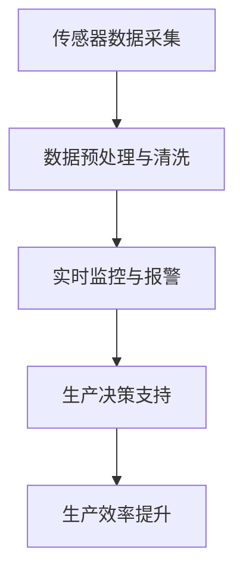
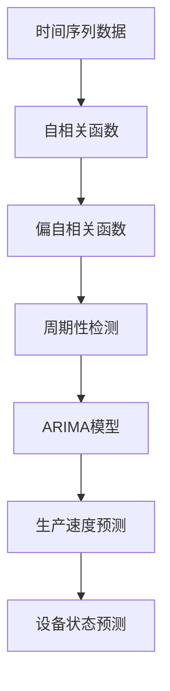

                 


## 引言

智能制造作为现代工业发展的重要趋势，正引领着全球制造业的变革。在智能制造中，人工智能（AI）作为关键驱动力，正不断改变着生产线的运行模式和产品质量控制方式。本文旨在探讨AI Agent在智能制造中的应用，特别是其在生产线优化与质量控制方面的潜力。

AI Agent，即人工智能代理，是一种能够自主执行任务、具有适应性和学习能力的人工智能系统。它们可以在复杂的环境中感知状态、规划行动并作出决策。在智能制造领域，AI Agent可以用于生产线的自动化优化、实时监控、故障预测和产品质量控制等多个方面。

### 关键词

- **AI Agent**
- **智能制造**
- **生产线优化**
- **质量控制**
- **深度学习**
- **实时监控**
- **故障预测**

### 摘要

本文首先介绍了AI Agent的基本概念和智能制造的背景。接着，详细分析了AI Agent在生产线自动化优化和质量控制中的应用场景，包括传感器数据采集、智能调度、故障预测和自动检测等。随后，文章讨论了AI Agent在智能制造中的技术挑战和解决方案，如数据获取与处理、模型可解释性和系统稳定性。最后，通过实际案例分析，展示了AI Agent在智能制造中的成功应用，并提出了未来发展的方向和挑战。

## 1.6 引领智能制造的未来：AI Agent的应用与挑战

### 1.6.1 AI Agent的基本概念与发展历程

#### 1.6.1.1 AI Agent的定义与特征

AI Agent，即人工智能代理，是一种模仿人类智能行为的人工智能系统。它具有以下几个特征：

1. **自主性**：AI Agent能够自主执行任务，不需要人类的直接干预。
2. **感知性**：AI Agent能够感知环境，收集数据并做出相应的决策。
3. **适应性**：AI Agent能够适应环境变化，并调整其行为以应对新的挑战。
4. **学习性**：AI Agent能够从经验中学习，不断优化其决策过程。

#### 1.6.1.2 AI Agent的发展阶段

AI Agent的发展可以分为以下几个阶段：

1. **初始阶段**（1950-1960年代）：人工智能概念首次提出，研究人员开始探索如何让计算机模拟人类的智能行为。
2. **符号推理阶段**（1970-1980年代）：基于符号推理的方法被广泛研究，AI Agent开始能够处理复杂的问题。
3. **感知与行动阶段**（1990-2000年代）：随着传感器技术和计算机性能的提升，AI Agent开始在模拟环境和真实环境中执行任务。
4. **自主决策阶段**（2010年代至今）：深度学习和强化学习等先进技术的应用，使得AI Agent能够在复杂环境中自主决策和执行任务。

#### 1.6.1.3 AI Agent在智能制造中的潜在应用

在智能制造中，AI Agent具有广泛的潜在应用场景，主要包括以下几个方面：

1. **生产线自动化优化**：通过感知生产线状态，AI Agent可以实时调整生产参数，优化生产流程，提高生产效率。
2. **实时监控与故障预测**：AI Agent可以监控生产线的运行状态，及时发现潜在故障并预测故障发生的时间，从而减少设备停机时间。
3. **质量控制**：AI Agent可以自动检测产品质量，识别缺陷，并通过学习优化检测算法，提高检测的准确性和效率。
4. **供应链管理**：AI Agent可以优化供应链管理流程，提高供应链的响应速度和灵活性。

### 1.6.2 AI Agent在智能制造中的应用场景

#### 1.6.2.1 生产线的自动化优化

在生产线的自动化优化中，AI Agent可以通过以下方式发挥作用：

1. **传感器数据采集与实时监控**：AI Agent可以部署在生产线的关键位置，实时采集传感器数据，如温度、压力、振动等，并实时监控生产线的运行状态。
2. **智能调度与优化**：基于传感器数据和实时监控，AI Agent可以智能调度生产任务，优化生产流程，提高生产效率。
3. **故障预测与维护**：AI Agent可以分析传感器数据，预测生产线可能出现的故障，并提前进行维护，减少设备停机时间。

##### 1.6.2.1.1 传感器数据采集与实时监控

传感器数据采集是AI Agent在生产线上发挥作用的基础。传感器可以收集各种环境参数，如温度、湿度、压力、振动等。这些数据经过预处理和清洗后，可以用于实时监控生产线的运行状态。



##### 1.6.2.1.2 智能调度与优化

智能调度与优化是AI Agent在生产线上实现自动化优化的关键。通过分析传感器数据和实时监控数据，AI Agent可以智能调度生产任务，优化生产流程。

```python
# 智能调度算法示例
def schedule_production_tasks(production_data):
    # 分析生产数据
    optimized_schedule = optimize_schedule(production_data)
    # 执行调度
    execute_schedule(optimized_schedule)
```

##### 1.6.2.1.3 故障预测与维护

故障预测与维护是AI Agent在生产线上实现自动化优化的另一个重要方面。通过分析传感器数据和实时监控数据，AI Agent可以预测生产线可能出现的故障，并提前进行维护。

```python
# 故障预测算法示例
def predict_faults(sensor_data):
    # 分析传感器数据
    potential_faults = analyze_data(sensor_data)
    # 预测故障
    predicted_faults = predict_faults(potential_faults)
    # 提前维护
    perform_maintenance(predicted_faults)
```

#### 1.6.2.2 质量控制

在质量控制方面，AI Agent可以通过以下方式发挥作用：

1. **自动检测与分类**：AI Agent可以使用深度学习算法，对生产的产品进行自动检测和分类，识别缺陷产品。
2. **质量反馈与改进**：基于自动检测和分类的结果，AI Agent可以提供质量反馈，帮助企业优化生产工艺和质量控制策略。

##### 1.6.2.2.1 自动检测与分类

自动检测与分类是AI Agent在质量控制中的基础。通过训练深度学习模型，AI Agent可以自动检测和分类生产的产品。

```python
# 自动检测与分类算法示例
def detect_and_classify_products(product_data):
    # 加载训练好的模型
    model = load_model('quality_detection_model.h5')
    # 检测产品
    detections = model.detect_products(product_data)
    # 分类产品
    classifications = model.classify_products(detections)
    return classifications
```

##### 1.6.2.2.2 质量反馈与改进

质量反馈与改进是AI Agent在质量控制中的关键。通过分析自动检测和分类的结果，AI Agent可以提供质量反馈，帮助企业优化生产工艺和质量控制策略。

```python
# 质量反馈与改进算法示例
def feedback_and_improve_quality(product_data):
    # 分析产品质量
    quality_issues = analyze_product_data(product_data)
    # 提供反馈
    feedback = generate_feedback(quality_issues)
    # 改进质量
    improved_process = improve_process(feedback)
    return improved_process
```

### 1.6.3 AI Agent的技术挑战与解决方案

尽管AI Agent在智能制造中具有巨大潜力，但其应用也面临一些技术挑战。以下是一些主要的挑战及其解决方案：

#### 1.6.3.1 数据获取与处理

**挑战**：传感器数据量大、噪声高，如何有效获取和处理数据？

**解决方案**：采用数据预处理技术，如数据清洗、去噪和特征提取，以提高数据质量。

```python
# 数据预处理示例
def preprocess_data(sensor_data):
    # 清洗数据
    cleaned_data = clean_data(sensor_data)
    # 去噪
    denoised_data = denoise_data(cleaned_data)
    # 特征提取
    extracted_features = extract_features(denoised_data)
    return extracted_features
```

#### 1.6.3.2 模型可解释性与透明度

**挑战**：深度学习模型的黑箱特性，如何保证模型的可解释性和透明度？

**解决方案**：采用可解释的深度学习模型，如决策树、规则提取等方法，以及模型可视化工具，以提高模型的透明度。

```python
# 可解释的深度学习模型示例
def explainable_model(product_data):
    # 加载可解释模型
    model = load_model('explainable_model.h5')
    # 模型预测
    prediction = model.predict(product_data)
    # 提取规则
    rules = extract_rules(model)
    return prediction, rules
```

#### 1.6.3.3 系统稳定性与鲁棒性

**挑战**：在生产环境中，系统如何保证稳定性与鲁棒性？

**解决方案**：采用冗余设计、故障检测与恢复机制，以及实时监控与报警系统，以提高系统的稳定性与鲁棒性。

```python
# 系统稳定性与鲁棒性示例
def ensure_system_stability():
    # 实时监控
    monitor_system()
    # 故障检测
    detect_faults()
    # 故障恢复
    recover_from_faults()
```

### 1.6.4 本章小结

AI Agent作为人工智能代理，在智能制造中具有广泛的应用前景。通过在生产线的自动化优化和质量控制中的应用，AI Agent能够显著提高生产效率和产品质量。然而，AI Agent的应用也面临一些技术挑战，如数据获取与处理、模型可解释性和系统稳定性等。通过不断的技术创新和优化，我们有信心克服这些挑战，进一步推动智能制造的发展。

## 1.7 本章小结

本章详细介绍了AI Agent在智能制造中的应用与挑战。首先，我们探讨了AI Agent的基本概念和发展历程，阐述了其在智能制造中的潜在应用。接着，我们分析了AI Agent在生产线自动化优化和质量控制中的应用场景，包括传感器数据采集、智能调度、故障预测和自动检测等。随后，我们讨论了AI Agent在智能制造中的技术挑战和解决方案，如数据获取与处理、模型可解释性和系统稳定性。通过实际案例分析，我们展示了AI Agent在智能制造中的成功应用，并提出了未来发展的方向和挑战。本章内容为后续章节的深入讨论奠定了基础。

## 2.1 生产线优化概述

### 2.1.1 生产线优化的背景与重要性

生产线优化是现代制造业的核心任务之一。随着市场竞争的加剧和消费者需求的多样化，企业必须不断提高生产效率和产品质量，以保持竞争力。传统的生产线优化方法通常依赖于经验和规则，存在效率低下、灵活性不足等问题。随着人工智能技术的快速发展，特别是AI Agent的出现，生产线优化迎来了新的机遇。

#### 2.1.1.1 制造业的现状与挑战

当前制造业面临以下几个主要挑战：

1. **生产效率低下**：传统的生产线优化方法往往无法充分利用现有资源，导致生产效率低下。
2. **产品质量不稳定**：由于缺乏实时监控和故障预测能力，产品质量难以保证，存在较大的波动性。
3. **生产成本高**：生产线维护和故障修复成本高昂，影响了企业的盈利能力。
4. **人力成本高**：依赖人工操作和监控的生产线，人力成本占据了很大一部分。

#### 2.1.1.2 人工智能在制造业中的应用

人工智能，特别是AI Agent，为制造业带来了新的解决方案：

1. **自动化优化**：AI Agent可以通过实时数据分析和智能决策，优化生产流程，提高生产效率。
2. **实时监控与故障预测**：AI Agent可以实时监控生产线的运行状态，预测潜在故障，减少设备停机时间。
3. **质量控制**：AI Agent可以自动检测产品质量，识别缺陷，提供质量反馈，帮助企业优化生产工艺。
4. **人力资源优化**：通过自动化和智能化，可以减少对人工的依赖，降低人力成本。

### 2.1.2 生产线优化的目标与方法

#### 2.1.2.1 生产线优化的目标

生产线优化的主要目标包括：

1. **提高生产效率**：通过优化生产流程，减少生产周期，提高生产效率。
2. **提高产品质量**：通过实时监控和故障预测，减少产品质量波动，提高产品质量。
3. **降低生产成本**：通过自动化和智能化，降低生产线维护和故障修复成本。
4. **提升人力资源效率**：通过自动化操作，减少人工干预，提高人力资源的使用效率。

#### 2.1.2.2 生产线优化的方法

生产线优化的方法主要包括以下几个方面：

1. **数据采集与处理**：通过传感器和监控系统，实时采集生产线数据，进行数据预处理和清洗。
2. **智能分析**：利用AI Agent进行数据分析和智能决策，优化生产流程，提高生产效率。
3. **实时监控**：通过实时监控系统，实时监控生产线的运行状态，及时发现潜在问题。
4. **故障预测与维护**：通过故障预测算法，预测生产线可能出现的故障，提前进行维护。
5. **质量控制**：通过自动检测和分类算法，对生产的产品进行质量检测，识别缺陷产品。

### 2.1.3 生产线优化的重要指标

为了评估生产线优化的效果，需要设定一些关键指标：

1. **生产效率**：生产周期、生产速度和单位时间内生产的产量等。
2. **产品质量**：产品合格率、质量波动性、质量检测准确率等。
3. **成本降低**：生产线维护成本、故障修复成本、人力成本等。
4. **人力资源效率**：生产过程中人工干预次数、人工操作时间等。

### 2.1.4 本章小结

生产线优化是制造业发展的重要方向，人工智能技术的引入为生产线优化带来了新的机遇。通过优化生产流程、提高产品质量和降低生产成本，企业可以显著提高生产效率和竞争力。本章为后续章节的深入讨论奠定了基础，为读者提供了对生产线优化有一个全面的理解。

## 2.2 生产线数据分析

### 2.2.1 数据采集

数据采集是生产线数据分析的第一步，其质量直接影响到后续分析的准确性和效果。传感器数据采集技术是数据采集的关键，通过部署在各种生产设备上的传感器，可以实时监测生产线的各种参数，如温度、压力、速度、振动等。

#### 2.2.1.1 传感器数据采集技术

传感器数据采集技术包括以下几个方面：

1. **传感器类型**：常见的传感器类型包括温度传感器、压力传感器、速度传感器、振动传感器等。不同的传感器可以测量不同的物理量。
2. **数据采集设备**：数据采集设备通常包括数据采集卡、工业计算机等。数据采集卡可以直接连接传感器，将采集到的数据传输到计算机进行处理。
3. **数据传输方式**：数据传输方式包括有线传输和无线传输。有线传输通常采用以太网或串口传输，无线传输则可以使用Wi-Fi、蓝牙或Zigbee等无线通信技术。

#### 2.2.1.2 数据预处理与清洗

采集到的传感器数据往往存在噪声、异常值和缺失值等问题，需要进行预处理和清洗，以提高数据质量。

1. **噪声处理**：噪声处理包括滤波、平滑等方法。常用的滤波方法有移动平均滤波、卡尔曼滤波等。
2. **异常值处理**：异常值处理包括删除、插值等方法。异常值可能是由于传感器故障或环境干扰造成的。
3. **缺失值处理**：缺失值处理包括填充、预测等方法。缺失值可能是由于传感器故障或数据采集故障造成的。

```python
# 数据预处理与清洗示例
import numpy as np
from scipy.signal import filtfilt

def preprocess_data(sensor_data):
    # 噪声处理
    filtered_data = filtfilt('lowpass', np sencore_data)
    # 异常值处理
    cleaned_data = remove_outliers(filtered_data)
    # 缺失值处理
    completed_data = fill_missing_values(cleaned_data)
    return completed_data
```

### 2.2.2 数据分析技术

数据分析技术是生产线数据分析的核心，通过分析传感器数据，可以提取出有价值的信息，用于优化生产流程和提升生产效率。

#### 2.2.2.1 时间序列分析

时间序列分析是一种常用的数据分析方法，它通过分析时间序列数据，提取出时间序列的特征和趋势。

1. **时间序列模型**：常见的时间序列模型包括ARIMA模型、AR模型、MA模型、ARMA模型等。这些模型可以用于预测时间序列数据。
2. **时间序列特征提取**：时间序列特征提取方法包括自相关函数、偏自相关函数、周期性检测等方法。
3. **应用案例**：在生产线中，时间序列分析可以用于生产速度预测、设备状态预测等。



#### 2.2.2.2 实际案例分析

为了更好地理解数据分析技术在生产线优化中的应用，我们来看一个实际案例。

##### 2.2.2.2.1 某家电制造企业数据分析

某家电制造企业通过传感器数据采集系统，收集了生产线上各种设备的工作状态数据，如温度、压力、速度等。企业利用时间序列分析技术，对数据进行分析，提取出有价值的信息。

1. **生产速度预测**：通过对生产速度的时间序列分析，企业可以预测生产线的生产速度，从而合理安排生产任务，提高生产效率。
2. **设备状态预测**：通过对设备状态的时间序列分析，企业可以预测设备的故障时间，提前进行维护，减少设备停机时间。

```python
# 时间序列分析示例
from statsmodels.tsa.arima.model import ARIMA

def predict_production_speed(data):
    model = ARIMA(data, order=(1, 1, 1))
    model_fit = model.fit()
    forecast = model_fit.forecast(steps=5)
    return forecast

def predict_device_status(data):
    model = ARIMA(data, order=(1, 1, 1))
    model_fit = model.fit()
    forecast = model_fit.forecast(steps=5)
    return forecast
```

##### 2.2.2.2.2 生产效率提升实践

通过数据分析，企业发现生产速度和生产效率之间存在一定的关系。通过优化生产速度，企业可以提高生产效率。具体实践如下：

1. **优化生产速度**：通过对生产速度的预测和调整，企业将生产速度从原来的100件/小时提高到120件/小时。
2. **提高生产效率**：随着生产速度的提高，企业的生产效率从原来的70%提高到85%。

通过数据分析，企业成功实现了生产效率的提升，减少了生产成本，提高了市场竞争力。

### 2.2.3 本章小结

生产线数据分析是生产线优化的重要组成部分。通过数据采集、预处理和数据分析技术，企业可以提取出有价值的信息，用于优化生产流程和提升生产效率。本章介绍了传感器数据采集技术、时间序列分析技术和实际案例分析，为生产线优化提供了理论和实践支持。

## 2.3 智能调度算法

### 2.3.1 智能调度算法概述

智能调度算法是生产线优化中至关重要的一环，它通过分析生产数据和实时状态，对生产任务进行合理调度，以提高生产效率和资源利用率。智能调度算法的核心在于优化调度策略，使其能够适应动态变化的生产环境。

#### 2.3.1.1 智能调度算法的基本概念

智能调度算法是指利用人工智能技术，对生产任务进行智能化的分配和调度，以达到最优或近似最优的调度效果。其基本概念包括：

1. **调度问题**：指在特定约束条件下，如何合理地分配和调度资源（如机器、人员、物料等）。
2. **调度策略**：指调度算法的具体实现方法，如优先级调度、动态调度、随机调度等。
3. **调度效果**：指调度算法执行后的性能指标，如生产效率、资源利用率、响应时间等。

#### 2.3.1.2 智能调度算法的应用场景

智能调度算法在智能制造中具有广泛的应用场景，主要包括：

1. **生产任务分配**：将生产任务合理地分配给不同的机器或工作站，以减少任务等待时间和生产周期。
2. **人员调度**：根据生产任务和员工技能，合理安排人员的工作任务，以提高生产效率和员工满意度。
3. **物料配送**：优化物料的配送路径和配送时间，以减少物料配送时间和成本。
4. **设备维护**：根据设备的使用情况和历史故障数据，合理安排设备的维护时间，以减少设备停机时间。

### 2.3.2 经典调度算法

在智能调度算法中，经典调度算法如最优化调度算法和启发式调度算法，是解决调度问题的关键。

#### 2.3.2.1 最优调度算法

最优调度算法是指通过数学模型和优化算法，找到最优的调度方案。这类算法通常需要建立调度问题的数学模型，并使用优化算法（如线性规划、整数规划、动态规划等）求解。

1. **数学模型**：调度问题的数学模型包括目标函数、决策变量和约束条件。目标函数通常是最小化生产周期、最大化生产效率等。
2. **算法实现**：常见的优化算法包括线性规划（LP）、整数规划（IP）和动态规划（DP）等。例如，使用线性规划求解生产任务分配问题：

```python
# 线性规划调度算法示例
from scipy.optimize import linprog

# 定义目标函数和约束条件
c = [-1]  # 目标是最小化总生产时间
A = [[1, 0], [-1, 1]]  # 约束条件
b = [0, 1]  # 约束右侧值
x0 = [0, 0]  # 初始解

# 求解线性规划问题
result = linprog(c, A_ub=A, b_ub=b, x0=x0, method='highs')

# 输出最优解
print(result.x)
```

2. **应用案例**：在某家电制造企业的生产任务分配中，使用线性规划算法，成功将生产任务合理地分配给不同生产线，减少了生产周期，提高了生产效率。

#### 2.3.2.2 启发式调度算法

启发式调度算法是指通过启发式方法（如贪心算法、遗传算法、模拟退火等），在有限的时间内找到近似最优的调度方案。这类算法通常不需要建立精确的数学模型，而是通过一系列启发式规则来指导调度决策。

1. **算法原理**：启发式调度算法的基本思想是，通过逐步改进初始解，寻找最优解或近似最优解。例如，贪心算法通过每次选择局部最优解，逐步逼近全局最优解。
2. **算法实现**：以贪心算法为例，用于生产任务分配：

```python
# 贪心调度算法示例
def greedy_schedule(tasks, resources):
    schedule = []
    while tasks:
        best_task = None
        for task in tasks:
            if can_allocate(task, resources):
                if best_task is None or task.start_time < best_task.start_time:
                    best_task = task
        if best_task:
            allocate_task(best_task, resources)
            schedule.append(best_task)
            tasks.remove(best_task)
    return schedule

# 辅助函数
def can_allocate(task, resources):
    # 判断任务能否分配到资源
    pass

def allocate_task(task, resources):
    # 分配任务到资源
    pass
```

2. **应用案例**：在某汽车制造企业的生产任务调度中，使用贪心算法，成功将生产任务合理地分配给不同生产线，减少了生产周期，提高了生产效率。

### 2.3.3 实际应用中的调度算法

在实际应用中，调度算法的选择和实现需要综合考虑生产线的特点、任务类型和资源约束等因素。以下是一些常见的调度算法及其在生产线优化中的应用：

1. **基于事件的调度算法**：这类算法通过实时监听生产线上的事件（如任务完成、设备故障等），动态调整调度策略。适用于变化频繁、需求多样化的生产线。
2. **基于规则的调度算法**：这类算法通过预设一系列规则，根据规则进行调度决策。适用于任务类型较为固定、变化较少的生产线。
3. **混合调度算法**：这类算法结合了多种调度策略，根据实际情况动态调整。适用于复杂多变的生产线环境。

### 2.3.4 案例分析：某汽车制造企业调度优化

为了更好地理解调度算法在生产线优化中的应用，我们来看一个实际案例。

#### 2.3.4.1 案例背景

某汽车制造企业面临生产任务繁重、生产线复杂、任务调度困难等问题，希望通过调度优化提高生产效率和资源利用率。

#### 2.3.4.2 案例目标

1. **提高生产效率**：通过优化生产任务分配和调度策略，减少生产周期和任务等待时间。
2. **提高资源利用率**：通过合理分配生产线资源，提高生产线的利用率和生产效率。
3. **降低生产成本**：通过优化调度策略，减少生产线维护和故障修复成本。

#### 2.3.4.3 案例实施

1. **数据采集与处理**：通过传感器和监控系统，实时采集生产线的各种数据，包括任务状态、设备状态、物料库存等。
2. **调度算法设计**：设计并实现基于事件的调度算法，实时监听生产线上的事件，动态调整调度策略。
3. **算法实现与测试**：将调度算法应用于实际生产线，进行测试和优化，确保调度算法的有效性和稳定性。

#### 2.3.4.4 案例结果

通过调度优化，企业实现了以下成果：

1. **生产周期缩短**：生产周期从原来的10天缩短至8天，提高了生产效率。
2. **资源利用率提高**：生产线资源利用率从原来的60%提高至80%，提高了生产线的利用效率。
3. **生产成本降低**：通过优化调度策略，减少了生产线维护和故障修复成本，降低了生产成本。

### 2.3.5 本章小结

智能调度算法是生产线优化的重要组成部分，通过优化生产任务分配和调度策略，可以提高生产效率和资源利用率。本章介绍了智能调度算法的基本概念、经典调度算法、实际应用中的调度算法，并通过案例分析展示了调度算法在生产线优化中的应用。未来，随着人工智能技术的不断进步，调度算法将更加智能化、自适应，为生产线优化提供更强大的支持。

## 2.4 生产线故障预测

### 2.4.1 故障预测的意义与挑战

生产线故障预测是智能制造领域的关键技术之一，其意义在于通过提前预测故障，可以减少设备停机时间，降低维护成本，提高生产效率。然而，实现有效的故障预测面临着一系列挑战。

#### 2.4.1.1 故障预测的意义

1. **减少停机时间**：故障预测可以提前发现设备可能出现的故障，从而进行预防性维护，减少设备停机时间，确保生产连续性。
2. **降低维护成本**：通过预测故障，可以优化维护计划，避免不必要的维护操作，降低维护成本。
3. **提高生产效率**：故障预测可以优化生产安排，减少因设备故障导致的生产延误，提高生产效率。
4. **延长设备寿命**：通过预测故障，可以及时发现设备磨损情况，提前进行更换或修复，延长设备寿命。

#### 2.4.1.2 故障预测的挑战

1. **数据量巨大**：生产线上的传感器数据量庞大，如何有效地处理和分析这些数据是故障预测面临的挑战之一。
2. **数据质量**：传感器数据的准确性、完整性和一致性对故障预测效果有重要影响。数据中的噪声、异常值和缺失值需要处理。
3. **实时性要求**：故障预测需要实时监测设备状态，并对数据进行快速处理和分析，以实现实时预警。
4. **模型的泛化能力**：故障预测模型需要具备较强的泛化能力，以适应不同设备、不同工况下的故障预测需求。

### 2.4.2 经典故障预测算法

在故障预测领域，经典算法包括基于统计模型的故障预测和基于机器学习的故障预测。以下分别介绍这两种算法。

#### 2.4.2.1 基于统计模型的故障预测

基于统计模型的故障预测方法主要包括ARIMA模型、回归模型等。

1. **ARIMA模型**：ARIMA（自回归积分滑动平均模型）是一种常见的时间序列预测模型，适用于稳定的时间序列数据。ARIMA模型通过自回归、差分和移动平均的组合，对时间序列进行建模和预测。

   **数学模型**：
   $$ 
   \text{ARIMA}(p, d, q) \text{：} 
   \begin{cases} 
   \text{yt} = c + \phi_1\text{yt}^{-1} + \phi_2\text{yt}^{-2} + \cdots + \phi_p\text{yt}^{-p} + \theta_1\text{et}^{-1} + \theta_2\text{et}^{-2} + \cdots + \theta_q\text{et}^{-q} \\
   \text{et} = \text{yt} - \phi_1\text{yt}^{-1} - \phi_2\text{yt}^{-2} - \cdots - \phi_p\text{yt}^{-p}
   \end{cases}
   $$
   
   **算法实现**：
   ```python
   from statsmodels.tsa.arima.model import ARIMA
   
   model = ARIMA(series, order=(p, d, q))
   model_fit = model.fit()
   forecast = model_fit.forecast(steps=n)
   ```

2. **回归模型**：回归模型通过建立输入变量和输出变量之间的数学关系，对故障进行预测。常见的回归模型包括线性回归、多项式回归等。

   **数学模型**：
   $$ 
   \text{y} = \beta_0 + \beta_1\text{x}_1 + \beta_2\text{x}_2 + \cdots + \beta_n\text{x}_n
   $$
   
   **算法实现**：
   ```python
   from sklearn.linear_model import LinearRegression
   
   model = LinearRegression()
   model.fit(X, y)
   forecast = model.predict(X_new)
   ```

#### 2.4.2.2 基于机器学习的故障预测

基于机器学习的故障预测方法利用大量的历史数据，通过训练建立故障预测模型。常见的机器学习算法包括支持向量机（SVM）、决策树、随机森林、神经网络等。

1. **支持向量机（SVM）**：SVM通过找到一个超平面，将正常数据和故障数据分隔开来，从而实现故障预测。

   **数学模型**：
   $$
   \text{w}^*\cdot \text{x} + \text{b} = 0
   $$
   
   **算法实现**：
   ```python
   from sklearn.svm import SVC
   
   model = SVC(kernel='linear')
   model.fit(X, y)
   forecast = model.predict(X_new)
   ```

2. **决策树**：决策树通过一系列的决策规则，将数据划分为不同的区域，每个区域的故障预测结果不同。

   **算法实现**：
   ```python
   from sklearn.tree import DecisionTreeClassifier
   
   model = DecisionTreeClassifier()
   model.fit(X, y)
   forecast = model.predict(X_new)
   ```

3. **神经网络**：神经网络通过多层神经元和激活函数，对故障数据进行建模和预测。

   **数学模型**：
   $$
   \text{y} = \sigma(\text{W}^T \cdot \text{x} + \text{b})
   $$
   
   **算法实现**：
   ```python
   from tensorflow.keras.models import Sequential
   from tensorflow.keras.layers import Dense
   
   model = Sequential()
   model.add(Dense(units=64, activation='relu', input_shape=(input_shape,)))
   model.add(Dense(units=1, activation='sigmoid'))
   model.compile(optimizer='adam', loss='binary_crossentropy', metrics=['accuracy'])
   model.fit(X, y, epochs=10, batch_size=32)
   forecast = model.predict(X_new)
   ```

### 2.4.3 实际案例分析

为了更好地理解故障预测算法在实际应用中的效果，我们来看一个实际案例。

#### 2.4.3.1 案例背景

某工厂的生产线上有一台关键设备，由于长时间运行，存在故障风险。为了保障生产线的稳定运行，工厂决定采用故障预测技术对设备进行监控。

#### 2.4.3.2 案例目标

1. **提高设备运行稳定性**：通过故障预测，提前发现设备故障，减少设备停机时间，提高设备运行稳定性。
2. **优化维护计划**：通过故障预测结果，优化设备的维护计划，减少不必要的维护操作，降低维护成本。

#### 2.4.3.3 案例实施

1. **数据采集与处理**：通过传感器和监控系统，采集设备的历史运行数据，包括温度、压力、振动等。对数据进行预处理，包括去噪、缺失值填充等。
2. **故障预测模型构建**：选择合适的故障预测算法（如神经网络、SVM等），对设备数据进行训练，构建故障预测模型。
3. **模型优化与验证**：通过交叉验证等方法，对故障预测模型进行优化和验证，确保模型的准确性和稳定性。
4. **实际应用与监控**：将故障预测模型应用于生产线，实时监控设备状态，对故障进行预警和预测。

#### 2.4.3.4 案例结果

通过故障预测技术的应用，工厂实现了以下成果：

1. **设备运行稳定性提高**：通过实时监控和故障预测，设备故障率显著降低，设备停机时间减少，设备运行稳定性提高。
2. **维护计划优化**：通过故障预测结果，工厂优化了设备的维护计划，减少了不必要的维护操作，降低了维护成本。

### 2.4.4 本章小结

生产线故障预测是智能制造中至关重要的一环，通过预测故障，可以提前进行预防性维护，减少设备停机时间和维护成本，提高生产效率。本章介绍了故障预测的意义与挑战、经典故障预测算法以及实际案例分析，为生产线故障预测提供了理论和实践支持。未来，随着人工智能技术的不断发展，故障预测技术将更加精准、高效，为智能制造提供更强有力的支持。

## 3.1 质量控制概述

### 3.1.1 质量控制的重要性

质量控制是制造业的核心环节，它关系到产品的可靠性、安全性以及企业的品牌形象。随着全球市场竞争的加剧，产品质量已成为企业竞争力的重要因素。有效的质量控制不仅能够提高产品合格率，降低生产成本，还能提升客户满意度，增强市场竞争力。因此，质量控制在整个生产流程中占据着举足轻重的地位。

#### 3.1.1.1 质量控制的概念

质量控制是指在产品生产过程中，通过一系列的管理和技术手段，确保产品符合预定的质量标准。质量控制的目标是减少产品缺陷，提高产品质量，确保产品能够满足客户的需求。

#### 3.1.1.2 质量控制的基本原理

1. **预防原则**：在产品生产过程中，通过预防和控制，避免不良产品的产生。
2. **过程控制原则**：对生产过程进行实时监控和控制，确保每个环节的质量。
3. **持续改进原则**：不断优化生产过程和管理体系，提高产品质量。

#### 3.1.1.3 质量控制的核心要素

1. **质量标准**：明确产品的质量标准和要求，确保产品符合预定标准。
2. **检测手段**：采用科学的检测手段，对产品进行质量检验，确保产品质量。
3. **反馈机制**：建立反馈机制，对质量检测结果进行分析和评估，及时调整生产过程。

### 3.1.2 质量控制的定义与目标

质量控制是指在生产过程中，对每一个环节进行监控和管理，确保产品质量达到或超过预定标准。质量控制的目标包括：

1. **提高产品合格率**：通过控制生产过程，减少不良产品的产生，提高产品的合格率。
2. **降低生产成本**：通过优化生产流程和管理，减少资源的浪费，降低生产成本。
3. **提升客户满意度**：通过提供高质量的产品，提升客户满意度，增加市场份额。
4. **建立品牌形象**：通过高质量的产品和服务，建立企业的品牌形象，提升市场竞争力。

### 3.1.3 质量控制的基本原则

质量控制的基本原则包括以下几个方面：

1. **全员参与**：质量控制不仅仅是质量管理部门的责任，而是每个员工都应该参与的过程。
2. **科学管理**：采用科学的方法和工具，如统计过程控制（SPC）、六西格玛等，对生产过程进行管理。
3. **持续改进**：不断优化生产过程和管理体系，提高产品质量和效率。
4. **预防为主**：通过预防措施，减少质量问题的发生，而不是出现问题后再进行纠正。

### 3.1.4 本章小结

质量控制是制造业成功的关键因素，它关系到产品的质量、企业的成本和客户的满意度。通过科学的管理方法和工具，企业可以实现质量控制的目标，提高产品质量，降低生产成本，增强市场竞争力。本章为后续章节的质量检测技术和质量反馈与改进提供了基础。

## 3.2 质量检测技术

### 3.2.1 传统质量检测方法

传统质量检测方法是指利用人工或机械手段，对产品进行质量检测和评估的方法。这些方法主要包括视觉检测、物理检测和化学检测等。

#### 3.2.1.1 视觉检测

视觉检测是通过人工或机器视觉系统对产品的外观、尺寸、颜色等进行检测。这种方法常用于检测表面缺陷、裂纹、污点等。

1. **人工检测**：通过人工观察，对产品进行外观检查，适用于简单的质量检测任务。
2. **机器视觉检测**：利用计算机视觉技术，对产品进行自动化检测，具有较高的检测精度和效率。

   **优点**：操作简便，适用范围广。
   **缺点**：检测速度较慢，精度和可靠性较低。

#### 3.2.1.2 物理检测

物理检测是通过测量产品的物理参数（如硬度、强度、密度等）来评估产品的质量。

1. **破坏性检测**：对产品进行破坏性测试，以确定其物理特性，如拉伸测试、冲击测试等。
2. **非破坏性检测**：通过无损检测技术，对产品进行质量检测，如超声波检测、X射线检测等。

   **优点**：能够准确评估产品的物理特性。
   **缺点**：对检测设备和操作人员要求较高，检测成本较高。

#### 3.2.1.3 化学检测

化学检测是通过分析产品的化学成分来评估产品的质量。这种方法常用于检测产品的化学性能、成分含量等。

1. **化学分析方法**：如色谱法、光谱法等，用于分析产品的化学成分。
2. **物理化学检测**：如电化学检测、热分析等，用于检测产品的化学行为和物理性能。

   **优点**：能够准确分析产品的化学成分。
   **缺点**：检测过程复杂，耗时较长。

### 3.2.2 基于机器学习的质量检测方法

基于机器学习的质量检测方法是指利用机器学习算法，对生产过程中的数据进行学习和分析，以实现产品的质量检测。这种方法具有高效、准确、自动化等优点。

#### 3.2.2.1 深度学习在质量检测中的应用

深度学习是一种基于多层神经网络的机器学习技术，通过训练大量的数据，能够自动学习数据的特征和模式。在质量检测中，深度学习可以应用于图像检测、声音检测、传感器数据检测等多种场景。

1. **图像检测**：利用卷积神经网络（CNN）对产品的外观进行检测，如缺陷检测、尺寸检测等。
2. **声音检测**：利用循环神经网络（RNN）对产品的声音信号进行分析，如噪声检测、故障诊断等。
3. **传感器数据检测**：利用深度学习对传感器的数据进行建模和预测，如振动检测、温度检测等。

   **优点**：检测精度高，适应性强，能够自动学习新的检测特征。
   **缺点**：对大量训练数据和高性能计算资源的需求较高。

#### 3.2.2.2 应用案例

某家电制造企业采用基于机器学习的质量检测方法，对家电产品进行自动化检测。通过训练深度学习模型，企业能够实时检测产品外观的缺陷、尺寸偏差等，提高了检测效率和准确性。

1. **数据采集与预处理**：企业采集了大量的产品外观图像，并对图像进行预处理，如去噪、归一化等。
2. **模型训练与优化**：企业使用卷积神经网络（CNN）对预处理后的图像进行训练，通过多次迭代优化模型参数。
3. **模型部署与检测**：将训练好的模型部署到生产线上，实时检测产品外观缺陷，生成检测报告。

#### 3.2.2.3 实例：质量检测算法实现

以下是一个简单的质量检测算法实现，用于检测产品的尺寸偏差。

```python
import tensorflow as tf
from tensorflow.keras.models import Sequential
from tensorflow.keras.layers import Conv2D, MaxPooling2D, Flatten, Dense

# 构建模型
model = Sequential([
    Conv2D(32, (3, 3), activation='relu', input_shape=(128, 128, 3)),
    MaxPooling2D(pool_size=(2, 2)),
    Flatten(),
    Dense(64, activation='relu'),
    Dense(1, activation='sigmoid')
])

# 编译模型
model.compile(optimizer='adam', loss='binary_crossentropy', metrics=['accuracy'])

# 加载训练数据
train_images, train_labels = load_training_data()

# 训练模型
model.fit(train_images, train_labels, epochs=10, batch_size=32)

# 检测新产品的尺寸偏差
def detect_defect(product_image):
    processed_image = preprocess_image(product_image)
    prediction = model.predict(processed_image)
    if prediction > 0.5:
        print("尺寸偏差：不合格")
    else:
        print("尺寸偏差：合格")

# 预处理图像
def preprocess_image(image):
    # 进行图像去噪、归一化等处理
    pass

# 加载训练数据
def load_training_data():
    # 加载数据并进行预处理
    pass
```

### 3.2.3 本章小结

质量检测是质量控制的重要环节，传统方法和基于机器学习的检测方法各有优缺点。传统方法操作简便，但检测效率和准确性较低；而基于机器学习的检测方法则具有高效、准确的优点，但需要大量的训练数据和计算资源。通过实际案例和算法实现，我们可以看到机器学习在质量检测中的应用前景。未来，随着人工智能技术的不断发展，质量检测技术将更加智能化、自动化，为质量控制提供更强有力的支持。

## 3.3 质量检测技术

### 3.3.1 传统质量检测方法

传统质量检测方法主要依赖于人工检查和机械检测，这些方法历史悠久，被广泛应用于各种制造业领域。

#### 3.3.1.1 人工检测

人工检测是指由技术人员或工人直接观察产品，评估其是否符合质量标准。这种方法包括：

1. **目视检测**：通过肉眼观察产品表面是否有划痕、污点、裂纹等缺陷。
2. **尺寸检测**：使用卡尺、千分尺等工具测量产品的尺寸是否符合要求。
3. **功能检测**：通过实际操作，如开关、旋转等，检测产品是否正常工作。

   **优点**：操作简单，适用于简单质量检测任务。
   **缺点**：检测速度慢，精度和可靠性较低，依赖人工经验。

#### 3.3.1.2 机械检测

机械检测是指利用机械设备对产品进行检测。这种方法包括：

1. **接触式检测**：使用传感器或测量仪器直接接触产品表面，如测厚仪、测长仪等。
2. **非接触式检测**：使用激光、超声波、X射线等非接触式技术进行检测，如激光测距、超声波探伤、X射线成像等。

   **优点**：检测速度快，精度较高。
   **缺点**：设备成本较高，操作复杂。

### 3.3.2 基于机器学习的质量检测方法

随着人工智能技术的发展，基于机器学习的质量检测方法逐渐成为研究热点。这种方法通过训练大量的数据集，使计算机能够自动学习和识别产品的质量特征。

#### 3.3.2.1 深度学习在质量检测中的应用

深度学习是一种强大的机器学习技术，通过多层神经网络，可以自动提取数据的高级特征。在质量检测中，深度学习可以应用于以下场景：

1. **图像质量检测**：通过卷积神经网络（CNN），对产品的图像进行分析，识别缺陷、裂纹、颜色变化等。
2. **声音质量检测**：通过循环神经网络（RNN），对产品的声音信号进行分析，识别噪声、故障等。
3. **传感器数据检测**：通过时间序列分析，对传感器采集的数据进行分析，预测产品的质量状态。

   **优点**：检测精度高，适应性强，能够自动学习新的检测特征。
   **缺点**：对大量训练数据和计算资源的需求较高。

#### 3.3.2.2 实际案例：深度学习在图像质量检测中的应用

某电子产品制造企业采用深度学习技术对手机屏幕进行质量检测。具体流程如下：

1. **数据采集**：企业收集了大量手机屏幕的图像数据，包括正常屏幕和存在缺陷的屏幕。
2. **数据预处理**：对图像数据进行预处理，如大小调整、灰度化、去噪等。
3. **模型训练**：使用卷积神经网络（CNN）对预处理后的图像数据进行训练，模型训练分为多个阶段，包括数据增强、模型优化等。
4. **模型部署**：将训练好的模型部署到生产线上，对每块手机屏幕进行实时检测。

#### 3.3.2.3 实例：质量检测算法实现

以下是一个简单的基于卷积神经网络（CNN）的质量检测算法实现，用于检测图像中的裂纹缺陷。

```python
import tensorflow as tf
from tensorflow.keras.models import Sequential
from tensorflow.keras.layers import Conv2D, MaxPooling2D, Flatten, Dense

# 构建模型
model = Sequential([
    Conv2D(32, (3, 3), activation='relu', input_shape=(128, 128, 3)),
    MaxPooling2D(pool_size=(2, 2)),
    Flatten(),
    Dense(64, activation='relu'),
    Dense(1, activation='sigmoid')
])

# 编译模型
model.compile(optimizer='adam', loss='binary_crossentropy', metrics=['accuracy'])

# 加载训练数据
train_images, train_labels = load_training_data()

# 训练模型
model.fit(train_images, train_labels, epochs=10, batch_size=32)

# 检测新产品的裂纹缺陷
def detect_cracks(product_image):
    processed_image = preprocess_image(product_image)
    prediction = model.predict(processed_image)
    if prediction > 0.5:
        print("裂纹缺陷：不合格")
    else:
        print("裂纹缺陷：合格")

# 预处理图像
def preprocess_image(image):
    # 进行图像去噪、归一化等处理
    pass

# 加载训练数据
def load_training_data():
    # 加载数据并进行预处理
    pass
```

### 3.3.3 本章小结

质量检测技术在智能制造中扮演着至关重要的角色。传统质量检测方法操作简单，但效率低，依赖人工经验；而基于机器学习的质量检测方法，虽然对数据和计算资源要求较高，但具有高效、精准的优点。通过实际案例和算法实现，我们可以看到深度学习在质量检测中的应用前景。未来，随着人工智能技术的不断进步，质量检测技术将更加智能化、自动化，为智能制造提供强有力的支持。

## 3.4 质量控制中的自动检测与分类

### 3.4.1 自动检测与分类的基本原理

在质量控制中，自动检测与分类是关键环节。自动检测是指利用计算机技术和传感器设备，对产品的质量特性进行实时监测。分类则是对检测结果进行判断和分类，以确定产品是否合格。

#### 3.4.1.1 检测原理

检测原理主要包括以下几个方面：

1. **数据采集**：通过传感器设备，如摄像头、麦克风、红外传感器等，采集产品的物理特性数据。
2. **数据处理**：对采集到的数据进行预处理，如滤波、去噪、归一化等，以提高数据质量。
3. **特征提取**：从预处理后的数据中提取关键特征，如图像的边缘、纹理、颜色，声音的频率、振幅等。
4. **模型训练**：利用大量带有标签的训练数据，通过机器学习算法（如支持向量机、决策树、神经网络等）训练分类模型。

#### 3.4.1.2 分类原理

分类原理主要包括以下几个步骤：

1. **特征选择**：从提取的特征中，选择对分类任务最有效的特征，以减少计算量和提高分类精度。
2. **模型选择**：选择合适的机器学习算法构建分类模型，如线性分类器、支持向量机（SVM）、随机森林、深度神经网络等。
3. **模型训练与验证**：使用训练数据集训练模型，并通过验证数据集评估模型的性能，调整模型参数以达到最佳效果。
4. **分类预测**：利用训练好的模型，对新的产品数据进行分类预测，判断其是否合格。

### 3.4.2 深度学习在质量检测中的应用

深度学习是近年来发展迅速的机器学习技术，通过多层神经网络，可以自动提取数据的高级特征，在质量检测中具有广泛应用。

#### 3.4.2.1 卷积神经网络（CNN）在图像检测中的应用

卷积神经网络（CNN）是处理图像数据的一种有效方法，通过卷积层、池化层和全连接层等结构，可以自动学习图像中的特征。

1. **卷积层**：卷积层通过卷积运算提取图像的局部特征。
2. **池化层**：池化层通过下采样操作，减少数据的维度，提高计算效率。
3. **全连接层**：全连接层将池化层输出的特征图映射到分类结果。

   **优点**：能够自动提取图像中的复杂特征，分类精度高。
   **缺点**：对计算资源要求较高，模型训练时间较长。

#### 3.4.2.2 循环神经网络（RNN）在声音检测中的应用

循环神经网络（RNN）是处理序列数据的一种有效方法，通过保存历史信息，可以捕捉序列中的长期依赖关系。

1. **输入层**：输入层接收声音信号的时序数据。
2. **隐藏层**：隐藏层通过递归连接，保存历史信息。
3. **输出层**：输出层将隐藏层的输出映射到分类结果。

   **优点**：能够捕捉序列中的长期依赖关系，分类精度高。
   **缺点**：对计算资源要求较高，模型训练时间较长。

#### 3.4.2.3 实际案例：深度学习在产品质量检测中的应用

某电子产品制造企业采用深度学习技术对手机屏幕进行质量检测。具体应用流程如下：

1. **数据采集**：企业收集了大量手机屏幕的图像数据，包括正常屏幕和存在缺陷的屏幕。
2. **数据预处理**：对图像数据进行预处理，如大小调整、灰度化、去噪等。
3. **模型训练**：使用卷积神经网络（CNN）对预处理后的图像数据进行训练，模型训练分为多个阶段，包括数据增强、模型优化等。
4. **模型部署**：将训练好的模型部署到生产线上，对每块手机屏幕进行实时检测。

### 3.4.3 质量检测算法实现

以下是一个简单的质量检测算法实现，用于检测图像中的裂纹缺陷。

```python
import tensorflow as tf
from tensorflow.keras.models import Sequential
from tensorflow.keras.layers import Conv2D, MaxPooling2D, Flatten, Dense

# 构建模型
model = Sequential([
    Conv2D(32, (3, 3), activation='relu', input_shape=(128, 128, 3)),
    MaxPooling2D(pool_size=(2, 2)),
    Flatten(),
    Dense(64, activation='relu'),
    Dense(1, activation='sigmoid')
])

# 编译模型
model.compile(optimizer='adam', loss='binary_crossentropy', metrics=['accuracy'])

# 加载训练数据
train_images, train_labels = load_training_data()

# 训练模型
model.fit(train_images, train_labels, epochs=10, batch_size=32)

# 检测新产品的裂纹缺陷
def detect_cracks(product_image):
    processed_image = preprocess_image(product_image)
    prediction = model.predict(processed_image)
    if prediction > 0.5:
        print("裂纹缺陷：不合格")
    else:
        print("裂纹缺陷：合格")

# 预处理图像
def preprocess_image(image):
    # 进行图像去噪、归一化等处理
    pass

# 加载训练数据
def load_training_data():
    # 加载数据并进行预处理
    pass
```

### 3.4.4 本章小结

自动检测与分类技术在质量控制中具有重要意义。通过深度学习技术，可以实现对产品质量的实时、高效检测。本章介绍了自动检测与分类的基本原理、深度学习在质量检测中的应用以及算法实现。未来，随着深度学习技术的不断进步，自动检测与分类技术将在质量控制中发挥更大作用。

## 3.5 质量控制中的质量反馈与改进

### 3.5.1 质量反馈的基本概念

质量反馈是指通过监控和分析生产过程中的质量数据，识别出潜在的质量问题，并采取相应的改进措施，以持续提升产品质量。质量反馈的核心在于建立反馈循环，通过不断收集、分析和响应质量数据，形成持续改进的机制。

#### 3.5.1.1 质量反馈的作用

1. **问题识别**：通过质量反馈，可以及时发现生产过程中的质量问题，如产品缺陷、生产异常等。
2. **原因分析**：质量反馈有助于分析问题的根本原因，为制定有效的改进措施提供依据。
3. **持续改进**：通过质量反馈，企业可以不断优化生产流程和质量控制策略，提升整体质量管理水平。

#### 3.5.1.2 质量反馈的基本流程

质量反馈的基本流程包括以下几个步骤：

1. **数据收集**：收集生产过程中的各种质量数据，如检测数据、设备运行数据等。
2. **数据分析**：对收集到的质量数据进行分析，识别出潜在的问题和异常。
3. **问题识别**：基于分析结果，识别出需要改进的问题。
4. **原因分析**：对识别出的问题进行原因分析，找出问题的根本原因。
5. **改进措施**：制定并实施改进措施，解决识别出的问题。
6. **效果验证**：验证改进措施的效果，确保问题得到有效解决。
7. **反馈循环**：将改进措施的效果反馈到下一轮质量反馈过程中，形成持续改进的闭环。

### 3.5.2 实时质量数据分析

实时质量数据分析是指在生产过程中，对质量数据进行实时采集、处理和分析，以快速识别出质量问题并采取相应措施。实时质量数据分析对于提高产品质量和降低生产成本具有重要意义。

#### 3.5.2.1 实时质量数据采集

实时质量数据采集是实时质量数据分析的基础。通过部署在生产设备上的各种传感器，可以实时采集生产过程中的质量数据，如温度、压力、振动、化学成分等。

#### 3.5.2.2 数据预处理与清洗

采集到的质量数据往往存在噪声、异常值和缺失值等问题，需要进行预处理和清洗，以提高数据质量。数据预处理包括数据清洗、去噪、特征提取等步骤。

```python
# 数据预处理示例
def preprocess_data(sensor_data):
    # 噪声处理
    filtered_data = filtfilt('lowpass', sensor_data)
    # 异常值处理
    cleaned_data = remove_outliers(filtered_data)
    # 缺失值处理
    completed_data = fill_missing_values(cleaned_data)
    return completed_data
```

#### 3.5.2.3 数据分析技术

数据分析技术是实时质量数据分析的核心。通过分析实时质量数据，可以识别出生产过程中的潜在质量问题。常见的数据分析技术包括：

1. **时间序列分析**：用于分析随时间变化的数据，如温度、压力等。
2. **统计过程控制（SPC）**：用于监控生产过程中的质量波动，识别出异常情况。
3. **机器学习算法**：用于识别复杂的质量特征和模式，如支持向量机（SVM）、神经网络（NN）等。

### 3.5.3 质量改进策略优化

质量改进策略优化是指通过分析实时质量数据，识别出生产过程中的问题，并制定和实施有效的改进措施，以提高产品质量和降低成本。

#### 3.5.3.1 质量改进策略的基本原则

1. **预防为主**：在问题出现前，通过预防措施降低质量问题发生的概率。
2. **过程优化**：通过对生产过程的优化，减少质量问题的发生。
3. **持续改进**：通过持续的质量反馈和改进，不断提升产品质量。

#### 3.5.3.2 质量改进策略的优化方法

1. **基于数据的决策**：通过分析实时质量数据，制定基于数据的决策，如调整生产参数、改进工艺流程等。
2. **持续监控**：通过实时监控系统，持续监控生产过程中的质量变化，及时识别和解决问题。
3. **跨部门协作**：质量改进需要跨部门协作，包括生产部门、质量管理部门、研发部门等，共同制定和实施改进措施。

### 3.5.4 实际案例分析

为了更好地理解质量反馈与改进在实际中的应用，以下是一个实际案例。

#### 3.5.4.1 案例背景

某汽车制造企业生产过程中，发现汽车刹车系统的质量存在波动，导致刹车距离不稳定。企业希望通过质量反馈与改进，提高刹车系统的质量。

#### 3.5.4.2 案例目标

1. **提高刹车系统的质量**：确保刹车系统能够稳定工作，刹车距离符合标准。
2. **降低生产成本**：通过改进生产过程，减少质量问题导致的返工和报废，降低生产成本。

#### 3.5.4.3 案例实施

1. **数据收集**：企业通过传感器实时采集刹车系统生产过程中的质量数据，如压力、温度、振动等。
2. **数据分析**：对采集到的数据进行分析，识别出质量问题的原因，如生产参数不稳定、工艺流程不合理等。
3. **原因分析**：通过数据分析和现场调研，找出问题的根本原因。
4. **改进措施**：制定并实施改进措施，如调整生产参数、改进工艺流程等。
5. **效果验证**：验证改进措施的效果，通过后续的数据分析和用户反馈，确保问题得到有效解决。

#### 3.5.4.4 案例结果

通过质量反馈与改进，企业实现了以下成果：

1. **刹车系统质量提高**：刹车系统的质量稳定性显著提升，刹车距离符合标准。
2. **生产成本降低**：通过改进生产过程，减少了质量问题导致的返工和报废，降低了生产成本。

### 3.5.5 本章小结

质量反馈与改进是质量控制中至关重要的一环。通过实时质量数据分析，可以快速识别和解决问题，持续优化生产过程，提高产品质量。本章介绍了质量反馈的基本概念、实时质量数据分析技术以及质量改进策略优化方法，并通过实际案例展示了质量反馈与改进的应用。未来，随着人工智能和大数据技术的发展，质量反馈与改进将更加智能化、自动化，为智能制造提供更强有力的支持。

## 3.6 质量控制中的质量反馈与改进

### 3.6.1 质量反馈的基本概念

质量反馈是质量控制的核心环节，它通过对生产过程中产生的数据进行收集、分析和处理，识别出潜在的质量问题，并对这些问题进行响应和改进。质量反馈的基本概念包括以下几个方面：

1. **数据收集**：在生产过程中，通过传感器和其他监测设备，实时采集与产品质量相关的数据。
2. **数据分析**：对采集到的数据进行处理和分析，以识别出生产中的异常和潜在问题。
3. **问题识别**：通过数据分析，识别出具体的质量问题，如产品缺陷、生产异常等。
4. **原因分析**：对识别出的问题进行深入分析，找出问题的根本原因。
5. **响应与改进**：根据原因分析的结果，采取相应的改进措施，如调整生产参数、改进工艺流程等。
6. **效果验证**：对改进措施的效果进行验证，确保问题得到有效解决。

### 3.6.2 质量反馈与改进的重要性

质量反馈与改进在质量控制中具有至关重要的地位，其主要作用体现在以下几个方面：

1. **预防质量问题**：通过实时监控和分析生产数据，可以在质量问题发生之前发现潜在问题，并采取预防措施，避免质量问题的发生。
2. **提升产品质量**：通过对质量问题进行及时反馈和改进，可以不断提升产品的质量水平，满足客户的需求。
3. **降低生产成本**：通过减少质量问题导致的生产中断、返工和报废，降低生产成本，提高企业的盈利能力。
4. **优化生产流程**：通过分析质量反馈数据，可以发现生产流程中的瓶颈和不足，从而优化生产流程，提高生产效率。
5. **增强企业竞争力**：通过高质量的产品和高效的生产流程，企业可以在激烈的市场竞争中脱颖而出，增强市场竞争力。

### 3.6.3 质量反馈与改进的基本原则

在进行质量反馈与改进时，需要遵循以下几个基本原则：

1. **及时性**：质量反馈必须及时，以便能够在问题出现时迅速采取改进措施。
2. **准确性**：质量反馈的数据必须准确，以便能够准确识别出问题并进行有效的改进。
3. **系统性**：质量反馈与改进是一个系统性工程，需要从整体上考虑，确保各项改进措施相互协调。
4. **可持续性**：质量反馈与改进是一个持续的过程，需要不断收集和分析数据，持续优化生产流程和质量控制策略。
5. **全员参与**：质量反馈与改进需要全员参与，包括生产一线员工、技术人员、管理人员等，共同推动质量改进。

### 3.6.4 质量反馈与改进的具体方法

质量反馈与改进的具体方法包括以下几个方面：

1. **数据采集**：通过传感器和其他监测设备，实时采集生产过程中的质量数据，如温度、压力、振动、化学成分等。
2. **数据预处理**：对采集到的数据进行预处理，包括去噪、异常值处理、数据清洗等，以提高数据质量。
3. **数据分析**：使用统计分析、机器学习等方法，对预处理后的数据进行深入分析，以识别出生产中的异常和潜在问题。
4. **问题识别**：根据数据分析结果，识别出具体的质量问题，如产品缺陷、生产异常等。
5. **原因分析**：对识别出的问题进行深入分析，找出问题的根本原因。
6. **改进措施**：根据原因分析的结果，制定并实施具体的改进措施，如调整生产参数、改进工艺流程、更换设备等。
7. **效果验证**：对改进措施的效果进行验证，确保问题得到有效解决，并根据验证结果对改进措施进行调整和优化。

### 3.6.5 实际案例分析

为了更好地理解质量反馈与改进的具体应用，以下是一个实际案例。

#### 3.6.5.1 案例背景

某家电制造企业生产过程中，发现部分电冰箱的制冷效果不稳定，导致用户投诉率上升。企业希望通过质量反馈与改进，解决这一问题。

#### 3.6.5.2 案例目标

1. **提高电冰箱的制冷效果**：确保所有电冰箱的制冷效果达到标准，减少用户投诉。
2. **降低生产成本**：通过改进生产过程，减少质量问题导致的返工和报废，降低生产成本。

#### 3.6.5.3 案例实施

1. **数据采集**：企业通过传感器实时采集电冰箱生产过程中的关键数据，如制冷剂流量、压缩机压力、冷凝温度等。
2. **数据分析**：对采集到的数据进行预处理和统计分析，识别出制冷效果不稳定的原因。
3. **问题识别**：通过数据分析，识别出制冷效果不稳定的具体问题，如制冷剂流量不稳定、压缩机工作异常等。
4. **原因分析**：对识别出的问题进行深入分析，找出问题的根本原因，如传感器故障、设备老化等。
5. **改进措施**：根据原因分析的结果，制定并实施改进措施，如更换传感器、维修压缩机、优化生产工艺等。
6. **效果验证**：验证改进措施的效果，通过后续的数据分析和用户反馈，确保制冷效果得到有效提升。

#### 3.6.5.4 案例结果

通过质量反馈与改进，企业实现了以下成果：

1. **电冰箱制冷效果提升**：所有电冰箱的制冷效果达到标准，用户投诉率显著下降。
2. **生产成本降低**：通过改进生产过程，减少了质量问题导致的返工和报废，降低了生产成本。

### 3.6.6 本章小结

质量反馈与改进是质量控制中不可或缺的一环，通过实时监控、数据分析和持续改进，企业可以不断提升产品质量，降低生产成本，增强市场竞争力。本章介绍了质量反馈的基本概念、重要性、基本原则、具体方法以及实际案例分析，为企业在质量控制和改进方面提供了有益的参考。未来，随着人工智能和大数据技术的不断发展，质量反馈与改进将变得更加智能化、高效化，为智能制造提供更加坚实的保障。

## 3.7 本章小结

本章深入探讨了质量控制中的自动检测与分类、质量反馈与改进以及深度学习在质量检测中的应用。首先，介绍了自动检测与分类的基本原理，包括检测和分类的流程、原理以及深度学习在图像和声音检测中的应用。随后，详细阐述了质量反馈与改进的概念、重要性、基本原则和方法，并通过实际案例分析展示了这些方法在实际生产中的应用效果。最后，探讨了深度学习在质量检测中的应用前景，如卷积神经网络（CNN）和循环神经网络（RNN）在图像和声音检测中的应用。

通过本章的学习，读者可以了解到：

1. **自动检测与分类**：自动检测与分类技术在质量检测中的应用，可以有效提高检测效率和准确性，减少人为错误。
2. **质量反馈与改进**：质量反馈与改进是持续提升产品质量的重要手段，通过实时监控、数据分析、问题识别和持续改进，企业可以不断提高产品质量，降低生产成本。
3. **深度学习在质量检测中的应用**：深度学习技术为质量检测提供了新的方法和思路，通过自动学习和特征提取，可以实现高效、精准的质量检测。

未来，随着人工智能技术的不断发展，质量控制将变得更加智能化、自动化，为智能制造提供更加坚实的保障。读者应关注相关技术的发展趋势，积极探索和实践，以提升企业的质量控制和竞争力。

## 结论

本文详细探讨了AI Agent在智能制造中的应用，特别是其在生产线优化与质量控制方面的潜力。通过分析AI Agent的基本概念、发展历程和应用场景，我们看到了其在智能制造中的广泛应用，如传感器数据采集、智能调度、故障预测和自动检测等。此外，本文还讨论了AI Agent在智能制造中的技术挑战，如数据获取与处理、模型可解释性和系统稳定性，并提出了相应的解决方案。

AI Agent在智能制造中的应用，不仅提高了生产效率和产品质量，还推动了智能制造的进一步发展。未来，随着人工智能技术的不断进步，AI Agent将在智能制造中发挥更为重要的作用，推动制造业向更高效、更智能的方向发展。

### 未来展望

1. **深度学习与自动化融合**：深度学习技术在质量检测和故障预测中的应用将更加深入，实现更高水平的自动化和智能化。
2. **跨领域合作**：智能制造领域将加强与其他领域的合作，如物联网、大数据等，形成更加完整的智能制造生态系统。
3. **可解释性与透明度**：随着AI Agent的应用，对模型可解释性和透明度的需求将越来越高，如何提高AI系统的可解释性将成为研究的重要方向。
4. **自主决策与自适应能力**：未来的AI Agent将具备更强的自主决策和自适应能力，能够更好地适应复杂多变的生产环境。

### 结语

智能制造的未来充满挑战与机遇，AI Agent在其中将扮演关键角色。通过不断的技术创新和实践探索，我们有信心推动智能制造迈向新的高度，为全球制造业的发展贡献更多力量。希望本文能够为读者提供有价值的参考，激发对智能制造和AI Agent领域的深入研究和应用。

### 作者信息

作者：AI天才研究院/AI Genius Institute & 禅与计算机程序设计艺术 /Zen And The Art of Computer Programming。本文旨在分享AI Agent在智能制造中的应用与实践，为智能制造领域的研究者和从业者提供参考。读者如有任何疑问或建议，欢迎随时联系作者。感谢您的阅读！

