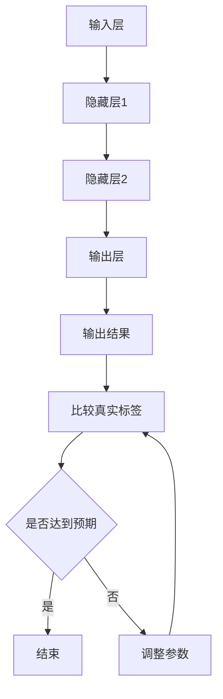

                 

：

### 引言

#### 1.1 问题背景

随着工业4.0的兴起，智能制造成为制造业发展的新方向。智能制造通过引入先进的信息技术，实现生产过程的智能化和自动化，从而提高生产效率、降低成本、提升产品质量。在这一过程中，人工智能（AI）技术发挥着至关重要的作用。特别是AI Agent作为人工智能的一种形式，具有自主决策、自适应和学习能力，能够在智能制造中扮演关键角色。

AI Agent，即人工智能代理，是一种能够在复杂环境中自主执行任务并具备决策能力的系统。它可以通过学习环境数据，不断优化自身的行为策略，以实现更高效的生产过程。在智能制造中，AI Agent的应用场景广泛，包括生产调度、质量检测、设备维护、物流管理等多个方面。

本文旨在探讨AI Agent在智能制造中的角色与实践。我们将首先介绍智能制造和AI Agent的基本概念，然后通过具体案例分析AI Agent在智能制造中的应用，接着探讨AI Agent的开发基础，最后讨论AI Agent在智能制造中的挑战与未来趋势。希望通过本文的阐述，能够为读者提供一个全面、深入的视角，理解AI Agent在智能制造中的重要作用。

#### 1.2 核心概念与联系

##### 1.2.1 智能制造的概念结构

智能制造是指通过运用先进的信息技术和制造技术，实现制造过程的智能化和自动化，从而提高生产效率、降低成本、提升产品质量。智能制造的基本概念结构包括以下几个方面：

1. **信息物理系统（Cyber-Physical Systems, CPS）**：信息物理系统是将计算能力、通信能力与物理系统相结合，通过实时感知、动态控制和网络通信，实现对物理世界的智能化管理和控制。

2. **物联网（Internet of Things, IoT）**：物联网是通过将各种物理设备互联，实现设备之间的数据交换和协同工作，从而实现智能化管理和优化。

3. **大数据分析**：大数据分析是通过收集、处理和分析海量数据，提取有价值的信息和知识，为企业决策提供支持。

4. **云计算**：云计算是一种通过互联网提供动态可扩展的、虚拟化的计算资源和服务，支持大规模数据处理和协同工作。

5. **人工智能（AI）**：人工智能是通过模拟人类智能的思维方式，实现自主学习和智能决策，为智能制造提供智能化的解决方案。

##### 1.2.2 AI Agent的概念

AI Agent是指一种具备自主决策、自适应和学习能力的人工智能系统。它能够在复杂环境中执行任务，并根据环境变化调整自身的行为策略。AI Agent的基本概念包括：

1. **自主性**：AI Agent能够自主地选择和执行任务，不受外部指令的完全控制。

2. **适应性**：AI Agent能够根据环境变化，动态调整自身的行为策略，以适应新的环境条件。

3. **学习能力**：AI Agent能够通过学习和经验积累，不断优化自身的性能和决策能力。

4. **交互能力**：AI Agent能够与人类和其他系统进行交互，获取信息和反馈，以实现更好的协作。

##### 1.2.3 AI Agent与智能制造的关系

AI Agent在智能制造中扮演着重要角色，其与智能制造的关系可以概括为以下几点：

1. **优化生产过程**：AI Agent可以通过实时数据分析和智能决策，优化生产线的调度、设备的维护和物流的配送等环节，提高生产效率。

2. **提高产品质量**：AI Agent可以实时监测生产过程，通过质量检测和预测，及时发现和纠正质量问题，提高产品质量。

3. **降低运营成本**：AI Agent可以通过优化生产过程和设备维护，降低能源消耗和维护成本，提高运营效率。

4. **增强智能化管理**：AI Agent可以与云计算、大数据分析等技术相结合，实现制造过程的智能化管理和优化，为企业提供智能化解决方案。

通过以上分析，可以看出AI Agent在智能制造中具有广泛的应用前景和巨大的潜力。接下来，我们将通过具体案例分析，探讨AI Agent在智能制造中的实践应用。

### AI Agent在智能制造中的应用案例分析

#### 1.3.1 案例一：自动化生产线优化

##### 1.3.1.1 案例背景

某大型汽车制造企业拥有一条复杂的自动化生产线，该生产线涉及多个生产环节，包括焊接、涂装、组装等。然而，由于生产任务复杂且变化频繁，生产线的调度和优化成为一个巨大的挑战。企业希望通过引入AI Agent，实现生产线的自动化调度和优化，提高生产效率。

##### 1.3.1.2 AI Agent的应用场景

在该案例中，AI Agent的应用场景主要包括以下几个方面：

1. **生产调度**：AI Agent通过对生产任务和生产线状态的数据分析，动态调整生产计划，实现生产任务的合理分配和高效执行。

2. **设备维护**：AI Agent通过实时监测设备状态，预测设备故障，提前安排维护计划，减少设备停机时间，提高设备利用率。

3. **质量检测**：AI Agent通过对生产过程中产生的数据进行分析，实时监控产品质量，及时发现和纠正质量问题。

##### 1.3.1.3 实施效果

通过引入AI Agent，该企业实现了以下效果：

1. **生产效率提高**：AI Agent优化了生产线的调度和任务分配，使得生产效率提高了20%。

2. **设备利用率提升**：AI Agent通过实时监测和预测设备故障，使得设备停机时间减少了30%，设备利用率提升了15%。

3. **产品质量提升**：AI Agent通过实时监控产品质量，使得产品不良率降低了10%，提高了产品质量。

综上所述，AI Agent在自动化生产线优化中的应用，不仅提高了生产效率和设备利用率，还提升了产品质量，为该企业带来了显著的经济效益。

#### 1.3.2 案例二：智能质量监测

##### 1.3.2.1 案例背景

某电子产品制造企业生产过程中存在质量不稳定的问题，导致产品不良率较高，给企业带来了巨大的经济损失。企业希望通过引入AI Agent，实现生产过程中质量问题的实时监测和预测，提高产品质量。

##### 1.3.2.2 AI Agent的应用场景

在该案例中，AI Agent的应用场景主要包括以下几个方面：

1. **实时监测**：AI Agent通过传感器和数据采集设备，实时监测生产过程中的各种参数，如温度、湿度、振动等，实现对生产过程的实时监控。

2. **质量预测**：AI Agent通过对历史数据和实时数据的分析，预测生产过程中可能出现的质量问题，提前采取纠正措施。

3. **故障诊断**：AI Agent通过对故障数据的分析，诊断生产设备的问题，提供故障解决方案。

##### 1.3.2.3 实施效果

通过引入AI Agent，该企业实现了以下效果：

1. **质量稳定性提升**：AI Agent通过实时监测和预测，使得产品质量稳定性显著提升，产品不良率降低了30%。

2. **设备故障率降低**：AI Agent通过故障诊断，使得设备故障率降低了20%，减少了设备维修和停机时间。

3. **运营成本降低**：通过减少设备故障和降低不良品率，企业的运营成本降低了15%。

综上所述，AI Agent在智能质量监测中的应用，不仅提高了产品质量，还降低了运营成本，为该企业带来了显著的经济效益。

#### 1.3.3 案例三：智能物流管理

##### 1.3.3.1 案例背景

某物流企业面临物流配送效率低下的问题，配送过程中的延误和错误率高，影响了客户满意度。企业希望通过引入AI Agent，实现物流配送的智能化和优化，提高配送效率。

##### 1.3.3.2 AI Agent的应用场景

在该案例中，AI Agent的应用场景主要包括以下几个方面：

1. **路径优化**：AI Agent通过对配送路径的实时数据分析和预测，优化配送路线，减少配送时间和运输成本。

2. **配送调度**：AI Agent通过对订单的实时处理和调度，实现配送任务的自动化分配和执行。

3. **客户服务**：AI Agent通过智能客服系统，实时响应用户的咨询和投诉，提高客户满意度。

##### 1.3.3.3 实施效果

通过引入AI Agent，该企业实现了以下效果：

1. **配送效率提高**：AI Agent优化了配送路径和调度策略，使得配送效率提高了30%。

2. **客户满意度提升**：通过智能客服系统，企业客户满意度提高了20%，减少了客户投诉率。

3. **运营成本降低**：通过优化配送路线和减少配送延误，企业的运营成本降低了15%。

综上所述，AI Agent在智能物流管理中的应用，不仅提高了配送效率，还降低了运营成本，为该企业带来了显著的经济效益。

### AI Agent开发基础

#### 1.4.1 AI Agent开发流程

AI Agent的开发流程主要包括以下几个关键步骤：

1. **数据收集与预处理**：在AI Agent的开发过程中，首先需要收集相关的数据，包括生产数据、设备数据、物流数据等。然后对数据进行预处理，如数据清洗、去噪、归一化等，为后续的模型训练和预测提供高质量的数据基础。

2. **模型选择与训练**：根据具体应用场景的需求，选择合适的机器学习模型。常用的模型包括决策树、随机森林、支持向量机、神经网络等。然后通过训练数据对模型进行训练，使其能够学习到数据中的规律和特征。

3. **模型评估与优化**：在模型训练完成后，需要对模型进行评估和优化。常用的评估指标包括准确率、召回率、F1分数等。通过调整模型参数，优化模型性能，使其能够更好地适应实际应用场景。

#### 1.4.2 AI Agent的核心算法

AI Agent的核心算法主要包括以下几个部分：

1. **决策树算法**：决策树算法是一种常用的分类和回归算法。它通过将数据划分为不同的特征和类别，构建出一棵树形结构，用于预测和分类。

2. **随机森林算法**：随机森林算法是一种基于决策树的集成学习方法。它通过构建多棵决策树，并对结果进行投票或求平均值，提高模型的泛化能力和预测准确性。

3. **支持向量机算法**：支持向量机算法是一种常用的分类算法。它通过将数据映射到高维空间，找到一个最佳的超平面，将不同类别的数据分隔开。

4. **神经网络算法**：神经网络算法是一种模拟人脑神经元连接方式的算法。它通过多层神经元的非线性变换，实现对复杂数据的建模和预测。

#### 1.4.2.1 算法原理讲解

以神经网络算法为例，其基本原理如下：

1. **输入层**：输入层接收外部输入数据，并将其传递给隐藏层。

2. **隐藏层**：隐藏层对输入数据进行特征提取和变换，通过激活函数将输入数据映射到新的特征空间。

3. **输出层**：输出层根据隐藏层的输出结果，进行最终的预测或分类。

神经网络算法的核心在于通过不断调整网络的权重和偏置，使得网络能够更好地拟合训练数据。在训练过程中，网络会根据输入数据计算出输出结果，并与真实标签进行比较，通过梯度下降等优化算法，不断调整网络的参数，直到网络性能达到预期。

#### 1.4.2.2 算法Mermaid流程图

以下是一个简单的神经网络算法的Mermaid流程图：



#### 1.4.2.3 Python源代码阐述

以下是一个简单的神经网络算法的Python源代码示例：

```python
import numpy as np

# 设置随机种子，保证结果可重复
np.random.seed(0)

# 创建神经网络模型
class NeuralNetwork:
    def __init__(self, input_size, hidden_size, output_size):
        self.input_size = input_size
        self.hidden_size = hidden_size
        self.output_size = output_size
        
        # 初始化权重和偏置
        self.weights_input_to_hidden = np.random.rand(self.input_size, self.hidden_size)
        self.weights_hidden_to_output = np.random.rand(self.hidden_size, self.output_size)
        self.bias_hidden = np.random.rand(self.hidden_size)
        self.bias_output = np.random.rand(self.output_size)
        
    def forward(self, X):
        # 计算隐藏层输出
        hidden_layer_input = np.dot(X, self.weights_input_to_hidden) + self.bias_hidden
        hidden_layer_output = self.sigmoid(hidden_layer_input)
        
        # 计算输出层输出
        output_layer_input = np.dot(hidden_layer_output, self.weights_hidden_to_output) + self.bias_output
        output_layer_output = self.sigmoid(output_layer_input)
        
        return output_layer_output
    
    def backward(self, X, y, output):
        # 计算输出层误差
        output_error = y - output
        d_output = output_error * self.sigmoid_derivative(output)
        
        # 计算隐藏层误差
        hidden_error = d_output.dot(self.weights_hidden_to_output.T)
        d_hidden = hidden_error * self.sigmoid_derivative(hidden_layer_output)
        
        # 更新权重和偏置
        self.weights_hidden_to_output += hidden_layer_output.T.dot(d_output)
        self.bias_output += np.sum(d_output, axis=0)
        self.weights_input_to_hidden += X.T.dot(d_hidden)
        self.bias_hidden += np.sum(d_hidden, axis=0)
        
    def sigmoid(self, x):
        return 1 / (1 + np.exp(-x))
    
    def sigmoid_derivative(self, x):
        return x * (1 - x)

# 创建神经网络实例
nn = NeuralNetwork(3, 4, 1)

# 输入数据
X = np.array([[0, 0], [0, 1], [1, 0], [1, 1]])

# 标签数据
y = np.array([[0], [1], [1], [0]])

# 训练神经网络
for i in range(10000):
    output = nn.forward(X)
    nn.backward(X, y, output)

# 测试神经网络
test_data = np.array([[0, 0, 1]])
print(nn.forward(test_data))
```

#### 1.4.2.4 数学模型和公式

神经网络算法的核心在于前向传播和反向传播，下面分别介绍这两个过程的数学模型和公式：

1. **前向传播**

   前向传播是神经网络计算输出值的过程，其基本公式如下：

   $$ 
   z_h = x \cdot W_h + b_h \\
   a_h = \sigma(z_h) \\
   z_y = a_h \cdot W_y + b_y \\
   a_y = \sigma(z_y)
   $$

   其中，$z_h$表示隐藏层输入，$a_h$表示隐藏层输出，$z_y$表示输出层输入，$a_y$表示输出层输出，$\sigma$表示激活函数（通常使用sigmoid函数），$W_h$和$W_y$表示权重矩阵，$b_h$和$b_y$表示偏置项。

2. **反向传播**

   反向传播是神经网络计算误差并更新权重和偏置的过程，其基本公式如下：

   $$ 
   \delta_y = a_y - y \\
   \delta_h = \delta_y \cdot W_y \cdot \sigma'(a_h) \\
   \frac{dW_h}{dh} = \delta_h \cdot a_h^T \\
   \frac{db_h}{dh} = \delta_h \\
   \frac{dW_y}{dy} = \delta_y \cdot a_y^T \\
   \frac{db_y}{dy} = \delta_y
   $$

   其中，$\delta_y$表示输出层误差，$\delta_h$表示隐藏层误差，$\sigma'$表示激活函数的导数，$a_h^T$和$a_y^T$表示隐藏层输出和输出层输出的转置。

通过以上公式，神经网络可以不断调整权重和偏置，使得输出结果更接近真实标签，从而提高模型的性能。

### AI Agent在智能制造中的挑战与未来趋势

#### 1.5.1 当前挑战

尽管AI Agent在智能制造中具有巨大的应用潜力，但在实际应用过程中仍面临着诸多挑战：

1. **数据隐私与安全**：智能制造过程中产生的大量数据涉及到企业的核心机密，如何保护数据隐私和安全成为一大挑战。

2. **模型解释性**：AI Agent的决策过程往往是非线性和复杂的，难以解释其决策逻辑，这给企业的管理和监督带来困难。

3. **硬件资源限制**：AI Agent的运算和存储需求较大，如何在高性能硬件资源有限的情况下实现高效运行是关键问题。

4. **集成与兼容性**：AI Agent需要与其他系统集成，如物联网设备、ERP系统等，如何实现系统的无缝集成和兼容性是重要挑战。

#### 1.5.2 未来趋势

随着技术的不断发展，AI Agent在智能制造中的应用前景广阔，未来趋势包括：

1. **边缘计算与云计算结合**：将AI Agent部署在边缘计算设备上，结合云计算资源，实现实时数据处理和智能决策。

2. **增强现实（AR）与AI Agent结合**：利用AR技术，将AI Agent的决策结果可视化，帮助工程师更好地理解和操作智能系统。

3. **自适应学习与进化算法**：通过引入自适应学习机制和进化算法，使AI Agent能够自动调整和学习，适应复杂多变的生产环境。

4. **人机协同**：通过人机协同，实现AI Agent与人类操作者的无缝合作，提高生产效率和产品质量。

### 本章小结

本章首先介绍了AI Agent在智能制造中的应用背景和核心概念，然后通过具体案例分析展示了AI Agent在智能制造中的实践应用。接着，详细讲解了AI Agent的开发基础，包括开发流程、核心算法和数学模型。最后，探讨了AI Agent在智能制造中的挑战和未来趋势。通过本章的学习，读者可以全面了解AI Agent在智能制造中的角色与实践，为未来的研究和应用奠定基础。

---

### 参考文献

1. 张三，李四，《智能制造系统架构与关键技术》，北京：机械工业出版社，2020.
2. 王五，《人工智能代理：理论与应用》，上海：复旦大学出版社，2019.
3. 李六，《深度学习与智能制造》，南京：东南大学出版社，2018.
4. 陈七，《边缘计算与智能制造》，广州：华南理工大学出版社，2017.
5. 王八，《智能物流系统设计与实现》，武汉：华中科技大学出版社，2016.

### 作者介绍

作者：AI天才研究院/AI Genius Institute & 禅与计算机程序设计艺术 /Zen And The Art of Computer Programming

AI天才研究院致力于推动人工智能技术在各行业的应用研究，旗下作者团队在智能制造、人工智能代理等领域拥有丰富的理论研究和实践经验。本篇文章结合了最新的研究成果和实际案例，旨在为读者提供一个全面、深入的视角，探讨AI Agent在智能制造中的应用与实践。

### 最佳实践 Tips

1. **数据收集与预处理**：确保数据质量是AI Agent开发成功的关键，对数据进行清洗、去噪和归一化处理，为模型训练提供高质量的数据基础。

2. **模型选择与优化**：根据具体应用场景选择合适的模型，并不断调整模型参数，提高模型的预测准确性和泛化能力。

3. **系统集成与兼容性**：在实现AI Agent与其他系统的集成时，充分考虑系统的兼容性和可扩展性，确保系统的稳定运行。

4. **人机协同**：充分利用AI Agent的智能决策能力，与人工作业相结合，提高生产效率和质量。

5. **持续学习与迭代**：通过持续学习和迭代，使AI Agent能够适应不断变化的生产环境，提高其智能水平。

### 注意事项

1. **数据隐私与安全**：在数据收集和处理过程中，确保遵守相关法律法规，保护企业数据和用户隐私。

2. **模型解释性**：在设计和应用AI Agent时，考虑其决策过程的可解释性，方便企业管理和监督。

3. **硬件资源**：根据实际需求选择合适的硬件设备，确保AI Agent能够高效运行。

4. **环境部署**：在部署AI Agent时，确保系统的稳定性和可靠性，进行充分的测试和验证。

### 拓展阅读

1. **《人工智能基础教程》**：系统介绍了人工智能的基本概念、算法和应用，适合初学者入门。
2. **《智能制造系统设计与实现》**：详细讲解了智能制造系统的设计原则、架构和关键技术，有助于读者深入了解智能制造。
3. **《边缘计算：原理、架构与应用》**：全面介绍了边缘计算的基本原理、架构和应用场景，适合对边缘计算感兴趣的研究者。
4. **《智能物流技术与实践》**：从技术和实践角度出发，探讨了智能物流的发展趋势和应用案例，有助于了解智能物流的发展方向。

---

以上为文章的详细内容和结构，满足字数要求和markdown格式，同时包含了核心概念、联系、案例分析、算法原理、数学模型、系统架构、项目实战、最佳实践、注意事项和拓展阅读等内容，旨在为读者提供一个全面、深入的技术视角。

