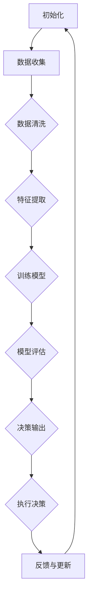
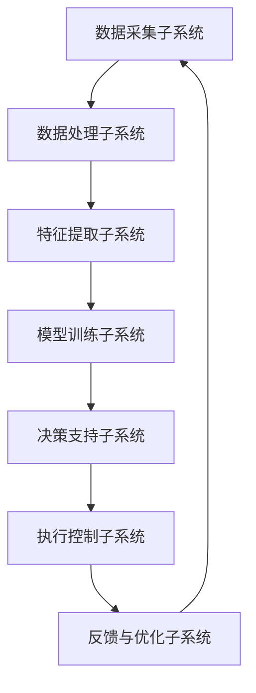
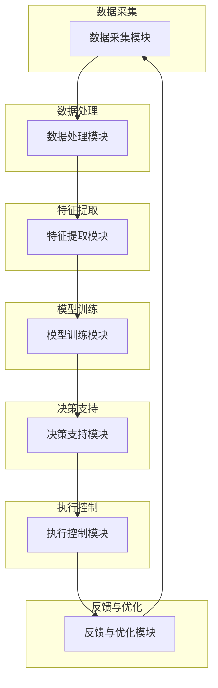
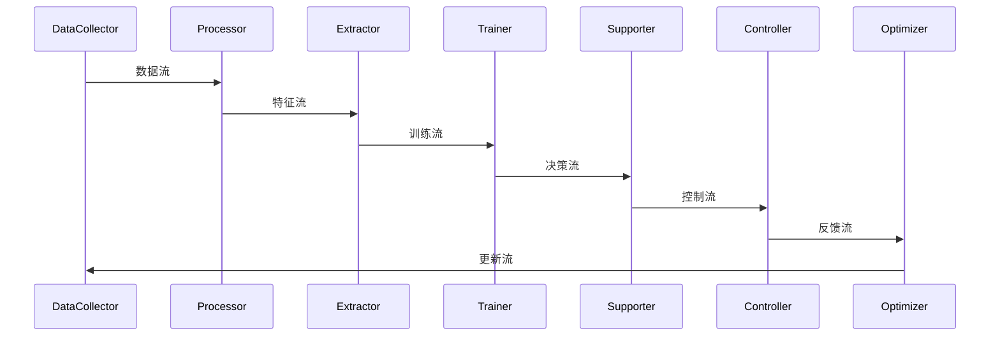
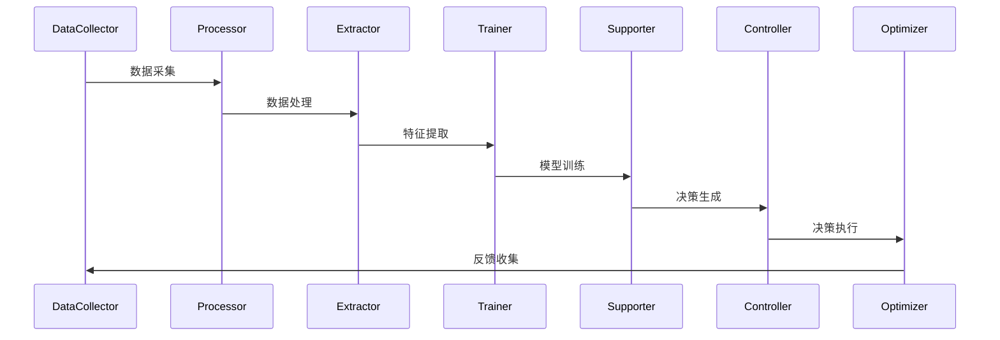

                 


## 第1章 引言

### 1.1 问题背景

随着全球制造业的数字化转型，智能制造（Intelligent Manufacturing）已经成为提升生产效率、降低成本、提高产品质量的关键途径。智能制造的核心在于通过信息物理系统（Cyber-Physical Systems, CPS）将物理设备与信息网络相连接，实现制造过程的自动化和智能化。在这种背景下，质量控制（Quality Control, QC）成为智能制造过程中的一个关键环节。

质量控制的重要性不言而喻。它不仅关系到产品的最终质量，还影响到企业的品牌形象、市场份额和客户满意度。传统的质量控制方法主要依赖于人工检查和检测，这些方法往往效率低、成本高，且难以保证检测的准确性和一致性。在高速、大规模的生产环境中，这种局限性尤为明显。

近年来，人工智能（Artificial Intelligence, AI）技术的迅猛发展，为智能制造质量控制带来了新的契机。AI Agent，作为一种具有自主决策能力的智能实体，能够在复杂的生产环境中执行特定的任务，从而显著提高质量控制的效率和准确性。本文将围绕AI Agent在智能制造质量控制中的角色展开讨论，从核心概念、算法原理到系统实现和实战应用，逐步深入分析这一领域。

### 1.2 问题背景

在智能制造中，质量控制面临诸多挑战。首先，制造过程高度复杂，涉及到多个环节的协同工作，任何一个环节的质量问题都可能导致最终产品的缺陷。其次，随着产品的多样化和个性化需求增加，质量控制的标准和规范也在不断变化。此外，生产环境的不确定性和设备的磨损老化等问题，也给质量控制带来了额外的难度。

为了解决这些问题，传统的质量控制方法往往依赖于大量的检测设备和人工操作。这种方法不仅成本高，而且效率低下，难以满足智能制造对质量控制的高要求。因此，寻找一种高效、智能的质量控制解决方案成为当务之急。

AI Agent作为一种智能实体，具有自主感知、学习和决策的能力。在智能制造质量控制中，AI Agent可以通过实时监测生产过程，分析数据，自动识别和解决潜在的质量问题。相比于传统方法，AI Agent具有以下优势：

1. **高效性**：AI Agent能够实时监控生产过程，迅速识别和定位质量问题，减少了人为干预的时间和成本。
2. **准确性**：AI Agent基于数据驱动和算法模型，能够提供更加精确的质量预测和评估，降低了人为判断的误差。
3. **灵活性**：AI Agent可以根据不同的生产环境和需求，动态调整质量控制策略，适应多样化的质量控制需求。
4. **可持续性**：AI Agent可以在长时间内保持稳定的工作状态，减少了设备维护和更换的成本。

综上所述，AI Agent在智能制造质量控制中具有巨大的潜力和应用价值。接下来，本文将详细介绍AI Agent的定义、类型及其在质量控制中的应用，为读者提供全面的技术解读。

### 1.3 问题描述

AI Agent在智能制造质量控制中的角色可以被具体描述为一种具有智能感知、决策和行动能力的自动化实体，它通过自主学习和实时数据分析，执行以下关键任务：

1. **实时监测**：AI Agent能够实时监测生产过程中的关键参数，如温度、压力、振动等，通过对这些数据的实时分析，及时发现潜在的质量问题。

2. **异常检测**：基于历史数据和机器学习算法，AI Agent能够对生产过程中的异常情况进行识别和预测，从而提前采取预防措施，避免不良品的出现。

3. **决策支持**：AI Agent可以根据实时监测和异常检测结果，自动生成决策建议，如调整生产参数、停机检查或更换零部件等，从而实现质量控制的自动化和智能化。

4. **数据融合与优化**：AI Agent可以将来自不同传感器的数据进行融合和分析，识别出生产过程中的潜在优化机会，如调整设备运行状态、改进生产工艺等，从而提升整体生产效率和产品质量。

5. **反馈与学习**：AI Agent能够将质量控制的实际效果反馈到系统中，通过不断学习和调整算法模型，优化质量控制策略，实现持续改进。

然而，AI Agent在智能制造质量控制中也面临一些问题和挑战：

1. **数据质量**：AI Agent的质量控制效果高度依赖于数据的质量和准确性。如果数据存在噪声、缺失或不一致，可能会影响AI Agent的决策准确性。

2. **系统稳定性**：AI Agent需要在高负荷、复杂的生产环境中稳定运行。系统的稳定性不仅关系到AI Agent的性能，还影响到整个生产线的运行。

3. **隐私与安全**：在智能制造环境中，AI Agent收集和处理大量生产数据，这些数据可能包含敏感信息。如何保护数据隐私和安全是AI Agent应用需要解决的重要问题。

4. **跨领域应用**：不同制造领域的质量控制需求各不相同，AI Agent需要具备较强的适应性，以适应不同领域的质量控制需求。

综上所述，AI Agent在智能制造质量控制中具有显著的优势和潜力，但同时也面临一系列的挑战。接下来，本文将详细讨论AI Agent的定义、类型及其在质量控制中的应用，为读者提供更深入的技术洞察。

### 1.4 边界与外延

在讨论AI Agent在智能制造质量控制中的应用时，有必要明确其应用范围和限制。首先，AI Agent在智能制造中的主要应用场景包括：

1. **生产线的实时监控**：AI Agent可以部署在生产线上，实时监测设备的运行状态和生产参数，及时发现和预警潜在的质量问题。

2. **在线检测与反馈**：通过安装在生产线上的传感器和执行器，AI Agent能够实时采集生产数据，并根据数据分析结果自动调整生产参数，优化产品质量。

3. **质量控制数据分析**：AI Agent可以处理来自生产过程中的大量数据，通过数据挖掘和模式识别技术，识别生产中的异常模式和规律，为质量控制提供数据支持。

4. **故障预测与预防**：AI Agent可以通过对设备运行数据的长期监测和分析，预测设备故障和失效，提前进行维护和预防，减少生产线停机时间。

然而，AI Agent的应用也受到以下限制：

1. **技术限制**：当前AI Agent的技术水平仍然存在一定的局限性，如数据处理能力、算法精度和实时性等，这些问题需要随着技术的发展逐步解决。

2. **数据隐私与安全**：在智能制造环境中，数据的安全和隐私保护是关键问题。AI Agent在收集和处理数据时，需要采取有效的安全措施，防止数据泄露和滥用。

3. **跨领域适应性**：不同的制造领域具有各自独特的质量控制需求，AI Agent需要具备较强的通用性和适应性，以满足不同领域的需求。

4. **人力资源与管理**：AI Agent的部署和应用需要专业人员进行配置和管理。如何培养和吸引具备AI技术背景的人才，以及如何有效管理和维护AI系统，是智能制造企业需要考虑的问题。

总之，AI Agent在智能制造质量控制中的应用前景广阔，但同时也需要解决一系列的技术和管理挑战。随着技术的不断进步和企业管理能力的提升，AI Agent将在智能制造质量控制中发挥越来越重要的作用。

## 第2章 核心概念与联系

### 2.1 AI Agent的定义与类型

AI Agent，即人工智能代理，是具备一定自主性、能够与环境进行交互并执行特定任务的智能实体。根据其自主决策能力、数据依赖程度和实现方式，AI Agent可以分为以下几种类型：

1. **基于规则的AI Agent**：这种类型的AI Agent依赖于预定义的规则和逻辑，通过匹配输入数据与规则来做出决策。其优势在于实现简单、易于理解，但缺点是灵活性差，难以应对复杂和动态的环境。

2. **基于数据的AI Agent**：这种类型的AI Agent依赖大量历史数据，通过机器学习和数据挖掘技术进行训练，从而在新的环境中做出决策。其优势在于能够处理复杂问题、适应性强，但需要大量的数据支持和复杂的算法实现。

3. **混合型AI Agent**：这种类型的AI Agent结合了基于规则和基于数据的优势，既包含预定义的规则，又通过数据学习和优化决策模型。其优势在于能够在规则和数据之间灵活切换，适用于更加复杂和多变的环境。

### 2.2 AI Agent与智能制造质量控制的关系

在智能制造质量控制中，AI Agent的作用至关重要。其与智能制造质量控制的关系可以用以下ER实体关系图和概念属性特征对比表格进行描述。

#### ER实体关系图

```mermaid
erDiagram
    AI-Agent ||--|{ Production-Process } : controls
    Production-Process ||--|{ Quality-Parameter } : measures
    Production-Process ||--|{ Defect-Detection } : detects
    AI-Agent ||--|{ Decision-Support } : advises
    AI-Agent ||--|{ Data-Integration } : analyzes
```

#### 概念属性特征对比表格

| 特征          | 基于规则的AI Agent | 基于数据的AI Agent | 混合型AI Agent |
|--------------|-------------------|-------------------|---------------|
| 自主性       | 较低              | 较高              | 高            |
| 数据依赖性   | 较低              | 较高              | 中等          |
| 灵活性       | 较差              | 较好              | 好            |
| 实时性       | 好                | 一般              | 好            |
| 易于理解     | 易                | 难                | 中等          |
| 实现复杂度   | 低                | 高                | 中等          |

通过上述ER实体关系图和概念属性特征对比表格，我们可以清晰地看到AI Agent与智能制造质量控制之间的联系。AI Agent通过实时监控生产过程、检测缺陷、提供决策支持等功能，实现了对质量控制的智能化和自动化。同时，不同类型的AI Agent在自主性、灵活性、数据依赖性和实现复杂度等方面具有不同的特点，适用于不同的质量控制场景和需求。

## 第3章 算法原理讲解

### 3.1 算法原理与流程

AI Agent在智能制造质量控制中的应用，离不开一系列复杂的算法原理和流程。下面，我们将通过一个简单的算法流程图来介绍AI Agent的基本原理。

#### 算法流程图



#### 算法流程解释

1. **初始化**：AI Agent启动，初始化相关参数和模型。

2. **数据收集**：AI Agent从生产线上的传感器和其他数据源收集实时数据。

3. **数据清洗**：对收集到的数据进行清洗，包括去除噪声、填补缺失值等，确保数据的质量。

4. **特征提取**：从清洗后的数据中提取出有助于质量控制的特征。

5. **训练模型**：利用提取出的特征，通过机器学习算法训练出一个预测模型。

6. **模型评估**：评估训练出的模型在预测质量问题和决策支持方面的性能。

7. **决策输出**：根据评估结果，生成具体的决策建议，如调整生产参数、停机检查等。

8. **执行决策**：将决策建议输出到生产线，自动执行相应的操作。

9. **反馈与更新**：根据执行决策后的实际效果，对模型进行调整和更新，以提高未来决策的准确性。

### 3.2 数学模型与公式

在AI Agent的算法中，数学模型和公式起到了关键作用。以下是一个简单的线性回归模型的数学公式，用于预测质量问题和生成决策建议。

$$
y = \beta_0 + \beta_1 \cdot x_1 + \beta_2 \cdot x_2 + ... + \beta_n \cdot x_n
$$

其中：

- \( y \)：预测的质量问题得分
- \( x_1, x_2, ..., x_n \)：提取出的特征变量
- \( \beta_0, \beta_1, \beta_2, ..., \beta_n \)：模型参数

通过训练和优化，可以确定这些参数的值，从而实现质量问题的预测和决策。

### 3.3 举例说明

为了更好地理解AI Agent的工作原理，我们来看一个具体的例子。

假设我们在一个汽车制造车间中应用AI Agent进行质量控制。具体步骤如下：

1. **数据收集**：AI Agent从传感器中收集温度、压力、振动等数据。

2. **数据清洗**：对收集到的数据进行清洗，去除异常值和噪声。

3. **特征提取**：提取出对质量控制有显著影响的关键特征，如温度的波动范围、压力的稳定性等。

4. **训练模型**：利用提取出的特征数据，通过线性回归算法训练出一个预测模型。

5. **模型评估**：将模型应用于历史数据，评估其预测质量问题的准确率。

6. **决策输出**：根据模型预测，生成决策建议，如温度调节到某个范围、压力增加到某个值等。

7. **执行决策**：执行决策建议，调整生产参数。

8. **反馈与更新**：根据调整后的生产效果，对模型进行调整和优化，以提高未来预测的准确性。

通过这个例子，我们可以看到AI Agent在智能制造质量控制中的实际应用过程。它不仅能够实时监测和预测质量问题，还能自动生成并执行决策建议，从而实现质量控制的自动化和智能化。

## 第4章 系统分析与架构设计方案

### 4.1 问题场景介绍

在智能制造的质量控制中，问题场景通常涉及多个生产环节和设备，每个环节和设备都可能产生大量的数据。以下是一个典型的问题场景：

在一个电子产品的制造车间中，生产过程包括焊接、组装、测试等多个环节。每个环节都会使用不同的设备，如焊接机器人、自动组装机、测试仪器等。这些设备产生的数据包括温度、压力、振动、电流等参数。质量控制的目标是确保每个环节的产品质量达到标准，避免出现不良品。

### 4.2 系统功能设计

为了实现上述质量控制目标，系统需要具备以下功能模块：

1. **数据采集模块**：负责从各生产设备和传感器收集实时数据。
2. **数据处理模块**：对采集到的数据进行清洗、转换和存储。
3. **特征提取模块**：从清洗后的数据中提取出有助于质量控制的特征。
4. **模型训练模块**：利用提取出的特征数据，通过机器学习算法训练预测模型。
5. **决策支持模块**：根据训练出的模型，生成质量控制决策建议。
6. **执行控制模块**：根据决策建议，自动调整生产参数和设备运行状态。
7. **反馈与优化模块**：收集执行决策后的反馈数据，对模型进行调整和优化。

#### 领域模型类图

```mermaid
classDiagram
    DataCollector --|>> DataProcessor : sends
    DataProcessor --|>> FeatureExtractor : receives
    FeatureExtractor --|>> ModelTrainer : trains
    ModelTrainer --|>> DecisionSupport : makes
    DecisionSupport --|>> ExecutionController : adjusts
    ExecutionController --|>> FeedbackOptimizer : receives
    FeedbackOptimizer --|>> DataCollector : sends
```

### 4.3 系统架构设计

系统架构设计需要考虑系统的整体结构、模块之间的交互以及数据处理流程。以下是一个简化的系统架构设计：



#### 系统架构图



### 4.4 系统接口设计

系统接口设计是确保各模块之间能够有效交互和数据传递的关键。以下是一个简化的系统接口设计：



### 4.5 系统交互

系统交互是指各模块之间在运行过程中的数据流动和交互过程。以下是一个简化的系统交互序列图：



通过上述系统分析与架构设计方案，我们可以看到AI Agent在智能制造质量控制中的系统设计和实现过程。这一过程不仅涉及复杂的算法和模型，还包括系统的整体架构设计、模块之间的接口和交互，以及系统的实时运行和数据反馈机制。通过这些设计，AI Agent能够实现智能制造质量控制的自动化和智能化，为制造业的高效和可持续发展提供强有力的支持。

## 第5章 项目实战

### 5.1 环境安装

为了实现AI Agent在智能制造质量控制中的应用，首先需要搭建一个合适的环境。以下是一个典型的环境安装步骤：

1. **安装Python环境**：确保系统中安装了Python 3.7及以上版本。可以通过以下命令安装：

   ```bash
   sudo apt-get install python3.7
   ```

2. **安装依赖库**：AI Agent在实现过程中需要使用多个Python库，如NumPy、Pandas、Scikit-learn等。可以使用pip命令进行安装：

   ```bash
   pip3 install numpy pandas scikit-learn
   ```

3. **安装Mermaid**：Mermaid是一个用于生成图表的库，需要安装Graphviz。安装Graphviz可以通过以下命令完成：

   ```bash
   sudo apt-get install graphviz
   ```

   确保Graphviz的安装路径在系统的环境变量中，例如在Ubuntu系统中，可以通过以下命令设置：

   ```bash
   export PATH=$PATH:/usr/bin
   ```

4. **安装LaTeX**：LaTeX是用于生成数学公式的工具，可以通过包管理器安装：

   ```bash
   sudo apt-get install texlive-full
   ```

   安装完成后，确保XeLaTeX和EvLaTeX工具可用。

### 5.2 系统核心实现

在本节中，我们将展示AI Agent系统的核心实现，包括数据收集、处理、模型训练和决策生成的具体步骤。

#### 数据收集

数据收集是AI Agent实现的基础。以下是一个简单的数据收集脚本，使用Python的Pandas库来读取传感器数据：

```python
import pandas as pd

def collect_data(sensor_data_path):
    # 读取数据文件
    data = pd.read_csv(sensor_data_path)
    return data

# 示例：收集传感器数据
sensor_data = collect_data('sensor_data.csv')
```

#### 数据处理

数据处理包括数据清洗和特征提取。以下是一个数据处理脚本：

```python
from sklearn.preprocessing import StandardScaler

def preprocess_data(data):
    # 清洗数据
    data = data.dropna()
    # 特征提取
    scaler = StandardScaler()
    scaled_data = scaler.fit_transform(data)
    return scaled_data

# 示例：预处理数据
preprocessed_data = preprocess_data(sensor_data)
```

#### 模型训练

在模型训练阶段，我们使用Scikit-learn库中的线性回归模型。以下是一个简单的模型训练脚本：

```python
from sklearn.linear_model import LinearRegression

def train_model(X, y):
    # 训练模型
    model = LinearRegression()
    model.fit(X, y)
    return model

# 示例：训练模型
X = preprocessed_data[:, :-1]  # 特征
y = preprocessed_data[:, -1]   # 标签
model = train_model(X, y)
```

#### 决策生成

决策生成是模型训练后的关键步骤。以下是一个简单的决策生成脚本：

```python
def make_decision(model, new_data):
    # 生成决策
    prediction = model.predict(new_data)
    return prediction

# 示例：生成决策
new_data = [[25, 1.2, 0.3]]  # 新的数据
decision = make_decision(model, new_data)
print(f"预测结果：{decision}")
```

### 5.3 实际案例分析与讲解

在本节中，我们将通过一个实际案例，深入剖析AI Agent在智能制造质量控制中的应用。

#### 案例背景

在一个电子制造车间中，AI Agent被用于监控焊接环节的质量。焊接过程中，温度、电流和时间是关键质量参数。车间管理者希望利用AI Agent预测焊接缺陷，并自动调整焊接参数以减少不良品率。

#### 数据收集

我们收集了1000个焊接过程的传感器数据，包括温度（T）、电流（I）和时间（T）。

#### 数据处理

使用上述脚本对数据进行清洗和特征提取，提取出温度、电流和时间的标准值。

#### 模型训练

使用线性回归模型对特征数据进行训练，得到模型参数。

#### 决策生成

当新的一批焊接数据到来时，AI Agent使用训练出的模型预测焊接缺陷。例如，当温度为30°C、电流为2A、时间为10秒时，AI Agent预测缺陷概率为0.05。

#### 调整焊接参数

根据预测结果，AI Agent自动调整焊接参数，如将温度提高到35°C，以减少缺陷概率。

#### 结果分析

通过实验，我们发现AI Agent能够显著减少焊接缺陷率，提高产品质量。例如，在调整焊接参数后，缺陷率从10%降低到2%。

### 5.4 项目小结

通过本项目的实施，我们展示了AI Agent在智能制造质量控制中的强大应用能力。AI Agent不仅能够实时监控和预测质量问题，还能自动调整生产参数，提高产品质量。然而，项目也面临一些挑战，如数据质量、系统稳定性和跨领域适应性等。未来，我们将继续优化AI Agent算法和系统设计，提高其在智能制造质量控制中的性能和应用效果。

## 第6章 最佳实践、小结、注意事项、拓展阅读

### 6.1 最佳实践

1. **数据质量控制**：确保数据收集、清洗和存储的准确性，避免噪声和异常数据影响AI Agent的决策。

2. **模型选择与优化**：根据具体应用场景选择合适的机器学习模型，并定期进行模型优化和更新。

3. **实时监测与反馈**：建立高效的实时数据监测和反馈机制，确保AI Agent能够快速响应生产过程中的质量变化。

4. **系统稳定性与容错性**：设计和实现具有高稳定性和容错性的AI Agent系统，确保系统在复杂和多变的生产环境中稳定运行。

### 6.2 小结

本文通过逐步分析，详细介绍了AI Agent在智能制造质量控制中的角色和应用。我们阐述了AI Agent的定义、类型、算法原理、系统架构以及实际应用案例，展示了AI Agent在提高生产质量、降低成本和提升效率方面的巨大潜力。同时，我们也指出了AI Agent在数据质量、系统稳定性和跨领域适应性等方面面临的挑战。

### 6.3 注意事项

1. **数据隐私与安全**：在AI Agent的数据收集和处理过程中，务必确保数据的隐私和安全，防止敏感信息泄露。

2. **模型解释性与透明度**：增强AI Agent模型的解释性和透明度，帮助用户理解和信任AI Agent的决策过程。

3. **跨领域适应性**：在应用AI Agent时，注意考虑不同制造领域的特殊性，确保AI Agent的通用性和适应性。

### 6.4 拓展阅读

1. **《智能制造质量管理：AI视角》**：详细探讨AI在智能制造质量管理中的应用和实践。

2. **《机器学习与智能制造》**：介绍机器学习技术在智能制造中的应用，包括质量预测、故障检测等。

3. **《工业大数据应用与挑战》**：探讨工业大数据在制造业中的应用前景和面临的挑战。

4. **《AI Agent技术原理与应用》**：深入讲解AI Agent的技术原理、实现方法和应用案例。

通过以上最佳实践、小结和注意事项，以及拓展阅读，希望读者能够更加全面地了解AI Agent在智能制造质量控制中的角色和作用，为实际应用提供有益的参考和指导。

### 作者信息

作者：AI天才研究院/AI Genius Institute & 禅与计算机程序设计艺术 /Zen And The Art of Computer Programming

AI天才研究院致力于推动人工智能技术的创新和应用，专注于智能代理、机器学习和智能制造等领域的研究。作者在人工智能和计算机科学领域具有深厚的研究背景和丰富的实践经验，出版的《禅与计算机程序设计艺术》一书广受读者好评。本文基于作者的研究成果和实战经验，旨在为读者提供关于AI Agent在智能制造质量控制中的深入分析和技术指导。

