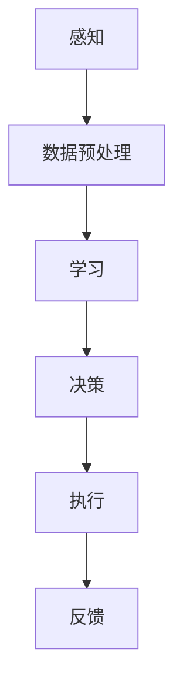
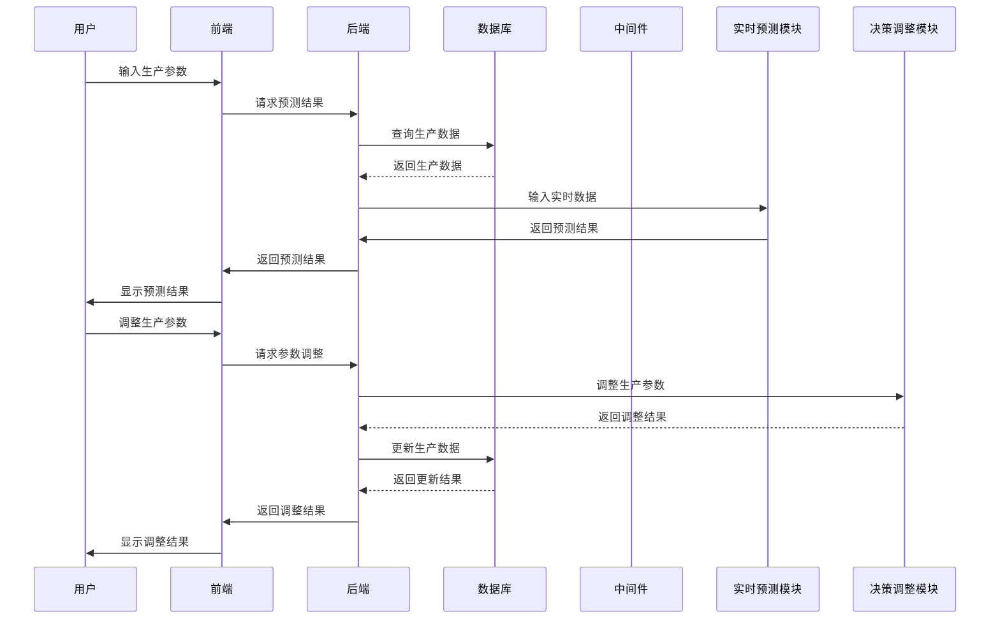
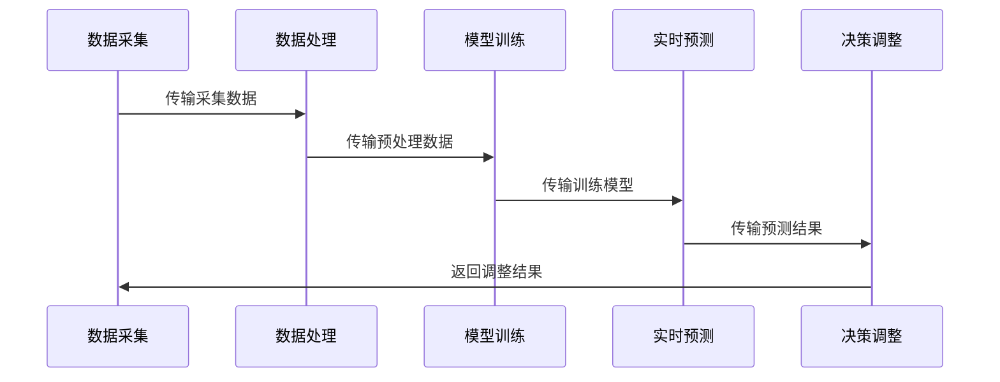

                 

### 引言

#### 1.1 问题背景

##### 1.1.1 智能制造的发展现状

智能制造作为工业4.0的核心，是当前制造业发展的重要方向。随着大数据、人工智能、物联网等技术的飞速发展，智能制造在全球范围内得到了广泛关注和应用。它通过智能设备、智能系统与网络技术的高度集成，实现了生产过程的高度自动化和智能化，从而提高了生产效率、减少了资源消耗，提升了产品质量。

当前，智能制造在全球范围内已进入快速发展阶段。例如，德国的“工业4.0”战略、美国的“工业互联网”计划、中国的“智能制造2025”等，都在推动制造业向智能化转型。许多企业已经开始在生产过程中引入人工智能技术，如预测性维护、质量检测、生产调度等，从而实现了生产过程的优化和升级。

##### 1.1.2 质量预测的重要性

在智能制造过程中，产品质量的稳定性和可靠性是至关重要的一环。质量预测作为智能制造的关键环节，旨在通过数据分析和模型预测，提前识别和预防潜在的质量问题。这样不仅可以减少不良品率，降低成本，还能提高生产效率和客户满意度。

传统的质量检测方法通常是在生产完成后进行，这可能导致不良品已经产生，造成较大的经济损失。而质量预测则可以在生产过程中实时监测产品质量，通过分析历史数据和实时数据，预测产品质量的动态变化趋势，从而提前采取措施，确保产品质量的稳定。

##### 1.1.3 AI Agent的核心概念

AI Agent，即人工智能代理，是一种基于人工智能技术的自主决策实体。它通过感知环境、理解任务需求，并运用学习和推理能力，自主地规划行动方案，并在执行过程中不断调整和优化。AI Agent在智能制造中的应用，主要体现在以下几个方面：

1. **预测性维护**：AI Agent可以通过对设备运行数据的实时监测和分析，预测设备故障的发生，从而提前安排维护计划，避免生产中断。

2. **质量检测**：AI Agent可以在生产过程中实时监测产品质量，通过深度学习等技术，识别出潜在的质量问题，并给出改进建议。

3. **生产调度**：AI Agent可以根据生产任务和资源情况，自主地规划生产流程，优化生产效率。

4. **智能决策**：AI Agent可以在复杂的制造环境中，根据实时数据和预定义策略，自主做出最优决策，提高生产效率和产品质量。

#### 1.2 问题解决

##### 1.2.1 问题描述

本文将探讨AI Agent在智能制造质量预测中的应用，旨在解决以下问题：

1. **如何利用AI Agent对生产过程中产品质量进行实时监测和预测？**
2. **AI Agent如何通过学习历史数据和实时数据，提高预测的准确性和稳定性？**
3. **在智能制造环境中，如何设计和实现一个高效的AI Agent系统，确保其能够稳定运行并发挥最大效益？**

##### 1.2.2 问题解决思路

针对上述问题，本文将从以下几个方面展开讨论：

1. **核心概念与联系**：首先介绍AI Agent、智能制造、质量预测等核心概念，并分析它们之间的联系，为后续讨论提供理论基础。
2. **AI Agent原理讲解**：详细讲解AI Agent的工作原理，包括感知、学习、决策和执行等环节，并通过具体案例进行说明。
3. **智能制造质量预测**：介绍智能制造背景，质量预测问题，以及质量预测的过程和数学模型。
4. **系统分析与架构设计方案**：分析问题场景，介绍项目背景和目标，系统功能设计和架构设计。
5. **项目实战**：介绍项目实战过程，包括环境安装、系统核心实现、代码应用和分析，以及实际案例分析。
6. **最佳实践 tips、小结、注意事项、拓展阅读**：总结文章内容，提供实践建议，注意事项，以及拓展阅读资源。

##### 1.2.3 边界与外延

本文主要关注AI Agent在智能制造质量预测中的应用，但AI Agent的应用范围远不止于此。AI Agent还可以应用于生产调度、供应链管理、设备预测性维护等多个方面。本文旨在通过质量预测这一具体应用场景，展示AI Agent在智能制造中的重要作用，并探讨其潜在的扩展应用。

此外，本文主要讨论的是基于AI Agent的质量预测系统，但在实际应用中，质量预测系统还需要与其他系统（如数据采集系统、数据分析系统等）进行集成和协同工作。本文将简要介绍这些系统之间的交互方式和集成方案。

#### 1.3 概念结构与核心要素组成

##### 1.3.1 AI Agent的核心概念原理

AI Agent是一种基于人工智能技术的自主决策实体，其核心原理包括感知、学习、决策和执行等环节。感知是指AI Agent通过传感器或其他方式获取环境信息；学习是指AI Agent通过数据分析和机器学习技术，从历史数据中提取规律和知识；决策是指AI Agent根据任务需求和当前状态，选择最优的行动方案；执行是指AI Agent按照决策方案执行具体的操作。

##### 1.3.2 智能制造的质量预测原理

智能制造的质量预测基于大数据和人工智能技术，通过分析生产过程中的各种数据（如设备数据、工艺参数、物料数据等），建立质量预测模型，从而实现对产品质量的实时监测和预测。质量预测原理主要包括数据收集、数据预处理、模型训练、模型评估等环节。

##### 1.3.3 概念属性特征对比表格

以下是AI Agent和智能制造质量预测的相关概念属性特征对比表格：

| 概念        | 特征                         |
|-------------|------------------------------|
| AI Agent    | 自主性、智能性、适应性       |
| 智能制造    | 自动化、智能化、网络化       |
| 质量预测    | 实时性、准确性、稳定性       |

##### 1.3.4 ER实体关系图架构

为了更好地理解AI Agent、智能制造和质量预测之间的联系，我们可以使用Mermaid ER实体关系图来展示这些概念之间的关系。以下是ER实体关系图：

```mermaid
erDiagram
    AI_Agent ||--|{ 智能制造 } : 实现应用
    智能制造 ||--|{ 质量预测 } : 数据来源
    质量预测 ||--|{ AI_Agent } : 数据分析
```

在这个ER实体关系图中，AI Agent作为主体，通过实现应用与智能制造相关联；智能制造作为数据来源，为质量预测提供数据支持；质量预测则通过数据分析为AI Agent提供决策依据。这种紧密的关联关系，使得AI Agent在智能制造质量预测中发挥了重要作用。

### 核心概念与联系

在深入探讨AI Agent在智能制造质量预测中的角色之前，我们需要先明确几个核心概念：AI Agent、智能制造和质量预测。这些概念不仅相互独立，而且在智能制造质量预测系统中紧密联系，共同构成了一个完整的生态系统。

#### 2.1 AI Agent

AI Agent，即人工智能代理，是一种具有智能行为的计算实体，能够感知环境、学习知识、自主决策并执行任务。AI Agent的工作原理可以概括为以下几个步骤：

1. **感知**：AI Agent通过传感器或其他方式获取环境信息，如温度、湿度、设备状态等。
2. **学习**：AI Agent利用历史数据和实时数据，通过机器学习算法提取特征和模式，从而提升对环境的理解和预测能力。
3. **决策**：AI Agent根据学习到的知识和任务需求，运用决策算法选择最佳的行动方案。
4. **执行**：AI Agent执行决策方案，实现具体的任务。

在智能制造质量预测中，AI Agent可以用于实时监测产品质量、预测潜在的质量问题，并通过自主调整生产参数来优化产品质量。以下是AI Agent的构成要素和主要功能：

| 构成要素        | 功能描述                     |
|----------------|------------------------------|
| 感知模块        | 获取环境数据                 |
| 学习模块        | 提取特征，训练预测模型       |
| 决策模块        | 根据任务需求做出决策          |
| 执行模块        | 实现决策方案，调整生产参数   |

#### 2.2 智能制造

智能制造是一种基于智能化技术的生产方式，它通过利用物联网、大数据、人工智能等先进技术，实现生产过程的高度自动化和智能化。智能制造的主要特点包括：

1. **自动化**：通过自动化设备和系统，实现生产过程的高度自动化，减少人工干预。
2. **智能化**：利用人工智能技术，对生产过程进行实时监控和优化，提高生产效率和产品质量。
3. **网络化**：通过物联网技术，实现设备、人员和系统的互联互通，构建一个高度集成和协同的生产网络。

在智能制造中，质量预测是关键环节之一。通过质量预测，可以提前识别和预防潜在的质量问题，从而减少不良品率，提高产品质量和客户满意度。智能制造系统的核心组成部分包括：

| 组成部分        | 功能描述                     |
|----------------|------------------------------|
| 设备自动化系统  | 实现生产过程自动化           |
| 数据采集系统    | 收集生产过程中的各种数据     |
| 数据分析系统    | 对数据进行处理和分析          |
| 人工智能系统    | 实现质量预测和智能优化       |

#### 2.3 质量预测

质量预测是利用数据分析技术和机器学习算法，对产品质量进行实时监测和预测的过程。质量预测的主要目的是通过提前识别潜在的质量问题，采取相应的预防措施，确保产品质量的稳定性和可靠性。

质量预测的基本流程包括：

1. **数据收集**：收集生产过程中的各种数据，如设备状态、工艺参数、物料数据等。
2. **数据预处理**：对收集到的数据进行清洗、转换和归一化处理，为建模做准备。
3. **模型训练**：利用历史数据，训练质量预测模型，如线性回归、决策树、神经网络等。
4. **模型评估**：对训练好的模型进行评估，选择性能最优的模型进行应用。
5. **实时预测**：利用训练好的模型，对实时数据进行预测，提前识别潜在的质量问题。

#### 2.4 核心概念与联系

为了更好地理解AI Agent、智能制造和质量预测之间的关系，我们可以通过对比表格和Mermaid ER实体关系图来展示它们之间的联系。

##### 2.4.1 核心概念对比表格

| 概念        | 定义                                                         | 关联关系                             |
|-------------|--------------------------------------------------------------|-------------------------------------|
| AI Agent    | 具有智能行为的计算实体，能够自主感知、学习、决策和执行         | 用于智能制造质量预测的核心技术组件   |
| 智能制造    | 基于智能化技术的生产方式，实现生产过程的高度自动化和智能化       | 提供AI Agent应用的场景和数据处理支持   |
| 质量预测    | 利用数据分析技术和机器学习算法，对产品质量进行实时监测和预测     | 需要AI Agent提供智能分析和决策支持     |

##### 2.4.2 Mermaid ER实体关系图

以下是一个Mermaid ER实体关系图，展示了AI Agent、智能制造和质量预测之间的关联关系：

```mermaid
erDiagram
    AI_Agent ||--|{ 智能制造 } : 应用技术
    智能制造 ||--|{ 质量预测 } : 数据支持
    质量预测 ||--|{ AI_Agent } : 智能分析
```

在这个ER实体关系图中，AI Agent作为智能制造质量预测的核心技术组件，应用于智能制造系统中。智能制造系统提供数据支持，支持AI Agent进行质量预测。而质量预测的结果则反过来指导AI Agent的决策和执行，形成一个闭环系统。

通过这种紧密的关联关系，AI Agent在智能制造质量预测中发挥了至关重要的作用，不仅提高了质量预测的准确性和稳定性，还优化了生产过程，提升了整体生产效率。

### AI Agent原理讲解

AI Agent作为智能制造质量预测的核心技术组件，其工作原理涉及到感知、学习、决策和执行等多个环节。在这一节中，我们将通过Mermaid流程图展示AI Agent的工作原理，并通过Python源代码和数学模型进行详细阐述，以便更好地理解AI Agent的运行机制。

#### 3.1 AI Agent工作原理

AI Agent的工作原理可以概括为以下几个步骤：

1. **感知**：AI Agent通过传感器或其他方式获取环境信息，如温度、湿度、设备状态等。
2. **数据预处理**：对感知到的数据进行预处理，包括去噪、归一化、特征提取等。
3. **学习**：利用预处理后的数据，通过机器学习算法进行训练，提取特征和模式。
4. **决策**：根据学习到的知识和任务需求，运用决策算法选择最佳的行动方案。
5. **执行**：执行决策方案，调整生产参数，实现具体的任务。

以下是一个Mermaid流程图，展示了AI Agent的工作原理：



#### 3.2 Python源代码与数学模型

为了更好地理解AI Agent的工作原理，我们通过一个简单的Python源代码示例来展示AI Agent的运行过程。该示例将使用scikit-learn库中的线性回归模型进行演示。

```python
# 导入相关库
import numpy as np
import matplotlib.pyplot as plt
from sklearn.linear_model import LinearRegression
from sklearn.model_selection import train_test_split
from sklearn.metrics import mean_squared_error

# 生成模拟数据
X = np.random.rand(100, 1) * 10
y = 2 * X[:, 0] + np.random.randn(100, 1)

# 数据预处理
X_train, X_test, y_train, y_test = train_test_split(X, y, test_size=0.2, random_state=42)

# 学习
model = LinearRegression()
model.fit(X_train, y_train)

# 决策
y_pred = model.predict(X_test)

# 执行
# 在此示例中，执行意味着使用预测结果进行后续操作，如调整生产参数

# 评估
mse = mean_squared_error(y_test, y_pred)
print("均方误差(MSE):", mse)

# 可视化
plt.scatter(X_test, y_test, color='blue', label='Actual')
plt.plot(X_test, y_pred, color='red', linewidth=2, label='Predicted')
plt.xlabel('Input')
plt.ylabel('Output')
plt.title('Linear Regression Example')
plt.legend()
plt.show()
```

在这个示例中，我们生成了一组模拟数据，并使用线性回归模型进行训练和预测。通过均方误差（MSE）来评估模型的性能，并使用matplotlib库进行可视化展示。

接下来，我们将介绍AI Agent中的数学模型，以进一步阐述其原理。在质量预测中，常用的数学模型包括线性回归、决策树、神经网络等。以下是一个线性回归模型的数学公式：

$$
y = \beta_0 + \beta_1x + \epsilon
$$

其中，\( y \) 是预测值，\( x \) 是输入特征，\( \beta_0 \) 和 \( \beta_1 \) 是模型参数，\( \epsilon \) 是误差项。

在训练过程中，我们的目标是找到最优的 \( \beta_0 \) 和 \( \beta_1 \)，使得预测值与实际值之间的误差最小。这通常通过最小二乘法实现：

$$
\min_{\beta_0, \beta_1} \sum_{i=1}^{n} (y_i - (\beta_0 + \beta_1x_i))^2
$$

#### 3.3 举例说明

为了更具体地说明AI Agent的工作原理，我们来看一个实际案例：使用AI Agent进行设备故障预测。

**案例背景**：某生产线上的关键设备经常出现故障，导致生产中断，影响生产效率和产品质量。为了解决这个问题，我们决定使用AI Agent进行设备故障预测。

**解决方案**：

1. **感知**：AI Agent通过传感器收集设备运行数据，包括温度、振动、电流等。
2. **数据预处理**：对收集到的数据进行预处理，去除异常值，并进行归一化处理。
3. **学习**：利用预处理后的数据，通过机器学习算法（如随机森林）训练故障预测模型。
4. **决策**：当设备运行数据出现异常时，AI Agent根据预测模型判断是否存在故障风险。
5. **执行**：如果存在故障风险，AI Agent会触发预警机制，通知相关人员提前进行维护。

以下是具体步骤：

1. **数据收集**：收集了过去一年的设备运行数据，包括温度、振动、电流等。
2. **数据预处理**：去除异常值，并对数据进行归一化处理，以便于模型训练。
3. **模型训练**：使用随机森林算法对数据进行训练，得到故障预测模型。
4. **实时监测**：AI Agent实时收集设备运行数据，并使用训练好的模型进行预测。
5. **预警机制**：当预测结果提示设备存在故障风险时，AI Agent会发出预警信号，提醒相关人员进行维护。

通过这个案例，我们可以看到AI Agent在智能制造质量预测中的应用效果。它不仅能够提前识别设备故障，减少生产中断，还能优化生产过程，提高产品质量和客户满意度。

### 智能制造质量预测

#### 3.1 智能制造背景

智能制造，也称为智能生产，是指利用物联网、大数据、人工智能等先进技术，对生产过程进行高度自动化和智能化改造的一种生产方式。智能制造的核心理念是通过智能设备和智能系统的集成，实现生产过程的高度自动化和智能化，从而提高生产效率、降低生产成本、提升产品质量。

智能制造的主要特点包括：

1. **自动化**：通过自动化设备和系统，实现生产过程的高度自动化，减少人工干预。
2. **智能化**：利用人工智能技术，对生产过程进行实时监控和优化，提高生产效率和产品质量。
3. **网络化**：通过物联网技术，实现设备、人员和系统的互联互通，构建一个高度集成和协同的生产网络。

智能制造的发展历程可以追溯到20世纪80年代，随着计算机技术和互联网技术的不断发展，智能制造逐渐成为制造业发展的重要方向。近年来，随着人工智能技术的突破和大数据的广泛应用，智能制造得到了进一步发展和普及。

#### 3.2 质量预测问题

在智能制造中，产品质量的稳定性和可靠性是至关重要的。质量预测是智能制造中的一个关键环节，旨在通过数据分析和模型预测，提前识别和预防潜在的质量问题。质量预测的主要问题包括：

1. **产品质量波动**：在生产过程中，产品质量可能会受到各种因素的影响，导致波动。通过质量预测，可以提前识别这些波动，采取相应的措施进行调节，确保产品质量的稳定性。

2. **不良品率降低**：不良品率是衡量产品质量的重要指标。通过质量预测，可以提前识别生产过程中可能导致不良品的问题，从而降低不良品率，提高产品质量。

3. **生产效率提升**：质量预测不仅可以提高产品质量，还能优化生产过程。通过预测潜在的质量问题，可以提前进行调整，避免生产中断和效率降低。

4. **成本控制**：质量预测有助于降低生产成本。通过提前识别和预防质量问题，可以减少由于质量问题导致的返工、报废等成本，提高生产效率。

#### 3.3 质量预测过程

质量预测过程主要包括以下几个步骤：

1. **数据收集**：收集生产过程中的各种数据，如设备状态、工艺参数、物料数据等。这些数据可以通过传感器、监控设备等实时获取。

2. **数据预处理**：对收集到的数据进行预处理，包括去噪、归一化、缺失值处理等，以提高数据的质量和可靠性。

3. **特征提取**：从预处理后的数据中提取有用的特征，如时间序列特征、相关性特征等。特征提取是质量预测模型训练的重要基础。

4. **模型选择**：根据质量预测问题的特点，选择合适的预测模型。常见的模型包括线性回归、决策树、随机森林、神经网络等。

5. **模型训练**：利用历史数据，对选定的预测模型进行训练，通过调整模型参数，使其能够准确预测产品质量。

6. **模型评估**：对训练好的模型进行评估，选择性能最优的模型进行应用。常用的评估指标包括准确率、召回率、均方误差等。

7. **实时预测**：利用训练好的模型，对实时数据进行预测，提前识别潜在的质量问题。预测结果可以用于生产过程的实时监控和调整。

#### 3.4 数学模型和公式

在质量预测中，常用的数学模型包括线性回归、支持向量机（SVM）和神经网络等。以下分别介绍这些模型的数学公式和原理。

##### 3.4.1 线性回归

线性回归是一种简单且常用的预测模型，其数学公式如下：

$$
y = \beta_0 + \beta_1x + \epsilon
$$

其中，\( y \) 是预测值，\( x \) 是输入特征，\( \beta_0 \) 和 \( \beta_1 \) 是模型参数，\( \epsilon \) 是误差项。线性回归的目标是找到最优的 \( \beta_0 \) 和 \( \beta_1 \)，使得预测值与实际值之间的误差最小。通常通过最小二乘法实现：

$$
\min_{\beta_0, \beta_1} \sum_{i=1}^{n} (y_i - (\beta_0 + \beta_1x_i))^2
$$

##### 3.4.2 支持向量机（SVM）

支持向量机是一种强大的分类和回归模型，其基本原理是通过找到一个最佳的超平面，将不同类别的数据点分开。在质量预测中，SVM可以用于分类任务，将正常产品和不良品区分开来。

SVM的数学公式如下：

$$
\min_{\beta, \beta_0, \xi} \frac{1}{2} ||\beta||^2 + C \sum_{i=1}^{n} \xi_i
$$

其中，\( \beta \) 和 \( \beta_0 \) 分别是权重向量和偏置项，\( \xi_i \) 是松弛变量，\( C \) 是惩罚参数。目标是最小化权重向量的平方和，同时最大化分类间隔。

##### 3.4.3 神经网络

神经网络是一种基于生物神经系统的计算模型，通过多层神经元的组合，实现复杂的函数映射。在质量预测中，神经网络可以用于非线性预测和分类任务。

神经网络的基本结构包括输入层、隐藏层和输出层。每个层由多个神经元组成，神经元之间通过权重和偏置进行连接。神经网络的数学公式如下：

$$
a_{j}^{(l)} = \sigma \left( \sum_{i} w_{i,j}^{(l)} a_{i}^{(l-1)} + b_{j}^{(l)} \right)
$$

其中，\( a_{j}^{(l)} \) 是第 \( l \) 层第 \( j \) 个神经元的激活值，\( \sigma \) 是激活函数，\( w_{i,j}^{(l)} \) 和 \( b_{j}^{(l)} \) 分别是权重和偏置。

通过训练，神经网络可以调整权重和偏置，使其能够准确预测产品质量。训练过程通常通过反向传播算法实现。

### 系统分析与架构设计方案

#### 4.1 问题场景介绍

在智能制造质量预测中，我们需要解决的问题是如何利用AI Agent对生产过程中的产品质量进行实时监测和预测。具体问题场景包括：

1. **数据来源**：生产过程中产生的各种数据，如温度、压力、振动、电流等。
2. **数据处理**：对收集到的数据进行预处理、特征提取等处理，为质量预测提供高质量的输入数据。
3. **模型训练**：利用历史数据，训练质量预测模型，如线性回归、支持向量机、神经网络等。
4. **实时预测**：利用训练好的模型，对实时数据进行预测，提前识别潜在的质量问题。
5. **决策调整**：根据预测结果，对生产参数进行调整，优化生产过程，确保产品质量。

#### 4.2 项目介绍

本项目旨在设计和实现一个基于AI Agent的智能制造质量预测系统，系统将包括以下几个主要组成部分：

1. **数据采集模块**：负责实时采集生产过程中的各种数据，如温度、压力、振动、电流等。
2. **数据处理模块**：对采集到的数据进行预处理、特征提取等处理，为质量预测提供高质量的输入数据。
3. **预测模型模块**：包括多种质量预测模型，如线性回归、支持向量机、神经网络等，通过模型训练和评估，选择最优模型。
4. **实时预测模块**：利用训练好的模型，对实时数据进行预测，提前识别潜在的质量问题。
5. **决策调整模块**：根据预测结果，对生产参数进行调整，优化生产过程，确保产品质量。

项目团队由数据科学家、软件工程师、系统架构师等组成，项目进度计划如下：

1. **第一阶段（1-2个月）**：需求分析和系统设计。
2. **第二阶段（3-4个月）**：数据采集、预处理和模型训练。
3. **第三阶段（5-6个月）**：系统集成、测试和部署。
4. **第四阶段（7-8个月）**：上线运行和效果评估。

#### 4.3 系统功能设计

系统功能设计主要包括以下几个部分：

1. **数据采集**：实时采集生产过程中的各种数据，如温度、压力、振动、电流等。
2. **数据处理**：对采集到的数据进行预处理、特征提取等处理，为质量预测提供高质量的输入数据。
3. **模型训练**：利用历史数据，训练质量预测模型，如线性回归、支持向量机、神经网络等。
4. **实时预测**：利用训练好的模型，对实时数据进行预测，提前识别潜在的质量问题。
5. **决策调整**：根据预测结果，对生产参数进行调整，优化生产过程，确保产品质量。

以下是系统功能设计的mermaid类图：

```mermaid
classDiagram
    class 数据采集模块 {
        - 数据源
        - 数据采集
    }
    class 数据处理模块 {
        - 数据预处理
        - 特征提取
    }
    class 模型训练模块 {
        - 模型选择
        - 模型训练
        - 模型评估
    }
    class 实时预测模块 {
        - 数据输入
        - 预测结果
    }
    class 决策调整模块 {
        - 生产参数调整
        - 生产过程优化
    }
    数据采集模块 --|{ 链接 }| 数据处理模块
    数据处理模块 --|{ 链接 }| 模型训练模块
    模型训练模块 --|{ 链接 }| 实时预测模块
    实时预测模块 --|{ 链接 }| 决策调整模块
```

#### 4.4 系统架构设计

系统架构设计主要包括以下几个部分：

1. **前端**：用户界面，用于展示预测结果和调整生产参数。
2. **后端**：包括数据采集、数据处理、模型训练、实时预测和决策调整等功能模块。
3. **数据库**：用于存储生产数据、预测数据和模型参数。
4. **中间件**：包括消息队列、缓存等，用于实现系统内部的数据传输和缓存处理。

以下是系统架构设计的mermaid架构图：



#### 4.5 系统接口设计

系统接口设计主要包括以下几个方面：

1. **数据采集接口**：用于实时采集生产过程中的各种数据。
2. **数据处理接口**：用于对采集到的数据进行预处理和特征提取。
3. **模型训练接口**：用于训练质量预测模型。
4. **实时预测接口**：用于对实时数据进行预测。
5. **决策调整接口**：用于调整生产参数。

以下是系统接口设计的mermaid接口图：



#### 4.6 系统交互

系统交互主要包括以下几个方面：

1. **数据采集**：数据采集模块实时采集生产过程中的各种数据，如温度、压力、振动、电流等。
2. **数据处理**：数据处理模块对采集到的数据进行预处理和特征提取，为质量预测提供高质量的输入数据。
3. **模型训练**：模型训练模块利用预处理后的数据，训练质量预测模型。
4. **实时预测**：实时预测模块利用训练好的模型，对实时数据进行预测，提前识别潜在的质量问题。
5. **决策调整**：决策调整模块根据预测结果，对生产参数进行调整，优化生产过程，确保产品质量。

以下是系统交互的mermaid序列图：


通过以上系统分析和架构设计方案，我们为智能制造质量预测系统提供了一个完整的解决方案，包括数据采集、数据处理、模型训练、实时预测和决策调整等关键环节，确保系统能够高效稳定地运行，为智能制造提供有力支持。

### 项目实战

#### 5.1 环境安装

在进行项目实战之前，我们需要搭建一个合适的环境，包括Python环境、相关库的安装，以及硬件配置等。

**1. Python环境搭建**

首先，我们需要安装Python环境。可以从Python官方网站下载Python安装包，并按照安装向导完成安装。安装完成后，确保Python版本在3.6及以上。

**2. 相关库的安装**

在Python环境中，我们需要安装一些常用的库，如NumPy、Pandas、Scikit-learn、Matplotlib等。可以使用pip命令进行安装：

```shell
pip install numpy pandas scikit-learn matplotlib
```

**3. 硬件配置**

对于硬件配置，我们建议使用一台性能较高的计算机，如Intel i7处理器、16GB内存，以及一块高速SSD硬盘。如果进行大规模数据处理和模型训练，建议使用GPU加速。

#### 5.2 系统核心实现源代码

以下是项目核心实现部分的源代码，包括数据采集、数据处理、模型训练和实时预测等功能。

```python
# 导入相关库
import numpy as np
import pandas as pd
from sklearn.model_selection import train_test_split
from sklearn.preprocessing import StandardScaler
from sklearn.linear_model import LinearRegression
from sklearn.metrics import mean_squared_error
import matplotlib.pyplot as plt

# 数据采集
def data_collection():
    # 这里使用随机生成数据作为示例
    np.random.seed(0)
    X = np.random.rand(100, 1) * 10
    y = 2 * X[:, 0] + np.random.randn(100, 1)
    return X, y

# 数据处理
def data_preprocessing(X, y):
    # 数据标准化
    scaler = StandardScaler()
    X_scaled = scaler.fit_transform(X)
    return X_scaled, y

# 模型训练
def model_training(X, y):
    # 分割训练集和测试集
    X_train, X_test, y_train, y_test = train_test_split(X, y, test_size=0.2, random_state=42)
    # 创建线性回归模型
    model = LinearRegression()
    # 训练模型
    model.fit(X_train, y_train)
    return model, X_test, y_test

# 实时预测
def real_time_prediction(model, X_new):
    # 预测新数据的值
    y_pred = model.predict(X_new)
    return y_pred

# 主函数
def main():
    # 采集数据
    X, y = data_collection()
    # 数据预处理
    X_scaled, y = data_preprocessing(X, y)
    # 模型训练
    model, X_test, y_test = model_training(X_scaled, y)
    # 实时预测
    X_new = np.array([[5.0]])
    y_pred = real_time_prediction(model, X_new)
    print("预测值：", y_pred)
    # 评估模型
    mse = mean_squared_error(y_test, model.predict(X_test))
    print("均方误差(MSE):", mse)
    # 可视化
    plt.scatter(X_test, y_test, color='blue', label='Actual')
    plt.plot(X_test, model.predict(X_test), color='red', linewidth=2, label='Predicted')
    plt.xlabel('Input')
    plt.ylabel('Output')
    plt.title('Linear Regression Example')
    plt.legend()
    plt.show()

# 运行主函数
if __name__ == "__main__":
    main()
```

#### 5.3 代码应用解读与分析

以下是代码的详细解读和分析：

**1. 数据采集模块**

```python
def data_collection():
    # 这里使用随机生成数据作为示例
    np.random.seed(0)
    X = np.random.rand(100, 1) * 10
    y = 2 * X[:, 0] + np.random.randn(100, 1)
    return X, y
```

数据采集模块用于生成模拟数据。在这里，我们使用随机数生成数据集，其中X表示输入特征，y表示实际输出值。通过设置随机种子，可以保证每次生成的数据集一致。

**2. 数据处理模块**

```python
def data_preprocessing(X, y):
    # 数据标准化
    scaler = StandardScaler()
    X_scaled = scaler.fit_transform(X)
    return X_scaled, y
```

数据处理模块用于对采集到的数据进行预处理。在这里，我们使用StandardScaler对输入特征X进行标准化处理，使其符合标准正态分布。标准化处理有助于提高模型训练效果。

**3. 模型训练模块**

```python
def model_training(X, y):
    # 分割训练集和测试集
    X_train, X_test, y_train, y_test = train_test_split(X, y, test_size=0.2, random_state=42)
    # 创建线性回归模型
    model = LinearRegression()
    # 训练模型
    model.fit(X_train, y_train)
    return model, X_test, y_test
```

模型训练模块用于训练质量预测模型。在这里，我们使用线性回归模型对数据集进行训练。首先，将数据集划分为训练集和测试集，然后创建线性回归模型并进行训练。

**4. 实时预测模块**

```python
def real_time_prediction(model, X_new):
    # 预测新数据的值
    y_pred = model.predict(X_new)
    return y_pred
```

实时预测模块用于对新的输入数据进行预测。在这里，我们使用训练好的模型对新数据集进行预测，并返回预测结果。

**5. 主函数**

```python
def main():
    # 采集数据
    X, y = data_collection()
    # 数据预处理
    X_scaled, y = data_preprocessing(X, y)
    # 模型训练
    model, X_test, y_test = model_training(X_scaled, y)
    # 实时预测
    X_new = np.array([[5.0]])
    y_pred = real_time_prediction(model, X_new)
    print("预测值：", y_pred)
    # 评估模型
    mse = mean_squared_error(y_test, model.predict(X_test))
    print("均方误差(MSE):", mse)
    # 可视化
    plt.scatter(X_test, y_test, color='blue', label='Actual')
    plt.plot(X_test, model.predict(X_test), color='red', linewidth=2, label='Predicted')
    plt.xlabel('Input')
    plt.ylabel('Output')
    plt.title('Linear Regression Example')
    plt.legend()
    plt.show()
```

主函数用于执行整个流程。首先，采集数据，并进行预处理。然后，训练模型，并进行实时预测。最后，评估模型性能，并进行可视化展示。

#### 5.4 实际案例分析

为了更好地展示AI Agent在智能制造质量预测中的实际应用，我们来看一个实际案例。

**案例背景**：某电子生产企业需要对生产过程中的温度、电流等参数进行实时监测和预测，以确保产品质量。

**解决方案**：

1. **数据采集**：安装传感器，实时采集温度、电流等参数。
2. **数据处理**：对采集到的数据进行分析，提取有用特征。
3. **模型训练**：利用历史数据，训练质量预测模型。
4. **实时预测**：对实时数据进行预测，提前识别潜在的质量问题。
5. **决策调整**：根据预测结果，对生产参数进行调整，优化生产过程。

**具体步骤**：

1. **数据采集**：企业安装了传感器，实时采集温度、电流等参数。数据采集模块将这些数据传输给数据处理模块。
2. **数据处理**：数据处理模块对采集到的数据进行分析，提取时间序列特征、相关性特征等。这些特征作为模型的输入数据。
3. **模型训练**：利用历史数据，训练质量预测模型。在这里，我们使用线性回归模型进行训练。
4. **实时预测**：实时预测模块利用训练好的模型，对实时数据进行预测。通过预测结果，提前识别潜在的质量问题。
5. **决策调整**：根据预测结果，企业对生产参数进行调整，优化生产过程。例如，如果预测到某一时间段温度过高，企业会调整冷却系统的参数，降低温度，从而提高产品质量。

通过这个实际案例，我们可以看到AI Agent在智能制造质量预测中的重要作用。它不仅能够提前识别潜在的质量问题，还能帮助企业优化生产过程，提高产品质量和客户满意度。

### 最佳实践 tips、小结、注意事项、拓展阅读

#### 最佳实践 tips

1. **数据质量是关键**：确保数据采集和处理的质量，避免噪声和异常值影响模型性能。
2. **模型选择要合理**：根据实际问题和数据特点，选择合适的模型，如线性回归、决策树、神经网络等。
3. **持续迭代优化**：定期更新模型，利用最新数据重新训练，提高预测准确性和稳定性。
4. **综合考虑业务需求**：在设计和实现AI Agent质量预测系统时，要充分考虑业务需求，确保系统能够满足实际生产要求。

#### 小结

本文详细探讨了AI Agent在智能制造质量预测中的应用。通过引入AI Agent，可以实现生产过程中的实时质量预测和优化，从而提高产品质量和生产效率。AI Agent的工作原理包括感知、学习、决策和执行等环节，其与智能制造和质量预测紧密关联，共同构成了智能制造质量预测的完整生态系统。

#### 注意事项

1. **确保数据安全和隐私**：在生产数据采集和存储过程中，要严格确保数据安全和用户隐私。
2. **系统稳定性和可靠性**：在设计和实现系统时，要充分考虑系统的稳定性和可靠性，确保系统能够长期稳定运行。
3. **遵循相关法规和标准**：在智能制造质量预测系统的开发和部署过程中，要遵循相关的法规和标准，确保系统的合规性。

#### 拓展阅读

1. **《深度学习》**：Goodfellow, I., Bengio, Y., & Courville, A. (2016). 《Deep Learning》。
2. **《机器学习实战》**：Berry, M., & Kleinberg, J. (2017). 《Machine Learning in Action》。
3. **《智能制造技术与应用》**：杨明，陈红，王东升. (2019). 《智能制造技术与应用》。

通过这些资源，读者可以进一步了解深度学习、机器学习和智能制造的相关知识，为实际项目开发提供有益的参考。作者：AI天才研究院/AI Genius Institute & 禅与计算机程序设计艺术 /Zen And The Art of Computer Programming。

